cola Report for Hierarchical Partitioning - 'TCGA_BLCA_methylation'
==================

**Date**: 2021-07-22 18:42:55 CEST, **cola version**: 1.9.4

----------------------------------------------------------------

<style type='text/css'>

body, td, th {
   font-family: Arial,Helvetica,sans-serif;
   background-color: white;
   font-size: 13px;
  max-width: 800px;
  margin: auto;
  margin-left:210px;
  padding: 0px 10px 0px 10px;
  border-left: 1px solid #EEEEEE;
  line-height: 150%;
}

tt, code, pre {
   font-family: 'DejaVu Sans Mono', 'Droid Sans Mono', 'Lucida Console', Consolas, Monaco, 

monospace;
}

h1 {
   font-size:2.2em;
}

h2 {
   font-size:1.8em;
}

h3 {
   font-size:1.4em;
}

h4 {
   font-size:1.0em;
}

h5 {
   font-size:0.9em;
}

h6 {
   font-size:0.8em;
}

a {
  text-decoration: none;
  color: #0366d6;
}

a:hover {
  text-decoration: underline;
}

a:visited {
   color: #0366d6;
}

pre, img {
  max-width: 100%;
}
pre {
  overflow-x: auto;
}
pre code {
   display: block; padding: 0.5em;
}

code {
  font-size: 92%;
  border: 1px solid #ccc;
}

code[class] {
  background-color: #F8F8F8;
}

table, td, th {
  border: 1px solid #ccc;
}

blockquote {
   color:#666666;
   margin:0;
   padding-left: 1em;
   border-left: 0.5em #EEE solid;
}

hr {
   height: 0px;
   border-bottom: none;
   border-top-width: thin;
   border-top-style: dotted;
   border-top-color: #999999;
}

@media print {
   * {
      background: transparent !important;
      color: black !important;
      filter:none !important;
      -ms-filter: none !important;
   }

   body {
      font-size:12pt;
      max-width:100%;
   }

   a, a:visited {
      text-decoration: underline;
   }

   hr {
      visibility: hidden;
      page-break-before: always;
   }

   pre, blockquote {
      padding-right: 1em;
      page-break-inside: avoid;
   }

   tr, img {
      page-break-inside: avoid;
   }

   img {
      max-width: 100% !important;
   }

   @page :left {
      margin: 15mm 20mm 15mm 10mm;
   }

   @page :right {
      margin: 15mm 10mm 15mm 20mm;
   }

   p, h2, h3 {
      orphans: 3; widows: 3;
   }

   h2, h3 {
      page-break-after: avoid;
   }
}
</style>


## Summary


First the variable is renamed to `res_rh`.


```r
res_rh = rh
```


The partition hierarchy and all available functions which can be applied to `res_rh` object.


```r
res_rh
```

```
#> A 'HierarchicalPartition' object with 4 combinations of top-value methods and partitioning methods.
#>   On a matrix with 376133 rows and 434 columns.
#>   Performed in total 95200 partitions.
#>   There are 45 groups under the following parameters:
#>     - min_samples: 6
#>     - mean_silhouette_cutoff: 0.9
#>     - min_n_signatures: 1000 (signatures are selected based on:)
#>       - fdr_cutoff: 0.05
#>       - group_diff: 0.25
#> 
#> Hierarchy of the partition:
#>   0, 434 cols
#>   |-- 01, 140 cols, 16943 signatures
#>   |   |-- 011, 49 cols, 18153 signatures
#>   |   |   |-- 0111, 17 cols, 1443 signatures
#>   |   |   |   |-- 01111, 5 cols (b)
#>   |   |   |   `-- 01112, 12 cols, 644 signatures (c)
#>   |   |   |-- 0112, 21 cols, 2615 signatures
#>   |   |   |   |-- 01121, 8 cols (b)
#>   |   |   |   |-- 01122, 6 cols (b)
#>   |   |   |   |-- 01123, 4 cols (b)
#>   |   |   |   `-- 01124, 3 cols (b)
#>   |   |   `-- 0113, 11 cols (b)
#>   |   |-- 012, 49 cols, 11356 signatures
#>   |   |   |-- 0121, 23 cols, 12451 signatures
#>   |   |   |   |-- 01211, 12 cols, 90 signatures (c)
#>   |   |   |   |-- 01212, 7 cols (b)
#>   |   |   |   `-- 01213, 4 cols (b)
#>   |   |   |-- 0122, 15 cols, 311 signatures (c)
#>   |   |   `-- 0123, 11 cols (b)
#>   |   `-- 013, 42 cols, 21477 signatures
#>   |       |-- 0131, 12 cols, 35 signatures (c)
#>   |       |-- 0132, 12 cols, 2447 signatures
#>   |       |   |-- 01321, 2 cols (b)
#>   |       |   |-- 01322, 4 cols (b)
#>   |       |   |-- 01323, 3 cols (b)
#>   |       |   `-- 01324, 3 cols (b)
#>   |       |-- 0133, 11 cols (b)
#>   |       `-- 0134, 7 cols (b)
#>   |-- 02, 118 cols, 10747 signatures
#>   |   |-- 021, 34 cols, 54159 signatures
#>   |   |   |-- 0211, 2 cols (b)
#>   |   |   |-- 0212, 9 cols (b)
#>   |   |   |-- 0213, 15 cols, 3167 signatures
#>   |   |   |   |-- 02131, 6 cols (b)
#>   |   |   |   `-- 02132, 9 cols (b)
#>   |   |   `-- 0214, 8 cols (b)
#>   |   |-- 022, 59 cols, 2929 signatures
#>   |   |   |-- 0221, 16 cols, 1210 signatures
#>   |   |   |   |-- 02211, 10 cols (b)
#>   |   |   |   `-- 02212, 6 cols (b)
#>   |   |   `-- 0222, 43 cols, 2275 signatures
#>   |   |       |-- 02221, 14 cols, 834 signatures (c)
#>   |   |       |-- 02222, 14 cols, 1601 signatures
#>   |   |       |   |-- 022221, 11 cols (b)
#>   |   |       |   `-- 022222, 3 cols (b)
#>   |   |       `-- 02223, 15 cols, 15 signatures (c)
#>   |   `-- 023, 25 cols, 7299 signatures
#>   |       |-- 0231, 15 cols, 3632 signatures
#>   |       |   |-- 02311, 2 cols (b)
#>   |       |   `-- 02312, 13 cols, 618 signatures (c)
#>   |       |-- 0232, 7 cols (b)
#>   |       `-- 0233, 3 cols (b)
#>   `-- 03, 176 cols, 12363 signatures
#>       |-- 031, 60 cols, 582 signatures (c)
#>       |-- 032, 50 cols, 7050 signatures
#>       |   |-- 0321, 22 cols, 521 signatures (c)
#>       |   |-- 0322, 17 cols, 954 signatures (c)
#>       |   `-- 0323, 11 cols (b)
#>       `-- 033, 66 cols, 9518 signatures
#>           |-- 0331, 24 cols, 4378 signatures
#>           |   |-- 03311, 9 cols (b)
#>           |   |-- 03312, 9 cols (b)
#>           |   `-- 03313, 6 cols (b)
#>           |-- 0332, 31 cols, 3264 signatures
#>           |   |-- 03321, 14 cols, 110 signatures (c)
#>           |   |-- 03322, 6 cols (b)
#>           |   `-- 03323, 11 cols (b)
#>           `-- 0333, 11 cols (b)
#> Stop reason:
#>   b) Subgroup had too few columns.
#>   c) There were too few signatures.
#> 
#> Following methods can be applied to this 'HierarchicalPartition' object:
#>  [1] "all_leaves"            "all_nodes"             "cola_report"           "collect_classes"      
#>  [5] "colnames"              "compare_signatures"    "dimension_reduction"   "functional_enrichment"
#>  [9] "get_anno_col"          "get_anno"              "get_children_nodes"    "get_classes"          
#> [13] "get_matrix"            "get_signatures"        "is_leaf_node"          "max_depth"            
#> [17] "merge_node"            "ncol"                  "node_info"             "node_level"           
#> [21] "nrow"                  "rownames"              "show"                  "split_node"           
#> [25] "suggest_best_k"        "test_to_known_factors" "top_rows_heatmap"      "top_rows_overlap"     
#> 
#> You can get result for a single node by e.g. object["01"]
```

The call of `hierarchical_partition()` was:


```
#> hierarchical_partition(data = mat, top_n = 1000, top_value_method = c("SD", "ATC"), 
#>     partition_method = c("kmeans", "skmeans"), subset = 500, group_diff = 0.25, min_n_signatures = 1000, 
#>     filter_fun = function(mat) {
#>         s = rowSds(mat)
#>         order(-s)[1:30000]
#>     }, max_k = 8, scale_rows = FALSE, cores = 4)
```

Dimension of the input matrix:


```r
mat = get_matrix(res_rh)
dim(mat)
```

```
#> [1] 376133    434
```

All the methods that were tried:


```r
res_rh@param$combination_method
```

```
#> [[1]]
#> [1] "SD"     "kmeans"
#> 
#> [[2]]
#> [1] "ATC"    "kmeans"
#> 
#> [[3]]
#> [1] "SD"      "skmeans"
#> 
#> [[4]]
#> [1] "ATC"     "skmeans"
```

### Density distribution

The density distribution for each sample is visualized as one column in the following heatmap.
The clustering is based on the distance which is the Kolmogorov-Smirnov statistic between two distributions.


```r
library(ComplexHeatmap)
densityHeatmap(mat, ylab = "value", cluster_columns = TRUE, show_column_names = FALSE,
    mc.cores = 1)
```


Some values about the hierarchy:


```r
all_nodes(res_rh)
```

```
#>  [1] "0"      "01"     "011"    "0111"   "01111"  "01112"  "0112"   "01121"  "01122"  "01123" 
#> [11] "01124"  "0113"   "012"    "0121"   "01211"  "01212"  "01213"  "0122"   "0123"   "013"   
#> [21] "0131"   "0132"   "01321"  "01322"  "01323"  "01324"  "0133"   "0134"   "02"     "021"   
#> [31] "0211"   "0212"   "0213"   "02131"  "02132"  "0214"   "022"    "0221"   "02211"  "02212" 
#> [41] "0222"   "02221"  "02222"  "022221" "022222" "02223"  "023"    "0231"   "02311"  "02312" 
#> [51] "0232"   "0233"   "03"     "031"    "032"    "0321"   "0322"   "0323"   "033"    "0331"  
#> [61] "03311"  "03312"  "03313"  "0332"   "03321"  "03322"  "03323"  "0333"
```

```r
all_leaves(res_rh)
```

```
#>  [1] "01111"  "01112"  "01121"  "01122"  "01123"  "01124"  "0113"   "01211"  "01212"  "01213" 
#> [11] "0122"   "0123"   "0131"   "01321"  "01322"  "01323"  "01324"  "0133"   "0134"   "0211"  
#> [21] "0212"   "02131"  "02132"  "0214"   "02211"  "02212"  "02221"  "022221" "022222" "02223" 
#> [31] "02311"  "02312"  "0232"   "0233"   "031"    "0321"   "0322"   "0323"   "03311"  "03312" 
#> [41] "03313"  "03321"  "03322"  "03323"  "0333"
```

```r
node_info(res_rh)
```

```
#>        id best_method depth best_k n_columns n_signatures p_signatures is_leaf
#> 1       0  ATC:kmeans     1      3       434        42283     1.12e-01   FALSE
#> 2      01  ATC:kmeans     2      3       140        16943     4.50e-02   FALSE
#> 3     011  ATC:kmeans     3      3        49        18153     4.83e-02   FALSE
#> 4    0111 ATC:skmeans     4      2        17         1443     3.84e-03   FALSE
#> 5   01111 not applied     5     NA         5           NA           NA    TRUE
#> 6   01112   SD:kmeans     5      3        12          644     1.71e-03    TRUE
#> 7    0112  ATC:kmeans     4      4        21         2615     6.95e-03   FALSE
#> 8   01121 not applied     5     NA         8           NA           NA    TRUE
#> 9   01122 not applied     5     NA         6           NA           NA    TRUE
#> 10  01123 not applied     5     NA         4           NA           NA    TRUE
#> 11  01124 not applied     5     NA         3           NA           NA    TRUE
#> 12   0113 not applied     4     NA        11           NA           NA    TRUE
#> 13    012  ATC:kmeans     3      3        49        11356     3.02e-02   FALSE
#> 14   0121  ATC:kmeans     4      3        23        12451     3.31e-02   FALSE
#> 15  01211   SD:kmeans     5      2        12           90     2.39e-04    TRUE
#> 16  01212 not applied     5     NA         7           NA           NA    TRUE
#> 17  01213 not applied     5     NA         4           NA           NA    TRUE
#> 18   0122 ATC:skmeans     4      3        15          311     8.27e-04    TRUE
#> 19   0123 not applied     4     NA        11           NA           NA    TRUE
#> 20    013 ATC:skmeans     3      4        42        21477     5.71e-02   FALSE
#> 21   0131  ATC:kmeans     4      2        12           35     9.31e-05    TRUE
#> 22   0132  ATC:kmeans     4      4        12         2447     6.51e-03   FALSE
#> 23  01321 not applied     5     NA         2           NA           NA    TRUE
#> 24  01322 not applied     5     NA         4           NA           NA    TRUE
#> 25  01323 not applied     5     NA         3           NA           NA    TRUE
#> 26  01324 not applied     5     NA         3           NA           NA    TRUE
#> 27   0133 not applied     4     NA        11           NA           NA    TRUE
#> 28   0134 not applied     4     NA         7           NA           NA    TRUE
#> 29     02  ATC:kmeans     2      3       118        10747     2.86e-02   FALSE
#> 30    021 ATC:skmeans     3      4        34        54159     1.44e-01   FALSE
#> 31   0211 not applied     4     NA         2           NA           NA    TRUE
#> 32   0212 not applied     4     NA         9           NA           NA    TRUE
#> 33   0213   SD:kmeans     4      2        15         3167     8.42e-03   FALSE
#> 34  02131 not applied     5     NA         6           NA           NA    TRUE
#> 35  02132 not applied     5     NA         9           NA           NA    TRUE
#> 36   0214 not applied     4     NA         8           NA           NA    TRUE
#> 37    022   SD:kmeans     3      2        59         2929     7.79e-03   FALSE
#> 38   0221  ATC:kmeans     4      2        16         1210     3.22e-03   FALSE
#> 39  02211 not applied     5     NA        10           NA           NA    TRUE
#> 40  02212 not applied     5     NA         6           NA           NA    TRUE
#> 41   0222 ATC:skmeans     4      3        43         2275     6.05e-03   FALSE
#> 42  02221 ATC:skmeans     5      3        14          834     2.22e-03    TRUE
#> 43  02222  ATC:kmeans     5      2        14         1601     4.26e-03   FALSE
#> 44 022221 not applied     6     NA        11           NA           NA    TRUE
#> 45 022222 not applied     6     NA         3           NA           NA    TRUE
#> 46  02223   SD:kmeans     5      2        15           15     3.99e-05    TRUE
#> 47    023 ATC:skmeans     3      3        25         7299     1.94e-02   FALSE
#> 48   0231  ATC:kmeans     4      2        15         3632     9.66e-03   FALSE
#> 49  02311 not applied     5     NA         2           NA           NA    TRUE
#> 50  02312 ATC:skmeans     5      3        13          618     1.64e-03    TRUE
#> 51   0232 not applied     4     NA         7           NA           NA    TRUE
#> 52   0233 not applied     4     NA         3           NA           NA    TRUE
#> 53     03  ATC:kmeans     2      3       176        12363     3.29e-02   FALSE
#> 54    031   SD:kmeans     3      2        60          582     1.55e-03    TRUE
#> 55    032  ATC:kmeans     3      3        50         7050     1.87e-02   FALSE
#> 56   0321  ATC:kmeans     4      2        22          521     1.39e-03    TRUE
#> 57   0322  ATC:kmeans     4      3        17          954     2.54e-03    TRUE
#> 58   0323 not applied     4     NA        11           NA           NA    TRUE
#> 59    033 ATC:skmeans     3      3        66         9518     2.53e-02   FALSE
#> 60   0331  ATC:kmeans     4      3        24         4378     1.16e-02   FALSE
#> 61  03311 not applied     5     NA         9           NA           NA    TRUE
#> 62  03312 not applied     5     NA         9           NA           NA    TRUE
#> 63  03313 not applied     5     NA         6           NA           NA    TRUE
#> 64   0332 ATC:skmeans     4      3        31         3264     8.68e-03   FALSE
#> 65  03321  ATC:kmeans     5      2        14          110     2.92e-04    TRUE
#> 66  03322 not applied     5     NA         6           NA           NA    TRUE
#> 67  03323 not applied     5     NA        11           NA           NA    TRUE
#> 68   0333 not applied     4     NA        11           NA           NA    TRUE
```

In the output from `node_info()`, there are the following columns:

- `id`: The node id.
- `best_method`: The best method selected.
- `depth`: Depth of the node in the hierarchy.
- `best_k`: Best number of groups of the partition on that node.
- `n_columns`: Number of columns in the submatrix.
- `n_signatures`: Number of signatures with the `best_k`.
- `p_signatures`: Proportion of hte signatures in total number of rows in the matrix.
- `is_leaf`: Whether the node is a leaf.

Labels of nodes are encoded in a special way. The number of digits
correspond to the depth of the node in the hierarchy and the value of the
digits correspond to the index of the subgroup in the current node, E.g. a label
of “012” means the node is the second subgroup of the partition which is the
first subgroup of the root node.

### Suggest the best k


Following table shows the best `k` (number of partitions) for each node in the
partition hierarchy. Clicking on the node name in the table goes to the
corresponding section for the partitioning on that node.

[The cola vignette](https://jokergoo.github.io/cola_vignettes/cola.html#toc_13)
explains the definition of the metrics used for determining the best
number of partitions.


```r
suggest_best_k(res_rh)
```


|Node                    |Best method                                         |Is leaf   |Best k |1-PAC |Mean silhouette |Concordance | #samples|   |
|:-----------------------|:---------------------------------------------------|:---------|:------|:-----|:---------------|:-----------|--------:|:--|
|[Node0](#Node0)         |ATC:kmeans                                          |          |3      |1.00  |0.98            |0.99        |      434|** |
|[Node01](#Node01)       |ATC:kmeans                                          |          |4      |0.93  |0.89            |0.95        |      140|*  |
|[Node011](#Node011)     |ATC:kmeans                                          |          |3      |0.94  |0.97            |0.98        |       49|*  |
|[Node0111](#Node0111)   |ATC:skmeans                                         |          |2      |1.00  |1.00            |1.00        |       17|** |
|Node01111-leaf          |<span style='color:grey;'><i>not applied</i></span> |✓ (b)     |       |      |                |            |        5|   |
|Node01112-leaf          |SD:kmeans                                           |✓ (&#99;) |3      |1.00  |1.00            |1.00        |       12|** |
|[Node0112](#Node0112)   |ATC:kmeans                                          |          |4      |0.91  |0.97            |0.94        |       21|*  |
|Node01121-leaf          |<span style='color:grey;'><i>not applied</i></span> |✓ (b)     |       |      |                |            |        8|   |
|Node01122-leaf          |<span style='color:grey;'><i>not applied</i></span> |✓ (b)     |       |      |                |            |        6|   |
|Node01123-leaf          |<span style='color:grey;'><i>not applied</i></span> |✓ (b)     |       |      |                |            |        4|   |
|Node01124-leaf          |<span style='color:grey;'><i>not applied</i></span> |✓ (b)     |       |      |                |            |        3|   |
|Node0113-leaf           |<span style='color:grey;'><i>not applied</i></span> |✓ (b)     |       |      |                |            |       11|   |
|[Node012](#Node012)     |ATC:kmeans                                          |          |3      |1.00  |0.97            |0.96        |       49|** |
|[Node0121](#Node0121)   |ATC:kmeans                                          |          |2      |1.00  |1.00            |1.00        |       23|** |
|Node01211-leaf          |SD:kmeans                                           |✓ (&#99;) |2      |1.00  |0.98            |0.98        |       12|** |
|Node01212-leaf          |<span style='color:grey;'><i>not applied</i></span> |✓ (b)     |       |      |                |            |        7|   |
|Node01213-leaf          |<span style='color:grey;'><i>not applied</i></span> |✓ (b)     |       |      |                |            |        4|   |
|Node0122-leaf           |ATC:skmeans                                         |✓ (&#99;) |3      |1.00  |1.00            |1.00        |       15|** |
|Node0123-leaf           |<span style='color:grey;'><i>not applied</i></span> |✓ (b)     |       |      |                |            |       11|   |
|[Node013](#Node013)     |ATC:skmeans                                         |          |5      |0.92  |0.89            |0.93        |       42|*  |
|Node0131-leaf           |ATC:kmeans                                          |✓ (&#99;) |2      |1.00  |1.00            |1.00        |       12|** |
|[Node0132](#Node0132)   |ATC:kmeans                                          |          |3      |1.00  |1.00            |1.00        |       12|** |
|Node01321-leaf          |<span style='color:grey;'><i>not applied</i></span> |✓ (b)     |       |      |                |            |        2|   |
|Node01322-leaf          |<span style='color:grey;'><i>not applied</i></span> |✓ (b)     |       |      |                |            |        4|   |
|Node01323-leaf          |<span style='color:grey;'><i>not applied</i></span> |✓ (b)     |       |      |                |            |        3|   |
|Node01324-leaf          |<span style='color:grey;'><i>not applied</i></span> |✓ (b)     |       |      |                |            |        3|   |
|Node0133-leaf           |<span style='color:grey;'><i>not applied</i></span> |✓ (b)     |       |      |                |            |       11|   |
|Node0134-leaf           |<span style='color:grey;'><i>not applied</i></span> |✓ (b)     |       |      |                |            |        7|   |
|[Node02](#Node02)       |ATC:kmeans                                          |          |3      |1.00  |0.99            |1.00        |      118|** |
|[Node021](#Node021)     |ATC:skmeans                                         |          |2      |1.00  |1.00            |1.00        |       34|** |
|Node0211-leaf           |<span style='color:grey;'><i>not applied</i></span> |✓ (b)     |       |      |                |            |        2|   |
|Node0212-leaf           |<span style='color:grey;'><i>not applied</i></span> |✓ (b)     |       |      |                |            |        9|   |
|[Node0213](#Node0213)   |SD:kmeans                                           |          |2      |1.00  |1.00            |1.00        |       15|** |
|Node02131-leaf          |<span style='color:grey;'><i>not applied</i></span> |✓ (b)     |       |      |                |            |        6|   |
|Node02132-leaf          |<span style='color:grey;'><i>not applied</i></span> |✓ (b)     |       |      |                |            |        9|   |
|Node0214-leaf           |<span style='color:grey;'><i>not applied</i></span> |✓ (b)     |       |      |                |            |        8|   |
|[Node022](#Node022)     |SD:kmeans                                           |          |2      |1.00  |1.00            |1.00        |       59|** |
|[Node0221](#Node0221)   |ATC:kmeans                                          |          |2      |1.00  |1.00            |1.00        |       16|** |
|Node02211-leaf          |<span style='color:grey;'><i>not applied</i></span> |✓ (b)     |       |      |                |            |       10|   |
|Node02212-leaf          |<span style='color:grey;'><i>not applied</i></span> |✓ (b)     |       |      |                |            |        6|   |
|[Node0222](#Node0222)   |ATC:skmeans                                         |          |3      |1.00  |0.96            |0.98        |       43|** |
|Node02221-leaf          |ATC:skmeans                                         |✓ (&#99;) |4      |0.95  |0.76            |0.96        |       14|*  |
|[Node02222](#Node02222) |ATC:kmeans                                          |          |8      |0.90  |0.61            |0.92        |       14|*  |
|Node022221-leaf         |<span style='color:grey;'><i>not applied</i></span> |✓ (b)     |       |      |                |            |       11|   |
|Node022222-leaf         |<span style='color:grey;'><i>not applied</i></span> |✓ (b)     |       |      |                |            |        3|   |
|Node02223-leaf          |SD:kmeans                                           |✓ (&#99;) |2      |0.91  |0.98            |0.97        |       15|*  |
|[Node023](#Node023)     |ATC:skmeans                                         |          |4      |0.91  |0.93            |0.94        |       25|*  |
|[Node0231](#Node0231)   |ATC:kmeans                                          |          |3      |1.00  |0.99            |0.97        |       15|** |
|Node02311-leaf          |<span style='color:grey;'><i>not applied</i></span> |✓ (b)     |       |      |                |            |        2|   |
|Node02312-leaf          |ATC:skmeans                                         |✓ (&#99;) |8      |1.00  |0.62            |1.00        |       13|** |
|Node0232-leaf           |<span style='color:grey;'><i>not applied</i></span> |✓ (b)     |       |      |                |            |        7|   |
|Node0233-leaf           |<span style='color:grey;'><i>not applied</i></span> |✓ (b)     |       |      |                |            |        3|   |
|[Node03](#Node03)       |ATC:kmeans                                          |          |3      |0.99  |0.97            |0.99        |      176|** |
|Node031-leaf            |SD:kmeans                                           |✓ (&#99;) |2      |1.00  |0.99            |0.99        |       60|** |
|[Node032](#Node032)     |ATC:kmeans                                          |          |3      |1.00  |0.98            |0.99        |       50|** |
|Node0321-leaf           |ATC:kmeans                                          |✓ (&#99;) |2      |1.00  |1.00            |1.00        |       22|** |
|Node0322-leaf           |ATC:kmeans                                          |✓ (&#99;) |3      |1.00  |1.00            |1.00        |       17|** |
|Node0323-leaf           |<span style='color:grey;'><i>not applied</i></span> |✓ (b)     |       |      |                |            |       11|   |
|[Node033](#Node033)     |ATC:skmeans                                         |          |4      |0.93  |0.89            |0.95        |       66|*  |
|[Node0331](#Node0331)   |ATC:kmeans                                          |          |4      |0.90  |0.94            |0.90        |       24|*  |
|Node03311-leaf          |<span style='color:grey;'><i>not applied</i></span> |✓ (b)     |       |      |                |            |        9|   |
|Node03312-leaf          |<span style='color:grey;'><i>not applied</i></span> |✓ (b)     |       |      |                |            |        9|   |
|Node03313-leaf          |<span style='color:grey;'><i>not applied</i></span> |✓ (b)     |       |      |                |            |        6|   |
|[Node0332](#Node0332)   |ATC:skmeans                                         |          |3      |0.98  |0.98            |0.98        |       31|** |
|Node03321-leaf          |ATC:kmeans                                          |✓ (&#99;) |2      |1.00  |1.00            |1.00        |       14|** |
|Node03322-leaf          |<span style='color:grey;'><i>not applied</i></span> |✓ (b)     |       |      |                |            |        6|   |
|Node03323-leaf          |<span style='color:grey;'><i>not applied</i></span> |✓ (b)     |       |      |                |            |       11|   |
|Node0333-leaf           |<span style='color:grey;'><i>not applied</i></span> |✓ (b)     |       |      |                |            |       11|   |


Stop reason: b) Subgroup had too few columns. c) There were too few signatures. 

\*\*: 1-PAC > 0.95, \*: 1-PAC > 0.9


### Partition hierarchy

The nodes of the hierarchy can be merged by setting the `merge_node` parameters. Here we 
control the hierarchy with the `min_n_signatures` parameter. The value of `min_n_signatures` is
from `node_info()`.


<style type='text/css'>


.ui-helper-hidden {
	display: none;
}
.ui-helper-hidden-accessible {
	border: 0;
	clip: rect(0 0 0 0);
	height: 1px;
	margin: -1px;
	overflow: hidden;
	padding: 0;
	position: absolute;
	width: 1px;
}
.ui-helper-reset {
	margin: 0;
	padding: 0;
	border: 0;
	outline: 0;
	line-height: 1.3;
	text-decoration: none;
	font-size: 100%;
	list-style: none;
}
.ui-helper-clearfix:before,
.ui-helper-clearfix:after {
	content: "";
	display: table;
	border-collapse: collapse;
}
.ui-helper-clearfix:after {
	clear: both;
}
.ui-helper-zfix {
	width: 100%;
	height: 100%;
	top: 0;
	left: 0;
	position: absolute;
	opacity: 0;
	filter:Alpha(Opacity=0); 
}

.ui-front {
	z-index: 100;
}


.ui-state-disabled {
	cursor: default !important;
	pointer-events: none;
}


.ui-icon {
	display: inline-block;
	vertical-align: middle;
	margin-top: -.25em;
	position: relative;
	text-indent: -99999px;
	overflow: hidden;
	background-repeat: no-repeat;
}

.ui-widget-icon-block {
	left: 50%;
	margin-left: -8px;
	display: block;
}


.ui-widget-overlay {
	position: fixed;
	top: 0;
	left: 0;
	width: 100%;
	height: 100%;
}
.ui-accordion .ui-accordion-header {
	display: block;
	cursor: pointer;
	position: relative;
	margin: 2px 0 0 0;
	padding: .5em .5em .5em .7em;
	font-size: 100%;
}
.ui-accordion .ui-accordion-content {
	padding: 1em 2.2em;
	border-top: 0;
	overflow: auto;
}
.ui-autocomplete {
	position: absolute;
	top: 0;
	left: 0;
	cursor: default;
}
.ui-menu {
	list-style: none;
	padding: 0;
	margin: 0;
	display: block;
	outline: 0;
}
.ui-menu .ui-menu {
	position: absolute;
}
.ui-menu .ui-menu-item {
	margin: 0;
	cursor: pointer;
	
	list-style-image: url("data:image/gif;base64,R0lGODlhAQABAIAAAAAAAP///yH5BAEAAAAALAAAAAABAAEAAAIBRAA7");
}
.ui-menu .ui-menu-item-wrapper {
	position: relative;
	padding: 3px 1em 3px .4em;
}
.ui-menu .ui-menu-divider {
	margin: 5px 0;
	height: 0;
	font-size: 0;
	line-height: 0;
	border-width: 1px 0 0 0;
}
.ui-menu .ui-state-focus,
.ui-menu .ui-state-active {
	margin: -1px;
}


.ui-menu-icons {
	position: relative;
}
.ui-menu-icons .ui-menu-item-wrapper {
	padding-left: 2em;
}


.ui-menu .ui-icon {
	position: absolute;
	top: 0;
	bottom: 0;
	left: .2em;
	margin: auto 0;
}


.ui-menu .ui-menu-icon {
	left: auto;
	right: 0;
}
.ui-button {
	padding: .4em 1em;
	display: inline-block;
	position: relative;
	line-height: normal;
	margin-right: .1em;
	cursor: pointer;
	vertical-align: middle;
	text-align: center;
	-webkit-user-select: none;
	-moz-user-select: none;
	-ms-user-select: none;
	user-select: none;

	
	overflow: visible;
}

.ui-button,
.ui-button:link,
.ui-button:visited,
.ui-button:hover,
.ui-button:active {
	text-decoration: none;
}


.ui-button-icon-only {
	width: 2em;
	box-sizing: border-box;
	text-indent: -9999px;
	white-space: nowrap;
}


input.ui-button.ui-button-icon-only {
	text-indent: 0;
}


.ui-button-icon-only .ui-icon {
	position: absolute;
	top: 50%;
	left: 50%;
	margin-top: -8px;
	margin-left: -8px;
}

.ui-button.ui-icon-notext .ui-icon {
	padding: 0;
	width: 2.1em;
	height: 2.1em;
	text-indent: -9999px;
	white-space: nowrap;

}

input.ui-button.ui-icon-notext .ui-icon {
	width: auto;
	height: auto;
	text-indent: 0;
	white-space: normal;
	padding: .4em 1em;
}


input.ui-button::-moz-focus-inner,
button.ui-button::-moz-focus-inner {
	border: 0;
	padding: 0;
}
.ui-controlgroup {
	vertical-align: middle;
	display: inline-block;
}
.ui-controlgroup > .ui-controlgroup-item {
	float: left;
	margin-left: 0;
	margin-right: 0;
}
.ui-controlgroup > .ui-controlgroup-item:focus,
.ui-controlgroup > .ui-controlgroup-item.ui-visual-focus {
	z-index: 9999;
}
.ui-controlgroup-vertical > .ui-controlgroup-item {
	display: block;
	float: none;
	width: 100%;
	margin-top: 0;
	margin-bottom: 0;
	text-align: left;
}
.ui-controlgroup-vertical .ui-controlgroup-item {
	box-sizing: border-box;
}
.ui-controlgroup .ui-controlgroup-label {
	padding: .4em 1em;
}
.ui-controlgroup .ui-controlgroup-label span {
	font-size: 80%;
}
.ui-controlgroup-horizontal .ui-controlgroup-label + .ui-controlgroup-item {
	border-left: none;
}
.ui-controlgroup-vertical .ui-controlgroup-label + .ui-controlgroup-item {
	border-top: none;
}
.ui-controlgroup-horizontal .ui-controlgroup-label.ui-widget-content {
	border-right: none;
}
.ui-controlgroup-vertical .ui-controlgroup-label.ui-widget-content {
	border-bottom: none;
}


.ui-controlgroup-vertical .ui-spinner-input {

	
	width: 75%;
	width: calc( 100% - 2.4em );
}
.ui-controlgroup-vertical .ui-spinner .ui-spinner-up {
	border-top-style: solid;
}

.ui-checkboxradio-label .ui-icon-background {
	box-shadow: inset 1px 1px 1px #ccc;
	border-radius: .12em;
	border: none;
}
.ui-checkboxradio-radio-label .ui-icon-background {
	width: 16px;
	height: 16px;
	border-radius: 1em;
	overflow: visible;
	border: none;
}
.ui-checkboxradio-radio-label.ui-checkboxradio-checked .ui-icon,
.ui-checkboxradio-radio-label.ui-checkboxradio-checked:hover .ui-icon {
	background-image: none;
	width: 8px;
	height: 8px;
	border-width: 4px;
	border-style: solid;
}
.ui-checkboxradio-disabled {
	pointer-events: none;
}
.ui-datepicker {
	width: 17em;
	padding: .2em .2em 0;
	display: none;
}
.ui-datepicker .ui-datepicker-header {
	position: relative;
	padding: .2em 0;
}
.ui-datepicker .ui-datepicker-prev,
.ui-datepicker .ui-datepicker-next {
	position: absolute;
	top: 2px;
	width: 1.8em;
	height: 1.8em;
}
.ui-datepicker .ui-datepicker-prev-hover,
.ui-datepicker .ui-datepicker-next-hover {
	top: 1px;
}
.ui-datepicker .ui-datepicker-prev {
	left: 2px;
}
.ui-datepicker .ui-datepicker-next {
	right: 2px;
}
.ui-datepicker .ui-datepicker-prev-hover {
	left: 1px;
}
.ui-datepicker .ui-datepicker-next-hover {
	right: 1px;
}
.ui-datepicker .ui-datepicker-prev span,
.ui-datepicker .ui-datepicker-next span {
	display: block;
	position: absolute;
	left: 50%;
	margin-left: -8px;
	top: 50%;
	margin-top: -8px;
}
.ui-datepicker .ui-datepicker-title {
	margin: 0 2.3em;
	line-height: 1.8em;
	text-align: center;
}
.ui-datepicker .ui-datepicker-title select {
	font-size: 1em;
	margin: 1px 0;
}
.ui-datepicker select.ui-datepicker-month,
.ui-datepicker select.ui-datepicker-year {
	width: 45%;
}
.ui-datepicker table {
	width: 100%;
	font-size: .9em;
	border-collapse: collapse;
	margin: 0 0 .4em;
}
.ui-datepicker th {
	padding: .7em .3em;
	text-align: center;
	font-weight: bold;
	border: 0;
}
.ui-datepicker td {
	border: 0;
	padding: 1px;
}
.ui-datepicker td span,
.ui-datepicker td a {
	display: block;
	padding: .2em;
	text-align: right;
	text-decoration: none;
}
.ui-datepicker .ui-datepicker-buttonpane {
	background-image: none;
	margin: .7em 0 0 0;
	padding: 0 .2em;
	border-left: 0;
	border-right: 0;
	border-bottom: 0;
}
.ui-datepicker .ui-datepicker-buttonpane button {
	float: right;
	margin: .5em .2em .4em;
	cursor: pointer;
	padding: .2em .6em .3em .6em;
	width: auto;
	overflow: visible;
}
.ui-datepicker .ui-datepicker-buttonpane button.ui-datepicker-current {
	float: left;
}


.ui-datepicker.ui-datepicker-multi {
	width: auto;
}
.ui-datepicker-multi .ui-datepicker-group {
	float: left;
}
.ui-datepicker-multi .ui-datepicker-group table {
	width: 95%;
	margin: 0 auto .4em;
}
.ui-datepicker-multi-2 .ui-datepicker-group {
	width: 50%;
}
.ui-datepicker-multi-3 .ui-datepicker-group {
	width: 33.3%;
}
.ui-datepicker-multi-4 .ui-datepicker-group {
	width: 25%;
}
.ui-datepicker-multi .ui-datepicker-group-last .ui-datepicker-header,
.ui-datepicker-multi .ui-datepicker-group-middle .ui-datepicker-header {
	border-left-width: 0;
}
.ui-datepicker-multi .ui-datepicker-buttonpane {
	clear: left;
}
.ui-datepicker-row-break {
	clear: both;
	width: 100%;
	font-size: 0;
}


.ui-datepicker-rtl {
	direction: rtl;
}
.ui-datepicker-rtl .ui-datepicker-prev {
	right: 2px;
	left: auto;
}
.ui-datepicker-rtl .ui-datepicker-next {
	left: 2px;
	right: auto;
}
.ui-datepicker-rtl .ui-datepicker-prev:hover {
	right: 1px;
	left: auto;
}
.ui-datepicker-rtl .ui-datepicker-next:hover {
	left: 1px;
	right: auto;
}
.ui-datepicker-rtl .ui-datepicker-buttonpane {
	clear: right;
}
.ui-datepicker-rtl .ui-datepicker-buttonpane button {
	float: left;
}
.ui-datepicker-rtl .ui-datepicker-buttonpane button.ui-datepicker-current,
.ui-datepicker-rtl .ui-datepicker-group {
	float: right;
}
.ui-datepicker-rtl .ui-datepicker-group-last .ui-datepicker-header,
.ui-datepicker-rtl .ui-datepicker-group-middle .ui-datepicker-header {
	border-right-width: 0;
	border-left-width: 1px;
}


.ui-datepicker .ui-icon {
	display: block;
	text-indent: -99999px;
	overflow: hidden;
	background-repeat: no-repeat;
	left: .5em;
	top: .3em;
}
.ui-dialog {
	position: absolute;
	top: 0;
	left: 0;
	padding: .2em;
	outline: 0;
}
.ui-dialog .ui-dialog-titlebar {
	padding: .4em 1em;
	position: relative;
}
.ui-dialog .ui-dialog-title {
	float: left;
	margin: .1em 0;
	white-space: nowrap;
	width: 90%;
	overflow: hidden;
	text-overflow: ellipsis;
}
.ui-dialog .ui-dialog-titlebar-close {
	position: absolute;
	right: .3em;
	top: 50%;
	width: 20px;
	margin: -10px 0 0 0;
	padding: 1px;
	height: 20px;
}
.ui-dialog .ui-dialog-content {
	position: relative;
	border: 0;
	padding: .5em 1em;
	background: none;
	overflow: auto;
}
.ui-dialog .ui-dialog-buttonpane {
	text-align: left;
	border-width: 1px 0 0 0;
	background-image: none;
	margin-top: .5em;
	padding: .3em 1em .5em .4em;
}
.ui-dialog .ui-dialog-buttonpane .ui-dialog-buttonset {
	float: right;
}
.ui-dialog .ui-dialog-buttonpane button {
	margin: .5em .4em .5em 0;
	cursor: pointer;
}
.ui-dialog .ui-resizable-n {
	height: 2px;
	top: 0;
}
.ui-dialog .ui-resizable-e {
	width: 2px;
	right: 0;
}
.ui-dialog .ui-resizable-s {
	height: 2px;
	bottom: 0;
}
.ui-dialog .ui-resizable-w {
	width: 2px;
	left: 0;
}
.ui-dialog .ui-resizable-se,
.ui-dialog .ui-resizable-sw,
.ui-dialog .ui-resizable-ne,
.ui-dialog .ui-resizable-nw {
	width: 7px;
	height: 7px;
}
.ui-dialog .ui-resizable-se {
	right: 0;
	bottom: 0;
}
.ui-dialog .ui-resizable-sw {
	left: 0;
	bottom: 0;
}
.ui-dialog .ui-resizable-ne {
	right: 0;
	top: 0;
}
.ui-dialog .ui-resizable-nw {
	left: 0;
	top: 0;
}
.ui-draggable .ui-dialog-titlebar {
	cursor: move;
}
.ui-draggable-handle {
	-ms-touch-action: none;
	touch-action: none;
}
.ui-resizable {
	position: relative;
}
.ui-resizable-handle {
	position: absolute;
	font-size: 0.1px;
	display: block;
	-ms-touch-action: none;
	touch-action: none;
}
.ui-resizable-disabled .ui-resizable-handle,
.ui-resizable-autohide .ui-resizable-handle {
	display: none;
}
.ui-resizable-n {
	cursor: n-resize;
	height: 7px;
	width: 100%;
	top: -5px;
	left: 0;
}
.ui-resizable-s {
	cursor: s-resize;
	height: 7px;
	width: 100%;
	bottom: -5px;
	left: 0;
}
.ui-resizable-e {
	cursor: e-resize;
	width: 7px;
	right: -5px;
	top: 0;
	height: 100%;
}
.ui-resizable-w {
	cursor: w-resize;
	width: 7px;
	left: -5px;
	top: 0;
	height: 100%;
}
.ui-resizable-se {
	cursor: se-resize;
	width: 12px;
	height: 12px;
	right: 1px;
	bottom: 1px;
}
.ui-resizable-sw {
	cursor: sw-resize;
	width: 9px;
	height: 9px;
	left: -5px;
	bottom: -5px;
}
.ui-resizable-nw {
	cursor: nw-resize;
	width: 9px;
	height: 9px;
	left: -5px;
	top: -5px;
}
.ui-resizable-ne {
	cursor: ne-resize;
	width: 9px;
	height: 9px;
	right: -5px;
	top: -5px;
}
.ui-progressbar {
	height: 2em;
	text-align: left;
	overflow: hidden;
}
.ui-progressbar .ui-progressbar-value {
	margin: -1px;
	height: 100%;
}
.ui-progressbar .ui-progressbar-overlay {
	background: url("data:image/gif;base64,R0lGODlhKAAoAIABAAAAAP///yH/C05FVFNDQVBFMi4wAwEAAAAh+QQJAQABACwAAAAAKAAoAAACkYwNqXrdC52DS06a7MFZI+4FHBCKoDeWKXqymPqGqxvJrXZbMx7Ttc+w9XgU2FB3lOyQRWET2IFGiU9m1frDVpxZZc6bfHwv4c1YXP6k1Vdy292Fb6UkuvFtXpvWSzA+HycXJHUXiGYIiMg2R6W459gnWGfHNdjIqDWVqemH2ekpObkpOlppWUqZiqr6edqqWQAAIfkECQEAAQAsAAAAACgAKAAAApSMgZnGfaqcg1E2uuzDmmHUBR8Qil95hiPKqWn3aqtLsS18y7G1SzNeowWBENtQd+T1JktP05nzPTdJZlR6vUxNWWjV+vUWhWNkWFwxl9VpZRedYcflIOLafaa28XdsH/ynlcc1uPVDZxQIR0K25+cICCmoqCe5mGhZOfeYSUh5yJcJyrkZWWpaR8doJ2o4NYq62lAAACH5BAkBAAEALAAAAAAoACgAAAKVDI4Yy22ZnINRNqosw0Bv7i1gyHUkFj7oSaWlu3ovC8GxNso5fluz3qLVhBVeT/Lz7ZTHyxL5dDalQWPVOsQWtRnuwXaFTj9jVVh8pma9JjZ4zYSj5ZOyma7uuolffh+IR5aW97cHuBUXKGKXlKjn+DiHWMcYJah4N0lYCMlJOXipGRr5qdgoSTrqWSq6WFl2ypoaUAAAIfkECQEAAQAsAAAAACgAKAAAApaEb6HLgd/iO7FNWtcFWe+ufODGjRfoiJ2akShbueb0wtI50zm02pbvwfWEMWBQ1zKGlLIhskiEPm9R6vRXxV4ZzWT2yHOGpWMyorblKlNp8HmHEb/lCXjcW7bmtXP8Xt229OVWR1fod2eWqNfHuMjXCPkIGNileOiImVmCOEmoSfn3yXlJWmoHGhqp6ilYuWYpmTqKUgAAIfkECQEAAQAsAAAAACgAKAAAApiEH6kb58biQ3FNWtMFWW3eNVcojuFGfqnZqSebuS06w5V80/X02pKe8zFwP6EFWOT1lDFk8rGERh1TTNOocQ61Hm4Xm2VexUHpzjymViHrFbiELsefVrn6XKfnt2Q9G/+Xdie499XHd2g4h7ioOGhXGJboGAnXSBnoBwKYyfioubZJ2Hn0RuRZaflZOil56Zp6iioKSXpUAAAh+QQJAQABACwAAAAAKAAoAAACkoQRqRvnxuI7kU1a1UU5bd5tnSeOZXhmn5lWK3qNTWvRdQxP8qvaC+/yaYQzXO7BMvaUEmJRd3TsiMAgswmNYrSgZdYrTX6tSHGZO73ezuAw2uxuQ+BbeZfMxsexY35+/Qe4J1inV0g4x3WHuMhIl2jXOKT2Q+VU5fgoSUI52VfZyfkJGkha6jmY+aaYdirq+lQAACH5BAkBAAEALAAAAAAoACgAAAKWBIKpYe0L3YNKToqswUlvznigd4wiR4KhZrKt9Upqip61i9E3vMvxRdHlbEFiEXfk9YARYxOZZD6VQ2pUunBmtRXo1Lf8hMVVcNl8JafV38aM2/Fu5V16Bn63r6xt97j09+MXSFi4BniGFae3hzbH9+hYBzkpuUh5aZmHuanZOZgIuvbGiNeomCnaxxap2upaCZsq+1kAACH5BAkBAAEALAAAAAAoACgAAAKXjI8By5zf4kOxTVrXNVlv1X0d8IGZGKLnNpYtm8Lr9cqVeuOSvfOW79D9aDHizNhDJidFZhNydEahOaDH6nomtJjp1tutKoNWkvA6JqfRVLHU/QUfau9l2x7G54d1fl995xcIGAdXqMfBNadoYrhH+Mg2KBlpVpbluCiXmMnZ2Sh4GBqJ+ckIOqqJ6LmKSllZmsoq6wpQAAAh+QQJAQABACwAAAAAKAAoAAAClYx/oLvoxuJDkU1a1YUZbJ59nSd2ZXhWqbRa2/gF8Gu2DY3iqs7yrq+xBYEkYvFSM8aSSObE+ZgRl1BHFZNr7pRCavZ5BW2142hY3AN/zWtsmf12p9XxxFl2lpLn1rseztfXZjdIWIf2s5dItwjYKBgo9yg5pHgzJXTEeGlZuenpyPmpGQoKOWkYmSpaSnqKileI2FAAACH5BAkBAAEALAAAAAAoACgAAAKVjB+gu+jG4kORTVrVhRlsnn2dJ3ZleFaptFrb+CXmO9OozeL5VfP99HvAWhpiUdcwkpBH3825AwYdU8xTqlLGhtCosArKMpvfa1mMRae9VvWZfeB2XfPkeLmm18lUcBj+p5dnN8jXZ3YIGEhYuOUn45aoCDkp16hl5IjYJvjWKcnoGQpqyPlpOhr3aElaqrq56Bq7VAAAOw==");
	height: 100%;
	filter: alpha(opacity=25); 
	opacity: 0.25;
}
.ui-progressbar-indeterminate .ui-progressbar-value {
	background-image: none;
}
.ui-selectable {
	-ms-touch-action: none;
	touch-action: none;
}
.ui-selectable-helper {
	position: absolute;
	z-index: 100;
	border: 1px dotted black;
}
.ui-selectmenu-menu {
	padding: 0;
	margin: 0;
	position: absolute;
	top: 0;
	left: 0;
	display: none;
}
.ui-selectmenu-menu .ui-menu {
	overflow: auto;
	overflow-x: hidden;
	padding-bottom: 1px;
}
.ui-selectmenu-menu .ui-menu .ui-selectmenu-optgroup {
	font-size: 1em;
	font-weight: bold;
	line-height: 1.5;
	padding: 2px 0.4em;
	margin: 0.5em 0 0 0;
	height: auto;
	border: 0;
}
.ui-selectmenu-open {
	display: block;
}
.ui-selectmenu-text {
	display: block;
	margin-right: 20px;
	overflow: hidden;
	text-overflow: ellipsis;
}
.ui-selectmenu-button.ui-button {
	text-align: left;
	white-space: nowrap;
	width: 14em;
}
.ui-selectmenu-icon.ui-icon {
	float: right;
	margin-top: 0;
}
.ui-slider {
	position: relative;
	text-align: left;
}
.ui-slider .ui-slider-handle {
	position: absolute;
	z-index: 2;
	width: 1.2em;
	height: 1.2em;
	cursor: default;
	-ms-touch-action: none;
	touch-action: none;
}
.ui-slider .ui-slider-range {
	position: absolute;
	z-index: 1;
	font-size: .7em;
	display: block;
	border: 0;
	background-position: 0 0;
}


.ui-slider.ui-state-disabled .ui-slider-handle,
.ui-slider.ui-state-disabled .ui-slider-range {
	filter: inherit;
}

.ui-slider-horizontal {
	height: .8em;
}
.ui-slider-horizontal .ui-slider-handle {
	top: -.3em;
	margin-left: -.6em;
}
.ui-slider-horizontal .ui-slider-range {
	top: 0;
	height: 100%;
}
.ui-slider-horizontal .ui-slider-range-min {
	left: 0;
}
.ui-slider-horizontal .ui-slider-range-max {
	right: 0;
}

.ui-slider-vertical {
	width: .8em;
	height: 100px;
}
.ui-slider-vertical .ui-slider-handle {
	left: -.3em;
	margin-left: 0;
	margin-bottom: -.6em;
}
.ui-slider-vertical .ui-slider-range {
	left: 0;
	width: 100%;
}
.ui-slider-vertical .ui-slider-range-min {
	bottom: 0;
}
.ui-slider-vertical .ui-slider-range-max {
	top: 0;
}
.ui-sortable-handle {
	-ms-touch-action: none;
	touch-action: none;
}
.ui-spinner {
	position: relative;
	display: inline-block;
	overflow: hidden;
	padding: 0;
	vertical-align: middle;
}
.ui-spinner-input {
	border: none;
	background: none;
	color: inherit;
	padding: .222em 0;
	margin: .2em 0;
	vertical-align: middle;
	margin-left: .4em;
	margin-right: 2em;
}
.ui-spinner-button {
	width: 1.6em;
	height: 50%;
	font-size: .5em;
	padding: 0;
	margin: 0;
	text-align: center;
	position: absolute;
	cursor: default;
	display: block;
	overflow: hidden;
	right: 0;
}

.ui-spinner a.ui-spinner-button {
	border-top-style: none;
	border-bottom-style: none;
	border-right-style: none;
}
.ui-spinner-up {
	top: 0;
}
.ui-spinner-down {
	bottom: 0;
}
.ui-tabs {
	position: relative;
	padding: .2em;
}
.ui-tabs .ui-tabs-nav {
	margin: 0;
	padding: .2em .2em 0;
}
.ui-tabs .ui-tabs-nav li {
	list-style: none;
	float: left;
	position: relative;
	top: 0;
	margin: 1px .2em 0 0;
	border-bottom-width: 0;
	padding: 0;
	white-space: nowrap;
}
.ui-tabs .ui-tabs-nav .ui-tabs-anchor {
	float: left;
	padding: .5em 1em;
	text-decoration: none;
}
.ui-tabs .ui-tabs-nav li.ui-tabs-active {
	margin-bottom: -1px;
	padding-bottom: 1px;
}
.ui-tabs .ui-tabs-nav li.ui-tabs-active .ui-tabs-anchor,
.ui-tabs .ui-tabs-nav li.ui-state-disabled .ui-tabs-anchor,
.ui-tabs .ui-tabs-nav li.ui-tabs-loading .ui-tabs-anchor {
	cursor: text;
}
.ui-tabs-collapsible .ui-tabs-nav li.ui-tabs-active .ui-tabs-anchor {
	cursor: pointer;
}
.ui-tabs .ui-tabs-panel {
	display: block;
	border-width: 0;
	padding: 1em 1.4em;
	background: none;
}
.ui-tooltip {
	padding: 8px;
	position: absolute;
	z-index: 9999;
	max-width: 300px;
}
body .ui-tooltip {
	border-width: 2px;
}

.ui-widget {
	font-family: Arial,Helvetica,sans-serif;
	font-size: 1em;
}
.ui-widget .ui-widget {
	font-size: 1em;
}
.ui-widget input,
.ui-widget select,
.ui-widget textarea,
.ui-widget button {
	font-family: Arial,Helvetica,sans-serif;
	font-size: 1em;
}
.ui-widget.ui-widget-content {
	border: 1px solid #c5c5c5;
}
.ui-widget-content {
	border: 1px solid #dddddd;
	background: #ffffff;
	color: #333333;
}
.ui-widget-content a {
	color: #333333;
}
.ui-widget-header {
	border: 1px solid #dddddd;
	background: #e9e9e9;
	color: #333333;
	font-weight: bold;
}
.ui-widget-header a {
	color: #333333;
}


.ui-state-default,
.ui-widget-content .ui-state-default,
.ui-widget-header .ui-state-default,
.ui-button,


html .ui-button.ui-state-disabled:hover,
html .ui-button.ui-state-disabled:active {
	border: 1px solid #c5c5c5;
	background: #f6f6f6;
	font-weight: normal;
	color: #454545;
}
.ui-state-default a,
.ui-state-default a:link,
.ui-state-default a:visited,
a.ui-button,
a:link.ui-button,
a:visited.ui-button,
.ui-button {
	color: #454545;
	text-decoration: none;
}
.ui-state-hover,
.ui-widget-content .ui-state-hover,
.ui-widget-header .ui-state-hover,
.ui-state-focus,
.ui-widget-content .ui-state-focus,
.ui-widget-header .ui-state-focus,
.ui-button:hover,
.ui-button:focus {
	border: 1px solid #cccccc;
	background: #ededed;
	font-weight: normal;
	color: #2b2b2b;
}
.ui-state-hover a,
.ui-state-hover a:hover,
.ui-state-hover a:link,
.ui-state-hover a:visited,
.ui-state-focus a,
.ui-state-focus a:hover,
.ui-state-focus a:link,
.ui-state-focus a:visited,
a.ui-button:hover,
a.ui-button:focus {
	color: #2b2b2b;
	text-decoration: none;
}

.ui-visual-focus {
	box-shadow: 0 0 3px 1px rgb(94, 158, 214);
}
.ui-state-active,
.ui-widget-content .ui-state-active,
.ui-widget-header .ui-state-active,
a.ui-button:active,
.ui-button:active,
.ui-button.ui-state-active:hover {
	border: 1px solid #003eff;
	background: #007fff;
	font-weight: normal;
	color: #ffffff;
}
.ui-icon-background,
.ui-state-active .ui-icon-background {
	border: #003eff;
	background-color: #ffffff;
}
.ui-state-active a,
.ui-state-active a:link,
.ui-state-active a:visited {
	color: #ffffff;
	text-decoration: none;
}


.ui-state-highlight,
.ui-widget-content .ui-state-highlight,
.ui-widget-header .ui-state-highlight {
	border: 1px solid #dad55e;
	background: #fffa90;
	color: #777620;
}
.ui-state-checked {
	border: 1px solid #dad55e;
	background: #fffa90;
}
.ui-state-highlight a,
.ui-widget-content .ui-state-highlight a,
.ui-widget-header .ui-state-highlight a {
	color: #777620;
}
.ui-state-error,
.ui-widget-content .ui-state-error,
.ui-widget-header .ui-state-error {
	border: 1px solid #f1a899;
	background: #fddfdf;
	color: #5f3f3f;
}
.ui-state-error a,
.ui-widget-content .ui-state-error a,
.ui-widget-header .ui-state-error a {
	color: #5f3f3f;
}
.ui-state-error-text,
.ui-widget-content .ui-state-error-text,
.ui-widget-header .ui-state-error-text {
	color: #5f3f3f;
}
.ui-priority-primary,
.ui-widget-content .ui-priority-primary,
.ui-widget-header .ui-priority-primary {
	font-weight: bold;
}
.ui-priority-secondary,
.ui-widget-content .ui-priority-secondary,
.ui-widget-header .ui-priority-secondary {
	opacity: .7;
	filter:Alpha(Opacity=70); 
	font-weight: normal;
}
.ui-state-disabled,
.ui-widget-content .ui-state-disabled,
.ui-widget-header .ui-state-disabled {
	opacity: .35;
	filter:Alpha(Opacity=35); 
	background-image: none;
}
.ui-state-disabled .ui-icon {
	filter:Alpha(Opacity=35); 
}


.ui-icon {
	width: 16px;
	height: 16px;
}
.ui-icon,
.ui-widget-content .ui-icon {
	background-image: url("images/ui-icons_444444_256x240.png");
}
.ui-widget-header .ui-icon {
	background-image: url("images/ui-icons_444444_256x240.png");
}
.ui-state-hover .ui-icon,
.ui-state-focus .ui-icon,
.ui-button:hover .ui-icon,
.ui-button:focus .ui-icon {
	background-image: url("images/ui-icons_555555_256x240.png");
}
.ui-state-active .ui-icon,
.ui-button:active .ui-icon {
	background-image: url("images/ui-icons_ffffff_256x240.png");
}
.ui-state-highlight .ui-icon,
.ui-button .ui-state-highlight.ui-icon {
	background-image: url("images/ui-icons_777620_256x240.png");
}
.ui-state-error .ui-icon,
.ui-state-error-text .ui-icon {
	background-image: url("images/ui-icons_cc0000_256x240.png");
}
.ui-button .ui-icon {
	background-image: url("images/ui-icons_777777_256x240.png");
}


.ui-icon-blank { background-position: 16px 16px; }
.ui-icon-caret-1-n { background-position: 0 0; }
.ui-icon-caret-1-ne { background-position: -16px 0; }
.ui-icon-caret-1-e { background-position: -32px 0; }
.ui-icon-caret-1-se { background-position: -48px 0; }
.ui-icon-caret-1-s { background-position: -65px 0; }
.ui-icon-caret-1-sw { background-position: -80px 0; }
.ui-icon-caret-1-w { background-position: -96px 0; }
.ui-icon-caret-1-nw { background-position: -112px 0; }
.ui-icon-caret-2-n-s { background-position: -128px 0; }
.ui-icon-caret-2-e-w { background-position: -144px 0; }
.ui-icon-triangle-1-n { background-position: 0 -16px; }
.ui-icon-triangle-1-ne { background-position: -16px -16px; }
.ui-icon-triangle-1-e { background-position: -32px -16px; }
.ui-icon-triangle-1-se { background-position: -48px -16px; }
.ui-icon-triangle-1-s { background-position: -65px -16px; }
.ui-icon-triangle-1-sw { background-position: -80px -16px; }
.ui-icon-triangle-1-w { background-position: -96px -16px; }
.ui-icon-triangle-1-nw { background-position: -112px -16px; }
.ui-icon-triangle-2-n-s { background-position: -128px -16px; }
.ui-icon-triangle-2-e-w { background-position: -144px -16px; }
.ui-icon-arrow-1-n { background-position: 0 -32px; }
.ui-icon-arrow-1-ne { background-position: -16px -32px; }
.ui-icon-arrow-1-e { background-position: -32px -32px; }
.ui-icon-arrow-1-se { background-position: -48px -32px; }
.ui-icon-arrow-1-s { background-position: -65px -32px; }
.ui-icon-arrow-1-sw { background-position: -80px -32px; }
.ui-icon-arrow-1-w { background-position: -96px -32px; }
.ui-icon-arrow-1-nw { background-position: -112px -32px; }
.ui-icon-arrow-2-n-s { background-position: -128px -32px; }
.ui-icon-arrow-2-ne-sw { background-position: -144px -32px; }
.ui-icon-arrow-2-e-w { background-position: -160px -32px; }
.ui-icon-arrow-2-se-nw { background-position: -176px -32px; }
.ui-icon-arrowstop-1-n { background-position: -192px -32px; }
.ui-icon-arrowstop-1-e { background-position: -208px -32px; }
.ui-icon-arrowstop-1-s { background-position: -224px -32px; }
.ui-icon-arrowstop-1-w { background-position: -240px -32px; }
.ui-icon-arrowthick-1-n { background-position: 1px -48px; }
.ui-icon-arrowthick-1-ne { background-position: -16px -48px; }
.ui-icon-arrowthick-1-e { background-position: -32px -48px; }
.ui-icon-arrowthick-1-se { background-position: -48px -48px; }
.ui-icon-arrowthick-1-s { background-position: -64px -48px; }
.ui-icon-arrowthick-1-sw { background-position: -80px -48px; }
.ui-icon-arrowthick-1-w { background-position: -96px -48px; }
.ui-icon-arrowthick-1-nw { background-position: -112px -48px; }
.ui-icon-arrowthick-2-n-s { background-position: -128px -48px; }
.ui-icon-arrowthick-2-ne-sw { background-position: -144px -48px; }
.ui-icon-arrowthick-2-e-w { background-position: -160px -48px; }
.ui-icon-arrowthick-2-se-nw { background-position: -176px -48px; }
.ui-icon-arrowthickstop-1-n { background-position: -192px -48px; }
.ui-icon-arrowthickstop-1-e { background-position: -208px -48px; }
.ui-icon-arrowthickstop-1-s { background-position: -224px -48px; }
.ui-icon-arrowthickstop-1-w { background-position: -240px -48px; }
.ui-icon-arrowreturnthick-1-w { background-position: 0 -64px; }
.ui-icon-arrowreturnthick-1-n { background-position: -16px -64px; }
.ui-icon-arrowreturnthick-1-e { background-position: -32px -64px; }
.ui-icon-arrowreturnthick-1-s { background-position: -48px -64px; }
.ui-icon-arrowreturn-1-w { background-position: -64px -64px; }
.ui-icon-arrowreturn-1-n { background-position: -80px -64px; }
.ui-icon-arrowreturn-1-e { background-position: -96px -64px; }
.ui-icon-arrowreturn-1-s { background-position: -112px -64px; }
.ui-icon-arrowrefresh-1-w { background-position: -128px -64px; }
.ui-icon-arrowrefresh-1-n { background-position: -144px -64px; }
.ui-icon-arrowrefresh-1-e { background-position: -160px -64px; }
.ui-icon-arrowrefresh-1-s { background-position: -176px -64px; }
.ui-icon-arrow-4 { background-position: 0 -80px; }
.ui-icon-arrow-4-diag { background-position: -16px -80px; }
.ui-icon-extlink { background-position: -32px -80px; }
.ui-icon-newwin { background-position: -48px -80px; }
.ui-icon-refresh { background-position: -64px -80px; }
.ui-icon-shuffle { background-position: -80px -80px; }
.ui-icon-transfer-e-w { background-position: -96px -80px; }
.ui-icon-transferthick-e-w { background-position: -112px -80px; }
.ui-icon-folder-collapsed { background-position: 0 -96px; }
.ui-icon-folder-open { background-position: -16px -96px; }
.ui-icon-document { background-position: -32px -96px; }
.ui-icon-document-b { background-position: -48px -96px; }
.ui-icon-note { background-position: -64px -96px; }
.ui-icon-mail-closed { background-position: -80px -96px; }
.ui-icon-mail-open { background-position: -96px -96px; }
.ui-icon-suitcase { background-position: -112px -96px; }
.ui-icon-comment { background-position: -128px -96px; }
.ui-icon-person { background-position: -144px -96px; }
.ui-icon-print { background-position: -160px -96px; }
.ui-icon-trash { background-position: -176px -96px; }
.ui-icon-locked { background-position: -192px -96px; }
.ui-icon-unlocked { background-position: -208px -96px; }
.ui-icon-bookmark { background-position: -224px -96px; }
.ui-icon-tag { background-position: -240px -96px; }
.ui-icon-home { background-position: 0 -112px; }
.ui-icon-flag { background-position: -16px -112px; }
.ui-icon-calendar { background-position: -32px -112px; }
.ui-icon-cart { background-position: -48px -112px; }
.ui-icon-pencil { background-position: -64px -112px; }
.ui-icon-clock { background-position: -80px -112px; }
.ui-icon-disk { background-position: -96px -112px; }
.ui-icon-calculator { background-position: -112px -112px; }
.ui-icon-zoomin { background-position: -128px -112px; }
.ui-icon-zoomout { background-position: -144px -112px; }
.ui-icon-search { background-position: -160px -112px; }
.ui-icon-wrench { background-position: -176px -112px; }
.ui-icon-gear { background-position: -192px -112px; }
.ui-icon-heart { background-position: -208px -112px; }
.ui-icon-star { background-position: -224px -112px; }
.ui-icon-link { background-position: -240px -112px; }
.ui-icon-cancel { background-position: 0 -128px; }
.ui-icon-plus { background-position: -16px -128px; }
.ui-icon-plusthick { background-position: -32px -128px; }
.ui-icon-minus { background-position: -48px -128px; }
.ui-icon-minusthick { background-position: -64px -128px; }
.ui-icon-close { background-position: -80px -128px; }
.ui-icon-closethick { background-position: -96px -128px; }
.ui-icon-key { background-position: -112px -128px; }
.ui-icon-lightbulb { background-position: -128px -128px; }
.ui-icon-scissors { background-position: -144px -128px; }
.ui-icon-clipboard { background-position: -160px -128px; }
.ui-icon-copy { background-position: -176px -128px; }
.ui-icon-contact { background-position: -192px -128px; }
.ui-icon-image { background-position: -208px -128px; }
.ui-icon-video { background-position: -224px -128px; }
.ui-icon-script { background-position: -240px -128px; }
.ui-icon-alert { background-position: 0 -144px; }
.ui-icon-info { background-position: -16px -144px; }
.ui-icon-notice { background-position: -32px -144px; }
.ui-icon-help { background-position: -48px -144px; }
.ui-icon-check { background-position: -64px -144px; }
.ui-icon-bullet { background-position: -80px -144px; }
.ui-icon-radio-on { background-position: -96px -144px; }
.ui-icon-radio-off { background-position: -112px -144px; }
.ui-icon-pin-w { background-position: -128px -144px; }
.ui-icon-pin-s { background-position: -144px -144px; }
.ui-icon-play { background-position: 0 -160px; }
.ui-icon-pause { background-position: -16px -160px; }
.ui-icon-seek-next { background-position: -32px -160px; }
.ui-icon-seek-prev { background-position: -48px -160px; }
.ui-icon-seek-end { background-position: -64px -160px; }
.ui-icon-seek-start { background-position: -80px -160px; }

.ui-icon-seek-first { background-position: -80px -160px; }
.ui-icon-stop { background-position: -96px -160px; }
.ui-icon-eject { background-position: -112px -160px; }
.ui-icon-volume-off { background-position: -128px -160px; }
.ui-icon-volume-on { background-position: -144px -160px; }
.ui-icon-power { background-position: 0 -176px; }
.ui-icon-signal-diag { background-position: -16px -176px; }
.ui-icon-signal { background-position: -32px -176px; }
.ui-icon-battery-0 { background-position: -48px -176px; }
.ui-icon-battery-1 { background-position: -64px -176px; }
.ui-icon-battery-2 { background-position: -80px -176px; }
.ui-icon-battery-3 { background-position: -96px -176px; }
.ui-icon-circle-plus { background-position: 0 -192px; }
.ui-icon-circle-minus { background-position: -16px -192px; }
.ui-icon-circle-close { background-position: -32px -192px; }
.ui-icon-circle-triangle-e { background-position: -48px -192px; }
.ui-icon-circle-triangle-s { background-position: -64px -192px; }
.ui-icon-circle-triangle-w { background-position: -80px -192px; }
.ui-icon-circle-triangle-n { background-position: -96px -192px; }
.ui-icon-circle-arrow-e { background-position: -112px -192px; }
.ui-icon-circle-arrow-s { background-position: -128px -192px; }
.ui-icon-circle-arrow-w { background-position: -144px -192px; }
.ui-icon-circle-arrow-n { background-position: -160px -192px; }
.ui-icon-circle-zoomin { background-position: -176px -192px; }
.ui-icon-circle-zoomout { background-position: -192px -192px; }
.ui-icon-circle-check { background-position: -208px -192px; }
.ui-icon-circlesmall-plus { background-position: 0 -208px; }
.ui-icon-circlesmall-minus { background-position: -16px -208px; }
.ui-icon-circlesmall-close { background-position: -32px -208px; }
.ui-icon-squaresmall-plus { background-position: -48px -208px; }
.ui-icon-squaresmall-minus { background-position: -64px -208px; }
.ui-icon-squaresmall-close { background-position: -80px -208px; }
.ui-icon-grip-dotted-vertical { background-position: 0 -224px; }
.ui-icon-grip-dotted-horizontal { background-position: -16px -224px; }
.ui-icon-grip-solid-vertical { background-position: -32px -224px; }
.ui-icon-grip-solid-horizontal { background-position: -48px -224px; }
.ui-icon-gripsmall-diagonal-se { background-position: -64px -224px; }
.ui-icon-grip-diagonal-se { background-position: -80px -224px; }


.ui-corner-all,
.ui-corner-top,
.ui-corner-left,
.ui-corner-tl {
	border-top-left-radius: 3px;
}
.ui-corner-all,
.ui-corner-top,
.ui-corner-right,
.ui-corner-tr {
	border-top-right-radius: 3px;
}
.ui-corner-all,
.ui-corner-bottom,
.ui-corner-left,
.ui-corner-bl {
	border-bottom-left-radius: 3px;
}
.ui-corner-all,
.ui-corner-bottom,
.ui-corner-right,
.ui-corner-br {
	border-bottom-right-radius: 3px;
}


.ui-widget-overlay {
	background: #aaaaaa;
	opacity: .3;
	filter: Alpha(Opacity=30); 
}
.ui-widget-shadow {
	-webkit-box-shadow: 0px 0px 5px #666666;
	box-shadow: 0px 0px 5px #666666;
} 
</style>
<script src='js/jquery-1.12.4.js'></script>
<script src='js/jquery-ui.js'></script>

<script>
$( function() {
	$( '#tabs-collect-classes-from-hierarchical-partition' ).tabs();
} );
</script>
<div id='tabs-collect-classes-from-hierarchical-partition'>
<ul>
<li><a href='#tab-collect-classes-from-hierarchical-partition-1'>n_signatures ≥ 1210</a></li>
<li><a href='#tab-collect-classes-from-hierarchical-partition-2'>n_signatures ≥ 1443</a></li>
<li><a href='#tab-collect-classes-from-hierarchical-partition-3'>n_signatures ≥ 1601</a></li>
<li><a href='#tab-collect-classes-from-hierarchical-partition-4'>n_signatures ≥ 2275</a></li>
<li><a href='#tab-collect-classes-from-hierarchical-partition-5'>n_signatures ≥ 2447</a></li>
<li><a href='#tab-collect-classes-from-hierarchical-partition-6'>n_signatures ≥ 2615</a></li>
<li><a href='#tab-collect-classes-from-hierarchical-partition-7'>n_signatures ≥ 2929</a></li>
<li><a href='#tab-collect-classes-from-hierarchical-partition-8'>n_signatures ≥ 3167</a></li>
<li><a href='#tab-collect-classes-from-hierarchical-partition-9'>n_signatures ≥ 3264</a></li>
<li><a href='#tab-collect-classes-from-hierarchical-partition-10'>n_signatures ≥ 3632</a></li>
<li><a href='#tab-collect-classes-from-hierarchical-partition-11'>n_signatures ≥ 4378</a></li>
<li><a href='#tab-collect-classes-from-hierarchical-partition-12'>n_signatures ≥ 7050</a></li>
<li><a href='#tab-collect-classes-from-hierarchical-partition-13'>n_signatures ≥ 7299</a></li>
<li><a href='#tab-collect-classes-from-hierarchical-partition-14'>n_signatures ≥ 9518</a></li>
<li><a href='#tab-collect-classes-from-hierarchical-partition-15'>n_signatures ≥ 10747</a></li>
<li><a href='#tab-collect-classes-from-hierarchical-partition-16'>n_signatures ≥ 11356</a></li>
<li><a href='#tab-collect-classes-from-hierarchical-partition-17'>n_signatures ≥ 12363</a></li>
<li><a href='#tab-collect-classes-from-hierarchical-partition-18'>n_signatures ≥ 12451</a></li>
<li><a href='#tab-collect-classes-from-hierarchical-partition-19'>n_signatures ≥ 16943</a></li>
<li><a href='#tab-collect-classes-from-hierarchical-partition-20'>n_signatures ≥ 18153</a></li>
<li><a href='#tab-collect-classes-from-hierarchical-partition-21'>n_signatures ≥ 21477</a></li>
<li><a href='#tab-collect-classes-from-hierarchical-partition-22'>n_signatures ≥ 42283</a></li>
<li><a href='#tab-collect-classes-from-hierarchical-partition-23'>n_signatures ≥ 54159</a></li>
</ul>
<div id='tab-collect-classes-from-hierarchical-partition-1'>
<pre><code class="r">collect_classes(res_rh, merge_node = merge_node_param(min_n_signatures = 1210))
</code></pre>

<p></p>

</div>
<div id='tab-collect-classes-from-hierarchical-partition-2'>
<pre><code class="r">collect_classes(res_rh, merge_node = merge_node_param(min_n_signatures = 1443))
</code></pre>

<p></p>

</div>
<div id='tab-collect-classes-from-hierarchical-partition-3'>
<pre><code class="r">collect_classes(res_rh, merge_node = merge_node_param(min_n_signatures = 1601))
</code></pre>

<p></p>

</div>
<div id='tab-collect-classes-from-hierarchical-partition-4'>
<pre><code class="r">collect_classes(res_rh, merge_node = merge_node_param(min_n_signatures = 2275))
</code></pre>

<p></p>

</div>
<div id='tab-collect-classes-from-hierarchical-partition-5'>
<pre><code class="r">collect_classes(res_rh, merge_node = merge_node_param(min_n_signatures = 2447))
</code></pre>

<p>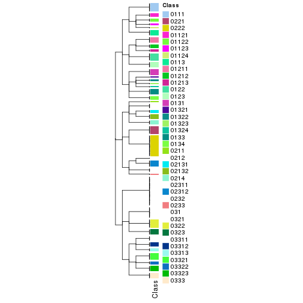</p>

</div>
<div id='tab-collect-classes-from-hierarchical-partition-6'>
<pre><code class="r">collect_classes(res_rh, merge_node = merge_node_param(min_n_signatures = 2615))
</code></pre>

<p></p>

</div>
<div id='tab-collect-classes-from-hierarchical-partition-7'>
<pre><code class="r">collect_classes(res_rh, merge_node = merge_node_param(min_n_signatures = 2929))
</code></pre>

<p></p>

</div>
<div id='tab-collect-classes-from-hierarchical-partition-8'>
<pre><code class="r">collect_classes(res_rh, merge_node = merge_node_param(min_n_signatures = 3167))
</code></pre>

<p></p>

</div>
<div id='tab-collect-classes-from-hierarchical-partition-9'>
<pre><code class="r">collect_classes(res_rh, merge_node = merge_node_param(min_n_signatures = 3264))
</code></pre>

<p></p>

</div>
<div id='tab-collect-classes-from-hierarchical-partition-10'>
<pre><code class="r">collect_classes(res_rh, merge_node = merge_node_param(min_n_signatures = 3632))
</code></pre>

<p></p>

</div>
<div id='tab-collect-classes-from-hierarchical-partition-11'>
<pre><code class="r">collect_classes(res_rh, merge_node = merge_node_param(min_n_signatures = 4378))
</code></pre>

<p></p>

</div>
<div id='tab-collect-classes-from-hierarchical-partition-12'>
<pre><code class="r">collect_classes(res_rh, merge_node = merge_node_param(min_n_signatures = 7050))
</code></pre>

<p></p>

</div>
<div id='tab-collect-classes-from-hierarchical-partition-13'>
<pre><code class="r">collect_classes(res_rh, merge_node = merge_node_param(min_n_signatures = 7299))
</code></pre>

<p></p>

</div>
<div id='tab-collect-classes-from-hierarchical-partition-14'>
<pre><code class="r">collect_classes(res_rh, merge_node = merge_node_param(min_n_signatures = 9518))
</code></pre>

<p></p>

</div>
<div id='tab-collect-classes-from-hierarchical-partition-15'>
<pre><code class="r">collect_classes(res_rh, merge_node = merge_node_param(min_n_signatures = 10747))
</code></pre>

<p></p>

</div>
<div id='tab-collect-classes-from-hierarchical-partition-16'>
<pre><code class="r">collect_classes(res_rh, merge_node = merge_node_param(min_n_signatures = 11356))
</code></pre>

<p></p>

</div>
<div id='tab-collect-classes-from-hierarchical-partition-17'>
<pre><code class="r">collect_classes(res_rh, merge_node = merge_node_param(min_n_signatures = 12363))
</code></pre>

<p></p>

</div>
<div id='tab-collect-classes-from-hierarchical-partition-18'>
<pre><code class="r">collect_classes(res_rh, merge_node = merge_node_param(min_n_signatures = 12451))
</code></pre>

<p></p>

</div>
<div id='tab-collect-classes-from-hierarchical-partition-19'>
<pre><code class="r">collect_classes(res_rh, merge_node = merge_node_param(min_n_signatures = 16943))
</code></pre>

<p></p>

</div>
<div id='tab-collect-classes-from-hierarchical-partition-20'>
<pre><code class="r">collect_classes(res_rh, merge_node = merge_node_param(min_n_signatures = 18153))
</code></pre>

<p></p>

</div>
<div id='tab-collect-classes-from-hierarchical-partition-21'>
<pre><code class="r">collect_classes(res_rh, merge_node = merge_node_param(min_n_signatures = 21477))
</code></pre>

<p></p>

</div>
<div id='tab-collect-classes-from-hierarchical-partition-22'>
<pre><code class="r">collect_classes(res_rh, merge_node = merge_node_param(min_n_signatures = 42283))
</code></pre>

<p></p>

</div>
<div id='tab-collect-classes-from-hierarchical-partition-23'>
<pre><code class="r">collect_classes(res_rh, merge_node = merge_node_param(min_n_signatures = 54159))
</code></pre>

<pre><code>#&gt; Error in max(children_height): invalid &#39;type&#39; (list) of argument
</code></pre>

</div>
</div>

Following shows the table of the partitions (You need to click the **show/hide
code output** link to see it).


<script>
$( function() {
	$( '#tabs-get-classes-from-hierarchical-partition' ).tabs();
} );
</script>
<div id='tabs-get-classes-from-hierarchical-partition'>
<ul>
<li><a href='#tab-get-classes-from-hierarchical-partition-1'>n_signatures ≥ 1210</a></li>
<li><a href='#tab-get-classes-from-hierarchical-partition-2'>n_signatures ≥ 1443</a></li>
<li><a href='#tab-get-classes-from-hierarchical-partition-3'>n_signatures ≥ 1601</a></li>
<li><a href='#tab-get-classes-from-hierarchical-partition-4'>n_signatures ≥ 2275</a></li>
<li><a href='#tab-get-classes-from-hierarchical-partition-5'>n_signatures ≥ 2447</a></li>
<li><a href='#tab-get-classes-from-hierarchical-partition-6'>n_signatures ≥ 2615</a></li>
<li><a href='#tab-get-classes-from-hierarchical-partition-7'>n_signatures ≥ 2929</a></li>
<li><a href='#tab-get-classes-from-hierarchical-partition-8'>n_signatures ≥ 3167</a></li>
<li><a href='#tab-get-classes-from-hierarchical-partition-9'>n_signatures ≥ 3264</a></li>
<li><a href='#tab-get-classes-from-hierarchical-partition-10'>n_signatures ≥ 3632</a></li>
<li><a href='#tab-get-classes-from-hierarchical-partition-11'>n_signatures ≥ 4378</a></li>
<li><a href='#tab-get-classes-from-hierarchical-partition-12'>n_signatures ≥ 7050</a></li>
<li><a href='#tab-get-classes-from-hierarchical-partition-13'>n_signatures ≥ 7299</a></li>
<li><a href='#tab-get-classes-from-hierarchical-partition-14'>n_signatures ≥ 9518</a></li>
<li><a href='#tab-get-classes-from-hierarchical-partition-15'>n_signatures ≥ 10747</a></li>
<li><a href='#tab-get-classes-from-hierarchical-partition-16'>n_signatures ≥ 11356</a></li>
<li><a href='#tab-get-classes-from-hierarchical-partition-17'>n_signatures ≥ 12363</a></li>
<li><a href='#tab-get-classes-from-hierarchical-partition-18'>n_signatures ≥ 12451</a></li>
<li><a href='#tab-get-classes-from-hierarchical-partition-19'>n_signatures ≥ 16943</a></li>
<li><a href='#tab-get-classes-from-hierarchical-partition-20'>n_signatures ≥ 18153</a></li>
<li><a href='#tab-get-classes-from-hierarchical-partition-21'>n_signatures ≥ 21477</a></li>
<li><a href='#tab-get-classes-from-hierarchical-partition-22'>n_signatures ≥ 42283</a></li>
<li><a href='#tab-get-classes-from-hierarchical-partition-23'>n_signatures ≥ 54159</a></li>
</ul>

<div id='tab-get-classes-from-hierarchical-partition-1'>
<p><a id='tab-get-classes-from-hierarchical-partition-1-a' style='color:#0366d6' href='#'>show/hide code output</a></p>
<pre><code class="r">get_classes(res_rh, merge_node = merge_node_param(min_n_signatures = 1210))
</code></pre>

<pre><code>#&gt; TCGA.GD.A3OP.01 TCGA.4Z.AA86.01 TCGA.BL.A13J.11 TCGA.2F.A9KO.01 TCGA.GU.A42Q.01 TCGA.HQ.A5NE.01 
#&gt;         &quot;02211&quot;         &quot;02223&quot;          &quot;0212&quot;           &quot;031&quot;         &quot;02221&quot;           &quot;031&quot; 
#&gt; TCGA.PQ.A6FI.01 TCGA.E5.A2PC.01 TCGA.FD.A3SL.01 TCGA.FD.A5BU.01 TCGA.UY.A9PE.01 TCGA.FD.A3N6.01 
#&gt;           &quot;031&quot;          &quot;0122&quot;          &quot;0322&quot;         &quot;02212&quot;         &quot;03323&quot;          &quot;0133&quot; 
#&gt; TCGA.CU.A3YL.01 TCGA.GV.A3JW.01 TCGA.ZF.A9R3.01 TCGA.E7.A6MF.01 TCGA.FD.A43P.01 TCGA.ZF.AA52.01 
#&gt;          &quot;0322&quot;         &quot;01112&quot;          &quot;0113&quot;          &quot;0211&quot;          &quot;0232&quot;         &quot;03321&quot; 
#&gt; TCGA.E7.A541.01 TCGA.DK.AA6L.01 TCGA.FD.A6TI.01 TCGA.BT.A20W.11 TCGA.XF.A9SZ.01 TCGA.C4.A0EZ.01 
#&gt;          &quot;0321&quot;          &quot;0123&quot;          &quot;0321&quot;          &quot;0214&quot;           &quot;031&quot;          &quot;0323&quot; 
#&gt; TCGA.FD.A3SJ.01 TCGA.ZF.AA56.01 TCGA.XF.AAMH.01 TCGA.FD.A3NA.01 TCGA.DK.A3IK.01 TCGA.ZF.A9RF.01 
#&gt;           &quot;031&quot;           &quot;031&quot;           &quot;031&quot;           &quot;031&quot;           &quot;031&quot;         &quot;03313&quot; 
#&gt; TCGA.UY.A78P.01 TCGA.DK.AA6X.01 TCGA.BT.A3PJ.01 TCGA.K4.A6FZ.01 TCGA.YC.A9TC.01 TCGA.ZF.A9R7.01 
#&gt;         &quot;02132&quot;        &quot;022221&quot;         &quot;03313&quot;         &quot;02312&quot;         &quot;03311&quot;          &quot;0321&quot; 
#&gt; TCGA.GC.A3OO.01 TCGA.DK.A1A7.01 TCGA.BT.A2LB.01 TCGA.GV.A3QF.01 TCGA.ZF.A9R9.01 TCGA.XF.AAN5.01 
#&gt;        &quot;022221&quot;          &quot;0333&quot;         &quot;03323&quot;         &quot;03323&quot;          &quot;0321&quot;         &quot;02312&quot; 
#&gt; TCGA.XF.A8HG.01 TCGA.DK.AA76.01 TCGA.DK.A2I2.01 TCGA.CF.A1HS.01 TCGA.KQ.A41O.01 TCGA.CF.A47T.01 
#&gt;         &quot;01322&quot;          &quot;0122&quot;         &quot;02212&quot;         &quot;02312&quot;          &quot;0123&quot;          &quot;0131&quot; 
#&gt; TCGA.4Z.AA7W.01 TCGA.XF.A8HB.01 TCGA.E7.A97P.01 TCGA.ZF.AA4V.01 TCGA.HQ.A2OE.01 TCGA.XF.A9SI.01 
#&gt;         &quot;02221&quot;          &quot;0321&quot;         &quot;03311&quot;          &quot;0321&quot;         &quot;01212&quot;         &quot;02211&quot; 
#&gt; TCGA.DK.A1AA.01 TCGA.K4.A5RH.01 TCGA.XF.AAN1.01 TCGA.CU.A5W6.01 TCGA.XF.A9SM.01 TCGA.C4.A0F7.01 
#&gt;          &quot;0131&quot;         &quot;02312&quot;         &quot;01121&quot;           &quot;031&quot;         &quot;02221&quot;          &quot;0323&quot; 
#&gt; TCGA.GC.A3RD.01 TCGA.4Z.AA7S.01 TCGA.DK.A1AE.01 TCGA.GC.A3BM.11 TCGA.4Z.AA7Q.01 TCGA.DK.AA6S.01 
#&gt;          &quot;0134&quot;         &quot;01121&quot;          &quot;0133&quot;          &quot;0214&quot;           &quot;031&quot;         &quot;03323&quot; 
#&gt; TCGA.XF.A8HD.01 TCGA.DK.A3IU.01 TCGA.KQ.A41S.01 TCGA.4Z.AA7O.01 TCGA.E7.A7XN.01 TCGA.G2.AA3B.01 
#&gt;          &quot;0322&quot;         &quot;02223&quot;          &quot;0322&quot;          &quot;0131&quot;         &quot;02221&quot;         &quot;01324&quot; 
#&gt; TCGA.K4.A5RI.11 TCGA.UY.A78O.01 TCGA.XF.AAMW.01 TCGA.BT.A0YX.01 TCGA.FD.A6TC.01 TCGA.GC.A3I6.01 
#&gt;         &quot;02132&quot;         &quot;01121&quot;         &quot;03311&quot;           &quot;031&quot;         &quot;03323&quot;          &quot;0321&quot; 
#&gt; TCGA.XF.A9SK.01 TCGA.CF.A5U8.01 TCGA.GU.AATP.01 TCGA.K4.A3WV.11 TCGA.BT.A20T.01 TCGA.FD.A62O.01 
#&gt;         &quot;03321&quot;         &quot;01112&quot;           &quot;031&quot;          &quot;0214&quot;          &quot;0333&quot;         &quot;01121&quot; 
#&gt; TCGA.MV.A51V.01 TCGA.UY.A9PH.01 TCGA.FD.A3B3.01 TCGA.FD.A6TF.01 TCGA.UY.A78K.01 TCGA.BT.A20W.01 
#&gt;         &quot;01213&quot;           &quot;031&quot;         &quot;02212&quot;         &quot;02211&quot;         &quot;03323&quot;          &quot;0333&quot; 
#&gt; TCGA.E7.A7DV.01 TCGA.DK.A2I6.01 TCGA.GD.A3OQ.11 TCGA.BT.A20R.01 TCGA.FJ.A3ZF.01 TCGA.4Z.AA87.01 
#&gt;           &quot;031&quot;         &quot;01213&quot;          &quot;0214&quot;           &quot;031&quot;         &quot;01211&quot;         &quot;01211&quot; 
#&gt; TCGA.E7.A6MD.01 TCGA.XF.A9SV.01 TCGA.GV.A3JX.01 TCGA.ZF.A9RC.01 TCGA.FD.A43Y.01 TCGA.GU.A767.01 
#&gt;         &quot;03321&quot;         &quot;01121&quot;         &quot;01122&quot;           &quot;031&quot;         &quot;02223&quot;          &quot;0232&quot; 
#&gt; TCGA.UY.A9PD.01 TCGA.DK.A6B2.01 TCGA.CU.A0YN.11 TCGA.YC.A8S6.01 TCGA.DK.A6B6.01 TCGA.DK.AA6M.01 
#&gt;         &quot;01211&quot;           &quot;031&quot;          &quot;0212&quot;        &quot;022221&quot;          &quot;0333&quot;          &quot;0322&quot; 
#&gt; TCGA.GU.A763.01 TCGA.DK.A3IN.01 TCGA.E7.A5KF.01 TCGA.CU.A0YO.01 TCGA.XF.A9T3.01 TCGA.CF.A47Y.01 
#&gt;          &quot;0131&quot;           &quot;031&quot;         &quot;01112&quot;        &quot;022221&quot;           &quot;031&quot;           &quot;031&quot; 
#&gt; TCGA.4Z.AA83.01 TCGA.CU.A72E.01 TCGA.XF.A9T5.01 TCGA.G2.A2EL.01 TCGA.BT.A3PH.01 TCGA.BL.A13J.01 
#&gt;          &quot;0113&quot;          &quot;0122&quot;         &quot;02312&quot;         &quot;01211&quot;          &quot;0123&quot;          &quot;0322&quot; 
#&gt; TCGA.FD.A62P.01 TCGA.FD.A6TH.01 TCGA.2F.A9KR.01 TCGA.DK.AA74.01 TCGA.BT.A20U.11 TCGA.GD.A2C5.01 
#&gt;         &quot;02223&quot;         &quot;01124&quot;          &quot;0133&quot;         &quot;02223&quot;         &quot;02211&quot;         &quot;03323&quot; 
#&gt; TCGA.ZF.AA4U.01 TCGA.XF.A9SP.01 TCGA.FD.A3SR.01 TCGA.G2.A2EO.01 TCGA.ZF.AA5N.01 TCGA.K4.A83P.01 
#&gt;          &quot;0122&quot;           &quot;031&quot;         &quot;03321&quot;          &quot;0322&quot;          &quot;0321&quot;         &quot;02131&quot; 
#&gt; TCGA.ZF.A9RE.01 TCGA.XF.AAN8.01 TCGA.DK.A6B0.01 TCGA.BT.A20N.01 TCGA.ZF.AA5H.01 TCGA.G2.A2EJ.01 
#&gt;          &quot;0122&quot;         &quot;02132&quot;           &quot;031&quot;          &quot;0322&quot;         &quot;03313&quot;         &quot;03311&quot; 
#&gt; TCGA.GC.A3RB.01 TCGA.BT.A42F.01 TCGA.FD.A3SN.01 TCGA.FT.A61P.01 TCGA.G2.A2EF.01 TCGA.XF.AAMF.01 
#&gt;         &quot;01212&quot;         &quot;02221&quot;          &quot;0321&quot;         &quot;02312&quot;         &quot;03312&quot;         &quot;01124&quot; 
#&gt; TCGA.BT.A20J.11 TCGA.FD.A5BS.01 TCGA.CF.A3MH.01 TCGA.GV.A3QK.01 TCGA.LT.A5Z6.01 TCGA.DK.A1AD.01 
#&gt;          &quot;0212&quot;         &quot;02131&quot;         &quot;01111&quot;          &quot;0322&quot;          &quot;0323&quot;         &quot;01211&quot; 
#&gt; TCGA.CF.A8HX.01 TCGA.C4.A0F6.01 TCGA.XF.AAMQ.01 TCGA.XF.A9SX.01 TCGA.FD.A5C1.01 TCGA.XF.A8HH.01 
#&gt;         &quot;01322&quot;          &quot;0123&quot;         &quot;01123&quot;         &quot;02312&quot;         &quot;03312&quot;         &quot;03322&quot; 
#&gt; TCGA.DK.A3IQ.01 TCGA.CF.A27C.01 TCGA.LC.A66R.01 TCGA.FD.A3B8.01 TCGA.BL.A0C8.01 TCGA.G2.A3VY.01 
#&gt;        &quot;022221&quot;          &quot;0131&quot;         &quot;03312&quot;         &quot;02131&quot;         &quot;01323&quot;         &quot;01213&quot; 
#&gt; TCGA.BT.A2LA.01 TCGA.ZF.AA54.01 TCGA.DK.AA6R.01 TCGA.YF.AA3M.01 TCGA.UY.A78N.01 TCGA.FT.A3EE.01 
#&gt;           &quot;031&quot;           &quot;031&quot;           &quot;031&quot;          &quot;0134&quot;         &quot;01123&quot;         &quot;03322&quot; 
#&gt; TCGA.FD.A3B7.01 TCGA.ZF.AA4T.01 TCGA.2F.A9KW.01 TCGA.ZF.A9R1.01 TCGA.CF.A47S.01 TCGA.DK.A1AB.01 
#&gt;         &quot;02221&quot;           &quot;031&quot;           &quot;031&quot;          &quot;0333&quot;          &quot;0333&quot;         &quot;02211&quot; 
#&gt; TCGA.G2.AA3F.01 TCGA.K4.A3WU.01 TCGA.K4.A6MB.01 TCGA.FD.A62N.01 TCGA.E7.A3X6.01 TCGA.XF.AAN7.01 
#&gt;         &quot;01121&quot;        &quot;022221&quot;         &quot;01212&quot;         &quot;02223&quot;         &quot;03321&quot;          &quot;0123&quot; 
#&gt; TCGA.FD.A6TG.01 TCGA.UY.A9PB.01 TCGA.CF.A47V.01 TCGA.KQ.A41R.01 TCGA.XF.A9ST.01 TCGA.ZF.AA4X.01 
#&gt;         &quot;03323&quot;         &quot;02221&quot;          &quot;0322&quot;          &quot;0123&quot;          &quot;0233&quot;          &quot;0322&quot; 
#&gt; TCGA.FD.A5BZ.01 TCGA.GC.A3BM.01 TCGA.UY.A9PF.01 TCGA.CF.A7I0.01 TCGA.E7.A4IJ.01 TCGA.FD.A5BV.01 
#&gt;           &quot;031&quot;          &quot;0131&quot;           &quot;031&quot;          &quot;0122&quot;         &quot;01212&quot;          &quot;0123&quot; 
#&gt; TCGA.DK.A3IL.01 TCGA.FD.A43X.01 TCGA.GU.A766.01 TCGA.FD.A6TB.01 TCGA.DK.A1A5.01 TCGA.UY.A78L.01 
#&gt;         &quot;01123&quot;          &quot;0131&quot;         &quot;02223&quot;         &quot;02223&quot;          &quot;0321&quot;         &quot;03313&quot; 
#&gt; TCGA.FD.A6TA.01 TCGA.GU.A762.01 TCGA.K4.A3WS.01 TCGA.DK.A3X1.01 TCGA.XF.AAME.01 TCGA.XF.A9T8.01 
#&gt;         &quot;03321&quot;         &quot;02312&quot;          &quot;0232&quot;           &quot;031&quot;         &quot;02132&quot;         &quot;02221&quot; 
#&gt; TCGA.YC.A89H.01 TCGA.4Z.AA7Y.01 TCGA.KQ.A41Q.01 TCGA.G2.AA3D.01 TCGA.XF.AAMY.01 TCGA.4Z.AA81.01 
#&gt;         &quot;03322&quot;          &quot;0113&quot;         &quot;01323&quot;        &quot;022222&quot;           &quot;031&quot;          &quot;0321&quot; 
#&gt; TCGA.GU.AATQ.01 TCGA.FD.A6TE.01 TCGA.CF.A3MG.01 TCGA.UY.A8OC.01 TCGA.UY.A8OB.01 TCGA.K4.A5RJ.01 
#&gt;          &quot;0122&quot;         &quot;01122&quot;         &quot;01111&quot;          &quot;0321&quot;          &quot;0123&quot;         &quot;02312&quot; 
#&gt; TCGA.GD.A3OQ.01 TCGA.ZF.A9RG.01 TCGA.CF.A47X.01 TCGA.BT.A20Q.01 TCGA.FD.A5C0.01 TCGA.ZF.A9R4.01 
#&gt;          &quot;0113&quot;         &quot;02211&quot;          &quot;0131&quot;          &quot;0333&quot;          &quot;0232&quot;          &quot;0113&quot; 
#&gt; TCGA.FD.A3SS.01 TCGA.FJ.A3ZE.01 TCGA.ZF.A9RD.01 TCGA.E7.A6ME.01 TCGA.BT.A20O.01 TCGA.G2.A2EK.01 
#&gt;          &quot;0322&quot;         &quot;01112&quot;         &quot;02312&quot;         &quot;03321&quot;         &quot;02221&quot;           &quot;031&quot; 
#&gt; TCGA.DK.AA75.01 TCGA.GV.A3JZ.01 TCGA.FD.A3SO.01 TCGA.FD.A43S.01 TCGA.SY.A9G5.01 TCGA.4Z.AA89.01 
#&gt;         &quot;01211&quot;         &quot;01213&quot;         &quot;02312&quot;         &quot;02132&quot;         &quot;03312&quot;         &quot;01112&quot; 
#&gt; TCGA.XF.A8HE.01 TCGA.GC.A3WC.01 TCGA.ZF.A9RM.01 TCGA.FD.A5BR.01 TCGA.G2.A2EC.01 TCGA.XF.A9T4.01 
#&gt;         &quot;02221&quot;         &quot;02212&quot;          &quot;0333&quot;         &quot;03321&quot;          &quot;0322&quot;          &quot;0321&quot; 
#&gt; TCGA.FD.A62S.01 TCGA.DK.A6B5.01 TCGA.ZF.AA51.01 TCGA.XF.A9SY.01 TCGA.GD.A6C6.01 TCGA.XF.A8HI.01 
#&gt;           &quot;031&quot;           &quot;031&quot;         &quot;03322&quot;         &quot;02211&quot;          &quot;0134&quot;         &quot;01112&quot; 
#&gt; TCGA.2F.A9KQ.01 TCGA.G2.A3IB.01 TCGA.GD.A2C5.11 TCGA.CU.A0YR.01 TCGA.BT.A42B.01 TCGA.CU.A3KJ.01 
#&gt;          &quot;0122&quot;          &quot;0133&quot;         &quot;02212&quot;          &quot;0232&quot;          &quot;0321&quot;          &quot;0133&quot; 
#&gt; TCGA.DK.A3WW.01 TCGA.YF.AA3L.01 TCGA.GV.A40E.01 TCGA.DK.A1A6.01 TCGA.DK.A1A6.06 TCGA.4Z.AA7N.01 
#&gt;         &quot;03311&quot;         &quot;01123&quot;           &quot;031&quot;         &quot;01121&quot;         &quot;03323&quot;         &quot;02131&quot; 
#&gt; TCGA.DK.A2I1.01 TCGA.K4.A4AB.01 TCGA.DK.A2HX.01 TCGA.K4.A54R.11 TCGA.4Z.AA7M.01 TCGA.BL.A3JM.01 
#&gt;           &quot;031&quot;          &quot;0122&quot;          &quot;0323&quot;          &quot;0214&quot;         &quot;01211&quot;          &quot;0322&quot; 
#&gt; TCGA.XF.A9SU.01 TCGA.GD.A76B.01 TCGA.BT.A20J.01 TCGA.DK.AA71.01 TCGA.DK.A3WY.01 TCGA.GC.A3RC.01 
#&gt;           &quot;031&quot;         &quot;03323&quot;         &quot;03321&quot;          &quot;0323&quot;         &quot;02132&quot;          &quot;0321&quot; 
#&gt; TCGA.ZF.AA53.01 TCGA.CF.A9FF.01 TCGA.LT.A8JT.01 TCGA.GC.A3YS.01 TCGA.XF.AAML.01 TCGA.CF.A47W.01 
#&gt;         &quot;02221&quot;          &quot;0113&quot;         &quot;01322&quot;         &quot;03312&quot;         &quot;01122&quot;           &quot;031&quot; 
#&gt; TCGA.DK.A1AF.01 TCGA.XF.AAN3.01 TCGA.5N.A9KM.01 TCGA.XF.AAN2.01 TCGA.BT.A20P.11 TCGA.DK.A3IV.01 
#&gt;         &quot;02132&quot;          &quot;0321&quot;         &quot;01324&quot;          &quot;0322&quot;          &quot;0212&quot;         &quot;03321&quot; 
#&gt; TCGA.BT.A2LA.11 TCGA.4Z.AA7R.01 TCGA.XF.A9SJ.01 TCGA.C4.A0F0.01 TCGA.DK.AA6T.01 TCGA.ZF.AA58.01 
#&gt;          &quot;0214&quot;         &quot;01211&quot;          &quot;0322&quot;           &quot;031&quot;         &quot;02223&quot;         &quot;02211&quot; 
#&gt; TCGA.ZF.AA4R.01 TCGA.DK.A3IS.01 TCGA.FD.A3SQ.01 TCGA.K4.AAQO.01 TCGA.GC.A6I3.01 TCGA.XF.AAMT.01 
#&gt;          &quot;0323&quot;          &quot;0122&quot;         &quot;03321&quot;           &quot;031&quot;           &quot;031&quot;           &quot;031&quot; 
#&gt; TCGA.BT.A20X.11 TCGA.GC.A6I3.11 TCGA.XF.AAN4.01 TCGA.DK.A3IM.01 TCGA.DK.AA6P.01 TCGA.E5.A4TZ.01 
#&gt;          &quot;0212&quot;         &quot;02211&quot;         &quot;02132&quot;         &quot;03311&quot;          &quot;0133&quot;          &quot;0122&quot; 
#&gt; TCGA.GD.A3OP.11 TCGA.E7.A7PW.01 TCGA.S5.A6DX.01 TCGA.GV.A6ZA.01 TCGA.FD.A43N.01 TCGA.FD.A3B5.01 
#&gt;          &quot;0214&quot;         &quot;01122&quot;         &quot;03321&quot;          &quot;0122&quot;         &quot;01211&quot;          &quot;0133&quot; 
#&gt; TCGA.4Z.AA80.01 TCGA.CF.A3MF.01 TCGA.ZF.A9R0.01 TCGA.XF.AAMJ.01 TCGA.BT.A0S7.01 TCGA.BT.A42E.01 
#&gt;         &quot;01211&quot;          &quot;0113&quot;         &quot;03323&quot;        &quot;022221&quot;           &quot;031&quot;          &quot;0321&quot; 
#&gt; TCGA.XF.AAMZ.01 TCGA.BT.A20V.11 TCGA.E7.A7DU.01 TCGA.GU.A42R.01 TCGA.FD.A3SM.01 TCGA.ZF.AA4N.01 
#&gt;          &quot;0232&quot;          &quot;0214&quot;         &quot;01112&quot;          &quot;0333&quot;           &quot;031&quot;         &quot;03311&quot; 
#&gt; TCGA.CF.A1HR.01 TCGA.FD.A5BT.01 TCGA.DK.A6B1.01 TCGA.FD.A5BY.01 TCGA.5N.A9KI.01 TCGA.GV.A3QH.01 
#&gt;         &quot;03321&quot;         &quot;02223&quot;         &quot;01321&quot;          &quot;0321&quot;         &quot;01323&quot;           &quot;031&quot; 
#&gt; TCGA.CF.A9FL.01 TCGA.S5.AA26.01 TCGA.BL.A5ZZ.01 TCGA.E5.A4U1.01 TCGA.PQ.A6FN.01 TCGA.E7.A5KE.01 
#&gt;          &quot;0122&quot;          &quot;0131&quot;           &quot;031&quot;          &quot;0134&quot;         &quot;02211&quot;          &quot;0123&quot; 
#&gt; TCGA.GV.A40G.01 TCGA.CF.A8HY.01 TCGA.CF.A3MI.01 TCGA.ZF.A9RL.01 TCGA.HQ.A5ND.01 TCGA.BT.A20U.01 
#&gt;         &quot;01122&quot;         &quot;01112&quot;         &quot;01111&quot;          &quot;0113&quot;          &quot;0133&quot;         &quot;02312&quot; 
#&gt; TCGA.G2.A3IE.01 TCGA.BT.A42C.01 TCGA.E7.A8O8.01 TCGA.UY.A8OD.01 TCGA.SY.A9G0.01 TCGA.XF.A9T0.01 
#&gt;           &quot;031&quot;          &quot;0134&quot;         &quot;01322&quot;         &quot;03322&quot;        &quot;022221&quot;         &quot;01212&quot; 
#&gt; TCGA.DK.A1A3.01 TCGA.H4.A2HO.01 TCGA.DK.A6AW.01 TCGA.ZF.A9R5.01 TCGA.4Z.AA84.01 TCGA.XF.A9SG.01 
#&gt;           &quot;031&quot;           &quot;031&quot;          &quot;0113&quot;         &quot;01112&quot;         &quot;03312&quot;           &quot;031&quot; 
#&gt; TCGA.2F.A9KP.01 TCGA.GU.A42P.01 TCGA.KQ.A41N.01 TCGA.GC.A4ZW.01 TCGA.ZF.A9R2.01 TCGA.K4.A4AC.01 
#&gt;         &quot;01324&quot;         &quot;01211&quot;          &quot;0122&quot;          &quot;0323&quot;          &quot;0131&quot;         &quot;02221&quot; 
#&gt; TCGA.XF.A8HC.01 TCGA.FD.A43U.01 TCGA.BT.A2LD.01 TCGA.GV.A3JV.01 TCGA.DK.A1AC.01 TCGA.GC.A3WC.11 
#&gt;         &quot;01122&quot;         &quot;02223&quot;           &quot;031&quot;          &quot;0321&quot;           &quot;031&quot;          &quot;0212&quot; 
#&gt; TCGA.DK.A3WX.01 TCGA.E7.A85H.01 TCGA.XF.AAMG.01 TCGA.GU.A764.01 TCGA.XF.A9T6.01 TCGA.G2.A2ES.01 
#&gt;         &quot;02132&quot;          &quot;0233&quot;         &quot;01212&quot;         &quot;02223&quot;         &quot;01124&quot;          &quot;0321&quot; 
#&gt; TCGA.DK.A2I4.01 TCGA.HQ.A2OF.01 TCGA.GU.AATO.01 TCGA.DK.A1AG.01 TCGA.E7.A3Y1.01 TCGA.CU.A0YR.11 
#&gt;         &quot;02223&quot;          &quot;0323&quot;          &quot;0323&quot;         &quot;01112&quot;          &quot;0131&quot;          &quot;0212&quot; 
#&gt; TCGA.XF.A8HF.01 TCGA.CU.A3QU.01 TCGA.KQ.A41P.01 TCGA.XF.A9T2.01 TCGA.BL.A13I.01 TCGA.GD.A3OS.01 
#&gt;          &quot;0123&quot;         &quot;01321&quot;         &quot;01212&quot;         &quot;01111&quot;         &quot;02212&quot;         &quot;02311&quot; 
#&gt; TCGA.FD.A6TK.01 TCGA.BT.A3PK.01 TCGA.DK.AA6U.01 TCGA.UY.A78M.01 TCGA.C4.A0F1.01 TCGA.E7.A8O7.01 
#&gt;         &quot;02223&quot;         &quot;02221&quot;         &quot;01211&quot;          &quot;0134&quot;           &quot;031&quot;          &quot;0333&quot; 
#&gt; TCGA.DK.AA6Q.01 TCGA.GV.A3QG.01 TCGA.H4.A2HQ.01 TCGA.E7.A4XJ.01 TCGA.E7.A678.01 TCGA.K4.A54R.01 
#&gt;          &quot;0321&quot;         &quot;03313&quot;          &quot;0122&quot;         &quot;01121&quot;         &quot;01112&quot;          &quot;0322&quot; 
#&gt; TCGA.FD.A6TD.01 TCGA.K4.A5RI.01 TCGA.DK.AA77.01 TCGA.E7.A97Q.01 TCGA.2F.A9KT.01 TCGA.XF.A9SW.01 
#&gt;         &quot;03312&quot;          &quot;0133&quot;          &quot;0131&quot;          &quot;0134&quot;           &quot;031&quot;        &quot;022221&quot; 
#&gt; TCGA.DK.A6AV.01 TCGA.K4.A3WV.01 TCGA.XF.AAMX.01 TCGA.XF.A9SH.01 TCGA.FD.A3B4.01 TCGA.XF.AAN0.01 
#&gt;         &quot;03322&quot;           &quot;031&quot;          &quot;0123&quot;         &quot;01112&quot;         &quot;02312&quot;          &quot;0232&quot; 
#&gt; TCGA.BT.A20P.01 TCGA.ZF.AA4W.01 TCGA.UY.A9PA.01 TCGA.DK.A3IT.01 TCGA.FJ.A871.01 TCGA.DK.AA6W.01 
#&gt;          &quot;0323&quot;         &quot;02221&quot;        &quot;022222&quot;         &quot;03321&quot;         &quot;02311&quot;           &quot;031&quot; 
#&gt; TCGA.XF.A9SL.01 TCGA.CF.A5UA.01 TCGA.FD.A3N5.01 TCGA.BT.A20R.11 TCGA.R3.A69X.01 TCGA.DK.A3X2.01 
#&gt;         &quot;02131&quot;          &quot;0233&quot;          &quot;0321&quot;          &quot;0212&quot;        &quot;022221&quot;          &quot;0133&quot; 
#&gt; TCGA.ZF.A9RN.01 TCGA.FJ.A3Z9.01 TCGA.E7.A677.01 TCGA.E7.A519.01 TCGA.CF.A9FM.01 TCGA.XF.AAMR.01 
#&gt;          &quot;0133&quot;         &quot;01111&quot;          &quot;0113&quot;        &quot;022222&quot;          &quot;0211&quot;        &quot;022221&quot; 
#&gt; TCGA.BT.A20X.01 TCGA.G2.AA3C.01 TCGA.BT.A20N.11 TCGA.CU.A0YN.01 TCGA.FJ.A3Z7.01 TCGA.CF.A9FH.01 
#&gt;           &quot;031&quot;           &quot;031&quot;          &quot;0212&quot;         &quot;03312&quot;          &quot;0333&quot;          &quot;0113&quot; 
#&gt; TCGA.GV.A3QI.01 TCGA.4Z.AA82.01 TCGA.GC.A6I1.01 TCGA.FD.A5BX.01 TCGA.FD.A3B6.01 TCGA.ZF.AA5P.01 
#&gt;          &quot;0323&quot;         &quot;03311&quot;         &quot;03312&quot;           &quot;031&quot;         &quot;03313&quot;         &quot;02131&quot; 
#&gt; TCGA.BT.A20V.01 TCGA.FD.A3SP.01 
#&gt;         &quot;03311&quot;         &quot;02223&quot;
</code></pre>

<script>
$('#tab-get-classes-from-hierarchical-partition-1-a').parent().next().next().hide();
$('#tab-get-classes-from-hierarchical-partition-1-a').click(function(){
  $('#tab-get-classes-from-hierarchical-partition-1-a').parent().next().next().toggle();
  return(false);
});
</script>
</div>

<div id='tab-get-classes-from-hierarchical-partition-2'>
<p><a id='tab-get-classes-from-hierarchical-partition-2-a' style='color:#0366d6' href='#'>show/hide code output</a></p>
<pre><code class="r">get_classes(res_rh, merge_node = merge_node_param(min_n_signatures = 1443))
</code></pre>

<pre><code>#&gt; TCGA.GD.A3OP.01 TCGA.4Z.AA86.01 TCGA.BL.A13J.11 TCGA.2F.A9KO.01 TCGA.GU.A42Q.01 TCGA.HQ.A5NE.01 
#&gt;          &quot;0221&quot;         &quot;02223&quot;          &quot;0212&quot;           &quot;031&quot;         &quot;02221&quot;           &quot;031&quot; 
#&gt; TCGA.PQ.A6FI.01 TCGA.E5.A2PC.01 TCGA.FD.A3SL.01 TCGA.FD.A5BU.01 TCGA.UY.A9PE.01 TCGA.FD.A3N6.01 
#&gt;           &quot;031&quot;          &quot;0122&quot;          &quot;0322&quot;          &quot;0221&quot;         &quot;03323&quot;          &quot;0133&quot; 
#&gt; TCGA.CU.A3YL.01 TCGA.GV.A3JW.01 TCGA.ZF.A9R3.01 TCGA.E7.A6MF.01 TCGA.FD.A43P.01 TCGA.ZF.AA52.01 
#&gt;          &quot;0322&quot;         &quot;01112&quot;          &quot;0113&quot;          &quot;0211&quot;          &quot;0232&quot;         &quot;03321&quot; 
#&gt; TCGA.E7.A541.01 TCGA.DK.AA6L.01 TCGA.FD.A6TI.01 TCGA.BT.A20W.11 TCGA.XF.A9SZ.01 TCGA.C4.A0EZ.01 
#&gt;          &quot;0321&quot;          &quot;0123&quot;          &quot;0321&quot;          &quot;0214&quot;           &quot;031&quot;          &quot;0323&quot; 
#&gt; TCGA.FD.A3SJ.01 TCGA.ZF.AA56.01 TCGA.XF.AAMH.01 TCGA.FD.A3NA.01 TCGA.DK.A3IK.01 TCGA.ZF.A9RF.01 
#&gt;           &quot;031&quot;           &quot;031&quot;           &quot;031&quot;           &quot;031&quot;           &quot;031&quot;         &quot;03313&quot; 
#&gt; TCGA.UY.A78P.01 TCGA.DK.AA6X.01 TCGA.BT.A3PJ.01 TCGA.K4.A6FZ.01 TCGA.YC.A9TC.01 TCGA.ZF.A9R7.01 
#&gt;         &quot;02132&quot;        &quot;022221&quot;         &quot;03313&quot;         &quot;02312&quot;         &quot;03311&quot;          &quot;0321&quot; 
#&gt; TCGA.GC.A3OO.01 TCGA.DK.A1A7.01 TCGA.BT.A2LB.01 TCGA.GV.A3QF.01 TCGA.ZF.A9R9.01 TCGA.XF.AAN5.01 
#&gt;        &quot;022221&quot;          &quot;0333&quot;         &quot;03323&quot;         &quot;03323&quot;          &quot;0321&quot;         &quot;02312&quot; 
#&gt; TCGA.XF.A8HG.01 TCGA.DK.AA76.01 TCGA.DK.A2I2.01 TCGA.CF.A1HS.01 TCGA.KQ.A41O.01 TCGA.CF.A47T.01 
#&gt;         &quot;01322&quot;          &quot;0122&quot;          &quot;0221&quot;         &quot;02312&quot;          &quot;0123&quot;          &quot;0131&quot; 
#&gt; TCGA.4Z.AA7W.01 TCGA.XF.A8HB.01 TCGA.E7.A97P.01 TCGA.ZF.AA4V.01 TCGA.HQ.A2OE.01 TCGA.XF.A9SI.01 
#&gt;         &quot;02221&quot;          &quot;0321&quot;         &quot;03311&quot;          &quot;0321&quot;         &quot;01212&quot;          &quot;0221&quot; 
#&gt; TCGA.DK.A1AA.01 TCGA.K4.A5RH.01 TCGA.XF.AAN1.01 TCGA.CU.A5W6.01 TCGA.XF.A9SM.01 TCGA.C4.A0F7.01 
#&gt;          &quot;0131&quot;         &quot;02312&quot;         &quot;01121&quot;           &quot;031&quot;         &quot;02221&quot;          &quot;0323&quot; 
#&gt; TCGA.GC.A3RD.01 TCGA.4Z.AA7S.01 TCGA.DK.A1AE.01 TCGA.GC.A3BM.11 TCGA.4Z.AA7Q.01 TCGA.DK.AA6S.01 
#&gt;          &quot;0134&quot;         &quot;01121&quot;          &quot;0133&quot;          &quot;0214&quot;           &quot;031&quot;         &quot;03323&quot; 
#&gt; TCGA.XF.A8HD.01 TCGA.DK.A3IU.01 TCGA.KQ.A41S.01 TCGA.4Z.AA7O.01 TCGA.E7.A7XN.01 TCGA.G2.AA3B.01 
#&gt;          &quot;0322&quot;         &quot;02223&quot;          &quot;0322&quot;          &quot;0131&quot;         &quot;02221&quot;         &quot;01324&quot; 
#&gt; TCGA.K4.A5RI.11 TCGA.UY.A78O.01 TCGA.XF.AAMW.01 TCGA.BT.A0YX.01 TCGA.FD.A6TC.01 TCGA.GC.A3I6.01 
#&gt;         &quot;02132&quot;         &quot;01121&quot;         &quot;03311&quot;           &quot;031&quot;         &quot;03323&quot;          &quot;0321&quot; 
#&gt; TCGA.XF.A9SK.01 TCGA.CF.A5U8.01 TCGA.GU.AATP.01 TCGA.K4.A3WV.11 TCGA.BT.A20T.01 TCGA.FD.A62O.01 
#&gt;         &quot;03321&quot;         &quot;01112&quot;           &quot;031&quot;          &quot;0214&quot;          &quot;0333&quot;         &quot;01121&quot; 
#&gt; TCGA.MV.A51V.01 TCGA.UY.A9PH.01 TCGA.FD.A3B3.01 TCGA.FD.A6TF.01 TCGA.UY.A78K.01 TCGA.BT.A20W.01 
#&gt;         &quot;01213&quot;           &quot;031&quot;          &quot;0221&quot;          &quot;0221&quot;         &quot;03323&quot;          &quot;0333&quot; 
#&gt; TCGA.E7.A7DV.01 TCGA.DK.A2I6.01 TCGA.GD.A3OQ.11 TCGA.BT.A20R.01 TCGA.FJ.A3ZF.01 TCGA.4Z.AA87.01 
#&gt;           &quot;031&quot;         &quot;01213&quot;          &quot;0214&quot;           &quot;031&quot;         &quot;01211&quot;         &quot;01211&quot; 
#&gt; TCGA.E7.A6MD.01 TCGA.XF.A9SV.01 TCGA.GV.A3JX.01 TCGA.ZF.A9RC.01 TCGA.FD.A43Y.01 TCGA.GU.A767.01 
#&gt;         &quot;03321&quot;         &quot;01121&quot;         &quot;01122&quot;           &quot;031&quot;         &quot;02223&quot;          &quot;0232&quot; 
#&gt; TCGA.UY.A9PD.01 TCGA.DK.A6B2.01 TCGA.CU.A0YN.11 TCGA.YC.A8S6.01 TCGA.DK.A6B6.01 TCGA.DK.AA6M.01 
#&gt;         &quot;01211&quot;           &quot;031&quot;          &quot;0212&quot;        &quot;022221&quot;          &quot;0333&quot;          &quot;0322&quot; 
#&gt; TCGA.GU.A763.01 TCGA.DK.A3IN.01 TCGA.E7.A5KF.01 TCGA.CU.A0YO.01 TCGA.XF.A9T3.01 TCGA.CF.A47Y.01 
#&gt;          &quot;0131&quot;           &quot;031&quot;         &quot;01112&quot;        &quot;022221&quot;           &quot;031&quot;           &quot;031&quot; 
#&gt; TCGA.4Z.AA83.01 TCGA.CU.A72E.01 TCGA.XF.A9T5.01 TCGA.G2.A2EL.01 TCGA.BT.A3PH.01 TCGA.BL.A13J.01 
#&gt;          &quot;0113&quot;          &quot;0122&quot;         &quot;02312&quot;         &quot;01211&quot;          &quot;0123&quot;          &quot;0322&quot; 
#&gt; TCGA.FD.A62P.01 TCGA.FD.A6TH.01 TCGA.2F.A9KR.01 TCGA.DK.AA74.01 TCGA.BT.A20U.11 TCGA.GD.A2C5.01 
#&gt;         &quot;02223&quot;         &quot;01124&quot;          &quot;0133&quot;         &quot;02223&quot;          &quot;0221&quot;         &quot;03323&quot; 
#&gt; TCGA.ZF.AA4U.01 TCGA.XF.A9SP.01 TCGA.FD.A3SR.01 TCGA.G2.A2EO.01 TCGA.ZF.AA5N.01 TCGA.K4.A83P.01 
#&gt;          &quot;0122&quot;           &quot;031&quot;         &quot;03321&quot;          &quot;0322&quot;          &quot;0321&quot;         &quot;02131&quot; 
#&gt; TCGA.ZF.A9RE.01 TCGA.XF.AAN8.01 TCGA.DK.A6B0.01 TCGA.BT.A20N.01 TCGA.ZF.AA5H.01 TCGA.G2.A2EJ.01 
#&gt;          &quot;0122&quot;         &quot;02132&quot;           &quot;031&quot;          &quot;0322&quot;         &quot;03313&quot;         &quot;03311&quot; 
#&gt; TCGA.GC.A3RB.01 TCGA.BT.A42F.01 TCGA.FD.A3SN.01 TCGA.FT.A61P.01 TCGA.G2.A2EF.01 TCGA.XF.AAMF.01 
#&gt;         &quot;01212&quot;         &quot;02221&quot;          &quot;0321&quot;         &quot;02312&quot;         &quot;03312&quot;         &quot;01124&quot; 
#&gt; TCGA.BT.A20J.11 TCGA.FD.A5BS.01 TCGA.CF.A3MH.01 TCGA.GV.A3QK.01 TCGA.LT.A5Z6.01 TCGA.DK.A1AD.01 
#&gt;          &quot;0212&quot;         &quot;02131&quot;         &quot;01111&quot;          &quot;0322&quot;          &quot;0323&quot;         &quot;01211&quot; 
#&gt; TCGA.CF.A8HX.01 TCGA.C4.A0F6.01 TCGA.XF.AAMQ.01 TCGA.XF.A9SX.01 TCGA.FD.A5C1.01 TCGA.XF.A8HH.01 
#&gt;         &quot;01322&quot;          &quot;0123&quot;         &quot;01123&quot;         &quot;02312&quot;         &quot;03312&quot;         &quot;03322&quot; 
#&gt; TCGA.DK.A3IQ.01 TCGA.CF.A27C.01 TCGA.LC.A66R.01 TCGA.FD.A3B8.01 TCGA.BL.A0C8.01 TCGA.G2.A3VY.01 
#&gt;        &quot;022221&quot;          &quot;0131&quot;         &quot;03312&quot;         &quot;02131&quot;         &quot;01323&quot;         &quot;01213&quot; 
#&gt; TCGA.BT.A2LA.01 TCGA.ZF.AA54.01 TCGA.DK.AA6R.01 TCGA.YF.AA3M.01 TCGA.UY.A78N.01 TCGA.FT.A3EE.01 
#&gt;           &quot;031&quot;           &quot;031&quot;           &quot;031&quot;          &quot;0134&quot;         &quot;01123&quot;         &quot;03322&quot; 
#&gt; TCGA.FD.A3B7.01 TCGA.ZF.AA4T.01 TCGA.2F.A9KW.01 TCGA.ZF.A9R1.01 TCGA.CF.A47S.01 TCGA.DK.A1AB.01 
#&gt;         &quot;02221&quot;           &quot;031&quot;           &quot;031&quot;          &quot;0333&quot;          &quot;0333&quot;          &quot;0221&quot; 
#&gt; TCGA.G2.AA3F.01 TCGA.K4.A3WU.01 TCGA.K4.A6MB.01 TCGA.FD.A62N.01 TCGA.E7.A3X6.01 TCGA.XF.AAN7.01 
#&gt;         &quot;01121&quot;        &quot;022221&quot;         &quot;01212&quot;         &quot;02223&quot;         &quot;03321&quot;          &quot;0123&quot; 
#&gt; TCGA.FD.A6TG.01 TCGA.UY.A9PB.01 TCGA.CF.A47V.01 TCGA.KQ.A41R.01 TCGA.XF.A9ST.01 TCGA.ZF.AA4X.01 
#&gt;         &quot;03323&quot;         &quot;02221&quot;          &quot;0322&quot;          &quot;0123&quot;          &quot;0233&quot;          &quot;0322&quot; 
#&gt; TCGA.FD.A5BZ.01 TCGA.GC.A3BM.01 TCGA.UY.A9PF.01 TCGA.CF.A7I0.01 TCGA.E7.A4IJ.01 TCGA.FD.A5BV.01 
#&gt;           &quot;031&quot;          &quot;0131&quot;           &quot;031&quot;          &quot;0122&quot;         &quot;01212&quot;          &quot;0123&quot; 
#&gt; TCGA.DK.A3IL.01 TCGA.FD.A43X.01 TCGA.GU.A766.01 TCGA.FD.A6TB.01 TCGA.DK.A1A5.01 TCGA.UY.A78L.01 
#&gt;         &quot;01123&quot;          &quot;0131&quot;         &quot;02223&quot;         &quot;02223&quot;          &quot;0321&quot;         &quot;03313&quot; 
#&gt; TCGA.FD.A6TA.01 TCGA.GU.A762.01 TCGA.K4.A3WS.01 TCGA.DK.A3X1.01 TCGA.XF.AAME.01 TCGA.XF.A9T8.01 
#&gt;         &quot;03321&quot;         &quot;02312&quot;          &quot;0232&quot;           &quot;031&quot;         &quot;02132&quot;         &quot;02221&quot; 
#&gt; TCGA.YC.A89H.01 TCGA.4Z.AA7Y.01 TCGA.KQ.A41Q.01 TCGA.G2.AA3D.01 TCGA.XF.AAMY.01 TCGA.4Z.AA81.01 
#&gt;         &quot;03322&quot;          &quot;0113&quot;         &quot;01323&quot;        &quot;022222&quot;           &quot;031&quot;          &quot;0321&quot; 
#&gt; TCGA.GU.AATQ.01 TCGA.FD.A6TE.01 TCGA.CF.A3MG.01 TCGA.UY.A8OC.01 TCGA.UY.A8OB.01 TCGA.K4.A5RJ.01 
#&gt;          &quot;0122&quot;         &quot;01122&quot;         &quot;01111&quot;          &quot;0321&quot;          &quot;0123&quot;         &quot;02312&quot; 
#&gt; TCGA.GD.A3OQ.01 TCGA.ZF.A9RG.01 TCGA.CF.A47X.01 TCGA.BT.A20Q.01 TCGA.FD.A5C0.01 TCGA.ZF.A9R4.01 
#&gt;          &quot;0113&quot;          &quot;0221&quot;          &quot;0131&quot;          &quot;0333&quot;          &quot;0232&quot;          &quot;0113&quot; 
#&gt; TCGA.FD.A3SS.01 TCGA.FJ.A3ZE.01 TCGA.ZF.A9RD.01 TCGA.E7.A6ME.01 TCGA.BT.A20O.01 TCGA.G2.A2EK.01 
#&gt;          &quot;0322&quot;         &quot;01112&quot;         &quot;02312&quot;         &quot;03321&quot;         &quot;02221&quot;           &quot;031&quot; 
#&gt; TCGA.DK.AA75.01 TCGA.GV.A3JZ.01 TCGA.FD.A3SO.01 TCGA.FD.A43S.01 TCGA.SY.A9G5.01 TCGA.4Z.AA89.01 
#&gt;         &quot;01211&quot;         &quot;01213&quot;         &quot;02312&quot;         &quot;02132&quot;         &quot;03312&quot;         &quot;01112&quot; 
#&gt; TCGA.XF.A8HE.01 TCGA.GC.A3WC.01 TCGA.ZF.A9RM.01 TCGA.FD.A5BR.01 TCGA.G2.A2EC.01 TCGA.XF.A9T4.01 
#&gt;         &quot;02221&quot;          &quot;0221&quot;          &quot;0333&quot;         &quot;03321&quot;          &quot;0322&quot;          &quot;0321&quot; 
#&gt; TCGA.FD.A62S.01 TCGA.DK.A6B5.01 TCGA.ZF.AA51.01 TCGA.XF.A9SY.01 TCGA.GD.A6C6.01 TCGA.XF.A8HI.01 
#&gt;           &quot;031&quot;           &quot;031&quot;         &quot;03322&quot;          &quot;0221&quot;          &quot;0134&quot;         &quot;01112&quot; 
#&gt; TCGA.2F.A9KQ.01 TCGA.G2.A3IB.01 TCGA.GD.A2C5.11 TCGA.CU.A0YR.01 TCGA.BT.A42B.01 TCGA.CU.A3KJ.01 
#&gt;          &quot;0122&quot;          &quot;0133&quot;          &quot;0221&quot;          &quot;0232&quot;          &quot;0321&quot;          &quot;0133&quot; 
#&gt; TCGA.DK.A3WW.01 TCGA.YF.AA3L.01 TCGA.GV.A40E.01 TCGA.DK.A1A6.01 TCGA.DK.A1A6.06 TCGA.4Z.AA7N.01 
#&gt;         &quot;03311&quot;         &quot;01123&quot;           &quot;031&quot;         &quot;01121&quot;         &quot;03323&quot;         &quot;02131&quot; 
#&gt; TCGA.DK.A2I1.01 TCGA.K4.A4AB.01 TCGA.DK.A2HX.01 TCGA.K4.A54R.11 TCGA.4Z.AA7M.01 TCGA.BL.A3JM.01 
#&gt;           &quot;031&quot;          &quot;0122&quot;          &quot;0323&quot;          &quot;0214&quot;         &quot;01211&quot;          &quot;0322&quot; 
#&gt; TCGA.XF.A9SU.01 TCGA.GD.A76B.01 TCGA.BT.A20J.01 TCGA.DK.AA71.01 TCGA.DK.A3WY.01 TCGA.GC.A3RC.01 
#&gt;           &quot;031&quot;         &quot;03323&quot;         &quot;03321&quot;          &quot;0323&quot;         &quot;02132&quot;          &quot;0321&quot; 
#&gt; TCGA.ZF.AA53.01 TCGA.CF.A9FF.01 TCGA.LT.A8JT.01 TCGA.GC.A3YS.01 TCGA.XF.AAML.01 TCGA.CF.A47W.01 
#&gt;         &quot;02221&quot;          &quot;0113&quot;         &quot;01322&quot;         &quot;03312&quot;         &quot;01122&quot;           &quot;031&quot; 
#&gt; TCGA.DK.A1AF.01 TCGA.XF.AAN3.01 TCGA.5N.A9KM.01 TCGA.XF.AAN2.01 TCGA.BT.A20P.11 TCGA.DK.A3IV.01 
#&gt;         &quot;02132&quot;          &quot;0321&quot;         &quot;01324&quot;          &quot;0322&quot;          &quot;0212&quot;         &quot;03321&quot; 
#&gt; TCGA.BT.A2LA.11 TCGA.4Z.AA7R.01 TCGA.XF.A9SJ.01 TCGA.C4.A0F0.01 TCGA.DK.AA6T.01 TCGA.ZF.AA58.01 
#&gt;          &quot;0214&quot;         &quot;01211&quot;          &quot;0322&quot;           &quot;031&quot;         &quot;02223&quot;          &quot;0221&quot; 
#&gt; TCGA.ZF.AA4R.01 TCGA.DK.A3IS.01 TCGA.FD.A3SQ.01 TCGA.K4.AAQO.01 TCGA.GC.A6I3.01 TCGA.XF.AAMT.01 
#&gt;          &quot;0323&quot;          &quot;0122&quot;         &quot;03321&quot;           &quot;031&quot;           &quot;031&quot;           &quot;031&quot; 
#&gt; TCGA.BT.A20X.11 TCGA.GC.A6I3.11 TCGA.XF.AAN4.01 TCGA.DK.A3IM.01 TCGA.DK.AA6P.01 TCGA.E5.A4TZ.01 
#&gt;          &quot;0212&quot;          &quot;0221&quot;         &quot;02132&quot;         &quot;03311&quot;          &quot;0133&quot;          &quot;0122&quot; 
#&gt; TCGA.GD.A3OP.11 TCGA.E7.A7PW.01 TCGA.S5.A6DX.01 TCGA.GV.A6ZA.01 TCGA.FD.A43N.01 TCGA.FD.A3B5.01 
#&gt;          &quot;0214&quot;         &quot;01122&quot;         &quot;03321&quot;          &quot;0122&quot;         &quot;01211&quot;          &quot;0133&quot; 
#&gt; TCGA.4Z.AA80.01 TCGA.CF.A3MF.01 TCGA.ZF.A9R0.01 TCGA.XF.AAMJ.01 TCGA.BT.A0S7.01 TCGA.BT.A42E.01 
#&gt;         &quot;01211&quot;          &quot;0113&quot;         &quot;03323&quot;        &quot;022221&quot;           &quot;031&quot;          &quot;0321&quot; 
#&gt; TCGA.XF.AAMZ.01 TCGA.BT.A20V.11 TCGA.E7.A7DU.01 TCGA.GU.A42R.01 TCGA.FD.A3SM.01 TCGA.ZF.AA4N.01 
#&gt;          &quot;0232&quot;          &quot;0214&quot;         &quot;01112&quot;          &quot;0333&quot;           &quot;031&quot;         &quot;03311&quot; 
#&gt; TCGA.CF.A1HR.01 TCGA.FD.A5BT.01 TCGA.DK.A6B1.01 TCGA.FD.A5BY.01 TCGA.5N.A9KI.01 TCGA.GV.A3QH.01 
#&gt;         &quot;03321&quot;         &quot;02223&quot;         &quot;01321&quot;          &quot;0321&quot;         &quot;01323&quot;           &quot;031&quot; 
#&gt; TCGA.CF.A9FL.01 TCGA.S5.AA26.01 TCGA.BL.A5ZZ.01 TCGA.E5.A4U1.01 TCGA.PQ.A6FN.01 TCGA.E7.A5KE.01 
#&gt;          &quot;0122&quot;          &quot;0131&quot;           &quot;031&quot;          &quot;0134&quot;          &quot;0221&quot;          &quot;0123&quot; 
#&gt; TCGA.GV.A40G.01 TCGA.CF.A8HY.01 TCGA.CF.A3MI.01 TCGA.ZF.A9RL.01 TCGA.HQ.A5ND.01 TCGA.BT.A20U.01 
#&gt;         &quot;01122&quot;         &quot;01112&quot;         &quot;01111&quot;          &quot;0113&quot;          &quot;0133&quot;         &quot;02312&quot; 
#&gt; TCGA.G2.A3IE.01 TCGA.BT.A42C.01 TCGA.E7.A8O8.01 TCGA.UY.A8OD.01 TCGA.SY.A9G0.01 TCGA.XF.A9T0.01 
#&gt;           &quot;031&quot;          &quot;0134&quot;         &quot;01322&quot;         &quot;03322&quot;        &quot;022221&quot;         &quot;01212&quot; 
#&gt; TCGA.DK.A1A3.01 TCGA.H4.A2HO.01 TCGA.DK.A6AW.01 TCGA.ZF.A9R5.01 TCGA.4Z.AA84.01 TCGA.XF.A9SG.01 
#&gt;           &quot;031&quot;           &quot;031&quot;          &quot;0113&quot;         &quot;01112&quot;         &quot;03312&quot;           &quot;031&quot; 
#&gt; TCGA.2F.A9KP.01 TCGA.GU.A42P.01 TCGA.KQ.A41N.01 TCGA.GC.A4ZW.01 TCGA.ZF.A9R2.01 TCGA.K4.A4AC.01 
#&gt;         &quot;01324&quot;         &quot;01211&quot;          &quot;0122&quot;          &quot;0323&quot;          &quot;0131&quot;         &quot;02221&quot; 
#&gt; TCGA.XF.A8HC.01 TCGA.FD.A43U.01 TCGA.BT.A2LD.01 TCGA.GV.A3JV.01 TCGA.DK.A1AC.01 TCGA.GC.A3WC.11 
#&gt;         &quot;01122&quot;         &quot;02223&quot;           &quot;031&quot;          &quot;0321&quot;           &quot;031&quot;          &quot;0212&quot; 
#&gt; TCGA.DK.A3WX.01 TCGA.E7.A85H.01 TCGA.XF.AAMG.01 TCGA.GU.A764.01 TCGA.XF.A9T6.01 TCGA.G2.A2ES.01 
#&gt;         &quot;02132&quot;          &quot;0233&quot;         &quot;01212&quot;         &quot;02223&quot;         &quot;01124&quot;          &quot;0321&quot; 
#&gt; TCGA.DK.A2I4.01 TCGA.HQ.A2OF.01 TCGA.GU.AATO.01 TCGA.DK.A1AG.01 TCGA.E7.A3Y1.01 TCGA.CU.A0YR.11 
#&gt;         &quot;02223&quot;          &quot;0323&quot;          &quot;0323&quot;         &quot;01112&quot;          &quot;0131&quot;          &quot;0212&quot; 
#&gt; TCGA.XF.A8HF.01 TCGA.CU.A3QU.01 TCGA.KQ.A41P.01 TCGA.XF.A9T2.01 TCGA.BL.A13I.01 TCGA.GD.A3OS.01 
#&gt;          &quot;0123&quot;         &quot;01321&quot;         &quot;01212&quot;         &quot;01111&quot;          &quot;0221&quot;         &quot;02311&quot; 
#&gt; TCGA.FD.A6TK.01 TCGA.BT.A3PK.01 TCGA.DK.AA6U.01 TCGA.UY.A78M.01 TCGA.C4.A0F1.01 TCGA.E7.A8O7.01 
#&gt;         &quot;02223&quot;         &quot;02221&quot;         &quot;01211&quot;          &quot;0134&quot;           &quot;031&quot;          &quot;0333&quot; 
#&gt; TCGA.DK.AA6Q.01 TCGA.GV.A3QG.01 TCGA.H4.A2HQ.01 TCGA.E7.A4XJ.01 TCGA.E7.A678.01 TCGA.K4.A54R.01 
#&gt;          &quot;0321&quot;         &quot;03313&quot;          &quot;0122&quot;         &quot;01121&quot;         &quot;01112&quot;          &quot;0322&quot; 
#&gt; TCGA.FD.A6TD.01 TCGA.K4.A5RI.01 TCGA.DK.AA77.01 TCGA.E7.A97Q.01 TCGA.2F.A9KT.01 TCGA.XF.A9SW.01 
#&gt;         &quot;03312&quot;          &quot;0133&quot;          &quot;0131&quot;          &quot;0134&quot;           &quot;031&quot;        &quot;022221&quot; 
#&gt; TCGA.DK.A6AV.01 TCGA.K4.A3WV.01 TCGA.XF.AAMX.01 TCGA.XF.A9SH.01 TCGA.FD.A3B4.01 TCGA.XF.AAN0.01 
#&gt;         &quot;03322&quot;           &quot;031&quot;          &quot;0123&quot;         &quot;01112&quot;         &quot;02312&quot;          &quot;0232&quot; 
#&gt; TCGA.BT.A20P.01 TCGA.ZF.AA4W.01 TCGA.UY.A9PA.01 TCGA.DK.A3IT.01 TCGA.FJ.A871.01 TCGA.DK.AA6W.01 
#&gt;          &quot;0323&quot;         &quot;02221&quot;        &quot;022222&quot;         &quot;03321&quot;         &quot;02311&quot;           &quot;031&quot; 
#&gt; TCGA.XF.A9SL.01 TCGA.CF.A5UA.01 TCGA.FD.A3N5.01 TCGA.BT.A20R.11 TCGA.R3.A69X.01 TCGA.DK.A3X2.01 
#&gt;         &quot;02131&quot;          &quot;0233&quot;          &quot;0321&quot;          &quot;0212&quot;        &quot;022221&quot;          &quot;0133&quot; 
#&gt; TCGA.ZF.A9RN.01 TCGA.FJ.A3Z9.01 TCGA.E7.A677.01 TCGA.E7.A519.01 TCGA.CF.A9FM.01 TCGA.XF.AAMR.01 
#&gt;          &quot;0133&quot;         &quot;01111&quot;          &quot;0113&quot;        &quot;022222&quot;          &quot;0211&quot;        &quot;022221&quot; 
#&gt; TCGA.BT.A20X.01 TCGA.G2.AA3C.01 TCGA.BT.A20N.11 TCGA.CU.A0YN.01 TCGA.FJ.A3Z7.01 TCGA.CF.A9FH.01 
#&gt;           &quot;031&quot;           &quot;031&quot;          &quot;0212&quot;         &quot;03312&quot;          &quot;0333&quot;          &quot;0113&quot; 
#&gt; TCGA.GV.A3QI.01 TCGA.4Z.AA82.01 TCGA.GC.A6I1.01 TCGA.FD.A5BX.01 TCGA.FD.A3B6.01 TCGA.ZF.AA5P.01 
#&gt;          &quot;0323&quot;         &quot;03311&quot;         &quot;03312&quot;           &quot;031&quot;         &quot;03313&quot;         &quot;02131&quot; 
#&gt; TCGA.BT.A20V.01 TCGA.FD.A3SP.01 
#&gt;         &quot;03311&quot;         &quot;02223&quot;
</code></pre>

<script>
$('#tab-get-classes-from-hierarchical-partition-2-a').parent().next().next().hide();
$('#tab-get-classes-from-hierarchical-partition-2-a').click(function(){
  $('#tab-get-classes-from-hierarchical-partition-2-a').parent().next().next().toggle();
  return(false);
});
</script>
</div>

<div id='tab-get-classes-from-hierarchical-partition-3'>
<p><a id='tab-get-classes-from-hierarchical-partition-3-a' style='color:#0366d6' href='#'>show/hide code output</a></p>
<pre><code class="r">get_classes(res_rh, merge_node = merge_node_param(min_n_signatures = 1601))
</code></pre>

<pre><code>#&gt; TCGA.GD.A3OP.01 TCGA.4Z.AA86.01 TCGA.BL.A13J.11 TCGA.2F.A9KO.01 TCGA.GU.A42Q.01 TCGA.HQ.A5NE.01 
#&gt;          &quot;0221&quot;         &quot;02223&quot;          &quot;0212&quot;           &quot;031&quot;         &quot;02221&quot;           &quot;031&quot; 
#&gt; TCGA.PQ.A6FI.01 TCGA.E5.A2PC.01 TCGA.FD.A3SL.01 TCGA.FD.A5BU.01 TCGA.UY.A9PE.01 TCGA.FD.A3N6.01 
#&gt;           &quot;031&quot;          &quot;0122&quot;          &quot;0322&quot;          &quot;0221&quot;         &quot;03323&quot;          &quot;0133&quot; 
#&gt; TCGA.CU.A3YL.01 TCGA.GV.A3JW.01 TCGA.ZF.A9R3.01 TCGA.E7.A6MF.01 TCGA.FD.A43P.01 TCGA.ZF.AA52.01 
#&gt;          &quot;0322&quot;          &quot;0111&quot;          &quot;0113&quot;          &quot;0211&quot;          &quot;0232&quot;         &quot;03321&quot; 
#&gt; TCGA.E7.A541.01 TCGA.DK.AA6L.01 TCGA.FD.A6TI.01 TCGA.BT.A20W.11 TCGA.XF.A9SZ.01 TCGA.C4.A0EZ.01 
#&gt;          &quot;0321&quot;          &quot;0123&quot;          &quot;0321&quot;          &quot;0214&quot;           &quot;031&quot;          &quot;0323&quot; 
#&gt; TCGA.FD.A3SJ.01 TCGA.ZF.AA56.01 TCGA.XF.AAMH.01 TCGA.FD.A3NA.01 TCGA.DK.A3IK.01 TCGA.ZF.A9RF.01 
#&gt;           &quot;031&quot;           &quot;031&quot;           &quot;031&quot;           &quot;031&quot;           &quot;031&quot;         &quot;03313&quot; 
#&gt; TCGA.UY.A78P.01 TCGA.DK.AA6X.01 TCGA.BT.A3PJ.01 TCGA.K4.A6FZ.01 TCGA.YC.A9TC.01 TCGA.ZF.A9R7.01 
#&gt;         &quot;02132&quot;        &quot;022221&quot;         &quot;03313&quot;         &quot;02312&quot;         &quot;03311&quot;          &quot;0321&quot; 
#&gt; TCGA.GC.A3OO.01 TCGA.DK.A1A7.01 TCGA.BT.A2LB.01 TCGA.GV.A3QF.01 TCGA.ZF.A9R9.01 TCGA.XF.AAN5.01 
#&gt;        &quot;022221&quot;          &quot;0333&quot;         &quot;03323&quot;         &quot;03323&quot;          &quot;0321&quot;         &quot;02312&quot; 
#&gt; TCGA.XF.A8HG.01 TCGA.DK.AA76.01 TCGA.DK.A2I2.01 TCGA.CF.A1HS.01 TCGA.KQ.A41O.01 TCGA.CF.A47T.01 
#&gt;         &quot;01322&quot;          &quot;0122&quot;          &quot;0221&quot;         &quot;02312&quot;          &quot;0123&quot;          &quot;0131&quot; 
#&gt; TCGA.4Z.AA7W.01 TCGA.XF.A8HB.01 TCGA.E7.A97P.01 TCGA.ZF.AA4V.01 TCGA.HQ.A2OE.01 TCGA.XF.A9SI.01 
#&gt;         &quot;02221&quot;          &quot;0321&quot;         &quot;03311&quot;          &quot;0321&quot;         &quot;01212&quot;          &quot;0221&quot; 
#&gt; TCGA.DK.A1AA.01 TCGA.K4.A5RH.01 TCGA.XF.AAN1.01 TCGA.CU.A5W6.01 TCGA.XF.A9SM.01 TCGA.C4.A0F7.01 
#&gt;          &quot;0131&quot;         &quot;02312&quot;         &quot;01121&quot;           &quot;031&quot;         &quot;02221&quot;          &quot;0323&quot; 
#&gt; TCGA.GC.A3RD.01 TCGA.4Z.AA7S.01 TCGA.DK.A1AE.01 TCGA.GC.A3BM.11 TCGA.4Z.AA7Q.01 TCGA.DK.AA6S.01 
#&gt;          &quot;0134&quot;         &quot;01121&quot;          &quot;0133&quot;          &quot;0214&quot;           &quot;031&quot;         &quot;03323&quot; 
#&gt; TCGA.XF.A8HD.01 TCGA.DK.A3IU.01 TCGA.KQ.A41S.01 TCGA.4Z.AA7O.01 TCGA.E7.A7XN.01 TCGA.G2.AA3B.01 
#&gt;          &quot;0322&quot;         &quot;02223&quot;          &quot;0322&quot;          &quot;0131&quot;         &quot;02221&quot;         &quot;01324&quot; 
#&gt; TCGA.K4.A5RI.11 TCGA.UY.A78O.01 TCGA.XF.AAMW.01 TCGA.BT.A0YX.01 TCGA.FD.A6TC.01 TCGA.GC.A3I6.01 
#&gt;         &quot;02132&quot;         &quot;01121&quot;         &quot;03311&quot;           &quot;031&quot;         &quot;03323&quot;          &quot;0321&quot; 
#&gt; TCGA.XF.A9SK.01 TCGA.CF.A5U8.01 TCGA.GU.AATP.01 TCGA.K4.A3WV.11 TCGA.BT.A20T.01 TCGA.FD.A62O.01 
#&gt;         &quot;03321&quot;          &quot;0111&quot;           &quot;031&quot;          &quot;0214&quot;          &quot;0333&quot;         &quot;01121&quot; 
#&gt; TCGA.MV.A51V.01 TCGA.UY.A9PH.01 TCGA.FD.A3B3.01 TCGA.FD.A6TF.01 TCGA.UY.A78K.01 TCGA.BT.A20W.01 
#&gt;         &quot;01213&quot;           &quot;031&quot;          &quot;0221&quot;          &quot;0221&quot;         &quot;03323&quot;          &quot;0333&quot; 
#&gt; TCGA.E7.A7DV.01 TCGA.DK.A2I6.01 TCGA.GD.A3OQ.11 TCGA.BT.A20R.01 TCGA.FJ.A3ZF.01 TCGA.4Z.AA87.01 
#&gt;           &quot;031&quot;         &quot;01213&quot;          &quot;0214&quot;           &quot;031&quot;         &quot;01211&quot;         &quot;01211&quot; 
#&gt; TCGA.E7.A6MD.01 TCGA.XF.A9SV.01 TCGA.GV.A3JX.01 TCGA.ZF.A9RC.01 TCGA.FD.A43Y.01 TCGA.GU.A767.01 
#&gt;         &quot;03321&quot;         &quot;01121&quot;         &quot;01122&quot;           &quot;031&quot;         &quot;02223&quot;          &quot;0232&quot; 
#&gt; TCGA.UY.A9PD.01 TCGA.DK.A6B2.01 TCGA.CU.A0YN.11 TCGA.YC.A8S6.01 TCGA.DK.A6B6.01 TCGA.DK.AA6M.01 
#&gt;         &quot;01211&quot;           &quot;031&quot;          &quot;0212&quot;        &quot;022221&quot;          &quot;0333&quot;          &quot;0322&quot; 
#&gt; TCGA.GU.A763.01 TCGA.DK.A3IN.01 TCGA.E7.A5KF.01 TCGA.CU.A0YO.01 TCGA.XF.A9T3.01 TCGA.CF.A47Y.01 
#&gt;          &quot;0131&quot;           &quot;031&quot;          &quot;0111&quot;        &quot;022221&quot;           &quot;031&quot;           &quot;031&quot; 
#&gt; TCGA.4Z.AA83.01 TCGA.CU.A72E.01 TCGA.XF.A9T5.01 TCGA.G2.A2EL.01 TCGA.BT.A3PH.01 TCGA.BL.A13J.01 
#&gt;          &quot;0113&quot;          &quot;0122&quot;         &quot;02312&quot;         &quot;01211&quot;          &quot;0123&quot;          &quot;0322&quot; 
#&gt; TCGA.FD.A62P.01 TCGA.FD.A6TH.01 TCGA.2F.A9KR.01 TCGA.DK.AA74.01 TCGA.BT.A20U.11 TCGA.GD.A2C5.01 
#&gt;         &quot;02223&quot;         &quot;01124&quot;          &quot;0133&quot;         &quot;02223&quot;          &quot;0221&quot;         &quot;03323&quot; 
#&gt; TCGA.ZF.AA4U.01 TCGA.XF.A9SP.01 TCGA.FD.A3SR.01 TCGA.G2.A2EO.01 TCGA.ZF.AA5N.01 TCGA.K4.A83P.01 
#&gt;          &quot;0122&quot;           &quot;031&quot;         &quot;03321&quot;          &quot;0322&quot;          &quot;0321&quot;         &quot;02131&quot; 
#&gt; TCGA.ZF.A9RE.01 TCGA.XF.AAN8.01 TCGA.DK.A6B0.01 TCGA.BT.A20N.01 TCGA.ZF.AA5H.01 TCGA.G2.A2EJ.01 
#&gt;          &quot;0122&quot;         &quot;02132&quot;           &quot;031&quot;          &quot;0322&quot;         &quot;03313&quot;         &quot;03311&quot; 
#&gt; TCGA.GC.A3RB.01 TCGA.BT.A42F.01 TCGA.FD.A3SN.01 TCGA.FT.A61P.01 TCGA.G2.A2EF.01 TCGA.XF.AAMF.01 
#&gt;         &quot;01212&quot;         &quot;02221&quot;          &quot;0321&quot;         &quot;02312&quot;         &quot;03312&quot;         &quot;01124&quot; 
#&gt; TCGA.BT.A20J.11 TCGA.FD.A5BS.01 TCGA.CF.A3MH.01 TCGA.GV.A3QK.01 TCGA.LT.A5Z6.01 TCGA.DK.A1AD.01 
#&gt;          &quot;0212&quot;         &quot;02131&quot;          &quot;0111&quot;          &quot;0322&quot;          &quot;0323&quot;         &quot;01211&quot; 
#&gt; TCGA.CF.A8HX.01 TCGA.C4.A0F6.01 TCGA.XF.AAMQ.01 TCGA.XF.A9SX.01 TCGA.FD.A5C1.01 TCGA.XF.A8HH.01 
#&gt;         &quot;01322&quot;          &quot;0123&quot;         &quot;01123&quot;         &quot;02312&quot;         &quot;03312&quot;         &quot;03322&quot; 
#&gt; TCGA.DK.A3IQ.01 TCGA.CF.A27C.01 TCGA.LC.A66R.01 TCGA.FD.A3B8.01 TCGA.BL.A0C8.01 TCGA.G2.A3VY.01 
#&gt;        &quot;022221&quot;          &quot;0131&quot;         &quot;03312&quot;         &quot;02131&quot;         &quot;01323&quot;         &quot;01213&quot; 
#&gt; TCGA.BT.A2LA.01 TCGA.ZF.AA54.01 TCGA.DK.AA6R.01 TCGA.YF.AA3M.01 TCGA.UY.A78N.01 TCGA.FT.A3EE.01 
#&gt;           &quot;031&quot;           &quot;031&quot;           &quot;031&quot;          &quot;0134&quot;         &quot;01123&quot;         &quot;03322&quot; 
#&gt; TCGA.FD.A3B7.01 TCGA.ZF.AA4T.01 TCGA.2F.A9KW.01 TCGA.ZF.A9R1.01 TCGA.CF.A47S.01 TCGA.DK.A1AB.01 
#&gt;         &quot;02221&quot;           &quot;031&quot;           &quot;031&quot;          &quot;0333&quot;          &quot;0333&quot;          &quot;0221&quot; 
#&gt; TCGA.G2.AA3F.01 TCGA.K4.A3WU.01 TCGA.K4.A6MB.01 TCGA.FD.A62N.01 TCGA.E7.A3X6.01 TCGA.XF.AAN7.01 
#&gt;         &quot;01121&quot;        &quot;022221&quot;         &quot;01212&quot;         &quot;02223&quot;         &quot;03321&quot;          &quot;0123&quot; 
#&gt; TCGA.FD.A6TG.01 TCGA.UY.A9PB.01 TCGA.CF.A47V.01 TCGA.KQ.A41R.01 TCGA.XF.A9ST.01 TCGA.ZF.AA4X.01 
#&gt;         &quot;03323&quot;         &quot;02221&quot;          &quot;0322&quot;          &quot;0123&quot;          &quot;0233&quot;          &quot;0322&quot; 
#&gt; TCGA.FD.A5BZ.01 TCGA.GC.A3BM.01 TCGA.UY.A9PF.01 TCGA.CF.A7I0.01 TCGA.E7.A4IJ.01 TCGA.FD.A5BV.01 
#&gt;           &quot;031&quot;          &quot;0131&quot;           &quot;031&quot;          &quot;0122&quot;         &quot;01212&quot;          &quot;0123&quot; 
#&gt; TCGA.DK.A3IL.01 TCGA.FD.A43X.01 TCGA.GU.A766.01 TCGA.FD.A6TB.01 TCGA.DK.A1A5.01 TCGA.UY.A78L.01 
#&gt;         &quot;01123&quot;          &quot;0131&quot;         &quot;02223&quot;         &quot;02223&quot;          &quot;0321&quot;         &quot;03313&quot; 
#&gt; TCGA.FD.A6TA.01 TCGA.GU.A762.01 TCGA.K4.A3WS.01 TCGA.DK.A3X1.01 TCGA.XF.AAME.01 TCGA.XF.A9T8.01 
#&gt;         &quot;03321&quot;         &quot;02312&quot;          &quot;0232&quot;           &quot;031&quot;         &quot;02132&quot;         &quot;02221&quot; 
#&gt; TCGA.YC.A89H.01 TCGA.4Z.AA7Y.01 TCGA.KQ.A41Q.01 TCGA.G2.AA3D.01 TCGA.XF.AAMY.01 TCGA.4Z.AA81.01 
#&gt;         &quot;03322&quot;          &quot;0113&quot;         &quot;01323&quot;        &quot;022222&quot;           &quot;031&quot;          &quot;0321&quot; 
#&gt; TCGA.GU.AATQ.01 TCGA.FD.A6TE.01 TCGA.CF.A3MG.01 TCGA.UY.A8OC.01 TCGA.UY.A8OB.01 TCGA.K4.A5RJ.01 
#&gt;          &quot;0122&quot;         &quot;01122&quot;          &quot;0111&quot;          &quot;0321&quot;          &quot;0123&quot;         &quot;02312&quot; 
#&gt; TCGA.GD.A3OQ.01 TCGA.ZF.A9RG.01 TCGA.CF.A47X.01 TCGA.BT.A20Q.01 TCGA.FD.A5C0.01 TCGA.ZF.A9R4.01 
#&gt;          &quot;0113&quot;          &quot;0221&quot;          &quot;0131&quot;          &quot;0333&quot;          &quot;0232&quot;          &quot;0113&quot; 
#&gt; TCGA.FD.A3SS.01 TCGA.FJ.A3ZE.01 TCGA.ZF.A9RD.01 TCGA.E7.A6ME.01 TCGA.BT.A20O.01 TCGA.G2.A2EK.01 
#&gt;          &quot;0322&quot;          &quot;0111&quot;         &quot;02312&quot;         &quot;03321&quot;         &quot;02221&quot;           &quot;031&quot; 
#&gt; TCGA.DK.AA75.01 TCGA.GV.A3JZ.01 TCGA.FD.A3SO.01 TCGA.FD.A43S.01 TCGA.SY.A9G5.01 TCGA.4Z.AA89.01 
#&gt;         &quot;01211&quot;         &quot;01213&quot;         &quot;02312&quot;         &quot;02132&quot;         &quot;03312&quot;          &quot;0111&quot; 
#&gt; TCGA.XF.A8HE.01 TCGA.GC.A3WC.01 TCGA.ZF.A9RM.01 TCGA.FD.A5BR.01 TCGA.G2.A2EC.01 TCGA.XF.A9T4.01 
#&gt;         &quot;02221&quot;          &quot;0221&quot;          &quot;0333&quot;         &quot;03321&quot;          &quot;0322&quot;          &quot;0321&quot; 
#&gt; TCGA.FD.A62S.01 TCGA.DK.A6B5.01 TCGA.ZF.AA51.01 TCGA.XF.A9SY.01 TCGA.GD.A6C6.01 TCGA.XF.A8HI.01 
#&gt;           &quot;031&quot;           &quot;031&quot;         &quot;03322&quot;          &quot;0221&quot;          &quot;0134&quot;          &quot;0111&quot; 
#&gt; TCGA.2F.A9KQ.01 TCGA.G2.A3IB.01 TCGA.GD.A2C5.11 TCGA.CU.A0YR.01 TCGA.BT.A42B.01 TCGA.CU.A3KJ.01 
#&gt;          &quot;0122&quot;          &quot;0133&quot;          &quot;0221&quot;          &quot;0232&quot;          &quot;0321&quot;          &quot;0133&quot; 
#&gt; TCGA.DK.A3WW.01 TCGA.YF.AA3L.01 TCGA.GV.A40E.01 TCGA.DK.A1A6.01 TCGA.DK.A1A6.06 TCGA.4Z.AA7N.01 
#&gt;         &quot;03311&quot;         &quot;01123&quot;           &quot;031&quot;         &quot;01121&quot;         &quot;03323&quot;         &quot;02131&quot; 
#&gt; TCGA.DK.A2I1.01 TCGA.K4.A4AB.01 TCGA.DK.A2HX.01 TCGA.K4.A54R.11 TCGA.4Z.AA7M.01 TCGA.BL.A3JM.01 
#&gt;           &quot;031&quot;          &quot;0122&quot;          &quot;0323&quot;          &quot;0214&quot;         &quot;01211&quot;          &quot;0322&quot; 
#&gt; TCGA.XF.A9SU.01 TCGA.GD.A76B.01 TCGA.BT.A20J.01 TCGA.DK.AA71.01 TCGA.DK.A3WY.01 TCGA.GC.A3RC.01 
#&gt;           &quot;031&quot;         &quot;03323&quot;         &quot;03321&quot;          &quot;0323&quot;         &quot;02132&quot;          &quot;0321&quot; 
#&gt; TCGA.ZF.AA53.01 TCGA.CF.A9FF.01 TCGA.LT.A8JT.01 TCGA.GC.A3YS.01 TCGA.XF.AAML.01 TCGA.CF.A47W.01 
#&gt;         &quot;02221&quot;          &quot;0113&quot;         &quot;01322&quot;         &quot;03312&quot;         &quot;01122&quot;           &quot;031&quot; 
#&gt; TCGA.DK.A1AF.01 TCGA.XF.AAN3.01 TCGA.5N.A9KM.01 TCGA.XF.AAN2.01 TCGA.BT.A20P.11 TCGA.DK.A3IV.01 
#&gt;         &quot;02132&quot;          &quot;0321&quot;         &quot;01324&quot;          &quot;0322&quot;          &quot;0212&quot;         &quot;03321&quot; 
#&gt; TCGA.BT.A2LA.11 TCGA.4Z.AA7R.01 TCGA.XF.A9SJ.01 TCGA.C4.A0F0.01 TCGA.DK.AA6T.01 TCGA.ZF.AA58.01 
#&gt;          &quot;0214&quot;         &quot;01211&quot;          &quot;0322&quot;           &quot;031&quot;         &quot;02223&quot;          &quot;0221&quot; 
#&gt; TCGA.ZF.AA4R.01 TCGA.DK.A3IS.01 TCGA.FD.A3SQ.01 TCGA.K4.AAQO.01 TCGA.GC.A6I3.01 TCGA.XF.AAMT.01 
#&gt;          &quot;0323&quot;          &quot;0122&quot;         &quot;03321&quot;           &quot;031&quot;           &quot;031&quot;           &quot;031&quot; 
#&gt; TCGA.BT.A20X.11 TCGA.GC.A6I3.11 TCGA.XF.AAN4.01 TCGA.DK.A3IM.01 TCGA.DK.AA6P.01 TCGA.E5.A4TZ.01 
#&gt;          &quot;0212&quot;          &quot;0221&quot;         &quot;02132&quot;         &quot;03311&quot;          &quot;0133&quot;          &quot;0122&quot; 
#&gt; TCGA.GD.A3OP.11 TCGA.E7.A7PW.01 TCGA.S5.A6DX.01 TCGA.GV.A6ZA.01 TCGA.FD.A43N.01 TCGA.FD.A3B5.01 
#&gt;          &quot;0214&quot;         &quot;01122&quot;         &quot;03321&quot;          &quot;0122&quot;         &quot;01211&quot;          &quot;0133&quot; 
#&gt; TCGA.4Z.AA80.01 TCGA.CF.A3MF.01 TCGA.ZF.A9R0.01 TCGA.XF.AAMJ.01 TCGA.BT.A0S7.01 TCGA.BT.A42E.01 
#&gt;         &quot;01211&quot;          &quot;0113&quot;         &quot;03323&quot;        &quot;022221&quot;           &quot;031&quot;          &quot;0321&quot; 
#&gt; TCGA.XF.AAMZ.01 TCGA.BT.A20V.11 TCGA.E7.A7DU.01 TCGA.GU.A42R.01 TCGA.FD.A3SM.01 TCGA.ZF.AA4N.01 
#&gt;          &quot;0232&quot;          &quot;0214&quot;          &quot;0111&quot;          &quot;0333&quot;           &quot;031&quot;         &quot;03311&quot; 
#&gt; TCGA.CF.A1HR.01 TCGA.FD.A5BT.01 TCGA.DK.A6B1.01 TCGA.FD.A5BY.01 TCGA.5N.A9KI.01 TCGA.GV.A3QH.01 
#&gt;         &quot;03321&quot;         &quot;02223&quot;         &quot;01321&quot;          &quot;0321&quot;         &quot;01323&quot;           &quot;031&quot; 
#&gt; TCGA.CF.A9FL.01 TCGA.S5.AA26.01 TCGA.BL.A5ZZ.01 TCGA.E5.A4U1.01 TCGA.PQ.A6FN.01 TCGA.E7.A5KE.01 
#&gt;          &quot;0122&quot;          &quot;0131&quot;           &quot;031&quot;          &quot;0134&quot;          &quot;0221&quot;          &quot;0123&quot; 
#&gt; TCGA.GV.A40G.01 TCGA.CF.A8HY.01 TCGA.CF.A3MI.01 TCGA.ZF.A9RL.01 TCGA.HQ.A5ND.01 TCGA.BT.A20U.01 
#&gt;         &quot;01122&quot;          &quot;0111&quot;          &quot;0111&quot;          &quot;0113&quot;          &quot;0133&quot;         &quot;02312&quot; 
#&gt; TCGA.G2.A3IE.01 TCGA.BT.A42C.01 TCGA.E7.A8O8.01 TCGA.UY.A8OD.01 TCGA.SY.A9G0.01 TCGA.XF.A9T0.01 
#&gt;           &quot;031&quot;          &quot;0134&quot;         &quot;01322&quot;         &quot;03322&quot;        &quot;022221&quot;         &quot;01212&quot; 
#&gt; TCGA.DK.A1A3.01 TCGA.H4.A2HO.01 TCGA.DK.A6AW.01 TCGA.ZF.A9R5.01 TCGA.4Z.AA84.01 TCGA.XF.A9SG.01 
#&gt;           &quot;031&quot;           &quot;031&quot;          &quot;0113&quot;          &quot;0111&quot;         &quot;03312&quot;           &quot;031&quot; 
#&gt; TCGA.2F.A9KP.01 TCGA.GU.A42P.01 TCGA.KQ.A41N.01 TCGA.GC.A4ZW.01 TCGA.ZF.A9R2.01 TCGA.K4.A4AC.01 
#&gt;         &quot;01324&quot;         &quot;01211&quot;          &quot;0122&quot;          &quot;0323&quot;          &quot;0131&quot;         &quot;02221&quot; 
#&gt; TCGA.XF.A8HC.01 TCGA.FD.A43U.01 TCGA.BT.A2LD.01 TCGA.GV.A3JV.01 TCGA.DK.A1AC.01 TCGA.GC.A3WC.11 
#&gt;         &quot;01122&quot;         &quot;02223&quot;           &quot;031&quot;          &quot;0321&quot;           &quot;031&quot;          &quot;0212&quot; 
#&gt; TCGA.DK.A3WX.01 TCGA.E7.A85H.01 TCGA.XF.AAMG.01 TCGA.GU.A764.01 TCGA.XF.A9T6.01 TCGA.G2.A2ES.01 
#&gt;         &quot;02132&quot;          &quot;0233&quot;         &quot;01212&quot;         &quot;02223&quot;         &quot;01124&quot;          &quot;0321&quot; 
#&gt; TCGA.DK.A2I4.01 TCGA.HQ.A2OF.01 TCGA.GU.AATO.01 TCGA.DK.A1AG.01 TCGA.E7.A3Y1.01 TCGA.CU.A0YR.11 
#&gt;         &quot;02223&quot;          &quot;0323&quot;          &quot;0323&quot;          &quot;0111&quot;          &quot;0131&quot;          &quot;0212&quot; 
#&gt; TCGA.XF.A8HF.01 TCGA.CU.A3QU.01 TCGA.KQ.A41P.01 TCGA.XF.A9T2.01 TCGA.BL.A13I.01 TCGA.GD.A3OS.01 
#&gt;          &quot;0123&quot;         &quot;01321&quot;         &quot;01212&quot;          &quot;0111&quot;          &quot;0221&quot;         &quot;02311&quot; 
#&gt; TCGA.FD.A6TK.01 TCGA.BT.A3PK.01 TCGA.DK.AA6U.01 TCGA.UY.A78M.01 TCGA.C4.A0F1.01 TCGA.E7.A8O7.01 
#&gt;         &quot;02223&quot;         &quot;02221&quot;         &quot;01211&quot;          &quot;0134&quot;           &quot;031&quot;          &quot;0333&quot; 
#&gt; TCGA.DK.AA6Q.01 TCGA.GV.A3QG.01 TCGA.H4.A2HQ.01 TCGA.E7.A4XJ.01 TCGA.E7.A678.01 TCGA.K4.A54R.01 
#&gt;          &quot;0321&quot;         &quot;03313&quot;          &quot;0122&quot;         &quot;01121&quot;          &quot;0111&quot;          &quot;0322&quot; 
#&gt; TCGA.FD.A6TD.01 TCGA.K4.A5RI.01 TCGA.DK.AA77.01 TCGA.E7.A97Q.01 TCGA.2F.A9KT.01 TCGA.XF.A9SW.01 
#&gt;         &quot;03312&quot;          &quot;0133&quot;          &quot;0131&quot;          &quot;0134&quot;           &quot;031&quot;        &quot;022221&quot; 
#&gt; TCGA.DK.A6AV.01 TCGA.K4.A3WV.01 TCGA.XF.AAMX.01 TCGA.XF.A9SH.01 TCGA.FD.A3B4.01 TCGA.XF.AAN0.01 
#&gt;         &quot;03322&quot;           &quot;031&quot;          &quot;0123&quot;          &quot;0111&quot;         &quot;02312&quot;          &quot;0232&quot; 
#&gt; TCGA.BT.A20P.01 TCGA.ZF.AA4W.01 TCGA.UY.A9PA.01 TCGA.DK.A3IT.01 TCGA.FJ.A871.01 TCGA.DK.AA6W.01 
#&gt;          &quot;0323&quot;         &quot;02221&quot;        &quot;022222&quot;         &quot;03321&quot;         &quot;02311&quot;           &quot;031&quot; 
#&gt; TCGA.XF.A9SL.01 TCGA.CF.A5UA.01 TCGA.FD.A3N5.01 TCGA.BT.A20R.11 TCGA.R3.A69X.01 TCGA.DK.A3X2.01 
#&gt;         &quot;02131&quot;          &quot;0233&quot;          &quot;0321&quot;          &quot;0212&quot;        &quot;022221&quot;          &quot;0133&quot; 
#&gt; TCGA.ZF.A9RN.01 TCGA.FJ.A3Z9.01 TCGA.E7.A677.01 TCGA.E7.A519.01 TCGA.CF.A9FM.01 TCGA.XF.AAMR.01 
#&gt;          &quot;0133&quot;          &quot;0111&quot;          &quot;0113&quot;        &quot;022222&quot;          &quot;0211&quot;        &quot;022221&quot; 
#&gt; TCGA.BT.A20X.01 TCGA.G2.AA3C.01 TCGA.BT.A20N.11 TCGA.CU.A0YN.01 TCGA.FJ.A3Z7.01 TCGA.CF.A9FH.01 
#&gt;           &quot;031&quot;           &quot;031&quot;          &quot;0212&quot;         &quot;03312&quot;          &quot;0333&quot;          &quot;0113&quot; 
#&gt; TCGA.GV.A3QI.01 TCGA.4Z.AA82.01 TCGA.GC.A6I1.01 TCGA.FD.A5BX.01 TCGA.FD.A3B6.01 TCGA.ZF.AA5P.01 
#&gt;          &quot;0323&quot;         &quot;03311&quot;         &quot;03312&quot;           &quot;031&quot;         &quot;03313&quot;         &quot;02131&quot; 
#&gt; TCGA.BT.A20V.01 TCGA.FD.A3SP.01 
#&gt;         &quot;03311&quot;         &quot;02223&quot;
</code></pre>

<script>
$('#tab-get-classes-from-hierarchical-partition-3-a').parent().next().next().hide();
$('#tab-get-classes-from-hierarchical-partition-3-a').click(function(){
  $('#tab-get-classes-from-hierarchical-partition-3-a').parent().next().next().toggle();
  return(false);
});
</script>
</div>

<div id='tab-get-classes-from-hierarchical-partition-4'>
<p><a id='tab-get-classes-from-hierarchical-partition-4-a' style='color:#0366d6' href='#'>show/hide code output</a></p>
<pre><code class="r">get_classes(res_rh, merge_node = merge_node_param(min_n_signatures = 2275))
</code></pre>

<pre><code>#&gt; TCGA.GD.A3OP.01 TCGA.4Z.AA86.01 TCGA.BL.A13J.11 TCGA.2F.A9KO.01 TCGA.GU.A42Q.01 TCGA.HQ.A5NE.01 
#&gt;          &quot;0221&quot;         &quot;02223&quot;          &quot;0212&quot;           &quot;031&quot;         &quot;02221&quot;           &quot;031&quot; 
#&gt; TCGA.PQ.A6FI.01 TCGA.E5.A2PC.01 TCGA.FD.A3SL.01 TCGA.FD.A5BU.01 TCGA.UY.A9PE.01 TCGA.FD.A3N6.01 
#&gt;           &quot;031&quot;          &quot;0122&quot;          &quot;0322&quot;          &quot;0221&quot;         &quot;03323&quot;          &quot;0133&quot; 
#&gt; TCGA.CU.A3YL.01 TCGA.GV.A3JW.01 TCGA.ZF.A9R3.01 TCGA.E7.A6MF.01 TCGA.FD.A43P.01 TCGA.ZF.AA52.01 
#&gt;          &quot;0322&quot;          &quot;0111&quot;          &quot;0113&quot;          &quot;0211&quot;          &quot;0232&quot;         &quot;03321&quot; 
#&gt; TCGA.E7.A541.01 TCGA.DK.AA6L.01 TCGA.FD.A6TI.01 TCGA.BT.A20W.11 TCGA.XF.A9SZ.01 TCGA.C4.A0EZ.01 
#&gt;          &quot;0321&quot;          &quot;0123&quot;          &quot;0321&quot;          &quot;0214&quot;           &quot;031&quot;          &quot;0323&quot; 
#&gt; TCGA.FD.A3SJ.01 TCGA.ZF.AA56.01 TCGA.XF.AAMH.01 TCGA.FD.A3NA.01 TCGA.DK.A3IK.01 TCGA.ZF.A9RF.01 
#&gt;           &quot;031&quot;           &quot;031&quot;           &quot;031&quot;           &quot;031&quot;           &quot;031&quot;         &quot;03313&quot; 
#&gt; TCGA.UY.A78P.01 TCGA.DK.AA6X.01 TCGA.BT.A3PJ.01 TCGA.K4.A6FZ.01 TCGA.YC.A9TC.01 TCGA.ZF.A9R7.01 
#&gt;         &quot;02132&quot;         &quot;02222&quot;         &quot;03313&quot;         &quot;02312&quot;         &quot;03311&quot;          &quot;0321&quot; 
#&gt; TCGA.GC.A3OO.01 TCGA.DK.A1A7.01 TCGA.BT.A2LB.01 TCGA.GV.A3QF.01 TCGA.ZF.A9R9.01 TCGA.XF.AAN5.01 
#&gt;         &quot;02222&quot;          &quot;0333&quot;         &quot;03323&quot;         &quot;03323&quot;          &quot;0321&quot;         &quot;02312&quot; 
#&gt; TCGA.XF.A8HG.01 TCGA.DK.AA76.01 TCGA.DK.A2I2.01 TCGA.CF.A1HS.01 TCGA.KQ.A41O.01 TCGA.CF.A47T.01 
#&gt;         &quot;01322&quot;          &quot;0122&quot;          &quot;0221&quot;         &quot;02312&quot;          &quot;0123&quot;          &quot;0131&quot; 
#&gt; TCGA.4Z.AA7W.01 TCGA.XF.A8HB.01 TCGA.E7.A97P.01 TCGA.ZF.AA4V.01 TCGA.HQ.A2OE.01 TCGA.XF.A9SI.01 
#&gt;         &quot;02221&quot;          &quot;0321&quot;         &quot;03311&quot;          &quot;0321&quot;         &quot;01212&quot;          &quot;0221&quot; 
#&gt; TCGA.DK.A1AA.01 TCGA.K4.A5RH.01 TCGA.XF.AAN1.01 TCGA.CU.A5W6.01 TCGA.XF.A9SM.01 TCGA.C4.A0F7.01 
#&gt;          &quot;0131&quot;         &quot;02312&quot;         &quot;01121&quot;           &quot;031&quot;         &quot;02221&quot;          &quot;0323&quot; 
#&gt; TCGA.GC.A3RD.01 TCGA.4Z.AA7S.01 TCGA.DK.A1AE.01 TCGA.GC.A3BM.11 TCGA.4Z.AA7Q.01 TCGA.DK.AA6S.01 
#&gt;          &quot;0134&quot;         &quot;01121&quot;          &quot;0133&quot;          &quot;0214&quot;           &quot;031&quot;         &quot;03323&quot; 
#&gt; TCGA.XF.A8HD.01 TCGA.DK.A3IU.01 TCGA.KQ.A41S.01 TCGA.4Z.AA7O.01 TCGA.E7.A7XN.01 TCGA.G2.AA3B.01 
#&gt;          &quot;0322&quot;         &quot;02223&quot;          &quot;0322&quot;          &quot;0131&quot;         &quot;02221&quot;         &quot;01324&quot; 
#&gt; TCGA.K4.A5RI.11 TCGA.UY.A78O.01 TCGA.XF.AAMW.01 TCGA.BT.A0YX.01 TCGA.FD.A6TC.01 TCGA.GC.A3I6.01 
#&gt;         &quot;02132&quot;         &quot;01121&quot;         &quot;03311&quot;           &quot;031&quot;         &quot;03323&quot;          &quot;0321&quot; 
#&gt; TCGA.XF.A9SK.01 TCGA.CF.A5U8.01 TCGA.GU.AATP.01 TCGA.K4.A3WV.11 TCGA.BT.A20T.01 TCGA.FD.A62O.01 
#&gt;         &quot;03321&quot;          &quot;0111&quot;           &quot;031&quot;          &quot;0214&quot;          &quot;0333&quot;         &quot;01121&quot; 
#&gt; TCGA.MV.A51V.01 TCGA.UY.A9PH.01 TCGA.FD.A3B3.01 TCGA.FD.A6TF.01 TCGA.UY.A78K.01 TCGA.BT.A20W.01 
#&gt;         &quot;01213&quot;           &quot;031&quot;          &quot;0221&quot;          &quot;0221&quot;         &quot;03323&quot;          &quot;0333&quot; 
#&gt; TCGA.E7.A7DV.01 TCGA.DK.A2I6.01 TCGA.GD.A3OQ.11 TCGA.BT.A20R.01 TCGA.FJ.A3ZF.01 TCGA.4Z.AA87.01 
#&gt;           &quot;031&quot;         &quot;01213&quot;          &quot;0214&quot;           &quot;031&quot;         &quot;01211&quot;         &quot;01211&quot; 
#&gt; TCGA.E7.A6MD.01 TCGA.XF.A9SV.01 TCGA.GV.A3JX.01 TCGA.ZF.A9RC.01 TCGA.FD.A43Y.01 TCGA.GU.A767.01 
#&gt;         &quot;03321&quot;         &quot;01121&quot;         &quot;01122&quot;           &quot;031&quot;         &quot;02223&quot;          &quot;0232&quot; 
#&gt; TCGA.UY.A9PD.01 TCGA.DK.A6B2.01 TCGA.CU.A0YN.11 TCGA.YC.A8S6.01 TCGA.DK.A6B6.01 TCGA.DK.AA6M.01 
#&gt;         &quot;01211&quot;           &quot;031&quot;          &quot;0212&quot;         &quot;02222&quot;          &quot;0333&quot;          &quot;0322&quot; 
#&gt; TCGA.GU.A763.01 TCGA.DK.A3IN.01 TCGA.E7.A5KF.01 TCGA.CU.A0YO.01 TCGA.XF.A9T3.01 TCGA.CF.A47Y.01 
#&gt;          &quot;0131&quot;           &quot;031&quot;          &quot;0111&quot;         &quot;02222&quot;           &quot;031&quot;           &quot;031&quot; 
#&gt; TCGA.4Z.AA83.01 TCGA.CU.A72E.01 TCGA.XF.A9T5.01 TCGA.G2.A2EL.01 TCGA.BT.A3PH.01 TCGA.BL.A13J.01 
#&gt;          &quot;0113&quot;          &quot;0122&quot;         &quot;02312&quot;         &quot;01211&quot;          &quot;0123&quot;          &quot;0322&quot; 
#&gt; TCGA.FD.A62P.01 TCGA.FD.A6TH.01 TCGA.2F.A9KR.01 TCGA.DK.AA74.01 TCGA.BT.A20U.11 TCGA.GD.A2C5.01 
#&gt;         &quot;02223&quot;         &quot;01124&quot;          &quot;0133&quot;         &quot;02223&quot;          &quot;0221&quot;         &quot;03323&quot; 
#&gt; TCGA.ZF.AA4U.01 TCGA.XF.A9SP.01 TCGA.FD.A3SR.01 TCGA.G2.A2EO.01 TCGA.ZF.AA5N.01 TCGA.K4.A83P.01 
#&gt;          &quot;0122&quot;           &quot;031&quot;         &quot;03321&quot;          &quot;0322&quot;          &quot;0321&quot;         &quot;02131&quot; 
#&gt; TCGA.ZF.A9RE.01 TCGA.XF.AAN8.01 TCGA.DK.A6B0.01 TCGA.BT.A20N.01 TCGA.ZF.AA5H.01 TCGA.G2.A2EJ.01 
#&gt;          &quot;0122&quot;         &quot;02132&quot;           &quot;031&quot;          &quot;0322&quot;         &quot;03313&quot;         &quot;03311&quot; 
#&gt; TCGA.GC.A3RB.01 TCGA.BT.A42F.01 TCGA.FD.A3SN.01 TCGA.FT.A61P.01 TCGA.G2.A2EF.01 TCGA.XF.AAMF.01 
#&gt;         &quot;01212&quot;         &quot;02221&quot;          &quot;0321&quot;         &quot;02312&quot;         &quot;03312&quot;         &quot;01124&quot; 
#&gt; TCGA.BT.A20J.11 TCGA.FD.A5BS.01 TCGA.CF.A3MH.01 TCGA.GV.A3QK.01 TCGA.LT.A5Z6.01 TCGA.DK.A1AD.01 
#&gt;          &quot;0212&quot;         &quot;02131&quot;          &quot;0111&quot;          &quot;0322&quot;          &quot;0323&quot;         &quot;01211&quot; 
#&gt; TCGA.CF.A8HX.01 TCGA.C4.A0F6.01 TCGA.XF.AAMQ.01 TCGA.XF.A9SX.01 TCGA.FD.A5C1.01 TCGA.XF.A8HH.01 
#&gt;         &quot;01322&quot;          &quot;0123&quot;         &quot;01123&quot;         &quot;02312&quot;         &quot;03312&quot;         &quot;03322&quot; 
#&gt; TCGA.DK.A3IQ.01 TCGA.CF.A27C.01 TCGA.LC.A66R.01 TCGA.FD.A3B8.01 TCGA.BL.A0C8.01 TCGA.G2.A3VY.01 
#&gt;         &quot;02222&quot;          &quot;0131&quot;         &quot;03312&quot;         &quot;02131&quot;         &quot;01323&quot;         &quot;01213&quot; 
#&gt; TCGA.BT.A2LA.01 TCGA.ZF.AA54.01 TCGA.DK.AA6R.01 TCGA.YF.AA3M.01 TCGA.UY.A78N.01 TCGA.FT.A3EE.01 
#&gt;           &quot;031&quot;           &quot;031&quot;           &quot;031&quot;          &quot;0134&quot;         &quot;01123&quot;         &quot;03322&quot; 
#&gt; TCGA.FD.A3B7.01 TCGA.ZF.AA4T.01 TCGA.2F.A9KW.01 TCGA.ZF.A9R1.01 TCGA.CF.A47S.01 TCGA.DK.A1AB.01 
#&gt;         &quot;02221&quot;           &quot;031&quot;           &quot;031&quot;          &quot;0333&quot;          &quot;0333&quot;          &quot;0221&quot; 
#&gt; TCGA.G2.AA3F.01 TCGA.K4.A3WU.01 TCGA.K4.A6MB.01 TCGA.FD.A62N.01 TCGA.E7.A3X6.01 TCGA.XF.AAN7.01 
#&gt;         &quot;01121&quot;         &quot;02222&quot;         &quot;01212&quot;         &quot;02223&quot;         &quot;03321&quot;          &quot;0123&quot; 
#&gt; TCGA.FD.A6TG.01 TCGA.UY.A9PB.01 TCGA.CF.A47V.01 TCGA.KQ.A41R.01 TCGA.XF.A9ST.01 TCGA.ZF.AA4X.01 
#&gt;         &quot;03323&quot;         &quot;02221&quot;          &quot;0322&quot;          &quot;0123&quot;          &quot;0233&quot;          &quot;0322&quot; 
#&gt; TCGA.FD.A5BZ.01 TCGA.GC.A3BM.01 TCGA.UY.A9PF.01 TCGA.CF.A7I0.01 TCGA.E7.A4IJ.01 TCGA.FD.A5BV.01 
#&gt;           &quot;031&quot;          &quot;0131&quot;           &quot;031&quot;          &quot;0122&quot;         &quot;01212&quot;          &quot;0123&quot; 
#&gt; TCGA.DK.A3IL.01 TCGA.FD.A43X.01 TCGA.GU.A766.01 TCGA.FD.A6TB.01 TCGA.DK.A1A5.01 TCGA.UY.A78L.01 
#&gt;         &quot;01123&quot;          &quot;0131&quot;         &quot;02223&quot;         &quot;02223&quot;          &quot;0321&quot;         &quot;03313&quot; 
#&gt; TCGA.FD.A6TA.01 TCGA.GU.A762.01 TCGA.K4.A3WS.01 TCGA.DK.A3X1.01 TCGA.XF.AAME.01 TCGA.XF.A9T8.01 
#&gt;         &quot;03321&quot;         &quot;02312&quot;          &quot;0232&quot;           &quot;031&quot;         &quot;02132&quot;         &quot;02221&quot; 
#&gt; TCGA.YC.A89H.01 TCGA.4Z.AA7Y.01 TCGA.KQ.A41Q.01 TCGA.G2.AA3D.01 TCGA.XF.AAMY.01 TCGA.4Z.AA81.01 
#&gt;         &quot;03322&quot;          &quot;0113&quot;         &quot;01323&quot;         &quot;02222&quot;           &quot;031&quot;          &quot;0321&quot; 
#&gt; TCGA.GU.AATQ.01 TCGA.FD.A6TE.01 TCGA.CF.A3MG.01 TCGA.UY.A8OC.01 TCGA.UY.A8OB.01 TCGA.K4.A5RJ.01 
#&gt;          &quot;0122&quot;         &quot;01122&quot;          &quot;0111&quot;          &quot;0321&quot;          &quot;0123&quot;         &quot;02312&quot; 
#&gt; TCGA.GD.A3OQ.01 TCGA.ZF.A9RG.01 TCGA.CF.A47X.01 TCGA.BT.A20Q.01 TCGA.FD.A5C0.01 TCGA.ZF.A9R4.01 
#&gt;          &quot;0113&quot;          &quot;0221&quot;          &quot;0131&quot;          &quot;0333&quot;          &quot;0232&quot;          &quot;0113&quot; 
#&gt; TCGA.FD.A3SS.01 TCGA.FJ.A3ZE.01 TCGA.ZF.A9RD.01 TCGA.E7.A6ME.01 TCGA.BT.A20O.01 TCGA.G2.A2EK.01 
#&gt;          &quot;0322&quot;          &quot;0111&quot;         &quot;02312&quot;         &quot;03321&quot;         &quot;02221&quot;           &quot;031&quot; 
#&gt; TCGA.DK.AA75.01 TCGA.GV.A3JZ.01 TCGA.FD.A3SO.01 TCGA.FD.A43S.01 TCGA.SY.A9G5.01 TCGA.4Z.AA89.01 
#&gt;         &quot;01211&quot;         &quot;01213&quot;         &quot;02312&quot;         &quot;02132&quot;         &quot;03312&quot;          &quot;0111&quot; 
#&gt; TCGA.XF.A8HE.01 TCGA.GC.A3WC.01 TCGA.ZF.A9RM.01 TCGA.FD.A5BR.01 TCGA.G2.A2EC.01 TCGA.XF.A9T4.01 
#&gt;         &quot;02221&quot;          &quot;0221&quot;          &quot;0333&quot;         &quot;03321&quot;          &quot;0322&quot;          &quot;0321&quot; 
#&gt; TCGA.FD.A62S.01 TCGA.DK.A6B5.01 TCGA.ZF.AA51.01 TCGA.XF.A9SY.01 TCGA.GD.A6C6.01 TCGA.XF.A8HI.01 
#&gt;           &quot;031&quot;           &quot;031&quot;         &quot;03322&quot;          &quot;0221&quot;          &quot;0134&quot;          &quot;0111&quot; 
#&gt; TCGA.2F.A9KQ.01 TCGA.G2.A3IB.01 TCGA.GD.A2C5.11 TCGA.CU.A0YR.01 TCGA.BT.A42B.01 TCGA.CU.A3KJ.01 
#&gt;          &quot;0122&quot;          &quot;0133&quot;          &quot;0221&quot;          &quot;0232&quot;          &quot;0321&quot;          &quot;0133&quot; 
#&gt; TCGA.DK.A3WW.01 TCGA.YF.AA3L.01 TCGA.GV.A40E.01 TCGA.DK.A1A6.01 TCGA.DK.A1A6.06 TCGA.4Z.AA7N.01 
#&gt;         &quot;03311&quot;         &quot;01123&quot;           &quot;031&quot;         &quot;01121&quot;         &quot;03323&quot;         &quot;02131&quot; 
#&gt; TCGA.DK.A2I1.01 TCGA.K4.A4AB.01 TCGA.DK.A2HX.01 TCGA.K4.A54R.11 TCGA.4Z.AA7M.01 TCGA.BL.A3JM.01 
#&gt;           &quot;031&quot;          &quot;0122&quot;          &quot;0323&quot;          &quot;0214&quot;         &quot;01211&quot;          &quot;0322&quot; 
#&gt; TCGA.XF.A9SU.01 TCGA.GD.A76B.01 TCGA.BT.A20J.01 TCGA.DK.AA71.01 TCGA.DK.A3WY.01 TCGA.GC.A3RC.01 
#&gt;           &quot;031&quot;         &quot;03323&quot;         &quot;03321&quot;          &quot;0323&quot;         &quot;02132&quot;          &quot;0321&quot; 
#&gt; TCGA.ZF.AA53.01 TCGA.CF.A9FF.01 TCGA.LT.A8JT.01 TCGA.GC.A3YS.01 TCGA.XF.AAML.01 TCGA.CF.A47W.01 
#&gt;         &quot;02221&quot;          &quot;0113&quot;         &quot;01322&quot;         &quot;03312&quot;         &quot;01122&quot;           &quot;031&quot; 
#&gt; TCGA.DK.A1AF.01 TCGA.XF.AAN3.01 TCGA.5N.A9KM.01 TCGA.XF.AAN2.01 TCGA.BT.A20P.11 TCGA.DK.A3IV.01 
#&gt;         &quot;02132&quot;          &quot;0321&quot;         &quot;01324&quot;          &quot;0322&quot;          &quot;0212&quot;         &quot;03321&quot; 
#&gt; TCGA.BT.A2LA.11 TCGA.4Z.AA7R.01 TCGA.XF.A9SJ.01 TCGA.C4.A0F0.01 TCGA.DK.AA6T.01 TCGA.ZF.AA58.01 
#&gt;          &quot;0214&quot;         &quot;01211&quot;          &quot;0322&quot;           &quot;031&quot;         &quot;02223&quot;          &quot;0221&quot; 
#&gt; TCGA.ZF.AA4R.01 TCGA.DK.A3IS.01 TCGA.FD.A3SQ.01 TCGA.K4.AAQO.01 TCGA.GC.A6I3.01 TCGA.XF.AAMT.01 
#&gt;          &quot;0323&quot;          &quot;0122&quot;         &quot;03321&quot;           &quot;031&quot;           &quot;031&quot;           &quot;031&quot; 
#&gt; TCGA.BT.A20X.11 TCGA.GC.A6I3.11 TCGA.XF.AAN4.01 TCGA.DK.A3IM.01 TCGA.DK.AA6P.01 TCGA.E5.A4TZ.01 
#&gt;          &quot;0212&quot;          &quot;0221&quot;         &quot;02132&quot;         &quot;03311&quot;          &quot;0133&quot;          &quot;0122&quot; 
#&gt; TCGA.GD.A3OP.11 TCGA.E7.A7PW.01 TCGA.S5.A6DX.01 TCGA.GV.A6ZA.01 TCGA.FD.A43N.01 TCGA.FD.A3B5.01 
#&gt;          &quot;0214&quot;         &quot;01122&quot;         &quot;03321&quot;          &quot;0122&quot;         &quot;01211&quot;          &quot;0133&quot; 
#&gt; TCGA.4Z.AA80.01 TCGA.CF.A3MF.01 TCGA.ZF.A9R0.01 TCGA.XF.AAMJ.01 TCGA.BT.A0S7.01 TCGA.BT.A42E.01 
#&gt;         &quot;01211&quot;          &quot;0113&quot;         &quot;03323&quot;         &quot;02222&quot;           &quot;031&quot;          &quot;0321&quot; 
#&gt; TCGA.XF.AAMZ.01 TCGA.BT.A20V.11 TCGA.E7.A7DU.01 TCGA.GU.A42R.01 TCGA.FD.A3SM.01 TCGA.ZF.AA4N.01 
#&gt;          &quot;0232&quot;          &quot;0214&quot;          &quot;0111&quot;          &quot;0333&quot;           &quot;031&quot;         &quot;03311&quot; 
#&gt; TCGA.CF.A1HR.01 TCGA.FD.A5BT.01 TCGA.DK.A6B1.01 TCGA.FD.A5BY.01 TCGA.5N.A9KI.01 TCGA.GV.A3QH.01 
#&gt;         &quot;03321&quot;         &quot;02223&quot;         &quot;01321&quot;          &quot;0321&quot;         &quot;01323&quot;           &quot;031&quot; 
#&gt; TCGA.CF.A9FL.01 TCGA.S5.AA26.01 TCGA.BL.A5ZZ.01 TCGA.E5.A4U1.01 TCGA.PQ.A6FN.01 TCGA.E7.A5KE.01 
#&gt;          &quot;0122&quot;          &quot;0131&quot;           &quot;031&quot;          &quot;0134&quot;          &quot;0221&quot;          &quot;0123&quot; 
#&gt; TCGA.GV.A40G.01 TCGA.CF.A8HY.01 TCGA.CF.A3MI.01 TCGA.ZF.A9RL.01 TCGA.HQ.A5ND.01 TCGA.BT.A20U.01 
#&gt;         &quot;01122&quot;          &quot;0111&quot;          &quot;0111&quot;          &quot;0113&quot;          &quot;0133&quot;         &quot;02312&quot; 
#&gt; TCGA.G2.A3IE.01 TCGA.BT.A42C.01 TCGA.E7.A8O8.01 TCGA.UY.A8OD.01 TCGA.SY.A9G0.01 TCGA.XF.A9T0.01 
#&gt;           &quot;031&quot;          &quot;0134&quot;         &quot;01322&quot;         &quot;03322&quot;         &quot;02222&quot;         &quot;01212&quot; 
#&gt; TCGA.DK.A1A3.01 TCGA.H4.A2HO.01 TCGA.DK.A6AW.01 TCGA.ZF.A9R5.01 TCGA.4Z.AA84.01 TCGA.XF.A9SG.01 
#&gt;           &quot;031&quot;           &quot;031&quot;          &quot;0113&quot;          &quot;0111&quot;         &quot;03312&quot;           &quot;031&quot; 
#&gt; TCGA.2F.A9KP.01 TCGA.GU.A42P.01 TCGA.KQ.A41N.01 TCGA.GC.A4ZW.01 TCGA.ZF.A9R2.01 TCGA.K4.A4AC.01 
#&gt;         &quot;01324&quot;         &quot;01211&quot;          &quot;0122&quot;          &quot;0323&quot;          &quot;0131&quot;         &quot;02221&quot; 
#&gt; TCGA.XF.A8HC.01 TCGA.FD.A43U.01 TCGA.BT.A2LD.01 TCGA.GV.A3JV.01 TCGA.DK.A1AC.01 TCGA.GC.A3WC.11 
#&gt;         &quot;01122&quot;         &quot;02223&quot;           &quot;031&quot;          &quot;0321&quot;           &quot;031&quot;          &quot;0212&quot; 
#&gt; TCGA.DK.A3WX.01 TCGA.E7.A85H.01 TCGA.XF.AAMG.01 TCGA.GU.A764.01 TCGA.XF.A9T6.01 TCGA.G2.A2ES.01 
#&gt;         &quot;02132&quot;          &quot;0233&quot;         &quot;01212&quot;         &quot;02223&quot;         &quot;01124&quot;          &quot;0321&quot; 
#&gt; TCGA.DK.A2I4.01 TCGA.HQ.A2OF.01 TCGA.GU.AATO.01 TCGA.DK.A1AG.01 TCGA.E7.A3Y1.01 TCGA.CU.A0YR.11 
#&gt;         &quot;02223&quot;          &quot;0323&quot;          &quot;0323&quot;          &quot;0111&quot;          &quot;0131&quot;          &quot;0212&quot; 
#&gt; TCGA.XF.A8HF.01 TCGA.CU.A3QU.01 TCGA.KQ.A41P.01 TCGA.XF.A9T2.01 TCGA.BL.A13I.01 TCGA.GD.A3OS.01 
#&gt;          &quot;0123&quot;         &quot;01321&quot;         &quot;01212&quot;          &quot;0111&quot;          &quot;0221&quot;         &quot;02311&quot; 
#&gt; TCGA.FD.A6TK.01 TCGA.BT.A3PK.01 TCGA.DK.AA6U.01 TCGA.UY.A78M.01 TCGA.C4.A0F1.01 TCGA.E7.A8O7.01 
#&gt;         &quot;02223&quot;         &quot;02221&quot;         &quot;01211&quot;          &quot;0134&quot;           &quot;031&quot;          &quot;0333&quot; 
#&gt; TCGA.DK.AA6Q.01 TCGA.GV.A3QG.01 TCGA.H4.A2HQ.01 TCGA.E7.A4XJ.01 TCGA.E7.A678.01 TCGA.K4.A54R.01 
#&gt;          &quot;0321&quot;         &quot;03313&quot;          &quot;0122&quot;         &quot;01121&quot;          &quot;0111&quot;          &quot;0322&quot; 
#&gt; TCGA.FD.A6TD.01 TCGA.K4.A5RI.01 TCGA.DK.AA77.01 TCGA.E7.A97Q.01 TCGA.2F.A9KT.01 TCGA.XF.A9SW.01 
#&gt;         &quot;03312&quot;          &quot;0133&quot;          &quot;0131&quot;          &quot;0134&quot;           &quot;031&quot;         &quot;02222&quot; 
#&gt; TCGA.DK.A6AV.01 TCGA.K4.A3WV.01 TCGA.XF.AAMX.01 TCGA.XF.A9SH.01 TCGA.FD.A3B4.01 TCGA.XF.AAN0.01 
#&gt;         &quot;03322&quot;           &quot;031&quot;          &quot;0123&quot;          &quot;0111&quot;         &quot;02312&quot;          &quot;0232&quot; 
#&gt; TCGA.BT.A20P.01 TCGA.ZF.AA4W.01 TCGA.UY.A9PA.01 TCGA.DK.A3IT.01 TCGA.FJ.A871.01 TCGA.DK.AA6W.01 
#&gt;          &quot;0323&quot;         &quot;02221&quot;         &quot;02222&quot;         &quot;03321&quot;         &quot;02311&quot;           &quot;031&quot; 
#&gt; TCGA.XF.A9SL.01 TCGA.CF.A5UA.01 TCGA.FD.A3N5.01 TCGA.BT.A20R.11 TCGA.R3.A69X.01 TCGA.DK.A3X2.01 
#&gt;         &quot;02131&quot;          &quot;0233&quot;          &quot;0321&quot;          &quot;0212&quot;         &quot;02222&quot;          &quot;0133&quot; 
#&gt; TCGA.ZF.A9RN.01 TCGA.FJ.A3Z9.01 TCGA.E7.A677.01 TCGA.E7.A519.01 TCGA.CF.A9FM.01 TCGA.XF.AAMR.01 
#&gt;          &quot;0133&quot;          &quot;0111&quot;          &quot;0113&quot;         &quot;02222&quot;          &quot;0211&quot;         &quot;02222&quot; 
#&gt; TCGA.BT.A20X.01 TCGA.G2.AA3C.01 TCGA.BT.A20N.11 TCGA.CU.A0YN.01 TCGA.FJ.A3Z7.01 TCGA.CF.A9FH.01 
#&gt;           &quot;031&quot;           &quot;031&quot;          &quot;0212&quot;         &quot;03312&quot;          &quot;0333&quot;          &quot;0113&quot; 
#&gt; TCGA.GV.A3QI.01 TCGA.4Z.AA82.01 TCGA.GC.A6I1.01 TCGA.FD.A5BX.01 TCGA.FD.A3B6.01 TCGA.ZF.AA5P.01 
#&gt;          &quot;0323&quot;         &quot;03311&quot;         &quot;03312&quot;           &quot;031&quot;         &quot;03313&quot;         &quot;02131&quot; 
#&gt; TCGA.BT.A20V.01 TCGA.FD.A3SP.01 
#&gt;         &quot;03311&quot;         &quot;02223&quot;
</code></pre>

<script>
$('#tab-get-classes-from-hierarchical-partition-4-a').parent().next().next().hide();
$('#tab-get-classes-from-hierarchical-partition-4-a').click(function(){
  $('#tab-get-classes-from-hierarchical-partition-4-a').parent().next().next().toggle();
  return(false);
});
</script>
</div>

<div id='tab-get-classes-from-hierarchical-partition-5'>
<p><a id='tab-get-classes-from-hierarchical-partition-5-a' style='color:#0366d6' href='#'>show/hide code output</a></p>
<pre><code class="r">get_classes(res_rh, merge_node = merge_node_param(min_n_signatures = 2447))
</code></pre>

<pre><code>#&gt; TCGA.GD.A3OP.01 TCGA.4Z.AA86.01 TCGA.BL.A13J.11 TCGA.2F.A9KO.01 TCGA.GU.A42Q.01 TCGA.HQ.A5NE.01 
#&gt;          &quot;0221&quot;          &quot;0222&quot;          &quot;0212&quot;           &quot;031&quot;          &quot;0222&quot;           &quot;031&quot; 
#&gt; TCGA.PQ.A6FI.01 TCGA.E5.A2PC.01 TCGA.FD.A3SL.01 TCGA.FD.A5BU.01 TCGA.UY.A9PE.01 TCGA.FD.A3N6.01 
#&gt;           &quot;031&quot;          &quot;0122&quot;          &quot;0322&quot;          &quot;0221&quot;         &quot;03323&quot;          &quot;0133&quot; 
#&gt; TCGA.CU.A3YL.01 TCGA.GV.A3JW.01 TCGA.ZF.A9R3.01 TCGA.E7.A6MF.01 TCGA.FD.A43P.01 TCGA.ZF.AA52.01 
#&gt;          &quot;0322&quot;          &quot;0111&quot;          &quot;0113&quot;          &quot;0211&quot;          &quot;0232&quot;         &quot;03321&quot; 
#&gt; TCGA.E7.A541.01 TCGA.DK.AA6L.01 TCGA.FD.A6TI.01 TCGA.BT.A20W.11 TCGA.XF.A9SZ.01 TCGA.C4.A0EZ.01 
#&gt;          &quot;0321&quot;          &quot;0123&quot;          &quot;0321&quot;          &quot;0214&quot;           &quot;031&quot;          &quot;0323&quot; 
#&gt; TCGA.FD.A3SJ.01 TCGA.ZF.AA56.01 TCGA.XF.AAMH.01 TCGA.FD.A3NA.01 TCGA.DK.A3IK.01 TCGA.ZF.A9RF.01 
#&gt;           &quot;031&quot;           &quot;031&quot;           &quot;031&quot;           &quot;031&quot;           &quot;031&quot;         &quot;03313&quot; 
#&gt; TCGA.UY.A78P.01 TCGA.DK.AA6X.01 TCGA.BT.A3PJ.01 TCGA.K4.A6FZ.01 TCGA.YC.A9TC.01 TCGA.ZF.A9R7.01 
#&gt;         &quot;02132&quot;          &quot;0222&quot;         &quot;03313&quot;         &quot;02312&quot;         &quot;03311&quot;          &quot;0321&quot; 
#&gt; TCGA.GC.A3OO.01 TCGA.DK.A1A7.01 TCGA.BT.A2LB.01 TCGA.GV.A3QF.01 TCGA.ZF.A9R9.01 TCGA.XF.AAN5.01 
#&gt;          &quot;0222&quot;          &quot;0333&quot;         &quot;03323&quot;         &quot;03323&quot;          &quot;0321&quot;         &quot;02312&quot; 
#&gt; TCGA.XF.A8HG.01 TCGA.DK.AA76.01 TCGA.DK.A2I2.01 TCGA.CF.A1HS.01 TCGA.KQ.A41O.01 TCGA.CF.A47T.01 
#&gt;         &quot;01322&quot;          &quot;0122&quot;          &quot;0221&quot;         &quot;02312&quot;          &quot;0123&quot;          &quot;0131&quot; 
#&gt; TCGA.4Z.AA7W.01 TCGA.XF.A8HB.01 TCGA.E7.A97P.01 TCGA.ZF.AA4V.01 TCGA.HQ.A2OE.01 TCGA.XF.A9SI.01 
#&gt;          &quot;0222&quot;          &quot;0321&quot;         &quot;03311&quot;          &quot;0321&quot;         &quot;01212&quot;          &quot;0221&quot; 
#&gt; TCGA.DK.A1AA.01 TCGA.K4.A5RH.01 TCGA.XF.AAN1.01 TCGA.CU.A5W6.01 TCGA.XF.A9SM.01 TCGA.C4.A0F7.01 
#&gt;          &quot;0131&quot;         &quot;02312&quot;         &quot;01121&quot;           &quot;031&quot;          &quot;0222&quot;          &quot;0323&quot; 
#&gt; TCGA.GC.A3RD.01 TCGA.4Z.AA7S.01 TCGA.DK.A1AE.01 TCGA.GC.A3BM.11 TCGA.4Z.AA7Q.01 TCGA.DK.AA6S.01 
#&gt;          &quot;0134&quot;         &quot;01121&quot;          &quot;0133&quot;          &quot;0214&quot;           &quot;031&quot;         &quot;03323&quot; 
#&gt; TCGA.XF.A8HD.01 TCGA.DK.A3IU.01 TCGA.KQ.A41S.01 TCGA.4Z.AA7O.01 TCGA.E7.A7XN.01 TCGA.G2.AA3B.01 
#&gt;          &quot;0322&quot;          &quot;0222&quot;          &quot;0322&quot;          &quot;0131&quot;          &quot;0222&quot;         &quot;01324&quot; 
#&gt; TCGA.K4.A5RI.11 TCGA.UY.A78O.01 TCGA.XF.AAMW.01 TCGA.BT.A0YX.01 TCGA.FD.A6TC.01 TCGA.GC.A3I6.01 
#&gt;         &quot;02132&quot;         &quot;01121&quot;         &quot;03311&quot;           &quot;031&quot;         &quot;03323&quot;          &quot;0321&quot; 
#&gt; TCGA.XF.A9SK.01 TCGA.CF.A5U8.01 TCGA.GU.AATP.01 TCGA.K4.A3WV.11 TCGA.BT.A20T.01 TCGA.FD.A62O.01 
#&gt;         &quot;03321&quot;          &quot;0111&quot;           &quot;031&quot;          &quot;0214&quot;          &quot;0333&quot;         &quot;01121&quot; 
#&gt; TCGA.MV.A51V.01 TCGA.UY.A9PH.01 TCGA.FD.A3B3.01 TCGA.FD.A6TF.01 TCGA.UY.A78K.01 TCGA.BT.A20W.01 
#&gt;         &quot;01213&quot;           &quot;031&quot;          &quot;0221&quot;          &quot;0221&quot;         &quot;03323&quot;          &quot;0333&quot; 
#&gt; TCGA.E7.A7DV.01 TCGA.DK.A2I6.01 TCGA.GD.A3OQ.11 TCGA.BT.A20R.01 TCGA.FJ.A3ZF.01 TCGA.4Z.AA87.01 
#&gt;           &quot;031&quot;         &quot;01213&quot;          &quot;0214&quot;           &quot;031&quot;         &quot;01211&quot;         &quot;01211&quot; 
#&gt; TCGA.E7.A6MD.01 TCGA.XF.A9SV.01 TCGA.GV.A3JX.01 TCGA.ZF.A9RC.01 TCGA.FD.A43Y.01 TCGA.GU.A767.01 
#&gt;         &quot;03321&quot;         &quot;01121&quot;         &quot;01122&quot;           &quot;031&quot;          &quot;0222&quot;          &quot;0232&quot; 
#&gt; TCGA.UY.A9PD.01 TCGA.DK.A6B2.01 TCGA.CU.A0YN.11 TCGA.YC.A8S6.01 TCGA.DK.A6B6.01 TCGA.DK.AA6M.01 
#&gt;         &quot;01211&quot;           &quot;031&quot;          &quot;0212&quot;          &quot;0222&quot;          &quot;0333&quot;          &quot;0322&quot; 
#&gt; TCGA.GU.A763.01 TCGA.DK.A3IN.01 TCGA.E7.A5KF.01 TCGA.CU.A0YO.01 TCGA.XF.A9T3.01 TCGA.CF.A47Y.01 
#&gt;          &quot;0131&quot;           &quot;031&quot;          &quot;0111&quot;          &quot;0222&quot;           &quot;031&quot;           &quot;031&quot; 
#&gt; TCGA.4Z.AA83.01 TCGA.CU.A72E.01 TCGA.XF.A9T5.01 TCGA.G2.A2EL.01 TCGA.BT.A3PH.01 TCGA.BL.A13J.01 
#&gt;          &quot;0113&quot;          &quot;0122&quot;         &quot;02312&quot;         &quot;01211&quot;          &quot;0123&quot;          &quot;0322&quot; 
#&gt; TCGA.FD.A62P.01 TCGA.FD.A6TH.01 TCGA.2F.A9KR.01 TCGA.DK.AA74.01 TCGA.BT.A20U.11 TCGA.GD.A2C5.01 
#&gt;          &quot;0222&quot;         &quot;01124&quot;          &quot;0133&quot;          &quot;0222&quot;          &quot;0221&quot;         &quot;03323&quot; 
#&gt; TCGA.ZF.AA4U.01 TCGA.XF.A9SP.01 TCGA.FD.A3SR.01 TCGA.G2.A2EO.01 TCGA.ZF.AA5N.01 TCGA.K4.A83P.01 
#&gt;          &quot;0122&quot;           &quot;031&quot;         &quot;03321&quot;          &quot;0322&quot;          &quot;0321&quot;         &quot;02131&quot; 
#&gt; TCGA.ZF.A9RE.01 TCGA.XF.AAN8.01 TCGA.DK.A6B0.01 TCGA.BT.A20N.01 TCGA.ZF.AA5H.01 TCGA.G2.A2EJ.01 
#&gt;          &quot;0122&quot;         &quot;02132&quot;           &quot;031&quot;          &quot;0322&quot;         &quot;03313&quot;         &quot;03311&quot; 
#&gt; TCGA.GC.A3RB.01 TCGA.BT.A42F.01 TCGA.FD.A3SN.01 TCGA.FT.A61P.01 TCGA.G2.A2EF.01 TCGA.XF.AAMF.01 
#&gt;         &quot;01212&quot;          &quot;0222&quot;          &quot;0321&quot;         &quot;02312&quot;         &quot;03312&quot;         &quot;01124&quot; 
#&gt; TCGA.BT.A20J.11 TCGA.FD.A5BS.01 TCGA.CF.A3MH.01 TCGA.GV.A3QK.01 TCGA.LT.A5Z6.01 TCGA.DK.A1AD.01 
#&gt;          &quot;0212&quot;         &quot;02131&quot;          &quot;0111&quot;          &quot;0322&quot;          &quot;0323&quot;         &quot;01211&quot; 
#&gt; TCGA.CF.A8HX.01 TCGA.C4.A0F6.01 TCGA.XF.AAMQ.01 TCGA.XF.A9SX.01 TCGA.FD.A5C1.01 TCGA.XF.A8HH.01 
#&gt;         &quot;01322&quot;          &quot;0123&quot;         &quot;01123&quot;         &quot;02312&quot;         &quot;03312&quot;         &quot;03322&quot; 
#&gt; TCGA.DK.A3IQ.01 TCGA.CF.A27C.01 TCGA.LC.A66R.01 TCGA.FD.A3B8.01 TCGA.BL.A0C8.01 TCGA.G2.A3VY.01 
#&gt;          &quot;0222&quot;          &quot;0131&quot;         &quot;03312&quot;         &quot;02131&quot;         &quot;01323&quot;         &quot;01213&quot; 
#&gt; TCGA.BT.A2LA.01 TCGA.ZF.AA54.01 TCGA.DK.AA6R.01 TCGA.YF.AA3M.01 TCGA.UY.A78N.01 TCGA.FT.A3EE.01 
#&gt;           &quot;031&quot;           &quot;031&quot;           &quot;031&quot;          &quot;0134&quot;         &quot;01123&quot;         &quot;03322&quot; 
#&gt; TCGA.FD.A3B7.01 TCGA.ZF.AA4T.01 TCGA.2F.A9KW.01 TCGA.ZF.A9R1.01 TCGA.CF.A47S.01 TCGA.DK.A1AB.01 
#&gt;          &quot;0222&quot;           &quot;031&quot;           &quot;031&quot;          &quot;0333&quot;          &quot;0333&quot;          &quot;0221&quot; 
#&gt; TCGA.G2.AA3F.01 TCGA.K4.A3WU.01 TCGA.K4.A6MB.01 TCGA.FD.A62N.01 TCGA.E7.A3X6.01 TCGA.XF.AAN7.01 
#&gt;         &quot;01121&quot;          &quot;0222&quot;         &quot;01212&quot;          &quot;0222&quot;         &quot;03321&quot;          &quot;0123&quot; 
#&gt; TCGA.FD.A6TG.01 TCGA.UY.A9PB.01 TCGA.CF.A47V.01 TCGA.KQ.A41R.01 TCGA.XF.A9ST.01 TCGA.ZF.AA4X.01 
#&gt;         &quot;03323&quot;          &quot;0222&quot;          &quot;0322&quot;          &quot;0123&quot;          &quot;0233&quot;          &quot;0322&quot; 
#&gt; TCGA.FD.A5BZ.01 TCGA.GC.A3BM.01 TCGA.UY.A9PF.01 TCGA.CF.A7I0.01 TCGA.E7.A4IJ.01 TCGA.FD.A5BV.01 
#&gt;           &quot;031&quot;          &quot;0131&quot;           &quot;031&quot;          &quot;0122&quot;         &quot;01212&quot;          &quot;0123&quot; 
#&gt; TCGA.DK.A3IL.01 TCGA.FD.A43X.01 TCGA.GU.A766.01 TCGA.FD.A6TB.01 TCGA.DK.A1A5.01 TCGA.UY.A78L.01 
#&gt;         &quot;01123&quot;          &quot;0131&quot;          &quot;0222&quot;          &quot;0222&quot;          &quot;0321&quot;         &quot;03313&quot; 
#&gt; TCGA.FD.A6TA.01 TCGA.GU.A762.01 TCGA.K4.A3WS.01 TCGA.DK.A3X1.01 TCGA.XF.AAME.01 TCGA.XF.A9T8.01 
#&gt;         &quot;03321&quot;         &quot;02312&quot;          &quot;0232&quot;           &quot;031&quot;         &quot;02132&quot;          &quot;0222&quot; 
#&gt; TCGA.YC.A89H.01 TCGA.4Z.AA7Y.01 TCGA.KQ.A41Q.01 TCGA.G2.AA3D.01 TCGA.XF.AAMY.01 TCGA.4Z.AA81.01 
#&gt;         &quot;03322&quot;          &quot;0113&quot;         &quot;01323&quot;          &quot;0222&quot;           &quot;031&quot;          &quot;0321&quot; 
#&gt; TCGA.GU.AATQ.01 TCGA.FD.A6TE.01 TCGA.CF.A3MG.01 TCGA.UY.A8OC.01 TCGA.UY.A8OB.01 TCGA.K4.A5RJ.01 
#&gt;          &quot;0122&quot;         &quot;01122&quot;          &quot;0111&quot;          &quot;0321&quot;          &quot;0123&quot;         &quot;02312&quot; 
#&gt; TCGA.GD.A3OQ.01 TCGA.ZF.A9RG.01 TCGA.CF.A47X.01 TCGA.BT.A20Q.01 TCGA.FD.A5C0.01 TCGA.ZF.A9R4.01 
#&gt;          &quot;0113&quot;          &quot;0221&quot;          &quot;0131&quot;          &quot;0333&quot;          &quot;0232&quot;          &quot;0113&quot; 
#&gt; TCGA.FD.A3SS.01 TCGA.FJ.A3ZE.01 TCGA.ZF.A9RD.01 TCGA.E7.A6ME.01 TCGA.BT.A20O.01 TCGA.G2.A2EK.01 
#&gt;          &quot;0322&quot;          &quot;0111&quot;         &quot;02312&quot;         &quot;03321&quot;          &quot;0222&quot;           &quot;031&quot; 
#&gt; TCGA.DK.AA75.01 TCGA.GV.A3JZ.01 TCGA.FD.A3SO.01 TCGA.FD.A43S.01 TCGA.SY.A9G5.01 TCGA.4Z.AA89.01 
#&gt;         &quot;01211&quot;         &quot;01213&quot;         &quot;02312&quot;         &quot;02132&quot;         &quot;03312&quot;          &quot;0111&quot; 
#&gt; TCGA.XF.A8HE.01 TCGA.GC.A3WC.01 TCGA.ZF.A9RM.01 TCGA.FD.A5BR.01 TCGA.G2.A2EC.01 TCGA.XF.A9T4.01 
#&gt;          &quot;0222&quot;          &quot;0221&quot;          &quot;0333&quot;         &quot;03321&quot;          &quot;0322&quot;          &quot;0321&quot; 
#&gt; TCGA.FD.A62S.01 TCGA.DK.A6B5.01 TCGA.ZF.AA51.01 TCGA.XF.A9SY.01 TCGA.GD.A6C6.01 TCGA.XF.A8HI.01 
#&gt;           &quot;031&quot;           &quot;031&quot;         &quot;03322&quot;          &quot;0221&quot;          &quot;0134&quot;          &quot;0111&quot; 
#&gt; TCGA.2F.A9KQ.01 TCGA.G2.A3IB.01 TCGA.GD.A2C5.11 TCGA.CU.A0YR.01 TCGA.BT.A42B.01 TCGA.CU.A3KJ.01 
#&gt;          &quot;0122&quot;          &quot;0133&quot;          &quot;0221&quot;          &quot;0232&quot;          &quot;0321&quot;          &quot;0133&quot; 
#&gt; TCGA.DK.A3WW.01 TCGA.YF.AA3L.01 TCGA.GV.A40E.01 TCGA.DK.A1A6.01 TCGA.DK.A1A6.06 TCGA.4Z.AA7N.01 
#&gt;         &quot;03311&quot;         &quot;01123&quot;           &quot;031&quot;         &quot;01121&quot;         &quot;03323&quot;         &quot;02131&quot; 
#&gt; TCGA.DK.A2I1.01 TCGA.K4.A4AB.01 TCGA.DK.A2HX.01 TCGA.K4.A54R.11 TCGA.4Z.AA7M.01 TCGA.BL.A3JM.01 
#&gt;           &quot;031&quot;          &quot;0122&quot;          &quot;0323&quot;          &quot;0214&quot;         &quot;01211&quot;          &quot;0322&quot; 
#&gt; TCGA.XF.A9SU.01 TCGA.GD.A76B.01 TCGA.BT.A20J.01 TCGA.DK.AA71.01 TCGA.DK.A3WY.01 TCGA.GC.A3RC.01 
#&gt;           &quot;031&quot;         &quot;03323&quot;         &quot;03321&quot;          &quot;0323&quot;         &quot;02132&quot;          &quot;0321&quot; 
#&gt; TCGA.ZF.AA53.01 TCGA.CF.A9FF.01 TCGA.LT.A8JT.01 TCGA.GC.A3YS.01 TCGA.XF.AAML.01 TCGA.CF.A47W.01 
#&gt;          &quot;0222&quot;          &quot;0113&quot;         &quot;01322&quot;         &quot;03312&quot;         &quot;01122&quot;           &quot;031&quot; 
#&gt; TCGA.DK.A1AF.01 TCGA.XF.AAN3.01 TCGA.5N.A9KM.01 TCGA.XF.AAN2.01 TCGA.BT.A20P.11 TCGA.DK.A3IV.01 
#&gt;         &quot;02132&quot;          &quot;0321&quot;         &quot;01324&quot;          &quot;0322&quot;          &quot;0212&quot;         &quot;03321&quot; 
#&gt; TCGA.BT.A2LA.11 TCGA.4Z.AA7R.01 TCGA.XF.A9SJ.01 TCGA.C4.A0F0.01 TCGA.DK.AA6T.01 TCGA.ZF.AA58.01 
#&gt;          &quot;0214&quot;         &quot;01211&quot;          &quot;0322&quot;           &quot;031&quot;          &quot;0222&quot;          &quot;0221&quot; 
#&gt; TCGA.ZF.AA4R.01 TCGA.DK.A3IS.01 TCGA.FD.A3SQ.01 TCGA.K4.AAQO.01 TCGA.GC.A6I3.01 TCGA.XF.AAMT.01 
#&gt;          &quot;0323&quot;          &quot;0122&quot;         &quot;03321&quot;           &quot;031&quot;           &quot;031&quot;           &quot;031&quot; 
#&gt; TCGA.BT.A20X.11 TCGA.GC.A6I3.11 TCGA.XF.AAN4.01 TCGA.DK.A3IM.01 TCGA.DK.AA6P.01 TCGA.E5.A4TZ.01 
#&gt;          &quot;0212&quot;          &quot;0221&quot;         &quot;02132&quot;         &quot;03311&quot;          &quot;0133&quot;          &quot;0122&quot; 
#&gt; TCGA.GD.A3OP.11 TCGA.E7.A7PW.01 TCGA.S5.A6DX.01 TCGA.GV.A6ZA.01 TCGA.FD.A43N.01 TCGA.FD.A3B5.01 
#&gt;          &quot;0214&quot;         &quot;01122&quot;         &quot;03321&quot;          &quot;0122&quot;         &quot;01211&quot;          &quot;0133&quot; 
#&gt; TCGA.4Z.AA80.01 TCGA.CF.A3MF.01 TCGA.ZF.A9R0.01 TCGA.XF.AAMJ.01 TCGA.BT.A0S7.01 TCGA.BT.A42E.01 
#&gt;         &quot;01211&quot;          &quot;0113&quot;         &quot;03323&quot;          &quot;0222&quot;           &quot;031&quot;          &quot;0321&quot; 
#&gt; TCGA.XF.AAMZ.01 TCGA.BT.A20V.11 TCGA.E7.A7DU.01 TCGA.GU.A42R.01 TCGA.FD.A3SM.01 TCGA.ZF.AA4N.01 
#&gt;          &quot;0232&quot;          &quot;0214&quot;          &quot;0111&quot;          &quot;0333&quot;           &quot;031&quot;         &quot;03311&quot; 
#&gt; TCGA.CF.A1HR.01 TCGA.FD.A5BT.01 TCGA.DK.A6B1.01 TCGA.FD.A5BY.01 TCGA.5N.A9KI.01 TCGA.GV.A3QH.01 
#&gt;         &quot;03321&quot;          &quot;0222&quot;         &quot;01321&quot;          &quot;0321&quot;         &quot;01323&quot;           &quot;031&quot; 
#&gt; TCGA.CF.A9FL.01 TCGA.S5.AA26.01 TCGA.BL.A5ZZ.01 TCGA.E5.A4U1.01 TCGA.PQ.A6FN.01 TCGA.E7.A5KE.01 
#&gt;          &quot;0122&quot;          &quot;0131&quot;           &quot;031&quot;          &quot;0134&quot;          &quot;0221&quot;          &quot;0123&quot; 
#&gt; TCGA.GV.A40G.01 TCGA.CF.A8HY.01 TCGA.CF.A3MI.01 TCGA.ZF.A9RL.01 TCGA.HQ.A5ND.01 TCGA.BT.A20U.01 
#&gt;         &quot;01122&quot;          &quot;0111&quot;          &quot;0111&quot;          &quot;0113&quot;          &quot;0133&quot;         &quot;02312&quot; 
#&gt; TCGA.G2.A3IE.01 TCGA.BT.A42C.01 TCGA.E7.A8O8.01 TCGA.UY.A8OD.01 TCGA.SY.A9G0.01 TCGA.XF.A9T0.01 
#&gt;           &quot;031&quot;          &quot;0134&quot;         &quot;01322&quot;         &quot;03322&quot;          &quot;0222&quot;         &quot;01212&quot; 
#&gt; TCGA.DK.A1A3.01 TCGA.H4.A2HO.01 TCGA.DK.A6AW.01 TCGA.ZF.A9R5.01 TCGA.4Z.AA84.01 TCGA.XF.A9SG.01 
#&gt;           &quot;031&quot;           &quot;031&quot;          &quot;0113&quot;          &quot;0111&quot;         &quot;03312&quot;           &quot;031&quot; 
#&gt; TCGA.2F.A9KP.01 TCGA.GU.A42P.01 TCGA.KQ.A41N.01 TCGA.GC.A4ZW.01 TCGA.ZF.A9R2.01 TCGA.K4.A4AC.01 
#&gt;         &quot;01324&quot;         &quot;01211&quot;          &quot;0122&quot;          &quot;0323&quot;          &quot;0131&quot;          &quot;0222&quot; 
#&gt; TCGA.XF.A8HC.01 TCGA.FD.A43U.01 TCGA.BT.A2LD.01 TCGA.GV.A3JV.01 TCGA.DK.A1AC.01 TCGA.GC.A3WC.11 
#&gt;         &quot;01122&quot;          &quot;0222&quot;           &quot;031&quot;          &quot;0321&quot;           &quot;031&quot;          &quot;0212&quot; 
#&gt; TCGA.DK.A3WX.01 TCGA.E7.A85H.01 TCGA.XF.AAMG.01 TCGA.GU.A764.01 TCGA.XF.A9T6.01 TCGA.G2.A2ES.01 
#&gt;         &quot;02132&quot;          &quot;0233&quot;         &quot;01212&quot;          &quot;0222&quot;         &quot;01124&quot;          &quot;0321&quot; 
#&gt; TCGA.DK.A2I4.01 TCGA.HQ.A2OF.01 TCGA.GU.AATO.01 TCGA.DK.A1AG.01 TCGA.E7.A3Y1.01 TCGA.CU.A0YR.11 
#&gt;          &quot;0222&quot;          &quot;0323&quot;          &quot;0323&quot;          &quot;0111&quot;          &quot;0131&quot;          &quot;0212&quot; 
#&gt; TCGA.XF.A8HF.01 TCGA.CU.A3QU.01 TCGA.KQ.A41P.01 TCGA.XF.A9T2.01 TCGA.BL.A13I.01 TCGA.GD.A3OS.01 
#&gt;          &quot;0123&quot;         &quot;01321&quot;         &quot;01212&quot;          &quot;0111&quot;          &quot;0221&quot;         &quot;02311&quot; 
#&gt; TCGA.FD.A6TK.01 TCGA.BT.A3PK.01 TCGA.DK.AA6U.01 TCGA.UY.A78M.01 TCGA.C4.A0F1.01 TCGA.E7.A8O7.01 
#&gt;          &quot;0222&quot;          &quot;0222&quot;         &quot;01211&quot;          &quot;0134&quot;           &quot;031&quot;          &quot;0333&quot; 
#&gt; TCGA.DK.AA6Q.01 TCGA.GV.A3QG.01 TCGA.H4.A2HQ.01 TCGA.E7.A4XJ.01 TCGA.E7.A678.01 TCGA.K4.A54R.01 
#&gt;          &quot;0321&quot;         &quot;03313&quot;          &quot;0122&quot;         &quot;01121&quot;          &quot;0111&quot;          &quot;0322&quot; 
#&gt; TCGA.FD.A6TD.01 TCGA.K4.A5RI.01 TCGA.DK.AA77.01 TCGA.E7.A97Q.01 TCGA.2F.A9KT.01 TCGA.XF.A9SW.01 
#&gt;         &quot;03312&quot;          &quot;0133&quot;          &quot;0131&quot;          &quot;0134&quot;           &quot;031&quot;          &quot;0222&quot; 
#&gt; TCGA.DK.A6AV.01 TCGA.K4.A3WV.01 TCGA.XF.AAMX.01 TCGA.XF.A9SH.01 TCGA.FD.A3B4.01 TCGA.XF.AAN0.01 
#&gt;         &quot;03322&quot;           &quot;031&quot;          &quot;0123&quot;          &quot;0111&quot;         &quot;02312&quot;          &quot;0232&quot; 
#&gt; TCGA.BT.A20P.01 TCGA.ZF.AA4W.01 TCGA.UY.A9PA.01 TCGA.DK.A3IT.01 TCGA.FJ.A871.01 TCGA.DK.AA6W.01 
#&gt;          &quot;0323&quot;          &quot;0222&quot;          &quot;0222&quot;         &quot;03321&quot;         &quot;02311&quot;           &quot;031&quot; 
#&gt; TCGA.XF.A9SL.01 TCGA.CF.A5UA.01 TCGA.FD.A3N5.01 TCGA.BT.A20R.11 TCGA.R3.A69X.01 TCGA.DK.A3X2.01 
#&gt;         &quot;02131&quot;          &quot;0233&quot;          &quot;0321&quot;          &quot;0212&quot;          &quot;0222&quot;          &quot;0133&quot; 
#&gt; TCGA.ZF.A9RN.01 TCGA.FJ.A3Z9.01 TCGA.E7.A677.01 TCGA.E7.A519.01 TCGA.CF.A9FM.01 TCGA.XF.AAMR.01 
#&gt;          &quot;0133&quot;          &quot;0111&quot;          &quot;0113&quot;          &quot;0222&quot;          &quot;0211&quot;          &quot;0222&quot; 
#&gt; TCGA.BT.A20X.01 TCGA.G2.AA3C.01 TCGA.BT.A20N.11 TCGA.CU.A0YN.01 TCGA.FJ.A3Z7.01 TCGA.CF.A9FH.01 
#&gt;           &quot;031&quot;           &quot;031&quot;          &quot;0212&quot;         &quot;03312&quot;          &quot;0333&quot;          &quot;0113&quot; 
#&gt; TCGA.GV.A3QI.01 TCGA.4Z.AA82.01 TCGA.GC.A6I1.01 TCGA.FD.A5BX.01 TCGA.FD.A3B6.01 TCGA.ZF.AA5P.01 
#&gt;          &quot;0323&quot;         &quot;03311&quot;         &quot;03312&quot;           &quot;031&quot;         &quot;03313&quot;         &quot;02131&quot; 
#&gt; TCGA.BT.A20V.01 TCGA.FD.A3SP.01 
#&gt;         &quot;03311&quot;          &quot;0222&quot;
</code></pre>

<script>
$('#tab-get-classes-from-hierarchical-partition-5-a').parent().next().next().hide();
$('#tab-get-classes-from-hierarchical-partition-5-a').click(function(){
  $('#tab-get-classes-from-hierarchical-partition-5-a').parent().next().next().toggle();
  return(false);
});
</script>
</div>

<div id='tab-get-classes-from-hierarchical-partition-6'>
<p><a id='tab-get-classes-from-hierarchical-partition-6-a' style='color:#0366d6' href='#'>show/hide code output</a></p>
<pre><code class="r">get_classes(res_rh, merge_node = merge_node_param(min_n_signatures = 2615))
</code></pre>

<pre><code>#&gt; TCGA.GD.A3OP.01 TCGA.4Z.AA86.01 TCGA.BL.A13J.11 TCGA.2F.A9KO.01 TCGA.GU.A42Q.01 TCGA.HQ.A5NE.01 
#&gt;          &quot;0221&quot;          &quot;0222&quot;          &quot;0212&quot;           &quot;031&quot;          &quot;0222&quot;           &quot;031&quot; 
#&gt; TCGA.PQ.A6FI.01 TCGA.E5.A2PC.01 TCGA.FD.A3SL.01 TCGA.FD.A5BU.01 TCGA.UY.A9PE.01 TCGA.FD.A3N6.01 
#&gt;           &quot;031&quot;          &quot;0122&quot;          &quot;0322&quot;          &quot;0221&quot;         &quot;03323&quot;          &quot;0133&quot; 
#&gt; TCGA.CU.A3YL.01 TCGA.GV.A3JW.01 TCGA.ZF.A9R3.01 TCGA.E7.A6MF.01 TCGA.FD.A43P.01 TCGA.ZF.AA52.01 
#&gt;          &quot;0322&quot;          &quot;0111&quot;          &quot;0113&quot;          &quot;0211&quot;          &quot;0232&quot;         &quot;03321&quot; 
#&gt; TCGA.E7.A541.01 TCGA.DK.AA6L.01 TCGA.FD.A6TI.01 TCGA.BT.A20W.11 TCGA.XF.A9SZ.01 TCGA.C4.A0EZ.01 
#&gt;          &quot;0321&quot;          &quot;0123&quot;          &quot;0321&quot;          &quot;0214&quot;           &quot;031&quot;          &quot;0323&quot; 
#&gt; TCGA.FD.A3SJ.01 TCGA.ZF.AA56.01 TCGA.XF.AAMH.01 TCGA.FD.A3NA.01 TCGA.DK.A3IK.01 TCGA.ZF.A9RF.01 
#&gt;           &quot;031&quot;           &quot;031&quot;           &quot;031&quot;           &quot;031&quot;           &quot;031&quot;         &quot;03313&quot; 
#&gt; TCGA.UY.A78P.01 TCGA.DK.AA6X.01 TCGA.BT.A3PJ.01 TCGA.K4.A6FZ.01 TCGA.YC.A9TC.01 TCGA.ZF.A9R7.01 
#&gt;         &quot;02132&quot;          &quot;0222&quot;         &quot;03313&quot;         &quot;02312&quot;         &quot;03311&quot;          &quot;0321&quot; 
#&gt; TCGA.GC.A3OO.01 TCGA.DK.A1A7.01 TCGA.BT.A2LB.01 TCGA.GV.A3QF.01 TCGA.ZF.A9R9.01 TCGA.XF.AAN5.01 
#&gt;          &quot;0222&quot;          &quot;0333&quot;         &quot;03323&quot;         &quot;03323&quot;          &quot;0321&quot;         &quot;02312&quot; 
#&gt; TCGA.XF.A8HG.01 TCGA.DK.AA76.01 TCGA.DK.A2I2.01 TCGA.CF.A1HS.01 TCGA.KQ.A41O.01 TCGA.CF.A47T.01 
#&gt;          &quot;0132&quot;          &quot;0122&quot;          &quot;0221&quot;         &quot;02312&quot;          &quot;0123&quot;          &quot;0131&quot; 
#&gt; TCGA.4Z.AA7W.01 TCGA.XF.A8HB.01 TCGA.E7.A97P.01 TCGA.ZF.AA4V.01 TCGA.HQ.A2OE.01 TCGA.XF.A9SI.01 
#&gt;          &quot;0222&quot;          &quot;0321&quot;         &quot;03311&quot;          &quot;0321&quot;         &quot;01212&quot;          &quot;0221&quot; 
#&gt; TCGA.DK.A1AA.01 TCGA.K4.A5RH.01 TCGA.XF.AAN1.01 TCGA.CU.A5W6.01 TCGA.XF.A9SM.01 TCGA.C4.A0F7.01 
#&gt;          &quot;0131&quot;         &quot;02312&quot;         &quot;01121&quot;           &quot;031&quot;          &quot;0222&quot;          &quot;0323&quot; 
#&gt; TCGA.GC.A3RD.01 TCGA.4Z.AA7S.01 TCGA.DK.A1AE.01 TCGA.GC.A3BM.11 TCGA.4Z.AA7Q.01 TCGA.DK.AA6S.01 
#&gt;          &quot;0134&quot;         &quot;01121&quot;          &quot;0133&quot;          &quot;0214&quot;           &quot;031&quot;         &quot;03323&quot; 
#&gt; TCGA.XF.A8HD.01 TCGA.DK.A3IU.01 TCGA.KQ.A41S.01 TCGA.4Z.AA7O.01 TCGA.E7.A7XN.01 TCGA.G2.AA3B.01 
#&gt;          &quot;0322&quot;          &quot;0222&quot;          &quot;0322&quot;          &quot;0131&quot;          &quot;0222&quot;          &quot;0132&quot; 
#&gt; TCGA.K4.A5RI.11 TCGA.UY.A78O.01 TCGA.XF.AAMW.01 TCGA.BT.A0YX.01 TCGA.FD.A6TC.01 TCGA.GC.A3I6.01 
#&gt;         &quot;02132&quot;         &quot;01121&quot;         &quot;03311&quot;           &quot;031&quot;         &quot;03323&quot;          &quot;0321&quot; 
#&gt; TCGA.XF.A9SK.01 TCGA.CF.A5U8.01 TCGA.GU.AATP.01 TCGA.K4.A3WV.11 TCGA.BT.A20T.01 TCGA.FD.A62O.01 
#&gt;         &quot;03321&quot;          &quot;0111&quot;           &quot;031&quot;          &quot;0214&quot;          &quot;0333&quot;         &quot;01121&quot; 
#&gt; TCGA.MV.A51V.01 TCGA.UY.A9PH.01 TCGA.FD.A3B3.01 TCGA.FD.A6TF.01 TCGA.UY.A78K.01 TCGA.BT.A20W.01 
#&gt;         &quot;01213&quot;           &quot;031&quot;          &quot;0221&quot;          &quot;0221&quot;         &quot;03323&quot;          &quot;0333&quot; 
#&gt; TCGA.E7.A7DV.01 TCGA.DK.A2I6.01 TCGA.GD.A3OQ.11 TCGA.BT.A20R.01 TCGA.FJ.A3ZF.01 TCGA.4Z.AA87.01 
#&gt;           &quot;031&quot;         &quot;01213&quot;          &quot;0214&quot;           &quot;031&quot;         &quot;01211&quot;         &quot;01211&quot; 
#&gt; TCGA.E7.A6MD.01 TCGA.XF.A9SV.01 TCGA.GV.A3JX.01 TCGA.ZF.A9RC.01 TCGA.FD.A43Y.01 TCGA.GU.A767.01 
#&gt;         &quot;03321&quot;         &quot;01121&quot;         &quot;01122&quot;           &quot;031&quot;          &quot;0222&quot;          &quot;0232&quot; 
#&gt; TCGA.UY.A9PD.01 TCGA.DK.A6B2.01 TCGA.CU.A0YN.11 TCGA.YC.A8S6.01 TCGA.DK.A6B6.01 TCGA.DK.AA6M.01 
#&gt;         &quot;01211&quot;           &quot;031&quot;          &quot;0212&quot;          &quot;0222&quot;          &quot;0333&quot;          &quot;0322&quot; 
#&gt; TCGA.GU.A763.01 TCGA.DK.A3IN.01 TCGA.E7.A5KF.01 TCGA.CU.A0YO.01 TCGA.XF.A9T3.01 TCGA.CF.A47Y.01 
#&gt;          &quot;0131&quot;           &quot;031&quot;          &quot;0111&quot;          &quot;0222&quot;           &quot;031&quot;           &quot;031&quot; 
#&gt; TCGA.4Z.AA83.01 TCGA.CU.A72E.01 TCGA.XF.A9T5.01 TCGA.G2.A2EL.01 TCGA.BT.A3PH.01 TCGA.BL.A13J.01 
#&gt;          &quot;0113&quot;          &quot;0122&quot;         &quot;02312&quot;         &quot;01211&quot;          &quot;0123&quot;          &quot;0322&quot; 
#&gt; TCGA.FD.A62P.01 TCGA.FD.A6TH.01 TCGA.2F.A9KR.01 TCGA.DK.AA74.01 TCGA.BT.A20U.11 TCGA.GD.A2C5.01 
#&gt;          &quot;0222&quot;         &quot;01124&quot;          &quot;0133&quot;          &quot;0222&quot;          &quot;0221&quot;         &quot;03323&quot; 
#&gt; TCGA.ZF.AA4U.01 TCGA.XF.A9SP.01 TCGA.FD.A3SR.01 TCGA.G2.A2EO.01 TCGA.ZF.AA5N.01 TCGA.K4.A83P.01 
#&gt;          &quot;0122&quot;           &quot;031&quot;         &quot;03321&quot;          &quot;0322&quot;          &quot;0321&quot;         &quot;02131&quot; 
#&gt; TCGA.ZF.A9RE.01 TCGA.XF.AAN8.01 TCGA.DK.A6B0.01 TCGA.BT.A20N.01 TCGA.ZF.AA5H.01 TCGA.G2.A2EJ.01 
#&gt;          &quot;0122&quot;         &quot;02132&quot;           &quot;031&quot;          &quot;0322&quot;         &quot;03313&quot;         &quot;03311&quot; 
#&gt; TCGA.GC.A3RB.01 TCGA.BT.A42F.01 TCGA.FD.A3SN.01 TCGA.FT.A61P.01 TCGA.G2.A2EF.01 TCGA.XF.AAMF.01 
#&gt;         &quot;01212&quot;          &quot;0222&quot;          &quot;0321&quot;         &quot;02312&quot;         &quot;03312&quot;         &quot;01124&quot; 
#&gt; TCGA.BT.A20J.11 TCGA.FD.A5BS.01 TCGA.CF.A3MH.01 TCGA.GV.A3QK.01 TCGA.LT.A5Z6.01 TCGA.DK.A1AD.01 
#&gt;          &quot;0212&quot;         &quot;02131&quot;          &quot;0111&quot;          &quot;0322&quot;          &quot;0323&quot;         &quot;01211&quot; 
#&gt; TCGA.CF.A8HX.01 TCGA.C4.A0F6.01 TCGA.XF.AAMQ.01 TCGA.XF.A9SX.01 TCGA.FD.A5C1.01 TCGA.XF.A8HH.01 
#&gt;          &quot;0132&quot;          &quot;0123&quot;         &quot;01123&quot;         &quot;02312&quot;         &quot;03312&quot;         &quot;03322&quot; 
#&gt; TCGA.DK.A3IQ.01 TCGA.CF.A27C.01 TCGA.LC.A66R.01 TCGA.FD.A3B8.01 TCGA.BL.A0C8.01 TCGA.G2.A3VY.01 
#&gt;          &quot;0222&quot;          &quot;0131&quot;         &quot;03312&quot;         &quot;02131&quot;          &quot;0132&quot;         &quot;01213&quot; 
#&gt; TCGA.BT.A2LA.01 TCGA.ZF.AA54.01 TCGA.DK.AA6R.01 TCGA.YF.AA3M.01 TCGA.UY.A78N.01 TCGA.FT.A3EE.01 
#&gt;           &quot;031&quot;           &quot;031&quot;           &quot;031&quot;          &quot;0134&quot;         &quot;01123&quot;         &quot;03322&quot; 
#&gt; TCGA.FD.A3B7.01 TCGA.ZF.AA4T.01 TCGA.2F.A9KW.01 TCGA.ZF.A9R1.01 TCGA.CF.A47S.01 TCGA.DK.A1AB.01 
#&gt;          &quot;0222&quot;           &quot;031&quot;           &quot;031&quot;          &quot;0333&quot;          &quot;0333&quot;          &quot;0221&quot; 
#&gt; TCGA.G2.AA3F.01 TCGA.K4.A3WU.01 TCGA.K4.A6MB.01 TCGA.FD.A62N.01 TCGA.E7.A3X6.01 TCGA.XF.AAN7.01 
#&gt;         &quot;01121&quot;          &quot;0222&quot;         &quot;01212&quot;          &quot;0222&quot;         &quot;03321&quot;          &quot;0123&quot; 
#&gt; TCGA.FD.A6TG.01 TCGA.UY.A9PB.01 TCGA.CF.A47V.01 TCGA.KQ.A41R.01 TCGA.XF.A9ST.01 TCGA.ZF.AA4X.01 
#&gt;         &quot;03323&quot;          &quot;0222&quot;          &quot;0322&quot;          &quot;0123&quot;          &quot;0233&quot;          &quot;0322&quot; 
#&gt; TCGA.FD.A5BZ.01 TCGA.GC.A3BM.01 TCGA.UY.A9PF.01 TCGA.CF.A7I0.01 TCGA.E7.A4IJ.01 TCGA.FD.A5BV.01 
#&gt;           &quot;031&quot;          &quot;0131&quot;           &quot;031&quot;          &quot;0122&quot;         &quot;01212&quot;          &quot;0123&quot; 
#&gt; TCGA.DK.A3IL.01 TCGA.FD.A43X.01 TCGA.GU.A766.01 TCGA.FD.A6TB.01 TCGA.DK.A1A5.01 TCGA.UY.A78L.01 
#&gt;         &quot;01123&quot;          &quot;0131&quot;          &quot;0222&quot;          &quot;0222&quot;          &quot;0321&quot;         &quot;03313&quot; 
#&gt; TCGA.FD.A6TA.01 TCGA.GU.A762.01 TCGA.K4.A3WS.01 TCGA.DK.A3X1.01 TCGA.XF.AAME.01 TCGA.XF.A9T8.01 
#&gt;         &quot;03321&quot;         &quot;02312&quot;          &quot;0232&quot;           &quot;031&quot;         &quot;02132&quot;          &quot;0222&quot; 
#&gt; TCGA.YC.A89H.01 TCGA.4Z.AA7Y.01 TCGA.KQ.A41Q.01 TCGA.G2.AA3D.01 TCGA.XF.AAMY.01 TCGA.4Z.AA81.01 
#&gt;         &quot;03322&quot;          &quot;0113&quot;          &quot;0132&quot;          &quot;0222&quot;           &quot;031&quot;          &quot;0321&quot; 
#&gt; TCGA.GU.AATQ.01 TCGA.FD.A6TE.01 TCGA.CF.A3MG.01 TCGA.UY.A8OC.01 TCGA.UY.A8OB.01 TCGA.K4.A5RJ.01 
#&gt;          &quot;0122&quot;         &quot;01122&quot;          &quot;0111&quot;          &quot;0321&quot;          &quot;0123&quot;         &quot;02312&quot; 
#&gt; TCGA.GD.A3OQ.01 TCGA.ZF.A9RG.01 TCGA.CF.A47X.01 TCGA.BT.A20Q.01 TCGA.FD.A5C0.01 TCGA.ZF.A9R4.01 
#&gt;          &quot;0113&quot;          &quot;0221&quot;          &quot;0131&quot;          &quot;0333&quot;          &quot;0232&quot;          &quot;0113&quot; 
#&gt; TCGA.FD.A3SS.01 TCGA.FJ.A3ZE.01 TCGA.ZF.A9RD.01 TCGA.E7.A6ME.01 TCGA.BT.A20O.01 TCGA.G2.A2EK.01 
#&gt;          &quot;0322&quot;          &quot;0111&quot;         &quot;02312&quot;         &quot;03321&quot;          &quot;0222&quot;           &quot;031&quot; 
#&gt; TCGA.DK.AA75.01 TCGA.GV.A3JZ.01 TCGA.FD.A3SO.01 TCGA.FD.A43S.01 TCGA.SY.A9G5.01 TCGA.4Z.AA89.01 
#&gt;         &quot;01211&quot;         &quot;01213&quot;         &quot;02312&quot;         &quot;02132&quot;         &quot;03312&quot;          &quot;0111&quot; 
#&gt; TCGA.XF.A8HE.01 TCGA.GC.A3WC.01 TCGA.ZF.A9RM.01 TCGA.FD.A5BR.01 TCGA.G2.A2EC.01 TCGA.XF.A9T4.01 
#&gt;          &quot;0222&quot;          &quot;0221&quot;          &quot;0333&quot;         &quot;03321&quot;          &quot;0322&quot;          &quot;0321&quot; 
#&gt; TCGA.FD.A62S.01 TCGA.DK.A6B5.01 TCGA.ZF.AA51.01 TCGA.XF.A9SY.01 TCGA.GD.A6C6.01 TCGA.XF.A8HI.01 
#&gt;           &quot;031&quot;           &quot;031&quot;         &quot;03322&quot;          &quot;0221&quot;          &quot;0134&quot;          &quot;0111&quot; 
#&gt; TCGA.2F.A9KQ.01 TCGA.G2.A3IB.01 TCGA.GD.A2C5.11 TCGA.CU.A0YR.01 TCGA.BT.A42B.01 TCGA.CU.A3KJ.01 
#&gt;          &quot;0122&quot;          &quot;0133&quot;          &quot;0221&quot;          &quot;0232&quot;          &quot;0321&quot;          &quot;0133&quot; 
#&gt; TCGA.DK.A3WW.01 TCGA.YF.AA3L.01 TCGA.GV.A40E.01 TCGA.DK.A1A6.01 TCGA.DK.A1A6.06 TCGA.4Z.AA7N.01 
#&gt;         &quot;03311&quot;         &quot;01123&quot;           &quot;031&quot;         &quot;01121&quot;         &quot;03323&quot;         &quot;02131&quot; 
#&gt; TCGA.DK.A2I1.01 TCGA.K4.A4AB.01 TCGA.DK.A2HX.01 TCGA.K4.A54R.11 TCGA.4Z.AA7M.01 TCGA.BL.A3JM.01 
#&gt;           &quot;031&quot;          &quot;0122&quot;          &quot;0323&quot;          &quot;0214&quot;         &quot;01211&quot;          &quot;0322&quot; 
#&gt; TCGA.XF.A9SU.01 TCGA.GD.A76B.01 TCGA.BT.A20J.01 TCGA.DK.AA71.01 TCGA.DK.A3WY.01 TCGA.GC.A3RC.01 
#&gt;           &quot;031&quot;         &quot;03323&quot;         &quot;03321&quot;          &quot;0323&quot;         &quot;02132&quot;          &quot;0321&quot; 
#&gt; TCGA.ZF.AA53.01 TCGA.CF.A9FF.01 TCGA.LT.A8JT.01 TCGA.GC.A3YS.01 TCGA.XF.AAML.01 TCGA.CF.A47W.01 
#&gt;          &quot;0222&quot;          &quot;0113&quot;          &quot;0132&quot;         &quot;03312&quot;         &quot;01122&quot;           &quot;031&quot; 
#&gt; TCGA.DK.A1AF.01 TCGA.XF.AAN3.01 TCGA.5N.A9KM.01 TCGA.XF.AAN2.01 TCGA.BT.A20P.11 TCGA.DK.A3IV.01 
#&gt;         &quot;02132&quot;          &quot;0321&quot;          &quot;0132&quot;          &quot;0322&quot;          &quot;0212&quot;         &quot;03321&quot; 
#&gt; TCGA.BT.A2LA.11 TCGA.4Z.AA7R.01 TCGA.XF.A9SJ.01 TCGA.C4.A0F0.01 TCGA.DK.AA6T.01 TCGA.ZF.AA58.01 
#&gt;          &quot;0214&quot;         &quot;01211&quot;          &quot;0322&quot;           &quot;031&quot;          &quot;0222&quot;          &quot;0221&quot; 
#&gt; TCGA.ZF.AA4R.01 TCGA.DK.A3IS.01 TCGA.FD.A3SQ.01 TCGA.K4.AAQO.01 TCGA.GC.A6I3.01 TCGA.XF.AAMT.01 
#&gt;          &quot;0323&quot;          &quot;0122&quot;         &quot;03321&quot;           &quot;031&quot;           &quot;031&quot;           &quot;031&quot; 
#&gt; TCGA.BT.A20X.11 TCGA.GC.A6I3.11 TCGA.XF.AAN4.01 TCGA.DK.A3IM.01 TCGA.DK.AA6P.01 TCGA.E5.A4TZ.01 
#&gt;          &quot;0212&quot;          &quot;0221&quot;         &quot;02132&quot;         &quot;03311&quot;          &quot;0133&quot;          &quot;0122&quot; 
#&gt; TCGA.GD.A3OP.11 TCGA.E7.A7PW.01 TCGA.S5.A6DX.01 TCGA.GV.A6ZA.01 TCGA.FD.A43N.01 TCGA.FD.A3B5.01 
#&gt;          &quot;0214&quot;         &quot;01122&quot;         &quot;03321&quot;          &quot;0122&quot;         &quot;01211&quot;          &quot;0133&quot; 
#&gt; TCGA.4Z.AA80.01 TCGA.CF.A3MF.01 TCGA.ZF.A9R0.01 TCGA.XF.AAMJ.01 TCGA.BT.A0S7.01 TCGA.BT.A42E.01 
#&gt;         &quot;01211&quot;          &quot;0113&quot;         &quot;03323&quot;          &quot;0222&quot;           &quot;031&quot;          &quot;0321&quot; 
#&gt; TCGA.XF.AAMZ.01 TCGA.BT.A20V.11 TCGA.E7.A7DU.01 TCGA.GU.A42R.01 TCGA.FD.A3SM.01 TCGA.ZF.AA4N.01 
#&gt;          &quot;0232&quot;          &quot;0214&quot;          &quot;0111&quot;          &quot;0333&quot;           &quot;031&quot;         &quot;03311&quot; 
#&gt; TCGA.CF.A1HR.01 TCGA.FD.A5BT.01 TCGA.DK.A6B1.01 TCGA.FD.A5BY.01 TCGA.5N.A9KI.01 TCGA.GV.A3QH.01 
#&gt;         &quot;03321&quot;          &quot;0222&quot;          &quot;0132&quot;          &quot;0321&quot;          &quot;0132&quot;           &quot;031&quot; 
#&gt; TCGA.CF.A9FL.01 TCGA.S5.AA26.01 TCGA.BL.A5ZZ.01 TCGA.E5.A4U1.01 TCGA.PQ.A6FN.01 TCGA.E7.A5KE.01 
#&gt;          &quot;0122&quot;          &quot;0131&quot;           &quot;031&quot;          &quot;0134&quot;          &quot;0221&quot;          &quot;0123&quot; 
#&gt; TCGA.GV.A40G.01 TCGA.CF.A8HY.01 TCGA.CF.A3MI.01 TCGA.ZF.A9RL.01 TCGA.HQ.A5ND.01 TCGA.BT.A20U.01 
#&gt;         &quot;01122&quot;          &quot;0111&quot;          &quot;0111&quot;          &quot;0113&quot;          &quot;0133&quot;         &quot;02312&quot; 
#&gt; TCGA.G2.A3IE.01 TCGA.BT.A42C.01 TCGA.E7.A8O8.01 TCGA.UY.A8OD.01 TCGA.SY.A9G0.01 TCGA.XF.A9T0.01 
#&gt;           &quot;031&quot;          &quot;0134&quot;          &quot;0132&quot;         &quot;03322&quot;          &quot;0222&quot;         &quot;01212&quot; 
#&gt; TCGA.DK.A1A3.01 TCGA.H4.A2HO.01 TCGA.DK.A6AW.01 TCGA.ZF.A9R5.01 TCGA.4Z.AA84.01 TCGA.XF.A9SG.01 
#&gt;           &quot;031&quot;           &quot;031&quot;          &quot;0113&quot;          &quot;0111&quot;         &quot;03312&quot;           &quot;031&quot; 
#&gt; TCGA.2F.A9KP.01 TCGA.GU.A42P.01 TCGA.KQ.A41N.01 TCGA.GC.A4ZW.01 TCGA.ZF.A9R2.01 TCGA.K4.A4AC.01 
#&gt;          &quot;0132&quot;         &quot;01211&quot;          &quot;0122&quot;          &quot;0323&quot;          &quot;0131&quot;          &quot;0222&quot; 
#&gt; TCGA.XF.A8HC.01 TCGA.FD.A43U.01 TCGA.BT.A2LD.01 TCGA.GV.A3JV.01 TCGA.DK.A1AC.01 TCGA.GC.A3WC.11 
#&gt;         &quot;01122&quot;          &quot;0222&quot;           &quot;031&quot;          &quot;0321&quot;           &quot;031&quot;          &quot;0212&quot; 
#&gt; TCGA.DK.A3WX.01 TCGA.E7.A85H.01 TCGA.XF.AAMG.01 TCGA.GU.A764.01 TCGA.XF.A9T6.01 TCGA.G2.A2ES.01 
#&gt;         &quot;02132&quot;          &quot;0233&quot;         &quot;01212&quot;          &quot;0222&quot;         &quot;01124&quot;          &quot;0321&quot; 
#&gt; TCGA.DK.A2I4.01 TCGA.HQ.A2OF.01 TCGA.GU.AATO.01 TCGA.DK.A1AG.01 TCGA.E7.A3Y1.01 TCGA.CU.A0YR.11 
#&gt;          &quot;0222&quot;          &quot;0323&quot;          &quot;0323&quot;          &quot;0111&quot;          &quot;0131&quot;          &quot;0212&quot; 
#&gt; TCGA.XF.A8HF.01 TCGA.CU.A3QU.01 TCGA.KQ.A41P.01 TCGA.XF.A9T2.01 TCGA.BL.A13I.01 TCGA.GD.A3OS.01 
#&gt;          &quot;0123&quot;          &quot;0132&quot;         &quot;01212&quot;          &quot;0111&quot;          &quot;0221&quot;         &quot;02311&quot; 
#&gt; TCGA.FD.A6TK.01 TCGA.BT.A3PK.01 TCGA.DK.AA6U.01 TCGA.UY.A78M.01 TCGA.C4.A0F1.01 TCGA.E7.A8O7.01 
#&gt;          &quot;0222&quot;          &quot;0222&quot;         &quot;01211&quot;          &quot;0134&quot;           &quot;031&quot;          &quot;0333&quot; 
#&gt; TCGA.DK.AA6Q.01 TCGA.GV.A3QG.01 TCGA.H4.A2HQ.01 TCGA.E7.A4XJ.01 TCGA.E7.A678.01 TCGA.K4.A54R.01 
#&gt;          &quot;0321&quot;         &quot;03313&quot;          &quot;0122&quot;         &quot;01121&quot;          &quot;0111&quot;          &quot;0322&quot; 
#&gt; TCGA.FD.A6TD.01 TCGA.K4.A5RI.01 TCGA.DK.AA77.01 TCGA.E7.A97Q.01 TCGA.2F.A9KT.01 TCGA.XF.A9SW.01 
#&gt;         &quot;03312&quot;          &quot;0133&quot;          &quot;0131&quot;          &quot;0134&quot;           &quot;031&quot;          &quot;0222&quot; 
#&gt; TCGA.DK.A6AV.01 TCGA.K4.A3WV.01 TCGA.XF.AAMX.01 TCGA.XF.A9SH.01 TCGA.FD.A3B4.01 TCGA.XF.AAN0.01 
#&gt;         &quot;03322&quot;           &quot;031&quot;          &quot;0123&quot;          &quot;0111&quot;         &quot;02312&quot;          &quot;0232&quot; 
#&gt; TCGA.BT.A20P.01 TCGA.ZF.AA4W.01 TCGA.UY.A9PA.01 TCGA.DK.A3IT.01 TCGA.FJ.A871.01 TCGA.DK.AA6W.01 
#&gt;          &quot;0323&quot;          &quot;0222&quot;          &quot;0222&quot;         &quot;03321&quot;         &quot;02311&quot;           &quot;031&quot; 
#&gt; TCGA.XF.A9SL.01 TCGA.CF.A5UA.01 TCGA.FD.A3N5.01 TCGA.BT.A20R.11 TCGA.R3.A69X.01 TCGA.DK.A3X2.01 
#&gt;         &quot;02131&quot;          &quot;0233&quot;          &quot;0321&quot;          &quot;0212&quot;          &quot;0222&quot;          &quot;0133&quot; 
#&gt; TCGA.ZF.A9RN.01 TCGA.FJ.A3Z9.01 TCGA.E7.A677.01 TCGA.E7.A519.01 TCGA.CF.A9FM.01 TCGA.XF.AAMR.01 
#&gt;          &quot;0133&quot;          &quot;0111&quot;          &quot;0113&quot;          &quot;0222&quot;          &quot;0211&quot;          &quot;0222&quot; 
#&gt; TCGA.BT.A20X.01 TCGA.G2.AA3C.01 TCGA.BT.A20N.11 TCGA.CU.A0YN.01 TCGA.FJ.A3Z7.01 TCGA.CF.A9FH.01 
#&gt;           &quot;031&quot;           &quot;031&quot;          &quot;0212&quot;         &quot;03312&quot;          &quot;0333&quot;          &quot;0113&quot; 
#&gt; TCGA.GV.A3QI.01 TCGA.4Z.AA82.01 TCGA.GC.A6I1.01 TCGA.FD.A5BX.01 TCGA.FD.A3B6.01 TCGA.ZF.AA5P.01 
#&gt;          &quot;0323&quot;         &quot;03311&quot;         &quot;03312&quot;           &quot;031&quot;         &quot;03313&quot;         &quot;02131&quot; 
#&gt; TCGA.BT.A20V.01 TCGA.FD.A3SP.01 
#&gt;         &quot;03311&quot;          &quot;0222&quot;
</code></pre>

<script>
$('#tab-get-classes-from-hierarchical-partition-6-a').parent().next().next().hide();
$('#tab-get-classes-from-hierarchical-partition-6-a').click(function(){
  $('#tab-get-classes-from-hierarchical-partition-6-a').parent().next().next().toggle();
  return(false);
});
</script>
</div>

<div id='tab-get-classes-from-hierarchical-partition-7'>
<p><a id='tab-get-classes-from-hierarchical-partition-7-a' style='color:#0366d6' href='#'>show/hide code output</a></p>
<pre><code class="r">get_classes(res_rh, merge_node = merge_node_param(min_n_signatures = 2929))
</code></pre>

<pre><code>#&gt; TCGA.GD.A3OP.01 TCGA.4Z.AA86.01 TCGA.BL.A13J.11 TCGA.2F.A9KO.01 TCGA.GU.A42Q.01 TCGA.HQ.A5NE.01 
#&gt;          &quot;0221&quot;          &quot;0222&quot;          &quot;0212&quot;           &quot;031&quot;          &quot;0222&quot;           &quot;031&quot; 
#&gt; TCGA.PQ.A6FI.01 TCGA.E5.A2PC.01 TCGA.FD.A3SL.01 TCGA.FD.A5BU.01 TCGA.UY.A9PE.01 TCGA.FD.A3N6.01 
#&gt;           &quot;031&quot;          &quot;0122&quot;          &quot;0322&quot;          &quot;0221&quot;         &quot;03323&quot;          &quot;0133&quot; 
#&gt; TCGA.CU.A3YL.01 TCGA.GV.A3JW.01 TCGA.ZF.A9R3.01 TCGA.E7.A6MF.01 TCGA.FD.A43P.01 TCGA.ZF.AA52.01 
#&gt;          &quot;0322&quot;          &quot;0111&quot;          &quot;0113&quot;          &quot;0211&quot;          &quot;0232&quot;         &quot;03321&quot; 
#&gt; TCGA.E7.A541.01 TCGA.DK.AA6L.01 TCGA.FD.A6TI.01 TCGA.BT.A20W.11 TCGA.XF.A9SZ.01 TCGA.C4.A0EZ.01 
#&gt;          &quot;0321&quot;          &quot;0123&quot;          &quot;0321&quot;          &quot;0214&quot;           &quot;031&quot;          &quot;0323&quot; 
#&gt; TCGA.FD.A3SJ.01 TCGA.ZF.AA56.01 TCGA.XF.AAMH.01 TCGA.FD.A3NA.01 TCGA.DK.A3IK.01 TCGA.ZF.A9RF.01 
#&gt;           &quot;031&quot;           &quot;031&quot;           &quot;031&quot;           &quot;031&quot;           &quot;031&quot;         &quot;03313&quot; 
#&gt; TCGA.UY.A78P.01 TCGA.DK.AA6X.01 TCGA.BT.A3PJ.01 TCGA.K4.A6FZ.01 TCGA.YC.A9TC.01 TCGA.ZF.A9R7.01 
#&gt;         &quot;02132&quot;          &quot;0222&quot;         &quot;03313&quot;         &quot;02312&quot;         &quot;03311&quot;          &quot;0321&quot; 
#&gt; TCGA.GC.A3OO.01 TCGA.DK.A1A7.01 TCGA.BT.A2LB.01 TCGA.GV.A3QF.01 TCGA.ZF.A9R9.01 TCGA.XF.AAN5.01 
#&gt;          &quot;0222&quot;          &quot;0333&quot;         &quot;03323&quot;         &quot;03323&quot;          &quot;0321&quot;         &quot;02312&quot; 
#&gt; TCGA.XF.A8HG.01 TCGA.DK.AA76.01 TCGA.DK.A2I2.01 TCGA.CF.A1HS.01 TCGA.KQ.A41O.01 TCGA.CF.A47T.01 
#&gt;          &quot;0132&quot;          &quot;0122&quot;          &quot;0221&quot;         &quot;02312&quot;          &quot;0123&quot;          &quot;0131&quot; 
#&gt; TCGA.4Z.AA7W.01 TCGA.XF.A8HB.01 TCGA.E7.A97P.01 TCGA.ZF.AA4V.01 TCGA.HQ.A2OE.01 TCGA.XF.A9SI.01 
#&gt;          &quot;0222&quot;          &quot;0321&quot;         &quot;03311&quot;          &quot;0321&quot;         &quot;01212&quot;          &quot;0221&quot; 
#&gt; TCGA.DK.A1AA.01 TCGA.K4.A5RH.01 TCGA.XF.AAN1.01 TCGA.CU.A5W6.01 TCGA.XF.A9SM.01 TCGA.C4.A0F7.01 
#&gt;          &quot;0131&quot;         &quot;02312&quot;          &quot;0112&quot;           &quot;031&quot;          &quot;0222&quot;          &quot;0323&quot; 
#&gt; TCGA.GC.A3RD.01 TCGA.4Z.AA7S.01 TCGA.DK.A1AE.01 TCGA.GC.A3BM.11 TCGA.4Z.AA7Q.01 TCGA.DK.AA6S.01 
#&gt;          &quot;0134&quot;          &quot;0112&quot;          &quot;0133&quot;          &quot;0214&quot;           &quot;031&quot;         &quot;03323&quot; 
#&gt; TCGA.XF.A8HD.01 TCGA.DK.A3IU.01 TCGA.KQ.A41S.01 TCGA.4Z.AA7O.01 TCGA.E7.A7XN.01 TCGA.G2.AA3B.01 
#&gt;          &quot;0322&quot;          &quot;0222&quot;          &quot;0322&quot;          &quot;0131&quot;          &quot;0222&quot;          &quot;0132&quot; 
#&gt; TCGA.K4.A5RI.11 TCGA.UY.A78O.01 TCGA.XF.AAMW.01 TCGA.BT.A0YX.01 TCGA.FD.A6TC.01 TCGA.GC.A3I6.01 
#&gt;         &quot;02132&quot;          &quot;0112&quot;         &quot;03311&quot;           &quot;031&quot;         &quot;03323&quot;          &quot;0321&quot; 
#&gt; TCGA.XF.A9SK.01 TCGA.CF.A5U8.01 TCGA.GU.AATP.01 TCGA.K4.A3WV.11 TCGA.BT.A20T.01 TCGA.FD.A62O.01 
#&gt;         &quot;03321&quot;          &quot;0111&quot;           &quot;031&quot;          &quot;0214&quot;          &quot;0333&quot;          &quot;0112&quot; 
#&gt; TCGA.MV.A51V.01 TCGA.UY.A9PH.01 TCGA.FD.A3B3.01 TCGA.FD.A6TF.01 TCGA.UY.A78K.01 TCGA.BT.A20W.01 
#&gt;         &quot;01213&quot;           &quot;031&quot;          &quot;0221&quot;          &quot;0221&quot;         &quot;03323&quot;          &quot;0333&quot; 
#&gt; TCGA.E7.A7DV.01 TCGA.DK.A2I6.01 TCGA.GD.A3OQ.11 TCGA.BT.A20R.01 TCGA.FJ.A3ZF.01 TCGA.4Z.AA87.01 
#&gt;           &quot;031&quot;         &quot;01213&quot;          &quot;0214&quot;           &quot;031&quot;         &quot;01211&quot;         &quot;01211&quot; 
#&gt; TCGA.E7.A6MD.01 TCGA.XF.A9SV.01 TCGA.GV.A3JX.01 TCGA.ZF.A9RC.01 TCGA.FD.A43Y.01 TCGA.GU.A767.01 
#&gt;         &quot;03321&quot;          &quot;0112&quot;          &quot;0112&quot;           &quot;031&quot;          &quot;0222&quot;          &quot;0232&quot; 
#&gt; TCGA.UY.A9PD.01 TCGA.DK.A6B2.01 TCGA.CU.A0YN.11 TCGA.YC.A8S6.01 TCGA.DK.A6B6.01 TCGA.DK.AA6M.01 
#&gt;         &quot;01211&quot;           &quot;031&quot;          &quot;0212&quot;          &quot;0222&quot;          &quot;0333&quot;          &quot;0322&quot; 
#&gt; TCGA.GU.A763.01 TCGA.DK.A3IN.01 TCGA.E7.A5KF.01 TCGA.CU.A0YO.01 TCGA.XF.A9T3.01 TCGA.CF.A47Y.01 
#&gt;          &quot;0131&quot;           &quot;031&quot;          &quot;0111&quot;          &quot;0222&quot;           &quot;031&quot;           &quot;031&quot; 
#&gt; TCGA.4Z.AA83.01 TCGA.CU.A72E.01 TCGA.XF.A9T5.01 TCGA.G2.A2EL.01 TCGA.BT.A3PH.01 TCGA.BL.A13J.01 
#&gt;          &quot;0113&quot;          &quot;0122&quot;         &quot;02312&quot;         &quot;01211&quot;          &quot;0123&quot;          &quot;0322&quot; 
#&gt; TCGA.FD.A62P.01 TCGA.FD.A6TH.01 TCGA.2F.A9KR.01 TCGA.DK.AA74.01 TCGA.BT.A20U.11 TCGA.GD.A2C5.01 
#&gt;          &quot;0222&quot;          &quot;0112&quot;          &quot;0133&quot;          &quot;0222&quot;          &quot;0221&quot;         &quot;03323&quot; 
#&gt; TCGA.ZF.AA4U.01 TCGA.XF.A9SP.01 TCGA.FD.A3SR.01 TCGA.G2.A2EO.01 TCGA.ZF.AA5N.01 TCGA.K4.A83P.01 
#&gt;          &quot;0122&quot;           &quot;031&quot;         &quot;03321&quot;          &quot;0322&quot;          &quot;0321&quot;         &quot;02131&quot; 
#&gt; TCGA.ZF.A9RE.01 TCGA.XF.AAN8.01 TCGA.DK.A6B0.01 TCGA.BT.A20N.01 TCGA.ZF.AA5H.01 TCGA.G2.A2EJ.01 
#&gt;          &quot;0122&quot;         &quot;02132&quot;           &quot;031&quot;          &quot;0322&quot;         &quot;03313&quot;         &quot;03311&quot; 
#&gt; TCGA.GC.A3RB.01 TCGA.BT.A42F.01 TCGA.FD.A3SN.01 TCGA.FT.A61P.01 TCGA.G2.A2EF.01 TCGA.XF.AAMF.01 
#&gt;         &quot;01212&quot;          &quot;0222&quot;          &quot;0321&quot;         &quot;02312&quot;         &quot;03312&quot;          &quot;0112&quot; 
#&gt; TCGA.BT.A20J.11 TCGA.FD.A5BS.01 TCGA.CF.A3MH.01 TCGA.GV.A3QK.01 TCGA.LT.A5Z6.01 TCGA.DK.A1AD.01 
#&gt;          &quot;0212&quot;         &quot;02131&quot;          &quot;0111&quot;          &quot;0322&quot;          &quot;0323&quot;         &quot;01211&quot; 
#&gt; TCGA.CF.A8HX.01 TCGA.C4.A0F6.01 TCGA.XF.AAMQ.01 TCGA.XF.A9SX.01 TCGA.FD.A5C1.01 TCGA.XF.A8HH.01 
#&gt;          &quot;0132&quot;          &quot;0123&quot;          &quot;0112&quot;         &quot;02312&quot;         &quot;03312&quot;         &quot;03322&quot; 
#&gt; TCGA.DK.A3IQ.01 TCGA.CF.A27C.01 TCGA.LC.A66R.01 TCGA.FD.A3B8.01 TCGA.BL.A0C8.01 TCGA.G2.A3VY.01 
#&gt;          &quot;0222&quot;          &quot;0131&quot;         &quot;03312&quot;         &quot;02131&quot;          &quot;0132&quot;         &quot;01213&quot; 
#&gt; TCGA.BT.A2LA.01 TCGA.ZF.AA54.01 TCGA.DK.AA6R.01 TCGA.YF.AA3M.01 TCGA.UY.A78N.01 TCGA.FT.A3EE.01 
#&gt;           &quot;031&quot;           &quot;031&quot;           &quot;031&quot;          &quot;0134&quot;          &quot;0112&quot;         &quot;03322&quot; 
#&gt; TCGA.FD.A3B7.01 TCGA.ZF.AA4T.01 TCGA.2F.A9KW.01 TCGA.ZF.A9R1.01 TCGA.CF.A47S.01 TCGA.DK.A1AB.01 
#&gt;          &quot;0222&quot;           &quot;031&quot;           &quot;031&quot;          &quot;0333&quot;          &quot;0333&quot;          &quot;0221&quot; 
#&gt; TCGA.G2.AA3F.01 TCGA.K4.A3WU.01 TCGA.K4.A6MB.01 TCGA.FD.A62N.01 TCGA.E7.A3X6.01 TCGA.XF.AAN7.01 
#&gt;          &quot;0112&quot;          &quot;0222&quot;         &quot;01212&quot;          &quot;0222&quot;         &quot;03321&quot;          &quot;0123&quot; 
#&gt; TCGA.FD.A6TG.01 TCGA.UY.A9PB.01 TCGA.CF.A47V.01 TCGA.KQ.A41R.01 TCGA.XF.A9ST.01 TCGA.ZF.AA4X.01 
#&gt;         &quot;03323&quot;          &quot;0222&quot;          &quot;0322&quot;          &quot;0123&quot;          &quot;0233&quot;          &quot;0322&quot; 
#&gt; TCGA.FD.A5BZ.01 TCGA.GC.A3BM.01 TCGA.UY.A9PF.01 TCGA.CF.A7I0.01 TCGA.E7.A4IJ.01 TCGA.FD.A5BV.01 
#&gt;           &quot;031&quot;          &quot;0131&quot;           &quot;031&quot;          &quot;0122&quot;         &quot;01212&quot;          &quot;0123&quot; 
#&gt; TCGA.DK.A3IL.01 TCGA.FD.A43X.01 TCGA.GU.A766.01 TCGA.FD.A6TB.01 TCGA.DK.A1A5.01 TCGA.UY.A78L.01 
#&gt;          &quot;0112&quot;          &quot;0131&quot;          &quot;0222&quot;          &quot;0222&quot;          &quot;0321&quot;         &quot;03313&quot; 
#&gt; TCGA.FD.A6TA.01 TCGA.GU.A762.01 TCGA.K4.A3WS.01 TCGA.DK.A3X1.01 TCGA.XF.AAME.01 TCGA.XF.A9T8.01 
#&gt;         &quot;03321&quot;         &quot;02312&quot;          &quot;0232&quot;           &quot;031&quot;         &quot;02132&quot;          &quot;0222&quot; 
#&gt; TCGA.YC.A89H.01 TCGA.4Z.AA7Y.01 TCGA.KQ.A41Q.01 TCGA.G2.AA3D.01 TCGA.XF.AAMY.01 TCGA.4Z.AA81.01 
#&gt;         &quot;03322&quot;          &quot;0113&quot;          &quot;0132&quot;          &quot;0222&quot;           &quot;031&quot;          &quot;0321&quot; 
#&gt; TCGA.GU.AATQ.01 TCGA.FD.A6TE.01 TCGA.CF.A3MG.01 TCGA.UY.A8OC.01 TCGA.UY.A8OB.01 TCGA.K4.A5RJ.01 
#&gt;          &quot;0122&quot;          &quot;0112&quot;          &quot;0111&quot;          &quot;0321&quot;          &quot;0123&quot;         &quot;02312&quot; 
#&gt; TCGA.GD.A3OQ.01 TCGA.ZF.A9RG.01 TCGA.CF.A47X.01 TCGA.BT.A20Q.01 TCGA.FD.A5C0.01 TCGA.ZF.A9R4.01 
#&gt;          &quot;0113&quot;          &quot;0221&quot;          &quot;0131&quot;          &quot;0333&quot;          &quot;0232&quot;          &quot;0113&quot; 
#&gt; TCGA.FD.A3SS.01 TCGA.FJ.A3ZE.01 TCGA.ZF.A9RD.01 TCGA.E7.A6ME.01 TCGA.BT.A20O.01 TCGA.G2.A2EK.01 
#&gt;          &quot;0322&quot;          &quot;0111&quot;         &quot;02312&quot;         &quot;03321&quot;          &quot;0222&quot;           &quot;031&quot; 
#&gt; TCGA.DK.AA75.01 TCGA.GV.A3JZ.01 TCGA.FD.A3SO.01 TCGA.FD.A43S.01 TCGA.SY.A9G5.01 TCGA.4Z.AA89.01 
#&gt;         &quot;01211&quot;         &quot;01213&quot;         &quot;02312&quot;         &quot;02132&quot;         &quot;03312&quot;          &quot;0111&quot; 
#&gt; TCGA.XF.A8HE.01 TCGA.GC.A3WC.01 TCGA.ZF.A9RM.01 TCGA.FD.A5BR.01 TCGA.G2.A2EC.01 TCGA.XF.A9T4.01 
#&gt;          &quot;0222&quot;          &quot;0221&quot;          &quot;0333&quot;         &quot;03321&quot;          &quot;0322&quot;          &quot;0321&quot; 
#&gt; TCGA.FD.A62S.01 TCGA.DK.A6B5.01 TCGA.ZF.AA51.01 TCGA.XF.A9SY.01 TCGA.GD.A6C6.01 TCGA.XF.A8HI.01 
#&gt;           &quot;031&quot;           &quot;031&quot;         &quot;03322&quot;          &quot;0221&quot;          &quot;0134&quot;          &quot;0111&quot; 
#&gt; TCGA.2F.A9KQ.01 TCGA.G2.A3IB.01 TCGA.GD.A2C5.11 TCGA.CU.A0YR.01 TCGA.BT.A42B.01 TCGA.CU.A3KJ.01 
#&gt;          &quot;0122&quot;          &quot;0133&quot;          &quot;0221&quot;          &quot;0232&quot;          &quot;0321&quot;          &quot;0133&quot; 
#&gt; TCGA.DK.A3WW.01 TCGA.YF.AA3L.01 TCGA.GV.A40E.01 TCGA.DK.A1A6.01 TCGA.DK.A1A6.06 TCGA.4Z.AA7N.01 
#&gt;         &quot;03311&quot;          &quot;0112&quot;           &quot;031&quot;          &quot;0112&quot;         &quot;03323&quot;         &quot;02131&quot; 
#&gt; TCGA.DK.A2I1.01 TCGA.K4.A4AB.01 TCGA.DK.A2HX.01 TCGA.K4.A54R.11 TCGA.4Z.AA7M.01 TCGA.BL.A3JM.01 
#&gt;           &quot;031&quot;          &quot;0122&quot;          &quot;0323&quot;          &quot;0214&quot;         &quot;01211&quot;          &quot;0322&quot; 
#&gt; TCGA.XF.A9SU.01 TCGA.GD.A76B.01 TCGA.BT.A20J.01 TCGA.DK.AA71.01 TCGA.DK.A3WY.01 TCGA.GC.A3RC.01 
#&gt;           &quot;031&quot;         &quot;03323&quot;         &quot;03321&quot;          &quot;0323&quot;         &quot;02132&quot;          &quot;0321&quot; 
#&gt; TCGA.ZF.AA53.01 TCGA.CF.A9FF.01 TCGA.LT.A8JT.01 TCGA.GC.A3YS.01 TCGA.XF.AAML.01 TCGA.CF.A47W.01 
#&gt;          &quot;0222&quot;          &quot;0113&quot;          &quot;0132&quot;         &quot;03312&quot;          &quot;0112&quot;           &quot;031&quot; 
#&gt; TCGA.DK.A1AF.01 TCGA.XF.AAN3.01 TCGA.5N.A9KM.01 TCGA.XF.AAN2.01 TCGA.BT.A20P.11 TCGA.DK.A3IV.01 
#&gt;         &quot;02132&quot;          &quot;0321&quot;          &quot;0132&quot;          &quot;0322&quot;          &quot;0212&quot;         &quot;03321&quot; 
#&gt; TCGA.BT.A2LA.11 TCGA.4Z.AA7R.01 TCGA.XF.A9SJ.01 TCGA.C4.A0F0.01 TCGA.DK.AA6T.01 TCGA.ZF.AA58.01 
#&gt;          &quot;0214&quot;         &quot;01211&quot;          &quot;0322&quot;           &quot;031&quot;          &quot;0222&quot;          &quot;0221&quot; 
#&gt; TCGA.ZF.AA4R.01 TCGA.DK.A3IS.01 TCGA.FD.A3SQ.01 TCGA.K4.AAQO.01 TCGA.GC.A6I3.01 TCGA.XF.AAMT.01 
#&gt;          &quot;0323&quot;          &quot;0122&quot;         &quot;03321&quot;           &quot;031&quot;           &quot;031&quot;           &quot;031&quot; 
#&gt; TCGA.BT.A20X.11 TCGA.GC.A6I3.11 TCGA.XF.AAN4.01 TCGA.DK.A3IM.01 TCGA.DK.AA6P.01 TCGA.E5.A4TZ.01 
#&gt;          &quot;0212&quot;          &quot;0221&quot;         &quot;02132&quot;         &quot;03311&quot;          &quot;0133&quot;          &quot;0122&quot; 
#&gt; TCGA.GD.A3OP.11 TCGA.E7.A7PW.01 TCGA.S5.A6DX.01 TCGA.GV.A6ZA.01 TCGA.FD.A43N.01 TCGA.FD.A3B5.01 
#&gt;          &quot;0214&quot;          &quot;0112&quot;         &quot;03321&quot;          &quot;0122&quot;         &quot;01211&quot;          &quot;0133&quot; 
#&gt; TCGA.4Z.AA80.01 TCGA.CF.A3MF.01 TCGA.ZF.A9R0.01 TCGA.XF.AAMJ.01 TCGA.BT.A0S7.01 TCGA.BT.A42E.01 
#&gt;         &quot;01211&quot;          &quot;0113&quot;         &quot;03323&quot;          &quot;0222&quot;           &quot;031&quot;          &quot;0321&quot; 
#&gt; TCGA.XF.AAMZ.01 TCGA.BT.A20V.11 TCGA.E7.A7DU.01 TCGA.GU.A42R.01 TCGA.FD.A3SM.01 TCGA.ZF.AA4N.01 
#&gt;          &quot;0232&quot;          &quot;0214&quot;          &quot;0111&quot;          &quot;0333&quot;           &quot;031&quot;         &quot;03311&quot; 
#&gt; TCGA.CF.A1HR.01 TCGA.FD.A5BT.01 TCGA.DK.A6B1.01 TCGA.FD.A5BY.01 TCGA.5N.A9KI.01 TCGA.GV.A3QH.01 
#&gt;         &quot;03321&quot;          &quot;0222&quot;          &quot;0132&quot;          &quot;0321&quot;          &quot;0132&quot;           &quot;031&quot; 
#&gt; TCGA.CF.A9FL.01 TCGA.S5.AA26.01 TCGA.BL.A5ZZ.01 TCGA.E5.A4U1.01 TCGA.PQ.A6FN.01 TCGA.E7.A5KE.01 
#&gt;          &quot;0122&quot;          &quot;0131&quot;           &quot;031&quot;          &quot;0134&quot;          &quot;0221&quot;          &quot;0123&quot; 
#&gt; TCGA.GV.A40G.01 TCGA.CF.A8HY.01 TCGA.CF.A3MI.01 TCGA.ZF.A9RL.01 TCGA.HQ.A5ND.01 TCGA.BT.A20U.01 
#&gt;          &quot;0112&quot;          &quot;0111&quot;          &quot;0111&quot;          &quot;0113&quot;          &quot;0133&quot;         &quot;02312&quot; 
#&gt; TCGA.G2.A3IE.01 TCGA.BT.A42C.01 TCGA.E7.A8O8.01 TCGA.UY.A8OD.01 TCGA.SY.A9G0.01 TCGA.XF.A9T0.01 
#&gt;           &quot;031&quot;          &quot;0134&quot;          &quot;0132&quot;         &quot;03322&quot;          &quot;0222&quot;         &quot;01212&quot; 
#&gt; TCGA.DK.A1A3.01 TCGA.H4.A2HO.01 TCGA.DK.A6AW.01 TCGA.ZF.A9R5.01 TCGA.4Z.AA84.01 TCGA.XF.A9SG.01 
#&gt;           &quot;031&quot;           &quot;031&quot;          &quot;0113&quot;          &quot;0111&quot;         &quot;03312&quot;           &quot;031&quot; 
#&gt; TCGA.2F.A9KP.01 TCGA.GU.A42P.01 TCGA.KQ.A41N.01 TCGA.GC.A4ZW.01 TCGA.ZF.A9R2.01 TCGA.K4.A4AC.01 
#&gt;          &quot;0132&quot;         &quot;01211&quot;          &quot;0122&quot;          &quot;0323&quot;          &quot;0131&quot;          &quot;0222&quot; 
#&gt; TCGA.XF.A8HC.01 TCGA.FD.A43U.01 TCGA.BT.A2LD.01 TCGA.GV.A3JV.01 TCGA.DK.A1AC.01 TCGA.GC.A3WC.11 
#&gt;          &quot;0112&quot;          &quot;0222&quot;           &quot;031&quot;          &quot;0321&quot;           &quot;031&quot;          &quot;0212&quot; 
#&gt; TCGA.DK.A3WX.01 TCGA.E7.A85H.01 TCGA.XF.AAMG.01 TCGA.GU.A764.01 TCGA.XF.A9T6.01 TCGA.G2.A2ES.01 
#&gt;         &quot;02132&quot;          &quot;0233&quot;         &quot;01212&quot;          &quot;0222&quot;          &quot;0112&quot;          &quot;0321&quot; 
#&gt; TCGA.DK.A2I4.01 TCGA.HQ.A2OF.01 TCGA.GU.AATO.01 TCGA.DK.A1AG.01 TCGA.E7.A3Y1.01 TCGA.CU.A0YR.11 
#&gt;          &quot;0222&quot;          &quot;0323&quot;          &quot;0323&quot;          &quot;0111&quot;          &quot;0131&quot;          &quot;0212&quot; 
#&gt; TCGA.XF.A8HF.01 TCGA.CU.A3QU.01 TCGA.KQ.A41P.01 TCGA.XF.A9T2.01 TCGA.BL.A13I.01 TCGA.GD.A3OS.01 
#&gt;          &quot;0123&quot;          &quot;0132&quot;         &quot;01212&quot;          &quot;0111&quot;          &quot;0221&quot;         &quot;02311&quot; 
#&gt; TCGA.FD.A6TK.01 TCGA.BT.A3PK.01 TCGA.DK.AA6U.01 TCGA.UY.A78M.01 TCGA.C4.A0F1.01 TCGA.E7.A8O7.01 
#&gt;          &quot;0222&quot;          &quot;0222&quot;         &quot;01211&quot;          &quot;0134&quot;           &quot;031&quot;          &quot;0333&quot; 
#&gt; TCGA.DK.AA6Q.01 TCGA.GV.A3QG.01 TCGA.H4.A2HQ.01 TCGA.E7.A4XJ.01 TCGA.E7.A678.01 TCGA.K4.A54R.01 
#&gt;          &quot;0321&quot;         &quot;03313&quot;          &quot;0122&quot;          &quot;0112&quot;          &quot;0111&quot;          &quot;0322&quot; 
#&gt; TCGA.FD.A6TD.01 TCGA.K4.A5RI.01 TCGA.DK.AA77.01 TCGA.E7.A97Q.01 TCGA.2F.A9KT.01 TCGA.XF.A9SW.01 
#&gt;         &quot;03312&quot;          &quot;0133&quot;          &quot;0131&quot;          &quot;0134&quot;           &quot;031&quot;          &quot;0222&quot; 
#&gt; TCGA.DK.A6AV.01 TCGA.K4.A3WV.01 TCGA.XF.AAMX.01 TCGA.XF.A9SH.01 TCGA.FD.A3B4.01 TCGA.XF.AAN0.01 
#&gt;         &quot;03322&quot;           &quot;031&quot;          &quot;0123&quot;          &quot;0111&quot;         &quot;02312&quot;          &quot;0232&quot; 
#&gt; TCGA.BT.A20P.01 TCGA.ZF.AA4W.01 TCGA.UY.A9PA.01 TCGA.DK.A3IT.01 TCGA.FJ.A871.01 TCGA.DK.AA6W.01 
#&gt;          &quot;0323&quot;          &quot;0222&quot;          &quot;0222&quot;         &quot;03321&quot;         &quot;02311&quot;           &quot;031&quot; 
#&gt; TCGA.XF.A9SL.01 TCGA.CF.A5UA.01 TCGA.FD.A3N5.01 TCGA.BT.A20R.11 TCGA.R3.A69X.01 TCGA.DK.A3X2.01 
#&gt;         &quot;02131&quot;          &quot;0233&quot;          &quot;0321&quot;          &quot;0212&quot;          &quot;0222&quot;          &quot;0133&quot; 
#&gt; TCGA.ZF.A9RN.01 TCGA.FJ.A3Z9.01 TCGA.E7.A677.01 TCGA.E7.A519.01 TCGA.CF.A9FM.01 TCGA.XF.AAMR.01 
#&gt;          &quot;0133&quot;          &quot;0111&quot;          &quot;0113&quot;          &quot;0222&quot;          &quot;0211&quot;          &quot;0222&quot; 
#&gt; TCGA.BT.A20X.01 TCGA.G2.AA3C.01 TCGA.BT.A20N.11 TCGA.CU.A0YN.01 TCGA.FJ.A3Z7.01 TCGA.CF.A9FH.01 
#&gt;           &quot;031&quot;           &quot;031&quot;          &quot;0212&quot;         &quot;03312&quot;          &quot;0333&quot;          &quot;0113&quot; 
#&gt; TCGA.GV.A3QI.01 TCGA.4Z.AA82.01 TCGA.GC.A6I1.01 TCGA.FD.A5BX.01 TCGA.FD.A3B6.01 TCGA.ZF.AA5P.01 
#&gt;          &quot;0323&quot;         &quot;03311&quot;         &quot;03312&quot;           &quot;031&quot;         &quot;03313&quot;         &quot;02131&quot; 
#&gt; TCGA.BT.A20V.01 TCGA.FD.A3SP.01 
#&gt;         &quot;03311&quot;          &quot;0222&quot;
</code></pre>

<script>
$('#tab-get-classes-from-hierarchical-partition-7-a').parent().next().next().hide();
$('#tab-get-classes-from-hierarchical-partition-7-a').click(function(){
  $('#tab-get-classes-from-hierarchical-partition-7-a').parent().next().next().toggle();
  return(false);
});
</script>
</div>

<div id='tab-get-classes-from-hierarchical-partition-8'>
<p><a id='tab-get-classes-from-hierarchical-partition-8-a' style='color:#0366d6' href='#'>show/hide code output</a></p>
<pre><code class="r">get_classes(res_rh, merge_node = merge_node_param(min_n_signatures = 3167))
</code></pre>

<pre><code>#&gt; TCGA.GD.A3OP.01 TCGA.4Z.AA86.01 TCGA.BL.A13J.11 TCGA.2F.A9KO.01 TCGA.GU.A42Q.01 TCGA.HQ.A5NE.01 
#&gt;           &quot;022&quot;           &quot;022&quot;          &quot;0212&quot;           &quot;031&quot;           &quot;022&quot;           &quot;031&quot; 
#&gt; TCGA.PQ.A6FI.01 TCGA.E5.A2PC.01 TCGA.FD.A3SL.01 TCGA.FD.A5BU.01 TCGA.UY.A9PE.01 TCGA.FD.A3N6.01 
#&gt;           &quot;031&quot;          &quot;0122&quot;          &quot;0322&quot;           &quot;022&quot;         &quot;03323&quot;          &quot;0133&quot; 
#&gt; TCGA.CU.A3YL.01 TCGA.GV.A3JW.01 TCGA.ZF.A9R3.01 TCGA.E7.A6MF.01 TCGA.FD.A43P.01 TCGA.ZF.AA52.01 
#&gt;          &quot;0322&quot;          &quot;0111&quot;          &quot;0113&quot;          &quot;0211&quot;          &quot;0232&quot;         &quot;03321&quot; 
#&gt; TCGA.E7.A541.01 TCGA.DK.AA6L.01 TCGA.FD.A6TI.01 TCGA.BT.A20W.11 TCGA.XF.A9SZ.01 TCGA.C4.A0EZ.01 
#&gt;          &quot;0321&quot;          &quot;0123&quot;          &quot;0321&quot;          &quot;0214&quot;           &quot;031&quot;          &quot;0323&quot; 
#&gt; TCGA.FD.A3SJ.01 TCGA.ZF.AA56.01 TCGA.XF.AAMH.01 TCGA.FD.A3NA.01 TCGA.DK.A3IK.01 TCGA.ZF.A9RF.01 
#&gt;           &quot;031&quot;           &quot;031&quot;           &quot;031&quot;           &quot;031&quot;           &quot;031&quot;         &quot;03313&quot; 
#&gt; TCGA.UY.A78P.01 TCGA.DK.AA6X.01 TCGA.BT.A3PJ.01 TCGA.K4.A6FZ.01 TCGA.YC.A9TC.01 TCGA.ZF.A9R7.01 
#&gt;         &quot;02132&quot;           &quot;022&quot;         &quot;03313&quot;         &quot;02312&quot;         &quot;03311&quot;          &quot;0321&quot; 
#&gt; TCGA.GC.A3OO.01 TCGA.DK.A1A7.01 TCGA.BT.A2LB.01 TCGA.GV.A3QF.01 TCGA.ZF.A9R9.01 TCGA.XF.AAN5.01 
#&gt;           &quot;022&quot;          &quot;0333&quot;         &quot;03323&quot;         &quot;03323&quot;          &quot;0321&quot;         &quot;02312&quot; 
#&gt; TCGA.XF.A8HG.01 TCGA.DK.AA76.01 TCGA.DK.A2I2.01 TCGA.CF.A1HS.01 TCGA.KQ.A41O.01 TCGA.CF.A47T.01 
#&gt;          &quot;0132&quot;          &quot;0122&quot;           &quot;022&quot;         &quot;02312&quot;          &quot;0123&quot;          &quot;0131&quot; 
#&gt; TCGA.4Z.AA7W.01 TCGA.XF.A8HB.01 TCGA.E7.A97P.01 TCGA.ZF.AA4V.01 TCGA.HQ.A2OE.01 TCGA.XF.A9SI.01 
#&gt;           &quot;022&quot;          &quot;0321&quot;         &quot;03311&quot;          &quot;0321&quot;         &quot;01212&quot;           &quot;022&quot; 
#&gt; TCGA.DK.A1AA.01 TCGA.K4.A5RH.01 TCGA.XF.AAN1.01 TCGA.CU.A5W6.01 TCGA.XF.A9SM.01 TCGA.C4.A0F7.01 
#&gt;          &quot;0131&quot;         &quot;02312&quot;          &quot;0112&quot;           &quot;031&quot;           &quot;022&quot;          &quot;0323&quot; 
#&gt; TCGA.GC.A3RD.01 TCGA.4Z.AA7S.01 TCGA.DK.A1AE.01 TCGA.GC.A3BM.11 TCGA.4Z.AA7Q.01 TCGA.DK.AA6S.01 
#&gt;          &quot;0134&quot;          &quot;0112&quot;          &quot;0133&quot;          &quot;0214&quot;           &quot;031&quot;         &quot;03323&quot; 
#&gt; TCGA.XF.A8HD.01 TCGA.DK.A3IU.01 TCGA.KQ.A41S.01 TCGA.4Z.AA7O.01 TCGA.E7.A7XN.01 TCGA.G2.AA3B.01 
#&gt;          &quot;0322&quot;           &quot;022&quot;          &quot;0322&quot;          &quot;0131&quot;           &quot;022&quot;          &quot;0132&quot; 
#&gt; TCGA.K4.A5RI.11 TCGA.UY.A78O.01 TCGA.XF.AAMW.01 TCGA.BT.A0YX.01 TCGA.FD.A6TC.01 TCGA.GC.A3I6.01 
#&gt;         &quot;02132&quot;          &quot;0112&quot;         &quot;03311&quot;           &quot;031&quot;         &quot;03323&quot;          &quot;0321&quot; 
#&gt; TCGA.XF.A9SK.01 TCGA.CF.A5U8.01 TCGA.GU.AATP.01 TCGA.K4.A3WV.11 TCGA.BT.A20T.01 TCGA.FD.A62O.01 
#&gt;         &quot;03321&quot;          &quot;0111&quot;           &quot;031&quot;          &quot;0214&quot;          &quot;0333&quot;          &quot;0112&quot; 
#&gt; TCGA.MV.A51V.01 TCGA.UY.A9PH.01 TCGA.FD.A3B3.01 TCGA.FD.A6TF.01 TCGA.UY.A78K.01 TCGA.BT.A20W.01 
#&gt;         &quot;01213&quot;           &quot;031&quot;           &quot;022&quot;           &quot;022&quot;         &quot;03323&quot;          &quot;0333&quot; 
#&gt; TCGA.E7.A7DV.01 TCGA.DK.A2I6.01 TCGA.GD.A3OQ.11 TCGA.BT.A20R.01 TCGA.FJ.A3ZF.01 TCGA.4Z.AA87.01 
#&gt;           &quot;031&quot;         &quot;01213&quot;          &quot;0214&quot;           &quot;031&quot;         &quot;01211&quot;         &quot;01211&quot; 
#&gt; TCGA.E7.A6MD.01 TCGA.XF.A9SV.01 TCGA.GV.A3JX.01 TCGA.ZF.A9RC.01 TCGA.FD.A43Y.01 TCGA.GU.A767.01 
#&gt;         &quot;03321&quot;          &quot;0112&quot;          &quot;0112&quot;           &quot;031&quot;           &quot;022&quot;          &quot;0232&quot; 
#&gt; TCGA.UY.A9PD.01 TCGA.DK.A6B2.01 TCGA.CU.A0YN.11 TCGA.YC.A8S6.01 TCGA.DK.A6B6.01 TCGA.DK.AA6M.01 
#&gt;         &quot;01211&quot;           &quot;031&quot;          &quot;0212&quot;           &quot;022&quot;          &quot;0333&quot;          &quot;0322&quot; 
#&gt; TCGA.GU.A763.01 TCGA.DK.A3IN.01 TCGA.E7.A5KF.01 TCGA.CU.A0YO.01 TCGA.XF.A9T3.01 TCGA.CF.A47Y.01 
#&gt;          &quot;0131&quot;           &quot;031&quot;          &quot;0111&quot;           &quot;022&quot;           &quot;031&quot;           &quot;031&quot; 
#&gt; TCGA.4Z.AA83.01 TCGA.CU.A72E.01 TCGA.XF.A9T5.01 TCGA.G2.A2EL.01 TCGA.BT.A3PH.01 TCGA.BL.A13J.01 
#&gt;          &quot;0113&quot;          &quot;0122&quot;         &quot;02312&quot;         &quot;01211&quot;          &quot;0123&quot;          &quot;0322&quot; 
#&gt; TCGA.FD.A62P.01 TCGA.FD.A6TH.01 TCGA.2F.A9KR.01 TCGA.DK.AA74.01 TCGA.BT.A20U.11 TCGA.GD.A2C5.01 
#&gt;           &quot;022&quot;          &quot;0112&quot;          &quot;0133&quot;           &quot;022&quot;           &quot;022&quot;         &quot;03323&quot; 
#&gt; TCGA.ZF.AA4U.01 TCGA.XF.A9SP.01 TCGA.FD.A3SR.01 TCGA.G2.A2EO.01 TCGA.ZF.AA5N.01 TCGA.K4.A83P.01 
#&gt;          &quot;0122&quot;           &quot;031&quot;         &quot;03321&quot;          &quot;0322&quot;          &quot;0321&quot;         &quot;02131&quot; 
#&gt; TCGA.ZF.A9RE.01 TCGA.XF.AAN8.01 TCGA.DK.A6B0.01 TCGA.BT.A20N.01 TCGA.ZF.AA5H.01 TCGA.G2.A2EJ.01 
#&gt;          &quot;0122&quot;         &quot;02132&quot;           &quot;031&quot;          &quot;0322&quot;         &quot;03313&quot;         &quot;03311&quot; 
#&gt; TCGA.GC.A3RB.01 TCGA.BT.A42F.01 TCGA.FD.A3SN.01 TCGA.FT.A61P.01 TCGA.G2.A2EF.01 TCGA.XF.AAMF.01 
#&gt;         &quot;01212&quot;           &quot;022&quot;          &quot;0321&quot;         &quot;02312&quot;         &quot;03312&quot;          &quot;0112&quot; 
#&gt; TCGA.BT.A20J.11 TCGA.FD.A5BS.01 TCGA.CF.A3MH.01 TCGA.GV.A3QK.01 TCGA.LT.A5Z6.01 TCGA.DK.A1AD.01 
#&gt;          &quot;0212&quot;         &quot;02131&quot;          &quot;0111&quot;          &quot;0322&quot;          &quot;0323&quot;         &quot;01211&quot; 
#&gt; TCGA.CF.A8HX.01 TCGA.C4.A0F6.01 TCGA.XF.AAMQ.01 TCGA.XF.A9SX.01 TCGA.FD.A5C1.01 TCGA.XF.A8HH.01 
#&gt;          &quot;0132&quot;          &quot;0123&quot;          &quot;0112&quot;         &quot;02312&quot;         &quot;03312&quot;         &quot;03322&quot; 
#&gt; TCGA.DK.A3IQ.01 TCGA.CF.A27C.01 TCGA.LC.A66R.01 TCGA.FD.A3B8.01 TCGA.BL.A0C8.01 TCGA.G2.A3VY.01 
#&gt;           &quot;022&quot;          &quot;0131&quot;         &quot;03312&quot;         &quot;02131&quot;          &quot;0132&quot;         &quot;01213&quot; 
#&gt; TCGA.BT.A2LA.01 TCGA.ZF.AA54.01 TCGA.DK.AA6R.01 TCGA.YF.AA3M.01 TCGA.UY.A78N.01 TCGA.FT.A3EE.01 
#&gt;           &quot;031&quot;           &quot;031&quot;           &quot;031&quot;          &quot;0134&quot;          &quot;0112&quot;         &quot;03322&quot; 
#&gt; TCGA.FD.A3B7.01 TCGA.ZF.AA4T.01 TCGA.2F.A9KW.01 TCGA.ZF.A9R1.01 TCGA.CF.A47S.01 TCGA.DK.A1AB.01 
#&gt;           &quot;022&quot;           &quot;031&quot;           &quot;031&quot;          &quot;0333&quot;          &quot;0333&quot;           &quot;022&quot; 
#&gt; TCGA.G2.AA3F.01 TCGA.K4.A3WU.01 TCGA.K4.A6MB.01 TCGA.FD.A62N.01 TCGA.E7.A3X6.01 TCGA.XF.AAN7.01 
#&gt;          &quot;0112&quot;           &quot;022&quot;         &quot;01212&quot;           &quot;022&quot;         &quot;03321&quot;          &quot;0123&quot; 
#&gt; TCGA.FD.A6TG.01 TCGA.UY.A9PB.01 TCGA.CF.A47V.01 TCGA.KQ.A41R.01 TCGA.XF.A9ST.01 TCGA.ZF.AA4X.01 
#&gt;         &quot;03323&quot;           &quot;022&quot;          &quot;0322&quot;          &quot;0123&quot;          &quot;0233&quot;          &quot;0322&quot; 
#&gt; TCGA.FD.A5BZ.01 TCGA.GC.A3BM.01 TCGA.UY.A9PF.01 TCGA.CF.A7I0.01 TCGA.E7.A4IJ.01 TCGA.FD.A5BV.01 
#&gt;           &quot;031&quot;          &quot;0131&quot;           &quot;031&quot;          &quot;0122&quot;         &quot;01212&quot;          &quot;0123&quot; 
#&gt; TCGA.DK.A3IL.01 TCGA.FD.A43X.01 TCGA.GU.A766.01 TCGA.FD.A6TB.01 TCGA.DK.A1A5.01 TCGA.UY.A78L.01 
#&gt;          &quot;0112&quot;          &quot;0131&quot;           &quot;022&quot;           &quot;022&quot;          &quot;0321&quot;         &quot;03313&quot; 
#&gt; TCGA.FD.A6TA.01 TCGA.GU.A762.01 TCGA.K4.A3WS.01 TCGA.DK.A3X1.01 TCGA.XF.AAME.01 TCGA.XF.A9T8.01 
#&gt;         &quot;03321&quot;         &quot;02312&quot;          &quot;0232&quot;           &quot;031&quot;         &quot;02132&quot;           &quot;022&quot; 
#&gt; TCGA.YC.A89H.01 TCGA.4Z.AA7Y.01 TCGA.KQ.A41Q.01 TCGA.G2.AA3D.01 TCGA.XF.AAMY.01 TCGA.4Z.AA81.01 
#&gt;         &quot;03322&quot;          &quot;0113&quot;          &quot;0132&quot;           &quot;022&quot;           &quot;031&quot;          &quot;0321&quot; 
#&gt; TCGA.GU.AATQ.01 TCGA.FD.A6TE.01 TCGA.CF.A3MG.01 TCGA.UY.A8OC.01 TCGA.UY.A8OB.01 TCGA.K4.A5RJ.01 
#&gt;          &quot;0122&quot;          &quot;0112&quot;          &quot;0111&quot;          &quot;0321&quot;          &quot;0123&quot;         &quot;02312&quot; 
#&gt; TCGA.GD.A3OQ.01 TCGA.ZF.A9RG.01 TCGA.CF.A47X.01 TCGA.BT.A20Q.01 TCGA.FD.A5C0.01 TCGA.ZF.A9R4.01 
#&gt;          &quot;0113&quot;           &quot;022&quot;          &quot;0131&quot;          &quot;0333&quot;          &quot;0232&quot;          &quot;0113&quot; 
#&gt; TCGA.FD.A3SS.01 TCGA.FJ.A3ZE.01 TCGA.ZF.A9RD.01 TCGA.E7.A6ME.01 TCGA.BT.A20O.01 TCGA.G2.A2EK.01 
#&gt;          &quot;0322&quot;          &quot;0111&quot;         &quot;02312&quot;         &quot;03321&quot;           &quot;022&quot;           &quot;031&quot; 
#&gt; TCGA.DK.AA75.01 TCGA.GV.A3JZ.01 TCGA.FD.A3SO.01 TCGA.FD.A43S.01 TCGA.SY.A9G5.01 TCGA.4Z.AA89.01 
#&gt;         &quot;01211&quot;         &quot;01213&quot;         &quot;02312&quot;         &quot;02132&quot;         &quot;03312&quot;          &quot;0111&quot; 
#&gt; TCGA.XF.A8HE.01 TCGA.GC.A3WC.01 TCGA.ZF.A9RM.01 TCGA.FD.A5BR.01 TCGA.G2.A2EC.01 TCGA.XF.A9T4.01 
#&gt;           &quot;022&quot;           &quot;022&quot;          &quot;0333&quot;         &quot;03321&quot;          &quot;0322&quot;          &quot;0321&quot; 
#&gt; TCGA.FD.A62S.01 TCGA.DK.A6B5.01 TCGA.ZF.AA51.01 TCGA.XF.A9SY.01 TCGA.GD.A6C6.01 TCGA.XF.A8HI.01 
#&gt;           &quot;031&quot;           &quot;031&quot;         &quot;03322&quot;           &quot;022&quot;          &quot;0134&quot;          &quot;0111&quot; 
#&gt; TCGA.2F.A9KQ.01 TCGA.G2.A3IB.01 TCGA.GD.A2C5.11 TCGA.CU.A0YR.01 TCGA.BT.A42B.01 TCGA.CU.A3KJ.01 
#&gt;          &quot;0122&quot;          &quot;0133&quot;           &quot;022&quot;          &quot;0232&quot;          &quot;0321&quot;          &quot;0133&quot; 
#&gt; TCGA.DK.A3WW.01 TCGA.YF.AA3L.01 TCGA.GV.A40E.01 TCGA.DK.A1A6.01 TCGA.DK.A1A6.06 TCGA.4Z.AA7N.01 
#&gt;         &quot;03311&quot;          &quot;0112&quot;           &quot;031&quot;          &quot;0112&quot;         &quot;03323&quot;         &quot;02131&quot; 
#&gt; TCGA.DK.A2I1.01 TCGA.K4.A4AB.01 TCGA.DK.A2HX.01 TCGA.K4.A54R.11 TCGA.4Z.AA7M.01 TCGA.BL.A3JM.01 
#&gt;           &quot;031&quot;          &quot;0122&quot;          &quot;0323&quot;          &quot;0214&quot;         &quot;01211&quot;          &quot;0322&quot; 
#&gt; TCGA.XF.A9SU.01 TCGA.GD.A76B.01 TCGA.BT.A20J.01 TCGA.DK.AA71.01 TCGA.DK.A3WY.01 TCGA.GC.A3RC.01 
#&gt;           &quot;031&quot;         &quot;03323&quot;         &quot;03321&quot;          &quot;0323&quot;         &quot;02132&quot;          &quot;0321&quot; 
#&gt; TCGA.ZF.AA53.01 TCGA.CF.A9FF.01 TCGA.LT.A8JT.01 TCGA.GC.A3YS.01 TCGA.XF.AAML.01 TCGA.CF.A47W.01 
#&gt;           &quot;022&quot;          &quot;0113&quot;          &quot;0132&quot;         &quot;03312&quot;          &quot;0112&quot;           &quot;031&quot; 
#&gt; TCGA.DK.A1AF.01 TCGA.XF.AAN3.01 TCGA.5N.A9KM.01 TCGA.XF.AAN2.01 TCGA.BT.A20P.11 TCGA.DK.A3IV.01 
#&gt;         &quot;02132&quot;          &quot;0321&quot;          &quot;0132&quot;          &quot;0322&quot;          &quot;0212&quot;         &quot;03321&quot; 
#&gt; TCGA.BT.A2LA.11 TCGA.4Z.AA7R.01 TCGA.XF.A9SJ.01 TCGA.C4.A0F0.01 TCGA.DK.AA6T.01 TCGA.ZF.AA58.01 
#&gt;          &quot;0214&quot;         &quot;01211&quot;          &quot;0322&quot;           &quot;031&quot;           &quot;022&quot;           &quot;022&quot; 
#&gt; TCGA.ZF.AA4R.01 TCGA.DK.A3IS.01 TCGA.FD.A3SQ.01 TCGA.K4.AAQO.01 TCGA.GC.A6I3.01 TCGA.XF.AAMT.01 
#&gt;          &quot;0323&quot;          &quot;0122&quot;         &quot;03321&quot;           &quot;031&quot;           &quot;031&quot;           &quot;031&quot; 
#&gt; TCGA.BT.A20X.11 TCGA.GC.A6I3.11 TCGA.XF.AAN4.01 TCGA.DK.A3IM.01 TCGA.DK.AA6P.01 TCGA.E5.A4TZ.01 
#&gt;          &quot;0212&quot;           &quot;022&quot;         &quot;02132&quot;         &quot;03311&quot;          &quot;0133&quot;          &quot;0122&quot; 
#&gt; TCGA.GD.A3OP.11 TCGA.E7.A7PW.01 TCGA.S5.A6DX.01 TCGA.GV.A6ZA.01 TCGA.FD.A43N.01 TCGA.FD.A3B5.01 
#&gt;          &quot;0214&quot;          &quot;0112&quot;         &quot;03321&quot;          &quot;0122&quot;         &quot;01211&quot;          &quot;0133&quot; 
#&gt; TCGA.4Z.AA80.01 TCGA.CF.A3MF.01 TCGA.ZF.A9R0.01 TCGA.XF.AAMJ.01 TCGA.BT.A0S7.01 TCGA.BT.A42E.01 
#&gt;         &quot;01211&quot;          &quot;0113&quot;         &quot;03323&quot;           &quot;022&quot;           &quot;031&quot;          &quot;0321&quot; 
#&gt; TCGA.XF.AAMZ.01 TCGA.BT.A20V.11 TCGA.E7.A7DU.01 TCGA.GU.A42R.01 TCGA.FD.A3SM.01 TCGA.ZF.AA4N.01 
#&gt;          &quot;0232&quot;          &quot;0214&quot;          &quot;0111&quot;          &quot;0333&quot;           &quot;031&quot;         &quot;03311&quot; 
#&gt; TCGA.CF.A1HR.01 TCGA.FD.A5BT.01 TCGA.DK.A6B1.01 TCGA.FD.A5BY.01 TCGA.5N.A9KI.01 TCGA.GV.A3QH.01 
#&gt;         &quot;03321&quot;           &quot;022&quot;          &quot;0132&quot;          &quot;0321&quot;          &quot;0132&quot;           &quot;031&quot; 
#&gt; TCGA.CF.A9FL.01 TCGA.S5.AA26.01 TCGA.BL.A5ZZ.01 TCGA.E5.A4U1.01 TCGA.PQ.A6FN.01 TCGA.E7.A5KE.01 
#&gt;          &quot;0122&quot;          &quot;0131&quot;           &quot;031&quot;          &quot;0134&quot;           &quot;022&quot;          &quot;0123&quot; 
#&gt; TCGA.GV.A40G.01 TCGA.CF.A8HY.01 TCGA.CF.A3MI.01 TCGA.ZF.A9RL.01 TCGA.HQ.A5ND.01 TCGA.BT.A20U.01 
#&gt;          &quot;0112&quot;          &quot;0111&quot;          &quot;0111&quot;          &quot;0113&quot;          &quot;0133&quot;         &quot;02312&quot; 
#&gt; TCGA.G2.A3IE.01 TCGA.BT.A42C.01 TCGA.E7.A8O8.01 TCGA.UY.A8OD.01 TCGA.SY.A9G0.01 TCGA.XF.A9T0.01 
#&gt;           &quot;031&quot;          &quot;0134&quot;          &quot;0132&quot;         &quot;03322&quot;           &quot;022&quot;         &quot;01212&quot; 
#&gt; TCGA.DK.A1A3.01 TCGA.H4.A2HO.01 TCGA.DK.A6AW.01 TCGA.ZF.A9R5.01 TCGA.4Z.AA84.01 TCGA.XF.A9SG.01 
#&gt;           &quot;031&quot;           &quot;031&quot;          &quot;0113&quot;          &quot;0111&quot;         &quot;03312&quot;           &quot;031&quot; 
#&gt; TCGA.2F.A9KP.01 TCGA.GU.A42P.01 TCGA.KQ.A41N.01 TCGA.GC.A4ZW.01 TCGA.ZF.A9R2.01 TCGA.K4.A4AC.01 
#&gt;          &quot;0132&quot;         &quot;01211&quot;          &quot;0122&quot;          &quot;0323&quot;          &quot;0131&quot;           &quot;022&quot; 
#&gt; TCGA.XF.A8HC.01 TCGA.FD.A43U.01 TCGA.BT.A2LD.01 TCGA.GV.A3JV.01 TCGA.DK.A1AC.01 TCGA.GC.A3WC.11 
#&gt;          &quot;0112&quot;           &quot;022&quot;           &quot;031&quot;          &quot;0321&quot;           &quot;031&quot;          &quot;0212&quot; 
#&gt; TCGA.DK.A3WX.01 TCGA.E7.A85H.01 TCGA.XF.AAMG.01 TCGA.GU.A764.01 TCGA.XF.A9T6.01 TCGA.G2.A2ES.01 
#&gt;         &quot;02132&quot;          &quot;0233&quot;         &quot;01212&quot;           &quot;022&quot;          &quot;0112&quot;          &quot;0321&quot; 
#&gt; TCGA.DK.A2I4.01 TCGA.HQ.A2OF.01 TCGA.GU.AATO.01 TCGA.DK.A1AG.01 TCGA.E7.A3Y1.01 TCGA.CU.A0YR.11 
#&gt;           &quot;022&quot;          &quot;0323&quot;          &quot;0323&quot;          &quot;0111&quot;          &quot;0131&quot;          &quot;0212&quot; 
#&gt; TCGA.XF.A8HF.01 TCGA.CU.A3QU.01 TCGA.KQ.A41P.01 TCGA.XF.A9T2.01 TCGA.BL.A13I.01 TCGA.GD.A3OS.01 
#&gt;          &quot;0123&quot;          &quot;0132&quot;         &quot;01212&quot;          &quot;0111&quot;           &quot;022&quot;         &quot;02311&quot; 
#&gt; TCGA.FD.A6TK.01 TCGA.BT.A3PK.01 TCGA.DK.AA6U.01 TCGA.UY.A78M.01 TCGA.C4.A0F1.01 TCGA.E7.A8O7.01 
#&gt;           &quot;022&quot;           &quot;022&quot;         &quot;01211&quot;          &quot;0134&quot;           &quot;031&quot;          &quot;0333&quot; 
#&gt; TCGA.DK.AA6Q.01 TCGA.GV.A3QG.01 TCGA.H4.A2HQ.01 TCGA.E7.A4XJ.01 TCGA.E7.A678.01 TCGA.K4.A54R.01 
#&gt;          &quot;0321&quot;         &quot;03313&quot;          &quot;0122&quot;          &quot;0112&quot;          &quot;0111&quot;          &quot;0322&quot; 
#&gt; TCGA.FD.A6TD.01 TCGA.K4.A5RI.01 TCGA.DK.AA77.01 TCGA.E7.A97Q.01 TCGA.2F.A9KT.01 TCGA.XF.A9SW.01 
#&gt;         &quot;03312&quot;          &quot;0133&quot;          &quot;0131&quot;          &quot;0134&quot;           &quot;031&quot;           &quot;022&quot; 
#&gt; TCGA.DK.A6AV.01 TCGA.K4.A3WV.01 TCGA.XF.AAMX.01 TCGA.XF.A9SH.01 TCGA.FD.A3B4.01 TCGA.XF.AAN0.01 
#&gt;         &quot;03322&quot;           &quot;031&quot;          &quot;0123&quot;          &quot;0111&quot;         &quot;02312&quot;          &quot;0232&quot; 
#&gt; TCGA.BT.A20P.01 TCGA.ZF.AA4W.01 TCGA.UY.A9PA.01 TCGA.DK.A3IT.01 TCGA.FJ.A871.01 TCGA.DK.AA6W.01 
#&gt;          &quot;0323&quot;           &quot;022&quot;           &quot;022&quot;         &quot;03321&quot;         &quot;02311&quot;           &quot;031&quot; 
#&gt; TCGA.XF.A9SL.01 TCGA.CF.A5UA.01 TCGA.FD.A3N5.01 TCGA.BT.A20R.11 TCGA.R3.A69X.01 TCGA.DK.A3X2.01 
#&gt;         &quot;02131&quot;          &quot;0233&quot;          &quot;0321&quot;          &quot;0212&quot;           &quot;022&quot;          &quot;0133&quot; 
#&gt; TCGA.ZF.A9RN.01 TCGA.FJ.A3Z9.01 TCGA.E7.A677.01 TCGA.E7.A519.01 TCGA.CF.A9FM.01 TCGA.XF.AAMR.01 
#&gt;          &quot;0133&quot;          &quot;0111&quot;          &quot;0113&quot;           &quot;022&quot;          &quot;0211&quot;           &quot;022&quot; 
#&gt; TCGA.BT.A20X.01 TCGA.G2.AA3C.01 TCGA.BT.A20N.11 TCGA.CU.A0YN.01 TCGA.FJ.A3Z7.01 TCGA.CF.A9FH.01 
#&gt;           &quot;031&quot;           &quot;031&quot;          &quot;0212&quot;         &quot;03312&quot;          &quot;0333&quot;          &quot;0113&quot; 
#&gt; TCGA.GV.A3QI.01 TCGA.4Z.AA82.01 TCGA.GC.A6I1.01 TCGA.FD.A5BX.01 TCGA.FD.A3B6.01 TCGA.ZF.AA5P.01 
#&gt;          &quot;0323&quot;         &quot;03311&quot;         &quot;03312&quot;           &quot;031&quot;         &quot;03313&quot;         &quot;02131&quot; 
#&gt; TCGA.BT.A20V.01 TCGA.FD.A3SP.01 
#&gt;         &quot;03311&quot;           &quot;022&quot;
</code></pre>

<script>
$('#tab-get-classes-from-hierarchical-partition-8-a').parent().next().next().hide();
$('#tab-get-classes-from-hierarchical-partition-8-a').click(function(){
  $('#tab-get-classes-from-hierarchical-partition-8-a').parent().next().next().toggle();
  return(false);
});
</script>
</div>

<div id='tab-get-classes-from-hierarchical-partition-9'>
<p><a id='tab-get-classes-from-hierarchical-partition-9-a' style='color:#0366d6' href='#'>show/hide code output</a></p>
<pre><code class="r">get_classes(res_rh, merge_node = merge_node_param(min_n_signatures = 3264))
</code></pre>

<pre><code>#&gt; TCGA.GD.A3OP.01 TCGA.4Z.AA86.01 TCGA.BL.A13J.11 TCGA.2F.A9KO.01 TCGA.GU.A42Q.01 TCGA.HQ.A5NE.01 
#&gt;           &quot;022&quot;           &quot;022&quot;          &quot;0212&quot;           &quot;031&quot;           &quot;022&quot;           &quot;031&quot; 
#&gt; TCGA.PQ.A6FI.01 TCGA.E5.A2PC.01 TCGA.FD.A3SL.01 TCGA.FD.A5BU.01 TCGA.UY.A9PE.01 TCGA.FD.A3N6.01 
#&gt;           &quot;031&quot;          &quot;0122&quot;          &quot;0322&quot;           &quot;022&quot;         &quot;03323&quot;          &quot;0133&quot; 
#&gt; TCGA.CU.A3YL.01 TCGA.GV.A3JW.01 TCGA.ZF.A9R3.01 TCGA.E7.A6MF.01 TCGA.FD.A43P.01 TCGA.ZF.AA52.01 
#&gt;          &quot;0322&quot;          &quot;0111&quot;          &quot;0113&quot;          &quot;0211&quot;          &quot;0232&quot;         &quot;03321&quot; 
#&gt; TCGA.E7.A541.01 TCGA.DK.AA6L.01 TCGA.FD.A6TI.01 TCGA.BT.A20W.11 TCGA.XF.A9SZ.01 TCGA.C4.A0EZ.01 
#&gt;          &quot;0321&quot;          &quot;0123&quot;          &quot;0321&quot;          &quot;0214&quot;           &quot;031&quot;          &quot;0323&quot; 
#&gt; TCGA.FD.A3SJ.01 TCGA.ZF.AA56.01 TCGA.XF.AAMH.01 TCGA.FD.A3NA.01 TCGA.DK.A3IK.01 TCGA.ZF.A9RF.01 
#&gt;           &quot;031&quot;           &quot;031&quot;           &quot;031&quot;           &quot;031&quot;           &quot;031&quot;         &quot;03313&quot; 
#&gt; TCGA.UY.A78P.01 TCGA.DK.AA6X.01 TCGA.BT.A3PJ.01 TCGA.K4.A6FZ.01 TCGA.YC.A9TC.01 TCGA.ZF.A9R7.01 
#&gt;          &quot;0213&quot;           &quot;022&quot;         &quot;03313&quot;         &quot;02312&quot;         &quot;03311&quot;          &quot;0321&quot; 
#&gt; TCGA.GC.A3OO.01 TCGA.DK.A1A7.01 TCGA.BT.A2LB.01 TCGA.GV.A3QF.01 TCGA.ZF.A9R9.01 TCGA.XF.AAN5.01 
#&gt;           &quot;022&quot;          &quot;0333&quot;         &quot;03323&quot;         &quot;03323&quot;          &quot;0321&quot;         &quot;02312&quot; 
#&gt; TCGA.XF.A8HG.01 TCGA.DK.AA76.01 TCGA.DK.A2I2.01 TCGA.CF.A1HS.01 TCGA.KQ.A41O.01 TCGA.CF.A47T.01 
#&gt;          &quot;0132&quot;          &quot;0122&quot;           &quot;022&quot;         &quot;02312&quot;          &quot;0123&quot;          &quot;0131&quot; 
#&gt; TCGA.4Z.AA7W.01 TCGA.XF.A8HB.01 TCGA.E7.A97P.01 TCGA.ZF.AA4V.01 TCGA.HQ.A2OE.01 TCGA.XF.A9SI.01 
#&gt;           &quot;022&quot;          &quot;0321&quot;         &quot;03311&quot;          &quot;0321&quot;         &quot;01212&quot;           &quot;022&quot; 
#&gt; TCGA.DK.A1AA.01 TCGA.K4.A5RH.01 TCGA.XF.AAN1.01 TCGA.CU.A5W6.01 TCGA.XF.A9SM.01 TCGA.C4.A0F7.01 
#&gt;          &quot;0131&quot;         &quot;02312&quot;          &quot;0112&quot;           &quot;031&quot;           &quot;022&quot;          &quot;0323&quot; 
#&gt; TCGA.GC.A3RD.01 TCGA.4Z.AA7S.01 TCGA.DK.A1AE.01 TCGA.GC.A3BM.11 TCGA.4Z.AA7Q.01 TCGA.DK.AA6S.01 
#&gt;          &quot;0134&quot;          &quot;0112&quot;          &quot;0133&quot;          &quot;0214&quot;           &quot;031&quot;         &quot;03323&quot; 
#&gt; TCGA.XF.A8HD.01 TCGA.DK.A3IU.01 TCGA.KQ.A41S.01 TCGA.4Z.AA7O.01 TCGA.E7.A7XN.01 TCGA.G2.AA3B.01 
#&gt;          &quot;0322&quot;           &quot;022&quot;          &quot;0322&quot;          &quot;0131&quot;           &quot;022&quot;          &quot;0132&quot; 
#&gt; TCGA.K4.A5RI.11 TCGA.UY.A78O.01 TCGA.XF.AAMW.01 TCGA.BT.A0YX.01 TCGA.FD.A6TC.01 TCGA.GC.A3I6.01 
#&gt;          &quot;0213&quot;          &quot;0112&quot;         &quot;03311&quot;           &quot;031&quot;         &quot;03323&quot;          &quot;0321&quot; 
#&gt; TCGA.XF.A9SK.01 TCGA.CF.A5U8.01 TCGA.GU.AATP.01 TCGA.K4.A3WV.11 TCGA.BT.A20T.01 TCGA.FD.A62O.01 
#&gt;         &quot;03321&quot;          &quot;0111&quot;           &quot;031&quot;          &quot;0214&quot;          &quot;0333&quot;          &quot;0112&quot; 
#&gt; TCGA.MV.A51V.01 TCGA.UY.A9PH.01 TCGA.FD.A3B3.01 TCGA.FD.A6TF.01 TCGA.UY.A78K.01 TCGA.BT.A20W.01 
#&gt;         &quot;01213&quot;           &quot;031&quot;           &quot;022&quot;           &quot;022&quot;         &quot;03323&quot;          &quot;0333&quot; 
#&gt; TCGA.E7.A7DV.01 TCGA.DK.A2I6.01 TCGA.GD.A3OQ.11 TCGA.BT.A20R.01 TCGA.FJ.A3ZF.01 TCGA.4Z.AA87.01 
#&gt;           &quot;031&quot;         &quot;01213&quot;          &quot;0214&quot;           &quot;031&quot;         &quot;01211&quot;         &quot;01211&quot; 
#&gt; TCGA.E7.A6MD.01 TCGA.XF.A9SV.01 TCGA.GV.A3JX.01 TCGA.ZF.A9RC.01 TCGA.FD.A43Y.01 TCGA.GU.A767.01 
#&gt;         &quot;03321&quot;          &quot;0112&quot;          &quot;0112&quot;           &quot;031&quot;           &quot;022&quot;          &quot;0232&quot; 
#&gt; TCGA.UY.A9PD.01 TCGA.DK.A6B2.01 TCGA.CU.A0YN.11 TCGA.YC.A8S6.01 TCGA.DK.A6B6.01 TCGA.DK.AA6M.01 
#&gt;         &quot;01211&quot;           &quot;031&quot;          &quot;0212&quot;           &quot;022&quot;          &quot;0333&quot;          &quot;0322&quot; 
#&gt; TCGA.GU.A763.01 TCGA.DK.A3IN.01 TCGA.E7.A5KF.01 TCGA.CU.A0YO.01 TCGA.XF.A9T3.01 TCGA.CF.A47Y.01 
#&gt;          &quot;0131&quot;           &quot;031&quot;          &quot;0111&quot;           &quot;022&quot;           &quot;031&quot;           &quot;031&quot; 
#&gt; TCGA.4Z.AA83.01 TCGA.CU.A72E.01 TCGA.XF.A9T5.01 TCGA.G2.A2EL.01 TCGA.BT.A3PH.01 TCGA.BL.A13J.01 
#&gt;          &quot;0113&quot;          &quot;0122&quot;         &quot;02312&quot;         &quot;01211&quot;          &quot;0123&quot;          &quot;0322&quot; 
#&gt; TCGA.FD.A62P.01 TCGA.FD.A6TH.01 TCGA.2F.A9KR.01 TCGA.DK.AA74.01 TCGA.BT.A20U.11 TCGA.GD.A2C5.01 
#&gt;           &quot;022&quot;          &quot;0112&quot;          &quot;0133&quot;           &quot;022&quot;           &quot;022&quot;         &quot;03323&quot; 
#&gt; TCGA.ZF.AA4U.01 TCGA.XF.A9SP.01 TCGA.FD.A3SR.01 TCGA.G2.A2EO.01 TCGA.ZF.AA5N.01 TCGA.K4.A83P.01 
#&gt;          &quot;0122&quot;           &quot;031&quot;         &quot;03321&quot;          &quot;0322&quot;          &quot;0321&quot;          &quot;0213&quot; 
#&gt; TCGA.ZF.A9RE.01 TCGA.XF.AAN8.01 TCGA.DK.A6B0.01 TCGA.BT.A20N.01 TCGA.ZF.AA5H.01 TCGA.G2.A2EJ.01 
#&gt;          &quot;0122&quot;          &quot;0213&quot;           &quot;031&quot;          &quot;0322&quot;         &quot;03313&quot;         &quot;03311&quot; 
#&gt; TCGA.GC.A3RB.01 TCGA.BT.A42F.01 TCGA.FD.A3SN.01 TCGA.FT.A61P.01 TCGA.G2.A2EF.01 TCGA.XF.AAMF.01 
#&gt;         &quot;01212&quot;           &quot;022&quot;          &quot;0321&quot;         &quot;02312&quot;         &quot;03312&quot;          &quot;0112&quot; 
#&gt; TCGA.BT.A20J.11 TCGA.FD.A5BS.01 TCGA.CF.A3MH.01 TCGA.GV.A3QK.01 TCGA.LT.A5Z6.01 TCGA.DK.A1AD.01 
#&gt;          &quot;0212&quot;          &quot;0213&quot;          &quot;0111&quot;          &quot;0322&quot;          &quot;0323&quot;         &quot;01211&quot; 
#&gt; TCGA.CF.A8HX.01 TCGA.C4.A0F6.01 TCGA.XF.AAMQ.01 TCGA.XF.A9SX.01 TCGA.FD.A5C1.01 TCGA.XF.A8HH.01 
#&gt;          &quot;0132&quot;          &quot;0123&quot;          &quot;0112&quot;         &quot;02312&quot;         &quot;03312&quot;         &quot;03322&quot; 
#&gt; TCGA.DK.A3IQ.01 TCGA.CF.A27C.01 TCGA.LC.A66R.01 TCGA.FD.A3B8.01 TCGA.BL.A0C8.01 TCGA.G2.A3VY.01 
#&gt;           &quot;022&quot;          &quot;0131&quot;         &quot;03312&quot;          &quot;0213&quot;          &quot;0132&quot;         &quot;01213&quot; 
#&gt; TCGA.BT.A2LA.01 TCGA.ZF.AA54.01 TCGA.DK.AA6R.01 TCGA.YF.AA3M.01 TCGA.UY.A78N.01 TCGA.FT.A3EE.01 
#&gt;           &quot;031&quot;           &quot;031&quot;           &quot;031&quot;          &quot;0134&quot;          &quot;0112&quot;         &quot;03322&quot; 
#&gt; TCGA.FD.A3B7.01 TCGA.ZF.AA4T.01 TCGA.2F.A9KW.01 TCGA.ZF.A9R1.01 TCGA.CF.A47S.01 TCGA.DK.A1AB.01 
#&gt;           &quot;022&quot;           &quot;031&quot;           &quot;031&quot;          &quot;0333&quot;          &quot;0333&quot;           &quot;022&quot; 
#&gt; TCGA.G2.AA3F.01 TCGA.K4.A3WU.01 TCGA.K4.A6MB.01 TCGA.FD.A62N.01 TCGA.E7.A3X6.01 TCGA.XF.AAN7.01 
#&gt;          &quot;0112&quot;           &quot;022&quot;         &quot;01212&quot;           &quot;022&quot;         &quot;03321&quot;          &quot;0123&quot; 
#&gt; TCGA.FD.A6TG.01 TCGA.UY.A9PB.01 TCGA.CF.A47V.01 TCGA.KQ.A41R.01 TCGA.XF.A9ST.01 TCGA.ZF.AA4X.01 
#&gt;         &quot;03323&quot;           &quot;022&quot;          &quot;0322&quot;          &quot;0123&quot;          &quot;0233&quot;          &quot;0322&quot; 
#&gt; TCGA.FD.A5BZ.01 TCGA.GC.A3BM.01 TCGA.UY.A9PF.01 TCGA.CF.A7I0.01 TCGA.E7.A4IJ.01 TCGA.FD.A5BV.01 
#&gt;           &quot;031&quot;          &quot;0131&quot;           &quot;031&quot;          &quot;0122&quot;         &quot;01212&quot;          &quot;0123&quot; 
#&gt; TCGA.DK.A3IL.01 TCGA.FD.A43X.01 TCGA.GU.A766.01 TCGA.FD.A6TB.01 TCGA.DK.A1A5.01 TCGA.UY.A78L.01 
#&gt;          &quot;0112&quot;          &quot;0131&quot;           &quot;022&quot;           &quot;022&quot;          &quot;0321&quot;         &quot;03313&quot; 
#&gt; TCGA.FD.A6TA.01 TCGA.GU.A762.01 TCGA.K4.A3WS.01 TCGA.DK.A3X1.01 TCGA.XF.AAME.01 TCGA.XF.A9T8.01 
#&gt;         &quot;03321&quot;         &quot;02312&quot;          &quot;0232&quot;           &quot;031&quot;          &quot;0213&quot;           &quot;022&quot; 
#&gt; TCGA.YC.A89H.01 TCGA.4Z.AA7Y.01 TCGA.KQ.A41Q.01 TCGA.G2.AA3D.01 TCGA.XF.AAMY.01 TCGA.4Z.AA81.01 
#&gt;         &quot;03322&quot;          &quot;0113&quot;          &quot;0132&quot;           &quot;022&quot;           &quot;031&quot;          &quot;0321&quot; 
#&gt; TCGA.GU.AATQ.01 TCGA.FD.A6TE.01 TCGA.CF.A3MG.01 TCGA.UY.A8OC.01 TCGA.UY.A8OB.01 TCGA.K4.A5RJ.01 
#&gt;          &quot;0122&quot;          &quot;0112&quot;          &quot;0111&quot;          &quot;0321&quot;          &quot;0123&quot;         &quot;02312&quot; 
#&gt; TCGA.GD.A3OQ.01 TCGA.ZF.A9RG.01 TCGA.CF.A47X.01 TCGA.BT.A20Q.01 TCGA.FD.A5C0.01 TCGA.ZF.A9R4.01 
#&gt;          &quot;0113&quot;           &quot;022&quot;          &quot;0131&quot;          &quot;0333&quot;          &quot;0232&quot;          &quot;0113&quot; 
#&gt; TCGA.FD.A3SS.01 TCGA.FJ.A3ZE.01 TCGA.ZF.A9RD.01 TCGA.E7.A6ME.01 TCGA.BT.A20O.01 TCGA.G2.A2EK.01 
#&gt;          &quot;0322&quot;          &quot;0111&quot;         &quot;02312&quot;         &quot;03321&quot;           &quot;022&quot;           &quot;031&quot; 
#&gt; TCGA.DK.AA75.01 TCGA.GV.A3JZ.01 TCGA.FD.A3SO.01 TCGA.FD.A43S.01 TCGA.SY.A9G5.01 TCGA.4Z.AA89.01 
#&gt;         &quot;01211&quot;         &quot;01213&quot;         &quot;02312&quot;          &quot;0213&quot;         &quot;03312&quot;          &quot;0111&quot; 
#&gt; TCGA.XF.A8HE.01 TCGA.GC.A3WC.01 TCGA.ZF.A9RM.01 TCGA.FD.A5BR.01 TCGA.G2.A2EC.01 TCGA.XF.A9T4.01 
#&gt;           &quot;022&quot;           &quot;022&quot;          &quot;0333&quot;         &quot;03321&quot;          &quot;0322&quot;          &quot;0321&quot; 
#&gt; TCGA.FD.A62S.01 TCGA.DK.A6B5.01 TCGA.ZF.AA51.01 TCGA.XF.A9SY.01 TCGA.GD.A6C6.01 TCGA.XF.A8HI.01 
#&gt;           &quot;031&quot;           &quot;031&quot;         &quot;03322&quot;           &quot;022&quot;          &quot;0134&quot;          &quot;0111&quot; 
#&gt; TCGA.2F.A9KQ.01 TCGA.G2.A3IB.01 TCGA.GD.A2C5.11 TCGA.CU.A0YR.01 TCGA.BT.A42B.01 TCGA.CU.A3KJ.01 
#&gt;          &quot;0122&quot;          &quot;0133&quot;           &quot;022&quot;          &quot;0232&quot;          &quot;0321&quot;          &quot;0133&quot; 
#&gt; TCGA.DK.A3WW.01 TCGA.YF.AA3L.01 TCGA.GV.A40E.01 TCGA.DK.A1A6.01 TCGA.DK.A1A6.06 TCGA.4Z.AA7N.01 
#&gt;         &quot;03311&quot;          &quot;0112&quot;           &quot;031&quot;          &quot;0112&quot;         &quot;03323&quot;          &quot;0213&quot; 
#&gt; TCGA.DK.A2I1.01 TCGA.K4.A4AB.01 TCGA.DK.A2HX.01 TCGA.K4.A54R.11 TCGA.4Z.AA7M.01 TCGA.BL.A3JM.01 
#&gt;           &quot;031&quot;          &quot;0122&quot;          &quot;0323&quot;          &quot;0214&quot;         &quot;01211&quot;          &quot;0322&quot; 
#&gt; TCGA.XF.A9SU.01 TCGA.GD.A76B.01 TCGA.BT.A20J.01 TCGA.DK.AA71.01 TCGA.DK.A3WY.01 TCGA.GC.A3RC.01 
#&gt;           &quot;031&quot;         &quot;03323&quot;         &quot;03321&quot;          &quot;0323&quot;          &quot;0213&quot;          &quot;0321&quot; 
#&gt; TCGA.ZF.AA53.01 TCGA.CF.A9FF.01 TCGA.LT.A8JT.01 TCGA.GC.A3YS.01 TCGA.XF.AAML.01 TCGA.CF.A47W.01 
#&gt;           &quot;022&quot;          &quot;0113&quot;          &quot;0132&quot;         &quot;03312&quot;          &quot;0112&quot;           &quot;031&quot; 
#&gt; TCGA.DK.A1AF.01 TCGA.XF.AAN3.01 TCGA.5N.A9KM.01 TCGA.XF.AAN2.01 TCGA.BT.A20P.11 TCGA.DK.A3IV.01 
#&gt;          &quot;0213&quot;          &quot;0321&quot;          &quot;0132&quot;          &quot;0322&quot;          &quot;0212&quot;         &quot;03321&quot; 
#&gt; TCGA.BT.A2LA.11 TCGA.4Z.AA7R.01 TCGA.XF.A9SJ.01 TCGA.C4.A0F0.01 TCGA.DK.AA6T.01 TCGA.ZF.AA58.01 
#&gt;          &quot;0214&quot;         &quot;01211&quot;          &quot;0322&quot;           &quot;031&quot;           &quot;022&quot;           &quot;022&quot; 
#&gt; TCGA.ZF.AA4R.01 TCGA.DK.A3IS.01 TCGA.FD.A3SQ.01 TCGA.K4.AAQO.01 TCGA.GC.A6I3.01 TCGA.XF.AAMT.01 
#&gt;          &quot;0323&quot;          &quot;0122&quot;         &quot;03321&quot;           &quot;031&quot;           &quot;031&quot;           &quot;031&quot; 
#&gt; TCGA.BT.A20X.11 TCGA.GC.A6I3.11 TCGA.XF.AAN4.01 TCGA.DK.A3IM.01 TCGA.DK.AA6P.01 TCGA.E5.A4TZ.01 
#&gt;          &quot;0212&quot;           &quot;022&quot;          &quot;0213&quot;         &quot;03311&quot;          &quot;0133&quot;          &quot;0122&quot; 
#&gt; TCGA.GD.A3OP.11 TCGA.E7.A7PW.01 TCGA.S5.A6DX.01 TCGA.GV.A6ZA.01 TCGA.FD.A43N.01 TCGA.FD.A3B5.01 
#&gt;          &quot;0214&quot;          &quot;0112&quot;         &quot;03321&quot;          &quot;0122&quot;         &quot;01211&quot;          &quot;0133&quot; 
#&gt; TCGA.4Z.AA80.01 TCGA.CF.A3MF.01 TCGA.ZF.A9R0.01 TCGA.XF.AAMJ.01 TCGA.BT.A0S7.01 TCGA.BT.A42E.01 
#&gt;         &quot;01211&quot;          &quot;0113&quot;         &quot;03323&quot;           &quot;022&quot;           &quot;031&quot;          &quot;0321&quot; 
#&gt; TCGA.XF.AAMZ.01 TCGA.BT.A20V.11 TCGA.E7.A7DU.01 TCGA.GU.A42R.01 TCGA.FD.A3SM.01 TCGA.ZF.AA4N.01 
#&gt;          &quot;0232&quot;          &quot;0214&quot;          &quot;0111&quot;          &quot;0333&quot;           &quot;031&quot;         &quot;03311&quot; 
#&gt; TCGA.CF.A1HR.01 TCGA.FD.A5BT.01 TCGA.DK.A6B1.01 TCGA.FD.A5BY.01 TCGA.5N.A9KI.01 TCGA.GV.A3QH.01 
#&gt;         &quot;03321&quot;           &quot;022&quot;          &quot;0132&quot;          &quot;0321&quot;          &quot;0132&quot;           &quot;031&quot; 
#&gt; TCGA.CF.A9FL.01 TCGA.S5.AA26.01 TCGA.BL.A5ZZ.01 TCGA.E5.A4U1.01 TCGA.PQ.A6FN.01 TCGA.E7.A5KE.01 
#&gt;          &quot;0122&quot;          &quot;0131&quot;           &quot;031&quot;          &quot;0134&quot;           &quot;022&quot;          &quot;0123&quot; 
#&gt; TCGA.GV.A40G.01 TCGA.CF.A8HY.01 TCGA.CF.A3MI.01 TCGA.ZF.A9RL.01 TCGA.HQ.A5ND.01 TCGA.BT.A20U.01 
#&gt;          &quot;0112&quot;          &quot;0111&quot;          &quot;0111&quot;          &quot;0113&quot;          &quot;0133&quot;         &quot;02312&quot; 
#&gt; TCGA.G2.A3IE.01 TCGA.BT.A42C.01 TCGA.E7.A8O8.01 TCGA.UY.A8OD.01 TCGA.SY.A9G0.01 TCGA.XF.A9T0.01 
#&gt;           &quot;031&quot;          &quot;0134&quot;          &quot;0132&quot;         &quot;03322&quot;           &quot;022&quot;         &quot;01212&quot; 
#&gt; TCGA.DK.A1A3.01 TCGA.H4.A2HO.01 TCGA.DK.A6AW.01 TCGA.ZF.A9R5.01 TCGA.4Z.AA84.01 TCGA.XF.A9SG.01 
#&gt;           &quot;031&quot;           &quot;031&quot;          &quot;0113&quot;          &quot;0111&quot;         &quot;03312&quot;           &quot;031&quot; 
#&gt; TCGA.2F.A9KP.01 TCGA.GU.A42P.01 TCGA.KQ.A41N.01 TCGA.GC.A4ZW.01 TCGA.ZF.A9R2.01 TCGA.K4.A4AC.01 
#&gt;          &quot;0132&quot;         &quot;01211&quot;          &quot;0122&quot;          &quot;0323&quot;          &quot;0131&quot;           &quot;022&quot; 
#&gt; TCGA.XF.A8HC.01 TCGA.FD.A43U.01 TCGA.BT.A2LD.01 TCGA.GV.A3JV.01 TCGA.DK.A1AC.01 TCGA.GC.A3WC.11 
#&gt;          &quot;0112&quot;           &quot;022&quot;           &quot;031&quot;          &quot;0321&quot;           &quot;031&quot;          &quot;0212&quot; 
#&gt; TCGA.DK.A3WX.01 TCGA.E7.A85H.01 TCGA.XF.AAMG.01 TCGA.GU.A764.01 TCGA.XF.A9T6.01 TCGA.G2.A2ES.01 
#&gt;          &quot;0213&quot;          &quot;0233&quot;         &quot;01212&quot;           &quot;022&quot;          &quot;0112&quot;          &quot;0321&quot; 
#&gt; TCGA.DK.A2I4.01 TCGA.HQ.A2OF.01 TCGA.GU.AATO.01 TCGA.DK.A1AG.01 TCGA.E7.A3Y1.01 TCGA.CU.A0YR.11 
#&gt;           &quot;022&quot;          &quot;0323&quot;          &quot;0323&quot;          &quot;0111&quot;          &quot;0131&quot;          &quot;0212&quot; 
#&gt; TCGA.XF.A8HF.01 TCGA.CU.A3QU.01 TCGA.KQ.A41P.01 TCGA.XF.A9T2.01 TCGA.BL.A13I.01 TCGA.GD.A3OS.01 
#&gt;          &quot;0123&quot;          &quot;0132&quot;         &quot;01212&quot;          &quot;0111&quot;           &quot;022&quot;         &quot;02311&quot; 
#&gt; TCGA.FD.A6TK.01 TCGA.BT.A3PK.01 TCGA.DK.AA6U.01 TCGA.UY.A78M.01 TCGA.C4.A0F1.01 TCGA.E7.A8O7.01 
#&gt;           &quot;022&quot;           &quot;022&quot;         &quot;01211&quot;          &quot;0134&quot;           &quot;031&quot;          &quot;0333&quot; 
#&gt; TCGA.DK.AA6Q.01 TCGA.GV.A3QG.01 TCGA.H4.A2HQ.01 TCGA.E7.A4XJ.01 TCGA.E7.A678.01 TCGA.K4.A54R.01 
#&gt;          &quot;0321&quot;         &quot;03313&quot;          &quot;0122&quot;          &quot;0112&quot;          &quot;0111&quot;          &quot;0322&quot; 
#&gt; TCGA.FD.A6TD.01 TCGA.K4.A5RI.01 TCGA.DK.AA77.01 TCGA.E7.A97Q.01 TCGA.2F.A9KT.01 TCGA.XF.A9SW.01 
#&gt;         &quot;03312&quot;          &quot;0133&quot;          &quot;0131&quot;          &quot;0134&quot;           &quot;031&quot;           &quot;022&quot; 
#&gt; TCGA.DK.A6AV.01 TCGA.K4.A3WV.01 TCGA.XF.AAMX.01 TCGA.XF.A9SH.01 TCGA.FD.A3B4.01 TCGA.XF.AAN0.01 
#&gt;         &quot;03322&quot;           &quot;031&quot;          &quot;0123&quot;          &quot;0111&quot;         &quot;02312&quot;          &quot;0232&quot; 
#&gt; TCGA.BT.A20P.01 TCGA.ZF.AA4W.01 TCGA.UY.A9PA.01 TCGA.DK.A3IT.01 TCGA.FJ.A871.01 TCGA.DK.AA6W.01 
#&gt;          &quot;0323&quot;           &quot;022&quot;           &quot;022&quot;         &quot;03321&quot;         &quot;02311&quot;           &quot;031&quot; 
#&gt; TCGA.XF.A9SL.01 TCGA.CF.A5UA.01 TCGA.FD.A3N5.01 TCGA.BT.A20R.11 TCGA.R3.A69X.01 TCGA.DK.A3X2.01 
#&gt;          &quot;0213&quot;          &quot;0233&quot;          &quot;0321&quot;          &quot;0212&quot;           &quot;022&quot;          &quot;0133&quot; 
#&gt; TCGA.ZF.A9RN.01 TCGA.FJ.A3Z9.01 TCGA.E7.A677.01 TCGA.E7.A519.01 TCGA.CF.A9FM.01 TCGA.XF.AAMR.01 
#&gt;          &quot;0133&quot;          &quot;0111&quot;          &quot;0113&quot;           &quot;022&quot;          &quot;0211&quot;           &quot;022&quot; 
#&gt; TCGA.BT.A20X.01 TCGA.G2.AA3C.01 TCGA.BT.A20N.11 TCGA.CU.A0YN.01 TCGA.FJ.A3Z7.01 TCGA.CF.A9FH.01 
#&gt;           &quot;031&quot;           &quot;031&quot;          &quot;0212&quot;         &quot;03312&quot;          &quot;0333&quot;          &quot;0113&quot; 
#&gt; TCGA.GV.A3QI.01 TCGA.4Z.AA82.01 TCGA.GC.A6I1.01 TCGA.FD.A5BX.01 TCGA.FD.A3B6.01 TCGA.ZF.AA5P.01 
#&gt;          &quot;0323&quot;         &quot;03311&quot;         &quot;03312&quot;           &quot;031&quot;         &quot;03313&quot;          &quot;0213&quot; 
#&gt; TCGA.BT.A20V.01 TCGA.FD.A3SP.01 
#&gt;         &quot;03311&quot;           &quot;022&quot;
</code></pre>

<script>
$('#tab-get-classes-from-hierarchical-partition-9-a').parent().next().next().hide();
$('#tab-get-classes-from-hierarchical-partition-9-a').click(function(){
  $('#tab-get-classes-from-hierarchical-partition-9-a').parent().next().next().toggle();
  return(false);
});
</script>
</div>

<div id='tab-get-classes-from-hierarchical-partition-10'>
<p><a id='tab-get-classes-from-hierarchical-partition-10-a' style='color:#0366d6' href='#'>show/hide code output</a></p>
<pre><code class="r">get_classes(res_rh, merge_node = merge_node_param(min_n_signatures = 3632))
</code></pre>

<pre><code>#&gt; TCGA.GD.A3OP.01 TCGA.4Z.AA86.01 TCGA.BL.A13J.11 TCGA.2F.A9KO.01 TCGA.GU.A42Q.01 TCGA.HQ.A5NE.01 
#&gt;           &quot;022&quot;           &quot;022&quot;          &quot;0212&quot;           &quot;031&quot;           &quot;022&quot;           &quot;031&quot; 
#&gt; TCGA.PQ.A6FI.01 TCGA.E5.A2PC.01 TCGA.FD.A3SL.01 TCGA.FD.A5BU.01 TCGA.UY.A9PE.01 TCGA.FD.A3N6.01 
#&gt;           &quot;031&quot;          &quot;0122&quot;          &quot;0322&quot;           &quot;022&quot;          &quot;0332&quot;          &quot;0133&quot; 
#&gt; TCGA.CU.A3YL.01 TCGA.GV.A3JW.01 TCGA.ZF.A9R3.01 TCGA.E7.A6MF.01 TCGA.FD.A43P.01 TCGA.ZF.AA52.01 
#&gt;          &quot;0322&quot;          &quot;0111&quot;          &quot;0113&quot;          &quot;0211&quot;          &quot;0232&quot;          &quot;0332&quot; 
#&gt; TCGA.E7.A541.01 TCGA.DK.AA6L.01 TCGA.FD.A6TI.01 TCGA.BT.A20W.11 TCGA.XF.A9SZ.01 TCGA.C4.A0EZ.01 
#&gt;          &quot;0321&quot;          &quot;0123&quot;          &quot;0321&quot;          &quot;0214&quot;           &quot;031&quot;          &quot;0323&quot; 
#&gt; TCGA.FD.A3SJ.01 TCGA.ZF.AA56.01 TCGA.XF.AAMH.01 TCGA.FD.A3NA.01 TCGA.DK.A3IK.01 TCGA.ZF.A9RF.01 
#&gt;           &quot;031&quot;           &quot;031&quot;           &quot;031&quot;           &quot;031&quot;           &quot;031&quot;         &quot;03313&quot; 
#&gt; TCGA.UY.A78P.01 TCGA.DK.AA6X.01 TCGA.BT.A3PJ.01 TCGA.K4.A6FZ.01 TCGA.YC.A9TC.01 TCGA.ZF.A9R7.01 
#&gt;          &quot;0213&quot;           &quot;022&quot;         &quot;03313&quot;         &quot;02312&quot;         &quot;03311&quot;          &quot;0321&quot; 
#&gt; TCGA.GC.A3OO.01 TCGA.DK.A1A7.01 TCGA.BT.A2LB.01 TCGA.GV.A3QF.01 TCGA.ZF.A9R9.01 TCGA.XF.AAN5.01 
#&gt;           &quot;022&quot;          &quot;0333&quot;          &quot;0332&quot;          &quot;0332&quot;          &quot;0321&quot;         &quot;02312&quot; 
#&gt; TCGA.XF.A8HG.01 TCGA.DK.AA76.01 TCGA.DK.A2I2.01 TCGA.CF.A1HS.01 TCGA.KQ.A41O.01 TCGA.CF.A47T.01 
#&gt;          &quot;0132&quot;          &quot;0122&quot;           &quot;022&quot;         &quot;02312&quot;          &quot;0123&quot;          &quot;0131&quot; 
#&gt; TCGA.4Z.AA7W.01 TCGA.XF.A8HB.01 TCGA.E7.A97P.01 TCGA.ZF.AA4V.01 TCGA.HQ.A2OE.01 TCGA.XF.A9SI.01 
#&gt;           &quot;022&quot;          &quot;0321&quot;         &quot;03311&quot;          &quot;0321&quot;         &quot;01212&quot;           &quot;022&quot; 
#&gt; TCGA.DK.A1AA.01 TCGA.K4.A5RH.01 TCGA.XF.AAN1.01 TCGA.CU.A5W6.01 TCGA.XF.A9SM.01 TCGA.C4.A0F7.01 
#&gt;          &quot;0131&quot;         &quot;02312&quot;          &quot;0112&quot;           &quot;031&quot;           &quot;022&quot;          &quot;0323&quot; 
#&gt; TCGA.GC.A3RD.01 TCGA.4Z.AA7S.01 TCGA.DK.A1AE.01 TCGA.GC.A3BM.11 TCGA.4Z.AA7Q.01 TCGA.DK.AA6S.01 
#&gt;          &quot;0134&quot;          &quot;0112&quot;          &quot;0133&quot;          &quot;0214&quot;           &quot;031&quot;          &quot;0332&quot; 
#&gt; TCGA.XF.A8HD.01 TCGA.DK.A3IU.01 TCGA.KQ.A41S.01 TCGA.4Z.AA7O.01 TCGA.E7.A7XN.01 TCGA.G2.AA3B.01 
#&gt;          &quot;0322&quot;           &quot;022&quot;          &quot;0322&quot;          &quot;0131&quot;           &quot;022&quot;          &quot;0132&quot; 
#&gt; TCGA.K4.A5RI.11 TCGA.UY.A78O.01 TCGA.XF.AAMW.01 TCGA.BT.A0YX.01 TCGA.FD.A6TC.01 TCGA.GC.A3I6.01 
#&gt;          &quot;0213&quot;          &quot;0112&quot;         &quot;03311&quot;           &quot;031&quot;          &quot;0332&quot;          &quot;0321&quot; 
#&gt; TCGA.XF.A9SK.01 TCGA.CF.A5U8.01 TCGA.GU.AATP.01 TCGA.K4.A3WV.11 TCGA.BT.A20T.01 TCGA.FD.A62O.01 
#&gt;          &quot;0332&quot;          &quot;0111&quot;           &quot;031&quot;          &quot;0214&quot;          &quot;0333&quot;          &quot;0112&quot; 
#&gt; TCGA.MV.A51V.01 TCGA.UY.A9PH.01 TCGA.FD.A3B3.01 TCGA.FD.A6TF.01 TCGA.UY.A78K.01 TCGA.BT.A20W.01 
#&gt;         &quot;01213&quot;           &quot;031&quot;           &quot;022&quot;           &quot;022&quot;          &quot;0332&quot;          &quot;0333&quot; 
#&gt; TCGA.E7.A7DV.01 TCGA.DK.A2I6.01 TCGA.GD.A3OQ.11 TCGA.BT.A20R.01 TCGA.FJ.A3ZF.01 TCGA.4Z.AA87.01 
#&gt;           &quot;031&quot;         &quot;01213&quot;          &quot;0214&quot;           &quot;031&quot;         &quot;01211&quot;         &quot;01211&quot; 
#&gt; TCGA.E7.A6MD.01 TCGA.XF.A9SV.01 TCGA.GV.A3JX.01 TCGA.ZF.A9RC.01 TCGA.FD.A43Y.01 TCGA.GU.A767.01 
#&gt;          &quot;0332&quot;          &quot;0112&quot;          &quot;0112&quot;           &quot;031&quot;           &quot;022&quot;          &quot;0232&quot; 
#&gt; TCGA.UY.A9PD.01 TCGA.DK.A6B2.01 TCGA.CU.A0YN.11 TCGA.YC.A8S6.01 TCGA.DK.A6B6.01 TCGA.DK.AA6M.01 
#&gt;         &quot;01211&quot;           &quot;031&quot;          &quot;0212&quot;           &quot;022&quot;          &quot;0333&quot;          &quot;0322&quot; 
#&gt; TCGA.GU.A763.01 TCGA.DK.A3IN.01 TCGA.E7.A5KF.01 TCGA.CU.A0YO.01 TCGA.XF.A9T3.01 TCGA.CF.A47Y.01 
#&gt;          &quot;0131&quot;           &quot;031&quot;          &quot;0111&quot;           &quot;022&quot;           &quot;031&quot;           &quot;031&quot; 
#&gt; TCGA.4Z.AA83.01 TCGA.CU.A72E.01 TCGA.XF.A9T5.01 TCGA.G2.A2EL.01 TCGA.BT.A3PH.01 TCGA.BL.A13J.01 
#&gt;          &quot;0113&quot;          &quot;0122&quot;         &quot;02312&quot;         &quot;01211&quot;          &quot;0123&quot;          &quot;0322&quot; 
#&gt; TCGA.FD.A62P.01 TCGA.FD.A6TH.01 TCGA.2F.A9KR.01 TCGA.DK.AA74.01 TCGA.BT.A20U.11 TCGA.GD.A2C5.01 
#&gt;           &quot;022&quot;          &quot;0112&quot;          &quot;0133&quot;           &quot;022&quot;           &quot;022&quot;          &quot;0332&quot; 
#&gt; TCGA.ZF.AA4U.01 TCGA.XF.A9SP.01 TCGA.FD.A3SR.01 TCGA.G2.A2EO.01 TCGA.ZF.AA5N.01 TCGA.K4.A83P.01 
#&gt;          &quot;0122&quot;           &quot;031&quot;          &quot;0332&quot;          &quot;0322&quot;          &quot;0321&quot;          &quot;0213&quot; 
#&gt; TCGA.ZF.A9RE.01 TCGA.XF.AAN8.01 TCGA.DK.A6B0.01 TCGA.BT.A20N.01 TCGA.ZF.AA5H.01 TCGA.G2.A2EJ.01 
#&gt;          &quot;0122&quot;          &quot;0213&quot;           &quot;031&quot;          &quot;0322&quot;         &quot;03313&quot;         &quot;03311&quot; 
#&gt; TCGA.GC.A3RB.01 TCGA.BT.A42F.01 TCGA.FD.A3SN.01 TCGA.FT.A61P.01 TCGA.G2.A2EF.01 TCGA.XF.AAMF.01 
#&gt;         &quot;01212&quot;           &quot;022&quot;          &quot;0321&quot;         &quot;02312&quot;         &quot;03312&quot;          &quot;0112&quot; 
#&gt; TCGA.BT.A20J.11 TCGA.FD.A5BS.01 TCGA.CF.A3MH.01 TCGA.GV.A3QK.01 TCGA.LT.A5Z6.01 TCGA.DK.A1AD.01 
#&gt;          &quot;0212&quot;          &quot;0213&quot;          &quot;0111&quot;          &quot;0322&quot;          &quot;0323&quot;         &quot;01211&quot; 
#&gt; TCGA.CF.A8HX.01 TCGA.C4.A0F6.01 TCGA.XF.AAMQ.01 TCGA.XF.A9SX.01 TCGA.FD.A5C1.01 TCGA.XF.A8HH.01 
#&gt;          &quot;0132&quot;          &quot;0123&quot;          &quot;0112&quot;         &quot;02312&quot;         &quot;03312&quot;          &quot;0332&quot; 
#&gt; TCGA.DK.A3IQ.01 TCGA.CF.A27C.01 TCGA.LC.A66R.01 TCGA.FD.A3B8.01 TCGA.BL.A0C8.01 TCGA.G2.A3VY.01 
#&gt;           &quot;022&quot;          &quot;0131&quot;         &quot;03312&quot;          &quot;0213&quot;          &quot;0132&quot;         &quot;01213&quot; 
#&gt; TCGA.BT.A2LA.01 TCGA.ZF.AA54.01 TCGA.DK.AA6R.01 TCGA.YF.AA3M.01 TCGA.UY.A78N.01 TCGA.FT.A3EE.01 
#&gt;           &quot;031&quot;           &quot;031&quot;           &quot;031&quot;          &quot;0134&quot;          &quot;0112&quot;          &quot;0332&quot; 
#&gt; TCGA.FD.A3B7.01 TCGA.ZF.AA4T.01 TCGA.2F.A9KW.01 TCGA.ZF.A9R1.01 TCGA.CF.A47S.01 TCGA.DK.A1AB.01 
#&gt;           &quot;022&quot;           &quot;031&quot;           &quot;031&quot;          &quot;0333&quot;          &quot;0333&quot;           &quot;022&quot; 
#&gt; TCGA.G2.AA3F.01 TCGA.K4.A3WU.01 TCGA.K4.A6MB.01 TCGA.FD.A62N.01 TCGA.E7.A3X6.01 TCGA.XF.AAN7.01 
#&gt;          &quot;0112&quot;           &quot;022&quot;         &quot;01212&quot;           &quot;022&quot;          &quot;0332&quot;          &quot;0123&quot; 
#&gt; TCGA.FD.A6TG.01 TCGA.UY.A9PB.01 TCGA.CF.A47V.01 TCGA.KQ.A41R.01 TCGA.XF.A9ST.01 TCGA.ZF.AA4X.01 
#&gt;          &quot;0332&quot;           &quot;022&quot;          &quot;0322&quot;          &quot;0123&quot;          &quot;0233&quot;          &quot;0322&quot; 
#&gt; TCGA.FD.A5BZ.01 TCGA.GC.A3BM.01 TCGA.UY.A9PF.01 TCGA.CF.A7I0.01 TCGA.E7.A4IJ.01 TCGA.FD.A5BV.01 
#&gt;           &quot;031&quot;          &quot;0131&quot;           &quot;031&quot;          &quot;0122&quot;         &quot;01212&quot;          &quot;0123&quot; 
#&gt; TCGA.DK.A3IL.01 TCGA.FD.A43X.01 TCGA.GU.A766.01 TCGA.FD.A6TB.01 TCGA.DK.A1A5.01 TCGA.UY.A78L.01 
#&gt;          &quot;0112&quot;          &quot;0131&quot;           &quot;022&quot;           &quot;022&quot;          &quot;0321&quot;         &quot;03313&quot; 
#&gt; TCGA.FD.A6TA.01 TCGA.GU.A762.01 TCGA.K4.A3WS.01 TCGA.DK.A3X1.01 TCGA.XF.AAME.01 TCGA.XF.A9T8.01 
#&gt;          &quot;0332&quot;         &quot;02312&quot;          &quot;0232&quot;           &quot;031&quot;          &quot;0213&quot;           &quot;022&quot; 
#&gt; TCGA.YC.A89H.01 TCGA.4Z.AA7Y.01 TCGA.KQ.A41Q.01 TCGA.G2.AA3D.01 TCGA.XF.AAMY.01 TCGA.4Z.AA81.01 
#&gt;          &quot;0332&quot;          &quot;0113&quot;          &quot;0132&quot;           &quot;022&quot;           &quot;031&quot;          &quot;0321&quot; 
#&gt; TCGA.GU.AATQ.01 TCGA.FD.A6TE.01 TCGA.CF.A3MG.01 TCGA.UY.A8OC.01 TCGA.UY.A8OB.01 TCGA.K4.A5RJ.01 
#&gt;          &quot;0122&quot;          &quot;0112&quot;          &quot;0111&quot;          &quot;0321&quot;          &quot;0123&quot;         &quot;02312&quot; 
#&gt; TCGA.GD.A3OQ.01 TCGA.ZF.A9RG.01 TCGA.CF.A47X.01 TCGA.BT.A20Q.01 TCGA.FD.A5C0.01 TCGA.ZF.A9R4.01 
#&gt;          &quot;0113&quot;           &quot;022&quot;          &quot;0131&quot;          &quot;0333&quot;          &quot;0232&quot;          &quot;0113&quot; 
#&gt; TCGA.FD.A3SS.01 TCGA.FJ.A3ZE.01 TCGA.ZF.A9RD.01 TCGA.E7.A6ME.01 TCGA.BT.A20O.01 TCGA.G2.A2EK.01 
#&gt;          &quot;0322&quot;          &quot;0111&quot;         &quot;02312&quot;          &quot;0332&quot;           &quot;022&quot;           &quot;031&quot; 
#&gt; TCGA.DK.AA75.01 TCGA.GV.A3JZ.01 TCGA.FD.A3SO.01 TCGA.FD.A43S.01 TCGA.SY.A9G5.01 TCGA.4Z.AA89.01 
#&gt;         &quot;01211&quot;         &quot;01213&quot;         &quot;02312&quot;          &quot;0213&quot;         &quot;03312&quot;          &quot;0111&quot; 
#&gt; TCGA.XF.A8HE.01 TCGA.GC.A3WC.01 TCGA.ZF.A9RM.01 TCGA.FD.A5BR.01 TCGA.G2.A2EC.01 TCGA.XF.A9T4.01 
#&gt;           &quot;022&quot;           &quot;022&quot;          &quot;0333&quot;          &quot;0332&quot;          &quot;0322&quot;          &quot;0321&quot; 
#&gt; TCGA.FD.A62S.01 TCGA.DK.A6B5.01 TCGA.ZF.AA51.01 TCGA.XF.A9SY.01 TCGA.GD.A6C6.01 TCGA.XF.A8HI.01 
#&gt;           &quot;031&quot;           &quot;031&quot;          &quot;0332&quot;           &quot;022&quot;          &quot;0134&quot;          &quot;0111&quot; 
#&gt; TCGA.2F.A9KQ.01 TCGA.G2.A3IB.01 TCGA.GD.A2C5.11 TCGA.CU.A0YR.01 TCGA.BT.A42B.01 TCGA.CU.A3KJ.01 
#&gt;          &quot;0122&quot;          &quot;0133&quot;           &quot;022&quot;          &quot;0232&quot;          &quot;0321&quot;          &quot;0133&quot; 
#&gt; TCGA.DK.A3WW.01 TCGA.YF.AA3L.01 TCGA.GV.A40E.01 TCGA.DK.A1A6.01 TCGA.DK.A1A6.06 TCGA.4Z.AA7N.01 
#&gt;         &quot;03311&quot;          &quot;0112&quot;           &quot;031&quot;          &quot;0112&quot;          &quot;0332&quot;          &quot;0213&quot; 
#&gt; TCGA.DK.A2I1.01 TCGA.K4.A4AB.01 TCGA.DK.A2HX.01 TCGA.K4.A54R.11 TCGA.4Z.AA7M.01 TCGA.BL.A3JM.01 
#&gt;           &quot;031&quot;          &quot;0122&quot;          &quot;0323&quot;          &quot;0214&quot;         &quot;01211&quot;          &quot;0322&quot; 
#&gt; TCGA.XF.A9SU.01 TCGA.GD.A76B.01 TCGA.BT.A20J.01 TCGA.DK.AA71.01 TCGA.DK.A3WY.01 TCGA.GC.A3RC.01 
#&gt;           &quot;031&quot;          &quot;0332&quot;          &quot;0332&quot;          &quot;0323&quot;          &quot;0213&quot;          &quot;0321&quot; 
#&gt; TCGA.ZF.AA53.01 TCGA.CF.A9FF.01 TCGA.LT.A8JT.01 TCGA.GC.A3YS.01 TCGA.XF.AAML.01 TCGA.CF.A47W.01 
#&gt;           &quot;022&quot;          &quot;0113&quot;          &quot;0132&quot;         &quot;03312&quot;          &quot;0112&quot;           &quot;031&quot; 
#&gt; TCGA.DK.A1AF.01 TCGA.XF.AAN3.01 TCGA.5N.A9KM.01 TCGA.XF.AAN2.01 TCGA.BT.A20P.11 TCGA.DK.A3IV.01 
#&gt;          &quot;0213&quot;          &quot;0321&quot;          &quot;0132&quot;          &quot;0322&quot;          &quot;0212&quot;          &quot;0332&quot; 
#&gt; TCGA.BT.A2LA.11 TCGA.4Z.AA7R.01 TCGA.XF.A9SJ.01 TCGA.C4.A0F0.01 TCGA.DK.AA6T.01 TCGA.ZF.AA58.01 
#&gt;          &quot;0214&quot;         &quot;01211&quot;          &quot;0322&quot;           &quot;031&quot;           &quot;022&quot;           &quot;022&quot; 
#&gt; TCGA.ZF.AA4R.01 TCGA.DK.A3IS.01 TCGA.FD.A3SQ.01 TCGA.K4.AAQO.01 TCGA.GC.A6I3.01 TCGA.XF.AAMT.01 
#&gt;          &quot;0323&quot;          &quot;0122&quot;          &quot;0332&quot;           &quot;031&quot;           &quot;031&quot;           &quot;031&quot; 
#&gt; TCGA.BT.A20X.11 TCGA.GC.A6I3.11 TCGA.XF.AAN4.01 TCGA.DK.A3IM.01 TCGA.DK.AA6P.01 TCGA.E5.A4TZ.01 
#&gt;          &quot;0212&quot;           &quot;022&quot;          &quot;0213&quot;         &quot;03311&quot;          &quot;0133&quot;          &quot;0122&quot; 
#&gt; TCGA.GD.A3OP.11 TCGA.E7.A7PW.01 TCGA.S5.A6DX.01 TCGA.GV.A6ZA.01 TCGA.FD.A43N.01 TCGA.FD.A3B5.01 
#&gt;          &quot;0214&quot;          &quot;0112&quot;          &quot;0332&quot;          &quot;0122&quot;         &quot;01211&quot;          &quot;0133&quot; 
#&gt; TCGA.4Z.AA80.01 TCGA.CF.A3MF.01 TCGA.ZF.A9R0.01 TCGA.XF.AAMJ.01 TCGA.BT.A0S7.01 TCGA.BT.A42E.01 
#&gt;         &quot;01211&quot;          &quot;0113&quot;          &quot;0332&quot;           &quot;022&quot;           &quot;031&quot;          &quot;0321&quot; 
#&gt; TCGA.XF.AAMZ.01 TCGA.BT.A20V.11 TCGA.E7.A7DU.01 TCGA.GU.A42R.01 TCGA.FD.A3SM.01 TCGA.ZF.AA4N.01 
#&gt;          &quot;0232&quot;          &quot;0214&quot;          &quot;0111&quot;          &quot;0333&quot;           &quot;031&quot;         &quot;03311&quot; 
#&gt; TCGA.CF.A1HR.01 TCGA.FD.A5BT.01 TCGA.DK.A6B1.01 TCGA.FD.A5BY.01 TCGA.5N.A9KI.01 TCGA.GV.A3QH.01 
#&gt;          &quot;0332&quot;           &quot;022&quot;          &quot;0132&quot;          &quot;0321&quot;          &quot;0132&quot;           &quot;031&quot; 
#&gt; TCGA.CF.A9FL.01 TCGA.S5.AA26.01 TCGA.BL.A5ZZ.01 TCGA.E5.A4U1.01 TCGA.PQ.A6FN.01 TCGA.E7.A5KE.01 
#&gt;          &quot;0122&quot;          &quot;0131&quot;           &quot;031&quot;          &quot;0134&quot;           &quot;022&quot;          &quot;0123&quot; 
#&gt; TCGA.GV.A40G.01 TCGA.CF.A8HY.01 TCGA.CF.A3MI.01 TCGA.ZF.A9RL.01 TCGA.HQ.A5ND.01 TCGA.BT.A20U.01 
#&gt;          &quot;0112&quot;          &quot;0111&quot;          &quot;0111&quot;          &quot;0113&quot;          &quot;0133&quot;         &quot;02312&quot; 
#&gt; TCGA.G2.A3IE.01 TCGA.BT.A42C.01 TCGA.E7.A8O8.01 TCGA.UY.A8OD.01 TCGA.SY.A9G0.01 TCGA.XF.A9T0.01 
#&gt;           &quot;031&quot;          &quot;0134&quot;          &quot;0132&quot;          &quot;0332&quot;           &quot;022&quot;         &quot;01212&quot; 
#&gt; TCGA.DK.A1A3.01 TCGA.H4.A2HO.01 TCGA.DK.A6AW.01 TCGA.ZF.A9R5.01 TCGA.4Z.AA84.01 TCGA.XF.A9SG.01 
#&gt;           &quot;031&quot;           &quot;031&quot;          &quot;0113&quot;          &quot;0111&quot;         &quot;03312&quot;           &quot;031&quot; 
#&gt; TCGA.2F.A9KP.01 TCGA.GU.A42P.01 TCGA.KQ.A41N.01 TCGA.GC.A4ZW.01 TCGA.ZF.A9R2.01 TCGA.K4.A4AC.01 
#&gt;          &quot;0132&quot;         &quot;01211&quot;          &quot;0122&quot;          &quot;0323&quot;          &quot;0131&quot;           &quot;022&quot; 
#&gt; TCGA.XF.A8HC.01 TCGA.FD.A43U.01 TCGA.BT.A2LD.01 TCGA.GV.A3JV.01 TCGA.DK.A1AC.01 TCGA.GC.A3WC.11 
#&gt;          &quot;0112&quot;           &quot;022&quot;           &quot;031&quot;          &quot;0321&quot;           &quot;031&quot;          &quot;0212&quot; 
#&gt; TCGA.DK.A3WX.01 TCGA.E7.A85H.01 TCGA.XF.AAMG.01 TCGA.GU.A764.01 TCGA.XF.A9T6.01 TCGA.G2.A2ES.01 
#&gt;          &quot;0213&quot;          &quot;0233&quot;         &quot;01212&quot;           &quot;022&quot;          &quot;0112&quot;          &quot;0321&quot; 
#&gt; TCGA.DK.A2I4.01 TCGA.HQ.A2OF.01 TCGA.GU.AATO.01 TCGA.DK.A1AG.01 TCGA.E7.A3Y1.01 TCGA.CU.A0YR.11 
#&gt;           &quot;022&quot;          &quot;0323&quot;          &quot;0323&quot;          &quot;0111&quot;          &quot;0131&quot;          &quot;0212&quot; 
#&gt; TCGA.XF.A8HF.01 TCGA.CU.A3QU.01 TCGA.KQ.A41P.01 TCGA.XF.A9T2.01 TCGA.BL.A13I.01 TCGA.GD.A3OS.01 
#&gt;          &quot;0123&quot;          &quot;0132&quot;         &quot;01212&quot;          &quot;0111&quot;           &quot;022&quot;         &quot;02311&quot; 
#&gt; TCGA.FD.A6TK.01 TCGA.BT.A3PK.01 TCGA.DK.AA6U.01 TCGA.UY.A78M.01 TCGA.C4.A0F1.01 TCGA.E7.A8O7.01 
#&gt;           &quot;022&quot;           &quot;022&quot;         &quot;01211&quot;          &quot;0134&quot;           &quot;031&quot;          &quot;0333&quot; 
#&gt; TCGA.DK.AA6Q.01 TCGA.GV.A3QG.01 TCGA.H4.A2HQ.01 TCGA.E7.A4XJ.01 TCGA.E7.A678.01 TCGA.K4.A54R.01 
#&gt;          &quot;0321&quot;         &quot;03313&quot;          &quot;0122&quot;          &quot;0112&quot;          &quot;0111&quot;          &quot;0322&quot; 
#&gt; TCGA.FD.A6TD.01 TCGA.K4.A5RI.01 TCGA.DK.AA77.01 TCGA.E7.A97Q.01 TCGA.2F.A9KT.01 TCGA.XF.A9SW.01 
#&gt;         &quot;03312&quot;          &quot;0133&quot;          &quot;0131&quot;          &quot;0134&quot;           &quot;031&quot;           &quot;022&quot; 
#&gt; TCGA.DK.A6AV.01 TCGA.K4.A3WV.01 TCGA.XF.AAMX.01 TCGA.XF.A9SH.01 TCGA.FD.A3B4.01 TCGA.XF.AAN0.01 
#&gt;          &quot;0332&quot;           &quot;031&quot;          &quot;0123&quot;          &quot;0111&quot;         &quot;02312&quot;          &quot;0232&quot; 
#&gt; TCGA.BT.A20P.01 TCGA.ZF.AA4W.01 TCGA.UY.A9PA.01 TCGA.DK.A3IT.01 TCGA.FJ.A871.01 TCGA.DK.AA6W.01 
#&gt;          &quot;0323&quot;           &quot;022&quot;           &quot;022&quot;          &quot;0332&quot;         &quot;02311&quot;           &quot;031&quot; 
#&gt; TCGA.XF.A9SL.01 TCGA.CF.A5UA.01 TCGA.FD.A3N5.01 TCGA.BT.A20R.11 TCGA.R3.A69X.01 TCGA.DK.A3X2.01 
#&gt;          &quot;0213&quot;          &quot;0233&quot;          &quot;0321&quot;          &quot;0212&quot;           &quot;022&quot;          &quot;0133&quot; 
#&gt; TCGA.ZF.A9RN.01 TCGA.FJ.A3Z9.01 TCGA.E7.A677.01 TCGA.E7.A519.01 TCGA.CF.A9FM.01 TCGA.XF.AAMR.01 
#&gt;          &quot;0133&quot;          &quot;0111&quot;          &quot;0113&quot;           &quot;022&quot;          &quot;0211&quot;           &quot;022&quot; 
#&gt; TCGA.BT.A20X.01 TCGA.G2.AA3C.01 TCGA.BT.A20N.11 TCGA.CU.A0YN.01 TCGA.FJ.A3Z7.01 TCGA.CF.A9FH.01 
#&gt;           &quot;031&quot;           &quot;031&quot;          &quot;0212&quot;         &quot;03312&quot;          &quot;0333&quot;          &quot;0113&quot; 
#&gt; TCGA.GV.A3QI.01 TCGA.4Z.AA82.01 TCGA.GC.A6I1.01 TCGA.FD.A5BX.01 TCGA.FD.A3B6.01 TCGA.ZF.AA5P.01 
#&gt;          &quot;0323&quot;         &quot;03311&quot;         &quot;03312&quot;           &quot;031&quot;         &quot;03313&quot;          &quot;0213&quot; 
#&gt; TCGA.BT.A20V.01 TCGA.FD.A3SP.01 
#&gt;         &quot;03311&quot;           &quot;022&quot;
</code></pre>

<script>
$('#tab-get-classes-from-hierarchical-partition-10-a').parent().next().next().hide();
$('#tab-get-classes-from-hierarchical-partition-10-a').click(function(){
  $('#tab-get-classes-from-hierarchical-partition-10-a').parent().next().next().toggle();
  return(false);
});
</script>
</div>

<div id='tab-get-classes-from-hierarchical-partition-11'>
<p><a id='tab-get-classes-from-hierarchical-partition-11-a' style='color:#0366d6' href='#'>show/hide code output</a></p>
<pre><code class="r">get_classes(res_rh, merge_node = merge_node_param(min_n_signatures = 4378))
</code></pre>

<pre><code>#&gt; TCGA.GD.A3OP.01 TCGA.4Z.AA86.01 TCGA.BL.A13J.11 TCGA.2F.A9KO.01 TCGA.GU.A42Q.01 TCGA.HQ.A5NE.01 
#&gt;           &quot;022&quot;           &quot;022&quot;          &quot;0212&quot;           &quot;031&quot;           &quot;022&quot;           &quot;031&quot; 
#&gt; TCGA.PQ.A6FI.01 TCGA.E5.A2PC.01 TCGA.FD.A3SL.01 TCGA.FD.A5BU.01 TCGA.UY.A9PE.01 TCGA.FD.A3N6.01 
#&gt;           &quot;031&quot;          &quot;0122&quot;          &quot;0322&quot;           &quot;022&quot;          &quot;0332&quot;          &quot;0133&quot; 
#&gt; TCGA.CU.A3YL.01 TCGA.GV.A3JW.01 TCGA.ZF.A9R3.01 TCGA.E7.A6MF.01 TCGA.FD.A43P.01 TCGA.ZF.AA52.01 
#&gt;          &quot;0322&quot;          &quot;0111&quot;          &quot;0113&quot;          &quot;0211&quot;          &quot;0232&quot;          &quot;0332&quot; 
#&gt; TCGA.E7.A541.01 TCGA.DK.AA6L.01 TCGA.FD.A6TI.01 TCGA.BT.A20W.11 TCGA.XF.A9SZ.01 TCGA.C4.A0EZ.01 
#&gt;          &quot;0321&quot;          &quot;0123&quot;          &quot;0321&quot;          &quot;0214&quot;           &quot;031&quot;          &quot;0323&quot; 
#&gt; TCGA.FD.A3SJ.01 TCGA.ZF.AA56.01 TCGA.XF.AAMH.01 TCGA.FD.A3NA.01 TCGA.DK.A3IK.01 TCGA.ZF.A9RF.01 
#&gt;           &quot;031&quot;           &quot;031&quot;           &quot;031&quot;           &quot;031&quot;           &quot;031&quot;         &quot;03313&quot; 
#&gt; TCGA.UY.A78P.01 TCGA.DK.AA6X.01 TCGA.BT.A3PJ.01 TCGA.K4.A6FZ.01 TCGA.YC.A9TC.01 TCGA.ZF.A9R7.01 
#&gt;          &quot;0213&quot;           &quot;022&quot;         &quot;03313&quot;          &quot;0231&quot;         &quot;03311&quot;          &quot;0321&quot; 
#&gt; TCGA.GC.A3OO.01 TCGA.DK.A1A7.01 TCGA.BT.A2LB.01 TCGA.GV.A3QF.01 TCGA.ZF.A9R9.01 TCGA.XF.AAN5.01 
#&gt;           &quot;022&quot;          &quot;0333&quot;          &quot;0332&quot;          &quot;0332&quot;          &quot;0321&quot;          &quot;0231&quot; 
#&gt; TCGA.XF.A8HG.01 TCGA.DK.AA76.01 TCGA.DK.A2I2.01 TCGA.CF.A1HS.01 TCGA.KQ.A41O.01 TCGA.CF.A47T.01 
#&gt;          &quot;0132&quot;          &quot;0122&quot;           &quot;022&quot;          &quot;0231&quot;          &quot;0123&quot;          &quot;0131&quot; 
#&gt; TCGA.4Z.AA7W.01 TCGA.XF.A8HB.01 TCGA.E7.A97P.01 TCGA.ZF.AA4V.01 TCGA.HQ.A2OE.01 TCGA.XF.A9SI.01 
#&gt;           &quot;022&quot;          &quot;0321&quot;         &quot;03311&quot;          &quot;0321&quot;         &quot;01212&quot;           &quot;022&quot; 
#&gt; TCGA.DK.A1AA.01 TCGA.K4.A5RH.01 TCGA.XF.AAN1.01 TCGA.CU.A5W6.01 TCGA.XF.A9SM.01 TCGA.C4.A0F7.01 
#&gt;          &quot;0131&quot;          &quot;0231&quot;          &quot;0112&quot;           &quot;031&quot;           &quot;022&quot;          &quot;0323&quot; 
#&gt; TCGA.GC.A3RD.01 TCGA.4Z.AA7S.01 TCGA.DK.A1AE.01 TCGA.GC.A3BM.11 TCGA.4Z.AA7Q.01 TCGA.DK.AA6S.01 
#&gt;          &quot;0134&quot;          &quot;0112&quot;          &quot;0133&quot;          &quot;0214&quot;           &quot;031&quot;          &quot;0332&quot; 
#&gt; TCGA.XF.A8HD.01 TCGA.DK.A3IU.01 TCGA.KQ.A41S.01 TCGA.4Z.AA7O.01 TCGA.E7.A7XN.01 TCGA.G2.AA3B.01 
#&gt;          &quot;0322&quot;           &quot;022&quot;          &quot;0322&quot;          &quot;0131&quot;           &quot;022&quot;          &quot;0132&quot; 
#&gt; TCGA.K4.A5RI.11 TCGA.UY.A78O.01 TCGA.XF.AAMW.01 TCGA.BT.A0YX.01 TCGA.FD.A6TC.01 TCGA.GC.A3I6.01 
#&gt;          &quot;0213&quot;          &quot;0112&quot;         &quot;03311&quot;           &quot;031&quot;          &quot;0332&quot;          &quot;0321&quot; 
#&gt; TCGA.XF.A9SK.01 TCGA.CF.A5U8.01 TCGA.GU.AATP.01 TCGA.K4.A3WV.11 TCGA.BT.A20T.01 TCGA.FD.A62O.01 
#&gt;          &quot;0332&quot;          &quot;0111&quot;           &quot;031&quot;          &quot;0214&quot;          &quot;0333&quot;          &quot;0112&quot; 
#&gt; TCGA.MV.A51V.01 TCGA.UY.A9PH.01 TCGA.FD.A3B3.01 TCGA.FD.A6TF.01 TCGA.UY.A78K.01 TCGA.BT.A20W.01 
#&gt;         &quot;01213&quot;           &quot;031&quot;           &quot;022&quot;           &quot;022&quot;          &quot;0332&quot;          &quot;0333&quot; 
#&gt; TCGA.E7.A7DV.01 TCGA.DK.A2I6.01 TCGA.GD.A3OQ.11 TCGA.BT.A20R.01 TCGA.FJ.A3ZF.01 TCGA.4Z.AA87.01 
#&gt;           &quot;031&quot;         &quot;01213&quot;          &quot;0214&quot;           &quot;031&quot;         &quot;01211&quot;         &quot;01211&quot; 
#&gt; TCGA.E7.A6MD.01 TCGA.XF.A9SV.01 TCGA.GV.A3JX.01 TCGA.ZF.A9RC.01 TCGA.FD.A43Y.01 TCGA.GU.A767.01 
#&gt;          &quot;0332&quot;          &quot;0112&quot;          &quot;0112&quot;           &quot;031&quot;           &quot;022&quot;          &quot;0232&quot; 
#&gt; TCGA.UY.A9PD.01 TCGA.DK.A6B2.01 TCGA.CU.A0YN.11 TCGA.YC.A8S6.01 TCGA.DK.A6B6.01 TCGA.DK.AA6M.01 
#&gt;         &quot;01211&quot;           &quot;031&quot;          &quot;0212&quot;           &quot;022&quot;          &quot;0333&quot;          &quot;0322&quot; 
#&gt; TCGA.GU.A763.01 TCGA.DK.A3IN.01 TCGA.E7.A5KF.01 TCGA.CU.A0YO.01 TCGA.XF.A9T3.01 TCGA.CF.A47Y.01 
#&gt;          &quot;0131&quot;           &quot;031&quot;          &quot;0111&quot;           &quot;022&quot;           &quot;031&quot;           &quot;031&quot; 
#&gt; TCGA.4Z.AA83.01 TCGA.CU.A72E.01 TCGA.XF.A9T5.01 TCGA.G2.A2EL.01 TCGA.BT.A3PH.01 TCGA.BL.A13J.01 
#&gt;          &quot;0113&quot;          &quot;0122&quot;          &quot;0231&quot;         &quot;01211&quot;          &quot;0123&quot;          &quot;0322&quot; 
#&gt; TCGA.FD.A62P.01 TCGA.FD.A6TH.01 TCGA.2F.A9KR.01 TCGA.DK.AA74.01 TCGA.BT.A20U.11 TCGA.GD.A2C5.01 
#&gt;           &quot;022&quot;          &quot;0112&quot;          &quot;0133&quot;           &quot;022&quot;           &quot;022&quot;          &quot;0332&quot; 
#&gt; TCGA.ZF.AA4U.01 TCGA.XF.A9SP.01 TCGA.FD.A3SR.01 TCGA.G2.A2EO.01 TCGA.ZF.AA5N.01 TCGA.K4.A83P.01 
#&gt;          &quot;0122&quot;           &quot;031&quot;          &quot;0332&quot;          &quot;0322&quot;          &quot;0321&quot;          &quot;0213&quot; 
#&gt; TCGA.ZF.A9RE.01 TCGA.XF.AAN8.01 TCGA.DK.A6B0.01 TCGA.BT.A20N.01 TCGA.ZF.AA5H.01 TCGA.G2.A2EJ.01 
#&gt;          &quot;0122&quot;          &quot;0213&quot;           &quot;031&quot;          &quot;0322&quot;         &quot;03313&quot;         &quot;03311&quot; 
#&gt; TCGA.GC.A3RB.01 TCGA.BT.A42F.01 TCGA.FD.A3SN.01 TCGA.FT.A61P.01 TCGA.G2.A2EF.01 TCGA.XF.AAMF.01 
#&gt;         &quot;01212&quot;           &quot;022&quot;          &quot;0321&quot;          &quot;0231&quot;         &quot;03312&quot;          &quot;0112&quot; 
#&gt; TCGA.BT.A20J.11 TCGA.FD.A5BS.01 TCGA.CF.A3MH.01 TCGA.GV.A3QK.01 TCGA.LT.A5Z6.01 TCGA.DK.A1AD.01 
#&gt;          &quot;0212&quot;          &quot;0213&quot;          &quot;0111&quot;          &quot;0322&quot;          &quot;0323&quot;         &quot;01211&quot; 
#&gt; TCGA.CF.A8HX.01 TCGA.C4.A0F6.01 TCGA.XF.AAMQ.01 TCGA.XF.A9SX.01 TCGA.FD.A5C1.01 TCGA.XF.A8HH.01 
#&gt;          &quot;0132&quot;          &quot;0123&quot;          &quot;0112&quot;          &quot;0231&quot;         &quot;03312&quot;          &quot;0332&quot; 
#&gt; TCGA.DK.A3IQ.01 TCGA.CF.A27C.01 TCGA.LC.A66R.01 TCGA.FD.A3B8.01 TCGA.BL.A0C8.01 TCGA.G2.A3VY.01 
#&gt;           &quot;022&quot;          &quot;0131&quot;         &quot;03312&quot;          &quot;0213&quot;          &quot;0132&quot;         &quot;01213&quot; 
#&gt; TCGA.BT.A2LA.01 TCGA.ZF.AA54.01 TCGA.DK.AA6R.01 TCGA.YF.AA3M.01 TCGA.UY.A78N.01 TCGA.FT.A3EE.01 
#&gt;           &quot;031&quot;           &quot;031&quot;           &quot;031&quot;          &quot;0134&quot;          &quot;0112&quot;          &quot;0332&quot; 
#&gt; TCGA.FD.A3B7.01 TCGA.ZF.AA4T.01 TCGA.2F.A9KW.01 TCGA.ZF.A9R1.01 TCGA.CF.A47S.01 TCGA.DK.A1AB.01 
#&gt;           &quot;022&quot;           &quot;031&quot;           &quot;031&quot;          &quot;0333&quot;          &quot;0333&quot;           &quot;022&quot; 
#&gt; TCGA.G2.AA3F.01 TCGA.K4.A3WU.01 TCGA.K4.A6MB.01 TCGA.FD.A62N.01 TCGA.E7.A3X6.01 TCGA.XF.AAN7.01 
#&gt;          &quot;0112&quot;           &quot;022&quot;         &quot;01212&quot;           &quot;022&quot;          &quot;0332&quot;          &quot;0123&quot; 
#&gt; TCGA.FD.A6TG.01 TCGA.UY.A9PB.01 TCGA.CF.A47V.01 TCGA.KQ.A41R.01 TCGA.XF.A9ST.01 TCGA.ZF.AA4X.01 
#&gt;          &quot;0332&quot;           &quot;022&quot;          &quot;0322&quot;          &quot;0123&quot;          &quot;0233&quot;          &quot;0322&quot; 
#&gt; TCGA.FD.A5BZ.01 TCGA.GC.A3BM.01 TCGA.UY.A9PF.01 TCGA.CF.A7I0.01 TCGA.E7.A4IJ.01 TCGA.FD.A5BV.01 
#&gt;           &quot;031&quot;          &quot;0131&quot;           &quot;031&quot;          &quot;0122&quot;         &quot;01212&quot;          &quot;0123&quot; 
#&gt; TCGA.DK.A3IL.01 TCGA.FD.A43X.01 TCGA.GU.A766.01 TCGA.FD.A6TB.01 TCGA.DK.A1A5.01 TCGA.UY.A78L.01 
#&gt;          &quot;0112&quot;          &quot;0131&quot;           &quot;022&quot;           &quot;022&quot;          &quot;0321&quot;         &quot;03313&quot; 
#&gt; TCGA.FD.A6TA.01 TCGA.GU.A762.01 TCGA.K4.A3WS.01 TCGA.DK.A3X1.01 TCGA.XF.AAME.01 TCGA.XF.A9T8.01 
#&gt;          &quot;0332&quot;          &quot;0231&quot;          &quot;0232&quot;           &quot;031&quot;          &quot;0213&quot;           &quot;022&quot; 
#&gt; TCGA.YC.A89H.01 TCGA.4Z.AA7Y.01 TCGA.KQ.A41Q.01 TCGA.G2.AA3D.01 TCGA.XF.AAMY.01 TCGA.4Z.AA81.01 
#&gt;          &quot;0332&quot;          &quot;0113&quot;          &quot;0132&quot;           &quot;022&quot;           &quot;031&quot;          &quot;0321&quot; 
#&gt; TCGA.GU.AATQ.01 TCGA.FD.A6TE.01 TCGA.CF.A3MG.01 TCGA.UY.A8OC.01 TCGA.UY.A8OB.01 TCGA.K4.A5RJ.01 
#&gt;          &quot;0122&quot;          &quot;0112&quot;          &quot;0111&quot;          &quot;0321&quot;          &quot;0123&quot;          &quot;0231&quot; 
#&gt; TCGA.GD.A3OQ.01 TCGA.ZF.A9RG.01 TCGA.CF.A47X.01 TCGA.BT.A20Q.01 TCGA.FD.A5C0.01 TCGA.ZF.A9R4.01 
#&gt;          &quot;0113&quot;           &quot;022&quot;          &quot;0131&quot;          &quot;0333&quot;          &quot;0232&quot;          &quot;0113&quot; 
#&gt; TCGA.FD.A3SS.01 TCGA.FJ.A3ZE.01 TCGA.ZF.A9RD.01 TCGA.E7.A6ME.01 TCGA.BT.A20O.01 TCGA.G2.A2EK.01 
#&gt;          &quot;0322&quot;          &quot;0111&quot;          &quot;0231&quot;          &quot;0332&quot;           &quot;022&quot;           &quot;031&quot; 
#&gt; TCGA.DK.AA75.01 TCGA.GV.A3JZ.01 TCGA.FD.A3SO.01 TCGA.FD.A43S.01 TCGA.SY.A9G5.01 TCGA.4Z.AA89.01 
#&gt;         &quot;01211&quot;         &quot;01213&quot;          &quot;0231&quot;          &quot;0213&quot;         &quot;03312&quot;          &quot;0111&quot; 
#&gt; TCGA.XF.A8HE.01 TCGA.GC.A3WC.01 TCGA.ZF.A9RM.01 TCGA.FD.A5BR.01 TCGA.G2.A2EC.01 TCGA.XF.A9T4.01 
#&gt;           &quot;022&quot;           &quot;022&quot;          &quot;0333&quot;          &quot;0332&quot;          &quot;0322&quot;          &quot;0321&quot; 
#&gt; TCGA.FD.A62S.01 TCGA.DK.A6B5.01 TCGA.ZF.AA51.01 TCGA.XF.A9SY.01 TCGA.GD.A6C6.01 TCGA.XF.A8HI.01 
#&gt;           &quot;031&quot;           &quot;031&quot;          &quot;0332&quot;           &quot;022&quot;          &quot;0134&quot;          &quot;0111&quot; 
#&gt; TCGA.2F.A9KQ.01 TCGA.G2.A3IB.01 TCGA.GD.A2C5.11 TCGA.CU.A0YR.01 TCGA.BT.A42B.01 TCGA.CU.A3KJ.01 
#&gt;          &quot;0122&quot;          &quot;0133&quot;           &quot;022&quot;          &quot;0232&quot;          &quot;0321&quot;          &quot;0133&quot; 
#&gt; TCGA.DK.A3WW.01 TCGA.YF.AA3L.01 TCGA.GV.A40E.01 TCGA.DK.A1A6.01 TCGA.DK.A1A6.06 TCGA.4Z.AA7N.01 
#&gt;         &quot;03311&quot;          &quot;0112&quot;           &quot;031&quot;          &quot;0112&quot;          &quot;0332&quot;          &quot;0213&quot; 
#&gt; TCGA.DK.A2I1.01 TCGA.K4.A4AB.01 TCGA.DK.A2HX.01 TCGA.K4.A54R.11 TCGA.4Z.AA7M.01 TCGA.BL.A3JM.01 
#&gt;           &quot;031&quot;          &quot;0122&quot;          &quot;0323&quot;          &quot;0214&quot;         &quot;01211&quot;          &quot;0322&quot; 
#&gt; TCGA.XF.A9SU.01 TCGA.GD.A76B.01 TCGA.BT.A20J.01 TCGA.DK.AA71.01 TCGA.DK.A3WY.01 TCGA.GC.A3RC.01 
#&gt;           &quot;031&quot;          &quot;0332&quot;          &quot;0332&quot;          &quot;0323&quot;          &quot;0213&quot;          &quot;0321&quot; 
#&gt; TCGA.ZF.AA53.01 TCGA.CF.A9FF.01 TCGA.LT.A8JT.01 TCGA.GC.A3YS.01 TCGA.XF.AAML.01 TCGA.CF.A47W.01 
#&gt;           &quot;022&quot;          &quot;0113&quot;          &quot;0132&quot;         &quot;03312&quot;          &quot;0112&quot;           &quot;031&quot; 
#&gt; TCGA.DK.A1AF.01 TCGA.XF.AAN3.01 TCGA.5N.A9KM.01 TCGA.XF.AAN2.01 TCGA.BT.A20P.11 TCGA.DK.A3IV.01 
#&gt;          &quot;0213&quot;          &quot;0321&quot;          &quot;0132&quot;          &quot;0322&quot;          &quot;0212&quot;          &quot;0332&quot; 
#&gt; TCGA.BT.A2LA.11 TCGA.4Z.AA7R.01 TCGA.XF.A9SJ.01 TCGA.C4.A0F0.01 TCGA.DK.AA6T.01 TCGA.ZF.AA58.01 
#&gt;          &quot;0214&quot;         &quot;01211&quot;          &quot;0322&quot;           &quot;031&quot;           &quot;022&quot;           &quot;022&quot; 
#&gt; TCGA.ZF.AA4R.01 TCGA.DK.A3IS.01 TCGA.FD.A3SQ.01 TCGA.K4.AAQO.01 TCGA.GC.A6I3.01 TCGA.XF.AAMT.01 
#&gt;          &quot;0323&quot;          &quot;0122&quot;          &quot;0332&quot;           &quot;031&quot;           &quot;031&quot;           &quot;031&quot; 
#&gt; TCGA.BT.A20X.11 TCGA.GC.A6I3.11 TCGA.XF.AAN4.01 TCGA.DK.A3IM.01 TCGA.DK.AA6P.01 TCGA.E5.A4TZ.01 
#&gt;          &quot;0212&quot;           &quot;022&quot;          &quot;0213&quot;         &quot;03311&quot;          &quot;0133&quot;          &quot;0122&quot; 
#&gt; TCGA.GD.A3OP.11 TCGA.E7.A7PW.01 TCGA.S5.A6DX.01 TCGA.GV.A6ZA.01 TCGA.FD.A43N.01 TCGA.FD.A3B5.01 
#&gt;          &quot;0214&quot;          &quot;0112&quot;          &quot;0332&quot;          &quot;0122&quot;         &quot;01211&quot;          &quot;0133&quot; 
#&gt; TCGA.4Z.AA80.01 TCGA.CF.A3MF.01 TCGA.ZF.A9R0.01 TCGA.XF.AAMJ.01 TCGA.BT.A0S7.01 TCGA.BT.A42E.01 
#&gt;         &quot;01211&quot;          &quot;0113&quot;          &quot;0332&quot;           &quot;022&quot;           &quot;031&quot;          &quot;0321&quot; 
#&gt; TCGA.XF.AAMZ.01 TCGA.BT.A20V.11 TCGA.E7.A7DU.01 TCGA.GU.A42R.01 TCGA.FD.A3SM.01 TCGA.ZF.AA4N.01 
#&gt;          &quot;0232&quot;          &quot;0214&quot;          &quot;0111&quot;          &quot;0333&quot;           &quot;031&quot;         &quot;03311&quot; 
#&gt; TCGA.CF.A1HR.01 TCGA.FD.A5BT.01 TCGA.DK.A6B1.01 TCGA.FD.A5BY.01 TCGA.5N.A9KI.01 TCGA.GV.A3QH.01 
#&gt;          &quot;0332&quot;           &quot;022&quot;          &quot;0132&quot;          &quot;0321&quot;          &quot;0132&quot;           &quot;031&quot; 
#&gt; TCGA.CF.A9FL.01 TCGA.S5.AA26.01 TCGA.BL.A5ZZ.01 TCGA.E5.A4U1.01 TCGA.PQ.A6FN.01 TCGA.E7.A5KE.01 
#&gt;          &quot;0122&quot;          &quot;0131&quot;           &quot;031&quot;          &quot;0134&quot;           &quot;022&quot;          &quot;0123&quot; 
#&gt; TCGA.GV.A40G.01 TCGA.CF.A8HY.01 TCGA.CF.A3MI.01 TCGA.ZF.A9RL.01 TCGA.HQ.A5ND.01 TCGA.BT.A20U.01 
#&gt;          &quot;0112&quot;          &quot;0111&quot;          &quot;0111&quot;          &quot;0113&quot;          &quot;0133&quot;          &quot;0231&quot; 
#&gt; TCGA.G2.A3IE.01 TCGA.BT.A42C.01 TCGA.E7.A8O8.01 TCGA.UY.A8OD.01 TCGA.SY.A9G0.01 TCGA.XF.A9T0.01 
#&gt;           &quot;031&quot;          &quot;0134&quot;          &quot;0132&quot;          &quot;0332&quot;           &quot;022&quot;         &quot;01212&quot; 
#&gt; TCGA.DK.A1A3.01 TCGA.H4.A2HO.01 TCGA.DK.A6AW.01 TCGA.ZF.A9R5.01 TCGA.4Z.AA84.01 TCGA.XF.A9SG.01 
#&gt;           &quot;031&quot;           &quot;031&quot;          &quot;0113&quot;          &quot;0111&quot;         &quot;03312&quot;           &quot;031&quot; 
#&gt; TCGA.2F.A9KP.01 TCGA.GU.A42P.01 TCGA.KQ.A41N.01 TCGA.GC.A4ZW.01 TCGA.ZF.A9R2.01 TCGA.K4.A4AC.01 
#&gt;          &quot;0132&quot;         &quot;01211&quot;          &quot;0122&quot;          &quot;0323&quot;          &quot;0131&quot;           &quot;022&quot; 
#&gt; TCGA.XF.A8HC.01 TCGA.FD.A43U.01 TCGA.BT.A2LD.01 TCGA.GV.A3JV.01 TCGA.DK.A1AC.01 TCGA.GC.A3WC.11 
#&gt;          &quot;0112&quot;           &quot;022&quot;           &quot;031&quot;          &quot;0321&quot;           &quot;031&quot;          &quot;0212&quot; 
#&gt; TCGA.DK.A3WX.01 TCGA.E7.A85H.01 TCGA.XF.AAMG.01 TCGA.GU.A764.01 TCGA.XF.A9T6.01 TCGA.G2.A2ES.01 
#&gt;          &quot;0213&quot;          &quot;0233&quot;         &quot;01212&quot;           &quot;022&quot;          &quot;0112&quot;          &quot;0321&quot; 
#&gt; TCGA.DK.A2I4.01 TCGA.HQ.A2OF.01 TCGA.GU.AATO.01 TCGA.DK.A1AG.01 TCGA.E7.A3Y1.01 TCGA.CU.A0YR.11 
#&gt;           &quot;022&quot;          &quot;0323&quot;          &quot;0323&quot;          &quot;0111&quot;          &quot;0131&quot;          &quot;0212&quot; 
#&gt; TCGA.XF.A8HF.01 TCGA.CU.A3QU.01 TCGA.KQ.A41P.01 TCGA.XF.A9T2.01 TCGA.BL.A13I.01 TCGA.GD.A3OS.01 
#&gt;          &quot;0123&quot;          &quot;0132&quot;         &quot;01212&quot;          &quot;0111&quot;           &quot;022&quot;          &quot;0231&quot; 
#&gt; TCGA.FD.A6TK.01 TCGA.BT.A3PK.01 TCGA.DK.AA6U.01 TCGA.UY.A78M.01 TCGA.C4.A0F1.01 TCGA.E7.A8O7.01 
#&gt;           &quot;022&quot;           &quot;022&quot;         &quot;01211&quot;          &quot;0134&quot;           &quot;031&quot;          &quot;0333&quot; 
#&gt; TCGA.DK.AA6Q.01 TCGA.GV.A3QG.01 TCGA.H4.A2HQ.01 TCGA.E7.A4XJ.01 TCGA.E7.A678.01 TCGA.K4.A54R.01 
#&gt;          &quot;0321&quot;         &quot;03313&quot;          &quot;0122&quot;          &quot;0112&quot;          &quot;0111&quot;          &quot;0322&quot; 
#&gt; TCGA.FD.A6TD.01 TCGA.K4.A5RI.01 TCGA.DK.AA77.01 TCGA.E7.A97Q.01 TCGA.2F.A9KT.01 TCGA.XF.A9SW.01 
#&gt;         &quot;03312&quot;          &quot;0133&quot;          &quot;0131&quot;          &quot;0134&quot;           &quot;031&quot;           &quot;022&quot; 
#&gt; TCGA.DK.A6AV.01 TCGA.K4.A3WV.01 TCGA.XF.AAMX.01 TCGA.XF.A9SH.01 TCGA.FD.A3B4.01 TCGA.XF.AAN0.01 
#&gt;          &quot;0332&quot;           &quot;031&quot;          &quot;0123&quot;          &quot;0111&quot;          &quot;0231&quot;          &quot;0232&quot; 
#&gt; TCGA.BT.A20P.01 TCGA.ZF.AA4W.01 TCGA.UY.A9PA.01 TCGA.DK.A3IT.01 TCGA.FJ.A871.01 TCGA.DK.AA6W.01 
#&gt;          &quot;0323&quot;           &quot;022&quot;           &quot;022&quot;          &quot;0332&quot;          &quot;0231&quot;           &quot;031&quot; 
#&gt; TCGA.XF.A9SL.01 TCGA.CF.A5UA.01 TCGA.FD.A3N5.01 TCGA.BT.A20R.11 TCGA.R3.A69X.01 TCGA.DK.A3X2.01 
#&gt;          &quot;0213&quot;          &quot;0233&quot;          &quot;0321&quot;          &quot;0212&quot;           &quot;022&quot;          &quot;0133&quot; 
#&gt; TCGA.ZF.A9RN.01 TCGA.FJ.A3Z9.01 TCGA.E7.A677.01 TCGA.E7.A519.01 TCGA.CF.A9FM.01 TCGA.XF.AAMR.01 
#&gt;          &quot;0133&quot;          &quot;0111&quot;          &quot;0113&quot;           &quot;022&quot;          &quot;0211&quot;           &quot;022&quot; 
#&gt; TCGA.BT.A20X.01 TCGA.G2.AA3C.01 TCGA.BT.A20N.11 TCGA.CU.A0YN.01 TCGA.FJ.A3Z7.01 TCGA.CF.A9FH.01 
#&gt;           &quot;031&quot;           &quot;031&quot;          &quot;0212&quot;         &quot;03312&quot;          &quot;0333&quot;          &quot;0113&quot; 
#&gt; TCGA.GV.A3QI.01 TCGA.4Z.AA82.01 TCGA.GC.A6I1.01 TCGA.FD.A5BX.01 TCGA.FD.A3B6.01 TCGA.ZF.AA5P.01 
#&gt;          &quot;0323&quot;         &quot;03311&quot;         &quot;03312&quot;           &quot;031&quot;         &quot;03313&quot;          &quot;0213&quot; 
#&gt; TCGA.BT.A20V.01 TCGA.FD.A3SP.01 
#&gt;         &quot;03311&quot;           &quot;022&quot;
</code></pre>

<script>
$('#tab-get-classes-from-hierarchical-partition-11-a').parent().next().next().hide();
$('#tab-get-classes-from-hierarchical-partition-11-a').click(function(){
  $('#tab-get-classes-from-hierarchical-partition-11-a').parent().next().next().toggle();
  return(false);
});
</script>
</div>

<div id='tab-get-classes-from-hierarchical-partition-12'>
<p><a id='tab-get-classes-from-hierarchical-partition-12-a' style='color:#0366d6' href='#'>show/hide code output</a></p>
<pre><code class="r">get_classes(res_rh, merge_node = merge_node_param(min_n_signatures = 7050))
</code></pre>

<pre><code>#&gt; TCGA.GD.A3OP.01 TCGA.4Z.AA86.01 TCGA.BL.A13J.11 TCGA.2F.A9KO.01 TCGA.GU.A42Q.01 TCGA.HQ.A5NE.01 
#&gt;           &quot;022&quot;           &quot;022&quot;          &quot;0212&quot;           &quot;031&quot;           &quot;022&quot;           &quot;031&quot; 
#&gt; TCGA.PQ.A6FI.01 TCGA.E5.A2PC.01 TCGA.FD.A3SL.01 TCGA.FD.A5BU.01 TCGA.UY.A9PE.01 TCGA.FD.A3N6.01 
#&gt;           &quot;031&quot;          &quot;0122&quot;          &quot;0322&quot;           &quot;022&quot;          &quot;0332&quot;          &quot;0133&quot; 
#&gt; TCGA.CU.A3YL.01 TCGA.GV.A3JW.01 TCGA.ZF.A9R3.01 TCGA.E7.A6MF.01 TCGA.FD.A43P.01 TCGA.ZF.AA52.01 
#&gt;          &quot;0322&quot;          &quot;0111&quot;          &quot;0113&quot;          &quot;0211&quot;          &quot;0232&quot;          &quot;0332&quot; 
#&gt; TCGA.E7.A541.01 TCGA.DK.AA6L.01 TCGA.FD.A6TI.01 TCGA.BT.A20W.11 TCGA.XF.A9SZ.01 TCGA.C4.A0EZ.01 
#&gt;          &quot;0321&quot;          &quot;0123&quot;          &quot;0321&quot;          &quot;0214&quot;           &quot;031&quot;          &quot;0323&quot; 
#&gt; TCGA.FD.A3SJ.01 TCGA.ZF.AA56.01 TCGA.XF.AAMH.01 TCGA.FD.A3NA.01 TCGA.DK.A3IK.01 TCGA.ZF.A9RF.01 
#&gt;           &quot;031&quot;           &quot;031&quot;           &quot;031&quot;           &quot;031&quot;           &quot;031&quot;          &quot;0331&quot; 
#&gt; TCGA.UY.A78P.01 TCGA.DK.AA6X.01 TCGA.BT.A3PJ.01 TCGA.K4.A6FZ.01 TCGA.YC.A9TC.01 TCGA.ZF.A9R7.01 
#&gt;          &quot;0213&quot;           &quot;022&quot;          &quot;0331&quot;          &quot;0231&quot;          &quot;0331&quot;          &quot;0321&quot; 
#&gt; TCGA.GC.A3OO.01 TCGA.DK.A1A7.01 TCGA.BT.A2LB.01 TCGA.GV.A3QF.01 TCGA.ZF.A9R9.01 TCGA.XF.AAN5.01 
#&gt;           &quot;022&quot;          &quot;0333&quot;          &quot;0332&quot;          &quot;0332&quot;          &quot;0321&quot;          &quot;0231&quot; 
#&gt; TCGA.XF.A8HG.01 TCGA.DK.AA76.01 TCGA.DK.A2I2.01 TCGA.CF.A1HS.01 TCGA.KQ.A41O.01 TCGA.CF.A47T.01 
#&gt;          &quot;0132&quot;          &quot;0122&quot;           &quot;022&quot;          &quot;0231&quot;          &quot;0123&quot;          &quot;0131&quot; 
#&gt; TCGA.4Z.AA7W.01 TCGA.XF.A8HB.01 TCGA.E7.A97P.01 TCGA.ZF.AA4V.01 TCGA.HQ.A2OE.01 TCGA.XF.A9SI.01 
#&gt;           &quot;022&quot;          &quot;0321&quot;          &quot;0331&quot;          &quot;0321&quot;         &quot;01212&quot;           &quot;022&quot; 
#&gt; TCGA.DK.A1AA.01 TCGA.K4.A5RH.01 TCGA.XF.AAN1.01 TCGA.CU.A5W6.01 TCGA.XF.A9SM.01 TCGA.C4.A0F7.01 
#&gt;          &quot;0131&quot;          &quot;0231&quot;          &quot;0112&quot;           &quot;031&quot;           &quot;022&quot;          &quot;0323&quot; 
#&gt; TCGA.GC.A3RD.01 TCGA.4Z.AA7S.01 TCGA.DK.A1AE.01 TCGA.GC.A3BM.11 TCGA.4Z.AA7Q.01 TCGA.DK.AA6S.01 
#&gt;          &quot;0134&quot;          &quot;0112&quot;          &quot;0133&quot;          &quot;0214&quot;           &quot;031&quot;          &quot;0332&quot; 
#&gt; TCGA.XF.A8HD.01 TCGA.DK.A3IU.01 TCGA.KQ.A41S.01 TCGA.4Z.AA7O.01 TCGA.E7.A7XN.01 TCGA.G2.AA3B.01 
#&gt;          &quot;0322&quot;           &quot;022&quot;          &quot;0322&quot;          &quot;0131&quot;           &quot;022&quot;          &quot;0132&quot; 
#&gt; TCGA.K4.A5RI.11 TCGA.UY.A78O.01 TCGA.XF.AAMW.01 TCGA.BT.A0YX.01 TCGA.FD.A6TC.01 TCGA.GC.A3I6.01 
#&gt;          &quot;0213&quot;          &quot;0112&quot;          &quot;0331&quot;           &quot;031&quot;          &quot;0332&quot;          &quot;0321&quot; 
#&gt; TCGA.XF.A9SK.01 TCGA.CF.A5U8.01 TCGA.GU.AATP.01 TCGA.K4.A3WV.11 TCGA.BT.A20T.01 TCGA.FD.A62O.01 
#&gt;          &quot;0332&quot;          &quot;0111&quot;           &quot;031&quot;          &quot;0214&quot;          &quot;0333&quot;          &quot;0112&quot; 
#&gt; TCGA.MV.A51V.01 TCGA.UY.A9PH.01 TCGA.FD.A3B3.01 TCGA.FD.A6TF.01 TCGA.UY.A78K.01 TCGA.BT.A20W.01 
#&gt;         &quot;01213&quot;           &quot;031&quot;           &quot;022&quot;           &quot;022&quot;          &quot;0332&quot;          &quot;0333&quot; 
#&gt; TCGA.E7.A7DV.01 TCGA.DK.A2I6.01 TCGA.GD.A3OQ.11 TCGA.BT.A20R.01 TCGA.FJ.A3ZF.01 TCGA.4Z.AA87.01 
#&gt;           &quot;031&quot;         &quot;01213&quot;          &quot;0214&quot;           &quot;031&quot;         &quot;01211&quot;         &quot;01211&quot; 
#&gt; TCGA.E7.A6MD.01 TCGA.XF.A9SV.01 TCGA.GV.A3JX.01 TCGA.ZF.A9RC.01 TCGA.FD.A43Y.01 TCGA.GU.A767.01 
#&gt;          &quot;0332&quot;          &quot;0112&quot;          &quot;0112&quot;           &quot;031&quot;           &quot;022&quot;          &quot;0232&quot; 
#&gt; TCGA.UY.A9PD.01 TCGA.DK.A6B2.01 TCGA.CU.A0YN.11 TCGA.YC.A8S6.01 TCGA.DK.A6B6.01 TCGA.DK.AA6M.01 
#&gt;         &quot;01211&quot;           &quot;031&quot;          &quot;0212&quot;           &quot;022&quot;          &quot;0333&quot;          &quot;0322&quot; 
#&gt; TCGA.GU.A763.01 TCGA.DK.A3IN.01 TCGA.E7.A5KF.01 TCGA.CU.A0YO.01 TCGA.XF.A9T3.01 TCGA.CF.A47Y.01 
#&gt;          &quot;0131&quot;           &quot;031&quot;          &quot;0111&quot;           &quot;022&quot;           &quot;031&quot;           &quot;031&quot; 
#&gt; TCGA.4Z.AA83.01 TCGA.CU.A72E.01 TCGA.XF.A9T5.01 TCGA.G2.A2EL.01 TCGA.BT.A3PH.01 TCGA.BL.A13J.01 
#&gt;          &quot;0113&quot;          &quot;0122&quot;          &quot;0231&quot;         &quot;01211&quot;          &quot;0123&quot;          &quot;0322&quot; 
#&gt; TCGA.FD.A62P.01 TCGA.FD.A6TH.01 TCGA.2F.A9KR.01 TCGA.DK.AA74.01 TCGA.BT.A20U.11 TCGA.GD.A2C5.01 
#&gt;           &quot;022&quot;          &quot;0112&quot;          &quot;0133&quot;           &quot;022&quot;           &quot;022&quot;          &quot;0332&quot; 
#&gt; TCGA.ZF.AA4U.01 TCGA.XF.A9SP.01 TCGA.FD.A3SR.01 TCGA.G2.A2EO.01 TCGA.ZF.AA5N.01 TCGA.K4.A83P.01 
#&gt;          &quot;0122&quot;           &quot;031&quot;          &quot;0332&quot;          &quot;0322&quot;          &quot;0321&quot;          &quot;0213&quot; 
#&gt; TCGA.ZF.A9RE.01 TCGA.XF.AAN8.01 TCGA.DK.A6B0.01 TCGA.BT.A20N.01 TCGA.ZF.AA5H.01 TCGA.G2.A2EJ.01 
#&gt;          &quot;0122&quot;          &quot;0213&quot;           &quot;031&quot;          &quot;0322&quot;          &quot;0331&quot;          &quot;0331&quot; 
#&gt; TCGA.GC.A3RB.01 TCGA.BT.A42F.01 TCGA.FD.A3SN.01 TCGA.FT.A61P.01 TCGA.G2.A2EF.01 TCGA.XF.AAMF.01 
#&gt;         &quot;01212&quot;           &quot;022&quot;          &quot;0321&quot;          &quot;0231&quot;          &quot;0331&quot;          &quot;0112&quot; 
#&gt; TCGA.BT.A20J.11 TCGA.FD.A5BS.01 TCGA.CF.A3MH.01 TCGA.GV.A3QK.01 TCGA.LT.A5Z6.01 TCGA.DK.A1AD.01 
#&gt;          &quot;0212&quot;          &quot;0213&quot;          &quot;0111&quot;          &quot;0322&quot;          &quot;0323&quot;         &quot;01211&quot; 
#&gt; TCGA.CF.A8HX.01 TCGA.C4.A0F6.01 TCGA.XF.AAMQ.01 TCGA.XF.A9SX.01 TCGA.FD.A5C1.01 TCGA.XF.A8HH.01 
#&gt;          &quot;0132&quot;          &quot;0123&quot;          &quot;0112&quot;          &quot;0231&quot;          &quot;0331&quot;          &quot;0332&quot; 
#&gt; TCGA.DK.A3IQ.01 TCGA.CF.A27C.01 TCGA.LC.A66R.01 TCGA.FD.A3B8.01 TCGA.BL.A0C8.01 TCGA.G2.A3VY.01 
#&gt;           &quot;022&quot;          &quot;0131&quot;          &quot;0331&quot;          &quot;0213&quot;          &quot;0132&quot;         &quot;01213&quot; 
#&gt; TCGA.BT.A2LA.01 TCGA.ZF.AA54.01 TCGA.DK.AA6R.01 TCGA.YF.AA3M.01 TCGA.UY.A78N.01 TCGA.FT.A3EE.01 
#&gt;           &quot;031&quot;           &quot;031&quot;           &quot;031&quot;          &quot;0134&quot;          &quot;0112&quot;          &quot;0332&quot; 
#&gt; TCGA.FD.A3B7.01 TCGA.ZF.AA4T.01 TCGA.2F.A9KW.01 TCGA.ZF.A9R1.01 TCGA.CF.A47S.01 TCGA.DK.A1AB.01 
#&gt;           &quot;022&quot;           &quot;031&quot;           &quot;031&quot;          &quot;0333&quot;          &quot;0333&quot;           &quot;022&quot; 
#&gt; TCGA.G2.AA3F.01 TCGA.K4.A3WU.01 TCGA.K4.A6MB.01 TCGA.FD.A62N.01 TCGA.E7.A3X6.01 TCGA.XF.AAN7.01 
#&gt;          &quot;0112&quot;           &quot;022&quot;         &quot;01212&quot;           &quot;022&quot;          &quot;0332&quot;          &quot;0123&quot; 
#&gt; TCGA.FD.A6TG.01 TCGA.UY.A9PB.01 TCGA.CF.A47V.01 TCGA.KQ.A41R.01 TCGA.XF.A9ST.01 TCGA.ZF.AA4X.01 
#&gt;          &quot;0332&quot;           &quot;022&quot;          &quot;0322&quot;          &quot;0123&quot;          &quot;0233&quot;          &quot;0322&quot; 
#&gt; TCGA.FD.A5BZ.01 TCGA.GC.A3BM.01 TCGA.UY.A9PF.01 TCGA.CF.A7I0.01 TCGA.E7.A4IJ.01 TCGA.FD.A5BV.01 
#&gt;           &quot;031&quot;          &quot;0131&quot;           &quot;031&quot;          &quot;0122&quot;         &quot;01212&quot;          &quot;0123&quot; 
#&gt; TCGA.DK.A3IL.01 TCGA.FD.A43X.01 TCGA.GU.A766.01 TCGA.FD.A6TB.01 TCGA.DK.A1A5.01 TCGA.UY.A78L.01 
#&gt;          &quot;0112&quot;          &quot;0131&quot;           &quot;022&quot;           &quot;022&quot;          &quot;0321&quot;          &quot;0331&quot; 
#&gt; TCGA.FD.A6TA.01 TCGA.GU.A762.01 TCGA.K4.A3WS.01 TCGA.DK.A3X1.01 TCGA.XF.AAME.01 TCGA.XF.A9T8.01 
#&gt;          &quot;0332&quot;          &quot;0231&quot;          &quot;0232&quot;           &quot;031&quot;          &quot;0213&quot;           &quot;022&quot; 
#&gt; TCGA.YC.A89H.01 TCGA.4Z.AA7Y.01 TCGA.KQ.A41Q.01 TCGA.G2.AA3D.01 TCGA.XF.AAMY.01 TCGA.4Z.AA81.01 
#&gt;          &quot;0332&quot;          &quot;0113&quot;          &quot;0132&quot;           &quot;022&quot;           &quot;031&quot;          &quot;0321&quot; 
#&gt; TCGA.GU.AATQ.01 TCGA.FD.A6TE.01 TCGA.CF.A3MG.01 TCGA.UY.A8OC.01 TCGA.UY.A8OB.01 TCGA.K4.A5RJ.01 
#&gt;          &quot;0122&quot;          &quot;0112&quot;          &quot;0111&quot;          &quot;0321&quot;          &quot;0123&quot;          &quot;0231&quot; 
#&gt; TCGA.GD.A3OQ.01 TCGA.ZF.A9RG.01 TCGA.CF.A47X.01 TCGA.BT.A20Q.01 TCGA.FD.A5C0.01 TCGA.ZF.A9R4.01 
#&gt;          &quot;0113&quot;           &quot;022&quot;          &quot;0131&quot;          &quot;0333&quot;          &quot;0232&quot;          &quot;0113&quot; 
#&gt; TCGA.FD.A3SS.01 TCGA.FJ.A3ZE.01 TCGA.ZF.A9RD.01 TCGA.E7.A6ME.01 TCGA.BT.A20O.01 TCGA.G2.A2EK.01 
#&gt;          &quot;0322&quot;          &quot;0111&quot;          &quot;0231&quot;          &quot;0332&quot;           &quot;022&quot;           &quot;031&quot; 
#&gt; TCGA.DK.AA75.01 TCGA.GV.A3JZ.01 TCGA.FD.A3SO.01 TCGA.FD.A43S.01 TCGA.SY.A9G5.01 TCGA.4Z.AA89.01 
#&gt;         &quot;01211&quot;         &quot;01213&quot;          &quot;0231&quot;          &quot;0213&quot;          &quot;0331&quot;          &quot;0111&quot; 
#&gt; TCGA.XF.A8HE.01 TCGA.GC.A3WC.01 TCGA.ZF.A9RM.01 TCGA.FD.A5BR.01 TCGA.G2.A2EC.01 TCGA.XF.A9T4.01 
#&gt;           &quot;022&quot;           &quot;022&quot;          &quot;0333&quot;          &quot;0332&quot;          &quot;0322&quot;          &quot;0321&quot; 
#&gt; TCGA.FD.A62S.01 TCGA.DK.A6B5.01 TCGA.ZF.AA51.01 TCGA.XF.A9SY.01 TCGA.GD.A6C6.01 TCGA.XF.A8HI.01 
#&gt;           &quot;031&quot;           &quot;031&quot;          &quot;0332&quot;           &quot;022&quot;          &quot;0134&quot;          &quot;0111&quot; 
#&gt; TCGA.2F.A9KQ.01 TCGA.G2.A3IB.01 TCGA.GD.A2C5.11 TCGA.CU.A0YR.01 TCGA.BT.A42B.01 TCGA.CU.A3KJ.01 
#&gt;          &quot;0122&quot;          &quot;0133&quot;           &quot;022&quot;          &quot;0232&quot;          &quot;0321&quot;          &quot;0133&quot; 
#&gt; TCGA.DK.A3WW.01 TCGA.YF.AA3L.01 TCGA.GV.A40E.01 TCGA.DK.A1A6.01 TCGA.DK.A1A6.06 TCGA.4Z.AA7N.01 
#&gt;          &quot;0331&quot;          &quot;0112&quot;           &quot;031&quot;          &quot;0112&quot;          &quot;0332&quot;          &quot;0213&quot; 
#&gt; TCGA.DK.A2I1.01 TCGA.K4.A4AB.01 TCGA.DK.A2HX.01 TCGA.K4.A54R.11 TCGA.4Z.AA7M.01 TCGA.BL.A3JM.01 
#&gt;           &quot;031&quot;          &quot;0122&quot;          &quot;0323&quot;          &quot;0214&quot;         &quot;01211&quot;          &quot;0322&quot; 
#&gt; TCGA.XF.A9SU.01 TCGA.GD.A76B.01 TCGA.BT.A20J.01 TCGA.DK.AA71.01 TCGA.DK.A3WY.01 TCGA.GC.A3RC.01 
#&gt;           &quot;031&quot;          &quot;0332&quot;          &quot;0332&quot;          &quot;0323&quot;          &quot;0213&quot;          &quot;0321&quot; 
#&gt; TCGA.ZF.AA53.01 TCGA.CF.A9FF.01 TCGA.LT.A8JT.01 TCGA.GC.A3YS.01 TCGA.XF.AAML.01 TCGA.CF.A47W.01 
#&gt;           &quot;022&quot;          &quot;0113&quot;          &quot;0132&quot;          &quot;0331&quot;          &quot;0112&quot;           &quot;031&quot; 
#&gt; TCGA.DK.A1AF.01 TCGA.XF.AAN3.01 TCGA.5N.A9KM.01 TCGA.XF.AAN2.01 TCGA.BT.A20P.11 TCGA.DK.A3IV.01 
#&gt;          &quot;0213&quot;          &quot;0321&quot;          &quot;0132&quot;          &quot;0322&quot;          &quot;0212&quot;          &quot;0332&quot; 
#&gt; TCGA.BT.A2LA.11 TCGA.4Z.AA7R.01 TCGA.XF.A9SJ.01 TCGA.C4.A0F0.01 TCGA.DK.AA6T.01 TCGA.ZF.AA58.01 
#&gt;          &quot;0214&quot;         &quot;01211&quot;          &quot;0322&quot;           &quot;031&quot;           &quot;022&quot;           &quot;022&quot; 
#&gt; TCGA.ZF.AA4R.01 TCGA.DK.A3IS.01 TCGA.FD.A3SQ.01 TCGA.K4.AAQO.01 TCGA.GC.A6I3.01 TCGA.XF.AAMT.01 
#&gt;          &quot;0323&quot;          &quot;0122&quot;          &quot;0332&quot;           &quot;031&quot;           &quot;031&quot;           &quot;031&quot; 
#&gt; TCGA.BT.A20X.11 TCGA.GC.A6I3.11 TCGA.XF.AAN4.01 TCGA.DK.A3IM.01 TCGA.DK.AA6P.01 TCGA.E5.A4TZ.01 
#&gt;          &quot;0212&quot;           &quot;022&quot;          &quot;0213&quot;          &quot;0331&quot;          &quot;0133&quot;          &quot;0122&quot; 
#&gt; TCGA.GD.A3OP.11 TCGA.E7.A7PW.01 TCGA.S5.A6DX.01 TCGA.GV.A6ZA.01 TCGA.FD.A43N.01 TCGA.FD.A3B5.01 
#&gt;          &quot;0214&quot;          &quot;0112&quot;          &quot;0332&quot;          &quot;0122&quot;         &quot;01211&quot;          &quot;0133&quot; 
#&gt; TCGA.4Z.AA80.01 TCGA.CF.A3MF.01 TCGA.ZF.A9R0.01 TCGA.XF.AAMJ.01 TCGA.BT.A0S7.01 TCGA.BT.A42E.01 
#&gt;         &quot;01211&quot;          &quot;0113&quot;          &quot;0332&quot;           &quot;022&quot;           &quot;031&quot;          &quot;0321&quot; 
#&gt; TCGA.XF.AAMZ.01 TCGA.BT.A20V.11 TCGA.E7.A7DU.01 TCGA.GU.A42R.01 TCGA.FD.A3SM.01 TCGA.ZF.AA4N.01 
#&gt;          &quot;0232&quot;          &quot;0214&quot;          &quot;0111&quot;          &quot;0333&quot;           &quot;031&quot;          &quot;0331&quot; 
#&gt; TCGA.CF.A1HR.01 TCGA.FD.A5BT.01 TCGA.DK.A6B1.01 TCGA.FD.A5BY.01 TCGA.5N.A9KI.01 TCGA.GV.A3QH.01 
#&gt;          &quot;0332&quot;           &quot;022&quot;          &quot;0132&quot;          &quot;0321&quot;          &quot;0132&quot;           &quot;031&quot; 
#&gt; TCGA.CF.A9FL.01 TCGA.S5.AA26.01 TCGA.BL.A5ZZ.01 TCGA.E5.A4U1.01 TCGA.PQ.A6FN.01 TCGA.E7.A5KE.01 
#&gt;          &quot;0122&quot;          &quot;0131&quot;           &quot;031&quot;          &quot;0134&quot;           &quot;022&quot;          &quot;0123&quot; 
#&gt; TCGA.GV.A40G.01 TCGA.CF.A8HY.01 TCGA.CF.A3MI.01 TCGA.ZF.A9RL.01 TCGA.HQ.A5ND.01 TCGA.BT.A20U.01 
#&gt;          &quot;0112&quot;          &quot;0111&quot;          &quot;0111&quot;          &quot;0113&quot;          &quot;0133&quot;          &quot;0231&quot; 
#&gt; TCGA.G2.A3IE.01 TCGA.BT.A42C.01 TCGA.E7.A8O8.01 TCGA.UY.A8OD.01 TCGA.SY.A9G0.01 TCGA.XF.A9T0.01 
#&gt;           &quot;031&quot;          &quot;0134&quot;          &quot;0132&quot;          &quot;0332&quot;           &quot;022&quot;         &quot;01212&quot; 
#&gt; TCGA.DK.A1A3.01 TCGA.H4.A2HO.01 TCGA.DK.A6AW.01 TCGA.ZF.A9R5.01 TCGA.4Z.AA84.01 TCGA.XF.A9SG.01 
#&gt;           &quot;031&quot;           &quot;031&quot;          &quot;0113&quot;          &quot;0111&quot;          &quot;0331&quot;           &quot;031&quot; 
#&gt; TCGA.2F.A9KP.01 TCGA.GU.A42P.01 TCGA.KQ.A41N.01 TCGA.GC.A4ZW.01 TCGA.ZF.A9R2.01 TCGA.K4.A4AC.01 
#&gt;          &quot;0132&quot;         &quot;01211&quot;          &quot;0122&quot;          &quot;0323&quot;          &quot;0131&quot;           &quot;022&quot; 
#&gt; TCGA.XF.A8HC.01 TCGA.FD.A43U.01 TCGA.BT.A2LD.01 TCGA.GV.A3JV.01 TCGA.DK.A1AC.01 TCGA.GC.A3WC.11 
#&gt;          &quot;0112&quot;           &quot;022&quot;           &quot;031&quot;          &quot;0321&quot;           &quot;031&quot;          &quot;0212&quot; 
#&gt; TCGA.DK.A3WX.01 TCGA.E7.A85H.01 TCGA.XF.AAMG.01 TCGA.GU.A764.01 TCGA.XF.A9T6.01 TCGA.G2.A2ES.01 
#&gt;          &quot;0213&quot;          &quot;0233&quot;         &quot;01212&quot;           &quot;022&quot;          &quot;0112&quot;          &quot;0321&quot; 
#&gt; TCGA.DK.A2I4.01 TCGA.HQ.A2OF.01 TCGA.GU.AATO.01 TCGA.DK.A1AG.01 TCGA.E7.A3Y1.01 TCGA.CU.A0YR.11 
#&gt;           &quot;022&quot;          &quot;0323&quot;          &quot;0323&quot;          &quot;0111&quot;          &quot;0131&quot;          &quot;0212&quot; 
#&gt; TCGA.XF.A8HF.01 TCGA.CU.A3QU.01 TCGA.KQ.A41P.01 TCGA.XF.A9T2.01 TCGA.BL.A13I.01 TCGA.GD.A3OS.01 
#&gt;          &quot;0123&quot;          &quot;0132&quot;         &quot;01212&quot;          &quot;0111&quot;           &quot;022&quot;          &quot;0231&quot; 
#&gt; TCGA.FD.A6TK.01 TCGA.BT.A3PK.01 TCGA.DK.AA6U.01 TCGA.UY.A78M.01 TCGA.C4.A0F1.01 TCGA.E7.A8O7.01 
#&gt;           &quot;022&quot;           &quot;022&quot;         &quot;01211&quot;          &quot;0134&quot;           &quot;031&quot;          &quot;0333&quot; 
#&gt; TCGA.DK.AA6Q.01 TCGA.GV.A3QG.01 TCGA.H4.A2HQ.01 TCGA.E7.A4XJ.01 TCGA.E7.A678.01 TCGA.K4.A54R.01 
#&gt;          &quot;0321&quot;          &quot;0331&quot;          &quot;0122&quot;          &quot;0112&quot;          &quot;0111&quot;          &quot;0322&quot; 
#&gt; TCGA.FD.A6TD.01 TCGA.K4.A5RI.01 TCGA.DK.AA77.01 TCGA.E7.A97Q.01 TCGA.2F.A9KT.01 TCGA.XF.A9SW.01 
#&gt;          &quot;0331&quot;          &quot;0133&quot;          &quot;0131&quot;          &quot;0134&quot;           &quot;031&quot;           &quot;022&quot; 
#&gt; TCGA.DK.A6AV.01 TCGA.K4.A3WV.01 TCGA.XF.AAMX.01 TCGA.XF.A9SH.01 TCGA.FD.A3B4.01 TCGA.XF.AAN0.01 
#&gt;          &quot;0332&quot;           &quot;031&quot;          &quot;0123&quot;          &quot;0111&quot;          &quot;0231&quot;          &quot;0232&quot; 
#&gt; TCGA.BT.A20P.01 TCGA.ZF.AA4W.01 TCGA.UY.A9PA.01 TCGA.DK.A3IT.01 TCGA.FJ.A871.01 TCGA.DK.AA6W.01 
#&gt;          &quot;0323&quot;           &quot;022&quot;           &quot;022&quot;          &quot;0332&quot;          &quot;0231&quot;           &quot;031&quot; 
#&gt; TCGA.XF.A9SL.01 TCGA.CF.A5UA.01 TCGA.FD.A3N5.01 TCGA.BT.A20R.11 TCGA.R3.A69X.01 TCGA.DK.A3X2.01 
#&gt;          &quot;0213&quot;          &quot;0233&quot;          &quot;0321&quot;          &quot;0212&quot;           &quot;022&quot;          &quot;0133&quot; 
#&gt; TCGA.ZF.A9RN.01 TCGA.FJ.A3Z9.01 TCGA.E7.A677.01 TCGA.E7.A519.01 TCGA.CF.A9FM.01 TCGA.XF.AAMR.01 
#&gt;          &quot;0133&quot;          &quot;0111&quot;          &quot;0113&quot;           &quot;022&quot;          &quot;0211&quot;           &quot;022&quot; 
#&gt; TCGA.BT.A20X.01 TCGA.G2.AA3C.01 TCGA.BT.A20N.11 TCGA.CU.A0YN.01 TCGA.FJ.A3Z7.01 TCGA.CF.A9FH.01 
#&gt;           &quot;031&quot;           &quot;031&quot;          &quot;0212&quot;          &quot;0331&quot;          &quot;0333&quot;          &quot;0113&quot; 
#&gt; TCGA.GV.A3QI.01 TCGA.4Z.AA82.01 TCGA.GC.A6I1.01 TCGA.FD.A5BX.01 TCGA.FD.A3B6.01 TCGA.ZF.AA5P.01 
#&gt;          &quot;0323&quot;          &quot;0331&quot;          &quot;0331&quot;           &quot;031&quot;          &quot;0331&quot;          &quot;0213&quot; 
#&gt; TCGA.BT.A20V.01 TCGA.FD.A3SP.01 
#&gt;          &quot;0331&quot;           &quot;022&quot;
</code></pre>

<script>
$('#tab-get-classes-from-hierarchical-partition-12-a').parent().next().next().hide();
$('#tab-get-classes-from-hierarchical-partition-12-a').click(function(){
  $('#tab-get-classes-from-hierarchical-partition-12-a').parent().next().next().toggle();
  return(false);
});
</script>
</div>

<div id='tab-get-classes-from-hierarchical-partition-13'>
<p><a id='tab-get-classes-from-hierarchical-partition-13-a' style='color:#0366d6' href='#'>show/hide code output</a></p>
<pre><code class="r">get_classes(res_rh, merge_node = merge_node_param(min_n_signatures = 7299))
</code></pre>

<pre><code>#&gt; TCGA.GD.A3OP.01 TCGA.4Z.AA86.01 TCGA.BL.A13J.11 TCGA.2F.A9KO.01 TCGA.GU.A42Q.01 TCGA.HQ.A5NE.01 
#&gt;           &quot;022&quot;           &quot;022&quot;          &quot;0212&quot;           &quot;031&quot;           &quot;022&quot;           &quot;031&quot; 
#&gt; TCGA.PQ.A6FI.01 TCGA.E5.A2PC.01 TCGA.FD.A3SL.01 TCGA.FD.A5BU.01 TCGA.UY.A9PE.01 TCGA.FD.A3N6.01 
#&gt;           &quot;031&quot;          &quot;0122&quot;           &quot;032&quot;           &quot;022&quot;          &quot;0332&quot;          &quot;0133&quot; 
#&gt; TCGA.CU.A3YL.01 TCGA.GV.A3JW.01 TCGA.ZF.A9R3.01 TCGA.E7.A6MF.01 TCGA.FD.A43P.01 TCGA.ZF.AA52.01 
#&gt;           &quot;032&quot;          &quot;0111&quot;          &quot;0113&quot;          &quot;0211&quot;          &quot;0232&quot;          &quot;0332&quot; 
#&gt; TCGA.E7.A541.01 TCGA.DK.AA6L.01 TCGA.FD.A6TI.01 TCGA.BT.A20W.11 TCGA.XF.A9SZ.01 TCGA.C4.A0EZ.01 
#&gt;           &quot;032&quot;          &quot;0123&quot;           &quot;032&quot;          &quot;0214&quot;           &quot;031&quot;           &quot;032&quot; 
#&gt; TCGA.FD.A3SJ.01 TCGA.ZF.AA56.01 TCGA.XF.AAMH.01 TCGA.FD.A3NA.01 TCGA.DK.A3IK.01 TCGA.ZF.A9RF.01 
#&gt;           &quot;031&quot;           &quot;031&quot;           &quot;031&quot;           &quot;031&quot;           &quot;031&quot;          &quot;0331&quot; 
#&gt; TCGA.UY.A78P.01 TCGA.DK.AA6X.01 TCGA.BT.A3PJ.01 TCGA.K4.A6FZ.01 TCGA.YC.A9TC.01 TCGA.ZF.A9R7.01 
#&gt;          &quot;0213&quot;           &quot;022&quot;          &quot;0331&quot;          &quot;0231&quot;          &quot;0331&quot;           &quot;032&quot; 
#&gt; TCGA.GC.A3OO.01 TCGA.DK.A1A7.01 TCGA.BT.A2LB.01 TCGA.GV.A3QF.01 TCGA.ZF.A9R9.01 TCGA.XF.AAN5.01 
#&gt;           &quot;022&quot;          &quot;0333&quot;          &quot;0332&quot;          &quot;0332&quot;           &quot;032&quot;          &quot;0231&quot; 
#&gt; TCGA.XF.A8HG.01 TCGA.DK.AA76.01 TCGA.DK.A2I2.01 TCGA.CF.A1HS.01 TCGA.KQ.A41O.01 TCGA.CF.A47T.01 
#&gt;          &quot;0132&quot;          &quot;0122&quot;           &quot;022&quot;          &quot;0231&quot;          &quot;0123&quot;          &quot;0131&quot; 
#&gt; TCGA.4Z.AA7W.01 TCGA.XF.A8HB.01 TCGA.E7.A97P.01 TCGA.ZF.AA4V.01 TCGA.HQ.A2OE.01 TCGA.XF.A9SI.01 
#&gt;           &quot;022&quot;           &quot;032&quot;          &quot;0331&quot;           &quot;032&quot;         &quot;01212&quot;           &quot;022&quot; 
#&gt; TCGA.DK.A1AA.01 TCGA.K4.A5RH.01 TCGA.XF.AAN1.01 TCGA.CU.A5W6.01 TCGA.XF.A9SM.01 TCGA.C4.A0F7.01 
#&gt;          &quot;0131&quot;          &quot;0231&quot;          &quot;0112&quot;           &quot;031&quot;           &quot;022&quot;           &quot;032&quot; 
#&gt; TCGA.GC.A3RD.01 TCGA.4Z.AA7S.01 TCGA.DK.A1AE.01 TCGA.GC.A3BM.11 TCGA.4Z.AA7Q.01 TCGA.DK.AA6S.01 
#&gt;          &quot;0134&quot;          &quot;0112&quot;          &quot;0133&quot;          &quot;0214&quot;           &quot;031&quot;          &quot;0332&quot; 
#&gt; TCGA.XF.A8HD.01 TCGA.DK.A3IU.01 TCGA.KQ.A41S.01 TCGA.4Z.AA7O.01 TCGA.E7.A7XN.01 TCGA.G2.AA3B.01 
#&gt;           &quot;032&quot;           &quot;022&quot;           &quot;032&quot;          &quot;0131&quot;           &quot;022&quot;          &quot;0132&quot; 
#&gt; TCGA.K4.A5RI.11 TCGA.UY.A78O.01 TCGA.XF.AAMW.01 TCGA.BT.A0YX.01 TCGA.FD.A6TC.01 TCGA.GC.A3I6.01 
#&gt;          &quot;0213&quot;          &quot;0112&quot;          &quot;0331&quot;           &quot;031&quot;          &quot;0332&quot;           &quot;032&quot; 
#&gt; TCGA.XF.A9SK.01 TCGA.CF.A5U8.01 TCGA.GU.AATP.01 TCGA.K4.A3WV.11 TCGA.BT.A20T.01 TCGA.FD.A62O.01 
#&gt;          &quot;0332&quot;          &quot;0111&quot;           &quot;031&quot;          &quot;0214&quot;          &quot;0333&quot;          &quot;0112&quot; 
#&gt; TCGA.MV.A51V.01 TCGA.UY.A9PH.01 TCGA.FD.A3B3.01 TCGA.FD.A6TF.01 TCGA.UY.A78K.01 TCGA.BT.A20W.01 
#&gt;         &quot;01213&quot;           &quot;031&quot;           &quot;022&quot;           &quot;022&quot;          &quot;0332&quot;          &quot;0333&quot; 
#&gt; TCGA.E7.A7DV.01 TCGA.DK.A2I6.01 TCGA.GD.A3OQ.11 TCGA.BT.A20R.01 TCGA.FJ.A3ZF.01 TCGA.4Z.AA87.01 
#&gt;           &quot;031&quot;         &quot;01213&quot;          &quot;0214&quot;           &quot;031&quot;         &quot;01211&quot;         &quot;01211&quot; 
#&gt; TCGA.E7.A6MD.01 TCGA.XF.A9SV.01 TCGA.GV.A3JX.01 TCGA.ZF.A9RC.01 TCGA.FD.A43Y.01 TCGA.GU.A767.01 
#&gt;          &quot;0332&quot;          &quot;0112&quot;          &quot;0112&quot;           &quot;031&quot;           &quot;022&quot;          &quot;0232&quot; 
#&gt; TCGA.UY.A9PD.01 TCGA.DK.A6B2.01 TCGA.CU.A0YN.11 TCGA.YC.A8S6.01 TCGA.DK.A6B6.01 TCGA.DK.AA6M.01 
#&gt;         &quot;01211&quot;           &quot;031&quot;          &quot;0212&quot;           &quot;022&quot;          &quot;0333&quot;           &quot;032&quot; 
#&gt; TCGA.GU.A763.01 TCGA.DK.A3IN.01 TCGA.E7.A5KF.01 TCGA.CU.A0YO.01 TCGA.XF.A9T3.01 TCGA.CF.A47Y.01 
#&gt;          &quot;0131&quot;           &quot;031&quot;          &quot;0111&quot;           &quot;022&quot;           &quot;031&quot;           &quot;031&quot; 
#&gt; TCGA.4Z.AA83.01 TCGA.CU.A72E.01 TCGA.XF.A9T5.01 TCGA.G2.A2EL.01 TCGA.BT.A3PH.01 TCGA.BL.A13J.01 
#&gt;          &quot;0113&quot;          &quot;0122&quot;          &quot;0231&quot;         &quot;01211&quot;          &quot;0123&quot;           &quot;032&quot; 
#&gt; TCGA.FD.A62P.01 TCGA.FD.A6TH.01 TCGA.2F.A9KR.01 TCGA.DK.AA74.01 TCGA.BT.A20U.11 TCGA.GD.A2C5.01 
#&gt;           &quot;022&quot;          &quot;0112&quot;          &quot;0133&quot;           &quot;022&quot;           &quot;022&quot;          &quot;0332&quot; 
#&gt; TCGA.ZF.AA4U.01 TCGA.XF.A9SP.01 TCGA.FD.A3SR.01 TCGA.G2.A2EO.01 TCGA.ZF.AA5N.01 TCGA.K4.A83P.01 
#&gt;          &quot;0122&quot;           &quot;031&quot;          &quot;0332&quot;           &quot;032&quot;           &quot;032&quot;          &quot;0213&quot; 
#&gt; TCGA.ZF.A9RE.01 TCGA.XF.AAN8.01 TCGA.DK.A6B0.01 TCGA.BT.A20N.01 TCGA.ZF.AA5H.01 TCGA.G2.A2EJ.01 
#&gt;          &quot;0122&quot;          &quot;0213&quot;           &quot;031&quot;           &quot;032&quot;          &quot;0331&quot;          &quot;0331&quot; 
#&gt; TCGA.GC.A3RB.01 TCGA.BT.A42F.01 TCGA.FD.A3SN.01 TCGA.FT.A61P.01 TCGA.G2.A2EF.01 TCGA.XF.AAMF.01 
#&gt;         &quot;01212&quot;           &quot;022&quot;           &quot;032&quot;          &quot;0231&quot;          &quot;0331&quot;          &quot;0112&quot; 
#&gt; TCGA.BT.A20J.11 TCGA.FD.A5BS.01 TCGA.CF.A3MH.01 TCGA.GV.A3QK.01 TCGA.LT.A5Z6.01 TCGA.DK.A1AD.01 
#&gt;          &quot;0212&quot;          &quot;0213&quot;          &quot;0111&quot;           &quot;032&quot;           &quot;032&quot;         &quot;01211&quot; 
#&gt; TCGA.CF.A8HX.01 TCGA.C4.A0F6.01 TCGA.XF.AAMQ.01 TCGA.XF.A9SX.01 TCGA.FD.A5C1.01 TCGA.XF.A8HH.01 
#&gt;          &quot;0132&quot;          &quot;0123&quot;          &quot;0112&quot;          &quot;0231&quot;          &quot;0331&quot;          &quot;0332&quot; 
#&gt; TCGA.DK.A3IQ.01 TCGA.CF.A27C.01 TCGA.LC.A66R.01 TCGA.FD.A3B8.01 TCGA.BL.A0C8.01 TCGA.G2.A3VY.01 
#&gt;           &quot;022&quot;          &quot;0131&quot;          &quot;0331&quot;          &quot;0213&quot;          &quot;0132&quot;         &quot;01213&quot; 
#&gt; TCGA.BT.A2LA.01 TCGA.ZF.AA54.01 TCGA.DK.AA6R.01 TCGA.YF.AA3M.01 TCGA.UY.A78N.01 TCGA.FT.A3EE.01 
#&gt;           &quot;031&quot;           &quot;031&quot;           &quot;031&quot;          &quot;0134&quot;          &quot;0112&quot;          &quot;0332&quot; 
#&gt; TCGA.FD.A3B7.01 TCGA.ZF.AA4T.01 TCGA.2F.A9KW.01 TCGA.ZF.A9R1.01 TCGA.CF.A47S.01 TCGA.DK.A1AB.01 
#&gt;           &quot;022&quot;           &quot;031&quot;           &quot;031&quot;          &quot;0333&quot;          &quot;0333&quot;           &quot;022&quot; 
#&gt; TCGA.G2.AA3F.01 TCGA.K4.A3WU.01 TCGA.K4.A6MB.01 TCGA.FD.A62N.01 TCGA.E7.A3X6.01 TCGA.XF.AAN7.01 
#&gt;          &quot;0112&quot;           &quot;022&quot;         &quot;01212&quot;           &quot;022&quot;          &quot;0332&quot;          &quot;0123&quot; 
#&gt; TCGA.FD.A6TG.01 TCGA.UY.A9PB.01 TCGA.CF.A47V.01 TCGA.KQ.A41R.01 TCGA.XF.A9ST.01 TCGA.ZF.AA4X.01 
#&gt;          &quot;0332&quot;           &quot;022&quot;           &quot;032&quot;          &quot;0123&quot;          &quot;0233&quot;           &quot;032&quot; 
#&gt; TCGA.FD.A5BZ.01 TCGA.GC.A3BM.01 TCGA.UY.A9PF.01 TCGA.CF.A7I0.01 TCGA.E7.A4IJ.01 TCGA.FD.A5BV.01 
#&gt;           &quot;031&quot;          &quot;0131&quot;           &quot;031&quot;          &quot;0122&quot;         &quot;01212&quot;          &quot;0123&quot; 
#&gt; TCGA.DK.A3IL.01 TCGA.FD.A43X.01 TCGA.GU.A766.01 TCGA.FD.A6TB.01 TCGA.DK.A1A5.01 TCGA.UY.A78L.01 
#&gt;          &quot;0112&quot;          &quot;0131&quot;           &quot;022&quot;           &quot;022&quot;           &quot;032&quot;          &quot;0331&quot; 
#&gt; TCGA.FD.A6TA.01 TCGA.GU.A762.01 TCGA.K4.A3WS.01 TCGA.DK.A3X1.01 TCGA.XF.AAME.01 TCGA.XF.A9T8.01 
#&gt;          &quot;0332&quot;          &quot;0231&quot;          &quot;0232&quot;           &quot;031&quot;          &quot;0213&quot;           &quot;022&quot; 
#&gt; TCGA.YC.A89H.01 TCGA.4Z.AA7Y.01 TCGA.KQ.A41Q.01 TCGA.G2.AA3D.01 TCGA.XF.AAMY.01 TCGA.4Z.AA81.01 
#&gt;          &quot;0332&quot;          &quot;0113&quot;          &quot;0132&quot;           &quot;022&quot;           &quot;031&quot;           &quot;032&quot; 
#&gt; TCGA.GU.AATQ.01 TCGA.FD.A6TE.01 TCGA.CF.A3MG.01 TCGA.UY.A8OC.01 TCGA.UY.A8OB.01 TCGA.K4.A5RJ.01 
#&gt;          &quot;0122&quot;          &quot;0112&quot;          &quot;0111&quot;           &quot;032&quot;          &quot;0123&quot;          &quot;0231&quot; 
#&gt; TCGA.GD.A3OQ.01 TCGA.ZF.A9RG.01 TCGA.CF.A47X.01 TCGA.BT.A20Q.01 TCGA.FD.A5C0.01 TCGA.ZF.A9R4.01 
#&gt;          &quot;0113&quot;           &quot;022&quot;          &quot;0131&quot;          &quot;0333&quot;          &quot;0232&quot;          &quot;0113&quot; 
#&gt; TCGA.FD.A3SS.01 TCGA.FJ.A3ZE.01 TCGA.ZF.A9RD.01 TCGA.E7.A6ME.01 TCGA.BT.A20O.01 TCGA.G2.A2EK.01 
#&gt;           &quot;032&quot;          &quot;0111&quot;          &quot;0231&quot;          &quot;0332&quot;           &quot;022&quot;           &quot;031&quot; 
#&gt; TCGA.DK.AA75.01 TCGA.GV.A3JZ.01 TCGA.FD.A3SO.01 TCGA.FD.A43S.01 TCGA.SY.A9G5.01 TCGA.4Z.AA89.01 
#&gt;         &quot;01211&quot;         &quot;01213&quot;          &quot;0231&quot;          &quot;0213&quot;          &quot;0331&quot;          &quot;0111&quot; 
#&gt; TCGA.XF.A8HE.01 TCGA.GC.A3WC.01 TCGA.ZF.A9RM.01 TCGA.FD.A5BR.01 TCGA.G2.A2EC.01 TCGA.XF.A9T4.01 
#&gt;           &quot;022&quot;           &quot;022&quot;          &quot;0333&quot;          &quot;0332&quot;           &quot;032&quot;           &quot;032&quot; 
#&gt; TCGA.FD.A62S.01 TCGA.DK.A6B5.01 TCGA.ZF.AA51.01 TCGA.XF.A9SY.01 TCGA.GD.A6C6.01 TCGA.XF.A8HI.01 
#&gt;           &quot;031&quot;           &quot;031&quot;          &quot;0332&quot;           &quot;022&quot;          &quot;0134&quot;          &quot;0111&quot; 
#&gt; TCGA.2F.A9KQ.01 TCGA.G2.A3IB.01 TCGA.GD.A2C5.11 TCGA.CU.A0YR.01 TCGA.BT.A42B.01 TCGA.CU.A3KJ.01 
#&gt;          &quot;0122&quot;          &quot;0133&quot;           &quot;022&quot;          &quot;0232&quot;           &quot;032&quot;          &quot;0133&quot; 
#&gt; TCGA.DK.A3WW.01 TCGA.YF.AA3L.01 TCGA.GV.A40E.01 TCGA.DK.A1A6.01 TCGA.DK.A1A6.06 TCGA.4Z.AA7N.01 
#&gt;          &quot;0331&quot;          &quot;0112&quot;           &quot;031&quot;          &quot;0112&quot;          &quot;0332&quot;          &quot;0213&quot; 
#&gt; TCGA.DK.A2I1.01 TCGA.K4.A4AB.01 TCGA.DK.A2HX.01 TCGA.K4.A54R.11 TCGA.4Z.AA7M.01 TCGA.BL.A3JM.01 
#&gt;           &quot;031&quot;          &quot;0122&quot;           &quot;032&quot;          &quot;0214&quot;         &quot;01211&quot;           &quot;032&quot; 
#&gt; TCGA.XF.A9SU.01 TCGA.GD.A76B.01 TCGA.BT.A20J.01 TCGA.DK.AA71.01 TCGA.DK.A3WY.01 TCGA.GC.A3RC.01 
#&gt;           &quot;031&quot;          &quot;0332&quot;          &quot;0332&quot;           &quot;032&quot;          &quot;0213&quot;           &quot;032&quot; 
#&gt; TCGA.ZF.AA53.01 TCGA.CF.A9FF.01 TCGA.LT.A8JT.01 TCGA.GC.A3YS.01 TCGA.XF.AAML.01 TCGA.CF.A47W.01 
#&gt;           &quot;022&quot;          &quot;0113&quot;          &quot;0132&quot;          &quot;0331&quot;          &quot;0112&quot;           &quot;031&quot; 
#&gt; TCGA.DK.A1AF.01 TCGA.XF.AAN3.01 TCGA.5N.A9KM.01 TCGA.XF.AAN2.01 TCGA.BT.A20P.11 TCGA.DK.A3IV.01 
#&gt;          &quot;0213&quot;           &quot;032&quot;          &quot;0132&quot;           &quot;032&quot;          &quot;0212&quot;          &quot;0332&quot; 
#&gt; TCGA.BT.A2LA.11 TCGA.4Z.AA7R.01 TCGA.XF.A9SJ.01 TCGA.C4.A0F0.01 TCGA.DK.AA6T.01 TCGA.ZF.AA58.01 
#&gt;          &quot;0214&quot;         &quot;01211&quot;           &quot;032&quot;           &quot;031&quot;           &quot;022&quot;           &quot;022&quot; 
#&gt; TCGA.ZF.AA4R.01 TCGA.DK.A3IS.01 TCGA.FD.A3SQ.01 TCGA.K4.AAQO.01 TCGA.GC.A6I3.01 TCGA.XF.AAMT.01 
#&gt;           &quot;032&quot;          &quot;0122&quot;          &quot;0332&quot;           &quot;031&quot;           &quot;031&quot;           &quot;031&quot; 
#&gt; TCGA.BT.A20X.11 TCGA.GC.A6I3.11 TCGA.XF.AAN4.01 TCGA.DK.A3IM.01 TCGA.DK.AA6P.01 TCGA.E5.A4TZ.01 
#&gt;          &quot;0212&quot;           &quot;022&quot;          &quot;0213&quot;          &quot;0331&quot;          &quot;0133&quot;          &quot;0122&quot; 
#&gt; TCGA.GD.A3OP.11 TCGA.E7.A7PW.01 TCGA.S5.A6DX.01 TCGA.GV.A6ZA.01 TCGA.FD.A43N.01 TCGA.FD.A3B5.01 
#&gt;          &quot;0214&quot;          &quot;0112&quot;          &quot;0332&quot;          &quot;0122&quot;         &quot;01211&quot;          &quot;0133&quot; 
#&gt; TCGA.4Z.AA80.01 TCGA.CF.A3MF.01 TCGA.ZF.A9R0.01 TCGA.XF.AAMJ.01 TCGA.BT.A0S7.01 TCGA.BT.A42E.01 
#&gt;         &quot;01211&quot;          &quot;0113&quot;          &quot;0332&quot;           &quot;022&quot;           &quot;031&quot;           &quot;032&quot; 
#&gt; TCGA.XF.AAMZ.01 TCGA.BT.A20V.11 TCGA.E7.A7DU.01 TCGA.GU.A42R.01 TCGA.FD.A3SM.01 TCGA.ZF.AA4N.01 
#&gt;          &quot;0232&quot;          &quot;0214&quot;          &quot;0111&quot;          &quot;0333&quot;           &quot;031&quot;          &quot;0331&quot; 
#&gt; TCGA.CF.A1HR.01 TCGA.FD.A5BT.01 TCGA.DK.A6B1.01 TCGA.FD.A5BY.01 TCGA.5N.A9KI.01 TCGA.GV.A3QH.01 
#&gt;          &quot;0332&quot;           &quot;022&quot;          &quot;0132&quot;           &quot;032&quot;          &quot;0132&quot;           &quot;031&quot; 
#&gt; TCGA.CF.A9FL.01 TCGA.S5.AA26.01 TCGA.BL.A5ZZ.01 TCGA.E5.A4U1.01 TCGA.PQ.A6FN.01 TCGA.E7.A5KE.01 
#&gt;          &quot;0122&quot;          &quot;0131&quot;           &quot;031&quot;          &quot;0134&quot;           &quot;022&quot;          &quot;0123&quot; 
#&gt; TCGA.GV.A40G.01 TCGA.CF.A8HY.01 TCGA.CF.A3MI.01 TCGA.ZF.A9RL.01 TCGA.HQ.A5ND.01 TCGA.BT.A20U.01 
#&gt;          &quot;0112&quot;          &quot;0111&quot;          &quot;0111&quot;          &quot;0113&quot;          &quot;0133&quot;          &quot;0231&quot; 
#&gt; TCGA.G2.A3IE.01 TCGA.BT.A42C.01 TCGA.E7.A8O8.01 TCGA.UY.A8OD.01 TCGA.SY.A9G0.01 TCGA.XF.A9T0.01 
#&gt;           &quot;031&quot;          &quot;0134&quot;          &quot;0132&quot;          &quot;0332&quot;           &quot;022&quot;         &quot;01212&quot; 
#&gt; TCGA.DK.A1A3.01 TCGA.H4.A2HO.01 TCGA.DK.A6AW.01 TCGA.ZF.A9R5.01 TCGA.4Z.AA84.01 TCGA.XF.A9SG.01 
#&gt;           &quot;031&quot;           &quot;031&quot;          &quot;0113&quot;          &quot;0111&quot;          &quot;0331&quot;           &quot;031&quot; 
#&gt; TCGA.2F.A9KP.01 TCGA.GU.A42P.01 TCGA.KQ.A41N.01 TCGA.GC.A4ZW.01 TCGA.ZF.A9R2.01 TCGA.K4.A4AC.01 
#&gt;          &quot;0132&quot;         &quot;01211&quot;          &quot;0122&quot;           &quot;032&quot;          &quot;0131&quot;           &quot;022&quot; 
#&gt; TCGA.XF.A8HC.01 TCGA.FD.A43U.01 TCGA.BT.A2LD.01 TCGA.GV.A3JV.01 TCGA.DK.A1AC.01 TCGA.GC.A3WC.11 
#&gt;          &quot;0112&quot;           &quot;022&quot;           &quot;031&quot;           &quot;032&quot;           &quot;031&quot;          &quot;0212&quot; 
#&gt; TCGA.DK.A3WX.01 TCGA.E7.A85H.01 TCGA.XF.AAMG.01 TCGA.GU.A764.01 TCGA.XF.A9T6.01 TCGA.G2.A2ES.01 
#&gt;          &quot;0213&quot;          &quot;0233&quot;         &quot;01212&quot;           &quot;022&quot;          &quot;0112&quot;           &quot;032&quot; 
#&gt; TCGA.DK.A2I4.01 TCGA.HQ.A2OF.01 TCGA.GU.AATO.01 TCGA.DK.A1AG.01 TCGA.E7.A3Y1.01 TCGA.CU.A0YR.11 
#&gt;           &quot;022&quot;           &quot;032&quot;           &quot;032&quot;          &quot;0111&quot;          &quot;0131&quot;          &quot;0212&quot; 
#&gt; TCGA.XF.A8HF.01 TCGA.CU.A3QU.01 TCGA.KQ.A41P.01 TCGA.XF.A9T2.01 TCGA.BL.A13I.01 TCGA.GD.A3OS.01 
#&gt;          &quot;0123&quot;          &quot;0132&quot;         &quot;01212&quot;          &quot;0111&quot;           &quot;022&quot;          &quot;0231&quot; 
#&gt; TCGA.FD.A6TK.01 TCGA.BT.A3PK.01 TCGA.DK.AA6U.01 TCGA.UY.A78M.01 TCGA.C4.A0F1.01 TCGA.E7.A8O7.01 
#&gt;           &quot;022&quot;           &quot;022&quot;         &quot;01211&quot;          &quot;0134&quot;           &quot;031&quot;          &quot;0333&quot; 
#&gt; TCGA.DK.AA6Q.01 TCGA.GV.A3QG.01 TCGA.H4.A2HQ.01 TCGA.E7.A4XJ.01 TCGA.E7.A678.01 TCGA.K4.A54R.01 
#&gt;           &quot;032&quot;          &quot;0331&quot;          &quot;0122&quot;          &quot;0112&quot;          &quot;0111&quot;           &quot;032&quot; 
#&gt; TCGA.FD.A6TD.01 TCGA.K4.A5RI.01 TCGA.DK.AA77.01 TCGA.E7.A97Q.01 TCGA.2F.A9KT.01 TCGA.XF.A9SW.01 
#&gt;          &quot;0331&quot;          &quot;0133&quot;          &quot;0131&quot;          &quot;0134&quot;           &quot;031&quot;           &quot;022&quot; 
#&gt; TCGA.DK.A6AV.01 TCGA.K4.A3WV.01 TCGA.XF.AAMX.01 TCGA.XF.A9SH.01 TCGA.FD.A3B4.01 TCGA.XF.AAN0.01 
#&gt;          &quot;0332&quot;           &quot;031&quot;          &quot;0123&quot;          &quot;0111&quot;          &quot;0231&quot;          &quot;0232&quot; 
#&gt; TCGA.BT.A20P.01 TCGA.ZF.AA4W.01 TCGA.UY.A9PA.01 TCGA.DK.A3IT.01 TCGA.FJ.A871.01 TCGA.DK.AA6W.01 
#&gt;           &quot;032&quot;           &quot;022&quot;           &quot;022&quot;          &quot;0332&quot;          &quot;0231&quot;           &quot;031&quot; 
#&gt; TCGA.XF.A9SL.01 TCGA.CF.A5UA.01 TCGA.FD.A3N5.01 TCGA.BT.A20R.11 TCGA.R3.A69X.01 TCGA.DK.A3X2.01 
#&gt;          &quot;0213&quot;          &quot;0233&quot;           &quot;032&quot;          &quot;0212&quot;           &quot;022&quot;          &quot;0133&quot; 
#&gt; TCGA.ZF.A9RN.01 TCGA.FJ.A3Z9.01 TCGA.E7.A677.01 TCGA.E7.A519.01 TCGA.CF.A9FM.01 TCGA.XF.AAMR.01 
#&gt;          &quot;0133&quot;          &quot;0111&quot;          &quot;0113&quot;           &quot;022&quot;          &quot;0211&quot;           &quot;022&quot; 
#&gt; TCGA.BT.A20X.01 TCGA.G2.AA3C.01 TCGA.BT.A20N.11 TCGA.CU.A0YN.01 TCGA.FJ.A3Z7.01 TCGA.CF.A9FH.01 
#&gt;           &quot;031&quot;           &quot;031&quot;          &quot;0212&quot;          &quot;0331&quot;          &quot;0333&quot;          &quot;0113&quot; 
#&gt; TCGA.GV.A3QI.01 TCGA.4Z.AA82.01 TCGA.GC.A6I1.01 TCGA.FD.A5BX.01 TCGA.FD.A3B6.01 TCGA.ZF.AA5P.01 
#&gt;           &quot;032&quot;          &quot;0331&quot;          &quot;0331&quot;           &quot;031&quot;          &quot;0331&quot;          &quot;0213&quot; 
#&gt; TCGA.BT.A20V.01 TCGA.FD.A3SP.01 
#&gt;          &quot;0331&quot;           &quot;022&quot;
</code></pre>

<script>
$('#tab-get-classes-from-hierarchical-partition-13-a').parent().next().next().hide();
$('#tab-get-classes-from-hierarchical-partition-13-a').click(function(){
  $('#tab-get-classes-from-hierarchical-partition-13-a').parent().next().next().toggle();
  return(false);
});
</script>
</div>

<div id='tab-get-classes-from-hierarchical-partition-14'>
<p><a id='tab-get-classes-from-hierarchical-partition-14-a' style='color:#0366d6' href='#'>show/hide code output</a></p>
<pre><code class="r">get_classes(res_rh, merge_node = merge_node_param(min_n_signatures = 9518))
</code></pre>

<pre><code>#&gt; TCGA.GD.A3OP.01 TCGA.4Z.AA86.01 TCGA.BL.A13J.11 TCGA.2F.A9KO.01 TCGA.GU.A42Q.01 TCGA.HQ.A5NE.01 
#&gt;           &quot;022&quot;           &quot;022&quot;          &quot;0212&quot;           &quot;031&quot;           &quot;022&quot;           &quot;031&quot; 
#&gt; TCGA.PQ.A6FI.01 TCGA.E5.A2PC.01 TCGA.FD.A3SL.01 TCGA.FD.A5BU.01 TCGA.UY.A9PE.01 TCGA.FD.A3N6.01 
#&gt;           &quot;031&quot;          &quot;0122&quot;           &quot;032&quot;           &quot;022&quot;          &quot;0332&quot;          &quot;0133&quot; 
#&gt; TCGA.CU.A3YL.01 TCGA.GV.A3JW.01 TCGA.ZF.A9R3.01 TCGA.E7.A6MF.01 TCGA.FD.A43P.01 TCGA.ZF.AA52.01 
#&gt;           &quot;032&quot;          &quot;0111&quot;          &quot;0113&quot;          &quot;0211&quot;           &quot;023&quot;          &quot;0332&quot; 
#&gt; TCGA.E7.A541.01 TCGA.DK.AA6L.01 TCGA.FD.A6TI.01 TCGA.BT.A20W.11 TCGA.XF.A9SZ.01 TCGA.C4.A0EZ.01 
#&gt;           &quot;032&quot;          &quot;0123&quot;           &quot;032&quot;          &quot;0214&quot;           &quot;031&quot;           &quot;032&quot; 
#&gt; TCGA.FD.A3SJ.01 TCGA.ZF.AA56.01 TCGA.XF.AAMH.01 TCGA.FD.A3NA.01 TCGA.DK.A3IK.01 TCGA.ZF.A9RF.01 
#&gt;           &quot;031&quot;           &quot;031&quot;           &quot;031&quot;           &quot;031&quot;           &quot;031&quot;          &quot;0331&quot; 
#&gt; TCGA.UY.A78P.01 TCGA.DK.AA6X.01 TCGA.BT.A3PJ.01 TCGA.K4.A6FZ.01 TCGA.YC.A9TC.01 TCGA.ZF.A9R7.01 
#&gt;          &quot;0213&quot;           &quot;022&quot;          &quot;0331&quot;           &quot;023&quot;          &quot;0331&quot;           &quot;032&quot; 
#&gt; TCGA.GC.A3OO.01 TCGA.DK.A1A7.01 TCGA.BT.A2LB.01 TCGA.GV.A3QF.01 TCGA.ZF.A9R9.01 TCGA.XF.AAN5.01 
#&gt;           &quot;022&quot;          &quot;0333&quot;          &quot;0332&quot;          &quot;0332&quot;           &quot;032&quot;           &quot;023&quot; 
#&gt; TCGA.XF.A8HG.01 TCGA.DK.AA76.01 TCGA.DK.A2I2.01 TCGA.CF.A1HS.01 TCGA.KQ.A41O.01 TCGA.CF.A47T.01 
#&gt;          &quot;0132&quot;          &quot;0122&quot;           &quot;022&quot;           &quot;023&quot;          &quot;0123&quot;          &quot;0131&quot; 
#&gt; TCGA.4Z.AA7W.01 TCGA.XF.A8HB.01 TCGA.E7.A97P.01 TCGA.ZF.AA4V.01 TCGA.HQ.A2OE.01 TCGA.XF.A9SI.01 
#&gt;           &quot;022&quot;           &quot;032&quot;          &quot;0331&quot;           &quot;032&quot;         &quot;01212&quot;           &quot;022&quot; 
#&gt; TCGA.DK.A1AA.01 TCGA.K4.A5RH.01 TCGA.XF.AAN1.01 TCGA.CU.A5W6.01 TCGA.XF.A9SM.01 TCGA.C4.A0F7.01 
#&gt;          &quot;0131&quot;           &quot;023&quot;          &quot;0112&quot;           &quot;031&quot;           &quot;022&quot;           &quot;032&quot; 
#&gt; TCGA.GC.A3RD.01 TCGA.4Z.AA7S.01 TCGA.DK.A1AE.01 TCGA.GC.A3BM.11 TCGA.4Z.AA7Q.01 TCGA.DK.AA6S.01 
#&gt;          &quot;0134&quot;          &quot;0112&quot;          &quot;0133&quot;          &quot;0214&quot;           &quot;031&quot;          &quot;0332&quot; 
#&gt; TCGA.XF.A8HD.01 TCGA.DK.A3IU.01 TCGA.KQ.A41S.01 TCGA.4Z.AA7O.01 TCGA.E7.A7XN.01 TCGA.G2.AA3B.01 
#&gt;           &quot;032&quot;           &quot;022&quot;           &quot;032&quot;          &quot;0131&quot;           &quot;022&quot;          &quot;0132&quot; 
#&gt; TCGA.K4.A5RI.11 TCGA.UY.A78O.01 TCGA.XF.AAMW.01 TCGA.BT.A0YX.01 TCGA.FD.A6TC.01 TCGA.GC.A3I6.01 
#&gt;          &quot;0213&quot;          &quot;0112&quot;          &quot;0331&quot;           &quot;031&quot;          &quot;0332&quot;           &quot;032&quot; 
#&gt; TCGA.XF.A9SK.01 TCGA.CF.A5U8.01 TCGA.GU.AATP.01 TCGA.K4.A3WV.11 TCGA.BT.A20T.01 TCGA.FD.A62O.01 
#&gt;          &quot;0332&quot;          &quot;0111&quot;           &quot;031&quot;          &quot;0214&quot;          &quot;0333&quot;          &quot;0112&quot; 
#&gt; TCGA.MV.A51V.01 TCGA.UY.A9PH.01 TCGA.FD.A3B3.01 TCGA.FD.A6TF.01 TCGA.UY.A78K.01 TCGA.BT.A20W.01 
#&gt;         &quot;01213&quot;           &quot;031&quot;           &quot;022&quot;           &quot;022&quot;          &quot;0332&quot;          &quot;0333&quot; 
#&gt; TCGA.E7.A7DV.01 TCGA.DK.A2I6.01 TCGA.GD.A3OQ.11 TCGA.BT.A20R.01 TCGA.FJ.A3ZF.01 TCGA.4Z.AA87.01 
#&gt;           &quot;031&quot;         &quot;01213&quot;          &quot;0214&quot;           &quot;031&quot;         &quot;01211&quot;         &quot;01211&quot; 
#&gt; TCGA.E7.A6MD.01 TCGA.XF.A9SV.01 TCGA.GV.A3JX.01 TCGA.ZF.A9RC.01 TCGA.FD.A43Y.01 TCGA.GU.A767.01 
#&gt;          &quot;0332&quot;          &quot;0112&quot;          &quot;0112&quot;           &quot;031&quot;           &quot;022&quot;           &quot;023&quot; 
#&gt; TCGA.UY.A9PD.01 TCGA.DK.A6B2.01 TCGA.CU.A0YN.11 TCGA.YC.A8S6.01 TCGA.DK.A6B6.01 TCGA.DK.AA6M.01 
#&gt;         &quot;01211&quot;           &quot;031&quot;          &quot;0212&quot;           &quot;022&quot;          &quot;0333&quot;           &quot;032&quot; 
#&gt; TCGA.GU.A763.01 TCGA.DK.A3IN.01 TCGA.E7.A5KF.01 TCGA.CU.A0YO.01 TCGA.XF.A9T3.01 TCGA.CF.A47Y.01 
#&gt;          &quot;0131&quot;           &quot;031&quot;          &quot;0111&quot;           &quot;022&quot;           &quot;031&quot;           &quot;031&quot; 
#&gt; TCGA.4Z.AA83.01 TCGA.CU.A72E.01 TCGA.XF.A9T5.01 TCGA.G2.A2EL.01 TCGA.BT.A3PH.01 TCGA.BL.A13J.01 
#&gt;          &quot;0113&quot;          &quot;0122&quot;           &quot;023&quot;         &quot;01211&quot;          &quot;0123&quot;           &quot;032&quot; 
#&gt; TCGA.FD.A62P.01 TCGA.FD.A6TH.01 TCGA.2F.A9KR.01 TCGA.DK.AA74.01 TCGA.BT.A20U.11 TCGA.GD.A2C5.01 
#&gt;           &quot;022&quot;          &quot;0112&quot;          &quot;0133&quot;           &quot;022&quot;           &quot;022&quot;          &quot;0332&quot; 
#&gt; TCGA.ZF.AA4U.01 TCGA.XF.A9SP.01 TCGA.FD.A3SR.01 TCGA.G2.A2EO.01 TCGA.ZF.AA5N.01 TCGA.K4.A83P.01 
#&gt;          &quot;0122&quot;           &quot;031&quot;          &quot;0332&quot;           &quot;032&quot;           &quot;032&quot;          &quot;0213&quot; 
#&gt; TCGA.ZF.A9RE.01 TCGA.XF.AAN8.01 TCGA.DK.A6B0.01 TCGA.BT.A20N.01 TCGA.ZF.AA5H.01 TCGA.G2.A2EJ.01 
#&gt;          &quot;0122&quot;          &quot;0213&quot;           &quot;031&quot;           &quot;032&quot;          &quot;0331&quot;          &quot;0331&quot; 
#&gt; TCGA.GC.A3RB.01 TCGA.BT.A42F.01 TCGA.FD.A3SN.01 TCGA.FT.A61P.01 TCGA.G2.A2EF.01 TCGA.XF.AAMF.01 
#&gt;         &quot;01212&quot;           &quot;022&quot;           &quot;032&quot;           &quot;023&quot;          &quot;0331&quot;          &quot;0112&quot; 
#&gt; TCGA.BT.A20J.11 TCGA.FD.A5BS.01 TCGA.CF.A3MH.01 TCGA.GV.A3QK.01 TCGA.LT.A5Z6.01 TCGA.DK.A1AD.01 
#&gt;          &quot;0212&quot;          &quot;0213&quot;          &quot;0111&quot;           &quot;032&quot;           &quot;032&quot;         &quot;01211&quot; 
#&gt; TCGA.CF.A8HX.01 TCGA.C4.A0F6.01 TCGA.XF.AAMQ.01 TCGA.XF.A9SX.01 TCGA.FD.A5C1.01 TCGA.XF.A8HH.01 
#&gt;          &quot;0132&quot;          &quot;0123&quot;          &quot;0112&quot;           &quot;023&quot;          &quot;0331&quot;          &quot;0332&quot; 
#&gt; TCGA.DK.A3IQ.01 TCGA.CF.A27C.01 TCGA.LC.A66R.01 TCGA.FD.A3B8.01 TCGA.BL.A0C8.01 TCGA.G2.A3VY.01 
#&gt;           &quot;022&quot;          &quot;0131&quot;          &quot;0331&quot;          &quot;0213&quot;          &quot;0132&quot;         &quot;01213&quot; 
#&gt; TCGA.BT.A2LA.01 TCGA.ZF.AA54.01 TCGA.DK.AA6R.01 TCGA.YF.AA3M.01 TCGA.UY.A78N.01 TCGA.FT.A3EE.01 
#&gt;           &quot;031&quot;           &quot;031&quot;           &quot;031&quot;          &quot;0134&quot;          &quot;0112&quot;          &quot;0332&quot; 
#&gt; TCGA.FD.A3B7.01 TCGA.ZF.AA4T.01 TCGA.2F.A9KW.01 TCGA.ZF.A9R1.01 TCGA.CF.A47S.01 TCGA.DK.A1AB.01 
#&gt;           &quot;022&quot;           &quot;031&quot;           &quot;031&quot;          &quot;0333&quot;          &quot;0333&quot;           &quot;022&quot; 
#&gt; TCGA.G2.AA3F.01 TCGA.K4.A3WU.01 TCGA.K4.A6MB.01 TCGA.FD.A62N.01 TCGA.E7.A3X6.01 TCGA.XF.AAN7.01 
#&gt;          &quot;0112&quot;           &quot;022&quot;         &quot;01212&quot;           &quot;022&quot;          &quot;0332&quot;          &quot;0123&quot; 
#&gt; TCGA.FD.A6TG.01 TCGA.UY.A9PB.01 TCGA.CF.A47V.01 TCGA.KQ.A41R.01 TCGA.XF.A9ST.01 TCGA.ZF.AA4X.01 
#&gt;          &quot;0332&quot;           &quot;022&quot;           &quot;032&quot;          &quot;0123&quot;           &quot;023&quot;           &quot;032&quot; 
#&gt; TCGA.FD.A5BZ.01 TCGA.GC.A3BM.01 TCGA.UY.A9PF.01 TCGA.CF.A7I0.01 TCGA.E7.A4IJ.01 TCGA.FD.A5BV.01 
#&gt;           &quot;031&quot;          &quot;0131&quot;           &quot;031&quot;          &quot;0122&quot;         &quot;01212&quot;          &quot;0123&quot; 
#&gt; TCGA.DK.A3IL.01 TCGA.FD.A43X.01 TCGA.GU.A766.01 TCGA.FD.A6TB.01 TCGA.DK.A1A5.01 TCGA.UY.A78L.01 
#&gt;          &quot;0112&quot;          &quot;0131&quot;           &quot;022&quot;           &quot;022&quot;           &quot;032&quot;          &quot;0331&quot; 
#&gt; TCGA.FD.A6TA.01 TCGA.GU.A762.01 TCGA.K4.A3WS.01 TCGA.DK.A3X1.01 TCGA.XF.AAME.01 TCGA.XF.A9T8.01 
#&gt;          &quot;0332&quot;           &quot;023&quot;           &quot;023&quot;           &quot;031&quot;          &quot;0213&quot;           &quot;022&quot; 
#&gt; TCGA.YC.A89H.01 TCGA.4Z.AA7Y.01 TCGA.KQ.A41Q.01 TCGA.G2.AA3D.01 TCGA.XF.AAMY.01 TCGA.4Z.AA81.01 
#&gt;          &quot;0332&quot;          &quot;0113&quot;          &quot;0132&quot;           &quot;022&quot;           &quot;031&quot;           &quot;032&quot; 
#&gt; TCGA.GU.AATQ.01 TCGA.FD.A6TE.01 TCGA.CF.A3MG.01 TCGA.UY.A8OC.01 TCGA.UY.A8OB.01 TCGA.K4.A5RJ.01 
#&gt;          &quot;0122&quot;          &quot;0112&quot;          &quot;0111&quot;           &quot;032&quot;          &quot;0123&quot;           &quot;023&quot; 
#&gt; TCGA.GD.A3OQ.01 TCGA.ZF.A9RG.01 TCGA.CF.A47X.01 TCGA.BT.A20Q.01 TCGA.FD.A5C0.01 TCGA.ZF.A9R4.01 
#&gt;          &quot;0113&quot;           &quot;022&quot;          &quot;0131&quot;          &quot;0333&quot;           &quot;023&quot;          &quot;0113&quot; 
#&gt; TCGA.FD.A3SS.01 TCGA.FJ.A3ZE.01 TCGA.ZF.A9RD.01 TCGA.E7.A6ME.01 TCGA.BT.A20O.01 TCGA.G2.A2EK.01 
#&gt;           &quot;032&quot;          &quot;0111&quot;           &quot;023&quot;          &quot;0332&quot;           &quot;022&quot;           &quot;031&quot; 
#&gt; TCGA.DK.AA75.01 TCGA.GV.A3JZ.01 TCGA.FD.A3SO.01 TCGA.FD.A43S.01 TCGA.SY.A9G5.01 TCGA.4Z.AA89.01 
#&gt;         &quot;01211&quot;         &quot;01213&quot;           &quot;023&quot;          &quot;0213&quot;          &quot;0331&quot;          &quot;0111&quot; 
#&gt; TCGA.XF.A8HE.01 TCGA.GC.A3WC.01 TCGA.ZF.A9RM.01 TCGA.FD.A5BR.01 TCGA.G2.A2EC.01 TCGA.XF.A9T4.01 
#&gt;           &quot;022&quot;           &quot;022&quot;          &quot;0333&quot;          &quot;0332&quot;           &quot;032&quot;           &quot;032&quot; 
#&gt; TCGA.FD.A62S.01 TCGA.DK.A6B5.01 TCGA.ZF.AA51.01 TCGA.XF.A9SY.01 TCGA.GD.A6C6.01 TCGA.XF.A8HI.01 
#&gt;           &quot;031&quot;           &quot;031&quot;          &quot;0332&quot;           &quot;022&quot;          &quot;0134&quot;          &quot;0111&quot; 
#&gt; TCGA.2F.A9KQ.01 TCGA.G2.A3IB.01 TCGA.GD.A2C5.11 TCGA.CU.A0YR.01 TCGA.BT.A42B.01 TCGA.CU.A3KJ.01 
#&gt;          &quot;0122&quot;          &quot;0133&quot;           &quot;022&quot;           &quot;023&quot;           &quot;032&quot;          &quot;0133&quot; 
#&gt; TCGA.DK.A3WW.01 TCGA.YF.AA3L.01 TCGA.GV.A40E.01 TCGA.DK.A1A6.01 TCGA.DK.A1A6.06 TCGA.4Z.AA7N.01 
#&gt;          &quot;0331&quot;          &quot;0112&quot;           &quot;031&quot;          &quot;0112&quot;          &quot;0332&quot;          &quot;0213&quot; 
#&gt; TCGA.DK.A2I1.01 TCGA.K4.A4AB.01 TCGA.DK.A2HX.01 TCGA.K4.A54R.11 TCGA.4Z.AA7M.01 TCGA.BL.A3JM.01 
#&gt;           &quot;031&quot;          &quot;0122&quot;           &quot;032&quot;          &quot;0214&quot;         &quot;01211&quot;           &quot;032&quot; 
#&gt; TCGA.XF.A9SU.01 TCGA.GD.A76B.01 TCGA.BT.A20J.01 TCGA.DK.AA71.01 TCGA.DK.A3WY.01 TCGA.GC.A3RC.01 
#&gt;           &quot;031&quot;          &quot;0332&quot;          &quot;0332&quot;           &quot;032&quot;          &quot;0213&quot;           &quot;032&quot; 
#&gt; TCGA.ZF.AA53.01 TCGA.CF.A9FF.01 TCGA.LT.A8JT.01 TCGA.GC.A3YS.01 TCGA.XF.AAML.01 TCGA.CF.A47W.01 
#&gt;           &quot;022&quot;          &quot;0113&quot;          &quot;0132&quot;          &quot;0331&quot;          &quot;0112&quot;           &quot;031&quot; 
#&gt; TCGA.DK.A1AF.01 TCGA.XF.AAN3.01 TCGA.5N.A9KM.01 TCGA.XF.AAN2.01 TCGA.BT.A20P.11 TCGA.DK.A3IV.01 
#&gt;          &quot;0213&quot;           &quot;032&quot;          &quot;0132&quot;           &quot;032&quot;          &quot;0212&quot;          &quot;0332&quot; 
#&gt; TCGA.BT.A2LA.11 TCGA.4Z.AA7R.01 TCGA.XF.A9SJ.01 TCGA.C4.A0F0.01 TCGA.DK.AA6T.01 TCGA.ZF.AA58.01 
#&gt;          &quot;0214&quot;         &quot;01211&quot;           &quot;032&quot;           &quot;031&quot;           &quot;022&quot;           &quot;022&quot; 
#&gt; TCGA.ZF.AA4R.01 TCGA.DK.A3IS.01 TCGA.FD.A3SQ.01 TCGA.K4.AAQO.01 TCGA.GC.A6I3.01 TCGA.XF.AAMT.01 
#&gt;           &quot;032&quot;          &quot;0122&quot;          &quot;0332&quot;           &quot;031&quot;           &quot;031&quot;           &quot;031&quot; 
#&gt; TCGA.BT.A20X.11 TCGA.GC.A6I3.11 TCGA.XF.AAN4.01 TCGA.DK.A3IM.01 TCGA.DK.AA6P.01 TCGA.E5.A4TZ.01 
#&gt;          &quot;0212&quot;           &quot;022&quot;          &quot;0213&quot;          &quot;0331&quot;          &quot;0133&quot;          &quot;0122&quot; 
#&gt; TCGA.GD.A3OP.11 TCGA.E7.A7PW.01 TCGA.S5.A6DX.01 TCGA.GV.A6ZA.01 TCGA.FD.A43N.01 TCGA.FD.A3B5.01 
#&gt;          &quot;0214&quot;          &quot;0112&quot;          &quot;0332&quot;          &quot;0122&quot;         &quot;01211&quot;          &quot;0133&quot; 
#&gt; TCGA.4Z.AA80.01 TCGA.CF.A3MF.01 TCGA.ZF.A9R0.01 TCGA.XF.AAMJ.01 TCGA.BT.A0S7.01 TCGA.BT.A42E.01 
#&gt;         &quot;01211&quot;          &quot;0113&quot;          &quot;0332&quot;           &quot;022&quot;           &quot;031&quot;           &quot;032&quot; 
#&gt; TCGA.XF.AAMZ.01 TCGA.BT.A20V.11 TCGA.E7.A7DU.01 TCGA.GU.A42R.01 TCGA.FD.A3SM.01 TCGA.ZF.AA4N.01 
#&gt;           &quot;023&quot;          &quot;0214&quot;          &quot;0111&quot;          &quot;0333&quot;           &quot;031&quot;          &quot;0331&quot; 
#&gt; TCGA.CF.A1HR.01 TCGA.FD.A5BT.01 TCGA.DK.A6B1.01 TCGA.FD.A5BY.01 TCGA.5N.A9KI.01 TCGA.GV.A3QH.01 
#&gt;          &quot;0332&quot;           &quot;022&quot;          &quot;0132&quot;           &quot;032&quot;          &quot;0132&quot;           &quot;031&quot; 
#&gt; TCGA.CF.A9FL.01 TCGA.S5.AA26.01 TCGA.BL.A5ZZ.01 TCGA.E5.A4U1.01 TCGA.PQ.A6FN.01 TCGA.E7.A5KE.01 
#&gt;          &quot;0122&quot;          &quot;0131&quot;           &quot;031&quot;          &quot;0134&quot;           &quot;022&quot;          &quot;0123&quot; 
#&gt; TCGA.GV.A40G.01 TCGA.CF.A8HY.01 TCGA.CF.A3MI.01 TCGA.ZF.A9RL.01 TCGA.HQ.A5ND.01 TCGA.BT.A20U.01 
#&gt;          &quot;0112&quot;          &quot;0111&quot;          &quot;0111&quot;          &quot;0113&quot;          &quot;0133&quot;           &quot;023&quot; 
#&gt; TCGA.G2.A3IE.01 TCGA.BT.A42C.01 TCGA.E7.A8O8.01 TCGA.UY.A8OD.01 TCGA.SY.A9G0.01 TCGA.XF.A9T0.01 
#&gt;           &quot;031&quot;          &quot;0134&quot;          &quot;0132&quot;          &quot;0332&quot;           &quot;022&quot;         &quot;01212&quot; 
#&gt; TCGA.DK.A1A3.01 TCGA.H4.A2HO.01 TCGA.DK.A6AW.01 TCGA.ZF.A9R5.01 TCGA.4Z.AA84.01 TCGA.XF.A9SG.01 
#&gt;           &quot;031&quot;           &quot;031&quot;          &quot;0113&quot;          &quot;0111&quot;          &quot;0331&quot;           &quot;031&quot; 
#&gt; TCGA.2F.A9KP.01 TCGA.GU.A42P.01 TCGA.KQ.A41N.01 TCGA.GC.A4ZW.01 TCGA.ZF.A9R2.01 TCGA.K4.A4AC.01 
#&gt;          &quot;0132&quot;         &quot;01211&quot;          &quot;0122&quot;           &quot;032&quot;          &quot;0131&quot;           &quot;022&quot; 
#&gt; TCGA.XF.A8HC.01 TCGA.FD.A43U.01 TCGA.BT.A2LD.01 TCGA.GV.A3JV.01 TCGA.DK.A1AC.01 TCGA.GC.A3WC.11 
#&gt;          &quot;0112&quot;           &quot;022&quot;           &quot;031&quot;           &quot;032&quot;           &quot;031&quot;          &quot;0212&quot; 
#&gt; TCGA.DK.A3WX.01 TCGA.E7.A85H.01 TCGA.XF.AAMG.01 TCGA.GU.A764.01 TCGA.XF.A9T6.01 TCGA.G2.A2ES.01 
#&gt;          &quot;0213&quot;           &quot;023&quot;         &quot;01212&quot;           &quot;022&quot;          &quot;0112&quot;           &quot;032&quot; 
#&gt; TCGA.DK.A2I4.01 TCGA.HQ.A2OF.01 TCGA.GU.AATO.01 TCGA.DK.A1AG.01 TCGA.E7.A3Y1.01 TCGA.CU.A0YR.11 
#&gt;           &quot;022&quot;           &quot;032&quot;           &quot;032&quot;          &quot;0111&quot;          &quot;0131&quot;          &quot;0212&quot; 
#&gt; TCGA.XF.A8HF.01 TCGA.CU.A3QU.01 TCGA.KQ.A41P.01 TCGA.XF.A9T2.01 TCGA.BL.A13I.01 TCGA.GD.A3OS.01 
#&gt;          &quot;0123&quot;          &quot;0132&quot;         &quot;01212&quot;          &quot;0111&quot;           &quot;022&quot;           &quot;023&quot; 
#&gt; TCGA.FD.A6TK.01 TCGA.BT.A3PK.01 TCGA.DK.AA6U.01 TCGA.UY.A78M.01 TCGA.C4.A0F1.01 TCGA.E7.A8O7.01 
#&gt;           &quot;022&quot;           &quot;022&quot;         &quot;01211&quot;          &quot;0134&quot;           &quot;031&quot;          &quot;0333&quot; 
#&gt; TCGA.DK.AA6Q.01 TCGA.GV.A3QG.01 TCGA.H4.A2HQ.01 TCGA.E7.A4XJ.01 TCGA.E7.A678.01 TCGA.K4.A54R.01 
#&gt;           &quot;032&quot;          &quot;0331&quot;          &quot;0122&quot;          &quot;0112&quot;          &quot;0111&quot;           &quot;032&quot; 
#&gt; TCGA.FD.A6TD.01 TCGA.K4.A5RI.01 TCGA.DK.AA77.01 TCGA.E7.A97Q.01 TCGA.2F.A9KT.01 TCGA.XF.A9SW.01 
#&gt;          &quot;0331&quot;          &quot;0133&quot;          &quot;0131&quot;          &quot;0134&quot;           &quot;031&quot;           &quot;022&quot; 
#&gt; TCGA.DK.A6AV.01 TCGA.K4.A3WV.01 TCGA.XF.AAMX.01 TCGA.XF.A9SH.01 TCGA.FD.A3B4.01 TCGA.XF.AAN0.01 
#&gt;          &quot;0332&quot;           &quot;031&quot;          &quot;0123&quot;          &quot;0111&quot;           &quot;023&quot;           &quot;023&quot; 
#&gt; TCGA.BT.A20P.01 TCGA.ZF.AA4W.01 TCGA.UY.A9PA.01 TCGA.DK.A3IT.01 TCGA.FJ.A871.01 TCGA.DK.AA6W.01 
#&gt;           &quot;032&quot;           &quot;022&quot;           &quot;022&quot;          &quot;0332&quot;           &quot;023&quot;           &quot;031&quot; 
#&gt; TCGA.XF.A9SL.01 TCGA.CF.A5UA.01 TCGA.FD.A3N5.01 TCGA.BT.A20R.11 TCGA.R3.A69X.01 TCGA.DK.A3X2.01 
#&gt;          &quot;0213&quot;           &quot;023&quot;           &quot;032&quot;          &quot;0212&quot;           &quot;022&quot;          &quot;0133&quot; 
#&gt; TCGA.ZF.A9RN.01 TCGA.FJ.A3Z9.01 TCGA.E7.A677.01 TCGA.E7.A519.01 TCGA.CF.A9FM.01 TCGA.XF.AAMR.01 
#&gt;          &quot;0133&quot;          &quot;0111&quot;          &quot;0113&quot;           &quot;022&quot;          &quot;0211&quot;           &quot;022&quot; 
#&gt; TCGA.BT.A20X.01 TCGA.G2.AA3C.01 TCGA.BT.A20N.11 TCGA.CU.A0YN.01 TCGA.FJ.A3Z7.01 TCGA.CF.A9FH.01 
#&gt;           &quot;031&quot;           &quot;031&quot;          &quot;0212&quot;          &quot;0331&quot;          &quot;0333&quot;          &quot;0113&quot; 
#&gt; TCGA.GV.A3QI.01 TCGA.4Z.AA82.01 TCGA.GC.A6I1.01 TCGA.FD.A5BX.01 TCGA.FD.A3B6.01 TCGA.ZF.AA5P.01 
#&gt;           &quot;032&quot;          &quot;0331&quot;          &quot;0331&quot;           &quot;031&quot;          &quot;0331&quot;          &quot;0213&quot; 
#&gt; TCGA.BT.A20V.01 TCGA.FD.A3SP.01 
#&gt;          &quot;0331&quot;           &quot;022&quot;
</code></pre>

<script>
$('#tab-get-classes-from-hierarchical-partition-14-a').parent().next().next().hide();
$('#tab-get-classes-from-hierarchical-partition-14-a').click(function(){
  $('#tab-get-classes-from-hierarchical-partition-14-a').parent().next().next().toggle();
  return(false);
});
</script>
</div>

<div id='tab-get-classes-from-hierarchical-partition-15'>
<p><a id='tab-get-classes-from-hierarchical-partition-15-a' style='color:#0366d6' href='#'>show/hide code output</a></p>
<pre><code class="r">get_classes(res_rh, merge_node = merge_node_param(min_n_signatures = 10747))
</code></pre>

<pre><code>#&gt; TCGA.GD.A3OP.01 TCGA.4Z.AA86.01 TCGA.BL.A13J.11 TCGA.2F.A9KO.01 TCGA.GU.A42Q.01 TCGA.HQ.A5NE.01 
#&gt;           &quot;022&quot;           &quot;022&quot;          &quot;0212&quot;           &quot;031&quot;           &quot;022&quot;           &quot;031&quot; 
#&gt; TCGA.PQ.A6FI.01 TCGA.E5.A2PC.01 TCGA.FD.A3SL.01 TCGA.FD.A5BU.01 TCGA.UY.A9PE.01 TCGA.FD.A3N6.01 
#&gt;           &quot;031&quot;          &quot;0122&quot;           &quot;032&quot;           &quot;022&quot;           &quot;033&quot;          &quot;0133&quot; 
#&gt; TCGA.CU.A3YL.01 TCGA.GV.A3JW.01 TCGA.ZF.A9R3.01 TCGA.E7.A6MF.01 TCGA.FD.A43P.01 TCGA.ZF.AA52.01 
#&gt;           &quot;032&quot;          &quot;0111&quot;          &quot;0113&quot;          &quot;0211&quot;           &quot;023&quot;           &quot;033&quot; 
#&gt; TCGA.E7.A541.01 TCGA.DK.AA6L.01 TCGA.FD.A6TI.01 TCGA.BT.A20W.11 TCGA.XF.A9SZ.01 TCGA.C4.A0EZ.01 
#&gt;           &quot;032&quot;          &quot;0123&quot;           &quot;032&quot;          &quot;0214&quot;           &quot;031&quot;           &quot;032&quot; 
#&gt; TCGA.FD.A3SJ.01 TCGA.ZF.AA56.01 TCGA.XF.AAMH.01 TCGA.FD.A3NA.01 TCGA.DK.A3IK.01 TCGA.ZF.A9RF.01 
#&gt;           &quot;031&quot;           &quot;031&quot;           &quot;031&quot;           &quot;031&quot;           &quot;031&quot;           &quot;033&quot; 
#&gt; TCGA.UY.A78P.01 TCGA.DK.AA6X.01 TCGA.BT.A3PJ.01 TCGA.K4.A6FZ.01 TCGA.YC.A9TC.01 TCGA.ZF.A9R7.01 
#&gt;          &quot;0213&quot;           &quot;022&quot;           &quot;033&quot;           &quot;023&quot;           &quot;033&quot;           &quot;032&quot; 
#&gt; TCGA.GC.A3OO.01 TCGA.DK.A1A7.01 TCGA.BT.A2LB.01 TCGA.GV.A3QF.01 TCGA.ZF.A9R9.01 TCGA.XF.AAN5.01 
#&gt;           &quot;022&quot;           &quot;033&quot;           &quot;033&quot;           &quot;033&quot;           &quot;032&quot;           &quot;023&quot; 
#&gt; TCGA.XF.A8HG.01 TCGA.DK.AA76.01 TCGA.DK.A2I2.01 TCGA.CF.A1HS.01 TCGA.KQ.A41O.01 TCGA.CF.A47T.01 
#&gt;          &quot;0132&quot;          &quot;0122&quot;           &quot;022&quot;           &quot;023&quot;          &quot;0123&quot;          &quot;0131&quot; 
#&gt; TCGA.4Z.AA7W.01 TCGA.XF.A8HB.01 TCGA.E7.A97P.01 TCGA.ZF.AA4V.01 TCGA.HQ.A2OE.01 TCGA.XF.A9SI.01 
#&gt;           &quot;022&quot;           &quot;032&quot;           &quot;033&quot;           &quot;032&quot;         &quot;01212&quot;           &quot;022&quot; 
#&gt; TCGA.DK.A1AA.01 TCGA.K4.A5RH.01 TCGA.XF.AAN1.01 TCGA.CU.A5W6.01 TCGA.XF.A9SM.01 TCGA.C4.A0F7.01 
#&gt;          &quot;0131&quot;           &quot;023&quot;          &quot;0112&quot;           &quot;031&quot;           &quot;022&quot;           &quot;032&quot; 
#&gt; TCGA.GC.A3RD.01 TCGA.4Z.AA7S.01 TCGA.DK.A1AE.01 TCGA.GC.A3BM.11 TCGA.4Z.AA7Q.01 TCGA.DK.AA6S.01 
#&gt;          &quot;0134&quot;          &quot;0112&quot;          &quot;0133&quot;          &quot;0214&quot;           &quot;031&quot;           &quot;033&quot; 
#&gt; TCGA.XF.A8HD.01 TCGA.DK.A3IU.01 TCGA.KQ.A41S.01 TCGA.4Z.AA7O.01 TCGA.E7.A7XN.01 TCGA.G2.AA3B.01 
#&gt;           &quot;032&quot;           &quot;022&quot;           &quot;032&quot;          &quot;0131&quot;           &quot;022&quot;          &quot;0132&quot; 
#&gt; TCGA.K4.A5RI.11 TCGA.UY.A78O.01 TCGA.XF.AAMW.01 TCGA.BT.A0YX.01 TCGA.FD.A6TC.01 TCGA.GC.A3I6.01 
#&gt;          &quot;0213&quot;          &quot;0112&quot;           &quot;033&quot;           &quot;031&quot;           &quot;033&quot;           &quot;032&quot; 
#&gt; TCGA.XF.A9SK.01 TCGA.CF.A5U8.01 TCGA.GU.AATP.01 TCGA.K4.A3WV.11 TCGA.BT.A20T.01 TCGA.FD.A62O.01 
#&gt;           &quot;033&quot;          &quot;0111&quot;           &quot;031&quot;          &quot;0214&quot;           &quot;033&quot;          &quot;0112&quot; 
#&gt; TCGA.MV.A51V.01 TCGA.UY.A9PH.01 TCGA.FD.A3B3.01 TCGA.FD.A6TF.01 TCGA.UY.A78K.01 TCGA.BT.A20W.01 
#&gt;         &quot;01213&quot;           &quot;031&quot;           &quot;022&quot;           &quot;022&quot;           &quot;033&quot;           &quot;033&quot; 
#&gt; TCGA.E7.A7DV.01 TCGA.DK.A2I6.01 TCGA.GD.A3OQ.11 TCGA.BT.A20R.01 TCGA.FJ.A3ZF.01 TCGA.4Z.AA87.01 
#&gt;           &quot;031&quot;         &quot;01213&quot;          &quot;0214&quot;           &quot;031&quot;         &quot;01211&quot;         &quot;01211&quot; 
#&gt; TCGA.E7.A6MD.01 TCGA.XF.A9SV.01 TCGA.GV.A3JX.01 TCGA.ZF.A9RC.01 TCGA.FD.A43Y.01 TCGA.GU.A767.01 
#&gt;           &quot;033&quot;          &quot;0112&quot;          &quot;0112&quot;           &quot;031&quot;           &quot;022&quot;           &quot;023&quot; 
#&gt; TCGA.UY.A9PD.01 TCGA.DK.A6B2.01 TCGA.CU.A0YN.11 TCGA.YC.A8S6.01 TCGA.DK.A6B6.01 TCGA.DK.AA6M.01 
#&gt;         &quot;01211&quot;           &quot;031&quot;          &quot;0212&quot;           &quot;022&quot;           &quot;033&quot;           &quot;032&quot; 
#&gt; TCGA.GU.A763.01 TCGA.DK.A3IN.01 TCGA.E7.A5KF.01 TCGA.CU.A0YO.01 TCGA.XF.A9T3.01 TCGA.CF.A47Y.01 
#&gt;          &quot;0131&quot;           &quot;031&quot;          &quot;0111&quot;           &quot;022&quot;           &quot;031&quot;           &quot;031&quot; 
#&gt; TCGA.4Z.AA83.01 TCGA.CU.A72E.01 TCGA.XF.A9T5.01 TCGA.G2.A2EL.01 TCGA.BT.A3PH.01 TCGA.BL.A13J.01 
#&gt;          &quot;0113&quot;          &quot;0122&quot;           &quot;023&quot;         &quot;01211&quot;          &quot;0123&quot;           &quot;032&quot; 
#&gt; TCGA.FD.A62P.01 TCGA.FD.A6TH.01 TCGA.2F.A9KR.01 TCGA.DK.AA74.01 TCGA.BT.A20U.11 TCGA.GD.A2C5.01 
#&gt;           &quot;022&quot;          &quot;0112&quot;          &quot;0133&quot;           &quot;022&quot;           &quot;022&quot;           &quot;033&quot; 
#&gt; TCGA.ZF.AA4U.01 TCGA.XF.A9SP.01 TCGA.FD.A3SR.01 TCGA.G2.A2EO.01 TCGA.ZF.AA5N.01 TCGA.K4.A83P.01 
#&gt;          &quot;0122&quot;           &quot;031&quot;           &quot;033&quot;           &quot;032&quot;           &quot;032&quot;          &quot;0213&quot; 
#&gt; TCGA.ZF.A9RE.01 TCGA.XF.AAN8.01 TCGA.DK.A6B0.01 TCGA.BT.A20N.01 TCGA.ZF.AA5H.01 TCGA.G2.A2EJ.01 
#&gt;          &quot;0122&quot;          &quot;0213&quot;           &quot;031&quot;           &quot;032&quot;           &quot;033&quot;           &quot;033&quot; 
#&gt; TCGA.GC.A3RB.01 TCGA.BT.A42F.01 TCGA.FD.A3SN.01 TCGA.FT.A61P.01 TCGA.G2.A2EF.01 TCGA.XF.AAMF.01 
#&gt;         &quot;01212&quot;           &quot;022&quot;           &quot;032&quot;           &quot;023&quot;           &quot;033&quot;          &quot;0112&quot; 
#&gt; TCGA.BT.A20J.11 TCGA.FD.A5BS.01 TCGA.CF.A3MH.01 TCGA.GV.A3QK.01 TCGA.LT.A5Z6.01 TCGA.DK.A1AD.01 
#&gt;          &quot;0212&quot;          &quot;0213&quot;          &quot;0111&quot;           &quot;032&quot;           &quot;032&quot;         &quot;01211&quot; 
#&gt; TCGA.CF.A8HX.01 TCGA.C4.A0F6.01 TCGA.XF.AAMQ.01 TCGA.XF.A9SX.01 TCGA.FD.A5C1.01 TCGA.XF.A8HH.01 
#&gt;          &quot;0132&quot;          &quot;0123&quot;          &quot;0112&quot;           &quot;023&quot;           &quot;033&quot;           &quot;033&quot; 
#&gt; TCGA.DK.A3IQ.01 TCGA.CF.A27C.01 TCGA.LC.A66R.01 TCGA.FD.A3B8.01 TCGA.BL.A0C8.01 TCGA.G2.A3VY.01 
#&gt;           &quot;022&quot;          &quot;0131&quot;           &quot;033&quot;          &quot;0213&quot;          &quot;0132&quot;         &quot;01213&quot; 
#&gt; TCGA.BT.A2LA.01 TCGA.ZF.AA54.01 TCGA.DK.AA6R.01 TCGA.YF.AA3M.01 TCGA.UY.A78N.01 TCGA.FT.A3EE.01 
#&gt;           &quot;031&quot;           &quot;031&quot;           &quot;031&quot;          &quot;0134&quot;          &quot;0112&quot;           &quot;033&quot; 
#&gt; TCGA.FD.A3B7.01 TCGA.ZF.AA4T.01 TCGA.2F.A9KW.01 TCGA.ZF.A9R1.01 TCGA.CF.A47S.01 TCGA.DK.A1AB.01 
#&gt;           &quot;022&quot;           &quot;031&quot;           &quot;031&quot;           &quot;033&quot;           &quot;033&quot;           &quot;022&quot; 
#&gt; TCGA.G2.AA3F.01 TCGA.K4.A3WU.01 TCGA.K4.A6MB.01 TCGA.FD.A62N.01 TCGA.E7.A3X6.01 TCGA.XF.AAN7.01 
#&gt;          &quot;0112&quot;           &quot;022&quot;         &quot;01212&quot;           &quot;022&quot;           &quot;033&quot;          &quot;0123&quot; 
#&gt; TCGA.FD.A6TG.01 TCGA.UY.A9PB.01 TCGA.CF.A47V.01 TCGA.KQ.A41R.01 TCGA.XF.A9ST.01 TCGA.ZF.AA4X.01 
#&gt;           &quot;033&quot;           &quot;022&quot;           &quot;032&quot;          &quot;0123&quot;           &quot;023&quot;           &quot;032&quot; 
#&gt; TCGA.FD.A5BZ.01 TCGA.GC.A3BM.01 TCGA.UY.A9PF.01 TCGA.CF.A7I0.01 TCGA.E7.A4IJ.01 TCGA.FD.A5BV.01 
#&gt;           &quot;031&quot;          &quot;0131&quot;           &quot;031&quot;          &quot;0122&quot;         &quot;01212&quot;          &quot;0123&quot; 
#&gt; TCGA.DK.A3IL.01 TCGA.FD.A43X.01 TCGA.GU.A766.01 TCGA.FD.A6TB.01 TCGA.DK.A1A5.01 TCGA.UY.A78L.01 
#&gt;          &quot;0112&quot;          &quot;0131&quot;           &quot;022&quot;           &quot;022&quot;           &quot;032&quot;           &quot;033&quot; 
#&gt; TCGA.FD.A6TA.01 TCGA.GU.A762.01 TCGA.K4.A3WS.01 TCGA.DK.A3X1.01 TCGA.XF.AAME.01 TCGA.XF.A9T8.01 
#&gt;           &quot;033&quot;           &quot;023&quot;           &quot;023&quot;           &quot;031&quot;          &quot;0213&quot;           &quot;022&quot; 
#&gt; TCGA.YC.A89H.01 TCGA.4Z.AA7Y.01 TCGA.KQ.A41Q.01 TCGA.G2.AA3D.01 TCGA.XF.AAMY.01 TCGA.4Z.AA81.01 
#&gt;           &quot;033&quot;          &quot;0113&quot;          &quot;0132&quot;           &quot;022&quot;           &quot;031&quot;           &quot;032&quot; 
#&gt; TCGA.GU.AATQ.01 TCGA.FD.A6TE.01 TCGA.CF.A3MG.01 TCGA.UY.A8OC.01 TCGA.UY.A8OB.01 TCGA.K4.A5RJ.01 
#&gt;          &quot;0122&quot;          &quot;0112&quot;          &quot;0111&quot;           &quot;032&quot;          &quot;0123&quot;           &quot;023&quot; 
#&gt; TCGA.GD.A3OQ.01 TCGA.ZF.A9RG.01 TCGA.CF.A47X.01 TCGA.BT.A20Q.01 TCGA.FD.A5C0.01 TCGA.ZF.A9R4.01 
#&gt;          &quot;0113&quot;           &quot;022&quot;          &quot;0131&quot;           &quot;033&quot;           &quot;023&quot;          &quot;0113&quot; 
#&gt; TCGA.FD.A3SS.01 TCGA.FJ.A3ZE.01 TCGA.ZF.A9RD.01 TCGA.E7.A6ME.01 TCGA.BT.A20O.01 TCGA.G2.A2EK.01 
#&gt;           &quot;032&quot;          &quot;0111&quot;           &quot;023&quot;           &quot;033&quot;           &quot;022&quot;           &quot;031&quot; 
#&gt; TCGA.DK.AA75.01 TCGA.GV.A3JZ.01 TCGA.FD.A3SO.01 TCGA.FD.A43S.01 TCGA.SY.A9G5.01 TCGA.4Z.AA89.01 
#&gt;         &quot;01211&quot;         &quot;01213&quot;           &quot;023&quot;          &quot;0213&quot;           &quot;033&quot;          &quot;0111&quot; 
#&gt; TCGA.XF.A8HE.01 TCGA.GC.A3WC.01 TCGA.ZF.A9RM.01 TCGA.FD.A5BR.01 TCGA.G2.A2EC.01 TCGA.XF.A9T4.01 
#&gt;           &quot;022&quot;           &quot;022&quot;           &quot;033&quot;           &quot;033&quot;           &quot;032&quot;           &quot;032&quot; 
#&gt; TCGA.FD.A62S.01 TCGA.DK.A6B5.01 TCGA.ZF.AA51.01 TCGA.XF.A9SY.01 TCGA.GD.A6C6.01 TCGA.XF.A8HI.01 
#&gt;           &quot;031&quot;           &quot;031&quot;           &quot;033&quot;           &quot;022&quot;          &quot;0134&quot;          &quot;0111&quot; 
#&gt; TCGA.2F.A9KQ.01 TCGA.G2.A3IB.01 TCGA.GD.A2C5.11 TCGA.CU.A0YR.01 TCGA.BT.A42B.01 TCGA.CU.A3KJ.01 
#&gt;          &quot;0122&quot;          &quot;0133&quot;           &quot;022&quot;           &quot;023&quot;           &quot;032&quot;          &quot;0133&quot; 
#&gt; TCGA.DK.A3WW.01 TCGA.YF.AA3L.01 TCGA.GV.A40E.01 TCGA.DK.A1A6.01 TCGA.DK.A1A6.06 TCGA.4Z.AA7N.01 
#&gt;           &quot;033&quot;          &quot;0112&quot;           &quot;031&quot;          &quot;0112&quot;           &quot;033&quot;          &quot;0213&quot; 
#&gt; TCGA.DK.A2I1.01 TCGA.K4.A4AB.01 TCGA.DK.A2HX.01 TCGA.K4.A54R.11 TCGA.4Z.AA7M.01 TCGA.BL.A3JM.01 
#&gt;           &quot;031&quot;          &quot;0122&quot;           &quot;032&quot;          &quot;0214&quot;         &quot;01211&quot;           &quot;032&quot; 
#&gt; TCGA.XF.A9SU.01 TCGA.GD.A76B.01 TCGA.BT.A20J.01 TCGA.DK.AA71.01 TCGA.DK.A3WY.01 TCGA.GC.A3RC.01 
#&gt;           &quot;031&quot;           &quot;033&quot;           &quot;033&quot;           &quot;032&quot;          &quot;0213&quot;           &quot;032&quot; 
#&gt; TCGA.ZF.AA53.01 TCGA.CF.A9FF.01 TCGA.LT.A8JT.01 TCGA.GC.A3YS.01 TCGA.XF.AAML.01 TCGA.CF.A47W.01 
#&gt;           &quot;022&quot;          &quot;0113&quot;          &quot;0132&quot;           &quot;033&quot;          &quot;0112&quot;           &quot;031&quot; 
#&gt; TCGA.DK.A1AF.01 TCGA.XF.AAN3.01 TCGA.5N.A9KM.01 TCGA.XF.AAN2.01 TCGA.BT.A20P.11 TCGA.DK.A3IV.01 
#&gt;          &quot;0213&quot;           &quot;032&quot;          &quot;0132&quot;           &quot;032&quot;          &quot;0212&quot;           &quot;033&quot; 
#&gt; TCGA.BT.A2LA.11 TCGA.4Z.AA7R.01 TCGA.XF.A9SJ.01 TCGA.C4.A0F0.01 TCGA.DK.AA6T.01 TCGA.ZF.AA58.01 
#&gt;          &quot;0214&quot;         &quot;01211&quot;           &quot;032&quot;           &quot;031&quot;           &quot;022&quot;           &quot;022&quot; 
#&gt; TCGA.ZF.AA4R.01 TCGA.DK.A3IS.01 TCGA.FD.A3SQ.01 TCGA.K4.AAQO.01 TCGA.GC.A6I3.01 TCGA.XF.AAMT.01 
#&gt;           &quot;032&quot;          &quot;0122&quot;           &quot;033&quot;           &quot;031&quot;           &quot;031&quot;           &quot;031&quot; 
#&gt; TCGA.BT.A20X.11 TCGA.GC.A6I3.11 TCGA.XF.AAN4.01 TCGA.DK.A3IM.01 TCGA.DK.AA6P.01 TCGA.E5.A4TZ.01 
#&gt;          &quot;0212&quot;           &quot;022&quot;          &quot;0213&quot;           &quot;033&quot;          &quot;0133&quot;          &quot;0122&quot; 
#&gt; TCGA.GD.A3OP.11 TCGA.E7.A7PW.01 TCGA.S5.A6DX.01 TCGA.GV.A6ZA.01 TCGA.FD.A43N.01 TCGA.FD.A3B5.01 
#&gt;          &quot;0214&quot;          &quot;0112&quot;           &quot;033&quot;          &quot;0122&quot;         &quot;01211&quot;          &quot;0133&quot; 
#&gt; TCGA.4Z.AA80.01 TCGA.CF.A3MF.01 TCGA.ZF.A9R0.01 TCGA.XF.AAMJ.01 TCGA.BT.A0S7.01 TCGA.BT.A42E.01 
#&gt;         &quot;01211&quot;          &quot;0113&quot;           &quot;033&quot;           &quot;022&quot;           &quot;031&quot;           &quot;032&quot; 
#&gt; TCGA.XF.AAMZ.01 TCGA.BT.A20V.11 TCGA.E7.A7DU.01 TCGA.GU.A42R.01 TCGA.FD.A3SM.01 TCGA.ZF.AA4N.01 
#&gt;           &quot;023&quot;          &quot;0214&quot;          &quot;0111&quot;           &quot;033&quot;           &quot;031&quot;           &quot;033&quot; 
#&gt; TCGA.CF.A1HR.01 TCGA.FD.A5BT.01 TCGA.DK.A6B1.01 TCGA.FD.A5BY.01 TCGA.5N.A9KI.01 TCGA.GV.A3QH.01 
#&gt;           &quot;033&quot;           &quot;022&quot;          &quot;0132&quot;           &quot;032&quot;          &quot;0132&quot;           &quot;031&quot; 
#&gt; TCGA.CF.A9FL.01 TCGA.S5.AA26.01 TCGA.BL.A5ZZ.01 TCGA.E5.A4U1.01 TCGA.PQ.A6FN.01 TCGA.E7.A5KE.01 
#&gt;          &quot;0122&quot;          &quot;0131&quot;           &quot;031&quot;          &quot;0134&quot;           &quot;022&quot;          &quot;0123&quot; 
#&gt; TCGA.GV.A40G.01 TCGA.CF.A8HY.01 TCGA.CF.A3MI.01 TCGA.ZF.A9RL.01 TCGA.HQ.A5ND.01 TCGA.BT.A20U.01 
#&gt;          &quot;0112&quot;          &quot;0111&quot;          &quot;0111&quot;          &quot;0113&quot;          &quot;0133&quot;           &quot;023&quot; 
#&gt; TCGA.G2.A3IE.01 TCGA.BT.A42C.01 TCGA.E7.A8O8.01 TCGA.UY.A8OD.01 TCGA.SY.A9G0.01 TCGA.XF.A9T0.01 
#&gt;           &quot;031&quot;          &quot;0134&quot;          &quot;0132&quot;           &quot;033&quot;           &quot;022&quot;         &quot;01212&quot; 
#&gt; TCGA.DK.A1A3.01 TCGA.H4.A2HO.01 TCGA.DK.A6AW.01 TCGA.ZF.A9R5.01 TCGA.4Z.AA84.01 TCGA.XF.A9SG.01 
#&gt;           &quot;031&quot;           &quot;031&quot;          &quot;0113&quot;          &quot;0111&quot;           &quot;033&quot;           &quot;031&quot; 
#&gt; TCGA.2F.A9KP.01 TCGA.GU.A42P.01 TCGA.KQ.A41N.01 TCGA.GC.A4ZW.01 TCGA.ZF.A9R2.01 TCGA.K4.A4AC.01 
#&gt;          &quot;0132&quot;         &quot;01211&quot;          &quot;0122&quot;           &quot;032&quot;          &quot;0131&quot;           &quot;022&quot; 
#&gt; TCGA.XF.A8HC.01 TCGA.FD.A43U.01 TCGA.BT.A2LD.01 TCGA.GV.A3JV.01 TCGA.DK.A1AC.01 TCGA.GC.A3WC.11 
#&gt;          &quot;0112&quot;           &quot;022&quot;           &quot;031&quot;           &quot;032&quot;           &quot;031&quot;          &quot;0212&quot; 
#&gt; TCGA.DK.A3WX.01 TCGA.E7.A85H.01 TCGA.XF.AAMG.01 TCGA.GU.A764.01 TCGA.XF.A9T6.01 TCGA.G2.A2ES.01 
#&gt;          &quot;0213&quot;           &quot;023&quot;         &quot;01212&quot;           &quot;022&quot;          &quot;0112&quot;           &quot;032&quot; 
#&gt; TCGA.DK.A2I4.01 TCGA.HQ.A2OF.01 TCGA.GU.AATO.01 TCGA.DK.A1AG.01 TCGA.E7.A3Y1.01 TCGA.CU.A0YR.11 
#&gt;           &quot;022&quot;           &quot;032&quot;           &quot;032&quot;          &quot;0111&quot;          &quot;0131&quot;          &quot;0212&quot; 
#&gt; TCGA.XF.A8HF.01 TCGA.CU.A3QU.01 TCGA.KQ.A41P.01 TCGA.XF.A9T2.01 TCGA.BL.A13I.01 TCGA.GD.A3OS.01 
#&gt;          &quot;0123&quot;          &quot;0132&quot;         &quot;01212&quot;          &quot;0111&quot;           &quot;022&quot;           &quot;023&quot; 
#&gt; TCGA.FD.A6TK.01 TCGA.BT.A3PK.01 TCGA.DK.AA6U.01 TCGA.UY.A78M.01 TCGA.C4.A0F1.01 TCGA.E7.A8O7.01 
#&gt;           &quot;022&quot;           &quot;022&quot;         &quot;01211&quot;          &quot;0134&quot;           &quot;031&quot;           &quot;033&quot; 
#&gt; TCGA.DK.AA6Q.01 TCGA.GV.A3QG.01 TCGA.H4.A2HQ.01 TCGA.E7.A4XJ.01 TCGA.E7.A678.01 TCGA.K4.A54R.01 
#&gt;           &quot;032&quot;           &quot;033&quot;          &quot;0122&quot;          &quot;0112&quot;          &quot;0111&quot;           &quot;032&quot; 
#&gt; TCGA.FD.A6TD.01 TCGA.K4.A5RI.01 TCGA.DK.AA77.01 TCGA.E7.A97Q.01 TCGA.2F.A9KT.01 TCGA.XF.A9SW.01 
#&gt;           &quot;033&quot;          &quot;0133&quot;          &quot;0131&quot;          &quot;0134&quot;           &quot;031&quot;           &quot;022&quot; 
#&gt; TCGA.DK.A6AV.01 TCGA.K4.A3WV.01 TCGA.XF.AAMX.01 TCGA.XF.A9SH.01 TCGA.FD.A3B4.01 TCGA.XF.AAN0.01 
#&gt;           &quot;033&quot;           &quot;031&quot;          &quot;0123&quot;          &quot;0111&quot;           &quot;023&quot;           &quot;023&quot; 
#&gt; TCGA.BT.A20P.01 TCGA.ZF.AA4W.01 TCGA.UY.A9PA.01 TCGA.DK.A3IT.01 TCGA.FJ.A871.01 TCGA.DK.AA6W.01 
#&gt;           &quot;032&quot;           &quot;022&quot;           &quot;022&quot;           &quot;033&quot;           &quot;023&quot;           &quot;031&quot; 
#&gt; TCGA.XF.A9SL.01 TCGA.CF.A5UA.01 TCGA.FD.A3N5.01 TCGA.BT.A20R.11 TCGA.R3.A69X.01 TCGA.DK.A3X2.01 
#&gt;          &quot;0213&quot;           &quot;023&quot;           &quot;032&quot;          &quot;0212&quot;           &quot;022&quot;          &quot;0133&quot; 
#&gt; TCGA.ZF.A9RN.01 TCGA.FJ.A3Z9.01 TCGA.E7.A677.01 TCGA.E7.A519.01 TCGA.CF.A9FM.01 TCGA.XF.AAMR.01 
#&gt;          &quot;0133&quot;          &quot;0111&quot;          &quot;0113&quot;           &quot;022&quot;          &quot;0211&quot;           &quot;022&quot; 
#&gt; TCGA.BT.A20X.01 TCGA.G2.AA3C.01 TCGA.BT.A20N.11 TCGA.CU.A0YN.01 TCGA.FJ.A3Z7.01 TCGA.CF.A9FH.01 
#&gt;           &quot;031&quot;           &quot;031&quot;          &quot;0212&quot;           &quot;033&quot;           &quot;033&quot;          &quot;0113&quot; 
#&gt; TCGA.GV.A3QI.01 TCGA.4Z.AA82.01 TCGA.GC.A6I1.01 TCGA.FD.A5BX.01 TCGA.FD.A3B6.01 TCGA.ZF.AA5P.01 
#&gt;           &quot;032&quot;           &quot;033&quot;           &quot;033&quot;           &quot;031&quot;           &quot;033&quot;          &quot;0213&quot; 
#&gt; TCGA.BT.A20V.01 TCGA.FD.A3SP.01 
#&gt;           &quot;033&quot;           &quot;022&quot;
</code></pre>

<script>
$('#tab-get-classes-from-hierarchical-partition-15-a').parent().next().next().hide();
$('#tab-get-classes-from-hierarchical-partition-15-a').click(function(){
  $('#tab-get-classes-from-hierarchical-partition-15-a').parent().next().next().toggle();
  return(false);
});
</script>
</div>

<div id='tab-get-classes-from-hierarchical-partition-16'>
<p><a id='tab-get-classes-from-hierarchical-partition-16-a' style='color:#0366d6' href='#'>show/hide code output</a></p>
<pre><code class="r">get_classes(res_rh, merge_node = merge_node_param(min_n_signatures = 11356))
</code></pre>

<pre><code>#&gt; TCGA.GD.A3OP.01 TCGA.4Z.AA86.01 TCGA.BL.A13J.11 TCGA.2F.A9KO.01 TCGA.GU.A42Q.01 TCGA.HQ.A5NE.01 
#&gt;            &quot;02&quot;            &quot;02&quot;            &quot;02&quot;           &quot;031&quot;            &quot;02&quot;           &quot;031&quot; 
#&gt; TCGA.PQ.A6FI.01 TCGA.E5.A2PC.01 TCGA.FD.A3SL.01 TCGA.FD.A5BU.01 TCGA.UY.A9PE.01 TCGA.FD.A3N6.01 
#&gt;           &quot;031&quot;          &quot;0122&quot;           &quot;032&quot;            &quot;02&quot;           &quot;033&quot;          &quot;0133&quot; 
#&gt; TCGA.CU.A3YL.01 TCGA.GV.A3JW.01 TCGA.ZF.A9R3.01 TCGA.E7.A6MF.01 TCGA.FD.A43P.01 TCGA.ZF.AA52.01 
#&gt;           &quot;032&quot;          &quot;0111&quot;          &quot;0113&quot;            &quot;02&quot;            &quot;02&quot;           &quot;033&quot; 
#&gt; TCGA.E7.A541.01 TCGA.DK.AA6L.01 TCGA.FD.A6TI.01 TCGA.BT.A20W.11 TCGA.XF.A9SZ.01 TCGA.C4.A0EZ.01 
#&gt;           &quot;032&quot;          &quot;0123&quot;           &quot;032&quot;            &quot;02&quot;           &quot;031&quot;           &quot;032&quot; 
#&gt; TCGA.FD.A3SJ.01 TCGA.ZF.AA56.01 TCGA.XF.AAMH.01 TCGA.FD.A3NA.01 TCGA.DK.A3IK.01 TCGA.ZF.A9RF.01 
#&gt;           &quot;031&quot;           &quot;031&quot;           &quot;031&quot;           &quot;031&quot;           &quot;031&quot;           &quot;033&quot; 
#&gt; TCGA.UY.A78P.01 TCGA.DK.AA6X.01 TCGA.BT.A3PJ.01 TCGA.K4.A6FZ.01 TCGA.YC.A9TC.01 TCGA.ZF.A9R7.01 
#&gt;            &quot;02&quot;            &quot;02&quot;           &quot;033&quot;            &quot;02&quot;           &quot;033&quot;           &quot;032&quot; 
#&gt; TCGA.GC.A3OO.01 TCGA.DK.A1A7.01 TCGA.BT.A2LB.01 TCGA.GV.A3QF.01 TCGA.ZF.A9R9.01 TCGA.XF.AAN5.01 
#&gt;            &quot;02&quot;           &quot;033&quot;           &quot;033&quot;           &quot;033&quot;           &quot;032&quot;            &quot;02&quot; 
#&gt; TCGA.XF.A8HG.01 TCGA.DK.AA76.01 TCGA.DK.A2I2.01 TCGA.CF.A1HS.01 TCGA.KQ.A41O.01 TCGA.CF.A47T.01 
#&gt;          &quot;0132&quot;          &quot;0122&quot;            &quot;02&quot;            &quot;02&quot;          &quot;0123&quot;          &quot;0131&quot; 
#&gt; TCGA.4Z.AA7W.01 TCGA.XF.A8HB.01 TCGA.E7.A97P.01 TCGA.ZF.AA4V.01 TCGA.HQ.A2OE.01 TCGA.XF.A9SI.01 
#&gt;            &quot;02&quot;           &quot;032&quot;           &quot;033&quot;           &quot;032&quot;         &quot;01212&quot;            &quot;02&quot; 
#&gt; TCGA.DK.A1AA.01 TCGA.K4.A5RH.01 TCGA.XF.AAN1.01 TCGA.CU.A5W6.01 TCGA.XF.A9SM.01 TCGA.C4.A0F7.01 
#&gt;          &quot;0131&quot;            &quot;02&quot;          &quot;0112&quot;           &quot;031&quot;            &quot;02&quot;           &quot;032&quot; 
#&gt; TCGA.GC.A3RD.01 TCGA.4Z.AA7S.01 TCGA.DK.A1AE.01 TCGA.GC.A3BM.11 TCGA.4Z.AA7Q.01 TCGA.DK.AA6S.01 
#&gt;          &quot;0134&quot;          &quot;0112&quot;          &quot;0133&quot;            &quot;02&quot;           &quot;031&quot;           &quot;033&quot; 
#&gt; TCGA.XF.A8HD.01 TCGA.DK.A3IU.01 TCGA.KQ.A41S.01 TCGA.4Z.AA7O.01 TCGA.E7.A7XN.01 TCGA.G2.AA3B.01 
#&gt;           &quot;032&quot;            &quot;02&quot;           &quot;032&quot;          &quot;0131&quot;            &quot;02&quot;          &quot;0132&quot; 
#&gt; TCGA.K4.A5RI.11 TCGA.UY.A78O.01 TCGA.XF.AAMW.01 TCGA.BT.A0YX.01 TCGA.FD.A6TC.01 TCGA.GC.A3I6.01 
#&gt;            &quot;02&quot;          &quot;0112&quot;           &quot;033&quot;           &quot;031&quot;           &quot;033&quot;           &quot;032&quot; 
#&gt; TCGA.XF.A9SK.01 TCGA.CF.A5U8.01 TCGA.GU.AATP.01 TCGA.K4.A3WV.11 TCGA.BT.A20T.01 TCGA.FD.A62O.01 
#&gt;           &quot;033&quot;          &quot;0111&quot;           &quot;031&quot;            &quot;02&quot;           &quot;033&quot;          &quot;0112&quot; 
#&gt; TCGA.MV.A51V.01 TCGA.UY.A9PH.01 TCGA.FD.A3B3.01 TCGA.FD.A6TF.01 TCGA.UY.A78K.01 TCGA.BT.A20W.01 
#&gt;         &quot;01213&quot;           &quot;031&quot;            &quot;02&quot;            &quot;02&quot;           &quot;033&quot;           &quot;033&quot; 
#&gt; TCGA.E7.A7DV.01 TCGA.DK.A2I6.01 TCGA.GD.A3OQ.11 TCGA.BT.A20R.01 TCGA.FJ.A3ZF.01 TCGA.4Z.AA87.01 
#&gt;           &quot;031&quot;         &quot;01213&quot;            &quot;02&quot;           &quot;031&quot;         &quot;01211&quot;         &quot;01211&quot; 
#&gt; TCGA.E7.A6MD.01 TCGA.XF.A9SV.01 TCGA.GV.A3JX.01 TCGA.ZF.A9RC.01 TCGA.FD.A43Y.01 TCGA.GU.A767.01 
#&gt;           &quot;033&quot;          &quot;0112&quot;          &quot;0112&quot;           &quot;031&quot;            &quot;02&quot;            &quot;02&quot; 
#&gt; TCGA.UY.A9PD.01 TCGA.DK.A6B2.01 TCGA.CU.A0YN.11 TCGA.YC.A8S6.01 TCGA.DK.A6B6.01 TCGA.DK.AA6M.01 
#&gt;         &quot;01211&quot;           &quot;031&quot;            &quot;02&quot;            &quot;02&quot;           &quot;033&quot;           &quot;032&quot; 
#&gt; TCGA.GU.A763.01 TCGA.DK.A3IN.01 TCGA.E7.A5KF.01 TCGA.CU.A0YO.01 TCGA.XF.A9T3.01 TCGA.CF.A47Y.01 
#&gt;          &quot;0131&quot;           &quot;031&quot;          &quot;0111&quot;            &quot;02&quot;           &quot;031&quot;           &quot;031&quot; 
#&gt; TCGA.4Z.AA83.01 TCGA.CU.A72E.01 TCGA.XF.A9T5.01 TCGA.G2.A2EL.01 TCGA.BT.A3PH.01 TCGA.BL.A13J.01 
#&gt;          &quot;0113&quot;          &quot;0122&quot;            &quot;02&quot;         &quot;01211&quot;          &quot;0123&quot;           &quot;032&quot; 
#&gt; TCGA.FD.A62P.01 TCGA.FD.A6TH.01 TCGA.2F.A9KR.01 TCGA.DK.AA74.01 TCGA.BT.A20U.11 TCGA.GD.A2C5.01 
#&gt;            &quot;02&quot;          &quot;0112&quot;          &quot;0133&quot;            &quot;02&quot;            &quot;02&quot;           &quot;033&quot; 
#&gt; TCGA.ZF.AA4U.01 TCGA.XF.A9SP.01 TCGA.FD.A3SR.01 TCGA.G2.A2EO.01 TCGA.ZF.AA5N.01 TCGA.K4.A83P.01 
#&gt;          &quot;0122&quot;           &quot;031&quot;           &quot;033&quot;           &quot;032&quot;           &quot;032&quot;            &quot;02&quot; 
#&gt; TCGA.ZF.A9RE.01 TCGA.XF.AAN8.01 TCGA.DK.A6B0.01 TCGA.BT.A20N.01 TCGA.ZF.AA5H.01 TCGA.G2.A2EJ.01 
#&gt;          &quot;0122&quot;            &quot;02&quot;           &quot;031&quot;           &quot;032&quot;           &quot;033&quot;           &quot;033&quot; 
#&gt; TCGA.GC.A3RB.01 TCGA.BT.A42F.01 TCGA.FD.A3SN.01 TCGA.FT.A61P.01 TCGA.G2.A2EF.01 TCGA.XF.AAMF.01 
#&gt;         &quot;01212&quot;            &quot;02&quot;           &quot;032&quot;            &quot;02&quot;           &quot;033&quot;          &quot;0112&quot; 
#&gt; TCGA.BT.A20J.11 TCGA.FD.A5BS.01 TCGA.CF.A3MH.01 TCGA.GV.A3QK.01 TCGA.LT.A5Z6.01 TCGA.DK.A1AD.01 
#&gt;            &quot;02&quot;            &quot;02&quot;          &quot;0111&quot;           &quot;032&quot;           &quot;032&quot;         &quot;01211&quot; 
#&gt; TCGA.CF.A8HX.01 TCGA.C4.A0F6.01 TCGA.XF.AAMQ.01 TCGA.XF.A9SX.01 TCGA.FD.A5C1.01 TCGA.XF.A8HH.01 
#&gt;          &quot;0132&quot;          &quot;0123&quot;          &quot;0112&quot;            &quot;02&quot;           &quot;033&quot;           &quot;033&quot; 
#&gt; TCGA.DK.A3IQ.01 TCGA.CF.A27C.01 TCGA.LC.A66R.01 TCGA.FD.A3B8.01 TCGA.BL.A0C8.01 TCGA.G2.A3VY.01 
#&gt;            &quot;02&quot;          &quot;0131&quot;           &quot;033&quot;            &quot;02&quot;          &quot;0132&quot;         &quot;01213&quot; 
#&gt; TCGA.BT.A2LA.01 TCGA.ZF.AA54.01 TCGA.DK.AA6R.01 TCGA.YF.AA3M.01 TCGA.UY.A78N.01 TCGA.FT.A3EE.01 
#&gt;           &quot;031&quot;           &quot;031&quot;           &quot;031&quot;          &quot;0134&quot;          &quot;0112&quot;           &quot;033&quot; 
#&gt; TCGA.FD.A3B7.01 TCGA.ZF.AA4T.01 TCGA.2F.A9KW.01 TCGA.ZF.A9R1.01 TCGA.CF.A47S.01 TCGA.DK.A1AB.01 
#&gt;            &quot;02&quot;           &quot;031&quot;           &quot;031&quot;           &quot;033&quot;           &quot;033&quot;            &quot;02&quot; 
#&gt; TCGA.G2.AA3F.01 TCGA.K4.A3WU.01 TCGA.K4.A6MB.01 TCGA.FD.A62N.01 TCGA.E7.A3X6.01 TCGA.XF.AAN7.01 
#&gt;          &quot;0112&quot;            &quot;02&quot;         &quot;01212&quot;            &quot;02&quot;           &quot;033&quot;          &quot;0123&quot; 
#&gt; TCGA.FD.A6TG.01 TCGA.UY.A9PB.01 TCGA.CF.A47V.01 TCGA.KQ.A41R.01 TCGA.XF.A9ST.01 TCGA.ZF.AA4X.01 
#&gt;           &quot;033&quot;            &quot;02&quot;           &quot;032&quot;          &quot;0123&quot;            &quot;02&quot;           &quot;032&quot; 
#&gt; TCGA.FD.A5BZ.01 TCGA.GC.A3BM.01 TCGA.UY.A9PF.01 TCGA.CF.A7I0.01 TCGA.E7.A4IJ.01 TCGA.FD.A5BV.01 
#&gt;           &quot;031&quot;          &quot;0131&quot;           &quot;031&quot;          &quot;0122&quot;         &quot;01212&quot;          &quot;0123&quot; 
#&gt; TCGA.DK.A3IL.01 TCGA.FD.A43X.01 TCGA.GU.A766.01 TCGA.FD.A6TB.01 TCGA.DK.A1A5.01 TCGA.UY.A78L.01 
#&gt;          &quot;0112&quot;          &quot;0131&quot;            &quot;02&quot;            &quot;02&quot;           &quot;032&quot;           &quot;033&quot; 
#&gt; TCGA.FD.A6TA.01 TCGA.GU.A762.01 TCGA.K4.A3WS.01 TCGA.DK.A3X1.01 TCGA.XF.AAME.01 TCGA.XF.A9T8.01 
#&gt;           &quot;033&quot;            &quot;02&quot;            &quot;02&quot;           &quot;031&quot;            &quot;02&quot;            &quot;02&quot; 
#&gt; TCGA.YC.A89H.01 TCGA.4Z.AA7Y.01 TCGA.KQ.A41Q.01 TCGA.G2.AA3D.01 TCGA.XF.AAMY.01 TCGA.4Z.AA81.01 
#&gt;           &quot;033&quot;          &quot;0113&quot;          &quot;0132&quot;            &quot;02&quot;           &quot;031&quot;           &quot;032&quot; 
#&gt; TCGA.GU.AATQ.01 TCGA.FD.A6TE.01 TCGA.CF.A3MG.01 TCGA.UY.A8OC.01 TCGA.UY.A8OB.01 TCGA.K4.A5RJ.01 
#&gt;          &quot;0122&quot;          &quot;0112&quot;          &quot;0111&quot;           &quot;032&quot;          &quot;0123&quot;            &quot;02&quot; 
#&gt; TCGA.GD.A3OQ.01 TCGA.ZF.A9RG.01 TCGA.CF.A47X.01 TCGA.BT.A20Q.01 TCGA.FD.A5C0.01 TCGA.ZF.A9R4.01 
#&gt;          &quot;0113&quot;            &quot;02&quot;          &quot;0131&quot;           &quot;033&quot;            &quot;02&quot;          &quot;0113&quot; 
#&gt; TCGA.FD.A3SS.01 TCGA.FJ.A3ZE.01 TCGA.ZF.A9RD.01 TCGA.E7.A6ME.01 TCGA.BT.A20O.01 TCGA.G2.A2EK.01 
#&gt;           &quot;032&quot;          &quot;0111&quot;            &quot;02&quot;           &quot;033&quot;            &quot;02&quot;           &quot;031&quot; 
#&gt; TCGA.DK.AA75.01 TCGA.GV.A3JZ.01 TCGA.FD.A3SO.01 TCGA.FD.A43S.01 TCGA.SY.A9G5.01 TCGA.4Z.AA89.01 
#&gt;         &quot;01211&quot;         &quot;01213&quot;            &quot;02&quot;            &quot;02&quot;           &quot;033&quot;          &quot;0111&quot; 
#&gt; TCGA.XF.A8HE.01 TCGA.GC.A3WC.01 TCGA.ZF.A9RM.01 TCGA.FD.A5BR.01 TCGA.G2.A2EC.01 TCGA.XF.A9T4.01 
#&gt;            &quot;02&quot;            &quot;02&quot;           &quot;033&quot;           &quot;033&quot;           &quot;032&quot;           &quot;032&quot; 
#&gt; TCGA.FD.A62S.01 TCGA.DK.A6B5.01 TCGA.ZF.AA51.01 TCGA.XF.A9SY.01 TCGA.GD.A6C6.01 TCGA.XF.A8HI.01 
#&gt;           &quot;031&quot;           &quot;031&quot;           &quot;033&quot;            &quot;02&quot;          &quot;0134&quot;          &quot;0111&quot; 
#&gt; TCGA.2F.A9KQ.01 TCGA.G2.A3IB.01 TCGA.GD.A2C5.11 TCGA.CU.A0YR.01 TCGA.BT.A42B.01 TCGA.CU.A3KJ.01 
#&gt;          &quot;0122&quot;          &quot;0133&quot;            &quot;02&quot;            &quot;02&quot;           &quot;032&quot;          &quot;0133&quot; 
#&gt; TCGA.DK.A3WW.01 TCGA.YF.AA3L.01 TCGA.GV.A40E.01 TCGA.DK.A1A6.01 TCGA.DK.A1A6.06 TCGA.4Z.AA7N.01 
#&gt;           &quot;033&quot;          &quot;0112&quot;           &quot;031&quot;          &quot;0112&quot;           &quot;033&quot;            &quot;02&quot; 
#&gt; TCGA.DK.A2I1.01 TCGA.K4.A4AB.01 TCGA.DK.A2HX.01 TCGA.K4.A54R.11 TCGA.4Z.AA7M.01 TCGA.BL.A3JM.01 
#&gt;           &quot;031&quot;          &quot;0122&quot;           &quot;032&quot;            &quot;02&quot;         &quot;01211&quot;           &quot;032&quot; 
#&gt; TCGA.XF.A9SU.01 TCGA.GD.A76B.01 TCGA.BT.A20J.01 TCGA.DK.AA71.01 TCGA.DK.A3WY.01 TCGA.GC.A3RC.01 
#&gt;           &quot;031&quot;           &quot;033&quot;           &quot;033&quot;           &quot;032&quot;            &quot;02&quot;           &quot;032&quot; 
#&gt; TCGA.ZF.AA53.01 TCGA.CF.A9FF.01 TCGA.LT.A8JT.01 TCGA.GC.A3YS.01 TCGA.XF.AAML.01 TCGA.CF.A47W.01 
#&gt;            &quot;02&quot;          &quot;0113&quot;          &quot;0132&quot;           &quot;033&quot;          &quot;0112&quot;           &quot;031&quot; 
#&gt; TCGA.DK.A1AF.01 TCGA.XF.AAN3.01 TCGA.5N.A9KM.01 TCGA.XF.AAN2.01 TCGA.BT.A20P.11 TCGA.DK.A3IV.01 
#&gt;            &quot;02&quot;           &quot;032&quot;          &quot;0132&quot;           &quot;032&quot;            &quot;02&quot;           &quot;033&quot; 
#&gt; TCGA.BT.A2LA.11 TCGA.4Z.AA7R.01 TCGA.XF.A9SJ.01 TCGA.C4.A0F0.01 TCGA.DK.AA6T.01 TCGA.ZF.AA58.01 
#&gt;            &quot;02&quot;         &quot;01211&quot;           &quot;032&quot;           &quot;031&quot;            &quot;02&quot;            &quot;02&quot; 
#&gt; TCGA.ZF.AA4R.01 TCGA.DK.A3IS.01 TCGA.FD.A3SQ.01 TCGA.K4.AAQO.01 TCGA.GC.A6I3.01 TCGA.XF.AAMT.01 
#&gt;           &quot;032&quot;          &quot;0122&quot;           &quot;033&quot;           &quot;031&quot;           &quot;031&quot;           &quot;031&quot; 
#&gt; TCGA.BT.A20X.11 TCGA.GC.A6I3.11 TCGA.XF.AAN4.01 TCGA.DK.A3IM.01 TCGA.DK.AA6P.01 TCGA.E5.A4TZ.01 
#&gt;            &quot;02&quot;            &quot;02&quot;            &quot;02&quot;           &quot;033&quot;          &quot;0133&quot;          &quot;0122&quot; 
#&gt; TCGA.GD.A3OP.11 TCGA.E7.A7PW.01 TCGA.S5.A6DX.01 TCGA.GV.A6ZA.01 TCGA.FD.A43N.01 TCGA.FD.A3B5.01 
#&gt;            &quot;02&quot;          &quot;0112&quot;           &quot;033&quot;          &quot;0122&quot;         &quot;01211&quot;          &quot;0133&quot; 
#&gt; TCGA.4Z.AA80.01 TCGA.CF.A3MF.01 TCGA.ZF.A9R0.01 TCGA.XF.AAMJ.01 TCGA.BT.A0S7.01 TCGA.BT.A42E.01 
#&gt;         &quot;01211&quot;          &quot;0113&quot;           &quot;033&quot;            &quot;02&quot;           &quot;031&quot;           &quot;032&quot; 
#&gt; TCGA.XF.AAMZ.01 TCGA.BT.A20V.11 TCGA.E7.A7DU.01 TCGA.GU.A42R.01 TCGA.FD.A3SM.01 TCGA.ZF.AA4N.01 
#&gt;            &quot;02&quot;            &quot;02&quot;          &quot;0111&quot;           &quot;033&quot;           &quot;031&quot;           &quot;033&quot; 
#&gt; TCGA.CF.A1HR.01 TCGA.FD.A5BT.01 TCGA.DK.A6B1.01 TCGA.FD.A5BY.01 TCGA.5N.A9KI.01 TCGA.GV.A3QH.01 
#&gt;           &quot;033&quot;            &quot;02&quot;          &quot;0132&quot;           &quot;032&quot;          &quot;0132&quot;           &quot;031&quot; 
#&gt; TCGA.CF.A9FL.01 TCGA.S5.AA26.01 TCGA.BL.A5ZZ.01 TCGA.E5.A4U1.01 TCGA.PQ.A6FN.01 TCGA.E7.A5KE.01 
#&gt;          &quot;0122&quot;          &quot;0131&quot;           &quot;031&quot;          &quot;0134&quot;            &quot;02&quot;          &quot;0123&quot; 
#&gt; TCGA.GV.A40G.01 TCGA.CF.A8HY.01 TCGA.CF.A3MI.01 TCGA.ZF.A9RL.01 TCGA.HQ.A5ND.01 TCGA.BT.A20U.01 
#&gt;          &quot;0112&quot;          &quot;0111&quot;          &quot;0111&quot;          &quot;0113&quot;          &quot;0133&quot;            &quot;02&quot; 
#&gt; TCGA.G2.A3IE.01 TCGA.BT.A42C.01 TCGA.E7.A8O8.01 TCGA.UY.A8OD.01 TCGA.SY.A9G0.01 TCGA.XF.A9T0.01 
#&gt;           &quot;031&quot;          &quot;0134&quot;          &quot;0132&quot;           &quot;033&quot;            &quot;02&quot;         &quot;01212&quot; 
#&gt; TCGA.DK.A1A3.01 TCGA.H4.A2HO.01 TCGA.DK.A6AW.01 TCGA.ZF.A9R5.01 TCGA.4Z.AA84.01 TCGA.XF.A9SG.01 
#&gt;           &quot;031&quot;           &quot;031&quot;          &quot;0113&quot;          &quot;0111&quot;           &quot;033&quot;           &quot;031&quot; 
#&gt; TCGA.2F.A9KP.01 TCGA.GU.A42P.01 TCGA.KQ.A41N.01 TCGA.GC.A4ZW.01 TCGA.ZF.A9R2.01 TCGA.K4.A4AC.01 
#&gt;          &quot;0132&quot;         &quot;01211&quot;          &quot;0122&quot;           &quot;032&quot;          &quot;0131&quot;            &quot;02&quot; 
#&gt; TCGA.XF.A8HC.01 TCGA.FD.A43U.01 TCGA.BT.A2LD.01 TCGA.GV.A3JV.01 TCGA.DK.A1AC.01 TCGA.GC.A3WC.11 
#&gt;          &quot;0112&quot;            &quot;02&quot;           &quot;031&quot;           &quot;032&quot;           &quot;031&quot;            &quot;02&quot; 
#&gt; TCGA.DK.A3WX.01 TCGA.E7.A85H.01 TCGA.XF.AAMG.01 TCGA.GU.A764.01 TCGA.XF.A9T6.01 TCGA.G2.A2ES.01 
#&gt;            &quot;02&quot;            &quot;02&quot;         &quot;01212&quot;            &quot;02&quot;          &quot;0112&quot;           &quot;032&quot; 
#&gt; TCGA.DK.A2I4.01 TCGA.HQ.A2OF.01 TCGA.GU.AATO.01 TCGA.DK.A1AG.01 TCGA.E7.A3Y1.01 TCGA.CU.A0YR.11 
#&gt;            &quot;02&quot;           &quot;032&quot;           &quot;032&quot;          &quot;0111&quot;          &quot;0131&quot;            &quot;02&quot; 
#&gt; TCGA.XF.A8HF.01 TCGA.CU.A3QU.01 TCGA.KQ.A41P.01 TCGA.XF.A9T2.01 TCGA.BL.A13I.01 TCGA.GD.A3OS.01 
#&gt;          &quot;0123&quot;          &quot;0132&quot;         &quot;01212&quot;          &quot;0111&quot;            &quot;02&quot;            &quot;02&quot; 
#&gt; TCGA.FD.A6TK.01 TCGA.BT.A3PK.01 TCGA.DK.AA6U.01 TCGA.UY.A78M.01 TCGA.C4.A0F1.01 TCGA.E7.A8O7.01 
#&gt;            &quot;02&quot;            &quot;02&quot;         &quot;01211&quot;          &quot;0134&quot;           &quot;031&quot;           &quot;033&quot; 
#&gt; TCGA.DK.AA6Q.01 TCGA.GV.A3QG.01 TCGA.H4.A2HQ.01 TCGA.E7.A4XJ.01 TCGA.E7.A678.01 TCGA.K4.A54R.01 
#&gt;           &quot;032&quot;           &quot;033&quot;          &quot;0122&quot;          &quot;0112&quot;          &quot;0111&quot;           &quot;032&quot; 
#&gt; TCGA.FD.A6TD.01 TCGA.K4.A5RI.01 TCGA.DK.AA77.01 TCGA.E7.A97Q.01 TCGA.2F.A9KT.01 TCGA.XF.A9SW.01 
#&gt;           &quot;033&quot;          &quot;0133&quot;          &quot;0131&quot;          &quot;0134&quot;           &quot;031&quot;            &quot;02&quot; 
#&gt; TCGA.DK.A6AV.01 TCGA.K4.A3WV.01 TCGA.XF.AAMX.01 TCGA.XF.A9SH.01 TCGA.FD.A3B4.01 TCGA.XF.AAN0.01 
#&gt;           &quot;033&quot;           &quot;031&quot;          &quot;0123&quot;          &quot;0111&quot;            &quot;02&quot;            &quot;02&quot; 
#&gt; TCGA.BT.A20P.01 TCGA.ZF.AA4W.01 TCGA.UY.A9PA.01 TCGA.DK.A3IT.01 TCGA.FJ.A871.01 TCGA.DK.AA6W.01 
#&gt;           &quot;032&quot;            &quot;02&quot;            &quot;02&quot;           &quot;033&quot;            &quot;02&quot;           &quot;031&quot; 
#&gt; TCGA.XF.A9SL.01 TCGA.CF.A5UA.01 TCGA.FD.A3N5.01 TCGA.BT.A20R.11 TCGA.R3.A69X.01 TCGA.DK.A3X2.01 
#&gt;            &quot;02&quot;            &quot;02&quot;           &quot;032&quot;            &quot;02&quot;            &quot;02&quot;          &quot;0133&quot; 
#&gt; TCGA.ZF.A9RN.01 TCGA.FJ.A3Z9.01 TCGA.E7.A677.01 TCGA.E7.A519.01 TCGA.CF.A9FM.01 TCGA.XF.AAMR.01 
#&gt;          &quot;0133&quot;          &quot;0111&quot;          &quot;0113&quot;            &quot;02&quot;            &quot;02&quot;            &quot;02&quot; 
#&gt; TCGA.BT.A20X.01 TCGA.G2.AA3C.01 TCGA.BT.A20N.11 TCGA.CU.A0YN.01 TCGA.FJ.A3Z7.01 TCGA.CF.A9FH.01 
#&gt;           &quot;031&quot;           &quot;031&quot;            &quot;02&quot;           &quot;033&quot;           &quot;033&quot;          &quot;0113&quot; 
#&gt; TCGA.GV.A3QI.01 TCGA.4Z.AA82.01 TCGA.GC.A6I1.01 TCGA.FD.A5BX.01 TCGA.FD.A3B6.01 TCGA.ZF.AA5P.01 
#&gt;           &quot;032&quot;           &quot;033&quot;           &quot;033&quot;           &quot;031&quot;           &quot;033&quot;            &quot;02&quot; 
#&gt; TCGA.BT.A20V.01 TCGA.FD.A3SP.01 
#&gt;           &quot;033&quot;            &quot;02&quot;
</code></pre>

<script>
$('#tab-get-classes-from-hierarchical-partition-16-a').parent().next().next().hide();
$('#tab-get-classes-from-hierarchical-partition-16-a').click(function(){
  $('#tab-get-classes-from-hierarchical-partition-16-a').parent().next().next().toggle();
  return(false);
});
</script>
</div>

<div id='tab-get-classes-from-hierarchical-partition-17'>
<p><a id='tab-get-classes-from-hierarchical-partition-17-a' style='color:#0366d6' href='#'>show/hide code output</a></p>
<pre><code class="r">get_classes(res_rh, merge_node = merge_node_param(min_n_signatures = 12363))
</code></pre>

<pre><code>#&gt; TCGA.GD.A3OP.01 TCGA.4Z.AA86.01 TCGA.BL.A13J.11 TCGA.2F.A9KO.01 TCGA.GU.A42Q.01 TCGA.HQ.A5NE.01 
#&gt;            &quot;02&quot;            &quot;02&quot;            &quot;02&quot;           &quot;031&quot;            &quot;02&quot;           &quot;031&quot; 
#&gt; TCGA.PQ.A6FI.01 TCGA.E5.A2PC.01 TCGA.FD.A3SL.01 TCGA.FD.A5BU.01 TCGA.UY.A9PE.01 TCGA.FD.A3N6.01 
#&gt;           &quot;031&quot;           &quot;012&quot;           &quot;032&quot;            &quot;02&quot;           &quot;033&quot;          &quot;0133&quot; 
#&gt; TCGA.CU.A3YL.01 TCGA.GV.A3JW.01 TCGA.ZF.A9R3.01 TCGA.E7.A6MF.01 TCGA.FD.A43P.01 TCGA.ZF.AA52.01 
#&gt;           &quot;032&quot;          &quot;0111&quot;          &quot;0113&quot;            &quot;02&quot;            &quot;02&quot;           &quot;033&quot; 
#&gt; TCGA.E7.A541.01 TCGA.DK.AA6L.01 TCGA.FD.A6TI.01 TCGA.BT.A20W.11 TCGA.XF.A9SZ.01 TCGA.C4.A0EZ.01 
#&gt;           &quot;032&quot;           &quot;012&quot;           &quot;032&quot;            &quot;02&quot;           &quot;031&quot;           &quot;032&quot; 
#&gt; TCGA.FD.A3SJ.01 TCGA.ZF.AA56.01 TCGA.XF.AAMH.01 TCGA.FD.A3NA.01 TCGA.DK.A3IK.01 TCGA.ZF.A9RF.01 
#&gt;           &quot;031&quot;           &quot;031&quot;           &quot;031&quot;           &quot;031&quot;           &quot;031&quot;           &quot;033&quot; 
#&gt; TCGA.UY.A78P.01 TCGA.DK.AA6X.01 TCGA.BT.A3PJ.01 TCGA.K4.A6FZ.01 TCGA.YC.A9TC.01 TCGA.ZF.A9R7.01 
#&gt;            &quot;02&quot;            &quot;02&quot;           &quot;033&quot;            &quot;02&quot;           &quot;033&quot;           &quot;032&quot; 
#&gt; TCGA.GC.A3OO.01 TCGA.DK.A1A7.01 TCGA.BT.A2LB.01 TCGA.GV.A3QF.01 TCGA.ZF.A9R9.01 TCGA.XF.AAN5.01 
#&gt;            &quot;02&quot;           &quot;033&quot;           &quot;033&quot;           &quot;033&quot;           &quot;032&quot;            &quot;02&quot; 
#&gt; TCGA.XF.A8HG.01 TCGA.DK.AA76.01 TCGA.DK.A2I2.01 TCGA.CF.A1HS.01 TCGA.KQ.A41O.01 TCGA.CF.A47T.01 
#&gt;          &quot;0132&quot;           &quot;012&quot;            &quot;02&quot;            &quot;02&quot;           &quot;012&quot;          &quot;0131&quot; 
#&gt; TCGA.4Z.AA7W.01 TCGA.XF.A8HB.01 TCGA.E7.A97P.01 TCGA.ZF.AA4V.01 TCGA.HQ.A2OE.01 TCGA.XF.A9SI.01 
#&gt;            &quot;02&quot;           &quot;032&quot;           &quot;033&quot;           &quot;032&quot;           &quot;012&quot;            &quot;02&quot; 
#&gt; TCGA.DK.A1AA.01 TCGA.K4.A5RH.01 TCGA.XF.AAN1.01 TCGA.CU.A5W6.01 TCGA.XF.A9SM.01 TCGA.C4.A0F7.01 
#&gt;          &quot;0131&quot;            &quot;02&quot;          &quot;0112&quot;           &quot;031&quot;            &quot;02&quot;           &quot;032&quot; 
#&gt; TCGA.GC.A3RD.01 TCGA.4Z.AA7S.01 TCGA.DK.A1AE.01 TCGA.GC.A3BM.11 TCGA.4Z.AA7Q.01 TCGA.DK.AA6S.01 
#&gt;          &quot;0134&quot;          &quot;0112&quot;          &quot;0133&quot;            &quot;02&quot;           &quot;031&quot;           &quot;033&quot; 
#&gt; TCGA.XF.A8HD.01 TCGA.DK.A3IU.01 TCGA.KQ.A41S.01 TCGA.4Z.AA7O.01 TCGA.E7.A7XN.01 TCGA.G2.AA3B.01 
#&gt;           &quot;032&quot;            &quot;02&quot;           &quot;032&quot;          &quot;0131&quot;            &quot;02&quot;          &quot;0132&quot; 
#&gt; TCGA.K4.A5RI.11 TCGA.UY.A78O.01 TCGA.XF.AAMW.01 TCGA.BT.A0YX.01 TCGA.FD.A6TC.01 TCGA.GC.A3I6.01 
#&gt;            &quot;02&quot;          &quot;0112&quot;           &quot;033&quot;           &quot;031&quot;           &quot;033&quot;           &quot;032&quot; 
#&gt; TCGA.XF.A9SK.01 TCGA.CF.A5U8.01 TCGA.GU.AATP.01 TCGA.K4.A3WV.11 TCGA.BT.A20T.01 TCGA.FD.A62O.01 
#&gt;           &quot;033&quot;          &quot;0111&quot;           &quot;031&quot;            &quot;02&quot;           &quot;033&quot;          &quot;0112&quot; 
#&gt; TCGA.MV.A51V.01 TCGA.UY.A9PH.01 TCGA.FD.A3B3.01 TCGA.FD.A6TF.01 TCGA.UY.A78K.01 TCGA.BT.A20W.01 
#&gt;           &quot;012&quot;           &quot;031&quot;            &quot;02&quot;            &quot;02&quot;           &quot;033&quot;           &quot;033&quot; 
#&gt; TCGA.E7.A7DV.01 TCGA.DK.A2I6.01 TCGA.GD.A3OQ.11 TCGA.BT.A20R.01 TCGA.FJ.A3ZF.01 TCGA.4Z.AA87.01 
#&gt;           &quot;031&quot;           &quot;012&quot;            &quot;02&quot;           &quot;031&quot;           &quot;012&quot;           &quot;012&quot; 
#&gt; TCGA.E7.A6MD.01 TCGA.XF.A9SV.01 TCGA.GV.A3JX.01 TCGA.ZF.A9RC.01 TCGA.FD.A43Y.01 TCGA.GU.A767.01 
#&gt;           &quot;033&quot;          &quot;0112&quot;          &quot;0112&quot;           &quot;031&quot;            &quot;02&quot;            &quot;02&quot; 
#&gt; TCGA.UY.A9PD.01 TCGA.DK.A6B2.01 TCGA.CU.A0YN.11 TCGA.YC.A8S6.01 TCGA.DK.A6B6.01 TCGA.DK.AA6M.01 
#&gt;           &quot;012&quot;           &quot;031&quot;            &quot;02&quot;            &quot;02&quot;           &quot;033&quot;           &quot;032&quot; 
#&gt; TCGA.GU.A763.01 TCGA.DK.A3IN.01 TCGA.E7.A5KF.01 TCGA.CU.A0YO.01 TCGA.XF.A9T3.01 TCGA.CF.A47Y.01 
#&gt;          &quot;0131&quot;           &quot;031&quot;          &quot;0111&quot;            &quot;02&quot;           &quot;031&quot;           &quot;031&quot; 
#&gt; TCGA.4Z.AA83.01 TCGA.CU.A72E.01 TCGA.XF.A9T5.01 TCGA.G2.A2EL.01 TCGA.BT.A3PH.01 TCGA.BL.A13J.01 
#&gt;          &quot;0113&quot;           &quot;012&quot;            &quot;02&quot;           &quot;012&quot;           &quot;012&quot;           &quot;032&quot; 
#&gt; TCGA.FD.A62P.01 TCGA.FD.A6TH.01 TCGA.2F.A9KR.01 TCGA.DK.AA74.01 TCGA.BT.A20U.11 TCGA.GD.A2C5.01 
#&gt;            &quot;02&quot;          &quot;0112&quot;          &quot;0133&quot;            &quot;02&quot;            &quot;02&quot;           &quot;033&quot; 
#&gt; TCGA.ZF.AA4U.01 TCGA.XF.A9SP.01 TCGA.FD.A3SR.01 TCGA.G2.A2EO.01 TCGA.ZF.AA5N.01 TCGA.K4.A83P.01 
#&gt;           &quot;012&quot;           &quot;031&quot;           &quot;033&quot;           &quot;032&quot;           &quot;032&quot;            &quot;02&quot; 
#&gt; TCGA.ZF.A9RE.01 TCGA.XF.AAN8.01 TCGA.DK.A6B0.01 TCGA.BT.A20N.01 TCGA.ZF.AA5H.01 TCGA.G2.A2EJ.01 
#&gt;           &quot;012&quot;            &quot;02&quot;           &quot;031&quot;           &quot;032&quot;           &quot;033&quot;           &quot;033&quot; 
#&gt; TCGA.GC.A3RB.01 TCGA.BT.A42F.01 TCGA.FD.A3SN.01 TCGA.FT.A61P.01 TCGA.G2.A2EF.01 TCGA.XF.AAMF.01 
#&gt;           &quot;012&quot;            &quot;02&quot;           &quot;032&quot;            &quot;02&quot;           &quot;033&quot;          &quot;0112&quot; 
#&gt; TCGA.BT.A20J.11 TCGA.FD.A5BS.01 TCGA.CF.A3MH.01 TCGA.GV.A3QK.01 TCGA.LT.A5Z6.01 TCGA.DK.A1AD.01 
#&gt;            &quot;02&quot;            &quot;02&quot;          &quot;0111&quot;           &quot;032&quot;           &quot;032&quot;           &quot;012&quot; 
#&gt; TCGA.CF.A8HX.01 TCGA.C4.A0F6.01 TCGA.XF.AAMQ.01 TCGA.XF.A9SX.01 TCGA.FD.A5C1.01 TCGA.XF.A8HH.01 
#&gt;          &quot;0132&quot;           &quot;012&quot;          &quot;0112&quot;            &quot;02&quot;           &quot;033&quot;           &quot;033&quot; 
#&gt; TCGA.DK.A3IQ.01 TCGA.CF.A27C.01 TCGA.LC.A66R.01 TCGA.FD.A3B8.01 TCGA.BL.A0C8.01 TCGA.G2.A3VY.01 
#&gt;            &quot;02&quot;          &quot;0131&quot;           &quot;033&quot;            &quot;02&quot;          &quot;0132&quot;           &quot;012&quot; 
#&gt; TCGA.BT.A2LA.01 TCGA.ZF.AA54.01 TCGA.DK.AA6R.01 TCGA.YF.AA3M.01 TCGA.UY.A78N.01 TCGA.FT.A3EE.01 
#&gt;           &quot;031&quot;           &quot;031&quot;           &quot;031&quot;          &quot;0134&quot;          &quot;0112&quot;           &quot;033&quot; 
#&gt; TCGA.FD.A3B7.01 TCGA.ZF.AA4T.01 TCGA.2F.A9KW.01 TCGA.ZF.A9R1.01 TCGA.CF.A47S.01 TCGA.DK.A1AB.01 
#&gt;            &quot;02&quot;           &quot;031&quot;           &quot;031&quot;           &quot;033&quot;           &quot;033&quot;            &quot;02&quot; 
#&gt; TCGA.G2.AA3F.01 TCGA.K4.A3WU.01 TCGA.K4.A6MB.01 TCGA.FD.A62N.01 TCGA.E7.A3X6.01 TCGA.XF.AAN7.01 
#&gt;          &quot;0112&quot;            &quot;02&quot;           &quot;012&quot;            &quot;02&quot;           &quot;033&quot;           &quot;012&quot; 
#&gt; TCGA.FD.A6TG.01 TCGA.UY.A9PB.01 TCGA.CF.A47V.01 TCGA.KQ.A41R.01 TCGA.XF.A9ST.01 TCGA.ZF.AA4X.01 
#&gt;           &quot;033&quot;            &quot;02&quot;           &quot;032&quot;           &quot;012&quot;            &quot;02&quot;           &quot;032&quot; 
#&gt; TCGA.FD.A5BZ.01 TCGA.GC.A3BM.01 TCGA.UY.A9PF.01 TCGA.CF.A7I0.01 TCGA.E7.A4IJ.01 TCGA.FD.A5BV.01 
#&gt;           &quot;031&quot;          &quot;0131&quot;           &quot;031&quot;           &quot;012&quot;           &quot;012&quot;           &quot;012&quot; 
#&gt; TCGA.DK.A3IL.01 TCGA.FD.A43X.01 TCGA.GU.A766.01 TCGA.FD.A6TB.01 TCGA.DK.A1A5.01 TCGA.UY.A78L.01 
#&gt;          &quot;0112&quot;          &quot;0131&quot;            &quot;02&quot;            &quot;02&quot;           &quot;032&quot;           &quot;033&quot; 
#&gt; TCGA.FD.A6TA.01 TCGA.GU.A762.01 TCGA.K4.A3WS.01 TCGA.DK.A3X1.01 TCGA.XF.AAME.01 TCGA.XF.A9T8.01 
#&gt;           &quot;033&quot;            &quot;02&quot;            &quot;02&quot;           &quot;031&quot;            &quot;02&quot;            &quot;02&quot; 
#&gt; TCGA.YC.A89H.01 TCGA.4Z.AA7Y.01 TCGA.KQ.A41Q.01 TCGA.G2.AA3D.01 TCGA.XF.AAMY.01 TCGA.4Z.AA81.01 
#&gt;           &quot;033&quot;          &quot;0113&quot;          &quot;0132&quot;            &quot;02&quot;           &quot;031&quot;           &quot;032&quot; 
#&gt; TCGA.GU.AATQ.01 TCGA.FD.A6TE.01 TCGA.CF.A3MG.01 TCGA.UY.A8OC.01 TCGA.UY.A8OB.01 TCGA.K4.A5RJ.01 
#&gt;           &quot;012&quot;          &quot;0112&quot;          &quot;0111&quot;           &quot;032&quot;           &quot;012&quot;            &quot;02&quot; 
#&gt; TCGA.GD.A3OQ.01 TCGA.ZF.A9RG.01 TCGA.CF.A47X.01 TCGA.BT.A20Q.01 TCGA.FD.A5C0.01 TCGA.ZF.A9R4.01 
#&gt;          &quot;0113&quot;            &quot;02&quot;          &quot;0131&quot;           &quot;033&quot;            &quot;02&quot;          &quot;0113&quot; 
#&gt; TCGA.FD.A3SS.01 TCGA.FJ.A3ZE.01 TCGA.ZF.A9RD.01 TCGA.E7.A6ME.01 TCGA.BT.A20O.01 TCGA.G2.A2EK.01 
#&gt;           &quot;032&quot;          &quot;0111&quot;            &quot;02&quot;           &quot;033&quot;            &quot;02&quot;           &quot;031&quot; 
#&gt; TCGA.DK.AA75.01 TCGA.GV.A3JZ.01 TCGA.FD.A3SO.01 TCGA.FD.A43S.01 TCGA.SY.A9G5.01 TCGA.4Z.AA89.01 
#&gt;           &quot;012&quot;           &quot;012&quot;            &quot;02&quot;            &quot;02&quot;           &quot;033&quot;          &quot;0111&quot; 
#&gt; TCGA.XF.A8HE.01 TCGA.GC.A3WC.01 TCGA.ZF.A9RM.01 TCGA.FD.A5BR.01 TCGA.G2.A2EC.01 TCGA.XF.A9T4.01 
#&gt;            &quot;02&quot;            &quot;02&quot;           &quot;033&quot;           &quot;033&quot;           &quot;032&quot;           &quot;032&quot; 
#&gt; TCGA.FD.A62S.01 TCGA.DK.A6B5.01 TCGA.ZF.AA51.01 TCGA.XF.A9SY.01 TCGA.GD.A6C6.01 TCGA.XF.A8HI.01 
#&gt;           &quot;031&quot;           &quot;031&quot;           &quot;033&quot;            &quot;02&quot;          &quot;0134&quot;          &quot;0111&quot; 
#&gt; TCGA.2F.A9KQ.01 TCGA.G2.A3IB.01 TCGA.GD.A2C5.11 TCGA.CU.A0YR.01 TCGA.BT.A42B.01 TCGA.CU.A3KJ.01 
#&gt;           &quot;012&quot;          &quot;0133&quot;            &quot;02&quot;            &quot;02&quot;           &quot;032&quot;          &quot;0133&quot; 
#&gt; TCGA.DK.A3WW.01 TCGA.YF.AA3L.01 TCGA.GV.A40E.01 TCGA.DK.A1A6.01 TCGA.DK.A1A6.06 TCGA.4Z.AA7N.01 
#&gt;           &quot;033&quot;          &quot;0112&quot;           &quot;031&quot;          &quot;0112&quot;           &quot;033&quot;            &quot;02&quot; 
#&gt; TCGA.DK.A2I1.01 TCGA.K4.A4AB.01 TCGA.DK.A2HX.01 TCGA.K4.A54R.11 TCGA.4Z.AA7M.01 TCGA.BL.A3JM.01 
#&gt;           &quot;031&quot;           &quot;012&quot;           &quot;032&quot;            &quot;02&quot;           &quot;012&quot;           &quot;032&quot; 
#&gt; TCGA.XF.A9SU.01 TCGA.GD.A76B.01 TCGA.BT.A20J.01 TCGA.DK.AA71.01 TCGA.DK.A3WY.01 TCGA.GC.A3RC.01 
#&gt;           &quot;031&quot;           &quot;033&quot;           &quot;033&quot;           &quot;032&quot;            &quot;02&quot;           &quot;032&quot; 
#&gt; TCGA.ZF.AA53.01 TCGA.CF.A9FF.01 TCGA.LT.A8JT.01 TCGA.GC.A3YS.01 TCGA.XF.AAML.01 TCGA.CF.A47W.01 
#&gt;            &quot;02&quot;          &quot;0113&quot;          &quot;0132&quot;           &quot;033&quot;          &quot;0112&quot;           &quot;031&quot; 
#&gt; TCGA.DK.A1AF.01 TCGA.XF.AAN3.01 TCGA.5N.A9KM.01 TCGA.XF.AAN2.01 TCGA.BT.A20P.11 TCGA.DK.A3IV.01 
#&gt;            &quot;02&quot;           &quot;032&quot;          &quot;0132&quot;           &quot;032&quot;            &quot;02&quot;           &quot;033&quot; 
#&gt; TCGA.BT.A2LA.11 TCGA.4Z.AA7R.01 TCGA.XF.A9SJ.01 TCGA.C4.A0F0.01 TCGA.DK.AA6T.01 TCGA.ZF.AA58.01 
#&gt;            &quot;02&quot;           &quot;012&quot;           &quot;032&quot;           &quot;031&quot;            &quot;02&quot;            &quot;02&quot; 
#&gt; TCGA.ZF.AA4R.01 TCGA.DK.A3IS.01 TCGA.FD.A3SQ.01 TCGA.K4.AAQO.01 TCGA.GC.A6I3.01 TCGA.XF.AAMT.01 
#&gt;           &quot;032&quot;           &quot;012&quot;           &quot;033&quot;           &quot;031&quot;           &quot;031&quot;           &quot;031&quot; 
#&gt; TCGA.BT.A20X.11 TCGA.GC.A6I3.11 TCGA.XF.AAN4.01 TCGA.DK.A3IM.01 TCGA.DK.AA6P.01 TCGA.E5.A4TZ.01 
#&gt;            &quot;02&quot;            &quot;02&quot;            &quot;02&quot;           &quot;033&quot;          &quot;0133&quot;           &quot;012&quot; 
#&gt; TCGA.GD.A3OP.11 TCGA.E7.A7PW.01 TCGA.S5.A6DX.01 TCGA.GV.A6ZA.01 TCGA.FD.A43N.01 TCGA.FD.A3B5.01 
#&gt;            &quot;02&quot;          &quot;0112&quot;           &quot;033&quot;           &quot;012&quot;           &quot;012&quot;          &quot;0133&quot; 
#&gt; TCGA.4Z.AA80.01 TCGA.CF.A3MF.01 TCGA.ZF.A9R0.01 TCGA.XF.AAMJ.01 TCGA.BT.A0S7.01 TCGA.BT.A42E.01 
#&gt;           &quot;012&quot;          &quot;0113&quot;           &quot;033&quot;            &quot;02&quot;           &quot;031&quot;           &quot;032&quot; 
#&gt; TCGA.XF.AAMZ.01 TCGA.BT.A20V.11 TCGA.E7.A7DU.01 TCGA.GU.A42R.01 TCGA.FD.A3SM.01 TCGA.ZF.AA4N.01 
#&gt;            &quot;02&quot;            &quot;02&quot;          &quot;0111&quot;           &quot;033&quot;           &quot;031&quot;           &quot;033&quot; 
#&gt; TCGA.CF.A1HR.01 TCGA.FD.A5BT.01 TCGA.DK.A6B1.01 TCGA.FD.A5BY.01 TCGA.5N.A9KI.01 TCGA.GV.A3QH.01 
#&gt;           &quot;033&quot;            &quot;02&quot;          &quot;0132&quot;           &quot;032&quot;          &quot;0132&quot;           &quot;031&quot; 
#&gt; TCGA.CF.A9FL.01 TCGA.S5.AA26.01 TCGA.BL.A5ZZ.01 TCGA.E5.A4U1.01 TCGA.PQ.A6FN.01 TCGA.E7.A5KE.01 
#&gt;           &quot;012&quot;          &quot;0131&quot;           &quot;031&quot;          &quot;0134&quot;            &quot;02&quot;           &quot;012&quot; 
#&gt; TCGA.GV.A40G.01 TCGA.CF.A8HY.01 TCGA.CF.A3MI.01 TCGA.ZF.A9RL.01 TCGA.HQ.A5ND.01 TCGA.BT.A20U.01 
#&gt;          &quot;0112&quot;          &quot;0111&quot;          &quot;0111&quot;          &quot;0113&quot;          &quot;0133&quot;            &quot;02&quot; 
#&gt; TCGA.G2.A3IE.01 TCGA.BT.A42C.01 TCGA.E7.A8O8.01 TCGA.UY.A8OD.01 TCGA.SY.A9G0.01 TCGA.XF.A9T0.01 
#&gt;           &quot;031&quot;          &quot;0134&quot;          &quot;0132&quot;           &quot;033&quot;            &quot;02&quot;           &quot;012&quot; 
#&gt; TCGA.DK.A1A3.01 TCGA.H4.A2HO.01 TCGA.DK.A6AW.01 TCGA.ZF.A9R5.01 TCGA.4Z.AA84.01 TCGA.XF.A9SG.01 
#&gt;           &quot;031&quot;           &quot;031&quot;          &quot;0113&quot;          &quot;0111&quot;           &quot;033&quot;           &quot;031&quot; 
#&gt; TCGA.2F.A9KP.01 TCGA.GU.A42P.01 TCGA.KQ.A41N.01 TCGA.GC.A4ZW.01 TCGA.ZF.A9R2.01 TCGA.K4.A4AC.01 
#&gt;          &quot;0132&quot;           &quot;012&quot;           &quot;012&quot;           &quot;032&quot;          &quot;0131&quot;            &quot;02&quot; 
#&gt; TCGA.XF.A8HC.01 TCGA.FD.A43U.01 TCGA.BT.A2LD.01 TCGA.GV.A3JV.01 TCGA.DK.A1AC.01 TCGA.GC.A3WC.11 
#&gt;          &quot;0112&quot;            &quot;02&quot;           &quot;031&quot;           &quot;032&quot;           &quot;031&quot;            &quot;02&quot; 
#&gt; TCGA.DK.A3WX.01 TCGA.E7.A85H.01 TCGA.XF.AAMG.01 TCGA.GU.A764.01 TCGA.XF.A9T6.01 TCGA.G2.A2ES.01 
#&gt;            &quot;02&quot;            &quot;02&quot;           &quot;012&quot;            &quot;02&quot;          &quot;0112&quot;           &quot;032&quot; 
#&gt; TCGA.DK.A2I4.01 TCGA.HQ.A2OF.01 TCGA.GU.AATO.01 TCGA.DK.A1AG.01 TCGA.E7.A3Y1.01 TCGA.CU.A0YR.11 
#&gt;            &quot;02&quot;           &quot;032&quot;           &quot;032&quot;          &quot;0111&quot;          &quot;0131&quot;            &quot;02&quot; 
#&gt; TCGA.XF.A8HF.01 TCGA.CU.A3QU.01 TCGA.KQ.A41P.01 TCGA.XF.A9T2.01 TCGA.BL.A13I.01 TCGA.GD.A3OS.01 
#&gt;           &quot;012&quot;          &quot;0132&quot;           &quot;012&quot;          &quot;0111&quot;            &quot;02&quot;            &quot;02&quot; 
#&gt; TCGA.FD.A6TK.01 TCGA.BT.A3PK.01 TCGA.DK.AA6U.01 TCGA.UY.A78M.01 TCGA.C4.A0F1.01 TCGA.E7.A8O7.01 
#&gt;            &quot;02&quot;            &quot;02&quot;           &quot;012&quot;          &quot;0134&quot;           &quot;031&quot;           &quot;033&quot; 
#&gt; TCGA.DK.AA6Q.01 TCGA.GV.A3QG.01 TCGA.H4.A2HQ.01 TCGA.E7.A4XJ.01 TCGA.E7.A678.01 TCGA.K4.A54R.01 
#&gt;           &quot;032&quot;           &quot;033&quot;           &quot;012&quot;          &quot;0112&quot;          &quot;0111&quot;           &quot;032&quot; 
#&gt; TCGA.FD.A6TD.01 TCGA.K4.A5RI.01 TCGA.DK.AA77.01 TCGA.E7.A97Q.01 TCGA.2F.A9KT.01 TCGA.XF.A9SW.01 
#&gt;           &quot;033&quot;          &quot;0133&quot;          &quot;0131&quot;          &quot;0134&quot;           &quot;031&quot;            &quot;02&quot; 
#&gt; TCGA.DK.A6AV.01 TCGA.K4.A3WV.01 TCGA.XF.AAMX.01 TCGA.XF.A9SH.01 TCGA.FD.A3B4.01 TCGA.XF.AAN0.01 
#&gt;           &quot;033&quot;           &quot;031&quot;           &quot;012&quot;          &quot;0111&quot;            &quot;02&quot;            &quot;02&quot; 
#&gt; TCGA.BT.A20P.01 TCGA.ZF.AA4W.01 TCGA.UY.A9PA.01 TCGA.DK.A3IT.01 TCGA.FJ.A871.01 TCGA.DK.AA6W.01 
#&gt;           &quot;032&quot;            &quot;02&quot;            &quot;02&quot;           &quot;033&quot;            &quot;02&quot;           &quot;031&quot; 
#&gt; TCGA.XF.A9SL.01 TCGA.CF.A5UA.01 TCGA.FD.A3N5.01 TCGA.BT.A20R.11 TCGA.R3.A69X.01 TCGA.DK.A3X2.01 
#&gt;            &quot;02&quot;            &quot;02&quot;           &quot;032&quot;            &quot;02&quot;            &quot;02&quot;          &quot;0133&quot; 
#&gt; TCGA.ZF.A9RN.01 TCGA.FJ.A3Z9.01 TCGA.E7.A677.01 TCGA.E7.A519.01 TCGA.CF.A9FM.01 TCGA.XF.AAMR.01 
#&gt;          &quot;0133&quot;          &quot;0111&quot;          &quot;0113&quot;            &quot;02&quot;            &quot;02&quot;            &quot;02&quot; 
#&gt; TCGA.BT.A20X.01 TCGA.G2.AA3C.01 TCGA.BT.A20N.11 TCGA.CU.A0YN.01 TCGA.FJ.A3Z7.01 TCGA.CF.A9FH.01 
#&gt;           &quot;031&quot;           &quot;031&quot;            &quot;02&quot;           &quot;033&quot;           &quot;033&quot;          &quot;0113&quot; 
#&gt; TCGA.GV.A3QI.01 TCGA.4Z.AA82.01 TCGA.GC.A6I1.01 TCGA.FD.A5BX.01 TCGA.FD.A3B6.01 TCGA.ZF.AA5P.01 
#&gt;           &quot;032&quot;           &quot;033&quot;           &quot;033&quot;           &quot;031&quot;           &quot;033&quot;            &quot;02&quot; 
#&gt; TCGA.BT.A20V.01 TCGA.FD.A3SP.01 
#&gt;           &quot;033&quot;            &quot;02&quot;
</code></pre>

<script>
$('#tab-get-classes-from-hierarchical-partition-17-a').parent().next().next().hide();
$('#tab-get-classes-from-hierarchical-partition-17-a').click(function(){
  $('#tab-get-classes-from-hierarchical-partition-17-a').parent().next().next().toggle();
  return(false);
});
</script>
</div>

<div id='tab-get-classes-from-hierarchical-partition-18'>
<p><a id='tab-get-classes-from-hierarchical-partition-18-a' style='color:#0366d6' href='#'>show/hide code output</a></p>
<pre><code class="r">get_classes(res_rh, merge_node = merge_node_param(min_n_signatures = 12451))
</code></pre>

<pre><code>#&gt; TCGA.GD.A3OP.01 TCGA.4Z.AA86.01 TCGA.BL.A13J.11 TCGA.2F.A9KO.01 TCGA.GU.A42Q.01 TCGA.HQ.A5NE.01 
#&gt;            &quot;02&quot;            &quot;02&quot;            &quot;02&quot;            &quot;03&quot;            &quot;02&quot;            &quot;03&quot; 
#&gt; TCGA.PQ.A6FI.01 TCGA.E5.A2PC.01 TCGA.FD.A3SL.01 TCGA.FD.A5BU.01 TCGA.UY.A9PE.01 TCGA.FD.A3N6.01 
#&gt;            &quot;03&quot;           &quot;012&quot;            &quot;03&quot;            &quot;02&quot;            &quot;03&quot;          &quot;0133&quot; 
#&gt; TCGA.CU.A3YL.01 TCGA.GV.A3JW.01 TCGA.ZF.A9R3.01 TCGA.E7.A6MF.01 TCGA.FD.A43P.01 TCGA.ZF.AA52.01 
#&gt;            &quot;03&quot;          &quot;0111&quot;          &quot;0113&quot;            &quot;02&quot;            &quot;02&quot;            &quot;03&quot; 
#&gt; TCGA.E7.A541.01 TCGA.DK.AA6L.01 TCGA.FD.A6TI.01 TCGA.BT.A20W.11 TCGA.XF.A9SZ.01 TCGA.C4.A0EZ.01 
#&gt;            &quot;03&quot;           &quot;012&quot;            &quot;03&quot;            &quot;02&quot;            &quot;03&quot;            &quot;03&quot; 
#&gt; TCGA.FD.A3SJ.01 TCGA.ZF.AA56.01 TCGA.XF.AAMH.01 TCGA.FD.A3NA.01 TCGA.DK.A3IK.01 TCGA.ZF.A9RF.01 
#&gt;            &quot;03&quot;            &quot;03&quot;            &quot;03&quot;            &quot;03&quot;            &quot;03&quot;            &quot;03&quot; 
#&gt; TCGA.UY.A78P.01 TCGA.DK.AA6X.01 TCGA.BT.A3PJ.01 TCGA.K4.A6FZ.01 TCGA.YC.A9TC.01 TCGA.ZF.A9R7.01 
#&gt;            &quot;02&quot;            &quot;02&quot;            &quot;03&quot;            &quot;02&quot;            &quot;03&quot;            &quot;03&quot; 
#&gt; TCGA.GC.A3OO.01 TCGA.DK.A1A7.01 TCGA.BT.A2LB.01 TCGA.GV.A3QF.01 TCGA.ZF.A9R9.01 TCGA.XF.AAN5.01 
#&gt;            &quot;02&quot;            &quot;03&quot;            &quot;03&quot;            &quot;03&quot;            &quot;03&quot;            &quot;02&quot; 
#&gt; TCGA.XF.A8HG.01 TCGA.DK.AA76.01 TCGA.DK.A2I2.01 TCGA.CF.A1HS.01 TCGA.KQ.A41O.01 TCGA.CF.A47T.01 
#&gt;          &quot;0132&quot;           &quot;012&quot;            &quot;02&quot;            &quot;02&quot;           &quot;012&quot;          &quot;0131&quot; 
#&gt; TCGA.4Z.AA7W.01 TCGA.XF.A8HB.01 TCGA.E7.A97P.01 TCGA.ZF.AA4V.01 TCGA.HQ.A2OE.01 TCGA.XF.A9SI.01 
#&gt;            &quot;02&quot;            &quot;03&quot;            &quot;03&quot;            &quot;03&quot;           &quot;012&quot;            &quot;02&quot; 
#&gt; TCGA.DK.A1AA.01 TCGA.K4.A5RH.01 TCGA.XF.AAN1.01 TCGA.CU.A5W6.01 TCGA.XF.A9SM.01 TCGA.C4.A0F7.01 
#&gt;          &quot;0131&quot;            &quot;02&quot;          &quot;0112&quot;            &quot;03&quot;            &quot;02&quot;            &quot;03&quot; 
#&gt; TCGA.GC.A3RD.01 TCGA.4Z.AA7S.01 TCGA.DK.A1AE.01 TCGA.GC.A3BM.11 TCGA.4Z.AA7Q.01 TCGA.DK.AA6S.01 
#&gt;          &quot;0134&quot;          &quot;0112&quot;          &quot;0133&quot;            &quot;02&quot;            &quot;03&quot;            &quot;03&quot; 
#&gt; TCGA.XF.A8HD.01 TCGA.DK.A3IU.01 TCGA.KQ.A41S.01 TCGA.4Z.AA7O.01 TCGA.E7.A7XN.01 TCGA.G2.AA3B.01 
#&gt;            &quot;03&quot;            &quot;02&quot;            &quot;03&quot;          &quot;0131&quot;            &quot;02&quot;          &quot;0132&quot; 
#&gt; TCGA.K4.A5RI.11 TCGA.UY.A78O.01 TCGA.XF.AAMW.01 TCGA.BT.A0YX.01 TCGA.FD.A6TC.01 TCGA.GC.A3I6.01 
#&gt;            &quot;02&quot;          &quot;0112&quot;            &quot;03&quot;            &quot;03&quot;            &quot;03&quot;            &quot;03&quot; 
#&gt; TCGA.XF.A9SK.01 TCGA.CF.A5U8.01 TCGA.GU.AATP.01 TCGA.K4.A3WV.11 TCGA.BT.A20T.01 TCGA.FD.A62O.01 
#&gt;            &quot;03&quot;          &quot;0111&quot;            &quot;03&quot;            &quot;02&quot;            &quot;03&quot;          &quot;0112&quot; 
#&gt; TCGA.MV.A51V.01 TCGA.UY.A9PH.01 TCGA.FD.A3B3.01 TCGA.FD.A6TF.01 TCGA.UY.A78K.01 TCGA.BT.A20W.01 
#&gt;           &quot;012&quot;            &quot;03&quot;            &quot;02&quot;            &quot;02&quot;            &quot;03&quot;            &quot;03&quot; 
#&gt; TCGA.E7.A7DV.01 TCGA.DK.A2I6.01 TCGA.GD.A3OQ.11 TCGA.BT.A20R.01 TCGA.FJ.A3ZF.01 TCGA.4Z.AA87.01 
#&gt;            &quot;03&quot;           &quot;012&quot;            &quot;02&quot;            &quot;03&quot;           &quot;012&quot;           &quot;012&quot; 
#&gt; TCGA.E7.A6MD.01 TCGA.XF.A9SV.01 TCGA.GV.A3JX.01 TCGA.ZF.A9RC.01 TCGA.FD.A43Y.01 TCGA.GU.A767.01 
#&gt;            &quot;03&quot;          &quot;0112&quot;          &quot;0112&quot;            &quot;03&quot;            &quot;02&quot;            &quot;02&quot; 
#&gt; TCGA.UY.A9PD.01 TCGA.DK.A6B2.01 TCGA.CU.A0YN.11 TCGA.YC.A8S6.01 TCGA.DK.A6B6.01 TCGA.DK.AA6M.01 
#&gt;           &quot;012&quot;            &quot;03&quot;            &quot;02&quot;            &quot;02&quot;            &quot;03&quot;            &quot;03&quot; 
#&gt; TCGA.GU.A763.01 TCGA.DK.A3IN.01 TCGA.E7.A5KF.01 TCGA.CU.A0YO.01 TCGA.XF.A9T3.01 TCGA.CF.A47Y.01 
#&gt;          &quot;0131&quot;            &quot;03&quot;          &quot;0111&quot;            &quot;02&quot;            &quot;03&quot;            &quot;03&quot; 
#&gt; TCGA.4Z.AA83.01 TCGA.CU.A72E.01 TCGA.XF.A9T5.01 TCGA.G2.A2EL.01 TCGA.BT.A3PH.01 TCGA.BL.A13J.01 
#&gt;          &quot;0113&quot;           &quot;012&quot;            &quot;02&quot;           &quot;012&quot;           &quot;012&quot;            &quot;03&quot; 
#&gt; TCGA.FD.A62P.01 TCGA.FD.A6TH.01 TCGA.2F.A9KR.01 TCGA.DK.AA74.01 TCGA.BT.A20U.11 TCGA.GD.A2C5.01 
#&gt;            &quot;02&quot;          &quot;0112&quot;          &quot;0133&quot;            &quot;02&quot;            &quot;02&quot;            &quot;03&quot; 
#&gt; TCGA.ZF.AA4U.01 TCGA.XF.A9SP.01 TCGA.FD.A3SR.01 TCGA.G2.A2EO.01 TCGA.ZF.AA5N.01 TCGA.K4.A83P.01 
#&gt;           &quot;012&quot;            &quot;03&quot;            &quot;03&quot;            &quot;03&quot;            &quot;03&quot;            &quot;02&quot; 
#&gt; TCGA.ZF.A9RE.01 TCGA.XF.AAN8.01 TCGA.DK.A6B0.01 TCGA.BT.A20N.01 TCGA.ZF.AA5H.01 TCGA.G2.A2EJ.01 
#&gt;           &quot;012&quot;            &quot;02&quot;            &quot;03&quot;            &quot;03&quot;            &quot;03&quot;            &quot;03&quot; 
#&gt; TCGA.GC.A3RB.01 TCGA.BT.A42F.01 TCGA.FD.A3SN.01 TCGA.FT.A61P.01 TCGA.G2.A2EF.01 TCGA.XF.AAMF.01 
#&gt;           &quot;012&quot;            &quot;02&quot;            &quot;03&quot;            &quot;02&quot;            &quot;03&quot;          &quot;0112&quot; 
#&gt; TCGA.BT.A20J.11 TCGA.FD.A5BS.01 TCGA.CF.A3MH.01 TCGA.GV.A3QK.01 TCGA.LT.A5Z6.01 TCGA.DK.A1AD.01 
#&gt;            &quot;02&quot;            &quot;02&quot;          &quot;0111&quot;            &quot;03&quot;            &quot;03&quot;           &quot;012&quot; 
#&gt; TCGA.CF.A8HX.01 TCGA.C4.A0F6.01 TCGA.XF.AAMQ.01 TCGA.XF.A9SX.01 TCGA.FD.A5C1.01 TCGA.XF.A8HH.01 
#&gt;          &quot;0132&quot;           &quot;012&quot;          &quot;0112&quot;            &quot;02&quot;            &quot;03&quot;            &quot;03&quot; 
#&gt; TCGA.DK.A3IQ.01 TCGA.CF.A27C.01 TCGA.LC.A66R.01 TCGA.FD.A3B8.01 TCGA.BL.A0C8.01 TCGA.G2.A3VY.01 
#&gt;            &quot;02&quot;          &quot;0131&quot;            &quot;03&quot;            &quot;02&quot;          &quot;0132&quot;           &quot;012&quot; 
#&gt; TCGA.BT.A2LA.01 TCGA.ZF.AA54.01 TCGA.DK.AA6R.01 TCGA.YF.AA3M.01 TCGA.UY.A78N.01 TCGA.FT.A3EE.01 
#&gt;            &quot;03&quot;            &quot;03&quot;            &quot;03&quot;          &quot;0134&quot;          &quot;0112&quot;            &quot;03&quot; 
#&gt; TCGA.FD.A3B7.01 TCGA.ZF.AA4T.01 TCGA.2F.A9KW.01 TCGA.ZF.A9R1.01 TCGA.CF.A47S.01 TCGA.DK.A1AB.01 
#&gt;            &quot;02&quot;            &quot;03&quot;            &quot;03&quot;            &quot;03&quot;            &quot;03&quot;            &quot;02&quot; 
#&gt; TCGA.G2.AA3F.01 TCGA.K4.A3WU.01 TCGA.K4.A6MB.01 TCGA.FD.A62N.01 TCGA.E7.A3X6.01 TCGA.XF.AAN7.01 
#&gt;          &quot;0112&quot;            &quot;02&quot;           &quot;012&quot;            &quot;02&quot;            &quot;03&quot;           &quot;012&quot; 
#&gt; TCGA.FD.A6TG.01 TCGA.UY.A9PB.01 TCGA.CF.A47V.01 TCGA.KQ.A41R.01 TCGA.XF.A9ST.01 TCGA.ZF.AA4X.01 
#&gt;            &quot;03&quot;            &quot;02&quot;            &quot;03&quot;           &quot;012&quot;            &quot;02&quot;            &quot;03&quot; 
#&gt; TCGA.FD.A5BZ.01 TCGA.GC.A3BM.01 TCGA.UY.A9PF.01 TCGA.CF.A7I0.01 TCGA.E7.A4IJ.01 TCGA.FD.A5BV.01 
#&gt;            &quot;03&quot;          &quot;0131&quot;            &quot;03&quot;           &quot;012&quot;           &quot;012&quot;           &quot;012&quot; 
#&gt; TCGA.DK.A3IL.01 TCGA.FD.A43X.01 TCGA.GU.A766.01 TCGA.FD.A6TB.01 TCGA.DK.A1A5.01 TCGA.UY.A78L.01 
#&gt;          &quot;0112&quot;          &quot;0131&quot;            &quot;02&quot;            &quot;02&quot;            &quot;03&quot;            &quot;03&quot; 
#&gt; TCGA.FD.A6TA.01 TCGA.GU.A762.01 TCGA.K4.A3WS.01 TCGA.DK.A3X1.01 TCGA.XF.AAME.01 TCGA.XF.A9T8.01 
#&gt;            &quot;03&quot;            &quot;02&quot;            &quot;02&quot;            &quot;03&quot;            &quot;02&quot;            &quot;02&quot; 
#&gt; TCGA.YC.A89H.01 TCGA.4Z.AA7Y.01 TCGA.KQ.A41Q.01 TCGA.G2.AA3D.01 TCGA.XF.AAMY.01 TCGA.4Z.AA81.01 
#&gt;            &quot;03&quot;          &quot;0113&quot;          &quot;0132&quot;            &quot;02&quot;            &quot;03&quot;            &quot;03&quot; 
#&gt; TCGA.GU.AATQ.01 TCGA.FD.A6TE.01 TCGA.CF.A3MG.01 TCGA.UY.A8OC.01 TCGA.UY.A8OB.01 TCGA.K4.A5RJ.01 
#&gt;           &quot;012&quot;          &quot;0112&quot;          &quot;0111&quot;            &quot;03&quot;           &quot;012&quot;            &quot;02&quot; 
#&gt; TCGA.GD.A3OQ.01 TCGA.ZF.A9RG.01 TCGA.CF.A47X.01 TCGA.BT.A20Q.01 TCGA.FD.A5C0.01 TCGA.ZF.A9R4.01 
#&gt;          &quot;0113&quot;            &quot;02&quot;          &quot;0131&quot;            &quot;03&quot;            &quot;02&quot;          &quot;0113&quot; 
#&gt; TCGA.FD.A3SS.01 TCGA.FJ.A3ZE.01 TCGA.ZF.A9RD.01 TCGA.E7.A6ME.01 TCGA.BT.A20O.01 TCGA.G2.A2EK.01 
#&gt;            &quot;03&quot;          &quot;0111&quot;            &quot;02&quot;            &quot;03&quot;            &quot;02&quot;            &quot;03&quot; 
#&gt; TCGA.DK.AA75.01 TCGA.GV.A3JZ.01 TCGA.FD.A3SO.01 TCGA.FD.A43S.01 TCGA.SY.A9G5.01 TCGA.4Z.AA89.01 
#&gt;           &quot;012&quot;           &quot;012&quot;            &quot;02&quot;            &quot;02&quot;            &quot;03&quot;          &quot;0111&quot; 
#&gt; TCGA.XF.A8HE.01 TCGA.GC.A3WC.01 TCGA.ZF.A9RM.01 TCGA.FD.A5BR.01 TCGA.G2.A2EC.01 TCGA.XF.A9T4.01 
#&gt;            &quot;02&quot;            &quot;02&quot;            &quot;03&quot;            &quot;03&quot;            &quot;03&quot;            &quot;03&quot; 
#&gt; TCGA.FD.A62S.01 TCGA.DK.A6B5.01 TCGA.ZF.AA51.01 TCGA.XF.A9SY.01 TCGA.GD.A6C6.01 TCGA.XF.A8HI.01 
#&gt;            &quot;03&quot;            &quot;03&quot;            &quot;03&quot;            &quot;02&quot;          &quot;0134&quot;          &quot;0111&quot; 
#&gt; TCGA.2F.A9KQ.01 TCGA.G2.A3IB.01 TCGA.GD.A2C5.11 TCGA.CU.A0YR.01 TCGA.BT.A42B.01 TCGA.CU.A3KJ.01 
#&gt;           &quot;012&quot;          &quot;0133&quot;            &quot;02&quot;            &quot;02&quot;            &quot;03&quot;          &quot;0133&quot; 
#&gt; TCGA.DK.A3WW.01 TCGA.YF.AA3L.01 TCGA.GV.A40E.01 TCGA.DK.A1A6.01 TCGA.DK.A1A6.06 TCGA.4Z.AA7N.01 
#&gt;            &quot;03&quot;          &quot;0112&quot;            &quot;03&quot;          &quot;0112&quot;            &quot;03&quot;            &quot;02&quot; 
#&gt; TCGA.DK.A2I1.01 TCGA.K4.A4AB.01 TCGA.DK.A2HX.01 TCGA.K4.A54R.11 TCGA.4Z.AA7M.01 TCGA.BL.A3JM.01 
#&gt;            &quot;03&quot;           &quot;012&quot;            &quot;03&quot;            &quot;02&quot;           &quot;012&quot;            &quot;03&quot; 
#&gt; TCGA.XF.A9SU.01 TCGA.GD.A76B.01 TCGA.BT.A20J.01 TCGA.DK.AA71.01 TCGA.DK.A3WY.01 TCGA.GC.A3RC.01 
#&gt;            &quot;03&quot;            &quot;03&quot;            &quot;03&quot;            &quot;03&quot;            &quot;02&quot;            &quot;03&quot; 
#&gt; TCGA.ZF.AA53.01 TCGA.CF.A9FF.01 TCGA.LT.A8JT.01 TCGA.GC.A3YS.01 TCGA.XF.AAML.01 TCGA.CF.A47W.01 
#&gt;            &quot;02&quot;          &quot;0113&quot;          &quot;0132&quot;            &quot;03&quot;          &quot;0112&quot;            &quot;03&quot; 
#&gt; TCGA.DK.A1AF.01 TCGA.XF.AAN3.01 TCGA.5N.A9KM.01 TCGA.XF.AAN2.01 TCGA.BT.A20P.11 TCGA.DK.A3IV.01 
#&gt;            &quot;02&quot;            &quot;03&quot;          &quot;0132&quot;            &quot;03&quot;            &quot;02&quot;            &quot;03&quot; 
#&gt; TCGA.BT.A2LA.11 TCGA.4Z.AA7R.01 TCGA.XF.A9SJ.01 TCGA.C4.A0F0.01 TCGA.DK.AA6T.01 TCGA.ZF.AA58.01 
#&gt;            &quot;02&quot;           &quot;012&quot;            &quot;03&quot;            &quot;03&quot;            &quot;02&quot;            &quot;02&quot; 
#&gt; TCGA.ZF.AA4R.01 TCGA.DK.A3IS.01 TCGA.FD.A3SQ.01 TCGA.K4.AAQO.01 TCGA.GC.A6I3.01 TCGA.XF.AAMT.01 
#&gt;            &quot;03&quot;           &quot;012&quot;            &quot;03&quot;            &quot;03&quot;            &quot;03&quot;            &quot;03&quot; 
#&gt; TCGA.BT.A20X.11 TCGA.GC.A6I3.11 TCGA.XF.AAN4.01 TCGA.DK.A3IM.01 TCGA.DK.AA6P.01 TCGA.E5.A4TZ.01 
#&gt;            &quot;02&quot;            &quot;02&quot;            &quot;02&quot;            &quot;03&quot;          &quot;0133&quot;           &quot;012&quot; 
#&gt; TCGA.GD.A3OP.11 TCGA.E7.A7PW.01 TCGA.S5.A6DX.01 TCGA.GV.A6ZA.01 TCGA.FD.A43N.01 TCGA.FD.A3B5.01 
#&gt;            &quot;02&quot;          &quot;0112&quot;            &quot;03&quot;           &quot;012&quot;           &quot;012&quot;          &quot;0133&quot; 
#&gt; TCGA.4Z.AA80.01 TCGA.CF.A3MF.01 TCGA.ZF.A9R0.01 TCGA.XF.AAMJ.01 TCGA.BT.A0S7.01 TCGA.BT.A42E.01 
#&gt;           &quot;012&quot;          &quot;0113&quot;            &quot;03&quot;            &quot;02&quot;            &quot;03&quot;            &quot;03&quot; 
#&gt; TCGA.XF.AAMZ.01 TCGA.BT.A20V.11 TCGA.E7.A7DU.01 TCGA.GU.A42R.01 TCGA.FD.A3SM.01 TCGA.ZF.AA4N.01 
#&gt;            &quot;02&quot;            &quot;02&quot;          &quot;0111&quot;            &quot;03&quot;            &quot;03&quot;            &quot;03&quot; 
#&gt; TCGA.CF.A1HR.01 TCGA.FD.A5BT.01 TCGA.DK.A6B1.01 TCGA.FD.A5BY.01 TCGA.5N.A9KI.01 TCGA.GV.A3QH.01 
#&gt;            &quot;03&quot;            &quot;02&quot;          &quot;0132&quot;            &quot;03&quot;          &quot;0132&quot;            &quot;03&quot; 
#&gt; TCGA.CF.A9FL.01 TCGA.S5.AA26.01 TCGA.BL.A5ZZ.01 TCGA.E5.A4U1.01 TCGA.PQ.A6FN.01 TCGA.E7.A5KE.01 
#&gt;           &quot;012&quot;          &quot;0131&quot;            &quot;03&quot;          &quot;0134&quot;            &quot;02&quot;           &quot;012&quot; 
#&gt; TCGA.GV.A40G.01 TCGA.CF.A8HY.01 TCGA.CF.A3MI.01 TCGA.ZF.A9RL.01 TCGA.HQ.A5ND.01 TCGA.BT.A20U.01 
#&gt;          &quot;0112&quot;          &quot;0111&quot;          &quot;0111&quot;          &quot;0113&quot;          &quot;0133&quot;            &quot;02&quot; 
#&gt; TCGA.G2.A3IE.01 TCGA.BT.A42C.01 TCGA.E7.A8O8.01 TCGA.UY.A8OD.01 TCGA.SY.A9G0.01 TCGA.XF.A9T0.01 
#&gt;            &quot;03&quot;          &quot;0134&quot;          &quot;0132&quot;            &quot;03&quot;            &quot;02&quot;           &quot;012&quot; 
#&gt; TCGA.DK.A1A3.01 TCGA.H4.A2HO.01 TCGA.DK.A6AW.01 TCGA.ZF.A9R5.01 TCGA.4Z.AA84.01 TCGA.XF.A9SG.01 
#&gt;            &quot;03&quot;            &quot;03&quot;          &quot;0113&quot;          &quot;0111&quot;            &quot;03&quot;            &quot;03&quot; 
#&gt; TCGA.2F.A9KP.01 TCGA.GU.A42P.01 TCGA.KQ.A41N.01 TCGA.GC.A4ZW.01 TCGA.ZF.A9R2.01 TCGA.K4.A4AC.01 
#&gt;          &quot;0132&quot;           &quot;012&quot;           &quot;012&quot;            &quot;03&quot;          &quot;0131&quot;            &quot;02&quot; 
#&gt; TCGA.XF.A8HC.01 TCGA.FD.A43U.01 TCGA.BT.A2LD.01 TCGA.GV.A3JV.01 TCGA.DK.A1AC.01 TCGA.GC.A3WC.11 
#&gt;          &quot;0112&quot;            &quot;02&quot;            &quot;03&quot;            &quot;03&quot;            &quot;03&quot;            &quot;02&quot; 
#&gt; TCGA.DK.A3WX.01 TCGA.E7.A85H.01 TCGA.XF.AAMG.01 TCGA.GU.A764.01 TCGA.XF.A9T6.01 TCGA.G2.A2ES.01 
#&gt;            &quot;02&quot;            &quot;02&quot;           &quot;012&quot;            &quot;02&quot;          &quot;0112&quot;            &quot;03&quot; 
#&gt; TCGA.DK.A2I4.01 TCGA.HQ.A2OF.01 TCGA.GU.AATO.01 TCGA.DK.A1AG.01 TCGA.E7.A3Y1.01 TCGA.CU.A0YR.11 
#&gt;            &quot;02&quot;            &quot;03&quot;            &quot;03&quot;          &quot;0111&quot;          &quot;0131&quot;            &quot;02&quot; 
#&gt; TCGA.XF.A8HF.01 TCGA.CU.A3QU.01 TCGA.KQ.A41P.01 TCGA.XF.A9T2.01 TCGA.BL.A13I.01 TCGA.GD.A3OS.01 
#&gt;           &quot;012&quot;          &quot;0132&quot;           &quot;012&quot;          &quot;0111&quot;            &quot;02&quot;            &quot;02&quot; 
#&gt; TCGA.FD.A6TK.01 TCGA.BT.A3PK.01 TCGA.DK.AA6U.01 TCGA.UY.A78M.01 TCGA.C4.A0F1.01 TCGA.E7.A8O7.01 
#&gt;            &quot;02&quot;            &quot;02&quot;           &quot;012&quot;          &quot;0134&quot;            &quot;03&quot;            &quot;03&quot; 
#&gt; TCGA.DK.AA6Q.01 TCGA.GV.A3QG.01 TCGA.H4.A2HQ.01 TCGA.E7.A4XJ.01 TCGA.E7.A678.01 TCGA.K4.A54R.01 
#&gt;            &quot;03&quot;            &quot;03&quot;           &quot;012&quot;          &quot;0112&quot;          &quot;0111&quot;            &quot;03&quot; 
#&gt; TCGA.FD.A6TD.01 TCGA.K4.A5RI.01 TCGA.DK.AA77.01 TCGA.E7.A97Q.01 TCGA.2F.A9KT.01 TCGA.XF.A9SW.01 
#&gt;            &quot;03&quot;          &quot;0133&quot;          &quot;0131&quot;          &quot;0134&quot;            &quot;03&quot;            &quot;02&quot; 
#&gt; TCGA.DK.A6AV.01 TCGA.K4.A3WV.01 TCGA.XF.AAMX.01 TCGA.XF.A9SH.01 TCGA.FD.A3B4.01 TCGA.XF.AAN0.01 
#&gt;            &quot;03&quot;            &quot;03&quot;           &quot;012&quot;          &quot;0111&quot;            &quot;02&quot;            &quot;02&quot; 
#&gt; TCGA.BT.A20P.01 TCGA.ZF.AA4W.01 TCGA.UY.A9PA.01 TCGA.DK.A3IT.01 TCGA.FJ.A871.01 TCGA.DK.AA6W.01 
#&gt;            &quot;03&quot;            &quot;02&quot;            &quot;02&quot;            &quot;03&quot;            &quot;02&quot;            &quot;03&quot; 
#&gt; TCGA.XF.A9SL.01 TCGA.CF.A5UA.01 TCGA.FD.A3N5.01 TCGA.BT.A20R.11 TCGA.R3.A69X.01 TCGA.DK.A3X2.01 
#&gt;            &quot;02&quot;            &quot;02&quot;            &quot;03&quot;            &quot;02&quot;            &quot;02&quot;          &quot;0133&quot; 
#&gt; TCGA.ZF.A9RN.01 TCGA.FJ.A3Z9.01 TCGA.E7.A677.01 TCGA.E7.A519.01 TCGA.CF.A9FM.01 TCGA.XF.AAMR.01 
#&gt;          &quot;0133&quot;          &quot;0111&quot;          &quot;0113&quot;            &quot;02&quot;            &quot;02&quot;            &quot;02&quot; 
#&gt; TCGA.BT.A20X.01 TCGA.G2.AA3C.01 TCGA.BT.A20N.11 TCGA.CU.A0YN.01 TCGA.FJ.A3Z7.01 TCGA.CF.A9FH.01 
#&gt;            &quot;03&quot;            &quot;03&quot;            &quot;02&quot;            &quot;03&quot;            &quot;03&quot;          &quot;0113&quot; 
#&gt; TCGA.GV.A3QI.01 TCGA.4Z.AA82.01 TCGA.GC.A6I1.01 TCGA.FD.A5BX.01 TCGA.FD.A3B6.01 TCGA.ZF.AA5P.01 
#&gt;            &quot;03&quot;            &quot;03&quot;            &quot;03&quot;            &quot;03&quot;            &quot;03&quot;            &quot;02&quot; 
#&gt; TCGA.BT.A20V.01 TCGA.FD.A3SP.01 
#&gt;            &quot;03&quot;            &quot;02&quot;
</code></pre>

<script>
$('#tab-get-classes-from-hierarchical-partition-18-a').parent().next().next().hide();
$('#tab-get-classes-from-hierarchical-partition-18-a').click(function(){
  $('#tab-get-classes-from-hierarchical-partition-18-a').parent().next().next().toggle();
  return(false);
});
</script>
</div>

<div id='tab-get-classes-from-hierarchical-partition-19'>
<p><a id='tab-get-classes-from-hierarchical-partition-19-a' style='color:#0366d6' href='#'>show/hide code output</a></p>
<pre><code class="r">get_classes(res_rh, merge_node = merge_node_param(min_n_signatures = 16943))
</code></pre>

<pre><code>#&gt; TCGA.GD.A3OP.01 TCGA.4Z.AA86.01 TCGA.BL.A13J.11 TCGA.2F.A9KO.01 TCGA.GU.A42Q.01 TCGA.HQ.A5NE.01 
#&gt;            &quot;02&quot;            &quot;02&quot;            &quot;02&quot;            &quot;03&quot;            &quot;02&quot;            &quot;03&quot; 
#&gt; TCGA.PQ.A6FI.01 TCGA.E5.A2PC.01 TCGA.FD.A3SL.01 TCGA.FD.A5BU.01 TCGA.UY.A9PE.01 TCGA.FD.A3N6.01 
#&gt;            &quot;03&quot;           &quot;012&quot;            &quot;03&quot;            &quot;02&quot;            &quot;03&quot;          &quot;0133&quot; 
#&gt; TCGA.CU.A3YL.01 TCGA.GV.A3JW.01 TCGA.ZF.A9R3.01 TCGA.E7.A6MF.01 TCGA.FD.A43P.01 TCGA.ZF.AA52.01 
#&gt;            &quot;03&quot;          &quot;0111&quot;          &quot;0113&quot;            &quot;02&quot;            &quot;02&quot;            &quot;03&quot; 
#&gt; TCGA.E7.A541.01 TCGA.DK.AA6L.01 TCGA.FD.A6TI.01 TCGA.BT.A20W.11 TCGA.XF.A9SZ.01 TCGA.C4.A0EZ.01 
#&gt;            &quot;03&quot;           &quot;012&quot;            &quot;03&quot;            &quot;02&quot;            &quot;03&quot;            &quot;03&quot; 
#&gt; TCGA.FD.A3SJ.01 TCGA.ZF.AA56.01 TCGA.XF.AAMH.01 TCGA.FD.A3NA.01 TCGA.DK.A3IK.01 TCGA.ZF.A9RF.01 
#&gt;            &quot;03&quot;            &quot;03&quot;            &quot;03&quot;            &quot;03&quot;            &quot;03&quot;            &quot;03&quot; 
#&gt; TCGA.UY.A78P.01 TCGA.DK.AA6X.01 TCGA.BT.A3PJ.01 TCGA.K4.A6FZ.01 TCGA.YC.A9TC.01 TCGA.ZF.A9R7.01 
#&gt;            &quot;02&quot;            &quot;02&quot;            &quot;03&quot;            &quot;02&quot;            &quot;03&quot;            &quot;03&quot; 
#&gt; TCGA.GC.A3OO.01 TCGA.DK.A1A7.01 TCGA.BT.A2LB.01 TCGA.GV.A3QF.01 TCGA.ZF.A9R9.01 TCGA.XF.AAN5.01 
#&gt;            &quot;02&quot;            &quot;03&quot;            &quot;03&quot;            &quot;03&quot;            &quot;03&quot;            &quot;02&quot; 
#&gt; TCGA.XF.A8HG.01 TCGA.DK.AA76.01 TCGA.DK.A2I2.01 TCGA.CF.A1HS.01 TCGA.KQ.A41O.01 TCGA.CF.A47T.01 
#&gt;          &quot;0132&quot;           &quot;012&quot;            &quot;02&quot;            &quot;02&quot;           &quot;012&quot;          &quot;0131&quot; 
#&gt; TCGA.4Z.AA7W.01 TCGA.XF.A8HB.01 TCGA.E7.A97P.01 TCGA.ZF.AA4V.01 TCGA.HQ.A2OE.01 TCGA.XF.A9SI.01 
#&gt;            &quot;02&quot;            &quot;03&quot;            &quot;03&quot;            &quot;03&quot;           &quot;012&quot;            &quot;02&quot; 
#&gt; TCGA.DK.A1AA.01 TCGA.K4.A5RH.01 TCGA.XF.AAN1.01 TCGA.CU.A5W6.01 TCGA.XF.A9SM.01 TCGA.C4.A0F7.01 
#&gt;          &quot;0131&quot;            &quot;02&quot;          &quot;0112&quot;            &quot;03&quot;            &quot;02&quot;            &quot;03&quot; 
#&gt; TCGA.GC.A3RD.01 TCGA.4Z.AA7S.01 TCGA.DK.A1AE.01 TCGA.GC.A3BM.11 TCGA.4Z.AA7Q.01 TCGA.DK.AA6S.01 
#&gt;          &quot;0134&quot;          &quot;0112&quot;          &quot;0133&quot;            &quot;02&quot;            &quot;03&quot;            &quot;03&quot; 
#&gt; TCGA.XF.A8HD.01 TCGA.DK.A3IU.01 TCGA.KQ.A41S.01 TCGA.4Z.AA7O.01 TCGA.E7.A7XN.01 TCGA.G2.AA3B.01 
#&gt;            &quot;03&quot;            &quot;02&quot;            &quot;03&quot;          &quot;0131&quot;            &quot;02&quot;          &quot;0132&quot; 
#&gt; TCGA.K4.A5RI.11 TCGA.UY.A78O.01 TCGA.XF.AAMW.01 TCGA.BT.A0YX.01 TCGA.FD.A6TC.01 TCGA.GC.A3I6.01 
#&gt;            &quot;02&quot;          &quot;0112&quot;            &quot;03&quot;            &quot;03&quot;            &quot;03&quot;            &quot;03&quot; 
#&gt; TCGA.XF.A9SK.01 TCGA.CF.A5U8.01 TCGA.GU.AATP.01 TCGA.K4.A3WV.11 TCGA.BT.A20T.01 TCGA.FD.A62O.01 
#&gt;            &quot;03&quot;          &quot;0111&quot;            &quot;03&quot;            &quot;02&quot;            &quot;03&quot;          &quot;0112&quot; 
#&gt; TCGA.MV.A51V.01 TCGA.UY.A9PH.01 TCGA.FD.A3B3.01 TCGA.FD.A6TF.01 TCGA.UY.A78K.01 TCGA.BT.A20W.01 
#&gt;           &quot;012&quot;            &quot;03&quot;            &quot;02&quot;            &quot;02&quot;            &quot;03&quot;            &quot;03&quot; 
#&gt; TCGA.E7.A7DV.01 TCGA.DK.A2I6.01 TCGA.GD.A3OQ.11 TCGA.BT.A20R.01 TCGA.FJ.A3ZF.01 TCGA.4Z.AA87.01 
#&gt;            &quot;03&quot;           &quot;012&quot;            &quot;02&quot;            &quot;03&quot;           &quot;012&quot;           &quot;012&quot; 
#&gt; TCGA.E7.A6MD.01 TCGA.XF.A9SV.01 TCGA.GV.A3JX.01 TCGA.ZF.A9RC.01 TCGA.FD.A43Y.01 TCGA.GU.A767.01 
#&gt;            &quot;03&quot;          &quot;0112&quot;          &quot;0112&quot;            &quot;03&quot;            &quot;02&quot;            &quot;02&quot; 
#&gt; TCGA.UY.A9PD.01 TCGA.DK.A6B2.01 TCGA.CU.A0YN.11 TCGA.YC.A8S6.01 TCGA.DK.A6B6.01 TCGA.DK.AA6M.01 
#&gt;           &quot;012&quot;            &quot;03&quot;            &quot;02&quot;            &quot;02&quot;            &quot;03&quot;            &quot;03&quot; 
#&gt; TCGA.GU.A763.01 TCGA.DK.A3IN.01 TCGA.E7.A5KF.01 TCGA.CU.A0YO.01 TCGA.XF.A9T3.01 TCGA.CF.A47Y.01 
#&gt;          &quot;0131&quot;            &quot;03&quot;          &quot;0111&quot;            &quot;02&quot;            &quot;03&quot;            &quot;03&quot; 
#&gt; TCGA.4Z.AA83.01 TCGA.CU.A72E.01 TCGA.XF.A9T5.01 TCGA.G2.A2EL.01 TCGA.BT.A3PH.01 TCGA.BL.A13J.01 
#&gt;          &quot;0113&quot;           &quot;012&quot;            &quot;02&quot;           &quot;012&quot;           &quot;012&quot;            &quot;03&quot; 
#&gt; TCGA.FD.A62P.01 TCGA.FD.A6TH.01 TCGA.2F.A9KR.01 TCGA.DK.AA74.01 TCGA.BT.A20U.11 TCGA.GD.A2C5.01 
#&gt;            &quot;02&quot;          &quot;0112&quot;          &quot;0133&quot;            &quot;02&quot;            &quot;02&quot;            &quot;03&quot; 
#&gt; TCGA.ZF.AA4U.01 TCGA.XF.A9SP.01 TCGA.FD.A3SR.01 TCGA.G2.A2EO.01 TCGA.ZF.AA5N.01 TCGA.K4.A83P.01 
#&gt;           &quot;012&quot;            &quot;03&quot;            &quot;03&quot;            &quot;03&quot;            &quot;03&quot;            &quot;02&quot; 
#&gt; TCGA.ZF.A9RE.01 TCGA.XF.AAN8.01 TCGA.DK.A6B0.01 TCGA.BT.A20N.01 TCGA.ZF.AA5H.01 TCGA.G2.A2EJ.01 
#&gt;           &quot;012&quot;            &quot;02&quot;            &quot;03&quot;            &quot;03&quot;            &quot;03&quot;            &quot;03&quot; 
#&gt; TCGA.GC.A3RB.01 TCGA.BT.A42F.01 TCGA.FD.A3SN.01 TCGA.FT.A61P.01 TCGA.G2.A2EF.01 TCGA.XF.AAMF.01 
#&gt;           &quot;012&quot;            &quot;02&quot;            &quot;03&quot;            &quot;02&quot;            &quot;03&quot;          &quot;0112&quot; 
#&gt; TCGA.BT.A20J.11 TCGA.FD.A5BS.01 TCGA.CF.A3MH.01 TCGA.GV.A3QK.01 TCGA.LT.A5Z6.01 TCGA.DK.A1AD.01 
#&gt;            &quot;02&quot;            &quot;02&quot;          &quot;0111&quot;            &quot;03&quot;            &quot;03&quot;           &quot;012&quot; 
#&gt; TCGA.CF.A8HX.01 TCGA.C4.A0F6.01 TCGA.XF.AAMQ.01 TCGA.XF.A9SX.01 TCGA.FD.A5C1.01 TCGA.XF.A8HH.01 
#&gt;          &quot;0132&quot;           &quot;012&quot;          &quot;0112&quot;            &quot;02&quot;            &quot;03&quot;            &quot;03&quot; 
#&gt; TCGA.DK.A3IQ.01 TCGA.CF.A27C.01 TCGA.LC.A66R.01 TCGA.FD.A3B8.01 TCGA.BL.A0C8.01 TCGA.G2.A3VY.01 
#&gt;            &quot;02&quot;          &quot;0131&quot;            &quot;03&quot;            &quot;02&quot;          &quot;0132&quot;           &quot;012&quot; 
#&gt; TCGA.BT.A2LA.01 TCGA.ZF.AA54.01 TCGA.DK.AA6R.01 TCGA.YF.AA3M.01 TCGA.UY.A78N.01 TCGA.FT.A3EE.01 
#&gt;            &quot;03&quot;            &quot;03&quot;            &quot;03&quot;          &quot;0134&quot;          &quot;0112&quot;            &quot;03&quot; 
#&gt; TCGA.FD.A3B7.01 TCGA.ZF.AA4T.01 TCGA.2F.A9KW.01 TCGA.ZF.A9R1.01 TCGA.CF.A47S.01 TCGA.DK.A1AB.01 
#&gt;            &quot;02&quot;            &quot;03&quot;            &quot;03&quot;            &quot;03&quot;            &quot;03&quot;            &quot;02&quot; 
#&gt; TCGA.G2.AA3F.01 TCGA.K4.A3WU.01 TCGA.K4.A6MB.01 TCGA.FD.A62N.01 TCGA.E7.A3X6.01 TCGA.XF.AAN7.01 
#&gt;          &quot;0112&quot;            &quot;02&quot;           &quot;012&quot;            &quot;02&quot;            &quot;03&quot;           &quot;012&quot; 
#&gt; TCGA.FD.A6TG.01 TCGA.UY.A9PB.01 TCGA.CF.A47V.01 TCGA.KQ.A41R.01 TCGA.XF.A9ST.01 TCGA.ZF.AA4X.01 
#&gt;            &quot;03&quot;            &quot;02&quot;            &quot;03&quot;           &quot;012&quot;            &quot;02&quot;            &quot;03&quot; 
#&gt; TCGA.FD.A5BZ.01 TCGA.GC.A3BM.01 TCGA.UY.A9PF.01 TCGA.CF.A7I0.01 TCGA.E7.A4IJ.01 TCGA.FD.A5BV.01 
#&gt;            &quot;03&quot;          &quot;0131&quot;            &quot;03&quot;           &quot;012&quot;           &quot;012&quot;           &quot;012&quot; 
#&gt; TCGA.DK.A3IL.01 TCGA.FD.A43X.01 TCGA.GU.A766.01 TCGA.FD.A6TB.01 TCGA.DK.A1A5.01 TCGA.UY.A78L.01 
#&gt;          &quot;0112&quot;          &quot;0131&quot;            &quot;02&quot;            &quot;02&quot;            &quot;03&quot;            &quot;03&quot; 
#&gt; TCGA.FD.A6TA.01 TCGA.GU.A762.01 TCGA.K4.A3WS.01 TCGA.DK.A3X1.01 TCGA.XF.AAME.01 TCGA.XF.A9T8.01 
#&gt;            &quot;03&quot;            &quot;02&quot;            &quot;02&quot;            &quot;03&quot;            &quot;02&quot;            &quot;02&quot; 
#&gt; TCGA.YC.A89H.01 TCGA.4Z.AA7Y.01 TCGA.KQ.A41Q.01 TCGA.G2.AA3D.01 TCGA.XF.AAMY.01 TCGA.4Z.AA81.01 
#&gt;            &quot;03&quot;          &quot;0113&quot;          &quot;0132&quot;            &quot;02&quot;            &quot;03&quot;            &quot;03&quot; 
#&gt; TCGA.GU.AATQ.01 TCGA.FD.A6TE.01 TCGA.CF.A3MG.01 TCGA.UY.A8OC.01 TCGA.UY.A8OB.01 TCGA.K4.A5RJ.01 
#&gt;           &quot;012&quot;          &quot;0112&quot;          &quot;0111&quot;            &quot;03&quot;           &quot;012&quot;            &quot;02&quot; 
#&gt; TCGA.GD.A3OQ.01 TCGA.ZF.A9RG.01 TCGA.CF.A47X.01 TCGA.BT.A20Q.01 TCGA.FD.A5C0.01 TCGA.ZF.A9R4.01 
#&gt;          &quot;0113&quot;            &quot;02&quot;          &quot;0131&quot;            &quot;03&quot;            &quot;02&quot;          &quot;0113&quot; 
#&gt; TCGA.FD.A3SS.01 TCGA.FJ.A3ZE.01 TCGA.ZF.A9RD.01 TCGA.E7.A6ME.01 TCGA.BT.A20O.01 TCGA.G2.A2EK.01 
#&gt;            &quot;03&quot;          &quot;0111&quot;            &quot;02&quot;            &quot;03&quot;            &quot;02&quot;            &quot;03&quot; 
#&gt; TCGA.DK.AA75.01 TCGA.GV.A3JZ.01 TCGA.FD.A3SO.01 TCGA.FD.A43S.01 TCGA.SY.A9G5.01 TCGA.4Z.AA89.01 
#&gt;           &quot;012&quot;           &quot;012&quot;            &quot;02&quot;            &quot;02&quot;            &quot;03&quot;          &quot;0111&quot; 
#&gt; TCGA.XF.A8HE.01 TCGA.GC.A3WC.01 TCGA.ZF.A9RM.01 TCGA.FD.A5BR.01 TCGA.G2.A2EC.01 TCGA.XF.A9T4.01 
#&gt;            &quot;02&quot;            &quot;02&quot;            &quot;03&quot;            &quot;03&quot;            &quot;03&quot;            &quot;03&quot; 
#&gt; TCGA.FD.A62S.01 TCGA.DK.A6B5.01 TCGA.ZF.AA51.01 TCGA.XF.A9SY.01 TCGA.GD.A6C6.01 TCGA.XF.A8HI.01 
#&gt;            &quot;03&quot;            &quot;03&quot;            &quot;03&quot;            &quot;02&quot;          &quot;0134&quot;          &quot;0111&quot; 
#&gt; TCGA.2F.A9KQ.01 TCGA.G2.A3IB.01 TCGA.GD.A2C5.11 TCGA.CU.A0YR.01 TCGA.BT.A42B.01 TCGA.CU.A3KJ.01 
#&gt;           &quot;012&quot;          &quot;0133&quot;            &quot;02&quot;            &quot;02&quot;            &quot;03&quot;          &quot;0133&quot; 
#&gt; TCGA.DK.A3WW.01 TCGA.YF.AA3L.01 TCGA.GV.A40E.01 TCGA.DK.A1A6.01 TCGA.DK.A1A6.06 TCGA.4Z.AA7N.01 
#&gt;            &quot;03&quot;          &quot;0112&quot;            &quot;03&quot;          &quot;0112&quot;            &quot;03&quot;            &quot;02&quot; 
#&gt; TCGA.DK.A2I1.01 TCGA.K4.A4AB.01 TCGA.DK.A2HX.01 TCGA.K4.A54R.11 TCGA.4Z.AA7M.01 TCGA.BL.A3JM.01 
#&gt;            &quot;03&quot;           &quot;012&quot;            &quot;03&quot;            &quot;02&quot;           &quot;012&quot;            &quot;03&quot; 
#&gt; TCGA.XF.A9SU.01 TCGA.GD.A76B.01 TCGA.BT.A20J.01 TCGA.DK.AA71.01 TCGA.DK.A3WY.01 TCGA.GC.A3RC.01 
#&gt;            &quot;03&quot;            &quot;03&quot;            &quot;03&quot;            &quot;03&quot;            &quot;02&quot;            &quot;03&quot; 
#&gt; TCGA.ZF.AA53.01 TCGA.CF.A9FF.01 TCGA.LT.A8JT.01 TCGA.GC.A3YS.01 TCGA.XF.AAML.01 TCGA.CF.A47W.01 
#&gt;            &quot;02&quot;          &quot;0113&quot;          &quot;0132&quot;            &quot;03&quot;          &quot;0112&quot;            &quot;03&quot; 
#&gt; TCGA.DK.A1AF.01 TCGA.XF.AAN3.01 TCGA.5N.A9KM.01 TCGA.XF.AAN2.01 TCGA.BT.A20P.11 TCGA.DK.A3IV.01 
#&gt;            &quot;02&quot;            &quot;03&quot;          &quot;0132&quot;            &quot;03&quot;            &quot;02&quot;            &quot;03&quot; 
#&gt; TCGA.BT.A2LA.11 TCGA.4Z.AA7R.01 TCGA.XF.A9SJ.01 TCGA.C4.A0F0.01 TCGA.DK.AA6T.01 TCGA.ZF.AA58.01 
#&gt;            &quot;02&quot;           &quot;012&quot;            &quot;03&quot;            &quot;03&quot;            &quot;02&quot;            &quot;02&quot; 
#&gt; TCGA.ZF.AA4R.01 TCGA.DK.A3IS.01 TCGA.FD.A3SQ.01 TCGA.K4.AAQO.01 TCGA.GC.A6I3.01 TCGA.XF.AAMT.01 
#&gt;            &quot;03&quot;           &quot;012&quot;            &quot;03&quot;            &quot;03&quot;            &quot;03&quot;            &quot;03&quot; 
#&gt; TCGA.BT.A20X.11 TCGA.GC.A6I3.11 TCGA.XF.AAN4.01 TCGA.DK.A3IM.01 TCGA.DK.AA6P.01 TCGA.E5.A4TZ.01 
#&gt;            &quot;02&quot;            &quot;02&quot;            &quot;02&quot;            &quot;03&quot;          &quot;0133&quot;           &quot;012&quot; 
#&gt; TCGA.GD.A3OP.11 TCGA.E7.A7PW.01 TCGA.S5.A6DX.01 TCGA.GV.A6ZA.01 TCGA.FD.A43N.01 TCGA.FD.A3B5.01 
#&gt;            &quot;02&quot;          &quot;0112&quot;            &quot;03&quot;           &quot;012&quot;           &quot;012&quot;          &quot;0133&quot; 
#&gt; TCGA.4Z.AA80.01 TCGA.CF.A3MF.01 TCGA.ZF.A9R0.01 TCGA.XF.AAMJ.01 TCGA.BT.A0S7.01 TCGA.BT.A42E.01 
#&gt;           &quot;012&quot;          &quot;0113&quot;            &quot;03&quot;            &quot;02&quot;            &quot;03&quot;            &quot;03&quot; 
#&gt; TCGA.XF.AAMZ.01 TCGA.BT.A20V.11 TCGA.E7.A7DU.01 TCGA.GU.A42R.01 TCGA.FD.A3SM.01 TCGA.ZF.AA4N.01 
#&gt;            &quot;02&quot;            &quot;02&quot;          &quot;0111&quot;            &quot;03&quot;            &quot;03&quot;            &quot;03&quot; 
#&gt; TCGA.CF.A1HR.01 TCGA.FD.A5BT.01 TCGA.DK.A6B1.01 TCGA.FD.A5BY.01 TCGA.5N.A9KI.01 TCGA.GV.A3QH.01 
#&gt;            &quot;03&quot;            &quot;02&quot;          &quot;0132&quot;            &quot;03&quot;          &quot;0132&quot;            &quot;03&quot; 
#&gt; TCGA.CF.A9FL.01 TCGA.S5.AA26.01 TCGA.BL.A5ZZ.01 TCGA.E5.A4U1.01 TCGA.PQ.A6FN.01 TCGA.E7.A5KE.01 
#&gt;           &quot;012&quot;          &quot;0131&quot;            &quot;03&quot;          &quot;0134&quot;            &quot;02&quot;           &quot;012&quot; 
#&gt; TCGA.GV.A40G.01 TCGA.CF.A8HY.01 TCGA.CF.A3MI.01 TCGA.ZF.A9RL.01 TCGA.HQ.A5ND.01 TCGA.BT.A20U.01 
#&gt;          &quot;0112&quot;          &quot;0111&quot;          &quot;0111&quot;          &quot;0113&quot;          &quot;0133&quot;            &quot;02&quot; 
#&gt; TCGA.G2.A3IE.01 TCGA.BT.A42C.01 TCGA.E7.A8O8.01 TCGA.UY.A8OD.01 TCGA.SY.A9G0.01 TCGA.XF.A9T0.01 
#&gt;            &quot;03&quot;          &quot;0134&quot;          &quot;0132&quot;            &quot;03&quot;            &quot;02&quot;           &quot;012&quot; 
#&gt; TCGA.DK.A1A3.01 TCGA.H4.A2HO.01 TCGA.DK.A6AW.01 TCGA.ZF.A9R5.01 TCGA.4Z.AA84.01 TCGA.XF.A9SG.01 
#&gt;            &quot;03&quot;            &quot;03&quot;          &quot;0113&quot;          &quot;0111&quot;            &quot;03&quot;            &quot;03&quot; 
#&gt; TCGA.2F.A9KP.01 TCGA.GU.A42P.01 TCGA.KQ.A41N.01 TCGA.GC.A4ZW.01 TCGA.ZF.A9R2.01 TCGA.K4.A4AC.01 
#&gt;          &quot;0132&quot;           &quot;012&quot;           &quot;012&quot;            &quot;03&quot;          &quot;0131&quot;            &quot;02&quot; 
#&gt; TCGA.XF.A8HC.01 TCGA.FD.A43U.01 TCGA.BT.A2LD.01 TCGA.GV.A3JV.01 TCGA.DK.A1AC.01 TCGA.GC.A3WC.11 
#&gt;          &quot;0112&quot;            &quot;02&quot;            &quot;03&quot;            &quot;03&quot;            &quot;03&quot;            &quot;02&quot; 
#&gt; TCGA.DK.A3WX.01 TCGA.E7.A85H.01 TCGA.XF.AAMG.01 TCGA.GU.A764.01 TCGA.XF.A9T6.01 TCGA.G2.A2ES.01 
#&gt;            &quot;02&quot;            &quot;02&quot;           &quot;012&quot;            &quot;02&quot;          &quot;0112&quot;            &quot;03&quot; 
#&gt; TCGA.DK.A2I4.01 TCGA.HQ.A2OF.01 TCGA.GU.AATO.01 TCGA.DK.A1AG.01 TCGA.E7.A3Y1.01 TCGA.CU.A0YR.11 
#&gt;            &quot;02&quot;            &quot;03&quot;            &quot;03&quot;          &quot;0111&quot;          &quot;0131&quot;            &quot;02&quot; 
#&gt; TCGA.XF.A8HF.01 TCGA.CU.A3QU.01 TCGA.KQ.A41P.01 TCGA.XF.A9T2.01 TCGA.BL.A13I.01 TCGA.GD.A3OS.01 
#&gt;           &quot;012&quot;          &quot;0132&quot;           &quot;012&quot;          &quot;0111&quot;            &quot;02&quot;            &quot;02&quot; 
#&gt; TCGA.FD.A6TK.01 TCGA.BT.A3PK.01 TCGA.DK.AA6U.01 TCGA.UY.A78M.01 TCGA.C4.A0F1.01 TCGA.E7.A8O7.01 
#&gt;            &quot;02&quot;            &quot;02&quot;           &quot;012&quot;          &quot;0134&quot;            &quot;03&quot;            &quot;03&quot; 
#&gt; TCGA.DK.AA6Q.01 TCGA.GV.A3QG.01 TCGA.H4.A2HQ.01 TCGA.E7.A4XJ.01 TCGA.E7.A678.01 TCGA.K4.A54R.01 
#&gt;            &quot;03&quot;            &quot;03&quot;           &quot;012&quot;          &quot;0112&quot;          &quot;0111&quot;            &quot;03&quot; 
#&gt; TCGA.FD.A6TD.01 TCGA.K4.A5RI.01 TCGA.DK.AA77.01 TCGA.E7.A97Q.01 TCGA.2F.A9KT.01 TCGA.XF.A9SW.01 
#&gt;            &quot;03&quot;          &quot;0133&quot;          &quot;0131&quot;          &quot;0134&quot;            &quot;03&quot;            &quot;02&quot; 
#&gt; TCGA.DK.A6AV.01 TCGA.K4.A3WV.01 TCGA.XF.AAMX.01 TCGA.XF.A9SH.01 TCGA.FD.A3B4.01 TCGA.XF.AAN0.01 
#&gt;            &quot;03&quot;            &quot;03&quot;           &quot;012&quot;          &quot;0111&quot;            &quot;02&quot;            &quot;02&quot; 
#&gt; TCGA.BT.A20P.01 TCGA.ZF.AA4W.01 TCGA.UY.A9PA.01 TCGA.DK.A3IT.01 TCGA.FJ.A871.01 TCGA.DK.AA6W.01 
#&gt;            &quot;03&quot;            &quot;02&quot;            &quot;02&quot;            &quot;03&quot;            &quot;02&quot;            &quot;03&quot; 
#&gt; TCGA.XF.A9SL.01 TCGA.CF.A5UA.01 TCGA.FD.A3N5.01 TCGA.BT.A20R.11 TCGA.R3.A69X.01 TCGA.DK.A3X2.01 
#&gt;            &quot;02&quot;            &quot;02&quot;            &quot;03&quot;            &quot;02&quot;            &quot;02&quot;          &quot;0133&quot; 
#&gt; TCGA.ZF.A9RN.01 TCGA.FJ.A3Z9.01 TCGA.E7.A677.01 TCGA.E7.A519.01 TCGA.CF.A9FM.01 TCGA.XF.AAMR.01 
#&gt;          &quot;0133&quot;          &quot;0111&quot;          &quot;0113&quot;            &quot;02&quot;            &quot;02&quot;            &quot;02&quot; 
#&gt; TCGA.BT.A20X.01 TCGA.G2.AA3C.01 TCGA.BT.A20N.11 TCGA.CU.A0YN.01 TCGA.FJ.A3Z7.01 TCGA.CF.A9FH.01 
#&gt;            &quot;03&quot;            &quot;03&quot;            &quot;02&quot;            &quot;03&quot;            &quot;03&quot;          &quot;0113&quot; 
#&gt; TCGA.GV.A3QI.01 TCGA.4Z.AA82.01 TCGA.GC.A6I1.01 TCGA.FD.A5BX.01 TCGA.FD.A3B6.01 TCGA.ZF.AA5P.01 
#&gt;            &quot;03&quot;            &quot;03&quot;            &quot;03&quot;            &quot;03&quot;            &quot;03&quot;            &quot;02&quot; 
#&gt; TCGA.BT.A20V.01 TCGA.FD.A3SP.01 
#&gt;            &quot;03&quot;            &quot;02&quot;
</code></pre>

<script>
$('#tab-get-classes-from-hierarchical-partition-19-a').parent().next().next().hide();
$('#tab-get-classes-from-hierarchical-partition-19-a').click(function(){
  $('#tab-get-classes-from-hierarchical-partition-19-a').parent().next().next().toggle();
  return(false);
});
</script>
</div>

<div id='tab-get-classes-from-hierarchical-partition-20'>
<p><a id='tab-get-classes-from-hierarchical-partition-20-a' style='color:#0366d6' href='#'>show/hide code output</a></p>
<pre><code class="r">get_classes(res_rh, merge_node = merge_node_param(min_n_signatures = 18153))
</code></pre>

<pre><code>#&gt; TCGA.GD.A3OP.01 TCGA.4Z.AA86.01 TCGA.BL.A13J.11 TCGA.2F.A9KO.01 TCGA.GU.A42Q.01 TCGA.HQ.A5NE.01 
#&gt;            &quot;02&quot;            &quot;02&quot;            &quot;02&quot;            &quot;03&quot;            &quot;02&quot;            &quot;03&quot; 
#&gt; TCGA.PQ.A6FI.01 TCGA.E5.A2PC.01 TCGA.FD.A3SL.01 TCGA.FD.A5BU.01 TCGA.UY.A9PE.01 TCGA.FD.A3N6.01 
#&gt;            &quot;03&quot;            &quot;01&quot;            &quot;03&quot;            &quot;02&quot;            &quot;03&quot;            &quot;01&quot; 
#&gt; TCGA.CU.A3YL.01 TCGA.GV.A3JW.01 TCGA.ZF.A9R3.01 TCGA.E7.A6MF.01 TCGA.FD.A43P.01 TCGA.ZF.AA52.01 
#&gt;            &quot;03&quot;            &quot;01&quot;            &quot;01&quot;            &quot;02&quot;            &quot;02&quot;            &quot;03&quot; 
#&gt; TCGA.E7.A541.01 TCGA.DK.AA6L.01 TCGA.FD.A6TI.01 TCGA.BT.A20W.11 TCGA.XF.A9SZ.01 TCGA.C4.A0EZ.01 
#&gt;            &quot;03&quot;            &quot;01&quot;            &quot;03&quot;            &quot;02&quot;            &quot;03&quot;            &quot;03&quot; 
#&gt; TCGA.FD.A3SJ.01 TCGA.ZF.AA56.01 TCGA.XF.AAMH.01 TCGA.FD.A3NA.01 TCGA.DK.A3IK.01 TCGA.ZF.A9RF.01 
#&gt;            &quot;03&quot;            &quot;03&quot;            &quot;03&quot;            &quot;03&quot;            &quot;03&quot;            &quot;03&quot; 
#&gt; TCGA.UY.A78P.01 TCGA.DK.AA6X.01 TCGA.BT.A3PJ.01 TCGA.K4.A6FZ.01 TCGA.YC.A9TC.01 TCGA.ZF.A9R7.01 
#&gt;            &quot;02&quot;            &quot;02&quot;            &quot;03&quot;            &quot;02&quot;            &quot;03&quot;            &quot;03&quot; 
#&gt; TCGA.GC.A3OO.01 TCGA.DK.A1A7.01 TCGA.BT.A2LB.01 TCGA.GV.A3QF.01 TCGA.ZF.A9R9.01 TCGA.XF.AAN5.01 
#&gt;            &quot;02&quot;            &quot;03&quot;            &quot;03&quot;            &quot;03&quot;            &quot;03&quot;            &quot;02&quot; 
#&gt; TCGA.XF.A8HG.01 TCGA.DK.AA76.01 TCGA.DK.A2I2.01 TCGA.CF.A1HS.01 TCGA.KQ.A41O.01 TCGA.CF.A47T.01 
#&gt;            &quot;01&quot;            &quot;01&quot;            &quot;02&quot;            &quot;02&quot;            &quot;01&quot;            &quot;01&quot; 
#&gt; TCGA.4Z.AA7W.01 TCGA.XF.A8HB.01 TCGA.E7.A97P.01 TCGA.ZF.AA4V.01 TCGA.HQ.A2OE.01 TCGA.XF.A9SI.01 
#&gt;            &quot;02&quot;            &quot;03&quot;            &quot;03&quot;            &quot;03&quot;            &quot;01&quot;            &quot;02&quot; 
#&gt; TCGA.DK.A1AA.01 TCGA.K4.A5RH.01 TCGA.XF.AAN1.01 TCGA.CU.A5W6.01 TCGA.XF.A9SM.01 TCGA.C4.A0F7.01 
#&gt;            &quot;01&quot;            &quot;02&quot;            &quot;01&quot;            &quot;03&quot;            &quot;02&quot;            &quot;03&quot; 
#&gt; TCGA.GC.A3RD.01 TCGA.4Z.AA7S.01 TCGA.DK.A1AE.01 TCGA.GC.A3BM.11 TCGA.4Z.AA7Q.01 TCGA.DK.AA6S.01 
#&gt;            &quot;01&quot;            &quot;01&quot;            &quot;01&quot;            &quot;02&quot;            &quot;03&quot;            &quot;03&quot; 
#&gt; TCGA.XF.A8HD.01 TCGA.DK.A3IU.01 TCGA.KQ.A41S.01 TCGA.4Z.AA7O.01 TCGA.E7.A7XN.01 TCGA.G2.AA3B.01 
#&gt;            &quot;03&quot;            &quot;02&quot;            &quot;03&quot;            &quot;01&quot;            &quot;02&quot;            &quot;01&quot; 
#&gt; TCGA.K4.A5RI.11 TCGA.UY.A78O.01 TCGA.XF.AAMW.01 TCGA.BT.A0YX.01 TCGA.FD.A6TC.01 TCGA.GC.A3I6.01 
#&gt;            &quot;02&quot;            &quot;01&quot;            &quot;03&quot;            &quot;03&quot;            &quot;03&quot;            &quot;03&quot; 
#&gt; TCGA.XF.A9SK.01 TCGA.CF.A5U8.01 TCGA.GU.AATP.01 TCGA.K4.A3WV.11 TCGA.BT.A20T.01 TCGA.FD.A62O.01 
#&gt;            &quot;03&quot;            &quot;01&quot;            &quot;03&quot;            &quot;02&quot;            &quot;03&quot;            &quot;01&quot; 
#&gt; TCGA.MV.A51V.01 TCGA.UY.A9PH.01 TCGA.FD.A3B3.01 TCGA.FD.A6TF.01 TCGA.UY.A78K.01 TCGA.BT.A20W.01 
#&gt;            &quot;01&quot;            &quot;03&quot;            &quot;02&quot;            &quot;02&quot;            &quot;03&quot;            &quot;03&quot; 
#&gt; TCGA.E7.A7DV.01 TCGA.DK.A2I6.01 TCGA.GD.A3OQ.11 TCGA.BT.A20R.01 TCGA.FJ.A3ZF.01 TCGA.4Z.AA87.01 
#&gt;            &quot;03&quot;            &quot;01&quot;            &quot;02&quot;            &quot;03&quot;            &quot;01&quot;            &quot;01&quot; 
#&gt; TCGA.E7.A6MD.01 TCGA.XF.A9SV.01 TCGA.GV.A3JX.01 TCGA.ZF.A9RC.01 TCGA.FD.A43Y.01 TCGA.GU.A767.01 
#&gt;            &quot;03&quot;            &quot;01&quot;            &quot;01&quot;            &quot;03&quot;            &quot;02&quot;            &quot;02&quot; 
#&gt; TCGA.UY.A9PD.01 TCGA.DK.A6B2.01 TCGA.CU.A0YN.11 TCGA.YC.A8S6.01 TCGA.DK.A6B6.01 TCGA.DK.AA6M.01 
#&gt;            &quot;01&quot;            &quot;03&quot;            &quot;02&quot;            &quot;02&quot;            &quot;03&quot;            &quot;03&quot; 
#&gt; TCGA.GU.A763.01 TCGA.DK.A3IN.01 TCGA.E7.A5KF.01 TCGA.CU.A0YO.01 TCGA.XF.A9T3.01 TCGA.CF.A47Y.01 
#&gt;            &quot;01&quot;            &quot;03&quot;            &quot;01&quot;            &quot;02&quot;            &quot;03&quot;            &quot;03&quot; 
#&gt; TCGA.4Z.AA83.01 TCGA.CU.A72E.01 TCGA.XF.A9T5.01 TCGA.G2.A2EL.01 TCGA.BT.A3PH.01 TCGA.BL.A13J.01 
#&gt;            &quot;01&quot;            &quot;01&quot;            &quot;02&quot;            &quot;01&quot;            &quot;01&quot;            &quot;03&quot; 
#&gt; TCGA.FD.A62P.01 TCGA.FD.A6TH.01 TCGA.2F.A9KR.01 TCGA.DK.AA74.01 TCGA.BT.A20U.11 TCGA.GD.A2C5.01 
#&gt;            &quot;02&quot;            &quot;01&quot;            &quot;01&quot;            &quot;02&quot;            &quot;02&quot;            &quot;03&quot; 
#&gt; TCGA.ZF.AA4U.01 TCGA.XF.A9SP.01 TCGA.FD.A3SR.01 TCGA.G2.A2EO.01 TCGA.ZF.AA5N.01 TCGA.K4.A83P.01 
#&gt;            &quot;01&quot;            &quot;03&quot;            &quot;03&quot;            &quot;03&quot;            &quot;03&quot;            &quot;02&quot; 
#&gt; TCGA.ZF.A9RE.01 TCGA.XF.AAN8.01 TCGA.DK.A6B0.01 TCGA.BT.A20N.01 TCGA.ZF.AA5H.01 TCGA.G2.A2EJ.01 
#&gt;            &quot;01&quot;            &quot;02&quot;            &quot;03&quot;            &quot;03&quot;            &quot;03&quot;            &quot;03&quot; 
#&gt; TCGA.GC.A3RB.01 TCGA.BT.A42F.01 TCGA.FD.A3SN.01 TCGA.FT.A61P.01 TCGA.G2.A2EF.01 TCGA.XF.AAMF.01 
#&gt;            &quot;01&quot;            &quot;02&quot;            &quot;03&quot;            &quot;02&quot;            &quot;03&quot;            &quot;01&quot; 
#&gt; TCGA.BT.A20J.11 TCGA.FD.A5BS.01 TCGA.CF.A3MH.01 TCGA.GV.A3QK.01 TCGA.LT.A5Z6.01 TCGA.DK.A1AD.01 
#&gt;            &quot;02&quot;            &quot;02&quot;            &quot;01&quot;            &quot;03&quot;            &quot;03&quot;            &quot;01&quot; 
#&gt; TCGA.CF.A8HX.01 TCGA.C4.A0F6.01 TCGA.XF.AAMQ.01 TCGA.XF.A9SX.01 TCGA.FD.A5C1.01 TCGA.XF.A8HH.01 
#&gt;            &quot;01&quot;            &quot;01&quot;            &quot;01&quot;            &quot;02&quot;            &quot;03&quot;            &quot;03&quot; 
#&gt; TCGA.DK.A3IQ.01 TCGA.CF.A27C.01 TCGA.LC.A66R.01 TCGA.FD.A3B8.01 TCGA.BL.A0C8.01 TCGA.G2.A3VY.01 
#&gt;            &quot;02&quot;            &quot;01&quot;            &quot;03&quot;            &quot;02&quot;            &quot;01&quot;            &quot;01&quot; 
#&gt; TCGA.BT.A2LA.01 TCGA.ZF.AA54.01 TCGA.DK.AA6R.01 TCGA.YF.AA3M.01 TCGA.UY.A78N.01 TCGA.FT.A3EE.01 
#&gt;            &quot;03&quot;            &quot;03&quot;            &quot;03&quot;            &quot;01&quot;            &quot;01&quot;            &quot;03&quot; 
#&gt; TCGA.FD.A3B7.01 TCGA.ZF.AA4T.01 TCGA.2F.A9KW.01 TCGA.ZF.A9R1.01 TCGA.CF.A47S.01 TCGA.DK.A1AB.01 
#&gt;            &quot;02&quot;            &quot;03&quot;            &quot;03&quot;            &quot;03&quot;            &quot;03&quot;            &quot;02&quot; 
#&gt; TCGA.G2.AA3F.01 TCGA.K4.A3WU.01 TCGA.K4.A6MB.01 TCGA.FD.A62N.01 TCGA.E7.A3X6.01 TCGA.XF.AAN7.01 
#&gt;            &quot;01&quot;            &quot;02&quot;            &quot;01&quot;            &quot;02&quot;            &quot;03&quot;            &quot;01&quot; 
#&gt; TCGA.FD.A6TG.01 TCGA.UY.A9PB.01 TCGA.CF.A47V.01 TCGA.KQ.A41R.01 TCGA.XF.A9ST.01 TCGA.ZF.AA4X.01 
#&gt;            &quot;03&quot;            &quot;02&quot;            &quot;03&quot;            &quot;01&quot;            &quot;02&quot;            &quot;03&quot; 
#&gt; TCGA.FD.A5BZ.01 TCGA.GC.A3BM.01 TCGA.UY.A9PF.01 TCGA.CF.A7I0.01 TCGA.E7.A4IJ.01 TCGA.FD.A5BV.01 
#&gt;            &quot;03&quot;            &quot;01&quot;            &quot;03&quot;            &quot;01&quot;            &quot;01&quot;            &quot;01&quot; 
#&gt; TCGA.DK.A3IL.01 TCGA.FD.A43X.01 TCGA.GU.A766.01 TCGA.FD.A6TB.01 TCGA.DK.A1A5.01 TCGA.UY.A78L.01 
#&gt;            &quot;01&quot;            &quot;01&quot;            &quot;02&quot;            &quot;02&quot;            &quot;03&quot;            &quot;03&quot; 
#&gt; TCGA.FD.A6TA.01 TCGA.GU.A762.01 TCGA.K4.A3WS.01 TCGA.DK.A3X1.01 TCGA.XF.AAME.01 TCGA.XF.A9T8.01 
#&gt;            &quot;03&quot;            &quot;02&quot;            &quot;02&quot;            &quot;03&quot;            &quot;02&quot;            &quot;02&quot; 
#&gt; TCGA.YC.A89H.01 TCGA.4Z.AA7Y.01 TCGA.KQ.A41Q.01 TCGA.G2.AA3D.01 TCGA.XF.AAMY.01 TCGA.4Z.AA81.01 
#&gt;            &quot;03&quot;            &quot;01&quot;            &quot;01&quot;            &quot;02&quot;            &quot;03&quot;            &quot;03&quot; 
#&gt; TCGA.GU.AATQ.01 TCGA.FD.A6TE.01 TCGA.CF.A3MG.01 TCGA.UY.A8OC.01 TCGA.UY.A8OB.01 TCGA.K4.A5RJ.01 
#&gt;            &quot;01&quot;            &quot;01&quot;            &quot;01&quot;            &quot;03&quot;            &quot;01&quot;            &quot;02&quot; 
#&gt; TCGA.GD.A3OQ.01 TCGA.ZF.A9RG.01 TCGA.CF.A47X.01 TCGA.BT.A20Q.01 TCGA.FD.A5C0.01 TCGA.ZF.A9R4.01 
#&gt;            &quot;01&quot;            &quot;02&quot;            &quot;01&quot;            &quot;03&quot;            &quot;02&quot;            &quot;01&quot; 
#&gt; TCGA.FD.A3SS.01 TCGA.FJ.A3ZE.01 TCGA.ZF.A9RD.01 TCGA.E7.A6ME.01 TCGA.BT.A20O.01 TCGA.G2.A2EK.01 
#&gt;            &quot;03&quot;            &quot;01&quot;            &quot;02&quot;            &quot;03&quot;            &quot;02&quot;            &quot;03&quot; 
#&gt; TCGA.DK.AA75.01 TCGA.GV.A3JZ.01 TCGA.FD.A3SO.01 TCGA.FD.A43S.01 TCGA.SY.A9G5.01 TCGA.4Z.AA89.01 
#&gt;            &quot;01&quot;            &quot;01&quot;            &quot;02&quot;            &quot;02&quot;            &quot;03&quot;            &quot;01&quot; 
#&gt; TCGA.XF.A8HE.01 TCGA.GC.A3WC.01 TCGA.ZF.A9RM.01 TCGA.FD.A5BR.01 TCGA.G2.A2EC.01 TCGA.XF.A9T4.01 
#&gt;            &quot;02&quot;            &quot;02&quot;            &quot;03&quot;            &quot;03&quot;            &quot;03&quot;            &quot;03&quot; 
#&gt; TCGA.FD.A62S.01 TCGA.DK.A6B5.01 TCGA.ZF.AA51.01 TCGA.XF.A9SY.01 TCGA.GD.A6C6.01 TCGA.XF.A8HI.01 
#&gt;            &quot;03&quot;            &quot;03&quot;            &quot;03&quot;            &quot;02&quot;            &quot;01&quot;            &quot;01&quot; 
#&gt; TCGA.2F.A9KQ.01 TCGA.G2.A3IB.01 TCGA.GD.A2C5.11 TCGA.CU.A0YR.01 TCGA.BT.A42B.01 TCGA.CU.A3KJ.01 
#&gt;            &quot;01&quot;            &quot;01&quot;            &quot;02&quot;            &quot;02&quot;            &quot;03&quot;            &quot;01&quot; 
#&gt; TCGA.DK.A3WW.01 TCGA.YF.AA3L.01 TCGA.GV.A40E.01 TCGA.DK.A1A6.01 TCGA.DK.A1A6.06 TCGA.4Z.AA7N.01 
#&gt;            &quot;03&quot;            &quot;01&quot;            &quot;03&quot;            &quot;01&quot;            &quot;03&quot;            &quot;02&quot; 
#&gt; TCGA.DK.A2I1.01 TCGA.K4.A4AB.01 TCGA.DK.A2HX.01 TCGA.K4.A54R.11 TCGA.4Z.AA7M.01 TCGA.BL.A3JM.01 
#&gt;            &quot;03&quot;            &quot;01&quot;            &quot;03&quot;            &quot;02&quot;            &quot;01&quot;            &quot;03&quot; 
#&gt; TCGA.XF.A9SU.01 TCGA.GD.A76B.01 TCGA.BT.A20J.01 TCGA.DK.AA71.01 TCGA.DK.A3WY.01 TCGA.GC.A3RC.01 
#&gt;            &quot;03&quot;            &quot;03&quot;            &quot;03&quot;            &quot;03&quot;            &quot;02&quot;            &quot;03&quot; 
#&gt; TCGA.ZF.AA53.01 TCGA.CF.A9FF.01 TCGA.LT.A8JT.01 TCGA.GC.A3YS.01 TCGA.XF.AAML.01 TCGA.CF.A47W.01 
#&gt;            &quot;02&quot;            &quot;01&quot;            &quot;01&quot;            &quot;03&quot;            &quot;01&quot;            &quot;03&quot; 
#&gt; TCGA.DK.A1AF.01 TCGA.XF.AAN3.01 TCGA.5N.A9KM.01 TCGA.XF.AAN2.01 TCGA.BT.A20P.11 TCGA.DK.A3IV.01 
#&gt;            &quot;02&quot;            &quot;03&quot;            &quot;01&quot;            &quot;03&quot;            &quot;02&quot;            &quot;03&quot; 
#&gt; TCGA.BT.A2LA.11 TCGA.4Z.AA7R.01 TCGA.XF.A9SJ.01 TCGA.C4.A0F0.01 TCGA.DK.AA6T.01 TCGA.ZF.AA58.01 
#&gt;            &quot;02&quot;            &quot;01&quot;            &quot;03&quot;            &quot;03&quot;            &quot;02&quot;            &quot;02&quot; 
#&gt; TCGA.ZF.AA4R.01 TCGA.DK.A3IS.01 TCGA.FD.A3SQ.01 TCGA.K4.AAQO.01 TCGA.GC.A6I3.01 TCGA.XF.AAMT.01 
#&gt;            &quot;03&quot;            &quot;01&quot;            &quot;03&quot;            &quot;03&quot;            &quot;03&quot;            &quot;03&quot; 
#&gt; TCGA.BT.A20X.11 TCGA.GC.A6I3.11 TCGA.XF.AAN4.01 TCGA.DK.A3IM.01 TCGA.DK.AA6P.01 TCGA.E5.A4TZ.01 
#&gt;            &quot;02&quot;            &quot;02&quot;            &quot;02&quot;            &quot;03&quot;            &quot;01&quot;            &quot;01&quot; 
#&gt; TCGA.GD.A3OP.11 TCGA.E7.A7PW.01 TCGA.S5.A6DX.01 TCGA.GV.A6ZA.01 TCGA.FD.A43N.01 TCGA.FD.A3B5.01 
#&gt;            &quot;02&quot;            &quot;01&quot;            &quot;03&quot;            &quot;01&quot;            &quot;01&quot;            &quot;01&quot; 
#&gt; TCGA.4Z.AA80.01 TCGA.CF.A3MF.01 TCGA.ZF.A9R0.01 TCGA.XF.AAMJ.01 TCGA.BT.A0S7.01 TCGA.BT.A42E.01 
#&gt;            &quot;01&quot;            &quot;01&quot;            &quot;03&quot;            &quot;02&quot;            &quot;03&quot;            &quot;03&quot; 
#&gt; TCGA.XF.AAMZ.01 TCGA.BT.A20V.11 TCGA.E7.A7DU.01 TCGA.GU.A42R.01 TCGA.FD.A3SM.01 TCGA.ZF.AA4N.01 
#&gt;            &quot;02&quot;            &quot;02&quot;            &quot;01&quot;            &quot;03&quot;            &quot;03&quot;            &quot;03&quot; 
#&gt; TCGA.CF.A1HR.01 TCGA.FD.A5BT.01 TCGA.DK.A6B1.01 TCGA.FD.A5BY.01 TCGA.5N.A9KI.01 TCGA.GV.A3QH.01 
#&gt;            &quot;03&quot;            &quot;02&quot;            &quot;01&quot;            &quot;03&quot;            &quot;01&quot;            &quot;03&quot; 
#&gt; TCGA.CF.A9FL.01 TCGA.S5.AA26.01 TCGA.BL.A5ZZ.01 TCGA.E5.A4U1.01 TCGA.PQ.A6FN.01 TCGA.E7.A5KE.01 
#&gt;            &quot;01&quot;            &quot;01&quot;            &quot;03&quot;            &quot;01&quot;            &quot;02&quot;            &quot;01&quot; 
#&gt; TCGA.GV.A40G.01 TCGA.CF.A8HY.01 TCGA.CF.A3MI.01 TCGA.ZF.A9RL.01 TCGA.HQ.A5ND.01 TCGA.BT.A20U.01 
#&gt;            &quot;01&quot;            &quot;01&quot;            &quot;01&quot;            &quot;01&quot;            &quot;01&quot;            &quot;02&quot; 
#&gt; TCGA.G2.A3IE.01 TCGA.BT.A42C.01 TCGA.E7.A8O8.01 TCGA.UY.A8OD.01 TCGA.SY.A9G0.01 TCGA.XF.A9T0.01 
#&gt;            &quot;03&quot;            &quot;01&quot;            &quot;01&quot;            &quot;03&quot;            &quot;02&quot;            &quot;01&quot; 
#&gt; TCGA.DK.A1A3.01 TCGA.H4.A2HO.01 TCGA.DK.A6AW.01 TCGA.ZF.A9R5.01 TCGA.4Z.AA84.01 TCGA.XF.A9SG.01 
#&gt;            &quot;03&quot;            &quot;03&quot;            &quot;01&quot;            &quot;01&quot;            &quot;03&quot;            &quot;03&quot; 
#&gt; TCGA.2F.A9KP.01 TCGA.GU.A42P.01 TCGA.KQ.A41N.01 TCGA.GC.A4ZW.01 TCGA.ZF.A9R2.01 TCGA.K4.A4AC.01 
#&gt;            &quot;01&quot;            &quot;01&quot;            &quot;01&quot;            &quot;03&quot;            &quot;01&quot;            &quot;02&quot; 
#&gt; TCGA.XF.A8HC.01 TCGA.FD.A43U.01 TCGA.BT.A2LD.01 TCGA.GV.A3JV.01 TCGA.DK.A1AC.01 TCGA.GC.A3WC.11 
#&gt;            &quot;01&quot;            &quot;02&quot;            &quot;03&quot;            &quot;03&quot;            &quot;03&quot;            &quot;02&quot; 
#&gt; TCGA.DK.A3WX.01 TCGA.E7.A85H.01 TCGA.XF.AAMG.01 TCGA.GU.A764.01 TCGA.XF.A9T6.01 TCGA.G2.A2ES.01 
#&gt;            &quot;02&quot;            &quot;02&quot;            &quot;01&quot;            &quot;02&quot;            &quot;01&quot;            &quot;03&quot; 
#&gt; TCGA.DK.A2I4.01 TCGA.HQ.A2OF.01 TCGA.GU.AATO.01 TCGA.DK.A1AG.01 TCGA.E7.A3Y1.01 TCGA.CU.A0YR.11 
#&gt;            &quot;02&quot;            &quot;03&quot;            &quot;03&quot;            &quot;01&quot;            &quot;01&quot;            &quot;02&quot; 
#&gt; TCGA.XF.A8HF.01 TCGA.CU.A3QU.01 TCGA.KQ.A41P.01 TCGA.XF.A9T2.01 TCGA.BL.A13I.01 TCGA.GD.A3OS.01 
#&gt;            &quot;01&quot;            &quot;01&quot;            &quot;01&quot;            &quot;01&quot;            &quot;02&quot;            &quot;02&quot; 
#&gt; TCGA.FD.A6TK.01 TCGA.BT.A3PK.01 TCGA.DK.AA6U.01 TCGA.UY.A78M.01 TCGA.C4.A0F1.01 TCGA.E7.A8O7.01 
#&gt;            &quot;02&quot;            &quot;02&quot;            &quot;01&quot;            &quot;01&quot;            &quot;03&quot;            &quot;03&quot; 
#&gt; TCGA.DK.AA6Q.01 TCGA.GV.A3QG.01 TCGA.H4.A2HQ.01 TCGA.E7.A4XJ.01 TCGA.E7.A678.01 TCGA.K4.A54R.01 
#&gt;            &quot;03&quot;            &quot;03&quot;            &quot;01&quot;            &quot;01&quot;            &quot;01&quot;            &quot;03&quot; 
#&gt; TCGA.FD.A6TD.01 TCGA.K4.A5RI.01 TCGA.DK.AA77.01 TCGA.E7.A97Q.01 TCGA.2F.A9KT.01 TCGA.XF.A9SW.01 
#&gt;            &quot;03&quot;            &quot;01&quot;            &quot;01&quot;            &quot;01&quot;            &quot;03&quot;            &quot;02&quot; 
#&gt; TCGA.DK.A6AV.01 TCGA.K4.A3WV.01 TCGA.XF.AAMX.01 TCGA.XF.A9SH.01 TCGA.FD.A3B4.01 TCGA.XF.AAN0.01 
#&gt;            &quot;03&quot;            &quot;03&quot;            &quot;01&quot;            &quot;01&quot;            &quot;02&quot;            &quot;02&quot; 
#&gt; TCGA.BT.A20P.01 TCGA.ZF.AA4W.01 TCGA.UY.A9PA.01 TCGA.DK.A3IT.01 TCGA.FJ.A871.01 TCGA.DK.AA6W.01 
#&gt;            &quot;03&quot;            &quot;02&quot;            &quot;02&quot;            &quot;03&quot;            &quot;02&quot;            &quot;03&quot; 
#&gt; TCGA.XF.A9SL.01 TCGA.CF.A5UA.01 TCGA.FD.A3N5.01 TCGA.BT.A20R.11 TCGA.R3.A69X.01 TCGA.DK.A3X2.01 
#&gt;            &quot;02&quot;            &quot;02&quot;            &quot;03&quot;            &quot;02&quot;            &quot;02&quot;            &quot;01&quot; 
#&gt; TCGA.ZF.A9RN.01 TCGA.FJ.A3Z9.01 TCGA.E7.A677.01 TCGA.E7.A519.01 TCGA.CF.A9FM.01 TCGA.XF.AAMR.01 
#&gt;            &quot;01&quot;            &quot;01&quot;            &quot;01&quot;            &quot;02&quot;            &quot;02&quot;            &quot;02&quot; 
#&gt; TCGA.BT.A20X.01 TCGA.G2.AA3C.01 TCGA.BT.A20N.11 TCGA.CU.A0YN.01 TCGA.FJ.A3Z7.01 TCGA.CF.A9FH.01 
#&gt;            &quot;03&quot;            &quot;03&quot;            &quot;02&quot;            &quot;03&quot;            &quot;03&quot;            &quot;01&quot; 
#&gt; TCGA.GV.A3QI.01 TCGA.4Z.AA82.01 TCGA.GC.A6I1.01 TCGA.FD.A5BX.01 TCGA.FD.A3B6.01 TCGA.ZF.AA5P.01 
#&gt;            &quot;03&quot;            &quot;03&quot;            &quot;03&quot;            &quot;03&quot;            &quot;03&quot;            &quot;02&quot; 
#&gt; TCGA.BT.A20V.01 TCGA.FD.A3SP.01 
#&gt;            &quot;03&quot;            &quot;02&quot;
</code></pre>

<script>
$('#tab-get-classes-from-hierarchical-partition-20-a').parent().next().next().hide();
$('#tab-get-classes-from-hierarchical-partition-20-a').click(function(){
  $('#tab-get-classes-from-hierarchical-partition-20-a').parent().next().next().toggle();
  return(false);
});
</script>
</div>

<div id='tab-get-classes-from-hierarchical-partition-21'>
<p><a id='tab-get-classes-from-hierarchical-partition-21-a' style='color:#0366d6' href='#'>show/hide code output</a></p>
<pre><code class="r">get_classes(res_rh, merge_node = merge_node_param(min_n_signatures = 21477))
</code></pre>

<pre><code>#&gt; TCGA.GD.A3OP.01 TCGA.4Z.AA86.01 TCGA.BL.A13J.11 TCGA.2F.A9KO.01 TCGA.GU.A42Q.01 TCGA.HQ.A5NE.01 
#&gt;            &quot;02&quot;            &quot;02&quot;            &quot;02&quot;            &quot;03&quot;            &quot;02&quot;            &quot;03&quot; 
#&gt; TCGA.PQ.A6FI.01 TCGA.E5.A2PC.01 TCGA.FD.A3SL.01 TCGA.FD.A5BU.01 TCGA.UY.A9PE.01 TCGA.FD.A3N6.01 
#&gt;            &quot;03&quot;            &quot;01&quot;            &quot;03&quot;            &quot;02&quot;            &quot;03&quot;            &quot;01&quot; 
#&gt; TCGA.CU.A3YL.01 TCGA.GV.A3JW.01 TCGA.ZF.A9R3.01 TCGA.E7.A6MF.01 TCGA.FD.A43P.01 TCGA.ZF.AA52.01 
#&gt;            &quot;03&quot;            &quot;01&quot;            &quot;01&quot;            &quot;02&quot;            &quot;02&quot;            &quot;03&quot; 
#&gt; TCGA.E7.A541.01 TCGA.DK.AA6L.01 TCGA.FD.A6TI.01 TCGA.BT.A20W.11 TCGA.XF.A9SZ.01 TCGA.C4.A0EZ.01 
#&gt;            &quot;03&quot;            &quot;01&quot;            &quot;03&quot;            &quot;02&quot;            &quot;03&quot;            &quot;03&quot; 
#&gt; TCGA.FD.A3SJ.01 TCGA.ZF.AA56.01 TCGA.XF.AAMH.01 TCGA.FD.A3NA.01 TCGA.DK.A3IK.01 TCGA.ZF.A9RF.01 
#&gt;            &quot;03&quot;            &quot;03&quot;            &quot;03&quot;            &quot;03&quot;            &quot;03&quot;            &quot;03&quot; 
#&gt; TCGA.UY.A78P.01 TCGA.DK.AA6X.01 TCGA.BT.A3PJ.01 TCGA.K4.A6FZ.01 TCGA.YC.A9TC.01 TCGA.ZF.A9R7.01 
#&gt;            &quot;02&quot;            &quot;02&quot;            &quot;03&quot;            &quot;02&quot;            &quot;03&quot;            &quot;03&quot; 
#&gt; TCGA.GC.A3OO.01 TCGA.DK.A1A7.01 TCGA.BT.A2LB.01 TCGA.GV.A3QF.01 TCGA.ZF.A9R9.01 TCGA.XF.AAN5.01 
#&gt;            &quot;02&quot;            &quot;03&quot;            &quot;03&quot;            &quot;03&quot;            &quot;03&quot;            &quot;02&quot; 
#&gt; TCGA.XF.A8HG.01 TCGA.DK.AA76.01 TCGA.DK.A2I2.01 TCGA.CF.A1HS.01 TCGA.KQ.A41O.01 TCGA.CF.A47T.01 
#&gt;            &quot;01&quot;            &quot;01&quot;            &quot;02&quot;            &quot;02&quot;            &quot;01&quot;            &quot;01&quot; 
#&gt; TCGA.4Z.AA7W.01 TCGA.XF.A8HB.01 TCGA.E7.A97P.01 TCGA.ZF.AA4V.01 TCGA.HQ.A2OE.01 TCGA.XF.A9SI.01 
#&gt;            &quot;02&quot;            &quot;03&quot;            &quot;03&quot;            &quot;03&quot;            &quot;01&quot;            &quot;02&quot; 
#&gt; TCGA.DK.A1AA.01 TCGA.K4.A5RH.01 TCGA.XF.AAN1.01 TCGA.CU.A5W6.01 TCGA.XF.A9SM.01 TCGA.C4.A0F7.01 
#&gt;            &quot;01&quot;            &quot;02&quot;            &quot;01&quot;            &quot;03&quot;            &quot;02&quot;            &quot;03&quot; 
#&gt; TCGA.GC.A3RD.01 TCGA.4Z.AA7S.01 TCGA.DK.A1AE.01 TCGA.GC.A3BM.11 TCGA.4Z.AA7Q.01 TCGA.DK.AA6S.01 
#&gt;            &quot;01&quot;            &quot;01&quot;            &quot;01&quot;            &quot;02&quot;            &quot;03&quot;            &quot;03&quot; 
#&gt; TCGA.XF.A8HD.01 TCGA.DK.A3IU.01 TCGA.KQ.A41S.01 TCGA.4Z.AA7O.01 TCGA.E7.A7XN.01 TCGA.G2.AA3B.01 
#&gt;            &quot;03&quot;            &quot;02&quot;            &quot;03&quot;            &quot;01&quot;            &quot;02&quot;            &quot;01&quot; 
#&gt; TCGA.K4.A5RI.11 TCGA.UY.A78O.01 TCGA.XF.AAMW.01 TCGA.BT.A0YX.01 TCGA.FD.A6TC.01 TCGA.GC.A3I6.01 
#&gt;            &quot;02&quot;            &quot;01&quot;            &quot;03&quot;            &quot;03&quot;            &quot;03&quot;            &quot;03&quot; 
#&gt; TCGA.XF.A9SK.01 TCGA.CF.A5U8.01 TCGA.GU.AATP.01 TCGA.K4.A3WV.11 TCGA.BT.A20T.01 TCGA.FD.A62O.01 
#&gt;            &quot;03&quot;            &quot;01&quot;            &quot;03&quot;            &quot;02&quot;            &quot;03&quot;            &quot;01&quot; 
#&gt; TCGA.MV.A51V.01 TCGA.UY.A9PH.01 TCGA.FD.A3B3.01 TCGA.FD.A6TF.01 TCGA.UY.A78K.01 TCGA.BT.A20W.01 
#&gt;            &quot;01&quot;            &quot;03&quot;            &quot;02&quot;            &quot;02&quot;            &quot;03&quot;            &quot;03&quot; 
#&gt; TCGA.E7.A7DV.01 TCGA.DK.A2I6.01 TCGA.GD.A3OQ.11 TCGA.BT.A20R.01 TCGA.FJ.A3ZF.01 TCGA.4Z.AA87.01 
#&gt;            &quot;03&quot;            &quot;01&quot;            &quot;02&quot;            &quot;03&quot;            &quot;01&quot;            &quot;01&quot; 
#&gt; TCGA.E7.A6MD.01 TCGA.XF.A9SV.01 TCGA.GV.A3JX.01 TCGA.ZF.A9RC.01 TCGA.FD.A43Y.01 TCGA.GU.A767.01 
#&gt;            &quot;03&quot;            &quot;01&quot;            &quot;01&quot;            &quot;03&quot;            &quot;02&quot;            &quot;02&quot; 
#&gt; TCGA.UY.A9PD.01 TCGA.DK.A6B2.01 TCGA.CU.A0YN.11 TCGA.YC.A8S6.01 TCGA.DK.A6B6.01 TCGA.DK.AA6M.01 
#&gt;            &quot;01&quot;            &quot;03&quot;            &quot;02&quot;            &quot;02&quot;            &quot;03&quot;            &quot;03&quot; 
#&gt; TCGA.GU.A763.01 TCGA.DK.A3IN.01 TCGA.E7.A5KF.01 TCGA.CU.A0YO.01 TCGA.XF.A9T3.01 TCGA.CF.A47Y.01 
#&gt;            &quot;01&quot;            &quot;03&quot;            &quot;01&quot;            &quot;02&quot;            &quot;03&quot;            &quot;03&quot; 
#&gt; TCGA.4Z.AA83.01 TCGA.CU.A72E.01 TCGA.XF.A9T5.01 TCGA.G2.A2EL.01 TCGA.BT.A3PH.01 TCGA.BL.A13J.01 
#&gt;            &quot;01&quot;            &quot;01&quot;            &quot;02&quot;            &quot;01&quot;            &quot;01&quot;            &quot;03&quot; 
#&gt; TCGA.FD.A62P.01 TCGA.FD.A6TH.01 TCGA.2F.A9KR.01 TCGA.DK.AA74.01 TCGA.BT.A20U.11 TCGA.GD.A2C5.01 
#&gt;            &quot;02&quot;            &quot;01&quot;            &quot;01&quot;            &quot;02&quot;            &quot;02&quot;            &quot;03&quot; 
#&gt; TCGA.ZF.AA4U.01 TCGA.XF.A9SP.01 TCGA.FD.A3SR.01 TCGA.G2.A2EO.01 TCGA.ZF.AA5N.01 TCGA.K4.A83P.01 
#&gt;            &quot;01&quot;            &quot;03&quot;            &quot;03&quot;            &quot;03&quot;            &quot;03&quot;            &quot;02&quot; 
#&gt; TCGA.ZF.A9RE.01 TCGA.XF.AAN8.01 TCGA.DK.A6B0.01 TCGA.BT.A20N.01 TCGA.ZF.AA5H.01 TCGA.G2.A2EJ.01 
#&gt;            &quot;01&quot;            &quot;02&quot;            &quot;03&quot;            &quot;03&quot;            &quot;03&quot;            &quot;03&quot; 
#&gt; TCGA.GC.A3RB.01 TCGA.BT.A42F.01 TCGA.FD.A3SN.01 TCGA.FT.A61P.01 TCGA.G2.A2EF.01 TCGA.XF.AAMF.01 
#&gt;            &quot;01&quot;            &quot;02&quot;            &quot;03&quot;            &quot;02&quot;            &quot;03&quot;            &quot;01&quot; 
#&gt; TCGA.BT.A20J.11 TCGA.FD.A5BS.01 TCGA.CF.A3MH.01 TCGA.GV.A3QK.01 TCGA.LT.A5Z6.01 TCGA.DK.A1AD.01 
#&gt;            &quot;02&quot;            &quot;02&quot;            &quot;01&quot;            &quot;03&quot;            &quot;03&quot;            &quot;01&quot; 
#&gt; TCGA.CF.A8HX.01 TCGA.C4.A0F6.01 TCGA.XF.AAMQ.01 TCGA.XF.A9SX.01 TCGA.FD.A5C1.01 TCGA.XF.A8HH.01 
#&gt;            &quot;01&quot;            &quot;01&quot;            &quot;01&quot;            &quot;02&quot;            &quot;03&quot;            &quot;03&quot; 
#&gt; TCGA.DK.A3IQ.01 TCGA.CF.A27C.01 TCGA.LC.A66R.01 TCGA.FD.A3B8.01 TCGA.BL.A0C8.01 TCGA.G2.A3VY.01 
#&gt;            &quot;02&quot;            &quot;01&quot;            &quot;03&quot;            &quot;02&quot;            &quot;01&quot;            &quot;01&quot; 
#&gt; TCGA.BT.A2LA.01 TCGA.ZF.AA54.01 TCGA.DK.AA6R.01 TCGA.YF.AA3M.01 TCGA.UY.A78N.01 TCGA.FT.A3EE.01 
#&gt;            &quot;03&quot;            &quot;03&quot;            &quot;03&quot;            &quot;01&quot;            &quot;01&quot;            &quot;03&quot; 
#&gt; TCGA.FD.A3B7.01 TCGA.ZF.AA4T.01 TCGA.2F.A9KW.01 TCGA.ZF.A9R1.01 TCGA.CF.A47S.01 TCGA.DK.A1AB.01 
#&gt;            &quot;02&quot;            &quot;03&quot;            &quot;03&quot;            &quot;03&quot;            &quot;03&quot;            &quot;02&quot; 
#&gt; TCGA.G2.AA3F.01 TCGA.K4.A3WU.01 TCGA.K4.A6MB.01 TCGA.FD.A62N.01 TCGA.E7.A3X6.01 TCGA.XF.AAN7.01 
#&gt;            &quot;01&quot;            &quot;02&quot;            &quot;01&quot;            &quot;02&quot;            &quot;03&quot;            &quot;01&quot; 
#&gt; TCGA.FD.A6TG.01 TCGA.UY.A9PB.01 TCGA.CF.A47V.01 TCGA.KQ.A41R.01 TCGA.XF.A9ST.01 TCGA.ZF.AA4X.01 
#&gt;            &quot;03&quot;            &quot;02&quot;            &quot;03&quot;            &quot;01&quot;            &quot;02&quot;            &quot;03&quot; 
#&gt; TCGA.FD.A5BZ.01 TCGA.GC.A3BM.01 TCGA.UY.A9PF.01 TCGA.CF.A7I0.01 TCGA.E7.A4IJ.01 TCGA.FD.A5BV.01 
#&gt;            &quot;03&quot;            &quot;01&quot;            &quot;03&quot;            &quot;01&quot;            &quot;01&quot;            &quot;01&quot; 
#&gt; TCGA.DK.A3IL.01 TCGA.FD.A43X.01 TCGA.GU.A766.01 TCGA.FD.A6TB.01 TCGA.DK.A1A5.01 TCGA.UY.A78L.01 
#&gt;            &quot;01&quot;            &quot;01&quot;            &quot;02&quot;            &quot;02&quot;            &quot;03&quot;            &quot;03&quot; 
#&gt; TCGA.FD.A6TA.01 TCGA.GU.A762.01 TCGA.K4.A3WS.01 TCGA.DK.A3X1.01 TCGA.XF.AAME.01 TCGA.XF.A9T8.01 
#&gt;            &quot;03&quot;            &quot;02&quot;            &quot;02&quot;            &quot;03&quot;            &quot;02&quot;            &quot;02&quot; 
#&gt; TCGA.YC.A89H.01 TCGA.4Z.AA7Y.01 TCGA.KQ.A41Q.01 TCGA.G2.AA3D.01 TCGA.XF.AAMY.01 TCGA.4Z.AA81.01 
#&gt;            &quot;03&quot;            &quot;01&quot;            &quot;01&quot;            &quot;02&quot;            &quot;03&quot;            &quot;03&quot; 
#&gt; TCGA.GU.AATQ.01 TCGA.FD.A6TE.01 TCGA.CF.A3MG.01 TCGA.UY.A8OC.01 TCGA.UY.A8OB.01 TCGA.K4.A5RJ.01 
#&gt;            &quot;01&quot;            &quot;01&quot;            &quot;01&quot;            &quot;03&quot;            &quot;01&quot;            &quot;02&quot; 
#&gt; TCGA.GD.A3OQ.01 TCGA.ZF.A9RG.01 TCGA.CF.A47X.01 TCGA.BT.A20Q.01 TCGA.FD.A5C0.01 TCGA.ZF.A9R4.01 
#&gt;            &quot;01&quot;            &quot;02&quot;            &quot;01&quot;            &quot;03&quot;            &quot;02&quot;            &quot;01&quot; 
#&gt; TCGA.FD.A3SS.01 TCGA.FJ.A3ZE.01 TCGA.ZF.A9RD.01 TCGA.E7.A6ME.01 TCGA.BT.A20O.01 TCGA.G2.A2EK.01 
#&gt;            &quot;03&quot;            &quot;01&quot;            &quot;02&quot;            &quot;03&quot;            &quot;02&quot;            &quot;03&quot; 
#&gt; TCGA.DK.AA75.01 TCGA.GV.A3JZ.01 TCGA.FD.A3SO.01 TCGA.FD.A43S.01 TCGA.SY.A9G5.01 TCGA.4Z.AA89.01 
#&gt;            &quot;01&quot;            &quot;01&quot;            &quot;02&quot;            &quot;02&quot;            &quot;03&quot;            &quot;01&quot; 
#&gt; TCGA.XF.A8HE.01 TCGA.GC.A3WC.01 TCGA.ZF.A9RM.01 TCGA.FD.A5BR.01 TCGA.G2.A2EC.01 TCGA.XF.A9T4.01 
#&gt;            &quot;02&quot;            &quot;02&quot;            &quot;03&quot;            &quot;03&quot;            &quot;03&quot;            &quot;03&quot; 
#&gt; TCGA.FD.A62S.01 TCGA.DK.A6B5.01 TCGA.ZF.AA51.01 TCGA.XF.A9SY.01 TCGA.GD.A6C6.01 TCGA.XF.A8HI.01 
#&gt;            &quot;03&quot;            &quot;03&quot;            &quot;03&quot;            &quot;02&quot;            &quot;01&quot;            &quot;01&quot; 
#&gt; TCGA.2F.A9KQ.01 TCGA.G2.A3IB.01 TCGA.GD.A2C5.11 TCGA.CU.A0YR.01 TCGA.BT.A42B.01 TCGA.CU.A3KJ.01 
#&gt;            &quot;01&quot;            &quot;01&quot;            &quot;02&quot;            &quot;02&quot;            &quot;03&quot;            &quot;01&quot; 
#&gt; TCGA.DK.A3WW.01 TCGA.YF.AA3L.01 TCGA.GV.A40E.01 TCGA.DK.A1A6.01 TCGA.DK.A1A6.06 TCGA.4Z.AA7N.01 
#&gt;            &quot;03&quot;            &quot;01&quot;            &quot;03&quot;            &quot;01&quot;            &quot;03&quot;            &quot;02&quot; 
#&gt; TCGA.DK.A2I1.01 TCGA.K4.A4AB.01 TCGA.DK.A2HX.01 TCGA.K4.A54R.11 TCGA.4Z.AA7M.01 TCGA.BL.A3JM.01 
#&gt;            &quot;03&quot;            &quot;01&quot;            &quot;03&quot;            &quot;02&quot;            &quot;01&quot;            &quot;03&quot; 
#&gt; TCGA.XF.A9SU.01 TCGA.GD.A76B.01 TCGA.BT.A20J.01 TCGA.DK.AA71.01 TCGA.DK.A3WY.01 TCGA.GC.A3RC.01 
#&gt;            &quot;03&quot;            &quot;03&quot;            &quot;03&quot;            &quot;03&quot;            &quot;02&quot;            &quot;03&quot; 
#&gt; TCGA.ZF.AA53.01 TCGA.CF.A9FF.01 TCGA.LT.A8JT.01 TCGA.GC.A3YS.01 TCGA.XF.AAML.01 TCGA.CF.A47W.01 
#&gt;            &quot;02&quot;            &quot;01&quot;            &quot;01&quot;            &quot;03&quot;            &quot;01&quot;            &quot;03&quot; 
#&gt; TCGA.DK.A1AF.01 TCGA.XF.AAN3.01 TCGA.5N.A9KM.01 TCGA.XF.AAN2.01 TCGA.BT.A20P.11 TCGA.DK.A3IV.01 
#&gt;            &quot;02&quot;            &quot;03&quot;            &quot;01&quot;            &quot;03&quot;            &quot;02&quot;            &quot;03&quot; 
#&gt; TCGA.BT.A2LA.11 TCGA.4Z.AA7R.01 TCGA.XF.A9SJ.01 TCGA.C4.A0F0.01 TCGA.DK.AA6T.01 TCGA.ZF.AA58.01 
#&gt;            &quot;02&quot;            &quot;01&quot;            &quot;03&quot;            &quot;03&quot;            &quot;02&quot;            &quot;02&quot; 
#&gt; TCGA.ZF.AA4R.01 TCGA.DK.A3IS.01 TCGA.FD.A3SQ.01 TCGA.K4.AAQO.01 TCGA.GC.A6I3.01 TCGA.XF.AAMT.01 
#&gt;            &quot;03&quot;            &quot;01&quot;            &quot;03&quot;            &quot;03&quot;            &quot;03&quot;            &quot;03&quot; 
#&gt; TCGA.BT.A20X.11 TCGA.GC.A6I3.11 TCGA.XF.AAN4.01 TCGA.DK.A3IM.01 TCGA.DK.AA6P.01 TCGA.E5.A4TZ.01 
#&gt;            &quot;02&quot;            &quot;02&quot;            &quot;02&quot;            &quot;03&quot;            &quot;01&quot;            &quot;01&quot; 
#&gt; TCGA.GD.A3OP.11 TCGA.E7.A7PW.01 TCGA.S5.A6DX.01 TCGA.GV.A6ZA.01 TCGA.FD.A43N.01 TCGA.FD.A3B5.01 
#&gt;            &quot;02&quot;            &quot;01&quot;            &quot;03&quot;            &quot;01&quot;            &quot;01&quot;            &quot;01&quot; 
#&gt; TCGA.4Z.AA80.01 TCGA.CF.A3MF.01 TCGA.ZF.A9R0.01 TCGA.XF.AAMJ.01 TCGA.BT.A0S7.01 TCGA.BT.A42E.01 
#&gt;            &quot;01&quot;            &quot;01&quot;            &quot;03&quot;            &quot;02&quot;            &quot;03&quot;            &quot;03&quot; 
#&gt; TCGA.XF.AAMZ.01 TCGA.BT.A20V.11 TCGA.E7.A7DU.01 TCGA.GU.A42R.01 TCGA.FD.A3SM.01 TCGA.ZF.AA4N.01 
#&gt;            &quot;02&quot;            &quot;02&quot;            &quot;01&quot;            &quot;03&quot;            &quot;03&quot;            &quot;03&quot; 
#&gt; TCGA.CF.A1HR.01 TCGA.FD.A5BT.01 TCGA.DK.A6B1.01 TCGA.FD.A5BY.01 TCGA.5N.A9KI.01 TCGA.GV.A3QH.01 
#&gt;            &quot;03&quot;            &quot;02&quot;            &quot;01&quot;            &quot;03&quot;            &quot;01&quot;            &quot;03&quot; 
#&gt; TCGA.CF.A9FL.01 TCGA.S5.AA26.01 TCGA.BL.A5ZZ.01 TCGA.E5.A4U1.01 TCGA.PQ.A6FN.01 TCGA.E7.A5KE.01 
#&gt;            &quot;01&quot;            &quot;01&quot;            &quot;03&quot;            &quot;01&quot;            &quot;02&quot;            &quot;01&quot; 
#&gt; TCGA.GV.A40G.01 TCGA.CF.A8HY.01 TCGA.CF.A3MI.01 TCGA.ZF.A9RL.01 TCGA.HQ.A5ND.01 TCGA.BT.A20U.01 
#&gt;            &quot;01&quot;            &quot;01&quot;            &quot;01&quot;            &quot;01&quot;            &quot;01&quot;            &quot;02&quot; 
#&gt; TCGA.G2.A3IE.01 TCGA.BT.A42C.01 TCGA.E7.A8O8.01 TCGA.UY.A8OD.01 TCGA.SY.A9G0.01 TCGA.XF.A9T0.01 
#&gt;            &quot;03&quot;            &quot;01&quot;            &quot;01&quot;            &quot;03&quot;            &quot;02&quot;            &quot;01&quot; 
#&gt; TCGA.DK.A1A3.01 TCGA.H4.A2HO.01 TCGA.DK.A6AW.01 TCGA.ZF.A9R5.01 TCGA.4Z.AA84.01 TCGA.XF.A9SG.01 
#&gt;            &quot;03&quot;            &quot;03&quot;            &quot;01&quot;            &quot;01&quot;            &quot;03&quot;            &quot;03&quot; 
#&gt; TCGA.2F.A9KP.01 TCGA.GU.A42P.01 TCGA.KQ.A41N.01 TCGA.GC.A4ZW.01 TCGA.ZF.A9R2.01 TCGA.K4.A4AC.01 
#&gt;            &quot;01&quot;            &quot;01&quot;            &quot;01&quot;            &quot;03&quot;            &quot;01&quot;            &quot;02&quot; 
#&gt; TCGA.XF.A8HC.01 TCGA.FD.A43U.01 TCGA.BT.A2LD.01 TCGA.GV.A3JV.01 TCGA.DK.A1AC.01 TCGA.GC.A3WC.11 
#&gt;            &quot;01&quot;            &quot;02&quot;            &quot;03&quot;            &quot;03&quot;            &quot;03&quot;            &quot;02&quot; 
#&gt; TCGA.DK.A3WX.01 TCGA.E7.A85H.01 TCGA.XF.AAMG.01 TCGA.GU.A764.01 TCGA.XF.A9T6.01 TCGA.G2.A2ES.01 
#&gt;            &quot;02&quot;            &quot;02&quot;            &quot;01&quot;            &quot;02&quot;            &quot;01&quot;            &quot;03&quot; 
#&gt; TCGA.DK.A2I4.01 TCGA.HQ.A2OF.01 TCGA.GU.AATO.01 TCGA.DK.A1AG.01 TCGA.E7.A3Y1.01 TCGA.CU.A0YR.11 
#&gt;            &quot;02&quot;            &quot;03&quot;            &quot;03&quot;            &quot;01&quot;            &quot;01&quot;            &quot;02&quot; 
#&gt; TCGA.XF.A8HF.01 TCGA.CU.A3QU.01 TCGA.KQ.A41P.01 TCGA.XF.A9T2.01 TCGA.BL.A13I.01 TCGA.GD.A3OS.01 
#&gt;            &quot;01&quot;            &quot;01&quot;            &quot;01&quot;            &quot;01&quot;            &quot;02&quot;            &quot;02&quot; 
#&gt; TCGA.FD.A6TK.01 TCGA.BT.A3PK.01 TCGA.DK.AA6U.01 TCGA.UY.A78M.01 TCGA.C4.A0F1.01 TCGA.E7.A8O7.01 
#&gt;            &quot;02&quot;            &quot;02&quot;            &quot;01&quot;            &quot;01&quot;            &quot;03&quot;            &quot;03&quot; 
#&gt; TCGA.DK.AA6Q.01 TCGA.GV.A3QG.01 TCGA.H4.A2HQ.01 TCGA.E7.A4XJ.01 TCGA.E7.A678.01 TCGA.K4.A54R.01 
#&gt;            &quot;03&quot;            &quot;03&quot;            &quot;01&quot;            &quot;01&quot;            &quot;01&quot;            &quot;03&quot; 
#&gt; TCGA.FD.A6TD.01 TCGA.K4.A5RI.01 TCGA.DK.AA77.01 TCGA.E7.A97Q.01 TCGA.2F.A9KT.01 TCGA.XF.A9SW.01 
#&gt;            &quot;03&quot;            &quot;01&quot;            &quot;01&quot;            &quot;01&quot;            &quot;03&quot;            &quot;02&quot; 
#&gt; TCGA.DK.A6AV.01 TCGA.K4.A3WV.01 TCGA.XF.AAMX.01 TCGA.XF.A9SH.01 TCGA.FD.A3B4.01 TCGA.XF.AAN0.01 
#&gt;            &quot;03&quot;            &quot;03&quot;            &quot;01&quot;            &quot;01&quot;            &quot;02&quot;            &quot;02&quot; 
#&gt; TCGA.BT.A20P.01 TCGA.ZF.AA4W.01 TCGA.UY.A9PA.01 TCGA.DK.A3IT.01 TCGA.FJ.A871.01 TCGA.DK.AA6W.01 
#&gt;            &quot;03&quot;            &quot;02&quot;            &quot;02&quot;            &quot;03&quot;            &quot;02&quot;            &quot;03&quot; 
#&gt; TCGA.XF.A9SL.01 TCGA.CF.A5UA.01 TCGA.FD.A3N5.01 TCGA.BT.A20R.11 TCGA.R3.A69X.01 TCGA.DK.A3X2.01 
#&gt;            &quot;02&quot;            &quot;02&quot;            &quot;03&quot;            &quot;02&quot;            &quot;02&quot;            &quot;01&quot; 
#&gt; TCGA.ZF.A9RN.01 TCGA.FJ.A3Z9.01 TCGA.E7.A677.01 TCGA.E7.A519.01 TCGA.CF.A9FM.01 TCGA.XF.AAMR.01 
#&gt;            &quot;01&quot;            &quot;01&quot;            &quot;01&quot;            &quot;02&quot;            &quot;02&quot;            &quot;02&quot; 
#&gt; TCGA.BT.A20X.01 TCGA.G2.AA3C.01 TCGA.BT.A20N.11 TCGA.CU.A0YN.01 TCGA.FJ.A3Z7.01 TCGA.CF.A9FH.01 
#&gt;            &quot;03&quot;            &quot;03&quot;            &quot;02&quot;            &quot;03&quot;            &quot;03&quot;            &quot;01&quot; 
#&gt; TCGA.GV.A3QI.01 TCGA.4Z.AA82.01 TCGA.GC.A6I1.01 TCGA.FD.A5BX.01 TCGA.FD.A3B6.01 TCGA.ZF.AA5P.01 
#&gt;            &quot;03&quot;            &quot;03&quot;            &quot;03&quot;            &quot;03&quot;            &quot;03&quot;            &quot;02&quot; 
#&gt; TCGA.BT.A20V.01 TCGA.FD.A3SP.01 
#&gt;            &quot;03&quot;            &quot;02&quot;
</code></pre>

<script>
$('#tab-get-classes-from-hierarchical-partition-21-a').parent().next().next().hide();
$('#tab-get-classes-from-hierarchical-partition-21-a').click(function(){
  $('#tab-get-classes-from-hierarchical-partition-21-a').parent().next().next().toggle();
  return(false);
});
</script>
</div>

<div id='tab-get-classes-from-hierarchical-partition-22'>
<p><a id='tab-get-classes-from-hierarchical-partition-22-a' style='color:#0366d6' href='#'>show/hide code output</a></p>
<pre><code class="r">get_classes(res_rh, merge_node = merge_node_param(min_n_signatures = 42283))
</code></pre>

<pre><code>#&gt; TCGA.GD.A3OP.01 TCGA.4Z.AA86.01 TCGA.BL.A13J.11 TCGA.2F.A9KO.01 TCGA.GU.A42Q.01 TCGA.HQ.A5NE.01 
#&gt;            &quot;02&quot;            &quot;02&quot;            &quot;02&quot;            &quot;03&quot;            &quot;02&quot;            &quot;03&quot; 
#&gt; TCGA.PQ.A6FI.01 TCGA.E5.A2PC.01 TCGA.FD.A3SL.01 TCGA.FD.A5BU.01 TCGA.UY.A9PE.01 TCGA.FD.A3N6.01 
#&gt;            &quot;03&quot;            &quot;01&quot;            &quot;03&quot;            &quot;02&quot;            &quot;03&quot;            &quot;01&quot; 
#&gt; TCGA.CU.A3YL.01 TCGA.GV.A3JW.01 TCGA.ZF.A9R3.01 TCGA.E7.A6MF.01 TCGA.FD.A43P.01 TCGA.ZF.AA52.01 
#&gt;            &quot;03&quot;            &quot;01&quot;            &quot;01&quot;            &quot;02&quot;            &quot;02&quot;            &quot;03&quot; 
#&gt; TCGA.E7.A541.01 TCGA.DK.AA6L.01 TCGA.FD.A6TI.01 TCGA.BT.A20W.11 TCGA.XF.A9SZ.01 TCGA.C4.A0EZ.01 
#&gt;            &quot;03&quot;            &quot;01&quot;            &quot;03&quot;            &quot;02&quot;            &quot;03&quot;            &quot;03&quot; 
#&gt; TCGA.FD.A3SJ.01 TCGA.ZF.AA56.01 TCGA.XF.AAMH.01 TCGA.FD.A3NA.01 TCGA.DK.A3IK.01 TCGA.ZF.A9RF.01 
#&gt;            &quot;03&quot;            &quot;03&quot;            &quot;03&quot;            &quot;03&quot;            &quot;03&quot;            &quot;03&quot; 
#&gt; TCGA.UY.A78P.01 TCGA.DK.AA6X.01 TCGA.BT.A3PJ.01 TCGA.K4.A6FZ.01 TCGA.YC.A9TC.01 TCGA.ZF.A9R7.01 
#&gt;            &quot;02&quot;            &quot;02&quot;            &quot;03&quot;            &quot;02&quot;            &quot;03&quot;            &quot;03&quot; 
#&gt; TCGA.GC.A3OO.01 TCGA.DK.A1A7.01 TCGA.BT.A2LB.01 TCGA.GV.A3QF.01 TCGA.ZF.A9R9.01 TCGA.XF.AAN5.01 
#&gt;            &quot;02&quot;            &quot;03&quot;            &quot;03&quot;            &quot;03&quot;            &quot;03&quot;            &quot;02&quot; 
#&gt; TCGA.XF.A8HG.01 TCGA.DK.AA76.01 TCGA.DK.A2I2.01 TCGA.CF.A1HS.01 TCGA.KQ.A41O.01 TCGA.CF.A47T.01 
#&gt;            &quot;01&quot;            &quot;01&quot;            &quot;02&quot;            &quot;02&quot;            &quot;01&quot;            &quot;01&quot; 
#&gt; TCGA.4Z.AA7W.01 TCGA.XF.A8HB.01 TCGA.E7.A97P.01 TCGA.ZF.AA4V.01 TCGA.HQ.A2OE.01 TCGA.XF.A9SI.01 
#&gt;            &quot;02&quot;            &quot;03&quot;            &quot;03&quot;            &quot;03&quot;            &quot;01&quot;            &quot;02&quot; 
#&gt; TCGA.DK.A1AA.01 TCGA.K4.A5RH.01 TCGA.XF.AAN1.01 TCGA.CU.A5W6.01 TCGA.XF.A9SM.01 TCGA.C4.A0F7.01 
#&gt;            &quot;01&quot;            &quot;02&quot;            &quot;01&quot;            &quot;03&quot;            &quot;02&quot;            &quot;03&quot; 
#&gt; TCGA.GC.A3RD.01 TCGA.4Z.AA7S.01 TCGA.DK.A1AE.01 TCGA.GC.A3BM.11 TCGA.4Z.AA7Q.01 TCGA.DK.AA6S.01 
#&gt;            &quot;01&quot;            &quot;01&quot;            &quot;01&quot;            &quot;02&quot;            &quot;03&quot;            &quot;03&quot; 
#&gt; TCGA.XF.A8HD.01 TCGA.DK.A3IU.01 TCGA.KQ.A41S.01 TCGA.4Z.AA7O.01 TCGA.E7.A7XN.01 TCGA.G2.AA3B.01 
#&gt;            &quot;03&quot;            &quot;02&quot;            &quot;03&quot;            &quot;01&quot;            &quot;02&quot;            &quot;01&quot; 
#&gt; TCGA.K4.A5RI.11 TCGA.UY.A78O.01 TCGA.XF.AAMW.01 TCGA.BT.A0YX.01 TCGA.FD.A6TC.01 TCGA.GC.A3I6.01 
#&gt;            &quot;02&quot;            &quot;01&quot;            &quot;03&quot;            &quot;03&quot;            &quot;03&quot;            &quot;03&quot; 
#&gt; TCGA.XF.A9SK.01 TCGA.CF.A5U8.01 TCGA.GU.AATP.01 TCGA.K4.A3WV.11 TCGA.BT.A20T.01 TCGA.FD.A62O.01 
#&gt;            &quot;03&quot;            &quot;01&quot;            &quot;03&quot;            &quot;02&quot;            &quot;03&quot;            &quot;01&quot; 
#&gt; TCGA.MV.A51V.01 TCGA.UY.A9PH.01 TCGA.FD.A3B3.01 TCGA.FD.A6TF.01 TCGA.UY.A78K.01 TCGA.BT.A20W.01 
#&gt;            &quot;01&quot;            &quot;03&quot;            &quot;02&quot;            &quot;02&quot;            &quot;03&quot;            &quot;03&quot; 
#&gt; TCGA.E7.A7DV.01 TCGA.DK.A2I6.01 TCGA.GD.A3OQ.11 TCGA.BT.A20R.01 TCGA.FJ.A3ZF.01 TCGA.4Z.AA87.01 
#&gt;            &quot;03&quot;            &quot;01&quot;            &quot;02&quot;            &quot;03&quot;            &quot;01&quot;            &quot;01&quot; 
#&gt; TCGA.E7.A6MD.01 TCGA.XF.A9SV.01 TCGA.GV.A3JX.01 TCGA.ZF.A9RC.01 TCGA.FD.A43Y.01 TCGA.GU.A767.01 
#&gt;            &quot;03&quot;            &quot;01&quot;            &quot;01&quot;            &quot;03&quot;            &quot;02&quot;            &quot;02&quot; 
#&gt; TCGA.UY.A9PD.01 TCGA.DK.A6B2.01 TCGA.CU.A0YN.11 TCGA.YC.A8S6.01 TCGA.DK.A6B6.01 TCGA.DK.AA6M.01 
#&gt;            &quot;01&quot;            &quot;03&quot;            &quot;02&quot;            &quot;02&quot;            &quot;03&quot;            &quot;03&quot; 
#&gt; TCGA.GU.A763.01 TCGA.DK.A3IN.01 TCGA.E7.A5KF.01 TCGA.CU.A0YO.01 TCGA.XF.A9T3.01 TCGA.CF.A47Y.01 
#&gt;            &quot;01&quot;            &quot;03&quot;            &quot;01&quot;            &quot;02&quot;            &quot;03&quot;            &quot;03&quot; 
#&gt; TCGA.4Z.AA83.01 TCGA.CU.A72E.01 TCGA.XF.A9T5.01 TCGA.G2.A2EL.01 TCGA.BT.A3PH.01 TCGA.BL.A13J.01 
#&gt;            &quot;01&quot;            &quot;01&quot;            &quot;02&quot;            &quot;01&quot;            &quot;01&quot;            &quot;03&quot; 
#&gt; TCGA.FD.A62P.01 TCGA.FD.A6TH.01 TCGA.2F.A9KR.01 TCGA.DK.AA74.01 TCGA.BT.A20U.11 TCGA.GD.A2C5.01 
#&gt;            &quot;02&quot;            &quot;01&quot;            &quot;01&quot;            &quot;02&quot;            &quot;02&quot;            &quot;03&quot; 
#&gt; TCGA.ZF.AA4U.01 TCGA.XF.A9SP.01 TCGA.FD.A3SR.01 TCGA.G2.A2EO.01 TCGA.ZF.AA5N.01 TCGA.K4.A83P.01 
#&gt;            &quot;01&quot;            &quot;03&quot;            &quot;03&quot;            &quot;03&quot;            &quot;03&quot;            &quot;02&quot; 
#&gt; TCGA.ZF.A9RE.01 TCGA.XF.AAN8.01 TCGA.DK.A6B0.01 TCGA.BT.A20N.01 TCGA.ZF.AA5H.01 TCGA.G2.A2EJ.01 
#&gt;            &quot;01&quot;            &quot;02&quot;            &quot;03&quot;            &quot;03&quot;            &quot;03&quot;            &quot;03&quot; 
#&gt; TCGA.GC.A3RB.01 TCGA.BT.A42F.01 TCGA.FD.A3SN.01 TCGA.FT.A61P.01 TCGA.G2.A2EF.01 TCGA.XF.AAMF.01 
#&gt;            &quot;01&quot;            &quot;02&quot;            &quot;03&quot;            &quot;02&quot;            &quot;03&quot;            &quot;01&quot; 
#&gt; TCGA.BT.A20J.11 TCGA.FD.A5BS.01 TCGA.CF.A3MH.01 TCGA.GV.A3QK.01 TCGA.LT.A5Z6.01 TCGA.DK.A1AD.01 
#&gt;            &quot;02&quot;            &quot;02&quot;            &quot;01&quot;            &quot;03&quot;            &quot;03&quot;            &quot;01&quot; 
#&gt; TCGA.CF.A8HX.01 TCGA.C4.A0F6.01 TCGA.XF.AAMQ.01 TCGA.XF.A9SX.01 TCGA.FD.A5C1.01 TCGA.XF.A8HH.01 
#&gt;            &quot;01&quot;            &quot;01&quot;            &quot;01&quot;            &quot;02&quot;            &quot;03&quot;            &quot;03&quot; 
#&gt; TCGA.DK.A3IQ.01 TCGA.CF.A27C.01 TCGA.LC.A66R.01 TCGA.FD.A3B8.01 TCGA.BL.A0C8.01 TCGA.G2.A3VY.01 
#&gt;            &quot;02&quot;            &quot;01&quot;            &quot;03&quot;            &quot;02&quot;            &quot;01&quot;            &quot;01&quot; 
#&gt; TCGA.BT.A2LA.01 TCGA.ZF.AA54.01 TCGA.DK.AA6R.01 TCGA.YF.AA3M.01 TCGA.UY.A78N.01 TCGA.FT.A3EE.01 
#&gt;            &quot;03&quot;            &quot;03&quot;            &quot;03&quot;            &quot;01&quot;            &quot;01&quot;            &quot;03&quot; 
#&gt; TCGA.FD.A3B7.01 TCGA.ZF.AA4T.01 TCGA.2F.A9KW.01 TCGA.ZF.A9R1.01 TCGA.CF.A47S.01 TCGA.DK.A1AB.01 
#&gt;            &quot;02&quot;            &quot;03&quot;            &quot;03&quot;            &quot;03&quot;            &quot;03&quot;            &quot;02&quot; 
#&gt; TCGA.G2.AA3F.01 TCGA.K4.A3WU.01 TCGA.K4.A6MB.01 TCGA.FD.A62N.01 TCGA.E7.A3X6.01 TCGA.XF.AAN7.01 
#&gt;            &quot;01&quot;            &quot;02&quot;            &quot;01&quot;            &quot;02&quot;            &quot;03&quot;            &quot;01&quot; 
#&gt; TCGA.FD.A6TG.01 TCGA.UY.A9PB.01 TCGA.CF.A47V.01 TCGA.KQ.A41R.01 TCGA.XF.A9ST.01 TCGA.ZF.AA4X.01 
#&gt;            &quot;03&quot;            &quot;02&quot;            &quot;03&quot;            &quot;01&quot;            &quot;02&quot;            &quot;03&quot; 
#&gt; TCGA.FD.A5BZ.01 TCGA.GC.A3BM.01 TCGA.UY.A9PF.01 TCGA.CF.A7I0.01 TCGA.E7.A4IJ.01 TCGA.FD.A5BV.01 
#&gt;            &quot;03&quot;            &quot;01&quot;            &quot;03&quot;            &quot;01&quot;            &quot;01&quot;            &quot;01&quot; 
#&gt; TCGA.DK.A3IL.01 TCGA.FD.A43X.01 TCGA.GU.A766.01 TCGA.FD.A6TB.01 TCGA.DK.A1A5.01 TCGA.UY.A78L.01 
#&gt;            &quot;01&quot;            &quot;01&quot;            &quot;02&quot;            &quot;02&quot;            &quot;03&quot;            &quot;03&quot; 
#&gt; TCGA.FD.A6TA.01 TCGA.GU.A762.01 TCGA.K4.A3WS.01 TCGA.DK.A3X1.01 TCGA.XF.AAME.01 TCGA.XF.A9T8.01 
#&gt;            &quot;03&quot;            &quot;02&quot;            &quot;02&quot;            &quot;03&quot;            &quot;02&quot;            &quot;02&quot; 
#&gt; TCGA.YC.A89H.01 TCGA.4Z.AA7Y.01 TCGA.KQ.A41Q.01 TCGA.G2.AA3D.01 TCGA.XF.AAMY.01 TCGA.4Z.AA81.01 
#&gt;            &quot;03&quot;            &quot;01&quot;            &quot;01&quot;            &quot;02&quot;            &quot;03&quot;            &quot;03&quot; 
#&gt; TCGA.GU.AATQ.01 TCGA.FD.A6TE.01 TCGA.CF.A3MG.01 TCGA.UY.A8OC.01 TCGA.UY.A8OB.01 TCGA.K4.A5RJ.01 
#&gt;            &quot;01&quot;            &quot;01&quot;            &quot;01&quot;            &quot;03&quot;            &quot;01&quot;            &quot;02&quot; 
#&gt; TCGA.GD.A3OQ.01 TCGA.ZF.A9RG.01 TCGA.CF.A47X.01 TCGA.BT.A20Q.01 TCGA.FD.A5C0.01 TCGA.ZF.A9R4.01 
#&gt;            &quot;01&quot;            &quot;02&quot;            &quot;01&quot;            &quot;03&quot;            &quot;02&quot;            &quot;01&quot; 
#&gt; TCGA.FD.A3SS.01 TCGA.FJ.A3ZE.01 TCGA.ZF.A9RD.01 TCGA.E7.A6ME.01 TCGA.BT.A20O.01 TCGA.G2.A2EK.01 
#&gt;            &quot;03&quot;            &quot;01&quot;            &quot;02&quot;            &quot;03&quot;            &quot;02&quot;            &quot;03&quot; 
#&gt; TCGA.DK.AA75.01 TCGA.GV.A3JZ.01 TCGA.FD.A3SO.01 TCGA.FD.A43S.01 TCGA.SY.A9G5.01 TCGA.4Z.AA89.01 
#&gt;            &quot;01&quot;            &quot;01&quot;            &quot;02&quot;            &quot;02&quot;            &quot;03&quot;            &quot;01&quot; 
#&gt; TCGA.XF.A8HE.01 TCGA.GC.A3WC.01 TCGA.ZF.A9RM.01 TCGA.FD.A5BR.01 TCGA.G2.A2EC.01 TCGA.XF.A9T4.01 
#&gt;            &quot;02&quot;            &quot;02&quot;            &quot;03&quot;            &quot;03&quot;            &quot;03&quot;            &quot;03&quot; 
#&gt; TCGA.FD.A62S.01 TCGA.DK.A6B5.01 TCGA.ZF.AA51.01 TCGA.XF.A9SY.01 TCGA.GD.A6C6.01 TCGA.XF.A8HI.01 
#&gt;            &quot;03&quot;            &quot;03&quot;            &quot;03&quot;            &quot;02&quot;            &quot;01&quot;            &quot;01&quot; 
#&gt; TCGA.2F.A9KQ.01 TCGA.G2.A3IB.01 TCGA.GD.A2C5.11 TCGA.CU.A0YR.01 TCGA.BT.A42B.01 TCGA.CU.A3KJ.01 
#&gt;            &quot;01&quot;            &quot;01&quot;            &quot;02&quot;            &quot;02&quot;            &quot;03&quot;            &quot;01&quot; 
#&gt; TCGA.DK.A3WW.01 TCGA.YF.AA3L.01 TCGA.GV.A40E.01 TCGA.DK.A1A6.01 TCGA.DK.A1A6.06 TCGA.4Z.AA7N.01 
#&gt;            &quot;03&quot;            &quot;01&quot;            &quot;03&quot;            &quot;01&quot;            &quot;03&quot;            &quot;02&quot; 
#&gt; TCGA.DK.A2I1.01 TCGA.K4.A4AB.01 TCGA.DK.A2HX.01 TCGA.K4.A54R.11 TCGA.4Z.AA7M.01 TCGA.BL.A3JM.01 
#&gt;            &quot;03&quot;            &quot;01&quot;            &quot;03&quot;            &quot;02&quot;            &quot;01&quot;            &quot;03&quot; 
#&gt; TCGA.XF.A9SU.01 TCGA.GD.A76B.01 TCGA.BT.A20J.01 TCGA.DK.AA71.01 TCGA.DK.A3WY.01 TCGA.GC.A3RC.01 
#&gt;            &quot;03&quot;            &quot;03&quot;            &quot;03&quot;            &quot;03&quot;            &quot;02&quot;            &quot;03&quot; 
#&gt; TCGA.ZF.AA53.01 TCGA.CF.A9FF.01 TCGA.LT.A8JT.01 TCGA.GC.A3YS.01 TCGA.XF.AAML.01 TCGA.CF.A47W.01 
#&gt;            &quot;02&quot;            &quot;01&quot;            &quot;01&quot;            &quot;03&quot;            &quot;01&quot;            &quot;03&quot; 
#&gt; TCGA.DK.A1AF.01 TCGA.XF.AAN3.01 TCGA.5N.A9KM.01 TCGA.XF.AAN2.01 TCGA.BT.A20P.11 TCGA.DK.A3IV.01 
#&gt;            &quot;02&quot;            &quot;03&quot;            &quot;01&quot;            &quot;03&quot;            &quot;02&quot;            &quot;03&quot; 
#&gt; TCGA.BT.A2LA.11 TCGA.4Z.AA7R.01 TCGA.XF.A9SJ.01 TCGA.C4.A0F0.01 TCGA.DK.AA6T.01 TCGA.ZF.AA58.01 
#&gt;            &quot;02&quot;            &quot;01&quot;            &quot;03&quot;            &quot;03&quot;            &quot;02&quot;            &quot;02&quot; 
#&gt; TCGA.ZF.AA4R.01 TCGA.DK.A3IS.01 TCGA.FD.A3SQ.01 TCGA.K4.AAQO.01 TCGA.GC.A6I3.01 TCGA.XF.AAMT.01 
#&gt;            &quot;03&quot;            &quot;01&quot;            &quot;03&quot;            &quot;03&quot;            &quot;03&quot;            &quot;03&quot; 
#&gt; TCGA.BT.A20X.11 TCGA.GC.A6I3.11 TCGA.XF.AAN4.01 TCGA.DK.A3IM.01 TCGA.DK.AA6P.01 TCGA.E5.A4TZ.01 
#&gt;            &quot;02&quot;            &quot;02&quot;            &quot;02&quot;            &quot;03&quot;            &quot;01&quot;            &quot;01&quot; 
#&gt; TCGA.GD.A3OP.11 TCGA.E7.A7PW.01 TCGA.S5.A6DX.01 TCGA.GV.A6ZA.01 TCGA.FD.A43N.01 TCGA.FD.A3B5.01 
#&gt;            &quot;02&quot;            &quot;01&quot;            &quot;03&quot;            &quot;01&quot;            &quot;01&quot;            &quot;01&quot; 
#&gt; TCGA.4Z.AA80.01 TCGA.CF.A3MF.01 TCGA.ZF.A9R0.01 TCGA.XF.AAMJ.01 TCGA.BT.A0S7.01 TCGA.BT.A42E.01 
#&gt;            &quot;01&quot;            &quot;01&quot;            &quot;03&quot;            &quot;02&quot;            &quot;03&quot;            &quot;03&quot; 
#&gt; TCGA.XF.AAMZ.01 TCGA.BT.A20V.11 TCGA.E7.A7DU.01 TCGA.GU.A42R.01 TCGA.FD.A3SM.01 TCGA.ZF.AA4N.01 
#&gt;            &quot;02&quot;            &quot;02&quot;            &quot;01&quot;            &quot;03&quot;            &quot;03&quot;            &quot;03&quot; 
#&gt; TCGA.CF.A1HR.01 TCGA.FD.A5BT.01 TCGA.DK.A6B1.01 TCGA.FD.A5BY.01 TCGA.5N.A9KI.01 TCGA.GV.A3QH.01 
#&gt;            &quot;03&quot;            &quot;02&quot;            &quot;01&quot;            &quot;03&quot;            &quot;01&quot;            &quot;03&quot; 
#&gt; TCGA.CF.A9FL.01 TCGA.S5.AA26.01 TCGA.BL.A5ZZ.01 TCGA.E5.A4U1.01 TCGA.PQ.A6FN.01 TCGA.E7.A5KE.01 
#&gt;            &quot;01&quot;            &quot;01&quot;            &quot;03&quot;            &quot;01&quot;            &quot;02&quot;            &quot;01&quot; 
#&gt; TCGA.GV.A40G.01 TCGA.CF.A8HY.01 TCGA.CF.A3MI.01 TCGA.ZF.A9RL.01 TCGA.HQ.A5ND.01 TCGA.BT.A20U.01 
#&gt;            &quot;01&quot;            &quot;01&quot;            &quot;01&quot;            &quot;01&quot;            &quot;01&quot;            &quot;02&quot; 
#&gt; TCGA.G2.A3IE.01 TCGA.BT.A42C.01 TCGA.E7.A8O8.01 TCGA.UY.A8OD.01 TCGA.SY.A9G0.01 TCGA.XF.A9T0.01 
#&gt;            &quot;03&quot;            &quot;01&quot;            &quot;01&quot;            &quot;03&quot;            &quot;02&quot;            &quot;01&quot; 
#&gt; TCGA.DK.A1A3.01 TCGA.H4.A2HO.01 TCGA.DK.A6AW.01 TCGA.ZF.A9R5.01 TCGA.4Z.AA84.01 TCGA.XF.A9SG.01 
#&gt;            &quot;03&quot;            &quot;03&quot;            &quot;01&quot;            &quot;01&quot;            &quot;03&quot;            &quot;03&quot; 
#&gt; TCGA.2F.A9KP.01 TCGA.GU.A42P.01 TCGA.KQ.A41N.01 TCGA.GC.A4ZW.01 TCGA.ZF.A9R2.01 TCGA.K4.A4AC.01 
#&gt;            &quot;01&quot;            &quot;01&quot;            &quot;01&quot;            &quot;03&quot;            &quot;01&quot;            &quot;02&quot; 
#&gt; TCGA.XF.A8HC.01 TCGA.FD.A43U.01 TCGA.BT.A2LD.01 TCGA.GV.A3JV.01 TCGA.DK.A1AC.01 TCGA.GC.A3WC.11 
#&gt;            &quot;01&quot;            &quot;02&quot;            &quot;03&quot;            &quot;03&quot;            &quot;03&quot;            &quot;02&quot; 
#&gt; TCGA.DK.A3WX.01 TCGA.E7.A85H.01 TCGA.XF.AAMG.01 TCGA.GU.A764.01 TCGA.XF.A9T6.01 TCGA.G2.A2ES.01 
#&gt;            &quot;02&quot;            &quot;02&quot;            &quot;01&quot;            &quot;02&quot;            &quot;01&quot;            &quot;03&quot; 
#&gt; TCGA.DK.A2I4.01 TCGA.HQ.A2OF.01 TCGA.GU.AATO.01 TCGA.DK.A1AG.01 TCGA.E7.A3Y1.01 TCGA.CU.A0YR.11 
#&gt;            &quot;02&quot;            &quot;03&quot;            &quot;03&quot;            &quot;01&quot;            &quot;01&quot;            &quot;02&quot; 
#&gt; TCGA.XF.A8HF.01 TCGA.CU.A3QU.01 TCGA.KQ.A41P.01 TCGA.XF.A9T2.01 TCGA.BL.A13I.01 TCGA.GD.A3OS.01 
#&gt;            &quot;01&quot;            &quot;01&quot;            &quot;01&quot;            &quot;01&quot;            &quot;02&quot;            &quot;02&quot; 
#&gt; TCGA.FD.A6TK.01 TCGA.BT.A3PK.01 TCGA.DK.AA6U.01 TCGA.UY.A78M.01 TCGA.C4.A0F1.01 TCGA.E7.A8O7.01 
#&gt;            &quot;02&quot;            &quot;02&quot;            &quot;01&quot;            &quot;01&quot;            &quot;03&quot;            &quot;03&quot; 
#&gt; TCGA.DK.AA6Q.01 TCGA.GV.A3QG.01 TCGA.H4.A2HQ.01 TCGA.E7.A4XJ.01 TCGA.E7.A678.01 TCGA.K4.A54R.01 
#&gt;            &quot;03&quot;            &quot;03&quot;            &quot;01&quot;            &quot;01&quot;            &quot;01&quot;            &quot;03&quot; 
#&gt; TCGA.FD.A6TD.01 TCGA.K4.A5RI.01 TCGA.DK.AA77.01 TCGA.E7.A97Q.01 TCGA.2F.A9KT.01 TCGA.XF.A9SW.01 
#&gt;            &quot;03&quot;            &quot;01&quot;            &quot;01&quot;            &quot;01&quot;            &quot;03&quot;            &quot;02&quot; 
#&gt; TCGA.DK.A6AV.01 TCGA.K4.A3WV.01 TCGA.XF.AAMX.01 TCGA.XF.A9SH.01 TCGA.FD.A3B4.01 TCGA.XF.AAN0.01 
#&gt;            &quot;03&quot;            &quot;03&quot;            &quot;01&quot;            &quot;01&quot;            &quot;02&quot;            &quot;02&quot; 
#&gt; TCGA.BT.A20P.01 TCGA.ZF.AA4W.01 TCGA.UY.A9PA.01 TCGA.DK.A3IT.01 TCGA.FJ.A871.01 TCGA.DK.AA6W.01 
#&gt;            &quot;03&quot;            &quot;02&quot;            &quot;02&quot;            &quot;03&quot;            &quot;02&quot;            &quot;03&quot; 
#&gt; TCGA.XF.A9SL.01 TCGA.CF.A5UA.01 TCGA.FD.A3N5.01 TCGA.BT.A20R.11 TCGA.R3.A69X.01 TCGA.DK.A3X2.01 
#&gt;            &quot;02&quot;            &quot;02&quot;            &quot;03&quot;            &quot;02&quot;            &quot;02&quot;            &quot;01&quot; 
#&gt; TCGA.ZF.A9RN.01 TCGA.FJ.A3Z9.01 TCGA.E7.A677.01 TCGA.E7.A519.01 TCGA.CF.A9FM.01 TCGA.XF.AAMR.01 
#&gt;            &quot;01&quot;            &quot;01&quot;            &quot;01&quot;            &quot;02&quot;            &quot;02&quot;            &quot;02&quot; 
#&gt; TCGA.BT.A20X.01 TCGA.G2.AA3C.01 TCGA.BT.A20N.11 TCGA.CU.A0YN.01 TCGA.FJ.A3Z7.01 TCGA.CF.A9FH.01 
#&gt;            &quot;03&quot;            &quot;03&quot;            &quot;02&quot;            &quot;03&quot;            &quot;03&quot;            &quot;01&quot; 
#&gt; TCGA.GV.A3QI.01 TCGA.4Z.AA82.01 TCGA.GC.A6I1.01 TCGA.FD.A5BX.01 TCGA.FD.A3B6.01 TCGA.ZF.AA5P.01 
#&gt;            &quot;03&quot;            &quot;03&quot;            &quot;03&quot;            &quot;03&quot;            &quot;03&quot;            &quot;02&quot; 
#&gt; TCGA.BT.A20V.01 TCGA.FD.A3SP.01 
#&gt;            &quot;03&quot;            &quot;02&quot;
</code></pre>

<script>
$('#tab-get-classes-from-hierarchical-partition-22-a').parent().next().next().hide();
$('#tab-get-classes-from-hierarchical-partition-22-a').click(function(){
  $('#tab-get-classes-from-hierarchical-partition-22-a').parent().next().next().toggle();
  return(false);
});
</script>
</div>

<div id='tab-get-classes-from-hierarchical-partition-23'>
<p><a id='tab-get-classes-from-hierarchical-partition-23-a' style='color:#0366d6' href='#'>show/hide code output</a></p>
<pre><code class="r">get_classes(res_rh, merge_node = merge_node_param(min_n_signatures = 54159))
</code></pre>

<pre><code>#&gt; TCGA.GD.A3OP.01 TCGA.4Z.AA86.01 TCGA.BL.A13J.11 TCGA.2F.A9KO.01 TCGA.GU.A42Q.01 TCGA.HQ.A5NE.01 
#&gt;              NA              NA              NA              NA              NA              NA 
#&gt; TCGA.PQ.A6FI.01 TCGA.E5.A2PC.01 TCGA.FD.A3SL.01 TCGA.FD.A5BU.01 TCGA.UY.A9PE.01 TCGA.FD.A3N6.01 
#&gt;              NA              NA              NA              NA              NA              NA 
#&gt; TCGA.CU.A3YL.01 TCGA.GV.A3JW.01 TCGA.ZF.A9R3.01 TCGA.E7.A6MF.01 TCGA.FD.A43P.01 TCGA.ZF.AA52.01 
#&gt;              NA              NA              NA              NA              NA              NA 
#&gt; TCGA.E7.A541.01 TCGA.DK.AA6L.01 TCGA.FD.A6TI.01 TCGA.BT.A20W.11 TCGA.XF.A9SZ.01 TCGA.C4.A0EZ.01 
#&gt;              NA              NA              NA              NA              NA              NA 
#&gt; TCGA.FD.A3SJ.01 TCGA.ZF.AA56.01 TCGA.XF.AAMH.01 TCGA.FD.A3NA.01 TCGA.DK.A3IK.01 TCGA.ZF.A9RF.01 
#&gt;              NA              NA              NA              NA              NA              NA 
#&gt; TCGA.UY.A78P.01 TCGA.DK.AA6X.01 TCGA.BT.A3PJ.01 TCGA.K4.A6FZ.01 TCGA.YC.A9TC.01 TCGA.ZF.A9R7.01 
#&gt;              NA              NA              NA              NA              NA              NA 
#&gt; TCGA.GC.A3OO.01 TCGA.DK.A1A7.01 TCGA.BT.A2LB.01 TCGA.GV.A3QF.01 TCGA.ZF.A9R9.01 TCGA.XF.AAN5.01 
#&gt;              NA              NA              NA              NA              NA              NA 
#&gt; TCGA.XF.A8HG.01 TCGA.DK.AA76.01 TCGA.DK.A2I2.01 TCGA.CF.A1HS.01 TCGA.KQ.A41O.01 TCGA.CF.A47T.01 
#&gt;              NA              NA              NA              NA              NA              NA 
#&gt; TCGA.4Z.AA7W.01 TCGA.XF.A8HB.01 TCGA.E7.A97P.01 TCGA.ZF.AA4V.01 TCGA.HQ.A2OE.01 TCGA.XF.A9SI.01 
#&gt;              NA              NA              NA              NA              NA              NA 
#&gt; TCGA.DK.A1AA.01 TCGA.K4.A5RH.01 TCGA.XF.AAN1.01 TCGA.CU.A5W6.01 TCGA.XF.A9SM.01 TCGA.C4.A0F7.01 
#&gt;              NA              NA              NA              NA              NA              NA 
#&gt; TCGA.GC.A3RD.01 TCGA.4Z.AA7S.01 TCGA.DK.A1AE.01 TCGA.GC.A3BM.11 TCGA.4Z.AA7Q.01 TCGA.DK.AA6S.01 
#&gt;              NA              NA              NA              NA              NA              NA 
#&gt; TCGA.XF.A8HD.01 TCGA.DK.A3IU.01 TCGA.KQ.A41S.01 TCGA.4Z.AA7O.01 TCGA.E7.A7XN.01 TCGA.G2.AA3B.01 
#&gt;              NA              NA              NA              NA              NA              NA 
#&gt; TCGA.K4.A5RI.11 TCGA.UY.A78O.01 TCGA.XF.AAMW.01 TCGA.BT.A0YX.01 TCGA.FD.A6TC.01 TCGA.GC.A3I6.01 
#&gt;              NA              NA              NA              NA              NA              NA 
#&gt; TCGA.XF.A9SK.01 TCGA.CF.A5U8.01 TCGA.GU.AATP.01 TCGA.K4.A3WV.11 TCGA.BT.A20T.01 TCGA.FD.A62O.01 
#&gt;              NA              NA              NA              NA              NA              NA 
#&gt; TCGA.MV.A51V.01 TCGA.UY.A9PH.01 TCGA.FD.A3B3.01 TCGA.FD.A6TF.01 TCGA.UY.A78K.01 TCGA.BT.A20W.01 
#&gt;              NA              NA              NA              NA              NA              NA 
#&gt; TCGA.E7.A7DV.01 TCGA.DK.A2I6.01 TCGA.GD.A3OQ.11 TCGA.BT.A20R.01 TCGA.FJ.A3ZF.01 TCGA.4Z.AA87.01 
#&gt;              NA              NA              NA              NA              NA              NA 
#&gt; TCGA.E7.A6MD.01 TCGA.XF.A9SV.01 TCGA.GV.A3JX.01 TCGA.ZF.A9RC.01 TCGA.FD.A43Y.01 TCGA.GU.A767.01 
#&gt;              NA              NA              NA              NA              NA              NA 
#&gt; TCGA.UY.A9PD.01 TCGA.DK.A6B2.01 TCGA.CU.A0YN.11 TCGA.YC.A8S6.01 TCGA.DK.A6B6.01 TCGA.DK.AA6M.01 
#&gt;              NA              NA              NA              NA              NA              NA 
#&gt; TCGA.GU.A763.01 TCGA.DK.A3IN.01 TCGA.E7.A5KF.01 TCGA.CU.A0YO.01 TCGA.XF.A9T3.01 TCGA.CF.A47Y.01 
#&gt;              NA              NA              NA              NA              NA              NA 
#&gt; TCGA.4Z.AA83.01 TCGA.CU.A72E.01 TCGA.XF.A9T5.01 TCGA.G2.A2EL.01 TCGA.BT.A3PH.01 TCGA.BL.A13J.01 
#&gt;              NA              NA              NA              NA              NA              NA 
#&gt; TCGA.FD.A62P.01 TCGA.FD.A6TH.01 TCGA.2F.A9KR.01 TCGA.DK.AA74.01 TCGA.BT.A20U.11 TCGA.GD.A2C5.01 
#&gt;              NA              NA              NA              NA              NA              NA 
#&gt; TCGA.ZF.AA4U.01 TCGA.XF.A9SP.01 TCGA.FD.A3SR.01 TCGA.G2.A2EO.01 TCGA.ZF.AA5N.01 TCGA.K4.A83P.01 
#&gt;              NA              NA              NA              NA              NA              NA 
#&gt; TCGA.ZF.A9RE.01 TCGA.XF.AAN8.01 TCGA.DK.A6B0.01 TCGA.BT.A20N.01 TCGA.ZF.AA5H.01 TCGA.G2.A2EJ.01 
#&gt;              NA              NA              NA              NA              NA              NA 
#&gt; TCGA.GC.A3RB.01 TCGA.BT.A42F.01 TCGA.FD.A3SN.01 TCGA.FT.A61P.01 TCGA.G2.A2EF.01 TCGA.XF.AAMF.01 
#&gt;              NA              NA              NA              NA              NA              NA 
#&gt; TCGA.BT.A20J.11 TCGA.FD.A5BS.01 TCGA.CF.A3MH.01 TCGA.GV.A3QK.01 TCGA.LT.A5Z6.01 TCGA.DK.A1AD.01 
#&gt;              NA              NA              NA              NA              NA              NA 
#&gt; TCGA.CF.A8HX.01 TCGA.C4.A0F6.01 TCGA.XF.AAMQ.01 TCGA.XF.A9SX.01 TCGA.FD.A5C1.01 TCGA.XF.A8HH.01 
#&gt;              NA              NA              NA              NA              NA              NA 
#&gt; TCGA.DK.A3IQ.01 TCGA.CF.A27C.01 TCGA.LC.A66R.01 TCGA.FD.A3B8.01 TCGA.BL.A0C8.01 TCGA.G2.A3VY.01 
#&gt;              NA              NA              NA              NA              NA              NA 
#&gt; TCGA.BT.A2LA.01 TCGA.ZF.AA54.01 TCGA.DK.AA6R.01 TCGA.YF.AA3M.01 TCGA.UY.A78N.01 TCGA.FT.A3EE.01 
#&gt;              NA              NA              NA              NA              NA              NA 
#&gt; TCGA.FD.A3B7.01 TCGA.ZF.AA4T.01 TCGA.2F.A9KW.01 TCGA.ZF.A9R1.01 TCGA.CF.A47S.01 TCGA.DK.A1AB.01 
#&gt;              NA              NA              NA              NA              NA              NA 
#&gt; TCGA.G2.AA3F.01 TCGA.K4.A3WU.01 TCGA.K4.A6MB.01 TCGA.FD.A62N.01 TCGA.E7.A3X6.01 TCGA.XF.AAN7.01 
#&gt;              NA              NA              NA              NA              NA              NA 
#&gt; TCGA.FD.A6TG.01 TCGA.UY.A9PB.01 TCGA.CF.A47V.01 TCGA.KQ.A41R.01 TCGA.XF.A9ST.01 TCGA.ZF.AA4X.01 
#&gt;              NA              NA              NA              NA              NA              NA 
#&gt; TCGA.FD.A5BZ.01 TCGA.GC.A3BM.01 TCGA.UY.A9PF.01 TCGA.CF.A7I0.01 TCGA.E7.A4IJ.01 TCGA.FD.A5BV.01 
#&gt;              NA              NA              NA              NA              NA              NA 
#&gt; TCGA.DK.A3IL.01 TCGA.FD.A43X.01 TCGA.GU.A766.01 TCGA.FD.A6TB.01 TCGA.DK.A1A5.01 TCGA.UY.A78L.01 
#&gt;              NA              NA              NA              NA              NA              NA 
#&gt; TCGA.FD.A6TA.01 TCGA.GU.A762.01 TCGA.K4.A3WS.01 TCGA.DK.A3X1.01 TCGA.XF.AAME.01 TCGA.XF.A9T8.01 
#&gt;              NA              NA              NA              NA              NA              NA 
#&gt; TCGA.YC.A89H.01 TCGA.4Z.AA7Y.01 TCGA.KQ.A41Q.01 TCGA.G2.AA3D.01 TCGA.XF.AAMY.01 TCGA.4Z.AA81.01 
#&gt;              NA              NA              NA              NA              NA              NA 
#&gt; TCGA.GU.AATQ.01 TCGA.FD.A6TE.01 TCGA.CF.A3MG.01 TCGA.UY.A8OC.01 TCGA.UY.A8OB.01 TCGA.K4.A5RJ.01 
#&gt;              NA              NA              NA              NA              NA              NA 
#&gt; TCGA.GD.A3OQ.01 TCGA.ZF.A9RG.01 TCGA.CF.A47X.01 TCGA.BT.A20Q.01 TCGA.FD.A5C0.01 TCGA.ZF.A9R4.01 
#&gt;              NA              NA              NA              NA              NA              NA 
#&gt; TCGA.FD.A3SS.01 TCGA.FJ.A3ZE.01 TCGA.ZF.A9RD.01 TCGA.E7.A6ME.01 TCGA.BT.A20O.01 TCGA.G2.A2EK.01 
#&gt;              NA              NA              NA              NA              NA              NA 
#&gt; TCGA.DK.AA75.01 TCGA.GV.A3JZ.01 TCGA.FD.A3SO.01 TCGA.FD.A43S.01 TCGA.SY.A9G5.01 TCGA.4Z.AA89.01 
#&gt;              NA              NA              NA              NA              NA              NA 
#&gt; TCGA.XF.A8HE.01 TCGA.GC.A3WC.01 TCGA.ZF.A9RM.01 TCGA.FD.A5BR.01 TCGA.G2.A2EC.01 TCGA.XF.A9T4.01 
#&gt;              NA              NA              NA              NA              NA              NA 
#&gt; TCGA.FD.A62S.01 TCGA.DK.A6B5.01 TCGA.ZF.AA51.01 TCGA.XF.A9SY.01 TCGA.GD.A6C6.01 TCGA.XF.A8HI.01 
#&gt;              NA              NA              NA              NA              NA              NA 
#&gt; TCGA.2F.A9KQ.01 TCGA.G2.A3IB.01 TCGA.GD.A2C5.11 TCGA.CU.A0YR.01 TCGA.BT.A42B.01 TCGA.CU.A3KJ.01 
#&gt;              NA              NA              NA              NA              NA              NA 
#&gt; TCGA.DK.A3WW.01 TCGA.YF.AA3L.01 TCGA.GV.A40E.01 TCGA.DK.A1A6.01 TCGA.DK.A1A6.06 TCGA.4Z.AA7N.01 
#&gt;              NA              NA              NA              NA              NA              NA 
#&gt; TCGA.DK.A2I1.01 TCGA.K4.A4AB.01 TCGA.DK.A2HX.01 TCGA.K4.A54R.11 TCGA.4Z.AA7M.01 TCGA.BL.A3JM.01 
#&gt;              NA              NA              NA              NA              NA              NA 
#&gt; TCGA.XF.A9SU.01 TCGA.GD.A76B.01 TCGA.BT.A20J.01 TCGA.DK.AA71.01 TCGA.DK.A3WY.01 TCGA.GC.A3RC.01 
#&gt;              NA              NA              NA              NA              NA              NA 
#&gt; TCGA.ZF.AA53.01 TCGA.CF.A9FF.01 TCGA.LT.A8JT.01 TCGA.GC.A3YS.01 TCGA.XF.AAML.01 TCGA.CF.A47W.01 
#&gt;              NA              NA              NA              NA              NA              NA 
#&gt; TCGA.DK.A1AF.01 TCGA.XF.AAN3.01 TCGA.5N.A9KM.01 TCGA.XF.AAN2.01 TCGA.BT.A20P.11 TCGA.DK.A3IV.01 
#&gt;              NA              NA              NA              NA              NA              NA 
#&gt; TCGA.BT.A2LA.11 TCGA.4Z.AA7R.01 TCGA.XF.A9SJ.01 TCGA.C4.A0F0.01 TCGA.DK.AA6T.01 TCGA.ZF.AA58.01 
#&gt;              NA              NA              NA              NA              NA              NA 
#&gt; TCGA.ZF.AA4R.01 TCGA.DK.A3IS.01 TCGA.FD.A3SQ.01 TCGA.K4.AAQO.01 TCGA.GC.A6I3.01 TCGA.XF.AAMT.01 
#&gt;              NA              NA              NA              NA              NA              NA 
#&gt; TCGA.BT.A20X.11 TCGA.GC.A6I3.11 TCGA.XF.AAN4.01 TCGA.DK.A3IM.01 TCGA.DK.AA6P.01 TCGA.E5.A4TZ.01 
#&gt;              NA              NA              NA              NA              NA              NA 
#&gt; TCGA.GD.A3OP.11 TCGA.E7.A7PW.01 TCGA.S5.A6DX.01 TCGA.GV.A6ZA.01 TCGA.FD.A43N.01 TCGA.FD.A3B5.01 
#&gt;              NA              NA              NA              NA              NA              NA 
#&gt; TCGA.4Z.AA80.01 TCGA.CF.A3MF.01 TCGA.ZF.A9R0.01 TCGA.XF.AAMJ.01 TCGA.BT.A0S7.01 TCGA.BT.A42E.01 
#&gt;              NA              NA              NA              NA              NA              NA 
#&gt; TCGA.XF.AAMZ.01 TCGA.BT.A20V.11 TCGA.E7.A7DU.01 TCGA.GU.A42R.01 TCGA.FD.A3SM.01 TCGA.ZF.AA4N.01 
#&gt;              NA              NA              NA              NA              NA              NA 
#&gt; TCGA.CF.A1HR.01 TCGA.FD.A5BT.01 TCGA.DK.A6B1.01 TCGA.FD.A5BY.01 TCGA.5N.A9KI.01 TCGA.GV.A3QH.01 
#&gt;              NA              NA              NA              NA              NA              NA 
#&gt; TCGA.CF.A9FL.01 TCGA.S5.AA26.01 TCGA.BL.A5ZZ.01 TCGA.E5.A4U1.01 TCGA.PQ.A6FN.01 TCGA.E7.A5KE.01 
#&gt;              NA              NA              NA              NA              NA              NA 
#&gt; TCGA.GV.A40G.01 TCGA.CF.A8HY.01 TCGA.CF.A3MI.01 TCGA.ZF.A9RL.01 TCGA.HQ.A5ND.01 TCGA.BT.A20U.01 
#&gt;              NA              NA              NA              NA              NA              NA 
#&gt; TCGA.G2.A3IE.01 TCGA.BT.A42C.01 TCGA.E7.A8O8.01 TCGA.UY.A8OD.01 TCGA.SY.A9G0.01 TCGA.XF.A9T0.01 
#&gt;              NA              NA              NA              NA              NA              NA 
#&gt; TCGA.DK.A1A3.01 TCGA.H4.A2HO.01 TCGA.DK.A6AW.01 TCGA.ZF.A9R5.01 TCGA.4Z.AA84.01 TCGA.XF.A9SG.01 
#&gt;              NA              NA              NA              NA              NA              NA 
#&gt; TCGA.2F.A9KP.01 TCGA.GU.A42P.01 TCGA.KQ.A41N.01 TCGA.GC.A4ZW.01 TCGA.ZF.A9R2.01 TCGA.K4.A4AC.01 
#&gt;              NA              NA              NA              NA              NA              NA 
#&gt; TCGA.XF.A8HC.01 TCGA.FD.A43U.01 TCGA.BT.A2LD.01 TCGA.GV.A3JV.01 TCGA.DK.A1AC.01 TCGA.GC.A3WC.11 
#&gt;              NA              NA              NA              NA              NA              NA 
#&gt; TCGA.DK.A3WX.01 TCGA.E7.A85H.01 TCGA.XF.AAMG.01 TCGA.GU.A764.01 TCGA.XF.A9T6.01 TCGA.G2.A2ES.01 
#&gt;              NA              NA              NA              NA              NA              NA 
#&gt; TCGA.DK.A2I4.01 TCGA.HQ.A2OF.01 TCGA.GU.AATO.01 TCGA.DK.A1AG.01 TCGA.E7.A3Y1.01 TCGA.CU.A0YR.11 
#&gt;              NA              NA              NA              NA              NA              NA 
#&gt; TCGA.XF.A8HF.01 TCGA.CU.A3QU.01 TCGA.KQ.A41P.01 TCGA.XF.A9T2.01 TCGA.BL.A13I.01 TCGA.GD.A3OS.01 
#&gt;              NA              NA              NA              NA              NA              NA 
#&gt; TCGA.FD.A6TK.01 TCGA.BT.A3PK.01 TCGA.DK.AA6U.01 TCGA.UY.A78M.01 TCGA.C4.A0F1.01 TCGA.E7.A8O7.01 
#&gt;              NA              NA              NA              NA              NA              NA 
#&gt; TCGA.DK.AA6Q.01 TCGA.GV.A3QG.01 TCGA.H4.A2HQ.01 TCGA.E7.A4XJ.01 TCGA.E7.A678.01 TCGA.K4.A54R.01 
#&gt;              NA              NA              NA              NA              NA              NA 
#&gt; TCGA.FD.A6TD.01 TCGA.K4.A5RI.01 TCGA.DK.AA77.01 TCGA.E7.A97Q.01 TCGA.2F.A9KT.01 TCGA.XF.A9SW.01 
#&gt;              NA              NA              NA              NA              NA              NA 
#&gt; TCGA.DK.A6AV.01 TCGA.K4.A3WV.01 TCGA.XF.AAMX.01 TCGA.XF.A9SH.01 TCGA.FD.A3B4.01 TCGA.XF.AAN0.01 
#&gt;              NA              NA              NA              NA              NA              NA 
#&gt; TCGA.BT.A20P.01 TCGA.ZF.AA4W.01 TCGA.UY.A9PA.01 TCGA.DK.A3IT.01 TCGA.FJ.A871.01 TCGA.DK.AA6W.01 
#&gt;              NA              NA              NA              NA              NA              NA 
#&gt; TCGA.XF.A9SL.01 TCGA.CF.A5UA.01 TCGA.FD.A3N5.01 TCGA.BT.A20R.11 TCGA.R3.A69X.01 TCGA.DK.A3X2.01 
#&gt;              NA              NA              NA              NA              NA              NA 
#&gt; TCGA.ZF.A9RN.01 TCGA.FJ.A3Z9.01 TCGA.E7.A677.01 TCGA.E7.A519.01 TCGA.CF.A9FM.01 TCGA.XF.AAMR.01 
#&gt;              NA              NA              NA              NA              NA              NA 
#&gt; TCGA.BT.A20X.01 TCGA.G2.AA3C.01 TCGA.BT.A20N.11 TCGA.CU.A0YN.01 TCGA.FJ.A3Z7.01 TCGA.CF.A9FH.01 
#&gt;              NA              NA              NA              NA              NA              NA 
#&gt; TCGA.GV.A3QI.01 TCGA.4Z.AA82.01 TCGA.GC.A6I1.01 TCGA.FD.A5BX.01 TCGA.FD.A3B6.01 TCGA.ZF.AA5P.01 
#&gt;              NA              NA              NA              NA              NA              NA 
#&gt; TCGA.BT.A20V.01 TCGA.FD.A3SP.01 
#&gt;              NA              NA
</code></pre>

<script>
$('#tab-get-classes-from-hierarchical-partition-23-a').parent().next().next().hide();
$('#tab-get-classes-from-hierarchical-partition-23-a').click(function(){
  $('#tab-get-classes-from-hierarchical-partition-23-a').parent().next().next().toggle();
  return(false);
});
</script>
</div>
</div>


### Top rows heatmap

Heatmaps of the top rows:


```r
top_rows_heatmap(res_rh)
```


```
#> Error in h(simpleError(msg, call)) : 
#>   error in evaluating the argument 'object' in selecting a method for function 'draw': no applicable method for 'height' applied to an object of class "list"
```

Top rows on each node:


```r
top_rows_overlap(res_rh, method = "upset")
```


### UMAP plot

UMAP plot which shows how samples are separated.


<script>
$( function() {
	$( '#tabs-dimension-reduction-by-depth' ).tabs();
} );
</script>
<div id='tabs-dimension-reduction-by-depth'>
<ul>
<li><a href='#tab-dimension-reduction-by-depth-1'>n_signatures ≥ 1210</a></li>
<li><a href='#tab-dimension-reduction-by-depth-2'>n_signatures ≥ 1443</a></li>
<li><a href='#tab-dimension-reduction-by-depth-3'>n_signatures ≥ 1601</a></li>
<li><a href='#tab-dimension-reduction-by-depth-4'>n_signatures ≥ 2275</a></li>
<li><a href='#tab-dimension-reduction-by-depth-5'>n_signatures ≥ 2447</a></li>
<li><a href='#tab-dimension-reduction-by-depth-6'>n_signatures ≥ 2615</a></li>
<li><a href='#tab-dimension-reduction-by-depth-7'>n_signatures ≥ 2929</a></li>
<li><a href='#tab-dimension-reduction-by-depth-8'>n_signatures ≥ 3167</a></li>
<li><a href='#tab-dimension-reduction-by-depth-9'>n_signatures ≥ 3264</a></li>
<li><a href='#tab-dimension-reduction-by-depth-10'>n_signatures ≥ 3632</a></li>
<li><a href='#tab-dimension-reduction-by-depth-11'>n_signatures ≥ 4378</a></li>
<li><a href='#tab-dimension-reduction-by-depth-12'>n_signatures ≥ 7050</a></li>
<li><a href='#tab-dimension-reduction-by-depth-13'>n_signatures ≥ 7299</a></li>
<li><a href='#tab-dimension-reduction-by-depth-14'>n_signatures ≥ 9518</a></li>
<li><a href='#tab-dimension-reduction-by-depth-15'>n_signatures ≥ 10747</a></li>
<li><a href='#tab-dimension-reduction-by-depth-16'>n_signatures ≥ 11356</a></li>
<li><a href='#tab-dimension-reduction-by-depth-17'>n_signatures ≥ 12363</a></li>
<li><a href='#tab-dimension-reduction-by-depth-18'>n_signatures ≥ 12451</a></li>
<li><a href='#tab-dimension-reduction-by-depth-19'>n_signatures ≥ 16943</a></li>
<li><a href='#tab-dimension-reduction-by-depth-20'>n_signatures ≥ 18153</a></li>
<li><a href='#tab-dimension-reduction-by-depth-21'>n_signatures ≥ 21477</a></li>
<li><a href='#tab-dimension-reduction-by-depth-22'>n_signatures ≥ 42283</a></li>
<li><a href='#tab-dimension-reduction-by-depth-23'>n_signatures ≥ 54159</a></li>
</ul>
<div id='tab-dimension-reduction-by-depth-1'>
<pre><code class="r">par(mfrow = c(1, 2))
dimension_reduction(res_rh, merge_node = merge_node_param(min_n_signatures = 1210),
    method = &quot;UMAP&quot;, top_value_method = &quot;SD&quot;, top_n = 40000, scale_rows = FALSE)
dimension_reduction(res_rh, merge_node = merge_node_param(min_n_signatures = 1210),
    method = &quot;UMAP&quot;, top_value_method = &quot;ATC&quot;, top_n = 40000, scale_rows = TRUE)
</code></pre>

<p></p>

</div>
<div id='tab-dimension-reduction-by-depth-2'>
<pre><code class="r">par(mfrow = c(1, 2))
dimension_reduction(res_rh, merge_node = merge_node_param(min_n_signatures = 1443),
    method = &quot;UMAP&quot;, top_value_method = &quot;SD&quot;, top_n = 40000, scale_rows = FALSE)
dimension_reduction(res_rh, merge_node = merge_node_param(min_n_signatures = 1443),
    method = &quot;UMAP&quot;, top_value_method = &quot;ATC&quot;, top_n = 40000, scale_rows = TRUE)
</code></pre>

<p></p>

</div>
<div id='tab-dimension-reduction-by-depth-3'>
<pre><code class="r">par(mfrow = c(1, 2))
dimension_reduction(res_rh, merge_node = merge_node_param(min_n_signatures = 1601),
    method = &quot;UMAP&quot;, top_value_method = &quot;SD&quot;, top_n = 40000, scale_rows = FALSE)
dimension_reduction(res_rh, merge_node = merge_node_param(min_n_signatures = 1601),
    method = &quot;UMAP&quot;, top_value_method = &quot;ATC&quot;, top_n = 40000, scale_rows = TRUE)
</code></pre>

<p></p>

</div>
<div id='tab-dimension-reduction-by-depth-4'>
<pre><code class="r">par(mfrow = c(1, 2))
dimension_reduction(res_rh, merge_node = merge_node_param(min_n_signatures = 2275),
    method = &quot;UMAP&quot;, top_value_method = &quot;SD&quot;, top_n = 40000, scale_rows = FALSE)
dimension_reduction(res_rh, merge_node = merge_node_param(min_n_signatures = 2275),
    method = &quot;UMAP&quot;, top_value_method = &quot;ATC&quot;, top_n = 40000, scale_rows = TRUE)
</code></pre>

<p></p>

</div>
<div id='tab-dimension-reduction-by-depth-5'>
<pre><code class="r">par(mfrow = c(1, 2))
dimension_reduction(res_rh, merge_node = merge_node_param(min_n_signatures = 2447),
    method = &quot;UMAP&quot;, top_value_method = &quot;SD&quot;, top_n = 40000, scale_rows = FALSE)
dimension_reduction(res_rh, merge_node = merge_node_param(min_n_signatures = 2447),
    method = &quot;UMAP&quot;, top_value_method = &quot;ATC&quot;, top_n = 40000, scale_rows = TRUE)
</code></pre>

<p></p>

</div>
<div id='tab-dimension-reduction-by-depth-6'>
<pre><code class="r">par(mfrow = c(1, 2))
dimension_reduction(res_rh, merge_node = merge_node_param(min_n_signatures = 2615),
    method = &quot;UMAP&quot;, top_value_method = &quot;SD&quot;, top_n = 40000, scale_rows = FALSE)
dimension_reduction(res_rh, merge_node = merge_node_param(min_n_signatures = 2615),
    method = &quot;UMAP&quot;, top_value_method = &quot;ATC&quot;, top_n = 40000, scale_rows = TRUE)
</code></pre>

<p></p>

</div>
<div id='tab-dimension-reduction-by-depth-7'>
<pre><code class="r">par(mfrow = c(1, 2))
dimension_reduction(res_rh, merge_node = merge_node_param(min_n_signatures = 2929),
    method = &quot;UMAP&quot;, top_value_method = &quot;SD&quot;, top_n = 40000, scale_rows = FALSE)
dimension_reduction(res_rh, merge_node = merge_node_param(min_n_signatures = 2929),
    method = &quot;UMAP&quot;, top_value_method = &quot;ATC&quot;, top_n = 40000, scale_rows = TRUE)
</code></pre>

<p></p>

</div>
<div id='tab-dimension-reduction-by-depth-8'>
<pre><code class="r">par(mfrow = c(1, 2))
dimension_reduction(res_rh, merge_node = merge_node_param(min_n_signatures = 3167),
    method = &quot;UMAP&quot;, top_value_method = &quot;SD&quot;, top_n = 40000, scale_rows = FALSE)
dimension_reduction(res_rh, merge_node = merge_node_param(min_n_signatures = 3167),
    method = &quot;UMAP&quot;, top_value_method = &quot;ATC&quot;, top_n = 40000, scale_rows = TRUE)
</code></pre>

<p></p>

</div>
<div id='tab-dimension-reduction-by-depth-9'>
<pre><code class="r">par(mfrow = c(1, 2))
dimension_reduction(res_rh, merge_node = merge_node_param(min_n_signatures = 3264),
    method = &quot;UMAP&quot;, top_value_method = &quot;SD&quot;, top_n = 40000, scale_rows = FALSE)
dimension_reduction(res_rh, merge_node = merge_node_param(min_n_signatures = 3264),
    method = &quot;UMAP&quot;, top_value_method = &quot;ATC&quot;, top_n = 40000, scale_rows = TRUE)
</code></pre>

<p></p>

</div>
<div id='tab-dimension-reduction-by-depth-10'>
<pre><code class="r">par(mfrow = c(1, 2))
dimension_reduction(res_rh, merge_node = merge_node_param(min_n_signatures = 3632),
    method = &quot;UMAP&quot;, top_value_method = &quot;SD&quot;, top_n = 40000, scale_rows = FALSE)
dimension_reduction(res_rh, merge_node = merge_node_param(min_n_signatures = 3632),
    method = &quot;UMAP&quot;, top_value_method = &quot;ATC&quot;, top_n = 40000, scale_rows = TRUE)
</code></pre>

<p></p>

</div>
<div id='tab-dimension-reduction-by-depth-11'>
<pre><code class="r">par(mfrow = c(1, 2))
dimension_reduction(res_rh, merge_node = merge_node_param(min_n_signatures = 4378),
    method = &quot;UMAP&quot;, top_value_method = &quot;SD&quot;, top_n = 40000, scale_rows = FALSE)
dimension_reduction(res_rh, merge_node = merge_node_param(min_n_signatures = 4378),
    method = &quot;UMAP&quot;, top_value_method = &quot;ATC&quot;, top_n = 40000, scale_rows = TRUE)
</code></pre>

<p></p>

</div>
<div id='tab-dimension-reduction-by-depth-12'>
<pre><code class="r">par(mfrow = c(1, 2))
dimension_reduction(res_rh, merge_node = merge_node_param(min_n_signatures = 7050),
    method = &quot;UMAP&quot;, top_value_method = &quot;SD&quot;, top_n = 40000, scale_rows = FALSE)
dimension_reduction(res_rh, merge_node = merge_node_param(min_n_signatures = 7050),
    method = &quot;UMAP&quot;, top_value_method = &quot;ATC&quot;, top_n = 40000, scale_rows = TRUE)
</code></pre>

<p></p>

</div>
<div id='tab-dimension-reduction-by-depth-13'>
<pre><code class="r">par(mfrow = c(1, 2))
dimension_reduction(res_rh, merge_node = merge_node_param(min_n_signatures = 7299),
    method = &quot;UMAP&quot;, top_value_method = &quot;SD&quot;, top_n = 40000, scale_rows = FALSE)
dimension_reduction(res_rh, merge_node = merge_node_param(min_n_signatures = 7299),
    method = &quot;UMAP&quot;, top_value_method = &quot;ATC&quot;, top_n = 40000, scale_rows = TRUE)
</code></pre>

<p></p>

</div>
<div id='tab-dimension-reduction-by-depth-14'>
<pre><code class="r">par(mfrow = c(1, 2))
dimension_reduction(res_rh, merge_node = merge_node_param(min_n_signatures = 9518),
    method = &quot;UMAP&quot;, top_value_method = &quot;SD&quot;, top_n = 40000, scale_rows = FALSE)
dimension_reduction(res_rh, merge_node = merge_node_param(min_n_signatures = 9518),
    method = &quot;UMAP&quot;, top_value_method = &quot;ATC&quot;, top_n = 40000, scale_rows = TRUE)
</code></pre>

<p></p>

</div>
<div id='tab-dimension-reduction-by-depth-15'>
<pre><code class="r">par(mfrow = c(1, 2))
dimension_reduction(res_rh, merge_node = merge_node_param(min_n_signatures = 10747),
    method = &quot;UMAP&quot;, top_value_method = &quot;SD&quot;, top_n = 40000, scale_rows = FALSE)
dimension_reduction(res_rh, merge_node = merge_node_param(min_n_signatures = 10747),
    method = &quot;UMAP&quot;, top_value_method = &quot;ATC&quot;, top_n = 40000, scale_rows = TRUE)
</code></pre>

<p></p>

</div>
<div id='tab-dimension-reduction-by-depth-16'>
<pre><code class="r">par(mfrow = c(1, 2))
dimension_reduction(res_rh, merge_node = merge_node_param(min_n_signatures = 11356),
    method = &quot;UMAP&quot;, top_value_method = &quot;SD&quot;, top_n = 40000, scale_rows = FALSE)
dimension_reduction(res_rh, merge_node = merge_node_param(min_n_signatures = 11356),
    method = &quot;UMAP&quot;, top_value_method = &quot;ATC&quot;, top_n = 40000, scale_rows = TRUE)
</code></pre>

<p>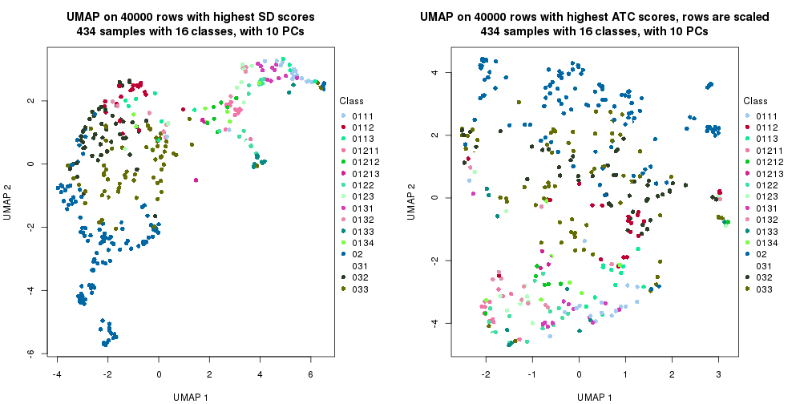</p>

</div>
<div id='tab-dimension-reduction-by-depth-17'>
<pre><code class="r">par(mfrow = c(1, 2))
dimension_reduction(res_rh, merge_node = merge_node_param(min_n_signatures = 12363),
    method = &quot;UMAP&quot;, top_value_method = &quot;SD&quot;, top_n = 40000, scale_rows = FALSE)
dimension_reduction(res_rh, merge_node = merge_node_param(min_n_signatures = 12363),
    method = &quot;UMAP&quot;, top_value_method = &quot;ATC&quot;, top_n = 40000, scale_rows = TRUE)
</code></pre>

<p></p>

</div>
<div id='tab-dimension-reduction-by-depth-18'>
<pre><code class="r">par(mfrow = c(1, 2))
dimension_reduction(res_rh, merge_node = merge_node_param(min_n_signatures = 12451),
    method = &quot;UMAP&quot;, top_value_method = &quot;SD&quot;, top_n = 40000, scale_rows = FALSE)
dimension_reduction(res_rh, merge_node = merge_node_param(min_n_signatures = 12451),
    method = &quot;UMAP&quot;, top_value_method = &quot;ATC&quot;, top_n = 40000, scale_rows = TRUE)
</code></pre>

<p></p>

</div>
<div id='tab-dimension-reduction-by-depth-19'>
<pre><code class="r">par(mfrow = c(1, 2))
dimension_reduction(res_rh, merge_node = merge_node_param(min_n_signatures = 16943),
    method = &quot;UMAP&quot;, top_value_method = &quot;SD&quot;, top_n = 40000, scale_rows = FALSE)
dimension_reduction(res_rh, merge_node = merge_node_param(min_n_signatures = 16943),
    method = &quot;UMAP&quot;, top_value_method = &quot;ATC&quot;, top_n = 40000, scale_rows = TRUE)
</code></pre>

<p></p>

</div>
<div id='tab-dimension-reduction-by-depth-20'>
<pre><code class="r">par(mfrow = c(1, 2))
dimension_reduction(res_rh, merge_node = merge_node_param(min_n_signatures = 18153),
    method = &quot;UMAP&quot;, top_value_method = &quot;SD&quot;, top_n = 40000, scale_rows = FALSE)
dimension_reduction(res_rh, merge_node = merge_node_param(min_n_signatures = 18153),
    method = &quot;UMAP&quot;, top_value_method = &quot;ATC&quot;, top_n = 40000, scale_rows = TRUE)
</code></pre>

<p></p>

</div>
<div id='tab-dimension-reduction-by-depth-21'>
<pre><code class="r">par(mfrow = c(1, 2))
dimension_reduction(res_rh, merge_node = merge_node_param(min_n_signatures = 21477),
    method = &quot;UMAP&quot;, top_value_method = &quot;SD&quot;, top_n = 40000, scale_rows = FALSE)
dimension_reduction(res_rh, merge_node = merge_node_param(min_n_signatures = 21477),
    method = &quot;UMAP&quot;, top_value_method = &quot;ATC&quot;, top_n = 40000, scale_rows = TRUE)
</code></pre>

<p>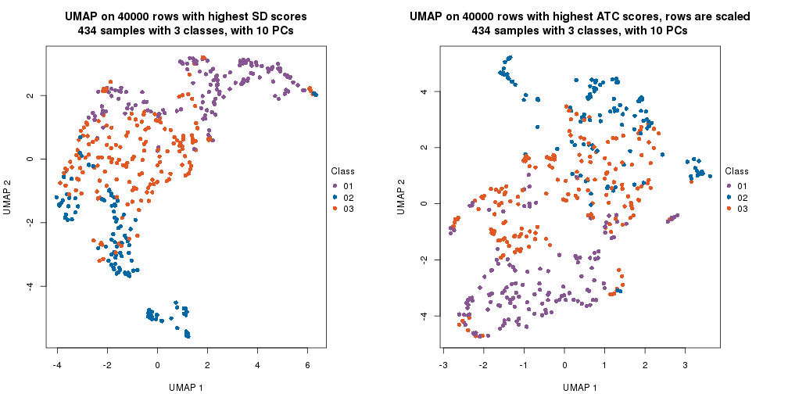</p>

</div>
<div id='tab-dimension-reduction-by-depth-22'>
<pre><code class="r">par(mfrow = c(1, 2))
dimension_reduction(res_rh, merge_node = merge_node_param(min_n_signatures = 42283),
    method = &quot;UMAP&quot;, top_value_method = &quot;SD&quot;, top_n = 40000, scale_rows = FALSE)
dimension_reduction(res_rh, merge_node = merge_node_param(min_n_signatures = 42283),
    method = &quot;UMAP&quot;, top_value_method = &quot;ATC&quot;, top_n = 40000, scale_rows = TRUE)
</code></pre>

<p></p>

</div>
<div id='tab-dimension-reduction-by-depth-23'>
<pre><code class="r">par(mfrow = c(1, 2))
dimension_reduction(res_rh, merge_node = merge_node_param(min_n_signatures = 54159),
    method = &quot;UMAP&quot;, top_value_method = &quot;SD&quot;, top_n = 40000, scale_rows = FALSE)
dimension_reduction(res_rh, merge_node = merge_node_param(min_n_signatures = 54159),
    method = &quot;UMAP&quot;, top_value_method = &quot;ATC&quot;, top_n = 40000, scale_rows = TRUE)
</code></pre>

<p></p>

</div>
</div>


### Signature heatmap

Signatures on the heatmap are the union of all signatures found on every node
on the hierarchy. The number of k-means on rows are automatically selected by the function.


<script>
$( function() {
	$( '#tabs-get-signatures-from-hierarchical-partition' ).tabs();
} );
</script>
<div id='tabs-get-signatures-from-hierarchical-partition'>
<ul>
<li><a href='#tab-get-signatures-from-hierarchical-partition-1'>n_signatures ≥ 1210</a></li>
<li><a href='#tab-get-signatures-from-hierarchical-partition-2'>n_signatures ≥ 1443</a></li>
<li><a href='#tab-get-signatures-from-hierarchical-partition-3'>n_signatures ≥ 1601</a></li>
<li><a href='#tab-get-signatures-from-hierarchical-partition-4'>n_signatures ≥ 2275</a></li>
<li><a href='#tab-get-signatures-from-hierarchical-partition-5'>n_signatures ≥ 2447</a></li>
<li><a href='#tab-get-signatures-from-hierarchical-partition-6'>n_signatures ≥ 2615</a></li>
<li><a href='#tab-get-signatures-from-hierarchical-partition-7'>n_signatures ≥ 2929</a></li>
<li><a href='#tab-get-signatures-from-hierarchical-partition-8'>n_signatures ≥ 3167</a></li>
<li><a href='#tab-get-signatures-from-hierarchical-partition-9'>n_signatures ≥ 3264</a></li>
<li><a href='#tab-get-signatures-from-hierarchical-partition-10'>n_signatures ≥ 3632</a></li>
<li><a href='#tab-get-signatures-from-hierarchical-partition-11'>n_signatures ≥ 4378</a></li>
<li><a href='#tab-get-signatures-from-hierarchical-partition-12'>n_signatures ≥ 7050</a></li>
<li><a href='#tab-get-signatures-from-hierarchical-partition-13'>n_signatures ≥ 7299</a></li>
<li><a href='#tab-get-signatures-from-hierarchical-partition-14'>n_signatures ≥ 9518</a></li>
<li><a href='#tab-get-signatures-from-hierarchical-partition-15'>n_signatures ≥ 10747</a></li>
<li><a href='#tab-get-signatures-from-hierarchical-partition-16'>n_signatures ≥ 11356</a></li>
<li><a href='#tab-get-signatures-from-hierarchical-partition-17'>n_signatures ≥ 12363</a></li>
<li><a href='#tab-get-signatures-from-hierarchical-partition-18'>n_signatures ≥ 12451</a></li>
<li><a href='#tab-get-signatures-from-hierarchical-partition-19'>n_signatures ≥ 16943</a></li>
<li><a href='#tab-get-signatures-from-hierarchical-partition-20'>n_signatures ≥ 18153</a></li>
<li><a href='#tab-get-signatures-from-hierarchical-partition-21'>n_signatures ≥ 21477</a></li>
<li><a href='#tab-get-signatures-from-hierarchical-partition-22'>n_signatures ≥ 42283</a></li>
<li><a href='#tab-get-signatures-from-hierarchical-partition-23'>n_signatures ≥ 54159</a></li>
</ul>
<div id='tab-get-signatures-from-hierarchical-partition-1'>
<pre><code class="r">get_signatures(res_rh, merge_node = merge_node_param(min_n_signatures = 1210))
</code></pre>

<p></p>

</div>
<div id='tab-get-signatures-from-hierarchical-partition-2'>
<pre><code class="r">get_signatures(res_rh, merge_node = merge_node_param(min_n_signatures = 1443))
</code></pre>

<p></p>

</div>
<div id='tab-get-signatures-from-hierarchical-partition-3'>
<pre><code class="r">get_signatures(res_rh, merge_node = merge_node_param(min_n_signatures = 1601))
</code></pre>

<p></p>

</div>
<div id='tab-get-signatures-from-hierarchical-partition-4'>
<pre><code class="r">get_signatures(res_rh, merge_node = merge_node_param(min_n_signatures = 2275))
</code></pre>

<p></p>

</div>
<div id='tab-get-signatures-from-hierarchical-partition-5'>
<pre><code class="r">get_signatures(res_rh, merge_node = merge_node_param(min_n_signatures = 2447))
</code></pre>

<p></p>

</div>
<div id='tab-get-signatures-from-hierarchical-partition-6'>
<pre><code class="r">get_signatures(res_rh, merge_node = merge_node_param(min_n_signatures = 2615))
</code></pre>

<p></p>

</div>
<div id='tab-get-signatures-from-hierarchical-partition-7'>
<pre><code class="r">get_signatures(res_rh, merge_node = merge_node_param(min_n_signatures = 2929))
</code></pre>

<p></p>

</div>
<div id='tab-get-signatures-from-hierarchical-partition-8'>
<pre><code class="r">get_signatures(res_rh, merge_node = merge_node_param(min_n_signatures = 3167))
</code></pre>

<p></p>

</div>
<div id='tab-get-signatures-from-hierarchical-partition-9'>
<pre><code class="r">get_signatures(res_rh, merge_node = merge_node_param(min_n_signatures = 3264))
</code></pre>

<p></p>

</div>
<div id='tab-get-signatures-from-hierarchical-partition-10'>
<pre><code class="r">get_signatures(res_rh, merge_node = merge_node_param(min_n_signatures = 3632))
</code></pre>

<p>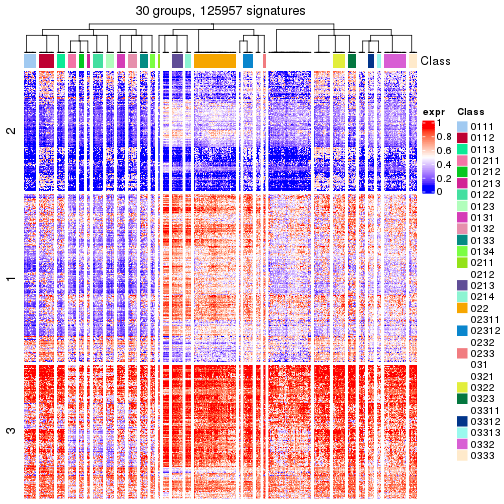</p>

</div>
<div id='tab-get-signatures-from-hierarchical-partition-11'>
<pre><code class="r">get_signatures(res_rh, merge_node = merge_node_param(min_n_signatures = 4378))
</code></pre>

<p></p>

</div>
<div id='tab-get-signatures-from-hierarchical-partition-12'>
<pre><code class="r">get_signatures(res_rh, merge_node = merge_node_param(min_n_signatures = 7050))
</code></pre>

<p></p>

</div>
<div id='tab-get-signatures-from-hierarchical-partition-13'>
<pre><code class="r">get_signatures(res_rh, merge_node = merge_node_param(min_n_signatures = 7299))
</code></pre>

<p></p>

</div>
<div id='tab-get-signatures-from-hierarchical-partition-14'>
<pre><code class="r">get_signatures(res_rh, merge_node = merge_node_param(min_n_signatures = 9518))
</code></pre>

<p></p>

</div>
<div id='tab-get-signatures-from-hierarchical-partition-15'>
<pre><code class="r">get_signatures(res_rh, merge_node = merge_node_param(min_n_signatures = 10747))
</code></pre>

<p></p>

</div>
<div id='tab-get-signatures-from-hierarchical-partition-16'>
<pre><code class="r">get_signatures(res_rh, merge_node = merge_node_param(min_n_signatures = 11356))
</code></pre>

<p></p>

</div>
<div id='tab-get-signatures-from-hierarchical-partition-17'>
<pre><code class="r">get_signatures(res_rh, merge_node = merge_node_param(min_n_signatures = 12363))
</code></pre>

<p></p>

</div>
<div id='tab-get-signatures-from-hierarchical-partition-18'>
<pre><code class="r">get_signatures(res_rh, merge_node = merge_node_param(min_n_signatures = 12451))
</code></pre>

<p></p>

</div>
<div id='tab-get-signatures-from-hierarchical-partition-19'>
<pre><code class="r">get_signatures(res_rh, merge_node = merge_node_param(min_n_signatures = 16943))
</code></pre>

<p></p>

</div>
<div id='tab-get-signatures-from-hierarchical-partition-20'>
<pre><code class="r">get_signatures(res_rh, merge_node = merge_node_param(min_n_signatures = 18153))
</code></pre>

<p></p>

</div>
<div id='tab-get-signatures-from-hierarchical-partition-21'>
<pre><code class="r">get_signatures(res_rh, merge_node = merge_node_param(min_n_signatures = 21477))
</code></pre>

<p></p>

</div>
<div id='tab-get-signatures-from-hierarchical-partition-22'>
<pre><code class="r">get_signatures(res_rh, merge_node = merge_node_param(min_n_signatures = 42283))
</code></pre>

<p></p>

</div>
<div id='tab-get-signatures-from-hierarchical-partition-23'>
<pre><code class="r">get_signatures(res_rh, merge_node = merge_node_param(min_n_signatures = 54159))
</code></pre>

<pre><code>#&gt; Error in names(x) &lt;- value: &#39;names&#39; attribute [1] must be the same length as the vector [0]
</code></pre>

</div>
</div>


Compare signatures from different nodes:


```r
compare_signatures(res_rh, verbose = FALSE)
```


If there are too many signatures, `top_signatures = ...` can be set to only show the 
signatures with the highest FDRs. Note it only works on every node and the final signatures
are the union of all signatures of all nodes.


```r
# code only for demonstration
# e.g. to show the top 500 most significant rows on each node.
tb = get_signature(res_rh, top_signatures = 500)
```


## Results for each node


---------------------------------------------------


### Node0


Child nodes: 
                [Node01](#Node01)
        ,
                [Node02](#Node02)
        ,
                [Node03](#Node03)
        .


The object with results only for a single top-value method and a single partitioning method 
can be extracted as:

```r
res = res_rh["0"]
```

A summary of `res` and all the functions that can be applied to it:

```r
res
```

```
#> A 'ConsensusPartition' object with k = 2, 3, 4, 5, 6, 7, 8.
#>   On a matrix with 30000 rows and 434 columns.
#>   Top rows (1000) are extracted by 'ATC' method.
#>   Subgroups are detected by 'kmeans' method.
#>   Performed in total 350 partitions by row resampling.
#>   Best k for subgroups seems to be 3.
#> 
#> Following methods can be applied to this 'ConsensusPartition' object:
#>  [1] "cola_report"             "collect_classes"         "collect_plots"          
#>  [4] "collect_stats"           "colnames"                "compare_partitions"     
#>  [7] "compare_signatures"      "consensus_heatmap"       "dimension_reduction"    
#> [10] "functional_enrichment"   "get_anno_col"            "get_anno"               
#> [13] "get_classes"             "get_consensus"           "get_matrix"             
#> [16] "get_membership"          "get_param"               "get_signatures"         
#> [19] "get_stats"               "is_best_k"               "is_stable_k"            
#> [22] "membership_heatmap"      "ncol"                    "nrow"                   
#> [25] "plot_ecdf"               "predict_classes"         "rownames"               
#> [28] "select_partition_number" "show"                    "suggest_best_k"         
#> [31] "test_to_known_factors"   "top_rows_heatmap"
```

`collect_plots()` function collects all the plots made from `res` for all `k` (number of subgroups)
into one single page to provide an easy and fast comparison between different `k`.

```r
collect_plots(res)
```


The plots are:

- The first row: a plot of the eCDF (empirical cumulative distribution
  function) curves of the consensus matrix for each `k` and the heatmap of
  predicted classes for each `k`.
- The second row: heatmaps of the consensus matrix for each `k`.
- The third row: heatmaps of the membership matrix for each `k`.
- The fouth row: heatmaps of the signatures for each `k`.

All the plots in panels can be made by individual functions and they are
plotted later in this section.

`select_partition_number()` produces several plots showing different
statistics for choosing "optimized" `k`. There are following statistics:

- eCDF curves of the consensus matrix for each `k`;
- 1-PAC. [The PAC score](https://en.wikipedia.org/wiki/Consensus_clustering#Over-interpretation_potential_of_consensus_clustering)
  measures the proportion of the ambiguous subgrouping.
- Mean silhouette score.
- Concordance. The mean probability of fiting the consensus subgroup labels in all
  partitions.
- Area increased. Denote $A_k$ as the area under the eCDF curve for current
  `k`, the area increased is defined as $A_k - A_{k-1}$.
- Rand index. The percent of pairs of samples that are both in a same cluster
  or both are not in a same cluster in the partition of k and k-1.
- Jaccard index. The ratio of pairs of samples are both in a same cluster in
  the partition of k and k-1 and the pairs of samples are both in a same
  cluster in the partition k or k-1.

The detailed explanations of these statistics can be found in [the _cola_
vignette](https://jokergoo.github.io/cola_vignettes/cola.html#toc_13).

Generally speaking, higher 1-PAC score, higher mean silhouette score or higher
concordance corresponds to better partition. Rand index and Jaccard index
measure how similar the current partition is compared to partition with `k-1`.
If they are too similar, we won't accept `k` is better than `k-1`.

```r
select_partition_number(res)
```


The numeric values for all these statistics can be obtained by `get_stats()`.

```r
get_stats(res)
```

```
#>   k 1-PAC mean_silhouette concordance area_increased  Rand Jaccard
#> 2 2 0.971           0.965       0.985         0.4996 0.499   0.499
#> 3 3 1.000           0.981       0.993         0.3188 0.677   0.445
#> 4 4 0.677           0.736       0.852         0.1089 0.798   0.493
#> 5 5 0.759           0.642       0.840         0.0560 0.895   0.654
#> 6 6 0.858           0.871       0.926         0.0477 0.879   0.573
#> 7 7 0.811           0.638       0.794         0.0257 0.886   0.515
#> 8 8 0.812           0.537       0.780         0.0249 0.905   0.543
```

`suggest_best_k()` suggests the best $k$ based on these statistics. The rules are as follows:

- All $k$ with Jaccard index larger than 0.95 are removed because increasing
  $k$ does not provide enough extra information. If all $k$ are removed, it is
  marked as no subgroup is detected.
- For all $k$ with 1-PAC score larger than 0.9, the maximal $k$ is taken as
  the best $k$, and other $k$ are marked as optional $k$.
- If it does not fit the second rule. The $k$ with the maximal vote of the
  highest 1-PAC score, highest mean silhouette, and highest concordance is
  taken as the best $k$.

```r
suggest_best_k(res)
```

```
#> [1] 3
#> attr(,"optional")
#> [1] 2
```

There is also optional best $k$ = 2 that is worth to check.

Following is the table of the partitions (You need to click the **show/hide
code output** link to see it). The membership matrix (columns with name `p*`)
is inferred by
[`clue::cl_consensus()`](https://www.rdocumentation.org/link/cl_consensus?package=clue)
function with the `SE` method. Basically the value in the membership matrix
represents the probability to belong to a certain group. The finall subgroup
label for an item is determined with the group with highest probability it
belongs to.

In `get_classes()` function, the entropy is calculated from the membership
matrix and the silhouette score is calculated from the consensus matrix.


<script>
$( function() {
	$( '#tabs-node-0-get-classes' ).tabs();
} );
</script>
<div id='tabs-node-0-get-classes'>
<ul>
<li><a href='#tab-node-0-get-classes-1'>k = 2</a></li>
<li><a href='#tab-node-0-get-classes-2'>k = 3</a></li>
<li><a href='#tab-node-0-get-classes-3'>k = 4</a></li>
<li><a href='#tab-node-0-get-classes-4'>k = 5</a></li>
<li><a href='#tab-node-0-get-classes-5'>k = 6</a></li>
<li><a href='#tab-node-0-get-classes-6'>k = 7</a></li>
<li><a href='#tab-node-0-get-classes-7'>k = 8</a></li>
</ul>

<div id='tab-node-0-get-classes-1'>
<p><a id='tab-node-0-get-classes-1-a' style='color:#0366d6' href='#'>show/hide code output</a></p>
<pre><code class="r">cbind(get_classes(res, k = 2), get_membership(res, k = 2))
</code></pre>

<pre><code>#&gt;                 class entropy silhouette   p1   p2
#&gt; TCGA.GD.A3OP.01     2   0.000      0.976 0.00 1.00
#&gt; TCGA.4Z.AA86.01     2   0.000      0.976 0.00 1.00
#&gt; TCGA.BL.A13J.11     2   0.000      0.976 0.00 1.00
#&gt; TCGA.2F.A9KO.01     2   0.000      0.976 0.00 1.00
#&gt; TCGA.GU.A42Q.01     2   0.000      0.976 0.00 1.00
#&gt; TCGA.HQ.A5NE.01     2   0.469      0.886 0.10 0.90
#&gt; TCGA.PQ.A6FI.01     1   0.000      0.992 1.00 0.00
#&gt; TCGA.E5.A2PC.01     1   0.000      0.992 1.00 0.00
#&gt; TCGA.FD.A3SL.01     2   0.000      0.976 0.00 1.00
#&gt; TCGA.FD.A5BU.01     2   0.000      0.976 0.00 1.00
#&gt; TCGA.UY.A9PE.01     1   0.000      0.992 1.00 0.00
#&gt; TCGA.FD.A3N6.01     1   0.000      0.992 1.00 0.00
#&gt; TCGA.CU.A3YL.01     1   0.000      0.992 1.00 0.00
#&gt; TCGA.GV.A3JW.01     1   0.000      0.992 1.00 0.00
#&gt; TCGA.ZF.A9R3.01     1   0.000      0.992 1.00 0.00
#&gt; TCGA.E7.A6MF.01     2   0.000      0.976 0.00 1.00
#&gt; TCGA.FD.A43P.01     2   0.000      0.976 0.00 1.00
#&gt; TCGA.ZF.AA52.01     2   0.000      0.976 0.00 1.00
#&gt; TCGA.E7.A541.01     1   0.995      0.101 0.54 0.46
#&gt; TCGA.DK.AA6L.01     1   0.000      0.992 1.00 0.00
#&gt; TCGA.FD.A6TI.01     1   0.000      0.992 1.00 0.00
#&gt; TCGA.BT.A20W.11     2   0.000      0.976 0.00 1.00
#&gt; TCGA.XF.A9SZ.01     2   0.000      0.976 0.00 1.00
#&gt; TCGA.C4.A0EZ.01     2   0.242      0.943 0.04 0.96
#&gt; TCGA.FD.A3SJ.01     2   0.469      0.886 0.10 0.90
#&gt; TCGA.ZF.AA56.01     2   0.000      0.976 0.00 1.00
#&gt; TCGA.XF.AAMH.01     1   0.000      0.992 1.00 0.00
#&gt; TCGA.FD.A3NA.01     1   0.000      0.992 1.00 0.00
#&gt; TCGA.DK.A3IK.01     1   0.000      0.992 1.00 0.00
#&gt; TCGA.ZF.A9RF.01     2   0.760      0.738 0.22 0.78
#&gt; TCGA.UY.A78P.01     2   0.000      0.976 0.00 1.00
#&gt; TCGA.DK.AA6X.01     2   0.000      0.976 0.00 1.00
#&gt; TCGA.BT.A3PJ.01     1   0.000      0.992 1.00 0.00
#&gt; TCGA.K4.A6FZ.01     2   0.000      0.976 0.00 1.00
#&gt; TCGA.YC.A9TC.01     1   0.000      0.992 1.00 0.00
#&gt; TCGA.ZF.A9R7.01     1   0.000      0.992 1.00 0.00
#&gt; TCGA.GC.A3OO.01     2   0.000      0.976 0.00 1.00
#&gt; TCGA.DK.A1A7.01     1   0.000      0.992 1.00 0.00
#&gt; TCGA.BT.A2LB.01     1   0.000      0.992 1.00 0.00
#&gt; TCGA.GV.A3QF.01     1   0.000      0.992 1.00 0.00
#&gt; TCGA.ZF.A9R9.01     1   0.000      0.992 1.00 0.00
#&gt; TCGA.XF.AAN5.01     2   0.000      0.976 0.00 1.00
#&gt; TCGA.XF.A8HG.01     1   0.000      0.992 1.00 0.00
#&gt; TCGA.DK.AA76.01     1   0.000      0.992 1.00 0.00
#&gt; TCGA.DK.A2I2.01     2   0.000      0.976 0.00 1.00
#&gt; TCGA.CF.A1HS.01     2   0.000      0.976 0.00 1.00
#&gt; TCGA.KQ.A41O.01     1   0.000      0.992 1.00 0.00
#&gt; TCGA.CF.A47T.01     1   0.000      0.992 1.00 0.00
#&gt; TCGA.4Z.AA7W.01     2   0.000      0.976 0.00 1.00
#&gt; TCGA.XF.A8HB.01     1   0.000      0.992 1.00 0.00
#&gt; TCGA.E7.A97P.01     2   0.000      0.976 0.00 1.00
#&gt; TCGA.ZF.AA4V.01     1   0.000      0.992 1.00 0.00
#&gt; TCGA.HQ.A2OE.01     1   0.000      0.992 1.00 0.00
#&gt; TCGA.XF.A9SI.01     2   0.000      0.976 0.00 1.00
#&gt; TCGA.DK.A1AA.01     1   0.000      0.992 1.00 0.00
#&gt; TCGA.K4.A5RH.01     2   0.000      0.976 0.00 1.00
#&gt; TCGA.XF.AAN1.01     1   0.000      0.992 1.00 0.00
#&gt; TCGA.CU.A5W6.01     2   0.000      0.976 0.00 1.00
#&gt; TCGA.XF.A9SM.01     2   0.000      0.976 0.00 1.00
#&gt; TCGA.C4.A0F7.01     2   0.584      0.842 0.14 0.86
#&gt; TCGA.GC.A3RD.01     1   0.000      0.992 1.00 0.00
#&gt; TCGA.4Z.AA7S.01     1   0.000      0.992 1.00 0.00
#&gt; TCGA.DK.A1AE.01     1   0.000      0.992 1.00 0.00
#&gt; TCGA.GC.A3BM.11     2   0.000      0.976 0.00 1.00
#&gt; TCGA.4Z.AA7Q.01     2   0.000      0.976 0.00 1.00
#&gt; TCGA.DK.AA6S.01     1   0.000      0.992 1.00 0.00
#&gt; TCGA.XF.A8HD.01     2   0.000      0.976 0.00 1.00
#&gt; TCGA.DK.A3IU.01     2   0.000      0.976 0.00 1.00
#&gt; TCGA.KQ.A41S.01     2   0.000      0.976 0.00 1.00
#&gt; TCGA.4Z.AA7O.01     1   0.000      0.992 1.00 0.00
#&gt; TCGA.E7.A7XN.01     2   0.000      0.976 0.00 1.00
#&gt; TCGA.G2.AA3B.01     1   0.000      0.992 1.00 0.00
#&gt; TCGA.K4.A5RI.11     2   0.000      0.976 0.00 1.00
#&gt; TCGA.UY.A78O.01     1   0.000      0.992 1.00 0.00
#&gt; TCGA.XF.AAMW.01     1   0.000      0.992 1.00 0.00
#&gt; TCGA.BT.A0YX.01     2   0.000      0.976 0.00 1.00
#&gt; TCGA.FD.A6TC.01     1   0.000      0.992 1.00 0.00
#&gt; TCGA.GC.A3I6.01     2   0.000      0.976 0.00 1.00
#&gt; TCGA.XF.A9SK.01     1   0.000      0.992 1.00 0.00
#&gt; TCGA.CF.A5U8.01     1   0.000      0.992 1.00 0.00
#&gt; TCGA.GU.AATP.01     1   0.000      0.992 1.00 0.00
#&gt; TCGA.K4.A3WV.11     2   0.000      0.976 0.00 1.00
#&gt; TCGA.BT.A20T.01     1   0.000      0.992 1.00 0.00
#&gt; TCGA.FD.A62O.01     1   0.000      0.992 1.00 0.00
#&gt; TCGA.MV.A51V.01     1   0.000      0.992 1.00 0.00
#&gt; TCGA.UY.A9PH.01     1   0.000      0.992 1.00 0.00
#&gt; TCGA.FD.A3B3.01     2   0.000      0.976 0.00 1.00
#&gt; TCGA.FD.A6TF.01     2   0.000      0.976 0.00 1.00
#&gt; TCGA.UY.A78K.01     2   0.000      0.976 0.00 1.00
#&gt; TCGA.BT.A20W.01     1   0.000      0.992 1.00 0.00
#&gt; TCGA.E7.A7DV.01     2   0.000      0.976 0.00 1.00
#&gt; TCGA.DK.A2I6.01     1   0.000      0.992 1.00 0.00
#&gt; TCGA.GD.A3OQ.11     2   0.000      0.976 0.00 1.00
#&gt; TCGA.BT.A20R.01     2   0.795      0.707 0.24 0.76
#&gt; TCGA.FJ.A3ZF.01     1   0.000      0.992 1.00 0.00
#&gt; TCGA.4Z.AA87.01     1   0.000      0.992 1.00 0.00
#&gt; TCGA.E7.A6MD.01     1   0.000      0.992 1.00 0.00
#&gt; TCGA.XF.A9SV.01     1   0.000      0.992 1.00 0.00
#&gt; TCGA.GV.A3JX.01     1   0.000      0.992 1.00 0.00
#&gt; TCGA.ZF.A9RC.01     2   0.000      0.976 0.00 1.00
#&gt; TCGA.FD.A43Y.01     2   0.000      0.976 0.00 1.00
#&gt; TCGA.GU.A767.01     2   0.000      0.976 0.00 1.00
#&gt; TCGA.UY.A9PD.01     1   0.000      0.992 1.00 0.00
#&gt; TCGA.DK.A6B2.01     1   0.000      0.992 1.00 0.00
#&gt; TCGA.CU.A0YN.11     2   0.000      0.976 0.00 1.00
#&gt; TCGA.YC.A8S6.01     2   0.000      0.976 0.00 1.00
#&gt; TCGA.DK.A6B6.01     1   0.000      0.992 1.00 0.00
#&gt; TCGA.DK.AA6M.01     2   0.000      0.976 0.00 1.00
#&gt; TCGA.GU.A763.01     1   0.000      0.992 1.00 0.00
#&gt; TCGA.DK.A3IN.01     2   0.680      0.793 0.18 0.82
#&gt; TCGA.E7.A5KF.01     1   0.000      0.992 1.00 0.00
#&gt; TCGA.CU.A0YO.01     2   0.000      0.976 0.00 1.00
#&gt; TCGA.XF.A9T3.01     2   0.000      0.976 0.00 1.00
#&gt; TCGA.CF.A47Y.01     2   0.760      0.738 0.22 0.78
#&gt; TCGA.4Z.AA83.01     1   0.000      0.992 1.00 0.00
#&gt; TCGA.CU.A72E.01     1   0.000      0.992 1.00 0.00
#&gt; TCGA.XF.A9T5.01     2   0.000      0.976 0.00 1.00
#&gt; TCGA.G2.A2EL.01     1   0.000      0.992 1.00 0.00
#&gt; TCGA.BT.A3PH.01     1   0.000      0.992 1.00 0.00
#&gt; TCGA.BL.A13J.01     1   0.000      0.992 1.00 0.00
#&gt; TCGA.FD.A62P.01     2   0.000      0.976 0.00 1.00
#&gt; TCGA.FD.A6TH.01     1   0.000      0.992 1.00 0.00
#&gt; TCGA.2F.A9KR.01     1   0.000      0.992 1.00 0.00
#&gt; TCGA.DK.AA74.01     2   0.000      0.976 0.00 1.00
#&gt; TCGA.BT.A20U.11     2   0.000      0.976 0.00 1.00
#&gt; TCGA.GD.A2C5.01     1   0.000      0.992 1.00 0.00
#&gt; TCGA.ZF.AA4U.01     1   0.000      0.992 1.00 0.00
#&gt; TCGA.XF.A9SP.01     2   0.000      0.976 0.00 1.00
#&gt; TCGA.FD.A3SR.01     2   0.760      0.738 0.22 0.78
#&gt; TCGA.G2.A2EO.01     2   0.000      0.976 0.00 1.00
#&gt; TCGA.ZF.AA5N.01     1   0.000      0.992 1.00 0.00
#&gt; TCGA.K4.A83P.01     2   0.000      0.976 0.00 1.00
#&gt; TCGA.ZF.A9RE.01     1   0.000      0.992 1.00 0.00
#&gt; TCGA.XF.AAN8.01     2   0.000      0.976 0.00 1.00
#&gt; TCGA.DK.A6B0.01     2   0.000      0.976 0.00 1.00
#&gt; TCGA.BT.A20N.01     1   0.000      0.992 1.00 0.00
#&gt; TCGA.ZF.AA5H.01     1   0.000      0.992 1.00 0.00
#&gt; TCGA.G2.A2EJ.01     2   0.000      0.976 0.00 1.00
#&gt; TCGA.GC.A3RB.01     1   0.000      0.992 1.00 0.00
#&gt; TCGA.BT.A42F.01     2   0.000      0.976 0.00 1.00
#&gt; TCGA.FD.A3SN.01     2   0.402      0.906 0.08 0.92
#&gt; TCGA.FT.A61P.01     2   0.000      0.976 0.00 1.00
#&gt; TCGA.G2.A2EF.01     2   0.795      0.708 0.24 0.76
#&gt; TCGA.XF.AAMF.01     1   0.000      0.992 1.00 0.00
#&gt; TCGA.BT.A20J.11     2   0.000      0.976 0.00 1.00
#&gt; TCGA.FD.A5BS.01     2   0.000      0.976 0.00 1.00
#&gt; TCGA.CF.A3MH.01     1   0.000      0.992 1.00 0.00
#&gt; TCGA.GV.A3QK.01     1   0.000      0.992 1.00 0.00
#&gt; TCGA.LT.A5Z6.01     1   0.000      0.992 1.00 0.00
#&gt; TCGA.DK.A1AD.01     1   0.000      0.992 1.00 0.00
#&gt; TCGA.CF.A8HX.01     1   0.000      0.992 1.00 0.00
#&gt; TCGA.C4.A0F6.01     1   0.000      0.992 1.00 0.00
#&gt; TCGA.XF.AAMQ.01     1   0.000      0.992 1.00 0.00
#&gt; TCGA.XF.A9SX.01     2   0.000      0.976 0.00 1.00
#&gt; TCGA.FD.A5C1.01     2   0.000      0.976 0.00 1.00
#&gt; TCGA.XF.A8HH.01     1   0.000      0.992 1.00 0.00
#&gt; TCGA.DK.A3IQ.01     2   0.000      0.976 0.00 1.00
#&gt; TCGA.CF.A27C.01     1   0.000      0.992 1.00 0.00
#&gt; TCGA.LC.A66R.01     2   0.000      0.976 0.00 1.00
#&gt; TCGA.FD.A3B8.01     2   0.000      0.976 0.00 1.00
#&gt; TCGA.BL.A0C8.01     1   0.000      0.992 1.00 0.00
#&gt; TCGA.G2.A3VY.01     1   0.000      0.992 1.00 0.00
#&gt; TCGA.BT.A2LA.01     2   0.469      0.886 0.10 0.90
#&gt; TCGA.ZF.AA54.01     2   0.000      0.976 0.00 1.00
#&gt; TCGA.DK.AA6R.01     1   0.000      0.992 1.00 0.00
#&gt; TCGA.YF.AA3M.01     1   0.000      0.992 1.00 0.00
#&gt; TCGA.UY.A78N.01     1   0.000      0.992 1.00 0.00
#&gt; TCGA.FT.A3EE.01     1   0.000      0.992 1.00 0.00
#&gt; TCGA.FD.A3B7.01     2   0.000      0.976 0.00 1.00
#&gt; TCGA.ZF.AA4T.01     1   0.000      0.992 1.00 0.00
#&gt; TCGA.2F.A9KW.01     1   0.000      0.992 1.00 0.00
#&gt; TCGA.ZF.A9R1.01     1   0.000      0.992 1.00 0.00
#&gt; TCGA.CF.A47S.01     1   0.000      0.992 1.00 0.00
#&gt; TCGA.DK.A1AB.01     2   0.000      0.976 0.00 1.00
#&gt; TCGA.G2.AA3F.01     1   0.000      0.992 1.00 0.00
#&gt; TCGA.K4.A3WU.01     2   0.000      0.976 0.00 1.00
#&gt; TCGA.K4.A6MB.01     1   0.000      0.992 1.00 0.00
#&gt; TCGA.FD.A62N.01     2   0.000      0.976 0.00 1.00
#&gt; TCGA.E7.A3X6.01     1   0.000      0.992 1.00 0.00
#&gt; TCGA.XF.AAN7.01     1   0.000      0.992 1.00 0.00
#&gt; TCGA.FD.A6TG.01     2   0.000      0.976 0.00 1.00
#&gt; TCGA.UY.A9PB.01     2   0.000      0.976 0.00 1.00
#&gt; TCGA.CF.A47V.01     2   0.529      0.865 0.12 0.88
#&gt; TCGA.KQ.A41R.01     1   0.000      0.992 1.00 0.00
#&gt; TCGA.XF.A9ST.01     2   0.000      0.976 0.00 1.00
#&gt; TCGA.ZF.AA4X.01     1   0.000      0.992 1.00 0.00
#&gt; TCGA.FD.A5BZ.01     1   0.000      0.992 1.00 0.00
#&gt; TCGA.GC.A3BM.01     1   0.000      0.992 1.00 0.00
#&gt; TCGA.UY.A9PF.01     2   0.795      0.707 0.24 0.76
#&gt; TCGA.CF.A7I0.01     1   0.000      0.992 1.00 0.00
#&gt; TCGA.E7.A4IJ.01     1   0.000      0.992 1.00 0.00
#&gt; TCGA.FD.A5BV.01     1   0.000      0.992 1.00 0.00
#&gt; TCGA.DK.A3IL.01     1   0.000      0.992 1.00 0.00
#&gt; TCGA.FD.A43X.01     1   0.000      0.992 1.00 0.00
#&gt; TCGA.GU.A766.01     2   0.000      0.976 0.00 1.00
#&gt; TCGA.FD.A6TB.01     2   0.000      0.976 0.00 1.00
#&gt; TCGA.DK.A1A5.01     1   0.000      0.992 1.00 0.00
#&gt; TCGA.UY.A78L.01     1   0.000      0.992 1.00 0.00
#&gt; TCGA.FD.A6TA.01     1   0.000      0.992 1.00 0.00
#&gt; TCGA.GU.A762.01     2   0.000      0.976 0.00 1.00
#&gt; TCGA.K4.A3WS.01     2   0.000      0.976 0.00 1.00
#&gt; TCGA.DK.A3X1.01     1   0.000      0.992 1.00 0.00
#&gt; TCGA.XF.AAME.01     2   0.000      0.976 0.00 1.00
#&gt; TCGA.XF.A9T8.01     2   0.000      0.976 0.00 1.00
#&gt; TCGA.YC.A89H.01     1   0.000      0.992 1.00 0.00
#&gt; TCGA.4Z.AA7Y.01     1   0.000      0.992 1.00 0.00
#&gt; TCGA.KQ.A41Q.01     1   0.000      0.992 1.00 0.00
#&gt; TCGA.G2.AA3D.01     2   0.000      0.976 0.00 1.00
#&gt; TCGA.XF.AAMY.01     1   0.000      0.992 1.00 0.00
#&gt; TCGA.4Z.AA81.01     1   0.000      0.992 1.00 0.00
#&gt; TCGA.GU.AATQ.01     1   0.000      0.992 1.00 0.00
#&gt; TCGA.FD.A6TE.01     1   0.000      0.992 1.00 0.00
#&gt; TCGA.CF.A3MG.01     1   0.000      0.992 1.00 0.00
#&gt; TCGA.UY.A8OC.01     1   0.000      0.992 1.00 0.00
#&gt; TCGA.UY.A8OB.01     1   0.000      0.992 1.00 0.00
#&gt; TCGA.K4.A5RJ.01     2   0.000      0.976 0.00 1.00
#&gt; TCGA.GD.A3OQ.01     1   0.000      0.992 1.00 0.00
#&gt; TCGA.ZF.A9RG.01     2   0.000      0.976 0.00 1.00
#&gt; TCGA.CF.A47X.01     1   0.000      0.992 1.00 0.00
#&gt; TCGA.BT.A20Q.01     2   0.680      0.793 0.18 0.82
#&gt; TCGA.FD.A5C0.01     2   0.000      0.976 0.00 1.00
#&gt; TCGA.ZF.A9R4.01     1   0.000      0.992 1.00 0.00
#&gt; TCGA.FD.A3SS.01     2   0.529      0.865 0.12 0.88
#&gt; TCGA.FJ.A3ZE.01     1   0.000      0.992 1.00 0.00
#&gt; TCGA.ZF.A9RD.01     2   0.000      0.976 0.00 1.00
#&gt; TCGA.E7.A6ME.01     1   0.000      0.992 1.00 0.00
#&gt; TCGA.BT.A20O.01     2   0.000      0.976 0.00 1.00
#&gt; TCGA.G2.A2EK.01     1   0.000      0.992 1.00 0.00
#&gt; TCGA.DK.AA75.01     1   0.000      0.992 1.00 0.00
#&gt; TCGA.GV.A3JZ.01     1   0.000      0.992 1.00 0.00
#&gt; TCGA.FD.A3SO.01     2   0.000      0.976 0.00 1.00
#&gt; TCGA.FD.A43S.01     2   0.000      0.976 0.00 1.00
#&gt; TCGA.SY.A9G5.01     2   0.000      0.976 0.00 1.00
#&gt; TCGA.4Z.AA89.01     1   0.000      0.992 1.00 0.00
#&gt; TCGA.XF.A8HE.01     2   0.000      0.976 0.00 1.00
#&gt; TCGA.GC.A3WC.01     2   0.000      0.976 0.00 1.00
#&gt; TCGA.ZF.A9RM.01     1   0.000      0.992 1.00 0.00
#&gt; TCGA.FD.A5BR.01     2   0.881      0.602 0.30 0.70
#&gt; TCGA.G2.A2EC.01     2   0.000      0.976 0.00 1.00
#&gt; TCGA.XF.A9T4.01     1   0.000      0.992 1.00 0.00
#&gt; TCGA.FD.A62S.01     2   0.000      0.976 0.00 1.00
#&gt; TCGA.DK.A6B5.01     1   0.000      0.992 1.00 0.00
#&gt; TCGA.ZF.AA51.01     2   0.827      0.674 0.26 0.74
#&gt; TCGA.XF.A9SY.01     2   0.000      0.976 0.00 1.00
#&gt; TCGA.GD.A6C6.01     1   0.000      0.992 1.00 0.00
#&gt; TCGA.XF.A8HI.01     1   0.000      0.992 1.00 0.00
#&gt; TCGA.2F.A9KQ.01     1   0.000      0.992 1.00 0.00
#&gt; TCGA.G2.A3IB.01     1   0.000      0.992 1.00 0.00
#&gt; TCGA.GD.A2C5.11     2   0.000      0.976 0.00 1.00
#&gt; TCGA.CU.A0YR.01     2   0.000      0.976 0.00 1.00
#&gt; TCGA.BT.A42B.01     1   0.000      0.992 1.00 0.00
#&gt; TCGA.CU.A3KJ.01     1   0.000      0.992 1.00 0.00
#&gt; TCGA.DK.A3WW.01     2   0.000      0.976 0.00 1.00
#&gt; TCGA.YF.AA3L.01     1   0.000      0.992 1.00 0.00
#&gt; TCGA.GV.A40E.01     2   0.000      0.976 0.00 1.00
#&gt; TCGA.DK.A1A6.01     1   0.000      0.992 1.00 0.00
#&gt; TCGA.DK.A1A6.06     1   0.000      0.992 1.00 0.00
#&gt; TCGA.4Z.AA7N.01     2   0.000      0.976 0.00 1.00
#&gt; TCGA.DK.A2I1.01     1   0.000      0.992 1.00 0.00
#&gt; TCGA.K4.A4AB.01     1   0.000      0.992 1.00 0.00
#&gt; TCGA.DK.A2HX.01     2   0.000      0.976 0.00 1.00
#&gt; TCGA.K4.A54R.11     2   0.000      0.976 0.00 1.00
#&gt; TCGA.4Z.AA7M.01     1   0.000      0.992 1.00 0.00
#&gt; TCGA.BL.A3JM.01     1   0.000      0.992 1.00 0.00
#&gt; TCGA.XF.A9SU.01     2   0.000      0.976 0.00 1.00
#&gt; TCGA.GD.A76B.01     2   0.000      0.976 0.00 1.00
#&gt; TCGA.BT.A20J.01     2   0.000      0.976 0.00 1.00
#&gt; TCGA.DK.AA71.01     1   0.855      0.593 0.72 0.28
#&gt; TCGA.DK.A3WY.01     2   0.000      0.976 0.00 1.00
#&gt; TCGA.GC.A3RC.01     1   0.529      0.854 0.88 0.12
#&gt; TCGA.ZF.AA53.01     2   0.000      0.976 0.00 1.00
#&gt; TCGA.CF.A9FF.01     1   0.000      0.992 1.00 0.00
#&gt; TCGA.LT.A8JT.01     1   0.000      0.992 1.00 0.00
#&gt; TCGA.GC.A3YS.01     2   0.000      0.976 0.00 1.00
#&gt; TCGA.XF.AAML.01     1   0.000      0.992 1.00 0.00
#&gt; TCGA.CF.A47W.01     2   0.000      0.976 0.00 1.00
#&gt; TCGA.DK.A1AF.01     2   0.000      0.976 0.00 1.00
#&gt; TCGA.XF.AAN3.01     2   0.000      0.976 0.00 1.00
#&gt; TCGA.5N.A9KM.01     1   0.000      0.992 1.00 0.00
#&gt; TCGA.XF.AAN2.01     2   0.000      0.976 0.00 1.00
#&gt; TCGA.BT.A20P.11     2   0.000      0.976 0.00 1.00
#&gt; TCGA.DK.A3IV.01     2   0.000      0.976 0.00 1.00
#&gt; TCGA.BT.A2LA.11     2   0.000      0.976 0.00 1.00
#&gt; TCGA.4Z.AA7R.01     1   0.000      0.992 1.00 0.00
#&gt; TCGA.XF.A9SJ.01     2   0.000      0.976 0.00 1.00
#&gt; TCGA.C4.A0F0.01     2   0.904      0.562 0.32 0.68
#&gt; TCGA.DK.AA6T.01     2   0.000      0.976 0.00 1.00
#&gt; TCGA.ZF.AA58.01     2   0.000      0.976 0.00 1.00
#&gt; TCGA.ZF.AA4R.01     2   0.000      0.976 0.00 1.00
#&gt; TCGA.DK.A3IS.01     1   0.000      0.992 1.00 0.00
#&gt; TCGA.FD.A3SQ.01     2   0.000      0.976 0.00 1.00
#&gt; TCGA.K4.AAQO.01     2   0.000      0.976 0.00 1.00
#&gt; TCGA.GC.A6I3.01     2   0.000      0.976 0.00 1.00
#&gt; TCGA.XF.AAMT.01     2   0.000      0.976 0.00 1.00
#&gt; TCGA.BT.A20X.11     2   0.000      0.976 0.00 1.00
#&gt; TCGA.GC.A6I3.11     2   0.000      0.976 0.00 1.00
#&gt; TCGA.XF.AAN4.01     2   0.000      0.976 0.00 1.00
#&gt; TCGA.DK.A3IM.01     1   0.000      0.992 1.00 0.00
#&gt; TCGA.DK.AA6P.01     1   0.000      0.992 1.00 0.00
#&gt; TCGA.E5.A4TZ.01     1   0.000      0.992 1.00 0.00
#&gt; TCGA.GD.A3OP.11     2   0.000      0.976 0.00 1.00
#&gt; TCGA.E7.A7PW.01     1   0.000      0.992 1.00 0.00
#&gt; TCGA.S5.A6DX.01     2   0.000      0.976 0.00 1.00
#&gt; TCGA.GV.A6ZA.01     1   0.000      0.992 1.00 0.00
#&gt; TCGA.FD.A43N.01     1   0.000      0.992 1.00 0.00
#&gt; TCGA.FD.A3B5.01     1   0.000      0.992 1.00 0.00
#&gt; TCGA.4Z.AA80.01     1   0.000      0.992 1.00 0.00
#&gt; TCGA.CF.A3MF.01     1   0.000      0.992 1.00 0.00
#&gt; TCGA.ZF.A9R0.01     1   0.000      0.992 1.00 0.00
#&gt; TCGA.XF.AAMJ.01     2   0.000      0.976 0.00 1.00
#&gt; TCGA.BT.A0S7.01     2   0.000      0.976 0.00 1.00
#&gt; TCGA.BT.A42E.01     2   0.000      0.976 0.00 1.00
#&gt; TCGA.XF.AAMZ.01     2   0.000      0.976 0.00 1.00
#&gt; TCGA.BT.A20V.11     2   0.000      0.976 0.00 1.00
#&gt; TCGA.E7.A7DU.01     1   0.000      0.992 1.00 0.00
#&gt; TCGA.GU.A42R.01     2   0.995      0.193 0.46 0.54
#&gt; TCGA.FD.A3SM.01     1   0.000      0.992 1.00 0.00
#&gt; TCGA.ZF.AA4N.01     1   0.000      0.992 1.00 0.00
#&gt; TCGA.CF.A1HR.01     2   0.000      0.976 0.00 1.00
#&gt; TCGA.FD.A5BT.01     2   0.000      0.976 0.00 1.00
#&gt; TCGA.DK.A6B1.01     1   0.000      0.992 1.00 0.00
#&gt; TCGA.FD.A5BY.01     2   0.000      0.976 0.00 1.00
#&gt; TCGA.5N.A9KI.01     1   0.000      0.992 1.00 0.00
#&gt; TCGA.GV.A3QH.01     1   0.000      0.992 1.00 0.00
#&gt; TCGA.CF.A9FL.01     1   0.000      0.992 1.00 0.00
#&gt; TCGA.S5.AA26.01     1   0.000      0.992 1.00 0.00
#&gt; TCGA.BL.A5ZZ.01     2   0.000      0.976 0.00 1.00
#&gt; TCGA.E5.A4U1.01     1   0.000      0.992 1.00 0.00
#&gt; TCGA.PQ.A6FN.01     2   0.000      0.976 0.00 1.00
#&gt; TCGA.E7.A5KE.01     1   0.000      0.992 1.00 0.00
#&gt; TCGA.GV.A40G.01     1   0.000      0.992 1.00 0.00
#&gt; TCGA.CF.A8HY.01     1   0.000      0.992 1.00 0.00
#&gt; TCGA.CF.A3MI.01     1   0.000      0.992 1.00 0.00
#&gt; TCGA.ZF.A9RL.01     1   0.000      0.992 1.00 0.00
#&gt; TCGA.HQ.A5ND.01     1   0.000      0.992 1.00 0.00
#&gt; TCGA.BT.A20U.01     2   0.000      0.976 0.00 1.00
#&gt; TCGA.G2.A3IE.01     1   0.000      0.992 1.00 0.00
#&gt; TCGA.BT.A42C.01     1   0.000      0.992 1.00 0.00
#&gt; TCGA.E7.A8O8.01     1   0.000      0.992 1.00 0.00
#&gt; TCGA.UY.A8OD.01     1   0.000      0.992 1.00 0.00
#&gt; TCGA.SY.A9G0.01     2   0.000      0.976 0.00 1.00
#&gt; TCGA.XF.A9T0.01     1   0.000      0.992 1.00 0.00
#&gt; TCGA.DK.A1A3.01     2   0.000      0.976 0.00 1.00
#&gt; TCGA.H4.A2HO.01     1   0.000      0.992 1.00 0.00
#&gt; TCGA.DK.A6AW.01     1   0.000      0.992 1.00 0.00
#&gt; TCGA.ZF.A9R5.01     1   0.000      0.992 1.00 0.00
#&gt; TCGA.4Z.AA84.01     1   0.000      0.992 1.00 0.00
#&gt; TCGA.XF.A9SG.01     2   0.855      0.639 0.28 0.72
#&gt; TCGA.2F.A9KP.01     1   0.000      0.992 1.00 0.00
#&gt; TCGA.GU.A42P.01     1   0.000      0.992 1.00 0.00
#&gt; TCGA.KQ.A41N.01     1   0.000      0.992 1.00 0.00
#&gt; TCGA.GC.A4ZW.01     1   0.000      0.992 1.00 0.00
#&gt; TCGA.ZF.A9R2.01     1   0.000      0.992 1.00 0.00
#&gt; TCGA.K4.A4AC.01     2   0.000      0.976 0.00 1.00
#&gt; TCGA.XF.A8HC.01     1   0.000      0.992 1.00 0.00
#&gt; TCGA.FD.A43U.01     2   0.000      0.976 0.00 1.00
#&gt; TCGA.BT.A2LD.01     1   0.000      0.992 1.00 0.00
#&gt; TCGA.GV.A3JV.01     1   0.000      0.992 1.00 0.00
#&gt; TCGA.DK.A1AC.01     1   0.000      0.992 1.00 0.00
#&gt; TCGA.GC.A3WC.11     2   0.000      0.976 0.00 1.00
#&gt; TCGA.DK.A3WX.01     2   0.000      0.976 0.00 1.00
#&gt; TCGA.E7.A85H.01     2   0.000      0.976 0.00 1.00
#&gt; TCGA.XF.AAMG.01     1   0.000      0.992 1.00 0.00
#&gt; TCGA.GU.A764.01     2   0.000      0.976 0.00 1.00
#&gt; TCGA.XF.A9T6.01     1   0.000      0.992 1.00 0.00
#&gt; TCGA.G2.A2ES.01     2   0.000      0.976 0.00 1.00
#&gt; TCGA.DK.A2I4.01     2   0.000      0.976 0.00 1.00
#&gt; TCGA.HQ.A2OF.01     1   0.971      0.301 0.60 0.40
#&gt; TCGA.GU.AATO.01     2   0.000      0.976 0.00 1.00
#&gt; TCGA.DK.A1AG.01     1   0.000      0.992 1.00 0.00
#&gt; TCGA.E7.A3Y1.01     1   0.000      0.992 1.00 0.00
#&gt; TCGA.CU.A0YR.11     2   0.000      0.976 0.00 1.00
#&gt; TCGA.XF.A8HF.01     1   0.000      0.992 1.00 0.00
#&gt; TCGA.CU.A3QU.01     1   0.000      0.992 1.00 0.00
#&gt; TCGA.KQ.A41P.01     1   0.000      0.992 1.00 0.00
#&gt; TCGA.XF.A9T2.01     1   0.000      0.992 1.00 0.00
#&gt; TCGA.BL.A13I.01     2   0.000      0.976 0.00 1.00
#&gt; TCGA.GD.A3OS.01     2   0.000      0.976 0.00 1.00
#&gt; TCGA.FD.A6TK.01     2   0.000      0.976 0.00 1.00
#&gt; TCGA.BT.A3PK.01     2   0.000      0.976 0.00 1.00
#&gt; TCGA.DK.AA6U.01     1   0.000      0.992 1.00 0.00
#&gt; TCGA.UY.A78M.01     1   0.000      0.992 1.00 0.00
#&gt; TCGA.C4.A0F1.01     1   0.000      0.992 1.00 0.00
#&gt; TCGA.E7.A8O7.01     2   0.529      0.865 0.12 0.88
#&gt; TCGA.DK.AA6Q.01     2   0.680      0.793 0.18 0.82
#&gt; TCGA.GV.A3QG.01     2   0.000      0.976 0.00 1.00
#&gt; TCGA.H4.A2HQ.01     1   0.000      0.992 1.00 0.00
#&gt; TCGA.E7.A4XJ.01     1   0.000      0.992 1.00 0.00
#&gt; TCGA.E7.A678.01     1   0.000      0.992 1.00 0.00
#&gt; TCGA.K4.A54R.01     2   0.000      0.976 0.00 1.00
#&gt; TCGA.FD.A6TD.01     2   0.000      0.976 0.00 1.00
#&gt; TCGA.K4.A5RI.01     1   0.000      0.992 1.00 0.00
#&gt; TCGA.DK.AA77.01     1   0.000      0.992 1.00 0.00
#&gt; TCGA.E7.A97Q.01     1   0.000      0.992 1.00 0.00
#&gt; TCGA.2F.A9KT.01     2   0.000      0.976 0.00 1.00
#&gt; TCGA.XF.A9SW.01     2   0.000      0.976 0.00 1.00
#&gt; TCGA.DK.A6AV.01     1   0.000      0.992 1.00 0.00
#&gt; TCGA.K4.A3WV.01     1   0.958      0.358 0.62 0.38
#&gt; TCGA.XF.AAMX.01     1   0.000      0.992 1.00 0.00
#&gt; TCGA.XF.A9SH.01     1   0.000      0.992 1.00 0.00
#&gt; TCGA.FD.A3B4.01     2   0.000      0.976 0.00 1.00
#&gt; TCGA.XF.AAN0.01     2   0.000      0.976 0.00 1.00
#&gt; TCGA.BT.A20P.01     2   0.000      0.976 0.00 1.00
#&gt; TCGA.ZF.AA4W.01     2   0.000      0.976 0.00 1.00
#&gt; TCGA.UY.A9PA.01     2   0.000      0.976 0.00 1.00
#&gt; TCGA.DK.A3IT.01     2   0.000      0.976 0.00 1.00
#&gt; TCGA.FJ.A871.01     2   0.000      0.976 0.00 1.00
#&gt; TCGA.DK.AA6W.01     1   0.000      0.992 1.00 0.00
#&gt; TCGA.XF.A9SL.01     2   0.000      0.976 0.00 1.00
#&gt; TCGA.CF.A5UA.01     2   0.000      0.976 0.00 1.00
#&gt; TCGA.FD.A3N5.01     1   0.000      0.992 1.00 0.00
#&gt; TCGA.BT.A20R.11     2   0.000      0.976 0.00 1.00
#&gt; TCGA.R3.A69X.01     2   0.000      0.976 0.00 1.00
#&gt; TCGA.DK.A3X2.01     1   0.000      0.992 1.00 0.00
#&gt; TCGA.ZF.A9RN.01     1   0.000      0.992 1.00 0.00
#&gt; TCGA.FJ.A3Z9.01     1   0.000      0.992 1.00 0.00
#&gt; TCGA.E7.A677.01     1   0.000      0.992 1.00 0.00
#&gt; TCGA.E7.A519.01     2   0.000      0.976 0.00 1.00
#&gt; TCGA.CF.A9FM.01     2   0.000      0.976 0.00 1.00
#&gt; TCGA.XF.AAMR.01     2   0.000      0.976 0.00 1.00
#&gt; TCGA.BT.A20X.01     2   0.000      0.976 0.00 1.00
#&gt; TCGA.G2.AA3C.01     2   0.000      0.976 0.00 1.00
#&gt; TCGA.BT.A20N.11     2   0.000      0.976 0.00 1.00
#&gt; TCGA.CU.A0YN.01     2   0.000      0.976 0.00 1.00
#&gt; TCGA.FJ.A3Z7.01     2   0.795      0.707 0.24 0.76
#&gt; TCGA.CF.A9FH.01     1   0.000      0.992 1.00 0.00
#&gt; TCGA.GV.A3QI.01     2   0.722      0.766 0.20 0.80
#&gt; TCGA.4Z.AA82.01     2   0.000      0.976 0.00 1.00
#&gt; TCGA.GC.A6I1.01     2   0.000      0.976 0.00 1.00
#&gt; TCGA.FD.A5BX.01     2   0.000      0.976 0.00 1.00
#&gt; TCGA.FD.A3B6.01     2   0.000      0.976 0.00 1.00
#&gt; TCGA.ZF.AA5P.01     2   0.000      0.976 0.00 1.00
#&gt; TCGA.BT.A20V.01     1   0.000      0.992 1.00 0.00
#&gt; TCGA.FD.A3SP.01     2   0.000      0.976 0.00 1.00
</code></pre>

<script>
$('#tab-node-0-get-classes-1-a').parent().next().next().hide();
$('#tab-node-0-get-classes-1-a').click(function(){
  $('#tab-node-0-get-classes-1-a').parent().next().next().toggle();
  return(false);
});
</script>
</div>

<div id='tab-node-0-get-classes-2'>
<p><a id='tab-node-0-get-classes-2-a' style='color:#0366d6' href='#'>show/hide code output</a></p>
<pre><code class="r">cbind(get_classes(res, k = 3), get_membership(res, k = 3))
</code></pre>

<pre><code>#&gt;                 class entropy silhouette   p1   p2   p3
#&gt; TCGA.GD.A3OP.01     2  0.0000     0.9860 0.00 1.00 0.00
#&gt; TCGA.4Z.AA86.01     2  0.0000     0.9860 0.00 1.00 0.00
#&gt; TCGA.BL.A13J.11     2  0.0000     0.9860 0.00 1.00 0.00
#&gt; TCGA.2F.A9KO.01     3  0.0000     0.9917 0.00 0.00 1.00
#&gt; TCGA.GU.A42Q.01     2  0.0000     0.9860 0.00 1.00 0.00
#&gt; TCGA.HQ.A5NE.01     3  0.0000     0.9917 0.00 0.00 1.00
#&gt; TCGA.PQ.A6FI.01     3  0.1529     0.9506 0.04 0.00 0.96
#&gt; TCGA.E5.A2PC.01     1  0.0000     0.9976 1.00 0.00 0.00
#&gt; TCGA.FD.A3SL.01     3  0.0000     0.9917 0.00 0.00 1.00
#&gt; TCGA.FD.A5BU.01     2  0.0000     0.9860 0.00 1.00 0.00
#&gt; TCGA.UY.A9PE.01     3  0.0000     0.9917 0.00 0.00 1.00
#&gt; TCGA.FD.A3N6.01     1  0.0000     0.9976 1.00 0.00 0.00
#&gt; TCGA.CU.A3YL.01     3  0.0000     0.9917 0.00 0.00 1.00
#&gt; TCGA.GV.A3JW.01     1  0.0000     0.9976 1.00 0.00 0.00
#&gt; TCGA.ZF.A9R3.01     1  0.0000     0.9976 1.00 0.00 0.00
#&gt; TCGA.E7.A6MF.01     2  0.0000     0.9860 0.00 1.00 0.00
#&gt; TCGA.FD.A43P.01     2  0.5835     0.4971 0.00 0.66 0.34
#&gt; TCGA.ZF.AA52.01     3  0.0000     0.9917 0.00 0.00 1.00
#&gt; TCGA.E7.A541.01     3  0.0000     0.9917 0.00 0.00 1.00
#&gt; TCGA.DK.AA6L.01     1  0.0000     0.9976 1.00 0.00 0.00
#&gt; TCGA.FD.A6TI.01     3  0.0000     0.9917 0.00 0.00 1.00
#&gt; TCGA.BT.A20W.11     2  0.0000     0.9860 0.00 1.00 0.00
#&gt; TCGA.XF.A9SZ.01     3  0.0892     0.9725 0.00 0.02 0.98
#&gt; TCGA.C4.A0EZ.01     3  0.0000     0.9917 0.00 0.00 1.00
#&gt; TCGA.FD.A3SJ.01     3  0.0000     0.9917 0.00 0.00 1.00
#&gt; TCGA.ZF.AA56.01     3  0.0000     0.9917 0.00 0.00 1.00
#&gt; TCGA.XF.AAMH.01     3  0.0000     0.9917 0.00 0.00 1.00
#&gt; TCGA.FD.A3NA.01     3  0.0000     0.9917 0.00 0.00 1.00
#&gt; TCGA.DK.A3IK.01     3  0.0000     0.9917 0.00 0.00 1.00
#&gt; TCGA.ZF.A9RF.01     3  0.0000     0.9917 0.00 0.00 1.00
#&gt; TCGA.UY.A78P.01     2  0.0000     0.9860 0.00 1.00 0.00
#&gt; TCGA.DK.AA6X.01     2  0.0000     0.9860 0.00 1.00 0.00
#&gt; TCGA.BT.A3PJ.01     3  0.0000     0.9917 0.00 0.00 1.00
#&gt; TCGA.K4.A6FZ.01     2  0.3340     0.8617 0.00 0.88 0.12
#&gt; TCGA.YC.A9TC.01     3  0.0000     0.9917 0.00 0.00 1.00
#&gt; TCGA.ZF.A9R7.01     3  0.0000     0.9917 0.00 0.00 1.00
#&gt; TCGA.GC.A3OO.01     2  0.0000     0.9860 0.00 1.00 0.00
#&gt; TCGA.DK.A1A7.01     3  0.0000     0.9917 0.00 0.00 1.00
#&gt; TCGA.BT.A2LB.01     3  0.0000     0.9917 0.00 0.00 1.00
#&gt; TCGA.GV.A3QF.01     3  0.0000     0.9917 0.00 0.00 1.00
#&gt; TCGA.ZF.A9R9.01     3  0.0000     0.9917 0.00 0.00 1.00
#&gt; TCGA.XF.AAN5.01     2  0.0000     0.9860 0.00 1.00 0.00
#&gt; TCGA.XF.A8HG.01     1  0.0000     0.9976 1.00 0.00 0.00
#&gt; TCGA.DK.AA76.01     1  0.0000     0.9976 1.00 0.00 0.00
#&gt; TCGA.DK.A2I2.01     2  0.0000     0.9860 0.00 1.00 0.00
#&gt; TCGA.CF.A1HS.01     2  0.3340     0.8617 0.00 0.88 0.12
#&gt; TCGA.KQ.A41O.01     1  0.0000     0.9976 1.00 0.00 0.00
#&gt; TCGA.CF.A47T.01     1  0.0000     0.9976 1.00 0.00 0.00
#&gt; TCGA.4Z.AA7W.01     2  0.0000     0.9860 0.00 1.00 0.00
#&gt; TCGA.XF.A8HB.01     3  0.0000     0.9917 0.00 0.00 1.00
#&gt; TCGA.E7.A97P.01     3  0.0000     0.9917 0.00 0.00 1.00
#&gt; TCGA.ZF.AA4V.01     3  0.0000     0.9917 0.00 0.00 1.00
#&gt; TCGA.HQ.A2OE.01     1  0.0000     0.9976 1.00 0.00 0.00
#&gt; TCGA.XF.A9SI.01     2  0.0000     0.9860 0.00 1.00 0.00
#&gt; TCGA.DK.A1AA.01     1  0.0000     0.9976 1.00 0.00 0.00
#&gt; TCGA.K4.A5RH.01     2  0.0000     0.9860 0.00 1.00 0.00
#&gt; TCGA.XF.AAN1.01     1  0.0000     0.9976 1.00 0.00 0.00
#&gt; TCGA.CU.A5W6.01     3  0.0000     0.9917 0.00 0.00 1.00
#&gt; TCGA.XF.A9SM.01     2  0.0000     0.9860 0.00 1.00 0.00
#&gt; TCGA.C4.A0F7.01     3  0.0000     0.9917 0.00 0.00 1.00
#&gt; TCGA.GC.A3RD.01     1  0.0000     0.9976 1.00 0.00 0.00
#&gt; TCGA.4Z.AA7S.01     1  0.0000     0.9976 1.00 0.00 0.00
#&gt; TCGA.DK.A1AE.01     1  0.0000     0.9976 1.00 0.00 0.00
#&gt; TCGA.GC.A3BM.11     2  0.0000     0.9860 0.00 1.00 0.00
#&gt; TCGA.4Z.AA7Q.01     3  0.1529     0.9523 0.00 0.04 0.96
#&gt; TCGA.DK.AA6S.01     3  0.0000     0.9917 0.00 0.00 1.00
#&gt; TCGA.XF.A8HD.01     3  0.0000     0.9917 0.00 0.00 1.00
#&gt; TCGA.DK.A3IU.01     2  0.0000     0.9860 0.00 1.00 0.00
#&gt; TCGA.KQ.A41S.01     3  0.0000     0.9917 0.00 0.00 1.00
#&gt; TCGA.4Z.AA7O.01     1  0.0000     0.9976 1.00 0.00 0.00
#&gt; TCGA.E7.A7XN.01     2  0.0000     0.9860 0.00 1.00 0.00
#&gt; TCGA.G2.AA3B.01     1  0.0000     0.9976 1.00 0.00 0.00
#&gt; TCGA.K4.A5RI.11     2  0.0000     0.9860 0.00 1.00 0.00
#&gt; TCGA.UY.A78O.01     1  0.0000     0.9976 1.00 0.00 0.00
#&gt; TCGA.XF.AAMW.01     3  0.0000     0.9917 0.00 0.00 1.00
#&gt; TCGA.BT.A0YX.01     3  0.0000     0.9917 0.00 0.00 1.00
#&gt; TCGA.FD.A6TC.01     3  0.0000     0.9917 0.00 0.00 1.00
#&gt; TCGA.GC.A3I6.01     3  0.5706     0.5157 0.00 0.32 0.68
#&gt; TCGA.XF.A9SK.01     3  0.0000     0.9917 0.00 0.00 1.00
#&gt; TCGA.CF.A5U8.01     1  0.0000     0.9976 1.00 0.00 0.00
#&gt; TCGA.GU.AATP.01     3  0.0000     0.9917 0.00 0.00 1.00
#&gt; TCGA.K4.A3WV.11     2  0.0000     0.9860 0.00 1.00 0.00
#&gt; TCGA.BT.A20T.01     3  0.0000     0.9917 0.00 0.00 1.00
#&gt; TCGA.FD.A62O.01     1  0.0000     0.9976 1.00 0.00 0.00
#&gt; TCGA.MV.A51V.01     1  0.0000     0.9976 1.00 0.00 0.00
#&gt; TCGA.UY.A9PH.01     3  0.0000     0.9917 0.00 0.00 1.00
#&gt; TCGA.FD.A3B3.01     2  0.0000     0.9860 0.00 1.00 0.00
#&gt; TCGA.FD.A6TF.01     2  0.0000     0.9860 0.00 1.00 0.00
#&gt; TCGA.UY.A78K.01     3  0.0000     0.9917 0.00 0.00 1.00
#&gt; TCGA.BT.A20W.01     3  0.0000     0.9917 0.00 0.00 1.00
#&gt; TCGA.E7.A7DV.01     3  0.0000     0.9917 0.00 0.00 1.00
#&gt; TCGA.DK.A2I6.01     1  0.0892     0.9779 0.98 0.00 0.02
#&gt; TCGA.GD.A3OQ.11     2  0.0000     0.9860 0.00 1.00 0.00
#&gt; TCGA.BT.A20R.01     3  0.0000     0.9917 0.00 0.00 1.00
#&gt; TCGA.FJ.A3ZF.01     1  0.0000     0.9976 1.00 0.00 0.00
#&gt; TCGA.4Z.AA87.01     1  0.0000     0.9976 1.00 0.00 0.00
#&gt; TCGA.E7.A6MD.01     3  0.0000     0.9917 0.00 0.00 1.00
#&gt; TCGA.XF.A9SV.01     1  0.0000     0.9976 1.00 0.00 0.00
#&gt; TCGA.GV.A3JX.01     1  0.0000     0.9976 1.00 0.00 0.00
#&gt; TCGA.ZF.A9RC.01     3  0.0000     0.9917 0.00 0.00 1.00
#&gt; TCGA.FD.A43Y.01     2  0.0000     0.9860 0.00 1.00 0.00
#&gt; TCGA.GU.A767.01     2  0.0000     0.9860 0.00 1.00 0.00
#&gt; TCGA.UY.A9PD.01     1  0.0000     0.9976 1.00 0.00 0.00
#&gt; TCGA.DK.A6B2.01     3  0.0000     0.9917 0.00 0.00 1.00
#&gt; TCGA.CU.A0YN.11     2  0.0000     0.9860 0.00 1.00 0.00
#&gt; TCGA.YC.A8S6.01     2  0.0000     0.9860 0.00 1.00 0.00
#&gt; TCGA.DK.A6B6.01     3  0.0000     0.9917 0.00 0.00 1.00
#&gt; TCGA.DK.AA6M.01     3  0.0000     0.9917 0.00 0.00 1.00
#&gt; TCGA.GU.A763.01     1  0.0000     0.9976 1.00 0.00 0.00
#&gt; TCGA.DK.A3IN.01     3  0.0000     0.9917 0.00 0.00 1.00
#&gt; TCGA.E7.A5KF.01     1  0.0000     0.9976 1.00 0.00 0.00
#&gt; TCGA.CU.A0YO.01     2  0.0000     0.9860 0.00 1.00 0.00
#&gt; TCGA.XF.A9T3.01     3  0.0000     0.9917 0.00 0.00 1.00
#&gt; TCGA.CF.A47Y.01     3  0.0000     0.9917 0.00 0.00 1.00
#&gt; TCGA.4Z.AA83.01     1  0.0000     0.9976 1.00 0.00 0.00
#&gt; TCGA.CU.A72E.01     1  0.0000     0.9976 1.00 0.00 0.00
#&gt; TCGA.XF.A9T5.01     2  0.0000     0.9860 0.00 1.00 0.00
#&gt; TCGA.G2.A2EL.01     1  0.0000     0.9976 1.00 0.00 0.00
#&gt; TCGA.BT.A3PH.01     1  0.0000     0.9976 1.00 0.00 0.00
#&gt; TCGA.BL.A13J.01     3  0.0000     0.9917 0.00 0.00 1.00
#&gt; TCGA.FD.A62P.01     2  0.0000     0.9860 0.00 1.00 0.00
#&gt; TCGA.FD.A6TH.01     1  0.0892     0.9779 0.98 0.00 0.02
#&gt; TCGA.2F.A9KR.01     1  0.0000     0.9976 1.00 0.00 0.00
#&gt; TCGA.DK.AA74.01     2  0.0000     0.9860 0.00 1.00 0.00
#&gt; TCGA.BT.A20U.11     2  0.0000     0.9860 0.00 1.00 0.00
#&gt; TCGA.GD.A2C5.01     3  0.0000     0.9917 0.00 0.00 1.00
#&gt; TCGA.ZF.AA4U.01     1  0.0000     0.9976 1.00 0.00 0.00
#&gt; TCGA.XF.A9SP.01     3  0.0000     0.9917 0.00 0.00 1.00
#&gt; TCGA.FD.A3SR.01     3  0.0000     0.9917 0.00 0.00 1.00
#&gt; TCGA.G2.A2EO.01     3  0.0000     0.9917 0.00 0.00 1.00
#&gt; TCGA.ZF.AA5N.01     3  0.0000     0.9917 0.00 0.00 1.00
#&gt; TCGA.K4.A83P.01     2  0.0000     0.9860 0.00 1.00 0.00
#&gt; TCGA.ZF.A9RE.01     1  0.0000     0.9976 1.00 0.00 0.00
#&gt; TCGA.XF.AAN8.01     2  0.0000     0.9860 0.00 1.00 0.00
#&gt; TCGA.DK.A6B0.01     3  0.0000     0.9917 0.00 0.00 1.00
#&gt; TCGA.BT.A20N.01     3  0.0000     0.9917 0.00 0.00 1.00
#&gt; TCGA.ZF.AA5H.01     3  0.0000     0.9917 0.00 0.00 1.00
#&gt; TCGA.G2.A2EJ.01     3  0.0000     0.9917 0.00 0.00 1.00
#&gt; TCGA.GC.A3RB.01     1  0.0000     0.9976 1.00 0.00 0.00
#&gt; TCGA.BT.A42F.01     2  0.0000     0.9860 0.00 1.00 0.00
#&gt; TCGA.FD.A3SN.01     3  0.0000     0.9917 0.00 0.00 1.00
#&gt; TCGA.FT.A61P.01     2  0.0892     0.9671 0.00 0.98 0.02
#&gt; TCGA.G2.A2EF.01     3  0.0000     0.9917 0.00 0.00 1.00
#&gt; TCGA.XF.AAMF.01     1  0.2959     0.8857 0.90 0.00 0.10
#&gt; TCGA.BT.A20J.11     2  0.0000     0.9860 0.00 1.00 0.00
#&gt; TCGA.FD.A5BS.01     2  0.0000     0.9860 0.00 1.00 0.00
#&gt; TCGA.CF.A3MH.01     1  0.0000     0.9976 1.00 0.00 0.00
#&gt; TCGA.GV.A3QK.01     3  0.0000     0.9917 0.00 0.00 1.00
#&gt; TCGA.LT.A5Z6.01     3  0.0000     0.9917 0.00 0.00 1.00
#&gt; TCGA.DK.A1AD.01     1  0.0000     0.9976 1.00 0.00 0.00
#&gt; TCGA.CF.A8HX.01     1  0.0000     0.9976 1.00 0.00 0.00
#&gt; TCGA.C4.A0F6.01     1  0.0000     0.9976 1.00 0.00 0.00
#&gt; TCGA.XF.AAMQ.01     1  0.0000     0.9976 1.00 0.00 0.00
#&gt; TCGA.XF.A9SX.01     2  0.0000     0.9860 0.00 1.00 0.00
#&gt; TCGA.FD.A5C1.01     3  0.0000     0.9917 0.00 0.00 1.00
#&gt; TCGA.XF.A8HH.01     3  0.0000     0.9917 0.00 0.00 1.00
#&gt; TCGA.DK.A3IQ.01     2  0.0000     0.9860 0.00 1.00 0.00
#&gt; TCGA.CF.A27C.01     1  0.0000     0.9976 1.00 0.00 0.00
#&gt; TCGA.LC.A66R.01     3  0.0000     0.9917 0.00 0.00 1.00
#&gt; TCGA.FD.A3B8.01     2  0.0000     0.9860 0.00 1.00 0.00
#&gt; TCGA.BL.A0C8.01     1  0.0000     0.9976 1.00 0.00 0.00
#&gt; TCGA.G2.A3VY.01     1  0.0000     0.9976 1.00 0.00 0.00
#&gt; TCGA.BT.A2LA.01     3  0.0000     0.9917 0.00 0.00 1.00
#&gt; TCGA.ZF.AA54.01     3  0.0892     0.9725 0.00 0.02 0.98
#&gt; TCGA.DK.AA6R.01     3  0.0000     0.9917 0.00 0.00 1.00
#&gt; TCGA.YF.AA3M.01     1  0.0000     0.9976 1.00 0.00 0.00
#&gt; TCGA.UY.A78N.01     1  0.0000     0.9976 1.00 0.00 0.00
#&gt; TCGA.FT.A3EE.01     3  0.0000     0.9917 0.00 0.00 1.00
#&gt; TCGA.FD.A3B7.01     2  0.0000     0.9860 0.00 1.00 0.00
#&gt; TCGA.ZF.AA4T.01     3  0.0000     0.9917 0.00 0.00 1.00
#&gt; TCGA.2F.A9KW.01     3  0.0000     0.9917 0.00 0.00 1.00
#&gt; TCGA.ZF.A9R1.01     3  0.0000     0.9917 0.00 0.00 1.00
#&gt; TCGA.CF.A47S.01     3  0.0000     0.9917 0.00 0.00 1.00
#&gt; TCGA.DK.A1AB.01     2  0.0000     0.9860 0.00 1.00 0.00
#&gt; TCGA.G2.AA3F.01     1  0.0000     0.9976 1.00 0.00 0.00
#&gt; TCGA.K4.A3WU.01     2  0.0000     0.9860 0.00 1.00 0.00
#&gt; TCGA.K4.A6MB.01     1  0.0000     0.9976 1.00 0.00 0.00
#&gt; TCGA.FD.A62N.01     2  0.0000     0.9860 0.00 1.00 0.00
#&gt; TCGA.E7.A3X6.01     3  0.0000     0.9917 0.00 0.00 1.00
#&gt; TCGA.XF.AAN7.01     1  0.0000     0.9976 1.00 0.00 0.00
#&gt; TCGA.FD.A6TG.01     3  0.0000     0.9917 0.00 0.00 1.00
#&gt; TCGA.UY.A9PB.01     2  0.0000     0.9860 0.00 1.00 0.00
#&gt; TCGA.CF.A47V.01     3  0.0000     0.9917 0.00 0.00 1.00
#&gt; TCGA.KQ.A41R.01     1  0.0000     0.9976 1.00 0.00 0.00
#&gt; TCGA.XF.A9ST.01     2  0.0000     0.9860 0.00 1.00 0.00
#&gt; TCGA.ZF.AA4X.01     3  0.0000     0.9917 0.00 0.00 1.00
#&gt; TCGA.FD.A5BZ.01     3  0.0000     0.9917 0.00 0.00 1.00
#&gt; TCGA.GC.A3BM.01     1  0.0000     0.9976 1.00 0.00 0.00
#&gt; TCGA.UY.A9PF.01     3  0.0000     0.9917 0.00 0.00 1.00
#&gt; TCGA.CF.A7I0.01     1  0.0000     0.9976 1.00 0.00 0.00
#&gt; TCGA.E7.A4IJ.01     1  0.0000     0.9976 1.00 0.00 0.00
#&gt; TCGA.FD.A5BV.01     1  0.0000     0.9976 1.00 0.00 0.00
#&gt; TCGA.DK.A3IL.01     1  0.0000     0.9976 1.00 0.00 0.00
#&gt; TCGA.FD.A43X.01     1  0.0000     0.9976 1.00 0.00 0.00
#&gt; TCGA.GU.A766.01     2  0.0000     0.9860 0.00 1.00 0.00
#&gt; TCGA.FD.A6TB.01     2  0.0000     0.9860 0.00 1.00 0.00
#&gt; TCGA.DK.A1A5.01     3  0.0000     0.9917 0.00 0.00 1.00
#&gt; TCGA.UY.A78L.01     3  0.0000     0.9917 0.00 0.00 1.00
#&gt; TCGA.FD.A6TA.01     3  0.0000     0.9917 0.00 0.00 1.00
#&gt; TCGA.GU.A762.01     2  0.0000     0.9860 0.00 1.00 0.00
#&gt; TCGA.K4.A3WS.01     2  0.0000     0.9860 0.00 1.00 0.00
#&gt; TCGA.DK.A3X1.01     3  0.0000     0.9917 0.00 0.00 1.00
#&gt; TCGA.XF.AAME.01     2  0.0000     0.9860 0.00 1.00 0.00
#&gt; TCGA.XF.A9T8.01     2  0.1529     0.9476 0.00 0.96 0.04
#&gt; TCGA.YC.A89H.01     3  0.0000     0.9917 0.00 0.00 1.00
#&gt; TCGA.4Z.AA7Y.01     1  0.0000     0.9976 1.00 0.00 0.00
#&gt; TCGA.KQ.A41Q.01     1  0.0000     0.9976 1.00 0.00 0.00
#&gt; TCGA.G2.AA3D.01     2  0.0000     0.9860 0.00 1.00 0.00
#&gt; TCGA.XF.AAMY.01     3  0.0000     0.9917 0.00 0.00 1.00
#&gt; TCGA.4Z.AA81.01     3  0.0000     0.9917 0.00 0.00 1.00
#&gt; TCGA.GU.AATQ.01     1  0.0000     0.9976 1.00 0.00 0.00
#&gt; TCGA.FD.A6TE.01     1  0.0000     0.9976 1.00 0.00 0.00
#&gt; TCGA.CF.A3MG.01     1  0.0000     0.9976 1.00 0.00 0.00
#&gt; TCGA.UY.A8OC.01     3  0.0000     0.9917 0.00 0.00 1.00
#&gt; TCGA.UY.A8OB.01     1  0.0000     0.9976 1.00 0.00 0.00
#&gt; TCGA.K4.A5RJ.01     2  0.0000     0.9860 0.00 1.00 0.00
#&gt; TCGA.GD.A3OQ.01     1  0.0000     0.9976 1.00 0.00 0.00
#&gt; TCGA.ZF.A9RG.01     2  0.0000     0.9860 0.00 1.00 0.00
#&gt; TCGA.CF.A47X.01     1  0.0000     0.9976 1.00 0.00 0.00
#&gt; TCGA.BT.A20Q.01     3  0.0000     0.9917 0.00 0.00 1.00
#&gt; TCGA.FD.A5C0.01     2  0.5560     0.5810 0.00 0.70 0.30
#&gt; TCGA.ZF.A9R4.01     1  0.0000     0.9976 1.00 0.00 0.00
#&gt; TCGA.FD.A3SS.01     3  0.0000     0.9917 0.00 0.00 1.00
#&gt; TCGA.FJ.A3ZE.01     1  0.0000     0.9976 1.00 0.00 0.00
#&gt; TCGA.ZF.A9RD.01     2  0.0000     0.9860 0.00 1.00 0.00
#&gt; TCGA.E7.A6ME.01     3  0.0000     0.9917 0.00 0.00 1.00
#&gt; TCGA.BT.A20O.01     2  0.0000     0.9860 0.00 1.00 0.00
#&gt; TCGA.G2.A2EK.01     3  0.0000     0.9917 0.00 0.00 1.00
#&gt; TCGA.DK.AA75.01     1  0.0000     0.9976 1.00 0.00 0.00
#&gt; TCGA.GV.A3JZ.01     1  0.0000     0.9976 1.00 0.00 0.00
#&gt; TCGA.FD.A3SO.01     2  0.0000     0.9860 0.00 1.00 0.00
#&gt; TCGA.FD.A43S.01     2  0.0000     0.9860 0.00 1.00 0.00
#&gt; TCGA.SY.A9G5.01     3  0.0000     0.9917 0.00 0.00 1.00
#&gt; TCGA.4Z.AA89.01     1  0.0000     0.9976 1.00 0.00 0.00
#&gt; TCGA.XF.A8HE.01     2  0.0000     0.9860 0.00 1.00 0.00
#&gt; TCGA.GC.A3WC.01     2  0.0000     0.9860 0.00 1.00 0.00
#&gt; TCGA.ZF.A9RM.01     3  0.0000     0.9917 0.00 0.00 1.00
#&gt; TCGA.FD.A5BR.01     3  0.0000     0.9917 0.00 0.00 1.00
#&gt; TCGA.G2.A2EC.01     3  0.0000     0.9917 0.00 0.00 1.00
#&gt; TCGA.XF.A9T4.01     3  0.0000     0.9917 0.00 0.00 1.00
#&gt; TCGA.FD.A62S.01     3  0.0000     0.9917 0.00 0.00 1.00
#&gt; TCGA.DK.A6B5.01     3  0.5835     0.4828 0.34 0.00 0.66
#&gt; TCGA.ZF.AA51.01     3  0.0000     0.9917 0.00 0.00 1.00
#&gt; TCGA.XF.A9SY.01     2  0.0000     0.9860 0.00 1.00 0.00
#&gt; TCGA.GD.A6C6.01     1  0.0000     0.9976 1.00 0.00 0.00
#&gt; TCGA.XF.A8HI.01     1  0.0000     0.9976 1.00 0.00 0.00
#&gt; TCGA.2F.A9KQ.01     1  0.0000     0.9976 1.00 0.00 0.00
#&gt; TCGA.G2.A3IB.01     1  0.0000     0.9976 1.00 0.00 0.00
#&gt; TCGA.GD.A2C5.11     2  0.0000     0.9860 0.00 1.00 0.00
#&gt; TCGA.CU.A0YR.01     2  0.0000     0.9860 0.00 1.00 0.00
#&gt; TCGA.BT.A42B.01     3  0.0000     0.9917 0.00 0.00 1.00
#&gt; TCGA.CU.A3KJ.01     1  0.0000     0.9976 1.00 0.00 0.00
#&gt; TCGA.DK.A3WW.01     3  0.0892     0.9725 0.00 0.02 0.98
#&gt; TCGA.YF.AA3L.01     1  0.0000     0.9976 1.00 0.00 0.00
#&gt; TCGA.GV.A40E.01     3  0.0000     0.9917 0.00 0.00 1.00
#&gt; TCGA.DK.A1A6.01     1  0.0000     0.9976 1.00 0.00 0.00
#&gt; TCGA.DK.A1A6.06     3  0.0000     0.9917 0.00 0.00 1.00
#&gt; TCGA.4Z.AA7N.01     2  0.0000     0.9860 0.00 1.00 0.00
#&gt; TCGA.DK.A2I1.01     3  0.0000     0.9917 0.00 0.00 1.00
#&gt; TCGA.K4.A4AB.01     1  0.0000     0.9976 1.00 0.00 0.00
#&gt; TCGA.DK.A2HX.01     3  0.0000     0.9917 0.00 0.00 1.00
#&gt; TCGA.K4.A54R.11     2  0.0000     0.9860 0.00 1.00 0.00
#&gt; TCGA.4Z.AA7M.01     1  0.0000     0.9976 1.00 0.00 0.00
#&gt; TCGA.BL.A3JM.01     3  0.0000     0.9917 0.00 0.00 1.00
#&gt; TCGA.XF.A9SU.01     3  0.0000     0.9917 0.00 0.00 1.00
#&gt; TCGA.GD.A76B.01     3  0.0000     0.9917 0.00 0.00 1.00
#&gt; TCGA.BT.A20J.01     3  0.0892     0.9725 0.00 0.02 0.98
#&gt; TCGA.DK.AA71.01     3  0.0000     0.9917 0.00 0.00 1.00
#&gt; TCGA.DK.A3WY.01     2  0.0000     0.9860 0.00 1.00 0.00
#&gt; TCGA.GC.A3RC.01     3  0.0000     0.9917 0.00 0.00 1.00
#&gt; TCGA.ZF.AA53.01     2  0.0000     0.9860 0.00 1.00 0.00
#&gt; TCGA.CF.A9FF.01     1  0.0000     0.9976 1.00 0.00 0.00
#&gt; TCGA.LT.A8JT.01     1  0.0000     0.9976 1.00 0.00 0.00
#&gt; TCGA.GC.A3YS.01     3  0.0000     0.9917 0.00 0.00 1.00
#&gt; TCGA.XF.AAML.01     1  0.0892     0.9779 0.98 0.00 0.02
#&gt; TCGA.CF.A47W.01     3  0.0000     0.9917 0.00 0.00 1.00
#&gt; TCGA.DK.A1AF.01     2  0.0000     0.9860 0.00 1.00 0.00
#&gt; TCGA.XF.AAN3.01     3  0.0000     0.9917 0.00 0.00 1.00
#&gt; TCGA.5N.A9KM.01     1  0.0000     0.9976 1.00 0.00 0.00
#&gt; TCGA.XF.AAN2.01     3  0.0000     0.9917 0.00 0.00 1.00
#&gt; TCGA.BT.A20P.11     2  0.0000     0.9860 0.00 1.00 0.00
#&gt; TCGA.DK.A3IV.01     3  0.0000     0.9917 0.00 0.00 1.00
#&gt; TCGA.BT.A2LA.11     2  0.0000     0.9860 0.00 1.00 0.00
#&gt; TCGA.4Z.AA7R.01     1  0.0000     0.9976 1.00 0.00 0.00
#&gt; TCGA.XF.A9SJ.01     3  0.0000     0.9917 0.00 0.00 1.00
#&gt; TCGA.C4.A0F0.01     3  0.0000     0.9917 0.00 0.00 1.00
#&gt; TCGA.DK.AA6T.01     2  0.0000     0.9860 0.00 1.00 0.00
#&gt; TCGA.ZF.AA58.01     2  0.0000     0.9860 0.00 1.00 0.00
#&gt; TCGA.ZF.AA4R.01     3  0.0000     0.9917 0.00 0.00 1.00
#&gt; TCGA.DK.A3IS.01     1  0.0000     0.9976 1.00 0.00 0.00
#&gt; TCGA.FD.A3SQ.01     3  0.0000     0.9917 0.00 0.00 1.00
#&gt; TCGA.K4.AAQO.01     3  0.0000     0.9917 0.00 0.00 1.00
#&gt; TCGA.GC.A6I3.01     3  0.0000     0.9917 0.00 0.00 1.00
#&gt; TCGA.XF.AAMT.01     3  0.0000     0.9917 0.00 0.00 1.00
#&gt; TCGA.BT.A20X.11     2  0.0000     0.9860 0.00 1.00 0.00
#&gt; TCGA.GC.A6I3.11     2  0.0000     0.9860 0.00 1.00 0.00
#&gt; TCGA.XF.AAN4.01     2  0.0000     0.9860 0.00 1.00 0.00
#&gt; TCGA.DK.A3IM.01     3  0.0000     0.9917 0.00 0.00 1.00
#&gt; TCGA.DK.AA6P.01     1  0.0000     0.9976 1.00 0.00 0.00
#&gt; TCGA.E5.A4TZ.01     1  0.0000     0.9976 1.00 0.00 0.00
#&gt; TCGA.GD.A3OP.11     2  0.0000     0.9860 0.00 1.00 0.00
#&gt; TCGA.E7.A7PW.01     1  0.0000     0.9976 1.00 0.00 0.00
#&gt; TCGA.S5.A6DX.01     3  0.0000     0.9917 0.00 0.00 1.00
#&gt; TCGA.GV.A6ZA.01     1  0.0000     0.9976 1.00 0.00 0.00
#&gt; TCGA.FD.A43N.01     1  0.0000     0.9976 1.00 0.00 0.00
#&gt; TCGA.FD.A3B5.01     1  0.0000     0.9976 1.00 0.00 0.00
#&gt; TCGA.4Z.AA80.01     1  0.0000     0.9976 1.00 0.00 0.00
#&gt; TCGA.CF.A3MF.01     1  0.0000     0.9976 1.00 0.00 0.00
#&gt; TCGA.ZF.A9R0.01     3  0.0000     0.9917 0.00 0.00 1.00
#&gt; TCGA.XF.AAMJ.01     2  0.0000     0.9860 0.00 1.00 0.00
#&gt; TCGA.BT.A0S7.01     3  0.0000     0.9917 0.00 0.00 1.00
#&gt; TCGA.BT.A42E.01     3  0.0000     0.9917 0.00 0.00 1.00
#&gt; TCGA.XF.AAMZ.01     2  0.3686     0.8369 0.00 0.86 0.14
#&gt; TCGA.BT.A20V.11     2  0.0000     0.9860 0.00 1.00 0.00
#&gt; TCGA.E7.A7DU.01     1  0.0000     0.9976 1.00 0.00 0.00
#&gt; TCGA.GU.A42R.01     3  0.0000     0.9917 0.00 0.00 1.00
#&gt; TCGA.FD.A3SM.01     3  0.0000     0.9917 0.00 0.00 1.00
#&gt; TCGA.ZF.AA4N.01     3  0.0000     0.9917 0.00 0.00 1.00
#&gt; TCGA.CF.A1HR.01     3  0.0000     0.9917 0.00 0.00 1.00
#&gt; TCGA.FD.A5BT.01     2  0.0000     0.9860 0.00 1.00 0.00
#&gt; TCGA.DK.A6B1.01     1  0.0000     0.9976 1.00 0.00 0.00
#&gt; TCGA.FD.A5BY.01     3  0.0000     0.9917 0.00 0.00 1.00
#&gt; TCGA.5N.A9KI.01     1  0.0892     0.9779 0.98 0.00 0.02
#&gt; TCGA.GV.A3QH.01     3  0.0000     0.9917 0.00 0.00 1.00
#&gt; TCGA.CF.A9FL.01     1  0.0000     0.9976 1.00 0.00 0.00
#&gt; TCGA.S5.AA26.01     1  0.0000     0.9976 1.00 0.00 0.00
#&gt; TCGA.BL.A5ZZ.01     3  0.0000     0.9917 0.00 0.00 1.00
#&gt; TCGA.E5.A4U1.01     1  0.0000     0.9976 1.00 0.00 0.00
#&gt; TCGA.PQ.A6FN.01     2  0.0000     0.9860 0.00 1.00 0.00
#&gt; TCGA.E7.A5KE.01     1  0.0000     0.9976 1.00 0.00 0.00
#&gt; TCGA.GV.A40G.01     1  0.0000     0.9976 1.00 0.00 0.00
#&gt; TCGA.CF.A8HY.01     1  0.0000     0.9976 1.00 0.00 0.00
#&gt; TCGA.CF.A3MI.01     1  0.0000     0.9976 1.00 0.00 0.00
#&gt; TCGA.ZF.A9RL.01     1  0.0000     0.9976 1.00 0.00 0.00
#&gt; TCGA.HQ.A5ND.01     1  0.0892     0.9779 0.98 0.00 0.02
#&gt; TCGA.BT.A20U.01     2  0.0000     0.9860 0.00 1.00 0.00
#&gt; TCGA.G2.A3IE.01     3  0.0000     0.9917 0.00 0.00 1.00
#&gt; TCGA.BT.A42C.01     1  0.0000     0.9976 1.00 0.00 0.00
#&gt; TCGA.E7.A8O8.01     1  0.0000     0.9976 1.00 0.00 0.00
#&gt; TCGA.UY.A8OD.01     3  0.0892     0.9717 0.02 0.00 0.98
#&gt; TCGA.SY.A9G0.01     2  0.0000     0.9860 0.00 1.00 0.00
#&gt; TCGA.XF.A9T0.01     1  0.0000     0.9976 1.00 0.00 0.00
#&gt; TCGA.DK.A1A3.01     3  0.0000     0.9917 0.00 0.00 1.00
#&gt; TCGA.H4.A2HO.01     3  0.6309    -0.0023 0.50 0.00 0.50
#&gt; TCGA.DK.A6AW.01     1  0.0000     0.9976 1.00 0.00 0.00
#&gt; TCGA.ZF.A9R5.01     1  0.0000     0.9976 1.00 0.00 0.00
#&gt; TCGA.4Z.AA84.01     3  0.0000     0.9917 0.00 0.00 1.00
#&gt; TCGA.XF.A9SG.01     3  0.0000     0.9917 0.00 0.00 1.00
#&gt; TCGA.2F.A9KP.01     1  0.0000     0.9976 1.00 0.00 0.00
#&gt; TCGA.GU.A42P.01     1  0.0000     0.9976 1.00 0.00 0.00
#&gt; TCGA.KQ.A41N.01     1  0.0000     0.9976 1.00 0.00 0.00
#&gt; TCGA.GC.A4ZW.01     3  0.0000     0.9917 0.00 0.00 1.00
#&gt; TCGA.ZF.A9R2.01     1  0.0000     0.9976 1.00 0.00 0.00
#&gt; TCGA.K4.A4AC.01     2  0.0000     0.9860 0.00 1.00 0.00
#&gt; TCGA.XF.A8HC.01     1  0.2066     0.9334 0.94 0.00 0.06
#&gt; TCGA.FD.A43U.01     2  0.0000     0.9860 0.00 1.00 0.00
#&gt; TCGA.BT.A2LD.01     3  0.0000     0.9917 0.00 0.00 1.00
#&gt; TCGA.GV.A3JV.01     3  0.0000     0.9917 0.00 0.00 1.00
#&gt; TCGA.DK.A1AC.01     3  0.0000     0.9917 0.00 0.00 1.00
#&gt; TCGA.GC.A3WC.11     2  0.0000     0.9860 0.00 1.00 0.00
#&gt; TCGA.DK.A3WX.01     2  0.0000     0.9860 0.00 1.00 0.00
#&gt; TCGA.E7.A85H.01     2  0.0000     0.9860 0.00 1.00 0.00
#&gt; TCGA.XF.AAMG.01     1  0.0000     0.9976 1.00 0.00 0.00
#&gt; TCGA.GU.A764.01     2  0.0000     0.9860 0.00 1.00 0.00
#&gt; TCGA.XF.A9T6.01     1  0.0000     0.9976 1.00 0.00 0.00
#&gt; TCGA.G2.A2ES.01     3  0.1529     0.9522 0.00 0.04 0.96
#&gt; TCGA.DK.A2I4.01     2  0.0000     0.9860 0.00 1.00 0.00
#&gt; TCGA.HQ.A2OF.01     3  0.0000     0.9917 0.00 0.00 1.00
#&gt; TCGA.GU.AATO.01     3  0.0000     0.9917 0.00 0.00 1.00
#&gt; TCGA.DK.A1AG.01     1  0.0000     0.9976 1.00 0.00 0.00
#&gt; TCGA.E7.A3Y1.01     1  0.0000     0.9976 1.00 0.00 0.00
#&gt; TCGA.CU.A0YR.11     2  0.0000     0.9860 0.00 1.00 0.00
#&gt; TCGA.XF.A8HF.01     1  0.0000     0.9976 1.00 0.00 0.00
#&gt; TCGA.CU.A3QU.01     1  0.0000     0.9976 1.00 0.00 0.00
#&gt; TCGA.KQ.A41P.01     1  0.0000     0.9976 1.00 0.00 0.00
#&gt; TCGA.XF.A9T2.01     1  0.0000     0.9976 1.00 0.00 0.00
#&gt; TCGA.BL.A13I.01     2  0.0000     0.9860 0.00 1.00 0.00
#&gt; TCGA.GD.A3OS.01     2  0.0000     0.9860 0.00 1.00 0.00
#&gt; TCGA.FD.A6TK.01     2  0.0000     0.9860 0.00 1.00 0.00
#&gt; TCGA.BT.A3PK.01     2  0.0000     0.9860 0.00 1.00 0.00
#&gt; TCGA.DK.AA6U.01     1  0.0000     0.9976 1.00 0.00 0.00
#&gt; TCGA.UY.A78M.01     1  0.0000     0.9976 1.00 0.00 0.00
#&gt; TCGA.C4.A0F1.01     3  0.0000     0.9917 0.00 0.00 1.00
#&gt; TCGA.E7.A8O7.01     3  0.0000     0.9917 0.00 0.00 1.00
#&gt; TCGA.DK.AA6Q.01     3  0.0000     0.9917 0.00 0.00 1.00
#&gt; TCGA.GV.A3QG.01     3  0.0000     0.9917 0.00 0.00 1.00
#&gt; TCGA.H4.A2HQ.01     1  0.0000     0.9976 1.00 0.00 0.00
#&gt; TCGA.E7.A4XJ.01     1  0.0000     0.9976 1.00 0.00 0.00
#&gt; TCGA.E7.A678.01     1  0.0000     0.9976 1.00 0.00 0.00
#&gt; TCGA.K4.A54R.01     3  0.0000     0.9917 0.00 0.00 1.00
#&gt; TCGA.FD.A6TD.01     3  0.0000     0.9917 0.00 0.00 1.00
#&gt; TCGA.K4.A5RI.01     1  0.0892     0.9779 0.98 0.00 0.02
#&gt; TCGA.DK.AA77.01     1  0.0000     0.9976 1.00 0.00 0.00
#&gt; TCGA.E7.A97Q.01     1  0.0000     0.9976 1.00 0.00 0.00
#&gt; TCGA.2F.A9KT.01     3  0.0000     0.9917 0.00 0.00 1.00
#&gt; TCGA.XF.A9SW.01     2  0.0000     0.9860 0.00 1.00 0.00
#&gt; TCGA.DK.A6AV.01     3  0.0000     0.9917 0.00 0.00 1.00
#&gt; TCGA.K4.A3WV.01     3  0.0000     0.9917 0.00 0.00 1.00
#&gt; TCGA.XF.AAMX.01     1  0.0000     0.9976 1.00 0.00 0.00
#&gt; TCGA.XF.A9SH.01     1  0.0000     0.9976 1.00 0.00 0.00
#&gt; TCGA.FD.A3B4.01     2  0.0000     0.9860 0.00 1.00 0.00
#&gt; TCGA.XF.AAN0.01     2  0.0000     0.9860 0.00 1.00 0.00
#&gt; TCGA.BT.A20P.01     3  0.0000     0.9917 0.00 0.00 1.00
#&gt; TCGA.ZF.AA4W.01     2  0.0000     0.9860 0.00 1.00 0.00
#&gt; TCGA.UY.A9PA.01     2  0.0000     0.9860 0.00 1.00 0.00
#&gt; TCGA.DK.A3IT.01     3  0.0000     0.9917 0.00 0.00 1.00
#&gt; TCGA.FJ.A871.01     2  0.0000     0.9860 0.00 1.00 0.00
#&gt; TCGA.DK.AA6W.01     3  0.0000     0.9917 0.00 0.00 1.00
#&gt; TCGA.XF.A9SL.01     2  0.0000     0.9860 0.00 1.00 0.00
#&gt; TCGA.CF.A5UA.01     2  0.0000     0.9860 0.00 1.00 0.00
#&gt; TCGA.FD.A3N5.01     3  0.0000     0.9917 0.00 0.00 1.00
#&gt; TCGA.BT.A20R.11     2  0.0000     0.9860 0.00 1.00 0.00
#&gt; TCGA.R3.A69X.01     2  0.0000     0.9860 0.00 1.00 0.00
#&gt; TCGA.DK.A3X2.01     1  0.0000     0.9976 1.00 0.00 0.00
#&gt; TCGA.ZF.A9RN.01     1  0.0000     0.9976 1.00 0.00 0.00
#&gt; TCGA.FJ.A3Z9.01     1  0.0000     0.9976 1.00 0.00 0.00
#&gt; TCGA.E7.A677.01     1  0.0892     0.9779 0.98 0.00 0.02
#&gt; TCGA.E7.A519.01     2  0.0000     0.9860 0.00 1.00 0.00
#&gt; TCGA.CF.A9FM.01     2  0.6280     0.1674 0.00 0.54 0.46
#&gt; TCGA.XF.AAMR.01     2  0.0000     0.9860 0.00 1.00 0.00
#&gt; TCGA.BT.A20X.01     3  0.0000     0.9917 0.00 0.00 1.00
#&gt; TCGA.G2.AA3C.01     3  0.0000     0.9917 0.00 0.00 1.00
#&gt; TCGA.BT.A20N.11     2  0.0000     0.9860 0.00 1.00 0.00
#&gt; TCGA.CU.A0YN.01     3  0.0000     0.9917 0.00 0.00 1.00
#&gt; TCGA.FJ.A3Z7.01     3  0.0000     0.9917 0.00 0.00 1.00
#&gt; TCGA.CF.A9FH.01     1  0.0000     0.9976 1.00 0.00 0.00
#&gt; TCGA.GV.A3QI.01     3  0.0000     0.9917 0.00 0.00 1.00
#&gt; TCGA.4Z.AA82.01     3  0.0000     0.9917 0.00 0.00 1.00
#&gt; TCGA.GC.A6I1.01     3  0.0000     0.9917 0.00 0.00 1.00
#&gt; TCGA.FD.A5BX.01     3  0.0000     0.9917 0.00 0.00 1.00
#&gt; TCGA.FD.A3B6.01     3  0.0000     0.9917 0.00 0.00 1.00
#&gt; TCGA.ZF.AA5P.01     2  0.0000     0.9860 0.00 1.00 0.00
#&gt; TCGA.BT.A20V.01     3  0.0000     0.9917 0.00 0.00 1.00
#&gt; TCGA.FD.A3SP.01     2  0.0000     0.9860 0.00 1.00 0.00
</code></pre>

<script>
$('#tab-node-0-get-classes-2-a').parent().next().next().hide();
$('#tab-node-0-get-classes-2-a').click(function(){
  $('#tab-node-0-get-classes-2-a').parent().next().next().toggle();
  return(false);
});
</script>
</div>

<div id='tab-node-0-get-classes-3'>
<p><a id='tab-node-0-get-classes-3-a' style='color:#0366d6' href='#'>show/hide code output</a></p>
<pre><code class="r">cbind(get_classes(res, k = 4), get_membership(res, k = 4))
</code></pre>

<pre><code>#&gt;                 class entropy silhouette   p1   p2   p3   p4
#&gt; TCGA.GD.A3OP.01     2  0.4994     0.3311 0.00 0.52 0.48 0.00
#&gt; TCGA.4Z.AA86.01     2  0.1637     0.8702 0.00 0.94 0.06 0.00
#&gt; TCGA.BL.A13J.11     2  0.0000     0.9011 0.00 1.00 0.00 0.00
#&gt; TCGA.2F.A9KO.01     3  0.0000     0.8022 0.00 0.00 1.00 0.00
#&gt; TCGA.GU.A42Q.01     2  0.4994     0.3311 0.00 0.52 0.48 0.00
#&gt; TCGA.HQ.A5NE.01     3  0.3975     0.6565 0.00 0.00 0.76 0.24
#&gt; TCGA.PQ.A6FI.01     4  0.3801     0.7438 0.00 0.00 0.22 0.78
#&gt; TCGA.E5.A2PC.01     1  0.0000     0.9519 1.00 0.00 0.00 0.00
#&gt; TCGA.FD.A3SL.01     3  0.0000     0.8022 0.00 0.00 1.00 0.00
#&gt; TCGA.FD.A5BU.01     2  0.4977     0.3845 0.00 0.54 0.46 0.00
#&gt; TCGA.UY.A9PE.01     4  0.3801     0.7438 0.00 0.00 0.22 0.78
#&gt; TCGA.FD.A3N6.01     1  0.2647     0.8098 0.88 0.00 0.00 0.12
#&gt; TCGA.CU.A3YL.01     4  0.3801     0.7438 0.00 0.00 0.22 0.78
#&gt; TCGA.GV.A3JW.01     1  0.4277     0.5261 0.72 0.00 0.00 0.28
#&gt; TCGA.ZF.A9R3.01     4  0.4406     0.6092 0.30 0.00 0.00 0.70
#&gt; TCGA.E7.A6MF.01     2  0.7274     0.5663 0.00 0.54 0.24 0.22
#&gt; TCGA.FD.A43P.01     3  0.2921     0.6695 0.00 0.14 0.86 0.00
#&gt; TCGA.ZF.AA52.01     3  0.0000     0.8022 0.00 0.00 1.00 0.00
#&gt; TCGA.E7.A541.01     3  0.4134     0.6364 0.00 0.00 0.74 0.26
#&gt; TCGA.DK.AA6L.01     4  0.4713     0.5180 0.36 0.00 0.00 0.64
#&gt; TCGA.FD.A6TI.01     4  0.3801     0.7438 0.00 0.00 0.22 0.78
#&gt; TCGA.BT.A20W.11     2  0.0000     0.9011 0.00 1.00 0.00 0.00
#&gt; TCGA.XF.A9SZ.01     3  0.0000     0.8022 0.00 0.00 1.00 0.00
#&gt; TCGA.C4.A0EZ.01     3  0.3400     0.7071 0.00 0.00 0.82 0.18
#&gt; TCGA.FD.A3SJ.01     3  0.3975     0.6565 0.00 0.00 0.76 0.24
#&gt; TCGA.ZF.AA56.01     3  0.0000     0.8022 0.00 0.00 1.00 0.00
#&gt; TCGA.XF.AAMH.01     4  0.3801     0.7438 0.00 0.00 0.22 0.78
#&gt; TCGA.FD.A3NA.01     3  0.4134     0.6364 0.00 0.00 0.74 0.26
#&gt; TCGA.DK.A3IK.01     4  0.3801     0.7438 0.00 0.00 0.22 0.78
#&gt; TCGA.ZF.A9RF.01     3  0.4134     0.6364 0.00 0.00 0.74 0.26
#&gt; TCGA.UY.A78P.01     2  0.4134     0.7333 0.00 0.74 0.26 0.00
#&gt; TCGA.DK.AA6X.01     3  0.3801     0.5442 0.00 0.22 0.78 0.00
#&gt; TCGA.BT.A3PJ.01     4  0.3801     0.7438 0.00 0.00 0.22 0.78
#&gt; TCGA.K4.A6FZ.01     3  0.3801     0.5442 0.00 0.22 0.78 0.00
#&gt; TCGA.YC.A9TC.01     4  0.3801     0.7438 0.00 0.00 0.22 0.78
#&gt; TCGA.ZF.A9R7.01     4  0.3801     0.7438 0.00 0.00 0.22 0.78
#&gt; TCGA.GC.A3OO.01     2  0.0000     0.9011 0.00 1.00 0.00 0.00
#&gt; TCGA.DK.A1A7.01     4  0.3801     0.7438 0.00 0.00 0.22 0.78
#&gt; TCGA.BT.A2LB.01     4  0.3801     0.7438 0.00 0.00 0.22 0.78
#&gt; TCGA.GV.A3QF.01     3  0.4948     0.2143 0.00 0.00 0.56 0.44
#&gt; TCGA.ZF.A9R9.01     4  0.0000     0.6690 0.00 0.00 0.00 1.00
#&gt; TCGA.XF.AAN5.01     2  0.0000     0.9011 0.00 1.00 0.00 0.00
#&gt; TCGA.XF.A8HG.01     1  0.0000     0.9519 1.00 0.00 0.00 0.00
#&gt; TCGA.DK.AA76.01     1  0.0000     0.9519 1.00 0.00 0.00 0.00
#&gt; TCGA.DK.A2I2.01     2  0.4134     0.7333 0.00 0.74 0.26 0.00
#&gt; TCGA.CF.A1HS.01     3  0.3801     0.5442 0.00 0.22 0.78 0.00
#&gt; TCGA.KQ.A41O.01     1  0.0000     0.9519 1.00 0.00 0.00 0.00
#&gt; TCGA.CF.A47T.01     1  0.0000     0.9519 1.00 0.00 0.00 0.00
#&gt; TCGA.4Z.AA7W.01     3  0.3801     0.5442 0.00 0.22 0.78 0.00
#&gt; TCGA.XF.A8HB.01     4  0.0707     0.6583 0.00 0.00 0.02 0.98
#&gt; TCGA.E7.A97P.01     3  0.0000     0.8022 0.00 0.00 1.00 0.00
#&gt; TCGA.ZF.AA4V.01     3  0.4522     0.5363 0.00 0.00 0.68 0.32
#&gt; TCGA.HQ.A2OE.01     1  0.0000     0.9519 1.00 0.00 0.00 0.00
#&gt; TCGA.XF.A9SI.01     2  0.0000     0.9011 0.00 1.00 0.00 0.00
#&gt; TCGA.DK.A1AA.01     1  0.0000     0.9519 1.00 0.00 0.00 0.00
#&gt; TCGA.K4.A5RH.01     2  0.3975     0.7504 0.00 0.76 0.24 0.00
#&gt; TCGA.XF.AAN1.01     1  0.0000     0.9519 1.00 0.00 0.00 0.00
#&gt; TCGA.CU.A5W6.01     3  0.0000     0.8022 0.00 0.00 1.00 0.00
#&gt; TCGA.XF.A9SM.01     2  0.0000     0.9011 0.00 1.00 0.00 0.00
#&gt; TCGA.C4.A0F7.01     3  0.4977     0.5658 0.00 0.00 0.54 0.46
#&gt; TCGA.GC.A3RD.01     4  0.4948     0.3451 0.44 0.00 0.00 0.56
#&gt; TCGA.4Z.AA7S.01     1  0.4994    -0.1140 0.52 0.00 0.00 0.48
#&gt; TCGA.DK.A1AE.01     1  0.4855     0.1949 0.60 0.00 0.00 0.40
#&gt; TCGA.GC.A3BM.11     2  0.0000     0.9011 0.00 1.00 0.00 0.00
#&gt; TCGA.4Z.AA7Q.01     3  0.0000     0.8022 0.00 0.00 1.00 0.00
#&gt; TCGA.DK.AA6S.01     3  0.4134     0.6364 0.00 0.00 0.74 0.26
#&gt; TCGA.XF.A8HD.01     3  0.0000     0.8022 0.00 0.00 1.00 0.00
#&gt; TCGA.DK.A3IU.01     2  0.4134     0.7333 0.00 0.74 0.26 0.00
#&gt; TCGA.KQ.A41S.01     3  0.0000     0.8022 0.00 0.00 1.00 0.00
#&gt; TCGA.4Z.AA7O.01     1  0.0000     0.9519 1.00 0.00 0.00 0.00
#&gt; TCGA.E7.A7XN.01     2  0.4134     0.7333 0.00 0.74 0.26 0.00
#&gt; TCGA.G2.AA3B.01     1  0.0000     0.9519 1.00 0.00 0.00 0.00
#&gt; TCGA.K4.A5RI.11     2  0.0000     0.9011 0.00 1.00 0.00 0.00
#&gt; TCGA.UY.A78O.01     1  0.0000     0.9519 1.00 0.00 0.00 0.00
#&gt; TCGA.XF.AAMW.01     4  0.3801     0.7438 0.00 0.00 0.22 0.78
#&gt; TCGA.BT.A0YX.01     3  0.0000     0.8022 0.00 0.00 1.00 0.00
#&gt; TCGA.FD.A6TC.01     4  0.3801     0.7438 0.00 0.00 0.22 0.78
#&gt; TCGA.GC.A3I6.01     3  0.3801     0.6560 0.00 0.00 0.78 0.22
#&gt; TCGA.XF.A9SK.01     4  0.4522     0.5819 0.00 0.00 0.32 0.68
#&gt; TCGA.CF.A5U8.01     4  0.4994     0.2347 0.48 0.00 0.00 0.52
#&gt; TCGA.GU.AATP.01     4  0.3801     0.7438 0.00 0.00 0.22 0.78
#&gt; TCGA.K4.A3WV.11     2  0.0000     0.9011 0.00 1.00 0.00 0.00
#&gt; TCGA.BT.A20T.01     3  0.4907     0.2815 0.00 0.00 0.58 0.42
#&gt; TCGA.FD.A62O.01     1  0.0000     0.9519 1.00 0.00 0.00 0.00
#&gt; TCGA.MV.A51V.01     1  0.0707     0.9319 0.98 0.00 0.00 0.02
#&gt; TCGA.UY.A9PH.01     3  0.4522     0.5363 0.00 0.00 0.68 0.32
#&gt; TCGA.FD.A3B3.01     2  0.0000     0.9011 0.00 1.00 0.00 0.00
#&gt; TCGA.FD.A6TF.01     2  0.4134     0.7333 0.00 0.74 0.26 0.00
#&gt; TCGA.UY.A78K.01     3  0.0000     0.8022 0.00 0.00 1.00 0.00
#&gt; TCGA.BT.A20W.01     3  0.4522     0.5363 0.00 0.00 0.68 0.32
#&gt; TCGA.E7.A7DV.01     3  0.0000     0.8022 0.00 0.00 1.00 0.00
#&gt; TCGA.DK.A2I6.01     4  0.4284     0.7118 0.20 0.00 0.02 0.78
#&gt; TCGA.GD.A3OQ.11     2  0.0000     0.9011 0.00 1.00 0.00 0.00
#&gt; TCGA.BT.A20R.01     3  0.4134     0.6364 0.00 0.00 0.74 0.26
#&gt; TCGA.FJ.A3ZF.01     1  0.0000     0.9519 1.00 0.00 0.00 0.00
#&gt; TCGA.4Z.AA87.01     4  0.5000     0.1694 0.50 0.00 0.00 0.50
#&gt; TCGA.E7.A6MD.01     3  0.4907     0.2815 0.00 0.00 0.58 0.42
#&gt; TCGA.XF.A9SV.01     4  0.4994     0.2347 0.48 0.00 0.00 0.52
#&gt; TCGA.GV.A3JX.01     4  0.4977     0.2917 0.46 0.00 0.00 0.54
#&gt; TCGA.ZF.A9RC.01     3  0.0000     0.8022 0.00 0.00 1.00 0.00
#&gt; TCGA.FD.A43Y.01     3  0.3801     0.5442 0.00 0.22 0.78 0.00
#&gt; TCGA.GU.A767.01     2  0.4134     0.7333 0.00 0.74 0.26 0.00
#&gt; TCGA.UY.A9PD.01     1  0.4624     0.3783 0.66 0.00 0.00 0.34
#&gt; TCGA.DK.A6B2.01     4  0.3801     0.7438 0.00 0.00 0.22 0.78
#&gt; TCGA.CU.A0YN.11     2  0.0000     0.9011 0.00 1.00 0.00 0.00
#&gt; TCGA.YC.A8S6.01     2  0.0000     0.9011 0.00 1.00 0.00 0.00
#&gt; TCGA.DK.A6B6.01     4  0.3801     0.7438 0.00 0.00 0.22 0.78
#&gt; TCGA.DK.AA6M.01     3  0.0000     0.8022 0.00 0.00 1.00 0.00
#&gt; TCGA.GU.A763.01     1  0.0000     0.9519 1.00 0.00 0.00 0.00
#&gt; TCGA.DK.A3IN.01     3  0.4134     0.6364 0.00 0.00 0.74 0.26
#&gt; TCGA.E7.A5KF.01     4  0.0000     0.6690 0.00 0.00 0.00 1.00
#&gt; TCGA.CU.A0YO.01     2  0.0000     0.9011 0.00 1.00 0.00 0.00
#&gt; TCGA.XF.A9T3.01     3  0.0000     0.8022 0.00 0.00 1.00 0.00
#&gt; TCGA.CF.A47Y.01     3  0.4994     0.5410 0.00 0.00 0.52 0.48
#&gt; TCGA.4Z.AA83.01     1  0.0000     0.9519 1.00 0.00 0.00 0.00
#&gt; TCGA.CU.A72E.01     4  0.4994     0.2347 0.48 0.00 0.00 0.52
#&gt; TCGA.XF.A9T5.01     2  0.0000     0.9011 0.00 1.00 0.00 0.00
#&gt; TCGA.G2.A2EL.01     1  0.0000     0.9519 1.00 0.00 0.00 0.00
#&gt; TCGA.BT.A3PH.01     1  0.0000     0.9519 1.00 0.00 0.00 0.00
#&gt; TCGA.BL.A13J.01     4  0.3975     0.7185 0.00 0.00 0.24 0.76
#&gt; TCGA.FD.A62P.01     3  0.3801     0.5442 0.00 0.22 0.78 0.00
#&gt; TCGA.FD.A6TH.01     4  0.4284     0.7118 0.20 0.00 0.02 0.78
#&gt; TCGA.2F.A9KR.01     4  0.4522     0.5812 0.32 0.00 0.00 0.68
#&gt; TCGA.DK.AA74.01     2  0.0000     0.9011 0.00 1.00 0.00 0.00
#&gt; TCGA.BT.A20U.11     2  0.0000     0.9011 0.00 1.00 0.00 0.00
#&gt; TCGA.GD.A2C5.01     4  0.3801     0.7438 0.00 0.00 0.22 0.78
#&gt; TCGA.ZF.AA4U.01     1  0.0000     0.9519 1.00 0.00 0.00 0.00
#&gt; TCGA.XF.A9SP.01     3  0.2921     0.7352 0.00 0.00 0.86 0.14
#&gt; TCGA.FD.A3SR.01     3  0.4134     0.6364 0.00 0.00 0.74 0.26
#&gt; TCGA.G2.A2EO.01     3  0.0000     0.8022 0.00 0.00 1.00 0.00
#&gt; TCGA.ZF.AA5N.01     4  0.3801     0.7438 0.00 0.00 0.22 0.78
#&gt; TCGA.K4.A83P.01     2  0.0000     0.9011 0.00 1.00 0.00 0.00
#&gt; TCGA.ZF.A9RE.01     1  0.4790     0.2612 0.62 0.00 0.00 0.38
#&gt; TCGA.XF.AAN8.01     2  0.0000     0.9011 0.00 1.00 0.00 0.00
#&gt; TCGA.DK.A6B0.01     3  0.3801     0.6560 0.00 0.00 0.78 0.22
#&gt; TCGA.BT.A20N.01     4  0.4134     0.6903 0.00 0.00 0.26 0.74
#&gt; TCGA.ZF.AA5H.01     4  0.3801     0.7438 0.00 0.00 0.22 0.78
#&gt; TCGA.G2.A2EJ.01     3  0.0000     0.8022 0.00 0.00 1.00 0.00
#&gt; TCGA.GC.A3RB.01     1  0.0000     0.9519 1.00 0.00 0.00 0.00
#&gt; TCGA.BT.A42F.01     2  0.3975     0.7504 0.00 0.76 0.24 0.00
#&gt; TCGA.FD.A3SN.01     3  0.3975     0.6565 0.00 0.00 0.76 0.24
#&gt; TCGA.FT.A61P.01     3  0.3801     0.5442 0.00 0.22 0.78 0.00
#&gt; TCGA.G2.A2EF.01     3  0.4134     0.6364 0.00 0.00 0.74 0.26
#&gt; TCGA.XF.AAMF.01     4  0.4894     0.7456 0.10 0.00 0.12 0.78
#&gt; TCGA.BT.A20J.11     2  0.0000     0.9011 0.00 1.00 0.00 0.00
#&gt; TCGA.FD.A5BS.01     2  0.0000     0.9011 0.00 1.00 0.00 0.00
#&gt; TCGA.CF.A3MH.01     1  0.0000     0.9519 1.00 0.00 0.00 0.00
#&gt; TCGA.GV.A3QK.01     4  0.3801     0.7438 0.00 0.00 0.22 0.78
#&gt; TCGA.LT.A5Z6.01     4  0.3801     0.7438 0.00 0.00 0.22 0.78
#&gt; TCGA.DK.A1AD.01     1  0.0000     0.9519 1.00 0.00 0.00 0.00
#&gt; TCGA.CF.A8HX.01     1  0.0000     0.9519 1.00 0.00 0.00 0.00
#&gt; TCGA.C4.A0F6.01     1  0.0000     0.9519 1.00 0.00 0.00 0.00
#&gt; TCGA.XF.AAMQ.01     4  0.4713     0.5180 0.36 0.00 0.00 0.64
#&gt; TCGA.XF.A9SX.01     2  0.4134     0.7333 0.00 0.74 0.26 0.00
#&gt; TCGA.FD.A5C1.01     3  0.0000     0.8022 0.00 0.00 1.00 0.00
#&gt; TCGA.XF.A8HH.01     4  0.4134     0.6903 0.00 0.00 0.26 0.74
#&gt; TCGA.DK.A3IQ.01     2  0.4790     0.5563 0.00 0.62 0.38 0.00
#&gt; TCGA.CF.A27C.01     1  0.0000     0.9519 1.00 0.00 0.00 0.00
#&gt; TCGA.LC.A66R.01     3  0.0000     0.8022 0.00 0.00 1.00 0.00
#&gt; TCGA.FD.A3B8.01     2  0.0000     0.9011 0.00 1.00 0.00 0.00
#&gt; TCGA.BL.A0C8.01     4  0.4994     0.2347 0.48 0.00 0.00 0.52
#&gt; TCGA.G2.A3VY.01     1  0.0000     0.9519 1.00 0.00 0.00 0.00
#&gt; TCGA.BT.A2LA.01     3  0.3975     0.6565 0.00 0.00 0.76 0.24
#&gt; TCGA.ZF.AA54.01     3  0.0000     0.8022 0.00 0.00 1.00 0.00
#&gt; TCGA.DK.AA6R.01     3  0.4134     0.6364 0.00 0.00 0.74 0.26
#&gt; TCGA.YF.AA3M.01     1  0.0000     0.9519 1.00 0.00 0.00 0.00
#&gt; TCGA.UY.A78N.01     4  0.4994     0.2347 0.48 0.00 0.00 0.52
#&gt; TCGA.FT.A3EE.01     4  0.3801     0.7438 0.00 0.00 0.22 0.78
#&gt; TCGA.FD.A3B7.01     2  0.0000     0.9011 0.00 1.00 0.00 0.00
#&gt; TCGA.ZF.AA4T.01     4  0.3801     0.7438 0.00 0.00 0.22 0.78
#&gt; TCGA.2F.A9KW.01     4  0.3801     0.7438 0.00 0.00 0.22 0.78
#&gt; TCGA.ZF.A9R1.01     4  0.3801     0.7438 0.00 0.00 0.22 0.78
#&gt; TCGA.CF.A47S.01     4  0.2921     0.5119 0.00 0.00 0.14 0.86
#&gt; TCGA.DK.A1AB.01     2  0.0000     0.9011 0.00 1.00 0.00 0.00
#&gt; TCGA.G2.AA3F.01     1  0.0707     0.9315 0.98 0.00 0.00 0.02
#&gt; TCGA.K4.A3WU.01     2  0.0000     0.9011 0.00 1.00 0.00 0.00
#&gt; TCGA.K4.A6MB.01     1  0.0000     0.9519 1.00 0.00 0.00 0.00
#&gt; TCGA.FD.A62N.01     2  0.0000     0.9011 0.00 1.00 0.00 0.00
#&gt; TCGA.E7.A3X6.01     4  0.3801     0.7438 0.00 0.00 0.22 0.78
#&gt; TCGA.XF.AAN7.01     1  0.0000     0.9519 1.00 0.00 0.00 0.00
#&gt; TCGA.FD.A6TG.01     3  0.0000     0.8022 0.00 0.00 1.00 0.00
#&gt; TCGA.UY.A9PB.01     3  0.3801     0.5442 0.00 0.22 0.78 0.00
#&gt; TCGA.CF.A47V.01     3  0.4977     0.5658 0.00 0.00 0.54 0.46
#&gt; TCGA.KQ.A41R.01     1  0.0000     0.9519 1.00 0.00 0.00 0.00
#&gt; TCGA.XF.A9ST.01     2  0.0000     0.9011 0.00 1.00 0.00 0.00
#&gt; TCGA.ZF.AA4X.01     4  0.3801     0.7438 0.00 0.00 0.22 0.78
#&gt; TCGA.FD.A5BZ.01     3  0.4134     0.6364 0.00 0.00 0.74 0.26
#&gt; TCGA.GC.A3BM.01     1  0.0000     0.9519 1.00 0.00 0.00 0.00
#&gt; TCGA.UY.A9PF.01     3  0.4134     0.6364 0.00 0.00 0.74 0.26
#&gt; TCGA.CF.A7I0.01     4  0.3801     0.6973 0.22 0.00 0.00 0.78
#&gt; TCGA.E7.A4IJ.01     4  0.3975     0.6793 0.24 0.00 0.00 0.76
#&gt; TCGA.FD.A5BV.01     1  0.0000     0.9519 1.00 0.00 0.00 0.00
#&gt; TCGA.DK.A3IL.01     4  0.3801     0.6973 0.22 0.00 0.00 0.78
#&gt; TCGA.FD.A43X.01     1  0.0000     0.9519 1.00 0.00 0.00 0.00
#&gt; TCGA.GU.A766.01     2  0.0000     0.9011 0.00 1.00 0.00 0.00
#&gt; TCGA.FD.A6TB.01     2  0.0000     0.9011 0.00 1.00 0.00 0.00
#&gt; TCGA.DK.A1A5.01     4  0.3801     0.7438 0.00 0.00 0.22 0.78
#&gt; TCGA.UY.A78L.01     4  0.3801     0.7438 0.00 0.00 0.22 0.78
#&gt; TCGA.FD.A6TA.01     4  0.3801     0.7438 0.00 0.00 0.22 0.78
#&gt; TCGA.GU.A762.01     2  0.3610     0.7811 0.00 0.80 0.20 0.00
#&gt; TCGA.K4.A3WS.01     2  0.4977     0.3845 0.00 0.54 0.46 0.00
#&gt; TCGA.DK.A3X1.01     4  0.4134     0.6903 0.00 0.00 0.26 0.74
#&gt; TCGA.XF.AAME.01     2  0.0000     0.9011 0.00 1.00 0.00 0.00
#&gt; TCGA.XF.A9T8.01     3  0.3801     0.5442 0.00 0.22 0.78 0.00
#&gt; TCGA.YC.A89H.01     4  0.3801     0.7438 0.00 0.00 0.22 0.78
#&gt; TCGA.4Z.AA7Y.01     1  0.0000     0.9519 1.00 0.00 0.00 0.00
#&gt; TCGA.KQ.A41Q.01     4  0.4713     0.5180 0.36 0.00 0.00 0.64
#&gt; TCGA.G2.AA3D.01     2  0.1211     0.8810 0.00 0.96 0.04 0.00
#&gt; TCGA.XF.AAMY.01     4  0.3801     0.7438 0.00 0.00 0.22 0.78
#&gt; TCGA.4Z.AA81.01     4  0.3801     0.7438 0.00 0.00 0.22 0.78
#&gt; TCGA.GU.AATQ.01     1  0.0000     0.9519 1.00 0.00 0.00 0.00
#&gt; TCGA.FD.A6TE.01     4  0.3975     0.6793 0.24 0.00 0.00 0.76
#&gt; TCGA.CF.A3MG.01     1  0.0000     0.9519 1.00 0.00 0.00 0.00
#&gt; TCGA.UY.A8OC.01     3  0.4790     0.3973 0.00 0.00 0.62 0.38
#&gt; TCGA.UY.A8OB.01     4  0.4713     0.5180 0.36 0.00 0.00 0.64
#&gt; TCGA.K4.A5RJ.01     2  0.0000     0.9011 0.00 1.00 0.00 0.00
#&gt; TCGA.GD.A3OQ.01     4  0.3801     0.6973 0.22 0.00 0.00 0.78
#&gt; TCGA.ZF.A9RG.01     2  0.0000     0.9011 0.00 1.00 0.00 0.00
#&gt; TCGA.CF.A47X.01     1  0.0000     0.9519 1.00 0.00 0.00 0.00
#&gt; TCGA.BT.A20Q.01     3  0.4134     0.6364 0.00 0.00 0.74 0.26
#&gt; TCGA.FD.A5C0.01     3  0.3801     0.6560 0.00 0.00 0.78 0.22
#&gt; TCGA.ZF.A9R4.01     1  0.0000     0.9519 1.00 0.00 0.00 0.00
#&gt; TCGA.FD.A3SS.01     3  0.4134     0.6364 0.00 0.00 0.74 0.26
#&gt; TCGA.FJ.A3ZE.01     4  0.2921     0.7120 0.14 0.00 0.00 0.86
#&gt; TCGA.ZF.A9RD.01     2  0.0000     0.9011 0.00 1.00 0.00 0.00
#&gt; TCGA.E7.A6ME.01     4  0.3801     0.7438 0.00 0.00 0.22 0.78
#&gt; TCGA.BT.A20O.01     2  0.0000     0.9011 0.00 1.00 0.00 0.00
#&gt; TCGA.G2.A2EK.01     3  0.4522     0.5363 0.00 0.00 0.68 0.32
#&gt; TCGA.DK.AA75.01     1  0.0000     0.9519 1.00 0.00 0.00 0.00
#&gt; TCGA.GV.A3JZ.01     1  0.4994    -0.1140 0.52 0.00 0.00 0.48
#&gt; TCGA.FD.A3SO.01     2  0.0000     0.9011 0.00 1.00 0.00 0.00
#&gt; TCGA.FD.A43S.01     2  0.0000     0.9011 0.00 1.00 0.00 0.00
#&gt; TCGA.SY.A9G5.01     3  0.0000     0.8022 0.00 0.00 1.00 0.00
#&gt; TCGA.4Z.AA89.01     4  0.4994     0.2347 0.48 0.00 0.00 0.52
#&gt; TCGA.XF.A8HE.01     2  0.4994     0.3311 0.00 0.52 0.48 0.00
#&gt; TCGA.GC.A3WC.01     2  0.4134     0.7333 0.00 0.74 0.26 0.00
#&gt; TCGA.ZF.A9RM.01     4  0.4522    -0.0204 0.00 0.00 0.32 0.68
#&gt; TCGA.FD.A5BR.01     3  0.4134     0.6364 0.00 0.00 0.74 0.26
#&gt; TCGA.G2.A2EC.01     3  0.0000     0.8022 0.00 0.00 1.00 0.00
#&gt; TCGA.XF.A9T4.01     4  0.4277     0.6578 0.00 0.00 0.28 0.72
#&gt; TCGA.FD.A62S.01     3  0.0000     0.8022 0.00 0.00 1.00 0.00
#&gt; TCGA.DK.A6B5.01     4  0.3801     0.7438 0.00 0.00 0.22 0.78
#&gt; TCGA.ZF.AA51.01     3  0.4134     0.6364 0.00 0.00 0.74 0.26
#&gt; TCGA.XF.A9SY.01     2  0.0000     0.9011 0.00 1.00 0.00 0.00
#&gt; TCGA.GD.A6C6.01     1  0.0000     0.9519 1.00 0.00 0.00 0.00
#&gt; TCGA.XF.A8HI.01     4  0.5000     0.1694 0.50 0.00 0.00 0.50
#&gt; TCGA.2F.A9KQ.01     1  0.0000     0.9519 1.00 0.00 0.00 0.00
#&gt; TCGA.G2.A3IB.01     1  0.0000     0.9519 1.00 0.00 0.00 0.00
#&gt; TCGA.GD.A2C5.11     2  0.0000     0.9011 0.00 1.00 0.00 0.00
#&gt; TCGA.CU.A0YR.01     2  0.4134     0.7333 0.00 0.74 0.26 0.00
#&gt; TCGA.BT.A42B.01     4  0.3801     0.7438 0.00 0.00 0.22 0.78
#&gt; TCGA.CU.A3KJ.01     4  0.4994     0.2347 0.48 0.00 0.00 0.52
#&gt; TCGA.DK.A3WW.01     3  0.0000     0.8022 0.00 0.00 1.00 0.00
#&gt; TCGA.YF.AA3L.01     1  0.0000     0.9519 1.00 0.00 0.00 0.00
#&gt; TCGA.GV.A40E.01     3  0.2921     0.7352 0.00 0.00 0.86 0.14
#&gt; TCGA.DK.A1A6.01     4  0.4907     0.3938 0.42 0.00 0.00 0.58
#&gt; TCGA.DK.A1A6.06     4  0.3801     0.7438 0.00 0.00 0.22 0.78
#&gt; TCGA.4Z.AA7N.01     2  0.0000     0.9011 0.00 1.00 0.00 0.00
#&gt; TCGA.DK.A2I1.01     4  0.3801     0.7438 0.00 0.00 0.22 0.78
#&gt; TCGA.K4.A4AB.01     4  0.4994     0.2347 0.48 0.00 0.00 0.52
#&gt; TCGA.DK.A2HX.01     3  0.0000     0.8022 0.00 0.00 1.00 0.00
#&gt; TCGA.K4.A54R.11     2  0.0000     0.9011 0.00 1.00 0.00 0.00
#&gt; TCGA.4Z.AA7M.01     4  0.3801     0.6973 0.22 0.00 0.00 0.78
#&gt; TCGA.BL.A3JM.01     3  0.4406     0.5732 0.00 0.00 0.70 0.30
#&gt; TCGA.XF.A9SU.01     3  0.0000     0.8022 0.00 0.00 1.00 0.00
#&gt; TCGA.GD.A76B.01     3  0.0000     0.8022 0.00 0.00 1.00 0.00
#&gt; TCGA.BT.A20J.01     3  0.0000     0.8022 0.00 0.00 1.00 0.00
#&gt; TCGA.DK.AA71.01     3  0.4994     0.5410 0.00 0.00 0.52 0.48
#&gt; TCGA.DK.A3WY.01     2  0.0000     0.9011 0.00 1.00 0.00 0.00
#&gt; TCGA.GC.A3RC.01     3  0.4134     0.6364 0.00 0.00 0.74 0.26
#&gt; TCGA.ZF.AA53.01     2  0.4134     0.7333 0.00 0.74 0.26 0.00
#&gt; TCGA.CF.A9FF.01     4  0.4134     0.6584 0.26 0.00 0.00 0.74
#&gt; TCGA.LT.A8JT.01     1  0.0000     0.9519 1.00 0.00 0.00 0.00
#&gt; TCGA.GC.A3YS.01     3  0.2921     0.7352 0.00 0.00 0.86 0.14
#&gt; TCGA.XF.AAML.01     4  0.3801     0.6973 0.22 0.00 0.00 0.78
#&gt; TCGA.CF.A47W.01     3  0.4855     0.6212 0.00 0.00 0.60 0.40
#&gt; TCGA.DK.A1AF.01     2  0.0000     0.9011 0.00 1.00 0.00 0.00
#&gt; TCGA.XF.AAN3.01     3  0.0000     0.8022 0.00 0.00 1.00 0.00
#&gt; TCGA.5N.A9KM.01     4  0.4134     0.6584 0.26 0.00 0.00 0.74
#&gt; TCGA.XF.AAN2.01     3  0.0000     0.8022 0.00 0.00 1.00 0.00
#&gt; TCGA.BT.A20P.11     2  0.0000     0.9011 0.00 1.00 0.00 0.00
#&gt; TCGA.DK.A3IV.01     3  0.0000     0.8022 0.00 0.00 1.00 0.00
#&gt; TCGA.BT.A2LA.11     2  0.0000     0.9011 0.00 1.00 0.00 0.00
#&gt; TCGA.4Z.AA7R.01     1  0.0000     0.9519 1.00 0.00 0.00 0.00
#&gt; TCGA.XF.A9SJ.01     3  0.0000     0.8022 0.00 0.00 1.00 0.00
#&gt; TCGA.C4.A0F0.01     3  0.4134     0.6364 0.00 0.00 0.74 0.26
#&gt; TCGA.DK.AA6T.01     2  0.0000     0.9011 0.00 1.00 0.00 0.00
#&gt; TCGA.ZF.AA58.01     2  0.0000     0.9011 0.00 1.00 0.00 0.00
#&gt; TCGA.ZF.AA4R.01     3  0.0000     0.8022 0.00 0.00 1.00 0.00
#&gt; TCGA.DK.A3IS.01     1  0.0000     0.9519 1.00 0.00 0.00 0.00
#&gt; TCGA.FD.A3SQ.01     3  0.0000     0.8022 0.00 0.00 1.00 0.00
#&gt; TCGA.K4.AAQO.01     3  0.0000     0.8022 0.00 0.00 1.00 0.00
#&gt; TCGA.GC.A6I3.01     3  0.0000     0.8022 0.00 0.00 1.00 0.00
#&gt; TCGA.XF.AAMT.01     3  0.0000     0.8022 0.00 0.00 1.00 0.00
#&gt; TCGA.BT.A20X.11     2  0.0000     0.9011 0.00 1.00 0.00 0.00
#&gt; TCGA.GC.A6I3.11     2  0.0000     0.9011 0.00 1.00 0.00 0.00
#&gt; TCGA.XF.AAN4.01     2  0.0000     0.9011 0.00 1.00 0.00 0.00
#&gt; TCGA.DK.A3IM.01     4  0.4994     0.1023 0.00 0.00 0.48 0.52
#&gt; TCGA.DK.AA6P.01     4  0.3975     0.6793 0.24 0.00 0.00 0.76
#&gt; TCGA.E5.A4TZ.01     1  0.0000     0.9519 1.00 0.00 0.00 0.00
#&gt; TCGA.GD.A3OP.11     2  0.0000     0.9011 0.00 1.00 0.00 0.00
#&gt; TCGA.E7.A7PW.01     4  0.4713     0.5186 0.36 0.00 0.00 0.64
#&gt; TCGA.S5.A6DX.01     3  0.0000     0.8022 0.00 0.00 1.00 0.00
#&gt; TCGA.GV.A6ZA.01     1  0.0000     0.9519 1.00 0.00 0.00 0.00
#&gt; TCGA.FD.A43N.01     4  0.4994     0.2347 0.48 0.00 0.00 0.52
#&gt; TCGA.FD.A3B5.01     4  0.4790     0.4803 0.38 0.00 0.00 0.62
#&gt; TCGA.4Z.AA80.01     4  0.3801     0.6973 0.22 0.00 0.00 0.78
#&gt; TCGA.CF.A3MF.01     1  0.0000     0.9519 1.00 0.00 0.00 0.00
#&gt; TCGA.ZF.A9R0.01     4  0.3801     0.7438 0.00 0.00 0.22 0.78
#&gt; TCGA.XF.AAMJ.01     2  0.0000     0.9011 0.00 1.00 0.00 0.00
#&gt; TCGA.BT.A0S7.01     3  0.0000     0.8022 0.00 0.00 1.00 0.00
#&gt; TCGA.BT.A42E.01     3  0.0000     0.8022 0.00 0.00 1.00 0.00
#&gt; TCGA.XF.AAMZ.01     3  0.3801     0.5442 0.00 0.22 0.78 0.00
#&gt; TCGA.BT.A20V.11     2  0.0000     0.9011 0.00 1.00 0.00 0.00
#&gt; TCGA.E7.A7DU.01     1  0.0000     0.9519 1.00 0.00 0.00 0.00
#&gt; TCGA.GU.A42R.01     3  0.4134     0.6364 0.00 0.00 0.74 0.26
#&gt; TCGA.FD.A3SM.01     4  0.3801     0.7438 0.00 0.00 0.22 0.78
#&gt; TCGA.ZF.AA4N.01     3  0.4713     0.4480 0.00 0.00 0.64 0.36
#&gt; TCGA.CF.A1HR.01     3  0.0000     0.8022 0.00 0.00 1.00 0.00
#&gt; TCGA.FD.A5BT.01     2  0.0000     0.9011 0.00 1.00 0.00 0.00
#&gt; TCGA.DK.A6B1.01     1  0.0000     0.9519 1.00 0.00 0.00 0.00
#&gt; TCGA.FD.A5BY.01     3  0.0000     0.8022 0.00 0.00 1.00 0.00
#&gt; TCGA.5N.A9KI.01     4  0.3801     0.6973 0.22 0.00 0.00 0.78
#&gt; TCGA.GV.A3QH.01     4  0.3801     0.7438 0.00 0.00 0.22 0.78
#&gt; TCGA.CF.A9FL.01     1  0.0000     0.9519 1.00 0.00 0.00 0.00
#&gt; TCGA.S5.AA26.01     1  0.0000     0.9519 1.00 0.00 0.00 0.00
#&gt; TCGA.BL.A5ZZ.01     3  0.0000     0.8022 0.00 0.00 1.00 0.00
#&gt; TCGA.E5.A4U1.01     1  0.0000     0.9519 1.00 0.00 0.00 0.00
#&gt; TCGA.PQ.A6FN.01     2  0.4134     0.7333 0.00 0.74 0.26 0.00
#&gt; TCGA.E7.A5KE.01     1  0.0000     0.9519 1.00 0.00 0.00 0.00
#&gt; TCGA.GV.A40G.01     1  0.4406     0.4804 0.70 0.00 0.00 0.30
#&gt; TCGA.CF.A8HY.01     1  0.0000     0.9519 1.00 0.00 0.00 0.00
#&gt; TCGA.CF.A3MI.01     1  0.0000     0.9519 1.00 0.00 0.00 0.00
#&gt; TCGA.ZF.A9RL.01     1  0.0000     0.9519 1.00 0.00 0.00 0.00
#&gt; TCGA.HQ.A5ND.01     4  0.4894     0.7456 0.10 0.00 0.12 0.78
#&gt; TCGA.BT.A20U.01     3  0.3801     0.5442 0.00 0.22 0.78 0.00
#&gt; TCGA.G2.A3IE.01     4  0.3801     0.7438 0.00 0.00 0.22 0.78
#&gt; TCGA.BT.A42C.01     4  0.4948     0.3451 0.44 0.00 0.00 0.56
#&gt; TCGA.E7.A8O8.01     1  0.0000     0.9519 1.00 0.00 0.00 0.00
#&gt; TCGA.UY.A8OD.01     4  0.3801     0.7438 0.00 0.00 0.22 0.78
#&gt; TCGA.SY.A9G0.01     2  0.0000     0.9011 0.00 1.00 0.00 0.00
#&gt; TCGA.XF.A9T0.01     1  0.0000     0.9519 1.00 0.00 0.00 0.00
#&gt; TCGA.DK.A1A3.01     3  0.0000     0.8022 0.00 0.00 1.00 0.00
#&gt; TCGA.H4.A2HO.01     4  0.3801     0.7438 0.00 0.00 0.22 0.78
#&gt; TCGA.DK.A6AW.01     1  0.0000     0.9519 1.00 0.00 0.00 0.00
#&gt; TCGA.ZF.A9R5.01     1  0.0000     0.9519 1.00 0.00 0.00 0.00
#&gt; TCGA.4Z.AA84.01     3  0.4977     0.1409 0.00 0.00 0.54 0.46
#&gt; TCGA.XF.A9SG.01     3  0.4134     0.6364 0.00 0.00 0.74 0.26
#&gt; TCGA.2F.A9KP.01     1  0.0000     0.9519 1.00 0.00 0.00 0.00
#&gt; TCGA.GU.A42P.01     1  0.0000     0.9519 1.00 0.00 0.00 0.00
#&gt; TCGA.KQ.A41N.01     1  0.0000     0.9519 1.00 0.00 0.00 0.00
#&gt; TCGA.GC.A4ZW.01     4  0.3801     0.7438 0.00 0.00 0.22 0.78
#&gt; TCGA.ZF.A9R2.01     1  0.0000     0.9519 1.00 0.00 0.00 0.00
#&gt; TCGA.K4.A4AC.01     3  0.4624     0.2734 0.00 0.34 0.66 0.00
#&gt; TCGA.XF.A8HC.01     4  0.0000     0.6690 0.00 0.00 0.00 1.00
#&gt; TCGA.FD.A43U.01     2  0.4790     0.5563 0.00 0.62 0.38 0.00
#&gt; TCGA.BT.A2LD.01     3  0.4948     0.2143 0.00 0.00 0.56 0.44
#&gt; TCGA.GV.A3JV.01     4  0.3801     0.7438 0.00 0.00 0.22 0.78
#&gt; TCGA.DK.A1AC.01     4  0.3801     0.7438 0.00 0.00 0.22 0.78
#&gt; TCGA.GC.A3WC.11     2  0.0000     0.9011 0.00 1.00 0.00 0.00
#&gt; TCGA.DK.A3WX.01     2  0.0000     0.9011 0.00 1.00 0.00 0.00
#&gt; TCGA.E7.A85H.01     2  0.4134     0.7333 0.00 0.74 0.26 0.00
#&gt; TCGA.XF.AAMG.01     1  0.0000     0.9519 1.00 0.00 0.00 0.00
#&gt; TCGA.GU.A764.01     2  0.4977     0.3845 0.00 0.54 0.46 0.00
#&gt; TCGA.XF.A9T6.01     4  0.4790     0.4805 0.38 0.00 0.00 0.62
#&gt; TCGA.G2.A2ES.01     3  0.0707     0.7907 0.00 0.02 0.98 0.00
#&gt; TCGA.DK.A2I4.01     2  0.4134     0.7333 0.00 0.74 0.26 0.00
#&gt; TCGA.HQ.A2OF.01     3  0.4994     0.5410 0.00 0.00 0.52 0.48
#&gt; TCGA.GU.AATO.01     3  0.0000     0.8022 0.00 0.00 1.00 0.00
#&gt; TCGA.DK.A1AG.01     1  0.0000     0.9519 1.00 0.00 0.00 0.00
#&gt; TCGA.E7.A3Y1.01     4  0.4994     0.2347 0.48 0.00 0.00 0.52
#&gt; TCGA.CU.A0YR.11     2  0.0000     0.9011 0.00 1.00 0.00 0.00
#&gt; TCGA.XF.A8HF.01     1  0.0000     0.9519 1.00 0.00 0.00 0.00
#&gt; TCGA.CU.A3QU.01     1  0.0000     0.9519 1.00 0.00 0.00 0.00
#&gt; TCGA.KQ.A41P.01     1  0.0000     0.9519 1.00 0.00 0.00 0.00
#&gt; TCGA.XF.A9T2.01     1  0.2647     0.8104 0.88 0.00 0.00 0.12
#&gt; TCGA.BL.A13I.01     2  0.0000     0.9011 0.00 1.00 0.00 0.00
#&gt; TCGA.GD.A3OS.01     2  0.4948     0.4326 0.00 0.56 0.44 0.00
#&gt; TCGA.FD.A6TK.01     3  0.4522     0.3296 0.00 0.32 0.68 0.00
#&gt; TCGA.BT.A3PK.01     2  0.0000     0.9011 0.00 1.00 0.00 0.00
#&gt; TCGA.DK.AA6U.01     1  0.0000     0.9519 1.00 0.00 0.00 0.00
#&gt; TCGA.UY.A78M.01     4  0.4713     0.5180 0.36 0.00 0.00 0.64
#&gt; TCGA.C4.A0F1.01     4  0.4277     0.6579 0.00 0.00 0.28 0.72
#&gt; TCGA.E7.A8O7.01     3  0.4977     0.5658 0.00 0.00 0.54 0.46
#&gt; TCGA.DK.AA6Q.01     3  0.4134     0.6364 0.00 0.00 0.74 0.26
#&gt; TCGA.GV.A3QG.01     3  0.0000     0.8022 0.00 0.00 1.00 0.00
#&gt; TCGA.H4.A2HQ.01     1  0.0000     0.9519 1.00 0.00 0.00 0.00
#&gt; TCGA.E7.A4XJ.01     4  0.3801     0.6973 0.22 0.00 0.00 0.78
#&gt; TCGA.E7.A678.01     4  0.3801     0.6973 0.22 0.00 0.00 0.78
#&gt; TCGA.K4.A54R.01     3  0.0000     0.8022 0.00 0.00 1.00 0.00
#&gt; TCGA.FD.A6TD.01     3  0.0000     0.8022 0.00 0.00 1.00 0.00
#&gt; TCGA.K4.A5RI.01     4  0.3801     0.6973 0.22 0.00 0.00 0.78
#&gt; TCGA.DK.AA77.01     1  0.0000     0.9519 1.00 0.00 0.00 0.00
#&gt; TCGA.E7.A97Q.01     1  0.4855     0.1949 0.60 0.00 0.00 0.40
#&gt; TCGA.2F.A9KT.01     3  0.2647     0.7470 0.00 0.00 0.88 0.12
#&gt; TCGA.XF.A9SW.01     2  0.0000     0.9011 0.00 1.00 0.00 0.00
#&gt; TCGA.DK.A6AV.01     4  0.3801     0.7438 0.00 0.00 0.22 0.78
#&gt; TCGA.K4.A3WV.01     3  0.4134     0.6364 0.00 0.00 0.74 0.26
#&gt; TCGA.XF.AAMX.01     1  0.0000     0.9519 1.00 0.00 0.00 0.00
#&gt; TCGA.XF.A9SH.01     4  0.3801     0.6973 0.22 0.00 0.00 0.78
#&gt; TCGA.FD.A3B4.01     2  0.0000     0.9011 0.00 1.00 0.00 0.00
#&gt; TCGA.XF.AAN0.01     3  0.4977    -0.1538 0.00 0.46 0.54 0.00
#&gt; TCGA.BT.A20P.01     3  0.3801     0.6560 0.00 0.00 0.78 0.22
#&gt; TCGA.ZF.AA4W.01     2  0.0000     0.9011 0.00 1.00 0.00 0.00
#&gt; TCGA.UY.A9PA.01     2  0.0000     0.9011 0.00 1.00 0.00 0.00
#&gt; TCGA.DK.A3IT.01     3  0.0000     0.8022 0.00 0.00 1.00 0.00
#&gt; TCGA.FJ.A871.01     2  0.4713     0.5914 0.00 0.64 0.36 0.00
#&gt; TCGA.DK.AA6W.01     4  0.3801     0.7438 0.00 0.00 0.22 0.78
#&gt; TCGA.XF.A9SL.01     2  0.0000     0.9011 0.00 1.00 0.00 0.00
#&gt; TCGA.CF.A5UA.01     3  0.3801     0.6560 0.00 0.00 0.78 0.22
#&gt; TCGA.FD.A3N5.01     4  0.3801     0.7438 0.00 0.00 0.22 0.78
#&gt; TCGA.BT.A20R.11     2  0.0000     0.9011 0.00 1.00 0.00 0.00
#&gt; TCGA.R3.A69X.01     2  0.4134     0.7333 0.00 0.74 0.26 0.00
#&gt; TCGA.DK.A3X2.01     1  0.0000     0.9519 1.00 0.00 0.00 0.00
#&gt; TCGA.ZF.A9RN.01     4  0.3801     0.6973 0.22 0.00 0.00 0.78
#&gt; TCGA.FJ.A3Z9.01     1  0.0000     0.9519 1.00 0.00 0.00 0.00
#&gt; TCGA.E7.A677.01     4  0.3801     0.6973 0.22 0.00 0.00 0.78
#&gt; TCGA.E7.A519.01     3  0.3801     0.6560 0.00 0.00 0.78 0.22
#&gt; TCGA.CF.A9FM.01     3  0.3801     0.6560 0.00 0.00 0.78 0.22
#&gt; TCGA.XF.AAMR.01     2  0.0000     0.9011 0.00 1.00 0.00 0.00
#&gt; TCGA.BT.A20X.01     3  0.0000     0.8022 0.00 0.00 1.00 0.00
#&gt; TCGA.G2.AA3C.01     3  0.0000     0.8022 0.00 0.00 1.00 0.00
#&gt; TCGA.BT.A20N.11     2  0.0000     0.9011 0.00 1.00 0.00 0.00
#&gt; TCGA.CU.A0YN.01     3  0.0000     0.8022 0.00 0.00 1.00 0.00
#&gt; TCGA.FJ.A3Z7.01     3  0.4134     0.6364 0.00 0.00 0.74 0.26
#&gt; TCGA.CF.A9FH.01     4  0.2921     0.6917 0.14 0.00 0.00 0.86
#&gt; TCGA.GV.A3QI.01     3  0.4977     0.5658 0.00 0.00 0.54 0.46
#&gt; TCGA.4Z.AA82.01     3  0.0000     0.8022 0.00 0.00 1.00 0.00
#&gt; TCGA.GC.A6I1.01     3  0.0000     0.8022 0.00 0.00 1.00 0.00
#&gt; TCGA.FD.A5BX.01     3  0.0000     0.8022 0.00 0.00 1.00 0.00
#&gt; TCGA.FD.A3B6.01     3  0.0000     0.8022 0.00 0.00 1.00 0.00
#&gt; TCGA.ZF.AA5P.01     2  0.0000     0.9011 0.00 1.00 0.00 0.00
#&gt; TCGA.BT.A20V.01     4  0.3801     0.7438 0.00 0.00 0.22 0.78
#&gt; TCGA.FD.A3SP.01     2  0.3172     0.8090 0.00 0.84 0.16 0.00
</code></pre>

<script>
$('#tab-node-0-get-classes-3-a').parent().next().next().hide();
$('#tab-node-0-get-classes-3-a').click(function(){
  $('#tab-node-0-get-classes-3-a').parent().next().next().toggle();
  return(false);
});
</script>
</div>

<div id='tab-node-0-get-classes-4'>
<p><a id='tab-node-0-get-classes-4-a' style='color:#0366d6' href='#'>show/hide code output</a></p>
<pre><code class="r">cbind(get_classes(res, k = 5), get_membership(res, k = 5))
</code></pre>

<pre><code>#&gt;                 class entropy silhouette   p1   p2   p3   p4   p5
#&gt; TCGA.GD.A3OP.01     3  0.3684     0.1396 0.00 0.28 0.72 0.00 0.00
#&gt; TCGA.4Z.AA86.01     2  0.4060     0.6469 0.00 0.64 0.36 0.00 0.00
#&gt; TCGA.BL.A13J.11     2  0.0000     0.8669 0.00 1.00 0.00 0.00 0.00
#&gt; TCGA.2F.A9KO.01     3  0.3983     0.4921 0.00 0.00 0.66 0.00 0.34
#&gt; TCGA.GU.A42Q.01     3  0.3274     0.2744 0.00 0.22 0.78 0.00 0.00
#&gt; TCGA.HQ.A5NE.01     3  0.6593     0.3345 0.00 0.00 0.44 0.22 0.34
#&gt; TCGA.PQ.A6FI.01     4  0.0000     0.8334 0.00 0.00 0.00 1.00 0.00
#&gt; TCGA.E5.A2PC.01     1  0.0000     0.9875 1.00 0.00 0.00 0.00 0.00
#&gt; TCGA.FD.A3SL.01     3  0.3983     0.4921 0.00 0.00 0.66 0.00 0.34
#&gt; TCGA.FD.A5BU.01     3  0.2929     0.3234 0.00 0.18 0.82 0.00 0.00
#&gt; TCGA.UY.A9PE.01     4  0.0000     0.8334 0.00 0.00 0.00 1.00 0.00
#&gt; TCGA.FD.A3N6.01     4  0.4302     0.1310 0.48 0.00 0.00 0.52 0.00
#&gt; TCGA.CU.A3YL.01     4  0.0000     0.8334 0.00 0.00 0.00 1.00 0.00
#&gt; TCGA.GV.A3JW.01     4  0.4060     0.4469 0.36 0.00 0.00 0.64 0.00
#&gt; TCGA.ZF.A9R3.01     4  0.0609     0.8236 0.02 0.00 0.00 0.98 0.00
#&gt; TCGA.E7.A6MF.01     5  0.3983     0.5041 0.00 0.00 0.34 0.00 0.66
#&gt; TCGA.FD.A43P.01     3  0.0000     0.4717 0.00 0.00 1.00 0.00 0.00
#&gt; TCGA.ZF.AA52.01     3  0.3983     0.4921 0.00 0.00 0.66 0.00 0.34
#&gt; TCGA.E7.A541.01     3  0.6732     0.3071 0.00 0.00 0.40 0.26 0.34
#&gt; TCGA.DK.AA6L.01     4  0.0000     0.8334 0.00 0.00 0.00 1.00 0.00
#&gt; TCGA.FD.A6TI.01     4  0.0000     0.8334 0.00 0.00 0.00 1.00 0.00
#&gt; TCGA.BT.A20W.11     2  0.0000     0.8669 0.00 1.00 0.00 0.00 0.00
#&gt; TCGA.XF.A9SZ.01     3  0.0000     0.4717 0.00 0.00 1.00 0.00 0.00
#&gt; TCGA.C4.A0EZ.01     3  0.5927     0.4058 0.00 0.00 0.54 0.12 0.34
#&gt; TCGA.FD.A3SJ.01     3  0.6593     0.3345 0.00 0.00 0.44 0.22 0.34
#&gt; TCGA.ZF.AA56.01     3  0.1043     0.4845 0.00 0.00 0.96 0.00 0.04
#&gt; TCGA.XF.AAMH.01     4  0.0000     0.8334 0.00 0.00 0.00 1.00 0.00
#&gt; TCGA.FD.A3NA.01     3  0.6732     0.3071 0.00 0.00 0.40 0.26 0.34
#&gt; TCGA.DK.A3IK.01     4  0.2280     0.7186 0.00 0.00 0.00 0.88 0.12
#&gt; TCGA.ZF.A9RF.01     3  0.6732     0.3071 0.00 0.00 0.40 0.26 0.34
#&gt; TCGA.UY.A78P.01     3  0.4182    -0.1861 0.00 0.40 0.60 0.00 0.00
#&gt; TCGA.DK.AA6X.01     3  0.0000     0.4717 0.00 0.00 1.00 0.00 0.00
#&gt; TCGA.BT.A3PJ.01     4  0.0609     0.8187 0.00 0.00 0.00 0.98 0.02
#&gt; TCGA.K4.A6FZ.01     3  0.0000     0.4717 0.00 0.00 1.00 0.00 0.00
#&gt; TCGA.YC.A9TC.01     4  0.0000     0.8334 0.00 0.00 0.00 1.00 0.00
#&gt; TCGA.ZF.A9R7.01     4  0.0000     0.8334 0.00 0.00 0.00 1.00 0.00
#&gt; TCGA.GC.A3OO.01     2  0.1043     0.8580 0.00 0.96 0.04 0.00 0.00
#&gt; TCGA.DK.A1A7.01     4  0.0000     0.8334 0.00 0.00 0.00 1.00 0.00
#&gt; TCGA.BT.A2LB.01     4  0.3274     0.5826 0.00 0.00 0.00 0.78 0.22
#&gt; TCGA.GV.A3QF.01     4  0.6808    -0.3048 0.00 0.00 0.30 0.36 0.34
#&gt; TCGA.ZF.A9R9.01     4  0.0609     0.8233 0.00 0.00 0.00 0.98 0.02
#&gt; TCGA.XF.AAN5.01     2  0.0000     0.8669 0.00 1.00 0.00 0.00 0.00
#&gt; TCGA.XF.A8HG.01     1  0.0000     0.9875 1.00 0.00 0.00 0.00 0.00
#&gt; TCGA.DK.AA76.01     1  0.0000     0.9875 1.00 0.00 0.00 0.00 0.00
#&gt; TCGA.DK.A2I2.01     3  0.4182    -0.1861 0.00 0.40 0.60 0.00 0.00
#&gt; TCGA.CF.A1HS.01     3  0.0000     0.4717 0.00 0.00 1.00 0.00 0.00
#&gt; TCGA.KQ.A41O.01     1  0.0000     0.9875 1.00 0.00 0.00 0.00 0.00
#&gt; TCGA.CF.A47T.01     1  0.0000     0.9875 1.00 0.00 0.00 0.00 0.00
#&gt; TCGA.4Z.AA7W.01     3  0.0000     0.4717 0.00 0.00 1.00 0.00 0.00
#&gt; TCGA.XF.A8HB.01     5  0.1043     0.7969 0.00 0.00 0.00 0.04 0.96
#&gt; TCGA.E7.A97P.01     3  0.1043     0.4845 0.00 0.00 0.96 0.00 0.04
#&gt; TCGA.ZF.AA4V.01     3  0.6732     0.3071 0.00 0.00 0.40 0.26 0.34
#&gt; TCGA.HQ.A2OE.01     1  0.0000     0.9875 1.00 0.00 0.00 0.00 0.00
#&gt; TCGA.XF.A9SI.01     2  0.0000     0.8669 0.00 1.00 0.00 0.00 0.00
#&gt; TCGA.DK.A1AA.01     1  0.0000     0.9875 1.00 0.00 0.00 0.00 0.00
#&gt; TCGA.K4.A5RH.01     3  0.4227    -0.2364 0.00 0.42 0.58 0.00 0.00
#&gt; TCGA.XF.AAN1.01     1  0.0000     0.9875 1.00 0.00 0.00 0.00 0.00
#&gt; TCGA.CU.A5W6.01     3  0.3983     0.4921 0.00 0.00 0.66 0.00 0.34
#&gt; TCGA.XF.A9SM.01     2  0.3983     0.6722 0.00 0.66 0.34 0.00 0.00
#&gt; TCGA.C4.A0F7.01     5  0.0000     0.8398 0.00 0.00 0.00 0.00 1.00
#&gt; TCGA.GC.A3RD.01     4  0.2020     0.7652 0.10 0.00 0.00 0.90 0.00
#&gt; TCGA.4Z.AA7S.01     4  0.3561     0.6166 0.26 0.00 0.00 0.74 0.00
#&gt; TCGA.DK.A1AE.01     4  0.3684     0.5919 0.28 0.00 0.00 0.72 0.00
#&gt; TCGA.GC.A3BM.11     2  0.0000     0.8669 0.00 1.00 0.00 0.00 0.00
#&gt; TCGA.4Z.AA7Q.01     3  0.0000     0.4717 0.00 0.00 1.00 0.00 0.00
#&gt; TCGA.DK.AA6S.01     3  0.6732     0.3071 0.00 0.00 0.40 0.26 0.34
#&gt; TCGA.XF.A8HD.01     3  0.1043     0.4845 0.00 0.00 0.96 0.00 0.04
#&gt; TCGA.DK.A3IU.01     3  0.4182    -0.1861 0.00 0.40 0.60 0.00 0.00
#&gt; TCGA.KQ.A41S.01     3  0.3983     0.4921 0.00 0.00 0.66 0.00 0.34
#&gt; TCGA.4Z.AA7O.01     1  0.0000     0.9875 1.00 0.00 0.00 0.00 0.00
#&gt; TCGA.E7.A7XN.01     3  0.4182    -0.1861 0.00 0.40 0.60 0.00 0.00
#&gt; TCGA.G2.AA3B.01     1  0.0000     0.9875 1.00 0.00 0.00 0.00 0.00
#&gt; TCGA.K4.A5RI.11     2  0.0000     0.8669 0.00 1.00 0.00 0.00 0.00
#&gt; TCGA.UY.A78O.01     1  0.0000     0.9875 1.00 0.00 0.00 0.00 0.00
#&gt; TCGA.XF.AAMW.01     4  0.2280     0.7186 0.00 0.00 0.00 0.88 0.12
#&gt; TCGA.BT.A0YX.01     3  0.3983     0.4921 0.00 0.00 0.66 0.00 0.34
#&gt; TCGA.FD.A6TC.01     4  0.0000     0.8334 0.00 0.00 0.00 1.00 0.00
#&gt; TCGA.GC.A3I6.01     3  0.4182    -0.1704 0.00 0.00 0.60 0.00 0.40
#&gt; TCGA.XF.A9SK.01     4  0.6386     0.0224 0.00 0.00 0.18 0.48 0.34
#&gt; TCGA.CF.A5U8.01     4  0.3561     0.6166 0.26 0.00 0.00 0.74 0.00
#&gt; TCGA.GU.AATP.01     4  0.0000     0.8334 0.00 0.00 0.00 1.00 0.00
#&gt; TCGA.K4.A3WV.11     2  0.0000     0.8669 0.00 1.00 0.00 0.00 0.00
#&gt; TCGA.BT.A20T.01     4  0.6778    -0.2590 0.00 0.00 0.28 0.38 0.34
#&gt; TCGA.FD.A62O.01     1  0.0000     0.9875 1.00 0.00 0.00 0.00 0.00
#&gt; TCGA.MV.A51V.01     1  0.3561     0.6089 0.74 0.00 0.00 0.26 0.00
#&gt; TCGA.UY.A9PH.01     3  0.6732     0.3071 0.00 0.00 0.40 0.26 0.34
#&gt; TCGA.FD.A3B3.01     2  0.3983     0.6722 0.00 0.66 0.34 0.00 0.00
#&gt; TCGA.FD.A6TF.01     3  0.4182    -0.1861 0.00 0.40 0.60 0.00 0.00
#&gt; TCGA.UY.A78K.01     3  0.3983     0.4921 0.00 0.00 0.66 0.00 0.34
#&gt; TCGA.BT.A20W.01     3  0.6732     0.3071 0.00 0.00 0.40 0.26 0.34
#&gt; TCGA.E7.A7DV.01     3  0.3983     0.4921 0.00 0.00 0.66 0.00 0.34
#&gt; TCGA.DK.A2I6.01     4  0.0000     0.8334 0.00 0.00 0.00 1.00 0.00
#&gt; TCGA.GD.A3OQ.11     2  0.0000     0.8669 0.00 1.00 0.00 0.00 0.00
#&gt; TCGA.BT.A20R.01     3  0.6732     0.3071 0.00 0.00 0.40 0.26 0.34
#&gt; TCGA.FJ.A3ZF.01     1  0.0000     0.9875 1.00 0.00 0.00 0.00 0.00
#&gt; TCGA.4Z.AA87.01     4  0.3561     0.6166 0.26 0.00 0.00 0.74 0.00
#&gt; TCGA.E7.A6MD.01     4  0.6824    -0.3485 0.00 0.00 0.32 0.34 0.34
#&gt; TCGA.XF.A9SV.01     4  0.3561     0.6166 0.26 0.00 0.00 0.74 0.00
#&gt; TCGA.GV.A3JX.01     4  0.2020     0.7652 0.10 0.00 0.00 0.90 0.00
#&gt; TCGA.ZF.A9RC.01     3  0.1043     0.4845 0.00 0.00 0.96 0.00 0.04
#&gt; TCGA.FD.A43Y.01     3  0.0000     0.4717 0.00 0.00 1.00 0.00 0.00
#&gt; TCGA.GU.A767.01     3  0.4182    -0.1861 0.00 0.40 0.60 0.00 0.00
#&gt; TCGA.UY.A9PD.01     4  0.3895     0.5247 0.32 0.00 0.00 0.68 0.00
#&gt; TCGA.DK.A6B2.01     4  0.0000     0.8334 0.00 0.00 0.00 1.00 0.00
#&gt; TCGA.CU.A0YN.11     2  0.0000     0.8669 0.00 1.00 0.00 0.00 0.00
#&gt; TCGA.YC.A8S6.01     2  0.1410     0.8485 0.00 0.94 0.06 0.00 0.00
#&gt; TCGA.DK.A6B6.01     4  0.3983     0.3784 0.00 0.00 0.00 0.66 0.34
#&gt; TCGA.DK.AA6M.01     3  0.3983     0.4921 0.00 0.00 0.66 0.00 0.34
#&gt; TCGA.GU.A763.01     1  0.0000     0.9875 1.00 0.00 0.00 0.00 0.00
#&gt; TCGA.DK.A3IN.01     3  0.6732     0.3071 0.00 0.00 0.40 0.26 0.34
#&gt; TCGA.E7.A5KF.01     4  0.3684     0.5622 0.00 0.00 0.00 0.72 0.28
#&gt; TCGA.CU.A0YO.01     2  0.3983     0.6722 0.00 0.66 0.34 0.00 0.00
#&gt; TCGA.XF.A9T3.01     3  0.3983     0.4921 0.00 0.00 0.66 0.00 0.34
#&gt; TCGA.CF.A47Y.01     5  0.0000     0.8398 0.00 0.00 0.00 0.00 1.00
#&gt; TCGA.4Z.AA83.01     1  0.0000     0.9875 1.00 0.00 0.00 0.00 0.00
#&gt; TCGA.CU.A72E.01     4  0.3561     0.6166 0.26 0.00 0.00 0.74 0.00
#&gt; TCGA.XF.A9T5.01     2  0.3983     0.6722 0.00 0.66 0.34 0.00 0.00
#&gt; TCGA.G2.A2EL.01     1  0.0000     0.9875 1.00 0.00 0.00 0.00 0.00
#&gt; TCGA.BT.A3PH.01     1  0.0000     0.9875 1.00 0.00 0.00 0.00 0.00
#&gt; TCGA.BL.A13J.01     4  0.3983     0.3784 0.00 0.00 0.00 0.66 0.34
#&gt; TCGA.FD.A62P.01     3  0.0000     0.4717 0.00 0.00 1.00 0.00 0.00
#&gt; TCGA.FD.A6TH.01     4  0.0000     0.8334 0.00 0.00 0.00 1.00 0.00
#&gt; TCGA.2F.A9KR.01     4  0.1410     0.7967 0.06 0.00 0.00 0.94 0.00
#&gt; TCGA.DK.AA74.01     2  0.1043     0.8580 0.00 0.96 0.04 0.00 0.00
#&gt; TCGA.BT.A20U.11     2  0.1043     0.8580 0.00 0.96 0.04 0.00 0.00
#&gt; TCGA.GD.A2C5.01     4  0.0000     0.8334 0.00 0.00 0.00 1.00 0.00
#&gt; TCGA.ZF.AA4U.01     1  0.0000     0.9875 1.00 0.00 0.00 0.00 0.00
#&gt; TCGA.XF.A9SP.01     3  0.4540     0.4794 0.00 0.00 0.64 0.02 0.34
#&gt; TCGA.FD.A3SR.01     3  0.6732     0.3071 0.00 0.00 0.40 0.26 0.34
#&gt; TCGA.G2.A2EO.01     3  0.3983     0.4921 0.00 0.00 0.66 0.00 0.34
#&gt; TCGA.ZF.AA5N.01     4  0.0000     0.8334 0.00 0.00 0.00 1.00 0.00
#&gt; TCGA.K4.A83P.01     2  0.1043     0.8580 0.00 0.96 0.04 0.00 0.00
#&gt; TCGA.ZF.A9RE.01     4  0.3684     0.5919 0.28 0.00 0.00 0.72 0.00
#&gt; TCGA.XF.AAN8.01     2  0.0000     0.8669 0.00 1.00 0.00 0.00 0.00
#&gt; TCGA.DK.A6B0.01     5  0.0000     0.8398 0.00 0.00 0.00 0.00 1.00
#&gt; TCGA.BT.A20N.01     4  0.5498     0.2236 0.00 0.00 0.08 0.58 0.34
#&gt; TCGA.ZF.AA5H.01     4  0.0000     0.8334 0.00 0.00 0.00 1.00 0.00
#&gt; TCGA.G2.A2EJ.01     3  0.1043     0.4845 0.00 0.00 0.96 0.00 0.04
#&gt; TCGA.GC.A3RB.01     1  0.0000     0.9875 1.00 0.00 0.00 0.00 0.00
#&gt; TCGA.BT.A42F.01     3  0.4182    -0.1861 0.00 0.40 0.60 0.00 0.00
#&gt; TCGA.FD.A3SN.01     3  0.6671     0.3211 0.00 0.00 0.42 0.24 0.34
#&gt; TCGA.FT.A61P.01     3  0.0000     0.4717 0.00 0.00 1.00 0.00 0.00
#&gt; TCGA.G2.A2EF.01     3  0.6732     0.3071 0.00 0.00 0.40 0.26 0.34
#&gt; TCGA.XF.AAMF.01     4  0.0000     0.8334 0.00 0.00 0.00 1.00 0.00
#&gt; TCGA.BT.A20J.11     2  0.0000     0.8669 0.00 1.00 0.00 0.00 0.00
#&gt; TCGA.FD.A5BS.01     2  0.0000     0.8669 0.00 1.00 0.00 0.00 0.00
#&gt; TCGA.CF.A3MH.01     1  0.0000     0.9875 1.00 0.00 0.00 0.00 0.00
#&gt; TCGA.GV.A3QK.01     4  0.0000     0.8334 0.00 0.00 0.00 1.00 0.00
#&gt; TCGA.LT.A5Z6.01     4  0.0609     0.8188 0.00 0.00 0.00 0.98 0.02
#&gt; TCGA.DK.A1AD.01     1  0.0000     0.9875 1.00 0.00 0.00 0.00 0.00
#&gt; TCGA.CF.A8HX.01     1  0.0000     0.9875 1.00 0.00 0.00 0.00 0.00
#&gt; TCGA.C4.A0F6.01     1  0.0000     0.9875 1.00 0.00 0.00 0.00 0.00
#&gt; TCGA.XF.AAMQ.01     4  0.0609     0.8236 0.02 0.00 0.00 0.98 0.00
#&gt; TCGA.XF.A9SX.01     3  0.4182    -0.1861 0.00 0.40 0.60 0.00 0.00
#&gt; TCGA.FD.A5C1.01     3  0.1043     0.4845 0.00 0.00 0.96 0.00 0.04
#&gt; TCGA.XF.A8HH.01     4  0.6102     0.1023 0.00 0.00 0.14 0.52 0.34
#&gt; TCGA.DK.A3IQ.01     3  0.3895     0.0331 0.00 0.32 0.68 0.00 0.00
#&gt; TCGA.CF.A27C.01     1  0.0000     0.9875 1.00 0.00 0.00 0.00 0.00
#&gt; TCGA.LC.A66R.01     3  0.3983     0.4921 0.00 0.00 0.66 0.00 0.34
#&gt; TCGA.FD.A3B8.01     2  0.0000     0.8669 0.00 1.00 0.00 0.00 0.00
#&gt; TCGA.BL.A0C8.01     4  0.3561     0.6166 0.26 0.00 0.00 0.74 0.00
#&gt; TCGA.G2.A3VY.01     1  0.0000     0.9875 1.00 0.00 0.00 0.00 0.00
#&gt; TCGA.BT.A2LA.01     3  0.6593     0.3350 0.00 0.00 0.44 0.22 0.34
#&gt; TCGA.ZF.AA54.01     3  0.0000     0.4717 0.00 0.00 1.00 0.00 0.00
#&gt; TCGA.DK.AA6R.01     3  0.6732     0.3071 0.00 0.00 0.40 0.26 0.34
#&gt; TCGA.YF.AA3M.01     1  0.0000     0.9875 1.00 0.00 0.00 0.00 0.00
#&gt; TCGA.UY.A78N.01     4  0.3561     0.6166 0.26 0.00 0.00 0.74 0.00
#&gt; TCGA.FT.A3EE.01     4  0.0000     0.8334 0.00 0.00 0.00 1.00 0.00
#&gt; TCGA.FD.A3B7.01     2  0.3983     0.6722 0.00 0.66 0.34 0.00 0.00
#&gt; TCGA.ZF.AA4T.01     4  0.0000     0.8334 0.00 0.00 0.00 1.00 0.00
#&gt; TCGA.2F.A9KW.01     4  0.0000     0.8334 0.00 0.00 0.00 1.00 0.00
#&gt; TCGA.ZF.A9R1.01     4  0.3796     0.4520 0.00 0.00 0.00 0.70 0.30
#&gt; TCGA.CF.A47S.01     5  0.0000     0.8398 0.00 0.00 0.00 0.00 1.00
#&gt; TCGA.DK.A1AB.01     2  0.0000     0.8669 0.00 1.00 0.00 0.00 0.00
#&gt; TCGA.G2.AA3F.01     1  0.4060     0.3877 0.64 0.00 0.00 0.36 0.00
#&gt; TCGA.K4.A3WU.01     2  0.3983     0.6722 0.00 0.66 0.34 0.00 0.00
#&gt; TCGA.K4.A6MB.01     1  0.0000     0.9875 1.00 0.00 0.00 0.00 0.00
#&gt; TCGA.FD.A62N.01     2  0.1043     0.8580 0.00 0.96 0.04 0.00 0.00
#&gt; TCGA.E7.A3X6.01     4  0.0000     0.8334 0.00 0.00 0.00 1.00 0.00
#&gt; TCGA.XF.AAN7.01     1  0.0000     0.9875 1.00 0.00 0.00 0.00 0.00
#&gt; TCGA.FD.A6TG.01     3  0.3983     0.4921 0.00 0.00 0.66 0.00 0.34
#&gt; TCGA.UY.A9PB.01     3  0.0000     0.4717 0.00 0.00 1.00 0.00 0.00
#&gt; TCGA.CF.A47V.01     5  0.0000     0.8398 0.00 0.00 0.00 0.00 1.00
#&gt; TCGA.KQ.A41R.01     1  0.0000     0.9875 1.00 0.00 0.00 0.00 0.00
#&gt; TCGA.XF.A9ST.01     2  0.0000     0.8669 0.00 1.00 0.00 0.00 0.00
#&gt; TCGA.ZF.AA4X.01     4  0.0000     0.8334 0.00 0.00 0.00 1.00 0.00
#&gt; TCGA.FD.A5BZ.01     3  0.6732     0.3071 0.00 0.00 0.40 0.26 0.34
#&gt; TCGA.GC.A3BM.01     1  0.0000     0.9875 1.00 0.00 0.00 0.00 0.00
#&gt; TCGA.UY.A9PF.01     3  0.6732     0.3071 0.00 0.00 0.40 0.26 0.34
#&gt; TCGA.CF.A7I0.01     4  0.0000     0.8334 0.00 0.00 0.00 1.00 0.00
#&gt; TCGA.E7.A4IJ.01     4  0.0000     0.8334 0.00 0.00 0.00 1.00 0.00
#&gt; TCGA.FD.A5BV.01     1  0.0000     0.9875 1.00 0.00 0.00 0.00 0.00
#&gt; TCGA.DK.A3IL.01     4  0.0000     0.8334 0.00 0.00 0.00 1.00 0.00
#&gt; TCGA.FD.A43X.01     1  0.0000     0.9875 1.00 0.00 0.00 0.00 0.00
#&gt; TCGA.GU.A766.01     2  0.3983     0.6722 0.00 0.66 0.34 0.00 0.00
#&gt; TCGA.FD.A6TB.01     2  0.3983     0.6722 0.00 0.66 0.34 0.00 0.00
#&gt; TCGA.DK.A1A5.01     4  0.0000     0.8334 0.00 0.00 0.00 1.00 0.00
#&gt; TCGA.UY.A78L.01     4  0.0000     0.8334 0.00 0.00 0.00 1.00 0.00
#&gt; TCGA.FD.A6TA.01     4  0.0000     0.8334 0.00 0.00 0.00 1.00 0.00
#&gt; TCGA.GU.A762.01     3  0.4302    -0.3760 0.00 0.48 0.52 0.00 0.00
#&gt; TCGA.K4.A3WS.01     3  0.3274     0.2744 0.00 0.22 0.78 0.00 0.00
#&gt; TCGA.DK.A3X1.01     4  0.6386     0.0224 0.00 0.00 0.18 0.48 0.34
#&gt; TCGA.XF.AAME.01     2  0.0000     0.8669 0.00 1.00 0.00 0.00 0.00
#&gt; TCGA.XF.A9T8.01     3  0.0000     0.4717 0.00 0.00 1.00 0.00 0.00
#&gt; TCGA.YC.A89H.01     4  0.0000     0.8334 0.00 0.00 0.00 1.00 0.00
#&gt; TCGA.4Z.AA7Y.01     1  0.0000     0.9875 1.00 0.00 0.00 0.00 0.00
#&gt; TCGA.KQ.A41Q.01     4  0.0000     0.8334 0.00 0.00 0.00 1.00 0.00
#&gt; TCGA.G2.AA3D.01     2  0.3983     0.6722 0.00 0.66 0.34 0.00 0.00
#&gt; TCGA.XF.AAMY.01     4  0.0000     0.8334 0.00 0.00 0.00 1.00 0.00
#&gt; TCGA.4Z.AA81.01     4  0.0000     0.8334 0.00 0.00 0.00 1.00 0.00
#&gt; TCGA.GU.AATQ.01     1  0.0000     0.9875 1.00 0.00 0.00 0.00 0.00
#&gt; TCGA.FD.A6TE.01     4  0.0000     0.8334 0.00 0.00 0.00 1.00 0.00
#&gt; TCGA.CF.A3MG.01     1  0.0000     0.9875 1.00 0.00 0.00 0.00 0.00
#&gt; TCGA.UY.A8OC.01     4  0.6808    -0.3048 0.00 0.00 0.30 0.36 0.34
#&gt; TCGA.UY.A8OB.01     4  0.0000     0.8334 0.00 0.00 0.00 1.00 0.00
#&gt; TCGA.K4.A5RJ.01     2  0.3983     0.6722 0.00 0.66 0.34 0.00 0.00
#&gt; TCGA.GD.A3OQ.01     4  0.0000     0.8334 0.00 0.00 0.00 1.00 0.00
#&gt; TCGA.ZF.A9RG.01     2  0.1043     0.8580 0.00 0.96 0.04 0.00 0.00
#&gt; TCGA.CF.A47X.01     1  0.0000     0.9875 1.00 0.00 0.00 0.00 0.00
#&gt; TCGA.BT.A20Q.01     3  0.6732     0.3071 0.00 0.00 0.40 0.26 0.34
#&gt; TCGA.FD.A5C0.01     3  0.1732     0.3955 0.00 0.00 0.92 0.00 0.08
#&gt; TCGA.ZF.A9R4.01     1  0.0000     0.9875 1.00 0.00 0.00 0.00 0.00
#&gt; TCGA.FD.A3SS.01     3  0.6671     0.3211 0.00 0.00 0.42 0.24 0.34
#&gt; TCGA.FJ.A3ZE.01     4  0.2020     0.7659 0.00 0.00 0.00 0.90 0.10
#&gt; TCGA.ZF.A9RD.01     2  0.3983     0.6722 0.00 0.66 0.34 0.00 0.00
#&gt; TCGA.E7.A6ME.01     4  0.0000     0.8334 0.00 0.00 0.00 1.00 0.00
#&gt; TCGA.BT.A20O.01     2  0.0000     0.8669 0.00 1.00 0.00 0.00 0.00
#&gt; TCGA.G2.A2EK.01     3  0.6732     0.3071 0.00 0.00 0.40 0.26 0.34
#&gt; TCGA.DK.AA75.01     1  0.0000     0.9875 1.00 0.00 0.00 0.00 0.00
#&gt; TCGA.GV.A3JZ.01     4  0.3561     0.6166 0.26 0.00 0.00 0.74 0.00
#&gt; TCGA.FD.A3SO.01     2  0.3983     0.6722 0.00 0.66 0.34 0.00 0.00
#&gt; TCGA.FD.A43S.01     2  0.0000     0.8669 0.00 1.00 0.00 0.00 0.00
#&gt; TCGA.SY.A9G5.01     3  0.3983     0.4921 0.00 0.00 0.66 0.00 0.34
#&gt; TCGA.4Z.AA89.01     4  0.3561     0.6166 0.26 0.00 0.00 0.74 0.00
#&gt; TCGA.XF.A8HE.01     3  0.2929     0.3234 0.00 0.18 0.82 0.00 0.00
#&gt; TCGA.GC.A3WC.01     3  0.4182    -0.1861 0.00 0.40 0.60 0.00 0.00
#&gt; TCGA.ZF.A9RM.01     5  0.0000     0.8398 0.00 0.00 0.00 0.00 1.00
#&gt; TCGA.FD.A5BR.01     3  0.6732     0.3071 0.00 0.00 0.40 0.26 0.34
#&gt; TCGA.G2.A2EC.01     3  0.3983     0.4921 0.00 0.00 0.66 0.00 0.34
#&gt; TCGA.XF.A9T4.01     4  0.3983     0.3784 0.00 0.00 0.00 0.66 0.34
#&gt; TCGA.FD.A62S.01     3  0.1043     0.4845 0.00 0.00 0.96 0.00 0.04
#&gt; TCGA.DK.A6B5.01     4  0.0000     0.8334 0.00 0.00 0.00 1.00 0.00
#&gt; TCGA.ZF.AA51.01     3  0.6732     0.3071 0.00 0.00 0.40 0.26 0.34
#&gt; TCGA.XF.A9SY.01     2  0.1043     0.8580 0.00 0.96 0.04 0.00 0.00
#&gt; TCGA.GD.A6C6.01     1  0.0000     0.9875 1.00 0.00 0.00 0.00 0.00
#&gt; TCGA.XF.A8HI.01     4  0.3561     0.6166 0.26 0.00 0.00 0.74 0.00
#&gt; TCGA.2F.A9KQ.01     1  0.0000     0.9875 1.00 0.00 0.00 0.00 0.00
#&gt; TCGA.G2.A3IB.01     1  0.0000     0.9875 1.00 0.00 0.00 0.00 0.00
#&gt; TCGA.GD.A2C5.11     2  0.3983     0.6722 0.00 0.66 0.34 0.00 0.00
#&gt; TCGA.CU.A0YR.01     2  0.4287     0.4913 0.00 0.54 0.46 0.00 0.00
#&gt; TCGA.BT.A42B.01     4  0.0000     0.8334 0.00 0.00 0.00 1.00 0.00
#&gt; TCGA.CU.A3KJ.01     4  0.3561     0.6166 0.26 0.00 0.00 0.74 0.00
#&gt; TCGA.DK.A3WW.01     3  0.0000     0.4717 0.00 0.00 1.00 0.00 0.00
#&gt; TCGA.YF.AA3L.01     1  0.0000     0.9875 1.00 0.00 0.00 0.00 0.00
#&gt; TCGA.GV.A40E.01     3  0.4540     0.4794 0.00 0.00 0.64 0.02 0.34
#&gt; TCGA.DK.A1A6.01     4  0.0609     0.8236 0.02 0.00 0.00 0.98 0.00
#&gt; TCGA.DK.A1A6.06     4  0.0000     0.8334 0.00 0.00 0.00 1.00 0.00
#&gt; TCGA.4Z.AA7N.01     2  0.0000     0.8669 0.00 1.00 0.00 0.00 0.00
#&gt; TCGA.DK.A2I1.01     4  0.0000     0.8334 0.00 0.00 0.00 1.00 0.00
#&gt; TCGA.K4.A4AB.01     4  0.3424     0.6362 0.24 0.00 0.00 0.76 0.00
#&gt; TCGA.DK.A2HX.01     3  0.3983     0.4921 0.00 0.00 0.66 0.00 0.34
#&gt; TCGA.K4.A54R.11     2  0.0000     0.8669 0.00 1.00 0.00 0.00 0.00
#&gt; TCGA.4Z.AA7M.01     4  0.0000     0.8334 0.00 0.00 0.00 1.00 0.00
#&gt; TCGA.BL.A3JM.01     3  0.6778     0.2785 0.00 0.00 0.38 0.28 0.34
#&gt; TCGA.XF.A9SU.01     3  0.1043     0.4845 0.00 0.00 0.96 0.00 0.04
#&gt; TCGA.GD.A76B.01     3  0.3983     0.4921 0.00 0.00 0.66 0.00 0.34
#&gt; TCGA.BT.A20J.01     3  0.0000     0.4717 0.00 0.00 1.00 0.00 0.00
#&gt; TCGA.DK.AA71.01     5  0.0000     0.8398 0.00 0.00 0.00 0.00 1.00
#&gt; TCGA.DK.A3WY.01     2  0.0000     0.8669 0.00 1.00 0.00 0.00 0.00
#&gt; TCGA.GC.A3RC.01     3  0.6732     0.3071 0.00 0.00 0.40 0.26 0.34
#&gt; TCGA.ZF.AA53.01     3  0.4182    -0.1861 0.00 0.40 0.60 0.00 0.00
#&gt; TCGA.CF.A9FF.01     4  0.0000     0.8334 0.00 0.00 0.00 1.00 0.00
#&gt; TCGA.LT.A8JT.01     1  0.0000     0.9875 1.00 0.00 0.00 0.00 0.00
#&gt; TCGA.GC.A3YS.01     3  0.4921     0.4655 0.00 0.00 0.62 0.04 0.34
#&gt; TCGA.XF.AAML.01     4  0.0000     0.8334 0.00 0.00 0.00 1.00 0.00
#&gt; TCGA.CF.A47W.01     5  0.0000     0.8398 0.00 0.00 0.00 0.00 1.00
#&gt; TCGA.DK.A1AF.01     2  0.0000     0.8669 0.00 1.00 0.00 0.00 0.00
#&gt; TCGA.XF.AAN3.01     3  0.3983     0.4921 0.00 0.00 0.66 0.00 0.34
#&gt; TCGA.5N.A9KM.01     4  0.0000     0.8334 0.00 0.00 0.00 1.00 0.00
#&gt; TCGA.XF.AAN2.01     3  0.3983     0.4921 0.00 0.00 0.66 0.00 0.34
#&gt; TCGA.BT.A20P.11     2  0.0000     0.8669 0.00 1.00 0.00 0.00 0.00
#&gt; TCGA.DK.A3IV.01     3  0.3983     0.4921 0.00 0.00 0.66 0.00 0.34
#&gt; TCGA.BT.A2LA.11     2  0.0000     0.8669 0.00 1.00 0.00 0.00 0.00
#&gt; TCGA.4Z.AA7R.01     1  0.0000     0.9875 1.00 0.00 0.00 0.00 0.00
#&gt; TCGA.XF.A9SJ.01     3  0.1043     0.4845 0.00 0.00 0.96 0.00 0.04
#&gt; TCGA.C4.A0F0.01     3  0.6732     0.3071 0.00 0.00 0.40 0.26 0.34
#&gt; TCGA.DK.AA6T.01     2  0.0000     0.8669 0.00 1.00 0.00 0.00 0.00
#&gt; TCGA.ZF.AA58.01     2  0.0000     0.8669 0.00 1.00 0.00 0.00 0.00
#&gt; TCGA.ZF.AA4R.01     3  0.3983     0.4921 0.00 0.00 0.66 0.00 0.34
#&gt; TCGA.DK.A3IS.01     1  0.0000     0.9875 1.00 0.00 0.00 0.00 0.00
#&gt; TCGA.FD.A3SQ.01     3  0.1043     0.4845 0.00 0.00 0.96 0.00 0.04
#&gt; TCGA.K4.AAQO.01     3  0.1043     0.4845 0.00 0.00 0.96 0.00 0.04
#&gt; TCGA.GC.A6I3.01     3  0.3983     0.4921 0.00 0.00 0.66 0.00 0.34
#&gt; TCGA.XF.AAMT.01     3  0.3983     0.4921 0.00 0.00 0.66 0.00 0.34
#&gt; TCGA.BT.A20X.11     2  0.0000     0.8669 0.00 1.00 0.00 0.00 0.00
#&gt; TCGA.GC.A6I3.11     2  0.0000     0.8669 0.00 1.00 0.00 0.00 0.00
#&gt; TCGA.XF.AAN4.01     2  0.0000     0.8669 0.00 1.00 0.00 0.00 0.00
#&gt; TCGA.DK.A3IM.01     4  0.6593    -0.1000 0.00 0.00 0.22 0.44 0.34
#&gt; TCGA.DK.AA6P.01     4  0.0000     0.8334 0.00 0.00 0.00 1.00 0.00
#&gt; TCGA.E5.A4TZ.01     1  0.0000     0.9875 1.00 0.00 0.00 0.00 0.00
#&gt; TCGA.GD.A3OP.11     2  0.0000     0.8669 0.00 1.00 0.00 0.00 0.00
#&gt; TCGA.E7.A7PW.01     4  0.1410     0.7967 0.06 0.00 0.00 0.94 0.00
#&gt; TCGA.S5.A6DX.01     3  0.3983     0.4921 0.00 0.00 0.66 0.00 0.34
#&gt; TCGA.GV.A6ZA.01     1  0.0000     0.9875 1.00 0.00 0.00 0.00 0.00
#&gt; TCGA.FD.A43N.01     4  0.3561     0.6166 0.26 0.00 0.00 0.74 0.00
#&gt; TCGA.FD.A3B5.01     4  0.0609     0.8236 0.02 0.00 0.00 0.98 0.00
#&gt; TCGA.4Z.AA80.01     4  0.0000     0.8334 0.00 0.00 0.00 1.00 0.00
#&gt; TCGA.CF.A3MF.01     1  0.1043     0.9372 0.96 0.00 0.00 0.04 0.00
#&gt; TCGA.ZF.A9R0.01     4  0.0000     0.8334 0.00 0.00 0.00 1.00 0.00
#&gt; TCGA.XF.AAMJ.01     2  0.2732     0.7898 0.00 0.84 0.16 0.00 0.00
#&gt; TCGA.BT.A0S7.01     3  0.3983     0.4921 0.00 0.00 0.66 0.00 0.34
#&gt; TCGA.BT.A42E.01     3  0.2020     0.4858 0.00 0.00 0.90 0.00 0.10
#&gt; TCGA.XF.AAMZ.01     3  0.0000     0.4717 0.00 0.00 1.00 0.00 0.00
#&gt; TCGA.BT.A20V.11     2  0.0000     0.8669 0.00 1.00 0.00 0.00 0.00
#&gt; TCGA.E7.A7DU.01     1  0.0000     0.9875 1.00 0.00 0.00 0.00 0.00
#&gt; TCGA.GU.A42R.01     3  0.6732     0.3071 0.00 0.00 0.40 0.26 0.34
#&gt; TCGA.FD.A3SM.01     4  0.0000     0.8334 0.00 0.00 0.00 1.00 0.00
#&gt; TCGA.ZF.AA4N.01     3  0.6732     0.3071 0.00 0.00 0.40 0.26 0.34
#&gt; TCGA.CF.A1HR.01     3  0.3983     0.4921 0.00 0.00 0.66 0.00 0.34
#&gt; TCGA.FD.A5BT.01     2  0.0000     0.8669 0.00 1.00 0.00 0.00 0.00
#&gt; TCGA.DK.A6B1.01     1  0.0000     0.9875 1.00 0.00 0.00 0.00 0.00
#&gt; TCGA.FD.A5BY.01     3  0.3983     0.4921 0.00 0.00 0.66 0.00 0.34
#&gt; TCGA.5N.A9KI.01     4  0.0000     0.8334 0.00 0.00 0.00 1.00 0.00
#&gt; TCGA.GV.A3QH.01     4  0.0000     0.8334 0.00 0.00 0.00 1.00 0.00
#&gt; TCGA.CF.A9FL.01     1  0.0000     0.9875 1.00 0.00 0.00 0.00 0.00
#&gt; TCGA.S5.AA26.01     1  0.0000     0.9875 1.00 0.00 0.00 0.00 0.00
#&gt; TCGA.BL.A5ZZ.01     3  0.1043     0.4845 0.00 0.00 0.96 0.00 0.04
#&gt; TCGA.E5.A4U1.01     1  0.0000     0.9875 1.00 0.00 0.00 0.00 0.00
#&gt; TCGA.PQ.A6FN.01     3  0.4126    -0.1358 0.00 0.38 0.62 0.00 0.00
#&gt; TCGA.E7.A5KE.01     1  0.0000     0.9875 1.00 0.00 0.00 0.00 0.00
#&gt; TCGA.GV.A40G.01     4  0.3684     0.5919 0.28 0.00 0.00 0.72 0.00
#&gt; TCGA.CF.A8HY.01     1  0.0000     0.9875 1.00 0.00 0.00 0.00 0.00
#&gt; TCGA.CF.A3MI.01     1  0.0000     0.9875 1.00 0.00 0.00 0.00 0.00
#&gt; TCGA.ZF.A9RL.01     1  0.0000     0.9875 1.00 0.00 0.00 0.00 0.00
#&gt; TCGA.HQ.A5ND.01     4  0.0000     0.8334 0.00 0.00 0.00 1.00 0.00
#&gt; TCGA.BT.A20U.01     3  0.0000     0.4717 0.00 0.00 1.00 0.00 0.00
#&gt; TCGA.G2.A3IE.01     4  0.0000     0.8334 0.00 0.00 0.00 1.00 0.00
#&gt; TCGA.BT.A42C.01     4  0.0609     0.8236 0.02 0.00 0.00 0.98 0.00
#&gt; TCGA.E7.A8O8.01     1  0.0000     0.9875 1.00 0.00 0.00 0.00 0.00
#&gt; TCGA.UY.A8OD.01     4  0.0000     0.8334 0.00 0.00 0.00 1.00 0.00
#&gt; TCGA.SY.A9G0.01     2  0.1043     0.8580 0.00 0.96 0.04 0.00 0.00
#&gt; TCGA.XF.A9T0.01     1  0.0000     0.9875 1.00 0.00 0.00 0.00 0.00
#&gt; TCGA.DK.A1A3.01     3  0.3983     0.4921 0.00 0.00 0.66 0.00 0.34
#&gt; TCGA.H4.A2HO.01     4  0.0000     0.8334 0.00 0.00 0.00 1.00 0.00
#&gt; TCGA.DK.A6AW.01     1  0.0000     0.9875 1.00 0.00 0.00 0.00 0.00
#&gt; TCGA.ZF.A9R5.01     1  0.1410     0.9103 0.94 0.00 0.00 0.06 0.00
#&gt; TCGA.4Z.AA84.01     3  0.6824     0.2185 0.00 0.00 0.34 0.32 0.34
#&gt; TCGA.XF.A9SG.01     3  0.6732     0.3071 0.00 0.00 0.40 0.26 0.34
#&gt; TCGA.2F.A9KP.01     1  0.0000     0.9875 1.00 0.00 0.00 0.00 0.00
#&gt; TCGA.GU.A42P.01     1  0.0000     0.9875 1.00 0.00 0.00 0.00 0.00
#&gt; TCGA.KQ.A41N.01     1  0.0000     0.9875 1.00 0.00 0.00 0.00 0.00
#&gt; TCGA.GC.A4ZW.01     4  0.0000     0.8334 0.00 0.00 0.00 1.00 0.00
#&gt; TCGA.ZF.A9R2.01     1  0.0000     0.9875 1.00 0.00 0.00 0.00 0.00
#&gt; TCGA.K4.A4AC.01     3  0.0609     0.4576 0.00 0.02 0.98 0.00 0.00
#&gt; TCGA.XF.A8HC.01     4  0.2020     0.7659 0.00 0.00 0.00 0.90 0.10
#&gt; TCGA.FD.A43U.01     3  0.3796     0.0884 0.00 0.30 0.70 0.00 0.00
#&gt; TCGA.BT.A2LD.01     3  0.6824     0.2183 0.00 0.00 0.34 0.32 0.34
#&gt; TCGA.GV.A3JV.01     4  0.3796     0.4520 0.00 0.00 0.00 0.70 0.30
#&gt; TCGA.DK.A1AC.01     4  0.0000     0.8334 0.00 0.00 0.00 1.00 0.00
#&gt; TCGA.GC.A3WC.11     2  0.0000     0.8669 0.00 1.00 0.00 0.00 0.00
#&gt; TCGA.DK.A3WX.01     2  0.3983     0.6722 0.00 0.66 0.34 0.00 0.00
#&gt; TCGA.E7.A85H.01     3  0.4307    -0.4198 0.00 0.50 0.50 0.00 0.00
#&gt; TCGA.XF.AAMG.01     1  0.0000     0.9875 1.00 0.00 0.00 0.00 0.00
#&gt; TCGA.GU.A764.01     3  0.2732     0.3403 0.00 0.16 0.84 0.00 0.00
#&gt; TCGA.XF.A9T6.01     4  0.0609     0.8236 0.02 0.00 0.00 0.98 0.00
#&gt; TCGA.G2.A2ES.01     3  0.0000     0.4717 0.00 0.00 1.00 0.00 0.00
#&gt; TCGA.DK.A2I4.01     3  0.4182    -0.1861 0.00 0.40 0.60 0.00 0.00
#&gt; TCGA.HQ.A2OF.01     5  0.0000     0.8398 0.00 0.00 0.00 0.00 1.00
#&gt; TCGA.GU.AATO.01     3  0.3983     0.4921 0.00 0.00 0.66 0.00 0.34
#&gt; TCGA.DK.A1AG.01     1  0.0000     0.9875 1.00 0.00 0.00 0.00 0.00
#&gt; TCGA.E7.A3Y1.01     4  0.3561     0.6166 0.26 0.00 0.00 0.74 0.00
#&gt; TCGA.CU.A0YR.11     2  0.0000     0.8669 0.00 1.00 0.00 0.00 0.00
#&gt; TCGA.XF.A8HF.01     1  0.0000     0.9875 1.00 0.00 0.00 0.00 0.00
#&gt; TCGA.CU.A3QU.01     1  0.0000     0.9875 1.00 0.00 0.00 0.00 0.00
#&gt; TCGA.KQ.A41P.01     1  0.0000     0.9875 1.00 0.00 0.00 0.00 0.00
#&gt; TCGA.XF.A9T2.01     4  0.4302     0.1279 0.48 0.00 0.00 0.52 0.00
#&gt; TCGA.BL.A13I.01     2  0.3983     0.6722 0.00 0.66 0.34 0.00 0.00
#&gt; TCGA.GD.A3OS.01     3  0.3109     0.3063 0.00 0.20 0.80 0.00 0.00
#&gt; TCGA.FD.A6TK.01     3  0.0609     0.4576 0.00 0.02 0.98 0.00 0.00
#&gt; TCGA.BT.A3PK.01     2  0.3983     0.6722 0.00 0.66 0.34 0.00 0.00
#&gt; TCGA.DK.AA6U.01     1  0.0000     0.9875 1.00 0.00 0.00 0.00 0.00
#&gt; TCGA.UY.A78M.01     4  0.0000     0.8334 0.00 0.00 0.00 1.00 0.00
#&gt; TCGA.C4.A0F1.01     4  0.6386     0.0224 0.00 0.00 0.18 0.48 0.34
#&gt; TCGA.E7.A8O7.01     5  0.0000     0.8398 0.00 0.00 0.00 0.00 1.00
#&gt; TCGA.DK.AA6Q.01     3  0.6732     0.3071 0.00 0.00 0.40 0.26 0.34
#&gt; TCGA.GV.A3QG.01     3  0.3983     0.4921 0.00 0.00 0.66 0.00 0.34
#&gt; TCGA.H4.A2HQ.01     1  0.0000     0.9875 1.00 0.00 0.00 0.00 0.00
#&gt; TCGA.E7.A4XJ.01     4  0.0000     0.8334 0.00 0.00 0.00 1.00 0.00
#&gt; TCGA.E7.A678.01     4  0.0609     0.8236 0.02 0.00 0.00 0.98 0.00
#&gt; TCGA.K4.A54R.01     3  0.2280     0.4856 0.00 0.00 0.88 0.00 0.12
#&gt; TCGA.FD.A6TD.01     3  0.3983     0.4921 0.00 0.00 0.66 0.00 0.34
#&gt; TCGA.K4.A5RI.01     4  0.0000     0.8334 0.00 0.00 0.00 1.00 0.00
#&gt; TCGA.DK.AA77.01     1  0.0000     0.9875 1.00 0.00 0.00 0.00 0.00
#&gt; TCGA.E7.A97Q.01     4  0.3561     0.6166 0.26 0.00 0.00 0.74 0.00
#&gt; TCGA.2F.A9KT.01     3  0.3983     0.4921 0.00 0.00 0.66 0.00 0.34
#&gt; TCGA.XF.A9SW.01     2  0.0000     0.8669 0.00 1.00 0.00 0.00 0.00
#&gt; TCGA.DK.A6AV.01     4  0.0000     0.8334 0.00 0.00 0.00 1.00 0.00
#&gt; TCGA.K4.A3WV.01     3  0.6732     0.3071 0.00 0.00 0.40 0.26 0.34
#&gt; TCGA.XF.AAMX.01     1  0.0000     0.9875 1.00 0.00 0.00 0.00 0.00
#&gt; TCGA.XF.A9SH.01     4  0.0000     0.8334 0.00 0.00 0.00 1.00 0.00
#&gt; TCGA.FD.A3B4.01     2  0.3274     0.7512 0.00 0.78 0.22 0.00 0.00
#&gt; TCGA.XF.AAN0.01     3  0.3684     0.1398 0.00 0.28 0.72 0.00 0.00
#&gt; TCGA.BT.A20P.01     5  0.0000     0.8398 0.00 0.00 0.00 0.00 1.00
#&gt; TCGA.ZF.AA4W.01     2  0.1043     0.8580 0.00 0.96 0.04 0.00 0.00
#&gt; TCGA.UY.A9PA.01     2  0.3983     0.6722 0.00 0.66 0.34 0.00 0.00
#&gt; TCGA.DK.A3IT.01     3  0.3983     0.4921 0.00 0.00 0.66 0.00 0.34
#&gt; TCGA.FJ.A871.01     3  0.3796     0.0904 0.00 0.30 0.70 0.00 0.00
#&gt; TCGA.DK.AA6W.01     4  0.0000     0.8334 0.00 0.00 0.00 1.00 0.00
#&gt; TCGA.XF.A9SL.01     2  0.0000     0.8669 0.00 1.00 0.00 0.00 0.00
#&gt; TCGA.CF.A5UA.01     5  0.3983     0.5041 0.00 0.00 0.34 0.00 0.66
#&gt; TCGA.FD.A3N5.01     4  0.0000     0.8334 0.00 0.00 0.00 1.00 0.00
#&gt; TCGA.BT.A20R.11     2  0.0000     0.8669 0.00 1.00 0.00 0.00 0.00
#&gt; TCGA.R3.A69X.01     3  0.4182    -0.1861 0.00 0.40 0.60 0.00 0.00
#&gt; TCGA.DK.A3X2.01     1  0.0000     0.9875 1.00 0.00 0.00 0.00 0.00
#&gt; TCGA.ZF.A9RN.01     4  0.0000     0.8334 0.00 0.00 0.00 1.00 0.00
#&gt; TCGA.FJ.A3Z9.01     1  0.0000     0.9875 1.00 0.00 0.00 0.00 0.00
#&gt; TCGA.E7.A677.01     4  0.0000     0.8334 0.00 0.00 0.00 1.00 0.00
#&gt; TCGA.E7.A519.01     5  0.3983     0.5041 0.00 0.00 0.34 0.00 0.66
#&gt; TCGA.CF.A9FM.01     5  0.3983     0.5041 0.00 0.00 0.34 0.00 0.66
#&gt; TCGA.XF.AAMR.01     2  0.1043     0.8580 0.00 0.96 0.04 0.00 0.00
#&gt; TCGA.BT.A20X.01     3  0.3983     0.4921 0.00 0.00 0.66 0.00 0.34
#&gt; TCGA.G2.AA3C.01     3  0.3983     0.4921 0.00 0.00 0.66 0.00 0.34
#&gt; TCGA.BT.A20N.11     2  0.0000     0.8669 0.00 1.00 0.00 0.00 0.00
#&gt; TCGA.CU.A0YN.01     3  0.1043     0.4845 0.00 0.00 0.96 0.00 0.04
#&gt; TCGA.FJ.A3Z7.01     3  0.6732     0.3071 0.00 0.00 0.40 0.26 0.34
#&gt; TCGA.CF.A9FH.01     4  0.2929     0.6878 0.00 0.00 0.00 0.82 0.18
#&gt; TCGA.GV.A3QI.01     5  0.0000     0.8398 0.00 0.00 0.00 0.00 1.00
#&gt; TCGA.4Z.AA82.01     3  0.3983     0.4921 0.00 0.00 0.66 0.00 0.34
#&gt; TCGA.GC.A6I1.01     3  0.1043     0.4845 0.00 0.00 0.96 0.00 0.04
#&gt; TCGA.FD.A5BX.01     3  0.3983     0.4921 0.00 0.00 0.66 0.00 0.34
#&gt; TCGA.FD.A3B6.01     3  0.3983     0.4921 0.00 0.00 0.66 0.00 0.34
#&gt; TCGA.ZF.AA5P.01     2  0.0000     0.8669 0.00 1.00 0.00 0.00 0.00
#&gt; TCGA.BT.A20V.01     4  0.3983     0.3784 0.00 0.00 0.00 0.66 0.34
#&gt; TCGA.FD.A3SP.01     3  0.4302    -0.3760 0.00 0.48 0.52 0.00 0.00
</code></pre>

<script>
$('#tab-node-0-get-classes-4-a').parent().next().next().hide();
$('#tab-node-0-get-classes-4-a').click(function(){
  $('#tab-node-0-get-classes-4-a').parent().next().next().toggle();
  return(false);
});
</script>
</div>

<div id='tab-node-0-get-classes-5'>
<p><a id='tab-node-0-get-classes-5-a' style='color:#0366d6' href='#'>show/hide code output</a></p>
<pre><code class="r">cbind(get_classes(res, k = 6), get_membership(res, k = 6))
</code></pre>

<pre><code>#&gt;                 class entropy silhouette   p1   p2   p3   p4   p5   p6
#&gt; TCGA.GD.A3OP.01     6  0.0547     0.9121 0.00 0.00 0.02 0.00 0.00 0.98
#&gt; TCGA.4Z.AA86.01     6  0.0547     0.9141 0.00 0.02 0.00 0.00 0.00 0.98
#&gt; TCGA.BL.A13J.11     2  0.0000     0.9208 0.00 1.00 0.00 0.00 0.00 0.00
#&gt; TCGA.2F.A9KO.01     3  0.0000     0.8838 0.00 0.00 1.00 0.00 0.00 0.00
#&gt; TCGA.GU.A42Q.01     6  0.0547     0.9121 0.00 0.00 0.02 0.00 0.00 0.98
#&gt; TCGA.HQ.A5NE.01     3  0.0547     0.8858 0.00 0.00 0.98 0.00 0.02 0.00
#&gt; TCGA.PQ.A6FI.01     4  0.2260     0.8773 0.00 0.00 0.00 0.86 0.14 0.00
#&gt; TCGA.E5.A2PC.01     1  0.0000     0.9531 1.00 0.00 0.00 0.00 0.00 0.00
#&gt; TCGA.FD.A3SL.01     3  0.2260     0.6874 0.00 0.00 0.86 0.00 0.00 0.14
#&gt; TCGA.FD.A5BU.01     6  0.0547     0.9121 0.00 0.00 0.02 0.00 0.00 0.98
#&gt; TCGA.UY.A9PE.01     4  0.4377     0.7309 0.00 0.00 0.12 0.72 0.16 0.00
#&gt; TCGA.FD.A3N6.01     4  0.1092     0.8831 0.02 0.00 0.00 0.96 0.02 0.00
#&gt; TCGA.CU.A3YL.01     4  0.2260     0.8773 0.00 0.00 0.00 0.86 0.14 0.00
#&gt; TCGA.GV.A3JW.01     4  0.0547     0.8899 0.02 0.00 0.00 0.98 0.00 0.00
#&gt; TCGA.ZF.A9R3.01     4  0.0000     0.9024 0.00 0.00 0.00 1.00 0.00 0.00
#&gt; TCGA.E7.A6MF.01     5  0.3156     0.7668 0.00 0.00 0.02 0.00 0.80 0.18
#&gt; TCGA.FD.A43P.01     6  0.1814     0.8699 0.00 0.00 0.10 0.00 0.00 0.90
#&gt; TCGA.ZF.AA52.01     3  0.0000     0.8838 0.00 0.00 1.00 0.00 0.00 0.00
#&gt; TCGA.E7.A541.01     3  0.1814     0.8816 0.00 0.00 0.90 0.00 0.10 0.00
#&gt; TCGA.DK.AA6L.01     4  0.0000     0.9024 0.00 0.00 0.00 1.00 0.00 0.00
#&gt; TCGA.FD.A6TI.01     4  0.2260     0.8773 0.00 0.00 0.00 0.86 0.14 0.00
#&gt; TCGA.BT.A20W.11     2  0.0000     0.9208 0.00 1.00 0.00 0.00 0.00 0.00
#&gt; TCGA.XF.A9SZ.01     6  0.2048     0.8564 0.00 0.00 0.12 0.00 0.00 0.88
#&gt; TCGA.C4.A0EZ.01     3  0.1807     0.8847 0.00 0.00 0.92 0.00 0.06 0.02
#&gt; TCGA.FD.A3SJ.01     3  0.1267     0.8881 0.00 0.00 0.94 0.00 0.06 0.00
#&gt; TCGA.ZF.AA56.01     6  0.2941     0.7488 0.00 0.00 0.22 0.00 0.00 0.78
#&gt; TCGA.XF.AAMH.01     4  0.2793     0.8507 0.00 0.00 0.00 0.80 0.20 0.00
#&gt; TCGA.FD.A3NA.01     3  0.2048     0.8726 0.00 0.00 0.88 0.00 0.12 0.00
#&gt; TCGA.DK.A3IK.01     3  0.5150     0.5291 0.00 0.00 0.62 0.22 0.16 0.00
#&gt; TCGA.ZF.A9RF.01     3  0.1814     0.8816 0.00 0.00 0.90 0.00 0.10 0.00
#&gt; TCGA.UY.A78P.01     6  0.0547     0.9141 0.00 0.02 0.00 0.00 0.00 0.98
#&gt; TCGA.DK.AA6X.01     6  0.0547     0.9121 0.00 0.00 0.02 0.00 0.00 0.98
#&gt; TCGA.BT.A3PJ.01     3  0.4737     0.6335 0.00 0.00 0.68 0.16 0.16 0.00
#&gt; TCGA.K4.A6FZ.01     6  0.1556     0.8834 0.00 0.00 0.08 0.00 0.00 0.92
#&gt; TCGA.YC.A9TC.01     4  0.2793     0.8507 0.00 0.00 0.00 0.80 0.20 0.00
#&gt; TCGA.ZF.A9R7.01     4  0.4377     0.7303 0.00 0.00 0.12 0.72 0.16 0.00
#&gt; TCGA.GC.A3OO.01     2  0.2631     0.7837 0.00 0.82 0.00 0.00 0.00 0.18
#&gt; TCGA.DK.A1A7.01     4  0.2793     0.8507 0.00 0.00 0.00 0.80 0.20 0.00
#&gt; TCGA.BT.A2LB.01     3  0.4890     0.5999 0.00 0.00 0.66 0.18 0.16 0.00
#&gt; TCGA.GV.A3QF.01     3  0.2981     0.8339 0.00 0.00 0.82 0.02 0.16 0.00
#&gt; TCGA.ZF.A9R9.01     4  0.0547     0.9015 0.00 0.00 0.00 0.98 0.02 0.00
#&gt; TCGA.XF.AAN5.01     2  0.0000     0.9208 0.00 1.00 0.00 0.00 0.00 0.00
#&gt; TCGA.XF.A8HG.01     1  0.0000     0.9531 1.00 0.00 0.00 0.00 0.00 0.00
#&gt; TCGA.DK.AA76.01     1  0.0000     0.9531 1.00 0.00 0.00 0.00 0.00 0.00
#&gt; TCGA.DK.A2I2.01     6  0.0547     0.9141 0.00 0.02 0.00 0.00 0.00 0.98
#&gt; TCGA.CF.A1HS.01     6  0.1556     0.8834 0.00 0.00 0.08 0.00 0.00 0.92
#&gt; TCGA.KQ.A41O.01     1  0.0000     0.9531 1.00 0.00 0.00 0.00 0.00 0.00
#&gt; TCGA.CF.A47T.01     1  0.0000     0.9531 1.00 0.00 0.00 0.00 0.00 0.00
#&gt; TCGA.4Z.AA7W.01     6  0.0937     0.9054 0.00 0.00 0.04 0.00 0.00 0.96
#&gt; TCGA.XF.A8HB.01     5  0.1267     0.8082 0.00 0.00 0.06 0.00 0.94 0.00
#&gt; TCGA.E7.A97P.01     6  0.2793     0.7749 0.00 0.00 0.20 0.00 0.00 0.80
#&gt; TCGA.ZF.AA4V.01     3  0.2454     0.8494 0.00 0.00 0.84 0.00 0.16 0.00
#&gt; TCGA.HQ.A2OE.01     1  0.0000     0.9531 1.00 0.00 0.00 0.00 0.00 0.00
#&gt; TCGA.XF.A9SI.01     2  0.0000     0.9208 0.00 1.00 0.00 0.00 0.00 0.00
#&gt; TCGA.DK.A1AA.01     1  0.0000     0.9531 1.00 0.00 0.00 0.00 0.00 0.00
#&gt; TCGA.K4.A5RH.01     6  0.0547     0.9141 0.00 0.02 0.00 0.00 0.00 0.98
#&gt; TCGA.XF.AAN1.01     1  0.0000     0.9531 1.00 0.00 0.00 0.00 0.00 0.00
#&gt; TCGA.CU.A5W6.01     3  0.0000     0.8838 0.00 0.00 1.00 0.00 0.00 0.00
#&gt; TCGA.XF.A9SM.01     6  0.0547     0.9141 0.00 0.02 0.00 0.00 0.00 0.98
#&gt; TCGA.C4.A0F7.01     5  0.2454     0.9294 0.00 0.00 0.16 0.00 0.84 0.00
#&gt; TCGA.GC.A3RD.01     4  0.0000     0.9024 0.00 0.00 0.00 1.00 0.00 0.00
#&gt; TCGA.4Z.AA7S.01     4  0.0000     0.9024 0.00 0.00 0.00 1.00 0.00 0.00
#&gt; TCGA.DK.A1AE.01     4  0.0547     0.8959 0.00 0.00 0.00 0.98 0.02 0.00
#&gt; TCGA.GC.A3BM.11     2  0.0000     0.9208 0.00 1.00 0.00 0.00 0.00 0.00
#&gt; TCGA.4Z.AA7Q.01     6  0.1814     0.8719 0.00 0.00 0.10 0.00 0.00 0.90
#&gt; TCGA.DK.AA6S.01     3  0.2048     0.8726 0.00 0.00 0.88 0.00 0.12 0.00
#&gt; TCGA.XF.A8HD.01     6  0.2793     0.7749 0.00 0.00 0.20 0.00 0.00 0.80
#&gt; TCGA.DK.A3IU.01     6  0.0547     0.9141 0.00 0.02 0.00 0.00 0.00 0.98
#&gt; TCGA.KQ.A41S.01     3  0.0000     0.8838 0.00 0.00 1.00 0.00 0.00 0.00
#&gt; TCGA.4Z.AA7O.01     1  0.0000     0.9531 1.00 0.00 0.00 0.00 0.00 0.00
#&gt; TCGA.E7.A7XN.01     6  0.0547     0.9141 0.00 0.02 0.00 0.00 0.00 0.98
#&gt; TCGA.G2.AA3B.01     1  0.0000     0.9531 1.00 0.00 0.00 0.00 0.00 0.00
#&gt; TCGA.K4.A5RI.11     2  0.0000     0.9208 0.00 1.00 0.00 0.00 0.00 0.00
#&gt; TCGA.UY.A78O.01     1  0.0000     0.9531 1.00 0.00 0.00 0.00 0.00 0.00
#&gt; TCGA.XF.AAMW.01     4  0.5698     0.0673 0.00 0.00 0.40 0.44 0.16 0.00
#&gt; TCGA.BT.A0YX.01     3  0.0000     0.8838 0.00 0.00 1.00 0.00 0.00 0.00
#&gt; TCGA.FD.A6TC.01     4  0.2454     0.8642 0.00 0.00 0.00 0.84 0.16 0.00
#&gt; TCGA.GC.A3I6.01     5  0.3985     0.8176 0.00 0.00 0.10 0.00 0.76 0.14
#&gt; TCGA.XF.A9SK.01     3  0.2981     0.8339 0.00 0.00 0.82 0.02 0.16 0.00
#&gt; TCGA.CF.A5U8.01     4  0.0000     0.9024 0.00 0.00 0.00 1.00 0.00 0.00
#&gt; TCGA.GU.AATP.01     4  0.2260     0.8773 0.00 0.00 0.00 0.86 0.14 0.00
#&gt; TCGA.K4.A3WV.11     2  0.0000     0.9208 0.00 1.00 0.00 0.00 0.00 0.00
#&gt; TCGA.BT.A20T.01     3  0.2581     0.8602 0.00 0.00 0.86 0.02 0.12 0.00
#&gt; TCGA.FD.A62O.01     1  0.0000     0.9531 1.00 0.00 0.00 0.00 0.00 0.00
#&gt; TCGA.MV.A51V.01     4  0.3523     0.6703 0.18 0.00 0.00 0.78 0.04 0.00
#&gt; TCGA.UY.A9PH.01     3  0.2260     0.8625 0.00 0.00 0.86 0.00 0.14 0.00
#&gt; TCGA.FD.A3B3.01     6  0.0547     0.9141 0.00 0.02 0.00 0.00 0.00 0.98
#&gt; TCGA.FD.A6TF.01     6  0.0547     0.9141 0.00 0.02 0.00 0.00 0.00 0.98
#&gt; TCGA.UY.A78K.01     3  0.0000     0.8838 0.00 0.00 1.00 0.00 0.00 0.00
#&gt; TCGA.BT.A20W.01     3  0.1814     0.8802 0.00 0.00 0.90 0.00 0.10 0.00
#&gt; TCGA.E7.A7DV.01     3  0.0000     0.8838 0.00 0.00 1.00 0.00 0.00 0.00
#&gt; TCGA.DK.A2I6.01     4  0.2048     0.8838 0.00 0.00 0.00 0.88 0.12 0.00
#&gt; TCGA.GD.A3OQ.11     2  0.0000     0.9208 0.00 1.00 0.00 0.00 0.00 0.00
#&gt; TCGA.BT.A20R.01     3  0.1556     0.8862 0.00 0.00 0.92 0.00 0.08 0.00
#&gt; TCGA.FJ.A3ZF.01     1  0.0000     0.9531 1.00 0.00 0.00 0.00 0.00 0.00
#&gt; TCGA.4Z.AA87.01     4  0.0000     0.9024 0.00 0.00 0.00 1.00 0.00 0.00
#&gt; TCGA.E7.A6MD.01     3  0.2981     0.8339 0.00 0.00 0.82 0.02 0.16 0.00
#&gt; TCGA.XF.A9SV.01     4  0.0000     0.9024 0.00 0.00 0.00 1.00 0.00 0.00
#&gt; TCGA.GV.A3JX.01     4  0.0547     0.8959 0.00 0.00 0.00 0.98 0.02 0.00
#&gt; TCGA.ZF.A9RC.01     6  0.3198     0.6870 0.00 0.00 0.26 0.00 0.00 0.74
#&gt; TCGA.FD.A43Y.01     6  0.0547     0.9121 0.00 0.00 0.02 0.00 0.00 0.98
#&gt; TCGA.GU.A767.01     6  0.0547     0.9141 0.00 0.02 0.00 0.00 0.00 0.98
#&gt; TCGA.UY.A9PD.01     4  0.0547     0.8899 0.02 0.00 0.00 0.98 0.00 0.00
#&gt; TCGA.DK.A6B2.01     3  0.5438     0.4196 0.00 0.00 0.56 0.28 0.16 0.00
#&gt; TCGA.CU.A0YN.11     2  0.0000     0.9208 0.00 1.00 0.00 0.00 0.00 0.00
#&gt; TCGA.YC.A8S6.01     2  0.3198     0.6823 0.00 0.74 0.00 0.00 0.00 0.26
#&gt; TCGA.DK.A6B6.01     3  0.2981     0.8339 0.00 0.00 0.82 0.02 0.16 0.00
#&gt; TCGA.DK.AA6M.01     3  0.0000     0.8838 0.00 0.00 1.00 0.00 0.00 0.00
#&gt; TCGA.GU.A763.01     1  0.0000     0.9531 1.00 0.00 0.00 0.00 0.00 0.00
#&gt; TCGA.DK.A3IN.01     3  0.1556     0.8862 0.00 0.00 0.92 0.00 0.08 0.00
#&gt; TCGA.E7.A5KF.01     4  0.1556     0.8518 0.00 0.00 0.00 0.92 0.08 0.00
#&gt; TCGA.CU.A0YO.01     6  0.3409     0.5072 0.00 0.30 0.00 0.00 0.00 0.70
#&gt; TCGA.XF.A9T3.01     3  0.0000     0.8838 0.00 0.00 1.00 0.00 0.00 0.00
#&gt; TCGA.CF.A47Y.01     5  0.2454     0.9294 0.00 0.00 0.16 0.00 0.84 0.00
#&gt; TCGA.4Z.AA83.01     1  0.3198     0.6719 0.74 0.00 0.00 0.26 0.00 0.00
#&gt; TCGA.CU.A72E.01     4  0.0000     0.9024 0.00 0.00 0.00 1.00 0.00 0.00
#&gt; TCGA.XF.A9T5.01     6  0.0547     0.9141 0.00 0.02 0.00 0.00 0.00 0.98
#&gt; TCGA.G2.A2EL.01     1  0.3523     0.7473 0.78 0.00 0.00 0.18 0.04 0.00
#&gt; TCGA.BT.A3PH.01     1  0.0000     0.9531 1.00 0.00 0.00 0.00 0.00 0.00
#&gt; TCGA.BL.A13J.01     3  0.2981     0.8339 0.00 0.00 0.82 0.02 0.16 0.00
#&gt; TCGA.FD.A62P.01     6  0.0547     0.9121 0.00 0.00 0.02 0.00 0.00 0.98
#&gt; TCGA.FD.A6TH.01     4  0.1267     0.8976 0.00 0.00 0.00 0.94 0.06 0.00
#&gt; TCGA.2F.A9KR.01     4  0.0000     0.9024 0.00 0.00 0.00 1.00 0.00 0.00
#&gt; TCGA.DK.AA74.01     2  0.2631     0.7837 0.00 0.82 0.00 0.00 0.00 0.18
#&gt; TCGA.BT.A20U.11     2  0.2793     0.7612 0.00 0.80 0.00 0.00 0.00 0.20
#&gt; TCGA.GD.A2C5.01     4  0.2260     0.8773 0.00 0.00 0.00 0.86 0.14 0.00
#&gt; TCGA.ZF.AA4U.01     1  0.0000     0.9531 1.00 0.00 0.00 0.00 0.00 0.00
#&gt; TCGA.XF.A9SP.01     3  0.0547     0.8858 0.00 0.00 0.98 0.00 0.02 0.00
#&gt; TCGA.FD.A3SR.01     3  0.0937     0.8883 0.00 0.00 0.96 0.00 0.04 0.00
#&gt; TCGA.G2.A2EO.01     3  0.0000     0.8838 0.00 0.00 1.00 0.00 0.00 0.00
#&gt; TCGA.ZF.AA5N.01     4  0.2260     0.8773 0.00 0.00 0.00 0.86 0.14 0.00
#&gt; TCGA.K4.A83P.01     2  0.2631     0.7837 0.00 0.82 0.00 0.00 0.00 0.18
#&gt; TCGA.ZF.A9RE.01     4  0.1092     0.8831 0.02 0.00 0.00 0.96 0.02 0.00
#&gt; TCGA.XF.AAN8.01     2  0.0000     0.9208 0.00 1.00 0.00 0.00 0.00 0.00
#&gt; TCGA.DK.A6B0.01     5  0.3351     0.9006 0.00 0.00 0.16 0.00 0.80 0.04
#&gt; TCGA.BT.A20N.01     3  0.2981     0.8339 0.00 0.00 0.82 0.02 0.16 0.00
#&gt; TCGA.ZF.AA5H.01     4  0.2260     0.8773 0.00 0.00 0.00 0.86 0.14 0.00
#&gt; TCGA.G2.A2EJ.01     6  0.2793     0.7749 0.00 0.00 0.20 0.00 0.00 0.80
#&gt; TCGA.GC.A3RB.01     1  0.0000     0.9531 1.00 0.00 0.00 0.00 0.00 0.00
#&gt; TCGA.BT.A42F.01     6  0.0547     0.9141 0.00 0.02 0.00 0.00 0.00 0.98
#&gt; TCGA.FD.A3SN.01     3  0.0547     0.8858 0.00 0.00 0.98 0.00 0.02 0.00
#&gt; TCGA.FT.A61P.01     6  0.0937     0.9054 0.00 0.00 0.04 0.00 0.00 0.96
#&gt; TCGA.G2.A2EF.01     3  0.1814     0.8816 0.00 0.00 0.90 0.00 0.10 0.00
#&gt; TCGA.XF.AAMF.01     4  0.1556     0.8940 0.00 0.00 0.00 0.92 0.08 0.00
#&gt; TCGA.BT.A20J.11     2  0.0000     0.9208 0.00 1.00 0.00 0.00 0.00 0.00
#&gt; TCGA.FD.A5BS.01     2  0.0000     0.9208 0.00 1.00 0.00 0.00 0.00 0.00
#&gt; TCGA.CF.A3MH.01     1  0.0000     0.9531 1.00 0.00 0.00 0.00 0.00 0.00
#&gt; TCGA.GV.A3QK.01     4  0.2260     0.8773 0.00 0.00 0.00 0.86 0.14 0.00
#&gt; TCGA.LT.A5Z6.01     4  0.4737     0.6693 0.00 0.00 0.16 0.68 0.16 0.00
#&gt; TCGA.DK.A1AD.01     1  0.0000     0.9531 1.00 0.00 0.00 0.00 0.00 0.00
#&gt; TCGA.CF.A8HX.01     1  0.0000     0.9531 1.00 0.00 0.00 0.00 0.00 0.00
#&gt; TCGA.C4.A0F6.01     1  0.0000     0.9531 1.00 0.00 0.00 0.00 0.00 0.00
#&gt; TCGA.XF.AAMQ.01     4  0.0000     0.9024 0.00 0.00 0.00 1.00 0.00 0.00
#&gt; TCGA.XF.A9SX.01     6  0.0547     0.9141 0.00 0.02 0.00 0.00 0.00 0.98
#&gt; TCGA.FD.A5C1.01     6  0.2793     0.7749 0.00 0.00 0.20 0.00 0.00 0.80
#&gt; TCGA.XF.A8HH.01     3  0.2981     0.8339 0.00 0.00 0.82 0.02 0.16 0.00
#&gt; TCGA.DK.A3IQ.01     6  0.0547     0.9141 0.00 0.02 0.00 0.00 0.00 0.98
#&gt; TCGA.CF.A27C.01     1  0.0000     0.9531 1.00 0.00 0.00 0.00 0.00 0.00
#&gt; TCGA.LC.A66R.01     3  0.0000     0.8838 0.00 0.00 1.00 0.00 0.00 0.00
#&gt; TCGA.FD.A3B8.01     2  0.0000     0.9208 0.00 1.00 0.00 0.00 0.00 0.00
#&gt; TCGA.BL.A0C8.01     4  0.0000     0.9024 0.00 0.00 0.00 1.00 0.00 0.00
#&gt; TCGA.G2.A3VY.01     1  0.0000     0.9531 1.00 0.00 0.00 0.00 0.00 0.00
#&gt; TCGA.BT.A2LA.01     3  0.1480     0.8851 0.00 0.00 0.94 0.00 0.04 0.02
#&gt; TCGA.ZF.AA54.01     6  0.2048     0.8574 0.00 0.00 0.12 0.00 0.00 0.88
#&gt; TCGA.DK.AA6R.01     3  0.2260     0.8616 0.00 0.00 0.86 0.00 0.14 0.00
#&gt; TCGA.YF.AA3M.01     1  0.2793     0.7553 0.80 0.00 0.00 0.20 0.00 0.00
#&gt; TCGA.UY.A78N.01     4  0.0000     0.9024 0.00 0.00 0.00 1.00 0.00 0.00
#&gt; TCGA.FT.A3EE.01     4  0.2260     0.8773 0.00 0.00 0.00 0.86 0.14 0.00
#&gt; TCGA.FD.A3B7.01     6  0.0547     0.9141 0.00 0.02 0.00 0.00 0.00 0.98
#&gt; TCGA.ZF.AA4T.01     4  0.3351     0.8302 0.00 0.00 0.04 0.80 0.16 0.00
#&gt; TCGA.2F.A9KW.01     4  0.3660     0.8083 0.00 0.00 0.06 0.78 0.16 0.00
#&gt; TCGA.ZF.A9R1.01     3  0.3928     0.7548 0.00 0.00 0.76 0.08 0.16 0.00
#&gt; TCGA.CF.A47S.01     5  0.2454     0.9294 0.00 0.00 0.16 0.00 0.84 0.00
#&gt; TCGA.DK.A1AB.01     2  0.0000     0.9208 0.00 1.00 0.00 0.00 0.00 0.00
#&gt; TCGA.G2.AA3F.01     4  0.0937     0.8747 0.04 0.00 0.00 0.96 0.00 0.00
#&gt; TCGA.K4.A3WU.01     6  0.0547     0.9141 0.00 0.02 0.00 0.00 0.00 0.98
#&gt; TCGA.K4.A6MB.01     1  0.0000     0.9531 1.00 0.00 0.00 0.00 0.00 0.00
#&gt; TCGA.FD.A62N.01     2  0.2631     0.7837 0.00 0.82 0.00 0.00 0.00 0.18
#&gt; TCGA.E7.A3X6.01     4  0.2260     0.8773 0.00 0.00 0.00 0.86 0.14 0.00
#&gt; TCGA.XF.AAN7.01     1  0.3351     0.7724 0.80 0.00 0.00 0.16 0.04 0.00
#&gt; TCGA.FD.A6TG.01     3  0.0000     0.8838 0.00 0.00 1.00 0.00 0.00 0.00
#&gt; TCGA.UY.A9PB.01     6  0.0547     0.9121 0.00 0.00 0.02 0.00 0.00 0.98
#&gt; TCGA.CF.A47V.01     5  0.2454     0.9294 0.00 0.00 0.16 0.00 0.84 0.00
#&gt; TCGA.KQ.A41R.01     1  0.0000     0.9531 1.00 0.00 0.00 0.00 0.00 0.00
#&gt; TCGA.XF.A9ST.01     2  0.0000     0.9208 0.00 1.00 0.00 0.00 0.00 0.00
#&gt; TCGA.ZF.AA4X.01     4  0.2454     0.8642 0.00 0.00 0.00 0.84 0.16 0.00
#&gt; TCGA.FD.A5BZ.01     3  0.2048     0.8726 0.00 0.00 0.88 0.00 0.12 0.00
#&gt; TCGA.GC.A3BM.01     1  0.0000     0.9531 1.00 0.00 0.00 0.00 0.00 0.00
#&gt; TCGA.UY.A9PF.01     3  0.1556     0.8862 0.00 0.00 0.92 0.00 0.08 0.00
#&gt; TCGA.CF.A7I0.01     4  0.0000     0.9024 0.00 0.00 0.00 1.00 0.00 0.00
#&gt; TCGA.E7.A4IJ.01     4  0.0000     0.9024 0.00 0.00 0.00 1.00 0.00 0.00
#&gt; TCGA.FD.A5BV.01     1  0.0000     0.9531 1.00 0.00 0.00 0.00 0.00 0.00
#&gt; TCGA.DK.A3IL.01     4  0.0000     0.9024 0.00 0.00 0.00 1.00 0.00 0.00
#&gt; TCGA.FD.A43X.01     1  0.0000     0.9531 1.00 0.00 0.00 0.00 0.00 0.00
#&gt; TCGA.GU.A766.01     6  0.0547     0.9141 0.00 0.02 0.00 0.00 0.00 0.98
#&gt; TCGA.FD.A6TB.01     6  0.0547     0.9141 0.00 0.02 0.00 0.00 0.00 0.98
#&gt; TCGA.DK.A1A5.01     4  0.3660     0.8089 0.00 0.00 0.06 0.78 0.16 0.00
#&gt; TCGA.UY.A78L.01     4  0.4737     0.6689 0.00 0.00 0.16 0.68 0.16 0.00
#&gt; TCGA.FD.A6TA.01     4  0.3928     0.7843 0.00 0.00 0.08 0.76 0.16 0.00
#&gt; TCGA.GU.A762.01     6  0.0547     0.9141 0.00 0.02 0.00 0.00 0.00 0.98
#&gt; TCGA.K4.A3WS.01     6  0.0547     0.9121 0.00 0.00 0.02 0.00 0.00 0.98
#&gt; TCGA.DK.A3X1.01     3  0.2981     0.8339 0.00 0.00 0.82 0.02 0.16 0.00
#&gt; TCGA.XF.AAME.01     2  0.0000     0.9208 0.00 1.00 0.00 0.00 0.00 0.00
#&gt; TCGA.XF.A9T8.01     6  0.0937     0.9054 0.00 0.00 0.04 0.00 0.00 0.96
#&gt; TCGA.YC.A89H.01     4  0.3660     0.8083 0.00 0.00 0.06 0.78 0.16 0.00
#&gt; TCGA.4Z.AA7Y.01     1  0.0000     0.9531 1.00 0.00 0.00 0.00 0.00 0.00
#&gt; TCGA.KQ.A41Q.01     4  0.0000     0.9024 0.00 0.00 0.00 1.00 0.00 0.00
#&gt; TCGA.G2.AA3D.01     6  0.0547     0.9141 0.00 0.02 0.00 0.00 0.00 0.98
#&gt; TCGA.XF.AAMY.01     4  0.2260     0.8773 0.00 0.00 0.00 0.86 0.14 0.00
#&gt; TCGA.4Z.AA81.01     4  0.2260     0.8773 0.00 0.00 0.00 0.86 0.14 0.00
#&gt; TCGA.GU.AATQ.01     1  0.2454     0.8027 0.84 0.00 0.00 0.16 0.00 0.00
#&gt; TCGA.FD.A6TE.01     4  0.0547     0.8959 0.00 0.00 0.00 0.98 0.02 0.00
#&gt; TCGA.CF.A3MG.01     1  0.0000     0.9531 1.00 0.00 0.00 0.00 0.00 0.00
#&gt; TCGA.UY.A8OC.01     3  0.2981     0.8339 0.00 0.00 0.82 0.02 0.16 0.00
#&gt; TCGA.UY.A8OB.01     4  0.0000     0.9024 0.00 0.00 0.00 1.00 0.00 0.00
#&gt; TCGA.K4.A5RJ.01     6  0.0547     0.9141 0.00 0.02 0.00 0.00 0.00 0.98
#&gt; TCGA.GD.A3OQ.01     4  0.0000     0.9024 0.00 0.00 0.00 1.00 0.00 0.00
#&gt; TCGA.ZF.A9RG.01     2  0.2793     0.7612 0.00 0.80 0.00 0.00 0.00 0.20
#&gt; TCGA.CF.A47X.01     1  0.0000     0.9531 1.00 0.00 0.00 0.00 0.00 0.00
#&gt; TCGA.BT.A20Q.01     3  0.0547     0.8858 0.00 0.00 0.98 0.00 0.02 0.00
#&gt; TCGA.FD.A5C0.01     6  0.2048     0.8553 0.00 0.00 0.12 0.00 0.00 0.88
#&gt; TCGA.ZF.A9R4.01     1  0.0000     0.9531 1.00 0.00 0.00 0.00 0.00 0.00
#&gt; TCGA.FD.A3SS.01     3  0.0547     0.8858 0.00 0.00 0.98 0.00 0.02 0.00
#&gt; TCGA.FJ.A3ZE.01     4  0.0000     0.9024 0.00 0.00 0.00 1.00 0.00 0.00
#&gt; TCGA.ZF.A9RD.01     6  0.0547     0.9141 0.00 0.02 0.00 0.00 0.00 0.98
#&gt; TCGA.E7.A6ME.01     4  0.2631     0.8653 0.00 0.00 0.00 0.82 0.18 0.00
#&gt; TCGA.BT.A20O.01     2  0.0000     0.9208 0.00 1.00 0.00 0.00 0.00 0.00
#&gt; TCGA.G2.A2EK.01     3  0.2454     0.8494 0.00 0.00 0.84 0.00 0.16 0.00
#&gt; TCGA.DK.AA75.01     1  0.0000     0.9531 1.00 0.00 0.00 0.00 0.00 0.00
#&gt; TCGA.GV.A3JZ.01     4  0.0937     0.8890 0.00 0.00 0.00 0.96 0.04 0.00
#&gt; TCGA.FD.A3SO.01     6  0.0547     0.9141 0.00 0.02 0.00 0.00 0.00 0.98
#&gt; TCGA.FD.A43S.01     2  0.0000     0.9208 0.00 1.00 0.00 0.00 0.00 0.00
#&gt; TCGA.SY.A9G5.01     3  0.0000     0.8838 0.00 0.00 1.00 0.00 0.00 0.00
#&gt; TCGA.4Z.AA89.01     4  0.0000     0.9024 0.00 0.00 0.00 1.00 0.00 0.00
#&gt; TCGA.XF.A8HE.01     6  0.0547     0.9121 0.00 0.00 0.02 0.00 0.00 0.98
#&gt; TCGA.GC.A3WC.01     6  0.0547     0.9141 0.00 0.02 0.00 0.00 0.00 0.98
#&gt; TCGA.ZF.A9RM.01     5  0.2454     0.9294 0.00 0.00 0.16 0.00 0.84 0.00
#&gt; TCGA.FD.A5BR.01     3  0.1556     0.8862 0.00 0.00 0.92 0.00 0.08 0.00
#&gt; TCGA.G2.A2EC.01     3  0.0000     0.8838 0.00 0.00 1.00 0.00 0.00 0.00
#&gt; TCGA.XF.A9T4.01     3  0.3163     0.8296 0.00 0.00 0.82 0.04 0.14 0.00
#&gt; TCGA.FD.A62S.01     6  0.2793     0.7749 0.00 0.00 0.20 0.00 0.00 0.80
#&gt; TCGA.DK.A6B5.01     4  0.2260     0.8773 0.00 0.00 0.00 0.86 0.14 0.00
#&gt; TCGA.ZF.AA51.01     3  0.1814     0.8816 0.00 0.00 0.90 0.00 0.10 0.00
#&gt; TCGA.XF.A9SY.01     2  0.3828     0.3413 0.00 0.56 0.00 0.00 0.00 0.44
#&gt; TCGA.GD.A6C6.01     1  0.0000     0.9531 1.00 0.00 0.00 0.00 0.00 0.00
#&gt; TCGA.XF.A8HI.01     4  0.0547     0.8899 0.02 0.00 0.00 0.98 0.00 0.00
#&gt; TCGA.2F.A9KQ.01     1  0.0000     0.9531 1.00 0.00 0.00 0.00 0.00 0.00
#&gt; TCGA.G2.A3IB.01     1  0.0000     0.9531 1.00 0.00 0.00 0.00 0.00 0.00
#&gt; TCGA.GD.A2C5.11     6  0.0547     0.9141 0.00 0.02 0.00 0.00 0.00 0.98
#&gt; TCGA.CU.A0YR.01     6  0.0547     0.9141 0.00 0.02 0.00 0.00 0.00 0.98
#&gt; TCGA.BT.A42B.01     4  0.2454     0.8642 0.00 0.00 0.00 0.84 0.16 0.00
#&gt; TCGA.CU.A3KJ.01     4  0.0937     0.8890 0.00 0.00 0.00 0.96 0.04 0.00
#&gt; TCGA.DK.A3WW.01     6  0.2048     0.8564 0.00 0.00 0.12 0.00 0.00 0.88
#&gt; TCGA.YF.AA3L.01     1  0.0000     0.9531 1.00 0.00 0.00 0.00 0.00 0.00
#&gt; TCGA.GV.A40E.01     3  0.0547     0.8858 0.00 0.00 0.98 0.00 0.02 0.00
#&gt; TCGA.DK.A1A6.01     4  0.0000     0.9024 0.00 0.00 0.00 1.00 0.00 0.00
#&gt; TCGA.DK.A1A6.06     4  0.2454     0.8642 0.00 0.00 0.00 0.84 0.16 0.00
#&gt; TCGA.4Z.AA7N.01     2  0.0000     0.9208 0.00 1.00 0.00 0.00 0.00 0.00
#&gt; TCGA.DK.A2I1.01     4  0.2260     0.8773 0.00 0.00 0.00 0.86 0.14 0.00
#&gt; TCGA.K4.A4AB.01     4  0.0000     0.9024 0.00 0.00 0.00 1.00 0.00 0.00
#&gt; TCGA.DK.A2HX.01     3  0.0000     0.8838 0.00 0.00 1.00 0.00 0.00 0.00
#&gt; TCGA.K4.A54R.11     2  0.0000     0.9208 0.00 1.00 0.00 0.00 0.00 0.00
#&gt; TCGA.4Z.AA7M.01     4  0.1267     0.8976 0.00 0.00 0.00 0.94 0.06 0.00
#&gt; TCGA.BL.A3JM.01     3  0.2260     0.8625 0.00 0.00 0.86 0.00 0.14 0.00
#&gt; TCGA.XF.A9SU.01     6  0.2793     0.7764 0.00 0.00 0.20 0.00 0.00 0.80
#&gt; TCGA.GD.A76B.01     3  0.0000     0.8838 0.00 0.00 1.00 0.00 0.00 0.00
#&gt; TCGA.BT.A20J.01     6  0.2048     0.8564 0.00 0.00 0.12 0.00 0.00 0.88
#&gt; TCGA.DK.AA71.01     5  0.2454     0.9294 0.00 0.00 0.16 0.00 0.84 0.00
#&gt; TCGA.DK.A3WY.01     2  0.0000     0.9208 0.00 1.00 0.00 0.00 0.00 0.00
#&gt; TCGA.GC.A3RC.01     3  0.1814     0.8816 0.00 0.00 0.90 0.00 0.10 0.00
#&gt; TCGA.ZF.AA53.01     6  0.0547     0.9141 0.00 0.02 0.00 0.00 0.00 0.98
#&gt; TCGA.CF.A9FF.01     4  0.0000     0.9024 0.00 0.00 0.00 1.00 0.00 0.00
#&gt; TCGA.LT.A8JT.01     1  0.0000     0.9531 1.00 0.00 0.00 0.00 0.00 0.00
#&gt; TCGA.GC.A3YS.01     3  0.0937     0.8883 0.00 0.00 0.96 0.00 0.04 0.00
#&gt; TCGA.XF.AAML.01     4  0.0937     0.8890 0.00 0.00 0.00 0.96 0.04 0.00
#&gt; TCGA.CF.A47W.01     5  0.2454     0.9294 0.00 0.00 0.16 0.00 0.84 0.00
#&gt; TCGA.DK.A1AF.01     2  0.0000     0.9208 0.00 1.00 0.00 0.00 0.00 0.00
#&gt; TCGA.XF.AAN3.01     3  0.0000     0.8838 0.00 0.00 1.00 0.00 0.00 0.00
#&gt; TCGA.5N.A9KM.01     4  0.0000     0.9024 0.00 0.00 0.00 1.00 0.00 0.00
#&gt; TCGA.XF.AAN2.01     3  0.0000     0.8838 0.00 0.00 1.00 0.00 0.00 0.00
#&gt; TCGA.BT.A20P.11     2  0.0000     0.9208 0.00 1.00 0.00 0.00 0.00 0.00
#&gt; TCGA.DK.A3IV.01     3  0.0000     0.8838 0.00 0.00 1.00 0.00 0.00 0.00
#&gt; TCGA.BT.A2LA.11     2  0.0000     0.9208 0.00 1.00 0.00 0.00 0.00 0.00
#&gt; TCGA.4Z.AA7R.01     1  0.0000     0.9531 1.00 0.00 0.00 0.00 0.00 0.00
#&gt; TCGA.XF.A9SJ.01     6  0.2454     0.8198 0.00 0.00 0.16 0.00 0.00 0.84
#&gt; TCGA.C4.A0F0.01     3  0.1814     0.8816 0.00 0.00 0.90 0.00 0.10 0.00
#&gt; TCGA.DK.AA6T.01     2  0.0000     0.9208 0.00 1.00 0.00 0.00 0.00 0.00
#&gt; TCGA.ZF.AA58.01     2  0.0000     0.9208 0.00 1.00 0.00 0.00 0.00 0.00
#&gt; TCGA.ZF.AA4R.01     3  0.0000     0.8838 0.00 0.00 1.00 0.00 0.00 0.00
#&gt; TCGA.DK.A3IS.01     1  0.0000     0.9531 1.00 0.00 0.00 0.00 0.00 0.00
#&gt; TCGA.FD.A3SQ.01     6  0.2941     0.7488 0.00 0.00 0.22 0.00 0.00 0.78
#&gt; TCGA.K4.AAQO.01     6  0.2941     0.7488 0.00 0.00 0.22 0.00 0.00 0.78
#&gt; TCGA.GC.A6I3.01     3  0.0000     0.8838 0.00 0.00 1.00 0.00 0.00 0.00
#&gt; TCGA.XF.AAMT.01     3  0.0000     0.8838 0.00 0.00 1.00 0.00 0.00 0.00
#&gt; TCGA.BT.A20X.11     2  0.0000     0.9208 0.00 1.00 0.00 0.00 0.00 0.00
#&gt; TCGA.GC.A6I3.11     2  0.0000     0.9208 0.00 1.00 0.00 0.00 0.00 0.00
#&gt; TCGA.XF.AAN4.01     2  0.0000     0.9208 0.00 1.00 0.00 0.00 0.00 0.00
#&gt; TCGA.DK.A3IM.01     3  0.2981     0.8339 0.00 0.00 0.82 0.02 0.16 0.00
#&gt; TCGA.DK.AA6P.01     4  0.0937     0.8890 0.00 0.00 0.00 0.96 0.04 0.00
#&gt; TCGA.E5.A4TZ.01     1  0.0000     0.9531 1.00 0.00 0.00 0.00 0.00 0.00
#&gt; TCGA.GD.A3OP.11     2  0.0000     0.9208 0.00 1.00 0.00 0.00 0.00 0.00
#&gt; TCGA.E7.A7PW.01     4  0.0000     0.9024 0.00 0.00 0.00 1.00 0.00 0.00
#&gt; TCGA.S5.A6DX.01     3  0.0000     0.8838 0.00 0.00 1.00 0.00 0.00 0.00
#&gt; TCGA.GV.A6ZA.01     1  0.0000     0.9531 1.00 0.00 0.00 0.00 0.00 0.00
#&gt; TCGA.FD.A43N.01     4  0.0000     0.9024 0.00 0.00 0.00 1.00 0.00 0.00
#&gt; TCGA.FD.A3B5.01     4  0.0000     0.9024 0.00 0.00 0.00 1.00 0.00 0.00
#&gt; TCGA.4Z.AA80.01     4  0.0000     0.9024 0.00 0.00 0.00 1.00 0.00 0.00
#&gt; TCGA.CF.A3MF.01     1  0.3409     0.6080 0.70 0.00 0.00 0.30 0.00 0.00
#&gt; TCGA.ZF.A9R0.01     4  0.2454     0.8642 0.00 0.00 0.00 0.84 0.16 0.00
#&gt; TCGA.XF.AAMJ.01     2  0.3578     0.5631 0.00 0.66 0.00 0.00 0.00 0.34
#&gt; TCGA.BT.A0S7.01     3  0.0000     0.8838 0.00 0.00 1.00 0.00 0.00 0.00
#&gt; TCGA.BT.A42E.01     6  0.3869     0.2101 0.00 0.00 0.50 0.00 0.00 0.50
#&gt; TCGA.XF.AAMZ.01     6  0.1814     0.8699 0.00 0.00 0.10 0.00 0.00 0.90
#&gt; TCGA.BT.A20V.11     2  0.0000     0.9208 0.00 1.00 0.00 0.00 0.00 0.00
#&gt; TCGA.E7.A7DU.01     1  0.0000     0.9531 1.00 0.00 0.00 0.00 0.00 0.00
#&gt; TCGA.GU.A42R.01     3  0.1267     0.8865 0.00 0.00 0.94 0.00 0.06 0.00
#&gt; TCGA.FD.A3SM.01     4  0.2260     0.8773 0.00 0.00 0.00 0.86 0.14 0.00
#&gt; TCGA.ZF.AA4N.01     3  0.2260     0.8616 0.00 0.00 0.86 0.00 0.14 0.00
#&gt; TCGA.CF.A1HR.01     3  0.0000     0.8838 0.00 0.00 1.00 0.00 0.00 0.00
#&gt; TCGA.FD.A5BT.01     2  0.0000     0.9208 0.00 1.00 0.00 0.00 0.00 0.00
#&gt; TCGA.DK.A6B1.01     1  0.0000     0.9531 1.00 0.00 0.00 0.00 0.00 0.00
#&gt; TCGA.FD.A5BY.01     3  0.0000     0.8838 0.00 0.00 1.00 0.00 0.00 0.00
#&gt; TCGA.5N.A9KI.01     4  0.1267     0.8976 0.00 0.00 0.00 0.94 0.06 0.00
#&gt; TCGA.GV.A3QH.01     4  0.2260     0.8773 0.00 0.00 0.00 0.86 0.14 0.00
#&gt; TCGA.CF.A9FL.01     1  0.0000     0.9531 1.00 0.00 0.00 0.00 0.00 0.00
#&gt; TCGA.S5.AA26.01     1  0.0000     0.9531 1.00 0.00 0.00 0.00 0.00 0.00
#&gt; TCGA.BL.A5ZZ.01     6  0.2454     0.8199 0.00 0.00 0.16 0.00 0.00 0.84
#&gt; TCGA.E5.A4U1.01     1  0.0000     0.9531 1.00 0.00 0.00 0.00 0.00 0.00
#&gt; TCGA.PQ.A6FN.01     6  0.0547     0.9141 0.00 0.02 0.00 0.00 0.00 0.98
#&gt; TCGA.E7.A5KE.01     1  0.0000     0.9531 1.00 0.00 0.00 0.00 0.00 0.00
#&gt; TCGA.GV.A40G.01     4  0.0547     0.8899 0.02 0.00 0.00 0.98 0.00 0.00
#&gt; TCGA.CF.A8HY.01     1  0.2260     0.8237 0.86 0.00 0.00 0.14 0.00 0.00
#&gt; TCGA.CF.A3MI.01     1  0.0000     0.9531 1.00 0.00 0.00 0.00 0.00 0.00
#&gt; TCGA.ZF.A9RL.01     1  0.0000     0.9531 1.00 0.00 0.00 0.00 0.00 0.00
#&gt; TCGA.HQ.A5ND.01     4  0.1814     0.8896 0.00 0.00 0.00 0.90 0.10 0.00
#&gt; TCGA.BT.A20U.01     6  0.0547     0.9121 0.00 0.00 0.02 0.00 0.00 0.98
#&gt; TCGA.G2.A3IE.01     4  0.2260     0.8773 0.00 0.00 0.00 0.86 0.14 0.00
#&gt; TCGA.BT.A42C.01     4  0.0000     0.9024 0.00 0.00 0.00 1.00 0.00 0.00
#&gt; TCGA.E7.A8O8.01     1  0.0000     0.9531 1.00 0.00 0.00 0.00 0.00 0.00
#&gt; TCGA.UY.A8OD.01     4  0.2260     0.8773 0.00 0.00 0.00 0.86 0.14 0.00
#&gt; TCGA.SY.A9G0.01     2  0.2631     0.7837 0.00 0.82 0.00 0.00 0.00 0.18
#&gt; TCGA.XF.A9T0.01     1  0.3309     0.6409 0.72 0.00 0.00 0.28 0.00 0.00
#&gt; TCGA.DK.A1A3.01     3  0.0000     0.8838 0.00 0.00 1.00 0.00 0.00 0.00
#&gt; TCGA.H4.A2HO.01     4  0.2048     0.8838 0.00 0.00 0.00 0.88 0.12 0.00
#&gt; TCGA.DK.A6AW.01     1  0.0000     0.9531 1.00 0.00 0.00 0.00 0.00 0.00
#&gt; TCGA.ZF.A9R5.01     1  0.3756     0.4346 0.60 0.00 0.00 0.40 0.00 0.00
#&gt; TCGA.4Z.AA84.01     3  0.2981     0.8339 0.00 0.00 0.82 0.02 0.16 0.00
#&gt; TCGA.XF.A9SG.01     3  0.1814     0.8816 0.00 0.00 0.90 0.00 0.10 0.00
#&gt; TCGA.2F.A9KP.01     1  0.2260     0.8237 0.86 0.00 0.00 0.14 0.00 0.00
#&gt; TCGA.GU.A42P.01     1  0.0000     0.9531 1.00 0.00 0.00 0.00 0.00 0.00
#&gt; TCGA.KQ.A41N.01     1  0.3076     0.7014 0.76 0.00 0.00 0.24 0.00 0.00
#&gt; TCGA.GC.A4ZW.01     4  0.2793     0.8507 0.00 0.00 0.00 0.80 0.20 0.00
#&gt; TCGA.ZF.A9R2.01     1  0.0000     0.9531 1.00 0.00 0.00 0.00 0.00 0.00
#&gt; TCGA.K4.A4AC.01     6  0.0547     0.9121 0.00 0.00 0.02 0.00 0.00 0.98
#&gt; TCGA.XF.A8HC.01     4  0.0000     0.9024 0.00 0.00 0.00 1.00 0.00 0.00
#&gt; TCGA.FD.A43U.01     6  0.0547     0.9141 0.00 0.02 0.00 0.00 0.00 0.98
#&gt; TCGA.BT.A2LD.01     3  0.2454     0.8494 0.00 0.00 0.84 0.00 0.16 0.00
#&gt; TCGA.GV.A3JV.01     3  0.5698     0.0761 0.00 0.00 0.44 0.40 0.16 0.00
#&gt; TCGA.DK.A1AC.01     4  0.2631     0.8653 0.00 0.00 0.00 0.82 0.18 0.00
#&gt; TCGA.GC.A3WC.11     2  0.0000     0.9208 0.00 1.00 0.00 0.00 0.00 0.00
#&gt; TCGA.DK.A3WX.01     6  0.0547     0.9141 0.00 0.02 0.00 0.00 0.00 0.98
#&gt; TCGA.E7.A85H.01     6  0.0547     0.9141 0.00 0.02 0.00 0.00 0.00 0.98
#&gt; TCGA.XF.AAMG.01     1  0.0000     0.9531 1.00 0.00 0.00 0.00 0.00 0.00
#&gt; TCGA.GU.A764.01     6  0.0547     0.9121 0.00 0.00 0.02 0.00 0.00 0.98
#&gt; TCGA.XF.A9T6.01     4  0.0000     0.9024 0.00 0.00 0.00 1.00 0.00 0.00
#&gt; TCGA.G2.A2ES.01     6  0.2048     0.8564 0.00 0.00 0.12 0.00 0.00 0.88
#&gt; TCGA.DK.A2I4.01     6  0.0547     0.9141 0.00 0.02 0.00 0.00 0.00 0.98
#&gt; TCGA.HQ.A2OF.01     5  0.2454     0.9294 0.00 0.00 0.16 0.00 0.84 0.00
#&gt; TCGA.GU.AATO.01     3  0.0000     0.8838 0.00 0.00 1.00 0.00 0.00 0.00
#&gt; TCGA.DK.A1AG.01     1  0.2631     0.7807 0.82 0.00 0.00 0.18 0.00 0.00
#&gt; TCGA.E7.A3Y1.01     4  0.0000     0.9024 0.00 0.00 0.00 1.00 0.00 0.00
#&gt; TCGA.CU.A0YR.11     2  0.0000     0.9208 0.00 1.00 0.00 0.00 0.00 0.00
#&gt; TCGA.XF.A8HF.01     1  0.0000     0.9531 1.00 0.00 0.00 0.00 0.00 0.00
#&gt; TCGA.CU.A3QU.01     1  0.0000     0.9531 1.00 0.00 0.00 0.00 0.00 0.00
#&gt; TCGA.KQ.A41P.01     1  0.0000     0.9531 1.00 0.00 0.00 0.00 0.00 0.00
#&gt; TCGA.XF.A9T2.01     4  0.1267     0.8566 0.06 0.00 0.00 0.94 0.00 0.00
#&gt; TCGA.BL.A13I.01     6  0.0547     0.9141 0.00 0.02 0.00 0.00 0.00 0.98
#&gt; TCGA.GD.A3OS.01     6  0.0547     0.9141 0.00 0.02 0.00 0.00 0.00 0.98
#&gt; TCGA.FD.A6TK.01     6  0.0547     0.9121 0.00 0.00 0.02 0.00 0.00 0.98
#&gt; TCGA.BT.A3PK.01     6  0.0547     0.9141 0.00 0.02 0.00 0.00 0.00 0.98
#&gt; TCGA.DK.AA6U.01     1  0.2454     0.8027 0.84 0.00 0.00 0.16 0.00 0.00
#&gt; TCGA.UY.A78M.01     4  0.0000     0.9024 0.00 0.00 0.00 1.00 0.00 0.00
#&gt; TCGA.C4.A0F1.01     3  0.2981     0.8339 0.00 0.00 0.82 0.02 0.16 0.00
#&gt; TCGA.E7.A8O7.01     5  0.2454     0.9294 0.00 0.00 0.16 0.00 0.84 0.00
#&gt; TCGA.DK.AA6Q.01     3  0.1556     0.8862 0.00 0.00 0.92 0.00 0.08 0.00
#&gt; TCGA.GV.A3QG.01     3  0.0000     0.8838 0.00 0.00 1.00 0.00 0.00 0.00
#&gt; TCGA.H4.A2HQ.01     1  0.0000     0.9531 1.00 0.00 0.00 0.00 0.00 0.00
#&gt; TCGA.E7.A4XJ.01     4  0.0000     0.9024 0.00 0.00 0.00 1.00 0.00 0.00
#&gt; TCGA.E7.A678.01     4  0.0000     0.9024 0.00 0.00 0.00 1.00 0.00 0.00
#&gt; TCGA.K4.A54R.01     6  0.3647     0.5051 0.00 0.00 0.36 0.00 0.00 0.64
#&gt; TCGA.FD.A6TD.01     3  0.0000     0.8838 0.00 0.00 1.00 0.00 0.00 0.00
#&gt; TCGA.K4.A5RI.01     4  0.1814     0.8930 0.00 0.00 0.00 0.90 0.10 0.00
#&gt; TCGA.DK.AA77.01     1  0.0000     0.9531 1.00 0.00 0.00 0.00 0.00 0.00
#&gt; TCGA.E7.A97Q.01     4  0.0000     0.9024 0.00 0.00 0.00 1.00 0.00 0.00
#&gt; TCGA.2F.A9KT.01     3  0.0547     0.8858 0.00 0.00 0.98 0.00 0.02 0.00
#&gt; TCGA.XF.A9SW.01     2  0.0000     0.9208 0.00 1.00 0.00 0.00 0.00 0.00
#&gt; TCGA.DK.A6AV.01     4  0.2454     0.8642 0.00 0.00 0.00 0.84 0.16 0.00
#&gt; TCGA.K4.A3WV.01     3  0.1814     0.8816 0.00 0.00 0.90 0.00 0.10 0.00
#&gt; TCGA.XF.AAMX.01     1  0.0000     0.9531 1.00 0.00 0.00 0.00 0.00 0.00
#&gt; TCGA.XF.A9SH.01     4  0.0000     0.9024 0.00 0.00 0.00 1.00 0.00 0.00
#&gt; TCGA.FD.A3B4.01     2  0.3706     0.4980 0.00 0.62 0.00 0.00 0.00 0.38
#&gt; TCGA.XF.AAN0.01     6  0.0547     0.9121 0.00 0.00 0.02 0.00 0.00 0.98
#&gt; TCGA.BT.A20P.01     5  0.2793     0.9000 0.00 0.00 0.20 0.00 0.80 0.00
#&gt; TCGA.ZF.AA4W.01     2  0.2631     0.7837 0.00 0.82 0.00 0.00 0.00 0.18
#&gt; TCGA.UY.A9PA.01     6  0.0547     0.9141 0.00 0.02 0.00 0.00 0.00 0.98
#&gt; TCGA.DK.A3IT.01     3  0.0000     0.8838 0.00 0.00 1.00 0.00 0.00 0.00
#&gt; TCGA.FJ.A871.01     6  0.0547     0.9141 0.00 0.02 0.00 0.00 0.00 0.98
#&gt; TCGA.DK.AA6W.01     4  0.2793     0.8507 0.00 0.00 0.00 0.80 0.20 0.00
#&gt; TCGA.XF.A9SL.01     2  0.0000     0.9208 0.00 1.00 0.00 0.00 0.00 0.00
#&gt; TCGA.CF.A5UA.01     5  0.3567     0.8535 0.00 0.00 0.10 0.00 0.80 0.10
#&gt; TCGA.FD.A3N5.01     4  0.3928     0.7844 0.00 0.00 0.08 0.76 0.16 0.00
#&gt; TCGA.BT.A20R.11     2  0.0000     0.9208 0.00 1.00 0.00 0.00 0.00 0.00
#&gt; TCGA.R3.A69X.01     6  0.0547     0.9141 0.00 0.02 0.00 0.00 0.00 0.98
#&gt; TCGA.DK.A3X2.01     1  0.0000     0.9531 1.00 0.00 0.00 0.00 0.00 0.00
#&gt; TCGA.ZF.A9RN.01     4  0.0937     0.8890 0.00 0.00 0.00 0.96 0.04 0.00
#&gt; TCGA.FJ.A3Z9.01     1  0.0000     0.9531 1.00 0.00 0.00 0.00 0.00 0.00
#&gt; TCGA.E7.A677.01     4  0.0000     0.9024 0.00 0.00 0.00 1.00 0.00 0.00
#&gt; TCGA.E7.A519.01     5  0.3567     0.8535 0.00 0.00 0.10 0.00 0.80 0.10
#&gt; TCGA.CF.A9FM.01     5  0.3475     0.8870 0.00 0.00 0.14 0.00 0.80 0.06
#&gt; TCGA.XF.AAMR.01     2  0.2631     0.7837 0.00 0.82 0.00 0.00 0.00 0.18
#&gt; TCGA.BT.A20X.01     3  0.0000     0.8838 0.00 0.00 1.00 0.00 0.00 0.00
#&gt; TCGA.G2.AA3C.01     3  0.0000     0.8838 0.00 0.00 1.00 0.00 0.00 0.00
#&gt; TCGA.BT.A20N.11     2  0.0000     0.9208 0.00 1.00 0.00 0.00 0.00 0.00
#&gt; TCGA.CU.A0YN.01     6  0.2793     0.7749 0.00 0.00 0.20 0.00 0.00 0.80
#&gt; TCGA.FJ.A3Z7.01     3  0.1556     0.8862 0.00 0.00 0.92 0.00 0.08 0.00
#&gt; TCGA.CF.A9FH.01     4  0.0000     0.9024 0.00 0.00 0.00 1.00 0.00 0.00
#&gt; TCGA.GV.A3QI.01     5  0.2454     0.9294 0.00 0.00 0.16 0.00 0.84 0.00
#&gt; TCGA.4Z.AA82.01     3  0.0000     0.8838 0.00 0.00 1.00 0.00 0.00 0.00
#&gt; TCGA.GC.A6I1.01     6  0.2793     0.7749 0.00 0.00 0.20 0.00 0.00 0.80
#&gt; TCGA.FD.A5BX.01     3  0.0000     0.8838 0.00 0.00 1.00 0.00 0.00 0.00
#&gt; TCGA.FD.A3B6.01     3  0.0000     0.8838 0.00 0.00 1.00 0.00 0.00 0.00
#&gt; TCGA.ZF.AA5P.01     2  0.0000     0.9208 0.00 1.00 0.00 0.00 0.00 0.00
#&gt; TCGA.BT.A20V.01     3  0.2981     0.8339 0.00 0.00 0.82 0.02 0.16 0.00
#&gt; TCGA.FD.A3SP.01     6  0.0547     0.9141 0.00 0.02 0.00 0.00 0.00 0.98
</code></pre>

<script>
$('#tab-node-0-get-classes-5-a').parent().next().next().hide();
$('#tab-node-0-get-classes-5-a').click(function(){
  $('#tab-node-0-get-classes-5-a').parent().next().next().toggle();
  return(false);
});
</script>
</div>

<div id='tab-node-0-get-classes-6'>
<p><a id='tab-node-0-get-classes-6-a' style='color:#0366d6' href='#'>show/hide code output</a></p>
<pre><code class="r">cbind(get_classes(res, k = 7), get_membership(res, k = 7))
</code></pre>

<pre><code>#&gt;                 class entropy silhouette   p1   p2   p3   p4   p5   p6   p7
#&gt; TCGA.GD.A3OP.01     6  0.1433    0.80581 0.00 0.00 0.00 0.00 0.00 0.92 0.08
#&gt; TCGA.4Z.AA86.01     6  0.0863    0.82868 0.00 0.04 0.00 0.00 0.00 0.96 0.00
#&gt; TCGA.BL.A13J.11     2  0.0000    0.99829 0.00 1.00 0.00 0.00 0.00 0.00 0.00
#&gt; TCGA.2F.A9KO.01     7  0.4278    0.68992 0.00 0.00 0.46 0.00 0.00 0.04 0.50
#&gt; TCGA.GU.A42Q.01     6  0.0000    0.83462 0.00 0.00 0.00 0.00 0.00 1.00 0.00
#&gt; TCGA.HQ.A5NE.01     3  0.3358   -0.25130 0.00 0.00 0.64 0.00 0.00 0.00 0.36
#&gt; TCGA.PQ.A6FI.01     4  0.4175    0.32848 0.00 0.00 0.38 0.58 0.00 0.00 0.04
#&gt; TCGA.E5.A2PC.01     1  0.0000    0.96561 1.00 0.00 0.00 0.00 0.00 0.00 0.00
#&gt; TCGA.FD.A3SL.01     7  0.4848    0.67860 0.00 0.00 0.40 0.00 0.00 0.10 0.50
#&gt; TCGA.FD.A5BU.01     6  0.0000    0.83462 0.00 0.00 0.00 0.00 0.00 1.00 0.00
#&gt; TCGA.UY.A9PE.01     3  0.3413    0.28737 0.00 0.00 0.62 0.38 0.00 0.00 0.00
#&gt; TCGA.FD.A3N6.01     4  0.2313    0.71468 0.06 0.00 0.00 0.88 0.00 0.00 0.06
#&gt; TCGA.CU.A3YL.01     4  0.3525    0.20485 0.00 0.00 0.44 0.56 0.00 0.00 0.00
#&gt; TCGA.GV.A3JW.01     4  0.3086    0.68022 0.04 0.00 0.00 0.80 0.00 0.00 0.16
#&gt; TCGA.ZF.A9R3.01     4  0.3228    0.68929 0.02 0.00 0.02 0.80 0.00 0.00 0.16
#&gt; TCGA.E7.A6MF.01     5  0.2745    0.90031 0.00 0.00 0.00 0.00 0.82 0.02 0.16
#&gt; TCGA.FD.A43P.01     6  0.3459    0.04162 0.00 0.00 0.00 0.00 0.00 0.60 0.40
#&gt; TCGA.ZF.AA52.01     7  0.4278    0.68992 0.00 0.00 0.46 0.00 0.00 0.04 0.50
#&gt; TCGA.E7.A541.01     3  0.2708    0.22755 0.00 0.00 0.78 0.00 0.00 0.00 0.22
#&gt; TCGA.DK.AA6L.01     4  0.0863    0.73005 0.00 0.00 0.04 0.96 0.00 0.00 0.00
#&gt; TCGA.FD.A6TI.01     4  0.3221    0.45624 0.00 0.00 0.32 0.68 0.00 0.00 0.00
#&gt; TCGA.BT.A20W.11     2  0.0000    0.99829 0.00 1.00 0.00 0.00 0.00 0.00 0.00
#&gt; TCGA.XF.A9SZ.01     7  0.3994    0.37599 0.00 0.00 0.02 0.00 0.00 0.48 0.50
#&gt; TCGA.C4.A0EZ.01     3  0.4577   -0.13766 0.00 0.00 0.58 0.04 0.02 0.00 0.36
#&gt; TCGA.FD.A3SJ.01     3  0.3047    0.04653 0.00 0.00 0.72 0.00 0.00 0.00 0.28
#&gt; TCGA.ZF.AA56.01     7  0.4505    0.46433 0.00 0.00 0.06 0.00 0.00 0.44 0.50
#&gt; TCGA.XF.AAMH.01     3  0.4945    0.20509 0.00 0.00 0.52 0.36 0.00 0.00 0.12
#&gt; TCGA.FD.A3NA.01     3  0.0504    0.54368 0.00 0.00 0.98 0.00 0.00 0.00 0.02
#&gt; TCGA.DK.A3IK.01     3  0.2945    0.46230 0.00 0.00 0.74 0.26 0.00 0.00 0.00
#&gt; TCGA.ZF.A9RF.01     3  0.2945    0.11837 0.00 0.00 0.74 0.00 0.00 0.00 0.26
#&gt; TCGA.UY.A78P.01     6  0.0000    0.83462 0.00 0.00 0.00 0.00 0.00 1.00 0.00
#&gt; TCGA.DK.AA6X.01     6  0.0000    0.83462 0.00 0.00 0.00 0.00 0.00 1.00 0.00
#&gt; TCGA.BT.A3PJ.01     3  0.2945    0.46230 0.00 0.00 0.74 0.26 0.00 0.00 0.00
#&gt; TCGA.K4.A6FZ.01     6  0.3139    0.38696 0.00 0.00 0.00 0.00 0.00 0.70 0.30
#&gt; TCGA.YC.A9TC.01     3  0.4978    0.11594 0.00 0.00 0.50 0.38 0.00 0.00 0.12
#&gt; TCGA.ZF.A9R7.01     3  0.3413    0.28737 0.00 0.00 0.62 0.38 0.00 0.00 0.00
#&gt; TCGA.GC.A3OO.01     6  0.3525    0.29371 0.00 0.44 0.00 0.00 0.00 0.56 0.00
#&gt; TCGA.DK.A1A7.01     3  0.4978    0.11597 0.00 0.00 0.50 0.38 0.00 0.00 0.12
#&gt; TCGA.BT.A2LB.01     3  0.2708    0.50704 0.00 0.00 0.78 0.22 0.00 0.00 0.00
#&gt; TCGA.GV.A3QF.01     3  0.0000    0.56009 0.00 0.00 1.00 0.00 0.00 0.00 0.00
#&gt; TCGA.ZF.A9R9.01     4  0.4204    0.56576 0.00 0.00 0.00 0.70 0.14 0.00 0.16
#&gt; TCGA.XF.AAN5.01     2  0.0000    0.99829 0.00 1.00 0.00 0.00 0.00 0.00 0.00
#&gt; TCGA.XF.A8HG.01     1  0.0000    0.96561 1.00 0.00 0.00 0.00 0.00 0.00 0.00
#&gt; TCGA.DK.AA76.01     1  0.0000    0.96561 1.00 0.00 0.00 0.00 0.00 0.00 0.00
#&gt; TCGA.DK.A2I2.01     6  0.0000    0.83462 0.00 0.00 0.00 0.00 0.00 1.00 0.00
#&gt; TCGA.CF.A1HS.01     6  0.3047    0.43829 0.00 0.00 0.00 0.00 0.00 0.72 0.28
#&gt; TCGA.KQ.A41O.01     1  0.0000    0.96561 1.00 0.00 0.00 0.00 0.00 0.00 0.00
#&gt; TCGA.CF.A47T.01     1  0.0000    0.96561 1.00 0.00 0.00 0.00 0.00 0.00 0.00
#&gt; TCGA.4Z.AA7W.01     6  0.2945    0.48400 0.00 0.00 0.00 0.00 0.00 0.74 0.26
#&gt; TCGA.XF.A8HB.01     5  0.1363    0.92995 0.00 0.00 0.02 0.00 0.94 0.00 0.04
#&gt; TCGA.E7.A97P.01     7  0.4505    0.46433 0.00 0.00 0.06 0.00 0.00 0.44 0.50
#&gt; TCGA.ZF.AA4V.01     3  0.0863    0.56094 0.00 0.00 0.96 0.00 0.00 0.00 0.04
#&gt; TCGA.HQ.A2OE.01     1  0.0000    0.96561 1.00 0.00 0.00 0.00 0.00 0.00 0.00
#&gt; TCGA.XF.A9SI.01     2  0.0000    0.99829 0.00 1.00 0.00 0.00 0.00 0.00 0.00
#&gt; TCGA.DK.A1AA.01     1  0.0000    0.96561 1.00 0.00 0.00 0.00 0.00 0.00 0.00
#&gt; TCGA.K4.A5RH.01     6  0.0000    0.83462 0.00 0.00 0.00 0.00 0.00 1.00 0.00
#&gt; TCGA.XF.AAN1.01     1  0.0000    0.96561 1.00 0.00 0.00 0.00 0.00 0.00 0.00
#&gt; TCGA.CU.A5W6.01     7  0.4278    0.68992 0.00 0.00 0.46 0.00 0.00 0.04 0.50
#&gt; TCGA.XF.A9SM.01     6  0.0863    0.82868 0.00 0.04 0.00 0.00 0.00 0.96 0.00
#&gt; TCGA.C4.A0F7.01     5  0.1928    0.91127 0.00 0.00 0.02 0.00 0.90 0.00 0.08
#&gt; TCGA.GC.A3RD.01     4  0.1006    0.73512 0.02 0.00 0.02 0.96 0.00 0.00 0.00
#&gt; TCGA.4Z.AA7S.01     4  0.3086    0.68022 0.04 0.00 0.00 0.80 0.00 0.00 0.16
#&gt; TCGA.DK.A1AE.01     4  0.2016    0.72282 0.04 0.00 0.00 0.90 0.00 0.00 0.06
#&gt; TCGA.GC.A3BM.11     2  0.0000    0.99829 0.00 1.00 0.00 0.00 0.00 0.00 0.00
#&gt; TCGA.4Z.AA7Q.01     7  0.3994    0.37599 0.00 0.00 0.02 0.00 0.00 0.48 0.50
#&gt; TCGA.DK.AA6S.01     3  0.1166    0.52932 0.00 0.00 0.94 0.00 0.00 0.00 0.06
#&gt; TCGA.XF.A8HD.01     7  0.4505    0.46433 0.00 0.00 0.06 0.00 0.00 0.44 0.50
#&gt; TCGA.DK.A3IU.01     6  0.0000    0.83462 0.00 0.00 0.00 0.00 0.00 1.00 0.00
#&gt; TCGA.KQ.A41S.01     7  0.4266    0.68423 0.00 0.00 0.44 0.00 0.00 0.04 0.52
#&gt; TCGA.4Z.AA7O.01     1  0.0000    0.96561 1.00 0.00 0.00 0.00 0.00 0.00 0.00
#&gt; TCGA.E7.A7XN.01     6  0.0000    0.83462 0.00 0.00 0.00 0.00 0.00 1.00 0.00
#&gt; TCGA.G2.AA3B.01     1  0.0000    0.96561 1.00 0.00 0.00 0.00 0.00 0.00 0.00
#&gt; TCGA.K4.A5RI.11     2  0.0000    0.99829 0.00 1.00 0.00 0.00 0.00 0.00 0.00
#&gt; TCGA.UY.A78O.01     1  0.0000    0.96561 1.00 0.00 0.00 0.00 0.00 0.00 0.00
#&gt; TCGA.XF.AAMW.01     3  0.3294    0.35633 0.00 0.00 0.66 0.34 0.00 0.00 0.00
#&gt; TCGA.BT.A0YX.01     7  0.4278    0.68992 0.00 0.00 0.46 0.00 0.00 0.04 0.50
#&gt; TCGA.FD.A6TC.01     3  0.3546    0.08835 0.00 0.00 0.54 0.46 0.00 0.00 0.00
#&gt; TCGA.GC.A3I6.01     5  0.2832    0.86180 0.00 0.00 0.00 0.00 0.76 0.00 0.24
#&gt; TCGA.XF.A9SK.01     3  0.0504    0.57054 0.00 0.00 0.98 0.02 0.00 0.00 0.00
#&gt; TCGA.CF.A5U8.01     4  0.3086    0.68022 0.04 0.00 0.00 0.80 0.00 0.00 0.16
#&gt; TCGA.GU.AATP.01     4  0.3459    0.30196 0.00 0.00 0.40 0.60 0.00 0.00 0.00
#&gt; TCGA.K4.A3WV.11     2  0.0000    0.99829 0.00 1.00 0.00 0.00 0.00 0.00 0.00
#&gt; TCGA.BT.A20T.01     3  0.1433    0.56139 0.00 0.00 0.92 0.00 0.00 0.00 0.08
#&gt; TCGA.FD.A62O.01     1  0.0000    0.96561 1.00 0.00 0.00 0.00 0.00 0.00 0.00
#&gt; TCGA.MV.A51V.01     4  0.3011    0.67402 0.12 0.00 0.00 0.82 0.00 0.00 0.06
#&gt; TCGA.UY.A9PH.01     3  0.0000    0.56009 0.00 0.00 1.00 0.00 0.00 0.00 0.00
#&gt; TCGA.FD.A3B3.01     6  0.0863    0.82868 0.00 0.04 0.00 0.00 0.00 0.96 0.00
#&gt; TCGA.FD.A6TF.01     6  0.0000    0.83462 0.00 0.00 0.00 0.00 0.00 1.00 0.00
#&gt; TCGA.UY.A78K.01     7  0.4278    0.68992 0.00 0.00 0.46 0.00 0.00 0.04 0.50
#&gt; TCGA.BT.A20W.01     3  0.0863    0.56094 0.00 0.00 0.96 0.00 0.00 0.00 0.04
#&gt; TCGA.E7.A7DV.01     7  0.4278    0.68992 0.00 0.00 0.46 0.00 0.00 0.04 0.50
#&gt; TCGA.DK.A2I6.01     4  0.3755    0.41763 0.00 0.00 0.34 0.64 0.00 0.00 0.02
#&gt; TCGA.GD.A3OQ.11     2  0.0000    0.99829 0.00 1.00 0.00 0.00 0.00 0.00 0.00
#&gt; TCGA.BT.A20R.01     3  0.2945    0.11837 0.00 0.00 0.74 0.00 0.00 0.00 0.26
#&gt; TCGA.FJ.A3ZF.01     1  0.0000    0.96561 1.00 0.00 0.00 0.00 0.00 0.00 0.00
#&gt; TCGA.4Z.AA87.01     4  0.0863    0.73650 0.04 0.00 0.00 0.96 0.00 0.00 0.00
#&gt; TCGA.E7.A6MD.01     3  0.0000    0.56009 0.00 0.00 1.00 0.00 0.00 0.00 0.00
#&gt; TCGA.XF.A9SV.01     4  0.3086    0.68022 0.04 0.00 0.00 0.80 0.00 0.00 0.16
#&gt; TCGA.GV.A3JX.01     4  0.2016    0.72321 0.00 0.00 0.04 0.90 0.00 0.00 0.06
#&gt; TCGA.ZF.A9RC.01     7  0.4848    0.51305 0.00 0.00 0.10 0.00 0.00 0.40 0.50
#&gt; TCGA.FD.A43Y.01     6  0.0863    0.80617 0.00 0.00 0.00 0.00 0.00 0.96 0.04
#&gt; TCGA.GU.A767.01     6  0.1433    0.80581 0.00 0.00 0.00 0.00 0.00 0.92 0.08
#&gt; TCGA.UY.A9PD.01     4  0.0863    0.73650 0.04 0.00 0.00 0.96 0.00 0.00 0.00
#&gt; TCGA.DK.A6B2.01     3  0.3221    0.38530 0.00 0.00 0.68 0.32 0.00 0.00 0.00
#&gt; TCGA.CU.A0YN.11     2  0.0000    0.99829 0.00 1.00 0.00 0.00 0.00 0.00 0.00
#&gt; TCGA.YC.A8S6.01     6  0.3525    0.29371 0.00 0.44 0.00 0.00 0.00 0.56 0.00
#&gt; TCGA.DK.A6B6.01     3  0.1006    0.57201 0.00 0.00 0.96 0.02 0.00 0.00 0.02
#&gt; TCGA.DK.AA6M.01     7  0.4266    0.68423 0.00 0.00 0.44 0.00 0.00 0.04 0.52
#&gt; TCGA.GU.A763.01     1  0.0000    0.96561 1.00 0.00 0.00 0.00 0.00 0.00 0.00
#&gt; TCGA.DK.A3IN.01     3  0.2945    0.11837 0.00 0.00 0.74 0.00 0.00 0.00 0.26
#&gt; TCGA.E7.A5KF.01     4  0.4502    0.51091 0.00 0.00 0.00 0.66 0.18 0.00 0.16
#&gt; TCGA.CU.A0YO.01     6  0.3086    0.71646 0.00 0.16 0.00 0.00 0.00 0.80 0.04
#&gt; TCGA.XF.A9T3.01     7  0.4278    0.68992 0.00 0.00 0.46 0.00 0.00 0.04 0.50
#&gt; TCGA.CF.A47Y.01     5  0.0504    0.94523 0.00 0.00 0.02 0.00 0.98 0.00 0.00
#&gt; TCGA.4Z.AA83.01     4  0.4930    0.43032 0.26 0.00 0.00 0.58 0.00 0.00 0.16
#&gt; TCGA.CU.A72E.01     4  0.0863    0.73650 0.04 0.00 0.00 0.96 0.00 0.00 0.00
#&gt; TCGA.XF.A9T5.01     6  0.0863    0.82868 0.00 0.04 0.00 0.00 0.00 0.96 0.00
#&gt; TCGA.G2.A2EL.01     4  0.4514    0.01136 0.46 0.00 0.00 0.48 0.00 0.00 0.06
#&gt; TCGA.BT.A3PH.01     1  0.0000    0.96561 1.00 0.00 0.00 0.00 0.00 0.00 0.00
#&gt; TCGA.BL.A13J.01     3  0.1363    0.57051 0.00 0.00 0.94 0.02 0.00 0.00 0.04
#&gt; TCGA.FD.A62P.01     6  0.0000    0.83462 0.00 0.00 0.00 0.00 0.00 1.00 0.00
#&gt; TCGA.FD.A6TH.01     4  0.3047    0.51599 0.00 0.00 0.28 0.72 0.00 0.00 0.00
#&gt; TCGA.2F.A9KR.01     4  0.3386    0.68443 0.02 0.00 0.02 0.78 0.00 0.00 0.18
#&gt; TCGA.DK.AA74.01     6  0.3525    0.29371 0.00 0.44 0.00 0.00 0.00 0.56 0.00
#&gt; TCGA.BT.A20U.11     6  0.3525    0.29371 0.00 0.44 0.00 0.00 0.00 0.56 0.00
#&gt; TCGA.GD.A2C5.01     4  0.3546    0.15062 0.00 0.00 0.46 0.54 0.00 0.00 0.00
#&gt; TCGA.ZF.AA4U.01     1  0.0000    0.96561 1.00 0.00 0.00 0.00 0.00 0.00 0.00
#&gt; TCGA.XF.A9SP.01     3  0.4244   -0.54346 0.00 0.00 0.54 0.00 0.00 0.04 0.42
#&gt; TCGA.FD.A3SR.01     3  0.3139    0.13115 0.00 0.00 0.70 0.00 0.00 0.00 0.30
#&gt; TCGA.G2.A2EO.01     7  0.4278    0.68992 0.00 0.00 0.46 0.00 0.00 0.04 0.50
#&gt; TCGA.ZF.AA5N.01     4  0.3546    0.15062 0.00 0.00 0.46 0.54 0.00 0.00 0.00
#&gt; TCGA.K4.A83P.01     6  0.3525    0.29371 0.00 0.44 0.00 0.00 0.00 0.56 0.00
#&gt; TCGA.ZF.A9RE.01     4  0.2016    0.72282 0.04 0.00 0.00 0.90 0.00 0.00 0.06
#&gt; TCGA.XF.AAN8.01     2  0.0000    0.99829 0.00 1.00 0.00 0.00 0.00 0.00 0.00
#&gt; TCGA.DK.A6B0.01     5  0.2081    0.92052 0.00 0.00 0.00 0.00 0.86 0.00 0.14
#&gt; TCGA.BT.A20N.01     3  0.0504    0.57054 0.00 0.00 0.98 0.02 0.00 0.00 0.00
#&gt; TCGA.ZF.AA5H.01     3  0.3558    0.02576 0.00 0.00 0.52 0.48 0.00 0.00 0.00
#&gt; TCGA.G2.A2EJ.01     7  0.4278    0.42316 0.00 0.00 0.04 0.00 0.00 0.46 0.50
#&gt; TCGA.GC.A3RB.01     1  0.0000    0.96561 1.00 0.00 0.00 0.00 0.00 0.00 0.00
#&gt; TCGA.BT.A42F.01     6  0.0000    0.83462 0.00 0.00 0.00 0.00 0.00 1.00 0.00
#&gt; TCGA.FD.A3SN.01     3  0.3496   -0.31319 0.00 0.00 0.58 0.00 0.00 0.00 0.42
#&gt; TCGA.FT.A61P.01     6  0.3139    0.38696 0.00 0.00 0.00 0.00 0.00 0.70 0.30
#&gt; TCGA.G2.A2EF.01     3  0.2832    0.17797 0.00 0.00 0.76 0.00 0.00 0.00 0.24
#&gt; TCGA.XF.AAMF.01     4  0.3047    0.51599 0.00 0.00 0.28 0.72 0.00 0.00 0.00
#&gt; TCGA.BT.A20J.11     2  0.0000    0.99829 0.00 1.00 0.00 0.00 0.00 0.00 0.00
#&gt; TCGA.FD.A5BS.01     2  0.0000    0.99829 0.00 1.00 0.00 0.00 0.00 0.00 0.00
#&gt; TCGA.CF.A3MH.01     1  0.0000    0.96561 1.00 0.00 0.00 0.00 0.00 0.00 0.00
#&gt; TCGA.GV.A3QK.01     4  0.3496    0.25616 0.00 0.00 0.42 0.58 0.00 0.00 0.00
#&gt; TCGA.LT.A5Z6.01     3  0.4681    0.31147 0.00 0.00 0.58 0.32 0.00 0.00 0.10
#&gt; TCGA.DK.A1AD.01     1  0.0000    0.96561 1.00 0.00 0.00 0.00 0.00 0.00 0.00
#&gt; TCGA.CF.A8HX.01     1  0.0000    0.96561 1.00 0.00 0.00 0.00 0.00 0.00 0.00
#&gt; TCGA.C4.A0F6.01     1  0.0000    0.96561 1.00 0.00 0.00 0.00 0.00 0.00 0.00
#&gt; TCGA.XF.AAMQ.01     4  0.0863    0.73005 0.00 0.00 0.04 0.96 0.00 0.00 0.00
#&gt; TCGA.XF.A9SX.01     6  0.0000    0.83462 0.00 0.00 0.00 0.00 0.00 1.00 0.00
#&gt; TCGA.FD.A5C1.01     7  0.4505    0.46433 0.00 0.00 0.06 0.00 0.00 0.44 0.50
#&gt; TCGA.XF.A8HH.01     3  0.0504    0.57054 0.00 0.00 0.98 0.02 0.00 0.00 0.00
#&gt; TCGA.DK.A3IQ.01     6  0.0000    0.83462 0.00 0.00 0.00 0.00 0.00 1.00 0.00
#&gt; TCGA.CF.A27C.01     1  0.0000    0.96561 1.00 0.00 0.00 0.00 0.00 0.00 0.00
#&gt; TCGA.LC.A66R.01     7  0.4278    0.68992 0.00 0.00 0.46 0.00 0.00 0.04 0.50
#&gt; TCGA.FD.A3B8.01     2  0.0000    0.99829 0.00 1.00 0.00 0.00 0.00 0.00 0.00
#&gt; TCGA.BL.A0C8.01     4  0.0863    0.73650 0.04 0.00 0.00 0.96 0.00 0.00 0.00
#&gt; TCGA.G2.A3VY.01     1  0.0000    0.96561 1.00 0.00 0.00 0.00 0.00 0.00 0.00
#&gt; TCGA.BT.A2LA.01     3  0.4577   -0.05391 0.00 0.00 0.58 0.04 0.02 0.00 0.36
#&gt; TCGA.ZF.AA54.01     7  0.3994    0.37599 0.00 0.00 0.02 0.00 0.00 0.48 0.50
#&gt; TCGA.DK.AA6R.01     3  0.0000    0.56009 0.00 0.00 1.00 0.00 0.00 0.00 0.00
#&gt; TCGA.YF.AA3M.01     4  0.3943    0.20407 0.42 0.00 0.00 0.56 0.00 0.00 0.02
#&gt; TCGA.UY.A78N.01     4  0.1718    0.73021 0.04 0.00 0.00 0.92 0.00 0.00 0.04
#&gt; TCGA.FT.A3EE.01     4  0.3546    0.15062 0.00 0.00 0.46 0.54 0.00 0.00 0.00
#&gt; TCGA.FD.A3B7.01     6  0.0863    0.82868 0.00 0.04 0.00 0.00 0.00 0.96 0.00
#&gt; TCGA.ZF.AA4T.01     3  0.3496    0.19629 0.00 0.00 0.58 0.42 0.00 0.00 0.00
#&gt; TCGA.2F.A9KW.01     3  0.3496    0.19629 0.00 0.00 0.58 0.42 0.00 0.00 0.00
#&gt; TCGA.ZF.A9R1.01     3  0.2259    0.56186 0.00 0.00 0.84 0.16 0.00 0.00 0.00
#&gt; TCGA.CF.A47S.01     5  0.0504    0.94523 0.00 0.00 0.02 0.00 0.98 0.00 0.00
#&gt; TCGA.DK.A1AB.01     2  0.0000    0.99829 0.00 1.00 0.00 0.00 0.00 0.00 0.00
#&gt; TCGA.G2.AA3F.01     4  0.2722    0.68662 0.12 0.00 0.00 0.84 0.00 0.00 0.04
#&gt; TCGA.K4.A3WU.01     6  0.0863    0.82868 0.00 0.04 0.00 0.00 0.00 0.96 0.00
#&gt; TCGA.K4.A6MB.01     1  0.0000    0.96561 1.00 0.00 0.00 0.00 0.00 0.00 0.00
#&gt; TCGA.FD.A62N.01     6  0.3525    0.29371 0.00 0.44 0.00 0.00 0.00 0.56 0.00
#&gt; TCGA.E7.A3X6.01     3  0.3562   -0.04133 0.00 0.00 0.50 0.50 0.00 0.00 0.00
#&gt; TCGA.XF.AAN7.01     1  0.4461    0.21870 0.54 0.00 0.00 0.40 0.00 0.00 0.06
#&gt; TCGA.FD.A6TG.01     7  0.4278    0.68992 0.00 0.00 0.46 0.00 0.00 0.04 0.50
#&gt; TCGA.UY.A9PB.01     6  0.1166    0.78673 0.00 0.00 0.00 0.00 0.00 0.94 0.06
#&gt; TCGA.CF.A47V.01     5  0.0504    0.94523 0.00 0.00 0.02 0.00 0.98 0.00 0.00
#&gt; TCGA.KQ.A41R.01     1  0.0000    0.96561 1.00 0.00 0.00 0.00 0.00 0.00 0.00
#&gt; TCGA.XF.A9ST.01     2  0.0504    0.97795 0.00 0.98 0.00 0.00 0.00 0.00 0.02
#&gt; TCGA.ZF.AA4X.01     3  0.4657    0.15145 0.00 0.00 0.54 0.40 0.02 0.00 0.04
#&gt; TCGA.FD.A5BZ.01     3  0.0504    0.54368 0.00 0.00 0.98 0.00 0.00 0.00 0.02
#&gt; TCGA.GC.A3BM.01     1  0.0000    0.96561 1.00 0.00 0.00 0.00 0.00 0.00 0.00
#&gt; TCGA.UY.A9PF.01     3  0.2945    0.11837 0.00 0.00 0.74 0.00 0.00 0.00 0.26
#&gt; TCGA.CF.A7I0.01     4  0.0863    0.73005 0.00 0.00 0.04 0.96 0.00 0.00 0.00
#&gt; TCGA.E7.A4IJ.01     4  0.0863    0.73005 0.00 0.00 0.04 0.96 0.00 0.00 0.00
#&gt; TCGA.FD.A5BV.01     1  0.0000    0.96561 1.00 0.00 0.00 0.00 0.00 0.00 0.00
#&gt; TCGA.DK.A3IL.01     4  0.2278    0.72905 0.00 0.00 0.04 0.88 0.00 0.00 0.08
#&gt; TCGA.FD.A43X.01     1  0.0000    0.96561 1.00 0.00 0.00 0.00 0.00 0.00 0.00
#&gt; TCGA.GU.A766.01     6  0.0863    0.82868 0.00 0.04 0.00 0.00 0.00 0.96 0.00
#&gt; TCGA.FD.A6TB.01     6  0.0863    0.82868 0.00 0.04 0.00 0.00 0.00 0.96 0.00
#&gt; TCGA.DK.A1A5.01     3  0.3459    0.24471 0.00 0.00 0.60 0.40 0.00 0.00 0.00
#&gt; TCGA.UY.A78L.01     3  0.3413    0.28737 0.00 0.00 0.62 0.38 0.00 0.00 0.00
#&gt; TCGA.FD.A6TA.01     3  0.3413    0.28737 0.00 0.00 0.62 0.38 0.00 0.00 0.00
#&gt; TCGA.GU.A762.01     6  0.0504    0.83306 0.00 0.02 0.00 0.00 0.00 0.98 0.00
#&gt; TCGA.K4.A3WS.01     6  0.0000    0.83462 0.00 0.00 0.00 0.00 0.00 1.00 0.00
#&gt; TCGA.DK.A3X1.01     3  0.0504    0.57054 0.00 0.00 0.98 0.02 0.00 0.00 0.00
#&gt; TCGA.XF.AAME.01     2  0.0000    0.99829 0.00 1.00 0.00 0.00 0.00 0.00 0.00
#&gt; TCGA.XF.A9T8.01     6  0.2945    0.48400 0.00 0.00 0.00 0.00 0.00 0.74 0.26
#&gt; TCGA.YC.A89H.01     3  0.3413    0.28737 0.00 0.00 0.62 0.38 0.00 0.00 0.00
#&gt; TCGA.4Z.AA7Y.01     1  0.0000    0.96561 1.00 0.00 0.00 0.00 0.00 0.00 0.00
#&gt; TCGA.KQ.A41Q.01     4  0.0863    0.73005 0.00 0.00 0.04 0.96 0.00 0.00 0.00
#&gt; TCGA.G2.AA3D.01     6  0.2259    0.74732 0.00 0.00 0.00 0.00 0.00 0.84 0.16
#&gt; TCGA.XF.AAMY.01     4  0.3546    0.15062 0.00 0.00 0.46 0.54 0.00 0.00 0.00
#&gt; TCGA.4Z.AA81.01     4  0.3546    0.15062 0.00 0.00 0.46 0.54 0.00 0.00 0.00
#&gt; TCGA.GU.AATQ.01     1  0.3546    0.16073 0.54 0.00 0.00 0.46 0.00 0.00 0.00
#&gt; TCGA.FD.A6TE.01     4  0.1718    0.72778 0.00 0.00 0.04 0.92 0.00 0.00 0.04
#&gt; TCGA.CF.A3MG.01     1  0.0000    0.96561 1.00 0.00 0.00 0.00 0.00 0.00 0.00
#&gt; TCGA.UY.A8OC.01     3  0.0000    0.56009 0.00 0.00 1.00 0.00 0.00 0.00 0.00
#&gt; TCGA.UY.A8OB.01     4  0.0863    0.73005 0.00 0.00 0.04 0.96 0.00 0.00 0.00
#&gt; TCGA.K4.A5RJ.01     6  0.0863    0.82868 0.00 0.04 0.00 0.00 0.00 0.96 0.00
#&gt; TCGA.GD.A3OQ.01     4  0.3086    0.69431 0.00 0.00 0.04 0.80 0.00 0.00 0.16
#&gt; TCGA.ZF.A9RG.01     6  0.3525    0.29371 0.00 0.44 0.00 0.00 0.00 0.56 0.00
#&gt; TCGA.CF.A47X.01     1  0.0000    0.96561 1.00 0.00 0.00 0.00 0.00 0.00 0.00
#&gt; TCGA.BT.A20Q.01     3  0.3221    0.05315 0.00 0.00 0.68 0.00 0.00 0.00 0.32
#&gt; TCGA.FD.A5C0.01     6  0.3562    0.21063 0.00 0.00 0.00 0.00 0.00 0.50 0.50
#&gt; TCGA.ZF.A9R4.01     1  0.0000    0.96561 1.00 0.00 0.00 0.00 0.00 0.00 0.00
#&gt; TCGA.FD.A3SS.01     3  0.3413   -0.18028 0.00 0.00 0.62 0.00 0.00 0.00 0.38
#&gt; TCGA.FJ.A3ZE.01     4  0.4204    0.56576 0.00 0.00 0.00 0.70 0.14 0.00 0.16
#&gt; TCGA.ZF.A9RD.01     6  0.0863    0.82868 0.00 0.04 0.00 0.00 0.00 0.96 0.00
#&gt; TCGA.E7.A6ME.01     3  0.5016   -0.00794 0.00 0.00 0.46 0.42 0.00 0.00 0.12
#&gt; TCGA.BT.A20O.01     2  0.0000    0.99829 0.00 1.00 0.00 0.00 0.00 0.00 0.00
#&gt; TCGA.G2.A2EK.01     3  0.0000    0.56009 0.00 0.00 1.00 0.00 0.00 0.00 0.00
#&gt; TCGA.DK.AA75.01     1  0.0000    0.96561 1.00 0.00 0.00 0.00 0.00 0.00 0.00
#&gt; TCGA.GV.A3JZ.01     4  0.2016    0.72282 0.04 0.00 0.00 0.90 0.00 0.00 0.06
#&gt; TCGA.FD.A3SO.01     6  0.1718    0.81259 0.00 0.04 0.00 0.00 0.00 0.92 0.04
#&gt; TCGA.FD.A43S.01     2  0.0000    0.99829 0.00 1.00 0.00 0.00 0.00 0.00 0.00
#&gt; TCGA.SY.A9G5.01     7  0.4278    0.68992 0.00 0.00 0.46 0.00 0.00 0.04 0.50
#&gt; TCGA.4Z.AA89.01     4  0.3086    0.68022 0.04 0.00 0.00 0.80 0.00 0.00 0.16
#&gt; TCGA.XF.A8HE.01     6  0.0000    0.83462 0.00 0.00 0.00 0.00 0.00 1.00 0.00
#&gt; TCGA.GC.A3WC.01     6  0.0000    0.83462 0.00 0.00 0.00 0.00 0.00 1.00 0.00
#&gt; TCGA.ZF.A9RM.01     5  0.0504    0.94523 0.00 0.00 0.02 0.00 0.98 0.00 0.00
#&gt; TCGA.FD.A5BR.01     3  0.2832    0.17797 0.00 0.00 0.76 0.00 0.00 0.00 0.24
#&gt; TCGA.G2.A2EC.01     7  0.4278    0.68992 0.00 0.00 0.46 0.00 0.00 0.04 0.50
#&gt; TCGA.XF.A9T4.01     3  0.1363    0.57051 0.00 0.00 0.94 0.02 0.00 0.00 0.04
#&gt; TCGA.FD.A62S.01     7  0.4505    0.46433 0.00 0.00 0.06 0.00 0.00 0.44 0.50
#&gt; TCGA.DK.A6B5.01     4  0.3413    0.34443 0.00 0.00 0.38 0.62 0.00 0.00 0.00
#&gt; TCGA.ZF.AA51.01     3  0.2832    0.23613 0.00 0.00 0.76 0.00 0.00 0.00 0.24
#&gt; TCGA.XF.A9SY.01     6  0.2945    0.63258 0.00 0.26 0.00 0.00 0.00 0.74 0.00
#&gt; TCGA.GD.A6C6.01     1  0.0000    0.96561 1.00 0.00 0.00 0.00 0.00 0.00 0.00
#&gt; TCGA.XF.A8HI.01     4  0.3086    0.68022 0.04 0.00 0.00 0.80 0.00 0.00 0.16
#&gt; TCGA.2F.A9KQ.01     1  0.0000    0.96561 1.00 0.00 0.00 0.00 0.00 0.00 0.00
#&gt; TCGA.G2.A3IB.01     1  0.0000    0.96561 1.00 0.00 0.00 0.00 0.00 0.00 0.00
#&gt; TCGA.GD.A2C5.11     6  0.0863    0.82868 0.00 0.04 0.00 0.00 0.00 0.96 0.00
#&gt; TCGA.CU.A0YR.01     6  0.1433    0.80581 0.00 0.00 0.00 0.00 0.00 0.92 0.08
#&gt; TCGA.BT.A42B.01     3  0.3558    0.02692 0.00 0.00 0.52 0.48 0.00 0.00 0.00
#&gt; TCGA.CU.A3KJ.01     4  0.2016    0.72282 0.04 0.00 0.00 0.90 0.00 0.00 0.06
#&gt; TCGA.DK.A3WW.01     7  0.3994    0.37599 0.00 0.00 0.02 0.00 0.00 0.48 0.50
#&gt; TCGA.YF.AA3L.01     1  0.0000    0.96561 1.00 0.00 0.00 0.00 0.00 0.00 0.00
#&gt; TCGA.GV.A40E.01     3  0.4244   -0.54346 0.00 0.00 0.54 0.00 0.00 0.04 0.42
#&gt; TCGA.DK.A1A6.01     4  0.0863    0.73005 0.00 0.00 0.04 0.96 0.00 0.00 0.00
#&gt; TCGA.DK.A1A6.06     3  0.3546    0.08835 0.00 0.00 0.54 0.46 0.00 0.00 0.00
#&gt; TCGA.4Z.AA7N.01     2  0.0000    0.99829 0.00 1.00 0.00 0.00 0.00 0.00 0.00
#&gt; TCGA.DK.A2I1.01     4  0.3546    0.15062 0.00 0.00 0.46 0.54 0.00 0.00 0.00
#&gt; TCGA.K4.A4AB.01     4  0.0863    0.73650 0.04 0.00 0.00 0.96 0.00 0.00 0.00
#&gt; TCGA.DK.A2HX.01     7  0.4244    0.67483 0.00 0.00 0.42 0.00 0.00 0.04 0.54
#&gt; TCGA.K4.A54R.11     2  0.0000    0.99829 0.00 1.00 0.00 0.00 0.00 0.00 0.00
#&gt; TCGA.4Z.AA7M.01     4  0.2945    0.54058 0.00 0.00 0.26 0.74 0.00 0.00 0.00
#&gt; TCGA.BL.A3JM.01     3  0.1664    0.55021 0.00 0.00 0.92 0.02 0.00 0.00 0.06
#&gt; TCGA.XF.A9SU.01     7  0.4278    0.42316 0.00 0.00 0.04 0.00 0.00 0.46 0.50
#&gt; TCGA.GD.A76B.01     7  0.4278    0.68992 0.00 0.00 0.46 0.00 0.00 0.04 0.50
#&gt; TCGA.BT.A20J.01     7  0.3994    0.37599 0.00 0.00 0.02 0.00 0.00 0.48 0.50
#&gt; TCGA.DK.AA71.01     5  0.0504    0.94523 0.00 0.00 0.02 0.00 0.98 0.00 0.00
#&gt; TCGA.DK.A3WY.01     2  0.0000    0.99829 0.00 1.00 0.00 0.00 0.00 0.00 0.00
#&gt; TCGA.GC.A3RC.01     3  0.2422    0.39222 0.00 0.00 0.82 0.00 0.00 0.00 0.18
#&gt; TCGA.ZF.AA53.01     6  0.0000    0.83462 0.00 0.00 0.00 0.00 0.00 1.00 0.00
#&gt; TCGA.CF.A9FF.01     4  0.0863    0.73005 0.00 0.00 0.04 0.96 0.00 0.00 0.00
#&gt; TCGA.LT.A8JT.01     1  0.0000    0.96561 1.00 0.00 0.00 0.00 0.00 0.00 0.00
#&gt; TCGA.GC.A3YS.01     3  0.4214   -0.49507 0.00 0.00 0.56 0.00 0.00 0.04 0.40
#&gt; TCGA.XF.AAML.01     4  0.2016    0.72321 0.00 0.00 0.04 0.90 0.00 0.00 0.06
#&gt; TCGA.CF.A47W.01     5  0.0504    0.94523 0.00 0.00 0.02 0.00 0.98 0.00 0.00
#&gt; TCGA.DK.A1AF.01     2  0.0000    0.99829 0.00 1.00 0.00 0.00 0.00 0.00 0.00
#&gt; TCGA.XF.AAN3.01     7  0.4266    0.68423 0.00 0.00 0.44 0.00 0.00 0.04 0.52
#&gt; TCGA.5N.A9KM.01     4  0.0863    0.73005 0.00 0.00 0.04 0.96 0.00 0.00 0.00
#&gt; TCGA.XF.AAN2.01     7  0.4244    0.67483 0.00 0.00 0.42 0.00 0.00 0.04 0.54
#&gt; TCGA.BT.A20P.11     2  0.0000    0.99829 0.00 1.00 0.00 0.00 0.00 0.00 0.00
#&gt; TCGA.DK.A3IV.01     7  0.4278    0.68992 0.00 0.00 0.46 0.00 0.00 0.04 0.50
#&gt; TCGA.BT.A2LA.11     2  0.0863    0.95603 0.00 0.96 0.00 0.00 0.00 0.00 0.04
#&gt; TCGA.4Z.AA7R.01     1  0.0000    0.96561 1.00 0.00 0.00 0.00 0.00 0.00 0.00
#&gt; TCGA.XF.A9SJ.01     7  0.3994    0.37599 0.00 0.00 0.02 0.00 0.00 0.48 0.50
#&gt; TCGA.C4.A0F0.01     3  0.2832    0.17797 0.00 0.00 0.76 0.00 0.00 0.00 0.24
#&gt; TCGA.DK.AA6T.01     2  0.0000    0.99829 0.00 1.00 0.00 0.00 0.00 0.00 0.00
#&gt; TCGA.ZF.AA58.01     2  0.0000    0.99829 0.00 1.00 0.00 0.00 0.00 0.00 0.00
#&gt; TCGA.ZF.AA4R.01     7  0.4684    0.66168 0.00 0.00 0.42 0.00 0.02 0.04 0.52
#&gt; TCGA.DK.A3IS.01     1  0.0000    0.96561 1.00 0.00 0.00 0.00 0.00 0.00 0.00
#&gt; TCGA.FD.A3SQ.01     7  0.4505    0.46433 0.00 0.00 0.06 0.00 0.00 0.44 0.50
#&gt; TCGA.K4.AAQO.01     7  0.4505    0.46433 0.00 0.00 0.06 0.00 0.00 0.44 0.50
#&gt; TCGA.GC.A6I3.01     7  0.4278    0.68992 0.00 0.00 0.46 0.00 0.00 0.04 0.50
#&gt; TCGA.XF.AAMT.01     7  0.4278    0.68992 0.00 0.00 0.46 0.00 0.00 0.04 0.50
#&gt; TCGA.BT.A20X.11     2  0.0000    0.99829 0.00 1.00 0.00 0.00 0.00 0.00 0.00
#&gt; TCGA.GC.A6I3.11     2  0.0000    0.99829 0.00 1.00 0.00 0.00 0.00 0.00 0.00
#&gt; TCGA.XF.AAN4.01     2  0.0000    0.99829 0.00 1.00 0.00 0.00 0.00 0.00 0.00
#&gt; TCGA.DK.A3IM.01     3  0.1671    0.55718 0.00 0.00 0.90 0.00 0.00 0.00 0.10
#&gt; TCGA.DK.AA6P.01     4  0.3086    0.69971 0.00 0.00 0.04 0.80 0.00 0.00 0.16
#&gt; TCGA.E5.A4TZ.01     1  0.0000    0.96561 1.00 0.00 0.00 0.00 0.00 0.00 0.00
#&gt; TCGA.GD.A3OP.11     2  0.0000    0.99829 0.00 1.00 0.00 0.00 0.00 0.00 0.00
#&gt; TCGA.E7.A7PW.01     4  0.3228    0.68929 0.02 0.00 0.02 0.80 0.00 0.00 0.16
#&gt; TCGA.S5.A6DX.01     7  0.4278    0.68992 0.00 0.00 0.46 0.00 0.00 0.04 0.50
#&gt; TCGA.GV.A6ZA.01     1  0.0000    0.96561 1.00 0.00 0.00 0.00 0.00 0.00 0.00
#&gt; TCGA.FD.A43N.01     4  0.0863    0.73650 0.04 0.00 0.00 0.96 0.00 0.00 0.00
#&gt; TCGA.FD.A3B5.01     4  0.1363    0.72997 0.00 0.00 0.04 0.94 0.00 0.00 0.02
#&gt; TCGA.4Z.AA80.01     4  0.0863    0.73005 0.00 0.00 0.04 0.96 0.00 0.00 0.00
#&gt; TCGA.CF.A3MF.01     4  0.4842    0.46141 0.24 0.00 0.00 0.60 0.00 0.00 0.16
#&gt; TCGA.ZF.A9R0.01     3  0.3546    0.08835 0.00 0.00 0.54 0.46 0.00 0.00 0.00
#&gt; TCGA.XF.AAMJ.01     6  0.4070    0.46224 0.00 0.34 0.00 0.00 0.00 0.62 0.04
#&gt; TCGA.BT.A0S7.01     7  0.4278    0.68992 0.00 0.00 0.46 0.00 0.00 0.04 0.50
#&gt; TCGA.BT.A42E.01     7  0.5341    0.63944 0.00 0.00 0.26 0.00 0.00 0.24 0.50
#&gt; TCGA.XF.AAMZ.01     6  0.3047    0.43829 0.00 0.00 0.00 0.00 0.00 0.72 0.28
#&gt; TCGA.BT.A20V.11     2  0.0000    0.99829 0.00 1.00 0.00 0.00 0.00 0.00 0.00
#&gt; TCGA.E7.A7DU.01     1  0.0000    0.96561 1.00 0.00 0.00 0.00 0.00 0.00 0.00
#&gt; TCGA.GU.A42R.01     3  0.2572    0.46606 0.00 0.00 0.80 0.00 0.00 0.00 0.20
#&gt; TCGA.FD.A3SM.01     4  0.3546    0.15062 0.00 0.00 0.46 0.54 0.00 0.00 0.00
#&gt; TCGA.ZF.AA4N.01     3  0.0000    0.56009 0.00 0.00 1.00 0.00 0.00 0.00 0.00
#&gt; TCGA.CF.A1HR.01     7  0.4278    0.68992 0.00 0.00 0.46 0.00 0.00 0.04 0.50
#&gt; TCGA.FD.A5BT.01     2  0.0000    0.99829 0.00 1.00 0.00 0.00 0.00 0.00 0.00
#&gt; TCGA.DK.A6B1.01     1  0.0000    0.96561 1.00 0.00 0.00 0.00 0.00 0.00 0.00
#&gt; TCGA.FD.A5BY.01     7  0.4244    0.67483 0.00 0.00 0.42 0.00 0.00 0.04 0.54
#&gt; TCGA.5N.A9KI.01     4  0.3047    0.51599 0.00 0.00 0.28 0.72 0.00 0.00 0.00
#&gt; TCGA.GV.A3QH.01     4  0.3496    0.25556 0.00 0.00 0.42 0.58 0.00 0.00 0.00
#&gt; TCGA.CF.A9FL.01     1  0.0000    0.96561 1.00 0.00 0.00 0.00 0.00 0.00 0.00
#&gt; TCGA.S5.AA26.01     1  0.0000    0.96561 1.00 0.00 0.00 0.00 0.00 0.00 0.00
#&gt; TCGA.BL.A5ZZ.01     7  0.3994    0.37599 0.00 0.00 0.02 0.00 0.00 0.48 0.50
#&gt; TCGA.E5.A4U1.01     1  0.0000    0.96561 1.00 0.00 0.00 0.00 0.00 0.00 0.00
#&gt; TCGA.PQ.A6FN.01     6  0.0000    0.83462 0.00 0.00 0.00 0.00 0.00 1.00 0.00
#&gt; TCGA.E7.A5KE.01     1  0.0000    0.96561 1.00 0.00 0.00 0.00 0.00 0.00 0.00
#&gt; TCGA.GV.A40G.01     4  0.3086    0.68022 0.04 0.00 0.00 0.80 0.00 0.00 0.16
#&gt; TCGA.CF.A8HY.01     4  0.5247    0.10476 0.40 0.00 0.00 0.44 0.00 0.00 0.16
#&gt; TCGA.CF.A3MI.01     1  0.0000    0.96561 1.00 0.00 0.00 0.00 0.00 0.00 0.00
#&gt; TCGA.ZF.A9RL.01     1  0.0000    0.96561 1.00 0.00 0.00 0.00 0.00 0.00 0.00
#&gt; TCGA.HQ.A5ND.01     4  0.3139    0.48685 0.00 0.00 0.30 0.70 0.00 0.00 0.00
#&gt; TCGA.BT.A20U.01     6  0.0504    0.82285 0.00 0.00 0.00 0.00 0.00 0.98 0.02
#&gt; TCGA.G2.A3IE.01     4  0.3558    0.08775 0.00 0.00 0.48 0.52 0.00 0.00 0.00
#&gt; TCGA.BT.A42C.01     4  0.0863    0.73005 0.00 0.00 0.04 0.96 0.00 0.00 0.00
#&gt; TCGA.E7.A8O8.01     1  0.0000    0.96561 1.00 0.00 0.00 0.00 0.00 0.00 0.00
#&gt; TCGA.UY.A8OD.01     4  0.3496    0.25556 0.00 0.00 0.42 0.58 0.00 0.00 0.00
#&gt; TCGA.SY.A9G0.01     6  0.3525    0.29371 0.00 0.44 0.00 0.00 0.00 0.56 0.00
#&gt; TCGA.XF.A9T0.01     4  0.3496    0.22788 0.42 0.00 0.00 0.58 0.00 0.00 0.00
#&gt; TCGA.DK.A1A3.01     7  0.4278    0.68992 0.00 0.00 0.46 0.00 0.00 0.04 0.50
#&gt; TCGA.H4.A2HO.01     4  0.3221    0.45624 0.00 0.00 0.32 0.68 0.00 0.00 0.00
#&gt; TCGA.DK.A6AW.01     1  0.0000    0.96561 1.00 0.00 0.00 0.00 0.00 0.00 0.00
#&gt; TCGA.ZF.A9R5.01     4  0.4842    0.45785 0.24 0.00 0.00 0.60 0.00 0.00 0.16
#&gt; TCGA.4Z.AA84.01     3  0.0000    0.56009 0.00 0.00 1.00 0.00 0.00 0.00 0.00
#&gt; TCGA.XF.A9SG.01     3  0.2832    0.17797 0.00 0.00 0.76 0.00 0.00 0.00 0.24
#&gt; TCGA.2F.A9KP.01     1  0.3496    0.27993 0.58 0.00 0.00 0.42 0.00 0.00 0.00
#&gt; TCGA.GU.A42P.01     1  0.0000    0.96561 1.00 0.00 0.00 0.00 0.00 0.00 0.00
#&gt; TCGA.KQ.A41N.01     4  0.3496    0.22788 0.42 0.00 0.00 0.58 0.00 0.00 0.00
#&gt; TCGA.GC.A4ZW.01     3  0.5173    0.17603 0.00 0.00 0.50 0.34 0.00 0.00 0.16
#&gt; TCGA.ZF.A9R2.01     1  0.0000    0.96561 1.00 0.00 0.00 0.00 0.00 0.00 0.00
#&gt; TCGA.K4.A4AC.01     6  0.0000    0.83462 0.00 0.00 0.00 0.00 0.00 1.00 0.00
#&gt; TCGA.XF.A8HC.01     4  0.4204    0.56576 0.00 0.00 0.00 0.70 0.14 0.00 0.16
#&gt; TCGA.FD.A43U.01     6  0.0000    0.83462 0.00 0.00 0.00 0.00 0.00 1.00 0.00
#&gt; TCGA.BT.A2LD.01     3  0.0000    0.56009 0.00 0.00 1.00 0.00 0.00 0.00 0.00
#&gt; TCGA.GV.A3JV.01     3  0.5335    0.43189 0.00 0.00 0.64 0.14 0.14 0.00 0.08
#&gt; TCGA.DK.A1AC.01     3  0.5002    0.05746 0.00 0.00 0.48 0.40 0.00 0.00 0.12
#&gt; TCGA.GC.A3WC.11     2  0.0000    0.99829 0.00 1.00 0.00 0.00 0.00 0.00 0.00
#&gt; TCGA.DK.A3WX.01     6  0.0863    0.82868 0.00 0.04 0.00 0.00 0.00 0.96 0.00
#&gt; TCGA.E7.A85H.01     6  0.2259    0.74732 0.00 0.00 0.00 0.00 0.00 0.84 0.16
#&gt; TCGA.XF.AAMG.01     1  0.0000    0.96561 1.00 0.00 0.00 0.00 0.00 0.00 0.00
#&gt; TCGA.GU.A764.01     6  0.0000    0.83462 0.00 0.00 0.00 0.00 0.00 1.00 0.00
#&gt; TCGA.XF.A9T6.01     4  0.0863    0.73005 0.00 0.00 0.04 0.96 0.00 0.00 0.00
#&gt; TCGA.G2.A2ES.01     7  0.3994    0.37599 0.00 0.00 0.02 0.00 0.00 0.48 0.50
#&gt; TCGA.DK.A2I4.01     6  0.0000    0.83462 0.00 0.00 0.00 0.00 0.00 1.00 0.00
#&gt; TCGA.HQ.A2OF.01     5  0.0504    0.94523 0.00 0.00 0.02 0.00 0.98 0.00 0.00
#&gt; TCGA.GU.AATO.01     7  0.4244    0.67483 0.00 0.00 0.42 0.00 0.00 0.04 0.54
#&gt; TCGA.DK.A1AG.01     4  0.4939    0.38779 0.30 0.00 0.00 0.56 0.00 0.00 0.14
#&gt; TCGA.E7.A3Y1.01     4  0.3086    0.68022 0.04 0.00 0.00 0.80 0.00 0.00 0.16
#&gt; TCGA.CU.A0YR.11     2  0.0000    0.99829 0.00 1.00 0.00 0.00 0.00 0.00 0.00
#&gt; TCGA.XF.A8HF.01     1  0.0000    0.96561 1.00 0.00 0.00 0.00 0.00 0.00 0.00
#&gt; TCGA.CU.A3QU.01     1  0.0000    0.96561 1.00 0.00 0.00 0.00 0.00 0.00 0.00
#&gt; TCGA.KQ.A41P.01     1  0.0000    0.96561 1.00 0.00 0.00 0.00 0.00 0.00 0.00
#&gt; TCGA.XF.A9T2.01     4  0.3086    0.68022 0.04 0.00 0.00 0.80 0.00 0.00 0.16
#&gt; TCGA.BL.A13I.01     6  0.0863    0.82868 0.00 0.04 0.00 0.00 0.00 0.96 0.00
#&gt; TCGA.GD.A3OS.01     6  0.0504    0.82889 0.00 0.00 0.00 0.00 0.02 0.98 0.00
#&gt; TCGA.FD.A6TK.01     6  0.0000    0.83462 0.00 0.00 0.00 0.00 0.00 1.00 0.00
#&gt; TCGA.BT.A3PK.01     6  0.0863    0.82868 0.00 0.04 0.00 0.00 0.00 0.96 0.00
#&gt; TCGA.DK.AA6U.01     1  0.3525    0.22251 0.56 0.00 0.00 0.44 0.00 0.00 0.00
#&gt; TCGA.UY.A78M.01     4  0.0863    0.73005 0.00 0.00 0.04 0.96 0.00 0.00 0.00
#&gt; TCGA.C4.A0F1.01     3  0.0504    0.57054 0.00 0.00 0.98 0.02 0.00 0.00 0.00
#&gt; TCGA.E7.A8O7.01     5  0.0504    0.94523 0.00 0.00 0.02 0.00 0.98 0.00 0.00
#&gt; TCGA.DK.AA6Q.01     3  0.3047    0.18140 0.00 0.00 0.72 0.00 0.00 0.00 0.28
#&gt; TCGA.GV.A3QG.01     7  0.4278    0.68992 0.00 0.00 0.46 0.00 0.00 0.04 0.50
#&gt; TCGA.H4.A2HQ.01     1  0.0000    0.96561 1.00 0.00 0.00 0.00 0.00 0.00 0.00
#&gt; TCGA.E7.A4XJ.01     4  0.2912    0.70526 0.00 0.00 0.04 0.82 0.00 0.00 0.14
#&gt; TCGA.E7.A678.01     4  0.3370    0.65440 0.00 0.00 0.00 0.78 0.06 0.00 0.16
#&gt; TCGA.K4.A54R.01     7  0.5173    0.58535 0.00 0.00 0.16 0.00 0.00 0.34 0.50
#&gt; TCGA.FD.A6TD.01     7  0.4278    0.68992 0.00 0.00 0.46 0.00 0.00 0.04 0.50
#&gt; TCGA.K4.A5RI.01     4  0.4108    0.50116 0.00 0.00 0.28 0.66 0.00 0.00 0.06
#&gt; TCGA.DK.AA77.01     1  0.0000    0.96561 1.00 0.00 0.00 0.00 0.00 0.00 0.00
#&gt; TCGA.E7.A97Q.01     4  0.0863    0.73650 0.04 0.00 0.00 0.96 0.00 0.00 0.00
#&gt; TCGA.2F.A9KT.01     3  0.4278   -0.62818 0.00 0.00 0.50 0.00 0.00 0.04 0.46
#&gt; TCGA.XF.A9SW.01     2  0.0000    0.99829 0.00 1.00 0.00 0.00 0.00 0.00 0.00
#&gt; TCGA.DK.A6AV.01     3  0.3546    0.08835 0.00 0.00 0.54 0.46 0.00 0.00 0.00
#&gt; TCGA.K4.A3WV.01     3  0.2163    0.52158 0.00 0.00 0.88 0.02 0.00 0.00 0.10
#&gt; TCGA.XF.AAMX.01     1  0.0000    0.96561 1.00 0.00 0.00 0.00 0.00 0.00 0.00
#&gt; TCGA.XF.A9SH.01     4  0.2016    0.73288 0.00 0.00 0.04 0.90 0.00 0.00 0.06
#&gt; TCGA.FD.A3B4.01     6  0.4070    0.46245 0.00 0.34 0.00 0.00 0.00 0.62 0.04
#&gt; TCGA.XF.AAN0.01     6  0.1433    0.80581 0.00 0.00 0.00 0.00 0.00 0.92 0.08
#&gt; TCGA.BT.A20P.01     5  0.2081    0.92052 0.00 0.00 0.00 0.00 0.86 0.00 0.14
#&gt; TCGA.ZF.AA4W.01     6  0.3525    0.29371 0.00 0.44 0.00 0.00 0.00 0.56 0.00
#&gt; TCGA.UY.A9PA.01     6  0.2259    0.74732 0.00 0.00 0.00 0.00 0.00 0.84 0.16
#&gt; TCGA.DK.A3IT.01     7  0.4278    0.68992 0.00 0.00 0.46 0.00 0.00 0.04 0.50
#&gt; TCGA.FJ.A871.01     6  0.0504    0.82889 0.00 0.00 0.00 0.00 0.02 0.98 0.00
#&gt; TCGA.DK.AA6W.01     3  0.4978    0.15968 0.00 0.00 0.50 0.38 0.00 0.00 0.12
#&gt; TCGA.XF.A9SL.01     2  0.0000    0.99829 0.00 1.00 0.00 0.00 0.00 0.00 0.00
#&gt; TCGA.CF.A5UA.01     5  0.2422    0.90735 0.00 0.00 0.00 0.00 0.82 0.00 0.18
#&gt; TCGA.FD.A3N5.01     3  0.3459    0.24706 0.00 0.00 0.60 0.40 0.00 0.00 0.00
#&gt; TCGA.BT.A20R.11     2  0.0000    0.99829 0.00 1.00 0.00 0.00 0.00 0.00 0.00
#&gt; TCGA.R3.A69X.01     6  0.0000    0.83462 0.00 0.00 0.00 0.00 0.00 1.00 0.00
#&gt; TCGA.DK.A3X2.01     1  0.0000    0.96561 1.00 0.00 0.00 0.00 0.00 0.00 0.00
#&gt; TCGA.ZF.A9RN.01     4  0.2016    0.72321 0.00 0.00 0.04 0.90 0.00 0.00 0.06
#&gt; TCGA.FJ.A3Z9.01     1  0.0000    0.96561 1.00 0.00 0.00 0.00 0.00 0.00 0.00
#&gt; TCGA.E7.A677.01     4  0.2912    0.70526 0.00 0.00 0.04 0.82 0.00 0.00 0.14
#&gt; TCGA.E7.A519.01     5  0.2422    0.90735 0.00 0.00 0.00 0.00 0.82 0.00 0.18
#&gt; TCGA.CF.A9FM.01     5  0.2259    0.91428 0.00 0.00 0.00 0.00 0.84 0.00 0.16
#&gt; TCGA.XF.AAMR.01     6  0.4214    0.33208 0.00 0.40 0.00 0.00 0.00 0.56 0.04
#&gt; TCGA.BT.A20X.01     7  0.4278    0.68992 0.00 0.00 0.46 0.00 0.00 0.04 0.50
#&gt; TCGA.G2.AA3C.01     7  0.4278    0.68992 0.00 0.00 0.46 0.00 0.00 0.04 0.50
#&gt; TCGA.BT.A20N.11     2  0.0000    0.99829 0.00 1.00 0.00 0.00 0.00 0.00 0.00
#&gt; TCGA.CU.A0YN.01     7  0.4278    0.42345 0.00 0.00 0.04 0.00 0.00 0.46 0.50
#&gt; TCGA.FJ.A3Z7.01     3  0.2832    0.17797 0.00 0.00 0.76 0.00 0.00 0.00 0.24
#&gt; TCGA.CF.A9FH.01     4  0.4204    0.56576 0.00 0.00 0.00 0.70 0.14 0.00 0.16
#&gt; TCGA.GV.A3QI.01     5  0.0504    0.94523 0.00 0.00 0.02 0.00 0.98 0.00 0.00
#&gt; TCGA.4Z.AA82.01     7  0.4684    0.66168 0.00 0.00 0.42 0.00 0.02 0.04 0.52
#&gt; TCGA.GC.A6I1.01     7  0.4505    0.46433 0.00 0.00 0.06 0.00 0.00 0.44 0.50
#&gt; TCGA.FD.A5BX.01     7  0.4278    0.68992 0.00 0.00 0.46 0.00 0.00 0.04 0.50
#&gt; TCGA.FD.A3B6.01     7  0.4278    0.68992 0.00 0.00 0.46 0.00 0.00 0.04 0.50
#&gt; TCGA.ZF.AA5P.01     2  0.0000    0.99829 0.00 1.00 0.00 0.00 0.00 0.00 0.00
#&gt; TCGA.BT.A20V.01     3  0.2313    0.57675 0.00 0.00 0.88 0.06 0.00 0.00 0.06
#&gt; TCGA.FD.A3SP.01     6  0.0504    0.83306 0.00 0.02 0.00 0.00 0.00 0.98 0.00
</code></pre>

<script>
$('#tab-node-0-get-classes-6-a').parent().next().next().hide();
$('#tab-node-0-get-classes-6-a').click(function(){
  $('#tab-node-0-get-classes-6-a').parent().next().next().toggle();
  return(false);
});
</script>
</div>

<div id='tab-node-0-get-classes-7'>
<p><a id='tab-node-0-get-classes-7-a' style='color:#0366d6' href='#'>show/hide code output</a></p>
<pre><code class="r">cbind(get_classes(res, k = 8), get_membership(res, k = 8))
</code></pre>

<pre><code>#&gt;                 class entropy silhouette   p1   p2   p3   p4   p5   p6   p7   p8
#&gt; TCGA.GD.A3OP.01     6  0.1765     0.8129 0.00 0.00 0.00 0.00 0.00 0.88 0.00 0.12
#&gt; TCGA.4Z.AA86.01     6  0.0000     0.8477 0.00 0.00 0.00 0.00 0.00 1.00 0.00 0.00
#&gt; TCGA.BL.A13J.11     2  0.0000     0.9933 0.00 1.00 0.00 0.00 0.00 0.00 0.00 0.00
#&gt; TCGA.2F.A9KO.01     7  0.1341     0.5590 0.00 0.00 0.00 0.00 0.00 0.00 0.92 0.08
#&gt; TCGA.GU.A42Q.01     6  0.1091     0.8283 0.00 0.00 0.00 0.00 0.00 0.94 0.00 0.06
#&gt; TCGA.HQ.A5NE.01     7  0.3036     0.3196 0.00 0.00 0.04 0.00 0.00 0.00 0.78 0.18
#&gt; TCGA.PQ.A6FI.01     3  0.3771     0.4259 0.00 0.00 0.72 0.12 0.00 0.00 0.00 0.16
#&gt; TCGA.E5.A2PC.01     1  0.0000     0.9943 1.00 0.00 0.00 0.00 0.00 0.00 0.00 0.00
#&gt; TCGA.FD.A3SL.01     7  0.2224     0.5484 0.00 0.00 0.00 0.00 0.00 0.02 0.86 0.12
#&gt; TCGA.FD.A5BU.01     6  0.1091     0.8283 0.00 0.00 0.00 0.00 0.00 0.94 0.00 0.06
#&gt; TCGA.UY.A9PE.01     3  0.3675     0.1619 0.00 0.00 0.66 0.00 0.00 0.00 0.04 0.30
#&gt; TCGA.FD.A3N6.01     4  0.4224     0.4613 0.00 0.00 0.46 0.48 0.00 0.00 0.00 0.06
#&gt; TCGA.CU.A3YL.01     3  0.2981     0.3899 0.00 0.00 0.76 0.02 0.00 0.00 0.00 0.22
#&gt; TCGA.GV.A3JW.01     4  0.1765     0.6773 0.00 0.00 0.12 0.88 0.00 0.00 0.00 0.00
#&gt; TCGA.ZF.A9R3.01     4  0.1765     0.6773 0.00 0.00 0.12 0.88 0.00 0.00 0.00 0.00
#&gt; TCGA.E7.A6MF.01     5  0.1765     0.9132 0.00 0.00 0.00 0.00 0.88 0.00 0.00 0.12
#&gt; TCGA.FD.A43P.01     7  0.4407    -0.0162 0.00 0.00 0.00 0.00 0.00 0.46 0.46 0.08
#&gt; TCGA.ZF.AA52.01     7  0.1091     0.5635 0.00 0.00 0.00 0.00 0.00 0.00 0.94 0.06
#&gt; TCGA.E7.A541.01     7  0.3909     0.1402 0.00 0.00 0.12 0.00 0.00 0.00 0.70 0.18
#&gt; TCGA.DK.AA6L.01     3  0.3272    -0.3507 0.00 0.00 0.58 0.42 0.00 0.00 0.00 0.00
#&gt; TCGA.FD.A6TI.01     3  0.3385     0.4530 0.00 0.00 0.76 0.08 0.00 0.00 0.00 0.16
#&gt; TCGA.BT.A20W.11     2  0.0000     0.9933 0.00 1.00 0.00 0.00 0.00 0.00 0.00 0.00
#&gt; TCGA.XF.A9SZ.01     7  0.4199     0.3629 0.00 0.00 0.00 0.00 0.00 0.32 0.60 0.08
#&gt; TCGA.C4.A0EZ.01     7  0.4399    -0.1093 0.00 0.00 0.04 0.02 0.00 0.00 0.50 0.44
#&gt; TCGA.FD.A3SJ.01     7  0.3299     0.2785 0.00 0.00 0.06 0.00 0.00 0.00 0.76 0.18
#&gt; TCGA.ZF.AA56.01     7  0.4059     0.4172 0.00 0.00 0.00 0.00 0.00 0.28 0.64 0.08
#&gt; TCGA.XF.AAMH.01     8  0.4224    -0.1842 0.00 0.00 0.46 0.06 0.00 0.00 0.00 0.48
#&gt; TCGA.FD.A3NA.01     7  0.5211    -0.6387 0.00 0.00 0.26 0.00 0.00 0.00 0.40 0.34
#&gt; TCGA.DK.A3IK.01     3  0.4318    -0.0432 0.00 0.00 0.60 0.00 0.00 0.00 0.10 0.30
#&gt; TCGA.ZF.A9RF.01     7  0.3909     0.1402 0.00 0.00 0.12 0.00 0.00 0.00 0.70 0.18
#&gt; TCGA.UY.A78P.01     6  0.0000     0.8477 0.00 0.00 0.00 0.00 0.00 1.00 0.00 0.00
#&gt; TCGA.DK.AA6X.01     6  0.2132     0.7879 0.00 0.00 0.00 0.00 0.00 0.88 0.04 0.08
#&gt; TCGA.BT.A3PJ.01     3  0.4318    -0.0432 0.00 0.00 0.60 0.00 0.00 0.00 0.10 0.30
#&gt; TCGA.K4.A6FZ.01     6  0.4370     0.1914 0.00 0.00 0.00 0.00 0.00 0.52 0.40 0.08
#&gt; TCGA.YC.A9TC.01     3  0.4199     0.1878 0.00 0.00 0.52 0.06 0.00 0.00 0.00 0.42
#&gt; TCGA.ZF.A9R7.01     3  0.3374     0.2168 0.00 0.00 0.68 0.00 0.00 0.00 0.02 0.30
#&gt; TCGA.GC.A3OO.01     6  0.3015     0.5292 0.00 0.32 0.00 0.00 0.00 0.68 0.00 0.00
#&gt; TCGA.DK.A1A7.01     3  0.4174     0.2129 0.00 0.00 0.54 0.06 0.00 0.00 0.00 0.40
#&gt; TCGA.BT.A2LB.01     3  0.4318    -0.0432 0.00 0.00 0.60 0.00 0.00 0.00 0.10 0.30
#&gt; TCGA.GV.A3QF.01     7  0.5270    -0.6616 0.00 0.00 0.30 0.00 0.00 0.00 0.36 0.34
#&gt; TCGA.ZF.A9R9.01     4  0.3270     0.5656 0.00 0.00 0.12 0.80 0.06 0.00 0.00 0.02
#&gt; TCGA.XF.AAN5.01     2  0.0000     0.9933 0.00 1.00 0.00 0.00 0.00 0.00 0.00 0.00
#&gt; TCGA.XF.A8HG.01     1  0.0000     0.9943 1.00 0.00 0.00 0.00 0.00 0.00 0.00 0.00
#&gt; TCGA.DK.AA76.01     1  0.0000     0.9943 1.00 0.00 0.00 0.00 0.00 0.00 0.00 0.00
#&gt; TCGA.DK.A2I2.01     6  0.0000     0.8477 0.00 0.00 0.00 0.00 0.00 1.00 0.00 0.00
#&gt; TCGA.CF.A1HS.01     6  0.4199     0.4009 0.00 0.00 0.00 0.00 0.00 0.60 0.32 0.08
#&gt; TCGA.KQ.A41O.01     1  0.0000     0.9943 1.00 0.00 0.00 0.00 0.00 0.00 0.00 0.00
#&gt; TCGA.CF.A47T.01     1  0.0000     0.9943 1.00 0.00 0.00 0.00 0.00 0.00 0.00 0.00
#&gt; TCGA.4Z.AA7W.01     6  0.4134     0.4437 0.00 0.00 0.00 0.00 0.00 0.62 0.30 0.08
#&gt; TCGA.XF.A8HB.01     5  0.2350     0.8998 0.00 0.00 0.00 0.10 0.86 0.00 0.00 0.04
#&gt; TCGA.E7.A97P.01     7  0.4199     0.3629 0.00 0.00 0.00 0.00 0.00 0.32 0.60 0.08
#&gt; TCGA.ZF.AA4V.01     8  0.5211     0.6521 0.00 0.00 0.26 0.00 0.00 0.00 0.34 0.40
#&gt; TCGA.HQ.A2OE.01     1  0.0000     0.9943 1.00 0.00 0.00 0.00 0.00 0.00 0.00 0.00
#&gt; TCGA.XF.A9SI.01     2  0.0000     0.9933 0.00 1.00 0.00 0.00 0.00 0.00 0.00 0.00
#&gt; TCGA.DK.A1AA.01     1  0.0000     0.9943 1.00 0.00 0.00 0.00 0.00 0.00 0.00 0.00
#&gt; TCGA.K4.A5RH.01     6  0.0000     0.8477 0.00 0.00 0.00 0.00 0.00 1.00 0.00 0.00
#&gt; TCGA.XF.AAN1.01     1  0.0000     0.9943 1.00 0.00 0.00 0.00 0.00 0.00 0.00 0.00
#&gt; TCGA.CU.A5W6.01     7  0.0000     0.5630 0.00 0.00 0.00 0.00 0.00 0.00 1.00 0.00
#&gt; TCGA.XF.A9SM.01     6  0.0000     0.8477 0.00 0.00 0.00 0.00 0.00 1.00 0.00 0.00
#&gt; TCGA.C4.A0F7.01     5  0.2534     0.8430 0.00 0.00 0.00 0.00 0.78 0.00 0.00 0.22
#&gt; TCGA.GC.A3RD.01     3  0.3272    -0.3507 0.00 0.00 0.58 0.42 0.00 0.00 0.00 0.00
#&gt; TCGA.4Z.AA7S.01     4  0.1765     0.6773 0.00 0.00 0.12 0.88 0.00 0.00 0.00 0.00
#&gt; TCGA.DK.A1AE.01     4  0.4224     0.4613 0.00 0.00 0.46 0.48 0.00 0.00 0.00 0.06
#&gt; TCGA.GC.A3BM.11     2  0.0000     0.9933 0.00 1.00 0.00 0.00 0.00 0.00 0.00 0.00
#&gt; TCGA.4Z.AA7Q.01     7  0.4199     0.3629 0.00 0.00 0.00 0.00 0.00 0.32 0.60 0.08
#&gt; TCGA.DK.AA6S.01     7  0.5221    -0.6568 0.00 0.00 0.26 0.00 0.00 0.00 0.38 0.36
#&gt; TCGA.XF.A8HD.01     7  0.4199     0.3629 0.00 0.00 0.00 0.00 0.00 0.32 0.60 0.08
#&gt; TCGA.DK.A3IU.01     6  0.0000     0.8477 0.00 0.00 0.00 0.00 0.00 1.00 0.00 0.00
#&gt; TCGA.KQ.A41S.01     7  0.1091     0.5580 0.00 0.00 0.00 0.00 0.00 0.00 0.94 0.06
#&gt; TCGA.4Z.AA7O.01     1  0.0000     0.9943 1.00 0.00 0.00 0.00 0.00 0.00 0.00 0.00
#&gt; TCGA.E7.A7XN.01     6  0.0000     0.8477 0.00 0.00 0.00 0.00 0.00 1.00 0.00 0.00
#&gt; TCGA.G2.AA3B.01     1  0.0000     0.9943 1.00 0.00 0.00 0.00 0.00 0.00 0.00 0.00
#&gt; TCGA.K4.A5RI.11     2  0.0000     0.9933 0.00 1.00 0.00 0.00 0.00 0.00 0.00 0.00
#&gt; TCGA.UY.A78O.01     1  0.0000     0.9943 1.00 0.00 0.00 0.00 0.00 0.00 0.00 0.00
#&gt; TCGA.XF.AAMW.01     3  0.4134     0.0261 0.00 0.00 0.62 0.00 0.00 0.00 0.08 0.30
#&gt; TCGA.BT.A0YX.01     7  0.1341     0.5590 0.00 0.00 0.00 0.00 0.00 0.00 0.92 0.08
#&gt; TCGA.FD.A6TC.01     3  0.2534     0.3670 0.00 0.00 0.78 0.00 0.00 0.00 0.00 0.22
#&gt; TCGA.GC.A3I6.01     5  0.3303     0.8481 0.00 0.00 0.00 0.00 0.76 0.02 0.02 0.20
#&gt; TCGA.XF.A9SK.01     3  0.5270    -0.6335 0.00 0.00 0.36 0.00 0.00 0.00 0.30 0.34
#&gt; TCGA.CF.A5U8.01     4  0.1804     0.6591 0.00 0.00 0.08 0.90 0.00 0.00 0.00 0.02
#&gt; TCGA.GU.AATP.01     3  0.3154     0.4493 0.00 0.00 0.78 0.06 0.00 0.00 0.00 0.16
#&gt; TCGA.K4.A3WV.11     2  0.0000     0.9933 0.00 1.00 0.00 0.00 0.00 0.00 0.00 0.00
#&gt; TCGA.BT.A20T.01     8  0.4747     0.6893 0.00 0.00 0.16 0.00 0.00 0.00 0.30 0.54
#&gt; TCGA.FD.A62O.01     1  0.0000     0.9943 1.00 0.00 0.00 0.00 0.00 0.00 0.00 0.00
#&gt; TCGA.MV.A51V.01     4  0.4877     0.4976 0.04 0.00 0.42 0.48 0.00 0.00 0.00 0.06
#&gt; TCGA.UY.A9PH.01     7  0.5211    -0.6387 0.00 0.00 0.26 0.00 0.00 0.00 0.40 0.34
#&gt; TCGA.FD.A3B3.01     6  0.0000     0.8477 0.00 0.00 0.00 0.00 0.00 1.00 0.00 0.00
#&gt; TCGA.FD.A6TF.01     6  0.0000     0.8477 0.00 0.00 0.00 0.00 0.00 1.00 0.00 0.00
#&gt; TCGA.UY.A78K.01     7  0.0000     0.5630 0.00 0.00 0.00 0.00 0.00 0.00 1.00 0.00
#&gt; TCGA.BT.A20W.01     8  0.5211     0.6521 0.00 0.00 0.26 0.00 0.00 0.00 0.34 0.40
#&gt; TCGA.E7.A7DV.01     7  0.0000     0.5630 0.00 0.00 0.00 0.00 0.00 0.00 1.00 0.00
#&gt; TCGA.DK.A2I6.01     3  0.1947     0.3262 0.00 0.00 0.86 0.14 0.00 0.00 0.00 0.00
#&gt; TCGA.GD.A3OQ.11     2  0.0000     0.9933 0.00 1.00 0.00 0.00 0.00 0.00 0.00 0.00
#&gt; TCGA.BT.A20R.01     7  0.3909     0.1402 0.00 0.00 0.12 0.00 0.00 0.00 0.70 0.18
#&gt; TCGA.FJ.A3ZF.01     1  0.0000     0.9943 1.00 0.00 0.00 0.00 0.00 0.00 0.00 0.00
#&gt; TCGA.4Z.AA87.01     3  0.3272    -0.3507 0.00 0.00 0.58 0.42 0.00 0.00 0.00 0.00
#&gt; TCGA.E7.A6MD.01     7  0.5246    -0.6532 0.00 0.00 0.28 0.00 0.00 0.00 0.38 0.34
#&gt; TCGA.XF.A9SV.01     4  0.1765     0.6773 0.00 0.00 0.12 0.88 0.00 0.00 0.00 0.00
#&gt; TCGA.GV.A3JX.01     4  0.4224     0.4613 0.00 0.00 0.46 0.48 0.00 0.00 0.00 0.06
#&gt; TCGA.ZF.A9RC.01     7  0.3880     0.4703 0.00 0.00 0.00 0.00 0.00 0.24 0.68 0.08
#&gt; TCGA.FD.A43Y.01     6  0.3385     0.6682 0.00 0.00 0.00 0.00 0.00 0.76 0.16 0.08
#&gt; TCGA.GU.A767.01     6  0.1341     0.8166 0.00 0.00 0.00 0.00 0.00 0.92 0.00 0.08
#&gt; TCGA.UY.A9PD.01     3  0.3272    -0.3507 0.00 0.00 0.58 0.42 0.00 0.00 0.00 0.00
#&gt; TCGA.DK.A6B2.01     3  0.4318    -0.0432 0.00 0.00 0.60 0.00 0.00 0.00 0.10 0.30
#&gt; TCGA.CU.A0YN.11     2  0.0000     0.9933 0.00 1.00 0.00 0.00 0.00 0.00 0.00 0.00
#&gt; TCGA.YC.A8S6.01     6  0.2938     0.5634 0.00 0.30 0.00 0.00 0.00 0.70 0.00 0.00
#&gt; TCGA.DK.A6B6.01     3  0.5138    -0.5287 0.00 0.00 0.44 0.00 0.00 0.00 0.24 0.32
#&gt; TCGA.DK.AA6M.01     7  0.1341     0.5530 0.00 0.00 0.00 0.00 0.00 0.00 0.92 0.08
#&gt; TCGA.GU.A763.01     1  0.0000     0.9943 1.00 0.00 0.00 0.00 0.00 0.00 0.00 0.00
#&gt; TCGA.DK.A3IN.01     7  0.3909     0.1402 0.00 0.00 0.12 0.00 0.00 0.00 0.70 0.18
#&gt; TCGA.E7.A5KF.01     4  0.3078     0.5455 0.00 0.00 0.06 0.82 0.10 0.00 0.00 0.02
#&gt; TCGA.CU.A0YO.01     6  0.2623     0.7557 0.00 0.10 0.00 0.00 0.00 0.84 0.00 0.06
#&gt; TCGA.XF.A9T3.01     7  0.0000     0.5630 0.00 0.00 0.00 0.00 0.00 0.00 1.00 0.00
#&gt; TCGA.CF.A47Y.01     5  0.0808     0.9418 0.00 0.00 0.00 0.04 0.96 0.00 0.00 0.00
#&gt; TCGA.4Z.AA83.01     4  0.3771     0.6559 0.12 0.00 0.16 0.72 0.00 0.00 0.00 0.00
#&gt; TCGA.CU.A72E.01     3  0.3272    -0.3507 0.00 0.00 0.58 0.42 0.00 0.00 0.00 0.00
#&gt; TCGA.XF.A9T5.01     6  0.0000     0.8477 0.00 0.00 0.00 0.00 0.00 1.00 0.00 0.00
#&gt; TCGA.G2.A2EL.01     4  0.5738     0.5465 0.20 0.00 0.26 0.48 0.00 0.00 0.00 0.06
#&gt; TCGA.BT.A3PH.01     1  0.0000     0.9943 1.00 0.00 0.00 0.00 0.00 0.00 0.00 0.00
#&gt; TCGA.BL.A13J.01     8  0.5133     0.5897 0.00 0.00 0.38 0.00 0.00 0.00 0.22 0.40
#&gt; TCGA.FD.A62P.01     6  0.1341     0.8174 0.00 0.00 0.00 0.00 0.00 0.92 0.00 0.08
#&gt; TCGA.FD.A6TH.01     3  0.1765     0.2679 0.00 0.00 0.88 0.12 0.00 0.00 0.00 0.00
#&gt; TCGA.2F.A9KR.01     4  0.1341     0.6741 0.00 0.00 0.08 0.92 0.00 0.00 0.00 0.00
#&gt; TCGA.DK.AA74.01     6  0.3015     0.5292 0.00 0.32 0.00 0.00 0.00 0.68 0.00 0.00
#&gt; TCGA.BT.A20U.11     6  0.3015     0.5292 0.00 0.32 0.00 0.00 0.00 0.68 0.00 0.00
#&gt; TCGA.GD.A2C5.01     3  0.2569     0.4371 0.00 0.00 0.82 0.02 0.00 0.00 0.00 0.16
#&gt; TCGA.ZF.AA4U.01     1  0.0000     0.9943 1.00 0.00 0.00 0.00 0.00 0.00 0.00 0.00
#&gt; TCGA.XF.A9SP.01     7  0.2114     0.4151 0.00 0.00 0.00 0.00 0.00 0.00 0.84 0.16
#&gt; TCGA.FD.A3SR.01     7  0.3808     0.0201 0.00 0.00 0.04 0.00 0.00 0.00 0.62 0.34
#&gt; TCGA.G2.A2EO.01     7  0.0471     0.5655 0.00 0.00 0.00 0.00 0.00 0.00 0.98 0.02
#&gt; TCGA.ZF.AA5N.01     3  0.2114     0.4239 0.00 0.00 0.84 0.00 0.00 0.00 0.00 0.16
#&gt; TCGA.K4.A83P.01     6  0.3015     0.5292 0.00 0.32 0.00 0.00 0.00 0.68 0.00 0.00
#&gt; TCGA.ZF.A9RE.01     4  0.4224     0.4613 0.00 0.00 0.46 0.48 0.00 0.00 0.00 0.06
#&gt; TCGA.XF.AAN8.01     2  0.0000     0.9933 0.00 1.00 0.00 0.00 0.00 0.00 0.00 0.00
#&gt; TCGA.DK.A6B0.01     5  0.0808     0.9386 0.00 0.00 0.00 0.00 0.96 0.00 0.00 0.04
#&gt; TCGA.BT.A20N.01     3  0.5246    -0.6154 0.00 0.00 0.38 0.00 0.00 0.00 0.28 0.34
#&gt; TCGA.ZF.AA5H.01     3  0.2114     0.4239 0.00 0.00 0.84 0.00 0.00 0.00 0.00 0.16
#&gt; TCGA.G2.A2EJ.01     7  0.4199     0.3629 0.00 0.00 0.00 0.00 0.00 0.32 0.60 0.08
#&gt; TCGA.GC.A3RB.01     1  0.0000     0.9943 1.00 0.00 0.00 0.00 0.00 0.00 0.00 0.00
#&gt; TCGA.BT.A42F.01     6  0.0000     0.8477 0.00 0.00 0.00 0.00 0.00 1.00 0.00 0.00
#&gt; TCGA.FD.A3SN.01     7  0.3404     0.3270 0.00 0.00 0.04 0.00 0.00 0.00 0.72 0.24
#&gt; TCGA.FT.A61P.01     6  0.4199     0.4011 0.00 0.00 0.00 0.00 0.00 0.60 0.32 0.08
#&gt; TCGA.G2.A2EF.01     7  0.3909     0.1402 0.00 0.00 0.12 0.00 0.00 0.00 0.70 0.18
#&gt; TCGA.XF.AAMF.01     3  0.3263     0.4536 0.00 0.00 0.78 0.10 0.00 0.00 0.00 0.12
#&gt; TCGA.BT.A20J.11     2  0.0000     0.9933 0.00 1.00 0.00 0.00 0.00 0.00 0.00 0.00
#&gt; TCGA.FD.A5BS.01     2  0.0000     0.9933 0.00 1.00 0.00 0.00 0.00 0.00 0.00 0.00
#&gt; TCGA.CF.A3MH.01     1  0.1341     0.9039 0.92 0.00 0.00 0.08 0.00 0.00 0.00 0.00
#&gt; TCGA.GV.A3QK.01     3  0.2569     0.4371 0.00 0.00 0.82 0.02 0.00 0.00 0.00 0.16
#&gt; TCGA.LT.A5Z6.01     3  0.3618     0.0423 0.00 0.00 0.60 0.00 0.00 0.00 0.02 0.38
#&gt; TCGA.DK.A1AD.01     1  0.0000     0.9943 1.00 0.00 0.00 0.00 0.00 0.00 0.00 0.00
#&gt; TCGA.CF.A8HX.01     1  0.0000     0.9943 1.00 0.00 0.00 0.00 0.00 0.00 0.00 0.00
#&gt; TCGA.C4.A0F6.01     1  0.3154     0.6779 0.78 0.00 0.16 0.06 0.00 0.00 0.00 0.00
#&gt; TCGA.XF.AAMQ.01     3  0.3272    -0.3507 0.00 0.00 0.58 0.42 0.00 0.00 0.00 0.00
#&gt; TCGA.XF.A9SX.01     6  0.0000     0.8477 0.00 0.00 0.00 0.00 0.00 1.00 0.00 0.00
#&gt; TCGA.FD.A5C1.01     7  0.4199     0.3629 0.00 0.00 0.00 0.00 0.00 0.32 0.60 0.08
#&gt; TCGA.XF.A8HH.01     3  0.5246    -0.6154 0.00 0.00 0.38 0.00 0.00 0.00 0.28 0.34
#&gt; TCGA.DK.A3IQ.01     6  0.0808     0.8361 0.00 0.00 0.00 0.00 0.00 0.96 0.00 0.04
#&gt; TCGA.CF.A27C.01     1  0.0000     0.9943 1.00 0.00 0.00 0.00 0.00 0.00 0.00 0.00
#&gt; TCGA.LC.A66R.01     7  0.0000     0.5630 0.00 0.00 0.00 0.00 0.00 0.00 1.00 0.00
#&gt; TCGA.FD.A3B8.01     2  0.0000     0.9933 0.00 1.00 0.00 0.00 0.00 0.00 0.00 0.00
#&gt; TCGA.BL.A0C8.01     3  0.3272    -0.3507 0.00 0.00 0.58 0.42 0.00 0.00 0.00 0.00
#&gt; TCGA.G2.A3VY.01     1  0.0000     0.9943 1.00 0.00 0.00 0.00 0.00 0.00 0.00 0.00
#&gt; TCGA.BT.A2LA.01     8  0.4004     0.0908 0.00 0.00 0.04 0.00 0.00 0.00 0.46 0.50
#&gt; TCGA.ZF.AA54.01     7  0.4199     0.3629 0.00 0.00 0.00 0.00 0.00 0.32 0.60 0.08
#&gt; TCGA.DK.AA6R.01     7  0.5211    -0.6387 0.00 0.00 0.26 0.00 0.00 0.00 0.40 0.34
#&gt; TCGA.YF.AA3M.01     4  0.5535     0.5429 0.18 0.00 0.30 0.48 0.00 0.00 0.00 0.04
#&gt; TCGA.UY.A78N.01     3  0.3299    -0.3912 0.00 0.00 0.56 0.44 0.00 0.00 0.00 0.00
#&gt; TCGA.FT.A3EE.01     3  0.2406     0.3875 0.00 0.00 0.80 0.00 0.00 0.00 0.00 0.20
#&gt; TCGA.FD.A3B7.01     6  0.0000     0.8477 0.00 0.00 0.00 0.00 0.00 1.00 0.00 0.00
#&gt; TCGA.ZF.AA4T.01     3  0.3374     0.2168 0.00 0.00 0.68 0.00 0.00 0.00 0.02 0.30
#&gt; TCGA.2F.A9KW.01     3  0.3374     0.2168 0.00 0.00 0.68 0.00 0.00 0.00 0.02 0.30
#&gt; TCGA.ZF.A9R1.01     3  0.4480    -0.1130 0.00 0.00 0.58 0.00 0.00 0.00 0.12 0.30
#&gt; TCGA.CF.A47S.01     5  0.1275     0.9373 0.00 0.00 0.00 0.04 0.94 0.00 0.00 0.02
#&gt; TCGA.DK.A1AB.01     2  0.0000     0.9933 0.00 1.00 0.00 0.00 0.00 0.00 0.00 0.00
#&gt; TCGA.G2.AA3F.01     4  0.4698     0.5270 0.12 0.00 0.44 0.44 0.00 0.00 0.00 0.00
#&gt; TCGA.K4.A3WU.01     6  0.0000     0.8477 0.00 0.00 0.00 0.00 0.00 1.00 0.00 0.00
#&gt; TCGA.K4.A6MB.01     1  0.0000     0.9943 1.00 0.00 0.00 0.00 0.00 0.00 0.00 0.00
#&gt; TCGA.FD.A62N.01     6  0.3015     0.5292 0.00 0.32 0.00 0.00 0.00 0.68 0.00 0.00
#&gt; TCGA.E7.A3X6.01     3  0.2114     0.4239 0.00 0.00 0.84 0.00 0.00 0.00 0.00 0.16
#&gt; TCGA.XF.AAN7.01     4  0.5865     0.5238 0.22 0.00 0.28 0.44 0.00 0.00 0.00 0.06
#&gt; TCGA.FD.A6TG.01     7  0.0000     0.5630 0.00 0.00 0.00 0.00 0.00 0.00 1.00 0.00
#&gt; TCGA.UY.A9PB.01     6  0.3227     0.6906 0.00 0.00 0.00 0.00 0.00 0.78 0.14 0.08
#&gt; TCGA.CF.A47V.01     5  0.0808     0.9418 0.00 0.00 0.00 0.04 0.96 0.00 0.00 0.00
#&gt; TCGA.KQ.A41R.01     1  0.0000     0.9943 1.00 0.00 0.00 0.00 0.00 0.00 0.00 0.00
#&gt; TCGA.XF.A9ST.01     2  0.0471     0.9741 0.00 0.98 0.00 0.00 0.00 0.00 0.00 0.02
#&gt; TCGA.ZF.AA4X.01     3  0.3746     0.2057 0.00 0.00 0.64 0.04 0.00 0.00 0.00 0.32
#&gt; TCGA.FD.A5BZ.01     7  0.5211    -0.6387 0.00 0.00 0.26 0.00 0.00 0.00 0.40 0.34
#&gt; TCGA.GC.A3BM.01     1  0.0000     0.9943 1.00 0.00 0.00 0.00 0.00 0.00 0.00 0.00
#&gt; TCGA.UY.A9PF.01     7  0.3909     0.1402 0.00 0.00 0.12 0.00 0.00 0.00 0.70 0.18
#&gt; TCGA.CF.A7I0.01     3  0.3272    -0.3507 0.00 0.00 0.58 0.42 0.00 0.00 0.00 0.00
#&gt; TCGA.E7.A4IJ.01     3  0.3272    -0.3507 0.00 0.00 0.58 0.42 0.00 0.00 0.00 0.00
#&gt; TCGA.FD.A5BV.01     1  0.0000     0.9943 1.00 0.00 0.00 0.00 0.00 0.00 0.00 0.00
#&gt; TCGA.DK.A3IL.01     4  0.3142     0.5447 0.00 0.00 0.36 0.64 0.00 0.00 0.00 0.00
#&gt; TCGA.FD.A43X.01     1  0.0000     0.9943 1.00 0.00 0.00 0.00 0.00 0.00 0.00 0.00
#&gt; TCGA.GU.A766.01     6  0.0000     0.8477 0.00 0.00 0.00 0.00 0.00 1.00 0.00 0.00
#&gt; TCGA.FD.A6TB.01     6  0.0000     0.8477 0.00 0.00 0.00 0.00 0.00 1.00 0.00 0.00
#&gt; TCGA.DK.A1A5.01     3  0.3374     0.2168 0.00 0.00 0.68 0.00 0.00 0.00 0.02 0.30
#&gt; TCGA.UY.A78L.01     3  0.3675     0.1668 0.00 0.00 0.66 0.00 0.00 0.00 0.04 0.30
#&gt; TCGA.FD.A6TA.01     3  0.3374     0.2168 0.00 0.00 0.68 0.00 0.00 0.00 0.02 0.30
#&gt; TCGA.GU.A762.01     6  0.0000     0.8477 0.00 0.00 0.00 0.00 0.00 1.00 0.00 0.00
#&gt; TCGA.K4.A3WS.01     6  0.1091     0.8283 0.00 0.00 0.00 0.00 0.00 0.94 0.00 0.06
#&gt; TCGA.DK.A3X1.01     3  0.5246    -0.6154 0.00 0.00 0.38 0.00 0.00 0.00 0.28 0.34
#&gt; TCGA.XF.AAME.01     2  0.0000     0.9933 0.00 1.00 0.00 0.00 0.00 0.00 0.00 0.00
#&gt; TCGA.XF.A9T8.01     6  0.4199     0.4012 0.00 0.00 0.00 0.00 0.00 0.60 0.32 0.08
#&gt; TCGA.YC.A89H.01     3  0.3374     0.2168 0.00 0.00 0.68 0.00 0.00 0.00 0.02 0.30
#&gt; TCGA.4Z.AA7Y.01     1  0.0000     0.9943 1.00 0.00 0.00 0.00 0.00 0.00 0.00 0.00
#&gt; TCGA.KQ.A41Q.01     3  0.3272    -0.3507 0.00 0.00 0.58 0.42 0.00 0.00 0.00 0.00
#&gt; TCGA.G2.AA3D.01     6  0.2547     0.7609 0.00 0.00 0.00 0.00 0.04 0.84 0.00 0.12
#&gt; TCGA.XF.AAMY.01     3  0.2114     0.4239 0.00 0.00 0.84 0.00 0.00 0.00 0.00 0.16
#&gt; TCGA.4Z.AA81.01     3  0.2114     0.4239 0.00 0.00 0.84 0.00 0.00 0.00 0.00 0.16
#&gt; TCGA.GU.AATQ.01     4  0.5163     0.5020 0.34 0.00 0.24 0.42 0.00 0.00 0.00 0.00
#&gt; TCGA.FD.A6TE.01     4  0.4224     0.4613 0.00 0.00 0.46 0.48 0.00 0.00 0.00 0.06
#&gt; TCGA.CF.A3MG.01     1  0.0000     0.9943 1.00 0.00 0.00 0.00 0.00 0.00 0.00 0.00
#&gt; TCGA.UY.A8OC.01     7  0.5270    -0.6616 0.00 0.00 0.30 0.00 0.00 0.00 0.36 0.34
#&gt; TCGA.UY.A8OB.01     3  0.3272    -0.3507 0.00 0.00 0.58 0.42 0.00 0.00 0.00 0.00
#&gt; TCGA.K4.A5RJ.01     6  0.0000     0.8477 0.00 0.00 0.00 0.00 0.00 1.00 0.00 0.00
#&gt; TCGA.GD.A3OQ.01     4  0.1765     0.6773 0.00 0.00 0.12 0.88 0.00 0.00 0.00 0.00
#&gt; TCGA.ZF.A9RG.01     6  0.3015     0.5292 0.00 0.32 0.00 0.00 0.00 0.68 0.00 0.00
#&gt; TCGA.CF.A47X.01     1  0.0000     0.9943 1.00 0.00 0.00 0.00 0.00 0.00 0.00 0.00
#&gt; TCGA.BT.A20Q.01     7  0.3880     0.2224 0.00 0.00 0.08 0.00 0.00 0.00 0.68 0.24
#&gt; TCGA.FD.A5C0.01     7  0.5550     0.0158 0.00 0.00 0.00 0.00 0.02 0.34 0.40 0.24
#&gt; TCGA.ZF.A9R4.01     1  0.0000     0.9943 1.00 0.00 0.00 0.00 0.00 0.00 0.00 0.00
#&gt; TCGA.FD.A3SS.01     7  0.3504     0.3131 0.00 0.00 0.04 0.00 0.00 0.00 0.70 0.26
#&gt; TCGA.FJ.A3ZE.01     4  0.2864     0.6035 0.00 0.00 0.08 0.84 0.06 0.00 0.00 0.02
#&gt; TCGA.ZF.A9RD.01     6  0.0000     0.8477 0.00 0.00 0.00 0.00 0.00 1.00 0.00 0.00
#&gt; TCGA.E7.A6ME.01     3  0.4199     0.3248 0.00 0.00 0.60 0.08 0.00 0.00 0.00 0.32
#&gt; TCGA.BT.A20O.01     2  0.1091     0.9227 0.00 0.94 0.00 0.00 0.00 0.06 0.00 0.00
#&gt; TCGA.G2.A2EK.01     7  0.5211    -0.6387 0.00 0.00 0.26 0.00 0.00 0.00 0.40 0.34
#&gt; TCGA.DK.AA75.01     1  0.0000     0.9943 1.00 0.00 0.00 0.00 0.00 0.00 0.00 0.00
#&gt; TCGA.GV.A3JZ.01     4  0.4224     0.4613 0.00 0.00 0.46 0.48 0.00 0.00 0.00 0.06
#&gt; TCGA.FD.A3SO.01     6  0.0808     0.8316 0.00 0.00 0.00 0.00 0.00 0.96 0.00 0.04
#&gt; TCGA.FD.A43S.01     2  0.0000     0.9933 0.00 1.00 0.00 0.00 0.00 0.00 0.00 0.00
#&gt; TCGA.SY.A9G5.01     7  0.0000     0.5630 0.00 0.00 0.00 0.00 0.00 0.00 1.00 0.00
#&gt; TCGA.4Z.AA89.01     4  0.1765     0.6773 0.00 0.00 0.12 0.88 0.00 0.00 0.00 0.00
#&gt; TCGA.XF.A8HE.01     6  0.1091     0.8283 0.00 0.00 0.00 0.00 0.00 0.94 0.00 0.06
#&gt; TCGA.GC.A3WC.01     6  0.0000     0.8477 0.00 0.00 0.00 0.00 0.00 1.00 0.00 0.00
#&gt; TCGA.ZF.A9RM.01     5  0.1275     0.9373 0.00 0.00 0.00 0.04 0.94 0.00 0.00 0.02
#&gt; TCGA.FD.A5BR.01     7  0.3909     0.1402 0.00 0.00 0.12 0.00 0.00 0.00 0.70 0.18
#&gt; TCGA.G2.A2EC.01     7  0.1563     0.5580 0.00 0.00 0.00 0.00 0.00 0.00 0.90 0.10
#&gt; TCGA.XF.A9T4.01     8  0.5068     0.5806 0.00 0.00 0.38 0.00 0.00 0.00 0.20 0.42
#&gt; TCGA.FD.A62S.01     7  0.4199     0.3629 0.00 0.00 0.00 0.00 0.00 0.32 0.60 0.08
#&gt; TCGA.DK.A6B5.01     3  0.2888     0.4444 0.00 0.00 0.80 0.04 0.00 0.00 0.00 0.16
#&gt; TCGA.ZF.AA51.01     7  0.4144     0.1125 0.00 0.00 0.12 0.00 0.00 0.00 0.66 0.22
#&gt; TCGA.XF.A9SY.01     6  0.2406     0.6928 0.00 0.20 0.00 0.00 0.00 0.80 0.00 0.00
#&gt; TCGA.GD.A6C6.01     1  0.0000     0.9943 1.00 0.00 0.00 0.00 0.00 0.00 0.00 0.00
#&gt; TCGA.XF.A8HI.01     4  0.1765     0.6773 0.00 0.00 0.12 0.88 0.00 0.00 0.00 0.00
#&gt; TCGA.2F.A9KQ.01     1  0.0000     0.9943 1.00 0.00 0.00 0.00 0.00 0.00 0.00 0.00
#&gt; TCGA.G2.A3IB.01     1  0.0000     0.9943 1.00 0.00 0.00 0.00 0.00 0.00 0.00 0.00
#&gt; TCGA.GD.A2C5.11     6  0.0000     0.8477 0.00 0.00 0.00 0.00 0.00 1.00 0.00 0.00
#&gt; TCGA.CU.A0YR.01     6  0.1341     0.8166 0.00 0.00 0.00 0.00 0.00 0.92 0.00 0.08
#&gt; TCGA.BT.A42B.01     3  0.2756     0.3153 0.00 0.00 0.74 0.00 0.00 0.00 0.00 0.26
#&gt; TCGA.CU.A3KJ.01     4  0.4224     0.4613 0.00 0.00 0.46 0.48 0.00 0.00 0.00 0.06
#&gt; TCGA.DK.A3WW.01     7  0.4199     0.3629 0.00 0.00 0.00 0.00 0.00 0.32 0.60 0.08
#&gt; TCGA.YF.AA3L.01     1  0.0000     0.9943 1.00 0.00 0.00 0.00 0.00 0.00 0.00 0.00
#&gt; TCGA.GV.A40E.01     7  0.2114     0.4160 0.00 0.00 0.00 0.00 0.00 0.00 0.84 0.16
#&gt; TCGA.DK.A1A6.01     3  0.3272    -0.3507 0.00 0.00 0.58 0.42 0.00 0.00 0.00 0.00
#&gt; TCGA.DK.A1A6.06     3  0.2756     0.3153 0.00 0.00 0.74 0.00 0.00 0.00 0.00 0.26
#&gt; TCGA.4Z.AA7N.01     2  0.0000     0.9933 0.00 1.00 0.00 0.00 0.00 0.00 0.00 0.00
#&gt; TCGA.DK.A2I1.01     3  0.2569     0.4371 0.00 0.00 0.82 0.02 0.00 0.00 0.00 0.16
#&gt; TCGA.K4.A4AB.01     3  0.3272    -0.3507 0.00 0.00 0.58 0.42 0.00 0.00 0.00 0.00
#&gt; TCGA.DK.A2HX.01     7  0.1563     0.5574 0.00 0.00 0.00 0.00 0.00 0.00 0.90 0.10
#&gt; TCGA.K4.A54R.11     2  0.0000     0.9933 0.00 1.00 0.00 0.00 0.00 0.00 0.00 0.00
#&gt; TCGA.4Z.AA7M.01     3  0.1947     0.2286 0.00 0.00 0.86 0.14 0.00 0.00 0.00 0.00
#&gt; TCGA.BL.A3JM.01     8  0.4433     0.6482 0.00 0.00 0.10 0.00 0.00 0.00 0.34 0.56
#&gt; TCGA.XF.A9SU.01     7  0.4199     0.3629 0.00 0.00 0.00 0.00 0.00 0.32 0.60 0.08
#&gt; TCGA.GD.A76B.01     7  0.0000     0.5630 0.00 0.00 0.00 0.00 0.00 0.00 1.00 0.00
#&gt; TCGA.BT.A20J.01     7  0.4199     0.3629 0.00 0.00 0.00 0.00 0.00 0.32 0.60 0.08
#&gt; TCGA.DK.AA71.01     5  0.0471     0.9423 0.00 0.00 0.00 0.00 0.98 0.00 0.00 0.02
#&gt; TCGA.DK.A3WY.01     2  0.0000     0.9933 0.00 1.00 0.00 0.00 0.00 0.00 0.00 0.00
#&gt; TCGA.GC.A3RC.01     7  0.4896    -0.5333 0.00 0.00 0.16 0.00 0.00 0.00 0.46 0.38
#&gt; TCGA.ZF.AA53.01     6  0.0000     0.8477 0.00 0.00 0.00 0.00 0.00 1.00 0.00 0.00
#&gt; TCGA.CF.A9FF.01     3  0.3272    -0.3507 0.00 0.00 0.58 0.42 0.00 0.00 0.00 0.00
#&gt; TCGA.LT.A8JT.01     1  0.0000     0.9943 1.00 0.00 0.00 0.00 0.00 0.00 0.00 0.00
#&gt; TCGA.GC.A3YS.01     7  0.2267     0.3861 0.00 0.00 0.00 0.00 0.00 0.00 0.82 0.18
#&gt; TCGA.XF.AAML.01     4  0.4174     0.4908 0.00 0.00 0.40 0.54 0.00 0.00 0.00 0.06
#&gt; TCGA.CF.A47W.01     5  0.0000     0.9431 0.00 0.00 0.00 0.00 1.00 0.00 0.00 0.00
#&gt; TCGA.DK.A1AF.01     2  0.0000     0.9933 0.00 1.00 0.00 0.00 0.00 0.00 0.00 0.00
#&gt; TCGA.XF.AAN3.01     7  0.1341     0.5435 0.00 0.00 0.00 0.00 0.00 0.00 0.92 0.08
#&gt; TCGA.5N.A9KM.01     3  0.3272    -0.3507 0.00 0.00 0.58 0.42 0.00 0.00 0.00 0.00
#&gt; TCGA.XF.AAN2.01     7  0.1341     0.5520 0.00 0.00 0.00 0.00 0.00 0.00 0.92 0.08
#&gt; TCGA.BT.A20P.11     2  0.0000     0.9933 0.00 1.00 0.00 0.00 0.00 0.00 0.00 0.00
#&gt; TCGA.DK.A3IV.01     7  0.0808     0.5622 0.00 0.00 0.00 0.00 0.00 0.00 0.96 0.04
#&gt; TCGA.BT.A2LA.11     2  0.1341     0.9156 0.00 0.92 0.00 0.00 0.00 0.00 0.00 0.08
#&gt; TCGA.4Z.AA7R.01     1  0.0000     0.9943 1.00 0.00 0.00 0.00 0.00 0.00 0.00 0.00
#&gt; TCGA.XF.A9SJ.01     7  0.4199     0.3629 0.00 0.00 0.00 0.00 0.00 0.32 0.60 0.08
#&gt; TCGA.C4.A0F0.01     7  0.3909     0.1402 0.00 0.00 0.12 0.00 0.00 0.00 0.70 0.18
#&gt; TCGA.DK.AA6T.01     2  0.0000     0.9933 0.00 1.00 0.00 0.00 0.00 0.00 0.00 0.00
#&gt; TCGA.ZF.AA58.01     2  0.0000     0.9933 0.00 1.00 0.00 0.00 0.00 0.00 0.00 0.00
#&gt; TCGA.ZF.AA4R.01     7  0.1563     0.5384 0.00 0.00 0.00 0.00 0.00 0.00 0.90 0.10
#&gt; TCGA.DK.A3IS.01     1  0.0000     0.9943 1.00 0.00 0.00 0.00 0.00 0.00 0.00 0.00
#&gt; TCGA.FD.A3SQ.01     7  0.4199     0.3629 0.00 0.00 0.00 0.00 0.00 0.32 0.60 0.08
#&gt; TCGA.K4.AAQO.01     7  0.4059     0.4172 0.00 0.00 0.00 0.00 0.00 0.28 0.64 0.08
#&gt; TCGA.GC.A6I3.01     7  0.0808     0.5657 0.00 0.00 0.00 0.00 0.00 0.00 0.96 0.04
#&gt; TCGA.XF.AAMT.01     7  0.0000     0.5630 0.00 0.00 0.00 0.00 0.00 0.00 1.00 0.00
#&gt; TCGA.BT.A20X.11     2  0.0000     0.9933 0.00 1.00 0.00 0.00 0.00 0.00 0.00 0.00
#&gt; TCGA.GC.A6I3.11     2  0.0000     0.9933 0.00 1.00 0.00 0.00 0.00 0.00 0.00 0.00
#&gt; TCGA.XF.AAN4.01     2  0.0000     0.9933 0.00 1.00 0.00 0.00 0.00 0.00 0.00 0.00
#&gt; TCGA.DK.A3IM.01     8  0.4730     0.6841 0.00 0.00 0.18 0.00 0.00 0.00 0.26 0.56
#&gt; TCGA.DK.AA6P.01     4  0.4747     0.5426 0.00 0.00 0.30 0.54 0.00 0.00 0.00 0.16
#&gt; TCGA.E5.A4TZ.01     1  0.0000     0.9943 1.00 0.00 0.00 0.00 0.00 0.00 0.00 0.00
#&gt; TCGA.GD.A3OP.11     2  0.0000     0.9933 0.00 1.00 0.00 0.00 0.00 0.00 0.00 0.00
#&gt; TCGA.E7.A7PW.01     4  0.1765     0.6773 0.00 0.00 0.12 0.88 0.00 0.00 0.00 0.00
#&gt; TCGA.S5.A6DX.01     7  0.0808     0.5657 0.00 0.00 0.00 0.00 0.00 0.00 0.96 0.04
#&gt; TCGA.GV.A6ZA.01     1  0.0000     0.9943 1.00 0.00 0.00 0.00 0.00 0.00 0.00 0.00
#&gt; TCGA.FD.A43N.01     3  0.3272    -0.3507 0.00 0.00 0.58 0.42 0.00 0.00 0.00 0.00
#&gt; TCGA.FD.A3B5.01     3  0.3329    -0.4046 0.00 0.00 0.52 0.48 0.00 0.00 0.00 0.00
#&gt; TCGA.4Z.AA80.01     3  0.3272    -0.3507 0.00 0.00 0.58 0.42 0.00 0.00 0.00 0.00
#&gt; TCGA.CF.A3MF.01     4  0.2132     0.6505 0.08 0.00 0.04 0.88 0.00 0.00 0.00 0.00
#&gt; TCGA.ZF.A9R0.01     3  0.2756     0.3153 0.00 0.00 0.74 0.00 0.00 0.00 0.00 0.26
#&gt; TCGA.XF.AAMJ.01     6  0.3198     0.6070 0.00 0.26 0.00 0.00 0.00 0.72 0.00 0.02
#&gt; TCGA.BT.A0S7.01     7  0.0000     0.5630 0.00 0.00 0.00 0.00 0.00 0.00 1.00 0.00
#&gt; TCGA.BT.A42E.01     7  0.3227     0.5159 0.00 0.00 0.00 0.00 0.00 0.14 0.78 0.08
#&gt; TCGA.XF.AAMZ.01     6  0.4433     0.3367 0.00 0.00 0.00 0.00 0.00 0.56 0.34 0.10
#&gt; TCGA.BT.A20V.11     2  0.0000     0.9933 0.00 1.00 0.00 0.00 0.00 0.00 0.00 0.00
#&gt; TCGA.E7.A7DU.01     1  0.0000     0.9943 1.00 0.00 0.00 0.00 0.00 0.00 0.00 0.00
#&gt; TCGA.GU.A42R.01     8  0.4370     0.5330 0.00 0.00 0.08 0.00 0.00 0.00 0.40 0.52
#&gt; TCGA.FD.A3SM.01     3  0.2114     0.4239 0.00 0.00 0.84 0.00 0.00 0.00 0.00 0.16
#&gt; TCGA.ZF.AA4N.01     7  0.5211    -0.6387 0.00 0.00 0.26 0.00 0.00 0.00 0.40 0.34
#&gt; TCGA.CF.A1HR.01     7  0.0000     0.5630 0.00 0.00 0.00 0.00 0.00 0.00 1.00 0.00
#&gt; TCGA.FD.A5BT.01     2  0.0000     0.9933 0.00 1.00 0.00 0.00 0.00 0.00 0.00 0.00
#&gt; TCGA.DK.A6B1.01     1  0.0000     0.9943 1.00 0.00 0.00 0.00 0.00 0.00 0.00 0.00
#&gt; TCGA.FD.A5BY.01     7  0.1341     0.5591 0.00 0.00 0.00 0.00 0.00 0.00 0.92 0.08
#&gt; TCGA.5N.A9KI.01     3  0.1947     0.2286 0.00 0.00 0.86 0.14 0.00 0.00 0.00 0.00
#&gt; TCGA.GV.A3QH.01     3  0.3154     0.4395 0.00 0.00 0.78 0.06 0.00 0.00 0.00 0.16
#&gt; TCGA.CF.A9FL.01     1  0.0000     0.9943 1.00 0.00 0.00 0.00 0.00 0.00 0.00 0.00
#&gt; TCGA.S5.AA26.01     1  0.0000     0.9943 1.00 0.00 0.00 0.00 0.00 0.00 0.00 0.00
#&gt; TCGA.BL.A5ZZ.01     7  0.4199     0.3629 0.00 0.00 0.00 0.00 0.00 0.32 0.60 0.08
#&gt; TCGA.E5.A4U1.01     1  0.0000     0.9943 1.00 0.00 0.00 0.00 0.00 0.00 0.00 0.00
#&gt; TCGA.PQ.A6FN.01     6  0.0000     0.8477 0.00 0.00 0.00 0.00 0.00 1.00 0.00 0.00
#&gt; TCGA.E7.A5KE.01     1  0.0000     0.9943 1.00 0.00 0.00 0.00 0.00 0.00 0.00 0.00
#&gt; TCGA.GV.A40G.01     4  0.1765     0.6773 0.00 0.00 0.12 0.88 0.00 0.00 0.00 0.00
#&gt; TCGA.CF.A8HY.01     4  0.1947     0.5895 0.14 0.00 0.00 0.86 0.00 0.00 0.00 0.00
#&gt; TCGA.CF.A3MI.01     1  0.0000     0.9943 1.00 0.00 0.00 0.00 0.00 0.00 0.00 0.00
#&gt; TCGA.ZF.A9RL.01     1  0.0000     0.9943 1.00 0.00 0.00 0.00 0.00 0.00 0.00 0.00
#&gt; TCGA.HQ.A5ND.01     3  0.1563     0.3038 0.00 0.00 0.90 0.10 0.00 0.00 0.00 0.00
#&gt; TCGA.BT.A20U.01     6  0.2648     0.7525 0.00 0.00 0.00 0.00 0.00 0.84 0.08 0.08
#&gt; TCGA.G2.A3IE.01     3  0.2534     0.3670 0.00 0.00 0.78 0.00 0.00 0.00 0.00 0.22
#&gt; TCGA.BT.A42C.01     3  0.3272    -0.3507 0.00 0.00 0.58 0.42 0.00 0.00 0.00 0.00
#&gt; TCGA.E7.A8O8.01     1  0.0000     0.9943 1.00 0.00 0.00 0.00 0.00 0.00 0.00 0.00
#&gt; TCGA.UY.A8OD.01     3  0.2569     0.4371 0.00 0.00 0.82 0.02 0.00 0.00 0.00 0.16
#&gt; TCGA.SY.A9G0.01     6  0.3015     0.5292 0.00 0.32 0.00 0.00 0.00 0.68 0.00 0.00
#&gt; TCGA.XF.A9T0.01     4  0.5190     0.5156 0.32 0.00 0.26 0.42 0.00 0.00 0.00 0.00
#&gt; TCGA.DK.A1A3.01     7  0.0808     0.5403 0.00 0.00 0.00 0.00 0.00 0.00 0.96 0.04
#&gt; TCGA.H4.A2HO.01     3  0.3154     0.4502 0.00 0.00 0.78 0.06 0.00 0.00 0.00 0.16
#&gt; TCGA.DK.A6AW.01     1  0.0000     0.9943 1.00 0.00 0.00 0.00 0.00 0.00 0.00 0.00
#&gt; TCGA.ZF.A9R5.01     4  0.2025     0.6331 0.10 0.00 0.02 0.88 0.00 0.00 0.00 0.00
#&gt; TCGA.4Z.AA84.01     7  0.5270    -0.6616 0.00 0.00 0.30 0.00 0.00 0.00 0.36 0.34
#&gt; TCGA.XF.A9SG.01     7  0.3909     0.1402 0.00 0.00 0.12 0.00 0.00 0.00 0.70 0.18
#&gt; TCGA.2F.A9KP.01     4  0.4999     0.4326 0.40 0.00 0.18 0.42 0.00 0.00 0.00 0.00
#&gt; TCGA.GU.A42P.01     1  0.0000     0.9943 1.00 0.00 0.00 0.00 0.00 0.00 0.00 0.00
#&gt; TCGA.KQ.A41N.01     4  0.5203     0.5256 0.28 0.00 0.30 0.42 0.00 0.00 0.00 0.00
#&gt; TCGA.GC.A4ZW.01     3  0.4004     0.1442 0.00 0.00 0.50 0.04 0.00 0.00 0.00 0.46
#&gt; TCGA.ZF.A9R2.01     1  0.0000     0.9943 1.00 0.00 0.00 0.00 0.00 0.00 0.00 0.00
#&gt; TCGA.K4.A4AC.01     6  0.1341     0.8174 0.00 0.00 0.00 0.00 0.00 0.92 0.00 0.08
#&gt; TCGA.XF.A8HC.01     4  0.2864     0.6035 0.00 0.00 0.08 0.84 0.06 0.00 0.00 0.02
#&gt; TCGA.FD.A43U.01     6  0.0808     0.8361 0.00 0.00 0.00 0.00 0.00 0.96 0.00 0.04
#&gt; TCGA.BT.A2LD.01     7  0.5270    -0.6616 0.00 0.00 0.30 0.00 0.00 0.00 0.36 0.34
#&gt; TCGA.GV.A3JV.01     3  0.6068    -0.2782 0.00 0.00 0.44 0.08 0.04 0.00 0.08 0.36
#&gt; TCGA.DK.A1AC.01     3  0.3991     0.2995 0.00 0.00 0.62 0.06 0.00 0.00 0.00 0.32
#&gt; TCGA.GC.A3WC.11     2  0.0000     0.9933 0.00 1.00 0.00 0.00 0.00 0.00 0.00 0.00
#&gt; TCGA.DK.A3WX.01     6  0.0000     0.8477 0.00 0.00 0.00 0.00 0.00 1.00 0.00 0.00
#&gt; TCGA.E7.A85H.01     6  0.2547     0.7609 0.00 0.00 0.00 0.00 0.04 0.84 0.00 0.12
#&gt; TCGA.XF.AAMG.01     1  0.0000     0.9943 1.00 0.00 0.00 0.00 0.00 0.00 0.00 0.00
#&gt; TCGA.GU.A764.01     6  0.1091     0.8283 0.00 0.00 0.00 0.00 0.00 0.94 0.00 0.06
#&gt; TCGA.XF.A9T6.01     3  0.3272    -0.3507 0.00 0.00 0.58 0.42 0.00 0.00 0.00 0.00
#&gt; TCGA.G2.A2ES.01     7  0.4199     0.3629 0.00 0.00 0.00 0.00 0.00 0.32 0.60 0.08
#&gt; TCGA.DK.A2I4.01     6  0.0000     0.8477 0.00 0.00 0.00 0.00 0.00 1.00 0.00 0.00
#&gt; TCGA.HQ.A2OF.01     5  0.1607     0.9332 0.00 0.00 0.00 0.04 0.92 0.00 0.00 0.04
#&gt; TCGA.GU.AATO.01     7  0.1563     0.5384 0.00 0.00 0.00 0.00 0.00 0.00 0.90 0.10
#&gt; TCGA.DK.A1AG.01     4  0.3771     0.6559 0.12 0.00 0.16 0.72 0.00 0.00 0.00 0.00
#&gt; TCGA.E7.A3Y1.01     4  0.2406     0.6752 0.00 0.00 0.20 0.80 0.00 0.00 0.00 0.00
#&gt; TCGA.CU.A0YR.11     2  0.0000     0.9933 0.00 1.00 0.00 0.00 0.00 0.00 0.00 0.00
#&gt; TCGA.XF.A8HF.01     1  0.0000     0.9943 1.00 0.00 0.00 0.00 0.00 0.00 0.00 0.00
#&gt; TCGA.CU.A3QU.01     1  0.0000     0.9943 1.00 0.00 0.00 0.00 0.00 0.00 0.00 0.00
#&gt; TCGA.KQ.A41P.01     1  0.0000     0.9943 1.00 0.00 0.00 0.00 0.00 0.00 0.00 0.00
#&gt; TCGA.XF.A9T2.01     4  0.2650     0.6675 0.00 0.00 0.24 0.76 0.00 0.00 0.00 0.00
#&gt; TCGA.BL.A13I.01     6  0.0000     0.8477 0.00 0.00 0.00 0.00 0.00 1.00 0.00 0.00
#&gt; TCGA.GD.A3OS.01     6  0.1341     0.8174 0.00 0.00 0.00 0.00 0.00 0.92 0.00 0.08
#&gt; TCGA.FD.A6TK.01     6  0.1341     0.8174 0.00 0.00 0.00 0.00 0.00 0.92 0.00 0.08
#&gt; TCGA.BT.A3PK.01     6  0.0000     0.8477 0.00 0.00 0.00 0.00 0.00 1.00 0.00 0.00
#&gt; TCGA.DK.AA6U.01     4  0.5123     0.4929 0.36 0.00 0.22 0.42 0.00 0.00 0.00 0.00
#&gt; TCGA.UY.A78M.01     3  0.3272    -0.3507 0.00 0.00 0.58 0.42 0.00 0.00 0.00 0.00
#&gt; TCGA.C4.A0F1.01     3  0.5270    -0.6335 0.00 0.00 0.36 0.00 0.00 0.00 0.30 0.34
#&gt; TCGA.E7.A8O7.01     5  0.0808     0.9418 0.00 0.00 0.00 0.04 0.96 0.00 0.00 0.00
#&gt; TCGA.DK.AA6Q.01     7  0.4073     0.1709 0.00 0.00 0.10 0.00 0.00 0.00 0.66 0.24
#&gt; TCGA.GV.A3QG.01     7  0.0808     0.5657 0.00 0.00 0.00 0.00 0.00 0.00 0.96 0.04
#&gt; TCGA.H4.A2HQ.01     1  0.0000     0.9943 1.00 0.00 0.00 0.00 0.00 0.00 0.00 0.00
#&gt; TCGA.E7.A4XJ.01     4  0.2534     0.6269 0.00 0.00 0.22 0.78 0.00 0.00 0.00 0.00
#&gt; TCGA.E7.A678.01     4  0.1804     0.6591 0.00 0.00 0.08 0.90 0.00 0.00 0.00 0.02
#&gt; TCGA.K4.A54R.01     7  0.3785     0.4997 0.00 0.00 0.00 0.00 0.00 0.14 0.72 0.14
#&gt; TCGA.FD.A6TD.01     7  0.0000     0.5630 0.00 0.00 0.00 0.00 0.00 0.00 1.00 0.00
#&gt; TCGA.K4.A5RI.01     3  0.3170     0.1771 0.00 0.00 0.76 0.20 0.00 0.00 0.00 0.04
#&gt; TCGA.DK.AA77.01     1  0.0000     0.9943 1.00 0.00 0.00 0.00 0.00 0.00 0.00 0.00
#&gt; TCGA.E7.A97Q.01     3  0.3272    -0.3507 0.00 0.00 0.58 0.42 0.00 0.00 0.00 0.00
#&gt; TCGA.2F.A9KT.01     7  0.1765     0.4651 0.00 0.00 0.00 0.00 0.00 0.00 0.88 0.12
#&gt; TCGA.XF.A9SW.01     2  0.0000     0.9933 0.00 1.00 0.00 0.00 0.00 0.00 0.00 0.00
#&gt; TCGA.DK.A6AV.01     3  0.2938     0.2505 0.00 0.00 0.70 0.00 0.00 0.00 0.00 0.30
#&gt; TCGA.K4.A3WV.01     8  0.4255     0.6004 0.00 0.00 0.08 0.00 0.00 0.00 0.34 0.58
#&gt; TCGA.XF.AAMX.01     1  0.0000     0.9943 1.00 0.00 0.00 0.00 0.00 0.00 0.00 0.00
#&gt; TCGA.XF.A9SH.01     4  0.3299     0.4634 0.00 0.00 0.44 0.56 0.00 0.00 0.00 0.00
#&gt; TCGA.FD.A3B4.01     6  0.3660     0.6078 0.00 0.24 0.00 0.00 0.00 0.70 0.00 0.06
#&gt; TCGA.XF.AAN0.01     6  0.1563     0.8168 0.00 0.00 0.00 0.00 0.00 0.90 0.00 0.10
#&gt; TCGA.BT.A20P.01     5  0.0808     0.9386 0.00 0.00 0.00 0.00 0.96 0.00 0.00 0.04
#&gt; TCGA.ZF.AA4W.01     6  0.3015     0.5292 0.00 0.32 0.00 0.00 0.00 0.68 0.00 0.00
#&gt; TCGA.UY.A9PA.01     6  0.2224     0.7777 0.00 0.00 0.00 0.00 0.02 0.86 0.00 0.12
#&gt; TCGA.DK.A3IT.01     7  0.0808     0.5622 0.00 0.00 0.00 0.00 0.00 0.00 0.96 0.04
#&gt; TCGA.FJ.A871.01     6  0.1091     0.8283 0.00 0.00 0.00 0.00 0.00 0.94 0.00 0.06
#&gt; TCGA.DK.AA6W.01     3  0.4216     0.1581 0.00 0.00 0.50 0.06 0.00 0.00 0.00 0.44
#&gt; TCGA.XF.A9SL.01     2  0.0000     0.9933 0.00 1.00 0.00 0.00 0.00 0.00 0.00 0.00
#&gt; TCGA.CF.A5UA.01     5  0.1765     0.9132 0.00 0.00 0.00 0.00 0.88 0.00 0.00 0.12
#&gt; TCGA.FD.A3N5.01     3  0.2938     0.2505 0.00 0.00 0.70 0.00 0.00 0.00 0.00 0.30
#&gt; TCGA.BT.A20R.11     2  0.0000     0.9933 0.00 1.00 0.00 0.00 0.00 0.00 0.00 0.00
#&gt; TCGA.R3.A69X.01     6  0.0000     0.8477 0.00 0.00 0.00 0.00 0.00 1.00 0.00 0.00
#&gt; TCGA.DK.A3X2.01     1  0.0000     0.9943 1.00 0.00 0.00 0.00 0.00 0.00 0.00 0.00
#&gt; TCGA.ZF.A9RN.01     4  0.4224     0.4613 0.00 0.00 0.46 0.48 0.00 0.00 0.00 0.06
#&gt; TCGA.FJ.A3Z9.01     1  0.0000     0.9943 1.00 0.00 0.00 0.00 0.00 0.00 0.00 0.00
#&gt; TCGA.E7.A677.01     4  0.2650     0.6107 0.00 0.00 0.24 0.76 0.00 0.00 0.00 0.00
#&gt; TCGA.E7.A519.01     5  0.1765     0.9132 0.00 0.00 0.00 0.00 0.88 0.00 0.00 0.12
#&gt; TCGA.CF.A9FM.01     5  0.0808     0.9386 0.00 0.00 0.00 0.00 0.96 0.00 0.00 0.04
#&gt; TCGA.XF.AAMR.01     6  0.3675     0.5281 0.00 0.30 0.00 0.00 0.00 0.66 0.00 0.04
#&gt; TCGA.BT.A20X.01     7  0.1341     0.5590 0.00 0.00 0.00 0.00 0.00 0.00 0.92 0.08
#&gt; TCGA.G2.AA3C.01     7  0.0471     0.5655 0.00 0.00 0.00 0.00 0.00 0.00 0.98 0.02
#&gt; TCGA.BT.A20N.11     2  0.0000     0.9933 0.00 1.00 0.00 0.00 0.00 0.00 0.00 0.00
#&gt; TCGA.CU.A0YN.01     7  0.4199     0.3629 0.00 0.00 0.00 0.00 0.00 0.32 0.60 0.08
#&gt; TCGA.FJ.A3Z7.01     7  0.3808     0.0201 0.00 0.00 0.04 0.00 0.00 0.00 0.62 0.34
#&gt; TCGA.CF.A9FH.01     4  0.2864     0.6035 0.00 0.00 0.08 0.84 0.06 0.00 0.00 0.02
#&gt; TCGA.GV.A3QI.01     5  0.0471     0.9423 0.00 0.00 0.00 0.00 0.98 0.00 0.00 0.02
#&gt; TCGA.4Z.AA82.01     7  0.1765     0.5370 0.00 0.00 0.00 0.00 0.00 0.00 0.88 0.12
#&gt; TCGA.GC.A6I1.01     7  0.4134     0.3911 0.00 0.00 0.00 0.00 0.00 0.30 0.62 0.08
#&gt; TCGA.FD.A5BX.01     7  0.1341     0.5590 0.00 0.00 0.00 0.00 0.00 0.00 0.92 0.08
#&gt; TCGA.FD.A3B6.01     7  0.0000     0.5630 0.00 0.00 0.00 0.00 0.00 0.00 1.00 0.00
#&gt; TCGA.ZF.AA5P.01     2  0.1091     0.9227 0.00 0.94 0.00 0.00 0.00 0.06 0.00 0.00
#&gt; TCGA.BT.A20V.01     8  0.5183     0.5791 0.00 0.00 0.38 0.00 0.00 0.00 0.24 0.38
#&gt; TCGA.FD.A3SP.01     6  0.0000     0.8477 0.00 0.00 0.00 0.00 0.00 1.00 0.00 0.00
</code></pre>

<script>
$('#tab-node-0-get-classes-7-a').parent().next().next().hide();
$('#tab-node-0-get-classes-7-a').click(function(){
  $('#tab-node-0-get-classes-7-a').parent().next().next().toggle();
  return(false);
});
</script>
</div>
</div>

Heatmaps for the consensus matrix. It visualizes the probability of two
samples to be in a same group.


<script>
$( function() {
	$( '#tabs-node-0-consensus-heatmap' ).tabs();
} );
</script>
<div id='tabs-node-0-consensus-heatmap'>
<ul>
<li><a href='#tab-node-0-consensus-heatmap-1'>k = 2</a></li>
<li><a href='#tab-node-0-consensus-heatmap-2'>k = 3</a></li>
<li><a href='#tab-node-0-consensus-heatmap-3'>k = 4</a></li>
<li><a href='#tab-node-0-consensus-heatmap-4'>k = 5</a></li>
<li><a href='#tab-node-0-consensus-heatmap-5'>k = 6</a></li>
<li><a href='#tab-node-0-consensus-heatmap-6'>k = 7</a></li>
<li><a href='#tab-node-0-consensus-heatmap-7'>k = 8</a></li>
</ul>
<div id='tab-node-0-consensus-heatmap-1'>
<pre><code class="r">consensus_heatmap(res, k = 2)
</code></pre>

<p></p>

</div>
<div id='tab-node-0-consensus-heatmap-2'>
<pre><code class="r">consensus_heatmap(res, k = 3)
</code></pre>

<p></p>

</div>
<div id='tab-node-0-consensus-heatmap-3'>
<pre><code class="r">consensus_heatmap(res, k = 4)
</code></pre>

<p></p>

</div>
<div id='tab-node-0-consensus-heatmap-4'>
<pre><code class="r">consensus_heatmap(res, k = 5)
</code></pre>

<p></p>

</div>
<div id='tab-node-0-consensus-heatmap-5'>
<pre><code class="r">consensus_heatmap(res, k = 6)
</code></pre>

<p></p>

</div>
<div id='tab-node-0-consensus-heatmap-6'>
<pre><code class="r">consensus_heatmap(res, k = 7)
</code></pre>

<p></p>

</div>
<div id='tab-node-0-consensus-heatmap-7'>
<pre><code class="r">consensus_heatmap(res, k = 8)
</code></pre>

<p></p>

</div>
</div>

Heatmaps for the membership of samples in all partitions to see how consistent they are:


<script>
$( function() {
	$( '#tabs-node-0-membership-heatmap' ).tabs();
} );
</script>
<div id='tabs-node-0-membership-heatmap'>
<ul>
<li><a href='#tab-node-0-membership-heatmap-1'>k = 2</a></li>
<li><a href='#tab-node-0-membership-heatmap-2'>k = 3</a></li>
<li><a href='#tab-node-0-membership-heatmap-3'>k = 4</a></li>
<li><a href='#tab-node-0-membership-heatmap-4'>k = 5</a></li>
<li><a href='#tab-node-0-membership-heatmap-5'>k = 6</a></li>
<li><a href='#tab-node-0-membership-heatmap-6'>k = 7</a></li>
<li><a href='#tab-node-0-membership-heatmap-7'>k = 8</a></li>
</ul>
<div id='tab-node-0-membership-heatmap-1'>
<pre><code class="r">membership_heatmap(res, k = 2)
</code></pre>

<p></p>

</div>
<div id='tab-node-0-membership-heatmap-2'>
<pre><code class="r">membership_heatmap(res, k = 3)
</code></pre>

<p></p>

</div>
<div id='tab-node-0-membership-heatmap-3'>
<pre><code class="r">membership_heatmap(res, k = 4)
</code></pre>

<p></p>

</div>
<div id='tab-node-0-membership-heatmap-4'>
<pre><code class="r">membership_heatmap(res, k = 5)
</code></pre>

<p></p>

</div>
<div id='tab-node-0-membership-heatmap-5'>
<pre><code class="r">membership_heatmap(res, k = 6)
</code></pre>

<p></p>

</div>
<div id='tab-node-0-membership-heatmap-6'>
<pre><code class="r">membership_heatmap(res, k = 7)
</code></pre>

<p>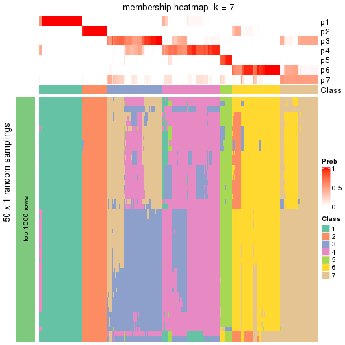</p>

</div>
<div id='tab-node-0-membership-heatmap-7'>
<pre><code class="r">membership_heatmap(res, k = 8)
</code></pre>

<p></p>

</div>
</div>

As soon as the classes for columns are determined, the signatures
that are significantly different between subgroups can be looked for. 
Following are the heatmaps for signatures.


<script>
$( function() {
	$( '#tabs-node-0-get-signatures' ).tabs();
} );
</script>
<div id='tabs-node-0-get-signatures'>
<ul>
<li><a href='#tab-node-0-get-signatures-1'>k = 2</a></li>
<li><a href='#tab-node-0-get-signatures-2'>k = 3</a></li>
<li><a href='#tab-node-0-get-signatures-3'>k = 4</a></li>
<li><a href='#tab-node-0-get-signatures-4'>k = 5</a></li>
<li><a href='#tab-node-0-get-signatures-5'>k = 6</a></li>
<li><a href='#tab-node-0-get-signatures-6'>k = 7</a></li>
<li><a href='#tab-node-0-get-signatures-7'>k = 8</a></li>
</ul>
<div id='tab-node-0-get-signatures-1'>
<pre><code class="r">get_signatures(res, k = 2)
</code></pre>

<p></p>

</div>
<div id='tab-node-0-get-signatures-2'>
<pre><code class="r">get_signatures(res, k = 3)
</code></pre>

<p></p>

</div>
<div id='tab-node-0-get-signatures-3'>
<pre><code class="r">get_signatures(res, k = 4)
</code></pre>

<p></p>

</div>
<div id='tab-node-0-get-signatures-4'>
<pre><code class="r">get_signatures(res, k = 5)
</code></pre>

<p></p>

</div>
<div id='tab-node-0-get-signatures-5'>
<pre><code class="r">get_signatures(res, k = 6)
</code></pre>

<p></p>

</div>
<div id='tab-node-0-get-signatures-6'>
<pre><code class="r">get_signatures(res, k = 7)
</code></pre>

<p></p>

</div>
<div id='tab-node-0-get-signatures-7'>
<pre><code class="r">get_signatures(res, k = 8)
</code></pre>

<p></p>

</div>
</div>


Compare the overlap of signatures from different k:

```r
compare_signatures(res)
```


`get_signature()` returns a data frame invisibly. To get the list of signatures, the function
call should be assigned to a variable explicitly. In following code, if `plot` argument is set
to `FALSE`, no heatmap is plotted while only the differential analysis is performed.

```r
# code only for demonstration
tb = get_signature(res, k = ..., plot = FALSE)
```

An example of the output of `tb` is:

```
#>   which_row         fdr    mean_1    mean_2 scaled_mean_1 scaled_mean_2 km
#> 1        38 0.042760348  8.373488  9.131774    -0.5533452     0.5164555  1
#> 2        40 0.018707592  7.106213  8.469186    -0.6173731     0.5762149  1
#> 3        55 0.019134737 10.221463 11.207825    -0.6159697     0.5749050  1
#> 4        59 0.006059896  5.921854  7.869574    -0.6899429     0.6439467  1
#> 5        60 0.018055526  8.928898 10.211722    -0.6204761     0.5791110  1
#> 6        98 0.009384629 15.714769 14.887706     0.6635654    -0.6193277  2
...
```

The columns in `tb` are:

1. `which_row`: row indices corresponding to the input matrix.
2. `fdr`: FDR for the differential test. 
3. `mean_x`: The mean value in group x.
4. `scaled_mean_x`: The mean value in group x after rows are scaled.
5. `km`: Row groups if k-means clustering is applied to rows (which is done by automatically selecting number of clusters).

If there are too many signatures, `top_signatures = ...` can be set to only show the 
signatures with the highest FDRs:

```r
# code only for demonstration
# e.g. to show the top 500 most significant rows
tb = get_signature(res, k = ..., top_signatures = 500)
```

If the signatures are defined as these which are uniquely high in current group, `diff_method` argument
can be set to `"uniquely_high_in_one_group"`:

```r
# code only for demonstration
tb = get_signature(res, k = ..., diff_method = "uniquely_high_in_one_group")
```


UMAP plot which shows how samples are separated.


<script>
$( function() {
	$( '#tabs-node-0-dimension-reduction' ).tabs();
} );
</script>
<div id='tabs-node-0-dimension-reduction'>
<ul>
<li><a href='#tab-node-0-dimension-reduction-1'>k = 2</a></li>
<li><a href='#tab-node-0-dimension-reduction-2'>k = 3</a></li>
<li><a href='#tab-node-0-dimension-reduction-3'>k = 4</a></li>
<li><a href='#tab-node-0-dimension-reduction-4'>k = 5</a></li>
<li><a href='#tab-node-0-dimension-reduction-5'>k = 6</a></li>
<li><a href='#tab-node-0-dimension-reduction-6'>k = 7</a></li>
<li><a href='#tab-node-0-dimension-reduction-7'>k = 8</a></li>
</ul>
<div id='tab-node-0-dimension-reduction-1'>
<pre><code class="r">dimension_reduction(res, k = 2, method = &quot;UMAP&quot;)
</code></pre>

<p></p>

</div>
<div id='tab-node-0-dimension-reduction-2'>
<pre><code class="r">dimension_reduction(res, k = 3, method = &quot;UMAP&quot;)
</code></pre>

<p></p>

</div>
<div id='tab-node-0-dimension-reduction-3'>
<pre><code class="r">dimension_reduction(res, k = 4, method = &quot;UMAP&quot;)
</code></pre>

<p></p>

</div>
<div id='tab-node-0-dimension-reduction-4'>
<pre><code class="r">dimension_reduction(res, k = 5, method = &quot;UMAP&quot;)
</code></pre>

<p></p>

</div>
<div id='tab-node-0-dimension-reduction-5'>
<pre><code class="r">dimension_reduction(res, k = 6, method = &quot;UMAP&quot;)
</code></pre>

<p></p>

</div>
<div id='tab-node-0-dimension-reduction-6'>
<pre><code class="r">dimension_reduction(res, k = 7, method = &quot;UMAP&quot;)
</code></pre>

<p></p>

</div>
<div id='tab-node-0-dimension-reduction-7'>
<pre><code class="r">dimension_reduction(res, k = 8, method = &quot;UMAP&quot;)
</code></pre>

<p></p>

</div>
</div>


Following heatmap shows how subgroups are split when increasing `k`:

```r
collect_classes(res)
```


If matrix rows can be associated to genes, consider to use `functional_enrichment(res,
...)` to perform function enrichment for the signature genes. See [this vignette](https://jokergoo.github.io/cola_vignettes/functional_enrichment.html) for more detailed explanations.


 

---------------------------------------------------


### Node01


Parent node: [Node0](#Node0).
Child nodes: 
                [Node011](#Node011)
        ,
                [Node012](#Node012)
        ,
                [Node013](#Node013)
        ,
                [Node021](#Node021)
        ,
                [Node022](#Node022)
        ,
                [Node023](#Node023)
        ,
                Node031-leaf
        ,
                [Node032](#Node032)
        ,
                [Node033](#Node033)
        .


The object with results only for a single top-value method and a single partitioning method 
can be extracted as:

```r
res = res_rh["01"]
```

A summary of `res` and all the functions that can be applied to it:

```r
res
```

```
#> A 'ConsensusPartition' object with k = 2, 3, 4, 5, 6, 7, 8.
#>   On a matrix with 30000 rows and 140 columns.
#>   Top rows (1000) are extracted by 'ATC' method.
#>   Subgroups are detected by 'kmeans' method.
#>   Performed in total 350 partitions by row resampling.
#>   Best k for subgroups seems to be 4.
#> 
#> Following methods can be applied to this 'ConsensusPartition' object:
#>  [1] "cola_report"             "collect_classes"         "collect_plots"          
#>  [4] "collect_stats"           "colnames"                "compare_partitions"     
#>  [7] "compare_signatures"      "consensus_heatmap"       "dimension_reduction"    
#> [10] "functional_enrichment"   "get_anno_col"            "get_anno"               
#> [13] "get_classes"             "get_consensus"           "get_matrix"             
#> [16] "get_membership"          "get_param"               "get_signatures"         
#> [19] "get_stats"               "is_best_k"               "is_stable_k"            
#> [22] "membership_heatmap"      "ncol"                    "nrow"                   
#> [25] "plot_ecdf"               "predict_classes"         "rownames"               
#> [28] "select_partition_number" "show"                    "suggest_best_k"         
#> [31] "test_to_known_factors"   "top_rows_heatmap"
```

`collect_plots()` function collects all the plots made from `res` for all `k` (number of subgroups)
into one single page to provide an easy and fast comparison between different `k`.

```r
collect_plots(res)
```


The plots are:

- The first row: a plot of the eCDF (empirical cumulative distribution
  function) curves of the consensus matrix for each `k` and the heatmap of
  predicted classes for each `k`.
- The second row: heatmaps of the consensus matrix for each `k`.
- The third row: heatmaps of the membership matrix for each `k`.
- The fouth row: heatmaps of the signatures for each `k`.

All the plots in panels can be made by individual functions and they are
plotted later in this section.

`select_partition_number()` produces several plots showing different
statistics for choosing "optimized" `k`. There are following statistics:

- eCDF curves of the consensus matrix for each `k`;
- 1-PAC. [The PAC score](https://en.wikipedia.org/wiki/Consensus_clustering#Over-interpretation_potential_of_consensus_clustering)
  measures the proportion of the ambiguous subgrouping.
- Mean silhouette score.
- Concordance. The mean probability of fiting the consensus subgroup labels in all
  partitions.
- Area increased. Denote $A_k$ as the area under the eCDF curve for current
  `k`, the area increased is defined as $A_k - A_{k-1}$.
- Rand index. The percent of pairs of samples that are both in a same cluster
  or both are not in a same cluster in the partition of k and k-1.
- Jaccard index. The ratio of pairs of samples are both in a same cluster in
  the partition of k and k-1 and the pairs of samples are both in a same
  cluster in the partition k or k-1.

The detailed explanations of these statistics can be found in [the _cola_
vignette](https://jokergoo.github.io/cola_vignettes/cola.html#toc_13).

Generally speaking, higher 1-PAC score, higher mean silhouette score or higher
concordance corresponds to better partition. Rand index and Jaccard index
measure how similar the current partition is compared to partition with `k-1`.
If they are too similar, we won't accept `k` is better than `k-1`.

```r
select_partition_number(res)
```


The numeric values for all these statistics can be obtained by `get_stats()`.

```r
get_stats(res)
```

```
#>   k 1-PAC mean_silhouette concordance area_increased  Rand Jaccard
#> 2 2 1.000           0.990       0.997         0.5019 0.499   0.499
#> 3 3 1.000           0.981       0.992         0.3346 0.746   0.531
#> 4 4 0.931           0.886       0.955         0.1104 0.869   0.636
#> 5 5 0.798           0.610       0.773         0.0632 0.946   0.797
#> 6 6 0.760           0.482       0.692         0.0367 0.869   0.503
#> 7 7 0.795           0.657       0.781         0.0261 0.901   0.545
#> 8 8 0.807           0.797       0.826         0.0192 0.931   0.616
```

`suggest_best_k()` suggests the best $k$ based on these statistics. The rules are as follows:

- All $k$ with Jaccard index larger than 0.95 are removed because increasing
  $k$ does not provide enough extra information. If all $k$ are removed, it is
  marked as no subgroup is detected.
- For all $k$ with 1-PAC score larger than 0.9, the maximal $k$ is taken as
  the best $k$, and other $k$ are marked as optional $k$.
- If it does not fit the second rule. The $k$ with the maximal vote of the
  highest 1-PAC score, highest mean silhouette, and highest concordance is
  taken as the best $k$.

```r
suggest_best_k(res)
```

```
#> [1] 4
#> attr(,"optional")
#> [1] 2 3
```

There is also optional best $k$ = 2 3 that is worth to check.

Following is the table of the partitions (You need to click the **show/hide
code output** link to see it). The membership matrix (columns with name `p*`)
is inferred by
[`clue::cl_consensus()`](https://www.rdocumentation.org/link/cl_consensus?package=clue)
function with the `SE` method. Basically the value in the membership matrix
represents the probability to belong to a certain group. The finall subgroup
label for an item is determined with the group with highest probability it
belongs to.

In `get_classes()` function, the entropy is calculated from the membership
matrix and the silhouette score is calculated from the consensus matrix.


<script>
$( function() {
	$( '#tabs-node-01-get-classes' ).tabs();
} );
</script>
<div id='tabs-node-01-get-classes'>
<ul>
<li><a href='#tab-node-01-get-classes-1'>k = 2</a></li>
<li><a href='#tab-node-01-get-classes-2'>k = 3</a></li>
<li><a href='#tab-node-01-get-classes-3'>k = 4</a></li>
<li><a href='#tab-node-01-get-classes-4'>k = 5</a></li>
<li><a href='#tab-node-01-get-classes-5'>k = 6</a></li>
<li><a href='#tab-node-01-get-classes-6'>k = 7</a></li>
<li><a href='#tab-node-01-get-classes-7'>k = 8</a></li>
</ul>

<div id='tab-node-01-get-classes-1'>
<p><a id='tab-node-01-get-classes-1-a' style='color:#0366d6' href='#'>show/hide code output</a></p>
<pre><code class="r">cbind(get_classes(res, k = 2), get_membership(res, k = 2))
</code></pre>

<pre><code>#&gt;                 class entropy silhouette   p1   p2
#&gt; TCGA.E5.A2PC.01     2   0.000      0.994 0.00 1.00
#&gt; TCGA.FD.A3N6.01     2   0.000      0.994 0.00 1.00
#&gt; TCGA.GV.A3JW.01     1   0.000      1.000 1.00 0.00
#&gt; TCGA.ZF.A9R3.01     1   0.000      1.000 1.00 0.00
#&gt; TCGA.DK.AA6L.01     2   0.000      0.994 0.00 1.00
#&gt; TCGA.XF.A8HG.01     2   0.000      0.994 0.00 1.00
#&gt; TCGA.DK.AA76.01     2   0.000      0.994 0.00 1.00
#&gt; TCGA.KQ.A41O.01     2   0.000      0.994 0.00 1.00
#&gt; TCGA.CF.A47T.01     2   0.000      0.994 0.00 1.00
#&gt; TCGA.HQ.A2OE.01     2   0.000      0.994 0.00 1.00
#&gt; TCGA.DK.A1AA.01     1   0.000      1.000 1.00 0.00
#&gt; TCGA.XF.AAN1.01     1   0.000      1.000 1.00 0.00
#&gt; TCGA.GC.A3RD.01     2   0.000      0.994 0.00 1.00
#&gt; TCGA.4Z.AA7S.01     1   0.000      1.000 1.00 0.00
#&gt; TCGA.DK.A1AE.01     1   0.000      1.000 1.00 0.00
#&gt; TCGA.4Z.AA7O.01     1   0.000      1.000 1.00 0.00
#&gt; TCGA.G2.AA3B.01     2   0.000      0.994 0.00 1.00
#&gt; TCGA.UY.A78O.01     1   0.000      1.000 1.00 0.00
#&gt; TCGA.CF.A5U8.01     1   0.000      1.000 1.00 0.00
#&gt; TCGA.FD.A62O.01     1   0.000      1.000 1.00 0.00
#&gt; TCGA.MV.A51V.01     2   0.000      0.994 0.00 1.00
#&gt; TCGA.DK.A2I6.01     2   0.000      0.994 0.00 1.00
#&gt; TCGA.FJ.A3ZF.01     2   0.000      0.994 0.00 1.00
#&gt; TCGA.4Z.AA87.01     2   0.000      0.994 0.00 1.00
#&gt; TCGA.XF.A9SV.01     1   0.000      1.000 1.00 0.00
#&gt; TCGA.GV.A3JX.01     1   0.000      1.000 1.00 0.00
#&gt; TCGA.UY.A9PD.01     2   0.000      0.994 0.00 1.00
#&gt; TCGA.GU.A763.01     2   0.000      0.994 0.00 1.00
#&gt; TCGA.E7.A5KF.01     1   0.000      1.000 1.00 0.00
#&gt; TCGA.4Z.AA83.01     1   0.000      1.000 1.00 0.00
#&gt; TCGA.CU.A72E.01     2   0.000      0.994 0.00 1.00
#&gt; TCGA.G2.A2EL.01     2   0.000      0.994 0.00 1.00
#&gt; TCGA.BT.A3PH.01     2   0.000      0.994 0.00 1.00
#&gt; TCGA.FD.A6TH.01     1   0.000      1.000 1.00 0.00
#&gt; TCGA.2F.A9KR.01     1   0.000      1.000 1.00 0.00
#&gt; TCGA.ZF.AA4U.01     2   0.000      0.994 0.00 1.00
#&gt; TCGA.ZF.A9RE.01     2   0.000      0.994 0.00 1.00
#&gt; TCGA.GC.A3RB.01     2   0.000      0.994 0.00 1.00
#&gt; TCGA.XF.AAMF.01     1   0.000      1.000 1.00 0.00
#&gt; TCGA.CF.A3MH.01     1   0.000      1.000 1.00 0.00
#&gt; TCGA.DK.A1AD.01     2   0.000      0.994 0.00 1.00
#&gt; TCGA.CF.A8HX.01     2   0.000      0.994 0.00 1.00
#&gt; TCGA.C4.A0F6.01     2   0.000      0.994 0.00 1.00
#&gt; TCGA.XF.AAMQ.01     1   0.000      1.000 1.00 0.00
#&gt; TCGA.CF.A27C.01     1   0.000      1.000 1.00 0.00
#&gt; TCGA.BL.A0C8.01     2   0.000      0.994 0.00 1.00
#&gt; TCGA.G2.A3VY.01     2   0.000      0.994 0.00 1.00
#&gt; TCGA.YF.AA3M.01     1   0.000      1.000 1.00 0.00
#&gt; TCGA.UY.A78N.01     1   0.000      1.000 1.00 0.00
#&gt; TCGA.G2.AA3F.01     1   0.000      1.000 1.00 0.00
#&gt; TCGA.K4.A6MB.01     2   0.000      0.994 0.00 1.00
#&gt; TCGA.XF.AAN7.01     2   0.000      0.994 0.00 1.00
#&gt; TCGA.KQ.A41R.01     2   0.000      0.994 0.00 1.00
#&gt; TCGA.GC.A3BM.01     2   0.000      0.994 0.00 1.00
#&gt; TCGA.CF.A7I0.01     2   0.000      0.994 0.00 1.00
#&gt; TCGA.E7.A4IJ.01     2   0.000      0.994 0.00 1.00
#&gt; TCGA.FD.A5BV.01     2   0.000      0.994 0.00 1.00
#&gt; TCGA.DK.A3IL.01     1   0.000      1.000 1.00 0.00
#&gt; TCGA.FD.A43X.01     1   0.000      1.000 1.00 0.00
#&gt; TCGA.4Z.AA7Y.01     1   0.000      1.000 1.00 0.00
#&gt; TCGA.KQ.A41Q.01     2   0.000      0.994 0.00 1.00
#&gt; TCGA.GU.AATQ.01     2   0.000      0.994 0.00 1.00
#&gt; TCGA.FD.A6TE.01     1   0.000      1.000 1.00 0.00
#&gt; TCGA.CF.A3MG.01     1   0.000      1.000 1.00 0.00
#&gt; TCGA.UY.A8OB.01     2   0.000      0.994 0.00 1.00
#&gt; TCGA.GD.A3OQ.01     1   0.000      1.000 1.00 0.00
#&gt; TCGA.CF.A47X.01     2   0.000      0.994 0.00 1.00
#&gt; TCGA.ZF.A9R4.01     1   0.000      1.000 1.00 0.00
#&gt; TCGA.FJ.A3ZE.01     1   0.000      1.000 1.00 0.00
#&gt; TCGA.DK.AA75.01     2   0.000      0.994 0.00 1.00
#&gt; TCGA.GV.A3JZ.01     2   0.000      0.994 0.00 1.00
#&gt; TCGA.4Z.AA89.01     1   0.000      1.000 1.00 0.00
#&gt; TCGA.GD.A6C6.01     2   0.000      0.994 0.00 1.00
#&gt; TCGA.XF.A8HI.01     1   0.000      1.000 1.00 0.00
#&gt; TCGA.2F.A9KQ.01     2   0.000      0.994 0.00 1.00
#&gt; TCGA.G2.A3IB.01     1   0.000      1.000 1.00 0.00
#&gt; TCGA.CU.A3KJ.01     2   0.000      0.994 0.00 1.00
#&gt; TCGA.YF.AA3L.01     1   0.000      1.000 1.00 0.00
#&gt; TCGA.DK.A1A6.01     1   0.000      1.000 1.00 0.00
#&gt; TCGA.K4.A4AB.01     2   0.000      0.994 0.00 1.00
#&gt; TCGA.4Z.AA7M.01     2   0.000      0.994 0.00 1.00
#&gt; TCGA.CF.A9FF.01     1   0.000      1.000 1.00 0.00
#&gt; TCGA.LT.A8JT.01     1   0.000      1.000 1.00 0.00
#&gt; TCGA.XF.AAML.01     1   0.000      1.000 1.00 0.00
#&gt; TCGA.5N.A9KM.01     1   0.000      1.000 1.00 0.00
#&gt; TCGA.4Z.AA7R.01     2   0.000      0.994 0.00 1.00
#&gt; TCGA.DK.A3IS.01     2   0.000      0.994 0.00 1.00
#&gt; TCGA.DK.AA6P.01     1   0.141      0.979 0.98 0.02
#&gt; TCGA.E5.A4TZ.01     2   0.000      0.994 0.00 1.00
#&gt; TCGA.E7.A7PW.01     1   0.000      1.000 1.00 0.00
#&gt; TCGA.GV.A6ZA.01     2   0.000      0.994 0.00 1.00
#&gt; TCGA.FD.A43N.01     2   0.000      0.994 0.00 1.00
#&gt; TCGA.FD.A3B5.01     2   0.000      0.994 0.00 1.00
#&gt; TCGA.4Z.AA80.01     2   0.000      0.994 0.00 1.00
#&gt; TCGA.CF.A3MF.01     1   0.000      1.000 1.00 0.00
#&gt; TCGA.E7.A7DU.01     1   0.000      1.000 1.00 0.00
#&gt; TCGA.DK.A6B1.01     2   0.000      0.994 0.00 1.00
#&gt; TCGA.5N.A9KI.01     1   0.000      1.000 1.00 0.00
#&gt; TCGA.CF.A9FL.01     2   0.000      0.994 0.00 1.00
#&gt; TCGA.S5.AA26.01     2   0.995      0.147 0.46 0.54
#&gt; TCGA.E5.A4U1.01     2   0.000      0.994 0.00 1.00
#&gt; TCGA.E7.A5KE.01     2   0.000      0.994 0.00 1.00
#&gt; TCGA.GV.A40G.01     1   0.000      1.000 1.00 0.00
#&gt; TCGA.CF.A8HY.01     1   0.000      1.000 1.00 0.00
#&gt; TCGA.CF.A3MI.01     1   0.000      1.000 1.00 0.00
#&gt; TCGA.ZF.A9RL.01     1   0.000      1.000 1.00 0.00
#&gt; TCGA.HQ.A5ND.01     2   0.000      0.994 0.00 1.00
#&gt; TCGA.BT.A42C.01     1   0.000      1.000 1.00 0.00
#&gt; TCGA.E7.A8O8.01     2   0.000      0.994 0.00 1.00
#&gt; TCGA.XF.A9T0.01     2   0.000      0.994 0.00 1.00
#&gt; TCGA.DK.A6AW.01     1   0.000      1.000 1.00 0.00
#&gt; TCGA.ZF.A9R5.01     1   0.000      1.000 1.00 0.00
#&gt; TCGA.2F.A9KP.01     2   0.000      0.994 0.00 1.00
#&gt; TCGA.GU.A42P.01     2   0.000      0.994 0.00 1.00
#&gt; TCGA.KQ.A41N.01     2   0.000      0.994 0.00 1.00
#&gt; TCGA.ZF.A9R2.01     2   0.000      0.994 0.00 1.00
#&gt; TCGA.XF.A8HC.01     1   0.000      1.000 1.00 0.00
#&gt; TCGA.XF.AAMG.01     2   0.000      0.994 0.00 1.00
#&gt; TCGA.XF.A9T6.01     1   0.000      1.000 1.00 0.00
#&gt; TCGA.DK.A1AG.01     1   0.000      1.000 1.00 0.00
#&gt; TCGA.E7.A3Y1.01     1   0.000      1.000 1.00 0.00
#&gt; TCGA.XF.A8HF.01     2   0.000      0.994 0.00 1.00
#&gt; TCGA.CU.A3QU.01     1   0.000      1.000 1.00 0.00
#&gt; TCGA.KQ.A41P.01     2   0.000      0.994 0.00 1.00
#&gt; TCGA.XF.A9T2.01     1   0.000      1.000 1.00 0.00
#&gt; TCGA.DK.AA6U.01     2   0.000      0.994 0.00 1.00
#&gt; TCGA.UY.A78M.01     2   0.000      0.994 0.00 1.00
#&gt; TCGA.H4.A2HQ.01     2   0.000      0.994 0.00 1.00
#&gt; TCGA.E7.A4XJ.01     1   0.000      1.000 1.00 0.00
#&gt; TCGA.E7.A678.01     1   0.000      1.000 1.00 0.00
#&gt; TCGA.K4.A5RI.01     2   0.000      0.994 0.00 1.00
#&gt; TCGA.DK.AA77.01     2   0.000      0.994 0.00 1.00
#&gt; TCGA.E7.A97Q.01     2   0.000      0.994 0.00 1.00
#&gt; TCGA.XF.AAMX.01     2   0.000      0.994 0.00 1.00
#&gt; TCGA.XF.A9SH.01     1   0.000      1.000 1.00 0.00
#&gt; TCGA.DK.A3X2.01     2   0.000      0.994 0.00 1.00
#&gt; TCGA.ZF.A9RN.01     1   0.000      1.000 1.00 0.00
#&gt; TCGA.FJ.A3Z9.01     1   0.000      1.000 1.00 0.00
#&gt; TCGA.E7.A677.01     1   0.000      1.000 1.00 0.00
#&gt; TCGA.CF.A9FH.01     1   0.000      1.000 1.00 0.00
</code></pre>

<script>
$('#tab-node-01-get-classes-1-a').parent().next().next().hide();
$('#tab-node-01-get-classes-1-a').click(function(){
  $('#tab-node-01-get-classes-1-a').parent().next().next().toggle();
  return(false);
});
</script>
</div>

<div id='tab-node-01-get-classes-2'>
<p><a id='tab-node-01-get-classes-2-a' style='color:#0366d6' href='#'>show/hide code output</a></p>
<pre><code class="r">cbind(get_classes(res, k = 3), get_membership(res, k = 3))
</code></pre>

<pre><code>#&gt;                 class entropy silhouette   p1   p2   p3
#&gt; TCGA.E5.A2PC.01     2  0.0000     0.9992 0.00 1.00 0.00
#&gt; TCGA.FD.A3N6.01     3  0.0000     0.9862 0.00 0.00 1.00
#&gt; TCGA.GV.A3JW.01     1  0.0000     0.9897 1.00 0.00 0.00
#&gt; TCGA.ZF.A9R3.01     1  0.0000     0.9897 1.00 0.00 0.00
#&gt; TCGA.DK.AA6L.01     2  0.0000     0.9992 0.00 1.00 0.00
#&gt; TCGA.XF.A8HG.01     3  0.0000     0.9862 0.00 0.00 1.00
#&gt; TCGA.DK.AA76.01     2  0.0000     0.9992 0.00 1.00 0.00
#&gt; TCGA.KQ.A41O.01     2  0.0000     0.9992 0.00 1.00 0.00
#&gt; TCGA.CF.A47T.01     3  0.0000     0.9862 0.00 0.00 1.00
#&gt; TCGA.HQ.A2OE.01     2  0.0000     0.9992 0.00 1.00 0.00
#&gt; TCGA.DK.A1AA.01     3  0.0892     0.9700 0.02 0.00 0.98
#&gt; TCGA.XF.AAN1.01     1  0.0000     0.9897 1.00 0.00 0.00
#&gt; TCGA.GC.A3RD.01     3  0.0000     0.9862 0.00 0.00 1.00
#&gt; TCGA.4Z.AA7S.01     1  0.0000     0.9897 1.00 0.00 0.00
#&gt; TCGA.DK.A1AE.01     3  0.0000     0.9862 0.00 0.00 1.00
#&gt; TCGA.4Z.AA7O.01     3  0.0000     0.9862 0.00 0.00 1.00
#&gt; TCGA.G2.AA3B.01     3  0.0000     0.9862 0.00 0.00 1.00
#&gt; TCGA.UY.A78O.01     1  0.0000     0.9897 1.00 0.00 0.00
#&gt; TCGA.CF.A5U8.01     1  0.0000     0.9897 1.00 0.00 0.00
#&gt; TCGA.FD.A62O.01     1  0.0000     0.9897 1.00 0.00 0.00
#&gt; TCGA.MV.A51V.01     2  0.0000     0.9992 0.00 1.00 0.00
#&gt; TCGA.DK.A2I6.01     2  0.0000     0.9992 0.00 1.00 0.00
#&gt; TCGA.FJ.A3ZF.01     2  0.0000     0.9992 0.00 1.00 0.00
#&gt; TCGA.4Z.AA87.01     2  0.0000     0.9992 0.00 1.00 0.00
#&gt; TCGA.XF.A9SV.01     1  0.0000     0.9897 1.00 0.00 0.00
#&gt; TCGA.GV.A3JX.01     1  0.0000     0.9897 1.00 0.00 0.00
#&gt; TCGA.UY.A9PD.01     2  0.0000     0.9992 0.00 1.00 0.00
#&gt; TCGA.GU.A763.01     3  0.0000     0.9862 0.00 0.00 1.00
#&gt; TCGA.E7.A5KF.01     1  0.0000     0.9897 1.00 0.00 0.00
#&gt; TCGA.4Z.AA83.01     1  0.0000     0.9897 1.00 0.00 0.00
#&gt; TCGA.CU.A72E.01     2  0.0000     0.9992 0.00 1.00 0.00
#&gt; TCGA.G2.A2EL.01     2  0.0892     0.9803 0.00 0.98 0.02
#&gt; TCGA.BT.A3PH.01     2  0.0000     0.9992 0.00 1.00 0.00
#&gt; TCGA.FD.A6TH.01     1  0.0000     0.9897 1.00 0.00 0.00
#&gt; TCGA.2F.A9KR.01     3  0.0000     0.9862 0.00 0.00 1.00
#&gt; TCGA.ZF.AA4U.01     2  0.0000     0.9992 0.00 1.00 0.00
#&gt; TCGA.ZF.A9RE.01     2  0.0000     0.9992 0.00 1.00 0.00
#&gt; TCGA.GC.A3RB.01     2  0.0000     0.9992 0.00 1.00 0.00
#&gt; TCGA.XF.AAMF.01     1  0.0000     0.9897 1.00 0.00 0.00
#&gt; TCGA.CF.A3MH.01     1  0.0000     0.9897 1.00 0.00 0.00
#&gt; TCGA.DK.A1AD.01     2  0.0000     0.9992 0.00 1.00 0.00
#&gt; TCGA.CF.A8HX.01     3  0.0000     0.9862 0.00 0.00 1.00
#&gt; TCGA.C4.A0F6.01     2  0.0000     0.9992 0.00 1.00 0.00
#&gt; TCGA.XF.AAMQ.01     1  0.0000     0.9897 1.00 0.00 0.00
#&gt; TCGA.CF.A27C.01     3  0.0000     0.9862 0.00 0.00 1.00
#&gt; TCGA.BL.A0C8.01     3  0.0000     0.9862 0.00 0.00 1.00
#&gt; TCGA.G2.A3VY.01     2  0.0000     0.9992 0.00 1.00 0.00
#&gt; TCGA.YF.AA3M.01     3  0.5216     0.6583 0.26 0.00 0.74
#&gt; TCGA.UY.A78N.01     1  0.0000     0.9897 1.00 0.00 0.00
#&gt; TCGA.G2.AA3F.01     1  0.0000     0.9897 1.00 0.00 0.00
#&gt; TCGA.K4.A6MB.01     2  0.0000     0.9992 0.00 1.00 0.00
#&gt; TCGA.XF.AAN7.01     2  0.0000     0.9992 0.00 1.00 0.00
#&gt; TCGA.KQ.A41R.01     2  0.0000     0.9992 0.00 1.00 0.00
#&gt; TCGA.GC.A3BM.01     3  0.0000     0.9862 0.00 0.00 1.00
#&gt; TCGA.CF.A7I0.01     2  0.0000     0.9992 0.00 1.00 0.00
#&gt; TCGA.E7.A4IJ.01     2  0.0000     0.9992 0.00 1.00 0.00
#&gt; TCGA.FD.A5BV.01     2  0.0000     0.9992 0.00 1.00 0.00
#&gt; TCGA.DK.A3IL.01     1  0.0000     0.9897 1.00 0.00 0.00
#&gt; TCGA.FD.A43X.01     3  0.0000     0.9862 0.00 0.00 1.00
#&gt; TCGA.4Z.AA7Y.01     1  0.0000     0.9897 1.00 0.00 0.00
#&gt; TCGA.KQ.A41Q.01     3  0.0892     0.9687 0.00 0.02 0.98
#&gt; TCGA.GU.AATQ.01     2  0.0000     0.9992 0.00 1.00 0.00
#&gt; TCGA.FD.A6TE.01     1  0.0000     0.9897 1.00 0.00 0.00
#&gt; TCGA.CF.A3MG.01     1  0.0000     0.9897 1.00 0.00 0.00
#&gt; TCGA.UY.A8OB.01     2  0.0892     0.9803 0.00 0.98 0.02
#&gt; TCGA.GD.A3OQ.01     1  0.0000     0.9897 1.00 0.00 0.00
#&gt; TCGA.CF.A47X.01     3  0.0000     0.9862 0.00 0.00 1.00
#&gt; TCGA.ZF.A9R4.01     1  0.0000     0.9897 1.00 0.00 0.00
#&gt; TCGA.FJ.A3ZE.01     1  0.0000     0.9897 1.00 0.00 0.00
#&gt; TCGA.DK.AA75.01     2  0.0000     0.9992 0.00 1.00 0.00
#&gt; TCGA.GV.A3JZ.01     2  0.0000     0.9992 0.00 1.00 0.00
#&gt; TCGA.4Z.AA89.01     1  0.0000     0.9897 1.00 0.00 0.00
#&gt; TCGA.GD.A6C6.01     3  0.0000     0.9862 0.00 0.00 1.00
#&gt; TCGA.XF.A8HI.01     1  0.0000     0.9897 1.00 0.00 0.00
#&gt; TCGA.2F.A9KQ.01     2  0.0000     0.9992 0.00 1.00 0.00
#&gt; TCGA.G2.A3IB.01     3  0.0000     0.9862 0.00 0.00 1.00
#&gt; TCGA.CU.A3KJ.01     3  0.0000     0.9862 0.00 0.00 1.00
#&gt; TCGA.YF.AA3L.01     1  0.0000     0.9897 1.00 0.00 0.00
#&gt; TCGA.DK.A1A6.01     1  0.0000     0.9897 1.00 0.00 0.00
#&gt; TCGA.K4.A4AB.01     2  0.0000     0.9992 0.00 1.00 0.00
#&gt; TCGA.4Z.AA7M.01     2  0.0000     0.9992 0.00 1.00 0.00
#&gt; TCGA.CF.A9FF.01     1  0.0000     0.9897 1.00 0.00 0.00
#&gt; TCGA.LT.A8JT.01     3  0.2959     0.8912 0.10 0.00 0.90
#&gt; TCGA.XF.AAML.01     1  0.0000     0.9897 1.00 0.00 0.00
#&gt; TCGA.5N.A9KM.01     3  0.0000     0.9862 0.00 0.00 1.00
#&gt; TCGA.4Z.AA7R.01     2  0.0000     0.9992 0.00 1.00 0.00
#&gt; TCGA.DK.A3IS.01     2  0.0000     0.9992 0.00 1.00 0.00
#&gt; TCGA.DK.AA6P.01     3  0.0000     0.9862 0.00 0.00 1.00
#&gt; TCGA.E5.A4TZ.01     2  0.0000     0.9992 0.00 1.00 0.00
#&gt; TCGA.E7.A7PW.01     1  0.0000     0.9897 1.00 0.00 0.00
#&gt; TCGA.GV.A6ZA.01     2  0.0000     0.9992 0.00 1.00 0.00
#&gt; TCGA.FD.A43N.01     2  0.0000     0.9992 0.00 1.00 0.00
#&gt; TCGA.FD.A3B5.01     3  0.0000     0.9862 0.00 0.00 1.00
#&gt; TCGA.4Z.AA80.01     2  0.0000     0.9992 0.00 1.00 0.00
#&gt; TCGA.CF.A3MF.01     1  0.0000     0.9897 1.00 0.00 0.00
#&gt; TCGA.E7.A7DU.01     1  0.0000     0.9897 1.00 0.00 0.00
#&gt; TCGA.DK.A6B1.01     3  0.0000     0.9862 0.00 0.00 1.00
#&gt; TCGA.5N.A9KI.01     3  0.0000     0.9862 0.00 0.00 1.00
#&gt; TCGA.CF.A9FL.01     2  0.0000     0.9992 0.00 1.00 0.00
#&gt; TCGA.S5.AA26.01     3  0.0000     0.9862 0.00 0.00 1.00
#&gt; TCGA.E5.A4U1.01     3  0.0000     0.9862 0.00 0.00 1.00
#&gt; TCGA.E7.A5KE.01     2  0.0000     0.9992 0.00 1.00 0.00
#&gt; TCGA.GV.A40G.01     1  0.0000     0.9897 1.00 0.00 0.00
#&gt; TCGA.CF.A8HY.01     1  0.0000     0.9897 1.00 0.00 0.00
#&gt; TCGA.CF.A3MI.01     1  0.0000     0.9897 1.00 0.00 0.00
#&gt; TCGA.ZF.A9RL.01     1  0.0000     0.9897 1.00 0.00 0.00
#&gt; TCGA.HQ.A5ND.01     3  0.0000     0.9862 0.00 0.00 1.00
#&gt; TCGA.BT.A42C.01     3  0.2959     0.8912 0.10 0.00 0.90
#&gt; TCGA.E7.A8O8.01     3  0.0000     0.9862 0.00 0.00 1.00
#&gt; TCGA.XF.A9T0.01     2  0.0000     0.9992 0.00 1.00 0.00
#&gt; TCGA.DK.A6AW.01     1  0.0000     0.9897 1.00 0.00 0.00
#&gt; TCGA.ZF.A9R5.01     1  0.0000     0.9897 1.00 0.00 0.00
#&gt; TCGA.2F.A9KP.01     3  0.0000     0.9862 0.00 0.00 1.00
#&gt; TCGA.GU.A42P.01     2  0.0000     0.9992 0.00 1.00 0.00
#&gt; TCGA.KQ.A41N.01     2  0.0000     0.9992 0.00 1.00 0.00
#&gt; TCGA.ZF.A9R2.01     3  0.0000     0.9862 0.00 0.00 1.00
#&gt; TCGA.XF.A8HC.01     1  0.0000     0.9897 1.00 0.00 0.00
#&gt; TCGA.XF.AAMG.01     2  0.0000     0.9992 0.00 1.00 0.00
#&gt; TCGA.XF.A9T6.01     1  0.0000     0.9897 1.00 0.00 0.00
#&gt; TCGA.DK.A1AG.01     1  0.0000     0.9897 1.00 0.00 0.00
#&gt; TCGA.E7.A3Y1.01     3  0.0000     0.9862 0.00 0.00 1.00
#&gt; TCGA.XF.A8HF.01     2  0.0000     0.9992 0.00 1.00 0.00
#&gt; TCGA.CU.A3QU.01     3  0.2066     0.9330 0.06 0.00 0.94
#&gt; TCGA.KQ.A41P.01     2  0.0000     0.9992 0.00 1.00 0.00
#&gt; TCGA.XF.A9T2.01     1  0.6302     0.0422 0.52 0.00 0.48
#&gt; TCGA.DK.AA6U.01     2  0.0000     0.9992 0.00 1.00 0.00
#&gt; TCGA.UY.A78M.01     3  0.0000     0.9862 0.00 0.00 1.00
#&gt; TCGA.H4.A2HQ.01     2  0.0000     0.9992 0.00 1.00 0.00
#&gt; TCGA.E7.A4XJ.01     1  0.0000     0.9897 1.00 0.00 0.00
#&gt; TCGA.E7.A678.01     1  0.0000     0.9897 1.00 0.00 0.00
#&gt; TCGA.K4.A5RI.01     3  0.0000     0.9862 0.00 0.00 1.00
#&gt; TCGA.DK.AA77.01     3  0.0000     0.9862 0.00 0.00 1.00
#&gt; TCGA.E7.A97Q.01     3  0.0000     0.9862 0.00 0.00 1.00
#&gt; TCGA.XF.AAMX.01     2  0.0000     0.9992 0.00 1.00 0.00
#&gt; TCGA.XF.A9SH.01     1  0.0000     0.9897 1.00 0.00 0.00
#&gt; TCGA.DK.A3X2.01     3  0.0000     0.9862 0.00 0.00 1.00
#&gt; TCGA.ZF.A9RN.01     3  0.0000     0.9862 0.00 0.00 1.00
#&gt; TCGA.FJ.A3Z9.01     1  0.0000     0.9897 1.00 0.00 0.00
#&gt; TCGA.E7.A677.01     1  0.0000     0.9897 1.00 0.00 0.00
#&gt; TCGA.CF.A9FH.01     1  0.0000     0.9897 1.00 0.00 0.00
</code></pre>

<script>
$('#tab-node-01-get-classes-2-a').parent().next().next().hide();
$('#tab-node-01-get-classes-2-a').click(function(){
  $('#tab-node-01-get-classes-2-a').parent().next().next().toggle();
  return(false);
});
</script>
</div>

<div id='tab-node-01-get-classes-3'>
<p><a id='tab-node-01-get-classes-3-a' style='color:#0366d6' href='#'>show/hide code output</a></p>
<pre><code class="r">cbind(get_classes(res, k = 4), get_membership(res, k = 4))
</code></pre>

<pre><code>#&gt;                 class entropy silhouette   p1   p2   p3   p4
#&gt; TCGA.E5.A2PC.01     2  0.0000     1.0000 0.00 1.00 0.00 0.00
#&gt; TCGA.FD.A3N6.01     3  0.0000     0.8971 0.00 0.00 1.00 0.00
#&gt; TCGA.GV.A3JW.01     1  0.0000     0.9394 1.00 0.00 0.00 0.00
#&gt; TCGA.ZF.A9R3.01     1  0.0000     0.9394 1.00 0.00 0.00 0.00
#&gt; TCGA.DK.AA6L.01     3  0.4624     0.4870 0.00 0.34 0.66 0.00
#&gt; TCGA.XF.A8HG.01     3  0.0000     0.8971 0.00 0.00 1.00 0.00
#&gt; TCGA.DK.AA76.01     2  0.0000     1.0000 0.00 1.00 0.00 0.00
#&gt; TCGA.KQ.A41O.01     2  0.0000     1.0000 0.00 1.00 0.00 0.00
#&gt; TCGA.CF.A47T.01     3  0.0000     0.8971 0.00 0.00 1.00 0.00
#&gt; TCGA.HQ.A2OE.01     2  0.0000     1.0000 0.00 1.00 0.00 0.00
#&gt; TCGA.DK.A1AA.01     4  0.0000     0.9337 0.00 0.00 0.00 1.00
#&gt; TCGA.XF.AAN1.01     1  0.0000     0.9394 1.00 0.00 0.00 0.00
#&gt; TCGA.GC.A3RD.01     3  0.0000     0.8971 0.00 0.00 1.00 0.00
#&gt; TCGA.4Z.AA7S.01     1  0.0000     0.9394 1.00 0.00 0.00 0.00
#&gt; TCGA.DK.A1AE.01     4  0.4522     0.4499 0.00 0.00 0.32 0.68
#&gt; TCGA.4Z.AA7O.01     4  0.0000     0.9337 0.00 0.00 0.00 1.00
#&gt; TCGA.G2.AA3B.01     3  0.0000     0.8971 0.00 0.00 1.00 0.00
#&gt; TCGA.UY.A78O.01     1  0.0000     0.9394 1.00 0.00 0.00 0.00
#&gt; TCGA.CF.A5U8.01     1  0.0000     0.9394 1.00 0.00 0.00 0.00
#&gt; TCGA.FD.A62O.01     1  0.0000     0.9394 1.00 0.00 0.00 0.00
#&gt; TCGA.MV.A51V.01     2  0.0000     1.0000 0.00 1.00 0.00 0.00
#&gt; TCGA.DK.A2I6.01     2  0.0000     1.0000 0.00 1.00 0.00 0.00
#&gt; TCGA.FJ.A3ZF.01     2  0.0000     1.0000 0.00 1.00 0.00 0.00
#&gt; TCGA.4Z.AA87.01     2  0.0000     1.0000 0.00 1.00 0.00 0.00
#&gt; TCGA.XF.A9SV.01     1  0.0000     0.9394 1.00 0.00 0.00 0.00
#&gt; TCGA.GV.A3JX.01     4  0.0000     0.9337 0.00 0.00 0.00 1.00
#&gt; TCGA.UY.A9PD.01     2  0.0000     1.0000 0.00 1.00 0.00 0.00
#&gt; TCGA.GU.A763.01     3  0.0000     0.8971 0.00 0.00 1.00 0.00
#&gt; TCGA.E7.A5KF.01     1  0.0000     0.9394 1.00 0.00 0.00 0.00
#&gt; TCGA.4Z.AA83.01     1  0.0000     0.9394 1.00 0.00 0.00 0.00
#&gt; TCGA.CU.A72E.01     2  0.0000     1.0000 0.00 1.00 0.00 0.00
#&gt; TCGA.G2.A2EL.01     3  0.0000     0.8971 0.00 0.00 1.00 0.00
#&gt; TCGA.BT.A3PH.01     2  0.0000     1.0000 0.00 1.00 0.00 0.00
#&gt; TCGA.FD.A6TH.01     1  0.0000     0.9394 1.00 0.00 0.00 0.00
#&gt; TCGA.2F.A9KR.01     4  0.3400     0.7236 0.00 0.00 0.18 0.82
#&gt; TCGA.ZF.AA4U.01     2  0.0000     1.0000 0.00 1.00 0.00 0.00
#&gt; TCGA.ZF.A9RE.01     3  0.5000     0.0315 0.00 0.50 0.50 0.00
#&gt; TCGA.GC.A3RB.01     2  0.0000     1.0000 0.00 1.00 0.00 0.00
#&gt; TCGA.XF.AAMF.01     1  0.5000     0.0538 0.50 0.00 0.00 0.50
#&gt; TCGA.CF.A3MH.01     1  0.0000     0.9394 1.00 0.00 0.00 0.00
#&gt; TCGA.DK.A1AD.01     2  0.0000     1.0000 0.00 1.00 0.00 0.00
#&gt; TCGA.CF.A8HX.01     3  0.0000     0.8971 0.00 0.00 1.00 0.00
#&gt; TCGA.C4.A0F6.01     2  0.0000     1.0000 0.00 1.00 0.00 0.00
#&gt; TCGA.XF.AAMQ.01     1  0.0000     0.9394 1.00 0.00 0.00 0.00
#&gt; TCGA.CF.A27C.01     4  0.0000     0.9337 0.00 0.00 0.00 1.00
#&gt; TCGA.BL.A0C8.01     3  0.3801     0.7131 0.00 0.00 0.78 0.22
#&gt; TCGA.G2.A3VY.01     2  0.0000     1.0000 0.00 1.00 0.00 0.00
#&gt; TCGA.YF.AA3M.01     4  0.0000     0.9337 0.00 0.00 0.00 1.00
#&gt; TCGA.UY.A78N.01     1  0.0000     0.9394 1.00 0.00 0.00 0.00
#&gt; TCGA.G2.AA3F.01     4  0.0000     0.9337 0.00 0.00 0.00 1.00
#&gt; TCGA.K4.A6MB.01     2  0.0000     1.0000 0.00 1.00 0.00 0.00
#&gt; TCGA.XF.AAN7.01     2  0.0000     1.0000 0.00 1.00 0.00 0.00
#&gt; TCGA.KQ.A41R.01     2  0.0000     1.0000 0.00 1.00 0.00 0.00
#&gt; TCGA.GC.A3BM.01     3  0.0000     0.8971 0.00 0.00 1.00 0.00
#&gt; TCGA.CF.A7I0.01     2  0.0000     1.0000 0.00 1.00 0.00 0.00
#&gt; TCGA.E7.A4IJ.01     2  0.0000     1.0000 0.00 1.00 0.00 0.00
#&gt; TCGA.FD.A5BV.01     2  0.0000     1.0000 0.00 1.00 0.00 0.00
#&gt; TCGA.DK.A3IL.01     1  0.0000     0.9394 1.00 0.00 0.00 0.00
#&gt; TCGA.FD.A43X.01     4  0.0000     0.9337 0.00 0.00 0.00 1.00
#&gt; TCGA.4Z.AA7Y.01     1  0.0000     0.9394 1.00 0.00 0.00 0.00
#&gt; TCGA.KQ.A41Q.01     3  0.0000     0.8971 0.00 0.00 1.00 0.00
#&gt; TCGA.GU.AATQ.01     2  0.0000     1.0000 0.00 1.00 0.00 0.00
#&gt; TCGA.FD.A6TE.01     1  0.0000     0.9394 1.00 0.00 0.00 0.00
#&gt; TCGA.CF.A3MG.01     1  0.0000     0.9394 1.00 0.00 0.00 0.00
#&gt; TCGA.UY.A8OB.01     3  0.0000     0.8971 0.00 0.00 1.00 0.00
#&gt; TCGA.GD.A3OQ.01     1  0.0000     0.9394 1.00 0.00 0.00 0.00
#&gt; TCGA.CF.A47X.01     3  0.0000     0.8971 0.00 0.00 1.00 0.00
#&gt; TCGA.ZF.A9R4.01     1  0.0707     0.9231 0.98 0.00 0.00 0.02
#&gt; TCGA.FJ.A3ZE.01     1  0.0000     0.9394 1.00 0.00 0.00 0.00
#&gt; TCGA.DK.AA75.01     2  0.0000     1.0000 0.00 1.00 0.00 0.00
#&gt; TCGA.GV.A3JZ.01     2  0.0000     1.0000 0.00 1.00 0.00 0.00
#&gt; TCGA.4Z.AA89.01     1  0.0000     0.9394 1.00 0.00 0.00 0.00
#&gt; TCGA.GD.A6C6.01     3  0.0000     0.8971 0.00 0.00 1.00 0.00
#&gt; TCGA.XF.A8HI.01     1  0.0000     0.9394 1.00 0.00 0.00 0.00
#&gt; TCGA.2F.A9KQ.01     2  0.0000     1.0000 0.00 1.00 0.00 0.00
#&gt; TCGA.G2.A3IB.01     4  0.0000     0.9337 0.00 0.00 0.00 1.00
#&gt; TCGA.CU.A3KJ.01     3  0.0000     0.8971 0.00 0.00 1.00 0.00
#&gt; TCGA.YF.AA3L.01     1  0.0000     0.9394 1.00 0.00 0.00 0.00
#&gt; TCGA.DK.A1A6.01     4  0.0000     0.9337 0.00 0.00 0.00 1.00
#&gt; TCGA.K4.A4AB.01     2  0.0000     1.0000 0.00 1.00 0.00 0.00
#&gt; TCGA.4Z.AA7M.01     2  0.0000     1.0000 0.00 1.00 0.00 0.00
#&gt; TCGA.CF.A9FF.01     1  0.1211     0.9051 0.96 0.00 0.00 0.04
#&gt; TCGA.LT.A8JT.01     4  0.0000     0.9337 0.00 0.00 0.00 1.00
#&gt; TCGA.XF.AAML.01     1  0.4855     0.3580 0.60 0.00 0.00 0.40
#&gt; TCGA.5N.A9KM.01     4  0.0000     0.9337 0.00 0.00 0.00 1.00
#&gt; TCGA.4Z.AA7R.01     2  0.0000     1.0000 0.00 1.00 0.00 0.00
#&gt; TCGA.DK.A3IS.01     3  0.4713     0.4446 0.00 0.36 0.64 0.00
#&gt; TCGA.DK.AA6P.01     3  0.4977     0.2171 0.00 0.00 0.54 0.46
#&gt; TCGA.E5.A4TZ.01     2  0.0000     1.0000 0.00 1.00 0.00 0.00
#&gt; TCGA.E7.A7PW.01     1  0.0000     0.9394 1.00 0.00 0.00 0.00
#&gt; TCGA.GV.A6ZA.01     2  0.0000     1.0000 0.00 1.00 0.00 0.00
#&gt; TCGA.FD.A43N.01     2  0.0000     1.0000 0.00 1.00 0.00 0.00
#&gt; TCGA.FD.A3B5.01     3  0.0000     0.8971 0.00 0.00 1.00 0.00
#&gt; TCGA.4Z.AA80.01     2  0.0000     1.0000 0.00 1.00 0.00 0.00
#&gt; TCGA.CF.A3MF.01     1  0.0000     0.9394 1.00 0.00 0.00 0.00
#&gt; TCGA.E7.A7DU.01     4  0.0000     0.9337 0.00 0.00 0.00 1.00
#&gt; TCGA.DK.A6B1.01     3  0.3801     0.7131 0.00 0.00 0.78 0.22
#&gt; TCGA.5N.A9KI.01     4  0.0000     0.9337 0.00 0.00 0.00 1.00
#&gt; TCGA.CF.A9FL.01     2  0.0000     1.0000 0.00 1.00 0.00 0.00
#&gt; TCGA.S5.AA26.01     3  0.3975     0.6870 0.00 0.00 0.76 0.24
#&gt; TCGA.E5.A4U1.01     3  0.0000     0.8971 0.00 0.00 1.00 0.00
#&gt; TCGA.E7.A5KE.01     2  0.0000     1.0000 0.00 1.00 0.00 0.00
#&gt; TCGA.GV.A40G.01     1  0.0000     0.9394 1.00 0.00 0.00 0.00
#&gt; TCGA.CF.A8HY.01     1  0.4713     0.4479 0.64 0.00 0.00 0.36
#&gt; TCGA.CF.A3MI.01     4  0.3975     0.6493 0.24 0.00 0.00 0.76
#&gt; TCGA.ZF.A9RL.01     1  0.0000     0.9394 1.00 0.00 0.00 0.00
#&gt; TCGA.HQ.A5ND.01     3  0.0000     0.8971 0.00 0.00 1.00 0.00
#&gt; TCGA.BT.A42C.01     4  0.0000     0.9337 0.00 0.00 0.00 1.00
#&gt; TCGA.E7.A8O8.01     3  0.0000     0.8971 0.00 0.00 1.00 0.00
#&gt; TCGA.XF.A9T0.01     3  0.1211     0.8652 0.00 0.04 0.96 0.00
#&gt; TCGA.DK.A6AW.01     1  0.4948     0.2497 0.56 0.00 0.00 0.44
#&gt; TCGA.ZF.A9R5.01     1  0.0000     0.9394 1.00 0.00 0.00 0.00
#&gt; TCGA.2F.A9KP.01     3  0.0000     0.8971 0.00 0.00 1.00 0.00
#&gt; TCGA.GU.A42P.01     2  0.0000     1.0000 0.00 1.00 0.00 0.00
#&gt; TCGA.KQ.A41N.01     2  0.0000     1.0000 0.00 1.00 0.00 0.00
#&gt; TCGA.ZF.A9R2.01     3  0.3801     0.7131 0.00 0.00 0.78 0.22
#&gt; TCGA.XF.A8HC.01     1  0.0000     0.9394 1.00 0.00 0.00 0.00
#&gt; TCGA.XF.AAMG.01     2  0.0000     1.0000 0.00 1.00 0.00 0.00
#&gt; TCGA.XF.A9T6.01     1  0.0000     0.9394 1.00 0.00 0.00 0.00
#&gt; TCGA.DK.A1AG.01     4  0.3801     0.6830 0.22 0.00 0.00 0.78
#&gt; TCGA.E7.A3Y1.01     4  0.0000     0.9337 0.00 0.00 0.00 1.00
#&gt; TCGA.XF.A8HF.01     2  0.0000     1.0000 0.00 1.00 0.00 0.00
#&gt; TCGA.CU.A3QU.01     4  0.0000     0.9337 0.00 0.00 0.00 1.00
#&gt; TCGA.KQ.A41P.01     2  0.0000     1.0000 0.00 1.00 0.00 0.00
#&gt; TCGA.XF.A9T2.01     4  0.0000     0.9337 0.00 0.00 0.00 1.00
#&gt; TCGA.DK.AA6U.01     2  0.0000     1.0000 0.00 1.00 0.00 0.00
#&gt; TCGA.UY.A78M.01     3  0.0000     0.8971 0.00 0.00 1.00 0.00
#&gt; TCGA.H4.A2HQ.01     2  0.0000     1.0000 0.00 1.00 0.00 0.00
#&gt; TCGA.E7.A4XJ.01     1  0.0000     0.9394 1.00 0.00 0.00 0.00
#&gt; TCGA.E7.A678.01     1  0.0000     0.9394 1.00 0.00 0.00 0.00
#&gt; TCGA.K4.A5RI.01     3  0.0000     0.8971 0.00 0.00 1.00 0.00
#&gt; TCGA.DK.AA77.01     3  0.0707     0.8852 0.00 0.00 0.98 0.02
#&gt; TCGA.E7.A97Q.01     3  0.0000     0.8971 0.00 0.00 1.00 0.00
#&gt; TCGA.XF.AAMX.01     2  0.0000     1.0000 0.00 1.00 0.00 0.00
#&gt; TCGA.XF.A9SH.01     4  0.3975     0.6493 0.24 0.00 0.00 0.76
#&gt; TCGA.DK.A3X2.01     3  0.3801     0.7131 0.00 0.00 0.78 0.22
#&gt; TCGA.ZF.A9RN.01     4  0.0000     0.9337 0.00 0.00 0.00 1.00
#&gt; TCGA.FJ.A3Z9.01     1  0.5000     0.0538 0.50 0.00 0.00 0.50
#&gt; TCGA.E7.A677.01     1  0.0000     0.9394 1.00 0.00 0.00 0.00
#&gt; TCGA.CF.A9FH.01     1  0.0000     0.9394 1.00 0.00 0.00 0.00
</code></pre>

<script>
$('#tab-node-01-get-classes-3-a').parent().next().next().hide();
$('#tab-node-01-get-classes-3-a').click(function(){
  $('#tab-node-01-get-classes-3-a').parent().next().next().toggle();
  return(false);
});
</script>
</div>

<div id='tab-node-01-get-classes-4'>
<p><a id='tab-node-01-get-classes-4-a' style='color:#0366d6' href='#'>show/hide code output</a></p>
<pre><code class="r">cbind(get_classes(res, k = 5), get_membership(res, k = 5))
</code></pre>

<pre><code>#&gt;                 class entropy silhouette   p1   p2   p3   p4   p5
#&gt; TCGA.E5.A2PC.01     2  0.0000     0.8616 0.00 1.00 0.00 0.00 0.00
#&gt; TCGA.FD.A3N6.01     5  0.4307    -0.2957 0.00 0.00 0.50 0.00 0.50
#&gt; TCGA.GV.A3JW.01     1  0.1043     0.6048 0.96 0.00 0.00 0.00 0.04
#&gt; TCGA.ZF.A9R3.01     1  0.4182     0.8088 0.60 0.00 0.00 0.00 0.40
#&gt; TCGA.DK.AA6L.01     3  0.1410     0.4443 0.00 0.06 0.94 0.00 0.00
#&gt; TCGA.XF.A8HG.01     3  0.4287     0.2996 0.00 0.00 0.54 0.00 0.46
#&gt; TCGA.DK.AA76.01     2  0.4060     0.7222 0.00 0.64 0.36 0.00 0.00
#&gt; TCGA.KQ.A41O.01     2  0.0000     0.8616 0.00 1.00 0.00 0.00 0.00
#&gt; TCGA.CF.A47T.01     3  0.4307     0.1997 0.00 0.00 0.50 0.00 0.50
#&gt; TCGA.HQ.A2OE.01     2  0.0000     0.8616 0.00 1.00 0.00 0.00 0.00
#&gt; TCGA.DK.A1AA.01     4  0.0000     0.8056 0.00 0.00 0.00 1.00 0.00
#&gt; TCGA.XF.AAN1.01     1  0.4182     0.8088 0.60 0.00 0.00 0.00 0.40
#&gt; TCGA.GC.A3RD.01     3  0.4060     0.4808 0.00 0.00 0.64 0.00 0.36
#&gt; TCGA.4Z.AA7S.01     1  0.4182     0.8088 0.60 0.00 0.00 0.00 0.40
#&gt; TCGA.DK.A1AE.01     5  0.5157     0.2986 0.00 0.00 0.04 0.44 0.52
#&gt; TCGA.4Z.AA7O.01     4  0.0609     0.8022 0.00 0.00 0.00 0.98 0.02
#&gt; TCGA.G2.AA3B.01     3  0.4262     0.3434 0.00 0.00 0.56 0.00 0.44
#&gt; TCGA.UY.A78O.01     1  0.4302     0.7637 0.52 0.00 0.00 0.00 0.48
#&gt; TCGA.CF.A5U8.01     1  0.0000     0.6379 1.00 0.00 0.00 0.00 0.00
#&gt; TCGA.FD.A62O.01     1  0.4182     0.8088 0.60 0.00 0.00 0.00 0.40
#&gt; TCGA.MV.A51V.01     2  0.0000     0.8616 0.00 1.00 0.00 0.00 0.00
#&gt; TCGA.DK.A2I6.01     2  0.4262     0.6286 0.00 0.56 0.44 0.00 0.00
#&gt; TCGA.FJ.A3ZF.01     2  0.0000     0.8616 0.00 1.00 0.00 0.00 0.00
#&gt; TCGA.4Z.AA87.01     2  0.4182     0.6795 0.00 0.60 0.40 0.00 0.00
#&gt; TCGA.XF.A9SV.01     1  0.4182     0.8088 0.60 0.00 0.00 0.00 0.40
#&gt; TCGA.GV.A3JX.01     4  0.2020     0.8019 0.00 0.00 0.00 0.90 0.10
#&gt; TCGA.UY.A9PD.01     2  0.0000     0.8616 0.00 1.00 0.00 0.00 0.00
#&gt; TCGA.GU.A763.01     5  0.5447    -0.1624 0.00 0.00 0.44 0.06 0.50
#&gt; TCGA.E7.A5KF.01     1  0.0000     0.6379 1.00 0.00 0.00 0.00 0.00
#&gt; TCGA.4Z.AA83.01     1  0.4182     0.8088 0.60 0.00 0.00 0.00 0.40
#&gt; TCGA.CU.A72E.01     2  0.3983     0.7400 0.00 0.66 0.34 0.00 0.00
#&gt; TCGA.G2.A2EL.01     3  0.0000     0.4893 0.00 0.00 1.00 0.00 0.00
#&gt; TCGA.BT.A3PH.01     2  0.2929     0.8151 0.00 0.82 0.18 0.00 0.00
#&gt; TCGA.FD.A6TH.01     1  0.4227     0.7986 0.58 0.00 0.00 0.00 0.42
#&gt; TCGA.2F.A9KR.01     4  0.5131    -0.1719 0.00 0.00 0.04 0.54 0.42
#&gt; TCGA.ZF.AA4U.01     2  0.3895     0.7545 0.00 0.68 0.32 0.00 0.00
#&gt; TCGA.ZF.A9RE.01     3  0.1410     0.4443 0.00 0.06 0.94 0.00 0.00
#&gt; TCGA.GC.A3RB.01     2  0.3983     0.7400 0.00 0.66 0.34 0.00 0.00
#&gt; TCGA.XF.AAMF.01     4  0.6054     0.5914 0.28 0.00 0.00 0.56 0.16
#&gt; TCGA.CF.A3MH.01     1  0.0000     0.6379 1.00 0.00 0.00 0.00 0.00
#&gt; TCGA.DK.A1AD.01     2  0.0000     0.8616 0.00 1.00 0.00 0.00 0.00
#&gt; TCGA.CF.A8HX.01     3  0.4060     0.4808 0.00 0.00 0.64 0.00 0.36
#&gt; TCGA.C4.A0F6.01     2  0.3895     0.7545 0.00 0.68 0.32 0.00 0.00
#&gt; TCGA.XF.AAMQ.01     1  0.4182     0.8088 0.60 0.00 0.00 0.00 0.40
#&gt; TCGA.CF.A27C.01     4  0.0000     0.8056 0.00 0.00 0.00 1.00 0.00
#&gt; TCGA.BL.A0C8.01     5  0.6102     0.1707 0.00 0.00 0.34 0.14 0.52
#&gt; TCGA.G2.A3VY.01     2  0.0000     0.8616 0.00 1.00 0.00 0.00 0.00
#&gt; TCGA.YF.AA3M.01     4  0.2020     0.8019 0.00 0.00 0.00 0.90 0.10
#&gt; TCGA.UY.A78N.01     1  0.4287     0.7775 0.54 0.00 0.00 0.00 0.46
#&gt; TCGA.G2.AA3F.01     4  0.2020     0.8019 0.00 0.00 0.00 0.90 0.10
#&gt; TCGA.K4.A6MB.01     2  0.0000     0.8616 0.00 1.00 0.00 0.00 0.00
#&gt; TCGA.XF.AAN7.01     2  0.0609     0.8591 0.00 0.98 0.02 0.00 0.00
#&gt; TCGA.KQ.A41R.01     2  0.1732     0.8472 0.00 0.92 0.08 0.00 0.00
#&gt; TCGA.GC.A3BM.01     3  0.4307     0.1997 0.00 0.00 0.50 0.00 0.50
#&gt; TCGA.CF.A7I0.01     2  0.3983     0.7400 0.00 0.66 0.34 0.00 0.00
#&gt; TCGA.E7.A4IJ.01     2  0.0609     0.8591 0.00 0.98 0.02 0.00 0.00
#&gt; TCGA.FD.A5BV.01     2  0.4307     0.5348 0.00 0.50 0.50 0.00 0.00
#&gt; TCGA.DK.A3IL.01     1  0.4182     0.8088 0.60 0.00 0.00 0.00 0.40
#&gt; TCGA.FD.A43X.01     4  0.0000     0.8056 0.00 0.00 0.00 1.00 0.00
#&gt; TCGA.4Z.AA7Y.01     1  0.4182     0.8088 0.60 0.00 0.00 0.00 0.40
#&gt; TCGA.KQ.A41Q.01     3  0.1732     0.5142 0.00 0.00 0.92 0.00 0.08
#&gt; TCGA.GU.AATQ.01     2  0.3895     0.7545 0.00 0.68 0.32 0.00 0.00
#&gt; TCGA.FD.A6TE.01     1  0.4227     0.7986 0.58 0.00 0.00 0.00 0.42
#&gt; TCGA.CF.A3MG.01     1  0.1043     0.6596 0.96 0.00 0.00 0.00 0.04
#&gt; TCGA.UY.A8OB.01     3  0.0000     0.4893 0.00 0.00 1.00 0.00 0.00
#&gt; TCGA.GD.A3OQ.01     1  0.4182     0.8088 0.60 0.00 0.00 0.00 0.40
#&gt; TCGA.CF.A47X.01     3  0.3983     0.5005 0.00 0.00 0.66 0.00 0.34
#&gt; TCGA.ZF.A9R4.01     5  0.6047    -0.6811 0.40 0.00 0.00 0.12 0.48
#&gt; TCGA.FJ.A3ZE.01     1  0.0000     0.6379 1.00 0.00 0.00 0.00 0.00
#&gt; TCGA.DK.AA75.01     2  0.0000     0.8616 0.00 1.00 0.00 0.00 0.00
#&gt; TCGA.GV.A3JZ.01     2  0.0000     0.8616 0.00 1.00 0.00 0.00 0.00
#&gt; TCGA.4Z.AA89.01     1  0.0000     0.6379 1.00 0.00 0.00 0.00 0.00
#&gt; TCGA.GD.A6C6.01     3  0.2280     0.5162 0.00 0.00 0.88 0.00 0.12
#&gt; TCGA.XF.A8HI.01     1  0.0000     0.6379 1.00 0.00 0.00 0.00 0.00
#&gt; TCGA.2F.A9KQ.01     2  0.3895     0.7545 0.00 0.68 0.32 0.00 0.00
#&gt; TCGA.G2.A3IB.01     4  0.2020     0.7315 0.00 0.00 0.00 0.90 0.10
#&gt; TCGA.CU.A3KJ.01     5  0.4307    -0.2957 0.00 0.00 0.50 0.00 0.50
#&gt; TCGA.YF.AA3L.01     1  0.4182     0.8088 0.60 0.00 0.00 0.00 0.40
#&gt; TCGA.DK.A1A6.01     4  0.2020     0.8019 0.00 0.00 0.00 0.90 0.10
#&gt; TCGA.K4.A4AB.01     2  0.3895     0.7545 0.00 0.68 0.32 0.00 0.00
#&gt; TCGA.4Z.AA7M.01     2  0.3796     0.7651 0.00 0.70 0.30 0.00 0.00
#&gt; TCGA.CF.A9FF.01     1  0.3922     0.2884 0.78 0.00 0.00 0.18 0.04
#&gt; TCGA.LT.A8JT.01     4  0.0000     0.8056 0.00 0.00 0.00 1.00 0.00
#&gt; TCGA.XF.AAML.01     5  0.5895    -0.3522 0.10 0.00 0.00 0.44 0.46
#&gt; TCGA.5N.A9KM.01     4  0.0609     0.8022 0.00 0.00 0.00 0.98 0.02
#&gt; TCGA.4Z.AA7R.01     2  0.0000     0.8616 0.00 1.00 0.00 0.00 0.00
#&gt; TCGA.DK.A3IS.01     3  0.1043     0.4612 0.00 0.04 0.96 0.00 0.00
#&gt; TCGA.DK.AA6P.01     5  0.5425     0.3111 0.00 0.00 0.06 0.42 0.52
#&gt; TCGA.E5.A4TZ.01     2  0.0000     0.8616 0.00 1.00 0.00 0.00 0.00
#&gt; TCGA.E7.A7PW.01     1  0.4182     0.8088 0.60 0.00 0.00 0.00 0.40
#&gt; TCGA.GV.A6ZA.01     2  0.1732     0.8472 0.00 0.92 0.08 0.00 0.00
#&gt; TCGA.FD.A43N.01     3  0.4307    -0.5640 0.00 0.50 0.50 0.00 0.00
#&gt; TCGA.FD.A3B5.01     3  0.3983     0.5005 0.00 0.00 0.66 0.00 0.34
#&gt; TCGA.4Z.AA80.01     2  0.0000     0.8616 0.00 1.00 0.00 0.00 0.00
#&gt; TCGA.CF.A3MF.01     1  0.4182     0.8088 0.60 0.00 0.00 0.00 0.40
#&gt; TCGA.E7.A7DU.01     4  0.5095     0.5732 0.40 0.00 0.00 0.56 0.04
#&gt; TCGA.DK.A6B1.01     5  0.6327     0.2445 0.00 0.00 0.28 0.20 0.52
#&gt; TCGA.5N.A9KI.01     4  0.1043     0.8046 0.00 0.00 0.00 0.96 0.04
#&gt; TCGA.CF.A9FL.01     2  0.3796     0.7651 0.00 0.70 0.30 0.00 0.00
#&gt; TCGA.S5.AA26.01     5  0.6275     0.3004 0.00 0.00 0.18 0.30 0.52
#&gt; TCGA.E5.A4U1.01     3  0.4307     0.1997 0.00 0.00 0.50 0.00 0.50
#&gt; TCGA.E7.A5KE.01     2  0.1732     0.8472 0.00 0.92 0.08 0.00 0.00
#&gt; TCGA.GV.A40G.01     1  0.4182     0.8088 0.60 0.00 0.00 0.00 0.40
#&gt; TCGA.CF.A8HY.01     1  0.4921    -0.1803 0.62 0.00 0.00 0.34 0.04
#&gt; TCGA.CF.A3MI.01     4  0.5394     0.5714 0.40 0.00 0.00 0.54 0.06
#&gt; TCGA.ZF.A9RL.01     1  0.4182     0.8088 0.60 0.00 0.00 0.00 0.40
#&gt; TCGA.HQ.A5ND.01     3  0.3983     0.5005 0.00 0.00 0.66 0.00 0.34
#&gt; TCGA.BT.A42C.01     4  0.2020     0.8019 0.00 0.00 0.00 0.90 0.10
#&gt; TCGA.E7.A8O8.01     3  0.4060     0.4808 0.00 0.00 0.64 0.00 0.36
#&gt; TCGA.XF.A9T0.01     3  0.0000     0.4893 0.00 0.00 1.00 0.00 0.00
#&gt; TCGA.DK.A6AW.01     1  0.5673    -0.4357 0.50 0.00 0.00 0.42 0.08
#&gt; TCGA.ZF.A9R5.01     1  0.0000     0.6379 1.00 0.00 0.00 0.00 0.00
#&gt; TCGA.2F.A9KP.01     3  0.3895     0.5063 0.00 0.00 0.68 0.00 0.32
#&gt; TCGA.GU.A42P.01     2  0.0000     0.8616 0.00 1.00 0.00 0.00 0.00
#&gt; TCGA.KQ.A41N.01     2  0.0000     0.8616 0.00 1.00 0.00 0.00 0.00
#&gt; TCGA.ZF.A9R2.01     5  0.5828     0.0897 0.00 0.00 0.38 0.10 0.52
#&gt; TCGA.XF.A8HC.01     1  0.4182     0.8088 0.60 0.00 0.00 0.00 0.40
#&gt; TCGA.XF.AAMG.01     2  0.0000     0.8616 0.00 1.00 0.00 0.00 0.00
#&gt; TCGA.XF.A9T6.01     1  0.4829     0.7485 0.50 0.00 0.00 0.02 0.48
#&gt; TCGA.DK.A1AG.01     4  0.5498     0.6062 0.34 0.00 0.00 0.58 0.08
#&gt; TCGA.E7.A3Y1.01     4  0.0000     0.8056 0.00 0.00 0.00 1.00 0.00
#&gt; TCGA.XF.A8HF.01     2  0.0000     0.8616 0.00 1.00 0.00 0.00 0.00
#&gt; TCGA.CU.A3QU.01     4  0.2020     0.8019 0.00 0.00 0.00 0.90 0.10
#&gt; TCGA.KQ.A41P.01     2  0.0000     0.8616 0.00 1.00 0.00 0.00 0.00
#&gt; TCGA.XF.A9T2.01     4  0.0609     0.8033 0.02 0.00 0.00 0.98 0.00
#&gt; TCGA.DK.AA6U.01     2  0.0000     0.8616 0.00 1.00 0.00 0.00 0.00
#&gt; TCGA.UY.A78M.01     3  0.3895     0.5063 0.00 0.00 0.68 0.00 0.32
#&gt; TCGA.H4.A2HQ.01     2  0.0000     0.8616 0.00 1.00 0.00 0.00 0.00
#&gt; TCGA.E7.A4XJ.01     1  0.4182     0.8088 0.60 0.00 0.00 0.00 0.40
#&gt; TCGA.E7.A678.01     1  0.0000     0.6379 1.00 0.00 0.00 0.00 0.00
#&gt; TCGA.K4.A5RI.01     3  0.3983     0.5005 0.00 0.00 0.66 0.00 0.34
#&gt; TCGA.DK.AA77.01     3  0.4307     0.1997 0.00 0.00 0.50 0.00 0.50
#&gt; TCGA.E7.A97Q.01     3  0.1732     0.5142 0.00 0.00 0.92 0.00 0.08
#&gt; TCGA.XF.AAMX.01     2  0.4302     0.5682 0.00 0.52 0.48 0.00 0.00
#&gt; TCGA.XF.A9SH.01     4  0.5394     0.5714 0.40 0.00 0.00 0.54 0.06
#&gt; TCGA.DK.A3X2.01     5  0.5828     0.0897 0.00 0.00 0.38 0.10 0.52
#&gt; TCGA.ZF.A9RN.01     4  0.0609     0.8022 0.00 0.00 0.00 0.98 0.02
#&gt; TCGA.FJ.A3Z9.01     4  0.5689     0.5131 0.44 0.00 0.00 0.48 0.08
#&gt; TCGA.E7.A677.01     1  0.4182     0.8088 0.60 0.00 0.00 0.00 0.40
#&gt; TCGA.CF.A9FH.01     1  0.4182     0.8088 0.60 0.00 0.00 0.00 0.40
</code></pre>

<script>
$('#tab-node-01-get-classes-4-a').parent().next().next().hide();
$('#tab-node-01-get-classes-4-a').click(function(){
  $('#tab-node-01-get-classes-4-a').parent().next().next().toggle();
  return(false);
});
</script>
</div>

<div id='tab-node-01-get-classes-5'>
<p><a id='tab-node-01-get-classes-5-a' style='color:#0366d6' href='#'>show/hide code output</a></p>
<pre><code class="r">cbind(get_classes(res, k = 6), get_membership(res, k = 6))
</code></pre>

<pre><code>#&gt;                 class entropy silhouette   p1   p2   p3   p4   p5   p6
#&gt; TCGA.E5.A2PC.01     2  0.0000    0.78128 0.00 1.00 0.00 0.00 0.00 0.00
#&gt; TCGA.FD.A3N6.01     3  0.2793    0.66183 0.00 0.00 0.80 0.20 0.00 0.00
#&gt; TCGA.GV.A3JW.01     5  0.3828    0.17307 0.44 0.00 0.00 0.00 0.56 0.00
#&gt; TCGA.ZF.A9R3.01     1  0.0000    0.90381 1.00 0.00 0.00 0.00 0.00 0.00
#&gt; TCGA.DK.AA6L.01     6  0.3873    0.46504 0.00 0.04 0.16 0.00 0.02 0.78
#&gt; TCGA.XF.A8HG.01     3  0.3045    0.67638 0.00 0.00 0.84 0.06 0.00 0.10
#&gt; TCGA.DK.AA76.01     6  0.3797    0.26009 0.00 0.42 0.00 0.00 0.00 0.58
#&gt; TCGA.KQ.A41O.01     2  0.0000    0.78128 0.00 1.00 0.00 0.00 0.00 0.00
#&gt; TCGA.CF.A47T.01     3  0.1267    0.68184 0.00 0.00 0.94 0.06 0.00 0.00
#&gt; TCGA.HQ.A2OE.01     2  0.0000    0.78128 0.00 1.00 0.00 0.00 0.00 0.00
#&gt; TCGA.DK.A1AA.01     5  0.6319   -0.60045 0.00 0.00 0.02 0.36 0.42 0.20
#&gt; TCGA.XF.AAN1.01     1  0.0000    0.90381 1.00 0.00 0.00 0.00 0.00 0.00
#&gt; TCGA.GC.A3RD.01     3  0.3460    0.63296 0.00 0.00 0.76 0.02 0.00 0.22
#&gt; TCGA.4Z.AA7S.01     1  0.0000    0.90381 1.00 0.00 0.00 0.00 0.00 0.00
#&gt; TCGA.DK.A1AE.01     4  0.6319   -0.14615 0.00 0.00 0.36 0.42 0.02 0.20
#&gt; TCGA.4Z.AA7O.01     4  0.6228    0.57753 0.00 0.00 0.02 0.44 0.36 0.18
#&gt; TCGA.G2.AA3B.01     3  0.3795    0.67176 0.00 0.00 0.80 0.06 0.02 0.12
#&gt; TCGA.UY.A78O.01     1  0.3270    0.70484 0.82 0.00 0.00 0.12 0.06 0.00
#&gt; TCGA.CF.A5U8.01     5  0.3851    0.14888 0.46 0.00 0.00 0.00 0.54 0.00
#&gt; TCGA.FD.A62O.01     1  0.0000    0.90381 1.00 0.00 0.00 0.00 0.00 0.00
#&gt; TCGA.MV.A51V.01     2  0.0547    0.77273 0.00 0.98 0.00 0.00 0.00 0.02
#&gt; TCGA.DK.A2I6.01     6  0.3409    0.49407 0.00 0.30 0.00 0.00 0.00 0.70
#&gt; TCGA.FJ.A3ZF.01     2  0.0000    0.78128 0.00 1.00 0.00 0.00 0.00 0.00
#&gt; TCGA.4Z.AA87.01     6  0.3409    0.49407 0.00 0.30 0.00 0.00 0.00 0.70
#&gt; TCGA.XF.A9SV.01     1  0.0000    0.90381 1.00 0.00 0.00 0.00 0.00 0.00
#&gt; TCGA.GV.A3JX.01     4  0.3797    0.59915 0.00 0.00 0.00 0.58 0.42 0.00
#&gt; TCGA.UY.A9PD.01     2  0.0000    0.78128 0.00 1.00 0.00 0.00 0.00 0.00
#&gt; TCGA.GU.A763.01     3  0.5684    0.35301 0.00 0.00 0.52 0.28 0.00 0.20
#&gt; TCGA.E7.A5KF.01     5  0.3864    0.09516 0.48 0.00 0.00 0.00 0.52 0.00
#&gt; TCGA.4Z.AA83.01     1  0.0000    0.90381 1.00 0.00 0.00 0.00 0.00 0.00
#&gt; TCGA.CU.A72E.01     6  0.3828    0.20594 0.00 0.44 0.00 0.00 0.00 0.56
#&gt; TCGA.G2.A2EL.01     6  0.4246   -0.00282 0.00 0.00 0.40 0.02 0.00 0.58
#&gt; TCGA.BT.A3PH.01     2  0.4806    0.22373 0.00 0.56 0.00 0.06 0.00 0.38
#&gt; TCGA.FD.A6TH.01     1  0.0000    0.90381 1.00 0.00 0.00 0.00 0.00 0.00
#&gt; TCGA.2F.A9KR.01     4  0.6471    0.04645 0.00 0.00 0.28 0.48 0.04 0.20
#&gt; TCGA.ZF.AA4U.01     2  0.4902   -0.03346 0.00 0.48 0.00 0.06 0.00 0.46
#&gt; TCGA.ZF.A9RE.01     6  0.3351    0.47784 0.00 0.04 0.16 0.00 0.00 0.80
#&gt; TCGA.GC.A3RB.01     6  0.4328    0.11111 0.00 0.46 0.00 0.02 0.00 0.52
#&gt; TCGA.XF.AAMF.01     5  0.4534   -0.27451 0.04 0.00 0.00 0.38 0.58 0.00
#&gt; TCGA.CF.A3MH.01     5  0.3864    0.09516 0.48 0.00 0.00 0.00 0.52 0.00
#&gt; TCGA.DK.A1AD.01     2  0.0000    0.78128 0.00 1.00 0.00 0.00 0.00 0.00
#&gt; TCGA.CF.A8HX.01     3  0.2631    0.64707 0.00 0.00 0.82 0.00 0.00 0.18
#&gt; TCGA.C4.A0F6.01     2  0.4902   -0.03346 0.00 0.48 0.00 0.06 0.00 0.46
#&gt; TCGA.XF.AAMQ.01     1  0.0000    0.90381 1.00 0.00 0.00 0.00 0.00 0.00
#&gt; TCGA.CF.A27C.01     5  0.6331   -0.59264 0.00 0.00 0.02 0.38 0.40 0.20
#&gt; TCGA.BL.A0C8.01     3  0.3309    0.60733 0.00 0.00 0.72 0.28 0.00 0.00
#&gt; TCGA.G2.A3VY.01     2  0.0000    0.78128 0.00 1.00 0.00 0.00 0.00 0.00
#&gt; TCGA.YF.AA3M.01     4  0.3797    0.59915 0.00 0.00 0.00 0.58 0.42 0.00
#&gt; TCGA.UY.A78N.01     1  0.2190    0.80456 0.90 0.00 0.00 0.06 0.04 0.00
#&gt; TCGA.G2.AA3F.01     4  0.3797    0.59915 0.00 0.00 0.00 0.58 0.42 0.00
#&gt; TCGA.K4.A6MB.01     2  0.0937    0.76146 0.00 0.96 0.00 0.00 0.00 0.04
#&gt; TCGA.XF.AAN7.01     2  0.3982    0.57216 0.00 0.74 0.00 0.06 0.00 0.20
#&gt; TCGA.KQ.A41R.01     2  0.4360    0.49454 0.00 0.68 0.00 0.06 0.00 0.26
#&gt; TCGA.GC.A3BM.01     3  0.2631    0.66334 0.00 0.00 0.82 0.18 0.00 0.00
#&gt; TCGA.CF.A7I0.01     6  0.3828    0.20594 0.00 0.44 0.00 0.00 0.00 0.56
#&gt; TCGA.E7.A4IJ.01     2  0.2941    0.60624 0.00 0.78 0.00 0.00 0.00 0.22
#&gt; TCGA.FD.A5BV.01     6  0.4495    0.56961 0.00 0.20 0.00 0.06 0.02 0.72
#&gt; TCGA.DK.A3IL.01     1  0.0000    0.90381 1.00 0.00 0.00 0.00 0.00 0.00
#&gt; TCGA.FD.A43X.01     4  0.6319    0.56785 0.00 0.00 0.02 0.42 0.36 0.20
#&gt; TCGA.4Z.AA7Y.01     1  0.0000    0.90381 1.00 0.00 0.00 0.00 0.00 0.00
#&gt; TCGA.KQ.A41Q.01     3  0.4310    0.34864 0.00 0.00 0.54 0.00 0.02 0.44
#&gt; TCGA.GU.AATQ.01     2  0.4902   -0.03346 0.00 0.48 0.00 0.06 0.00 0.46
#&gt; TCGA.FD.A6TE.01     1  0.0000    0.90381 1.00 0.00 0.00 0.00 0.00 0.00
#&gt; TCGA.CF.A3MG.01     1  0.3797    0.10887 0.58 0.00 0.00 0.00 0.42 0.00
#&gt; TCGA.UY.A8OB.01     6  0.4864    0.30305 0.00 0.00 0.26 0.06 0.02 0.66
#&gt; TCGA.GD.A3OQ.01     1  0.0000    0.90381 1.00 0.00 0.00 0.00 0.00 0.00
#&gt; TCGA.CF.A47X.01     3  0.3309    0.59910 0.00 0.00 0.72 0.00 0.00 0.28
#&gt; TCGA.ZF.A9R4.01     1  0.5292    0.29581 0.60 0.00 0.00 0.22 0.18 0.00
#&gt; TCGA.FJ.A3ZE.01     5  0.3869    0.03519 0.50 0.00 0.00 0.00 0.50 0.00
#&gt; TCGA.DK.AA75.01     2  0.0000    0.78128 0.00 1.00 0.00 0.00 0.00 0.00
#&gt; TCGA.GV.A3JZ.01     2  0.0000    0.78128 0.00 1.00 0.00 0.00 0.00 0.00
#&gt; TCGA.4Z.AA89.01     5  0.3851    0.14888 0.46 0.00 0.00 0.00 0.54 0.00
#&gt; TCGA.GD.A6C6.01     3  0.4609    0.34810 0.00 0.00 0.54 0.04 0.00 0.42
#&gt; TCGA.XF.A8HI.01     1  0.3869   -0.11315 0.50 0.00 0.00 0.00 0.50 0.00
#&gt; TCGA.2F.A9KQ.01     2  0.4902   -0.03346 0.00 0.48 0.00 0.06 0.00 0.46
#&gt; TCGA.G2.A3IB.01     4  0.6373    0.42547 0.00 0.00 0.08 0.56 0.16 0.20
#&gt; TCGA.CU.A3KJ.01     3  0.2631    0.66334 0.00 0.00 0.82 0.18 0.00 0.00
#&gt; TCGA.YF.AA3L.01     1  0.0000    0.90381 1.00 0.00 0.00 0.00 0.00 0.00
#&gt; TCGA.DK.A1A6.01     4  0.3828    0.59562 0.00 0.00 0.00 0.56 0.44 0.00
#&gt; TCGA.K4.A4AB.01     2  0.4902   -0.03346 0.00 0.48 0.00 0.06 0.00 0.46
#&gt; TCGA.4Z.AA7M.01     6  0.3864    0.05536 0.00 0.48 0.00 0.00 0.00 0.52
#&gt; TCGA.CF.A9FF.01     5  0.2793    0.41213 0.20 0.00 0.00 0.00 0.80 0.00
#&gt; TCGA.LT.A8JT.01     4  0.5586    0.59687 0.00 0.00 0.00 0.44 0.42 0.14
#&gt; TCGA.XF.AAML.01     5  0.6039   -0.19204 0.28 0.00 0.00 0.30 0.42 0.00
#&gt; TCGA.5N.A9KM.01     4  0.5791    0.58806 0.00 0.00 0.00 0.44 0.38 0.18
#&gt; TCGA.4Z.AA7R.01     2  0.0000    0.78128 0.00 1.00 0.00 0.00 0.00 0.00
#&gt; TCGA.DK.A3IS.01     6  0.4971    0.13747 0.00 0.04 0.36 0.02 0.00 0.58
#&gt; TCGA.DK.AA6P.01     3  0.5618    0.36151 0.00 0.00 0.50 0.34 0.00 0.16
#&gt; TCGA.E5.A4TZ.01     2  0.0000    0.78128 0.00 1.00 0.00 0.00 0.00 0.00
#&gt; TCGA.E7.A7PW.01     1  0.0000    0.90381 1.00 0.00 0.00 0.00 0.00 0.00
#&gt; TCGA.GV.A6ZA.01     2  0.4360    0.49454 0.00 0.68 0.00 0.06 0.00 0.26
#&gt; TCGA.FD.A43N.01     6  0.2793    0.57720 0.00 0.20 0.00 0.00 0.00 0.80
#&gt; TCGA.FD.A3B5.01     3  0.3309    0.59910 0.00 0.00 0.72 0.00 0.00 0.28
#&gt; TCGA.4Z.AA80.01     2  0.0547    0.77273 0.00 0.98 0.00 0.00 0.00 0.02
#&gt; TCGA.CF.A3MF.01     1  0.0000    0.90381 1.00 0.00 0.00 0.00 0.00 0.00
#&gt; TCGA.E7.A7DU.01     5  0.0937    0.21339 0.00 0.00 0.00 0.04 0.96 0.00
#&gt; TCGA.DK.A6B1.01     3  0.3309    0.60733 0.00 0.00 0.72 0.28 0.00 0.00
#&gt; TCGA.5N.A9KI.01     4  0.4689    0.61236 0.00 0.00 0.02 0.58 0.38 0.02
#&gt; TCGA.CF.A9FL.01     2  0.4902   -0.03346 0.00 0.48 0.00 0.06 0.00 0.46
#&gt; TCGA.S5.AA26.01     3  0.5202    0.45240 0.00 0.00 0.60 0.26 0.00 0.14
#&gt; TCGA.E5.A4U1.01     3  0.2631    0.66899 0.00 0.00 0.82 0.18 0.00 0.00
#&gt; TCGA.E7.A5KE.01     2  0.4360    0.49454 0.00 0.68 0.00 0.06 0.00 0.26
#&gt; TCGA.GV.A40G.01     1  0.0000    0.90381 1.00 0.00 0.00 0.00 0.00 0.00
#&gt; TCGA.CF.A8HY.01     5  0.1814    0.34698 0.10 0.00 0.00 0.00 0.90 0.00
#&gt; TCGA.CF.A3MI.01     5  0.0547    0.26124 0.02 0.00 0.00 0.00 0.98 0.00
#&gt; TCGA.ZF.A9RL.01     1  0.0000    0.90381 1.00 0.00 0.00 0.00 0.00 0.00
#&gt; TCGA.HQ.A5ND.01     3  0.3309    0.59910 0.00 0.00 0.72 0.00 0.00 0.28
#&gt; TCGA.BT.A42C.01     4  0.3797    0.59915 0.00 0.00 0.00 0.58 0.42 0.00
#&gt; TCGA.E7.A8O8.01     3  0.2631    0.64707 0.00 0.00 0.82 0.00 0.00 0.18
#&gt; TCGA.XF.A9T0.01     6  0.4576   -0.01217 0.00 0.00 0.40 0.04 0.00 0.56
#&gt; TCGA.DK.A6AW.01     5  0.4121    0.11668 0.06 0.00 0.00 0.22 0.72 0.00
#&gt; TCGA.ZF.A9R5.01     5  0.3851    0.14888 0.46 0.00 0.00 0.00 0.54 0.00
#&gt; TCGA.2F.A9KP.01     3  0.3198    0.60938 0.00 0.00 0.74 0.00 0.00 0.26
#&gt; TCGA.GU.A42P.01     2  0.0000    0.78128 0.00 1.00 0.00 0.00 0.00 0.00
#&gt; TCGA.KQ.A41N.01     2  0.0000    0.78128 0.00 1.00 0.00 0.00 0.00 0.00
#&gt; TCGA.ZF.A9R2.01     3  0.4002    0.58792 0.00 0.00 0.66 0.32 0.00 0.02
#&gt; TCGA.XF.A8HC.01     1  0.0000    0.90381 1.00 0.00 0.00 0.00 0.00 0.00
#&gt; TCGA.XF.AAMG.01     2  0.0000    0.78128 0.00 1.00 0.00 0.00 0.00 0.00
#&gt; TCGA.XF.A9T6.01     1  0.4475    0.51595 0.70 0.00 0.00 0.20 0.10 0.00
#&gt; TCGA.DK.A1AG.01     5  0.4002   -0.21019 0.02 0.00 0.00 0.32 0.66 0.00
#&gt; TCGA.E7.A3Y1.01     5  0.6331   -0.59264 0.00 0.00 0.02 0.38 0.40 0.20
#&gt; TCGA.XF.A8HF.01     2  0.0000    0.78128 0.00 1.00 0.00 0.00 0.00 0.00
#&gt; TCGA.CU.A3QU.01     4  0.3797    0.59915 0.00 0.00 0.00 0.58 0.42 0.00
#&gt; TCGA.KQ.A41P.01     2  0.0000    0.78128 0.00 1.00 0.00 0.00 0.00 0.00
#&gt; TCGA.XF.A9T2.01     5  0.5802   -0.60402 0.00 0.00 0.00 0.40 0.42 0.18
#&gt; TCGA.DK.AA6U.01     2  0.0000    0.78128 0.00 1.00 0.00 0.00 0.00 0.00
#&gt; TCGA.UY.A78M.01     3  0.3578    0.53369 0.00 0.00 0.66 0.00 0.00 0.34
#&gt; TCGA.H4.A2HQ.01     2  0.0000    0.78128 0.00 1.00 0.00 0.00 0.00 0.00
#&gt; TCGA.E7.A4XJ.01     1  0.0000    0.90381 1.00 0.00 0.00 0.00 0.00 0.00
#&gt; TCGA.E7.A678.01     5  0.3851    0.14888 0.46 0.00 0.00 0.00 0.54 0.00
#&gt; TCGA.K4.A5RI.01     3  0.3309    0.59910 0.00 0.00 0.72 0.00 0.00 0.28
#&gt; TCGA.DK.AA77.01     3  0.4608    0.57522 0.00 0.00 0.68 0.22 0.00 0.10
#&gt; TCGA.E7.A97Q.01     3  0.4337    0.23576 0.00 0.00 0.50 0.02 0.00 0.48
#&gt; TCGA.XF.AAMX.01     6  0.4495    0.56961 0.00 0.20 0.00 0.06 0.02 0.72
#&gt; TCGA.XF.A9SH.01     5  0.0547    0.26124 0.02 0.00 0.00 0.00 0.98 0.00
#&gt; TCGA.DK.A3X2.01     3  0.3916    0.60221 0.00 0.00 0.68 0.30 0.00 0.02
#&gt; TCGA.ZF.A9RN.01     4  0.6245    0.58525 0.00 0.00 0.02 0.42 0.38 0.18
#&gt; TCGA.FJ.A3Z9.01     5  0.3821    0.06434 0.04 0.00 0.00 0.22 0.74 0.00
#&gt; TCGA.E7.A677.01     1  0.0000    0.90381 1.00 0.00 0.00 0.00 0.00 0.00
#&gt; TCGA.CF.A9FH.01     1  0.0000    0.90381 1.00 0.00 0.00 0.00 0.00 0.00
</code></pre>

<script>
$('#tab-node-01-get-classes-5-a').parent().next().next().hide();
$('#tab-node-01-get-classes-5-a').click(function(){
  $('#tab-node-01-get-classes-5-a').parent().next().next().toggle();
  return(false);
});
</script>
</div>

<div id='tab-node-01-get-classes-6'>
<p><a id='tab-node-01-get-classes-6-a' style='color:#0366d6' href='#'>show/hide code output</a></p>
<pre><code class="r">cbind(get_classes(res, k = 7), get_membership(res, k = 7))
</code></pre>

<pre><code>#&gt;                 class entropy silhouette   p1   p2   p3   p4   p5   p6   p7
#&gt; TCGA.E5.A2PC.01     2  0.0000     0.7513 0.00 1.00 0.00 0.00 0.00 0.00 0.00
#&gt; TCGA.FD.A3N6.01     3  0.1363     0.8255 0.00 0.00 0.94 0.00 0.02 0.04 0.00
#&gt; TCGA.GV.A3JW.01     5  0.3606     0.7996 0.30 0.00 0.00 0.00 0.68 0.00 0.02
#&gt; TCGA.ZF.A9R3.01     1  0.0000     0.9526 1.00 0.00 0.00 0.00 0.00 0.00 0.00
#&gt; TCGA.DK.AA6L.01     6  0.3770     0.5163 0.00 0.00 0.00 0.00 0.18 0.74 0.08
#&gt; TCGA.XF.A8HG.01     3  0.2864     0.7459 0.00 0.00 0.84 0.00 0.02 0.12 0.02
#&gt; TCGA.DK.AA76.01     2  0.6367     0.4513 0.00 0.40 0.00 0.00 0.24 0.30 0.06
#&gt; TCGA.KQ.A41O.01     2  0.0000     0.7513 0.00 1.00 0.00 0.00 0.00 0.00 0.00
#&gt; TCGA.CF.A47T.01     3  0.5362     0.1520 0.00 0.00 0.52 0.02 0.04 0.38 0.04
#&gt; TCGA.HQ.A2OE.01     2  0.0504     0.7493 0.00 0.98 0.00 0.00 0.02 0.00 0.00
#&gt; TCGA.DK.A1AA.01     4  0.1363     0.7670 0.00 0.00 0.02 0.94 0.00 0.00 0.04
#&gt; TCGA.XF.AAN1.01     1  0.0000     0.9526 1.00 0.00 0.00 0.00 0.00 0.00 0.00
#&gt; TCGA.GC.A3RD.01     6  0.4328     0.3643 0.00 0.00 0.34 0.00 0.00 0.60 0.06
#&gt; TCGA.4Z.AA7S.01     1  0.0000     0.9526 1.00 0.00 0.00 0.00 0.00 0.00 0.00
#&gt; TCGA.DK.A1AE.01     4  0.4623     0.4462 0.00 0.00 0.28 0.64 0.04 0.00 0.04
#&gt; TCGA.4Z.AA7O.01     4  0.1166     0.7589 0.00 0.00 0.00 0.94 0.00 0.00 0.06
#&gt; TCGA.G2.AA3B.01     3  0.1886     0.7700 0.00 0.00 0.88 0.00 0.00 0.12 0.00
#&gt; TCGA.UY.A78O.01     1  0.3413     0.3007 0.62 0.00 0.00 0.00 0.00 0.00 0.38
#&gt; TCGA.CF.A5U8.01     5  0.3221     0.8053 0.32 0.00 0.00 0.00 0.68 0.00 0.00
#&gt; TCGA.FD.A62O.01     1  0.0000     0.9526 1.00 0.00 0.00 0.00 0.00 0.00 0.00
#&gt; TCGA.MV.A51V.01     2  0.1166     0.7423 0.00 0.94 0.00 0.00 0.06 0.00 0.00
#&gt; TCGA.DK.A2I6.01     6  0.5755     0.2562 0.00 0.16 0.00 0.00 0.18 0.58 0.08
#&gt; TCGA.FJ.A3ZF.01     2  0.0000     0.7513 0.00 1.00 0.00 0.00 0.00 0.00 0.00
#&gt; TCGA.4Z.AA87.01     6  0.6166     0.0102 0.00 0.24 0.00 0.00 0.18 0.50 0.08
#&gt; TCGA.XF.A9SV.01     1  0.0000     0.9526 1.00 0.00 0.00 0.00 0.00 0.00 0.00
#&gt; TCGA.GV.A3JX.01     7  0.3047     0.7073 0.00 0.00 0.00 0.28 0.00 0.00 0.72
#&gt; TCGA.UY.A9PD.01     2  0.0000     0.7513 0.00 1.00 0.00 0.00 0.00 0.00 0.00
#&gt; TCGA.GU.A763.01     4  0.6393    -0.1162 0.00 0.00 0.38 0.42 0.04 0.12 0.04
#&gt; TCGA.E7.A5KF.01     5  0.3221     0.8053 0.32 0.00 0.00 0.00 0.68 0.00 0.00
#&gt; TCGA.4Z.AA83.01     1  0.0000     0.9526 1.00 0.00 0.00 0.00 0.00 0.00 0.00
#&gt; TCGA.CU.A72E.01     2  0.6308     0.4736 0.00 0.42 0.00 0.00 0.22 0.30 0.06
#&gt; TCGA.G2.A2EL.01     6  0.2509     0.5362 0.00 0.00 0.02 0.00 0.04 0.88 0.06
#&gt; TCGA.BT.A3PH.01     2  0.6329     0.5650 0.00 0.50 0.00 0.00 0.20 0.18 0.12
#&gt; TCGA.FD.A6TH.01     1  0.0863     0.9078 0.96 0.00 0.00 0.00 0.00 0.00 0.04
#&gt; TCGA.2F.A9KR.01     4  0.3680     0.6414 0.00 0.00 0.14 0.78 0.02 0.00 0.06
#&gt; TCGA.ZF.AA4U.01     2  0.6406     0.5141 0.00 0.44 0.00 0.00 0.22 0.26 0.08
#&gt; TCGA.ZF.A9RE.01     6  0.3770     0.5163 0.00 0.00 0.00 0.00 0.18 0.74 0.08
#&gt; TCGA.GC.A3RB.01     2  0.6284     0.5141 0.00 0.44 0.00 0.00 0.26 0.24 0.06
#&gt; TCGA.XF.AAMF.01     7  0.4908     0.7027 0.04 0.00 0.00 0.20 0.10 0.00 0.66
#&gt; TCGA.CF.A3MH.01     5  0.3221     0.8053 0.32 0.00 0.00 0.00 0.68 0.00 0.00
#&gt; TCGA.DK.A1AD.01     2  0.0000     0.7513 0.00 1.00 0.00 0.00 0.00 0.00 0.00
#&gt; TCGA.CF.A8HX.01     6  0.4408     0.2005 0.00 0.00 0.44 0.00 0.02 0.52 0.02
#&gt; TCGA.C4.A0F6.01     2  0.6512     0.5147 0.00 0.44 0.00 0.00 0.22 0.24 0.10
#&gt; TCGA.XF.AAMQ.01     1  0.0000     0.9526 1.00 0.00 0.00 0.00 0.00 0.00 0.00
#&gt; TCGA.CF.A27C.01     4  0.1363     0.7670 0.00 0.00 0.02 0.94 0.00 0.00 0.04
#&gt; TCGA.BL.A0C8.01     3  0.2654     0.8192 0.00 0.00 0.86 0.00 0.02 0.02 0.10
#&gt; TCGA.G2.A3VY.01     2  0.0000     0.7513 0.00 1.00 0.00 0.00 0.00 0.00 0.00
#&gt; TCGA.YF.AA3M.01     7  0.3047     0.7073 0.00 0.00 0.00 0.28 0.00 0.00 0.72
#&gt; TCGA.UY.A78N.01     1  0.3047     0.5584 0.72 0.00 0.00 0.00 0.00 0.00 0.28
#&gt; TCGA.G2.AA3F.01     7  0.3139     0.6975 0.00 0.00 0.00 0.30 0.00 0.00 0.70
#&gt; TCGA.K4.A6MB.01     2  0.1166     0.7423 0.00 0.94 0.00 0.00 0.06 0.00 0.00
#&gt; TCGA.XF.AAN7.01     2  0.5001     0.6649 0.00 0.68 0.00 0.00 0.12 0.08 0.12
#&gt; TCGA.KQ.A41R.01     2  0.5575     0.6304 0.00 0.60 0.00 0.00 0.20 0.08 0.12
#&gt; TCGA.GC.A3BM.01     3  0.1363     0.8255 0.00 0.00 0.94 0.00 0.02 0.04 0.00
#&gt; TCGA.CF.A7I0.01     2  0.6337     0.4394 0.00 0.40 0.00 0.00 0.22 0.32 0.06
#&gt; TCGA.E7.A4IJ.01     2  0.4635     0.6725 0.00 0.70 0.00 0.00 0.16 0.10 0.04
#&gt; TCGA.FD.A5BV.01     6  0.5106     0.4621 0.00 0.06 0.00 0.00 0.14 0.66 0.14
#&gt; TCGA.DK.A3IL.01     1  0.0000     0.9526 1.00 0.00 0.00 0.00 0.00 0.00 0.00
#&gt; TCGA.FD.A43X.01     4  0.0504     0.7686 0.00 0.00 0.00 0.98 0.00 0.00 0.02
#&gt; TCGA.4Z.AA7Y.01     1  0.0000     0.9526 1.00 0.00 0.00 0.00 0.00 0.00 0.00
#&gt; TCGA.KQ.A41Q.01     6  0.3606     0.4462 0.00 0.00 0.30 0.00 0.00 0.68 0.02
#&gt; TCGA.GU.AATQ.01     2  0.6284     0.5121 0.00 0.44 0.00 0.00 0.24 0.26 0.06
#&gt; TCGA.FD.A6TE.01     1  0.0863     0.9078 0.96 0.00 0.00 0.00 0.00 0.00 0.04
#&gt; TCGA.CF.A3MG.01     5  0.3562     0.4693 0.50 0.00 0.00 0.00 0.50 0.00 0.00
#&gt; TCGA.UY.A8OB.01     6  0.4045     0.5130 0.00 0.00 0.00 0.00 0.14 0.72 0.14
#&gt; TCGA.GD.A3OQ.01     1  0.0000     0.9526 1.00 0.00 0.00 0.00 0.00 0.00 0.00
#&gt; TCGA.CF.A47X.01     6  0.3867     0.3674 0.00 0.00 0.38 0.00 0.00 0.60 0.02
#&gt; TCGA.ZF.A9R4.01     7  0.4070     0.4935 0.34 0.00 0.00 0.04 0.00 0.00 0.62
#&gt; TCGA.FJ.A3ZE.01     5  0.3221     0.8053 0.32 0.00 0.00 0.00 0.68 0.00 0.00
#&gt; TCGA.DK.AA75.01     2  0.0000     0.7513 0.00 1.00 0.00 0.00 0.00 0.00 0.00
#&gt; TCGA.GV.A3JZ.01     2  0.0000     0.7513 0.00 1.00 0.00 0.00 0.00 0.00 0.00
#&gt; TCGA.4Z.AA89.01     5  0.3221     0.8053 0.32 0.00 0.00 0.00 0.68 0.00 0.00
#&gt; TCGA.GD.A6C6.01     6  0.4092     0.4699 0.00 0.00 0.16 0.00 0.02 0.74 0.08
#&gt; TCGA.XF.A8HI.01     5  0.3221     0.8053 0.32 0.00 0.00 0.00 0.68 0.00 0.00
#&gt; TCGA.2F.A9KQ.01     2  0.6406     0.5141 0.00 0.44 0.00 0.00 0.22 0.26 0.08
#&gt; TCGA.G2.A3IB.01     4  0.1433     0.7247 0.00 0.00 0.08 0.92 0.00 0.00 0.00
#&gt; TCGA.CU.A3KJ.01     3  0.2213     0.8302 0.00 0.00 0.90 0.00 0.02 0.04 0.04
#&gt; TCGA.YF.AA3L.01     1  0.0000     0.9526 1.00 0.00 0.00 0.00 0.00 0.00 0.00
#&gt; TCGA.DK.A1A6.01     7  0.3139     0.6975 0.00 0.00 0.00 0.30 0.00 0.00 0.70
#&gt; TCGA.K4.A4AB.01     2  0.6284     0.5121 0.00 0.44 0.00 0.00 0.24 0.26 0.06
#&gt; TCGA.4Z.AA7M.01     2  0.6284     0.5121 0.00 0.44 0.00 0.00 0.24 0.26 0.06
#&gt; TCGA.CF.A9FF.01     5  0.5448     0.5973 0.10 0.00 0.02 0.08 0.66 0.00 0.14
#&gt; TCGA.LT.A8JT.01     4  0.1886     0.7055 0.00 0.00 0.00 0.88 0.00 0.00 0.12
#&gt; TCGA.XF.AAML.01     7  0.4502     0.6542 0.16 0.00 0.00 0.18 0.00 0.00 0.66
#&gt; TCGA.5N.A9KM.01     4  0.1433     0.7468 0.00 0.00 0.00 0.92 0.00 0.00 0.08
#&gt; TCGA.4Z.AA7R.01     2  0.0000     0.7513 0.00 1.00 0.00 0.00 0.00 0.00 0.00
#&gt; TCGA.DK.A3IS.01     6  0.1363     0.5445 0.00 0.00 0.00 0.00 0.02 0.94 0.04
#&gt; TCGA.DK.AA6P.01     3  0.4824     0.5989 0.00 0.00 0.68 0.16 0.04 0.00 0.12
#&gt; TCGA.E5.A4TZ.01     2  0.0000     0.7513 0.00 1.00 0.00 0.00 0.00 0.00 0.00
#&gt; TCGA.E7.A7PW.01     1  0.0000     0.9526 1.00 0.00 0.00 0.00 0.00 0.00 0.00
#&gt; TCGA.GV.A6ZA.01     2  0.5575     0.6304 0.00 0.60 0.00 0.00 0.20 0.08 0.12
#&gt; TCGA.FD.A43N.01     6  0.4569     0.4872 0.00 0.04 0.00 0.00 0.18 0.70 0.08
#&gt; TCGA.FD.A3B5.01     6  0.3867     0.3674 0.00 0.00 0.38 0.00 0.00 0.60 0.02
#&gt; TCGA.4Z.AA80.01     2  0.0504     0.7493 0.00 0.98 0.00 0.00 0.02 0.00 0.00
#&gt; TCGA.CF.A3MF.01     1  0.0000     0.9526 1.00 0.00 0.00 0.00 0.00 0.00 0.00
#&gt; TCGA.E7.A7DU.01     5  0.4146     0.4330 0.00 0.00 0.02 0.32 0.64 0.00 0.02
#&gt; TCGA.DK.A6B1.01     3  0.2654     0.8192 0.00 0.00 0.86 0.00 0.02 0.02 0.10
#&gt; TCGA.5N.A9KI.01     4  0.4425    -0.2395 0.00 0.00 0.02 0.48 0.02 0.00 0.48
#&gt; TCGA.CF.A9FL.01     2  0.6284     0.5121 0.00 0.44 0.00 0.00 0.24 0.26 0.06
#&gt; TCGA.S5.AA26.01     3  0.1363     0.8235 0.00 0.00 0.94 0.04 0.02 0.00 0.00
#&gt; TCGA.E5.A4U1.01     3  0.1166     0.8199 0.00 0.00 0.94 0.00 0.00 0.06 0.00
#&gt; TCGA.E7.A5KE.01     2  0.5575     0.6304 0.00 0.60 0.00 0.00 0.20 0.08 0.12
#&gt; TCGA.GV.A40G.01     1  0.0000     0.9526 1.00 0.00 0.00 0.00 0.00 0.00 0.00
#&gt; TCGA.CF.A8HY.01     5  0.5401     0.5517 0.06 0.00 0.02 0.14 0.66 0.00 0.12
#&gt; TCGA.CF.A3MI.01     5  0.4812     0.4594 0.00 0.00 0.02 0.18 0.66 0.00 0.14
#&gt; TCGA.ZF.A9RL.01     1  0.0000     0.9526 1.00 0.00 0.00 0.00 0.00 0.00 0.00
#&gt; TCGA.HQ.A5ND.01     6  0.3755     0.4139 0.00 0.00 0.34 0.00 0.00 0.64 0.02
#&gt; TCGA.BT.A42C.01     7  0.3047     0.7073 0.00 0.00 0.00 0.28 0.00 0.00 0.72
#&gt; TCGA.E7.A8O8.01     6  0.4408     0.2005 0.00 0.00 0.44 0.00 0.02 0.52 0.02
#&gt; TCGA.XF.A9T0.01     6  0.2313     0.5374 0.00 0.00 0.00 0.00 0.06 0.88 0.06
#&gt; TCGA.DK.A6AW.01     7  0.5512     0.5081 0.02 0.00 0.02 0.10 0.30 0.00 0.56
#&gt; TCGA.ZF.A9R5.01     5  0.3221     0.8053 0.32 0.00 0.00 0.00 0.68 0.00 0.00
#&gt; TCGA.2F.A9KP.01     6  0.3755     0.4139 0.00 0.00 0.34 0.00 0.00 0.64 0.02
#&gt; TCGA.GU.A42P.01     2  0.0000     0.7513 0.00 1.00 0.00 0.00 0.00 0.00 0.00
#&gt; TCGA.KQ.A41N.01     2  0.0000     0.7513 0.00 1.00 0.00 0.00 0.00 0.00 0.00
#&gt; TCGA.ZF.A9R2.01     3  0.3485     0.7966 0.00 0.00 0.82 0.04 0.02 0.02 0.10
#&gt; TCGA.XF.A8HC.01     1  0.0000     0.9526 1.00 0.00 0.00 0.00 0.00 0.00 0.00
#&gt; TCGA.XF.AAMG.01     2  0.0000     0.7513 0.00 1.00 0.00 0.00 0.00 0.00 0.00
#&gt; TCGA.XF.A9T6.01     7  0.3459     0.3476 0.40 0.00 0.00 0.00 0.00 0.00 0.60
#&gt; TCGA.DK.A1AG.01     7  0.5526     0.6095 0.00 0.00 0.02 0.24 0.20 0.00 0.54
#&gt; TCGA.E7.A3Y1.01     4  0.1363     0.7670 0.00 0.00 0.02 0.94 0.00 0.00 0.04
#&gt; TCGA.XF.A8HF.01     2  0.0000     0.7513 0.00 1.00 0.00 0.00 0.00 0.00 0.00
#&gt; TCGA.CU.A3QU.01     7  0.3047     0.7073 0.00 0.00 0.00 0.28 0.00 0.00 0.72
#&gt; TCGA.KQ.A41P.01     2  0.0000     0.7513 0.00 1.00 0.00 0.00 0.00 0.00 0.00
#&gt; TCGA.XF.A9T2.01     4  0.1363     0.7540 0.00 0.00 0.02 0.94 0.00 0.00 0.04
#&gt; TCGA.DK.AA6U.01     2  0.0000     0.7513 0.00 1.00 0.00 0.00 0.00 0.00 0.00
#&gt; TCGA.UY.A78M.01     6  0.3755     0.4139 0.00 0.00 0.34 0.00 0.00 0.64 0.02
#&gt; TCGA.H4.A2HQ.01     2  0.0000     0.7513 0.00 1.00 0.00 0.00 0.00 0.00 0.00
#&gt; TCGA.E7.A4XJ.01     1  0.0000     0.9526 1.00 0.00 0.00 0.00 0.00 0.00 0.00
#&gt; TCGA.E7.A678.01     5  0.3221     0.8053 0.32 0.00 0.00 0.00 0.68 0.00 0.00
#&gt; TCGA.K4.A5RI.01     6  0.3755     0.4139 0.00 0.00 0.34 0.00 0.00 0.64 0.02
#&gt; TCGA.DK.AA77.01     3  0.3630     0.7738 0.00 0.00 0.80 0.10 0.04 0.00 0.06
#&gt; TCGA.E7.A97Q.01     6  0.2803     0.5216 0.00 0.00 0.10 0.00 0.00 0.84 0.06
#&gt; TCGA.XF.AAMX.01     6  0.6005     0.2904 0.00 0.14 0.00 0.00 0.16 0.56 0.14
#&gt; TCGA.XF.A9SH.01     5  0.4825     0.4500 0.00 0.00 0.02 0.16 0.66 0.00 0.16
#&gt; TCGA.DK.A3X2.01     3  0.2654     0.8192 0.00 0.00 0.86 0.00 0.02 0.02 0.10
#&gt; TCGA.ZF.A9RN.01     4  0.0863     0.7627 0.00 0.00 0.00 0.96 0.00 0.00 0.04
#&gt; TCGA.FJ.A3Z9.01     7  0.5625     0.5027 0.00 0.00 0.02 0.18 0.30 0.00 0.50
#&gt; TCGA.E7.A677.01     1  0.0000     0.9526 1.00 0.00 0.00 0.00 0.00 0.00 0.00
#&gt; TCGA.CF.A9FH.01     1  0.0000     0.9526 1.00 0.00 0.00 0.00 0.00 0.00 0.00
</code></pre>

<script>
$('#tab-node-01-get-classes-6-a').parent().next().next().hide();
$('#tab-node-01-get-classes-6-a').click(function(){
  $('#tab-node-01-get-classes-6-a').parent().next().next().toggle();
  return(false);
});
</script>
</div>

<div id='tab-node-01-get-classes-7'>
<p><a id='tab-node-01-get-classes-7-a' style='color:#0366d6' href='#'>show/hide code output</a></p>
<pre><code class="r">cbind(get_classes(res, k = 8), get_membership(res, k = 8))
</code></pre>

<pre><code>#&gt;                 class entropy silhouette   p1   p2   p3   p4   p5   p6   p7   p8
#&gt; TCGA.E5.A2PC.01     2  0.2267      0.998 0.00 0.82 0.00 0.00 0.00 0.00 0.00 0.18
#&gt; TCGA.FD.A3N6.01     3  0.3426      0.862 0.00 0.00 0.74 0.02 0.02 0.22 0.00 0.00
#&gt; TCGA.GV.A3JW.01     5  0.3728      0.818 0.28 0.02 0.00 0.00 0.68 0.00 0.02 0.00
#&gt; TCGA.ZF.A9R3.01     1  0.0000      0.972 1.00 0.00 0.00 0.00 0.00 0.00 0.00 0.00
#&gt; TCGA.DK.AA6L.01     8  0.3036      0.672 0.00 0.00 0.00 0.00 0.04 0.18 0.00 0.78
#&gt; TCGA.XF.A8HG.01     3  0.4233      0.755 0.00 0.00 0.60 0.04 0.02 0.34 0.00 0.00
#&gt; TCGA.DK.AA76.01     8  0.0471      0.824 0.00 0.00 0.00 0.00 0.02 0.00 0.00 0.98
#&gt; TCGA.KQ.A41O.01     2  0.2267      0.998 0.00 0.82 0.00 0.00 0.00 0.00 0.00 0.18
#&gt; TCGA.CF.A47T.01     6  0.4046      0.475 0.00 0.06 0.16 0.02 0.02 0.74 0.00 0.00
#&gt; TCGA.HQ.A2OE.01     2  0.2267      0.998 0.00 0.82 0.00 0.00 0.00 0.00 0.00 0.18
#&gt; TCGA.DK.A1AA.01     4  0.3291      0.741 0.00 0.00 0.00 0.70 0.02 0.00 0.28 0.00
#&gt; TCGA.XF.AAN1.01     1  0.0000      0.972 1.00 0.00 0.00 0.00 0.00 0.00 0.00 0.00
#&gt; TCGA.GC.A3RD.01     6  0.0471      0.803 0.00 0.00 0.02 0.00 0.00 0.98 0.00 0.00
#&gt; TCGA.4Z.AA7S.01     1  0.0000      0.972 1.00 0.00 0.00 0.00 0.00 0.00 0.00 0.00
#&gt; TCGA.DK.A1AE.01     4  0.4975      0.437 0.00 0.06 0.22 0.64 0.06 0.02 0.00 0.00
#&gt; TCGA.4Z.AA7O.01     4  0.4415      0.713 0.00 0.06 0.02 0.60 0.00 0.00 0.32 0.00
#&gt; TCGA.G2.AA3B.01     3  0.3015      0.800 0.00 0.00 0.68 0.00 0.00 0.32 0.00 0.00
#&gt; TCGA.UY.A78O.01     1  0.3291      0.540 0.70 0.00 0.02 0.00 0.00 0.00 0.28 0.00
#&gt; TCGA.CF.A5U8.01     5  0.2852      0.832 0.28 0.00 0.00 0.00 0.72 0.00 0.00 0.00
#&gt; TCGA.FD.A62O.01     1  0.0000      0.972 1.00 0.00 0.00 0.00 0.00 0.00 0.00 0.00
#&gt; TCGA.MV.A51V.01     2  0.2719      0.977 0.00 0.80 0.00 0.02 0.00 0.00 0.00 0.18
#&gt; TCGA.DK.A2I6.01     8  0.2404      0.727 0.00 0.00 0.00 0.00 0.02 0.14 0.00 0.84
#&gt; TCGA.FJ.A3ZF.01     2  0.2267      0.998 0.00 0.82 0.00 0.00 0.00 0.00 0.00 0.18
#&gt; TCGA.4Z.AA87.01     8  0.2025      0.764 0.00 0.00 0.00 0.00 0.02 0.10 0.00 0.88
#&gt; TCGA.XF.A9SV.01     1  0.0000      0.972 1.00 0.00 0.00 0.00 0.00 0.00 0.00 0.00
#&gt; TCGA.GV.A3JX.01     7  0.0471      0.759 0.00 0.00 0.02 0.00 0.00 0.00 0.98 0.00
#&gt; TCGA.UY.A9PD.01     2  0.2267      0.998 0.00 0.82 0.00 0.00 0.00 0.00 0.00 0.18
#&gt; TCGA.GU.A763.01     4  0.6112      0.245 0.00 0.06 0.10 0.50 0.06 0.28 0.00 0.00
#&gt; TCGA.E7.A5KF.01     5  0.2852      0.832 0.28 0.00 0.00 0.00 0.72 0.00 0.00 0.00
#&gt; TCGA.4Z.AA83.01     1  0.0000      0.972 1.00 0.00 0.00 0.00 0.00 0.00 0.00 0.00
#&gt; TCGA.CU.A72E.01     8  0.0471      0.824 0.00 0.00 0.00 0.00 0.02 0.00 0.00 0.98
#&gt; TCGA.G2.A2EL.01     6  0.5563      0.653 0.00 0.00 0.08 0.04 0.12 0.62 0.00 0.14
#&gt; TCGA.BT.A3PH.01     8  0.2407      0.784 0.00 0.06 0.00 0.08 0.00 0.00 0.00 0.86
#&gt; TCGA.FD.A6TH.01     1  0.0471      0.954 0.98 0.00 0.02 0.00 0.00 0.00 0.00 0.00
#&gt; TCGA.2F.A9KR.01     4  0.5398      0.568 0.00 0.06 0.16 0.66 0.04 0.04 0.04 0.00
#&gt; TCGA.ZF.AA4U.01     8  0.0941      0.821 0.00 0.02 0.00 0.02 0.00 0.00 0.00 0.96
#&gt; TCGA.ZF.A9RE.01     8  0.2719      0.678 0.00 0.00 0.00 0.00 0.02 0.18 0.00 0.80
#&gt; TCGA.GC.A3RB.01     8  0.3021      0.751 0.00 0.02 0.00 0.02 0.16 0.00 0.00 0.80
#&gt; TCGA.XF.AAMF.01     7  0.1408      0.754 0.02 0.00 0.02 0.00 0.02 0.00 0.94 0.00
#&gt; TCGA.CF.A3MH.01     5  0.2852      0.832 0.28 0.00 0.00 0.00 0.72 0.00 0.00 0.00
#&gt; TCGA.DK.A1AD.01     2  0.2267      0.998 0.00 0.82 0.00 0.00 0.00 0.00 0.00 0.18
#&gt; TCGA.CF.A8HX.01     6  0.1741      0.772 0.00 0.00 0.02 0.04 0.02 0.92 0.00 0.00
#&gt; TCGA.C4.A0F6.01     8  0.1275      0.818 0.00 0.02 0.00 0.04 0.00 0.00 0.00 0.94
#&gt; TCGA.XF.AAMQ.01     1  0.0000      0.972 1.00 0.00 0.00 0.00 0.00 0.00 0.00 0.00
#&gt; TCGA.CF.A27C.01     4  0.3291      0.741 0.00 0.00 0.00 0.70 0.02 0.00 0.28 0.00
#&gt; TCGA.BL.A0C8.01     3  0.2719      0.858 0.00 0.00 0.80 0.00 0.00 0.18 0.02 0.00
#&gt; TCGA.G2.A3VY.01     2  0.2267      0.998 0.00 0.82 0.00 0.00 0.00 0.00 0.00 0.18
#&gt; TCGA.YF.AA3M.01     7  0.0941      0.749 0.00 0.00 0.02 0.02 0.00 0.00 0.96 0.00
#&gt; TCGA.UY.A78N.01     1  0.2224      0.805 0.86 0.00 0.02 0.00 0.00 0.00 0.12 0.00
#&gt; TCGA.G2.AA3F.01     7  0.0471      0.759 0.00 0.00 0.02 0.00 0.00 0.00 0.98 0.00
#&gt; TCGA.K4.A6MB.01     2  0.2406      0.974 0.00 0.80 0.00 0.00 0.00 0.00 0.00 0.20
#&gt; TCGA.XF.AAN7.01     8  0.4199      0.306 0.00 0.32 0.00 0.08 0.00 0.00 0.00 0.60
#&gt; TCGA.KQ.A41R.01     8  0.2994      0.705 0.00 0.14 0.00 0.06 0.00 0.00 0.00 0.80
#&gt; TCGA.GC.A3BM.01     3  0.2981      0.865 0.00 0.00 0.76 0.00 0.02 0.22 0.00 0.00
#&gt; TCGA.CF.A7I0.01     8  0.0471      0.824 0.00 0.00 0.00 0.00 0.02 0.00 0.00 0.98
#&gt; TCGA.E7.A4IJ.01     8  0.3083      0.314 0.00 0.34 0.00 0.00 0.00 0.00 0.00 0.66
#&gt; TCGA.FD.A5BV.01     8  0.3744      0.657 0.00 0.00 0.00 0.06 0.02 0.18 0.00 0.74
#&gt; TCGA.DK.A3IL.01     1  0.0000      0.972 1.00 0.00 0.00 0.00 0.00 0.00 0.00 0.00
#&gt; TCGA.FD.A43X.01     4  0.2756      0.749 0.00 0.00 0.00 0.74 0.00 0.00 0.26 0.00
#&gt; TCGA.4Z.AA7Y.01     1  0.0000      0.972 1.00 0.00 0.00 0.00 0.00 0.00 0.00 0.00
#&gt; TCGA.KQ.A41Q.01     6  0.1741      0.806 0.00 0.00 0.00 0.02 0.02 0.92 0.00 0.04
#&gt; TCGA.GU.AATQ.01     8  0.0471      0.824 0.00 0.02 0.00 0.00 0.00 0.00 0.00 0.98
#&gt; TCGA.FD.A6TE.01     1  0.0471      0.954 0.98 0.00 0.02 0.00 0.00 0.00 0.00 0.00
#&gt; TCGA.CF.A3MG.01     5  0.3318      0.525 0.46 0.00 0.00 0.00 0.54 0.00 0.00 0.00
#&gt; TCGA.UY.A8OB.01     8  0.4097      0.618 0.00 0.00 0.00 0.08 0.02 0.20 0.00 0.70
#&gt; TCGA.GD.A3OQ.01     1  0.0000      0.972 1.00 0.00 0.00 0.00 0.00 0.00 0.00 0.00
#&gt; TCGA.CF.A47X.01     6  0.0471      0.820 0.00 0.00 0.00 0.00 0.00 0.98 0.00 0.02
#&gt; TCGA.ZF.A9R4.01     7  0.2856      0.628 0.20 0.00 0.02 0.00 0.00 0.00 0.78 0.00
#&gt; TCGA.FJ.A3ZE.01     5  0.2852      0.832 0.28 0.00 0.00 0.00 0.72 0.00 0.00 0.00
#&gt; TCGA.DK.AA75.01     2  0.2267      0.998 0.00 0.82 0.00 0.00 0.00 0.00 0.00 0.18
#&gt; TCGA.GV.A3JZ.01     2  0.2267      0.998 0.00 0.82 0.00 0.00 0.00 0.00 0.00 0.18
#&gt; TCGA.4Z.AA89.01     5  0.2852      0.832 0.28 0.00 0.00 0.00 0.72 0.00 0.00 0.00
#&gt; TCGA.GD.A6C6.01     6  0.5660      0.632 0.00 0.00 0.10 0.06 0.22 0.58 0.00 0.04
#&gt; TCGA.XF.A8HI.01     5  0.2852      0.832 0.28 0.00 0.00 0.00 0.72 0.00 0.00 0.00
#&gt; TCGA.2F.A9KQ.01     8  0.0941      0.821 0.00 0.02 0.00 0.02 0.00 0.00 0.00 0.96
#&gt; TCGA.G2.A3IB.01     4  0.4680      0.703 0.00 0.08 0.12 0.68 0.00 0.00 0.12 0.00
#&gt; TCGA.CU.A3KJ.01     3  0.2406      0.866 0.00 0.00 0.80 0.00 0.00 0.20 0.00 0.00
#&gt; TCGA.YF.AA3L.01     1  0.0000      0.972 1.00 0.00 0.00 0.00 0.00 0.00 0.00 0.00
#&gt; TCGA.DK.A1A6.01     7  0.0808      0.742 0.00 0.00 0.00 0.04 0.00 0.00 0.96 0.00
#&gt; TCGA.K4.A4AB.01     8  0.0471      0.824 0.00 0.02 0.00 0.00 0.00 0.00 0.00 0.98
#&gt; TCGA.4Z.AA7M.01     8  0.0941      0.822 0.00 0.02 0.00 0.00 0.02 0.00 0.00 0.96
#&gt; TCGA.CF.A9FF.01     5  0.4779      0.736 0.18 0.02 0.02 0.00 0.66 0.00 0.12 0.00
#&gt; TCGA.LT.A8JT.01     4  0.3907      0.658 0.00 0.04 0.00 0.58 0.00 0.00 0.38 0.00
#&gt; TCGA.XF.AAML.01     7  0.2404      0.687 0.14 0.00 0.02 0.00 0.00 0.00 0.84 0.00
#&gt; TCGA.5N.A9KM.01     4  0.4673      0.690 0.00 0.08 0.02 0.56 0.00 0.00 0.34 0.00
#&gt; TCGA.4Z.AA7R.01     2  0.2267      0.998 0.00 0.82 0.00 0.00 0.00 0.00 0.00 0.18
#&gt; TCGA.DK.A3IS.01     6  0.5132      0.671 0.00 0.00 0.08 0.04 0.06 0.66 0.00 0.16
#&gt; TCGA.DK.AA6P.01     3  0.4734      0.659 0.00 0.04 0.70 0.14 0.04 0.08 0.00 0.00
#&gt; TCGA.E5.A4TZ.01     2  0.2267      0.998 0.00 0.82 0.00 0.00 0.00 0.00 0.00 0.18
#&gt; TCGA.E7.A7PW.01     1  0.0000      0.972 1.00 0.00 0.00 0.00 0.00 0.00 0.00 0.00
#&gt; TCGA.GV.A6ZA.01     8  0.2994      0.705 0.00 0.14 0.00 0.06 0.00 0.00 0.00 0.80
#&gt; TCGA.FD.A43N.01     8  0.2719      0.678 0.00 0.00 0.00 0.00 0.02 0.18 0.00 0.80
#&gt; TCGA.FD.A3B5.01     6  0.0471      0.820 0.00 0.00 0.00 0.00 0.00 0.98 0.00 0.02
#&gt; TCGA.4Z.AA80.01     2  0.2267      0.998 0.00 0.82 0.00 0.00 0.00 0.00 0.00 0.18
#&gt; TCGA.CF.A3MF.01     1  0.0000      0.972 1.00 0.00 0.00 0.00 0.00 0.00 0.00 0.00
#&gt; TCGA.E7.A7DU.01     5  0.5049      0.466 0.00 0.02 0.02 0.20 0.62 0.00 0.14 0.00
#&gt; TCGA.DK.A6B1.01     3  0.3169      0.856 0.00 0.02 0.78 0.00 0.00 0.18 0.02 0.00
#&gt; TCGA.5N.A9KI.01     7  0.2224      0.614 0.00 0.00 0.02 0.12 0.00 0.00 0.86 0.00
#&gt; TCGA.CF.A9FL.01     8  0.0471      0.824 0.00 0.02 0.00 0.00 0.00 0.00 0.00 0.98
#&gt; TCGA.S5.AA26.01     3  0.4363      0.841 0.00 0.04 0.70 0.04 0.02 0.20 0.00 0.00
#&gt; TCGA.E5.A4U1.01     3  0.2756      0.843 0.00 0.00 0.74 0.00 0.00 0.26 0.00 0.00
#&gt; TCGA.E7.A5KE.01     8  0.2994      0.705 0.00 0.14 0.00 0.06 0.00 0.00 0.00 0.80
#&gt; TCGA.GV.A40G.01     1  0.0000      0.972 1.00 0.00 0.00 0.00 0.00 0.00 0.00 0.00
#&gt; TCGA.CF.A8HY.01     5  0.5156      0.624 0.06 0.02 0.02 0.10 0.68 0.00 0.12 0.00
#&gt; TCGA.CF.A3MI.01     5  0.4934      0.505 0.00 0.02 0.02 0.14 0.64 0.00 0.18 0.00
#&gt; TCGA.ZF.A9RL.01     1  0.0000      0.972 1.00 0.00 0.00 0.00 0.00 0.00 0.00 0.00
#&gt; TCGA.HQ.A5ND.01     6  0.0471      0.820 0.00 0.00 0.00 0.00 0.00 0.98 0.00 0.02
#&gt; TCGA.BT.A42C.01     7  0.0941      0.749 0.00 0.00 0.02 0.02 0.00 0.00 0.96 0.00
#&gt; TCGA.E7.A8O8.01     6  0.1741      0.772 0.00 0.00 0.02 0.04 0.02 0.92 0.00 0.00
#&gt; TCGA.XF.A9T0.01     6  0.6408      0.564 0.00 0.00 0.08 0.06 0.20 0.50 0.00 0.16
#&gt; TCGA.DK.A6AW.01     7  0.4280      0.579 0.00 0.02 0.04 0.02 0.24 0.00 0.68 0.00
#&gt; TCGA.ZF.A9R5.01     5  0.2852      0.832 0.28 0.00 0.00 0.00 0.72 0.00 0.00 0.00
#&gt; TCGA.2F.A9KP.01     6  0.0471      0.820 0.00 0.00 0.00 0.00 0.00 0.98 0.00 0.02
#&gt; TCGA.GU.A42P.01     2  0.2267      0.998 0.00 0.82 0.00 0.00 0.00 0.00 0.00 0.18
#&gt; TCGA.KQ.A41N.01     2  0.2267      0.998 0.00 0.82 0.00 0.00 0.00 0.00 0.00 0.18
#&gt; TCGA.ZF.A9R2.01     3  0.3616      0.843 0.00 0.00 0.76 0.02 0.02 0.18 0.02 0.00
#&gt; TCGA.XF.A8HC.01     1  0.0000      0.972 1.00 0.00 0.00 0.00 0.00 0.00 0.00 0.00
#&gt; TCGA.XF.AAMG.01     2  0.2267      0.998 0.00 0.82 0.00 0.00 0.00 0.00 0.00 0.18
#&gt; TCGA.XF.A9T6.01     7  0.3618      0.368 0.38 0.00 0.02 0.00 0.00 0.00 0.60 0.00
#&gt; TCGA.DK.A1AG.01     7  0.3627      0.657 0.00 0.02 0.04 0.02 0.14 0.00 0.78 0.00
#&gt; TCGA.E7.A3Y1.01     4  0.3291      0.741 0.00 0.00 0.00 0.70 0.02 0.00 0.28 0.00
#&gt; TCGA.XF.A8HF.01     2  0.2267      0.998 0.00 0.82 0.00 0.00 0.00 0.00 0.00 0.18
#&gt; TCGA.CU.A3QU.01     7  0.1408      0.748 0.00 0.02 0.02 0.02 0.00 0.00 0.94 0.00
#&gt; TCGA.KQ.A41P.01     2  0.2267      0.998 0.00 0.82 0.00 0.00 0.00 0.00 0.00 0.18
#&gt; TCGA.XF.A9T2.01     4  0.4700      0.717 0.00 0.08 0.04 0.62 0.00 0.00 0.26 0.00
#&gt; TCGA.DK.AA6U.01     2  0.2267      0.998 0.00 0.82 0.00 0.00 0.00 0.00 0.00 0.18
#&gt; TCGA.UY.A78M.01     6  0.0471      0.820 0.00 0.00 0.00 0.00 0.00 0.98 0.00 0.02
#&gt; TCGA.H4.A2HQ.01     2  0.2267      0.998 0.00 0.82 0.00 0.00 0.00 0.00 0.00 0.18
#&gt; TCGA.E7.A4XJ.01     1  0.0000      0.972 1.00 0.00 0.00 0.00 0.00 0.00 0.00 0.00
#&gt; TCGA.E7.A678.01     5  0.2852      0.832 0.28 0.00 0.00 0.00 0.72 0.00 0.00 0.00
#&gt; TCGA.K4.A5RI.01     6  0.0471      0.820 0.00 0.00 0.00 0.00 0.00 0.98 0.00 0.02
#&gt; TCGA.DK.AA77.01     3  0.6106      0.607 0.00 0.04 0.50 0.14 0.06 0.26 0.00 0.00
#&gt; TCGA.E7.A97Q.01     6  0.3319      0.762 0.00 0.00 0.08 0.02 0.02 0.82 0.00 0.06
#&gt; TCGA.XF.AAMX.01     8  0.3830      0.686 0.00 0.00 0.00 0.08 0.02 0.16 0.00 0.74
#&gt; TCGA.XF.A9SH.01     5  0.4934      0.505 0.00 0.02 0.02 0.14 0.64 0.00 0.18 0.00
#&gt; TCGA.DK.A3X2.01     3  0.2719      0.856 0.00 0.00 0.80 0.00 0.00 0.18 0.02 0.00
#&gt; TCGA.ZF.A9RN.01     4  0.4593      0.728 0.00 0.10 0.02 0.62 0.00 0.00 0.26 0.00
#&gt; TCGA.FJ.A3Z9.01     7  0.4581      0.560 0.00 0.04 0.04 0.02 0.24 0.00 0.66 0.00
#&gt; TCGA.E7.A677.01     1  0.0000      0.972 1.00 0.00 0.00 0.00 0.00 0.00 0.00 0.00
#&gt; TCGA.CF.A9FH.01     1  0.0000      0.972 1.00 0.00 0.00 0.00 0.00 0.00 0.00 0.00
</code></pre>

<script>
$('#tab-node-01-get-classes-7-a').parent().next().next().hide();
$('#tab-node-01-get-classes-7-a').click(function(){
  $('#tab-node-01-get-classes-7-a').parent().next().next().toggle();
  return(false);
});
</script>
</div>
</div>

Heatmaps for the consensus matrix. It visualizes the probability of two
samples to be in a same group.


<script>
$( function() {
	$( '#tabs-node-01-consensus-heatmap' ).tabs();
} );
</script>
<div id='tabs-node-01-consensus-heatmap'>
<ul>
<li><a href='#tab-node-01-consensus-heatmap-1'>k = 2</a></li>
<li><a href='#tab-node-01-consensus-heatmap-2'>k = 3</a></li>
<li><a href='#tab-node-01-consensus-heatmap-3'>k = 4</a></li>
<li><a href='#tab-node-01-consensus-heatmap-4'>k = 5</a></li>
<li><a href='#tab-node-01-consensus-heatmap-5'>k = 6</a></li>
<li><a href='#tab-node-01-consensus-heatmap-6'>k = 7</a></li>
<li><a href='#tab-node-01-consensus-heatmap-7'>k = 8</a></li>
</ul>
<div id='tab-node-01-consensus-heatmap-1'>
<pre><code class="r">consensus_heatmap(res, k = 2)
</code></pre>

<p></p>

</div>
<div id='tab-node-01-consensus-heatmap-2'>
<pre><code class="r">consensus_heatmap(res, k = 3)
</code></pre>

<p></p>

</div>
<div id='tab-node-01-consensus-heatmap-3'>
<pre><code class="r">consensus_heatmap(res, k = 4)
</code></pre>

<p></p>

</div>
<div id='tab-node-01-consensus-heatmap-4'>
<pre><code class="r">consensus_heatmap(res, k = 5)
</code></pre>

<p></p>

</div>
<div id='tab-node-01-consensus-heatmap-5'>
<pre><code class="r">consensus_heatmap(res, k = 6)
</code></pre>

<p></p>

</div>
<div id='tab-node-01-consensus-heatmap-6'>
<pre><code class="r">consensus_heatmap(res, k = 7)
</code></pre>

<p>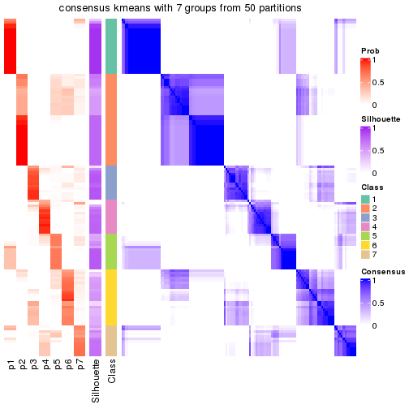</p>

</div>
<div id='tab-node-01-consensus-heatmap-7'>
<pre><code class="r">consensus_heatmap(res, k = 8)
</code></pre>

<p></p>

</div>
</div>

Heatmaps for the membership of samples in all partitions to see how consistent they are:


<script>
$( function() {
	$( '#tabs-node-01-membership-heatmap' ).tabs();
} );
</script>
<div id='tabs-node-01-membership-heatmap'>
<ul>
<li><a href='#tab-node-01-membership-heatmap-1'>k = 2</a></li>
<li><a href='#tab-node-01-membership-heatmap-2'>k = 3</a></li>
<li><a href='#tab-node-01-membership-heatmap-3'>k = 4</a></li>
<li><a href='#tab-node-01-membership-heatmap-4'>k = 5</a></li>
<li><a href='#tab-node-01-membership-heatmap-5'>k = 6</a></li>
<li><a href='#tab-node-01-membership-heatmap-6'>k = 7</a></li>
<li><a href='#tab-node-01-membership-heatmap-7'>k = 8</a></li>
</ul>
<div id='tab-node-01-membership-heatmap-1'>
<pre><code class="r">membership_heatmap(res, k = 2)
</code></pre>

<p></p>

</div>
<div id='tab-node-01-membership-heatmap-2'>
<pre><code class="r">membership_heatmap(res, k = 3)
</code></pre>

<p></p>

</div>
<div id='tab-node-01-membership-heatmap-3'>
<pre><code class="r">membership_heatmap(res, k = 4)
</code></pre>

<p></p>

</div>
<div id='tab-node-01-membership-heatmap-4'>
<pre><code class="r">membership_heatmap(res, k = 5)
</code></pre>

<p></p>

</div>
<div id='tab-node-01-membership-heatmap-5'>
<pre><code class="r">membership_heatmap(res, k = 6)
</code></pre>

<p></p>

</div>
<div id='tab-node-01-membership-heatmap-6'>
<pre><code class="r">membership_heatmap(res, k = 7)
</code></pre>

<p>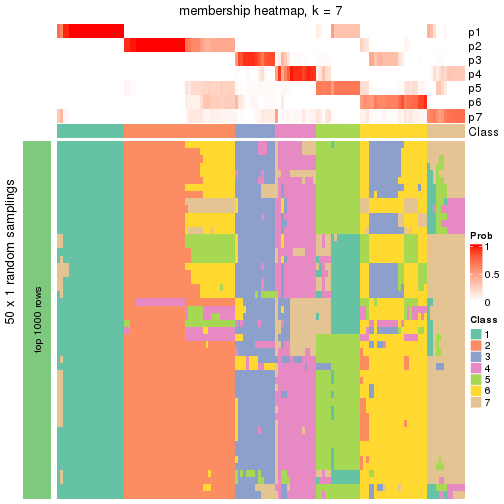</p>

</div>
<div id='tab-node-01-membership-heatmap-7'>
<pre><code class="r">membership_heatmap(res, k = 8)
</code></pre>

<p></p>

</div>
</div>

As soon as the classes for columns are determined, the signatures
that are significantly different between subgroups can be looked for. 
Following are the heatmaps for signatures.


<script>
$( function() {
	$( '#tabs-node-01-get-signatures' ).tabs();
} );
</script>
<div id='tabs-node-01-get-signatures'>
<ul>
<li><a href='#tab-node-01-get-signatures-1'>k = 2</a></li>
<li><a href='#tab-node-01-get-signatures-2'>k = 3</a></li>
<li><a href='#tab-node-01-get-signatures-3'>k = 4</a></li>
<li><a href='#tab-node-01-get-signatures-4'>k = 5</a></li>
<li><a href='#tab-node-01-get-signatures-5'>k = 6</a></li>
<li><a href='#tab-node-01-get-signatures-6'>k = 7</a></li>
<li><a href='#tab-node-01-get-signatures-7'>k = 8</a></li>
</ul>
<div id='tab-node-01-get-signatures-1'>
<pre><code class="r">get_signatures(res, k = 2)
</code></pre>

<p></p>

</div>
<div id='tab-node-01-get-signatures-2'>
<pre><code class="r">get_signatures(res, k = 3)
</code></pre>

<p></p>

</div>
<div id='tab-node-01-get-signatures-3'>
<pre><code class="r">get_signatures(res, k = 4)
</code></pre>

<p></p>

</div>
<div id='tab-node-01-get-signatures-4'>
<pre><code class="r">get_signatures(res, k = 5)
</code></pre>

<p></p>

</div>
<div id='tab-node-01-get-signatures-5'>
<pre><code class="r">get_signatures(res, k = 6)
</code></pre>

<p></p>

</div>
<div id='tab-node-01-get-signatures-6'>
<pre><code class="r">get_signatures(res, k = 7)
</code></pre>

<p>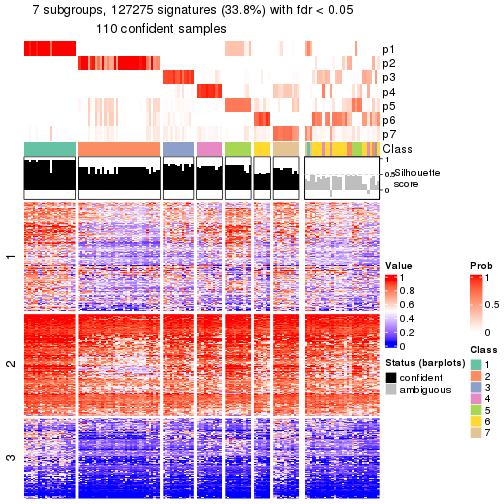</p>

</div>
<div id='tab-node-01-get-signatures-7'>
<pre><code class="r">get_signatures(res, k = 8)
</code></pre>

<p></p>

</div>
</div>


Compare the overlap of signatures from different k:

```r
compare_signatures(res)
```


`get_signature()` returns a data frame invisibly. To get the list of signatures, the function
call should be assigned to a variable explicitly. In following code, if `plot` argument is set
to `FALSE`, no heatmap is plotted while only the differential analysis is performed.

```r
# code only for demonstration
tb = get_signature(res, k = ..., plot = FALSE)
```

An example of the output of `tb` is:

```
#>   which_row         fdr    mean_1    mean_2 scaled_mean_1 scaled_mean_2 km
#> 1        38 0.042760348  8.373488  9.131774    -0.5533452     0.5164555  1
#> 2        40 0.018707592  7.106213  8.469186    -0.6173731     0.5762149  1
#> 3        55 0.019134737 10.221463 11.207825    -0.6159697     0.5749050  1
#> 4        59 0.006059896  5.921854  7.869574    -0.6899429     0.6439467  1
#> 5        60 0.018055526  8.928898 10.211722    -0.6204761     0.5791110  1
#> 6        98 0.009384629 15.714769 14.887706     0.6635654    -0.6193277  2
...
```

The columns in `tb` are:

1. `which_row`: row indices corresponding to the input matrix.
2. `fdr`: FDR for the differential test. 
3. `mean_x`: The mean value in group x.
4. `scaled_mean_x`: The mean value in group x after rows are scaled.
5. `km`: Row groups if k-means clustering is applied to rows (which is done by automatically selecting number of clusters).

If there are too many signatures, `top_signatures = ...` can be set to only show the 
signatures with the highest FDRs:

```r
# code only for demonstration
# e.g. to show the top 500 most significant rows
tb = get_signature(res, k = ..., top_signatures = 500)
```

If the signatures are defined as these which are uniquely high in current group, `diff_method` argument
can be set to `"uniquely_high_in_one_group"`:

```r
# code only for demonstration
tb = get_signature(res, k = ..., diff_method = "uniquely_high_in_one_group")
```


UMAP plot which shows how samples are separated.


<script>
$( function() {
	$( '#tabs-node-01-dimension-reduction' ).tabs();
} );
</script>
<div id='tabs-node-01-dimension-reduction'>
<ul>
<li><a href='#tab-node-01-dimension-reduction-1'>k = 2</a></li>
<li><a href='#tab-node-01-dimension-reduction-2'>k = 3</a></li>
<li><a href='#tab-node-01-dimension-reduction-3'>k = 4</a></li>
<li><a href='#tab-node-01-dimension-reduction-4'>k = 5</a></li>
<li><a href='#tab-node-01-dimension-reduction-5'>k = 6</a></li>
<li><a href='#tab-node-01-dimension-reduction-6'>k = 7</a></li>
<li><a href='#tab-node-01-dimension-reduction-7'>k = 8</a></li>
</ul>
<div id='tab-node-01-dimension-reduction-1'>
<pre><code class="r">dimension_reduction(res, k = 2, method = &quot;UMAP&quot;)
</code></pre>

<p></p>

</div>
<div id='tab-node-01-dimension-reduction-2'>
<pre><code class="r">dimension_reduction(res, k = 3, method = &quot;UMAP&quot;)
</code></pre>

<p></p>

</div>
<div id='tab-node-01-dimension-reduction-3'>
<pre><code class="r">dimension_reduction(res, k = 4, method = &quot;UMAP&quot;)
</code></pre>

<p></p>

</div>
<div id='tab-node-01-dimension-reduction-4'>
<pre><code class="r">dimension_reduction(res, k = 5, method = &quot;UMAP&quot;)
</code></pre>

<p></p>

</div>
<div id='tab-node-01-dimension-reduction-5'>
<pre><code class="r">dimension_reduction(res, k = 6, method = &quot;UMAP&quot;)
</code></pre>

<p></p>

</div>
<div id='tab-node-01-dimension-reduction-6'>
<pre><code class="r">dimension_reduction(res, k = 7, method = &quot;UMAP&quot;)
</code></pre>

<p></p>

</div>
<div id='tab-node-01-dimension-reduction-7'>
<pre><code class="r">dimension_reduction(res, k = 8, method = &quot;UMAP&quot;)
</code></pre>

<p></p>

</div>
</div>


Following heatmap shows how subgroups are split when increasing `k`:

```r
collect_classes(res)
```


If matrix rows can be associated to genes, consider to use `functional_enrichment(res,
...)` to perform function enrichment for the signature genes. See [this vignette](https://jokergoo.github.io/cola_vignettes/functional_enrichment.html) for more detailed explanations.


 

---------------------------------------------------


### Node011


Parent node: [Node01](#Node01).
Child nodes: 
                [Node0111](#Node0111)
        ,
                [Node0112](#Node0112)
        ,
                Node0113-leaf
        ,
                [Node0121](#Node0121)
        ,
                Node0122-leaf
        ,
                Node0123-leaf
        ,
                Node0131-leaf
        ,
                [Node0132](#Node0132)
        ,
                Node0133-leaf
        ,
                Node0134-leaf
        ,
                Node0211-leaf
        ,
                Node0212-leaf
        ,
                [Node0213](#Node0213)
        ,
                Node0214-leaf
        ,
                [Node0221](#Node0221)
        ,
                [Node0222](#Node0222)
        ,
                [Node0231](#Node0231)
        ,
                Node0232-leaf
        ,
                Node0233-leaf
        ,
                Node0321-leaf
        ,
                Node0322-leaf
        ,
                Node0323-leaf
        ,
                [Node0331](#Node0331)
        ,
                [Node0332](#Node0332)
        ,
                Node0333-leaf
        .


The object with results only for a single top-value method and a single partitioning method 
can be extracted as:

```r
res = res_rh["011"]
```

A summary of `res` and all the functions that can be applied to it:

```r
res
```

```
#> A 'ConsensusPartition' object with k = 2, 3, 4, 5, 6, 7, 8.
#>   On a matrix with 30000 rows and 49 columns.
#>   Top rows (1000) are extracted by 'ATC' method.
#>   Subgroups are detected by 'kmeans' method.
#>   Performed in total 350 partitions by row resampling.
#>   Best k for subgroups seems to be 3.
#> 
#> Following methods can be applied to this 'ConsensusPartition' object:
#>  [1] "cola_report"             "collect_classes"         "collect_plots"          
#>  [4] "collect_stats"           "colnames"                "compare_partitions"     
#>  [7] "compare_signatures"      "consensus_heatmap"       "dimension_reduction"    
#> [10] "functional_enrichment"   "get_anno_col"            "get_anno"               
#> [13] "get_classes"             "get_consensus"           "get_matrix"             
#> [16] "get_membership"          "get_param"               "get_signatures"         
#> [19] "get_stats"               "is_best_k"               "is_stable_k"            
#> [22] "membership_heatmap"      "ncol"                    "nrow"                   
#> [25] "plot_ecdf"               "predict_classes"         "rownames"               
#> [28] "select_partition_number" "show"                    "suggest_best_k"         
#> [31] "test_to_known_factors"   "top_rows_heatmap"
```

`collect_plots()` function collects all the plots made from `res` for all `k` (number of subgroups)
into one single page to provide an easy and fast comparison between different `k`.

```r
collect_plots(res)
```

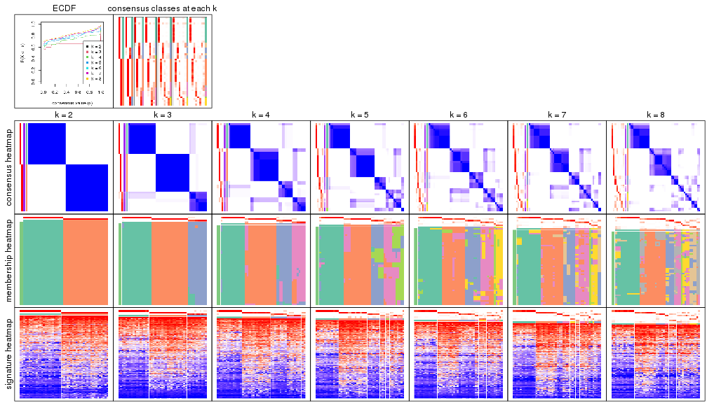

The plots are:

- The first row: a plot of the eCDF (empirical cumulative distribution
  function) curves of the consensus matrix for each `k` and the heatmap of
  predicted classes for each `k`.
- The second row: heatmaps of the consensus matrix for each `k`.
- The third row: heatmaps of the membership matrix for each `k`.
- The fouth row: heatmaps of the signatures for each `k`.

All the plots in panels can be made by individual functions and they are
plotted later in this section.

`select_partition_number()` produces several plots showing different
statistics for choosing "optimized" `k`. There are following statistics:

- eCDF curves of the consensus matrix for each `k`;
- 1-PAC. [The PAC score](https://en.wikipedia.org/wiki/Consensus_clustering#Over-interpretation_potential_of_consensus_clustering)
  measures the proportion of the ambiguous subgrouping.
- Mean silhouette score.
- Concordance. The mean probability of fiting the consensus subgroup labels in all
  partitions.
- Area increased. Denote $A_k$ as the area under the eCDF curve for current
  `k`, the area increased is defined as $A_k - A_{k-1}$.
- Rand index. The percent of pairs of samples that are both in a same cluster
  or both are not in a same cluster in the partition of k and k-1.
- Jaccard index. The ratio of pairs of samples are both in a same cluster in
  the partition of k and k-1 and the pairs of samples are both in a same
  cluster in the partition k or k-1.

The detailed explanations of these statistics can be found in [the _cola_
vignette](https://jokergoo.github.io/cola_vignettes/cola.html#toc_13).

Generally speaking, higher 1-PAC score, higher mean silhouette score or higher
concordance corresponds to better partition. Rand index and Jaccard index
measure how similar the current partition is compared to partition with `k-1`.
If they are too similar, we won't accept `k` is better than `k-1`.

```r
select_partition_number(res)
```


The numeric values for all these statistics can be obtained by `get_stats()`.

```r
get_stats(res)
```

```
#>   k 1-PAC mean_silhouette concordance area_increased  Rand Jaccard
#> 2 2 1.000           1.000       1.000         0.5090 0.491   0.491
#> 3 3 0.936           0.973       0.984         0.2842 0.798   0.610
#> 4 4 0.880           0.834       0.928         0.1223 0.865   0.634
#> 5 5 0.842           0.739       0.842         0.0570 0.947   0.809
#> 6 6 0.781           0.704       0.855         0.0292 0.918   0.684
#> 7 7 0.832           0.643       0.839         0.0198 0.988   0.941
#> 8 8 0.817           0.594       0.785         0.0191 0.949   0.765
```

`suggest_best_k()` suggests the best $k$ based on these statistics. The rules are as follows:

- All $k$ with Jaccard index larger than 0.95 are removed because increasing
  $k$ does not provide enough extra information. If all $k$ are removed, it is
  marked as no subgroup is detected.
- For all $k$ with 1-PAC score larger than 0.9, the maximal $k$ is taken as
  the best $k$, and other $k$ are marked as optional $k$.
- If it does not fit the second rule. The $k$ with the maximal vote of the
  highest 1-PAC score, highest mean silhouette, and highest concordance is
  taken as the best $k$.

```r
suggest_best_k(res)
```

```
#> [1] 3
#> attr(,"optional")
#> [1] 2
```

There is also optional best $k$ = 2 that is worth to check.

Following is the table of the partitions (You need to click the **show/hide
code output** link to see it). The membership matrix (columns with name `p*`)
is inferred by
[`clue::cl_consensus()`](https://www.rdocumentation.org/link/cl_consensus?package=clue)
function with the `SE` method. Basically the value in the membership matrix
represents the probability to belong to a certain group. The finall subgroup
label for an item is determined with the group with highest probability it
belongs to.

In `get_classes()` function, the entropy is calculated from the membership
matrix and the silhouette score is calculated from the consensus matrix.


<script>
$( function() {
	$( '#tabs-node-011-get-classes' ).tabs();
} );
</script>
<div id='tabs-node-011-get-classes'>
<ul>
<li><a href='#tab-node-011-get-classes-1'>k = 2</a></li>
<li><a href='#tab-node-011-get-classes-2'>k = 3</a></li>
<li><a href='#tab-node-011-get-classes-3'>k = 4</a></li>
<li><a href='#tab-node-011-get-classes-4'>k = 5</a></li>
<li><a href='#tab-node-011-get-classes-5'>k = 6</a></li>
<li><a href='#tab-node-011-get-classes-6'>k = 7</a></li>
<li><a href='#tab-node-011-get-classes-7'>k = 8</a></li>
</ul>

<div id='tab-node-011-get-classes-1'>
<p><a id='tab-node-011-get-classes-1-a' style='color:#0366d6' href='#'>show/hide code output</a></p>
<pre><code class="r">cbind(get_classes(res, k = 2), get_membership(res, k = 2))
</code></pre>

<pre><code>#&gt;                 class entropy silhouette p1 p2
#&gt; TCGA.GV.A3JW.01     1       0          1  1  0
#&gt; TCGA.ZF.A9R3.01     1       0          1  1  0
#&gt; TCGA.XF.AAN1.01     2       0          1  0  1
#&gt; TCGA.4Z.AA7S.01     2       0          1  0  1
#&gt; TCGA.UY.A78O.01     2       0          1  0  1
#&gt; TCGA.CF.A5U8.01     1       0          1  1  0
#&gt; TCGA.FD.A62O.01     2       0          1  0  1
#&gt; TCGA.XF.A9SV.01     2       0          1  0  1
#&gt; TCGA.GV.A3JX.01     2       0          1  0  1
#&gt; TCGA.E7.A5KF.01     1       0          1  1  0
#&gt; TCGA.4Z.AA83.01     2       0          1  0  1
#&gt; TCGA.FD.A6TH.01     2       0          1  0  1
#&gt; TCGA.XF.AAMF.01     2       0          1  0  1
#&gt; TCGA.CF.A3MH.01     1       0          1  1  0
#&gt; TCGA.XF.AAMQ.01     2       0          1  0  1
#&gt; TCGA.UY.A78N.01     2       0          1  0  1
#&gt; TCGA.G2.AA3F.01     2       0          1  0  1
#&gt; TCGA.DK.A3IL.01     2       0          1  0  1
#&gt; TCGA.4Z.AA7Y.01     1       0          1  1  0
#&gt; TCGA.FD.A6TE.01     2       0          1  0  1
#&gt; TCGA.CF.A3MG.01     1       0          1  1  0
#&gt; TCGA.GD.A3OQ.01     2       0          1  0  1
#&gt; TCGA.ZF.A9R4.01     2       0          1  0  1
#&gt; TCGA.FJ.A3ZE.01     1       0          1  1  0
#&gt; TCGA.4Z.AA89.01     1       0          1  1  0
#&gt; TCGA.XF.A8HI.01     1       0          1  1  0
#&gt; TCGA.YF.AA3L.01     2       0          1  0  1
#&gt; TCGA.DK.A1A6.01     2       0          1  0  1
#&gt; TCGA.CF.A9FF.01     1       0          1  1  0
#&gt; TCGA.XF.AAML.01     2       0          1  0  1
#&gt; TCGA.E7.A7PW.01     2       0          1  0  1
#&gt; TCGA.CF.A3MF.01     1       0          1  1  0
#&gt; TCGA.E7.A7DU.01     1       0          1  1  0
#&gt; TCGA.GV.A40G.01     2       0          1  0  1
#&gt; TCGA.CF.A8HY.01     1       0          1  1  0
#&gt; TCGA.CF.A3MI.01     1       0          1  1  0
#&gt; TCGA.ZF.A9RL.01     1       0          1  1  0
#&gt; TCGA.DK.A6AW.01     2       0          1  0  1
#&gt; TCGA.ZF.A9R5.01     1       0          1  1  0
#&gt; TCGA.XF.A8HC.01     2       0          1  0  1
#&gt; TCGA.XF.A9T6.01     2       0          1  0  1
#&gt; TCGA.DK.A1AG.01     1       0          1  1  0
#&gt; TCGA.XF.A9T2.01     1       0          1  1  0
#&gt; TCGA.E7.A4XJ.01     2       0          1  0  1
#&gt; TCGA.E7.A678.01     1       0          1  1  0
#&gt; TCGA.XF.A9SH.01     1       0          1  1  0
#&gt; TCGA.FJ.A3Z9.01     1       0          1  1  0
#&gt; TCGA.E7.A677.01     2       0          1  0  1
#&gt; TCGA.CF.A9FH.01     1       0          1  1  0
</code></pre>

<script>
$('#tab-node-011-get-classes-1-a').parent().next().next().hide();
$('#tab-node-011-get-classes-1-a').click(function(){
  $('#tab-node-011-get-classes-1-a').parent().next().next().toggle();
  return(false);
});
</script>
</div>

<div id='tab-node-011-get-classes-2'>
<p><a id='tab-node-011-get-classes-2-a' style='color:#0366d6' href='#'>show/hide code output</a></p>
<pre><code class="r">cbind(get_classes(res, k = 3), get_membership(res, k = 3))
</code></pre>

<pre><code>#&gt;                 class entropy silhouette   p1   p2   p3
#&gt; TCGA.GV.A3JW.01     1   0.000      0.996 1.00 0.00 0.00
#&gt; TCGA.ZF.A9R3.01     3   0.000      0.925 0.00 0.00 1.00
#&gt; TCGA.XF.AAN1.01     2   0.000      1.000 0.00 1.00 0.00
#&gt; TCGA.4Z.AA7S.01     2   0.000      1.000 0.00 1.00 0.00
#&gt; TCGA.UY.A78O.01     2   0.000      1.000 0.00 1.00 0.00
#&gt; TCGA.CF.A5U8.01     1   0.000      0.996 1.00 0.00 0.00
#&gt; TCGA.FD.A62O.01     2   0.000      1.000 0.00 1.00 0.00
#&gt; TCGA.XF.A9SV.01     2   0.000      1.000 0.00 1.00 0.00
#&gt; TCGA.GV.A3JX.01     2   0.000      1.000 0.00 1.00 0.00
#&gt; TCGA.E7.A5KF.01     1   0.000      0.996 1.00 0.00 0.00
#&gt; TCGA.4Z.AA83.01     3   0.000      0.925 0.00 0.00 1.00
#&gt; TCGA.FD.A6TH.01     2   0.000      1.000 0.00 1.00 0.00
#&gt; TCGA.XF.AAMF.01     2   0.000      1.000 0.00 1.00 0.00
#&gt; TCGA.CF.A3MH.01     1   0.000      0.996 1.00 0.00 0.00
#&gt; TCGA.XF.AAMQ.01     2   0.000      1.000 0.00 1.00 0.00
#&gt; TCGA.UY.A78N.01     2   0.000      1.000 0.00 1.00 0.00
#&gt; TCGA.G2.AA3F.01     2   0.000      1.000 0.00 1.00 0.00
#&gt; TCGA.DK.A3IL.01     2   0.000      1.000 0.00 1.00 0.00
#&gt; TCGA.4Z.AA7Y.01     3   0.369      0.872 0.14 0.00 0.86
#&gt; TCGA.FD.A6TE.01     2   0.000      1.000 0.00 1.00 0.00
#&gt; TCGA.CF.A3MG.01     1   0.000      0.996 1.00 0.00 0.00
#&gt; TCGA.GD.A3OQ.01     3   0.153      0.907 0.00 0.04 0.96
#&gt; TCGA.ZF.A9R4.01     3   0.000      0.925 0.00 0.00 1.00
#&gt; TCGA.FJ.A3ZE.01     1   0.000      0.996 1.00 0.00 0.00
#&gt; TCGA.4Z.AA89.01     1   0.000      0.996 1.00 0.00 0.00
#&gt; TCGA.XF.A8HI.01     1   0.000      0.996 1.00 0.00 0.00
#&gt; TCGA.YF.AA3L.01     2   0.000      1.000 0.00 1.00 0.00
#&gt; TCGA.DK.A1A6.01     2   0.000      1.000 0.00 1.00 0.00
#&gt; TCGA.CF.A9FF.01     3   0.000      0.925 0.00 0.00 1.00
#&gt; TCGA.XF.AAML.01     2   0.000      1.000 0.00 1.00 0.00
#&gt; TCGA.E7.A7PW.01     2   0.000      1.000 0.00 1.00 0.00
#&gt; TCGA.CF.A3MF.01     3   0.369      0.872 0.14 0.00 0.86
#&gt; TCGA.E7.A7DU.01     1   0.000      0.996 1.00 0.00 0.00
#&gt; TCGA.GV.A40G.01     2   0.000      1.000 0.00 1.00 0.00
#&gt; TCGA.CF.A8HY.01     1   0.000      0.996 1.00 0.00 0.00
#&gt; TCGA.CF.A3MI.01     1   0.000      0.996 1.00 0.00 0.00
#&gt; TCGA.ZF.A9RL.01     3   0.369      0.872 0.14 0.00 0.86
#&gt; TCGA.DK.A6AW.01     3   0.000      0.925 0.00 0.00 1.00
#&gt; TCGA.ZF.A9R5.01     1   0.000      0.996 1.00 0.00 0.00
#&gt; TCGA.XF.A8HC.01     2   0.000      1.000 0.00 1.00 0.00
#&gt; TCGA.XF.A9T6.01     2   0.000      1.000 0.00 1.00 0.00
#&gt; TCGA.DK.A1AG.01     1   0.000      0.996 1.00 0.00 0.00
#&gt; TCGA.XF.A9T2.01     1   0.000      0.996 1.00 0.00 0.00
#&gt; TCGA.E7.A4XJ.01     2   0.000      1.000 0.00 1.00 0.00
#&gt; TCGA.E7.A678.01     1   0.000      0.996 1.00 0.00 0.00
#&gt; TCGA.XF.A9SH.01     1   0.000      0.996 1.00 0.00 0.00
#&gt; TCGA.FJ.A3Z9.01     1   0.207      0.932 0.94 0.00 0.06
#&gt; TCGA.E7.A677.01     3   0.153      0.907 0.00 0.04 0.96
#&gt; TCGA.CF.A9FH.01     3   0.480      0.778 0.22 0.00 0.78
</code></pre>

<script>
$('#tab-node-011-get-classes-2-a').parent().next().next().hide();
$('#tab-node-011-get-classes-2-a').click(function(){
  $('#tab-node-011-get-classes-2-a').parent().next().next().toggle();
  return(false);
});
</script>
</div>

<div id='tab-node-011-get-classes-3'>
<p><a id='tab-node-011-get-classes-3-a' style='color:#0366d6' href='#'>show/hide code output</a></p>
<pre><code class="r">cbind(get_classes(res, k = 4), get_membership(res, k = 4))
</code></pre>

<pre><code>#&gt;                 class entropy silhouette   p1   p2   p3   p4
#&gt; TCGA.GV.A3JW.01     1  0.0000     0.9760 1.00 0.00 0.00 0.00
#&gt; TCGA.ZF.A9R3.01     3  0.4277     0.6510 0.00 0.00 0.72 0.28
#&gt; TCGA.XF.AAN1.01     4  0.5062     0.6188 0.00 0.30 0.02 0.68
#&gt; TCGA.4Z.AA7S.01     2  0.0000     0.9303 0.00 1.00 0.00 0.00
#&gt; TCGA.UY.A78O.01     2  0.0707     0.9206 0.00 0.98 0.02 0.00
#&gt; TCGA.CF.A5U8.01     1  0.0000     0.9760 1.00 0.00 0.00 0.00
#&gt; TCGA.FD.A62O.01     2  0.0000     0.9303 0.00 1.00 0.00 0.00
#&gt; TCGA.XF.A9SV.01     2  0.0000     0.9303 0.00 1.00 0.00 0.00
#&gt; TCGA.GV.A3JX.01     2  0.0000     0.9303 0.00 1.00 0.00 0.00
#&gt; TCGA.E7.A5KF.01     1  0.0000     0.9760 1.00 0.00 0.00 0.00
#&gt; TCGA.4Z.AA83.01     4  0.1637     0.7556 0.00 0.00 0.06 0.94
#&gt; TCGA.FD.A6TH.01     2  0.0000     0.9303 0.00 1.00 0.00 0.00
#&gt; TCGA.XF.AAMF.01     2  0.5535     0.0712 0.00 0.56 0.02 0.42
#&gt; TCGA.CF.A3MH.01     3  0.3801     0.7248 0.22 0.00 0.78 0.00
#&gt; TCGA.XF.AAMQ.01     4  0.4936     0.6438 0.00 0.28 0.02 0.70
#&gt; TCGA.UY.A78N.01     2  0.0000     0.9303 0.00 1.00 0.00 0.00
#&gt; TCGA.G2.AA3F.01     2  0.0707     0.9206 0.00 0.98 0.02 0.00
#&gt; TCGA.DK.A3IL.01     2  0.0000     0.9303 0.00 1.00 0.00 0.00
#&gt; TCGA.4Z.AA7Y.01     3  0.0707     0.8579 0.02 0.00 0.98 0.00
#&gt; TCGA.FD.A6TE.01     2  0.0000     0.9303 0.00 1.00 0.00 0.00
#&gt; TCGA.CF.A3MG.01     3  0.3801     0.7248 0.22 0.00 0.78 0.00
#&gt; TCGA.GD.A3OQ.01     4  0.0707     0.7814 0.00 0.00 0.02 0.98
#&gt; TCGA.ZF.A9R4.01     4  0.0707     0.7814 0.00 0.00 0.02 0.98
#&gt; TCGA.FJ.A3ZE.01     1  0.4277     0.5665 0.72 0.00 0.28 0.00
#&gt; TCGA.4Z.AA89.01     1  0.0000     0.9760 1.00 0.00 0.00 0.00
#&gt; TCGA.XF.A8HI.01     1  0.0000     0.9760 1.00 0.00 0.00 0.00
#&gt; TCGA.YF.AA3L.01     2  0.0000     0.9303 0.00 1.00 0.00 0.00
#&gt; TCGA.DK.A1A6.01     2  0.0000     0.9303 0.00 1.00 0.00 0.00
#&gt; TCGA.CF.A9FF.01     3  0.4277     0.6510 0.00 0.00 0.72 0.28
#&gt; TCGA.XF.AAML.01     2  0.0707     0.9206 0.00 0.98 0.02 0.00
#&gt; TCGA.E7.A7PW.01     4  0.5062     0.6188 0.00 0.30 0.02 0.68
#&gt; TCGA.CF.A3MF.01     3  0.0707     0.8579 0.02 0.00 0.98 0.00
#&gt; TCGA.E7.A7DU.01     1  0.0000     0.9760 1.00 0.00 0.00 0.00
#&gt; TCGA.GV.A40G.01     2  0.0000     0.9303 0.00 1.00 0.00 0.00
#&gt; TCGA.CF.A8HY.01     1  0.0000     0.9760 1.00 0.00 0.00 0.00
#&gt; TCGA.CF.A3MI.01     1  0.0000     0.9760 1.00 0.00 0.00 0.00
#&gt; TCGA.ZF.A9RL.01     3  0.0707     0.8579 0.02 0.00 0.98 0.00
#&gt; TCGA.DK.A6AW.01     4  0.1637     0.7417 0.00 0.00 0.06 0.94
#&gt; TCGA.ZF.A9R5.01     1  0.0000     0.9760 1.00 0.00 0.00 0.00
#&gt; TCGA.XF.A8HC.01     2  0.0707     0.9206 0.00 0.98 0.02 0.00
#&gt; TCGA.XF.A9T6.01     2  0.5594    -0.0821 0.00 0.52 0.02 0.46
#&gt; TCGA.DK.A1AG.01     1  0.0000     0.9760 1.00 0.00 0.00 0.00
#&gt; TCGA.XF.A9T2.01     1  0.0000     0.9760 1.00 0.00 0.00 0.00
#&gt; TCGA.E7.A4XJ.01     2  0.0000     0.9303 0.00 1.00 0.00 0.00
#&gt; TCGA.E7.A678.01     1  0.0000     0.9760 1.00 0.00 0.00 0.00
#&gt; TCGA.XF.A9SH.01     1  0.0000     0.9760 1.00 0.00 0.00 0.00
#&gt; TCGA.FJ.A3Z9.01     3  0.1211     0.8511 0.04 0.00 0.96 0.00
#&gt; TCGA.E7.A677.01     4  0.0707     0.7814 0.00 0.00 0.02 0.98
#&gt; TCGA.CF.A9FH.01     3  0.0707     0.8579 0.02 0.00 0.98 0.00
</code></pre>

<script>
$('#tab-node-011-get-classes-3-a').parent().next().next().hide();
$('#tab-node-011-get-classes-3-a').click(function(){
  $('#tab-node-011-get-classes-3-a').parent().next().next().toggle();
  return(false);
});
</script>
</div>

<div id='tab-node-011-get-classes-4'>
<p><a id='tab-node-011-get-classes-4-a' style='color:#0366d6' href='#'>show/hide code output</a></p>
<pre><code class="r">cbind(get_classes(res, k = 5), get_membership(res, k = 5))
</code></pre>

<pre><code>#&gt;                 class entropy silhouette   p1   p2   p3   p4   p5
#&gt; TCGA.GV.A3JW.01     1  0.1043     0.9389 0.96 0.00 0.00 0.00 0.04
#&gt; TCGA.ZF.A9R3.01     5  0.6459     1.0000 0.00 0.00 0.40 0.18 0.42
#&gt; TCGA.XF.AAN1.01     4  0.5425     0.5658 0.00 0.08 0.00 0.60 0.32
#&gt; TCGA.4Z.AA7S.01     2  0.0000     0.8955 0.00 1.00 0.00 0.00 0.00
#&gt; TCGA.UY.A78O.01     2  0.4456     0.5751 0.00 0.66 0.00 0.02 0.32
#&gt; TCGA.CF.A5U8.01     1  0.0000     0.9635 1.00 0.00 0.00 0.00 0.00
#&gt; TCGA.FD.A62O.01     2  0.0000     0.8955 0.00 1.00 0.00 0.00 0.00
#&gt; TCGA.XF.A9SV.01     2  0.0000     0.8955 0.00 1.00 0.00 0.00 0.00
#&gt; TCGA.GV.A3JX.01     2  0.0000     0.8955 0.00 1.00 0.00 0.00 0.00
#&gt; TCGA.E7.A5KF.01     1  0.0000     0.9635 1.00 0.00 0.00 0.00 0.00
#&gt; TCGA.4Z.AA83.01     4  0.4227    -0.2052 0.00 0.00 0.00 0.58 0.42
#&gt; TCGA.FD.A6TH.01     2  0.0000     0.8955 0.00 1.00 0.00 0.00 0.00
#&gt; TCGA.XF.AAMF.01     4  0.6816     0.2613 0.00 0.32 0.00 0.36 0.32
#&gt; TCGA.CF.A3MH.01     3  0.2797     0.7080 0.06 0.00 0.88 0.00 0.06
#&gt; TCGA.XF.AAMQ.01     4  0.5156     0.5624 0.00 0.06 0.00 0.62 0.32
#&gt; TCGA.UY.A78N.01     2  0.0000     0.8955 0.00 1.00 0.00 0.00 0.00
#&gt; TCGA.G2.AA3F.01     2  0.3895     0.6044 0.00 0.68 0.00 0.00 0.32
#&gt; TCGA.DK.A3IL.01     2  0.0000     0.8955 0.00 1.00 0.00 0.00 0.00
#&gt; TCGA.4Z.AA7Y.01     3  0.2732     0.7222 0.00 0.00 0.84 0.00 0.16
#&gt; TCGA.FD.A6TE.01     2  0.0000     0.8955 0.00 1.00 0.00 0.00 0.00
#&gt; TCGA.CF.A3MG.01     3  0.3110     0.7031 0.06 0.00 0.86 0.00 0.08
#&gt; TCGA.GD.A3OQ.01     4  0.0000     0.4191 0.00 0.00 0.00 1.00 0.00
#&gt; TCGA.ZF.A9R4.01     4  0.3684     0.1109 0.00 0.00 0.00 0.72 0.28
#&gt; TCGA.FJ.A3ZE.01     1  0.5579     0.3969 0.60 0.00 0.30 0.00 0.10
#&gt; TCGA.4Z.AA89.01     1  0.0000     0.9635 1.00 0.00 0.00 0.00 0.00
#&gt; TCGA.XF.A8HI.01     1  0.0000     0.9635 1.00 0.00 0.00 0.00 0.00
#&gt; TCGA.YF.AA3L.01     2  0.0000     0.8955 0.00 1.00 0.00 0.00 0.00
#&gt; TCGA.DK.A1A6.01     2  0.0000     0.8955 0.00 1.00 0.00 0.00 0.00
#&gt; TCGA.CF.A9FF.01     5  0.6459     1.0000 0.00 0.00 0.40 0.18 0.42
#&gt; TCGA.XF.AAML.01     2  0.3796     0.6291 0.00 0.70 0.00 0.00 0.30
#&gt; TCGA.E7.A7PW.01     4  0.5425     0.5658 0.00 0.08 0.00 0.60 0.32
#&gt; TCGA.CF.A3MF.01     3  0.2732     0.7222 0.00 0.00 0.84 0.00 0.16
#&gt; TCGA.E7.A7DU.01     1  0.0000     0.9635 1.00 0.00 0.00 0.00 0.00
#&gt; TCGA.GV.A40G.01     2  0.0000     0.8955 0.00 1.00 0.00 0.00 0.00
#&gt; TCGA.CF.A8HY.01     1  0.0000     0.9635 1.00 0.00 0.00 0.00 0.00
#&gt; TCGA.CF.A3MI.01     1  0.0000     0.9635 1.00 0.00 0.00 0.00 0.00
#&gt; TCGA.ZF.A9RL.01     3  0.0609     0.7730 0.00 0.00 0.98 0.00 0.02
#&gt; TCGA.DK.A6AW.01     4  0.4227    -0.0416 0.00 0.00 0.00 0.58 0.42
#&gt; TCGA.ZF.A9R5.01     1  0.0000     0.9635 1.00 0.00 0.00 0.00 0.00
#&gt; TCGA.XF.A8HC.01     2  0.5156     0.5042 0.00 0.62 0.00 0.06 0.32
#&gt; TCGA.XF.A9T6.01     4  0.6555     0.4654 0.00 0.22 0.00 0.46 0.32
#&gt; TCGA.DK.A1AG.01     1  0.0000     0.9635 1.00 0.00 0.00 0.00 0.00
#&gt; TCGA.XF.A9T2.01     1  0.0000     0.9635 1.00 0.00 0.00 0.00 0.00
#&gt; TCGA.E7.A4XJ.01     2  0.0000     0.8955 0.00 1.00 0.00 0.00 0.00
#&gt; TCGA.E7.A678.01     1  0.0000     0.9635 1.00 0.00 0.00 0.00 0.00
#&gt; TCGA.XF.A9SH.01     1  0.1043     0.9389 0.96 0.00 0.00 0.00 0.04
#&gt; TCGA.FJ.A3Z9.01     3  0.0609     0.7730 0.00 0.00 0.98 0.00 0.02
#&gt; TCGA.E7.A677.01     4  0.1043     0.4479 0.00 0.00 0.00 0.96 0.04
#&gt; TCGA.CF.A9FH.01     3  0.2732     0.7222 0.00 0.00 0.84 0.00 0.16
</code></pre>

<script>
$('#tab-node-011-get-classes-4-a').parent().next().next().hide();
$('#tab-node-011-get-classes-4-a').click(function(){
  $('#tab-node-011-get-classes-4-a').parent().next().next().toggle();
  return(false);
});
</script>
</div>

<div id='tab-node-011-get-classes-5'>
<p><a id='tab-node-011-get-classes-5-a' style='color:#0366d6' href='#'>show/hide code output</a></p>
<pre><code class="r">cbind(get_classes(res, k = 6), get_membership(res, k = 6))
</code></pre>

<pre><code>#&gt;                 class entropy silhouette   p1   p2   p3   p4   p5   p6
#&gt; TCGA.GV.A3JW.01     1  0.1814     0.8954 0.90 0.00 0.00 0.00 0.10 0.00
#&gt; TCGA.ZF.A9R3.01     3  0.4165     0.6018 0.00 0.00 0.74 0.00 0.10 0.16
#&gt; TCGA.XF.AAN1.01     4  0.4631     0.0169 0.00 0.06 0.00 0.62 0.00 0.32
#&gt; TCGA.4Z.AA7S.01     2  0.1556     0.8592 0.00 0.92 0.00 0.08 0.00 0.00
#&gt; TCGA.UY.A78O.01     2  0.3797     0.1091 0.00 0.58 0.00 0.42 0.00 0.00
#&gt; TCGA.CF.A5U8.01     1  0.0000     0.9465 1.00 0.00 0.00 0.00 0.00 0.00
#&gt; TCGA.FD.A62O.01     2  0.1556     0.8592 0.00 0.92 0.00 0.08 0.00 0.00
#&gt; TCGA.XF.A9SV.01     2  0.1556     0.8592 0.00 0.92 0.00 0.08 0.00 0.00
#&gt; TCGA.GV.A3JX.01     2  0.0937     0.8520 0.00 0.96 0.00 0.00 0.04 0.00
#&gt; TCGA.E7.A5KF.01     1  0.0000     0.9465 1.00 0.00 0.00 0.00 0.00 0.00
#&gt; TCGA.4Z.AA83.01     6  0.3483     0.5309 0.00 0.00 0.12 0.04 0.02 0.82
#&gt; TCGA.FD.A6TH.01     2  0.0937     0.8520 0.00 0.96 0.00 0.00 0.04 0.00
#&gt; TCGA.XF.AAMF.01     4  0.1814     0.5710 0.00 0.10 0.00 0.90 0.00 0.00
#&gt; TCGA.CF.A3MH.01     3  0.5394     0.7182 0.06 0.00 0.72 0.04 0.08 0.10
#&gt; TCGA.XF.AAMQ.01     4  0.4631     0.0169 0.00 0.06 0.00 0.62 0.00 0.32
#&gt; TCGA.UY.A78N.01     2  0.1556     0.8592 0.00 0.92 0.00 0.08 0.00 0.00
#&gt; TCGA.G2.AA3F.01     4  0.3706     0.3315 0.00 0.38 0.00 0.62 0.00 0.00
#&gt; TCGA.DK.A3IL.01     2  0.2048     0.8335 0.00 0.88 0.00 0.12 0.00 0.00
#&gt; TCGA.4Z.AA7Y.01     3  0.0547     0.7921 0.00 0.00 0.98 0.00 0.00 0.02
#&gt; TCGA.FD.A6TE.01     2  0.3523     0.6435 0.00 0.78 0.00 0.18 0.04 0.00
#&gt; TCGA.CF.A3MG.01     3  0.5343     0.7219 0.06 0.00 0.72 0.04 0.06 0.12
#&gt; TCGA.GD.A3OQ.01     6  0.3409     0.7265 0.00 0.00 0.00 0.30 0.00 0.70
#&gt; TCGA.ZF.A9R4.01     6  0.3985     0.5545 0.00 0.00 0.00 0.14 0.10 0.76
#&gt; TCGA.FJ.A3ZE.01     1  0.6145     0.4746 0.60 0.00 0.22 0.02 0.12 0.04
#&gt; TCGA.4Z.AA89.01     1  0.0547     0.9432 0.98 0.00 0.00 0.00 0.02 0.00
#&gt; TCGA.XF.A8HI.01     1  0.0547     0.9432 0.98 0.00 0.00 0.00 0.02 0.00
#&gt; TCGA.YF.AA3L.01     2  0.0937     0.8520 0.00 0.96 0.00 0.00 0.04 0.00
#&gt; TCGA.DK.A1A6.01     2  0.1556     0.8592 0.00 0.92 0.00 0.08 0.00 0.00
#&gt; TCGA.CF.A9FF.01     3  0.4200     0.5994 0.00 0.00 0.74 0.00 0.12 0.14
#&gt; TCGA.XF.AAML.01     4  0.3756     0.2856 0.00 0.40 0.00 0.60 0.00 0.00
#&gt; TCGA.E7.A7PW.01     4  0.1807     0.4561 0.00 0.02 0.00 0.92 0.00 0.06
#&gt; TCGA.CF.A3MF.01     3  0.0547     0.7921 0.00 0.00 0.98 0.00 0.00 0.02
#&gt; TCGA.E7.A7DU.01     1  0.0000     0.9465 1.00 0.00 0.00 0.00 0.00 0.00
#&gt; TCGA.GV.A40G.01     2  0.0937     0.8520 0.00 0.96 0.00 0.00 0.04 0.00
#&gt; TCGA.CF.A8HY.01     1  0.0000     0.9465 1.00 0.00 0.00 0.00 0.00 0.00
#&gt; TCGA.CF.A3MI.01     1  0.0547     0.9432 0.98 0.00 0.00 0.00 0.02 0.00
#&gt; TCGA.ZF.A9RL.01     3  0.3483     0.7790 0.00 0.00 0.82 0.02 0.04 0.12
#&gt; TCGA.DK.A6AW.01     5  0.3660     0.0000 0.00 0.00 0.00 0.06 0.78 0.16
#&gt; TCGA.ZF.A9R5.01     1  0.0000     0.9465 1.00 0.00 0.00 0.00 0.00 0.00
#&gt; TCGA.XF.A8HC.01     4  0.4576     0.3701 0.00 0.40 0.00 0.56 0.04 0.00
#&gt; TCGA.XF.A9T6.01     4  0.3258     0.5527 0.00 0.10 0.00 0.84 0.02 0.04
#&gt; TCGA.DK.A1AG.01     1  0.1092     0.9342 0.96 0.00 0.02 0.00 0.02 0.00
#&gt; TCGA.XF.A9T2.01     1  0.0000     0.9465 1.00 0.00 0.00 0.00 0.00 0.00
#&gt; TCGA.E7.A4XJ.01     2  0.0937     0.8520 0.00 0.96 0.00 0.00 0.04 0.00
#&gt; TCGA.E7.A678.01     1  0.0000     0.9465 1.00 0.00 0.00 0.00 0.00 0.00
#&gt; TCGA.XF.A9SH.01     1  0.2048     0.8795 0.88 0.00 0.00 0.00 0.12 0.00
#&gt; TCGA.FJ.A3Z9.01     3  0.3483     0.7790 0.00 0.00 0.82 0.02 0.04 0.12
#&gt; TCGA.E7.A677.01     6  0.3409     0.7265 0.00 0.00 0.00 0.30 0.00 0.70
#&gt; TCGA.CF.A9FH.01     3  0.0000     0.7954 0.00 0.00 1.00 0.00 0.00 0.00
</code></pre>

<script>
$('#tab-node-011-get-classes-5-a').parent().next().next().hide();
$('#tab-node-011-get-classes-5-a').click(function(){
  $('#tab-node-011-get-classes-5-a').parent().next().next().toggle();
  return(false);
});
</script>
</div>

<div id='tab-node-011-get-classes-6'>
<p><a id='tab-node-011-get-classes-6-a' style='color:#0366d6' href='#'>show/hide code output</a></p>
<pre><code class="r">cbind(get_classes(res, k = 7), get_membership(res, k = 7))
</code></pre>

<pre><code>#&gt;                 class entropy silhouette   p1   p2   p3   p4   p5   p6   p7
#&gt; TCGA.GV.A3JW.01     1  0.2864     0.8414 0.84 0.00 0.00 0.02 0.02 0.12 0.00
#&gt; TCGA.ZF.A9R3.01     3  0.2906     0.3811 0.00 0.00 0.80 0.00 0.02 0.00 0.18
#&gt; TCGA.XF.AAN1.01     4  0.5152     0.2943 0.00 0.02 0.00 0.60 0.00 0.24 0.14
#&gt; TCGA.4Z.AA7S.01     2  0.0504     0.8775 0.00 0.98 0.00 0.02 0.00 0.00 0.00
#&gt; TCGA.UY.A78O.01     2  0.4278    -0.1826 0.00 0.50 0.00 0.46 0.00 0.00 0.04
#&gt; TCGA.CF.A5U8.01     1  0.0000     0.9121 1.00 0.00 0.00 0.00 0.00 0.00 0.00
#&gt; TCGA.FD.A62O.01     2  0.0504     0.8775 0.00 0.98 0.00 0.02 0.00 0.00 0.00
#&gt; TCGA.XF.A9SV.01     2  0.0863     0.8673 0.00 0.96 0.00 0.04 0.00 0.00 0.00
#&gt; TCGA.GV.A3JX.01     2  0.0863     0.8758 0.00 0.96 0.00 0.00 0.00 0.00 0.04
#&gt; TCGA.E7.A5KF.01     1  0.0000     0.9121 1.00 0.00 0.00 0.00 0.00 0.00 0.00
#&gt; TCGA.4Z.AA83.01     6  0.4461     0.3969 0.00 0.00 0.32 0.00 0.02 0.62 0.04
#&gt; TCGA.FD.A6TH.01     2  0.0863     0.8758 0.00 0.96 0.00 0.00 0.00 0.00 0.04
#&gt; TCGA.XF.AAMF.01     4  0.1166     0.6345 0.00 0.06 0.00 0.94 0.00 0.00 0.00
#&gt; TCGA.CF.A3MH.01     3  0.4684    -0.4693 0.00 0.00 0.52 0.00 0.02 0.04 0.42
#&gt; TCGA.XF.AAMQ.01     4  0.5240     0.2534 0.00 0.02 0.00 0.58 0.00 0.26 0.14
#&gt; TCGA.UY.A78N.01     2  0.0504     0.8775 0.00 0.98 0.00 0.02 0.00 0.00 0.00
#&gt; TCGA.G2.AA3F.01     4  0.3358     0.4469 0.00 0.36 0.00 0.64 0.00 0.00 0.00
#&gt; TCGA.DK.A3IL.01     2  0.2081     0.7785 0.00 0.86 0.00 0.14 0.00 0.00 0.00
#&gt; TCGA.4Z.AA7Y.01     3  0.0000     0.5172 0.00 0.00 1.00 0.00 0.00 0.00 0.00
#&gt; TCGA.FD.A6TE.01     2  0.3637     0.5930 0.00 0.72 0.00 0.24 0.00 0.00 0.04
#&gt; TCGA.CF.A3MG.01     3  0.4266    -0.4924 0.00 0.00 0.52 0.00 0.00 0.04 0.44
#&gt; TCGA.GD.A3OQ.01     6  0.2422     0.7498 0.00 0.00 0.00 0.18 0.00 0.82 0.00
#&gt; TCGA.ZF.A9R4.01     6  0.4812     0.6994 0.00 0.00 0.00 0.18 0.02 0.66 0.14
#&gt; TCGA.FJ.A3ZE.01     1  0.7588     0.0431 0.38 0.00 0.20 0.02 0.02 0.18 0.20
#&gt; TCGA.4Z.AA89.01     1  0.1363     0.9046 0.94 0.00 0.00 0.02 0.00 0.04 0.00
#&gt; TCGA.XF.A8HI.01     1  0.1363     0.9046 0.94 0.00 0.00 0.02 0.00 0.04 0.00
#&gt; TCGA.YF.AA3L.01     2  0.0863     0.8758 0.00 0.96 0.00 0.00 0.00 0.00 0.04
#&gt; TCGA.DK.A1A6.01     2  0.0504     0.8775 0.00 0.98 0.00 0.02 0.00 0.00 0.00
#&gt; TCGA.CF.A9FF.01     3  0.2745     0.4030 0.00 0.00 0.82 0.00 0.02 0.00 0.16
#&gt; TCGA.XF.AAML.01     4  0.3358     0.4316 0.00 0.36 0.00 0.64 0.00 0.00 0.00
#&gt; TCGA.E7.A7PW.01     4  0.2159     0.5904 0.00 0.02 0.00 0.90 0.00 0.02 0.06
#&gt; TCGA.CF.A3MF.01     3  0.0000     0.5172 0.00 0.00 1.00 0.00 0.00 0.00 0.00
#&gt; TCGA.E7.A7DU.01     1  0.0000     0.9121 1.00 0.00 0.00 0.00 0.00 0.00 0.00
#&gt; TCGA.GV.A40G.01     2  0.0863     0.8758 0.00 0.96 0.00 0.00 0.00 0.00 0.04
#&gt; TCGA.CF.A8HY.01     1  0.0000     0.9121 1.00 0.00 0.00 0.00 0.00 0.00 0.00
#&gt; TCGA.CF.A3MI.01     1  0.1363     0.9046 0.94 0.00 0.00 0.02 0.00 0.04 0.00
#&gt; TCGA.ZF.A9RL.01     7  0.3558     1.0000 0.00 0.00 0.48 0.00 0.00 0.00 0.52
#&gt; TCGA.DK.A6AW.01     5  0.0504     0.0000 0.00 0.00 0.00 0.00 0.98 0.02 0.00
#&gt; TCGA.ZF.A9R5.01     1  0.0000     0.9121 1.00 0.00 0.00 0.00 0.00 0.00 0.00
#&gt; TCGA.XF.A8HC.01     4  0.3307     0.5811 0.00 0.24 0.00 0.74 0.00 0.00 0.02
#&gt; TCGA.XF.A9T6.01     4  0.1718     0.6224 0.00 0.04 0.00 0.92 0.00 0.00 0.04
#&gt; TCGA.DK.A1AG.01     1  0.1363     0.9046 0.94 0.00 0.00 0.02 0.00 0.04 0.00
#&gt; TCGA.XF.A9T2.01     1  0.0000     0.9121 1.00 0.00 0.00 0.00 0.00 0.00 0.00
#&gt; TCGA.E7.A4XJ.01     2  0.0863     0.8758 0.00 0.96 0.00 0.00 0.00 0.00 0.04
#&gt; TCGA.E7.A678.01     1  0.0000     0.9121 1.00 0.00 0.00 0.00 0.00 0.00 0.00
#&gt; TCGA.XF.A9SH.01     1  0.2864     0.8414 0.84 0.00 0.00 0.02 0.02 0.12 0.00
#&gt; TCGA.FJ.A3Z9.01     7  0.3558     1.0000 0.00 0.00 0.48 0.00 0.00 0.00 0.52
#&gt; TCGA.E7.A677.01     6  0.2906     0.7463 0.00 0.00 0.00 0.18 0.00 0.80 0.02
#&gt; TCGA.CF.A9FH.01     3  0.0000     0.5172 0.00 0.00 1.00 0.00 0.00 0.00 0.00
</code></pre>

<script>
$('#tab-node-011-get-classes-6-a').parent().next().next().hide();
$('#tab-node-011-get-classes-6-a').click(function(){
  $('#tab-node-011-get-classes-6-a').parent().next().next().toggle();
  return(false);
});
</script>
</div>

<div id='tab-node-011-get-classes-7'>
<p><a id='tab-node-011-get-classes-7-a' style='color:#0366d6' href='#'>show/hide code output</a></p>
<pre><code class="r">cbind(get_classes(res, k = 8), get_membership(res, k = 8))
</code></pre>

<pre><code>#&gt;                 class entropy silhouette   p1   p2   p3   p4   p5   p6   p7   p8
#&gt; TCGA.GV.A3JW.01     1  0.4031     0.6949 0.72 0.00 0.00 0.00 0.02 0.00 0.10 0.16
#&gt; TCGA.ZF.A9R3.01     3  0.5364     0.5714 0.00 0.00 0.60 0.00 0.06 0.24 0.06 0.04
#&gt; TCGA.XF.AAN1.01     4  0.1341     0.5498 0.00 0.00 0.00 0.92 0.00 0.08 0.00 0.00
#&gt; TCGA.4Z.AA7S.01     2  0.0000     0.7662 0.00 1.00 0.00 0.00 0.00 0.00 0.00 0.00
#&gt; TCGA.UY.A78O.01     2  0.5032     0.0441 0.00 0.56 0.00 0.26 0.00 0.00 0.02 0.16
#&gt; TCGA.CF.A5U8.01     1  0.0000     0.8932 1.00 0.00 0.00 0.00 0.00 0.00 0.00 0.00
#&gt; TCGA.FD.A62O.01     2  0.0000     0.7662 0.00 1.00 0.00 0.00 0.00 0.00 0.00 0.00
#&gt; TCGA.XF.A9SV.01     2  0.1741     0.7380 0.00 0.92 0.00 0.02 0.00 0.00 0.02 0.04
#&gt; TCGA.GV.A3JX.01     2  0.2025     0.7591 0.00 0.88 0.00 0.00 0.02 0.00 0.00 0.10
#&gt; TCGA.E7.A5KF.01     1  0.0000     0.8932 1.00 0.00 0.00 0.00 0.00 0.00 0.00 0.00
#&gt; TCGA.4Z.AA83.01     6  0.4293     0.4118 0.00 0.00 0.20 0.10 0.02 0.68 0.00 0.00
#&gt; TCGA.FD.A6TH.01     2  0.2025     0.7591 0.00 0.88 0.00 0.00 0.02 0.00 0.00 0.10
#&gt; TCGA.XF.AAMF.01     8  0.4954     0.2945 0.00 0.10 0.00 0.42 0.00 0.00 0.02 0.46
#&gt; TCGA.CF.A3MH.01     7  0.3291     0.6910 0.00 0.00 0.28 0.00 0.00 0.00 0.70 0.02
#&gt; TCGA.XF.AAMQ.01     4  0.2407     0.5495 0.00 0.00 0.00 0.86 0.00 0.08 0.00 0.06
#&gt; TCGA.UY.A78N.01     2  0.0941     0.7556 0.00 0.96 0.00 0.00 0.00 0.00 0.02 0.02
#&gt; TCGA.G2.AA3F.01     2  0.5535    -0.3054 0.00 0.44 0.00 0.36 0.00 0.00 0.04 0.16
#&gt; TCGA.DK.A3IL.01     2  0.2265     0.7286 0.00 0.88 0.00 0.02 0.00 0.00 0.02 0.08
#&gt; TCGA.4Z.AA7Y.01     3  0.0000     0.6911 0.00 0.00 1.00 0.00 0.00 0.00 0.00 0.00
#&gt; TCGA.FD.A6TE.01     2  0.3374     0.6006 0.00 0.68 0.00 0.02 0.00 0.00 0.00 0.30
#&gt; TCGA.CF.A3MG.01     7  0.2852     0.7018 0.00 0.00 0.28 0.00 0.00 0.00 0.72 0.00
#&gt; TCGA.GD.A3OQ.01     6  0.3237     0.5289 0.00 0.00 0.00 0.40 0.00 0.60 0.00 0.00
#&gt; TCGA.ZF.A9R4.01     6  0.2348     0.3838 0.00 0.00 0.00 0.02 0.04 0.88 0.00 0.06
#&gt; TCGA.FJ.A3ZE.01     1  0.6856    -0.0794 0.32 0.00 0.16 0.00 0.02 0.00 0.22 0.28
#&gt; TCGA.4Z.AA89.01     1  0.0941     0.8870 0.96 0.00 0.00 0.00 0.00 0.00 0.02 0.02
#&gt; TCGA.XF.A8HI.01     1  0.0941     0.8870 0.96 0.00 0.00 0.00 0.00 0.00 0.02 0.02
#&gt; TCGA.YF.AA3L.01     2  0.2025     0.7591 0.00 0.88 0.00 0.00 0.02 0.00 0.00 0.10
#&gt; TCGA.DK.A1A6.01     2  0.0000     0.7662 0.00 1.00 0.00 0.00 0.00 0.00 0.00 0.00
#&gt; TCGA.CF.A9FF.01     3  0.5125     0.5720 0.00 0.00 0.60 0.00 0.08 0.26 0.04 0.02
#&gt; TCGA.XF.AAML.01     2  0.5622    -0.2040 0.00 0.46 0.00 0.30 0.00 0.00 0.04 0.20
#&gt; TCGA.E7.A7PW.01     4  0.2224     0.3839 0.00 0.00 0.00 0.86 0.00 0.00 0.02 0.12
#&gt; TCGA.CF.A3MF.01     3  0.0471     0.6764 0.00 0.00 0.98 0.00 0.00 0.00 0.02 0.00
#&gt; TCGA.E7.A7DU.01     1  0.0000     0.8932 1.00 0.00 0.00 0.00 0.00 0.00 0.00 0.00
#&gt; TCGA.GV.A40G.01     2  0.2025     0.7591 0.00 0.88 0.00 0.00 0.02 0.00 0.00 0.10
#&gt; TCGA.CF.A8HY.01     1  0.0000     0.8932 1.00 0.00 0.00 0.00 0.00 0.00 0.00 0.00
#&gt; TCGA.CF.A3MI.01     1  0.0941     0.8870 0.96 0.00 0.00 0.00 0.00 0.00 0.02 0.02
#&gt; TCGA.ZF.A9RL.01     7  0.4770     0.6459 0.00 0.00 0.40 0.00 0.04 0.02 0.52 0.02
#&gt; TCGA.DK.A6AW.01     5  0.1091     0.0000 0.00 0.00 0.00 0.00 0.94 0.06 0.00 0.00
#&gt; TCGA.ZF.A9R5.01     1  0.0000     0.8932 1.00 0.00 0.00 0.00 0.00 0.00 0.00 0.00
#&gt; TCGA.XF.A8HC.01     8  0.4686     0.4818 0.00 0.16 0.00 0.28 0.00 0.00 0.00 0.56
#&gt; TCGA.XF.A9T6.01     4  0.4914    -0.3938 0.00 0.00 0.00 0.42 0.00 0.00 0.16 0.42
#&gt; TCGA.DK.A1AG.01     1  0.0941     0.8870 0.96 0.00 0.00 0.00 0.00 0.00 0.02 0.02
#&gt; TCGA.XF.A9T2.01     1  0.0000     0.8932 1.00 0.00 0.00 0.00 0.00 0.00 0.00 0.00
#&gt; TCGA.E7.A4XJ.01     2  0.2025     0.7591 0.00 0.88 0.00 0.00 0.02 0.00 0.00 0.10
#&gt; TCGA.E7.A678.01     1  0.0000     0.8932 1.00 0.00 0.00 0.00 0.00 0.00 0.00 0.00
#&gt; TCGA.XF.A9SH.01     1  0.4211     0.6729 0.70 0.00 0.00 0.00 0.02 0.00 0.12 0.16
#&gt; TCGA.FJ.A3Z9.01     7  0.4770     0.6459 0.00 0.00 0.40 0.00 0.04 0.02 0.52 0.02
#&gt; TCGA.E7.A677.01     6  0.3690     0.4947 0.00 0.00 0.00 0.42 0.00 0.56 0.00 0.02
#&gt; TCGA.CF.A9FH.01     3  0.0000     0.6911 0.00 0.00 1.00 0.00 0.00 0.00 0.00 0.00
</code></pre>

<script>
$('#tab-node-011-get-classes-7-a').parent().next().next().hide();
$('#tab-node-011-get-classes-7-a').click(function(){
  $('#tab-node-011-get-classes-7-a').parent().next().next().toggle();
  return(false);
});
</script>
</div>
</div>

Heatmaps for the consensus matrix. It visualizes the probability of two
samples to be in a same group.


<script>
$( function() {
	$( '#tabs-node-011-consensus-heatmap' ).tabs();
} );
</script>
<div id='tabs-node-011-consensus-heatmap'>
<ul>
<li><a href='#tab-node-011-consensus-heatmap-1'>k = 2</a></li>
<li><a href='#tab-node-011-consensus-heatmap-2'>k = 3</a></li>
<li><a href='#tab-node-011-consensus-heatmap-3'>k = 4</a></li>
<li><a href='#tab-node-011-consensus-heatmap-4'>k = 5</a></li>
<li><a href='#tab-node-011-consensus-heatmap-5'>k = 6</a></li>
<li><a href='#tab-node-011-consensus-heatmap-6'>k = 7</a></li>
<li><a href='#tab-node-011-consensus-heatmap-7'>k = 8</a></li>
</ul>
<div id='tab-node-011-consensus-heatmap-1'>
<pre><code class="r">consensus_heatmap(res, k = 2)
</code></pre>

<p></p>

</div>
<div id='tab-node-011-consensus-heatmap-2'>
<pre><code class="r">consensus_heatmap(res, k = 3)
</code></pre>

<p></p>

</div>
<div id='tab-node-011-consensus-heatmap-3'>
<pre><code class="r">consensus_heatmap(res, k = 4)
</code></pre>

<p></p>

</div>
<div id='tab-node-011-consensus-heatmap-4'>
<pre><code class="r">consensus_heatmap(res, k = 5)
</code></pre>

<p></p>

</div>
<div id='tab-node-011-consensus-heatmap-5'>
<pre><code class="r">consensus_heatmap(res, k = 6)
</code></pre>

<p></p>

</div>
<div id='tab-node-011-consensus-heatmap-6'>
<pre><code class="r">consensus_heatmap(res, k = 7)
</code></pre>

<p></p>

</div>
<div id='tab-node-011-consensus-heatmap-7'>
<pre><code class="r">consensus_heatmap(res, k = 8)
</code></pre>

<p></p>

</div>
</div>

Heatmaps for the membership of samples in all partitions to see how consistent they are:


<script>
$( function() {
	$( '#tabs-node-011-membership-heatmap' ).tabs();
} );
</script>
<div id='tabs-node-011-membership-heatmap'>
<ul>
<li><a href='#tab-node-011-membership-heatmap-1'>k = 2</a></li>
<li><a href='#tab-node-011-membership-heatmap-2'>k = 3</a></li>
<li><a href='#tab-node-011-membership-heatmap-3'>k = 4</a></li>
<li><a href='#tab-node-011-membership-heatmap-4'>k = 5</a></li>
<li><a href='#tab-node-011-membership-heatmap-5'>k = 6</a></li>
<li><a href='#tab-node-011-membership-heatmap-6'>k = 7</a></li>
<li><a href='#tab-node-011-membership-heatmap-7'>k = 8</a></li>
</ul>
<div id='tab-node-011-membership-heatmap-1'>
<pre><code class="r">membership_heatmap(res, k = 2)
</code></pre>

<p></p>

</div>
<div id='tab-node-011-membership-heatmap-2'>
<pre><code class="r">membership_heatmap(res, k = 3)
</code></pre>

<p></p>

</div>
<div id='tab-node-011-membership-heatmap-3'>
<pre><code class="r">membership_heatmap(res, k = 4)
</code></pre>

<p></p>

</div>
<div id='tab-node-011-membership-heatmap-4'>
<pre><code class="r">membership_heatmap(res, k = 5)
</code></pre>

<p></p>

</div>
<div id='tab-node-011-membership-heatmap-5'>
<pre><code class="r">membership_heatmap(res, k = 6)
</code></pre>

<p></p>

</div>
<div id='tab-node-011-membership-heatmap-6'>
<pre><code class="r">membership_heatmap(res, k = 7)
</code></pre>

<p></p>

</div>
<div id='tab-node-011-membership-heatmap-7'>
<pre><code class="r">membership_heatmap(res, k = 8)
</code></pre>

<p></p>

</div>
</div>

As soon as the classes for columns are determined, the signatures
that are significantly different between subgroups can be looked for. 
Following are the heatmaps for signatures.


<script>
$( function() {
	$( '#tabs-node-011-get-signatures' ).tabs();
} );
</script>
<div id='tabs-node-011-get-signatures'>
<ul>
<li><a href='#tab-node-011-get-signatures-1'>k = 2</a></li>
<li><a href='#tab-node-011-get-signatures-2'>k = 3</a></li>
<li><a href='#tab-node-011-get-signatures-3'>k = 4</a></li>
<li><a href='#tab-node-011-get-signatures-4'>k = 5</a></li>
<li><a href='#tab-node-011-get-signatures-5'>k = 6</a></li>
<li><a href='#tab-node-011-get-signatures-6'>k = 7</a></li>
<li><a href='#tab-node-011-get-signatures-7'>k = 8</a></li>
</ul>
<div id='tab-node-011-get-signatures-1'>
<pre><code class="r">get_signatures(res, k = 2)
</code></pre>

<p></p>

</div>
<div id='tab-node-011-get-signatures-2'>
<pre><code class="r">get_signatures(res, k = 3)
</code></pre>

<p></p>

</div>
<div id='tab-node-011-get-signatures-3'>
<pre><code class="r">get_signatures(res, k = 4)
</code></pre>

<p></p>

</div>
<div id='tab-node-011-get-signatures-4'>
<pre><code class="r">get_signatures(res, k = 5)
</code></pre>

<p></p>

</div>
<div id='tab-node-011-get-signatures-5'>
<pre><code class="r">get_signatures(res, k = 6)
</code></pre>

<p></p>

</div>
<div id='tab-node-011-get-signatures-6'>
<pre><code class="r">get_signatures(res, k = 7)
</code></pre>

<p></p>

</div>
<div id='tab-node-011-get-signatures-7'>
<pre><code class="r">get_signatures(res, k = 8)
</code></pre>

<p></p>

</div>
</div>


Compare the overlap of signatures from different k:

```r
compare_signatures(res)
```


`get_signature()` returns a data frame invisibly. To get the list of signatures, the function
call should be assigned to a variable explicitly. In following code, if `plot` argument is set
to `FALSE`, no heatmap is plotted while only the differential analysis is performed.

```r
# code only for demonstration
tb = get_signature(res, k = ..., plot = FALSE)
```

An example of the output of `tb` is:

```
#>   which_row         fdr    mean_1    mean_2 scaled_mean_1 scaled_mean_2 km
#> 1        38 0.042760348  8.373488  9.131774    -0.5533452     0.5164555  1
#> 2        40 0.018707592  7.106213  8.469186    -0.6173731     0.5762149  1
#> 3        55 0.019134737 10.221463 11.207825    -0.6159697     0.5749050  1
#> 4        59 0.006059896  5.921854  7.869574    -0.6899429     0.6439467  1
#> 5        60 0.018055526  8.928898 10.211722    -0.6204761     0.5791110  1
#> 6        98 0.009384629 15.714769 14.887706     0.6635654    -0.6193277  2
...
```

The columns in `tb` are:

1. `which_row`: row indices corresponding to the input matrix.
2. `fdr`: FDR for the differential test. 
3. `mean_x`: The mean value in group x.
4. `scaled_mean_x`: The mean value in group x after rows are scaled.
5. `km`: Row groups if k-means clustering is applied to rows (which is done by automatically selecting number of clusters).

If there are too many signatures, `top_signatures = ...` can be set to only show the 
signatures with the highest FDRs:

```r
# code only for demonstration
# e.g. to show the top 500 most significant rows
tb = get_signature(res, k = ..., top_signatures = 500)
```

If the signatures are defined as these which are uniquely high in current group, `diff_method` argument
can be set to `"uniquely_high_in_one_group"`:

```r
# code only for demonstration
tb = get_signature(res, k = ..., diff_method = "uniquely_high_in_one_group")
```


UMAP plot which shows how samples are separated.


<script>
$( function() {
	$( '#tabs-node-011-dimension-reduction' ).tabs();
} );
</script>
<div id='tabs-node-011-dimension-reduction'>
<ul>
<li><a href='#tab-node-011-dimension-reduction-1'>k = 2</a></li>
<li><a href='#tab-node-011-dimension-reduction-2'>k = 3</a></li>
<li><a href='#tab-node-011-dimension-reduction-3'>k = 4</a></li>
<li><a href='#tab-node-011-dimension-reduction-4'>k = 5</a></li>
<li><a href='#tab-node-011-dimension-reduction-5'>k = 6</a></li>
<li><a href='#tab-node-011-dimension-reduction-6'>k = 7</a></li>
<li><a href='#tab-node-011-dimension-reduction-7'>k = 8</a></li>
</ul>
<div id='tab-node-011-dimension-reduction-1'>
<pre><code class="r">dimension_reduction(res, k = 2, method = &quot;UMAP&quot;)
</code></pre>

<p></p>

</div>
<div id='tab-node-011-dimension-reduction-2'>
<pre><code class="r">dimension_reduction(res, k = 3, method = &quot;UMAP&quot;)
</code></pre>

<p></p>

</div>
<div id='tab-node-011-dimension-reduction-3'>
<pre><code class="r">dimension_reduction(res, k = 4, method = &quot;UMAP&quot;)
</code></pre>

<p></p>

</div>
<div id='tab-node-011-dimension-reduction-4'>
<pre><code class="r">dimension_reduction(res, k = 5, method = &quot;UMAP&quot;)
</code></pre>

<p></p>

</div>
<div id='tab-node-011-dimension-reduction-5'>
<pre><code class="r">dimension_reduction(res, k = 6, method = &quot;UMAP&quot;)
</code></pre>

<p></p>

</div>
<div id='tab-node-011-dimension-reduction-6'>
<pre><code class="r">dimension_reduction(res, k = 7, method = &quot;UMAP&quot;)
</code></pre>

<p></p>

</div>
<div id='tab-node-011-dimension-reduction-7'>
<pre><code class="r">dimension_reduction(res, k = 8, method = &quot;UMAP&quot;)
</code></pre>

<p></p>

</div>
</div>


Following heatmap shows how subgroups are split when increasing `k`:

```r
collect_classes(res)
```


If matrix rows can be associated to genes, consider to use `functional_enrichment(res,
...)` to perform function enrichment for the signature genes. See [this vignette](https://jokergoo.github.io/cola_vignettes/functional_enrichment.html) for more detailed explanations.


 

---------------------------------------------------


### Node0111


Parent node: [Node011](#Node011).
Child nodes: 
                Node01111-leaf
        ,
                Node01112-leaf
        ,
                Node01121-leaf
        ,
                Node01122-leaf
        ,
                Node01123-leaf
        ,
                Node01124-leaf
        ,
                Node01211-leaf
        ,
                Node01212-leaf
        ,
                Node01213-leaf
        ,
                Node01321-leaf
        ,
                Node01322-leaf
        ,
                Node01323-leaf
        ,
                Node01324-leaf
        ,
                Node02131-leaf
        ,
                Node02132-leaf
        ,
                Node02211-leaf
        ,
                Node02212-leaf
        ,
                Node02221-leaf
        ,
                [Node02222](#Node02222)
        ,
                Node02223-leaf
        ,
                Node02311-leaf
        ,
                Node02312-leaf
        ,
                Node03311-leaf
        ,
                Node03312-leaf
        ,
                Node03313-leaf
        ,
                Node03321-leaf
        ,
                Node03322-leaf
        ,
                Node03323-leaf
        .


The object with results only for a single top-value method and a single partitioning method 
can be extracted as:

```r
res = res_rh["0111"]
```

A summary of `res` and all the functions that can be applied to it:

```r
res
```

```
#> A 'ConsensusPartition' object with k = 2, 3, 4, 5, 6, 7, 8.
#>   On a matrix with 30000 rows and 17 columns.
#>   Top rows (1000) are extracted by 'ATC' method.
#>   Subgroups are detected by 'skmeans' method.
#>   Performed in total 350 partitions by row resampling.
#>   Best k for subgroups seems to be 2.
#> 
#> Following methods can be applied to this 'ConsensusPartition' object:
#>  [1] "cola_report"             "collect_classes"         "collect_plots"          
#>  [4] "collect_stats"           "colnames"                "compare_partitions"     
#>  [7] "compare_signatures"      "consensus_heatmap"       "dimension_reduction"    
#> [10] "functional_enrichment"   "get_anno_col"            "get_anno"               
#> [13] "get_classes"             "get_consensus"           "get_matrix"             
#> [16] "get_membership"          "get_param"               "get_signatures"         
#> [19] "get_stats"               "is_best_k"               "is_stable_k"            
#> [22] "membership_heatmap"      "ncol"                    "nrow"                   
#> [25] "plot_ecdf"               "predict_classes"         "rownames"               
#> [28] "select_partition_number" "show"                    "suggest_best_k"         
#> [31] "test_to_known_factors"   "top_rows_heatmap"
```

`collect_plots()` function collects all the plots made from `res` for all `k` (number of subgroups)
into one single page to provide an easy and fast comparison between different `k`.

```r
collect_plots(res)
```


The plots are:

- The first row: a plot of the eCDF (empirical cumulative distribution
  function) curves of the consensus matrix for each `k` and the heatmap of
  predicted classes for each `k`.
- The second row: heatmaps of the consensus matrix for each `k`.
- The third row: heatmaps of the membership matrix for each `k`.
- The fouth row: heatmaps of the signatures for each `k`.

All the plots in panels can be made by individual functions and they are
plotted later in this section.

`select_partition_number()` produces several plots showing different
statistics for choosing "optimized" `k`. There are following statistics:

- eCDF curves of the consensus matrix for each `k`;
- 1-PAC. [The PAC score](https://en.wikipedia.org/wiki/Consensus_clustering#Over-interpretation_potential_of_consensus_clustering)
  measures the proportion of the ambiguous subgrouping.
- Mean silhouette score.
- Concordance. The mean probability of fiting the consensus subgroup labels in all
  partitions.
- Area increased. Denote $A_k$ as the area under the eCDF curve for current
  `k`, the area increased is defined as $A_k - A_{k-1}$.
- Rand index. The percent of pairs of samples that are both in a same cluster
  or both are not in a same cluster in the partition of k and k-1.
- Jaccard index. The ratio of pairs of samples are both in a same cluster in
  the partition of k and k-1 and the pairs of samples are both in a same
  cluster in the partition k or k-1.

The detailed explanations of these statistics can be found in [the _cola_
vignette](https://jokergoo.github.io/cola_vignettes/cola.html#toc_13).

Generally speaking, higher 1-PAC score, higher mean silhouette score or higher
concordance corresponds to better partition. Rand index and Jaccard index
measure how similar the current partition is compared to partition with `k-1`.
If they are too similar, we won't accept `k` is better than `k-1`.

```r
select_partition_number(res)
```


The numeric values for all these statistics can be obtained by `get_stats()`.

```r
get_stats(res)
```

```
#>   k 1-PAC mean_silhouette concordance area_increased  Rand Jaccard
#> 2 2 1.000           1.000       1.000         0.4417 0.559   0.559
#> 3 3 0.537           0.657       0.815         0.2507 0.956   0.921
#> 4 4 0.706           0.876       0.926         0.2437 0.772   0.569
#> 5 5 0.625           0.733       0.845         0.0605 0.985   0.953
#> 6 6 0.691           0.640       0.826         0.0435 0.934   0.786
#> 7 7 0.765           0.484       0.858         0.0478 0.919   0.686
#> 8 8 0.787           0.516       0.879         0.0319 0.934   0.667
```

`suggest_best_k()` suggests the best $k$ based on these statistics. The rules are as follows:

- All $k$ with Jaccard index larger than 0.95 are removed because increasing
  $k$ does not provide enough extra information. If all $k$ are removed, it is
  marked as no subgroup is detected.
- For all $k$ with 1-PAC score larger than 0.9, the maximal $k$ is taken as
  the best $k$, and other $k$ are marked as optional $k$.
- If it does not fit the second rule. The $k$ with the maximal vote of the
  highest 1-PAC score, highest mean silhouette, and highest concordance is
  taken as the best $k$.

```r
suggest_best_k(res)
```

```
#> [1] 2
```


Following is the table of the partitions (You need to click the **show/hide
code output** link to see it). The membership matrix (columns with name `p*`)
is inferred by
[`clue::cl_consensus()`](https://www.rdocumentation.org/link/cl_consensus?package=clue)
function with the `SE` method. Basically the value in the membership matrix
represents the probability to belong to a certain group. The finall subgroup
label for an item is determined with the group with highest probability it
belongs to.

In `get_classes()` function, the entropy is calculated from the membership
matrix and the silhouette score is calculated from the consensus matrix.


<script>
$( function() {
	$( '#tabs-node-0111-get-classes' ).tabs();
} );
</script>
<div id='tabs-node-0111-get-classes'>
<ul>
<li><a href='#tab-node-0111-get-classes-1'>k = 2</a></li>
<li><a href='#tab-node-0111-get-classes-2'>k = 3</a></li>
<li><a href='#tab-node-0111-get-classes-3'>k = 4</a></li>
<li><a href='#tab-node-0111-get-classes-4'>k = 5</a></li>
<li><a href='#tab-node-0111-get-classes-5'>k = 6</a></li>
<li><a href='#tab-node-0111-get-classes-6'>k = 7</a></li>
<li><a href='#tab-node-0111-get-classes-7'>k = 8</a></li>
</ul>

<div id='tab-node-0111-get-classes-1'>
<p><a id='tab-node-0111-get-classes-1-a' style='color:#0366d6' href='#'>show/hide code output</a></p>
<pre><code class="r">cbind(get_classes(res, k = 2), get_membership(res, k = 2))
</code></pre>

<pre><code>#&gt;                 class entropy silhouette p1 p2
#&gt; TCGA.GV.A3JW.01     2       0          1  0  1
#&gt; TCGA.CF.A5U8.01     2       0          1  0  1
#&gt; TCGA.E7.A5KF.01     2       0          1  0  1
#&gt; TCGA.CF.A3MH.01     1       0          1  1  0
#&gt; TCGA.CF.A3MG.01     1       0          1  1  0
#&gt; TCGA.FJ.A3ZE.01     2       0          1  0  1
#&gt; TCGA.4Z.AA89.01     2       0          1  0  1
#&gt; TCGA.XF.A8HI.01     2       0          1  0  1
#&gt; TCGA.E7.A7DU.01     2       0          1  0  1
#&gt; TCGA.CF.A8HY.01     2       0          1  0  1
#&gt; TCGA.CF.A3MI.01     1       0          1  1  0
#&gt; TCGA.ZF.A9R5.01     2       0          1  0  1
#&gt; TCGA.DK.A1AG.01     2       0          1  0  1
#&gt; TCGA.XF.A9T2.01     1       0          1  1  0
#&gt; TCGA.E7.A678.01     2       0          1  0  1
#&gt; TCGA.XF.A9SH.01     2       0          1  0  1
#&gt; TCGA.FJ.A3Z9.01     1       0          1  1  0
</code></pre>

<script>
$('#tab-node-0111-get-classes-1-a').parent().next().next().hide();
$('#tab-node-0111-get-classes-1-a').click(function(){
  $('#tab-node-0111-get-classes-1-a').parent().next().next().toggle();
  return(false);
});
</script>
</div>

<div id='tab-node-0111-get-classes-2'>
<p><a id='tab-node-0111-get-classes-2-a' style='color:#0366d6' href='#'>show/hide code output</a></p>
<pre><code class="r">cbind(get_classes(res, k = 3), get_membership(res, k = 3))
</code></pre>

<pre><code>#&gt;                 class entropy silhouette   p1   p2   p3
#&gt; TCGA.GV.A3JW.01     2  0.2959      0.857 0.00 0.90 0.10
#&gt; TCGA.CF.A5U8.01     2  0.2959      0.857 0.00 0.90 0.10
#&gt; TCGA.E7.A5KF.01     2  0.2959      0.857 0.00 0.90 0.10
#&gt; TCGA.CF.A3MH.01     1  0.7633      0.252 0.68 0.20 0.12
#&gt; TCGA.CF.A3MG.01     1  0.0000      0.125 1.00 0.00 0.00
#&gt; TCGA.FJ.A3ZE.01     2  0.5835      0.728 0.00 0.66 0.34
#&gt; TCGA.4Z.AA89.01     2  0.0892      0.839 0.00 0.98 0.02
#&gt; TCGA.XF.A8HI.01     2  0.0000      0.845 0.00 1.00 0.00
#&gt; TCGA.E7.A7DU.01     2  0.2537      0.812 0.00 0.92 0.08
#&gt; TCGA.CF.A8HY.01     2  0.2537      0.812 0.00 0.92 0.08
#&gt; TCGA.CF.A3MI.01     1  0.6309     -0.938 0.50 0.00 0.50
#&gt; TCGA.ZF.A9R5.01     2  0.5835      0.728 0.00 0.66 0.34
#&gt; TCGA.DK.A1AG.01     2  0.2537      0.812 0.00 0.92 0.08
#&gt; TCGA.XF.A9T2.01     3  0.6280      1.000 0.46 0.00 0.54
#&gt; TCGA.E7.A678.01     2  0.2959      0.857 0.00 0.90 0.10
#&gt; TCGA.XF.A9SH.01     2  0.5835      0.728 0.00 0.66 0.34
#&gt; TCGA.FJ.A3Z9.01     3  0.6280      1.000 0.46 0.00 0.54
</code></pre>

<script>
$('#tab-node-0111-get-classes-2-a').parent().next().next().hide();
$('#tab-node-0111-get-classes-2-a').click(function(){
  $('#tab-node-0111-get-classes-2-a').parent().next().next().toggle();
  return(false);
});
</script>
</div>

<div id='tab-node-0111-get-classes-3'>
<p><a id='tab-node-0111-get-classes-3-a' style='color:#0366d6' href='#'>show/hide code output</a></p>
<pre><code class="r">cbind(get_classes(res, k = 4), get_membership(res, k = 4))
</code></pre>

<pre><code>#&gt;                 class entropy silhouette   p1   p2   p3   p4
#&gt; TCGA.GV.A3JW.01     2  0.3400      0.842 0.00 0.82 0.00 0.18
#&gt; TCGA.CF.A5U8.01     2  0.3400      0.842 0.00 0.82 0.00 0.18
#&gt; TCGA.E7.A5KF.01     2  0.3400      0.842 0.00 0.82 0.00 0.18
#&gt; TCGA.CF.A3MH.01     1  0.0000      0.882 1.00 0.00 0.00 0.00
#&gt; TCGA.CF.A3MG.01     1  0.2345      0.873 0.90 0.00 0.10 0.00
#&gt; TCGA.FJ.A3ZE.01     4  0.2011      0.937 0.00 0.08 0.00 0.92
#&gt; TCGA.4Z.AA89.01     2  0.0000      0.877 0.00 1.00 0.00 0.00
#&gt; TCGA.XF.A8HI.01     2  0.0000      0.877 0.00 1.00 0.00 0.00
#&gt; TCGA.E7.A7DU.01     2  0.1637      0.848 0.06 0.94 0.00 0.00
#&gt; TCGA.CF.A8HY.01     2  0.0707      0.873 0.02 0.98 0.00 0.00
#&gt; TCGA.CF.A3MI.01     3  0.3821      0.815 0.12 0.00 0.84 0.04
#&gt; TCGA.ZF.A9R5.01     4  0.2011      0.932 0.00 0.08 0.00 0.92
#&gt; TCGA.DK.A1AG.01     2  0.0707      0.873 0.02 0.98 0.00 0.00
#&gt; TCGA.XF.A9T2.01     3  0.0000      0.917 0.00 0.00 1.00 0.00
#&gt; TCGA.E7.A678.01     2  0.3400      0.842 0.00 0.82 0.00 0.18
#&gt; TCGA.XF.A9SH.01     4  0.0707      0.899 0.00 0.02 0.00 0.98
#&gt; TCGA.FJ.A3Z9.01     3  0.0000      0.917 0.00 0.00 1.00 0.00
</code></pre>

<script>
$('#tab-node-0111-get-classes-3-a').parent().next().next().hide();
$('#tab-node-0111-get-classes-3-a').click(function(){
  $('#tab-node-0111-get-classes-3-a').parent().next().next().toggle();
  return(false);
});
</script>
</div>

<div id='tab-node-0111-get-classes-4'>
<p><a id='tab-node-0111-get-classes-4-a' style='color:#0366d6' href='#'>show/hide code output</a></p>
<pre><code class="r">cbind(get_classes(res, k = 5), get_membership(res, k = 5))
</code></pre>

<pre><code>#&gt;                 class entropy silhouette   p1   p2   p3   p4   p5
#&gt; TCGA.GV.A3JW.01     2  0.3690      0.759 0.00 0.78 0.02 0.20 0.00
#&gt; TCGA.CF.A5U8.01     2  0.3513      0.772 0.00 0.80 0.02 0.18 0.00
#&gt; TCGA.E7.A5KF.01     2  0.3513      0.772 0.00 0.80 0.02 0.18 0.00
#&gt; TCGA.CF.A3MH.01     1  0.0000      0.660 1.00 0.00 0.00 0.00 0.00
#&gt; TCGA.CF.A3MG.01     1  0.5210      0.606 0.68 0.00 0.12 0.00 0.20
#&gt; TCGA.FJ.A3ZE.01     4  0.2020      0.877 0.00 0.10 0.00 0.90 0.00
#&gt; TCGA.4Z.AA89.01     2  0.1648      0.768 0.00 0.94 0.04 0.02 0.00
#&gt; TCGA.XF.A8HI.01     2  0.2020      0.785 0.00 0.90 0.00 0.10 0.00
#&gt; TCGA.E7.A7DU.01     2  0.6149      0.495 0.06 0.64 0.22 0.00 0.08
#&gt; TCGA.CF.A8HY.01     2  0.3106      0.705 0.02 0.84 0.14 0.00 0.00
#&gt; TCGA.CF.A3MI.01     5  0.1410      0.000 0.06 0.00 0.00 0.00 0.94
#&gt; TCGA.ZF.A9R5.01     4  0.3034      0.893 0.00 0.06 0.04 0.88 0.02
#&gt; TCGA.DK.A1AG.01     2  0.2020      0.739 0.00 0.90 0.10 0.00 0.00
#&gt; TCGA.XF.A9T2.01     3  0.4182      1.000 0.00 0.00 0.60 0.00 0.40
#&gt; TCGA.E7.A678.01     2  0.3690      0.759 0.00 0.78 0.02 0.20 0.00
#&gt; TCGA.XF.A9SH.01     4  0.0609      0.864 0.00 0.00 0.02 0.98 0.00
#&gt; TCGA.FJ.A3Z9.01     3  0.4182      1.000 0.00 0.00 0.60 0.00 0.40
</code></pre>

<script>
$('#tab-node-0111-get-classes-4-a').parent().next().next().hide();
$('#tab-node-0111-get-classes-4-a').click(function(){
  $('#tab-node-0111-get-classes-4-a').parent().next().next().toggle();
  return(false);
});
</script>
</div>

<div id='tab-node-0111-get-classes-5'>
<p><a id='tab-node-0111-get-classes-5-a' style='color:#0366d6' href='#'>show/hide code output</a></p>
<pre><code class="r">cbind(get_classes(res, k = 6), get_membership(res, k = 6))
</code></pre>

<pre><code>#&gt;                 class entropy silhouette   p1   p2   p3   p4   p5   p6
#&gt; TCGA.GV.A3JW.01     2   0.000      0.823 0.00 1.00 0.00 0.00 0.00 0.00
#&gt; TCGA.CF.A5U8.01     2   0.000      0.823 0.00 1.00 0.00 0.00 0.00 0.00
#&gt; TCGA.E7.A5KF.01     2   0.000      0.823 0.00 1.00 0.00 0.00 0.00 0.00
#&gt; TCGA.CF.A3MH.01     1   0.000      0.726 1.00 0.00 0.00 0.00 0.00 0.00
#&gt; TCGA.CF.A3MG.01     1   0.446      0.722 0.66 0.00 0.06 0.00 0.28 0.00
#&gt; TCGA.FJ.A3ZE.01     4   0.308      0.681 0.00 0.24 0.00 0.76 0.00 0.00
#&gt; TCGA.4Z.AA89.01     2   0.279      0.700 0.00 0.80 0.00 0.00 0.00 0.20
#&gt; TCGA.XF.A8HI.01     2   0.000      0.823 0.00 1.00 0.00 0.00 0.00 0.00
#&gt; TCGA.E7.A7DU.01     6   0.592     -0.204 0.00 0.30 0.00 0.00 0.24 0.46
#&gt; TCGA.CF.A8HY.01     2   0.371      0.498 0.00 0.62 0.00 0.00 0.00 0.38
#&gt; TCGA.CF.A3MI.01     6   0.536     -0.213 0.00 0.00 0.14 0.00 0.30 0.56
#&gt; TCGA.ZF.A9R5.01     4   0.399      0.693 0.00 0.10 0.00 0.76 0.14 0.00
#&gt; TCGA.DK.A1AG.01     2   0.371      0.498 0.00 0.62 0.00 0.00 0.00 0.38
#&gt; TCGA.XF.A9T2.01     3   0.000      1.000 0.00 0.00 1.00 0.00 0.00 0.00
#&gt; TCGA.E7.A678.01     2   0.000      0.823 0.00 1.00 0.00 0.00 0.00 0.00
#&gt; TCGA.XF.A9SH.01     4   0.273      0.671 0.00 0.04 0.00 0.86 0.10 0.00
#&gt; TCGA.FJ.A3Z9.01     3   0.000      1.000 0.00 0.00 1.00 0.00 0.00 0.00
</code></pre>

<script>
$('#tab-node-0111-get-classes-5-a').parent().next().next().hide();
$('#tab-node-0111-get-classes-5-a').click(function(){
  $('#tab-node-0111-get-classes-5-a').parent().next().next().toggle();
  return(false);
});
</script>
</div>

<div id='tab-node-0111-get-classes-6'>
<p><a id='tab-node-0111-get-classes-6-a' style='color:#0366d6' href='#'>show/hide code output</a></p>
<pre><code class="r">cbind(get_classes(res, k = 7), get_membership(res, k = 7))
</code></pre>

<pre><code>#&gt;                 class entropy silhouette   p1   p2   p3   p4   p5   p6   p7
#&gt; TCGA.GV.A3JW.01     2  0.0000      0.844 0.00 1.00 0.00 0.00 0.00 0.00 0.00
#&gt; TCGA.CF.A5U8.01     2  0.0000      0.844 0.00 1.00 0.00 0.00 0.00 0.00 0.00
#&gt; TCGA.E7.A5KF.01     2  0.0000      0.844 0.00 1.00 0.00 0.00 0.00 0.00 0.00
#&gt; TCGA.CF.A3MH.01     1  0.0504      0.493 0.98 0.00 0.00 0.00 0.00 0.02 0.00
#&gt; TCGA.CF.A3MG.01     1  0.5256      0.454 0.50 0.00 0.02 0.00 0.38 0.00 0.10
#&gt; TCGA.FJ.A3ZE.01     4  0.4248      0.245 0.00 0.26 0.00 0.66 0.08 0.00 0.00
#&gt; TCGA.4Z.AA89.01     2  0.2832      0.550 0.00 0.76 0.00 0.00 0.00 0.24 0.00
#&gt; TCGA.XF.A8HI.01     2  0.0504      0.833 0.00 0.98 0.00 0.00 0.00 0.02 0.00
#&gt; TCGA.E7.A7DU.01     6  0.0000      0.128 0.00 0.00 0.00 0.00 0.00 1.00 0.00
#&gt; TCGA.CF.A8HY.01     6  0.3546     -0.113 0.00 0.46 0.00 0.00 0.00 0.54 0.00
#&gt; TCGA.CF.A3MI.01     7  0.0000      0.000 0.00 0.00 0.00 0.00 0.00 0.00 1.00
#&gt; TCGA.ZF.A9R5.01     5  0.4718      0.000 0.00 0.06 0.00 0.32 0.60 0.02 0.00
#&gt; TCGA.DK.A1AG.01     2  0.3413      0.148 0.00 0.62 0.00 0.00 0.00 0.38 0.00
#&gt; TCGA.XF.A9T2.01     3  0.0000      0.944 0.00 0.00 1.00 0.00 0.00 0.00 0.00
#&gt; TCGA.E7.A678.01     2  0.0000      0.844 0.00 1.00 0.00 0.00 0.00 0.00 0.00
#&gt; TCGA.XF.A9SH.01     4  0.0000      0.236 0.00 0.00 0.00 1.00 0.00 0.00 0.00
#&gt; TCGA.FJ.A3Z9.01     3  0.1363      0.943 0.00 0.00 0.94 0.00 0.02 0.00 0.04
</code></pre>

<script>
$('#tab-node-0111-get-classes-6-a').parent().next().next().hide();
$('#tab-node-0111-get-classes-6-a').click(function(){
  $('#tab-node-0111-get-classes-6-a').parent().next().next().toggle();
  return(false);
});
</script>
</div>

<div id='tab-node-0111-get-classes-7'>
<p><a id='tab-node-0111-get-classes-7-a' style='color:#0366d6' href='#'>show/hide code output</a></p>
<pre><code class="r">cbind(get_classes(res, k = 8), get_membership(res, k = 8))
</code></pre>

<pre><code>#&gt;                 class entropy silhouette   p1   p2 p3   p4   p5   p6   p7   p8
#&gt; TCGA.GV.A3JW.01     2  0.0000     0.9223 0.00 1.00  0 0.00 0.00 0.00 0.00 0.00
#&gt; TCGA.CF.A5U8.01     2  0.0000     0.9223 0.00 1.00  0 0.00 0.00 0.00 0.00 0.00
#&gt; TCGA.E7.A5KF.01     2  0.0000     0.9223 0.00 1.00  0 0.00 0.00 0.00 0.00 0.00
#&gt; TCGA.CF.A3MH.01     1  0.1341     0.0000 0.92 0.00  0 0.00 0.00 0.00 0.00 0.08
#&gt; TCGA.CF.A3MG.01     8  0.0000     0.0000 0.00 0.00  0 0.00 0.00 0.00 0.00 1.00
#&gt; TCGA.FJ.A3ZE.01     4  0.4893     0.4500 0.06 0.18  0 0.64 0.12 0.00 0.00 0.00
#&gt; TCGA.4Z.AA89.01     2  0.2534     0.5925 0.00 0.78  0 0.00 0.00 0.22 0.00 0.00
#&gt; TCGA.XF.A8HI.01     2  0.0808     0.8895 0.00 0.96  0 0.00 0.00 0.04 0.00 0.00
#&gt; TCGA.E7.A7DU.01     6  0.3080     0.0596 0.02 0.02  0 0.06 0.06 0.84 0.00 0.00
#&gt; TCGA.CF.A8HY.01     6  0.3570     0.4634 0.02 0.36  0 0.00 0.00 0.62 0.00 0.00
#&gt; TCGA.CF.A3MI.01     7  0.0000     0.0000 0.00 0.00  0 0.00 0.00 0.00 1.00 0.00
#&gt; TCGA.ZF.A9R5.01     5  0.1091     0.0000 0.00 0.00  0 0.06 0.94 0.00 0.00 0.00
#&gt; TCGA.DK.A1AG.01     6  0.3333     0.2013 0.00 0.50  0 0.00 0.00 0.50 0.00 0.00
#&gt; TCGA.XF.A9T2.01     3  0.0000     1.0000 0.00 0.00  1 0.00 0.00 0.00 0.00 0.00
#&gt; TCGA.E7.A678.01     2  0.0000     0.9223 0.00 1.00  0 0.00 0.00 0.00 0.00 0.00
#&gt; TCGA.XF.A9SH.01     4  0.2025     0.4324 0.00 0.00  0 0.88 0.10 0.00 0.02 0.00
#&gt; TCGA.FJ.A3Z9.01     3  0.0000     1.0000 0.00 0.00  1 0.00 0.00 0.00 0.00 0.00
</code></pre>

<script>
$('#tab-node-0111-get-classes-7-a').parent().next().next().hide();
$('#tab-node-0111-get-classes-7-a').click(function(){
  $('#tab-node-0111-get-classes-7-a').parent().next().next().toggle();
  return(false);
});
</script>
</div>
</div>

Heatmaps for the consensus matrix. It visualizes the probability of two
samples to be in a same group.


<script>
$( function() {
	$( '#tabs-node-0111-consensus-heatmap' ).tabs();
} );
</script>
<div id='tabs-node-0111-consensus-heatmap'>
<ul>
<li><a href='#tab-node-0111-consensus-heatmap-1'>k = 2</a></li>
<li><a href='#tab-node-0111-consensus-heatmap-2'>k = 3</a></li>
<li><a href='#tab-node-0111-consensus-heatmap-3'>k = 4</a></li>
<li><a href='#tab-node-0111-consensus-heatmap-4'>k = 5</a></li>
<li><a href='#tab-node-0111-consensus-heatmap-5'>k = 6</a></li>
<li><a href='#tab-node-0111-consensus-heatmap-6'>k = 7</a></li>
<li><a href='#tab-node-0111-consensus-heatmap-7'>k = 8</a></li>
</ul>
<div id='tab-node-0111-consensus-heatmap-1'>
<pre><code class="r">consensus_heatmap(res, k = 2)
</code></pre>

<p></p>

</div>
<div id='tab-node-0111-consensus-heatmap-2'>
<pre><code class="r">consensus_heatmap(res, k = 3)
</code></pre>

<p></p>

</div>
<div id='tab-node-0111-consensus-heatmap-3'>
<pre><code class="r">consensus_heatmap(res, k = 4)
</code></pre>

<p></p>

</div>
<div id='tab-node-0111-consensus-heatmap-4'>
<pre><code class="r">consensus_heatmap(res, k = 5)
</code></pre>

<p></p>

</div>
<div id='tab-node-0111-consensus-heatmap-5'>
<pre><code class="r">consensus_heatmap(res, k = 6)
</code></pre>

<p></p>

</div>
<div id='tab-node-0111-consensus-heatmap-6'>
<pre><code class="r">consensus_heatmap(res, k = 7)
</code></pre>

<p></p>

</div>
<div id='tab-node-0111-consensus-heatmap-7'>
<pre><code class="r">consensus_heatmap(res, k = 8)
</code></pre>

<p></p>

</div>
</div>

Heatmaps for the membership of samples in all partitions to see how consistent they are:


<script>
$( function() {
	$( '#tabs-node-0111-membership-heatmap' ).tabs();
} );
</script>
<div id='tabs-node-0111-membership-heatmap'>
<ul>
<li><a href='#tab-node-0111-membership-heatmap-1'>k = 2</a></li>
<li><a href='#tab-node-0111-membership-heatmap-2'>k = 3</a></li>
<li><a href='#tab-node-0111-membership-heatmap-3'>k = 4</a></li>
<li><a href='#tab-node-0111-membership-heatmap-4'>k = 5</a></li>
<li><a href='#tab-node-0111-membership-heatmap-5'>k = 6</a></li>
<li><a href='#tab-node-0111-membership-heatmap-6'>k = 7</a></li>
<li><a href='#tab-node-0111-membership-heatmap-7'>k = 8</a></li>
</ul>
<div id='tab-node-0111-membership-heatmap-1'>
<pre><code class="r">membership_heatmap(res, k = 2)
</code></pre>

<p></p>

</div>
<div id='tab-node-0111-membership-heatmap-2'>
<pre><code class="r">membership_heatmap(res, k = 3)
</code></pre>

<p></p>

</div>
<div id='tab-node-0111-membership-heatmap-3'>
<pre><code class="r">membership_heatmap(res, k = 4)
</code></pre>

<p></p>

</div>
<div id='tab-node-0111-membership-heatmap-4'>
<pre><code class="r">membership_heatmap(res, k = 5)
</code></pre>

<p></p>

</div>
<div id='tab-node-0111-membership-heatmap-5'>
<pre><code class="r">membership_heatmap(res, k = 6)
</code></pre>

<p></p>

</div>
<div id='tab-node-0111-membership-heatmap-6'>
<pre><code class="r">membership_heatmap(res, k = 7)
</code></pre>

<p></p>

</div>
<div id='tab-node-0111-membership-heatmap-7'>
<pre><code class="r">membership_heatmap(res, k = 8)
</code></pre>

<p></p>

</div>
</div>

As soon as the classes for columns are determined, the signatures
that are significantly different between subgroups can be looked for. 
Following are the heatmaps for signatures.


<script>
$( function() {
	$( '#tabs-node-0111-get-signatures' ).tabs();
} );
</script>
<div id='tabs-node-0111-get-signatures'>
<ul>
<li><a href='#tab-node-0111-get-signatures-1'>k = 2</a></li>
<li><a href='#tab-node-0111-get-signatures-2'>k = 3</a></li>
<li><a href='#tab-node-0111-get-signatures-3'>k = 4</a></li>
<li><a href='#tab-node-0111-get-signatures-4'>k = 5</a></li>
<li><a href='#tab-node-0111-get-signatures-5'>k = 6</a></li>
<li><a href='#tab-node-0111-get-signatures-6'>k = 7</a></li>
<li><a href='#tab-node-0111-get-signatures-7'>k = 8</a></li>
</ul>
<div id='tab-node-0111-get-signatures-1'>
<pre><code class="r">get_signatures(res, k = 2)
</code></pre>

<p></p>

</div>
<div id='tab-node-0111-get-signatures-2'>
<pre><code class="r">get_signatures(res, k = 3)
</code></pre>

<p></p>

</div>
<div id='tab-node-0111-get-signatures-3'>
<pre><code class="r">get_signatures(res, k = 4)
</code></pre>

<p></p>

</div>
<div id='tab-node-0111-get-signatures-4'>
<pre><code class="r">get_signatures(res, k = 5)
</code></pre>

<p></p>

</div>
<div id='tab-node-0111-get-signatures-5'>
<pre><code class="r">get_signatures(res, k = 6)
</code></pre>

<p></p>

</div>
<div id='tab-node-0111-get-signatures-6'>
<pre><code class="r">get_signatures(res, k = 7)
</code></pre>

<p></p>

</div>
<div id='tab-node-0111-get-signatures-7'>
<pre><code class="r">get_signatures(res, k = 8)
</code></pre>

<p></p>

</div>
</div>


Compare the overlap of signatures from different k:

```r
compare_signatures(res)
```


`get_signature()` returns a data frame invisibly. To get the list of signatures, the function
call should be assigned to a variable explicitly. In following code, if `plot` argument is set
to `FALSE`, no heatmap is plotted while only the differential analysis is performed.

```r
# code only for demonstration
tb = get_signature(res, k = ..., plot = FALSE)
```

An example of the output of `tb` is:

```
#>   which_row         fdr    mean_1    mean_2 scaled_mean_1 scaled_mean_2 km
#> 1        38 0.042760348  8.373488  9.131774    -0.5533452     0.5164555  1
#> 2        40 0.018707592  7.106213  8.469186    -0.6173731     0.5762149  1
#> 3        55 0.019134737 10.221463 11.207825    -0.6159697     0.5749050  1
#> 4        59 0.006059896  5.921854  7.869574    -0.6899429     0.6439467  1
#> 5        60 0.018055526  8.928898 10.211722    -0.6204761     0.5791110  1
#> 6        98 0.009384629 15.714769 14.887706     0.6635654    -0.6193277  2
...
```

The columns in `tb` are:

1. `which_row`: row indices corresponding to the input matrix.
2. `fdr`: FDR for the differential test. 
3. `mean_x`: The mean value in group x.
4. `scaled_mean_x`: The mean value in group x after rows are scaled.
5. `km`: Row groups if k-means clustering is applied to rows (which is done by automatically selecting number of clusters).

If there are too many signatures, `top_signatures = ...` can be set to only show the 
signatures with the highest FDRs:

```r
# code only for demonstration
# e.g. to show the top 500 most significant rows
tb = get_signature(res, k = ..., top_signatures = 500)
```

If the signatures are defined as these which are uniquely high in current group, `diff_method` argument
can be set to `"uniquely_high_in_one_group"`:

```r
# code only for demonstration
tb = get_signature(res, k = ..., diff_method = "uniquely_high_in_one_group")
```


UMAP plot which shows how samples are separated.


<script>
$( function() {
	$( '#tabs-node-0111-dimension-reduction' ).tabs();
} );
</script>
<div id='tabs-node-0111-dimension-reduction'>
<ul>
<li><a href='#tab-node-0111-dimension-reduction-1'>k = 2</a></li>
<li><a href='#tab-node-0111-dimension-reduction-2'>k = 3</a></li>
<li><a href='#tab-node-0111-dimension-reduction-3'>k = 4</a></li>
<li><a href='#tab-node-0111-dimension-reduction-4'>k = 5</a></li>
<li><a href='#tab-node-0111-dimension-reduction-5'>k = 6</a></li>
<li><a href='#tab-node-0111-dimension-reduction-6'>k = 7</a></li>
<li><a href='#tab-node-0111-dimension-reduction-7'>k = 8</a></li>
</ul>
<div id='tab-node-0111-dimension-reduction-1'>
<pre><code class="r">dimension_reduction(res, k = 2, method = &quot;UMAP&quot;)
</code></pre>

<p></p>

</div>
<div id='tab-node-0111-dimension-reduction-2'>
<pre><code class="r">dimension_reduction(res, k = 3, method = &quot;UMAP&quot;)
</code></pre>

<p></p>

</div>
<div id='tab-node-0111-dimension-reduction-3'>
<pre><code class="r">dimension_reduction(res, k = 4, method = &quot;UMAP&quot;)
</code></pre>

<p></p>

</div>
<div id='tab-node-0111-dimension-reduction-4'>
<pre><code class="r">dimension_reduction(res, k = 5, method = &quot;UMAP&quot;)
</code></pre>

<p></p>

</div>
<div id='tab-node-0111-dimension-reduction-5'>
<pre><code class="r">dimension_reduction(res, k = 6, method = &quot;UMAP&quot;)
</code></pre>

<p></p>

</div>
<div id='tab-node-0111-dimension-reduction-6'>
<pre><code class="r">dimension_reduction(res, k = 7, method = &quot;UMAP&quot;)
</code></pre>

<p></p>

</div>
<div id='tab-node-0111-dimension-reduction-7'>
<pre><code class="r">dimension_reduction(res, k = 8, method = &quot;UMAP&quot;)
</code></pre>

<p></p>

</div>
</div>


Following heatmap shows how subgroups are split when increasing `k`:

```r
collect_classes(res)
```


If matrix rows can be associated to genes, consider to use `functional_enrichment(res,
...)` to perform function enrichment for the signature genes. See [this vignette](https://jokergoo.github.io/cola_vignettes/functional_enrichment.html) for more detailed explanations.


 

---------------------------------------------------


### Node0112


Parent node: [Node011](#Node011).
Child nodes: 
                Node01111-leaf
        ,
                Node01112-leaf
        ,
                Node01121-leaf
        ,
                Node01122-leaf
        ,
                Node01123-leaf
        ,
                Node01124-leaf
        ,
                Node01211-leaf
        ,
                Node01212-leaf
        ,
                Node01213-leaf
        ,
                Node01321-leaf
        ,
                Node01322-leaf
        ,
                Node01323-leaf
        ,
                Node01324-leaf
        ,
                Node02131-leaf
        ,
                Node02132-leaf
        ,
                Node02211-leaf
        ,
                Node02212-leaf
        ,
                Node02221-leaf
        ,
                [Node02222](#Node02222)
        ,
                Node02223-leaf
        ,
                Node02311-leaf
        ,
                Node02312-leaf
        ,
                Node03311-leaf
        ,
                Node03312-leaf
        ,
                Node03313-leaf
        ,
                Node03321-leaf
        ,
                Node03322-leaf
        ,
                Node03323-leaf
        .


The object with results only for a single top-value method and a single partitioning method 
can be extracted as:

```r
res = res_rh["0112"]
```

A summary of `res` and all the functions that can be applied to it:

```r
res
```

```
#> A 'ConsensusPartition' object with k = 2, 3, 4, 5, 6, 7, 8.
#>   On a matrix with 30000 rows and 21 columns.
#>   Top rows (1000) are extracted by 'ATC' method.
#>   Subgroups are detected by 'kmeans' method.
#>   Performed in total 350 partitions by row resampling.
#>   Best k for subgroups seems to be 4.
#> 
#> Following methods can be applied to this 'ConsensusPartition' object:
#>  [1] "cola_report"             "collect_classes"         "collect_plots"          
#>  [4] "collect_stats"           "colnames"                "compare_partitions"     
#>  [7] "compare_signatures"      "consensus_heatmap"       "dimension_reduction"    
#> [10] "functional_enrichment"   "get_anno_col"            "get_anno"               
#> [13] "get_classes"             "get_consensus"           "get_matrix"             
#> [16] "get_membership"          "get_param"               "get_signatures"         
#> [19] "get_stats"               "is_best_k"               "is_stable_k"            
#> [22] "membership_heatmap"      "ncol"                    "nrow"                   
#> [25] "plot_ecdf"               "predict_classes"         "rownames"               
#> [28] "select_partition_number" "show"                    "suggest_best_k"         
#> [31] "test_to_known_factors"   "top_rows_heatmap"
```

`collect_plots()` function collects all the plots made from `res` for all `k` (number of subgroups)
into one single page to provide an easy and fast comparison between different `k`.

```r
collect_plots(res)
```


The plots are:

- The first row: a plot of the eCDF (empirical cumulative distribution
  function) curves of the consensus matrix for each `k` and the heatmap of
  predicted classes for each `k`.
- The second row: heatmaps of the consensus matrix for each `k`.
- The third row: heatmaps of the membership matrix for each `k`.
- The fouth row: heatmaps of the signatures for each `k`.

All the plots in panels can be made by individual functions and they are
plotted later in this section.

`select_partition_number()` produces several plots showing different
statistics for choosing "optimized" `k`. There are following statistics:

- eCDF curves of the consensus matrix for each `k`;
- 1-PAC. [The PAC score](https://en.wikipedia.org/wiki/Consensus_clustering#Over-interpretation_potential_of_consensus_clustering)
  measures the proportion of the ambiguous subgrouping.
- Mean silhouette score.
- Concordance. The mean probability of fiting the consensus subgroup labels in all
  partitions.
- Area increased. Denote $A_k$ as the area under the eCDF curve for current
  `k`, the area increased is defined as $A_k - A_{k-1}$.
- Rand index. The percent of pairs of samples that are both in a same cluster
  or both are not in a same cluster in the partition of k and k-1.
- Jaccard index. The ratio of pairs of samples are both in a same cluster in
  the partition of k and k-1 and the pairs of samples are both in a same
  cluster in the partition k or k-1.

The detailed explanations of these statistics can be found in [the _cola_
vignette](https://jokergoo.github.io/cola_vignettes/cola.html#toc_13).

Generally speaking, higher 1-PAC score, higher mean silhouette score or higher
concordance corresponds to better partition. Rand index and Jaccard index
measure how similar the current partition is compared to partition with `k-1`.
If they are too similar, we won't accept `k` is better than `k-1`.

```r
select_partition_number(res)
```


The numeric values for all these statistics can be obtained by `get_stats()`.

```r
get_stats(res)
```

```
#>   k 1-PAC mean_silhouette concordance area_increased  Rand Jaccard
#> 2 2 1.000           1.000       1.000         0.5243 0.476   0.476
#> 3 3 0.779           0.820       0.868         0.2408 0.829   0.650
#> 4 4 0.905           0.969       0.935         0.1212 0.914   0.743
#> 5 5 0.763           0.882       0.929         0.0427 0.986   0.942
#> 6 6 0.842           0.558       0.846         0.0653 0.948   0.784
#> 7 7 0.863           0.641       0.853         0.0374 0.910   0.620
#> 8 8 0.862           0.703       0.896         0.0294 0.929   0.634
```

`suggest_best_k()` suggests the best $k$ based on these statistics. The rules are as follows:

- All $k$ with Jaccard index larger than 0.95 are removed because increasing
  $k$ does not provide enough extra information. If all $k$ are removed, it is
  marked as no subgroup is detected.
- For all $k$ with 1-PAC score larger than 0.9, the maximal $k$ is taken as
  the best $k$, and other $k$ are marked as optional $k$.
- If it does not fit the second rule. The $k$ with the maximal vote of the
  highest 1-PAC score, highest mean silhouette, and highest concordance is
  taken as the best $k$.

```r
suggest_best_k(res)
```

```
#> [1] 4
#> attr(,"optional")
#> [1] 2
```

There is also optional best $k$ = 2 that is worth to check.

Following is the table of the partitions (You need to click the **show/hide
code output** link to see it). The membership matrix (columns with name `p*`)
is inferred by
[`clue::cl_consensus()`](https://www.rdocumentation.org/link/cl_consensus?package=clue)
function with the `SE` method. Basically the value in the membership matrix
represents the probability to belong to a certain group. The finall subgroup
label for an item is determined with the group with highest probability it
belongs to.

In `get_classes()` function, the entropy is calculated from the membership
matrix and the silhouette score is calculated from the consensus matrix.


<script>
$( function() {
	$( '#tabs-node-0112-get-classes' ).tabs();
} );
</script>
<div id='tabs-node-0112-get-classes'>
<ul>
<li><a href='#tab-node-0112-get-classes-1'>k = 2</a></li>
<li><a href='#tab-node-0112-get-classes-2'>k = 3</a></li>
<li><a href='#tab-node-0112-get-classes-3'>k = 4</a></li>
<li><a href='#tab-node-0112-get-classes-4'>k = 5</a></li>
<li><a href='#tab-node-0112-get-classes-5'>k = 6</a></li>
<li><a href='#tab-node-0112-get-classes-6'>k = 7</a></li>
<li><a href='#tab-node-0112-get-classes-7'>k = 8</a></li>
</ul>

<div id='tab-node-0112-get-classes-1'>
<p><a id='tab-node-0112-get-classes-1-a' style='color:#0366d6' href='#'>show/hide code output</a></p>
<pre><code class="r">cbind(get_classes(res, k = 2), get_membership(res, k = 2))
</code></pre>

<pre><code>#&gt;                 class entropy silhouette p1 p2
#&gt; TCGA.XF.AAN1.01     1       0          1  1  0
#&gt; TCGA.4Z.AA7S.01     1       0          1  1  0
#&gt; TCGA.UY.A78O.01     1       0          1  1  0
#&gt; TCGA.FD.A62O.01     1       0          1  1  0
#&gt; TCGA.XF.A9SV.01     1       0          1  1  0
#&gt; TCGA.GV.A3JX.01     2       0          1  0  1
#&gt; TCGA.FD.A6TH.01     2       0          1  0  1
#&gt; TCGA.XF.AAMF.01     2       0          1  0  1
#&gt; TCGA.XF.AAMQ.01     1       0          1  1  0
#&gt; TCGA.UY.A78N.01     1       0          1  1  0
#&gt; TCGA.G2.AA3F.01     1       0          1  1  0
#&gt; TCGA.DK.A3IL.01     1       0          1  1  0
#&gt; TCGA.FD.A6TE.01     2       0          1  0  1
#&gt; TCGA.YF.AA3L.01     2       0          1  0  1
#&gt; TCGA.DK.A1A6.01     1       0          1  1  0
#&gt; TCGA.XF.AAML.01     2       0          1  0  1
#&gt; TCGA.E7.A7PW.01     2       0          1  0  1
#&gt; TCGA.GV.A40G.01     2       0          1  0  1
#&gt; TCGA.XF.A8HC.01     2       0          1  0  1
#&gt; TCGA.XF.A9T6.01     2       0          1  0  1
#&gt; TCGA.E7.A4XJ.01     1       0          1  1  0
</code></pre>

<script>
$('#tab-node-0112-get-classes-1-a').parent().next().next().hide();
$('#tab-node-0112-get-classes-1-a').click(function(){
  $('#tab-node-0112-get-classes-1-a').parent().next().next().toggle();
  return(false);
});
</script>
</div>

<div id='tab-node-0112-get-classes-2'>
<p><a id='tab-node-0112-get-classes-2-a' style='color:#0366d6' href='#'>show/hide code output</a></p>
<pre><code class="r">cbind(get_classes(res, k = 3), get_membership(res, k = 3))
</code></pre>

<pre><code>#&gt;                 class entropy silhouette   p1   p2   p3
#&gt; TCGA.XF.AAN1.01     1  0.0000      1.000 1.00 0.00 0.00
#&gt; TCGA.4Z.AA7S.01     1  0.0000      1.000 1.00 0.00 0.00
#&gt; TCGA.UY.A78O.01     1  0.0000      1.000 1.00 0.00 0.00
#&gt; TCGA.FD.A62O.01     1  0.0000      1.000 1.00 0.00 0.00
#&gt; TCGA.XF.A9SV.01     1  0.0000      1.000 1.00 0.00 0.00
#&gt; TCGA.GV.A3JX.01     2  0.0000      0.841 0.00 1.00 0.00
#&gt; TCGA.FD.A6TH.01     2  0.6244      0.638 0.00 0.56 0.44
#&gt; TCGA.XF.AAMF.01     2  0.6244      0.638 0.00 0.56 0.44
#&gt; TCGA.XF.AAMQ.01     3  0.6302      0.662 0.48 0.00 0.52
#&gt; TCGA.UY.A78N.01     3  0.6302      0.662 0.48 0.00 0.52
#&gt; TCGA.G2.AA3F.01     1  0.0000      1.000 1.00 0.00 0.00
#&gt; TCGA.DK.A3IL.01     3  0.6302      0.662 0.48 0.00 0.52
#&gt; TCGA.FD.A6TE.01     2  0.0000      0.841 0.00 1.00 0.00
#&gt; TCGA.YF.AA3L.01     3  0.0000      0.273 0.00 0.00 1.00
#&gt; TCGA.DK.A1A6.01     1  0.0000      1.000 1.00 0.00 0.00
#&gt; TCGA.XF.AAML.01     2  0.0000      0.841 0.00 1.00 0.00
#&gt; TCGA.E7.A7PW.01     2  0.0892      0.836 0.00 0.98 0.02
#&gt; TCGA.GV.A40G.01     2  0.0000      0.841 0.00 1.00 0.00
#&gt; TCGA.XF.A8HC.01     2  0.0000      0.841 0.00 1.00 0.00
#&gt; TCGA.XF.A9T6.01     2  0.6244      0.638 0.00 0.56 0.44
#&gt; TCGA.E7.A4XJ.01     1  0.0000      1.000 1.00 0.00 0.00
</code></pre>

<script>
$('#tab-node-0112-get-classes-2-a').parent().next().next().hide();
$('#tab-node-0112-get-classes-2-a').click(function(){
  $('#tab-node-0112-get-classes-2-a').parent().next().next().toggle();
  return(false);
});
</script>
</div>

<div id='tab-node-0112-get-classes-3'>
<p><a id='tab-node-0112-get-classes-3-a' style='color:#0366d6' href='#'>show/hide code output</a></p>
<pre><code class="r">cbind(get_classes(res, k = 4), get_membership(res, k = 4))
</code></pre>

<pre><code>#&gt;                 class entropy silhouette   p1   p2   p3   p4
#&gt; TCGA.XF.AAN1.01     1  0.0000      0.997 1.00 0.00 0.00 0.00
#&gt; TCGA.4Z.AA7S.01     1  0.0000      0.997 1.00 0.00 0.00 0.00
#&gt; TCGA.UY.A78O.01     1  0.0000      0.997 1.00 0.00 0.00 0.00
#&gt; TCGA.FD.A62O.01     1  0.0000      0.997 1.00 0.00 0.00 0.00
#&gt; TCGA.XF.A9SV.01     1  0.0000      0.997 1.00 0.00 0.00 0.00
#&gt; TCGA.GV.A3JX.01     2  0.4522      0.994 0.00 0.68 0.00 0.32
#&gt; TCGA.FD.A6TH.01     4  0.0000      1.000 0.00 0.00 0.00 1.00
#&gt; TCGA.XF.AAMF.01     4  0.0000      1.000 0.00 0.00 0.00 1.00
#&gt; TCGA.XF.AAMQ.01     3  0.0707      0.907 0.02 0.00 0.98 0.00
#&gt; TCGA.UY.A78N.01     3  0.0707      0.907 0.02 0.00 0.98 0.00
#&gt; TCGA.G2.AA3F.01     1  0.0707      0.980 0.98 0.00 0.02 0.00
#&gt; TCGA.DK.A3IL.01     3  0.0000      0.901 0.00 0.00 1.00 0.00
#&gt; TCGA.FD.A6TE.01     2  0.4522      0.994 0.00 0.68 0.00 0.32
#&gt; TCGA.YF.AA3L.01     3  0.4522      0.731 0.00 0.32 0.68 0.00
#&gt; TCGA.DK.A1A6.01     1  0.0000      0.997 1.00 0.00 0.00 0.00
#&gt; TCGA.XF.AAML.01     2  0.4522      0.994 0.00 0.68 0.00 0.32
#&gt; TCGA.E7.A7PW.01     2  0.5173      0.972 0.00 0.66 0.02 0.32
#&gt; TCGA.GV.A40G.01     2  0.4522      0.994 0.00 0.68 0.00 0.32
#&gt; TCGA.XF.A8HC.01     2  0.4522      0.994 0.00 0.68 0.00 0.32
#&gt; TCGA.XF.A9T6.01     4  0.0000      1.000 0.00 0.00 0.00 1.00
#&gt; TCGA.E7.A4XJ.01     1  0.0000      0.997 1.00 0.00 0.00 0.00
</code></pre>

<script>
$('#tab-node-0112-get-classes-3-a').parent().next().next().hide();
$('#tab-node-0112-get-classes-3-a').click(function(){
  $('#tab-node-0112-get-classes-3-a').parent().next().next().toggle();
  return(false);
});
</script>
</div>

<div id='tab-node-0112-get-classes-4'>
<p><a id='tab-node-0112-get-classes-4-a' style='color:#0366d6' href='#'>show/hide code output</a></p>
<pre><code class="r">cbind(get_classes(res, k = 5), get_membership(res, k = 5))
</code></pre>

<pre><code>#&gt;                 class entropy silhouette   p1   p2   p3   p4   p5
#&gt; TCGA.XF.AAN1.01     1   0.104      0.922 0.96 0.00 0.00 0.04 0.00
#&gt; TCGA.4Z.AA7S.01     1   0.000      0.943 1.00 0.00 0.00 0.00 0.00
#&gt; TCGA.UY.A78O.01     1   0.000      0.943 1.00 0.00 0.00 0.00 0.00
#&gt; TCGA.FD.A62O.01     1   0.000      0.943 1.00 0.00 0.00 0.00 0.00
#&gt; TCGA.XF.A9SV.01     1   0.000      0.943 1.00 0.00 0.00 0.00 0.00
#&gt; TCGA.GV.A3JX.01     2   0.000      0.960 0.00 1.00 0.00 0.00 0.00
#&gt; TCGA.FD.A6TH.01     4   0.273      1.000 0.00 0.16 0.00 0.84 0.00
#&gt; TCGA.XF.AAMF.01     4   0.273      1.000 0.00 0.16 0.00 0.84 0.00
#&gt; TCGA.XF.AAMQ.01     3   0.303      0.875 0.06 0.00 0.88 0.04 0.02
#&gt; TCGA.UY.A78N.01     3   0.364      0.812 0.06 0.00 0.82 0.12 0.00
#&gt; TCGA.G2.AA3F.01     1   0.422      0.775 0.78 0.00 0.10 0.12 0.00
#&gt; TCGA.DK.A3IL.01     3   0.201      0.889 0.06 0.00 0.92 0.00 0.02
#&gt; TCGA.FD.A6TE.01     2   0.000      0.960 0.00 1.00 0.00 0.00 0.00
#&gt; TCGA.YF.AA3L.01     5   0.104      0.000 0.00 0.00 0.04 0.00 0.96
#&gt; TCGA.DK.A1A6.01     1   0.000      0.943 1.00 0.00 0.00 0.00 0.00
#&gt; TCGA.XF.AAML.01     2   0.000      0.960 0.00 1.00 0.00 0.00 0.00
#&gt; TCGA.E7.A7PW.01     2   0.244      0.918 0.00 0.90 0.06 0.00 0.04
#&gt; TCGA.GV.A40G.01     2   0.000      0.960 0.00 1.00 0.00 0.00 0.00
#&gt; TCGA.XF.A8HC.01     2   0.244      0.918 0.00 0.90 0.06 0.00 0.04
#&gt; TCGA.XF.A9T6.01     4   0.273      1.000 0.00 0.16 0.00 0.84 0.00
#&gt; TCGA.E7.A4XJ.01     1   0.287      0.854 0.86 0.00 0.02 0.12 0.00
</code></pre>

<script>
$('#tab-node-0112-get-classes-4-a').parent().next().next().hide();
$('#tab-node-0112-get-classes-4-a').click(function(){
  $('#tab-node-0112-get-classes-4-a').parent().next().next().toggle();
  return(false);
});
</script>
</div>

<div id='tab-node-0112-get-classes-5'>
<p><a id='tab-node-0112-get-classes-5-a' style='color:#0366d6' href='#'>show/hide code output</a></p>
<pre><code class="r">cbind(get_classes(res, k = 6), get_membership(res, k = 6))
</code></pre>

<pre><code>#&gt;                 class entropy silhouette   p1   p2   p3   p4 p5   p6
#&gt; TCGA.XF.AAN1.01     1  0.2260     0.7542 0.86 0.00 0.00 0.00  0 0.14
#&gt; TCGA.4Z.AA7S.01     1  0.0000     0.8819 1.00 0.00 0.00 0.00  0 0.00
#&gt; TCGA.UY.A78O.01     1  0.0000     0.8819 1.00 0.00 0.00 0.00  0 0.00
#&gt; TCGA.FD.A62O.01     1  0.0000     0.8819 1.00 0.00 0.00 0.00  0 0.00
#&gt; TCGA.XF.A9SV.01     1  0.0000     0.8819 1.00 0.00 0.00 0.00  0 0.00
#&gt; TCGA.GV.A3JX.01     2  0.0000     0.8419 0.00 1.00 0.00 0.00  0 0.00
#&gt; TCGA.FD.A6TH.01     4  0.0547     0.9729 0.00 0.02 0.00 0.98  0 0.00
#&gt; TCGA.XF.AAMF.01     4  0.1635     0.9586 0.00 0.02 0.02 0.94  0 0.02
#&gt; TCGA.XF.AAMQ.01     6  0.4282     0.0000 0.02 0.00 0.42 0.00  0 0.56
#&gt; TCGA.UY.A78N.01     3  0.0547    -0.0925 0.02 0.00 0.98 0.00  0 0.00
#&gt; TCGA.G2.AA3F.01     3  0.3851    -0.2199 0.46 0.00 0.54 0.00  0 0.00
#&gt; TCGA.DK.A3IL.01     3  0.4787    -0.7970 0.02 0.00 0.52 0.02  0 0.44
#&gt; TCGA.FD.A6TE.01     2  0.0000     0.8419 0.00 1.00 0.00 0.00  0 0.00
#&gt; TCGA.YF.AA3L.01     5  0.0000     0.0000 0.00 0.00 0.00 0.00  1 0.00
#&gt; TCGA.DK.A1A6.01     1  0.0000     0.8819 1.00 0.00 0.00 0.00  0 0.00
#&gt; TCGA.XF.AAML.01     2  0.0000     0.8419 0.00 1.00 0.00 0.00  0 0.00
#&gt; TCGA.E7.A7PW.01     2  0.3756     0.6273 0.00 0.60 0.00 0.00  0 0.40
#&gt; TCGA.GV.A40G.01     2  0.0000     0.8419 0.00 1.00 0.00 0.00  0 0.00
#&gt; TCGA.XF.A8HC.01     2  0.3706     0.6440 0.00 0.62 0.00 0.00  0 0.38
#&gt; TCGA.XF.A9T6.01     4  0.1092     0.9684 0.00 0.02 0.00 0.96  0 0.02
#&gt; TCGA.E7.A4XJ.01     1  0.3797     0.1337 0.58 0.00 0.42 0.00  0 0.00
</code></pre>

<script>
$('#tab-node-0112-get-classes-5-a').parent().next().next().hide();
$('#tab-node-0112-get-classes-5-a').click(function(){
  $('#tab-node-0112-get-classes-5-a').parent().next().next().toggle();
  return(false);
});
</script>
</div>

<div id='tab-node-0112-get-classes-6'>
<p><a id='tab-node-0112-get-classes-6-a' style='color:#0366d6' href='#'>show/hide code output</a></p>
<pre><code class="r">cbind(get_classes(res, k = 7), get_membership(res, k = 7))
</code></pre>

<pre><code>#&gt;                 class entropy silhouette   p1   p2   p3   p4 p5   p6   p7
#&gt; TCGA.XF.AAN1.01     1  0.3047      0.533 0.72 0.00 0.28 0.00  0 0.00 0.00
#&gt; TCGA.4Z.AA7S.01     1  0.0000      0.764 1.00 0.00 0.00 0.00  0 0.00 0.00
#&gt; TCGA.UY.A78O.01     1  0.0000      0.764 1.00 0.00 0.00 0.00  0 0.00 0.00
#&gt; TCGA.FD.A62O.01     1  0.0000      0.764 1.00 0.00 0.00 0.00  0 0.00 0.00
#&gt; TCGA.XF.A9SV.01     1  0.0000      0.764 1.00 0.00 0.00 0.00  0 0.00 0.00
#&gt; TCGA.GV.A3JX.01     2  0.3139      1.000 0.00 0.70 0.00 0.00  0 0.00 0.30
#&gt; TCGA.FD.A6TH.01     4  0.0000      0.899 0.00 0.00 0.00 1.00  0 0.00 0.00
#&gt; TCGA.XF.AAMF.01     4  0.1664      0.877 0.00 0.00 0.06 0.92  0 0.00 0.02
#&gt; TCGA.XF.AAMQ.01     6  0.3459      0.529 0.00 0.00 0.40 0.00  0 0.60 0.00
#&gt; TCGA.UY.A78N.01     3  0.5485      0.000 0.00 0.22 0.40 0.00  0 0.38 0.00
#&gt; TCGA.G2.AA3F.01     1  0.6611     -0.292 0.34 0.28 0.30 0.00  0 0.08 0.00
#&gt; TCGA.DK.A3IL.01     6  0.0000      0.457 0.00 0.00 0.00 0.00  0 1.00 0.00
#&gt; TCGA.FD.A6TE.01     2  0.3139      1.000 0.00 0.70 0.00 0.00  0 0.00 0.30
#&gt; TCGA.YF.AA3L.01     5  0.0000      0.000 0.00 0.00 0.00 0.00  1 0.00 0.00
#&gt; TCGA.DK.A1A6.01     1  0.0000      0.764 1.00 0.00 0.00 0.00  0 0.00 0.00
#&gt; TCGA.XF.AAML.01     2  0.3139      1.000 0.00 0.70 0.00 0.00  0 0.00 0.30
#&gt; TCGA.E7.A7PW.01     7  0.0863      0.943 0.00 0.00 0.04 0.00  0 0.00 0.96
#&gt; TCGA.GV.A40G.01     2  0.3139      1.000 0.00 0.70 0.00 0.00  0 0.00 0.30
#&gt; TCGA.XF.A8HC.01     7  0.0504      0.942 0.00 0.02 0.00 0.00  0 0.00 0.98
#&gt; TCGA.XF.A9T6.01     4  0.2376      0.847 0.00 0.02 0.12 0.86  0 0.00 0.00
#&gt; TCGA.E7.A4XJ.01     1  0.5560     -0.100 0.42 0.28 0.30 0.00  0 0.00 0.00
</code></pre>

<script>
$('#tab-node-0112-get-classes-6-a').parent().next().next().hide();
$('#tab-node-0112-get-classes-6-a').click(function(){
  $('#tab-node-0112-get-classes-6-a').parent().next().next().toggle();
  return(false);
});
</script>
</div>

<div id='tab-node-0112-get-classes-7'>
<p><a id='tab-node-0112-get-classes-7-a' style='color:#0366d6' href='#'>show/hide code output</a></p>
<pre><code class="r">cbind(get_classes(res, k = 8), get_membership(res, k = 8))
</code></pre>

<pre><code>#&gt;                 class entropy silhouette   p1   p2   p3   p4 p5   p6   p7   p8
#&gt; TCGA.XF.AAN1.01     1  0.3618      0.345 0.60 0.00 0.00 0.00  0 0.38 0.02 0.00
#&gt; TCGA.4Z.AA7S.01     1  0.0000      0.913 1.00 0.00 0.00 0.00  0 0.00 0.00 0.00
#&gt; TCGA.UY.A78O.01     1  0.0000      0.913 1.00 0.00 0.00 0.00  0 0.00 0.00 0.00
#&gt; TCGA.FD.A62O.01     1  0.0000      0.913 1.00 0.00 0.00 0.00  0 0.00 0.00 0.00
#&gt; TCGA.XF.A9SV.01     1  0.0000      0.913 1.00 0.00 0.00 0.00  0 0.00 0.00 0.00
#&gt; TCGA.GV.A3JX.01     2  0.0000      1.000 0.00 1.00 0.00 0.00  0 0.00 0.00 0.00
#&gt; TCGA.FD.A6TH.01     4  0.0000      0.849 0.00 0.00 0.00 1.00  0 0.00 0.00 0.00
#&gt; TCGA.XF.AAMF.01     4  0.3601      0.741 0.00 0.00 0.02 0.76  0 0.00 0.06 0.16
#&gt; TCGA.XF.AAMQ.01     6  0.0471      0.000 0.00 0.00 0.02 0.00  0 0.98 0.00 0.00
#&gt; TCGA.UY.A78N.01     3  0.4304      0.468 0.00 0.00 0.72 0.00  0 0.08 0.12 0.08
#&gt; TCGA.G2.AA3F.01     3  0.1341      0.682 0.08 0.00 0.92 0.00  0 0.00 0.00 0.00
#&gt; TCGA.DK.A3IL.01     8  0.4560      0.000 0.00 0.00 0.18 0.00  0 0.22 0.00 0.60
#&gt; TCGA.FD.A6TE.01     2  0.0000      1.000 0.00 1.00 0.00 0.00  0 0.00 0.00 0.00
#&gt; TCGA.YF.AA3L.01     5  0.0000      0.000 0.00 0.00 0.00 0.00  1 0.00 0.00 0.00
#&gt; TCGA.DK.A1A6.01     1  0.0000      0.913 1.00 0.00 0.00 0.00  0 0.00 0.00 0.00
#&gt; TCGA.XF.AAML.01     2  0.0000      1.000 0.00 1.00 0.00 0.00  0 0.00 0.00 0.00
#&gt; TCGA.E7.A7PW.01     7  0.1947      0.827 0.00 0.14 0.00 0.00  0 0.00 0.86 0.00
#&gt; TCGA.GV.A40G.01     2  0.0000      1.000 0.00 1.00 0.00 0.00  0 0.00 0.00 0.00
#&gt; TCGA.XF.A8HC.01     7  0.4533      0.829 0.00 0.20 0.02 0.00  0 0.02 0.68 0.08
#&gt; TCGA.XF.A9T6.01     4  0.1341      0.829 0.00 0.00 0.00 0.92  0 0.00 0.00 0.08
#&gt; TCGA.E7.A4XJ.01     3  0.2534      0.624 0.22 0.00 0.78 0.00  0 0.00 0.00 0.00
</code></pre>

<script>
$('#tab-node-0112-get-classes-7-a').parent().next().next().hide();
$('#tab-node-0112-get-classes-7-a').click(function(){
  $('#tab-node-0112-get-classes-7-a').parent().next().next().toggle();
  return(false);
});
</script>
</div>
</div>

Heatmaps for the consensus matrix. It visualizes the probability of two
samples to be in a same group.


<script>
$( function() {
	$( '#tabs-node-0112-consensus-heatmap' ).tabs();
} );
</script>
<div id='tabs-node-0112-consensus-heatmap'>
<ul>
<li><a href='#tab-node-0112-consensus-heatmap-1'>k = 2</a></li>
<li><a href='#tab-node-0112-consensus-heatmap-2'>k = 3</a></li>
<li><a href='#tab-node-0112-consensus-heatmap-3'>k = 4</a></li>
<li><a href='#tab-node-0112-consensus-heatmap-4'>k = 5</a></li>
<li><a href='#tab-node-0112-consensus-heatmap-5'>k = 6</a></li>
<li><a href='#tab-node-0112-consensus-heatmap-6'>k = 7</a></li>
<li><a href='#tab-node-0112-consensus-heatmap-7'>k = 8</a></li>
</ul>
<div id='tab-node-0112-consensus-heatmap-1'>
<pre><code class="r">consensus_heatmap(res, k = 2)
</code></pre>

<p></p>

</div>
<div id='tab-node-0112-consensus-heatmap-2'>
<pre><code class="r">consensus_heatmap(res, k = 3)
</code></pre>

<p></p>

</div>
<div id='tab-node-0112-consensus-heatmap-3'>
<pre><code class="r">consensus_heatmap(res, k = 4)
</code></pre>

<p></p>

</div>
<div id='tab-node-0112-consensus-heatmap-4'>
<pre><code class="r">consensus_heatmap(res, k = 5)
</code></pre>

<p></p>

</div>
<div id='tab-node-0112-consensus-heatmap-5'>
<pre><code class="r">consensus_heatmap(res, k = 6)
</code></pre>

<p></p>

</div>
<div id='tab-node-0112-consensus-heatmap-6'>
<pre><code class="r">consensus_heatmap(res, k = 7)
</code></pre>

<p></p>

</div>
<div id='tab-node-0112-consensus-heatmap-7'>
<pre><code class="r">consensus_heatmap(res, k = 8)
</code></pre>

<p></p>

</div>
</div>

Heatmaps for the membership of samples in all partitions to see how consistent they are:


<script>
$( function() {
	$( '#tabs-node-0112-membership-heatmap' ).tabs();
} );
</script>
<div id='tabs-node-0112-membership-heatmap'>
<ul>
<li><a href='#tab-node-0112-membership-heatmap-1'>k = 2</a></li>
<li><a href='#tab-node-0112-membership-heatmap-2'>k = 3</a></li>
<li><a href='#tab-node-0112-membership-heatmap-3'>k = 4</a></li>
<li><a href='#tab-node-0112-membership-heatmap-4'>k = 5</a></li>
<li><a href='#tab-node-0112-membership-heatmap-5'>k = 6</a></li>
<li><a href='#tab-node-0112-membership-heatmap-6'>k = 7</a></li>
<li><a href='#tab-node-0112-membership-heatmap-7'>k = 8</a></li>
</ul>
<div id='tab-node-0112-membership-heatmap-1'>
<pre><code class="r">membership_heatmap(res, k = 2)
</code></pre>

<p></p>

</div>
<div id='tab-node-0112-membership-heatmap-2'>
<pre><code class="r">membership_heatmap(res, k = 3)
</code></pre>

<p></p>

</div>
<div id='tab-node-0112-membership-heatmap-3'>
<pre><code class="r">membership_heatmap(res, k = 4)
</code></pre>

<p></p>

</div>
<div id='tab-node-0112-membership-heatmap-4'>
<pre><code class="r">membership_heatmap(res, k = 5)
</code></pre>

<p></p>

</div>
<div id='tab-node-0112-membership-heatmap-5'>
<pre><code class="r">membership_heatmap(res, k = 6)
</code></pre>

<p></p>

</div>
<div id='tab-node-0112-membership-heatmap-6'>
<pre><code class="r">membership_heatmap(res, k = 7)
</code></pre>

<p></p>

</div>
<div id='tab-node-0112-membership-heatmap-7'>
<pre><code class="r">membership_heatmap(res, k = 8)
</code></pre>

<p></p>

</div>
</div>

As soon as the classes for columns are determined, the signatures
that are significantly different between subgroups can be looked for. 
Following are the heatmaps for signatures.


<script>
$( function() {
	$( '#tabs-node-0112-get-signatures' ).tabs();
} );
</script>
<div id='tabs-node-0112-get-signatures'>
<ul>
<li><a href='#tab-node-0112-get-signatures-1'>k = 2</a></li>
<li><a href='#tab-node-0112-get-signatures-2'>k = 3</a></li>
<li><a href='#tab-node-0112-get-signatures-3'>k = 4</a></li>
<li><a href='#tab-node-0112-get-signatures-4'>k = 5</a></li>
<li><a href='#tab-node-0112-get-signatures-5'>k = 6</a></li>
<li><a href='#tab-node-0112-get-signatures-6'>k = 7</a></li>
<li><a href='#tab-node-0112-get-signatures-7'>k = 8</a></li>
</ul>
<div id='tab-node-0112-get-signatures-1'>
<pre><code class="r">get_signatures(res, k = 2)
</code></pre>

<p></p>

</div>
<div id='tab-node-0112-get-signatures-2'>
<pre><code class="r">get_signatures(res, k = 3)
</code></pre>

<p></p>

</div>
<div id='tab-node-0112-get-signatures-3'>
<pre><code class="r">get_signatures(res, k = 4)
</code></pre>

<p></p>

</div>
<div id='tab-node-0112-get-signatures-4'>
<pre><code class="r">get_signatures(res, k = 5)
</code></pre>

<p></p>

</div>
<div id='tab-node-0112-get-signatures-5'>
<pre><code class="r">get_signatures(res, k = 6)
</code></pre>

<p></p>

</div>
<div id='tab-node-0112-get-signatures-6'>
<pre><code class="r">get_signatures(res, k = 7)
</code></pre>

<p></p>

</div>
<div id='tab-node-0112-get-signatures-7'>
<pre><code class="r">get_signatures(res, k = 8)
</code></pre>

<p></p>

</div>
</div>


Compare the overlap of signatures from different k:

```r
compare_signatures(res)
```


`get_signature()` returns a data frame invisibly. To get the list of signatures, the function
call should be assigned to a variable explicitly. In following code, if `plot` argument is set
to `FALSE`, no heatmap is plotted while only the differential analysis is performed.

```r
# code only for demonstration
tb = get_signature(res, k = ..., plot = FALSE)
```

An example of the output of `tb` is:

```
#>   which_row         fdr    mean_1    mean_2 scaled_mean_1 scaled_mean_2 km
#> 1        38 0.042760348  8.373488  9.131774    -0.5533452     0.5164555  1
#> 2        40 0.018707592  7.106213  8.469186    -0.6173731     0.5762149  1
#> 3        55 0.019134737 10.221463 11.207825    -0.6159697     0.5749050  1
#> 4        59 0.006059896  5.921854  7.869574    -0.6899429     0.6439467  1
#> 5        60 0.018055526  8.928898 10.211722    -0.6204761     0.5791110  1
#> 6        98 0.009384629 15.714769 14.887706     0.6635654    -0.6193277  2
...
```

The columns in `tb` are:

1. `which_row`: row indices corresponding to the input matrix.
2. `fdr`: FDR for the differential test. 
3. `mean_x`: The mean value in group x.
4. `scaled_mean_x`: The mean value in group x after rows are scaled.
5. `km`: Row groups if k-means clustering is applied to rows (which is done by automatically selecting number of clusters).

If there are too many signatures, `top_signatures = ...` can be set to only show the 
signatures with the highest FDRs:

```r
# code only for demonstration
# e.g. to show the top 500 most significant rows
tb = get_signature(res, k = ..., top_signatures = 500)
```

If the signatures are defined as these which are uniquely high in current group, `diff_method` argument
can be set to `"uniquely_high_in_one_group"`:

```r
# code only for demonstration
tb = get_signature(res, k = ..., diff_method = "uniquely_high_in_one_group")
```


UMAP plot which shows how samples are separated.


<script>
$( function() {
	$( '#tabs-node-0112-dimension-reduction' ).tabs();
} );
</script>
<div id='tabs-node-0112-dimension-reduction'>
<ul>
<li><a href='#tab-node-0112-dimension-reduction-1'>k = 2</a></li>
<li><a href='#tab-node-0112-dimension-reduction-2'>k = 3</a></li>
<li><a href='#tab-node-0112-dimension-reduction-3'>k = 4</a></li>
<li><a href='#tab-node-0112-dimension-reduction-4'>k = 5</a></li>
<li><a href='#tab-node-0112-dimension-reduction-5'>k = 6</a></li>
<li><a href='#tab-node-0112-dimension-reduction-6'>k = 7</a></li>
<li><a href='#tab-node-0112-dimension-reduction-7'>k = 8</a></li>
</ul>
<div id='tab-node-0112-dimension-reduction-1'>
<pre><code class="r">dimension_reduction(res, k = 2, method = &quot;UMAP&quot;)
</code></pre>

<p></p>

</div>
<div id='tab-node-0112-dimension-reduction-2'>
<pre><code class="r">dimension_reduction(res, k = 3, method = &quot;UMAP&quot;)
</code></pre>

<p></p>

</div>
<div id='tab-node-0112-dimension-reduction-3'>
<pre><code class="r">dimension_reduction(res, k = 4, method = &quot;UMAP&quot;)
</code></pre>

<p></p>

</div>
<div id='tab-node-0112-dimension-reduction-4'>
<pre><code class="r">dimension_reduction(res, k = 5, method = &quot;UMAP&quot;)
</code></pre>

<p></p>

</div>
<div id='tab-node-0112-dimension-reduction-5'>
<pre><code class="r">dimension_reduction(res, k = 6, method = &quot;UMAP&quot;)
</code></pre>

<p></p>

</div>
<div id='tab-node-0112-dimension-reduction-6'>
<pre><code class="r">dimension_reduction(res, k = 7, method = &quot;UMAP&quot;)
</code></pre>

<p></p>

</div>
<div id='tab-node-0112-dimension-reduction-7'>
<pre><code class="r">dimension_reduction(res, k = 8, method = &quot;UMAP&quot;)
</code></pre>

<p></p>

</div>
</div>


Following heatmap shows how subgroups are split when increasing `k`:

```r
collect_classes(res)
```


If matrix rows can be associated to genes, consider to use `functional_enrichment(res,
...)` to perform function enrichment for the signature genes. See [this vignette](https://jokergoo.github.io/cola_vignettes/functional_enrichment.html) for more detailed explanations.


 

---------------------------------------------------


### Node012


Parent node: [Node01](#Node01).
Child nodes: 
                [Node0111](#Node0111)
        ,
                [Node0112](#Node0112)
        ,
                Node0113-leaf
        ,
                [Node0121](#Node0121)
        ,
                Node0122-leaf
        ,
                Node0123-leaf
        ,
                Node0131-leaf
        ,
                [Node0132](#Node0132)
        ,
                Node0133-leaf
        ,
                Node0134-leaf
        ,
                Node0211-leaf
        ,
                Node0212-leaf
        ,
                [Node0213](#Node0213)
        ,
                Node0214-leaf
        ,
                [Node0221](#Node0221)
        ,
                [Node0222](#Node0222)
        ,
                [Node0231](#Node0231)
        ,
                Node0232-leaf
        ,
                Node0233-leaf
        ,
                Node0321-leaf
        ,
                Node0322-leaf
        ,
                Node0323-leaf
        ,
                [Node0331](#Node0331)
        ,
                [Node0332](#Node0332)
        ,
                Node0333-leaf
        .


The object with results only for a single top-value method and a single partitioning method 
can be extracted as:

```r
res = res_rh["012"]
```

A summary of `res` and all the functions that can be applied to it:

```r
res
```

```
#> A 'ConsensusPartition' object with k = 2, 3, 4, 5, 6, 7, 8.
#>   On a matrix with 30000 rows and 49 columns.
#>   Top rows (1000) are extracted by 'ATC' method.
#>   Subgroups are detected by 'kmeans' method.
#>   Performed in total 350 partitions by row resampling.
#>   Best k for subgroups seems to be 3.
#> 
#> Following methods can be applied to this 'ConsensusPartition' object:
#>  [1] "cola_report"             "collect_classes"         "collect_plots"          
#>  [4] "collect_stats"           "colnames"                "compare_partitions"     
#>  [7] "compare_signatures"      "consensus_heatmap"       "dimension_reduction"    
#> [10] "functional_enrichment"   "get_anno_col"            "get_anno"               
#> [13] "get_classes"             "get_consensus"           "get_matrix"             
#> [16] "get_membership"          "get_param"               "get_signatures"         
#> [19] "get_stats"               "is_best_k"               "is_stable_k"            
#> [22] "membership_heatmap"      "ncol"                    "nrow"                   
#> [25] "plot_ecdf"               "predict_classes"         "rownames"               
#> [28] "select_partition_number" "show"                    "suggest_best_k"         
#> [31] "test_to_known_factors"   "top_rows_heatmap"
```

`collect_plots()` function collects all the plots made from `res` for all `k` (number of subgroups)
into one single page to provide an easy and fast comparison between different `k`.

```r
collect_plots(res)
```


The plots are:

- The first row: a plot of the eCDF (empirical cumulative distribution
  function) curves of the consensus matrix for each `k` and the heatmap of
  predicted classes for each `k`.
- The second row: heatmaps of the consensus matrix for each `k`.
- The third row: heatmaps of the membership matrix for each `k`.
- The fouth row: heatmaps of the signatures for each `k`.

All the plots in panels can be made by individual functions and they are
plotted later in this section.

`select_partition_number()` produces several plots showing different
statistics for choosing "optimized" `k`. There are following statistics:

- eCDF curves of the consensus matrix for each `k`;
- 1-PAC. [The PAC score](https://en.wikipedia.org/wiki/Consensus_clustering#Over-interpretation_potential_of_consensus_clustering)
  measures the proportion of the ambiguous subgrouping.
- Mean silhouette score.
- Concordance. The mean probability of fiting the consensus subgroup labels in all
  partitions.
- Area increased. Denote $A_k$ as the area under the eCDF curve for current
  `k`, the area increased is defined as $A_k - A_{k-1}$.
- Rand index. The percent of pairs of samples that are both in a same cluster
  or both are not in a same cluster in the partition of k and k-1.
- Jaccard index. The ratio of pairs of samples are both in a same cluster in
  the partition of k and k-1 and the pairs of samples are both in a same
  cluster in the partition k or k-1.

The detailed explanations of these statistics can be found in [the _cola_
vignette](https://jokergoo.github.io/cola_vignettes/cola.html#toc_13).

Generally speaking, higher 1-PAC score, higher mean silhouette score or higher
concordance corresponds to better partition. Rand index and Jaccard index
measure how similar the current partition is compared to partition with `k-1`.
If they are too similar, we won't accept `k` is better than `k-1`.

```r
select_partition_number(res)
```


The numeric values for all these statistics can be obtained by `get_stats()`.

```r
get_stats(res)
```

```
#>   k 1-PAC mean_silhouette concordance area_increased  Rand Jaccard
#> 2 2 0.633           0.880       0.917         0.4736 0.490   0.490
#> 3 3 1.000           0.971       0.961         0.3714 0.838   0.676
#> 4 4 0.833           0.930       0.900         0.1398 0.888   0.680
#> 5 5 0.821           0.828       0.893         0.0660 0.979   0.911
#> 6 6 0.791           0.661       0.818         0.0438 0.970   0.865
#> 7 7 0.792           0.592       0.791         0.0286 0.979   0.891
#> 8 8 0.786           0.354       0.649         0.0198 0.919   0.599
```

`suggest_best_k()` suggests the best $k$ based on these statistics. The rules are as follows:

- All $k$ with Jaccard index larger than 0.95 are removed because increasing
  $k$ does not provide enough extra information. If all $k$ are removed, it is
  marked as no subgroup is detected.
- For all $k$ with 1-PAC score larger than 0.9, the maximal $k$ is taken as
  the best $k$, and other $k$ are marked as optional $k$.
- If it does not fit the second rule. The $k$ with the maximal vote of the
  highest 1-PAC score, highest mean silhouette, and highest concordance is
  taken as the best $k$.

```r
suggest_best_k(res)
```

```
#> [1] 3
```


Following is the table of the partitions (You need to click the **show/hide
code output** link to see it). The membership matrix (columns with name `p*`)
is inferred by
[`clue::cl_consensus()`](https://www.rdocumentation.org/link/cl_consensus?package=clue)
function with the `SE` method. Basically the value in the membership matrix
represents the probability to belong to a certain group. The finall subgroup
label for an item is determined with the group with highest probability it
belongs to.

In `get_classes()` function, the entropy is calculated from the membership
matrix and the silhouette score is calculated from the consensus matrix.


<script>
$( function() {
	$( '#tabs-node-012-get-classes' ).tabs();
} );
</script>
<div id='tabs-node-012-get-classes'>
<ul>
<li><a href='#tab-node-012-get-classes-1'>k = 2</a></li>
<li><a href='#tab-node-012-get-classes-2'>k = 3</a></li>
<li><a href='#tab-node-012-get-classes-3'>k = 4</a></li>
<li><a href='#tab-node-012-get-classes-4'>k = 5</a></li>
<li><a href='#tab-node-012-get-classes-5'>k = 6</a></li>
<li><a href='#tab-node-012-get-classes-6'>k = 7</a></li>
<li><a href='#tab-node-012-get-classes-7'>k = 8</a></li>
</ul>

<div id='tab-node-012-get-classes-1'>
<p><a id='tab-node-012-get-classes-1-a' style='color:#0366d6' href='#'>show/hide code output</a></p>
<pre><code class="r">cbind(get_classes(res, k = 2), get_membership(res, k = 2))
</code></pre>

<pre><code>#&gt;                 class entropy silhouette   p1   p2
#&gt; TCGA.E5.A2PC.01     2   0.925      0.716 0.34 0.66
#&gt; TCGA.DK.AA6L.01     2   0.000      0.814 0.00 1.00
#&gt; TCGA.DK.AA76.01     2   0.981      0.575 0.42 0.58
#&gt; TCGA.KQ.A41O.01     2   0.000      0.814 0.00 1.00
#&gt; TCGA.HQ.A2OE.01     1   0.000      1.000 1.00 0.00
#&gt; TCGA.MV.A51V.01     1   0.000      1.000 1.00 0.00
#&gt; TCGA.DK.A2I6.01     1   0.000      1.000 1.00 0.00
#&gt; TCGA.FJ.A3ZF.01     1   0.000      1.000 1.00 0.00
#&gt; TCGA.4Z.AA87.01     1   0.000      1.000 1.00 0.00
#&gt; TCGA.UY.A9PD.01     1   0.000      1.000 1.00 0.00
#&gt; TCGA.CU.A72E.01     2   0.925      0.716 0.34 0.66
#&gt; TCGA.G2.A2EL.01     1   0.000      1.000 1.00 0.00
#&gt; TCGA.BT.A3PH.01     2   0.000      0.814 0.00 1.00
#&gt; TCGA.ZF.AA4U.01     2   0.925      0.716 0.34 0.66
#&gt; TCGA.ZF.A9RE.01     2   0.925      0.716 0.34 0.66
#&gt; TCGA.GC.A3RB.01     1   0.000      1.000 1.00 0.00
#&gt; TCGA.DK.A1AD.01     1   0.000      1.000 1.00 0.00
#&gt; TCGA.C4.A0F6.01     2   0.000      0.814 0.00 1.00
#&gt; TCGA.G2.A3VY.01     1   0.000      1.000 1.00 0.00
#&gt; TCGA.K4.A6MB.01     1   0.000      1.000 1.00 0.00
#&gt; TCGA.XF.AAN7.01     2   0.327      0.814 0.06 0.94
#&gt; TCGA.KQ.A41R.01     2   0.000      0.814 0.00 1.00
#&gt; TCGA.CF.A7I0.01     2   0.925      0.716 0.34 0.66
#&gt; TCGA.E7.A4IJ.01     1   0.000      1.000 1.00 0.00
#&gt; TCGA.FD.A5BV.01     2   0.000      0.814 0.00 1.00
#&gt; TCGA.GU.AATQ.01     2   0.925      0.716 0.34 0.66
#&gt; TCGA.UY.A8OB.01     2   0.000      0.814 0.00 1.00
#&gt; TCGA.DK.AA75.01     1   0.000      1.000 1.00 0.00
#&gt; TCGA.GV.A3JZ.01     1   0.000      1.000 1.00 0.00
#&gt; TCGA.2F.A9KQ.01     2   0.242      0.815 0.04 0.96
#&gt; TCGA.K4.A4AB.01     2   0.904      0.727 0.32 0.68
#&gt; TCGA.4Z.AA7M.01     1   0.000      1.000 1.00 0.00
#&gt; TCGA.4Z.AA7R.01     1   0.000      1.000 1.00 0.00
#&gt; TCGA.DK.A3IS.01     2   0.925      0.716 0.34 0.66
#&gt; TCGA.E5.A4TZ.01     2   0.327      0.814 0.06 0.94
#&gt; TCGA.GV.A6ZA.01     2   0.529      0.802 0.12 0.88
#&gt; TCGA.FD.A43N.01     1   0.000      1.000 1.00 0.00
#&gt; TCGA.4Z.AA80.01     1   0.000      1.000 1.00 0.00
#&gt; TCGA.CF.A9FL.01     2   0.925      0.716 0.34 0.66
#&gt; TCGA.E7.A5KE.01     2   0.000      0.814 0.00 1.00
#&gt; TCGA.XF.A9T0.01     1   0.000      1.000 1.00 0.00
#&gt; TCGA.GU.A42P.01     1   0.000      1.000 1.00 0.00
#&gt; TCGA.KQ.A41N.01     2   0.925      0.716 0.34 0.66
#&gt; TCGA.XF.AAMG.01     1   0.000      1.000 1.00 0.00
#&gt; TCGA.XF.A8HF.01     2   0.000      0.814 0.00 1.00
#&gt; TCGA.KQ.A41P.01     1   0.000      1.000 1.00 0.00
#&gt; TCGA.DK.AA6U.01     1   0.000      1.000 1.00 0.00
#&gt; TCGA.H4.A2HQ.01     1   0.000      1.000 1.00 0.00
#&gt; TCGA.XF.AAMX.01     2   0.000      0.814 0.00 1.00
</code></pre>

<script>
$('#tab-node-012-get-classes-1-a').parent().next().next().hide();
$('#tab-node-012-get-classes-1-a').click(function(){
  $('#tab-node-012-get-classes-1-a').parent().next().next().toggle();
  return(false);
});
</script>
</div>

<div id='tab-node-012-get-classes-2'>
<p><a id='tab-node-012-get-classes-2-a' style='color:#0366d6' href='#'>show/hide code output</a></p>
<pre><code class="r">cbind(get_classes(res, k = 3), get_membership(res, k = 3))
</code></pre>

<pre><code>#&gt;                 class entropy silhouette   p1   p2   p3
#&gt; TCGA.E5.A2PC.01     2  0.2066      0.985 0.00 0.94 0.06
#&gt; TCGA.DK.AA6L.01     3  0.0892      0.992 0.00 0.02 0.98
#&gt; TCGA.DK.AA76.01     2  0.0892      0.905 0.02 0.98 0.00
#&gt; TCGA.KQ.A41O.01     3  0.0892      0.992 0.00 0.02 0.98
#&gt; TCGA.HQ.A2OE.01     1  0.2414      0.963 0.94 0.04 0.02
#&gt; TCGA.MV.A51V.01     1  0.2066      0.962 0.94 0.06 0.00
#&gt; TCGA.DK.A2I6.01     1  0.3340      0.914 0.88 0.12 0.00
#&gt; TCGA.FJ.A3ZF.01     1  0.0892      0.962 0.98 0.00 0.02
#&gt; TCGA.4Z.AA87.01     1  0.0892      0.962 0.98 0.00 0.02
#&gt; TCGA.UY.A9PD.01     1  0.0892      0.962 0.98 0.00 0.02
#&gt; TCGA.CU.A72E.01     2  0.2066      0.985 0.00 0.94 0.06
#&gt; TCGA.G2.A2EL.01     1  0.2066      0.962 0.94 0.06 0.00
#&gt; TCGA.BT.A3PH.01     3  0.0892      0.992 0.00 0.02 0.98
#&gt; TCGA.ZF.AA4U.01     2  0.2066      0.985 0.00 0.94 0.06
#&gt; TCGA.ZF.A9RE.01     2  0.2066      0.985 0.00 0.94 0.06
#&gt; TCGA.GC.A3RB.01     1  0.2066      0.962 0.94 0.06 0.00
#&gt; TCGA.DK.A1AD.01     1  0.0892      0.962 0.98 0.00 0.02
#&gt; TCGA.C4.A0F6.01     3  0.0000      0.980 0.00 0.00 1.00
#&gt; TCGA.G2.A3VY.01     1  0.0892      0.962 0.98 0.00 0.02
#&gt; TCGA.K4.A6MB.01     1  0.2066      0.962 0.94 0.06 0.00
#&gt; TCGA.XF.AAN7.01     3  0.0000      0.980 0.00 0.00 1.00
#&gt; TCGA.KQ.A41R.01     3  0.0892      0.992 0.00 0.02 0.98
#&gt; TCGA.CF.A7I0.01     2  0.2066      0.985 0.00 0.94 0.06
#&gt; TCGA.E7.A4IJ.01     1  0.2066      0.962 0.94 0.06 0.00
#&gt; TCGA.FD.A5BV.01     3  0.0892      0.992 0.00 0.02 0.98
#&gt; TCGA.GU.AATQ.01     2  0.2066      0.985 0.00 0.94 0.06
#&gt; TCGA.UY.A8OB.01     3  0.0892      0.992 0.00 0.02 0.98
#&gt; TCGA.DK.AA75.01     1  0.0892      0.962 0.98 0.00 0.02
#&gt; TCGA.GV.A3JZ.01     1  0.2066      0.962 0.94 0.06 0.00
#&gt; TCGA.2F.A9KQ.01     2  0.2066      0.985 0.00 0.94 0.06
#&gt; TCGA.K4.A4AB.01     2  0.2066      0.985 0.00 0.94 0.06
#&gt; TCGA.4Z.AA7M.01     1  0.2066      0.962 0.94 0.06 0.00
#&gt; TCGA.4Z.AA7R.01     1  0.0892      0.962 0.98 0.00 0.02
#&gt; TCGA.DK.A3IS.01     2  0.2066      0.985 0.00 0.94 0.06
#&gt; TCGA.E5.A4TZ.01     2  0.2066      0.985 0.00 0.94 0.06
#&gt; TCGA.GV.A6ZA.01     2  0.2066      0.985 0.00 0.94 0.06
#&gt; TCGA.FD.A43N.01     1  0.0892      0.962 0.98 0.00 0.02
#&gt; TCGA.4Z.AA80.01     1  0.0892      0.962 0.98 0.00 0.02
#&gt; TCGA.CF.A9FL.01     2  0.2066      0.985 0.00 0.94 0.06
#&gt; TCGA.E7.A5KE.01     3  0.0892      0.992 0.00 0.02 0.98
#&gt; TCGA.XF.A9T0.01     1  0.2066      0.962 0.94 0.06 0.00
#&gt; TCGA.GU.A42P.01     1  0.2066      0.962 0.94 0.06 0.00
#&gt; TCGA.KQ.A41N.01     2  0.2066      0.985 0.00 0.94 0.06
#&gt; TCGA.XF.AAMG.01     1  0.0000      0.963 1.00 0.00 0.00
#&gt; TCGA.XF.A8HF.01     3  0.0000      0.980 0.00 0.00 1.00
#&gt; TCGA.KQ.A41P.01     1  0.0892      0.962 0.98 0.00 0.02
#&gt; TCGA.DK.AA6U.01     1  0.2066      0.962 0.94 0.06 0.00
#&gt; TCGA.H4.A2HQ.01     2  0.0892      0.905 0.02 0.98 0.00
#&gt; TCGA.XF.AAMX.01     3  0.0892      0.992 0.00 0.02 0.98
</code></pre>

<script>
$('#tab-node-012-get-classes-2-a').parent().next().next().hide();
$('#tab-node-012-get-classes-2-a').click(function(){
  $('#tab-node-012-get-classes-2-a').parent().next().next().toggle();
  return(false);
});
</script>
</div>

<div id='tab-node-012-get-classes-3'>
<p><a id='tab-node-012-get-classes-3-a' style='color:#0366d6' href='#'>show/hide code output</a></p>
<pre><code class="r">cbind(get_classes(res, k = 4), get_membership(res, k = 4))
</code></pre>

<pre><code>#&gt;                 class entropy silhouette   p1   p2   p3   p4
#&gt; TCGA.E5.A2PC.01     2  0.0707      0.964 0.00 0.98 0.00 0.02
#&gt; TCGA.DK.AA6L.01     3  0.2011      0.931 0.00 0.00 0.92 0.08
#&gt; TCGA.DK.AA76.01     2  0.2335      0.930 0.06 0.92 0.00 0.02
#&gt; TCGA.KQ.A41O.01     3  0.0000      0.960 0.00 0.00 1.00 0.00
#&gt; TCGA.HQ.A2OE.01     4  0.4624      0.843 0.34 0.00 0.00 0.66
#&gt; TCGA.MV.A51V.01     1  0.2011      0.914 0.92 0.00 0.00 0.08
#&gt; TCGA.DK.A2I6.01     1  0.1211      0.870 0.96 0.00 0.00 0.04
#&gt; TCGA.FJ.A3ZF.01     4  0.4277      0.951 0.28 0.00 0.00 0.72
#&gt; TCGA.4Z.AA87.01     4  0.4277      0.951 0.28 0.00 0.00 0.72
#&gt; TCGA.UY.A9PD.01     4  0.3975      0.938 0.24 0.00 0.00 0.76
#&gt; TCGA.CU.A72E.01     2  0.0000      0.965 0.00 1.00 0.00 0.00
#&gt; TCGA.G2.A2EL.01     1  0.0000      0.907 1.00 0.00 0.00 0.00
#&gt; TCGA.BT.A3PH.01     3  0.0707      0.960 0.00 0.00 0.98 0.02
#&gt; TCGA.ZF.AA4U.01     2  0.0707      0.964 0.00 0.98 0.00 0.02
#&gt; TCGA.ZF.A9RE.01     2  0.0707      0.964 0.00 0.98 0.00 0.02
#&gt; TCGA.GC.A3RB.01     1  0.0707      0.891 0.98 0.00 0.00 0.02
#&gt; TCGA.DK.A1AD.01     4  0.4277      0.947 0.28 0.00 0.00 0.72
#&gt; TCGA.C4.A0F6.01     3  0.1211      0.956 0.00 0.00 0.96 0.04
#&gt; TCGA.G2.A3VY.01     4  0.4277      0.951 0.28 0.00 0.00 0.72
#&gt; TCGA.K4.A6MB.01     1  0.2011      0.912 0.92 0.00 0.00 0.08
#&gt; TCGA.XF.AAN7.01     3  0.4642      0.814 0.02 0.00 0.74 0.24
#&gt; TCGA.KQ.A41R.01     3  0.0000      0.960 0.00 0.00 1.00 0.00
#&gt; TCGA.CF.A7I0.01     2  0.0000      0.965 0.00 1.00 0.00 0.00
#&gt; TCGA.E7.A4IJ.01     1  0.0000      0.907 1.00 0.00 0.00 0.00
#&gt; TCGA.FD.A5BV.01     3  0.2011      0.931 0.00 0.00 0.92 0.08
#&gt; TCGA.GU.AATQ.01     2  0.0707      0.964 0.00 0.98 0.00 0.02
#&gt; TCGA.UY.A8OB.01     3  0.0000      0.960 0.00 0.00 1.00 0.00
#&gt; TCGA.DK.AA75.01     4  0.4277      0.951 0.28 0.00 0.00 0.72
#&gt; TCGA.GV.A3JZ.01     1  0.2011      0.914 0.92 0.00 0.00 0.08
#&gt; TCGA.2F.A9KQ.01     2  0.0000      0.965 0.00 1.00 0.00 0.00
#&gt; TCGA.K4.A4AB.01     2  0.0000      0.965 0.00 1.00 0.00 0.00
#&gt; TCGA.4Z.AA7M.01     1  0.0000      0.907 1.00 0.00 0.00 0.00
#&gt; TCGA.4Z.AA7R.01     4  0.4277      0.951 0.28 0.00 0.00 0.72
#&gt; TCGA.DK.A3IS.01     2  0.0707      0.964 0.00 0.98 0.00 0.02
#&gt; TCGA.E5.A4TZ.01     2  0.4472      0.780 0.00 0.76 0.02 0.22
#&gt; TCGA.GV.A6ZA.01     2  0.2011      0.918 0.00 0.92 0.00 0.08
#&gt; TCGA.FD.A43N.01     4  0.4134      0.938 0.26 0.00 0.00 0.74
#&gt; TCGA.4Z.AA80.01     4  0.4277      0.947 0.28 0.00 0.00 0.72
#&gt; TCGA.CF.A9FL.01     2  0.0000      0.965 0.00 1.00 0.00 0.00
#&gt; TCGA.E7.A5KE.01     3  0.0707      0.960 0.00 0.00 0.98 0.02
#&gt; TCGA.XF.A9T0.01     1  0.2345      0.905 0.90 0.00 0.00 0.10
#&gt; TCGA.GU.A42P.01     1  0.2345      0.896 0.90 0.00 0.00 0.10
#&gt; TCGA.KQ.A41N.01     2  0.0000      0.965 0.00 1.00 0.00 0.00
#&gt; TCGA.XF.AAMG.01     1  0.3172      0.827 0.84 0.00 0.00 0.16
#&gt; TCGA.XF.A8HF.01     3  0.1211      0.956 0.00 0.00 0.96 0.04
#&gt; TCGA.KQ.A41P.01     4  0.3975      0.922 0.24 0.00 0.00 0.76
#&gt; TCGA.DK.AA6U.01     1  0.2011      0.912 0.92 0.00 0.00 0.08
#&gt; TCGA.H4.A2HQ.01     2  0.2706      0.916 0.08 0.90 0.00 0.02
#&gt; TCGA.XF.AAMX.01     3  0.0707      0.960 0.00 0.00 0.98 0.02
</code></pre>

<script>
$('#tab-node-012-get-classes-3-a').parent().next().next().hide();
$('#tab-node-012-get-classes-3-a').click(function(){
  $('#tab-node-012-get-classes-3-a').parent().next().next().toggle();
  return(false);
});
</script>
</div>

<div id='tab-node-012-get-classes-4'>
<p><a id='tab-node-012-get-classes-4-a' style='color:#0366d6' href='#'>show/hide code output</a></p>
<pre><code class="r">cbind(get_classes(res, k = 5), get_membership(res, k = 5))
</code></pre>

<pre><code>#&gt;                 class entropy silhouette   p1   p2   p3   p4   p5
#&gt; TCGA.E5.A2PC.01     2  0.1216      0.901 0.02 0.96 0.00 0.00 0.02
#&gt; TCGA.DK.AA6L.01     3  0.3999      0.680 0.00 0.00 0.74 0.02 0.24
#&gt; TCGA.DK.AA76.01     2  0.4588      0.637 0.06 0.72 0.00 0.00 0.22
#&gt; TCGA.KQ.A41O.01     3  0.1216      0.913 0.00 0.00 0.96 0.02 0.02
#&gt; TCGA.HQ.A2OE.01     4  0.3390      0.807 0.06 0.00 0.00 0.84 0.10
#&gt; TCGA.MV.A51V.01     1  0.2438      0.836 0.90 0.00 0.00 0.06 0.04
#&gt; TCGA.DK.A2I6.01     1  0.3424      0.755 0.76 0.00 0.00 0.00 0.24
#&gt; TCGA.FJ.A3ZF.01     4  0.2754      0.891 0.08 0.00 0.00 0.88 0.04
#&gt; TCGA.4Z.AA87.01     4  0.2754      0.891 0.08 0.00 0.00 0.88 0.04
#&gt; TCGA.UY.A9PD.01     4  0.0609      0.897 0.02 0.00 0.00 0.98 0.00
#&gt; TCGA.CU.A72E.01     2  0.0000      0.902 0.00 1.00 0.00 0.00 0.00
#&gt; TCGA.G2.A2EL.01     1  0.3852      0.788 0.76 0.00 0.00 0.02 0.22
#&gt; TCGA.BT.A3PH.01     3  0.0000      0.919 0.00 0.00 1.00 0.00 0.00
#&gt; TCGA.ZF.AA4U.01     2  0.1216      0.901 0.02 0.96 0.00 0.00 0.02
#&gt; TCGA.ZF.A9RE.01     2  0.1216      0.901 0.02 0.96 0.00 0.00 0.02
#&gt; TCGA.GC.A3RB.01     1  0.3999      0.775 0.74 0.00 0.00 0.02 0.24
#&gt; TCGA.DK.A1AD.01     4  0.1043      0.897 0.04 0.00 0.00 0.96 0.00
#&gt; TCGA.C4.A0F6.01     3  0.0000      0.919 0.00 0.00 1.00 0.00 0.00
#&gt; TCGA.G2.A3VY.01     4  0.4588      0.739 0.22 0.00 0.00 0.72 0.06
#&gt; TCGA.K4.A6MB.01     1  0.2438      0.847 0.90 0.00 0.00 0.04 0.06
#&gt; TCGA.XF.AAN7.01     5  0.4982      0.429 0.00 0.00 0.20 0.10 0.70
#&gt; TCGA.KQ.A41R.01     3  0.1216      0.913 0.00 0.00 0.96 0.02 0.02
#&gt; TCGA.CF.A7I0.01     2  0.0000      0.902 0.00 1.00 0.00 0.00 0.00
#&gt; TCGA.E7.A4IJ.01     1  0.2012      0.839 0.92 0.00 0.00 0.02 0.06
#&gt; TCGA.FD.A5BV.01     3  0.3999      0.680 0.00 0.00 0.74 0.02 0.24
#&gt; TCGA.GU.AATQ.01     2  0.1216      0.901 0.02 0.96 0.00 0.00 0.02
#&gt; TCGA.UY.A8OB.01     3  0.1216      0.913 0.00 0.00 0.96 0.02 0.02
#&gt; TCGA.DK.AA75.01     4  0.2754      0.891 0.08 0.00 0.00 0.88 0.04
#&gt; TCGA.GV.A3JZ.01     1  0.2331      0.834 0.90 0.00 0.00 0.08 0.02
#&gt; TCGA.2F.A9KQ.01     2  0.0000      0.902 0.00 1.00 0.00 0.00 0.00
#&gt; TCGA.K4.A4AB.01     2  0.0000      0.902 0.00 1.00 0.00 0.00 0.00
#&gt; TCGA.4Z.AA7M.01     1  0.3513      0.807 0.80 0.00 0.00 0.02 0.18
#&gt; TCGA.4Z.AA7R.01     4  0.3037      0.880 0.10 0.00 0.00 0.86 0.04
#&gt; TCGA.DK.A3IS.01     2  0.1216      0.901 0.02 0.96 0.00 0.00 0.02
#&gt; TCGA.E5.A4TZ.01     5  0.4456      0.462 0.00 0.32 0.00 0.02 0.66
#&gt; TCGA.GV.A6ZA.01     2  0.3274      0.582 0.00 0.78 0.00 0.00 0.22
#&gt; TCGA.FD.A43N.01     4  0.1043      0.897 0.04 0.00 0.00 0.96 0.00
#&gt; TCGA.4Z.AA80.01     4  0.1043      0.897 0.04 0.00 0.00 0.96 0.00
#&gt; TCGA.CF.A9FL.01     2  0.0000      0.902 0.00 1.00 0.00 0.00 0.00
#&gt; TCGA.E7.A5KE.01     3  0.0000      0.919 0.00 0.00 1.00 0.00 0.00
#&gt; TCGA.XF.A9T0.01     1  0.1732      0.841 0.92 0.00 0.00 0.08 0.00
#&gt; TCGA.GU.A42P.01     1  0.3684      0.707 0.72 0.00 0.00 0.28 0.00
#&gt; TCGA.KQ.A41N.01     2  0.0000      0.902 0.00 1.00 0.00 0.00 0.00
#&gt; TCGA.XF.AAMG.01     1  0.3110      0.810 0.86 0.00 0.00 0.08 0.06
#&gt; TCGA.XF.A8HF.01     3  0.0000      0.919 0.00 0.00 1.00 0.00 0.00
#&gt; TCGA.KQ.A41P.01     4  0.1648      0.886 0.04 0.00 0.00 0.94 0.02
#&gt; TCGA.DK.AA6U.01     1  0.1410      0.845 0.94 0.00 0.00 0.06 0.00
#&gt; TCGA.H4.A2HQ.01     2  0.4854      0.576 0.06 0.68 0.00 0.00 0.26
#&gt; TCGA.XF.AAMX.01     3  0.0000      0.919 0.00 0.00 1.00 0.00 0.00
</code></pre>

<script>
$('#tab-node-012-get-classes-4-a').parent().next().next().hide();
$('#tab-node-012-get-classes-4-a').click(function(){
  $('#tab-node-012-get-classes-4-a').parent().next().next().toggle();
  return(false);
});
</script>
</div>

<div id='tab-node-012-get-classes-5'>
<p><a id='tab-node-012-get-classes-5-a' style='color:#0366d6' href='#'>show/hide code output</a></p>
<pre><code class="r">cbind(get_classes(res, k = 6), get_membership(res, k = 6))
</code></pre>

<pre><code>#&gt;                 class entropy silhouette   p1   p2   p3   p4   p5   p6
#&gt; TCGA.E5.A2PC.01     2  0.0000     0.7992 0.00 1.00 0.00 0.00 0.00 0.00
#&gt; TCGA.DK.AA6L.01     3  0.5120     0.5410 0.00 0.00 0.60 0.00 0.28 0.12
#&gt; TCGA.DK.AA76.01     2  0.3756     0.0354 0.00 0.60 0.00 0.00 0.00 0.40
#&gt; TCGA.KQ.A41O.01     3  0.1267     0.8725 0.00 0.00 0.94 0.00 0.00 0.06
#&gt; TCGA.HQ.A2OE.01     4  0.4337     0.1414 0.02 0.00 0.00 0.50 0.00 0.48
#&gt; TCGA.MV.A51V.01     1  0.1635     0.6699 0.94 0.00 0.00 0.02 0.02 0.02
#&gt; TCGA.DK.A2I6.01     6  0.3706     0.3504 0.38 0.00 0.00 0.00 0.00 0.62
#&gt; TCGA.FJ.A3ZF.01     4  0.4213     0.7537 0.08 0.00 0.00 0.78 0.04 0.10
#&gt; TCGA.4Z.AA87.01     4  0.4213     0.7537 0.08 0.00 0.00 0.78 0.04 0.10
#&gt; TCGA.UY.A9PD.01     4  0.0000     0.7623 0.00 0.00 0.00 1.00 0.00 0.00
#&gt; TCGA.CU.A72E.01     2  0.3163     0.8057 0.00 0.82 0.00 0.00 0.14 0.04
#&gt; TCGA.G2.A2EL.01     1  0.4348     0.4000 0.64 0.00 0.00 0.00 0.04 0.32
#&gt; TCGA.BT.A3PH.01     3  0.0000     0.8771 0.00 0.00 1.00 0.00 0.00 0.00
#&gt; TCGA.ZF.AA4U.01     2  0.0000     0.7992 0.00 1.00 0.00 0.00 0.00 0.00
#&gt; TCGA.ZF.A9RE.01     2  0.0000     0.7992 0.00 1.00 0.00 0.00 0.00 0.00
#&gt; TCGA.GC.A3RB.01     6  0.3706     0.3504 0.38 0.00 0.00 0.00 0.00 0.62
#&gt; TCGA.DK.A1AD.01     4  0.0547     0.7615 0.02 0.00 0.00 0.98 0.00 0.00
#&gt; TCGA.C4.A0F6.01     3  0.1267     0.8652 0.00 0.00 0.94 0.00 0.00 0.06
#&gt; TCGA.G2.A3VY.01     4  0.6209     0.4761 0.34 0.00 0.00 0.50 0.06 0.10
#&gt; TCGA.K4.A6MB.01     1  0.3460     0.6120 0.76 0.00 0.00 0.02 0.00 0.22
#&gt; TCGA.XF.AAN7.01     5  0.4784     0.6334 0.00 0.00 0.08 0.10 0.74 0.08
#&gt; TCGA.KQ.A41R.01     3  0.1267     0.8725 0.00 0.00 0.94 0.00 0.00 0.06
#&gt; TCGA.CF.A7I0.01     2  0.4165     0.7586 0.00 0.74 0.00 0.00 0.16 0.10
#&gt; TCGA.E7.A4IJ.01     1  0.3523     0.6219 0.78 0.00 0.00 0.00 0.04 0.18
#&gt; TCGA.FD.A5BV.01     3  0.5120     0.5410 0.00 0.00 0.60 0.00 0.28 0.12
#&gt; TCGA.GU.AATQ.01     2  0.0000     0.7992 0.00 1.00 0.00 0.00 0.00 0.00
#&gt; TCGA.UY.A8OB.01     3  0.2048     0.8523 0.00 0.00 0.88 0.00 0.00 0.12
#&gt; TCGA.DK.AA75.01     4  0.4213     0.7537 0.08 0.00 0.00 0.78 0.04 0.10
#&gt; TCGA.GV.A3JZ.01     1  0.1092     0.6666 0.96 0.00 0.00 0.02 0.02 0.00
#&gt; TCGA.2F.A9KQ.01     2  0.4165     0.7586 0.00 0.74 0.00 0.00 0.16 0.10
#&gt; TCGA.K4.A4AB.01     2  0.3163     0.8057 0.00 0.82 0.00 0.00 0.14 0.04
#&gt; TCGA.4Z.AA7M.01     1  0.4172     0.4870 0.68 0.00 0.00 0.00 0.04 0.28
#&gt; TCGA.4Z.AA7R.01     4  0.4453     0.7434 0.10 0.00 0.00 0.76 0.04 0.10
#&gt; TCGA.DK.A3IS.01     2  0.0000     0.7992 0.00 1.00 0.00 0.00 0.00 0.00
#&gt; TCGA.E5.A4TZ.01     5  0.1814     0.6440 0.00 0.10 0.00 0.00 0.90 0.00
#&gt; TCGA.GV.A6ZA.01     2  0.4609     0.4161 0.00 0.54 0.00 0.00 0.42 0.04
#&gt; TCGA.FD.A43N.01     4  0.0547     0.7615 0.02 0.00 0.00 0.98 0.00 0.00
#&gt; TCGA.4Z.AA80.01     4  0.0547     0.7615 0.02 0.00 0.00 0.98 0.00 0.00
#&gt; TCGA.CF.A9FL.01     2  0.3163     0.8057 0.00 0.82 0.00 0.00 0.14 0.04
#&gt; TCGA.E7.A5KE.01     3  0.0000     0.8771 0.00 0.00 1.00 0.00 0.00 0.00
#&gt; TCGA.XF.A9T0.01     1  0.0937     0.6716 0.96 0.00 0.00 0.04 0.00 0.00
#&gt; TCGA.GU.A42P.01     1  0.5331     0.5239 0.66 0.00 0.00 0.20 0.04 0.10
#&gt; TCGA.KQ.A41N.01     2  0.3163     0.8057 0.00 0.82 0.00 0.00 0.14 0.04
#&gt; TCGA.XF.AAMG.01     1  0.4756     0.4520 0.74 0.00 0.00 0.10 0.06 0.10
#&gt; TCGA.XF.A8HF.01     3  0.0000     0.8771 0.00 0.00 1.00 0.00 0.00 0.00
#&gt; TCGA.KQ.A41P.01     4  0.2350     0.6975 0.02 0.00 0.00 0.88 0.00 0.10
#&gt; TCGA.DK.AA6U.01     1  0.3258     0.6794 0.84 0.00 0.00 0.02 0.04 0.10
#&gt; TCGA.H4.A2HQ.01     6  0.4337     0.0220 0.02 0.48 0.00 0.00 0.00 0.50
#&gt; TCGA.XF.AAMX.01     3  0.0000     0.8771 0.00 0.00 1.00 0.00 0.00 0.00
</code></pre>

<script>
$('#tab-node-012-get-classes-5-a').parent().next().next().hide();
$('#tab-node-012-get-classes-5-a').click(function(){
  $('#tab-node-012-get-classes-5-a').parent().next().next().toggle();
  return(false);
});
</script>
</div>

<div id='tab-node-012-get-classes-6'>
<p><a id='tab-node-012-get-classes-6-a' style='color:#0366d6' href='#'>show/hide code output</a></p>
<pre><code class="r">cbind(get_classes(res, k = 7), get_membership(res, k = 7))
</code></pre>

<pre><code>#&gt;                 class entropy silhouette   p1   p2   p3   p4   p5   p6   p7
#&gt; TCGA.E5.A2PC.01     2  0.2906     0.8032 0.00 0.80 0.00 0.00 0.00 0.18 0.02
#&gt; TCGA.DK.AA6L.01     3  0.5622     0.5516 0.00 0.00 0.52 0.00 0.24 0.02 0.22
#&gt; TCGA.DK.AA76.01     6  0.2906     0.5333 0.00 0.18 0.00 0.00 0.00 0.80 0.02
#&gt; TCGA.KQ.A41O.01     3  0.2163     0.8244 0.00 0.00 0.88 0.00 0.02 0.00 0.10
#&gt; TCGA.HQ.A2OE.01     4  0.6464    -0.0691 0.02 0.00 0.00 0.42 0.04 0.32 0.20
#&gt; TCGA.MV.A51V.01     1  0.2745     0.4702 0.82 0.00 0.00 0.00 0.00 0.02 0.16
#&gt; TCGA.DK.A2I6.01     6  0.3991     0.5122 0.22 0.00 0.00 0.00 0.02 0.72 0.04
#&gt; TCGA.FJ.A3ZF.01     4  0.4264     0.4305 0.06 0.00 0.00 0.62 0.00 0.00 0.32
#&gt; TCGA.4Z.AA87.01     4  0.4264     0.4305 0.06 0.00 0.00 0.62 0.00 0.00 0.32
#&gt; TCGA.UY.A9PD.01     4  0.0504     0.6329 0.00 0.00 0.00 0.98 0.00 0.00 0.02
#&gt; TCGA.CU.A72E.01     2  0.0000     0.8315 0.00 1.00 0.00 0.00 0.00 0.00 0.00
#&gt; TCGA.G2.A2EL.01     1  0.3413     0.2414 0.62 0.00 0.00 0.00 0.00 0.38 0.00
#&gt; TCGA.BT.A3PH.01     3  0.0000     0.8319 0.00 0.00 1.00 0.00 0.00 0.00 0.00
#&gt; TCGA.ZF.AA4U.01     2  0.2906     0.8032 0.00 0.80 0.00 0.00 0.00 0.18 0.02
#&gt; TCGA.ZF.A9RE.01     2  0.2906     0.8032 0.00 0.80 0.00 0.00 0.00 0.18 0.02
#&gt; TCGA.GC.A3RB.01     6  0.5025     0.4896 0.22 0.00 0.00 0.00 0.04 0.64 0.10
#&gt; TCGA.DK.A1AD.01     4  0.0000     0.6352 0.00 0.00 0.00 1.00 0.00 0.00 0.00
#&gt; TCGA.C4.A0F6.01     3  0.2376     0.8019 0.00 0.00 0.86 0.00 0.00 0.02 0.12
#&gt; TCGA.G2.A3VY.01     7  0.5735     0.0000 0.36 0.00 0.00 0.18 0.00 0.02 0.44
#&gt; TCGA.K4.A6MB.01     1  0.4298     0.4628 0.74 0.00 0.00 0.00 0.04 0.12 0.10
#&gt; TCGA.XF.AAN7.01     5  0.1505     0.9222 0.02 0.00 0.00 0.02 0.94 0.00 0.02
#&gt; TCGA.KQ.A41R.01     3  0.2163     0.8244 0.00 0.00 0.88 0.00 0.02 0.00 0.10
#&gt; TCGA.CF.A7I0.01     2  0.2569     0.7627 0.00 0.84 0.00 0.00 0.00 0.02 0.14
#&gt; TCGA.E7.A4IJ.01     1  0.1886     0.5867 0.88 0.00 0.00 0.00 0.00 0.12 0.00
#&gt; TCGA.FD.A5BV.01     3  0.5622     0.5516 0.00 0.00 0.52 0.00 0.24 0.02 0.22
#&gt; TCGA.GU.AATQ.01     2  0.2906     0.8032 0.00 0.80 0.00 0.00 0.00 0.18 0.02
#&gt; TCGA.UY.A8OB.01     3  0.3661     0.7772 0.00 0.00 0.74 0.00 0.02 0.02 0.22
#&gt; TCGA.DK.AA75.01     4  0.4264     0.4305 0.06 0.00 0.00 0.62 0.00 0.00 0.32
#&gt; TCGA.GV.A3JZ.01     1  0.2745     0.4702 0.82 0.00 0.00 0.00 0.00 0.02 0.16
#&gt; TCGA.2F.A9KQ.01     2  0.2569     0.7627 0.00 0.84 0.00 0.00 0.00 0.02 0.14
#&gt; TCGA.K4.A4AB.01     2  0.0000     0.8315 0.00 1.00 0.00 0.00 0.00 0.00 0.00
#&gt; TCGA.4Z.AA7M.01     1  0.3294     0.3335 0.66 0.00 0.00 0.00 0.00 0.34 0.00
#&gt; TCGA.4Z.AA7R.01     4  0.4681     0.3440 0.10 0.00 0.00 0.58 0.00 0.00 0.32
#&gt; TCGA.DK.A3IS.01     2  0.3186     0.7748 0.00 0.76 0.00 0.00 0.00 0.22 0.02
#&gt; TCGA.E5.A4TZ.01     5  0.1363     0.9223 0.00 0.04 0.00 0.00 0.94 0.00 0.02
#&gt; TCGA.GV.A6ZA.01     2  0.3388     0.6519 0.00 0.76 0.00 0.00 0.20 0.00 0.04
#&gt; TCGA.FD.A43N.01     4  0.0000     0.6352 0.00 0.00 0.00 1.00 0.00 0.00 0.00
#&gt; TCGA.4Z.AA80.01     4  0.0000     0.6352 0.00 0.00 0.00 1.00 0.00 0.00 0.00
#&gt; TCGA.CF.A9FL.01     2  0.0863     0.8241 0.00 0.96 0.00 0.00 0.00 0.00 0.04
#&gt; TCGA.E7.A5KE.01     3  0.0000     0.8319 0.00 0.00 1.00 0.00 0.00 0.00 0.00
#&gt; TCGA.XF.A9T0.01     1  0.1166     0.5502 0.94 0.00 0.00 0.00 0.00 0.00 0.06
#&gt; TCGA.GU.A42P.01     1  0.3755     0.2879 0.64 0.00 0.00 0.34 0.00 0.02 0.00
#&gt; TCGA.KQ.A41N.01     2  0.0863     0.8241 0.00 0.96 0.00 0.00 0.00 0.00 0.04
#&gt; TCGA.XF.AAMG.01     1  0.4266    -0.6361 0.52 0.00 0.00 0.04 0.00 0.00 0.44
#&gt; TCGA.XF.A8HF.01     3  0.0000     0.8319 0.00 0.00 1.00 0.00 0.00 0.00 0.00
#&gt; TCGA.KQ.A41P.01     4  0.3927     0.4735 0.00 0.00 0.00 0.76 0.02 0.08 0.14
#&gt; TCGA.DK.AA6U.01     1  0.0000     0.5726 1.00 0.00 0.00 0.00 0.00 0.00 0.00
#&gt; TCGA.H4.A2HQ.01     6  0.2376     0.5987 0.02 0.12 0.00 0.00 0.00 0.86 0.00
#&gt; TCGA.XF.AAMX.01     3  0.0000     0.8319 0.00 0.00 1.00 0.00 0.00 0.00 0.00
</code></pre>

<script>
$('#tab-node-012-get-classes-6-a').parent().next().next().hide();
$('#tab-node-012-get-classes-6-a').click(function(){
  $('#tab-node-012-get-classes-6-a').parent().next().next().toggle();
  return(false);
});
</script>
</div>

<div id='tab-node-012-get-classes-7'>
<p><a id='tab-node-012-get-classes-7-a' style='color:#0366d6' href='#'>show/hide code output</a></p>
<pre><code class="r">cbind(get_classes(res, k = 8), get_membership(res, k = 8))
</code></pre>

<pre><code>#&gt;                 class entropy silhouette   p1   p2   p3   p4   p5   p6   p7   p8
#&gt; TCGA.E5.A2PC.01     2  0.0000    0.39321 0.00 1.00 0.00 0.00 0.00 0.00 0.00 0.00
#&gt; TCGA.DK.AA6L.01     5  0.3142   -0.01792 0.00 0.00 0.36 0.00 0.64 0.00 0.00 0.00
#&gt; TCGA.DK.AA76.01     2  0.5162    0.09566 0.00 0.50 0.00 0.00 0.00 0.36 0.10 0.04
#&gt; TCGA.KQ.A41O.01     3  0.3615    0.68348 0.00 0.00 0.74 0.00 0.20 0.02 0.04 0.00
#&gt; TCGA.HQ.A2OE.01     6  0.4358    0.26686 0.04 0.00 0.00 0.40 0.00 0.54 0.00 0.02
#&gt; TCGA.MV.A51V.01     1  0.4059    0.61312 0.64 0.00 0.00 0.00 0.00 0.08 0.28 0.00
#&gt; TCGA.DK.A2I6.01     6  0.4041    0.58286 0.22 0.00 0.00 0.00 0.00 0.70 0.04 0.04
#&gt; TCGA.FJ.A3ZF.01     4  0.3992   -0.08605 0.00 0.00 0.00 0.52 0.00 0.00 0.44 0.04
#&gt; TCGA.4Z.AA87.01     4  0.3992   -0.08605 0.00 0.00 0.00 0.52 0.00 0.00 0.44 0.04
#&gt; TCGA.UY.A9PD.01     4  0.0471    0.62088 0.00 0.00 0.00 0.98 0.00 0.00 0.00 0.02
#&gt; TCGA.CU.A72E.01     2  0.3299   -0.66179 0.00 0.56 0.00 0.00 0.00 0.00 0.00 0.44
#&gt; TCGA.G2.A2EL.01     1  0.2807    0.67145 0.86 0.00 0.00 0.00 0.02 0.06 0.04 0.02
#&gt; TCGA.BT.A3PH.01     3  0.0000    0.78205 0.00 0.00 1.00 0.00 0.00 0.00 0.00 0.00
#&gt; TCGA.ZF.AA4U.01     2  0.0000    0.39321 0.00 1.00 0.00 0.00 0.00 0.00 0.00 0.00
#&gt; TCGA.ZF.A9RE.01     2  0.0000    0.39321 0.00 1.00 0.00 0.00 0.00 0.00 0.00 0.00
#&gt; TCGA.GC.A3RB.01     6  0.2406    0.61127 0.20 0.00 0.00 0.00 0.00 0.80 0.00 0.00
#&gt; TCGA.DK.A1AD.01     4  0.0471    0.62493 0.02 0.00 0.00 0.98 0.00 0.00 0.00 0.00
#&gt; TCGA.C4.A0F6.01     3  0.4186    0.62737 0.00 0.00 0.72 0.02 0.18 0.00 0.06 0.02
#&gt; TCGA.G2.A3VY.01     7  0.4409    0.49865 0.08 0.00 0.00 0.18 0.00 0.02 0.70 0.02
#&gt; TCGA.K4.A6MB.01     1  0.4004   -0.01620 0.50 0.00 0.00 0.00 0.00 0.46 0.04 0.00
#&gt; TCGA.XF.AAN7.01     5  0.5256    0.33604 0.00 0.00 0.00 0.00 0.54 0.10 0.06 0.30
#&gt; TCGA.KQ.A41R.01     3  0.3483    0.69406 0.00 0.00 0.76 0.00 0.18 0.02 0.04 0.00
#&gt; TCGA.CF.A7I0.01     8  0.3299    1.00000 0.00 0.44 0.00 0.00 0.00 0.00 0.00 0.56
#&gt; TCGA.E7.A4IJ.01     1  0.0471    0.72640 0.98 0.00 0.00 0.00 0.00 0.02 0.00 0.00
#&gt; TCGA.FD.A5BV.01     5  0.3570   -0.00847 0.00 0.00 0.36 0.00 0.62 0.00 0.02 0.00
#&gt; TCGA.GU.AATQ.01     2  0.0000    0.39321 0.00 1.00 0.00 0.00 0.00 0.00 0.00 0.00
#&gt; TCGA.UY.A8OB.01     3  0.3237    0.50366 0.00 0.00 0.60 0.00 0.40 0.00 0.00 0.00
#&gt; TCGA.DK.AA75.01     4  0.3729   -0.09872 0.00 0.00 0.00 0.52 0.00 0.00 0.46 0.02
#&gt; TCGA.GV.A3JZ.01     1  0.3504    0.63452 0.70 0.00 0.00 0.00 0.00 0.04 0.26 0.00
#&gt; TCGA.2F.A9KQ.01     8  0.3299    1.00000 0.00 0.44 0.00 0.00 0.00 0.00 0.00 0.56
#&gt; TCGA.K4.A4AB.01     2  0.3299   -0.66179 0.00 0.56 0.00 0.00 0.00 0.00 0.00 0.44
#&gt; TCGA.4Z.AA7M.01     1  0.2532    0.67867 0.88 0.00 0.00 0.00 0.02 0.04 0.04 0.02
#&gt; TCGA.4Z.AA7R.01     7  0.3333   -0.23629 0.00 0.00 0.00 0.50 0.00 0.00 0.50 0.00
#&gt; TCGA.DK.A3IS.01     2  0.1275    0.37802 0.00 0.94 0.00 0.00 0.00 0.02 0.04 0.00
#&gt; TCGA.E5.A4TZ.01     5  0.4740    0.34852 0.00 0.00 0.00 0.00 0.58 0.10 0.02 0.30
#&gt; TCGA.GV.A6ZA.01     2  0.5055   -0.36137 0.00 0.48 0.00 0.00 0.24 0.00 0.00 0.28
#&gt; TCGA.FD.A43N.01     4  0.0000    0.62339 0.00 0.00 0.00 1.00 0.00 0.00 0.00 0.00
#&gt; TCGA.4Z.AA80.01     4  0.0471    0.62493 0.02 0.00 0.00 0.98 0.00 0.00 0.00 0.00
#&gt; TCGA.CF.A9FL.01     2  0.3237   -0.58811 0.00 0.60 0.00 0.00 0.00 0.00 0.00 0.40
#&gt; TCGA.E7.A5KE.01     3  0.0000    0.78205 0.00 0.00 1.00 0.00 0.00 0.00 0.00 0.00
#&gt; TCGA.XF.A9T0.01     1  0.2267    0.71036 0.82 0.00 0.00 0.00 0.00 0.00 0.18 0.00
#&gt; TCGA.GU.A42P.01     1  0.2859    0.63846 0.82 0.00 0.00 0.14 0.02 0.00 0.00 0.02
#&gt; TCGA.KQ.A41N.01     2  0.3318   -0.70905 0.00 0.54 0.00 0.00 0.00 0.00 0.00 0.46
#&gt; TCGA.XF.AAMG.01     7  0.3504    0.42270 0.26 0.00 0.00 0.04 0.00 0.00 0.70 0.00
#&gt; TCGA.XF.A8HF.01     3  0.1741    0.74752 0.00 0.00 0.92 0.02 0.00 0.00 0.04 0.02
#&gt; TCGA.KQ.A41P.01     4  0.2406    0.39727 0.00 0.00 0.00 0.80 0.00 0.20 0.00 0.00
#&gt; TCGA.DK.AA6U.01     1  0.1091    0.73382 0.94 0.00 0.00 0.00 0.00 0.00 0.06 0.00
#&gt; TCGA.H4.A2HQ.01     2  0.6365   -0.12003 0.10 0.40 0.00 0.00 0.00 0.36 0.10 0.04
#&gt; TCGA.XF.AAMX.01     3  0.0000    0.78205 0.00 0.00 1.00 0.00 0.00 0.00 0.00 0.00
</code></pre>

<script>
$('#tab-node-012-get-classes-7-a').parent().next().next().hide();
$('#tab-node-012-get-classes-7-a').click(function(){
  $('#tab-node-012-get-classes-7-a').parent().next().next().toggle();
  return(false);
});
</script>
</div>
</div>

Heatmaps for the consensus matrix. It visualizes the probability of two
samples to be in a same group.


<script>
$( function() {
	$( '#tabs-node-012-consensus-heatmap' ).tabs();
} );
</script>
<div id='tabs-node-012-consensus-heatmap'>
<ul>
<li><a href='#tab-node-012-consensus-heatmap-1'>k = 2</a></li>
<li><a href='#tab-node-012-consensus-heatmap-2'>k = 3</a></li>
<li><a href='#tab-node-012-consensus-heatmap-3'>k = 4</a></li>
<li><a href='#tab-node-012-consensus-heatmap-4'>k = 5</a></li>
<li><a href='#tab-node-012-consensus-heatmap-5'>k = 6</a></li>
<li><a href='#tab-node-012-consensus-heatmap-6'>k = 7</a></li>
<li><a href='#tab-node-012-consensus-heatmap-7'>k = 8</a></li>
</ul>
<div id='tab-node-012-consensus-heatmap-1'>
<pre><code class="r">consensus_heatmap(res, k = 2)
</code></pre>

<p></p>

</div>
<div id='tab-node-012-consensus-heatmap-2'>
<pre><code class="r">consensus_heatmap(res, k = 3)
</code></pre>

<p></p>

</div>
<div id='tab-node-012-consensus-heatmap-3'>
<pre><code class="r">consensus_heatmap(res, k = 4)
</code></pre>

<p></p>

</div>
<div id='tab-node-012-consensus-heatmap-4'>
<pre><code class="r">consensus_heatmap(res, k = 5)
</code></pre>

<p></p>

</div>
<div id='tab-node-012-consensus-heatmap-5'>
<pre><code class="r">consensus_heatmap(res, k = 6)
</code></pre>

<p></p>

</div>
<div id='tab-node-012-consensus-heatmap-6'>
<pre><code class="r">consensus_heatmap(res, k = 7)
</code></pre>

<p></p>

</div>
<div id='tab-node-012-consensus-heatmap-7'>
<pre><code class="r">consensus_heatmap(res, k = 8)
</code></pre>

<p></p>

</div>
</div>

Heatmaps for the membership of samples in all partitions to see how consistent they are:


<script>
$( function() {
	$( '#tabs-node-012-membership-heatmap' ).tabs();
} );
</script>
<div id='tabs-node-012-membership-heatmap'>
<ul>
<li><a href='#tab-node-012-membership-heatmap-1'>k = 2</a></li>
<li><a href='#tab-node-012-membership-heatmap-2'>k = 3</a></li>
<li><a href='#tab-node-012-membership-heatmap-3'>k = 4</a></li>
<li><a href='#tab-node-012-membership-heatmap-4'>k = 5</a></li>
<li><a href='#tab-node-012-membership-heatmap-5'>k = 6</a></li>
<li><a href='#tab-node-012-membership-heatmap-6'>k = 7</a></li>
<li><a href='#tab-node-012-membership-heatmap-7'>k = 8</a></li>
</ul>
<div id='tab-node-012-membership-heatmap-1'>
<pre><code class="r">membership_heatmap(res, k = 2)
</code></pre>

<p></p>

</div>
<div id='tab-node-012-membership-heatmap-2'>
<pre><code class="r">membership_heatmap(res, k = 3)
</code></pre>

<p></p>

</div>
<div id='tab-node-012-membership-heatmap-3'>
<pre><code class="r">membership_heatmap(res, k = 4)
</code></pre>

<p></p>

</div>
<div id='tab-node-012-membership-heatmap-4'>
<pre><code class="r">membership_heatmap(res, k = 5)
</code></pre>

<p></p>

</div>
<div id='tab-node-012-membership-heatmap-5'>
<pre><code class="r">membership_heatmap(res, k = 6)
</code></pre>

<p></p>

</div>
<div id='tab-node-012-membership-heatmap-6'>
<pre><code class="r">membership_heatmap(res, k = 7)
</code></pre>

<p></p>

</div>
<div id='tab-node-012-membership-heatmap-7'>
<pre><code class="r">membership_heatmap(res, k = 8)
</code></pre>

<p></p>

</div>
</div>

As soon as the classes for columns are determined, the signatures
that are significantly different between subgroups can be looked for. 
Following are the heatmaps for signatures.


<script>
$( function() {
	$( '#tabs-node-012-get-signatures' ).tabs();
} );
</script>
<div id='tabs-node-012-get-signatures'>
<ul>
<li><a href='#tab-node-012-get-signatures-1'>k = 2</a></li>
<li><a href='#tab-node-012-get-signatures-2'>k = 3</a></li>
<li><a href='#tab-node-012-get-signatures-3'>k = 4</a></li>
<li><a href='#tab-node-012-get-signatures-4'>k = 5</a></li>
<li><a href='#tab-node-012-get-signatures-5'>k = 6</a></li>
<li><a href='#tab-node-012-get-signatures-6'>k = 7</a></li>
<li><a href='#tab-node-012-get-signatures-7'>k = 8</a></li>
</ul>
<div id='tab-node-012-get-signatures-1'>
<pre><code class="r">get_signatures(res, k = 2)
</code></pre>

<p></p>

</div>
<div id='tab-node-012-get-signatures-2'>
<pre><code class="r">get_signatures(res, k = 3)
</code></pre>

<p></p>

</div>
<div id='tab-node-012-get-signatures-3'>
<pre><code class="r">get_signatures(res, k = 4)
</code></pre>

<p></p>

</div>
<div id='tab-node-012-get-signatures-4'>
<pre><code class="r">get_signatures(res, k = 5)
</code></pre>

<p></p>

</div>
<div id='tab-node-012-get-signatures-5'>
<pre><code class="r">get_signatures(res, k = 6)
</code></pre>

<p></p>

</div>
<div id='tab-node-012-get-signatures-6'>
<pre><code class="r">get_signatures(res, k = 7)
</code></pre>

<p></p>

</div>
<div id='tab-node-012-get-signatures-7'>
<pre><code class="r">get_signatures(res, k = 8)
</code></pre>

<p></p>

</div>
</div>


Compare the overlap of signatures from different k:

```r
compare_signatures(res)
```


`get_signature()` returns a data frame invisibly. To get the list of signatures, the function
call should be assigned to a variable explicitly. In following code, if `plot` argument is set
to `FALSE`, no heatmap is plotted while only the differential analysis is performed.

```r
# code only for demonstration
tb = get_signature(res, k = ..., plot = FALSE)
```

An example of the output of `tb` is:

```
#>   which_row         fdr    mean_1    mean_2 scaled_mean_1 scaled_mean_2 km
#> 1        38 0.042760348  8.373488  9.131774    -0.5533452     0.5164555  1
#> 2        40 0.018707592  7.106213  8.469186    -0.6173731     0.5762149  1
#> 3        55 0.019134737 10.221463 11.207825    -0.6159697     0.5749050  1
#> 4        59 0.006059896  5.921854  7.869574    -0.6899429     0.6439467  1
#> 5        60 0.018055526  8.928898 10.211722    -0.6204761     0.5791110  1
#> 6        98 0.009384629 15.714769 14.887706     0.6635654    -0.6193277  2
...
```

The columns in `tb` are:

1. `which_row`: row indices corresponding to the input matrix.
2. `fdr`: FDR for the differential test. 
3. `mean_x`: The mean value in group x.
4. `scaled_mean_x`: The mean value in group x after rows are scaled.
5. `km`: Row groups if k-means clustering is applied to rows (which is done by automatically selecting number of clusters).

If there are too many signatures, `top_signatures = ...` can be set to only show the 
signatures with the highest FDRs:

```r
# code only for demonstration
# e.g. to show the top 500 most significant rows
tb = get_signature(res, k = ..., top_signatures = 500)
```

If the signatures are defined as these which are uniquely high in current group, `diff_method` argument
can be set to `"uniquely_high_in_one_group"`:

```r
# code only for demonstration
tb = get_signature(res, k = ..., diff_method = "uniquely_high_in_one_group")
```


UMAP plot which shows how samples are separated.


<script>
$( function() {
	$( '#tabs-node-012-dimension-reduction' ).tabs();
} );
</script>
<div id='tabs-node-012-dimension-reduction'>
<ul>
<li><a href='#tab-node-012-dimension-reduction-1'>k = 2</a></li>
<li><a href='#tab-node-012-dimension-reduction-2'>k = 3</a></li>
<li><a href='#tab-node-012-dimension-reduction-3'>k = 4</a></li>
<li><a href='#tab-node-012-dimension-reduction-4'>k = 5</a></li>
<li><a href='#tab-node-012-dimension-reduction-5'>k = 6</a></li>
<li><a href='#tab-node-012-dimension-reduction-6'>k = 7</a></li>
<li><a href='#tab-node-012-dimension-reduction-7'>k = 8</a></li>
</ul>
<div id='tab-node-012-dimension-reduction-1'>
<pre><code class="r">dimension_reduction(res, k = 2, method = &quot;UMAP&quot;)
</code></pre>

<p></p>

</div>
<div id='tab-node-012-dimension-reduction-2'>
<pre><code class="r">dimension_reduction(res, k = 3, method = &quot;UMAP&quot;)
</code></pre>

<p></p>

</div>
<div id='tab-node-012-dimension-reduction-3'>
<pre><code class="r">dimension_reduction(res, k = 4, method = &quot;UMAP&quot;)
</code></pre>

<p></p>

</div>
<div id='tab-node-012-dimension-reduction-4'>
<pre><code class="r">dimension_reduction(res, k = 5, method = &quot;UMAP&quot;)
</code></pre>

<p></p>

</div>
<div id='tab-node-012-dimension-reduction-5'>
<pre><code class="r">dimension_reduction(res, k = 6, method = &quot;UMAP&quot;)
</code></pre>

<p></p>

</div>
<div id='tab-node-012-dimension-reduction-6'>
<pre><code class="r">dimension_reduction(res, k = 7, method = &quot;UMAP&quot;)
</code></pre>

<p></p>

</div>
<div id='tab-node-012-dimension-reduction-7'>
<pre><code class="r">dimension_reduction(res, k = 8, method = &quot;UMAP&quot;)
</code></pre>

<p></p>

</div>
</div>


Following heatmap shows how subgroups are split when increasing `k`:

```r
collect_classes(res)
```


If matrix rows can be associated to genes, consider to use `functional_enrichment(res,
...)` to perform function enrichment for the signature genes. See [this vignette](https://jokergoo.github.io/cola_vignettes/functional_enrichment.html) for more detailed explanations.


 

---------------------------------------------------


### Node0121


Parent node: [Node012](#Node012).
Child nodes: 
                Node01111-leaf
        ,
                Node01112-leaf
        ,
                Node01121-leaf
        ,
                Node01122-leaf
        ,
                Node01123-leaf
        ,
                Node01124-leaf
        ,
                Node01211-leaf
        ,
                Node01212-leaf
        ,
                Node01213-leaf
        ,
                Node01321-leaf
        ,
                Node01322-leaf
        ,
                Node01323-leaf
        ,
                Node01324-leaf
        ,
                Node02131-leaf
        ,
                Node02132-leaf
        ,
                Node02211-leaf
        ,
                Node02212-leaf
        ,
                Node02221-leaf
        ,
                [Node02222](#Node02222)
        ,
                Node02223-leaf
        ,
                Node02311-leaf
        ,
                Node02312-leaf
        ,
                Node03311-leaf
        ,
                Node03312-leaf
        ,
                Node03313-leaf
        ,
                Node03321-leaf
        ,
                Node03322-leaf
        ,
                Node03323-leaf
        .


The object with results only for a single top-value method and a single partitioning method 
can be extracted as:

```r
res = res_rh["0121"]
```

A summary of `res` and all the functions that can be applied to it:

```r
res
```

```
#> A 'ConsensusPartition' object with k = 2, 3, 4, 5, 6, 7, 8.
#>   On a matrix with 30000 rows and 23 columns.
#>   Top rows (1000) are extracted by 'ATC' method.
#>   Subgroups are detected by 'kmeans' method.
#>   Performed in total 350 partitions by row resampling.
#>   Best k for subgroups seems to be 2.
#> 
#> Following methods can be applied to this 'ConsensusPartition' object:
#>  [1] "cola_report"             "collect_classes"         "collect_plots"          
#>  [4] "collect_stats"           "colnames"                "compare_partitions"     
#>  [7] "compare_signatures"      "consensus_heatmap"       "dimension_reduction"    
#> [10] "functional_enrichment"   "get_anno_col"            "get_anno"               
#> [13] "get_classes"             "get_consensus"           "get_matrix"             
#> [16] "get_membership"          "get_param"               "get_signatures"         
#> [19] "get_stats"               "is_best_k"               "is_stable_k"            
#> [22] "membership_heatmap"      "ncol"                    "nrow"                   
#> [25] "plot_ecdf"               "predict_classes"         "rownames"               
#> [28] "select_partition_number" "show"                    "suggest_best_k"         
#> [31] "test_to_known_factors"   "top_rows_heatmap"
```

`collect_plots()` function collects all the plots made from `res` for all `k` (number of subgroups)
into one single page to provide an easy and fast comparison between different `k`.

```r
collect_plots(res)
```


The plots are:

- The first row: a plot of the eCDF (empirical cumulative distribution
  function) curves of the consensus matrix for each `k` and the heatmap of
  predicted classes for each `k`.
- The second row: heatmaps of the consensus matrix for each `k`.
- The third row: heatmaps of the membership matrix for each `k`.
- The fouth row: heatmaps of the signatures for each `k`.

All the plots in panels can be made by individual functions and they are
plotted later in this section.

`select_partition_number()` produces several plots showing different
statistics for choosing "optimized" `k`. There are following statistics:

- eCDF curves of the consensus matrix for each `k`;
- 1-PAC. [The PAC score](https://en.wikipedia.org/wiki/Consensus_clustering#Over-interpretation_potential_of_consensus_clustering)
  measures the proportion of the ambiguous subgrouping.
- Mean silhouette score.
- Concordance. The mean probability of fiting the consensus subgroup labels in all
  partitions.
- Area increased. Denote $A_k$ as the area under the eCDF curve for current
  `k`, the area increased is defined as $A_k - A_{k-1}$.
- Rand index. The percent of pairs of samples that are both in a same cluster
  or both are not in a same cluster in the partition of k and k-1.
- Jaccard index. The ratio of pairs of samples are both in a same cluster in
  the partition of k and k-1 and the pairs of samples are both in a same
  cluster in the partition k or k-1.

The detailed explanations of these statistics can be found in [the _cola_
vignette](https://jokergoo.github.io/cola_vignettes/cola.html#toc_13).

Generally speaking, higher 1-PAC score, higher mean silhouette score or higher
concordance corresponds to better partition. Rand index and Jaccard index
measure how similar the current partition is compared to partition with `k-1`.
If they are too similar, we won't accept `k` is better than `k-1`.

```r
select_partition_number(res)
```


The numeric values for all these statistics can be obtained by `get_stats()`.

```r
get_stats(res)
```

```
#>   k 1-PAC mean_silhouette concordance area_increased  Rand Jaccard
#> 2 2 1.000           1.000       1.000         0.5222 0.478   0.478
#> 3 3 0.779           0.956       0.951         0.2180 0.889   0.769
#> 4 4 0.896           0.933       0.937         0.1223 0.893   0.710
#> 5 5 0.795           0.778       0.872         0.0872 1.000   1.000
#> 6 6 0.829           0.790       0.877         0.0556 0.905   0.636
#> 7 7 0.818           0.706       0.866         0.0264 0.980   0.881
#> 8 8 0.857           0.427       0.768         0.0258 0.945   0.689
```

`suggest_best_k()` suggests the best $k$ based on these statistics. The rules are as follows:

- All $k$ with Jaccard index larger than 0.95 are removed because increasing
  $k$ does not provide enough extra information. If all $k$ are removed, it is
  marked as no subgroup is detected.
- For all $k$ with 1-PAC score larger than 0.9, the maximal $k$ is taken as
  the best $k$, and other $k$ are marked as optional $k$.
- If it does not fit the second rule. The $k$ with the maximal vote of the
  highest 1-PAC score, highest mean silhouette, and highest concordance is
  taken as the best $k$.

```r
suggest_best_k(res)
```

```
#> [1] 2
```


Following is the table of the partitions (You need to click the **show/hide
code output** link to see it). The membership matrix (columns with name `p*`)
is inferred by
[`clue::cl_consensus()`](https://www.rdocumentation.org/link/cl_consensus?package=clue)
function with the `SE` method. Basically the value in the membership matrix
represents the probability to belong to a certain group. The finall subgroup
label for an item is determined with the group with highest probability it
belongs to.

In `get_classes()` function, the entropy is calculated from the membership
matrix and the silhouette score is calculated from the consensus matrix.


<script>
$( function() {
	$( '#tabs-node-0121-get-classes' ).tabs();
} );
</script>
<div id='tabs-node-0121-get-classes'>
<ul>
<li><a href='#tab-node-0121-get-classes-1'>k = 2</a></li>
<li><a href='#tab-node-0121-get-classes-2'>k = 3</a></li>
<li><a href='#tab-node-0121-get-classes-3'>k = 4</a></li>
<li><a href='#tab-node-0121-get-classes-4'>k = 5</a></li>
<li><a href='#tab-node-0121-get-classes-5'>k = 6</a></li>
<li><a href='#tab-node-0121-get-classes-6'>k = 7</a></li>
<li><a href='#tab-node-0121-get-classes-7'>k = 8</a></li>
</ul>

<div id='tab-node-0121-get-classes-1'>
<p><a id='tab-node-0121-get-classes-1-a' style='color:#0366d6' href='#'>show/hide code output</a></p>
<pre><code class="r">cbind(get_classes(res, k = 2), get_membership(res, k = 2))
</code></pre>

<pre><code>#&gt;                 class entropy silhouette p1 p2
#&gt; TCGA.HQ.A2OE.01     2       0          1  0  1
#&gt; TCGA.MV.A51V.01     2       0          1  0  1
#&gt; TCGA.DK.A2I6.01     2       0          1  0  1
#&gt; TCGA.FJ.A3ZF.01     1       0          1  1  0
#&gt; TCGA.4Z.AA87.01     1       0          1  1  0
#&gt; TCGA.UY.A9PD.01     1       0          1  1  0
#&gt; TCGA.G2.A2EL.01     1       0          1  1  0
#&gt; TCGA.GC.A3RB.01     2       0          1  0  1
#&gt; TCGA.DK.A1AD.01     1       0          1  1  0
#&gt; TCGA.G2.A3VY.01     2       0          1  0  1
#&gt; TCGA.K4.A6MB.01     2       0          1  0  1
#&gt; TCGA.E7.A4IJ.01     2       0          1  0  1
#&gt; TCGA.DK.AA75.01     1       0          1  1  0
#&gt; TCGA.GV.A3JZ.01     2       0          1  0  1
#&gt; TCGA.4Z.AA7M.01     1       0          1  1  0
#&gt; TCGA.4Z.AA7R.01     1       0          1  1  0
#&gt; TCGA.FD.A43N.01     1       0          1  1  0
#&gt; TCGA.4Z.AA80.01     1       0          1  1  0
#&gt; TCGA.XF.A9T0.01     2       0          1  0  1
#&gt; TCGA.GU.A42P.01     1       0          1  1  0
#&gt; TCGA.XF.AAMG.01     2       0          1  0  1
#&gt; TCGA.KQ.A41P.01     2       0          1  0  1
#&gt; TCGA.DK.AA6U.01     1       0          1  1  0
</code></pre>

<script>
$('#tab-node-0121-get-classes-1-a').parent().next().next().hide();
$('#tab-node-0121-get-classes-1-a').click(function(){
  $('#tab-node-0121-get-classes-1-a').parent().next().next().toggle();
  return(false);
});
</script>
</div>

<div id='tab-node-0121-get-classes-2'>
<p><a id='tab-node-0121-get-classes-2-a' style='color:#0366d6' href='#'>show/hide code output</a></p>
<pre><code class="r">cbind(get_classes(res, k = 3), get_membership(res, k = 3))
</code></pre>

<pre><code>#&gt;                 class entropy silhouette   p1   p2   p3
#&gt; TCGA.HQ.A2OE.01     2   0.000      0.969 0.00 1.00 0.00
#&gt; TCGA.MV.A51V.01     3   0.369      1.000 0.00 0.14 0.86
#&gt; TCGA.DK.A2I6.01     3   0.369      1.000 0.00 0.14 0.86
#&gt; TCGA.FJ.A3ZF.01     1   0.000      0.965 1.00 0.00 0.00
#&gt; TCGA.4Z.AA87.01     1   0.000      0.965 1.00 0.00 0.00
#&gt; TCGA.UY.A9PD.01     1   0.000      0.965 1.00 0.00 0.00
#&gt; TCGA.G2.A2EL.01     1   0.369      0.889 0.86 0.00 0.14
#&gt; TCGA.GC.A3RB.01     2   0.000      0.969 0.00 1.00 0.00
#&gt; TCGA.DK.A1AD.01     1   0.000      0.965 1.00 0.00 0.00
#&gt; TCGA.G2.A3VY.01     3   0.369      1.000 0.00 0.14 0.86
#&gt; TCGA.K4.A6MB.01     2   0.000      0.969 0.00 1.00 0.00
#&gt; TCGA.E7.A4IJ.01     2   0.369      0.817 0.00 0.86 0.14
#&gt; TCGA.DK.AA75.01     1   0.000      0.965 1.00 0.00 0.00
#&gt; TCGA.GV.A3JZ.01     3   0.369      1.000 0.00 0.14 0.86
#&gt; TCGA.4Z.AA7M.01     1   0.369      0.889 0.86 0.00 0.14
#&gt; TCGA.4Z.AA7R.01     1   0.000      0.965 1.00 0.00 0.00
#&gt; TCGA.FD.A43N.01     1   0.000      0.965 1.00 0.00 0.00
#&gt; TCGA.4Z.AA80.01     1   0.000      0.965 1.00 0.00 0.00
#&gt; TCGA.XF.A9T0.01     2   0.000      0.969 0.00 1.00 0.00
#&gt; TCGA.GU.A42P.01     1   0.000      0.965 1.00 0.00 0.00
#&gt; TCGA.XF.AAMG.01     2   0.000      0.969 0.00 1.00 0.00
#&gt; TCGA.KQ.A41P.01     2   0.000      0.969 0.00 1.00 0.00
#&gt; TCGA.DK.AA6U.01     1   0.369      0.889 0.86 0.00 0.14
</code></pre>

<script>
$('#tab-node-0121-get-classes-2-a').parent().next().next().hide();
$('#tab-node-0121-get-classes-2-a').click(function(){
  $('#tab-node-0121-get-classes-2-a').parent().next().next().toggle();
  return(false);
});
</script>
</div>

<div id='tab-node-0121-get-classes-3'>
<p><a id='tab-node-0121-get-classes-3-a' style='color:#0366d6' href='#'>show/hide code output</a></p>
<pre><code class="r">cbind(get_classes(res, k = 4), get_membership(res, k = 4))
</code></pre>

<pre><code>#&gt;                 class entropy silhouette   p1   p2 p3   p4
#&gt; TCGA.HQ.A2OE.01     2  0.0707      0.972 0.00 0.98  0 0.02
#&gt; TCGA.MV.A51V.01     3  0.0000      1.000 0.00 0.00  1 0.00
#&gt; TCGA.DK.A2I6.01     3  0.0000      1.000 0.00 0.00  1 0.00
#&gt; TCGA.FJ.A3ZF.01     1  0.1637      0.928 0.94 0.00  0 0.06
#&gt; TCGA.4Z.AA87.01     1  0.1637      0.928 0.94 0.00  0 0.06
#&gt; TCGA.UY.A9PD.01     1  0.0000      0.964 1.00 0.00  0 0.00
#&gt; TCGA.G2.A2EL.01     4  0.3400      0.642 0.18 0.00  0 0.82
#&gt; TCGA.GC.A3RB.01     2  0.0707      0.972 0.00 0.98  0 0.02
#&gt; TCGA.DK.A1AD.01     1  0.0000      0.964 1.00 0.00  0 0.00
#&gt; TCGA.G2.A3VY.01     3  0.0000      1.000 0.00 0.00  1 0.00
#&gt; TCGA.K4.A6MB.01     2  0.0707      0.972 0.00 0.98  0 0.02
#&gt; TCGA.E7.A4IJ.01     2  0.1211      0.950 0.00 0.96  0 0.04
#&gt; TCGA.DK.AA75.01     1  0.0000      0.964 1.00 0.00  0 0.00
#&gt; TCGA.GV.A3JZ.01     3  0.0000      1.000 0.00 0.00  1 0.00
#&gt; TCGA.4Z.AA7M.01     4  0.4948      0.768 0.44 0.00  0 0.56
#&gt; TCGA.4Z.AA7R.01     1  0.1637      0.928 0.94 0.00  0 0.06
#&gt; TCGA.FD.A43N.01     1  0.0000      0.964 1.00 0.00  0 0.00
#&gt; TCGA.4Z.AA80.01     1  0.0000      0.964 1.00 0.00  0 0.00
#&gt; TCGA.XF.A9T0.01     2  0.0000      0.971 0.00 1.00  0 0.00
#&gt; TCGA.GU.A42P.01     1  0.0000      0.964 1.00 0.00  0 0.00
#&gt; TCGA.XF.AAMG.01     2  0.2345      0.911 0.00 0.90  0 0.10
#&gt; TCGA.KQ.A41P.01     2  0.0000      0.971 0.00 1.00  0 0.00
#&gt; TCGA.DK.AA6U.01     4  0.4948      0.768 0.44 0.00  0 0.56
</code></pre>

<script>
$('#tab-node-0121-get-classes-3-a').parent().next().next().hide();
$('#tab-node-0121-get-classes-3-a').click(function(){
  $('#tab-node-0121-get-classes-3-a').parent().next().next().toggle();
  return(false);
});
</script>
</div>

<div id='tab-node-0121-get-classes-4'>
<p><a id='tab-node-0121-get-classes-4-a' style='color:#0366d6' href='#'>show/hide code output</a></p>
<pre><code class="r">cbind(get_classes(res, k = 5), get_membership(res, k = 5))
</code></pre>

<pre><code>#&gt;                 class entropy silhouette   p1   p2 p3   p4   p5
#&gt; TCGA.HQ.A2OE.01     5   0.141      0.869 0.00 0.06  0 0.00 0.94
#&gt; TCGA.MV.A51V.01     3   0.000      1.000 0.00 0.00  1 0.00 0.00
#&gt; TCGA.DK.A2I6.01     3   0.000      1.000 0.00 0.00  1 0.00 0.00
#&gt; TCGA.FJ.A3ZF.01     1   0.625      0.442 0.50 0.34  0 0.16 0.00
#&gt; TCGA.4Z.AA87.01     1   0.625      0.442 0.50 0.34  0 0.16 0.00
#&gt; TCGA.UY.A9PD.01     1   0.000      0.766 1.00 0.00  0 0.00 0.00
#&gt; TCGA.G2.A2EL.01     4   0.425      0.563 0.02 0.28  0 0.70 0.00
#&gt; TCGA.GC.A3RB.01     5   0.000      0.893 0.00 0.00  0 0.00 1.00
#&gt; TCGA.DK.A1AD.01     1   0.000      0.766 1.00 0.00  0 0.00 0.00
#&gt; TCGA.G2.A3VY.01     3   0.000      1.000 0.00 0.00  1 0.00 0.00
#&gt; TCGA.K4.A6MB.01     5   0.000      0.893 0.00 0.00  0 0.00 1.00
#&gt; TCGA.E7.A4IJ.01     5   0.437      0.775 0.00 0.08  0 0.16 0.76
#&gt; TCGA.DK.AA75.01     1   0.000      0.766 1.00 0.00  0 0.00 0.00
#&gt; TCGA.GV.A3JZ.01     3   0.000      1.000 0.00 0.00  1 0.00 0.00
#&gt; TCGA.4Z.AA7M.01     4   0.293      0.758 0.18 0.00  0 0.82 0.00
#&gt; TCGA.4Z.AA7R.01     1   0.610      0.463 0.52 0.34  0 0.14 0.00
#&gt; TCGA.FD.A43N.01     1   0.000      0.766 1.00 0.00  0 0.00 0.00
#&gt; TCGA.4Z.AA80.01     1   0.000      0.766 1.00 0.00  0 0.00 0.00
#&gt; TCGA.XF.A9T0.01     5   0.141      0.894 0.00 0.06  0 0.00 0.94
#&gt; TCGA.GU.A42P.01     1   0.202      0.701 0.90 0.00  0 0.10 0.00
#&gt; TCGA.XF.AAMG.01     5   0.446      0.711 0.00 0.32  0 0.02 0.66
#&gt; TCGA.KQ.A41P.01     5   0.141      0.894 0.00 0.06  0 0.00 0.94
#&gt; TCGA.DK.AA6U.01     4   0.293      0.758 0.18 0.00  0 0.82 0.00
</code></pre>

<script>
$('#tab-node-0121-get-classes-4-a').parent().next().next().hide();
$('#tab-node-0121-get-classes-4-a').click(function(){
  $('#tab-node-0121-get-classes-4-a').parent().next().next().toggle();
  return(false);
});
</script>
</div>

<div id='tab-node-0121-get-classes-5'>
<p><a id='tab-node-0121-get-classes-5-a' style='color:#0366d6' href='#'>show/hide code output</a></p>
<pre><code class="r">cbind(get_classes(res, k = 6), get_membership(res, k = 6))
</code></pre>

<pre><code>#&gt;                 class entropy silhouette   p1   p2 p3   p4   p5   p6
#&gt; TCGA.HQ.A2OE.01     5  0.3706     0.4706 0.00 0.38  0 0.00 0.62 0.00
#&gt; TCGA.MV.A51V.01     3  0.0000     1.0000 0.00 0.00  1 0.00 0.00 0.00
#&gt; TCGA.DK.A2I6.01     3  0.0000     1.0000 0.00 0.00  1 0.00 0.00 0.00
#&gt; TCGA.FJ.A3ZF.01     6  0.3309     0.9669 0.28 0.00  0 0.00 0.00 0.72
#&gt; TCGA.4Z.AA87.01     6  0.3309     0.9669 0.28 0.00  0 0.00 0.00 0.72
#&gt; TCGA.UY.A9PD.01     1  0.0000     0.9785 1.00 0.00  0 0.00 0.00 0.00
#&gt; TCGA.G2.A2EL.01     4  0.2474     0.6792 0.00 0.08  0 0.88 0.00 0.04
#&gt; TCGA.GC.A3RB.01     5  0.2048     0.6821 0.00 0.12  0 0.00 0.88 0.00
#&gt; TCGA.DK.A1AD.01     1  0.0000     0.9785 1.00 0.00  0 0.00 0.00 0.00
#&gt; TCGA.G2.A3VY.01     3  0.0000     1.0000 0.00 0.00  1 0.00 0.00 0.00
#&gt; TCGA.K4.A6MB.01     5  0.2048     0.6821 0.00 0.12  0 0.00 0.88 0.00
#&gt; TCGA.E7.A4IJ.01     5  0.5896     0.0106 0.00 0.10  0 0.32 0.54 0.04
#&gt; TCGA.DK.AA75.01     1  0.0000     0.9785 1.00 0.00  0 0.00 0.00 0.00
#&gt; TCGA.GV.A3JZ.01     3  0.0000     1.0000 0.00 0.00  1 0.00 0.00 0.00
#&gt; TCGA.4Z.AA7M.01     4  0.3045     0.8519 0.06 0.00  0 0.84 0.00 0.10
#&gt; TCGA.4Z.AA7R.01     6  0.4711     0.9330 0.28 0.08  0 0.00 0.00 0.64
#&gt; TCGA.FD.A43N.01     1  0.0000     0.9785 1.00 0.00  0 0.00 0.00 0.00
#&gt; TCGA.4Z.AA80.01     1  0.0000     0.9785 1.00 0.00  0 0.00 0.00 0.00
#&gt; TCGA.XF.A9T0.01     5  0.0937     0.6361 0.00 0.00  0 0.00 0.96 0.04
#&gt; TCGA.GU.A42P.01     1  0.1807     0.8865 0.92 0.00  0 0.06 0.00 0.02
#&gt; TCGA.XF.AAMG.01     2  0.5837     0.0000 0.00 0.46  0 0.00 0.34 0.20
#&gt; TCGA.KQ.A41P.01     5  0.0000     0.6590 0.00 0.00  0 0.00 1.00 0.00
#&gt; TCGA.DK.AA6U.01     4  0.3045     0.8519 0.06 0.00  0 0.84 0.00 0.10
</code></pre>

<script>
$('#tab-node-0121-get-classes-5-a').parent().next().next().hide();
$('#tab-node-0121-get-classes-5-a').click(function(){
  $('#tab-node-0121-get-classes-5-a').parent().next().next().toggle();
  return(false);
});
</script>
</div>

<div id='tab-node-0121-get-classes-6'>
<p><a id='tab-node-0121-get-classes-6-a' style='color:#0366d6' href='#'>show/hide code output</a></p>
<pre><code class="r">cbind(get_classes(res, k = 7), get_membership(res, k = 7))
</code></pre>

<pre><code>#&gt;                 class entropy silhouette   p1   p2   p3   p4   p5   p6   p7
#&gt; TCGA.HQ.A2OE.01     7  0.3358      0.000 0.00 0.00 0.00 0.00 0.36 0.00 0.64
#&gt; TCGA.MV.A51V.01     3  0.0000      0.988 0.00 0.00 1.00 0.00 0.00 0.00 0.00
#&gt; TCGA.DK.A2I6.01     3  0.0000      0.988 0.00 0.00 1.00 0.00 0.00 0.00 0.00
#&gt; TCGA.FJ.A3ZF.01     6  0.2572      0.896 0.20 0.00 0.00 0.00 0.00 0.80 0.00
#&gt; TCGA.4Z.AA87.01     6  0.2572      0.896 0.20 0.00 0.00 0.00 0.00 0.80 0.00
#&gt; TCGA.UY.A9PD.01     1  0.0000      0.955 1.00 0.00 0.00 0.00 0.00 0.00 0.00
#&gt; TCGA.G2.A2EL.01     4  0.3887      0.601 0.02 0.02 0.00 0.70 0.00 0.00 0.26
#&gt; TCGA.GC.A3RB.01     5  0.2376      0.510 0.00 0.00 0.00 0.00 0.86 0.02 0.12
#&gt; TCGA.DK.A1AD.01     1  0.0000      0.955 1.00 0.00 0.00 0.00 0.00 0.00 0.00
#&gt; TCGA.G2.A3VY.01     3  0.0000      0.988 0.00 0.00 1.00 0.00 0.00 0.00 0.00
#&gt; TCGA.K4.A6MB.01     5  0.2376      0.510 0.00 0.00 0.00 0.00 0.86 0.02 0.12
#&gt; TCGA.E7.A4IJ.01     5  0.6853     -0.134 0.00 0.02 0.00 0.30 0.42 0.12 0.14
#&gt; TCGA.DK.AA75.01     1  0.0000      0.955 1.00 0.00 0.00 0.00 0.00 0.00 0.00
#&gt; TCGA.GV.A3JZ.01     3  0.0863      0.964 0.00 0.00 0.96 0.00 0.00 0.04 0.00
#&gt; TCGA.4Z.AA7M.01     4  0.2016      0.820 0.06 0.00 0.00 0.90 0.00 0.04 0.00
#&gt; TCGA.4Z.AA7R.01     6  0.5776      0.780 0.20 0.18 0.00 0.00 0.00 0.56 0.06
#&gt; TCGA.FD.A43N.01     1  0.0000      0.955 1.00 0.00 0.00 0.00 0.00 0.00 0.00
#&gt; TCGA.4Z.AA80.01     1  0.0000      0.955 1.00 0.00 0.00 0.00 0.00 0.00 0.00
#&gt; TCGA.XF.A9T0.01     5  0.1363      0.536 0.00 0.00 0.00 0.00 0.94 0.02 0.04
#&gt; TCGA.GU.A42P.01     1  0.2422      0.751 0.82 0.00 0.00 0.18 0.00 0.00 0.00
#&gt; TCGA.XF.AAMG.01     2  0.2572      0.000 0.00 0.80 0.00 0.00 0.20 0.00 0.00
#&gt; TCGA.KQ.A41P.01     5  0.1006      0.539 0.00 0.00 0.00 0.02 0.96 0.02 0.00
#&gt; TCGA.DK.AA6U.01     4  0.2016      0.820 0.06 0.00 0.00 0.90 0.00 0.04 0.00
</code></pre>

<script>
$('#tab-node-0121-get-classes-6-a').parent().next().next().hide();
$('#tab-node-0121-get-classes-6-a').click(function(){
  $('#tab-node-0121-get-classes-6-a').parent().next().next().toggle();
  return(false);
});
</script>
</div>

<div id='tab-node-0121-get-classes-7'>
<p><a id='tab-node-0121-get-classes-7-a' style='color:#0366d6' href='#'>show/hide code output</a></p>
<pre><code class="r">cbind(get_classes(res, k = 8), get_membership(res, k = 8))
</code></pre>

<pre><code>#&gt;                 class entropy silhouette   p1   p2   p3   p4   p5   p6   p7   p8
#&gt; TCGA.HQ.A2OE.01     7  0.0000     0.0000 0.00 0.00 0.00 0.00 0.00 0.00 1.00 0.00
#&gt; TCGA.MV.A51V.01     3  0.0000     0.9318 0.00 0.00 1.00 0.00 0.00 0.00 0.00 0.00
#&gt; TCGA.DK.A2I6.01     3  0.0000     0.9318 0.00 0.00 1.00 0.00 0.00 0.00 0.00 0.00
#&gt; TCGA.FJ.A3ZF.01     5  0.6608    -0.4922 0.08 0.04 0.00 0.00 0.36 0.34 0.00 0.18
#&gt; TCGA.4Z.AA87.01     5  0.6364    -0.4922 0.08 0.02 0.00 0.00 0.38 0.34 0.00 0.18
#&gt; TCGA.UY.A9PD.01     1  0.0000     0.9339 1.00 0.00 0.00 0.00 0.00 0.00 0.00 0.00
#&gt; TCGA.G2.A2EL.01     4  0.0000     0.2563 0.00 0.00 0.00 1.00 0.00 0.00 0.00 0.00
#&gt; TCGA.GC.A3RB.01     5  0.3729     0.0952 0.00 0.00 0.00 0.00 0.52 0.02 0.46 0.00
#&gt; TCGA.DK.A1AD.01     1  0.0000     0.9339 1.00 0.00 0.00 0.00 0.00 0.00 0.00 0.00
#&gt; TCGA.G2.A3VY.01     3  0.0000     0.9318 0.00 0.00 1.00 0.00 0.00 0.00 0.00 0.00
#&gt; TCGA.K4.A6MB.01     5  0.3729     0.0952 0.00 0.00 0.00 0.00 0.52 0.02 0.46 0.00
#&gt; TCGA.E7.A4IJ.01     8  0.6426     0.0000 0.00 0.02 0.00 0.16 0.10 0.00 0.34 0.38
#&gt; TCGA.DK.AA75.01     1  0.0000     0.9339 1.00 0.00 0.00 0.00 0.00 0.00 0.00 0.00
#&gt; TCGA.GV.A3JZ.01     3  0.3154     0.7755 0.00 0.00 0.78 0.00 0.00 0.06 0.00 0.16
#&gt; TCGA.4Z.AA7M.01     4  0.4562     0.6412 0.00 0.00 0.00 0.46 0.00 0.10 0.00 0.44
#&gt; TCGA.4Z.AA7R.01     6  0.1341     0.0000 0.08 0.00 0.00 0.00 0.00 0.92 0.00 0.00
#&gt; TCGA.FD.A43N.01     1  0.0000     0.9339 1.00 0.00 0.00 0.00 0.00 0.00 0.00 0.00
#&gt; TCGA.4Z.AA80.01     1  0.0000     0.9339 1.00 0.00 0.00 0.00 0.00 0.00 0.00 0.00
#&gt; TCGA.XF.A9T0.01     5  0.3942     0.1117 0.00 0.02 0.00 0.00 0.62 0.00 0.34 0.02
#&gt; TCGA.GU.A42P.01     1  0.2852     0.6058 0.72 0.00 0.00 0.00 0.00 0.00 0.00 0.28
#&gt; TCGA.XF.AAMG.01     2  0.0941     0.0000 0.00 0.96 0.00 0.00 0.02 0.00 0.02 0.00
#&gt; TCGA.KQ.A41P.01     5  0.3618     0.1293 0.00 0.02 0.00 0.00 0.60 0.00 0.38 0.00
#&gt; TCGA.DK.AA6U.01     4  0.4562     0.6412 0.00 0.00 0.00 0.46 0.00 0.10 0.00 0.44
</code></pre>

<script>
$('#tab-node-0121-get-classes-7-a').parent().next().next().hide();
$('#tab-node-0121-get-classes-7-a').click(function(){
  $('#tab-node-0121-get-classes-7-a').parent().next().next().toggle();
  return(false);
});
</script>
</div>
</div>

Heatmaps for the consensus matrix. It visualizes the probability of two
samples to be in a same group.


<script>
$( function() {
	$( '#tabs-node-0121-consensus-heatmap' ).tabs();
} );
</script>
<div id='tabs-node-0121-consensus-heatmap'>
<ul>
<li><a href='#tab-node-0121-consensus-heatmap-1'>k = 2</a></li>
<li><a href='#tab-node-0121-consensus-heatmap-2'>k = 3</a></li>
<li><a href='#tab-node-0121-consensus-heatmap-3'>k = 4</a></li>
<li><a href='#tab-node-0121-consensus-heatmap-4'>k = 5</a></li>
<li><a href='#tab-node-0121-consensus-heatmap-5'>k = 6</a></li>
<li><a href='#tab-node-0121-consensus-heatmap-6'>k = 7</a></li>
<li><a href='#tab-node-0121-consensus-heatmap-7'>k = 8</a></li>
</ul>
<div id='tab-node-0121-consensus-heatmap-1'>
<pre><code class="r">consensus_heatmap(res, k = 2)
</code></pre>

<p></p>

</div>
<div id='tab-node-0121-consensus-heatmap-2'>
<pre><code class="r">consensus_heatmap(res, k = 3)
</code></pre>

<p></p>

</div>
<div id='tab-node-0121-consensus-heatmap-3'>
<pre><code class="r">consensus_heatmap(res, k = 4)
</code></pre>

<p></p>

</div>
<div id='tab-node-0121-consensus-heatmap-4'>
<pre><code class="r">consensus_heatmap(res, k = 5)
</code></pre>

<p></p>

</div>
<div id='tab-node-0121-consensus-heatmap-5'>
<pre><code class="r">consensus_heatmap(res, k = 6)
</code></pre>

<p></p>

</div>
<div id='tab-node-0121-consensus-heatmap-6'>
<pre><code class="r">consensus_heatmap(res, k = 7)
</code></pre>

<p></p>

</div>
<div id='tab-node-0121-consensus-heatmap-7'>
<pre><code class="r">consensus_heatmap(res, k = 8)
</code></pre>

<p></p>

</div>
</div>

Heatmaps for the membership of samples in all partitions to see how consistent they are:


<script>
$( function() {
	$( '#tabs-node-0121-membership-heatmap' ).tabs();
} );
</script>
<div id='tabs-node-0121-membership-heatmap'>
<ul>
<li><a href='#tab-node-0121-membership-heatmap-1'>k = 2</a></li>
<li><a href='#tab-node-0121-membership-heatmap-2'>k = 3</a></li>
<li><a href='#tab-node-0121-membership-heatmap-3'>k = 4</a></li>
<li><a href='#tab-node-0121-membership-heatmap-4'>k = 5</a></li>
<li><a href='#tab-node-0121-membership-heatmap-5'>k = 6</a></li>
<li><a href='#tab-node-0121-membership-heatmap-6'>k = 7</a></li>
<li><a href='#tab-node-0121-membership-heatmap-7'>k = 8</a></li>
</ul>
<div id='tab-node-0121-membership-heatmap-1'>
<pre><code class="r">membership_heatmap(res, k = 2)
</code></pre>

<p></p>

</div>
<div id='tab-node-0121-membership-heatmap-2'>
<pre><code class="r">membership_heatmap(res, k = 3)
</code></pre>

<p></p>

</div>
<div id='tab-node-0121-membership-heatmap-3'>
<pre><code class="r">membership_heatmap(res, k = 4)
</code></pre>

<p>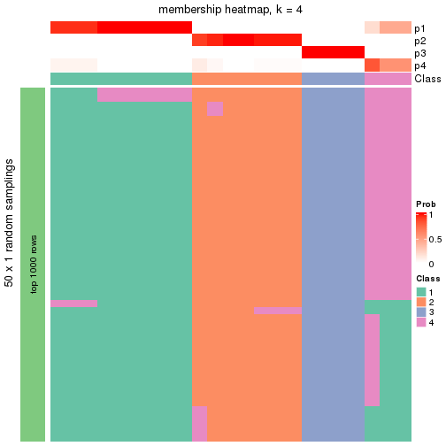</p>

</div>
<div id='tab-node-0121-membership-heatmap-4'>
<pre><code class="r">membership_heatmap(res, k = 5)
</code></pre>

<p></p>

</div>
<div id='tab-node-0121-membership-heatmap-5'>
<pre><code class="r">membership_heatmap(res, k = 6)
</code></pre>

<p></p>

</div>
<div id='tab-node-0121-membership-heatmap-6'>
<pre><code class="r">membership_heatmap(res, k = 7)
</code></pre>

<p></p>

</div>
<div id='tab-node-0121-membership-heatmap-7'>
<pre><code class="r">membership_heatmap(res, k = 8)
</code></pre>

<p></p>

</div>
</div>

As soon as the classes for columns are determined, the signatures
that are significantly different between subgroups can be looked for. 
Following are the heatmaps for signatures.


<script>
$( function() {
	$( '#tabs-node-0121-get-signatures' ).tabs();
} );
</script>
<div id='tabs-node-0121-get-signatures'>
<ul>
<li><a href='#tab-node-0121-get-signatures-1'>k = 2</a></li>
<li><a href='#tab-node-0121-get-signatures-2'>k = 3</a></li>
<li><a href='#tab-node-0121-get-signatures-3'>k = 4</a></li>
<li><a href='#tab-node-0121-get-signatures-4'>k = 5</a></li>
<li><a href='#tab-node-0121-get-signatures-5'>k = 6</a></li>
<li><a href='#tab-node-0121-get-signatures-6'>k = 7</a></li>
<li><a href='#tab-node-0121-get-signatures-7'>k = 8</a></li>
</ul>
<div id='tab-node-0121-get-signatures-1'>
<pre><code class="r">get_signatures(res, k = 2)
</code></pre>

<p></p>

</div>
<div id='tab-node-0121-get-signatures-2'>
<pre><code class="r">get_signatures(res, k = 3)
</code></pre>

<p></p>

</div>
<div id='tab-node-0121-get-signatures-3'>
<pre><code class="r">get_signatures(res, k = 4)
</code></pre>

<p></p>

</div>
<div id='tab-node-0121-get-signatures-4'>
<pre><code class="r">get_signatures(res, k = 5)
</code></pre>

<p></p>

</div>
<div id='tab-node-0121-get-signatures-5'>
<pre><code class="r">get_signatures(res, k = 6)
</code></pre>

<p></p>

</div>
<div id='tab-node-0121-get-signatures-6'>
<pre><code class="r">get_signatures(res, k = 7)
</code></pre>

<p></p>

</div>
<div id='tab-node-0121-get-signatures-7'>
<pre><code class="r">get_signatures(res, k = 8)
</code></pre>

<p></p>

</div>
</div>


Compare the overlap of signatures from different k:

```r
compare_signatures(res)
```


`get_signature()` returns a data frame invisibly. To get the list of signatures, the function
call should be assigned to a variable explicitly. In following code, if `plot` argument is set
to `FALSE`, no heatmap is plotted while only the differential analysis is performed.

```r
# code only for demonstration
tb = get_signature(res, k = ..., plot = FALSE)
```

An example of the output of `tb` is:

```
#>   which_row         fdr    mean_1    mean_2 scaled_mean_1 scaled_mean_2 km
#> 1        38 0.042760348  8.373488  9.131774    -0.5533452     0.5164555  1
#> 2        40 0.018707592  7.106213  8.469186    -0.6173731     0.5762149  1
#> 3        55 0.019134737 10.221463 11.207825    -0.6159697     0.5749050  1
#> 4        59 0.006059896  5.921854  7.869574    -0.6899429     0.6439467  1
#> 5        60 0.018055526  8.928898 10.211722    -0.6204761     0.5791110  1
#> 6        98 0.009384629 15.714769 14.887706     0.6635654    -0.6193277  2
...
```

The columns in `tb` are:

1. `which_row`: row indices corresponding to the input matrix.
2. `fdr`: FDR for the differential test. 
3. `mean_x`: The mean value in group x.
4. `scaled_mean_x`: The mean value in group x after rows are scaled.
5. `km`: Row groups if k-means clustering is applied to rows (which is done by automatically selecting number of clusters).

If there are too many signatures, `top_signatures = ...` can be set to only show the 
signatures with the highest FDRs:

```r
# code only for demonstration
# e.g. to show the top 500 most significant rows
tb = get_signature(res, k = ..., top_signatures = 500)
```

If the signatures are defined as these which are uniquely high in current group, `diff_method` argument
can be set to `"uniquely_high_in_one_group"`:

```r
# code only for demonstration
tb = get_signature(res, k = ..., diff_method = "uniquely_high_in_one_group")
```


UMAP plot which shows how samples are separated.


<script>
$( function() {
	$( '#tabs-node-0121-dimension-reduction' ).tabs();
} );
</script>
<div id='tabs-node-0121-dimension-reduction'>
<ul>
<li><a href='#tab-node-0121-dimension-reduction-1'>k = 2</a></li>
<li><a href='#tab-node-0121-dimension-reduction-2'>k = 3</a></li>
<li><a href='#tab-node-0121-dimension-reduction-3'>k = 4</a></li>
<li><a href='#tab-node-0121-dimension-reduction-4'>k = 5</a></li>
<li><a href='#tab-node-0121-dimension-reduction-5'>k = 6</a></li>
<li><a href='#tab-node-0121-dimension-reduction-6'>k = 7</a></li>
<li><a href='#tab-node-0121-dimension-reduction-7'>k = 8</a></li>
</ul>
<div id='tab-node-0121-dimension-reduction-1'>
<pre><code class="r">dimension_reduction(res, k = 2, method = &quot;UMAP&quot;)
</code></pre>

<p></p>

</div>
<div id='tab-node-0121-dimension-reduction-2'>
<pre><code class="r">dimension_reduction(res, k = 3, method = &quot;UMAP&quot;)
</code></pre>

<p></p>

</div>
<div id='tab-node-0121-dimension-reduction-3'>
<pre><code class="r">dimension_reduction(res, k = 4, method = &quot;UMAP&quot;)
</code></pre>

<p>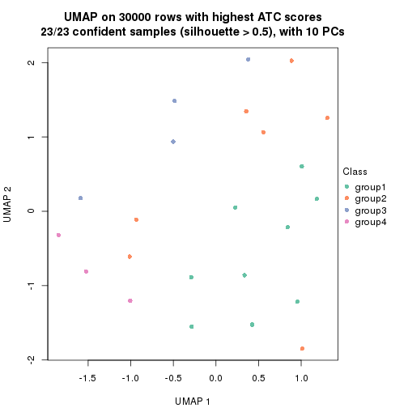</p>

</div>
<div id='tab-node-0121-dimension-reduction-4'>
<pre><code class="r">dimension_reduction(res, k = 5, method = &quot;UMAP&quot;)
</code></pre>

<p>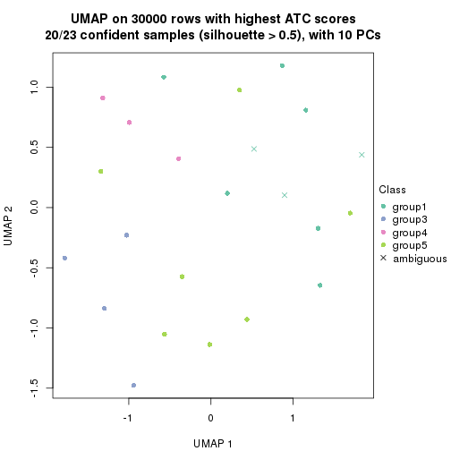</p>

</div>
<div id='tab-node-0121-dimension-reduction-5'>
<pre><code class="r">dimension_reduction(res, k = 6, method = &quot;UMAP&quot;)
</code></pre>

<p></p>

</div>
<div id='tab-node-0121-dimension-reduction-6'>
<pre><code class="r">dimension_reduction(res, k = 7, method = &quot;UMAP&quot;)
</code></pre>

<p></p>

</div>
<div id='tab-node-0121-dimension-reduction-7'>
<pre><code class="r">dimension_reduction(res, k = 8, method = &quot;UMAP&quot;)
</code></pre>

<p></p>

</div>
</div>


Following heatmap shows how subgroups are split when increasing `k`:

```r
collect_classes(res)
```


If matrix rows can be associated to genes, consider to use `functional_enrichment(res,
...)` to perform function enrichment for the signature genes. See [this vignette](https://jokergoo.github.io/cola_vignettes/functional_enrichment.html) for more detailed explanations.


 

---------------------------------------------------


### Node013


Parent node: [Node01](#Node01).
Child nodes: 
                [Node0111](#Node0111)
        ,
                [Node0112](#Node0112)
        ,
                Node0113-leaf
        ,
                [Node0121](#Node0121)
        ,
                Node0122-leaf
        ,
                Node0123-leaf
        ,
                Node0131-leaf
        ,
                [Node0132](#Node0132)
        ,
                Node0133-leaf
        ,
                Node0134-leaf
        ,
                Node0211-leaf
        ,
                Node0212-leaf
        ,
                [Node0213](#Node0213)
        ,
                Node0214-leaf
        ,
                [Node0221](#Node0221)
        ,
                [Node0222](#Node0222)
        ,
                [Node0231](#Node0231)
        ,
                Node0232-leaf
        ,
                Node0233-leaf
        ,
                Node0321-leaf
        ,
                Node0322-leaf
        ,
                Node0323-leaf
        ,
                [Node0331](#Node0331)
        ,
                [Node0332](#Node0332)
        ,
                Node0333-leaf
        .


The object with results only for a single top-value method and a single partitioning method 
can be extracted as:

```r
res = res_rh["013"]
```

A summary of `res` and all the functions that can be applied to it:

```r
res
```

```
#> A 'ConsensusPartition' object with k = 2, 3, 4, 5, 6, 7, 8.
#>   On a matrix with 30000 rows and 42 columns.
#>   Top rows (1000) are extracted by 'ATC' method.
#>   Subgroups are detected by 'skmeans' method.
#>   Performed in total 350 partitions by row resampling.
#>   Best k for subgroups seems to be 5.
#> 
#> Following methods can be applied to this 'ConsensusPartition' object:
#>  [1] "cola_report"             "collect_classes"         "collect_plots"          
#>  [4] "collect_stats"           "colnames"                "compare_partitions"     
#>  [7] "compare_signatures"      "consensus_heatmap"       "dimension_reduction"    
#> [10] "functional_enrichment"   "get_anno_col"            "get_anno"               
#> [13] "get_classes"             "get_consensus"           "get_matrix"             
#> [16] "get_membership"          "get_param"               "get_signatures"         
#> [19] "get_stats"               "is_best_k"               "is_stable_k"            
#> [22] "membership_heatmap"      "ncol"                    "nrow"                   
#> [25] "plot_ecdf"               "predict_classes"         "rownames"               
#> [28] "select_partition_number" "show"                    "suggest_best_k"         
#> [31] "test_to_known_factors"   "top_rows_heatmap"
```

`collect_plots()` function collects all the plots made from `res` for all `k` (number of subgroups)
into one single page to provide an easy and fast comparison between different `k`.

```r
collect_plots(res)
```


The plots are:

- The first row: a plot of the eCDF (empirical cumulative distribution
  function) curves of the consensus matrix for each `k` and the heatmap of
  predicted classes for each `k`.
- The second row: heatmaps of the consensus matrix for each `k`.
- The third row: heatmaps of the membership matrix for each `k`.
- The fouth row: heatmaps of the signatures for each `k`.

All the plots in panels can be made by individual functions and they are
plotted later in this section.

`select_partition_number()` produces several plots showing different
statistics for choosing "optimized" `k`. There are following statistics:

- eCDF curves of the consensus matrix for each `k`;
- 1-PAC. [The PAC score](https://en.wikipedia.org/wiki/Consensus_clustering#Over-interpretation_potential_of_consensus_clustering)
  measures the proportion of the ambiguous subgrouping.
- Mean silhouette score.
- Concordance. The mean probability of fiting the consensus subgroup labels in all
  partitions.
- Area increased. Denote $A_k$ as the area under the eCDF curve for current
  `k`, the area increased is defined as $A_k - A_{k-1}$.
- Rand index. The percent of pairs of samples that are both in a same cluster
  or both are not in a same cluster in the partition of k and k-1.
- Jaccard index. The ratio of pairs of samples are both in a same cluster in
  the partition of k and k-1 and the pairs of samples are both in a same
  cluster in the partition k or k-1.

The detailed explanations of these statistics can be found in [the _cola_
vignette](https://jokergoo.github.io/cola_vignettes/cola.html#toc_13).

Generally speaking, higher 1-PAC score, higher mean silhouette score or higher
concordance corresponds to better partition. Rand index and Jaccard index
measure how similar the current partition is compared to partition with `k-1`.
If they are too similar, we won't accept `k` is better than `k-1`.

```r
select_partition_number(res)
```


The numeric values for all these statistics can be obtained by `get_stats()`.

```r
get_stats(res)
```

```
#>   k 1-PAC mean_silhouette concordance area_increased  Rand Jaccard
#> 2 2 0.903           0.925       0.971        0.49865 0.498   0.498
#> 3 3 1.000           0.997       0.999        0.34889 0.708   0.478
#> 4 4 0.980           0.967       0.983        0.12172 0.891   0.678
#> 5 5 0.920           0.890       0.933        0.04348 0.944   0.779
#> 6 6 0.895           0.786       0.895        0.02967 0.991   0.955
#> 7 7 0.858           0.746       0.861        0.02105 0.981   0.908
#> 8 8 0.877           0.705       0.821        0.00952 0.986   0.929
```

`suggest_best_k()` suggests the best $k$ based on these statistics. The rules are as follows:

- All $k$ with Jaccard index larger than 0.95 are removed because increasing
  $k$ does not provide enough extra information. If all $k$ are removed, it is
  marked as no subgroup is detected.
- For all $k$ with 1-PAC score larger than 0.9, the maximal $k$ is taken as
  the best $k$, and other $k$ are marked as optional $k$.
- If it does not fit the second rule. The $k$ with the maximal vote of the
  highest 1-PAC score, highest mean silhouette, and highest concordance is
  taken as the best $k$.

```r
suggest_best_k(res)
```

```
#> [1] 5
#> attr(,"optional")
#> [1] 2 3 4
```

There is also optional best $k$ = 2 3 4 that is worth to check.

Following is the table of the partitions (You need to click the **show/hide
code output** link to see it). The membership matrix (columns with name `p*`)
is inferred by
[`clue::cl_consensus()`](https://www.rdocumentation.org/link/cl_consensus?package=clue)
function with the `SE` method. Basically the value in the membership matrix
represents the probability to belong to a certain group. The finall subgroup
label for an item is determined with the group with highest probability it
belongs to.

In `get_classes()` function, the entropy is calculated from the membership
matrix and the silhouette score is calculated from the consensus matrix.


<script>
$( function() {
	$( '#tabs-node-013-get-classes' ).tabs();
} );
</script>
<div id='tabs-node-013-get-classes'>
<ul>
<li><a href='#tab-node-013-get-classes-1'>k = 2</a></li>
<li><a href='#tab-node-013-get-classes-2'>k = 3</a></li>
<li><a href='#tab-node-013-get-classes-3'>k = 4</a></li>
<li><a href='#tab-node-013-get-classes-4'>k = 5</a></li>
<li><a href='#tab-node-013-get-classes-5'>k = 6</a></li>
<li><a href='#tab-node-013-get-classes-6'>k = 7</a></li>
<li><a href='#tab-node-013-get-classes-7'>k = 8</a></li>
</ul>

<div id='tab-node-013-get-classes-1'>
<p><a id='tab-node-013-get-classes-1-a' style='color:#0366d6' href='#'>show/hide code output</a></p>
<pre><code class="r">cbind(get_classes(res, k = 2), get_membership(res, k = 2))
</code></pre>

<pre><code>#&gt;                 class entropy silhouette   p1   p2
#&gt; TCGA.FD.A3N6.01     1   0.000     0.9748 1.00 0.00
#&gt; TCGA.XF.A8HG.01     2   0.000     0.9579 0.00 1.00
#&gt; TCGA.CF.A47T.01     1   0.000     0.9748 1.00 0.00
#&gt; TCGA.DK.A1AA.01     1   0.000     0.9748 1.00 0.00
#&gt; TCGA.GC.A3RD.01     1   0.000     0.9748 1.00 0.00
#&gt; TCGA.DK.A1AE.01     1   0.000     0.9748 1.00 0.00
#&gt; TCGA.4Z.AA7O.01     2   0.634     0.8082 0.16 0.84
#&gt; TCGA.G2.AA3B.01     2   0.000     0.9579 0.00 1.00
#&gt; TCGA.GU.A763.01     1   0.000     0.9748 1.00 0.00
#&gt; TCGA.2F.A9KR.01     1   0.000     0.9748 1.00 0.00
#&gt; TCGA.CF.A8HX.01     2   0.000     0.9579 0.00 1.00
#&gt; TCGA.CF.A27C.01     1   0.000     0.9748 1.00 0.00
#&gt; TCGA.BL.A0C8.01     2   0.000     0.9579 0.00 1.00
#&gt; TCGA.YF.AA3M.01     2   0.000     0.9579 0.00 1.00
#&gt; TCGA.GC.A3BM.01     1   0.000     0.9748 1.00 0.00
#&gt; TCGA.FD.A43X.01     2   0.634     0.8082 0.16 0.84
#&gt; TCGA.KQ.A41Q.01     2   0.000     0.9579 0.00 1.00
#&gt; TCGA.CF.A47X.01     1   0.000     0.9748 1.00 0.00
#&gt; TCGA.GD.A6C6.01     1   0.000     0.9748 1.00 0.00
#&gt; TCGA.G2.A3IB.01     1   0.000     0.9748 1.00 0.00
#&gt; TCGA.CU.A3KJ.01     1   0.000     0.9748 1.00 0.00
#&gt; TCGA.LT.A8JT.01     2   0.000     0.9579 0.00 1.00
#&gt; TCGA.5N.A9KM.01     2   0.000     0.9579 0.00 1.00
#&gt; TCGA.DK.AA6P.01     1   0.000     0.9748 1.00 0.00
#&gt; TCGA.FD.A3B5.01     1   0.000     0.9748 1.00 0.00
#&gt; TCGA.DK.A6B1.01     2   0.000     0.9579 0.00 1.00
#&gt; TCGA.5N.A9KI.01     2   0.000     0.9579 0.00 1.00
#&gt; TCGA.S5.AA26.01     1   0.995     0.0637 0.54 0.46
#&gt; TCGA.E5.A4U1.01     2   0.943     0.4517 0.36 0.64
#&gt; TCGA.HQ.A5ND.01     1   0.000     0.9748 1.00 0.00
#&gt; TCGA.BT.A42C.01     2   0.000     0.9579 0.00 1.00
#&gt; TCGA.E7.A8O8.01     2   0.000     0.9579 0.00 1.00
#&gt; TCGA.2F.A9KP.01     2   0.000     0.9579 0.00 1.00
#&gt; TCGA.ZF.A9R2.01     1   0.000     0.9748 1.00 0.00
#&gt; TCGA.E7.A3Y1.01     1   0.000     0.9748 1.00 0.00
#&gt; TCGA.CU.A3QU.01     2   0.000     0.9579 0.00 1.00
#&gt; TCGA.UY.A78M.01     1   0.402     0.8916 0.92 0.08
#&gt; TCGA.K4.A5RI.01     1   0.000     0.9748 1.00 0.00
#&gt; TCGA.DK.AA77.01     1   0.000     0.9748 1.00 0.00
#&gt; TCGA.E7.A97Q.01     2   0.000     0.9579 0.00 1.00
#&gt; TCGA.DK.A3X2.01     1   0.000     0.9748 1.00 0.00
#&gt; TCGA.ZF.A9RN.01     1   0.000     0.9748 1.00 0.00
</code></pre>

<script>
$('#tab-node-013-get-classes-1-a').parent().next().next().hide();
$('#tab-node-013-get-classes-1-a').click(function(){
  $('#tab-node-013-get-classes-1-a').parent().next().next().toggle();
  return(false);
});
</script>
</div>

<div id='tab-node-013-get-classes-2'>
<p><a id='tab-node-013-get-classes-2-a' style='color:#0366d6' href='#'>show/hide code output</a></p>
<pre><code class="r">cbind(get_classes(res, k = 3), get_membership(res, k = 3))
</code></pre>

<pre><code>#&gt;                 class entropy silhouette   p1   p2 p3
#&gt; TCGA.FD.A3N6.01     3  0.0000      1.000 0.00 0.00  1
#&gt; TCGA.XF.A8HG.01     2  0.0000      0.997 0.00 1.00  0
#&gt; TCGA.CF.A47T.01     1  0.0000      0.999 1.00 0.00  0
#&gt; TCGA.DK.A1AA.01     1  0.0000      0.999 1.00 0.00  0
#&gt; TCGA.GC.A3RD.01     1  0.0000      0.999 1.00 0.00  0
#&gt; TCGA.DK.A1AE.01     3  0.0000      1.000 0.00 0.00  1
#&gt; TCGA.4Z.AA7O.01     1  0.0000      0.999 1.00 0.00  0
#&gt; TCGA.G2.AA3B.01     2  0.0000      0.997 0.00 1.00  0
#&gt; TCGA.GU.A763.01     1  0.0000      0.999 1.00 0.00  0
#&gt; TCGA.2F.A9KR.01     3  0.0000      1.000 0.00 0.00  1
#&gt; TCGA.CF.A8HX.01     2  0.0000      0.997 0.00 1.00  0
#&gt; TCGA.CF.A27C.01     1  0.0000      0.999 1.00 0.00  0
#&gt; TCGA.BL.A0C8.01     2  0.0000      0.997 0.00 1.00  0
#&gt; TCGA.YF.AA3M.01     2  0.0892      0.979 0.02 0.98  0
#&gt; TCGA.GC.A3BM.01     1  0.0000      0.999 1.00 0.00  0
#&gt; TCGA.FD.A43X.01     1  0.0000      0.999 1.00 0.00  0
#&gt; TCGA.KQ.A41Q.01     2  0.0000      0.997 0.00 1.00  0
#&gt; TCGA.CF.A47X.01     1  0.0000      0.999 1.00 0.00  0
#&gt; TCGA.GD.A6C6.01     1  0.0000      0.999 1.00 0.00  0
#&gt; TCGA.G2.A3IB.01     3  0.0000      1.000 0.00 0.00  1
#&gt; TCGA.CU.A3KJ.01     3  0.0000      1.000 0.00 0.00  1
#&gt; TCGA.LT.A8JT.01     2  0.0000      0.997 0.00 1.00  0
#&gt; TCGA.5N.A9KM.01     2  0.0000      0.997 0.00 1.00  0
#&gt; TCGA.DK.AA6P.01     3  0.0000      1.000 0.00 0.00  1
#&gt; TCGA.FD.A3B5.01     3  0.0000      1.000 0.00 0.00  1
#&gt; TCGA.DK.A6B1.01     2  0.0000      0.997 0.00 1.00  0
#&gt; TCGA.5N.A9KI.01     2  0.0000      0.997 0.00 1.00  0
#&gt; TCGA.S5.AA26.01     1  0.0000      0.999 1.00 0.00  0
#&gt; TCGA.E5.A4U1.01     1  0.0000      0.999 1.00 0.00  0
#&gt; TCGA.HQ.A5ND.01     3  0.0000      1.000 0.00 0.00  1
#&gt; TCGA.BT.A42C.01     2  0.0892      0.979 0.02 0.98  0
#&gt; TCGA.E7.A8O8.01     2  0.0000      0.997 0.00 1.00  0
#&gt; TCGA.2F.A9KP.01     2  0.0000      0.997 0.00 1.00  0
#&gt; TCGA.ZF.A9R2.01     1  0.0000      0.999 1.00 0.00  0
#&gt; TCGA.E7.A3Y1.01     1  0.0000      0.999 1.00 0.00  0
#&gt; TCGA.CU.A3QU.01     2  0.0000      0.997 0.00 1.00  0
#&gt; TCGA.UY.A78M.01     1  0.0000      0.999 1.00 0.00  0
#&gt; TCGA.K4.A5RI.01     3  0.0000      1.000 0.00 0.00  1
#&gt; TCGA.DK.AA77.01     1  0.0000      0.999 1.00 0.00  0
#&gt; TCGA.E7.A97Q.01     1  0.0892      0.979 0.98 0.02  0
#&gt; TCGA.DK.A3X2.01     3  0.0000      1.000 0.00 0.00  1
#&gt; TCGA.ZF.A9RN.01     3  0.0000      1.000 0.00 0.00  1
</code></pre>

<script>
$('#tab-node-013-get-classes-2-a').parent().next().next().hide();
$('#tab-node-013-get-classes-2-a').click(function(){
  $('#tab-node-013-get-classes-2-a').parent().next().next().toggle();
  return(false);
});
</script>
</div>

<div id='tab-node-013-get-classes-3'>
<p><a id='tab-node-013-get-classes-3-a' style='color:#0366d6' href='#'>show/hide code output</a></p>
<pre><code class="r">cbind(get_classes(res, k = 4), get_membership(res, k = 4))
</code></pre>

<pre><code>#&gt;                 class entropy silhouette   p1   p2 p3   p4
#&gt; TCGA.FD.A3N6.01     3   0.000      1.000 0.00 0.00  1 0.00
#&gt; TCGA.XF.A8HG.01     2   0.000      1.000 0.00 1.00  0 0.00
#&gt; TCGA.CF.A47T.01     1   0.000      0.986 1.00 0.00  0 0.00
#&gt; TCGA.DK.A1AA.01     1   0.000      0.986 1.00 0.00  0 0.00
#&gt; TCGA.GC.A3RD.01     4   0.000      0.901 0.00 0.00  0 1.00
#&gt; TCGA.DK.A1AE.01     3   0.000      1.000 0.00 0.00  1 0.00
#&gt; TCGA.4Z.AA7O.01     1   0.292      0.826 0.86 0.00  0 0.14
#&gt; TCGA.G2.AA3B.01     2   0.000      1.000 0.00 1.00  0 0.00
#&gt; TCGA.GU.A763.01     1   0.000      0.986 1.00 0.00  0 0.00
#&gt; TCGA.2F.A9KR.01     3   0.000      1.000 0.00 0.00  1 0.00
#&gt; TCGA.CF.A8HX.01     2   0.000      1.000 0.00 1.00  0 0.00
#&gt; TCGA.CF.A27C.01     1   0.000      0.986 1.00 0.00  0 0.00
#&gt; TCGA.BL.A0C8.01     2   0.000      1.000 0.00 1.00  0 0.00
#&gt; TCGA.YF.AA3M.01     4   0.361      0.786 0.00 0.20  0 0.80
#&gt; TCGA.GC.A3BM.01     1   0.000      0.986 1.00 0.00  0 0.00
#&gt; TCGA.FD.A43X.01     1   0.000      0.986 1.00 0.00  0 0.00
#&gt; TCGA.KQ.A41Q.01     2   0.000      1.000 0.00 1.00  0 0.00
#&gt; TCGA.CF.A47X.01     1   0.000      0.986 1.00 0.00  0 0.00
#&gt; TCGA.GD.A6C6.01     4   0.000      0.901 0.00 0.00  0 1.00
#&gt; TCGA.G2.A3IB.01     3   0.000      1.000 0.00 0.00  1 0.00
#&gt; TCGA.CU.A3KJ.01     3   0.000      1.000 0.00 0.00  1 0.00
#&gt; TCGA.LT.A8JT.01     2   0.000      1.000 0.00 1.00  0 0.00
#&gt; TCGA.5N.A9KM.01     2   0.000      1.000 0.00 1.00  0 0.00
#&gt; TCGA.DK.AA6P.01     3   0.000      1.000 0.00 0.00  1 0.00
#&gt; TCGA.FD.A3B5.01     3   0.000      1.000 0.00 0.00  1 0.00
#&gt; TCGA.DK.A6B1.01     2   0.000      1.000 0.00 1.00  0 0.00
#&gt; TCGA.5N.A9KI.01     2   0.000      1.000 0.00 1.00  0 0.00
#&gt; TCGA.S5.AA26.01     1   0.000      0.986 1.00 0.00  0 0.00
#&gt; TCGA.E5.A4U1.01     4   0.317      0.781 0.16 0.00  0 0.84
#&gt; TCGA.HQ.A5ND.01     3   0.000      1.000 0.00 0.00  1 0.00
#&gt; TCGA.BT.A42C.01     4   0.380      0.763 0.00 0.22  0 0.78
#&gt; TCGA.E7.A8O8.01     2   0.000      1.000 0.00 1.00  0 0.00
#&gt; TCGA.2F.A9KP.01     2   0.000      1.000 0.00 1.00  0 0.00
#&gt; TCGA.ZF.A9R2.01     1   0.000      0.986 1.00 0.00  0 0.00
#&gt; TCGA.E7.A3Y1.01     1   0.000      0.986 1.00 0.00  0 0.00
#&gt; TCGA.CU.A3QU.01     2   0.000      1.000 0.00 1.00  0 0.00
#&gt; TCGA.UY.A78M.01     4   0.000      0.901 0.00 0.00  0 1.00
#&gt; TCGA.K4.A5RI.01     3   0.000      1.000 0.00 0.00  1 0.00
#&gt; TCGA.DK.AA77.01     1   0.000      0.986 1.00 0.00  0 0.00
#&gt; TCGA.E7.A97Q.01     4   0.000      0.901 0.00 0.00  0 1.00
#&gt; TCGA.DK.A3X2.01     3   0.000      1.000 0.00 0.00  1 0.00
#&gt; TCGA.ZF.A9RN.01     3   0.000      1.000 0.00 0.00  1 0.00
</code></pre>

<script>
$('#tab-node-013-get-classes-3-a').parent().next().next().hide();
$('#tab-node-013-get-classes-3-a').click(function(){
  $('#tab-node-013-get-classes-3-a').parent().next().next().toggle();
  return(false);
});
</script>
</div>

<div id='tab-node-013-get-classes-4'>
<p><a id='tab-node-013-get-classes-4-a' style='color:#0366d6' href='#'>show/hide code output</a></p>
<pre><code class="r">cbind(get_classes(res, k = 5), get_membership(res, k = 5))
</code></pre>

<pre><code>#&gt;                 class entropy silhouette   p1   p2   p3   p4   p5
#&gt; TCGA.FD.A3N6.01     3  0.0000      0.998 0.00 0.00 1.00 0.00 0.00
#&gt; TCGA.XF.A8HG.01     2  0.0000      0.984 0.00 1.00 0.00 0.00 0.00
#&gt; TCGA.CF.A47T.01     1  0.0000      0.902 1.00 0.00 0.00 0.00 0.00
#&gt; TCGA.DK.A1AA.01     1  0.1410      0.870 0.94 0.00 0.00 0.00 0.06
#&gt; TCGA.GC.A3RD.01     4  0.0000      1.000 0.00 0.00 0.00 1.00 0.00
#&gt; TCGA.DK.A1AE.01     3  0.0000      0.998 0.00 0.00 1.00 0.00 0.00
#&gt; TCGA.4Z.AA7O.01     5  0.4456      0.507 0.32 0.00 0.00 0.02 0.66
#&gt; TCGA.G2.AA3B.01     2  0.0000      0.984 0.00 1.00 0.00 0.00 0.00
#&gt; TCGA.GU.A763.01     1  0.0609      0.895 0.98 0.00 0.00 0.00 0.02
#&gt; TCGA.2F.A9KR.01     3  0.0000      0.998 0.00 0.00 1.00 0.00 0.00
#&gt; TCGA.CF.A8HX.01     2  0.1410      0.944 0.00 0.94 0.00 0.00 0.06
#&gt; TCGA.CF.A27C.01     1  0.3109      0.778 0.80 0.00 0.00 0.00 0.20
#&gt; TCGA.BL.A0C8.01     2  0.0000      0.984 0.00 1.00 0.00 0.00 0.00
#&gt; TCGA.YF.AA3M.01     5  0.5597      0.491 0.00 0.20 0.00 0.16 0.64
#&gt; TCGA.GC.A3BM.01     1  0.0000      0.902 1.00 0.00 0.00 0.00 0.00
#&gt; TCGA.FD.A43X.01     5  0.3983      0.447 0.34 0.00 0.00 0.00 0.66
#&gt; TCGA.KQ.A41Q.01     2  0.0000      0.984 0.00 1.00 0.00 0.00 0.00
#&gt; TCGA.CF.A47X.01     1  0.2929      0.798 0.82 0.00 0.00 0.00 0.18
#&gt; TCGA.GD.A6C6.01     4  0.0000      1.000 0.00 0.00 0.00 1.00 0.00
#&gt; TCGA.G2.A3IB.01     3  0.0000      0.998 0.00 0.00 1.00 0.00 0.00
#&gt; TCGA.CU.A3KJ.01     3  0.0000      0.998 0.00 0.00 1.00 0.00 0.00
#&gt; TCGA.LT.A8JT.01     2  0.1410      0.944 0.00 0.94 0.00 0.00 0.06
#&gt; TCGA.5N.A9KM.01     2  0.0000      0.984 0.00 1.00 0.00 0.00 0.00
#&gt; TCGA.DK.AA6P.01     3  0.0609      0.981 0.00 0.00 0.98 0.00 0.02
#&gt; TCGA.FD.A3B5.01     3  0.0000      0.998 0.00 0.00 1.00 0.00 0.00
#&gt; TCGA.DK.A6B1.01     2  0.1043      0.956 0.00 0.96 0.00 0.00 0.04
#&gt; TCGA.5N.A9KI.01     2  0.0609      0.972 0.00 0.98 0.00 0.00 0.02
#&gt; TCGA.S5.AA26.01     5  0.2516      0.612 0.14 0.00 0.00 0.00 0.86
#&gt; TCGA.E5.A4U1.01     5  0.5888      0.453 0.14 0.00 0.00 0.28 0.58
#&gt; TCGA.HQ.A5ND.01     3  0.0000      0.998 0.00 0.00 1.00 0.00 0.00
#&gt; TCGA.BT.A42C.01     5  0.5555      0.492 0.00 0.22 0.00 0.14 0.64
#&gt; TCGA.E7.A8O8.01     2  0.0000      0.984 0.00 1.00 0.00 0.00 0.00
#&gt; TCGA.2F.A9KP.01     2  0.0000      0.984 0.00 1.00 0.00 0.00 0.00
#&gt; TCGA.ZF.A9R2.01     1  0.2929      0.798 0.82 0.00 0.00 0.00 0.18
#&gt; TCGA.E7.A3Y1.01     1  0.0609      0.895 0.98 0.00 0.00 0.00 0.02
#&gt; TCGA.CU.A3QU.01     2  0.0000      0.984 0.00 1.00 0.00 0.00 0.00
#&gt; TCGA.UY.A78M.01     4  0.0000      1.000 0.00 0.00 0.00 1.00 0.00
#&gt; TCGA.K4.A5RI.01     3  0.0000      0.998 0.00 0.00 1.00 0.00 0.00
#&gt; TCGA.DK.AA77.01     1  0.0000      0.902 1.00 0.00 0.00 0.00 0.00
#&gt; TCGA.E7.A97Q.01     4  0.0000      1.000 0.00 0.00 0.00 1.00 0.00
#&gt; TCGA.DK.A3X2.01     3  0.0000      0.998 0.00 0.00 1.00 0.00 0.00
#&gt; TCGA.ZF.A9RN.01     3  0.0000      0.998 0.00 0.00 1.00 0.00 0.00
</code></pre>

<script>
$('#tab-node-013-get-classes-4-a').parent().next().next().hide();
$('#tab-node-013-get-classes-4-a').click(function(){
  $('#tab-node-013-get-classes-4-a').parent().next().next().toggle();
  return(false);
});
</script>
</div>

<div id='tab-node-013-get-classes-5'>
<p><a id='tab-node-013-get-classes-5-a' style='color:#0366d6' href='#'>show/hide code output</a></p>
<pre><code class="r">cbind(get_classes(res, k = 6), get_membership(res, k = 6))
</code></pre>

<pre><code>#&gt;                 class entropy silhouette   p1   p2   p3   p4   p5   p6
#&gt; TCGA.FD.A3N6.01     3  0.0000     0.9978 0.00 0.00 1.00 0.00 0.00 0.00
#&gt; TCGA.XF.A8HG.01     2  0.0000     0.9372 0.00 1.00 0.00 0.00 0.00 0.00
#&gt; TCGA.CF.A47T.01     1  0.1556     0.7059 0.92 0.00 0.00 0.00 0.00 0.08
#&gt; TCGA.DK.A1AA.01     1  0.3409     0.4288 0.70 0.00 0.00 0.00 0.00 0.30
#&gt; TCGA.GC.A3RD.01     4  0.0547     0.9671 0.02 0.00 0.00 0.98 0.00 0.00
#&gt; TCGA.DK.A1AE.01     3  0.0000     0.9978 0.00 0.00 1.00 0.00 0.00 0.00
#&gt; TCGA.4Z.AA7O.01     6  0.6721     0.4805 0.20 0.00 0.00 0.06 0.28 0.46
#&gt; TCGA.G2.AA3B.01     2  0.0000     0.9372 0.00 1.00 0.00 0.00 0.00 0.00
#&gt; TCGA.GU.A763.01     1  0.0000     0.7399 1.00 0.00 0.00 0.00 0.00 0.00
#&gt; TCGA.2F.A9KR.01     3  0.0000     0.9978 0.00 0.00 1.00 0.00 0.00 0.00
#&gt; TCGA.CF.A8HX.01     2  0.2094     0.8921 0.00 0.90 0.00 0.00 0.02 0.08
#&gt; TCGA.CF.A27C.01     1  0.4806     0.2177 0.56 0.00 0.00 0.00 0.06 0.38
#&gt; TCGA.BL.A0C8.01     2  0.0000     0.9372 0.00 1.00 0.00 0.00 0.00 0.00
#&gt; TCGA.YF.AA3M.01     5  0.1556     0.5162 0.00 0.00 0.00 0.08 0.92 0.00
#&gt; TCGA.GC.A3BM.01     1  0.0000     0.7399 1.00 0.00 0.00 0.00 0.00 0.00
#&gt; TCGA.FD.A43X.01     6  0.4613     0.5566 0.26 0.00 0.00 0.00 0.08 0.66
#&gt; TCGA.KQ.A41Q.01     2  0.0000     0.9372 0.00 1.00 0.00 0.00 0.00 0.00
#&gt; TCGA.CF.A47X.01     1  0.4798     0.4268 0.62 0.00 0.00 0.00 0.08 0.30
#&gt; TCGA.GD.A6C6.01     4  0.0000     0.9822 0.00 0.00 0.00 1.00 0.00 0.00
#&gt; TCGA.G2.A3IB.01     3  0.0000     0.9978 0.00 0.00 1.00 0.00 0.00 0.00
#&gt; TCGA.CU.A3KJ.01     3  0.0000     0.9978 0.00 0.00 1.00 0.00 0.00 0.00
#&gt; TCGA.LT.A8JT.01     2  0.2094     0.8921 0.00 0.90 0.00 0.00 0.02 0.08
#&gt; TCGA.5N.A9KM.01     2  0.0000     0.9372 0.00 1.00 0.00 0.00 0.00 0.00
#&gt; TCGA.DK.AA6P.01     3  0.0547     0.9777 0.02 0.00 0.98 0.00 0.00 0.00
#&gt; TCGA.FD.A3B5.01     3  0.0000     0.9978 0.00 0.00 1.00 0.00 0.00 0.00
#&gt; TCGA.DK.A6B1.01     2  0.3409     0.6183 0.00 0.70 0.00 0.00 0.30 0.00
#&gt; TCGA.5N.A9KI.01     2  0.2350     0.8548 0.00 0.88 0.00 0.02 0.10 0.00
#&gt; TCGA.S5.AA26.01     5  0.5265    -0.0643 0.10 0.00 0.00 0.00 0.50 0.40
#&gt; TCGA.E5.A4U1.01     5  0.7023     0.1623 0.08 0.00 0.00 0.20 0.38 0.34
#&gt; TCGA.HQ.A5ND.01     3  0.0000     0.9978 0.00 0.00 1.00 0.00 0.00 0.00
#&gt; TCGA.BT.A42C.01     5  0.1480     0.5116 0.00 0.02 0.00 0.04 0.94 0.00
#&gt; TCGA.E7.A8O8.01     2  0.1807     0.9034 0.00 0.92 0.00 0.00 0.02 0.06
#&gt; TCGA.2F.A9KP.01     2  0.0000     0.9372 0.00 1.00 0.00 0.00 0.00 0.00
#&gt; TCGA.ZF.A9R2.01     1  0.4328     0.5585 0.72 0.00 0.00 0.00 0.10 0.18
#&gt; TCGA.E7.A3Y1.01     1  0.0000     0.7399 1.00 0.00 0.00 0.00 0.00 0.00
#&gt; TCGA.CU.A3QU.01     2  0.0000     0.9372 0.00 1.00 0.00 0.00 0.00 0.00
#&gt; TCGA.UY.A78M.01     4  0.0000     0.9822 0.00 0.00 0.00 1.00 0.00 0.00
#&gt; TCGA.K4.A5RI.01     3  0.0000     0.9978 0.00 0.00 1.00 0.00 0.00 0.00
#&gt; TCGA.DK.AA77.01     1  0.0937     0.7278 0.96 0.00 0.00 0.00 0.00 0.04
#&gt; TCGA.E7.A97Q.01     4  0.0547     0.9718 0.00 0.00 0.00 0.98 0.00 0.02
#&gt; TCGA.DK.A3X2.01     3  0.0000     0.9978 0.00 0.00 1.00 0.00 0.00 0.00
#&gt; TCGA.ZF.A9RN.01     3  0.0000     0.9978 0.00 0.00 1.00 0.00 0.00 0.00
</code></pre>

<script>
$('#tab-node-013-get-classes-5-a').parent().next().next().hide();
$('#tab-node-013-get-classes-5-a').click(function(){
  $('#tab-node-013-get-classes-5-a').parent().next().next().toggle();
  return(false);
});
</script>
</div>

<div id='tab-node-013-get-classes-6'>
<p><a id='tab-node-013-get-classes-6-a' style='color:#0366d6' href='#'>show/hide code output</a></p>
<pre><code class="r">cbind(get_classes(res, k = 7), get_membership(res, k = 7))
</code></pre>

<pre><code>#&gt;                 class entropy silhouette   p1   p2   p3   p4   p5   p6   p7
#&gt; TCGA.FD.A3N6.01     3  0.0000      0.982 0.00 0.00 1.00 0.00 0.00 0.00 0.00
#&gt; TCGA.XF.A8HG.01     2  0.0000      0.847 0.00 1.00 0.00 0.00 0.00 0.00 0.00
#&gt; TCGA.CF.A47T.01     1  0.1718      0.725 0.92 0.00 0.00 0.00 0.00 0.04 0.04
#&gt; TCGA.DK.A1AA.01     1  0.3745      0.545 0.70 0.00 0.00 0.00 0.00 0.26 0.04
#&gt; TCGA.GC.A3RD.01     4  0.0000      0.985 0.00 0.00 0.00 1.00 0.00 0.00 0.00
#&gt; TCGA.DK.A1AE.01     3  0.0000      0.982 0.00 0.00 1.00 0.00 0.00 0.00 0.00
#&gt; TCGA.4Z.AA7O.01     6  0.6202      0.491 0.24 0.00 0.00 0.06 0.08 0.56 0.06
#&gt; TCGA.G2.AA3B.01     2  0.0000      0.847 0.00 1.00 0.00 0.00 0.00 0.00 0.00
#&gt; TCGA.GU.A763.01     1  0.0504      0.721 0.98 0.00 0.00 0.00 0.00 0.00 0.02
#&gt; TCGA.2F.A9KR.01     3  0.1664      0.931 0.00 0.00 0.92 0.00 0.00 0.02 0.06
#&gt; TCGA.CF.A8HX.01     2  0.4702      0.647 0.00 0.68 0.00 0.00 0.20 0.08 0.04
#&gt; TCGA.CF.A27C.01     1  0.5047      0.275 0.52 0.00 0.00 0.00 0.00 0.34 0.14
#&gt; TCGA.BL.A0C8.01     2  0.0000      0.847 0.00 1.00 0.00 0.00 0.00 0.00 0.00
#&gt; TCGA.YF.AA3M.01     5  0.4392      0.974 0.00 0.06 0.00 0.10 0.76 0.02 0.06
#&gt; TCGA.GC.A3BM.01     1  0.1664      0.716 0.92 0.00 0.00 0.00 0.00 0.06 0.02
#&gt; TCGA.FD.A43X.01     6  0.3208      0.509 0.12 0.00 0.00 0.00 0.02 0.82 0.04
#&gt; TCGA.KQ.A41Q.01     2  0.0000      0.847 0.00 1.00 0.00 0.00 0.00 0.00 0.00
#&gt; TCGA.CF.A47X.01     7  0.3909      0.232 0.40 0.00 0.00 0.00 0.00 0.02 0.58
#&gt; TCGA.GD.A6C6.01     4  0.0000      0.985 0.00 0.00 0.00 1.00 0.00 0.00 0.00
#&gt; TCGA.G2.A3IB.01     3  0.0000      0.982 0.00 0.00 1.00 0.00 0.00 0.00 0.00
#&gt; TCGA.CU.A3KJ.01     3  0.0000      0.982 0.00 0.00 1.00 0.00 0.00 0.00 0.00
#&gt; TCGA.LT.A8JT.01     2  0.4569      0.664 0.00 0.70 0.00 0.00 0.18 0.08 0.04
#&gt; TCGA.5N.A9KM.01     2  0.0000      0.847 0.00 1.00 0.00 0.00 0.00 0.00 0.00
#&gt; TCGA.DK.AA6P.01     3  0.2159      0.914 0.02 0.00 0.90 0.00 0.00 0.02 0.06
#&gt; TCGA.FD.A3B5.01     3  0.0000      0.982 0.00 0.00 1.00 0.00 0.00 0.00 0.00
#&gt; TCGA.DK.A6B1.01     2  0.3459      0.330 0.00 0.60 0.00 0.00 0.40 0.00 0.00
#&gt; TCGA.5N.A9KI.01     2  0.3139      0.536 0.00 0.70 0.00 0.00 0.30 0.00 0.00
#&gt; TCGA.S5.AA26.01     6  0.6234      0.203 0.06 0.00 0.00 0.00 0.20 0.44 0.30
#&gt; TCGA.E5.A4U1.01     7  0.6080      0.304 0.06 0.00 0.00 0.18 0.10 0.06 0.60
#&gt; TCGA.HQ.A5ND.01     3  0.0000      0.982 0.00 0.00 1.00 0.00 0.00 0.00 0.00
#&gt; TCGA.BT.A42C.01     5  0.4110      0.974 0.00 0.06 0.00 0.10 0.78 0.02 0.04
#&gt; TCGA.E7.A8O8.01     2  0.4298      0.689 0.00 0.74 0.00 0.00 0.10 0.04 0.12
#&gt; TCGA.2F.A9KP.01     2  0.0000      0.847 0.00 1.00 0.00 0.00 0.00 0.00 0.00
#&gt; TCGA.ZF.A9R2.01     1  0.4244     -0.156 0.54 0.00 0.00 0.00 0.00 0.04 0.42
#&gt; TCGA.E7.A3Y1.01     1  0.1006      0.703 0.96 0.00 0.00 0.00 0.00 0.02 0.02
#&gt; TCGA.CU.A3QU.01     2  0.0000      0.847 0.00 1.00 0.00 0.00 0.00 0.00 0.00
#&gt; TCGA.UY.A78M.01     4  0.0000      0.985 0.00 0.00 0.00 1.00 0.00 0.00 0.00
#&gt; TCGA.K4.A5RI.01     3  0.0000      0.982 0.00 0.00 1.00 0.00 0.00 0.00 0.00
#&gt; TCGA.DK.AA77.01     1  0.1664      0.724 0.92 0.00 0.00 0.00 0.00 0.06 0.02
#&gt; TCGA.E7.A97Q.01     4  0.1006      0.954 0.00 0.00 0.00 0.96 0.02 0.00 0.02
#&gt; TCGA.DK.A3X2.01     3  0.0504      0.972 0.00 0.00 0.98 0.00 0.00 0.00 0.02
#&gt; TCGA.ZF.A9RN.01     3  0.0000      0.982 0.00 0.00 1.00 0.00 0.00 0.00 0.00
</code></pre>

<script>
$('#tab-node-013-get-classes-6-a').parent().next().next().hide();
$('#tab-node-013-get-classes-6-a').click(function(){
  $('#tab-node-013-get-classes-6-a').parent().next().next().toggle();
  return(false);
});
</script>
</div>

<div id='tab-node-013-get-classes-7'>
<p><a id='tab-node-013-get-classes-7-a' style='color:#0366d6' href='#'>show/hide code output</a></p>
<pre><code class="r">cbind(get_classes(res, k = 8), get_membership(res, k = 8))
</code></pre>

<pre><code>#&gt;                 class entropy silhouette   p1   p2   p3   p4   p5   p6   p7   p8
#&gt; TCGA.FD.A3N6.01     3  0.0000     0.9881 0.00 0.00 1.00 0.00 0.00 0.00 0.00 0.00
#&gt; TCGA.XF.A8HG.01     2  0.0471     0.8017 0.00 0.98 0.00 0.02 0.00 0.00 0.00 0.00
#&gt; TCGA.CF.A47T.01     1  0.0471     0.6951 0.98 0.00 0.00 0.00 0.00 0.02 0.00 0.00
#&gt; TCGA.DK.A1AA.01     1  0.3431     0.5499 0.74 0.00 0.00 0.00 0.00 0.20 0.06 0.00
#&gt; TCGA.GC.A3RD.01     8  0.0000     0.9480 0.00 0.00 0.00 0.00 0.00 0.00 0.00 1.00
#&gt; TCGA.DK.A1AE.01     3  0.0000     0.9881 0.00 0.00 1.00 0.00 0.00 0.00 0.00 0.00
#&gt; TCGA.4Z.AA7O.01     6  0.6957     0.3409 0.18 0.00 0.00 0.04 0.10 0.50 0.10 0.08
#&gt; TCGA.G2.AA3B.01     2  0.0000     0.8094 0.00 1.00 0.00 0.00 0.00 0.00 0.00 0.00
#&gt; TCGA.GU.A763.01     1  0.0941     0.6857 0.96 0.00 0.00 0.02 0.00 0.00 0.02 0.00
#&gt; TCGA.2F.A9KR.01     3  0.1408     0.9448 0.00 0.00 0.94 0.02 0.00 0.02 0.02 0.00
#&gt; TCGA.CF.A8HX.01     2  0.4125     0.4357 0.00 0.52 0.00 0.44 0.02 0.02 0.00 0.00
#&gt; TCGA.CF.A27C.01     1  0.5683     0.0852 0.42 0.00 0.00 0.04 0.00 0.34 0.20 0.00
#&gt; TCGA.BL.A0C8.01     2  0.0000     0.8094 0.00 1.00 0.00 0.00 0.00 0.00 0.00 0.00
#&gt; TCGA.YF.AA3M.01     5  0.1887     0.9196 0.00 0.04 0.00 0.00 0.90 0.00 0.00 0.06
#&gt; TCGA.GC.A3BM.01     1  0.0000     0.6971 1.00 0.00 0.00 0.00 0.00 0.00 0.00 0.00
#&gt; TCGA.FD.A43X.01     6  0.3263     0.3026 0.10 0.00 0.00 0.00 0.00 0.78 0.12 0.00
#&gt; TCGA.KQ.A41Q.01     2  0.0000     0.8094 0.00 1.00 0.00 0.00 0.00 0.00 0.00 0.00
#&gt; TCGA.CF.A47X.01     1  0.6955     0.0780 0.40 0.00 0.00 0.16 0.06 0.14 0.24 0.00
#&gt; TCGA.GD.A6C6.01     8  0.0000     0.9480 0.00 0.00 0.00 0.00 0.00 0.00 0.00 1.00
#&gt; TCGA.G2.A3IB.01     3  0.0000     0.9881 0.00 0.00 1.00 0.00 0.00 0.00 0.00 0.00
#&gt; TCGA.CU.A3KJ.01     3  0.0000     0.9881 0.00 0.00 1.00 0.00 0.00 0.00 0.00 0.00
#&gt; TCGA.LT.A8JT.01     2  0.3658     0.5033 0.00 0.58 0.00 0.40 0.02 0.00 0.00 0.00
#&gt; TCGA.5N.A9KM.01     2  0.0000     0.8094 0.00 1.00 0.00 0.00 0.00 0.00 0.00 0.00
#&gt; TCGA.DK.AA6P.01     3  0.1408     0.9448 0.00 0.00 0.94 0.02 0.00 0.02 0.02 0.00
#&gt; TCGA.FD.A3B5.01     3  0.0000     0.9881 0.00 0.00 1.00 0.00 0.00 0.00 0.00 0.00
#&gt; TCGA.DK.A6B1.01     2  0.2852     0.5587 0.00 0.72 0.00 0.00 0.28 0.00 0.00 0.00
#&gt; TCGA.5N.A9KI.01     2  0.3198     0.5501 0.00 0.72 0.00 0.02 0.26 0.00 0.00 0.00
#&gt; TCGA.S5.AA26.01     7  0.4460    -0.1379 0.06 0.00 0.00 0.00 0.12 0.12 0.70 0.00
#&gt; TCGA.E5.A4U1.01     7  0.8029     0.0993 0.06 0.00 0.00 0.22 0.12 0.10 0.30 0.20
#&gt; TCGA.HQ.A5ND.01     3  0.0000     0.9881 0.00 0.00 1.00 0.00 0.00 0.00 0.00 0.00
#&gt; TCGA.BT.A42C.01     5  0.2482     0.9196 0.00 0.06 0.00 0.00 0.88 0.02 0.02 0.02
#&gt; TCGA.E7.A8O8.01     2  0.5044     0.3422 0.00 0.50 0.00 0.40 0.04 0.02 0.04 0.00
#&gt; TCGA.2F.A9KP.01     2  0.0000     0.8094 0.00 1.00 0.00 0.00 0.00 0.00 0.00 0.00
#&gt; TCGA.ZF.A9R2.01     1  0.5322     0.4959 0.64 0.00 0.00 0.06 0.04 0.16 0.10 0.00
#&gt; TCGA.E7.A3Y1.01     1  0.2071     0.6624 0.90 0.00 0.00 0.04 0.00 0.02 0.04 0.00
#&gt; TCGA.CU.A3QU.01     2  0.0000     0.8094 0.00 1.00 0.00 0.00 0.00 0.00 0.00 0.00
#&gt; TCGA.UY.A78M.01     8  0.0471     0.9370 0.00 0.00 0.00 0.00 0.02 0.00 0.00 0.98
#&gt; TCGA.K4.A5RI.01     3  0.0000     0.9881 0.00 0.00 1.00 0.00 0.00 0.00 0.00 0.00
#&gt; TCGA.DK.AA77.01     1  0.1741     0.6872 0.92 0.00 0.00 0.00 0.00 0.04 0.02 0.02
#&gt; TCGA.E7.A97Q.01     8  0.2348     0.8626 0.00 0.00 0.00 0.06 0.02 0.04 0.00 0.88
#&gt; TCGA.DK.A3X2.01     3  0.0000     0.9881 0.00 0.00 1.00 0.00 0.00 0.00 0.00 0.00
#&gt; TCGA.ZF.A9RN.01     3  0.0000     0.9881 0.00 0.00 1.00 0.00 0.00 0.00 0.00 0.00
</code></pre>

<script>
$('#tab-node-013-get-classes-7-a').parent().next().next().hide();
$('#tab-node-013-get-classes-7-a').click(function(){
  $('#tab-node-013-get-classes-7-a').parent().next().next().toggle();
  return(false);
});
</script>
</div>
</div>

Heatmaps for the consensus matrix. It visualizes the probability of two
samples to be in a same group.


<script>
$( function() {
	$( '#tabs-node-013-consensus-heatmap' ).tabs();
} );
</script>
<div id='tabs-node-013-consensus-heatmap'>
<ul>
<li><a href='#tab-node-013-consensus-heatmap-1'>k = 2</a></li>
<li><a href='#tab-node-013-consensus-heatmap-2'>k = 3</a></li>
<li><a href='#tab-node-013-consensus-heatmap-3'>k = 4</a></li>
<li><a href='#tab-node-013-consensus-heatmap-4'>k = 5</a></li>
<li><a href='#tab-node-013-consensus-heatmap-5'>k = 6</a></li>
<li><a href='#tab-node-013-consensus-heatmap-6'>k = 7</a></li>
<li><a href='#tab-node-013-consensus-heatmap-7'>k = 8</a></li>
</ul>
<div id='tab-node-013-consensus-heatmap-1'>
<pre><code class="r">consensus_heatmap(res, k = 2)
</code></pre>

<p></p>

</div>
<div id='tab-node-013-consensus-heatmap-2'>
<pre><code class="r">consensus_heatmap(res, k = 3)
</code></pre>

<p>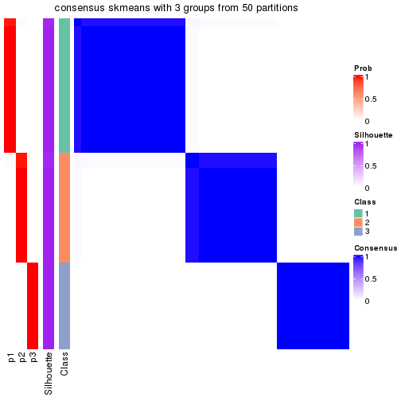</p>

</div>
<div id='tab-node-013-consensus-heatmap-3'>
<pre><code class="r">consensus_heatmap(res, k = 4)
</code></pre>

<p></p>

</div>
<div id='tab-node-013-consensus-heatmap-4'>
<pre><code class="r">consensus_heatmap(res, k = 5)
</code></pre>

<p></p>

</div>
<div id='tab-node-013-consensus-heatmap-5'>
<pre><code class="r">consensus_heatmap(res, k = 6)
</code></pre>

<p></p>

</div>
<div id='tab-node-013-consensus-heatmap-6'>
<pre><code class="r">consensus_heatmap(res, k = 7)
</code></pre>

<p></p>

</div>
<div id='tab-node-013-consensus-heatmap-7'>
<pre><code class="r">consensus_heatmap(res, k = 8)
</code></pre>

<p></p>

</div>
</div>

Heatmaps for the membership of samples in all partitions to see how consistent they are:


<script>
$( function() {
	$( '#tabs-node-013-membership-heatmap' ).tabs();
} );
</script>
<div id='tabs-node-013-membership-heatmap'>
<ul>
<li><a href='#tab-node-013-membership-heatmap-1'>k = 2</a></li>
<li><a href='#tab-node-013-membership-heatmap-2'>k = 3</a></li>
<li><a href='#tab-node-013-membership-heatmap-3'>k = 4</a></li>
<li><a href='#tab-node-013-membership-heatmap-4'>k = 5</a></li>
<li><a href='#tab-node-013-membership-heatmap-5'>k = 6</a></li>
<li><a href='#tab-node-013-membership-heatmap-6'>k = 7</a></li>
<li><a href='#tab-node-013-membership-heatmap-7'>k = 8</a></li>
</ul>
<div id='tab-node-013-membership-heatmap-1'>
<pre><code class="r">membership_heatmap(res, k = 2)
</code></pre>

<p></p>

</div>
<div id='tab-node-013-membership-heatmap-2'>
<pre><code class="r">membership_heatmap(res, k = 3)
</code></pre>

<p></p>

</div>
<div id='tab-node-013-membership-heatmap-3'>
<pre><code class="r">membership_heatmap(res, k = 4)
</code></pre>

<p></p>

</div>
<div id='tab-node-013-membership-heatmap-4'>
<pre><code class="r">membership_heatmap(res, k = 5)
</code></pre>

<p></p>

</div>
<div id='tab-node-013-membership-heatmap-5'>
<pre><code class="r">membership_heatmap(res, k = 6)
</code></pre>

<p>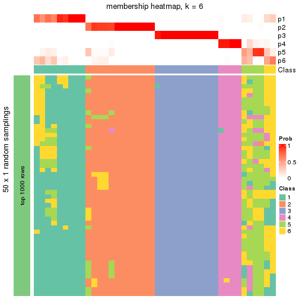</p>

</div>
<div id='tab-node-013-membership-heatmap-6'>
<pre><code class="r">membership_heatmap(res, k = 7)
</code></pre>

<p></p>

</div>
<div id='tab-node-013-membership-heatmap-7'>
<pre><code class="r">membership_heatmap(res, k = 8)
</code></pre>

<p></p>

</div>
</div>

As soon as the classes for columns are determined, the signatures
that are significantly different between subgroups can be looked for. 
Following are the heatmaps for signatures.


<script>
$( function() {
	$( '#tabs-node-013-get-signatures' ).tabs();
} );
</script>
<div id='tabs-node-013-get-signatures'>
<ul>
<li><a href='#tab-node-013-get-signatures-1'>k = 2</a></li>
<li><a href='#tab-node-013-get-signatures-2'>k = 3</a></li>
<li><a href='#tab-node-013-get-signatures-3'>k = 4</a></li>
<li><a href='#tab-node-013-get-signatures-4'>k = 5</a></li>
<li><a href='#tab-node-013-get-signatures-5'>k = 6</a></li>
<li><a href='#tab-node-013-get-signatures-6'>k = 7</a></li>
<li><a href='#tab-node-013-get-signatures-7'>k = 8</a></li>
</ul>
<div id='tab-node-013-get-signatures-1'>
<pre><code class="r">get_signatures(res, k = 2)
</code></pre>

<p></p>

</div>
<div id='tab-node-013-get-signatures-2'>
<pre><code class="r">get_signatures(res, k = 3)
</code></pre>

<p></p>

</div>
<div id='tab-node-013-get-signatures-3'>
<pre><code class="r">get_signatures(res, k = 4)
</code></pre>

<p></p>

</div>
<div id='tab-node-013-get-signatures-4'>
<pre><code class="r">get_signatures(res, k = 5)
</code></pre>

<p></p>

</div>
<div id='tab-node-013-get-signatures-5'>
<pre><code class="r">get_signatures(res, k = 6)
</code></pre>

<p></p>

</div>
<div id='tab-node-013-get-signatures-6'>
<pre><code class="r">get_signatures(res, k = 7)
</code></pre>

<p></p>

</div>
<div id='tab-node-013-get-signatures-7'>
<pre><code class="r">get_signatures(res, k = 8)
</code></pre>

<p></p>

</div>
</div>


Compare the overlap of signatures from different k:

```r
compare_signatures(res)
```


`get_signature()` returns a data frame invisibly. To get the list of signatures, the function
call should be assigned to a variable explicitly. In following code, if `plot` argument is set
to `FALSE`, no heatmap is plotted while only the differential analysis is performed.

```r
# code only for demonstration
tb = get_signature(res, k = ..., plot = FALSE)
```

An example of the output of `tb` is:

```
#>   which_row         fdr    mean_1    mean_2 scaled_mean_1 scaled_mean_2 km
#> 1        38 0.042760348  8.373488  9.131774    -0.5533452     0.5164555  1
#> 2        40 0.018707592  7.106213  8.469186    -0.6173731     0.5762149  1
#> 3        55 0.019134737 10.221463 11.207825    -0.6159697     0.5749050  1
#> 4        59 0.006059896  5.921854  7.869574    -0.6899429     0.6439467  1
#> 5        60 0.018055526  8.928898 10.211722    -0.6204761     0.5791110  1
#> 6        98 0.009384629 15.714769 14.887706     0.6635654    -0.6193277  2
...
```

The columns in `tb` are:

1. `which_row`: row indices corresponding to the input matrix.
2. `fdr`: FDR for the differential test. 
3. `mean_x`: The mean value in group x.
4. `scaled_mean_x`: The mean value in group x after rows are scaled.
5. `km`: Row groups if k-means clustering is applied to rows (which is done by automatically selecting number of clusters).

If there are too many signatures, `top_signatures = ...` can be set to only show the 
signatures with the highest FDRs:

```r
# code only for demonstration
# e.g. to show the top 500 most significant rows
tb = get_signature(res, k = ..., top_signatures = 500)
```

If the signatures are defined as these which are uniquely high in current group, `diff_method` argument
can be set to `"uniquely_high_in_one_group"`:

```r
# code only for demonstration
tb = get_signature(res, k = ..., diff_method = "uniquely_high_in_one_group")
```


UMAP plot which shows how samples are separated.


<script>
$( function() {
	$( '#tabs-node-013-dimension-reduction' ).tabs();
} );
</script>
<div id='tabs-node-013-dimension-reduction'>
<ul>
<li><a href='#tab-node-013-dimension-reduction-1'>k = 2</a></li>
<li><a href='#tab-node-013-dimension-reduction-2'>k = 3</a></li>
<li><a href='#tab-node-013-dimension-reduction-3'>k = 4</a></li>
<li><a href='#tab-node-013-dimension-reduction-4'>k = 5</a></li>
<li><a href='#tab-node-013-dimension-reduction-5'>k = 6</a></li>
<li><a href='#tab-node-013-dimension-reduction-6'>k = 7</a></li>
<li><a href='#tab-node-013-dimension-reduction-7'>k = 8</a></li>
</ul>
<div id='tab-node-013-dimension-reduction-1'>
<pre><code class="r">dimension_reduction(res, k = 2, method = &quot;UMAP&quot;)
</code></pre>

<p></p>

</div>
<div id='tab-node-013-dimension-reduction-2'>
<pre><code class="r">dimension_reduction(res, k = 3, method = &quot;UMAP&quot;)
</code></pre>

<p></p>

</div>
<div id='tab-node-013-dimension-reduction-3'>
<pre><code class="r">dimension_reduction(res, k = 4, method = &quot;UMAP&quot;)
</code></pre>

<p></p>

</div>
<div id='tab-node-013-dimension-reduction-4'>
<pre><code class="r">dimension_reduction(res, k = 5, method = &quot;UMAP&quot;)
</code></pre>

<p></p>

</div>
<div id='tab-node-013-dimension-reduction-5'>
<pre><code class="r">dimension_reduction(res, k = 6, method = &quot;UMAP&quot;)
</code></pre>

<p></p>

</div>
<div id='tab-node-013-dimension-reduction-6'>
<pre><code class="r">dimension_reduction(res, k = 7, method = &quot;UMAP&quot;)
</code></pre>

<p></p>

</div>
<div id='tab-node-013-dimension-reduction-7'>
<pre><code class="r">dimension_reduction(res, k = 8, method = &quot;UMAP&quot;)
</code></pre>

<p></p>

</div>
</div>


Following heatmap shows how subgroups are split when increasing `k`:

```r
collect_classes(res)
```


If matrix rows can be associated to genes, consider to use `functional_enrichment(res,
...)` to perform function enrichment for the signature genes. See [this vignette](https://jokergoo.github.io/cola_vignettes/functional_enrichment.html) for more detailed explanations.


 

---------------------------------------------------


### Node0132


Parent node: [Node013](#Node013).
Child nodes: 
                Node01111-leaf
        ,
                Node01112-leaf
        ,
                Node01121-leaf
        ,
                Node01122-leaf
        ,
                Node01123-leaf
        ,
                Node01124-leaf
        ,
                Node01211-leaf
        ,
                Node01212-leaf
        ,
                Node01213-leaf
        ,
                Node01321-leaf
        ,
                Node01322-leaf
        ,
                Node01323-leaf
        ,
                Node01324-leaf
        ,
                Node02131-leaf
        ,
                Node02132-leaf
        ,
                Node02211-leaf
        ,
                Node02212-leaf
        ,
                Node02221-leaf
        ,
                [Node02222](#Node02222)
        ,
                Node02223-leaf
        ,
                Node02311-leaf
        ,
                Node02312-leaf
        ,
                Node03311-leaf
        ,
                Node03312-leaf
        ,
                Node03313-leaf
        ,
                Node03321-leaf
        ,
                Node03322-leaf
        ,
                Node03323-leaf
        .


The object with results only for a single top-value method and a single partitioning method 
can be extracted as:

```r
res = res_rh["0132"]
```

A summary of `res` and all the functions that can be applied to it:

```r
res
```

```
#> A 'ConsensusPartition' object with k = 2, 3, 4, 5, 6, 7, 8.
#>   On a matrix with 30000 rows and 12 columns.
#>   Top rows (1000) are extracted by 'ATC' method.
#>   Subgroups are detected by 'kmeans' method.
#>   Performed in total 350 partitions by row resampling.
#>   Best k for subgroups seems to be 3.
#> 
#> Following methods can be applied to this 'ConsensusPartition' object:
#>  [1] "cola_report"             "collect_classes"         "collect_plots"          
#>  [4] "collect_stats"           "colnames"                "compare_partitions"     
#>  [7] "compare_signatures"      "consensus_heatmap"       "dimension_reduction"    
#> [10] "functional_enrichment"   "get_anno_col"            "get_anno"               
#> [13] "get_classes"             "get_consensus"           "get_matrix"             
#> [16] "get_membership"          "get_param"               "get_signatures"         
#> [19] "get_stats"               "is_best_k"               "is_stable_k"            
#> [22] "membership_heatmap"      "ncol"                    "nrow"                   
#> [25] "plot_ecdf"               "predict_classes"         "rownames"               
#> [28] "select_partition_number" "show"                    "suggest_best_k"         
#> [31] "test_to_known_factors"   "top_rows_heatmap"
```

`collect_plots()` function collects all the plots made from `res` for all `k` (number of subgroups)
into one single page to provide an easy and fast comparison between different `k`.

```r
collect_plots(res)
```


The plots are:

- The first row: a plot of the eCDF (empirical cumulative distribution
  function) curves of the consensus matrix for each `k` and the heatmap of
  predicted classes for each `k`.
- The second row: heatmaps of the consensus matrix for each `k`.
- The third row: heatmaps of the membership matrix for each `k`.
- The fouth row: heatmaps of the signatures for each `k`.

All the plots in panels can be made by individual functions and they are
plotted later in this section.

`select_partition_number()` produces several plots showing different
statistics for choosing "optimized" `k`. There are following statistics:

- eCDF curves of the consensus matrix for each `k`;
- 1-PAC. [The PAC score](https://en.wikipedia.org/wiki/Consensus_clustering#Over-interpretation_potential_of_consensus_clustering)
  measures the proportion of the ambiguous subgrouping.
- Mean silhouette score.
- Concordance. The mean probability of fiting the consensus subgroup labels in all
  partitions.
- Area increased. Denote $A_k$ as the area under the eCDF curve for current
  `k`, the area increased is defined as $A_k - A_{k-1}$.
- Rand index. The percent of pairs of samples that are both in a same cluster
  or both are not in a same cluster in the partition of k and k-1.
- Jaccard index. The ratio of pairs of samples are both in a same cluster in
  the partition of k and k-1 and the pairs of samples are both in a same
  cluster in the partition k or k-1.

The detailed explanations of these statistics can be found in [the _cola_
vignette](https://jokergoo.github.io/cola_vignettes/cola.html#toc_13).

Generally speaking, higher 1-PAC score, higher mean silhouette score or higher
concordance corresponds to better partition. Rand index and Jaccard index
measure how similar the current partition is compared to partition with `k-1`.
If they are too similar, we won't accept `k` is better than `k-1`.

```r
select_partition_number(res)
```


The numeric values for all these statistics can be obtained by `get_stats()`.

```r
get_stats(res)
```

```
#>   k 1-PAC mean_silhouette concordance area_increased  Rand Jaccard
#> 2 2 0.591           0.838       0.920         0.3763 0.697   0.697
#> 3 3 1.000           1.000       1.000         0.7725 0.636   0.478
#> 4 4 0.788           0.962       0.967         0.1907 0.803   0.458
#> 5 5 0.879           0.829       0.885         0.0503 1.000   1.000
#> 6 6 0.864           0.560       0.873         0.0449 0.924   0.615
#> 7 7 0.864           0.618       0.870         0.0344 0.970   0.750
#> 8 8 0.833           0.403       0.828         0.0235 0.985   0.833
```

`suggest_best_k()` suggests the best $k$ based on these statistics. The rules are as follows:

- All $k$ with Jaccard index larger than 0.95 are removed because increasing
  $k$ does not provide enough extra information. If all $k$ are removed, it is
  marked as no subgroup is detected.
- For all $k$ with 1-PAC score larger than 0.9, the maximal $k$ is taken as
  the best $k$, and other $k$ are marked as optional $k$.
- If it does not fit the second rule. The $k$ with the maximal vote of the
  highest 1-PAC score, highest mean silhouette, and highest concordance is
  taken as the best $k$.

```r
suggest_best_k(res)
```

```
#> [1] 3
```


Following is the table of the partitions (You need to click the **show/hide
code output** link to see it). The membership matrix (columns with name `p*`)
is inferred by
[`clue::cl_consensus()`](https://www.rdocumentation.org/link/cl_consensus?package=clue)
function with the `SE` method. Basically the value in the membership matrix
represents the probability to belong to a certain group. The finall subgroup
label for an item is determined with the group with highest probability it
belongs to.

In `get_classes()` function, the entropy is calculated from the membership
matrix and the silhouette score is calculated from the consensus matrix.


<script>
$( function() {
	$( '#tabs-node-0132-get-classes' ).tabs();
} );
</script>
<div id='tabs-node-0132-get-classes'>
<ul>
<li><a href='#tab-node-0132-get-classes-1'>k = 2</a></li>
<li><a href='#tab-node-0132-get-classes-2'>k = 3</a></li>
<li><a href='#tab-node-0132-get-classes-3'>k = 4</a></li>
<li><a href='#tab-node-0132-get-classes-4'>k = 5</a></li>
<li><a href='#tab-node-0132-get-classes-5'>k = 6</a></li>
<li><a href='#tab-node-0132-get-classes-6'>k = 7</a></li>
<li><a href='#tab-node-0132-get-classes-7'>k = 8</a></li>
</ul>

<div id='tab-node-0132-get-classes-1'>
<p><a id='tab-node-0132-get-classes-1-a' style='color:#0366d6' href='#'>show/hide code output</a></p>
<pre><code class="r">cbind(get_classes(res, k = 2), get_membership(res, k = 2))
</code></pre>

<pre><code>#&gt;                 class entropy silhouette   p1   p2
#&gt; TCGA.XF.A8HG.01     2   0.000      0.879 0.00 1.00
#&gt; TCGA.G2.AA3B.01     2   0.000      0.879 0.00 1.00
#&gt; TCGA.CF.A8HX.01     2   0.000      0.879 0.00 1.00
#&gt; TCGA.BL.A0C8.01     2   0.904      0.634 0.32 0.68
#&gt; TCGA.KQ.A41Q.01     2   0.904      0.634 0.32 0.68
#&gt; TCGA.LT.A8JT.01     2   0.000      0.879 0.00 1.00
#&gt; TCGA.5N.A9KM.01     2   0.000      0.879 0.00 1.00
#&gt; TCGA.DK.A6B1.01     1   0.000      1.000 1.00 0.00
#&gt; TCGA.5N.A9KI.01     2   0.904      0.634 0.32 0.68
#&gt; TCGA.E7.A8O8.01     2   0.000      0.879 0.00 1.00
#&gt; TCGA.2F.A9KP.01     2   0.000      0.879 0.00 1.00
#&gt; TCGA.CU.A3QU.01     1   0.000      1.000 1.00 0.00
</code></pre>

<script>
$('#tab-node-0132-get-classes-1-a').parent().next().next().hide();
$('#tab-node-0132-get-classes-1-a').click(function(){
  $('#tab-node-0132-get-classes-1-a').parent().next().next().toggle();
  return(false);
});
</script>
</div>

<div id='tab-node-0132-get-classes-2'>
<p><a id='tab-node-0132-get-classes-2-a' style='color:#0366d6' href='#'>show/hide code output</a></p>
<pre><code class="r">cbind(get_classes(res, k = 3), get_membership(res, k = 3))
</code></pre>

<pre><code>#&gt;                 class entropy silhouette p1 p2 p3
#&gt; TCGA.XF.A8HG.01     2       0          1  0  1  0
#&gt; TCGA.G2.AA3B.01     3       0          1  0  0  1
#&gt; TCGA.CF.A8HX.01     2       0          1  0  1  0
#&gt; TCGA.BL.A0C8.01     3       0          1  0  0  1
#&gt; TCGA.KQ.A41Q.01     3       0          1  0  0  1
#&gt; TCGA.LT.A8JT.01     2       0          1  0  1  0
#&gt; TCGA.5N.A9KM.01     2       0          1  0  1  0
#&gt; TCGA.DK.A6B1.01     1       0          1  1  0  0
#&gt; TCGA.5N.A9KI.01     3       0          1  0  0  1
#&gt; TCGA.E7.A8O8.01     2       0          1  0  1  0
#&gt; TCGA.2F.A9KP.01     2       0          1  0  1  0
#&gt; TCGA.CU.A3QU.01     1       0          1  1  0  0
</code></pre>

<script>
$('#tab-node-0132-get-classes-2-a').parent().next().next().hide();
$('#tab-node-0132-get-classes-2-a').click(function(){
  $('#tab-node-0132-get-classes-2-a').parent().next().next().toggle();
  return(false);
});
</script>
</div>

<div id='tab-node-0132-get-classes-3'>
<p><a id='tab-node-0132-get-classes-3-a' style='color:#0366d6' href='#'>show/hide code output</a></p>
<pre><code class="r">cbind(get_classes(res, k = 4), get_membership(res, k = 4))
</code></pre>

<pre><code>#&gt;                 class entropy silhouette p1  p2  p3  p4
#&gt; TCGA.XF.A8HG.01     2   0.000      1.000  0 1.0 0.0 0.0
#&gt; TCGA.G2.AA3B.01     4   0.234      0.861  0 0.0 0.1 0.9
#&gt; TCGA.CF.A8HX.01     2   0.000      1.000  0 1.0 0.0 0.0
#&gt; TCGA.BL.A0C8.01     3   0.000      0.954  0 0.0 1.0 0.0
#&gt; TCGA.KQ.A41Q.01     3   0.000      0.954  0 0.0 1.0 0.0
#&gt; TCGA.LT.A8JT.01     2   0.000      1.000  0 1.0 0.0 0.0
#&gt; TCGA.5N.A9KM.01     4   0.234      0.932  0 0.1 0.0 0.9
#&gt; TCGA.DK.A6B1.01     1   0.000      1.000  1 0.0 0.0 0.0
#&gt; TCGA.5N.A9KI.01     3   0.234      0.907  0 0.0 0.9 0.1
#&gt; TCGA.E7.A8O8.01     2   0.000      1.000  0 1.0 0.0 0.0
#&gt; TCGA.2F.A9KP.01     4   0.234      0.932  0 0.1 0.0 0.9
#&gt; TCGA.CU.A3QU.01     1   0.000      1.000  1 0.0 0.0 0.0
</code></pre>

<script>
$('#tab-node-0132-get-classes-3-a').parent().next().next().hide();
$('#tab-node-0132-get-classes-3-a').click(function(){
  $('#tab-node-0132-get-classes-3-a').parent().next().next().toggle();
  return(false);
});
</script>
</div>

<div id='tab-node-0132-get-classes-4'>
<p><a id='tab-node-0132-get-classes-4-a' style='color:#0366d6' href='#'>show/hide code output</a></p>
<pre><code class="r">cbind(get_classes(res, k = 5), get_membership(res, k = 5))
</code></pre>

<pre><code>#&gt;                 class entropy silhouette   p1   p2   p3   p4   p5
#&gt; TCGA.XF.A8HG.01     2   0.389      0.785 0.32 0.68 0.00 0.00 0.00
#&gt; TCGA.G2.AA3B.01     4   0.104      0.943 0.00 0.00 0.04 0.96 0.00
#&gt; TCGA.CF.A8HX.01     2   0.000      0.844 0.00 1.00 0.00 0.00 0.00
#&gt; TCGA.BL.A0C8.01     3   0.000      0.796 0.00 0.00 1.00 0.00 0.00
#&gt; TCGA.KQ.A41Q.01     3   0.000      0.796 0.00 0.00 1.00 0.00 0.00
#&gt; TCGA.LT.A8JT.01     2   0.327      0.832 0.22 0.78 0.00 0.00 0.00
#&gt; TCGA.5N.A9KM.01     4   0.104      0.972 0.00 0.04 0.00 0.96 0.00
#&gt; TCGA.DK.A6B1.01     5   0.425      0.806 0.22 0.00 0.00 0.04 0.74
#&gt; TCGA.5N.A9KI.01     3   0.429      0.549 0.46 0.00 0.54 0.00 0.00
#&gt; TCGA.E7.A8O8.01     2   0.000      0.844 0.00 1.00 0.00 0.00 0.00
#&gt; TCGA.2F.A9KP.01     4   0.104      0.972 0.00 0.04 0.00 0.96 0.00
#&gt; TCGA.CU.A3QU.01     5   0.000      0.806 0.00 0.00 0.00 0.00 1.00
</code></pre>

<script>
$('#tab-node-0132-get-classes-4-a').parent().next().next().hide();
$('#tab-node-0132-get-classes-4-a').click(function(){
  $('#tab-node-0132-get-classes-4-a').parent().next().next().toggle();
  return(false);
});
</script>
</div>

<div id='tab-node-0132-get-classes-5'>
<p><a id='tab-node-0132-get-classes-5-a' style='color:#0366d6' href='#'>show/hide code output</a></p>
<pre><code class="r">cbind(get_classes(res, k = 6), get_membership(res, k = 6))
</code></pre>

<pre><code>#&gt;                 class entropy silhouette   p1   p2   p3   p4   p5   p6
#&gt; TCGA.XF.A8HG.01     1  0.5575      0.000 0.46 0.40 0.00 0.00 0.00 0.14
#&gt; TCGA.G2.AA3B.01     4  0.0547      0.980 0.00 0.00 0.02 0.98 0.00 0.00
#&gt; TCGA.CF.A8HX.01     2  0.0000      0.577 0.00 1.00 0.00 0.00 0.00 0.00
#&gt; TCGA.BL.A0C8.01     3  0.2793      0.784 0.20 0.00 0.80 0.00 0.00 0.00
#&gt; TCGA.KQ.A41Q.01     3  0.0000      0.784 0.00 0.00 1.00 0.00 0.00 0.00
#&gt; TCGA.LT.A8JT.01     2  0.3864     -0.549 0.48 0.52 0.00 0.00 0.00 0.00
#&gt; TCGA.5N.A9KM.01     4  0.0000      0.990 0.00 0.00 0.00 1.00 0.00 0.00
#&gt; TCGA.DK.A6B1.01     5  0.3679      0.791 0.20 0.00 0.00 0.00 0.76 0.04
#&gt; TCGA.5N.A9KI.01     6  0.2631      0.000 0.00 0.00 0.18 0.00 0.00 0.82
#&gt; TCGA.E7.A8O8.01     2  0.0000      0.577 0.00 1.00 0.00 0.00 0.00 0.00
#&gt; TCGA.2F.A9KP.01     4  0.0000      0.990 0.00 0.00 0.00 1.00 0.00 0.00
#&gt; TCGA.CU.A3QU.01     5  0.0000      0.791 0.00 0.00 0.00 0.00 1.00 0.00
</code></pre>

<script>
$('#tab-node-0132-get-classes-5-a').parent().next().next().hide();
$('#tab-node-0132-get-classes-5-a').click(function(){
  $('#tab-node-0132-get-classes-5-a').parent().next().next().toggle();
  return(false);
});
</script>
</div>

<div id='tab-node-0132-get-classes-6'>
<p><a id='tab-node-0132-get-classes-6-a' style='color:#0366d6' href='#'>show/hide code output</a></p>
<pre><code class="r">cbind(get_classes(res, k = 7), get_membership(res, k = 7))
</code></pre>

<pre><code>#&gt;                 class entropy silhouette   p1   p2   p3   p4   p5   p6   p7
#&gt; TCGA.XF.A8HG.01     1   0.341      0.000 0.62 0.00 0.00 0.00 0.00 0.00 0.38
#&gt; TCGA.G2.AA3B.01     4   0.208      0.863 0.14 0.00 0.00 0.86 0.00 0.00 0.00
#&gt; TCGA.CF.A8HX.01     2   0.384      0.955 0.00 0.68 0.00 0.00 0.00 0.04 0.28
#&gt; TCGA.BL.A0C8.01     3   0.000      0.614 0.00 0.00 1.00 0.00 0.00 0.00 0.00
#&gt; TCGA.KQ.A41Q.01     3   0.463      0.615 0.26 0.12 0.62 0.00 0.00 0.00 0.00
#&gt; TCGA.LT.A8JT.01     7   0.000      0.000 0.00 0.00 0.00 0.00 0.00 0.00 1.00
#&gt; TCGA.5N.A9KM.01     4   0.000      0.934 0.00 0.00 0.00 1.00 0.00 0.00 0.00
#&gt; TCGA.DK.A6B1.01     5   0.418      0.770 0.06 0.16 0.00 0.00 0.74 0.04 0.00
#&gt; TCGA.5N.A9KI.01     6   0.143      0.000 0.00 0.00 0.08 0.00 0.00 0.92 0.00
#&gt; TCGA.E7.A8O8.01     2   0.305      0.955 0.00 0.72 0.00 0.00 0.00 0.00 0.28
#&gt; TCGA.2F.A9KP.01     4   0.000      0.934 0.00 0.00 0.00 1.00 0.00 0.00 0.00
#&gt; TCGA.CU.A3QU.01     5   0.000      0.770 0.00 0.00 0.00 0.00 1.00 0.00 0.00
</code></pre>

<script>
$('#tab-node-0132-get-classes-6-a').parent().next().next().hide();
$('#tab-node-0132-get-classes-6-a').click(function(){
  $('#tab-node-0132-get-classes-6-a').parent().next().next().toggle();
  return(false);
});
</script>
</div>

<div id='tab-node-0132-get-classes-7'>
<p><a id='tab-node-0132-get-classes-7-a' style='color:#0366d6' href='#'>show/hide code output</a></p>
<pre><code class="r">cbind(get_classes(res, k = 8), get_membership(res, k = 8))
</code></pre>

<pre><code>#&gt;                 class entropy silhouette   p1   p2   p3   p4   p5   p6   p7   p8
#&gt; TCGA.XF.A8HG.01     1  0.3329      0.000 0.52 0.00 0.00 0.00 0.00 0.00 0.48 0.00
#&gt; TCGA.G2.AA3B.01     4  0.4759      0.407 0.36 0.00 0.00 0.50 0.00 0.00 0.00 0.14
#&gt; TCGA.CF.A8HX.01     2  0.2650      0.888 0.00 0.76 0.00 0.00 0.00 0.00 0.24 0.00
#&gt; TCGA.BL.A0C8.01     3  0.0000      0.000 0.00 0.00 1.00 0.00 0.00 0.00 0.00 0.00
#&gt; TCGA.KQ.A41Q.01     8  0.2534      0.000 0.00 0.00 0.22 0.00 0.00 0.00 0.00 0.78
#&gt; TCGA.LT.A8JT.01     7  0.0471      0.000 0.00 0.02 0.00 0.00 0.00 0.00 0.98 0.00
#&gt; TCGA.5N.A9KM.01     4  0.1091      0.734 0.00 0.06 0.00 0.94 0.00 0.00 0.00 0.00
#&gt; TCGA.DK.A6B1.01     5  0.5593      0.591 0.12 0.18 0.00 0.00 0.56 0.00 0.00 0.14
#&gt; TCGA.5N.A9KI.01     6  0.0471      0.000 0.00 0.00 0.02 0.00 0.00 0.98 0.00 0.00
#&gt; TCGA.E7.A8O8.01     2  0.4314      0.888 0.00 0.66 0.00 0.00 0.00 0.02 0.24 0.08
#&gt; TCGA.2F.A9KP.01     4  0.0000      0.734 0.00 0.00 0.00 1.00 0.00 0.00 0.00 0.00
#&gt; TCGA.CU.A3QU.01     5  0.0000      0.591 0.00 0.00 0.00 0.00 1.00 0.00 0.00 0.00
</code></pre>

<script>
$('#tab-node-0132-get-classes-7-a').parent().next().next().hide();
$('#tab-node-0132-get-classes-7-a').click(function(){
  $('#tab-node-0132-get-classes-7-a').parent().next().next().toggle();
  return(false);
});
</script>
</div>
</div>

Heatmaps for the consensus matrix. It visualizes the probability of two
samples to be in a same group.


<script>
$( function() {
	$( '#tabs-node-0132-consensus-heatmap' ).tabs();
} );
</script>
<div id='tabs-node-0132-consensus-heatmap'>
<ul>
<li><a href='#tab-node-0132-consensus-heatmap-1'>k = 2</a></li>
<li><a href='#tab-node-0132-consensus-heatmap-2'>k = 3</a></li>
<li><a href='#tab-node-0132-consensus-heatmap-3'>k = 4</a></li>
<li><a href='#tab-node-0132-consensus-heatmap-4'>k = 5</a></li>
<li><a href='#tab-node-0132-consensus-heatmap-5'>k = 6</a></li>
<li><a href='#tab-node-0132-consensus-heatmap-6'>k = 7</a></li>
<li><a href='#tab-node-0132-consensus-heatmap-7'>k = 8</a></li>
</ul>
<div id='tab-node-0132-consensus-heatmap-1'>
<pre><code class="r">consensus_heatmap(res, k = 2)
</code></pre>

<p></p>

</div>
<div id='tab-node-0132-consensus-heatmap-2'>
<pre><code class="r">consensus_heatmap(res, k = 3)
</code></pre>

<p></p>

</div>
<div id='tab-node-0132-consensus-heatmap-3'>
<pre><code class="r">consensus_heatmap(res, k = 4)
</code></pre>

<p></p>

</div>
<div id='tab-node-0132-consensus-heatmap-4'>
<pre><code class="r">consensus_heatmap(res, k = 5)
</code></pre>

<p></p>

</div>
<div id='tab-node-0132-consensus-heatmap-5'>
<pre><code class="r">consensus_heatmap(res, k = 6)
</code></pre>

<p></p>

</div>
<div id='tab-node-0132-consensus-heatmap-6'>
<pre><code class="r">consensus_heatmap(res, k = 7)
</code></pre>

<p></p>

</div>
<div id='tab-node-0132-consensus-heatmap-7'>
<pre><code class="r">consensus_heatmap(res, k = 8)
</code></pre>

<p></p>

</div>
</div>

Heatmaps for the membership of samples in all partitions to see how consistent they are:


<script>
$( function() {
	$( '#tabs-node-0132-membership-heatmap' ).tabs();
} );
</script>
<div id='tabs-node-0132-membership-heatmap'>
<ul>
<li><a href='#tab-node-0132-membership-heatmap-1'>k = 2</a></li>
<li><a href='#tab-node-0132-membership-heatmap-2'>k = 3</a></li>
<li><a href='#tab-node-0132-membership-heatmap-3'>k = 4</a></li>
<li><a href='#tab-node-0132-membership-heatmap-4'>k = 5</a></li>
<li><a href='#tab-node-0132-membership-heatmap-5'>k = 6</a></li>
<li><a href='#tab-node-0132-membership-heatmap-6'>k = 7</a></li>
<li><a href='#tab-node-0132-membership-heatmap-7'>k = 8</a></li>
</ul>
<div id='tab-node-0132-membership-heatmap-1'>
<pre><code class="r">membership_heatmap(res, k = 2)
</code></pre>

<p></p>

</div>
<div id='tab-node-0132-membership-heatmap-2'>
<pre><code class="r">membership_heatmap(res, k = 3)
</code></pre>

<p></p>

</div>
<div id='tab-node-0132-membership-heatmap-3'>
<pre><code class="r">membership_heatmap(res, k = 4)
</code></pre>

<p></p>

</div>
<div id='tab-node-0132-membership-heatmap-4'>
<pre><code class="r">membership_heatmap(res, k = 5)
</code></pre>

<p></p>

</div>
<div id='tab-node-0132-membership-heatmap-5'>
<pre><code class="r">membership_heatmap(res, k = 6)
</code></pre>

<p></p>

</div>
<div id='tab-node-0132-membership-heatmap-6'>
<pre><code class="r">membership_heatmap(res, k = 7)
</code></pre>

<p></p>

</div>
<div id='tab-node-0132-membership-heatmap-7'>
<pre><code class="r">membership_heatmap(res, k = 8)
</code></pre>

<p></p>

</div>
</div>

As soon as the classes for columns are determined, the signatures
that are significantly different between subgroups can be looked for. 
Following are the heatmaps for signatures.


<script>
$( function() {
	$( '#tabs-node-0132-get-signatures' ).tabs();
} );
</script>
<div id='tabs-node-0132-get-signatures'>
<ul>
<li><a href='#tab-node-0132-get-signatures-1'>k = 2</a></li>
<li><a href='#tab-node-0132-get-signatures-2'>k = 3</a></li>
<li><a href='#tab-node-0132-get-signatures-3'>k = 4</a></li>
<li><a href='#tab-node-0132-get-signatures-4'>k = 5</a></li>
<li><a href='#tab-node-0132-get-signatures-5'>k = 6</a></li>
<li><a href='#tab-node-0132-get-signatures-6'>k = 7</a></li>
<li><a href='#tab-node-0132-get-signatures-7'>k = 8</a></li>
</ul>
<div id='tab-node-0132-get-signatures-1'>
<pre><code class="r">get_signatures(res, k = 2)
</code></pre>

<p></p>

</div>
<div id='tab-node-0132-get-signatures-2'>
<pre><code class="r">get_signatures(res, k = 3)
</code></pre>

<p></p>

</div>
<div id='tab-node-0132-get-signatures-3'>
<pre><code class="r">get_signatures(res, k = 4)
</code></pre>

<p></p>

</div>
<div id='tab-node-0132-get-signatures-4'>
<pre><code class="r">get_signatures(res, k = 5)
</code></pre>

<p>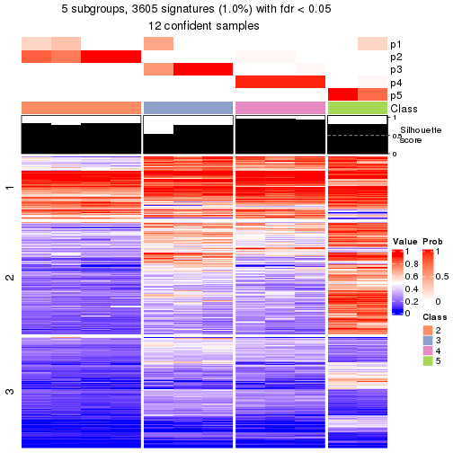</p>

</div>
<div id='tab-node-0132-get-signatures-5'>
<pre><code class="r">get_signatures(res, k = 6)
</code></pre>

<p></p>

</div>
<div id='tab-node-0132-get-signatures-6'>
<pre><code class="r">get_signatures(res, k = 7)
</code></pre>

<p></p>

</div>
<div id='tab-node-0132-get-signatures-7'>
<pre><code class="r">get_signatures(res, k = 8)
</code></pre>

<p></p>

</div>
</div>


Compare the overlap of signatures from different k:

```r
compare_signatures(res)
```


`get_signature()` returns a data frame invisibly. To get the list of signatures, the function
call should be assigned to a variable explicitly. In following code, if `plot` argument is set
to `FALSE`, no heatmap is plotted while only the differential analysis is performed.

```r
# code only for demonstration
tb = get_signature(res, k = ..., plot = FALSE)
```

An example of the output of `tb` is:

```
#>   which_row         fdr    mean_1    mean_2 scaled_mean_1 scaled_mean_2 km
#> 1        38 0.042760348  8.373488  9.131774    -0.5533452     0.5164555  1
#> 2        40 0.018707592  7.106213  8.469186    -0.6173731     0.5762149  1
#> 3        55 0.019134737 10.221463 11.207825    -0.6159697     0.5749050  1
#> 4        59 0.006059896  5.921854  7.869574    -0.6899429     0.6439467  1
#> 5        60 0.018055526  8.928898 10.211722    -0.6204761     0.5791110  1
#> 6        98 0.009384629 15.714769 14.887706     0.6635654    -0.6193277  2
...
```

The columns in `tb` are:

1. `which_row`: row indices corresponding to the input matrix.
2. `fdr`: FDR for the differential test. 
3. `mean_x`: The mean value in group x.
4. `scaled_mean_x`: The mean value in group x after rows are scaled.
5. `km`: Row groups if k-means clustering is applied to rows (which is done by automatically selecting number of clusters).

If there are too many signatures, `top_signatures = ...` can be set to only show the 
signatures with the highest FDRs:

```r
# code only for demonstration
# e.g. to show the top 500 most significant rows
tb = get_signature(res, k = ..., top_signatures = 500)
```

If the signatures are defined as these which are uniquely high in current group, `diff_method` argument
can be set to `"uniquely_high_in_one_group"`:

```r
# code only for demonstration
tb = get_signature(res, k = ..., diff_method = "uniquely_high_in_one_group")
```


UMAP plot which shows how samples are separated.


<script>
$( function() {
	$( '#tabs-node-0132-dimension-reduction' ).tabs();
} );
</script>
<div id='tabs-node-0132-dimension-reduction'>
<ul>
<li><a href='#tab-node-0132-dimension-reduction-1'>k = 2</a></li>
<li><a href='#tab-node-0132-dimension-reduction-2'>k = 3</a></li>
<li><a href='#tab-node-0132-dimension-reduction-3'>k = 4</a></li>
<li><a href='#tab-node-0132-dimension-reduction-4'>k = 5</a></li>
<li><a href='#tab-node-0132-dimension-reduction-5'>k = 6</a></li>
<li><a href='#tab-node-0132-dimension-reduction-6'>k = 7</a></li>
<li><a href='#tab-node-0132-dimension-reduction-7'>k = 8</a></li>
</ul>
<div id='tab-node-0132-dimension-reduction-1'>
<pre><code class="r">dimension_reduction(res, k = 2, method = &quot;UMAP&quot;)
</code></pre>

<p></p>

</div>
<div id='tab-node-0132-dimension-reduction-2'>
<pre><code class="r">dimension_reduction(res, k = 3, method = &quot;UMAP&quot;)
</code></pre>

<p></p>

</div>
<div id='tab-node-0132-dimension-reduction-3'>
<pre><code class="r">dimension_reduction(res, k = 4, method = &quot;UMAP&quot;)
</code></pre>

<p></p>

</div>
<div id='tab-node-0132-dimension-reduction-4'>
<pre><code class="r">dimension_reduction(res, k = 5, method = &quot;UMAP&quot;)
</code></pre>

<p></p>

</div>
<div id='tab-node-0132-dimension-reduction-5'>
<pre><code class="r">dimension_reduction(res, k = 6, method = &quot;UMAP&quot;)
</code></pre>

<p></p>

</div>
<div id='tab-node-0132-dimension-reduction-6'>
<pre><code class="r">dimension_reduction(res, k = 7, method = &quot;UMAP&quot;)
</code></pre>

<p></p>

</div>
<div id='tab-node-0132-dimension-reduction-7'>
<pre><code class="r">dimension_reduction(res, k = 8, method = &quot;UMAP&quot;)
</code></pre>

<p></p>

</div>
</div>


Following heatmap shows how subgroups are split when increasing `k`:

```r
collect_classes(res)
```


If matrix rows can be associated to genes, consider to use `functional_enrichment(res,
...)` to perform function enrichment for the signature genes. See [this vignette](https://jokergoo.github.io/cola_vignettes/functional_enrichment.html) for more detailed explanations.


 

---------------------------------------------------


### Node02


Parent node: [Node0](#Node0).
Child nodes: 
                [Node011](#Node011)
        ,
                [Node012](#Node012)
        ,
                [Node013](#Node013)
        ,
                [Node021](#Node021)
        ,
                [Node022](#Node022)
        ,
                [Node023](#Node023)
        ,
                Node031-leaf
        ,
                [Node032](#Node032)
        ,
                [Node033](#Node033)
        .


The object with results only for a single top-value method and a single partitioning method 
can be extracted as:

```r
res = res_rh["02"]
```

A summary of `res` and all the functions that can be applied to it:

```r
res
```

```
#> A 'ConsensusPartition' object with k = 2, 3, 4, 5, 6, 7, 8.
#>   On a matrix with 30000 rows and 118 columns.
#>   Top rows (1000) are extracted by 'ATC' method.
#>   Subgroups are detected by 'kmeans' method.
#>   Performed in total 350 partitions by row resampling.
#>   Best k for subgroups seems to be 3.
#> 
#> Following methods can be applied to this 'ConsensusPartition' object:
#>  [1] "cola_report"             "collect_classes"         "collect_plots"          
#>  [4] "collect_stats"           "colnames"                "compare_partitions"     
#>  [7] "compare_signatures"      "consensus_heatmap"       "dimension_reduction"    
#> [10] "functional_enrichment"   "get_anno_col"            "get_anno"               
#> [13] "get_classes"             "get_consensus"           "get_matrix"             
#> [16] "get_membership"          "get_param"               "get_signatures"         
#> [19] "get_stats"               "is_best_k"               "is_stable_k"            
#> [22] "membership_heatmap"      "ncol"                    "nrow"                   
#> [25] "plot_ecdf"               "predict_classes"         "rownames"               
#> [28] "select_partition_number" "show"                    "suggest_best_k"         
#> [31] "test_to_known_factors"   "top_rows_heatmap"
```

`collect_plots()` function collects all the plots made from `res` for all `k` (number of subgroups)
into one single page to provide an easy and fast comparison between different `k`.

```r
collect_plots(res)
```


The plots are:

- The first row: a plot of the eCDF (empirical cumulative distribution
  function) curves of the consensus matrix for each `k` and the heatmap of
  predicted classes for each `k`.
- The second row: heatmaps of the consensus matrix for each `k`.
- The third row: heatmaps of the membership matrix for each `k`.
- The fouth row: heatmaps of the signatures for each `k`.

All the plots in panels can be made by individual functions and they are
plotted later in this section.

`select_partition_number()` produces several plots showing different
statistics for choosing "optimized" `k`. There are following statistics:

- eCDF curves of the consensus matrix for each `k`;
- 1-PAC. [The PAC score](https://en.wikipedia.org/wiki/Consensus_clustering#Over-interpretation_potential_of_consensus_clustering)
  measures the proportion of the ambiguous subgrouping.
- Mean silhouette score.
- Concordance. The mean probability of fiting the consensus subgroup labels in all
  partitions.
- Area increased. Denote $A_k$ as the area under the eCDF curve for current
  `k`, the area increased is defined as $A_k - A_{k-1}$.
- Rand index. The percent of pairs of samples that are both in a same cluster
  or both are not in a same cluster in the partition of k and k-1.
- Jaccard index. The ratio of pairs of samples are both in a same cluster in
  the partition of k and k-1 and the pairs of samples are both in a same
  cluster in the partition k or k-1.

The detailed explanations of these statistics can be found in [the _cola_
vignette](https://jokergoo.github.io/cola_vignettes/cola.html#toc_13).

Generally speaking, higher 1-PAC score, higher mean silhouette score or higher
concordance corresponds to better partition. Rand index and Jaccard index
measure how similar the current partition is compared to partition with `k-1`.
If they are too similar, we won't accept `k` is better than `k-1`.

```r
select_partition_number(res)
```


The numeric values for all these statistics can be obtained by `get_stats()`.

```r
get_stats(res)
```

```
#>   k 1-PAC mean_silhouette concordance area_increased  Rand Jaccard
#> 2 2 0.964           0.937       0.973         0.5021 0.499   0.499
#> 3 3 1.000           0.995       0.997         0.2515 0.621   0.394
#> 4 4 0.690           0.809       0.873         0.1392 0.775   0.474
#> 5 5 0.763           0.454       0.784         0.0726 0.906   0.677
#> 6 6 0.767           0.717       0.861         0.0337 0.918   0.684
#> 7 7 0.771           0.664       0.856         0.0158 0.980   0.903
#> 8 8 0.822           0.745       0.872         0.0178 0.949   0.759
```

`suggest_best_k()` suggests the best $k$ based on these statistics. The rules are as follows:

- All $k$ with Jaccard index larger than 0.95 are removed because increasing
  $k$ does not provide enough extra information. If all $k$ are removed, it is
  marked as no subgroup is detected.
- For all $k$ with 1-PAC score larger than 0.9, the maximal $k$ is taken as
  the best $k$, and other $k$ are marked as optional $k$.
- If it does not fit the second rule. The $k$ with the maximal vote of the
  highest 1-PAC score, highest mean silhouette, and highest concordance is
  taken as the best $k$.

```r
suggest_best_k(res)
```

```
#> [1] 3
#> attr(,"optional")
#> [1] 2
```

There is also optional best $k$ = 2 that is worth to check.

Following is the table of the partitions (You need to click the **show/hide
code output** link to see it). The membership matrix (columns with name `p*`)
is inferred by
[`clue::cl_consensus()`](https://www.rdocumentation.org/link/cl_consensus?package=clue)
function with the `SE` method. Basically the value in the membership matrix
represents the probability to belong to a certain group. The finall subgroup
label for an item is determined with the group with highest probability it
belongs to.

In `get_classes()` function, the entropy is calculated from the membership
matrix and the silhouette score is calculated from the consensus matrix.


<script>
$( function() {
	$( '#tabs-node-02-get-classes' ).tabs();
} );
</script>
<div id='tabs-node-02-get-classes'>
<ul>
<li><a href='#tab-node-02-get-classes-1'>k = 2</a></li>
<li><a href='#tab-node-02-get-classes-2'>k = 3</a></li>
<li><a href='#tab-node-02-get-classes-3'>k = 4</a></li>
<li><a href='#tab-node-02-get-classes-4'>k = 5</a></li>
<li><a href='#tab-node-02-get-classes-5'>k = 6</a></li>
<li><a href='#tab-node-02-get-classes-6'>k = 7</a></li>
<li><a href='#tab-node-02-get-classes-7'>k = 8</a></li>
</ul>

<div id='tab-node-02-get-classes-1'>
<p><a id='tab-node-02-get-classes-1-a' style='color:#0366d6' href='#'>show/hide code output</a></p>
<pre><code class="r">cbind(get_classes(res, k = 2), get_membership(res, k = 2))
</code></pre>

<pre><code>#&gt;                 class entropy silhouette   p1   p2
#&gt; TCGA.GD.A3OP.01     2   0.000      1.000 0.00 1.00
#&gt; TCGA.4Z.AA86.01     2   0.000      1.000 0.00 1.00
#&gt; TCGA.BL.A13J.11     1   0.000      0.948 1.00 0.00
#&gt; TCGA.GU.A42Q.01     2   0.000      1.000 0.00 1.00
#&gt; TCGA.FD.A5BU.01     1   0.327      0.902 0.94 0.06
#&gt; TCGA.E7.A6MF.01     1   0.000      0.948 1.00 0.00
#&gt; TCGA.FD.A43P.01     2   0.000      1.000 0.00 1.00
#&gt; TCGA.BT.A20W.11     1   0.000      0.948 1.00 0.00
#&gt; TCGA.UY.A78P.01     1   0.000      0.948 1.00 0.00
#&gt; TCGA.DK.AA6X.01     2   0.000      1.000 0.00 1.00
#&gt; TCGA.K4.A6FZ.01     2   0.000      1.000 0.00 1.00
#&gt; TCGA.GC.A3OO.01     2   0.000      1.000 0.00 1.00
#&gt; TCGA.XF.AAN5.01     2   0.000      1.000 0.00 1.00
#&gt; TCGA.DK.A2I2.01     1   0.981      0.361 0.58 0.42
#&gt; TCGA.CF.A1HS.01     2   0.000      1.000 0.00 1.00
#&gt; TCGA.4Z.AA7W.01     2   0.000      1.000 0.00 1.00
#&gt; TCGA.XF.A9SI.01     1   0.000      0.948 1.00 0.00
#&gt; TCGA.K4.A5RH.01     2   0.000      1.000 0.00 1.00
#&gt; TCGA.XF.A9SM.01     1   0.000      0.948 1.00 0.00
#&gt; TCGA.GC.A3BM.11     1   0.000      0.948 1.00 0.00
#&gt; TCGA.DK.A3IU.01     2   0.000      1.000 0.00 1.00
#&gt; TCGA.E7.A7XN.01     1   0.981      0.361 0.58 0.42
#&gt; TCGA.K4.A5RI.11     1   0.000      0.948 1.00 0.00
#&gt; TCGA.K4.A3WV.11     1   0.000      0.948 1.00 0.00
#&gt; TCGA.FD.A3B3.01     1   0.000      0.948 1.00 0.00
#&gt; TCGA.FD.A6TF.01     2   0.000      1.000 0.00 1.00
#&gt; TCGA.GD.A3OQ.11     1   0.000      0.948 1.00 0.00
#&gt; TCGA.FD.A43Y.01     2   0.000      1.000 0.00 1.00
#&gt; TCGA.GU.A767.01     2   0.000      1.000 0.00 1.00
#&gt; TCGA.CU.A0YN.11     1   0.000      0.948 1.00 0.00
#&gt; TCGA.YC.A8S6.01     1   0.000      0.948 1.00 0.00
#&gt; TCGA.CU.A0YO.01     2   0.000      1.000 0.00 1.00
#&gt; TCGA.XF.A9T5.01     2   0.000      1.000 0.00 1.00
#&gt; TCGA.FD.A62P.01     2   0.000      1.000 0.00 1.00
#&gt; TCGA.DK.AA74.01     1   0.000      0.948 1.00 0.00
#&gt; TCGA.BT.A20U.11     2   0.000      1.000 0.00 1.00
#&gt; TCGA.K4.A83P.01     1   0.000      0.948 1.00 0.00
#&gt; TCGA.XF.AAN8.01     1   0.000      0.948 1.00 0.00
#&gt; TCGA.BT.A42F.01     1   0.958      0.454 0.62 0.38
#&gt; TCGA.FT.A61P.01     2   0.000      1.000 0.00 1.00
#&gt; TCGA.BT.A20J.11     1   0.000      0.948 1.00 0.00
#&gt; TCGA.FD.A5BS.01     1   0.000      0.948 1.00 0.00
#&gt; TCGA.XF.A9SX.01     2   0.000      1.000 0.00 1.00
#&gt; TCGA.DK.A3IQ.01     1   0.981      0.361 0.58 0.42
#&gt; TCGA.FD.A3B8.01     1   0.000      0.948 1.00 0.00
#&gt; TCGA.FD.A3B7.01     1   0.000      0.948 1.00 0.00
#&gt; TCGA.DK.A1AB.01     1   0.000      0.948 1.00 0.00
#&gt; TCGA.K4.A3WU.01     2   0.000      1.000 0.00 1.00
#&gt; TCGA.FD.A62N.01     2   0.000      1.000 0.00 1.00
#&gt; TCGA.UY.A9PB.01     2   0.000      1.000 0.00 1.00
#&gt; TCGA.XF.A9ST.01     2   0.000      1.000 0.00 1.00
#&gt; TCGA.GU.A766.01     2   0.000      1.000 0.00 1.00
#&gt; TCGA.FD.A6TB.01     1   0.242      0.919 0.96 0.04
#&gt; TCGA.GU.A762.01     2   0.000      1.000 0.00 1.00
#&gt; TCGA.K4.A3WS.01     2   0.000      1.000 0.00 1.00
#&gt; TCGA.XF.AAME.01     1   0.000      0.948 1.00 0.00
#&gt; TCGA.XF.A9T8.01     2   0.000      1.000 0.00 1.00
#&gt; TCGA.G2.AA3D.01     2   0.000      1.000 0.00 1.00
#&gt; TCGA.K4.A5RJ.01     2   0.000      1.000 0.00 1.00
#&gt; TCGA.ZF.A9RG.01     2   0.000      1.000 0.00 1.00
#&gt; TCGA.FD.A5C0.01     2   0.000      1.000 0.00 1.00
#&gt; TCGA.ZF.A9RD.01     2   0.000      1.000 0.00 1.00
#&gt; TCGA.BT.A20O.01     1   0.141      0.935 0.98 0.02
#&gt; TCGA.FD.A3SO.01     2   0.000      1.000 0.00 1.00
#&gt; TCGA.FD.A43S.01     1   0.000      0.948 1.00 0.00
#&gt; TCGA.XF.A8HE.01     1   0.000      0.948 1.00 0.00
#&gt; TCGA.GC.A3WC.01     1   0.000      0.948 1.00 0.00
#&gt; TCGA.XF.A9SY.01     1   0.000      0.948 1.00 0.00
#&gt; TCGA.GD.A2C5.11     1   0.000      0.948 1.00 0.00
#&gt; TCGA.CU.A0YR.01     2   0.000      1.000 0.00 1.00
#&gt; TCGA.4Z.AA7N.01     1   0.000      0.948 1.00 0.00
#&gt; TCGA.K4.A54R.11     1   0.000      0.948 1.00 0.00
#&gt; TCGA.DK.A3WY.01     1   0.000      0.948 1.00 0.00
#&gt; TCGA.ZF.AA53.01     1   0.000      0.948 1.00 0.00
#&gt; TCGA.DK.A1AF.01     1   0.000      0.948 1.00 0.00
#&gt; TCGA.BT.A20P.11     1   0.000      0.948 1.00 0.00
#&gt; TCGA.BT.A2LA.11     1   0.000      0.948 1.00 0.00
#&gt; TCGA.DK.AA6T.01     2   0.000      1.000 0.00 1.00
#&gt; TCGA.ZF.AA58.01     2   0.000      1.000 0.00 1.00
#&gt; TCGA.BT.A20X.11     1   0.000      0.948 1.00 0.00
#&gt; TCGA.GC.A6I3.11     1   0.000      0.948 1.00 0.00
#&gt; TCGA.XF.AAN4.01     1   0.000      0.948 1.00 0.00
#&gt; TCGA.GD.A3OP.11     1   0.000      0.948 1.00 0.00
#&gt; TCGA.XF.AAMJ.01     2   0.000      1.000 0.00 1.00
#&gt; TCGA.XF.AAMZ.01     2   0.000      1.000 0.00 1.00
#&gt; TCGA.BT.A20V.11     1   0.000      0.948 1.00 0.00
#&gt; TCGA.FD.A5BT.01     1   0.000      0.948 1.00 0.00
#&gt; TCGA.PQ.A6FN.01     2   0.000      1.000 0.00 1.00
#&gt; TCGA.BT.A20U.01     2   0.000      1.000 0.00 1.00
#&gt; TCGA.SY.A9G0.01     1   0.925      0.534 0.66 0.34
#&gt; TCGA.K4.A4AC.01     2   0.000      1.000 0.00 1.00
#&gt; TCGA.FD.A43U.01     2   0.000      1.000 0.00 1.00
#&gt; TCGA.GC.A3WC.11     1   0.000      0.948 1.00 0.00
#&gt; TCGA.DK.A3WX.01     1   0.000      0.948 1.00 0.00
#&gt; TCGA.E7.A85H.01     2   0.000      1.000 0.00 1.00
#&gt; TCGA.GU.A764.01     1   0.000      0.948 1.00 0.00
#&gt; TCGA.DK.A2I4.01     2   0.000      1.000 0.00 1.00
#&gt; TCGA.CU.A0YR.11     1   0.000      0.948 1.00 0.00
#&gt; TCGA.BL.A13I.01     1   0.242      0.919 0.96 0.04
#&gt; TCGA.GD.A3OS.01     2   0.000      1.000 0.00 1.00
#&gt; TCGA.FD.A6TK.01     1   0.971      0.409 0.60 0.40
#&gt; TCGA.BT.A3PK.01     1   0.981      0.361 0.58 0.42
#&gt; TCGA.XF.A9SW.01     2   0.000      1.000 0.00 1.00
#&gt; TCGA.FD.A3B4.01     2   0.000      1.000 0.00 1.00
#&gt; TCGA.XF.AAN0.01     2   0.000      1.000 0.00 1.00
#&gt; TCGA.ZF.AA4W.01     1   0.000      0.948 1.00 0.00
#&gt; TCGA.UY.A9PA.01     1   0.000      0.948 1.00 0.00
#&gt; TCGA.FJ.A871.01     2   0.000      1.000 0.00 1.00
#&gt; TCGA.XF.A9SL.01     1   0.000      0.948 1.00 0.00
#&gt; TCGA.CF.A5UA.01     2   0.000      1.000 0.00 1.00
#&gt; TCGA.BT.A20R.11     1   0.000      0.948 1.00 0.00
#&gt; TCGA.R3.A69X.01     1   0.141      0.935 0.98 0.02
#&gt; TCGA.E7.A519.01     2   0.000      1.000 0.00 1.00
#&gt; TCGA.CF.A9FM.01     1   0.000      0.948 1.00 0.00
#&gt; TCGA.XF.AAMR.01     1   0.722      0.751 0.80 0.20
#&gt; TCGA.BT.A20N.11     1   0.000      0.948 1.00 0.00
#&gt; TCGA.ZF.AA5P.01     1   0.000      0.948 1.00 0.00
#&gt; TCGA.FD.A3SP.01     2   0.000      1.000 0.00 1.00
</code></pre>

<script>
$('#tab-node-02-get-classes-1-a').parent().next().next().hide();
$('#tab-node-02-get-classes-1-a').click(function(){
  $('#tab-node-02-get-classes-1-a').parent().next().next().toggle();
  return(false);
});
</script>
</div>

<div id='tab-node-02-get-classes-2'>
<p><a id='tab-node-02-get-classes-2-a' style='color:#0366d6' href='#'>show/hide code output</a></p>
<pre><code class="r">cbind(get_classes(res, k = 3), get_membership(res, k = 3))
</code></pre>

<pre><code>#&gt;                 class entropy silhouette   p1   p2   p3
#&gt; TCGA.GD.A3OP.01     2  0.0000      0.995 0.00 1.00 0.00
#&gt; TCGA.4Z.AA86.01     2  0.0000      0.995 0.00 1.00 0.00
#&gt; TCGA.BL.A13J.11     1  0.0000      0.997 1.00 0.00 0.00
#&gt; TCGA.GU.A42Q.01     2  0.0000      0.995 0.00 1.00 0.00
#&gt; TCGA.FD.A5BU.01     2  0.0000      0.995 0.00 1.00 0.00
#&gt; TCGA.E7.A6MF.01     1  0.0000      0.997 1.00 0.00 0.00
#&gt; TCGA.FD.A43P.01     3  0.0000      1.000 0.00 0.00 1.00
#&gt; TCGA.BT.A20W.11     1  0.0000      0.997 1.00 0.00 0.00
#&gt; TCGA.UY.A78P.01     1  0.0892      0.977 0.98 0.02 0.00
#&gt; TCGA.DK.AA6X.01     2  0.0000      0.995 0.00 1.00 0.00
#&gt; TCGA.K4.A6FZ.01     3  0.0000      1.000 0.00 0.00 1.00
#&gt; TCGA.GC.A3OO.01     2  0.0892      0.984 0.00 0.98 0.02
#&gt; TCGA.XF.AAN5.01     3  0.0000      1.000 0.00 0.00 1.00
#&gt; TCGA.DK.A2I2.01     2  0.0000      0.995 0.00 1.00 0.00
#&gt; TCGA.CF.A1HS.01     3  0.0000      1.000 0.00 0.00 1.00
#&gt; TCGA.4Z.AA7W.01     2  0.0000      0.995 0.00 1.00 0.00
#&gt; TCGA.XF.A9SI.01     2  0.0000      0.995 0.00 1.00 0.00
#&gt; TCGA.K4.A5RH.01     3  0.0000      1.000 0.00 0.00 1.00
#&gt; TCGA.XF.A9SM.01     2  0.0000      0.995 0.00 1.00 0.00
#&gt; TCGA.GC.A3BM.11     1  0.0000      0.997 1.00 0.00 0.00
#&gt; TCGA.DK.A3IU.01     2  0.0892      0.984 0.00 0.98 0.02
#&gt; TCGA.E7.A7XN.01     2  0.0000      0.995 0.00 1.00 0.00
#&gt; TCGA.K4.A5RI.11     1  0.0000      0.997 1.00 0.00 0.00
#&gt; TCGA.K4.A3WV.11     1  0.0000      0.997 1.00 0.00 0.00
#&gt; TCGA.FD.A3B3.01     2  0.0000      0.995 0.00 1.00 0.00
#&gt; TCGA.FD.A6TF.01     2  0.0892      0.984 0.00 0.98 0.02
#&gt; TCGA.GD.A3OQ.11     1  0.0000      0.997 1.00 0.00 0.00
#&gt; TCGA.FD.A43Y.01     2  0.0000      0.995 0.00 1.00 0.00
#&gt; TCGA.GU.A767.01     3  0.0000      1.000 0.00 0.00 1.00
#&gt; TCGA.CU.A0YN.11     1  0.0000      0.997 1.00 0.00 0.00
#&gt; TCGA.YC.A8S6.01     2  0.0000      0.995 0.00 1.00 0.00
#&gt; TCGA.CU.A0YO.01     2  0.0000      0.995 0.00 1.00 0.00
#&gt; TCGA.XF.A9T5.01     3  0.0000      1.000 0.00 0.00 1.00
#&gt; TCGA.FD.A62P.01     2  0.0892      0.984 0.00 0.98 0.02
#&gt; TCGA.DK.AA74.01     2  0.0000      0.995 0.00 1.00 0.00
#&gt; TCGA.BT.A20U.11     2  0.0892      0.984 0.00 0.98 0.02
#&gt; TCGA.K4.A83P.01     1  0.1529      0.953 0.96 0.04 0.00
#&gt; TCGA.XF.AAN8.01     1  0.0000      0.997 1.00 0.00 0.00
#&gt; TCGA.BT.A42F.01     2  0.0000      0.995 0.00 1.00 0.00
#&gt; TCGA.FT.A61P.01     3  0.0000      1.000 0.00 0.00 1.00
#&gt; TCGA.BT.A20J.11     1  0.0000      0.997 1.00 0.00 0.00
#&gt; TCGA.FD.A5BS.01     1  0.0000      0.997 1.00 0.00 0.00
#&gt; TCGA.XF.A9SX.01     3  0.0000      1.000 0.00 0.00 1.00
#&gt; TCGA.DK.A3IQ.01     2  0.0000      0.995 0.00 1.00 0.00
#&gt; TCGA.FD.A3B8.01     1  0.0000      0.997 1.00 0.00 0.00
#&gt; TCGA.FD.A3B7.01     2  0.0000      0.995 0.00 1.00 0.00
#&gt; TCGA.DK.A1AB.01     2  0.0000      0.995 0.00 1.00 0.00
#&gt; TCGA.K4.A3WU.01     2  0.0000      0.995 0.00 1.00 0.00
#&gt; TCGA.FD.A62N.01     2  0.0892      0.984 0.00 0.98 0.02
#&gt; TCGA.UY.A9PB.01     2  0.0892      0.984 0.00 0.98 0.02
#&gt; TCGA.XF.A9ST.01     3  0.0000      1.000 0.00 0.00 1.00
#&gt; TCGA.GU.A766.01     2  0.0000      0.995 0.00 1.00 0.00
#&gt; TCGA.FD.A6TB.01     2  0.0000      0.995 0.00 1.00 0.00
#&gt; TCGA.GU.A762.01     3  0.0000      1.000 0.00 0.00 1.00
#&gt; TCGA.K4.A3WS.01     3  0.0000      1.000 0.00 0.00 1.00
#&gt; TCGA.XF.AAME.01     1  0.0000      0.997 1.00 0.00 0.00
#&gt; TCGA.XF.A9T8.01     2  0.0892      0.984 0.00 0.98 0.02
#&gt; TCGA.G2.AA3D.01     2  0.0000      0.995 0.00 1.00 0.00
#&gt; TCGA.K4.A5RJ.01     3  0.0000      1.000 0.00 0.00 1.00
#&gt; TCGA.ZF.A9RG.01     2  0.0892      0.984 0.00 0.98 0.02
#&gt; TCGA.FD.A5C0.01     3  0.0000      1.000 0.00 0.00 1.00
#&gt; TCGA.ZF.A9RD.01     3  0.0000      1.000 0.00 0.00 1.00
#&gt; TCGA.BT.A20O.01     2  0.0000      0.995 0.00 1.00 0.00
#&gt; TCGA.FD.A3SO.01     3  0.0000      1.000 0.00 0.00 1.00
#&gt; TCGA.FD.A43S.01     1  0.0000      0.997 1.00 0.00 0.00
#&gt; TCGA.XF.A8HE.01     2  0.0000      0.995 0.00 1.00 0.00
#&gt; TCGA.GC.A3WC.01     2  0.0000      0.995 0.00 1.00 0.00
#&gt; TCGA.XF.A9SY.01     2  0.0000      0.995 0.00 1.00 0.00
#&gt; TCGA.GD.A2C5.11     2  0.0000      0.995 0.00 1.00 0.00
#&gt; TCGA.CU.A0YR.01     3  0.0000      1.000 0.00 0.00 1.00
#&gt; TCGA.4Z.AA7N.01     1  0.0000      0.997 1.00 0.00 0.00
#&gt; TCGA.K4.A54R.11     1  0.0000      0.997 1.00 0.00 0.00
#&gt; TCGA.DK.A3WY.01     1  0.0000      0.997 1.00 0.00 0.00
#&gt; TCGA.ZF.AA53.01     2  0.0000      0.995 0.00 1.00 0.00
#&gt; TCGA.DK.A1AF.01     1  0.0000      0.997 1.00 0.00 0.00
#&gt; TCGA.BT.A20P.11     1  0.0000      0.997 1.00 0.00 0.00
#&gt; TCGA.BT.A2LA.11     1  0.0000      0.997 1.00 0.00 0.00
#&gt; TCGA.DK.AA6T.01     2  0.0892      0.984 0.00 0.98 0.02
#&gt; TCGA.ZF.AA58.01     2  0.0000      0.995 0.00 1.00 0.00
#&gt; TCGA.BT.A20X.11     1  0.0000      0.997 1.00 0.00 0.00
#&gt; TCGA.GC.A6I3.11     2  0.0000      0.995 0.00 1.00 0.00
#&gt; TCGA.XF.AAN4.01     1  0.0000      0.997 1.00 0.00 0.00
#&gt; TCGA.GD.A3OP.11     1  0.0000      0.997 1.00 0.00 0.00
#&gt; TCGA.XF.AAMJ.01     2  0.0000      0.995 0.00 1.00 0.00
#&gt; TCGA.XF.AAMZ.01     3  0.0000      1.000 0.00 0.00 1.00
#&gt; TCGA.BT.A20V.11     1  0.0000      0.997 1.00 0.00 0.00
#&gt; TCGA.FD.A5BT.01     2  0.0000      0.995 0.00 1.00 0.00
#&gt; TCGA.PQ.A6FN.01     2  0.0000      0.995 0.00 1.00 0.00
#&gt; TCGA.BT.A20U.01     3  0.0000      1.000 0.00 0.00 1.00
#&gt; TCGA.SY.A9G0.01     2  0.0000      0.995 0.00 1.00 0.00
#&gt; TCGA.K4.A4AC.01     2  0.0892      0.984 0.00 0.98 0.02
#&gt; TCGA.FD.A43U.01     2  0.0892      0.984 0.00 0.98 0.02
#&gt; TCGA.GC.A3WC.11     1  0.0000      0.997 1.00 0.00 0.00
#&gt; TCGA.DK.A3WX.01     1  0.0892      0.977 0.98 0.02 0.00
#&gt; TCGA.E7.A85H.01     3  0.0000      1.000 0.00 0.00 1.00
#&gt; TCGA.GU.A764.01     2  0.0000      0.995 0.00 1.00 0.00
#&gt; TCGA.DK.A2I4.01     2  0.0892      0.984 0.00 0.98 0.02
#&gt; TCGA.CU.A0YR.11     1  0.0000      0.997 1.00 0.00 0.00
#&gt; TCGA.BL.A13I.01     2  0.0000      0.995 0.00 1.00 0.00
#&gt; TCGA.GD.A3OS.01     3  0.0000      1.000 0.00 0.00 1.00
#&gt; TCGA.FD.A6TK.01     2  0.0000      0.995 0.00 1.00 0.00
#&gt; TCGA.BT.A3PK.01     2  0.0000      0.995 0.00 1.00 0.00
#&gt; TCGA.XF.A9SW.01     2  0.0000      0.995 0.00 1.00 0.00
#&gt; TCGA.FD.A3B4.01     3  0.0000      1.000 0.00 0.00 1.00
#&gt; TCGA.XF.AAN0.01     3  0.0000      1.000 0.00 0.00 1.00
#&gt; TCGA.ZF.AA4W.01     2  0.0000      0.995 0.00 1.00 0.00
#&gt; TCGA.UY.A9PA.01     2  0.0000      0.995 0.00 1.00 0.00
#&gt; TCGA.FJ.A871.01     3  0.0000      1.000 0.00 0.00 1.00
#&gt; TCGA.XF.A9SL.01     1  0.0000      0.997 1.00 0.00 0.00
#&gt; TCGA.CF.A5UA.01     3  0.0000      1.000 0.00 0.00 1.00
#&gt; TCGA.BT.A20R.11     1  0.0000      0.997 1.00 0.00 0.00
#&gt; TCGA.R3.A69X.01     2  0.0000      0.995 0.00 1.00 0.00
#&gt; TCGA.E7.A519.01     2  0.0000      0.995 0.00 1.00 0.00
#&gt; TCGA.CF.A9FM.01     1  0.0000      0.997 1.00 0.00 0.00
#&gt; TCGA.XF.AAMR.01     2  0.0000      0.995 0.00 1.00 0.00
#&gt; TCGA.BT.A20N.11     1  0.0000      0.997 1.00 0.00 0.00
#&gt; TCGA.ZF.AA5P.01     1  0.0000      0.997 1.00 0.00 0.00
#&gt; TCGA.FD.A3SP.01     2  0.0000      0.995 0.00 1.00 0.00
</code></pre>

<script>
$('#tab-node-02-get-classes-2-a').parent().next().next().hide();
$('#tab-node-02-get-classes-2-a').click(function(){
  $('#tab-node-02-get-classes-2-a').parent().next().next().toggle();
  return(false);
});
</script>
</div>

<div id='tab-node-02-get-classes-3'>
<p><a id='tab-node-02-get-classes-3-a' style='color:#0366d6' href='#'>show/hide code output</a></p>
<pre><code class="r">cbind(get_classes(res, k = 4), get_membership(res, k = 4))
</code></pre>

<pre><code>#&gt;                 class entropy silhouette   p1   p2   p3   p4
#&gt; TCGA.GD.A3OP.01     4  0.0000      0.855 0.00 0.00 0.00 1.00
#&gt; TCGA.4Z.AA86.01     4  0.0000      0.855 0.00 0.00 0.00 1.00
#&gt; TCGA.BL.A13J.11     1  0.0000      0.960 1.00 0.00 0.00 0.00
#&gt; TCGA.GU.A42Q.01     2  0.4994      0.475 0.00 0.52 0.00 0.48
#&gt; TCGA.FD.A5BU.01     2  0.3801      0.869 0.00 0.78 0.00 0.22
#&gt; TCGA.E7.A6MF.01     1  0.0000      0.960 1.00 0.00 0.00 0.00
#&gt; TCGA.FD.A43P.01     3  0.1211      0.954 0.00 0.00 0.96 0.04
#&gt; TCGA.BT.A20W.11     2  0.4277      0.548 0.28 0.72 0.00 0.00
#&gt; TCGA.UY.A78P.01     2  0.3801      0.643 0.22 0.78 0.00 0.00
#&gt; TCGA.DK.AA6X.01     4  0.1211      0.832 0.00 0.04 0.00 0.96
#&gt; TCGA.K4.A6FZ.01     4  0.4624      0.409 0.00 0.00 0.34 0.66
#&gt; TCGA.GC.A3OO.01     4  0.0000      0.855 0.00 0.00 0.00 1.00
#&gt; TCGA.XF.AAN5.01     3  0.1637      0.946 0.00 0.00 0.94 0.06
#&gt; TCGA.DK.A2I2.01     2  0.4624      0.761 0.00 0.66 0.00 0.34
#&gt; TCGA.CF.A1HS.01     3  0.1211      0.954 0.00 0.00 0.96 0.04
#&gt; TCGA.4Z.AA7W.01     4  0.1211      0.832 0.00 0.04 0.00 0.96
#&gt; TCGA.XF.A9SI.01     2  0.3801      0.869 0.00 0.78 0.00 0.22
#&gt; TCGA.K4.A5RH.01     3  0.1211      0.954 0.00 0.00 0.96 0.04
#&gt; TCGA.XF.A9SM.01     2  0.3801      0.869 0.00 0.78 0.00 0.22
#&gt; TCGA.GC.A3BM.11     1  0.0000      0.960 1.00 0.00 0.00 0.00
#&gt; TCGA.DK.A3IU.01     4  0.0000      0.855 0.00 0.00 0.00 1.00
#&gt; TCGA.E7.A7XN.01     2  0.4624      0.761 0.00 0.66 0.00 0.34
#&gt; TCGA.K4.A5RI.11     2  0.4948      0.174 0.44 0.56 0.00 0.00
#&gt; TCGA.K4.A3WV.11     1  0.0000      0.960 1.00 0.00 0.00 0.00
#&gt; TCGA.FD.A3B3.01     2  0.3801      0.869 0.00 0.78 0.00 0.22
#&gt; TCGA.FD.A6TF.01     4  0.0000      0.855 0.00 0.00 0.00 1.00
#&gt; TCGA.GD.A3OQ.11     1  0.0000      0.960 1.00 0.00 0.00 0.00
#&gt; TCGA.FD.A43Y.01     4  0.4994     -0.389 0.00 0.48 0.00 0.52
#&gt; TCGA.GU.A767.01     4  0.3801      0.616 0.00 0.00 0.22 0.78
#&gt; TCGA.CU.A0YN.11     1  0.0000      0.960 1.00 0.00 0.00 0.00
#&gt; TCGA.YC.A8S6.01     2  0.3801      0.869 0.00 0.78 0.00 0.22
#&gt; TCGA.CU.A0YO.01     4  0.4855     -0.100 0.00 0.40 0.00 0.60
#&gt; TCGA.XF.A9T5.01     3  0.1211      0.954 0.00 0.00 0.96 0.04
#&gt; TCGA.FD.A62P.01     4  0.2011      0.808 0.00 0.00 0.08 0.92
#&gt; TCGA.DK.AA74.01     2  0.3801      0.869 0.00 0.78 0.00 0.22
#&gt; TCGA.BT.A20U.11     4  0.0000      0.855 0.00 0.00 0.00 1.00
#&gt; TCGA.K4.A83P.01     2  0.3801      0.643 0.22 0.78 0.00 0.00
#&gt; TCGA.XF.AAN8.01     1  0.0000      0.960 1.00 0.00 0.00 0.00
#&gt; TCGA.BT.A42F.01     2  0.4134      0.838 0.00 0.74 0.00 0.26
#&gt; TCGA.FT.A61P.01     3  0.1211      0.954 0.00 0.00 0.96 0.04
#&gt; TCGA.BT.A20J.11     1  0.0000      0.960 1.00 0.00 0.00 0.00
#&gt; TCGA.FD.A5BS.01     2  0.4855      0.292 0.40 0.60 0.00 0.00
#&gt; TCGA.XF.A9SX.01     3  0.2647      0.908 0.00 0.00 0.88 0.12
#&gt; TCGA.DK.A3IQ.01     2  0.4624      0.761 0.00 0.66 0.00 0.34
#&gt; TCGA.FD.A3B8.01     1  0.0000      0.960 1.00 0.00 0.00 0.00
#&gt; TCGA.FD.A3B7.01     2  0.3801      0.869 0.00 0.78 0.00 0.22
#&gt; TCGA.DK.A1AB.01     2  0.3801      0.869 0.00 0.78 0.00 0.22
#&gt; TCGA.K4.A3WU.01     4  0.1637      0.811 0.00 0.06 0.00 0.94
#&gt; TCGA.FD.A62N.01     4  0.1637      0.826 0.00 0.00 0.06 0.94
#&gt; TCGA.UY.A9PB.01     4  0.0000      0.855 0.00 0.00 0.00 1.00
#&gt; TCGA.XF.A9ST.01     3  0.2011      0.889 0.00 0.08 0.92 0.00
#&gt; TCGA.GU.A766.01     4  0.1211      0.832 0.00 0.04 0.00 0.96
#&gt; TCGA.FD.A6TB.01     2  0.3801      0.869 0.00 0.78 0.00 0.22
#&gt; TCGA.GU.A762.01     4  0.4624      0.409 0.00 0.00 0.34 0.66
#&gt; TCGA.K4.A3WS.01     4  0.3801      0.616 0.00 0.00 0.22 0.78
#&gt; TCGA.XF.AAME.01     1  0.0000      0.960 1.00 0.00 0.00 0.00
#&gt; TCGA.XF.A9T8.01     4  0.0000      0.855 0.00 0.00 0.00 1.00
#&gt; TCGA.G2.AA3D.01     4  0.0000      0.855 0.00 0.00 0.00 1.00
#&gt; TCGA.K4.A5RJ.01     4  0.4713      0.364 0.00 0.00 0.36 0.64
#&gt; TCGA.ZF.A9RG.01     4  0.0000      0.855 0.00 0.00 0.00 1.00
#&gt; TCGA.FD.A5C0.01     3  0.1211      0.954 0.00 0.00 0.96 0.04
#&gt; TCGA.ZF.A9RD.01     3  0.2647      0.908 0.00 0.00 0.88 0.12
#&gt; TCGA.BT.A20O.01     2  0.3801      0.869 0.00 0.78 0.00 0.22
#&gt; TCGA.FD.A3SO.01     3  0.1211      0.954 0.00 0.00 0.96 0.04
#&gt; TCGA.FD.A43S.01     1  0.4948      0.213 0.56 0.44 0.00 0.00
#&gt; TCGA.XF.A8HE.01     2  0.3801      0.869 0.00 0.78 0.00 0.22
#&gt; TCGA.GC.A3WC.01     2  0.3801      0.869 0.00 0.78 0.00 0.22
#&gt; TCGA.XF.A9SY.01     2  0.3801      0.869 0.00 0.78 0.00 0.22
#&gt; TCGA.GD.A2C5.11     2  0.3801      0.869 0.00 0.78 0.00 0.22
#&gt; TCGA.CU.A0YR.01     3  0.2345      0.923 0.00 0.00 0.90 0.10
#&gt; TCGA.4Z.AA7N.01     1  0.2647      0.865 0.88 0.12 0.00 0.00
#&gt; TCGA.K4.A54R.11     1  0.0000      0.960 1.00 0.00 0.00 0.00
#&gt; TCGA.DK.A3WY.01     1  0.2647      0.865 0.88 0.12 0.00 0.00
#&gt; TCGA.ZF.AA53.01     2  0.3801      0.869 0.00 0.78 0.00 0.22
#&gt; TCGA.DK.A1AF.01     1  0.0000      0.960 1.00 0.00 0.00 0.00
#&gt; TCGA.BT.A20P.11     1  0.0000      0.960 1.00 0.00 0.00 0.00
#&gt; TCGA.BT.A2LA.11     1  0.0000      0.960 1.00 0.00 0.00 0.00
#&gt; TCGA.DK.AA6T.01     4  0.0000      0.855 0.00 0.00 0.00 1.00
#&gt; TCGA.ZF.AA58.01     4  0.1211      0.832 0.00 0.04 0.00 0.96
#&gt; TCGA.BT.A20X.11     1  0.0000      0.960 1.00 0.00 0.00 0.00
#&gt; TCGA.GC.A6I3.11     2  0.3801      0.869 0.00 0.78 0.00 0.22
#&gt; TCGA.XF.AAN4.01     1  0.0000      0.960 1.00 0.00 0.00 0.00
#&gt; TCGA.GD.A3OP.11     1  0.0000      0.960 1.00 0.00 0.00 0.00
#&gt; TCGA.XF.AAMJ.01     4  0.1211      0.832 0.00 0.04 0.00 0.96
#&gt; TCGA.XF.AAMZ.01     3  0.2647      0.908 0.00 0.00 0.88 0.12
#&gt; TCGA.BT.A20V.11     1  0.0000      0.960 1.00 0.00 0.00 0.00
#&gt; TCGA.FD.A5BT.01     2  0.3801      0.869 0.00 0.78 0.00 0.22
#&gt; TCGA.PQ.A6FN.01     4  0.0707      0.845 0.00 0.02 0.00 0.98
#&gt; TCGA.BT.A20U.01     4  0.4624      0.409 0.00 0.00 0.34 0.66
#&gt; TCGA.SY.A9G0.01     2  0.4624      0.761 0.00 0.66 0.00 0.34
#&gt; TCGA.K4.A4AC.01     4  0.1637      0.826 0.00 0.00 0.06 0.94
#&gt; TCGA.FD.A43U.01     4  0.1211      0.839 0.00 0.00 0.04 0.96
#&gt; TCGA.GC.A3WC.11     1  0.0000      0.960 1.00 0.00 0.00 0.00
#&gt; TCGA.DK.A3WX.01     2  0.3801      0.643 0.22 0.78 0.00 0.00
#&gt; TCGA.E7.A85H.01     3  0.2011      0.889 0.00 0.08 0.92 0.00
#&gt; TCGA.GU.A764.01     2  0.3801      0.869 0.00 0.78 0.00 0.22
#&gt; TCGA.DK.A2I4.01     4  0.2011      0.808 0.00 0.00 0.08 0.92
#&gt; TCGA.CU.A0YR.11     1  0.0000      0.960 1.00 0.00 0.00 0.00
#&gt; TCGA.BL.A13I.01     2  0.3801      0.869 0.00 0.78 0.00 0.22
#&gt; TCGA.GD.A3OS.01     3  0.1211      0.954 0.00 0.00 0.96 0.04
#&gt; TCGA.FD.A6TK.01     2  0.4624      0.761 0.00 0.66 0.00 0.34
#&gt; TCGA.BT.A3PK.01     2  0.4624      0.761 0.00 0.66 0.00 0.34
#&gt; TCGA.XF.A9SW.01     4  0.1637      0.811 0.00 0.06 0.00 0.94
#&gt; TCGA.FD.A3B4.01     3  0.1211      0.954 0.00 0.00 0.96 0.04
#&gt; TCGA.XF.AAN0.01     3  0.1211      0.954 0.00 0.00 0.96 0.04
#&gt; TCGA.ZF.AA4W.01     2  0.3801      0.869 0.00 0.78 0.00 0.22
#&gt; TCGA.UY.A9PA.01     2  0.3801      0.869 0.00 0.78 0.00 0.22
#&gt; TCGA.FJ.A871.01     3  0.4491      0.864 0.00 0.06 0.80 0.14
#&gt; TCGA.XF.A9SL.01     1  0.2647      0.865 0.88 0.12 0.00 0.00
#&gt; TCGA.CF.A5UA.01     3  0.2011      0.889 0.00 0.08 0.92 0.00
#&gt; TCGA.BT.A20R.11     1  0.0000      0.960 1.00 0.00 0.00 0.00
#&gt; TCGA.R3.A69X.01     2  0.3801      0.869 0.00 0.78 0.00 0.22
#&gt; TCGA.E7.A519.01     4  0.1637      0.834 0.00 0.06 0.00 0.94
#&gt; TCGA.CF.A9FM.01     2  0.4855      0.148 0.40 0.60 0.00 0.00
#&gt; TCGA.XF.AAMR.01     2  0.4624      0.761 0.00 0.66 0.00 0.34
#&gt; TCGA.BT.A20N.11     1  0.0000      0.960 1.00 0.00 0.00 0.00
#&gt; TCGA.ZF.AA5P.01     1  0.2647      0.865 0.88 0.12 0.00 0.00
#&gt; TCGA.FD.A3SP.01     4  0.1211      0.832 0.00 0.04 0.00 0.96
</code></pre>

<script>
$('#tab-node-02-get-classes-3-a').parent().next().next().hide();
$('#tab-node-02-get-classes-3-a').click(function(){
  $('#tab-node-02-get-classes-3-a').parent().next().next().toggle();
  return(false);
});
</script>
</div>

<div id='tab-node-02-get-classes-4'>
<p><a id='tab-node-02-get-classes-4-a' style='color:#0366d6' href='#'>show/hide code output</a></p>
<pre><code class="r">cbind(get_classes(res, k = 5), get_membership(res, k = 5))
</code></pre>

<pre><code>#&gt;                 class entropy silhouette   p1   p2   p3   p4   p5
#&gt; TCGA.GD.A3OP.01     4  0.0000     0.9262 0.00 0.00 0.00 1.00 0.00
#&gt; TCGA.4Z.AA86.01     4  0.0000     0.9262 0.00 0.00 0.00 1.00 0.00
#&gt; TCGA.BL.A13J.11     1  0.0000     0.9527 1.00 0.00 0.00 0.00 0.00
#&gt; TCGA.GU.A42Q.01     5  0.5245     0.5674 0.00 0.28 0.00 0.08 0.64
#&gt; TCGA.FD.A5BU.01     5  0.4829     0.7961 0.00 0.48 0.00 0.02 0.50
#&gt; TCGA.E7.A6MF.01     1  0.0000     0.9527 1.00 0.00 0.00 0.00 0.00
#&gt; TCGA.FD.A43P.01     3  0.1648     0.9224 0.00 0.00 0.94 0.04 0.02
#&gt; TCGA.BT.A20W.11     2  0.1043     0.1929 0.04 0.96 0.00 0.00 0.00
#&gt; TCGA.UY.A78P.01     2  0.0000     0.1645 0.00 1.00 0.00 0.00 0.00
#&gt; TCGA.DK.AA6X.01     4  0.0000     0.9262 0.00 0.00 0.00 1.00 0.00
#&gt; TCGA.K4.A6FZ.01     4  0.2516     0.8175 0.00 0.00 0.14 0.86 0.00
#&gt; TCGA.GC.A3OO.01     4  0.0000     0.9262 0.00 0.00 0.00 1.00 0.00
#&gt; TCGA.XF.AAN5.01     3  0.2516     0.8762 0.00 0.00 0.86 0.14 0.00
#&gt; TCGA.DK.A2I2.01     5  0.5173     0.8276 0.00 0.46 0.00 0.04 0.50
#&gt; TCGA.CF.A1HS.01     3  0.1648     0.9224 0.00 0.00 0.94 0.04 0.02
#&gt; TCGA.4Z.AA7W.01     4  0.2438     0.8558 0.00 0.04 0.00 0.90 0.06
#&gt; TCGA.XF.A9SI.01     2  0.2516    -0.0171 0.00 0.86 0.00 0.00 0.14
#&gt; TCGA.K4.A5RH.01     3  0.1043     0.9210 0.00 0.00 0.96 0.04 0.00
#&gt; TCGA.XF.A9SM.01     2  0.4302    -0.7173 0.00 0.52 0.00 0.00 0.48
#&gt; TCGA.GC.A3BM.11     1  0.2516     0.8883 0.86 0.14 0.00 0.00 0.00
#&gt; TCGA.DK.A3IU.01     4  0.0000     0.9262 0.00 0.00 0.00 1.00 0.00
#&gt; TCGA.E7.A7XN.01     2  0.5178    -0.8374 0.00 0.48 0.00 0.04 0.48
#&gt; TCGA.K4.A5RI.11     2  0.2732     0.2431 0.16 0.84 0.00 0.00 0.00
#&gt; TCGA.K4.A3WV.11     1  0.0000     0.9527 1.00 0.00 0.00 0.00 0.00
#&gt; TCGA.FD.A3B3.01     2  0.4302    -0.7173 0.00 0.52 0.00 0.00 0.48
#&gt; TCGA.FD.A6TF.01     4  0.0000     0.9262 0.00 0.00 0.00 1.00 0.00
#&gt; TCGA.GD.A3OQ.11     1  0.0000     0.9527 1.00 0.00 0.00 0.00 0.00
#&gt; TCGA.FD.A43Y.01     5  0.5673     0.7859 0.00 0.42 0.00 0.08 0.50
#&gt; TCGA.GU.A767.01     4  0.0609     0.9166 0.00 0.00 0.02 0.98 0.00
#&gt; TCGA.CU.A0YN.11     1  0.0000     0.9527 1.00 0.00 0.00 0.00 0.00
#&gt; TCGA.YC.A8S6.01     2  0.4302    -0.7173 0.00 0.52 0.00 0.00 0.48
#&gt; TCGA.CU.A0YO.01     5  0.6296     0.6474 0.00 0.36 0.00 0.16 0.48
#&gt; TCGA.XF.A9T5.01     3  0.1043     0.9210 0.00 0.00 0.96 0.04 0.00
#&gt; TCGA.FD.A62P.01     4  0.0609     0.9166 0.00 0.00 0.02 0.98 0.00
#&gt; TCGA.DK.AA74.01     2  0.4302    -0.7173 0.00 0.52 0.00 0.00 0.48
#&gt; TCGA.BT.A20U.11     4  0.0000     0.9262 0.00 0.00 0.00 1.00 0.00
#&gt; TCGA.K4.A83P.01     2  0.0000     0.1645 0.00 1.00 0.00 0.00 0.00
#&gt; TCGA.XF.AAN8.01     1  0.0000     0.9527 1.00 0.00 0.00 0.00 0.00
#&gt; TCGA.BT.A42F.01     2  0.4829    -0.7865 0.00 0.50 0.00 0.02 0.48
#&gt; TCGA.FT.A61P.01     3  0.1043     0.9210 0.00 0.00 0.96 0.04 0.00
#&gt; TCGA.BT.A20J.11     1  0.0000     0.9527 1.00 0.00 0.00 0.00 0.00
#&gt; TCGA.FD.A5BS.01     2  0.2516     0.2376 0.14 0.86 0.00 0.00 0.00
#&gt; TCGA.XF.A9SX.01     3  0.2516     0.8762 0.00 0.00 0.86 0.14 0.00
#&gt; TCGA.DK.A3IQ.01     5  0.5178     0.8122 0.00 0.48 0.00 0.04 0.48
#&gt; TCGA.FD.A3B8.01     1  0.2516     0.8883 0.86 0.14 0.00 0.00 0.00
#&gt; TCGA.FD.A3B7.01     2  0.4302    -0.7173 0.00 0.52 0.00 0.00 0.48
#&gt; TCGA.DK.A1AB.01     2  0.4287    -0.6781 0.00 0.54 0.00 0.00 0.46
#&gt; TCGA.K4.A3WU.01     4  0.4588     0.6173 0.00 0.06 0.00 0.72 0.22
#&gt; TCGA.FD.A62N.01     4  0.0000     0.9262 0.00 0.00 0.00 1.00 0.00
#&gt; TCGA.UY.A9PB.01     4  0.0000     0.9262 0.00 0.00 0.00 1.00 0.00
#&gt; TCGA.XF.A9ST.01     3  0.2280     0.8589 0.00 0.00 0.88 0.00 0.12
#&gt; TCGA.GU.A766.01     4  0.1043     0.8992 0.00 0.04 0.00 0.96 0.00
#&gt; TCGA.FD.A6TB.01     2  0.4829    -0.7865 0.00 0.50 0.00 0.02 0.48
#&gt; TCGA.GU.A762.01     4  0.2516     0.8175 0.00 0.00 0.14 0.86 0.00
#&gt; TCGA.K4.A3WS.01     4  0.1043     0.9052 0.00 0.00 0.04 0.96 0.00
#&gt; TCGA.XF.AAME.01     2  0.4307    -0.4468 0.50 0.50 0.00 0.00 0.00
#&gt; TCGA.XF.A9T8.01     4  0.0000     0.9262 0.00 0.00 0.00 1.00 0.00
#&gt; TCGA.G2.AA3D.01     4  0.2929     0.8052 0.00 0.00 0.00 0.82 0.18
#&gt; TCGA.K4.A5RJ.01     4  0.2516     0.8175 0.00 0.00 0.14 0.86 0.00
#&gt; TCGA.ZF.A9RG.01     4  0.0000     0.9262 0.00 0.00 0.00 1.00 0.00
#&gt; TCGA.FD.A5C0.01     3  0.1648     0.9224 0.00 0.00 0.94 0.04 0.02
#&gt; TCGA.ZF.A9RD.01     3  0.2929     0.8334 0.00 0.00 0.82 0.18 0.00
#&gt; TCGA.BT.A20O.01     2  0.4302    -0.7173 0.00 0.52 0.00 0.00 0.48
#&gt; TCGA.FD.A3SO.01     3  0.1648     0.9224 0.00 0.00 0.94 0.04 0.02
#&gt; TCGA.FD.A43S.01     2  0.3561     0.0918 0.26 0.74 0.00 0.00 0.00
#&gt; TCGA.XF.A8HE.01     2  0.4262    -0.6570 0.00 0.56 0.00 0.00 0.44
#&gt; TCGA.GC.A3WC.01     2  0.4262    -0.6570 0.00 0.56 0.00 0.00 0.44
#&gt; TCGA.XF.A9SY.01     2  0.4302    -0.7173 0.00 0.52 0.00 0.00 0.48
#&gt; TCGA.GD.A2C5.11     2  0.4302    -0.7173 0.00 0.52 0.00 0.00 0.48
#&gt; TCGA.CU.A0YR.01     3  0.2516     0.8762 0.00 0.00 0.86 0.14 0.00
#&gt; TCGA.4Z.AA7N.01     2  0.4302    -0.4120 0.48 0.52 0.00 0.00 0.00
#&gt; TCGA.K4.A54R.11     1  0.0000     0.9527 1.00 0.00 0.00 0.00 0.00
#&gt; TCGA.DK.A3WY.01     2  0.4302    -0.4120 0.48 0.52 0.00 0.00 0.00
#&gt; TCGA.ZF.AA53.01     2  0.2929    -0.0940 0.00 0.82 0.00 0.00 0.18
#&gt; TCGA.DK.A1AF.01     2  0.4307    -0.4468 0.50 0.50 0.00 0.00 0.00
#&gt; TCGA.BT.A20P.11     1  0.0000     0.9527 1.00 0.00 0.00 0.00 0.00
#&gt; TCGA.BT.A2LA.11     1  0.2516     0.8883 0.86 0.14 0.00 0.00 0.00
#&gt; TCGA.DK.AA6T.01     4  0.0000     0.9262 0.00 0.00 0.00 1.00 0.00
#&gt; TCGA.ZF.AA58.01     4  0.2438     0.8558 0.00 0.04 0.00 0.90 0.06
#&gt; TCGA.BT.A20X.11     1  0.0000     0.9527 1.00 0.00 0.00 0.00 0.00
#&gt; TCGA.GC.A6I3.11     2  0.2516    -0.0171 0.00 0.86 0.00 0.00 0.14
#&gt; TCGA.XF.AAN4.01     1  0.3274     0.8111 0.78 0.22 0.00 0.00 0.00
#&gt; TCGA.GD.A3OP.11     1  0.2516     0.8883 0.86 0.14 0.00 0.00 0.00
#&gt; TCGA.XF.AAMJ.01     4  0.0000     0.9262 0.00 0.00 0.00 1.00 0.00
#&gt; TCGA.XF.AAMZ.01     3  0.2516     0.8762 0.00 0.00 0.86 0.14 0.00
#&gt; TCGA.BT.A20V.11     1  0.0000     0.9527 1.00 0.00 0.00 0.00 0.00
#&gt; TCGA.FD.A5BT.01     2  0.4302    -0.7173 0.00 0.52 0.00 0.00 0.48
#&gt; TCGA.PQ.A6FN.01     4  0.0000     0.9262 0.00 0.00 0.00 1.00 0.00
#&gt; TCGA.BT.A20U.01     4  0.2516     0.8175 0.00 0.00 0.14 0.86 0.00
#&gt; TCGA.SY.A9G0.01     2  0.5178    -0.8374 0.00 0.48 0.00 0.04 0.48
#&gt; TCGA.K4.A4AC.01     4  0.0000     0.9262 0.00 0.00 0.00 1.00 0.00
#&gt; TCGA.FD.A43U.01     4  0.0000     0.9262 0.00 0.00 0.00 1.00 0.00
#&gt; TCGA.GC.A3WC.11     1  0.2516     0.8883 0.86 0.14 0.00 0.00 0.00
#&gt; TCGA.DK.A3WX.01     2  0.0000     0.1645 0.00 1.00 0.00 0.00 0.00
#&gt; TCGA.E7.A85H.01     3  0.2280     0.8589 0.00 0.00 0.88 0.00 0.12
#&gt; TCGA.GU.A764.01     2  0.4302    -0.7173 0.00 0.52 0.00 0.00 0.48
#&gt; TCGA.DK.A2I4.01     4  0.0609     0.9166 0.00 0.00 0.02 0.98 0.00
#&gt; TCGA.CU.A0YR.11     1  0.0000     0.9527 1.00 0.00 0.00 0.00 0.00
#&gt; TCGA.BL.A13I.01     5  0.4829     0.7961 0.00 0.48 0.00 0.02 0.50
#&gt; TCGA.GD.A3OS.01     3  0.1043     0.9044 0.00 0.00 0.96 0.00 0.04
#&gt; TCGA.FD.A6TK.01     5  0.5178     0.8122 0.00 0.48 0.00 0.04 0.48
#&gt; TCGA.BT.A3PK.01     2  0.5178    -0.8374 0.00 0.48 0.00 0.04 0.48
#&gt; TCGA.XF.A9SW.01     4  0.4558     0.6529 0.00 0.08 0.00 0.74 0.18
#&gt; TCGA.FD.A3B4.01     3  0.1648     0.9224 0.00 0.00 0.94 0.04 0.02
#&gt; TCGA.XF.AAN0.01     3  0.1648     0.9224 0.00 0.00 0.94 0.04 0.02
#&gt; TCGA.ZF.AA4W.01     2  0.4302    -0.7173 0.00 0.52 0.00 0.00 0.48
#&gt; TCGA.UY.A9PA.01     2  0.4302    -0.7173 0.00 0.52 0.00 0.00 0.48
#&gt; TCGA.FJ.A871.01     3  0.5783     0.6466 0.00 0.00 0.54 0.10 0.36
#&gt; TCGA.XF.A9SL.01     2  0.4302    -0.4120 0.48 0.52 0.00 0.00 0.00
#&gt; TCGA.CF.A5UA.01     3  0.2280     0.8589 0.00 0.00 0.88 0.00 0.12
#&gt; TCGA.BT.A20R.11     1  0.0000     0.9527 1.00 0.00 0.00 0.00 0.00
#&gt; TCGA.R3.A69X.01     2  0.4302    -0.7173 0.00 0.52 0.00 0.00 0.48
#&gt; TCGA.E7.A519.01     4  0.4254     0.7444 0.00 0.04 0.00 0.74 0.22
#&gt; TCGA.CF.A9FM.01     2  0.4254     0.1513 0.22 0.74 0.00 0.00 0.04
#&gt; TCGA.XF.AAMR.01     5  0.5173     0.8276 0.00 0.46 0.00 0.04 0.50
#&gt; TCGA.BT.A20N.11     1  0.0000     0.9527 1.00 0.00 0.00 0.00 0.00
#&gt; TCGA.ZF.AA5P.01     2  0.4302    -0.4120 0.48 0.52 0.00 0.00 0.00
#&gt; TCGA.FD.A3SP.01     4  0.2438     0.8558 0.00 0.04 0.00 0.90 0.06
</code></pre>

<script>
$('#tab-node-02-get-classes-4-a').parent().next().next().hide();
$('#tab-node-02-get-classes-4-a').click(function(){
  $('#tab-node-02-get-classes-4-a').parent().next().next().toggle();
  return(false);
});
</script>
</div>

<div id='tab-node-02-get-classes-5'>
<p><a id='tab-node-02-get-classes-5-a' style='color:#0366d6' href='#'>show/hide code output</a></p>
<pre><code class="r">cbind(get_classes(res, k = 6), get_membership(res, k = 6))
</code></pre>

<pre><code>#&gt;                 class entropy silhouette   p1   p2   p3   p4   p5   p6
#&gt; TCGA.GD.A3OP.01     4  0.0000     0.8399 0.00 0.00 0.00 1.00 0.00 0.00
#&gt; TCGA.4Z.AA86.01     4  0.0000     0.8399 0.00 0.00 0.00 1.00 0.00 0.00
#&gt; TCGA.BL.A13J.11     1  0.0547     0.9274 0.98 0.00 0.00 0.00 0.00 0.02
#&gt; TCGA.GU.A42Q.01     5  0.5849     0.5402 0.00 0.06 0.00 0.10 0.60 0.24
#&gt; TCGA.FD.A5BU.01     5  0.3572     0.7909 0.00 0.06 0.00 0.02 0.82 0.10
#&gt; TCGA.E7.A6MF.01     1  0.0000     0.9276 1.00 0.00 0.00 0.00 0.00 0.00
#&gt; TCGA.FD.A43P.01     3  0.0000     0.6846 0.00 0.00 1.00 0.00 0.00 0.00
#&gt; TCGA.BT.A20W.11     2  0.3409     0.7515 0.00 0.70 0.00 0.00 0.30 0.00
#&gt; TCGA.UY.A78P.01     2  0.4265     0.7393 0.00 0.66 0.00 0.00 0.30 0.04
#&gt; TCGA.DK.AA6X.01     4  0.0000     0.8399 0.00 0.00 0.00 1.00 0.00 0.00
#&gt; TCGA.K4.A6FZ.01     4  0.4067     0.4437 0.00 0.00 0.26 0.70 0.00 0.04
#&gt; TCGA.GC.A3OO.01     4  0.0000     0.8399 0.00 0.00 0.00 1.00 0.00 0.00
#&gt; TCGA.XF.AAN5.01     3  0.3821     0.3134 0.00 0.00 0.74 0.22 0.00 0.04
#&gt; TCGA.DK.A2I2.01     5  0.3572     0.7909 0.00 0.06 0.00 0.02 0.82 0.10
#&gt; TCGA.CF.A1HS.01     3  0.0000     0.6846 0.00 0.00 1.00 0.00 0.00 0.00
#&gt; TCGA.4Z.AA7W.01     4  0.2793     0.6461 0.00 0.00 0.00 0.80 0.20 0.00
#&gt; TCGA.XF.A9SI.01     2  0.4482     0.6699 0.00 0.60 0.00 0.00 0.36 0.04
#&gt; TCGA.K4.A5RH.01     3  0.0000     0.6846 0.00 0.00 1.00 0.00 0.00 0.00
#&gt; TCGA.XF.A9SM.01     5  0.0547     0.8789 0.00 0.00 0.00 0.00 0.98 0.02
#&gt; TCGA.GC.A3BM.11     1  0.2728     0.8585 0.86 0.10 0.00 0.00 0.00 0.04
#&gt; TCGA.DK.A3IU.01     4  0.0000     0.8399 0.00 0.00 0.00 1.00 0.00 0.00
#&gt; TCGA.E7.A7XN.01     5  0.0547     0.8810 0.00 0.00 0.00 0.02 0.98 0.00
#&gt; TCGA.K4.A5RI.11     2  0.3409     0.7515 0.00 0.70 0.00 0.00 0.30 0.00
#&gt; TCGA.K4.A3WV.11     1  0.0000     0.9276 1.00 0.00 0.00 0.00 0.00 0.00
#&gt; TCGA.FD.A3B3.01     5  0.0547     0.8789 0.00 0.00 0.00 0.00 0.98 0.02
#&gt; TCGA.FD.A6TF.01     4  0.0000     0.8399 0.00 0.00 0.00 1.00 0.00 0.00
#&gt; TCGA.GD.A3OQ.11     1  0.0000     0.9276 1.00 0.00 0.00 0.00 0.00 0.00
#&gt; TCGA.FD.A43Y.01     5  0.5529     0.6051 0.00 0.06 0.00 0.16 0.66 0.12
#&gt; TCGA.GU.A767.01     4  0.1480     0.7973 0.00 0.00 0.02 0.94 0.00 0.04
#&gt; TCGA.CU.A0YN.11     1  0.0547     0.9274 0.98 0.00 0.00 0.00 0.00 0.02
#&gt; TCGA.YC.A8S6.01     5  0.0547     0.8789 0.00 0.00 0.00 0.00 0.98 0.02
#&gt; TCGA.CU.A0YO.01     5  0.3076     0.6207 0.00 0.00 0.00 0.24 0.76 0.00
#&gt; TCGA.XF.A9T5.01     3  0.0000     0.6846 0.00 0.00 1.00 0.00 0.00 0.00
#&gt; TCGA.FD.A62P.01     4  0.0000     0.8399 0.00 0.00 0.00 1.00 0.00 0.00
#&gt; TCGA.DK.AA74.01     5  0.0547     0.8789 0.00 0.00 0.00 0.00 0.98 0.02
#&gt; TCGA.BT.A20U.11     4  0.0000     0.8399 0.00 0.00 0.00 1.00 0.00 0.00
#&gt; TCGA.K4.A83P.01     2  0.4265     0.7393 0.00 0.66 0.00 0.00 0.30 0.04
#&gt; TCGA.XF.AAN8.01     1  0.0547     0.9274 0.98 0.00 0.00 0.00 0.00 0.02
#&gt; TCGA.BT.A42F.01     5  0.0547     0.8810 0.00 0.00 0.00 0.02 0.98 0.00
#&gt; TCGA.FT.A61P.01     3  0.0000     0.6846 0.00 0.00 1.00 0.00 0.00 0.00
#&gt; TCGA.BT.A20J.11     1  0.0000     0.9276 1.00 0.00 0.00 0.00 0.00 0.00
#&gt; TCGA.FD.A5BS.01     2  0.3409     0.7515 0.00 0.70 0.00 0.00 0.30 0.00
#&gt; TCGA.XF.A9SX.01     3  0.3821     0.3134 0.00 0.00 0.74 0.22 0.00 0.04
#&gt; TCGA.DK.A3IQ.01     5  0.0547     0.8810 0.00 0.00 0.00 0.02 0.98 0.00
#&gt; TCGA.FD.A3B8.01     1  0.2728     0.8585 0.86 0.10 0.00 0.00 0.00 0.04
#&gt; TCGA.FD.A3B7.01     5  0.0547     0.8789 0.00 0.00 0.00 0.00 0.98 0.02
#&gt; TCGA.DK.A1AB.01     5  0.5150     0.5481 0.00 0.16 0.00 0.00 0.62 0.22
#&gt; TCGA.K4.A3WU.01     4  0.3797     0.2964 0.00 0.00 0.00 0.58 0.42 0.00
#&gt; TCGA.FD.A62N.01     4  0.0000     0.8399 0.00 0.00 0.00 1.00 0.00 0.00
#&gt; TCGA.UY.A9PB.01     4  0.0000     0.8399 0.00 0.00 0.00 1.00 0.00 0.00
#&gt; TCGA.XF.A9ST.01     3  0.4536     0.3076 0.00 0.18 0.70 0.00 0.00 0.12
#&gt; TCGA.GU.A766.01     4  0.0000     0.8399 0.00 0.00 0.00 1.00 0.00 0.00
#&gt; TCGA.FD.A6TB.01     5  0.0547     0.8810 0.00 0.00 0.00 0.02 0.98 0.00
#&gt; TCGA.GU.A762.01     4  0.4067     0.4437 0.00 0.00 0.26 0.70 0.00 0.04
#&gt; TCGA.K4.A3WS.01     4  0.1480     0.7973 0.00 0.00 0.02 0.94 0.00 0.04
#&gt; TCGA.XF.AAME.01     2  0.4326     0.5622 0.28 0.68 0.00 0.00 0.02 0.02
#&gt; TCGA.XF.A9T8.01     4  0.0000     0.8399 0.00 0.00 0.00 1.00 0.00 0.00
#&gt; TCGA.G2.AA3D.01     4  0.3409     0.5309 0.00 0.00 0.00 0.70 0.00 0.30
#&gt; TCGA.K4.A5RJ.01     4  0.4067     0.4437 0.00 0.00 0.26 0.70 0.00 0.04
#&gt; TCGA.ZF.A9RG.01     4  0.0000     0.8399 0.00 0.00 0.00 1.00 0.00 0.00
#&gt; TCGA.FD.A5C0.01     3  0.0000     0.6846 0.00 0.00 1.00 0.00 0.00 0.00
#&gt; TCGA.ZF.A9RD.01     3  0.4172     0.1415 0.00 0.00 0.68 0.28 0.00 0.04
#&gt; TCGA.BT.A20O.01     5  0.0000     0.8816 0.00 0.00 0.00 0.00 1.00 0.00
#&gt; TCGA.FD.A3SO.01     3  0.0000     0.6846 0.00 0.00 1.00 0.00 0.00 0.00
#&gt; TCGA.FD.A43S.01     2  0.3819     0.7536 0.02 0.70 0.00 0.00 0.28 0.00
#&gt; TCGA.XF.A8HE.01     5  0.4004     0.6352 0.00 0.12 0.00 0.00 0.76 0.12
#&gt; TCGA.GC.A3WC.01     5  0.5039     0.5481 0.00 0.18 0.00 0.00 0.64 0.18
#&gt; TCGA.XF.A9SY.01     5  0.0547     0.8789 0.00 0.00 0.00 0.00 0.98 0.02
#&gt; TCGA.GD.A2C5.11     5  0.0937     0.8674 0.00 0.00 0.00 0.00 0.96 0.04
#&gt; TCGA.CU.A0YR.01     3  0.3821     0.3134 0.00 0.00 0.74 0.22 0.00 0.04
#&gt; TCGA.4Z.AA7N.01     2  0.4067     0.6033 0.26 0.70 0.00 0.00 0.04 0.00
#&gt; TCGA.K4.A54R.11     1  0.0000     0.9276 1.00 0.00 0.00 0.00 0.00 0.00
#&gt; TCGA.DK.A3WY.01     2  0.3819     0.5733 0.28 0.70 0.00 0.00 0.02 0.00
#&gt; TCGA.ZF.AA53.01     2  0.4646     0.4674 0.00 0.50 0.00 0.00 0.46 0.04
#&gt; TCGA.DK.A1AF.01     2  0.4326     0.5622 0.28 0.68 0.00 0.00 0.02 0.02
#&gt; TCGA.BT.A20P.11     1  0.0547     0.9274 0.98 0.00 0.00 0.00 0.00 0.02
#&gt; TCGA.BT.A2LA.11     1  0.2728     0.8585 0.86 0.10 0.00 0.00 0.00 0.04
#&gt; TCGA.DK.AA6T.01     4  0.0937     0.8171 0.00 0.00 0.00 0.96 0.00 0.04
#&gt; TCGA.ZF.AA58.01     4  0.2793     0.6461 0.00 0.00 0.00 0.80 0.20 0.00
#&gt; TCGA.BT.A20X.11     1  0.0547     0.9274 0.98 0.00 0.00 0.00 0.00 0.02
#&gt; TCGA.GC.A6I3.11     2  0.4482     0.6699 0.00 0.60 0.00 0.00 0.36 0.04
#&gt; TCGA.XF.AAN4.01     1  0.4534     0.3228 0.58 0.38 0.00 0.00 0.00 0.04
#&gt; TCGA.GD.A3OP.11     1  0.2728     0.8585 0.86 0.10 0.00 0.00 0.00 0.04
#&gt; TCGA.XF.AAMJ.01     4  0.0000     0.8399 0.00 0.00 0.00 1.00 0.00 0.00
#&gt; TCGA.XF.AAMZ.01     3  0.3821     0.3134 0.00 0.00 0.74 0.22 0.00 0.04
#&gt; TCGA.BT.A20V.11     1  0.0000     0.9276 1.00 0.00 0.00 0.00 0.00 0.00
#&gt; TCGA.FD.A5BT.01     5  0.0000     0.8816 0.00 0.00 0.00 0.00 1.00 0.00
#&gt; TCGA.PQ.A6FN.01     4  0.0000     0.8399 0.00 0.00 0.00 1.00 0.00 0.00
#&gt; TCGA.BT.A20U.01     4  0.4067     0.4437 0.00 0.00 0.26 0.70 0.00 0.04
#&gt; TCGA.SY.A9G0.01     5  0.0547     0.8810 0.00 0.00 0.00 0.02 0.98 0.00
#&gt; TCGA.K4.A4AC.01     4  0.0000     0.8399 0.00 0.00 0.00 1.00 0.00 0.00
#&gt; TCGA.FD.A43U.01     4  0.0000     0.8399 0.00 0.00 0.00 1.00 0.00 0.00
#&gt; TCGA.GC.A3WC.11     1  0.2728     0.8585 0.86 0.10 0.00 0.00 0.00 0.04
#&gt; TCGA.DK.A3WX.01     2  0.4798     0.7240 0.00 0.62 0.00 0.00 0.30 0.08
#&gt; TCGA.E7.A85H.01     3  0.4536     0.3076 0.00 0.18 0.70 0.00 0.00 0.12
#&gt; TCGA.GU.A764.01     5  0.0000     0.8816 0.00 0.00 0.00 0.00 1.00 0.00
#&gt; TCGA.DK.A2I4.01     4  0.0000     0.8399 0.00 0.00 0.00 1.00 0.00 0.00
#&gt; TCGA.CU.A0YR.11     1  0.0547     0.9274 0.98 0.00 0.00 0.00 0.00 0.02
#&gt; TCGA.BL.A13I.01     5  0.3572     0.7909 0.00 0.06 0.00 0.02 0.82 0.10
#&gt; TCGA.GD.A3OS.01     3  0.1267     0.6164 0.00 0.00 0.94 0.00 0.00 0.06
#&gt; TCGA.FD.A6TK.01     5  0.0547     0.8810 0.00 0.00 0.00 0.02 0.98 0.00
#&gt; TCGA.BT.A3PK.01     5  0.0547     0.8810 0.00 0.00 0.00 0.02 0.98 0.00
#&gt; TCGA.XF.A9SW.01     4  0.3756     0.3575 0.00 0.00 0.00 0.60 0.40 0.00
#&gt; TCGA.FD.A3B4.01     3  0.0000     0.6846 0.00 0.00 1.00 0.00 0.00 0.00
#&gt; TCGA.XF.AAN0.01     3  0.0000     0.6846 0.00 0.00 1.00 0.00 0.00 0.00
#&gt; TCGA.ZF.AA4W.01     5  0.1480     0.8490 0.00 0.02 0.00 0.00 0.94 0.04
#&gt; TCGA.UY.A9PA.01     5  0.0547     0.8789 0.00 0.00 0.00 0.00 0.98 0.02
#&gt; TCGA.FJ.A871.01     6  0.5514     0.0000 0.00 0.02 0.38 0.08 0.00 0.52
#&gt; TCGA.XF.A9SL.01     2  0.4247     0.6291 0.24 0.70 0.00 0.00 0.06 0.00
#&gt; TCGA.CF.A5UA.01     3  0.4536     0.3076 0.00 0.18 0.70 0.00 0.00 0.12
#&gt; TCGA.BT.A20R.11     1  0.0547     0.9274 0.98 0.00 0.00 0.00 0.00 0.02
#&gt; TCGA.R3.A69X.01     5  0.0000     0.8816 0.00 0.00 0.00 0.00 1.00 0.00
#&gt; TCGA.E7.A519.01     4  0.5878     0.0496 0.00 0.04 0.00 0.44 0.08 0.44
#&gt; TCGA.CF.A9FM.01     2  0.5679     0.6062 0.06 0.64 0.00 0.00 0.12 0.18
#&gt; TCGA.XF.AAMR.01     5  0.0547     0.8810 0.00 0.00 0.00 0.02 0.98 0.00
#&gt; TCGA.BT.A20N.11     1  0.0547     0.9274 0.98 0.00 0.00 0.00 0.00 0.02
#&gt; TCGA.ZF.AA5P.01     2  0.4326     0.5622 0.28 0.68 0.00 0.00 0.02 0.02
#&gt; TCGA.FD.A3SP.01     4  0.2793     0.6461 0.00 0.00 0.00 0.80 0.20 0.00
</code></pre>

<script>
$('#tab-node-02-get-classes-5-a').parent().next().next().hide();
$('#tab-node-02-get-classes-5-a').click(function(){
  $('#tab-node-02-get-classes-5-a').parent().next().next().toggle();
  return(false);
});
</script>
</div>

<div id='tab-node-02-get-classes-6'>
<p><a id='tab-node-02-get-classes-6-a' style='color:#0366d6' href='#'>show/hide code output</a></p>
<pre><code class="r">cbind(get_classes(res, k = 7), get_membership(res, k = 7))
</code></pre>

<pre><code>#&gt;                 class entropy silhouette   p1   p2   p3   p4   p5   p6   p7
#&gt; TCGA.GD.A3OP.01     4  0.0000     0.8170 0.00 0.00 0.00 1.00 0.00 0.00 0.00
#&gt; TCGA.4Z.AA86.01     4  0.0000     0.8170 0.00 0.00 0.00 1.00 0.00 0.00 0.00
#&gt; TCGA.BL.A13J.11     1  0.0504     0.9193 0.98 0.00 0.00 0.00 0.00 0.02 0.00
#&gt; TCGA.GU.A42Q.01     7  0.3968    -0.2144 0.00 0.00 0.00 0.02 0.44 0.00 0.54
#&gt; TCGA.FD.A5BU.01     5  0.2708     0.6962 0.00 0.00 0.00 0.00 0.78 0.00 0.22
#&gt; TCGA.E7.A6MF.01     1  0.0000     0.9193 1.00 0.00 0.00 0.00 0.00 0.00 0.00
#&gt; TCGA.FD.A43P.01     3  0.0000     0.7176 0.00 0.00 1.00 0.00 0.00 0.00 0.00
#&gt; TCGA.BT.A20W.11     2  0.2708     0.7165 0.00 0.78 0.00 0.00 0.22 0.00 0.00
#&gt; TCGA.UY.A78P.01     2  0.3417     0.6953 0.00 0.72 0.00 0.00 0.26 0.00 0.02
#&gt; TCGA.DK.AA6X.01     4  0.0504     0.8031 0.00 0.00 0.00 0.98 0.00 0.00 0.02
#&gt; TCGA.K4.A6FZ.01     4  0.4266     0.0869 0.00 0.04 0.44 0.52 0.00 0.00 0.00
#&gt; TCGA.GC.A3OO.01     4  0.0000     0.8170 0.00 0.00 0.00 1.00 0.00 0.00 0.00
#&gt; TCGA.XF.AAN5.01     3  0.3086     0.5546 0.00 0.04 0.80 0.16 0.00 0.00 0.00
#&gt; TCGA.DK.A2I2.01     5  0.2708     0.6962 0.00 0.00 0.00 0.00 0.78 0.00 0.22
#&gt; TCGA.CF.A1HS.01     3  0.0000     0.7176 0.00 0.00 1.00 0.00 0.00 0.00 0.00
#&gt; TCGA.4Z.AA7W.01     4  0.2376     0.6625 0.00 0.00 0.00 0.86 0.12 0.00 0.02
#&gt; TCGA.XF.A9SI.01     2  0.3815     0.5729 0.00 0.62 0.00 0.00 0.36 0.00 0.02
#&gt; TCGA.K4.A5RH.01     3  0.0000     0.7176 0.00 0.00 1.00 0.00 0.00 0.00 0.00
#&gt; TCGA.XF.A9SM.01     5  0.0000     0.8540 0.00 0.00 0.00 0.00 1.00 0.00 0.00
#&gt; TCGA.GC.A3BM.11     1  0.3370     0.7724 0.78 0.16 0.00 0.00 0.00 0.00 0.06
#&gt; TCGA.DK.A3IU.01     4  0.0000     0.8170 0.00 0.00 0.00 1.00 0.00 0.00 0.00
#&gt; TCGA.E7.A7XN.01     5  0.1166     0.8368 0.00 0.00 0.00 0.00 0.94 0.00 0.06
#&gt; TCGA.K4.A5RI.11     2  0.3244     0.7361 0.04 0.78 0.00 0.00 0.18 0.00 0.00
#&gt; TCGA.K4.A3WV.11     1  0.0000     0.9193 1.00 0.00 0.00 0.00 0.00 0.00 0.00
#&gt; TCGA.FD.A3B3.01     5  0.0000     0.8540 0.00 0.00 0.00 0.00 1.00 0.00 0.00
#&gt; TCGA.FD.A6TF.01     4  0.0000     0.8170 0.00 0.00 0.00 1.00 0.00 0.00 0.00
#&gt; TCGA.GD.A3OQ.11     1  0.0000     0.9193 1.00 0.00 0.00 0.00 0.00 0.00 0.00
#&gt; TCGA.FD.A43Y.01     5  0.3417     0.5839 0.00 0.00 0.00 0.02 0.72 0.00 0.26
#&gt; TCGA.GU.A767.01     4  0.0863     0.7940 0.00 0.04 0.00 0.96 0.00 0.00 0.00
#&gt; TCGA.CU.A0YN.11     1  0.0504     0.9193 0.98 0.00 0.00 0.00 0.00 0.02 0.00
#&gt; TCGA.YC.A8S6.01     5  0.0000     0.8540 0.00 0.00 0.00 0.00 1.00 0.00 0.00
#&gt; TCGA.CU.A0YO.01     5  0.3370     0.5436 0.00 0.00 0.00 0.16 0.78 0.00 0.06
#&gt; TCGA.XF.A9T5.01     3  0.0000     0.7176 0.00 0.00 1.00 0.00 0.00 0.00 0.00
#&gt; TCGA.FD.A62P.01     4  0.0000     0.8170 0.00 0.00 0.00 1.00 0.00 0.00 0.00
#&gt; TCGA.DK.AA74.01     5  0.0000     0.8540 0.00 0.00 0.00 0.00 1.00 0.00 0.00
#&gt; TCGA.BT.A20U.11     4  0.0000     0.8170 0.00 0.00 0.00 1.00 0.00 0.00 0.00
#&gt; TCGA.K4.A83P.01     2  0.3417     0.6953 0.00 0.72 0.00 0.00 0.26 0.00 0.02
#&gt; TCGA.XF.AAN8.01     1  0.0504     0.9193 0.98 0.00 0.00 0.00 0.00 0.02 0.00
#&gt; TCGA.BT.A42F.01     5  0.1166     0.8368 0.00 0.00 0.00 0.00 0.94 0.00 0.06
#&gt; TCGA.FT.A61P.01     3  0.0000     0.7176 0.00 0.00 1.00 0.00 0.00 0.00 0.00
#&gt; TCGA.BT.A20J.11     1  0.0000     0.9193 1.00 0.00 0.00 0.00 0.00 0.00 0.00
#&gt; TCGA.FD.A5BS.01     2  0.3244     0.7361 0.04 0.78 0.00 0.00 0.18 0.00 0.00
#&gt; TCGA.XF.A9SX.01     3  0.3086     0.5546 0.00 0.04 0.80 0.16 0.00 0.00 0.00
#&gt; TCGA.DK.A3IQ.01     5  0.1166     0.8368 0.00 0.00 0.00 0.00 0.94 0.00 0.06
#&gt; TCGA.FD.A3B8.01     1  0.3370     0.7724 0.78 0.16 0.00 0.00 0.00 0.00 0.06
#&gt; TCGA.FD.A3B7.01     5  0.0000     0.8540 0.00 0.00 0.00 0.00 1.00 0.00 0.00
#&gt; TCGA.DK.A1AB.01     5  0.3994    -0.1642 0.00 0.02 0.00 0.00 0.50 0.00 0.48
#&gt; TCGA.K4.A3WU.01     4  0.4191     0.2104 0.00 0.00 0.00 0.64 0.30 0.00 0.06
#&gt; TCGA.FD.A62N.01     4  0.0000     0.8170 0.00 0.00 0.00 1.00 0.00 0.00 0.00
#&gt; TCGA.UY.A9PB.01     4  0.0000     0.8170 0.00 0.00 0.00 1.00 0.00 0.00 0.00
#&gt; TCGA.XF.A9ST.01     3  0.3558     0.0338 0.00 0.00 0.52 0.00 0.00 0.48 0.00
#&gt; TCGA.GU.A766.01     4  0.0504     0.8031 0.00 0.00 0.00 0.98 0.00 0.00 0.02
#&gt; TCGA.FD.A6TB.01     5  0.1166     0.8368 0.00 0.00 0.00 0.00 0.94 0.00 0.06
#&gt; TCGA.GU.A762.01     4  0.4266     0.0869 0.00 0.04 0.44 0.52 0.00 0.00 0.00
#&gt; TCGA.K4.A3WS.01     4  0.0863     0.7940 0.00 0.04 0.00 0.96 0.00 0.00 0.00
#&gt; TCGA.XF.AAME.01     2  0.3519     0.6581 0.22 0.74 0.00 0.00 0.00 0.00 0.04
#&gt; TCGA.XF.A9T8.01     4  0.0000     0.8170 0.00 0.00 0.00 1.00 0.00 0.00 0.00
#&gt; TCGA.G2.AA3D.01     4  0.4244     0.0383 0.00 0.00 0.00 0.54 0.00 0.04 0.42
#&gt; TCGA.K4.A5RJ.01     4  0.4266     0.0869 0.00 0.04 0.44 0.52 0.00 0.00 0.00
#&gt; TCGA.ZF.A9RG.01     4  0.0000     0.8170 0.00 0.00 0.00 1.00 0.00 0.00 0.00
#&gt; TCGA.FD.A5C0.01     3  0.0000     0.7176 0.00 0.00 1.00 0.00 0.00 0.00 0.00
#&gt; TCGA.ZF.A9RD.01     3  0.3841     0.3174 0.00 0.04 0.68 0.28 0.00 0.00 0.00
#&gt; TCGA.BT.A20O.01     5  0.0000     0.8540 0.00 0.00 0.00 0.00 1.00 0.00 0.00
#&gt; TCGA.FD.A3SO.01     3  0.0000     0.7176 0.00 0.00 1.00 0.00 0.00 0.00 0.00
#&gt; TCGA.FD.A43S.01     2  0.3370     0.7358 0.06 0.78 0.00 0.00 0.16 0.00 0.00
#&gt; TCGA.XF.A8HE.01     5  0.2803     0.7099 0.00 0.06 0.00 0.00 0.84 0.00 0.10
#&gt; TCGA.GC.A3WC.01     5  0.3667     0.5851 0.00 0.06 0.00 0.00 0.74 0.00 0.20
#&gt; TCGA.XF.A9SY.01     5  0.0000     0.8540 0.00 0.00 0.00 0.00 1.00 0.00 0.00
#&gt; TCGA.GD.A2C5.11     5  0.0504     0.8411 0.00 0.00 0.00 0.00 0.98 0.00 0.02
#&gt; TCGA.CU.A0YR.01     3  0.3086     0.5546 0.00 0.04 0.80 0.16 0.00 0.00 0.00
#&gt; TCGA.4Z.AA7N.01     2  0.3244     0.7007 0.18 0.78 0.00 0.00 0.04 0.00 0.00
#&gt; TCGA.K4.A54R.11     1  0.0000     0.9193 1.00 0.00 0.00 0.00 0.00 0.00 0.00
#&gt; TCGA.DK.A3WY.01     2  0.2708     0.6707 0.22 0.78 0.00 0.00 0.00 0.00 0.00
#&gt; TCGA.ZF.AA53.01     5  0.3994    -0.2851 0.00 0.48 0.00 0.00 0.50 0.00 0.02
#&gt; TCGA.DK.A1AF.01     2  0.3519     0.6581 0.22 0.74 0.00 0.00 0.00 0.00 0.04
#&gt; TCGA.BT.A20P.11     1  0.0504     0.9193 0.98 0.00 0.00 0.00 0.00 0.02 0.00
#&gt; TCGA.BT.A2LA.11     1  0.3370     0.7724 0.78 0.16 0.00 0.00 0.00 0.00 0.06
#&gt; TCGA.DK.AA6T.01     4  0.2421     0.7303 0.00 0.08 0.00 0.88 0.00 0.02 0.02
#&gt; TCGA.ZF.AA58.01     4  0.2376     0.6625 0.00 0.00 0.00 0.86 0.12 0.00 0.02
#&gt; TCGA.BT.A20X.11     1  0.0504     0.9193 0.98 0.00 0.00 0.00 0.00 0.02 0.00
#&gt; TCGA.GC.A6I3.11     2  0.3815     0.5729 0.00 0.62 0.00 0.00 0.36 0.00 0.02
#&gt; TCGA.XF.AAN4.01     2  0.4514     0.0578 0.46 0.48 0.00 0.00 0.00 0.00 0.06
#&gt; TCGA.GD.A3OP.11     1  0.3370     0.7724 0.78 0.16 0.00 0.00 0.00 0.00 0.06
#&gt; TCGA.XF.AAMJ.01     4  0.0000     0.8170 0.00 0.00 0.00 1.00 0.00 0.00 0.00
#&gt; TCGA.XF.AAMZ.01     3  0.3086     0.5546 0.00 0.04 0.80 0.16 0.00 0.00 0.00
#&gt; TCGA.BT.A20V.11     1  0.0000     0.9193 1.00 0.00 0.00 0.00 0.00 0.00 0.00
#&gt; TCGA.FD.A5BT.01     5  0.0000     0.8540 0.00 0.00 0.00 0.00 1.00 0.00 0.00
#&gt; TCGA.PQ.A6FN.01     4  0.0000     0.8170 0.00 0.00 0.00 1.00 0.00 0.00 0.00
#&gt; TCGA.BT.A20U.01     4  0.4266     0.0869 0.00 0.04 0.44 0.52 0.00 0.00 0.00
#&gt; TCGA.SY.A9G0.01     5  0.0504     0.8493 0.00 0.00 0.00 0.00 0.98 0.00 0.02
#&gt; TCGA.K4.A4AC.01     4  0.0000     0.8170 0.00 0.00 0.00 1.00 0.00 0.00 0.00
#&gt; TCGA.FD.A43U.01     4  0.0000     0.8170 0.00 0.00 0.00 1.00 0.00 0.00 0.00
#&gt; TCGA.GC.A3WC.11     1  0.3370     0.7724 0.78 0.16 0.00 0.00 0.00 0.00 0.06
#&gt; TCGA.DK.A3WX.01     2  0.4015     0.6867 0.00 0.68 0.00 0.00 0.26 0.00 0.06
#&gt; TCGA.E7.A85H.01     3  0.3558     0.0338 0.00 0.00 0.52 0.00 0.00 0.48 0.00
#&gt; TCGA.GU.A764.01     5  0.0000     0.8540 0.00 0.00 0.00 0.00 1.00 0.00 0.00
#&gt; TCGA.DK.A2I4.01     4  0.0504     0.8063 0.00 0.02 0.00 0.98 0.00 0.00 0.00
#&gt; TCGA.CU.A0YR.11     1  0.0504     0.9193 0.98 0.00 0.00 0.00 0.00 0.02 0.00
#&gt; TCGA.BL.A13I.01     5  0.2708     0.6962 0.00 0.00 0.00 0.00 0.78 0.00 0.22
#&gt; TCGA.GD.A3OS.01     3  0.1433     0.6518 0.00 0.00 0.92 0.00 0.00 0.08 0.00
#&gt; TCGA.FD.A6TK.01     5  0.1166     0.8368 0.00 0.00 0.00 0.00 0.94 0.00 0.06
#&gt; TCGA.BT.A3PK.01     5  0.1166     0.8368 0.00 0.00 0.00 0.00 0.94 0.00 0.06
#&gt; TCGA.XF.A9SW.01     4  0.4108     0.2657 0.00 0.00 0.00 0.66 0.28 0.00 0.06
#&gt; TCGA.FD.A3B4.01     3  0.0000     0.7176 0.00 0.00 1.00 0.00 0.00 0.00 0.00
#&gt; TCGA.XF.AAN0.01     3  0.0000     0.7176 0.00 0.00 1.00 0.00 0.00 0.00 0.00
#&gt; TCGA.ZF.AA4W.01     5  0.0504     0.8411 0.00 0.00 0.00 0.00 0.98 0.00 0.02
#&gt; TCGA.UY.A9PA.01     5  0.0000     0.8540 0.00 0.00 0.00 0.00 1.00 0.00 0.00
#&gt; TCGA.FJ.A871.01     6  0.6962     0.0000 0.00 0.08 0.26 0.02 0.00 0.36 0.28
#&gt; TCGA.XF.A9SL.01     2  0.3244     0.7007 0.18 0.78 0.00 0.00 0.04 0.00 0.00
#&gt; TCGA.CF.A5UA.01     3  0.3558     0.0338 0.00 0.00 0.52 0.00 0.00 0.48 0.00
#&gt; TCGA.BT.A20R.11     1  0.0504     0.9193 0.98 0.00 0.00 0.00 0.00 0.02 0.00
#&gt; TCGA.R3.A69X.01     5  0.0000     0.8540 0.00 0.00 0.00 0.00 1.00 0.00 0.00
#&gt; TCGA.E7.A519.01     7  0.4778    -0.1720 0.00 0.02 0.00 0.34 0.00 0.06 0.58
#&gt; TCGA.CF.A9FM.01     2  0.6295     0.4113 0.02 0.52 0.00 0.00 0.08 0.12 0.26
#&gt; TCGA.XF.AAMR.01     5  0.1433     0.8225 0.00 0.00 0.00 0.00 0.92 0.00 0.08
#&gt; TCGA.BT.A20N.11     1  0.0504     0.9193 0.98 0.00 0.00 0.00 0.00 0.02 0.00
#&gt; TCGA.ZF.AA5P.01     2  0.3186     0.6669 0.22 0.76 0.00 0.00 0.00 0.00 0.02
#&gt; TCGA.FD.A3SP.01     4  0.3199     0.5772 0.00 0.00 0.00 0.80 0.14 0.00 0.06
</code></pre>

<script>
$('#tab-node-02-get-classes-6-a').parent().next().next().hide();
$('#tab-node-02-get-classes-6-a').click(function(){
  $('#tab-node-02-get-classes-6-a').parent().next().next().toggle();
  return(false);
});
</script>
</div>

<div id='tab-node-02-get-classes-7'>
<p><a id='tab-node-02-get-classes-7-a' style='color:#0366d6' href='#'>show/hide code output</a></p>
<pre><code class="r">cbind(get_classes(res, k = 8), get_membership(res, k = 8))
</code></pre>

<pre><code>#&gt;                 class entropy silhouette   p1   p2   p3   p4   p5   p6   p7   p8
#&gt; TCGA.GD.A3OP.01     4  0.0000     0.8893 0.00 0.00 0.00 1.00 0.00 0.00 0.00 0.00
#&gt; TCGA.4Z.AA86.01     4  0.0000     0.8893 0.00 0.00 0.00 1.00 0.00 0.00 0.00 0.00
#&gt; TCGA.BL.A13J.11     1  0.0471     0.8840 0.98 0.00 0.00 0.00 0.00 0.02 0.00 0.00
#&gt; TCGA.GU.A42Q.01     7  0.3015     0.3258 0.00 0.00 0.00 0.00 0.32 0.00 0.68 0.00
#&gt; TCGA.FD.A5BU.01     5  0.2650     0.7393 0.00 0.00 0.00 0.00 0.76 0.00 0.24 0.00
#&gt; TCGA.E7.A6MF.01     1  0.0941     0.8827 0.96 0.00 0.02 0.00 0.00 0.00 0.02 0.00
#&gt; TCGA.FD.A43P.01     3  0.3329     0.5678 0.00 0.00 0.52 0.00 0.00 0.00 0.00 0.48
#&gt; TCGA.BT.A20W.11     2  0.1341     0.8565 0.00 0.92 0.00 0.00 0.08 0.00 0.00 0.00
#&gt; TCGA.UY.A78P.01     2  0.1563     0.8496 0.00 0.90 0.00 0.00 0.10 0.00 0.00 0.00
#&gt; TCGA.DK.AA6X.01     4  0.0941     0.8635 0.00 0.00 0.00 0.96 0.02 0.00 0.02 0.00
#&gt; TCGA.K4.A6FZ.01     3  0.3714     0.3925 0.00 0.00 0.54 0.44 0.00 0.02 0.00 0.00
#&gt; TCGA.GC.A3OO.01     4  0.0000     0.8893 0.00 0.00 0.00 1.00 0.00 0.00 0.00 0.00
#&gt; TCGA.XF.AAN5.01     3  0.4765     0.5962 0.00 0.00 0.56 0.22 0.00 0.00 0.00 0.22
#&gt; TCGA.DK.A2I2.01     5  0.2650     0.7393 0.00 0.00 0.00 0.00 0.76 0.00 0.24 0.00
#&gt; TCGA.CF.A1HS.01     3  0.3329     0.5678 0.00 0.00 0.52 0.00 0.00 0.00 0.00 0.48
#&gt; TCGA.4Z.AA7W.01     4  0.2856     0.6364 0.00 0.00 0.00 0.78 0.20 0.00 0.02 0.00
#&gt; TCGA.XF.A9SI.01     2  0.1765     0.8326 0.00 0.88 0.00 0.00 0.12 0.00 0.00 0.00
#&gt; TCGA.K4.A5RH.01     3  0.3329     0.5678 0.00 0.00 0.52 0.00 0.00 0.00 0.00 0.48
#&gt; TCGA.XF.A9SM.01     5  0.0808     0.9023 0.00 0.00 0.00 0.00 0.96 0.00 0.04 0.00
#&gt; TCGA.GC.A3BM.11     1  0.3483     0.7831 0.76 0.04 0.18 0.00 0.00 0.02 0.00 0.00
#&gt; TCGA.DK.A3IU.01     4  0.0000     0.8893 0.00 0.00 0.00 1.00 0.00 0.00 0.00 0.00
#&gt; TCGA.E7.A7XN.01     5  0.0471     0.9014 0.00 0.00 0.00 0.00 0.98 0.00 0.02 0.00
#&gt; TCGA.K4.A5RI.11     2  0.1341     0.8565 0.00 0.92 0.00 0.00 0.08 0.00 0.00 0.00
#&gt; TCGA.K4.A3WV.11     1  0.1557     0.8711 0.92 0.00 0.06 0.00 0.00 0.00 0.02 0.00
#&gt; TCGA.FD.A3B3.01     5  0.0471     0.9062 0.00 0.00 0.00 0.00 0.98 0.00 0.02 0.00
#&gt; TCGA.FD.A6TF.01     4  0.0000     0.8893 0.00 0.00 0.00 1.00 0.00 0.00 0.00 0.00
#&gt; TCGA.GD.A3OQ.11     1  0.0941     0.8827 0.96 0.00 0.02 0.00 0.00 0.00 0.02 0.00
#&gt; TCGA.FD.A43Y.01     5  0.2534     0.7175 0.00 0.00 0.00 0.00 0.78 0.00 0.22 0.00
#&gt; TCGA.GU.A767.01     4  0.1275     0.8421 0.00 0.00 0.04 0.94 0.00 0.02 0.00 0.00
#&gt; TCGA.CU.A0YN.11     1  0.0471     0.8840 0.98 0.00 0.00 0.00 0.00 0.02 0.00 0.00
#&gt; TCGA.YC.A8S6.01     5  0.0000     0.9060 0.00 0.00 0.00 0.00 1.00 0.00 0.00 0.00
#&gt; TCGA.CU.A0YO.01     5  0.1557     0.8308 0.00 0.00 0.00 0.06 0.92 0.00 0.02 0.00
#&gt; TCGA.XF.A9T5.01     3  0.3329     0.5678 0.00 0.00 0.52 0.00 0.00 0.00 0.00 0.48
#&gt; TCGA.FD.A62P.01     4  0.0000     0.8893 0.00 0.00 0.00 1.00 0.00 0.00 0.00 0.00
#&gt; TCGA.DK.AA74.01     5  0.0000     0.9060 0.00 0.00 0.00 0.00 1.00 0.00 0.00 0.00
#&gt; TCGA.BT.A20U.11     4  0.0000     0.8893 0.00 0.00 0.00 1.00 0.00 0.00 0.00 0.00
#&gt; TCGA.K4.A83P.01     2  0.1563     0.8496 0.00 0.90 0.00 0.00 0.10 0.00 0.00 0.00
#&gt; TCGA.XF.AAN8.01     1  0.0471     0.8840 0.98 0.00 0.00 0.00 0.00 0.02 0.00 0.00
#&gt; TCGA.BT.A42F.01     5  0.0808     0.9057 0.00 0.00 0.00 0.00 0.96 0.00 0.04 0.00
#&gt; TCGA.FT.A61P.01     3  0.3329     0.5678 0.00 0.00 0.52 0.00 0.00 0.00 0.00 0.48
#&gt; TCGA.BT.A20J.11     1  0.0471     0.8834 0.98 0.00 0.00 0.00 0.00 0.00 0.02 0.00
#&gt; TCGA.FD.A5BS.01     2  0.1341     0.8565 0.00 0.92 0.00 0.00 0.08 0.00 0.00 0.00
#&gt; TCGA.XF.A9SX.01     3  0.4765     0.5962 0.00 0.00 0.56 0.22 0.00 0.00 0.00 0.22
#&gt; TCGA.DK.A3IQ.01     5  0.0471     0.9014 0.00 0.00 0.00 0.00 0.98 0.00 0.02 0.00
#&gt; TCGA.FD.A3B8.01     1  0.3483     0.7831 0.76 0.04 0.18 0.00 0.00 0.02 0.00 0.00
#&gt; TCGA.FD.A3B7.01     5  0.0808     0.9023 0.00 0.00 0.00 0.00 0.96 0.00 0.04 0.00
#&gt; TCGA.DK.A1AB.01     7  0.4350     0.3021 0.00 0.06 0.00 0.00 0.30 0.02 0.62 0.00
#&gt; TCGA.K4.A3WU.01     4  0.3922     0.3722 0.00 0.00 0.00 0.64 0.30 0.00 0.06 0.00
#&gt; TCGA.FD.A62N.01     4  0.0000     0.8893 0.00 0.00 0.00 1.00 0.00 0.00 0.00 0.00
#&gt; TCGA.UY.A9PB.01     4  0.0000     0.8893 0.00 0.00 0.00 1.00 0.00 0.00 0.00 0.00
#&gt; TCGA.XF.A9ST.01     8  0.0808     1.0000 0.00 0.00 0.00 0.00 0.00 0.00 0.04 0.96
#&gt; TCGA.GU.A766.01     4  0.1275     0.8462 0.00 0.00 0.00 0.94 0.04 0.00 0.02 0.00
#&gt; TCGA.FD.A6TB.01     5  0.0471     0.9014 0.00 0.00 0.00 0.00 0.98 0.00 0.02 0.00
#&gt; TCGA.GU.A762.01     3  0.3714     0.3925 0.00 0.00 0.54 0.44 0.00 0.02 0.00 0.00
#&gt; TCGA.K4.A3WS.01     4  0.1275     0.8421 0.00 0.00 0.04 0.94 0.00 0.02 0.00 0.00
#&gt; TCGA.XF.AAME.01     2  0.1804     0.7999 0.08 0.90 0.02 0.00 0.00 0.00 0.00 0.00
#&gt; TCGA.XF.A9T8.01     4  0.0000     0.8893 0.00 0.00 0.00 1.00 0.00 0.00 0.00 0.00
#&gt; TCGA.G2.AA3D.01     7  0.4910     0.0655 0.00 0.00 0.00 0.40 0.00 0.16 0.44 0.00
#&gt; TCGA.K4.A5RJ.01     3  0.3714     0.3925 0.00 0.00 0.54 0.44 0.00 0.02 0.00 0.00
#&gt; TCGA.ZF.A9RG.01     4  0.0000     0.8893 0.00 0.00 0.00 1.00 0.00 0.00 0.00 0.00
#&gt; TCGA.FD.A5C0.01     3  0.3329     0.5678 0.00 0.00 0.52 0.00 0.00 0.00 0.00 0.48
#&gt; TCGA.ZF.A9RD.01     3  0.4757     0.5854 0.00 0.00 0.56 0.24 0.00 0.00 0.00 0.20
#&gt; TCGA.BT.A20O.01     5  0.0808     0.9023 0.00 0.00 0.00 0.00 0.96 0.00 0.04 0.00
#&gt; TCGA.FD.A3SO.01     3  0.3329     0.5678 0.00 0.00 0.52 0.00 0.00 0.00 0.00 0.48
#&gt; TCGA.FD.A43S.01     2  0.1341     0.8565 0.00 0.92 0.00 0.00 0.08 0.00 0.00 0.00
#&gt; TCGA.XF.A8HE.01     5  0.3444     0.7241 0.00 0.06 0.00 0.00 0.78 0.02 0.14 0.00
#&gt; TCGA.GC.A3WC.01     5  0.4096     0.5609 0.00 0.06 0.00 0.00 0.68 0.02 0.24 0.00
#&gt; TCGA.XF.A9SY.01     5  0.0808     0.9023 0.00 0.00 0.00 0.00 0.96 0.00 0.04 0.00
#&gt; TCGA.GD.A2C5.11     5  0.0808     0.9023 0.00 0.00 0.00 0.00 0.96 0.00 0.04 0.00
#&gt; TCGA.CU.A0YR.01     3  0.5180     0.5890 0.00 0.00 0.54 0.22 0.00 0.02 0.00 0.22
#&gt; TCGA.4Z.AA7N.01     2  0.1607     0.8423 0.04 0.92 0.00 0.00 0.04 0.00 0.00 0.00
#&gt; TCGA.K4.A54R.11     1  0.0941     0.8827 0.96 0.00 0.02 0.00 0.00 0.00 0.02 0.00
#&gt; TCGA.DK.A3WY.01     2  0.1341     0.8069 0.08 0.92 0.00 0.00 0.00 0.00 0.00 0.00
#&gt; TCGA.ZF.AA53.01     2  0.4077     0.3087 0.00 0.56 0.00 0.00 0.40 0.02 0.02 0.00
#&gt; TCGA.DK.A1AF.01     2  0.2132     0.7867 0.08 0.88 0.04 0.00 0.00 0.00 0.00 0.00
#&gt; TCGA.BT.A20P.11     1  0.0471     0.8840 0.98 0.00 0.00 0.00 0.00 0.02 0.00 0.00
#&gt; TCGA.BT.A2LA.11     1  0.3483     0.7831 0.76 0.04 0.18 0.00 0.00 0.02 0.00 0.00
#&gt; TCGA.DK.AA6T.01     4  0.4280     0.5825 0.00 0.00 0.12 0.72 0.00 0.10 0.06 0.00
#&gt; TCGA.ZF.AA58.01     4  0.2856     0.6364 0.00 0.00 0.00 0.78 0.20 0.00 0.02 0.00
#&gt; TCGA.BT.A20X.11     1  0.0471     0.8840 0.98 0.00 0.00 0.00 0.00 0.02 0.00 0.00
#&gt; TCGA.GC.A6I3.11     2  0.1765     0.8326 0.00 0.88 0.00 0.00 0.12 0.00 0.00 0.00
#&gt; TCGA.XF.AAN4.01     1  0.5342     0.2927 0.46 0.34 0.18 0.00 0.00 0.02 0.00 0.00
#&gt; TCGA.GD.A3OP.11     1  0.3483     0.7831 0.76 0.04 0.18 0.00 0.00 0.02 0.00 0.00
#&gt; TCGA.XF.AAMJ.01     4  0.0471     0.8777 0.00 0.00 0.00 0.98 0.02 0.00 0.00 0.00
#&gt; TCGA.XF.AAMZ.01     3  0.4765     0.5962 0.00 0.00 0.56 0.22 0.00 0.00 0.00 0.22
#&gt; TCGA.BT.A20V.11     1  0.0941     0.8827 0.96 0.00 0.02 0.00 0.00 0.00 0.02 0.00
#&gt; TCGA.FD.A5BT.01     5  0.0000     0.9060 0.00 0.00 0.00 0.00 1.00 0.00 0.00 0.00
#&gt; TCGA.PQ.A6FN.01     4  0.0000     0.8893 0.00 0.00 0.00 1.00 0.00 0.00 0.00 0.00
#&gt; TCGA.BT.A20U.01     3  0.3714     0.3925 0.00 0.00 0.54 0.44 0.00 0.02 0.00 0.00
#&gt; TCGA.SY.A9G0.01     5  0.0000     0.9060 0.00 0.00 0.00 0.00 1.00 0.00 0.00 0.00
#&gt; TCGA.K4.A4AC.01     4  0.0000     0.8893 0.00 0.00 0.00 1.00 0.00 0.00 0.00 0.00
#&gt; TCGA.FD.A43U.01     4  0.0000     0.8893 0.00 0.00 0.00 1.00 0.00 0.00 0.00 0.00
#&gt; TCGA.GC.A3WC.11     1  0.3483     0.7831 0.76 0.04 0.18 0.00 0.00 0.02 0.00 0.00
#&gt; TCGA.DK.A3WX.01     2  0.2864     0.8162 0.00 0.84 0.00 0.00 0.08 0.02 0.06 0.00
#&gt; TCGA.E7.A85H.01     8  0.0808     1.0000 0.00 0.00 0.00 0.00 0.00 0.00 0.04 0.96
#&gt; TCGA.GU.A764.01     5  0.0471     0.9062 0.00 0.00 0.00 0.00 0.98 0.00 0.02 0.00
#&gt; TCGA.DK.A2I4.01     4  0.0471     0.8752 0.00 0.00 0.02 0.98 0.00 0.00 0.00 0.00
#&gt; TCGA.CU.A0YR.11     1  0.0471     0.8840 0.98 0.00 0.00 0.00 0.00 0.02 0.00 0.00
#&gt; TCGA.BL.A13I.01     5  0.2650     0.7393 0.00 0.00 0.00 0.00 0.76 0.00 0.24 0.00
#&gt; TCGA.GD.A3OS.01     3  0.4619     0.5035 0.00 0.02 0.48 0.00 0.00 0.06 0.00 0.44
#&gt; TCGA.FD.A6TK.01     5  0.0471     0.9014 0.00 0.00 0.00 0.00 0.98 0.00 0.02 0.00
#&gt; TCGA.BT.A3PK.01     5  0.0471     0.9014 0.00 0.00 0.00 0.00 0.98 0.00 0.02 0.00
#&gt; TCGA.XF.A9SW.01     4  0.3449     0.4007 0.00 0.00 0.00 0.66 0.32 0.00 0.02 0.00
#&gt; TCGA.FD.A3B4.01     3  0.3329     0.5678 0.00 0.00 0.52 0.00 0.00 0.00 0.00 0.48
#&gt; TCGA.XF.AAN0.01     3  0.3329     0.5678 0.00 0.00 0.52 0.00 0.00 0.00 0.00 0.48
#&gt; TCGA.ZF.AA4W.01     5  0.1607     0.8664 0.00 0.04 0.00 0.00 0.92 0.00 0.04 0.00
#&gt; TCGA.UY.A9PA.01     5  0.0808     0.9023 0.00 0.00 0.00 0.00 0.96 0.00 0.04 0.00
#&gt; TCGA.FJ.A871.01     6  0.2404     0.0000 0.00 0.00 0.14 0.00 0.00 0.84 0.02 0.00
#&gt; TCGA.XF.A9SL.01     2  0.1607     0.8423 0.04 0.92 0.00 0.00 0.04 0.00 0.00 0.00
#&gt; TCGA.CF.A5UA.01     8  0.0808     1.0000 0.00 0.00 0.00 0.00 0.00 0.00 0.04 0.96
#&gt; TCGA.BT.A20R.11     1  0.0471     0.8840 0.98 0.00 0.00 0.00 0.00 0.02 0.00 0.00
#&gt; TCGA.R3.A69X.01     5  0.0000     0.9060 0.00 0.00 0.00 0.00 1.00 0.00 0.00 0.00
#&gt; TCGA.E7.A519.01     7  0.4644     0.0279 0.00 0.00 0.00 0.18 0.02 0.16 0.64 0.00
#&gt; TCGA.CF.A9FM.01     2  0.5838    -0.1729 0.00 0.38 0.28 0.00 0.00 0.04 0.30 0.00
#&gt; TCGA.XF.AAMR.01     5  0.1091     0.8743 0.00 0.00 0.00 0.00 0.94 0.00 0.06 0.00
#&gt; TCGA.BT.A20N.11     1  0.0471     0.8840 0.98 0.00 0.00 0.00 0.00 0.02 0.00 0.00
#&gt; TCGA.ZF.AA5P.01     2  0.1804     0.7999 0.08 0.90 0.02 0.00 0.00 0.00 0.00 0.00
#&gt; TCGA.FD.A3SP.01     4  0.2856     0.6364 0.00 0.00 0.00 0.78 0.20 0.00 0.02 0.00
</code></pre>

<script>
$('#tab-node-02-get-classes-7-a').parent().next().next().hide();
$('#tab-node-02-get-classes-7-a').click(function(){
  $('#tab-node-02-get-classes-7-a').parent().next().next().toggle();
  return(false);
});
</script>
</div>
</div>

Heatmaps for the consensus matrix. It visualizes the probability of two
samples to be in a same group.


<script>
$( function() {
	$( '#tabs-node-02-consensus-heatmap' ).tabs();
} );
</script>
<div id='tabs-node-02-consensus-heatmap'>
<ul>
<li><a href='#tab-node-02-consensus-heatmap-1'>k = 2</a></li>
<li><a href='#tab-node-02-consensus-heatmap-2'>k = 3</a></li>
<li><a href='#tab-node-02-consensus-heatmap-3'>k = 4</a></li>
<li><a href='#tab-node-02-consensus-heatmap-4'>k = 5</a></li>
<li><a href='#tab-node-02-consensus-heatmap-5'>k = 6</a></li>
<li><a href='#tab-node-02-consensus-heatmap-6'>k = 7</a></li>
<li><a href='#tab-node-02-consensus-heatmap-7'>k = 8</a></li>
</ul>
<div id='tab-node-02-consensus-heatmap-1'>
<pre><code class="r">consensus_heatmap(res, k = 2)
</code></pre>

<p></p>

</div>
<div id='tab-node-02-consensus-heatmap-2'>
<pre><code class="r">consensus_heatmap(res, k = 3)
</code></pre>

<p></p>

</div>
<div id='tab-node-02-consensus-heatmap-3'>
<pre><code class="r">consensus_heatmap(res, k = 4)
</code></pre>

<p></p>

</div>
<div id='tab-node-02-consensus-heatmap-4'>
<pre><code class="r">consensus_heatmap(res, k = 5)
</code></pre>

<p></p>

</div>
<div id='tab-node-02-consensus-heatmap-5'>
<pre><code class="r">consensus_heatmap(res, k = 6)
</code></pre>

<p></p>

</div>
<div id='tab-node-02-consensus-heatmap-6'>
<pre><code class="r">consensus_heatmap(res, k = 7)
</code></pre>

<p></p>

</div>
<div id='tab-node-02-consensus-heatmap-7'>
<pre><code class="r">consensus_heatmap(res, k = 8)
</code></pre>

<p></p>

</div>
</div>

Heatmaps for the membership of samples in all partitions to see how consistent they are:


<script>
$( function() {
	$( '#tabs-node-02-membership-heatmap' ).tabs();
} );
</script>
<div id='tabs-node-02-membership-heatmap'>
<ul>
<li><a href='#tab-node-02-membership-heatmap-1'>k = 2</a></li>
<li><a href='#tab-node-02-membership-heatmap-2'>k = 3</a></li>
<li><a href='#tab-node-02-membership-heatmap-3'>k = 4</a></li>
<li><a href='#tab-node-02-membership-heatmap-4'>k = 5</a></li>
<li><a href='#tab-node-02-membership-heatmap-5'>k = 6</a></li>
<li><a href='#tab-node-02-membership-heatmap-6'>k = 7</a></li>
<li><a href='#tab-node-02-membership-heatmap-7'>k = 8</a></li>
</ul>
<div id='tab-node-02-membership-heatmap-1'>
<pre><code class="r">membership_heatmap(res, k = 2)
</code></pre>

<p></p>

</div>
<div id='tab-node-02-membership-heatmap-2'>
<pre><code class="r">membership_heatmap(res, k = 3)
</code></pre>

<p></p>

</div>
<div id='tab-node-02-membership-heatmap-3'>
<pre><code class="r">membership_heatmap(res, k = 4)
</code></pre>

<p></p>

</div>
<div id='tab-node-02-membership-heatmap-4'>
<pre><code class="r">membership_heatmap(res, k = 5)
</code></pre>

<p></p>

</div>
<div id='tab-node-02-membership-heatmap-5'>
<pre><code class="r">membership_heatmap(res, k = 6)
</code></pre>

<p></p>

</div>
<div id='tab-node-02-membership-heatmap-6'>
<pre><code class="r">membership_heatmap(res, k = 7)
</code></pre>

<p></p>

</div>
<div id='tab-node-02-membership-heatmap-7'>
<pre><code class="r">membership_heatmap(res, k = 8)
</code></pre>

<p></p>

</div>
</div>

As soon as the classes for columns are determined, the signatures
that are significantly different between subgroups can be looked for. 
Following are the heatmaps for signatures.


<script>
$( function() {
	$( '#tabs-node-02-get-signatures' ).tabs();
} );
</script>
<div id='tabs-node-02-get-signatures'>
<ul>
<li><a href='#tab-node-02-get-signatures-1'>k = 2</a></li>
<li><a href='#tab-node-02-get-signatures-2'>k = 3</a></li>
<li><a href='#tab-node-02-get-signatures-3'>k = 4</a></li>
<li><a href='#tab-node-02-get-signatures-4'>k = 5</a></li>
<li><a href='#tab-node-02-get-signatures-5'>k = 6</a></li>
<li><a href='#tab-node-02-get-signatures-6'>k = 7</a></li>
<li><a href='#tab-node-02-get-signatures-7'>k = 8</a></li>
</ul>
<div id='tab-node-02-get-signatures-1'>
<pre><code class="r">get_signatures(res, k = 2)
</code></pre>

<p></p>

</div>
<div id='tab-node-02-get-signatures-2'>
<pre><code class="r">get_signatures(res, k = 3)
</code></pre>

<p></p>

</div>
<div id='tab-node-02-get-signatures-3'>
<pre><code class="r">get_signatures(res, k = 4)
</code></pre>

<p></p>

</div>
<div id='tab-node-02-get-signatures-4'>
<pre><code class="r">get_signatures(res, k = 5)
</code></pre>

<p></p>

</div>
<div id='tab-node-02-get-signatures-5'>
<pre><code class="r">get_signatures(res, k = 6)
</code></pre>

<p></p>

</div>
<div id='tab-node-02-get-signatures-6'>
<pre><code class="r">get_signatures(res, k = 7)
</code></pre>

<p></p>

</div>
<div id='tab-node-02-get-signatures-7'>
<pre><code class="r">get_signatures(res, k = 8)
</code></pre>

<p></p>

</div>
</div>


Compare the overlap of signatures from different k:

```r
compare_signatures(res)
```


`get_signature()` returns a data frame invisibly. To get the list of signatures, the function
call should be assigned to a variable explicitly. In following code, if `plot` argument is set
to `FALSE`, no heatmap is plotted while only the differential analysis is performed.

```r
# code only for demonstration
tb = get_signature(res, k = ..., plot = FALSE)
```

An example of the output of `tb` is:

```
#>   which_row         fdr    mean_1    mean_2 scaled_mean_1 scaled_mean_2 km
#> 1        38 0.042760348  8.373488  9.131774    -0.5533452     0.5164555  1
#> 2        40 0.018707592  7.106213  8.469186    -0.6173731     0.5762149  1
#> 3        55 0.019134737 10.221463 11.207825    -0.6159697     0.5749050  1
#> 4        59 0.006059896  5.921854  7.869574    -0.6899429     0.6439467  1
#> 5        60 0.018055526  8.928898 10.211722    -0.6204761     0.5791110  1
#> 6        98 0.009384629 15.714769 14.887706     0.6635654    -0.6193277  2
...
```

The columns in `tb` are:

1. `which_row`: row indices corresponding to the input matrix.
2. `fdr`: FDR for the differential test. 
3. `mean_x`: The mean value in group x.
4. `scaled_mean_x`: The mean value in group x after rows are scaled.
5. `km`: Row groups if k-means clustering is applied to rows (which is done by automatically selecting number of clusters).

If there are too many signatures, `top_signatures = ...` can be set to only show the 
signatures with the highest FDRs:

```r
# code only for demonstration
# e.g. to show the top 500 most significant rows
tb = get_signature(res, k = ..., top_signatures = 500)
```

If the signatures are defined as these which are uniquely high in current group, `diff_method` argument
can be set to `"uniquely_high_in_one_group"`:

```r
# code only for demonstration
tb = get_signature(res, k = ..., diff_method = "uniquely_high_in_one_group")
```


UMAP plot which shows how samples are separated.


<script>
$( function() {
	$( '#tabs-node-02-dimension-reduction' ).tabs();
} );
</script>
<div id='tabs-node-02-dimension-reduction'>
<ul>
<li><a href='#tab-node-02-dimension-reduction-1'>k = 2</a></li>
<li><a href='#tab-node-02-dimension-reduction-2'>k = 3</a></li>
<li><a href='#tab-node-02-dimension-reduction-3'>k = 4</a></li>
<li><a href='#tab-node-02-dimension-reduction-4'>k = 5</a></li>
<li><a href='#tab-node-02-dimension-reduction-5'>k = 6</a></li>
<li><a href='#tab-node-02-dimension-reduction-6'>k = 7</a></li>
<li><a href='#tab-node-02-dimension-reduction-7'>k = 8</a></li>
</ul>
<div id='tab-node-02-dimension-reduction-1'>
<pre><code class="r">dimension_reduction(res, k = 2, method = &quot;UMAP&quot;)
</code></pre>

<p></p>

</div>
<div id='tab-node-02-dimension-reduction-2'>
<pre><code class="r">dimension_reduction(res, k = 3, method = &quot;UMAP&quot;)
</code></pre>

<p></p>

</div>
<div id='tab-node-02-dimension-reduction-3'>
<pre><code class="r">dimension_reduction(res, k = 4, method = &quot;UMAP&quot;)
</code></pre>

<p></p>

</div>
<div id='tab-node-02-dimension-reduction-4'>
<pre><code class="r">dimension_reduction(res, k = 5, method = &quot;UMAP&quot;)
</code></pre>

<p></p>

</div>
<div id='tab-node-02-dimension-reduction-5'>
<pre><code class="r">dimension_reduction(res, k = 6, method = &quot;UMAP&quot;)
</code></pre>

<p></p>

</div>
<div id='tab-node-02-dimension-reduction-6'>
<pre><code class="r">dimension_reduction(res, k = 7, method = &quot;UMAP&quot;)
</code></pre>

<p></p>

</div>
<div id='tab-node-02-dimension-reduction-7'>
<pre><code class="r">dimension_reduction(res, k = 8, method = &quot;UMAP&quot;)
</code></pre>

<p></p>

</div>
</div>


Following heatmap shows how subgroups are split when increasing `k`:

```r
collect_classes(res)
```


If matrix rows can be associated to genes, consider to use `functional_enrichment(res,
...)` to perform function enrichment for the signature genes. See [this vignette](https://jokergoo.github.io/cola_vignettes/functional_enrichment.html) for more detailed explanations.


 

---------------------------------------------------


### Node021


Parent node: [Node02](#Node02).
Child nodes: 
                [Node0111](#Node0111)
        ,
                [Node0112](#Node0112)
        ,
                Node0113-leaf
        ,
                [Node0121](#Node0121)
        ,
                Node0122-leaf
        ,
                Node0123-leaf
        ,
                Node0131-leaf
        ,
                [Node0132](#Node0132)
        ,
                Node0133-leaf
        ,
                Node0134-leaf
        ,
                Node0211-leaf
        ,
                Node0212-leaf
        ,
                [Node0213](#Node0213)
        ,
                Node0214-leaf
        ,
                [Node0221](#Node0221)
        ,
                [Node0222](#Node0222)
        ,
                [Node0231](#Node0231)
        ,
                Node0232-leaf
        ,
                Node0233-leaf
        ,
                Node0321-leaf
        ,
                Node0322-leaf
        ,
                Node0323-leaf
        ,
                [Node0331](#Node0331)
        ,
                [Node0332](#Node0332)
        ,
                Node0333-leaf
        .


The object with results only for a single top-value method and a single partitioning method 
can be extracted as:

```r
res = res_rh["021"]
```

A summary of `res` and all the functions that can be applied to it:

```r
res
```

```
#> A 'ConsensusPartition' object with k = 2, 3, 4, 5, 6, 7, 8.
#>   On a matrix with 30000 rows and 34 columns.
#>   Top rows (1000) are extracted by 'ATC' method.
#>   Subgroups are detected by 'skmeans' method.
#>   Performed in total 350 partitions by row resampling.
#>   Best k for subgroups seems to be 2.
#> 
#> Following methods can be applied to this 'ConsensusPartition' object:
#>  [1] "cola_report"             "collect_classes"         "collect_plots"          
#>  [4] "collect_stats"           "colnames"                "compare_partitions"     
#>  [7] "compare_signatures"      "consensus_heatmap"       "dimension_reduction"    
#> [10] "functional_enrichment"   "get_anno_col"            "get_anno"               
#> [13] "get_classes"             "get_consensus"           "get_matrix"             
#> [16] "get_membership"          "get_param"               "get_signatures"         
#> [19] "get_stats"               "is_best_k"               "is_stable_k"            
#> [22] "membership_heatmap"      "ncol"                    "nrow"                   
#> [25] "plot_ecdf"               "predict_classes"         "rownames"               
#> [28] "select_partition_number" "show"                    "suggest_best_k"         
#> [31] "test_to_known_factors"   "top_rows_heatmap"
```

`collect_plots()` function collects all the plots made from `res` for all `k` (number of subgroups)
into one single page to provide an easy and fast comparison between different `k`.

```r
collect_plots(res)
```


The plots are:

- The first row: a plot of the eCDF (empirical cumulative distribution
  function) curves of the consensus matrix for each `k` and the heatmap of
  predicted classes for each `k`.
- The second row: heatmaps of the consensus matrix for each `k`.
- The third row: heatmaps of the membership matrix for each `k`.
- The fouth row: heatmaps of the signatures for each `k`.

All the plots in panels can be made by individual functions and they are
plotted later in this section.

`select_partition_number()` produces several plots showing different
statistics for choosing "optimized" `k`. There are following statistics:

- eCDF curves of the consensus matrix for each `k`;
- 1-PAC. [The PAC score](https://en.wikipedia.org/wiki/Consensus_clustering#Over-interpretation_potential_of_consensus_clustering)
  measures the proportion of the ambiguous subgrouping.
- Mean silhouette score.
- Concordance. The mean probability of fiting the consensus subgroup labels in all
  partitions.
- Area increased. Denote $A_k$ as the area under the eCDF curve for current
  `k`, the area increased is defined as $A_k - A_{k-1}$.
- Rand index. The percent of pairs of samples that are both in a same cluster
  or both are not in a same cluster in the partition of k and k-1.
- Jaccard index. The ratio of pairs of samples are both in a same cluster in
  the partition of k and k-1 and the pairs of samples are both in a same
  cluster in the partition k or k-1.

The detailed explanations of these statistics can be found in [the _cola_
vignette](https://jokergoo.github.io/cola_vignettes/cola.html#toc_13).

Generally speaking, higher 1-PAC score, higher mean silhouette score or higher
concordance corresponds to better partition. Rand index and Jaccard index
measure how similar the current partition is compared to partition with `k-1`.
If they are too similar, we won't accept `k` is better than `k-1`.

```r
select_partition_number(res)
```


The numeric values for all these statistics can be obtained by `get_stats()`.

```r
get_stats(res)
```

```
#>   k 1-PAC mean_silhouette concordance area_increased  Rand Jaccard
#> 2 2 1.000           1.000       1.000         0.1150 0.886   0.886
#> 3 3 0.556           0.859       0.862         3.2212 0.545   0.487
#> 4 4 0.879           0.971       0.922         0.3488 0.872   0.702
#> 5 5 0.942           0.909       0.984         0.0643 0.998   0.994
#> 6 6 0.881           0.791       0.932         0.0362 0.988   0.959
#> 7 7 0.749           0.680       0.862         0.0622 0.979   0.926
#> 8 8 0.759           0.560       0.846         0.0363 0.925   0.732
```

`suggest_best_k()` suggests the best $k$ based on these statistics. The rules are as follows:

- All $k$ with Jaccard index larger than 0.95 are removed because increasing
  $k$ does not provide enough extra information. If all $k$ are removed, it is
  marked as no subgroup is detected.
- For all $k$ with 1-PAC score larger than 0.9, the maximal $k$ is taken as
  the best $k$, and other $k$ are marked as optional $k$.
- If it does not fit the second rule. The $k$ with the maximal vote of the
  highest 1-PAC score, highest mean silhouette, and highest concordance is
  taken as the best $k$.

```r
suggest_best_k(res)
```

```
#> [1] 2
```


Following is the table of the partitions (You need to click the **show/hide
code output** link to see it). The membership matrix (columns with name `p*`)
is inferred by
[`clue::cl_consensus()`](https://www.rdocumentation.org/link/cl_consensus?package=clue)
function with the `SE` method. Basically the value in the membership matrix
represents the probability to belong to a certain group. The finall subgroup
label for an item is determined with the group with highest probability it
belongs to.

In `get_classes()` function, the entropy is calculated from the membership
matrix and the silhouette score is calculated from the consensus matrix.


<script>
$( function() {
	$( '#tabs-node-021-get-classes' ).tabs();
} );
</script>
<div id='tabs-node-021-get-classes'>
<ul>
<li><a href='#tab-node-021-get-classes-1'>k = 2</a></li>
<li><a href='#tab-node-021-get-classes-2'>k = 3</a></li>
<li><a href='#tab-node-021-get-classes-3'>k = 4</a></li>
<li><a href='#tab-node-021-get-classes-4'>k = 5</a></li>
<li><a href='#tab-node-021-get-classes-5'>k = 6</a></li>
<li><a href='#tab-node-021-get-classes-6'>k = 7</a></li>
<li><a href='#tab-node-021-get-classes-7'>k = 8</a></li>
</ul>

<div id='tab-node-021-get-classes-1'>
<p><a id='tab-node-021-get-classes-1-a' style='color:#0366d6' href='#'>show/hide code output</a></p>
<pre><code class="r">cbind(get_classes(res, k = 2), get_membership(res, k = 2))
</code></pre>

<pre><code>#&gt;                 class entropy silhouette p1 p2
#&gt; TCGA.BL.A13J.11     2       0          1  0  1
#&gt; TCGA.E7.A6MF.01     1       0          1  1  0
#&gt; TCGA.BT.A20W.11     2       0          1  0  1
#&gt; TCGA.UY.A78P.01     2       0          1  0  1
#&gt; TCGA.GC.A3BM.11     2       0          1  0  1
#&gt; TCGA.K4.A5RI.11     2       0          1  0  1
#&gt; TCGA.K4.A3WV.11     2       0          1  0  1
#&gt; TCGA.GD.A3OQ.11     2       0          1  0  1
#&gt; TCGA.CU.A0YN.11     2       0          1  0  1
#&gt; TCGA.K4.A83P.01     2       0          1  0  1
#&gt; TCGA.XF.AAN8.01     2       0          1  0  1
#&gt; TCGA.BT.A20J.11     2       0          1  0  1
#&gt; TCGA.FD.A5BS.01     2       0          1  0  1
#&gt; TCGA.FD.A3B8.01     2       0          1  0  1
#&gt; TCGA.XF.AAME.01     2       0          1  0  1
#&gt; TCGA.FD.A43S.01     2       0          1  0  1
#&gt; TCGA.4Z.AA7N.01     2       0          1  0  1
#&gt; TCGA.K4.A54R.11     2       0          1  0  1
#&gt; TCGA.DK.A3WY.01     2       0          1  0  1
#&gt; TCGA.DK.A1AF.01     2       0          1  0  1
#&gt; TCGA.BT.A20P.11     2       0          1  0  1
#&gt; TCGA.BT.A2LA.11     2       0          1  0  1
#&gt; TCGA.BT.A20X.11     2       0          1  0  1
#&gt; TCGA.XF.AAN4.01     2       0          1  0  1
#&gt; TCGA.GD.A3OP.11     2       0          1  0  1
#&gt; TCGA.BT.A20V.11     2       0          1  0  1
#&gt; TCGA.GC.A3WC.11     2       0          1  0  1
#&gt; TCGA.DK.A3WX.01     2       0          1  0  1
#&gt; TCGA.CU.A0YR.11     2       0          1  0  1
#&gt; TCGA.XF.A9SL.01     2       0          1  0  1
#&gt; TCGA.BT.A20R.11     2       0          1  0  1
#&gt; TCGA.CF.A9FM.01     1       0          1  1  0
#&gt; TCGA.BT.A20N.11     2       0          1  0  1
#&gt; TCGA.ZF.AA5P.01     2       0          1  0  1
</code></pre>

<script>
$('#tab-node-021-get-classes-1-a').parent().next().next().hide();
$('#tab-node-021-get-classes-1-a').click(function(){
  $('#tab-node-021-get-classes-1-a').parent().next().next().toggle();
  return(false);
});
</script>
</div>

<div id='tab-node-021-get-classes-2'>
<p><a id='tab-node-021-get-classes-2-a' style='color:#0366d6' href='#'>show/hide code output</a></p>
<pre><code class="r">cbind(get_classes(res, k = 3), get_membership(res, k = 3))
</code></pre>

<pre><code>#&gt;                 class entropy silhouette   p1   p2   p3
#&gt; TCGA.BL.A13J.11     2  0.0000      0.788 0.00 1.00 0.00
#&gt; TCGA.E7.A6MF.01     1  0.0892      0.993 0.98 0.00 0.02
#&gt; TCGA.BT.A20W.11     2  0.0892      0.788 0.00 0.98 0.02
#&gt; TCGA.UY.A78P.01     3  0.6126      1.000 0.00 0.40 0.60
#&gt; TCGA.GC.A3BM.11     2  0.6045      0.559 0.00 0.62 0.38
#&gt; TCGA.K4.A5RI.11     3  0.6126      1.000 0.00 0.40 0.60
#&gt; TCGA.K4.A3WV.11     2  0.6045      0.559 0.00 0.62 0.38
#&gt; TCGA.GD.A3OQ.11     2  0.6045      0.559 0.00 0.62 0.38
#&gt; TCGA.CU.A0YN.11     2  0.0000      0.788 0.00 1.00 0.00
#&gt; TCGA.K4.A83P.01     3  0.6126      1.000 0.00 0.40 0.60
#&gt; TCGA.XF.AAN8.01     3  0.6126      1.000 0.00 0.40 0.60
#&gt; TCGA.BT.A20J.11     2  0.0000      0.788 0.00 1.00 0.00
#&gt; TCGA.FD.A5BS.01     3  0.6126      1.000 0.00 0.40 0.60
#&gt; TCGA.FD.A3B8.01     3  0.6126      1.000 0.00 0.40 0.60
#&gt; TCGA.XF.AAME.01     3  0.6126      1.000 0.00 0.40 0.60
#&gt; TCGA.FD.A43S.01     3  0.6126      1.000 0.00 0.40 0.60
#&gt; TCGA.4Z.AA7N.01     3  0.6126      1.000 0.00 0.40 0.60
#&gt; TCGA.K4.A54R.11     2  0.6045      0.559 0.00 0.62 0.38
#&gt; TCGA.DK.A3WY.01     3  0.6126      1.000 0.00 0.40 0.60
#&gt; TCGA.DK.A1AF.01     3  0.6126      1.000 0.00 0.40 0.60
#&gt; TCGA.BT.A20P.11     2  0.0000      0.788 0.00 1.00 0.00
#&gt; TCGA.BT.A2LA.11     2  0.6045      0.559 0.00 0.62 0.38
#&gt; TCGA.BT.A20X.11     2  0.0000      0.788 0.00 1.00 0.00
#&gt; TCGA.XF.AAN4.01     3  0.6126      1.000 0.00 0.40 0.60
#&gt; TCGA.GD.A3OP.11     2  0.2066      0.780 0.00 0.94 0.06
#&gt; TCGA.BT.A20V.11     2  0.2959      0.767 0.00 0.90 0.10
#&gt; TCGA.GC.A3WC.11     2  0.0000      0.788 0.00 1.00 0.00
#&gt; TCGA.DK.A3WX.01     3  0.6126      1.000 0.00 0.40 0.60
#&gt; TCGA.CU.A0YR.11     2  0.0000      0.788 0.00 1.00 0.00
#&gt; TCGA.XF.A9SL.01     3  0.6126      1.000 0.00 0.40 0.60
#&gt; TCGA.BT.A20R.11     2  0.0000      0.788 0.00 1.00 0.00
#&gt; TCGA.CF.A9FM.01     1  0.0000      0.993 1.00 0.00 0.00
#&gt; TCGA.BT.A20N.11     2  0.0000      0.788 0.00 1.00 0.00
#&gt; TCGA.ZF.AA5P.01     3  0.6126      1.000 0.00 0.40 0.60
</code></pre>

<script>
$('#tab-node-021-get-classes-2-a').parent().next().next().hide();
$('#tab-node-021-get-classes-2-a').click(function(){
  $('#tab-node-021-get-classes-2-a').parent().next().next().toggle();
  return(false);
});
</script>
</div>

<div id='tab-node-021-get-classes-3'>
<p><a id='tab-node-021-get-classes-3-a' style='color:#0366d6' href='#'>show/hide code output</a></p>
<pre><code class="r">cbind(get_classes(res, k = 4), get_membership(res, k = 4))
</code></pre>

<pre><code>#&gt;                 class entropy silhouette   p1   p2   p3   p4
#&gt; TCGA.BL.A13J.11     2  0.4939      1.000 0.00 0.74 0.04 0.22
#&gt; TCGA.E7.A6MF.01     1  0.0000      0.880 1.00 0.00 0.00 0.00
#&gt; TCGA.BT.A20W.11     4  0.3400      0.724 0.00 0.00 0.18 0.82
#&gt; TCGA.UY.A78P.01     3  0.0000      1.000 0.00 0.00 1.00 0.00
#&gt; TCGA.GC.A3BM.11     4  0.0000      0.941 0.00 0.00 0.00 1.00
#&gt; TCGA.K4.A5RI.11     3  0.0000      1.000 0.00 0.00 1.00 0.00
#&gt; TCGA.K4.A3WV.11     4  0.0000      0.941 0.00 0.00 0.00 1.00
#&gt; TCGA.GD.A3OQ.11     4  0.0000      0.941 0.00 0.00 0.00 1.00
#&gt; TCGA.CU.A0YN.11     2  0.4939      1.000 0.00 0.74 0.04 0.22
#&gt; TCGA.K4.A83P.01     3  0.0000      1.000 0.00 0.00 1.00 0.00
#&gt; TCGA.XF.AAN8.01     3  0.0000      1.000 0.00 0.00 1.00 0.00
#&gt; TCGA.BT.A20J.11     2  0.4939      1.000 0.00 0.74 0.04 0.22
#&gt; TCGA.FD.A5BS.01     3  0.0000      1.000 0.00 0.00 1.00 0.00
#&gt; TCGA.FD.A3B8.01     3  0.0000      1.000 0.00 0.00 1.00 0.00
#&gt; TCGA.XF.AAME.01     3  0.0000      1.000 0.00 0.00 1.00 0.00
#&gt; TCGA.FD.A43S.01     3  0.0000      1.000 0.00 0.00 1.00 0.00
#&gt; TCGA.4Z.AA7N.01     3  0.0000      1.000 0.00 0.00 1.00 0.00
#&gt; TCGA.K4.A54R.11     4  0.0000      0.941 0.00 0.00 0.00 1.00
#&gt; TCGA.DK.A3WY.01     3  0.0000      1.000 0.00 0.00 1.00 0.00
#&gt; TCGA.DK.A1AF.01     3  0.0000      1.000 0.00 0.00 1.00 0.00
#&gt; TCGA.BT.A20P.11     2  0.4939      1.000 0.00 0.74 0.04 0.22
#&gt; TCGA.BT.A2LA.11     4  0.0000      0.941 0.00 0.00 0.00 1.00
#&gt; TCGA.BT.A20X.11     2  0.4939      1.000 0.00 0.74 0.04 0.22
#&gt; TCGA.XF.AAN4.01     3  0.0000      1.000 0.00 0.00 1.00 0.00
#&gt; TCGA.GD.A3OP.11     4  0.1637      0.890 0.00 0.00 0.06 0.94
#&gt; TCGA.BT.A20V.11     4  0.0707      0.929 0.00 0.00 0.02 0.98
#&gt; TCGA.GC.A3WC.11     2  0.4939      1.000 0.00 0.74 0.04 0.22
#&gt; TCGA.DK.A3WX.01     3  0.0000      1.000 0.00 0.00 1.00 0.00
#&gt; TCGA.CU.A0YR.11     2  0.4939      1.000 0.00 0.74 0.04 0.22
#&gt; TCGA.XF.A9SL.01     3  0.0000      1.000 0.00 0.00 1.00 0.00
#&gt; TCGA.BT.A20R.11     2  0.4939      1.000 0.00 0.74 0.04 0.22
#&gt; TCGA.CF.A9FM.01     1  0.4134      0.880 0.74 0.26 0.00 0.00
#&gt; TCGA.BT.A20N.11     2  0.4939      1.000 0.00 0.74 0.04 0.22
#&gt; TCGA.ZF.AA5P.01     3  0.0000      1.000 0.00 0.00 1.00 0.00
</code></pre>

<script>
$('#tab-node-021-get-classes-3-a').parent().next().next().hide();
$('#tab-node-021-get-classes-3-a').click(function(){
  $('#tab-node-021-get-classes-3-a').parent().next().next().toggle();
  return(false);
});
</script>
</div>

<div id='tab-node-021-get-classes-4'>
<p><a id='tab-node-021-get-classes-4-a' style='color:#0366d6' href='#'>show/hide code output</a></p>
<pre><code class="r">cbind(get_classes(res, k = 5), get_membership(res, k = 5))
</code></pre>

<pre><code>#&gt;                 class entropy silhouette   p1   p2   p3   p4   p5
#&gt; TCGA.BL.A13J.11     2  0.0000      0.997 0.00 1.00 0.00 0.00 0.00
#&gt; TCGA.E7.A6MF.01     1  0.0000      0.000 1.00 0.00 0.00 0.00 0.00
#&gt; TCGA.BT.A20W.11     4  0.4653      0.677 0.00 0.06 0.16 0.76 0.02
#&gt; TCGA.UY.A78P.01     3  0.0000      0.998 0.00 0.00 1.00 0.00 0.00
#&gt; TCGA.GC.A3BM.11     4  0.0000      0.919 0.00 0.00 0.00 1.00 0.00
#&gt; TCGA.K4.A5RI.11     3  0.0000      0.998 0.00 0.00 1.00 0.00 0.00
#&gt; TCGA.K4.A3WV.11     4  0.0000      0.919 0.00 0.00 0.00 1.00 0.00
#&gt; TCGA.GD.A3OQ.11     4  0.0000      0.919 0.00 0.00 0.00 1.00 0.00
#&gt; TCGA.CU.A0YN.11     2  0.0000      0.997 0.00 1.00 0.00 0.00 0.00
#&gt; TCGA.K4.A83P.01     3  0.0000      0.998 0.00 0.00 1.00 0.00 0.00
#&gt; TCGA.XF.AAN8.01     3  0.0000      0.998 0.00 0.00 1.00 0.00 0.00
#&gt; TCGA.BT.A20J.11     2  0.0609      0.977 0.00 0.98 0.00 0.00 0.02
#&gt; TCGA.FD.A5BS.01     3  0.0000      0.998 0.00 0.00 1.00 0.00 0.00
#&gt; TCGA.FD.A3B8.01     3  0.0000      0.998 0.00 0.00 1.00 0.00 0.00
#&gt; TCGA.XF.AAME.01     3  0.0000      0.998 0.00 0.00 1.00 0.00 0.00
#&gt; TCGA.FD.A43S.01     3  0.0000      0.998 0.00 0.00 1.00 0.00 0.00
#&gt; TCGA.4Z.AA7N.01     3  0.0000      0.998 0.00 0.00 1.00 0.00 0.00
#&gt; TCGA.K4.A54R.11     4  0.0000      0.919 0.00 0.00 0.00 1.00 0.00
#&gt; TCGA.DK.A3WY.01     3  0.0000      0.998 0.00 0.00 1.00 0.00 0.00
#&gt; TCGA.DK.A1AF.01     3  0.0000      0.998 0.00 0.00 1.00 0.00 0.00
#&gt; TCGA.BT.A20P.11     2  0.0000      0.997 0.00 1.00 0.00 0.00 0.00
#&gt; TCGA.BT.A2LA.11     4  0.1043      0.899 0.00 0.00 0.00 0.96 0.04
#&gt; TCGA.BT.A20X.11     2  0.0000      0.997 0.00 1.00 0.00 0.00 0.00
#&gt; TCGA.XF.AAN4.01     3  0.0000      0.998 0.00 0.00 1.00 0.00 0.00
#&gt; TCGA.GD.A3OP.11     4  0.2249      0.886 0.00 0.04 0.02 0.92 0.02
#&gt; TCGA.BT.A20V.11     4  0.2331      0.860 0.00 0.08 0.00 0.90 0.02
#&gt; TCGA.GC.A3WC.11     2  0.0000      0.997 0.00 1.00 0.00 0.00 0.00
#&gt; TCGA.DK.A3WX.01     3  0.0000      0.998 0.00 0.00 1.00 0.00 0.00
#&gt; TCGA.CU.A0YR.11     2  0.0000      0.997 0.00 1.00 0.00 0.00 0.00
#&gt; TCGA.XF.A9SL.01     3  0.0000      0.998 0.00 0.00 1.00 0.00 0.00
#&gt; TCGA.BT.A20R.11     2  0.0000      0.997 0.00 1.00 0.00 0.00 0.00
#&gt; TCGA.CF.A9FM.01     5  0.1410      0.000 0.06 0.00 0.00 0.00 0.94
#&gt; TCGA.BT.A20N.11     2  0.0000      0.997 0.00 1.00 0.00 0.00 0.00
#&gt; TCGA.ZF.AA5P.01     3  0.0609      0.978 0.00 0.00 0.98 0.00 0.02
</code></pre>

<script>
$('#tab-node-021-get-classes-4-a').parent().next().next().hide();
$('#tab-node-021-get-classes-4-a').click(function(){
  $('#tab-node-021-get-classes-4-a').parent().next().next().toggle();
  return(false);
});
</script>
</div>

<div id='tab-node-021-get-classes-5'>
<p><a id='tab-node-021-get-classes-5-a' style='color:#0366d6' href='#'>show/hide code output</a></p>
<pre><code class="r">cbind(get_classes(res, k = 6), get_membership(res, k = 6))
</code></pre>

<pre><code>#&gt;                 class entropy silhouette p1   p2   p3   p4   p5  p6
#&gt; TCGA.BL.A13J.11     2  0.0000      0.933  0 1.00 0.00 0.00 0.00 0.0
#&gt; TCGA.E7.A6MF.01     1  0.0000      0.000  1 0.00 0.00 0.00 0.00 0.0
#&gt; TCGA.BT.A20W.11     4  0.1556      0.610  0 0.00 0.08 0.92 0.00 0.0
#&gt; TCGA.UY.A78P.01     3  0.0000      0.961  0 0.00 1.00 0.00 0.00 0.0
#&gt; TCGA.GC.A3BM.11     4  0.3409      0.719  0 0.00 0.00 0.70 0.30 0.0
#&gt; TCGA.K4.A5RI.11     3  0.1267      0.946  0 0.00 0.94 0.06 0.00 0.0
#&gt; TCGA.K4.A3WV.11     4  0.3309      0.721  0 0.00 0.00 0.72 0.28 0.0
#&gt; TCGA.GD.A3OQ.11     4  0.3409      0.719  0 0.00 0.00 0.70 0.30 0.0
#&gt; TCGA.CU.A0YN.11     2  0.0000      0.933  0 1.00 0.00 0.00 0.00 0.0
#&gt; TCGA.K4.A83P.01     3  0.0937      0.955  0 0.00 0.96 0.04 0.00 0.0
#&gt; TCGA.XF.AAN8.01     3  0.0000      0.961  0 0.00 1.00 0.00 0.00 0.0
#&gt; TCGA.BT.A20J.11     2  0.3076      0.722  0 0.76 0.00 0.24 0.00 0.0
#&gt; TCGA.FD.A5BS.01     3  0.0000      0.961  0 0.00 1.00 0.00 0.00 0.0
#&gt; TCGA.FD.A3B8.01     3  0.0000      0.961  0 0.00 1.00 0.00 0.00 0.0
#&gt; TCGA.XF.AAME.01     3  0.0000      0.961  0 0.00 1.00 0.00 0.00 0.0
#&gt; TCGA.FD.A43S.01     3  0.1267      0.946  0 0.00 0.94 0.06 0.00 0.0
#&gt; TCGA.4Z.AA7N.01     3  0.0937      0.955  0 0.00 0.96 0.04 0.00 0.0
#&gt; TCGA.K4.A54R.11     4  0.3409      0.719  0 0.00 0.00 0.70 0.30 0.0
#&gt; TCGA.DK.A3WY.01     3  0.0000      0.961  0 0.00 1.00 0.00 0.00 0.0
#&gt; TCGA.DK.A1AF.01     3  0.0937      0.955  0 0.00 0.96 0.04 0.00 0.0
#&gt; TCGA.BT.A20P.11     2  0.0000      0.933  0 1.00 0.00 0.00 0.00 0.0
#&gt; TCGA.BT.A2LA.11     6  0.3409      0.000  0 0.00 0.00 0.00 0.30 0.7
#&gt; TCGA.BT.A20X.11     2  0.0000      0.933  0 1.00 0.00 0.00 0.00 0.0
#&gt; TCGA.XF.AAN4.01     3  0.0000      0.961  0 0.00 1.00 0.00 0.00 0.0
#&gt; TCGA.GD.A3OP.11     4  0.1556      0.610  0 0.00 0.08 0.92 0.00 0.0
#&gt; TCGA.BT.A20V.11     4  0.0000      0.654  0 0.00 0.00 1.00 0.00 0.0
#&gt; TCGA.GC.A3WC.11     2  0.2941      0.745  0 0.78 0.00 0.22 0.00 0.0
#&gt; TCGA.DK.A3WX.01     3  0.0000      0.961  0 0.00 1.00 0.00 0.00 0.0
#&gt; TCGA.CU.A0YR.11     2  0.0000      0.933  0 1.00 0.00 0.00 0.00 0.0
#&gt; TCGA.XF.A9SL.01     3  0.1267      0.946  0 0.00 0.94 0.06 0.00 0.0
#&gt; TCGA.BT.A20R.11     2  0.0000      0.933  0 1.00 0.00 0.00 0.00 0.0
#&gt; TCGA.CF.A9FM.01     5  0.3409      0.000  0 0.00 0.00 0.00 0.70 0.3
#&gt; TCGA.BT.A20N.11     2  0.0000      0.933  0 1.00 0.00 0.00 0.00 0.0
#&gt; TCGA.ZF.AA5P.01     3  0.2941      0.761  0 0.00 0.78 0.22 0.00 0.0
</code></pre>

<script>
$('#tab-node-021-get-classes-5-a').parent().next().next().hide();
$('#tab-node-021-get-classes-5-a').click(function(){
  $('#tab-node-021-get-classes-5-a').parent().next().next().toggle();
  return(false);
});
</script>
</div>

<div id='tab-node-021-get-classes-6'>
<p><a id='tab-node-021-get-classes-6-a' style='color:#0366d6' href='#'>show/hide code output</a></p>
<pre><code class="r">cbind(get_classes(res, k = 7), get_membership(res, k = 7))
</code></pre>

<pre><code>#&gt;                 class entropy silhouette p1   p2   p3   p4 p5   p6   p7
#&gt; TCGA.BL.A13J.11     2  0.0000      0.891  0 1.00 0.00 0.00  0 0.00 0.00
#&gt; TCGA.E7.A6MF.01     1  0.0000      0.000  1 0.00 0.00 0.00  0 0.00 0.00
#&gt; TCGA.BT.A20W.11     7  0.2803      0.651  0 0.00 0.06 0.10  0 0.00 0.84
#&gt; TCGA.UY.A78P.01     3  0.2376      0.675  0 0.00 0.86 0.00  0 0.02 0.12
#&gt; TCGA.GC.A3BM.11     4  0.0000      0.881  0 0.00 0.00 1.00  0 0.00 0.00
#&gt; TCGA.K4.A5RI.11     3  0.3927      0.715  0 0.00 0.66 0.00  0 0.04 0.30
#&gt; TCGA.K4.A3WV.11     4  0.3526      0.654  0 0.00 0.00 0.76  0 0.06 0.18
#&gt; TCGA.GD.A3OQ.11     4  0.0504      0.881  0 0.00 0.00 0.98  0 0.00 0.02
#&gt; TCGA.CU.A0YN.11     2  0.0000      0.891  0 1.00 0.00 0.00  0 0.00 0.00
#&gt; TCGA.K4.A83P.01     3  0.3841      0.734  0 0.00 0.68 0.00  0 0.04 0.28
#&gt; TCGA.XF.AAN8.01     3  0.0504      0.777  0 0.00 0.98 0.00  0 0.02 0.00
#&gt; TCGA.BT.A20J.11     2  0.3496      0.354  0 0.58 0.00 0.00  0 0.00 0.42
#&gt; TCGA.FD.A5BS.01     3  0.1718      0.787  0 0.00 0.92 0.00  0 0.04 0.04
#&gt; TCGA.FD.A3B8.01     3  0.0504      0.777  0 0.00 0.98 0.00  0 0.02 0.00
#&gt; TCGA.XF.AAME.01     3  0.0863      0.786  0 0.00 0.96 0.00  0 0.00 0.04
#&gt; TCGA.FD.A43S.01     3  0.3841      0.734  0 0.00 0.68 0.00  0 0.04 0.28
#&gt; TCGA.4Z.AA7N.01     3  0.3637      0.753  0 0.00 0.72 0.00  0 0.04 0.24
#&gt; TCGA.K4.A54R.11     4  0.0504      0.868  0 0.00 0.00 0.98  0 0.02 0.00
#&gt; TCGA.DK.A3WY.01     3  0.0504      0.777  0 0.00 0.98 0.00  0 0.02 0.00
#&gt; TCGA.DK.A1AF.01     3  0.3911      0.755  0 0.00 0.70 0.00  0 0.06 0.24
#&gt; TCGA.BT.A20P.11     2  0.0000      0.891  0 1.00 0.00 0.00  0 0.00 0.00
#&gt; TCGA.BT.A2LA.11     6  0.2081      0.000  0 0.00 0.00 0.14  0 0.86 0.00
#&gt; TCGA.BT.A20X.11     2  0.0000      0.891  0 1.00 0.00 0.00  0 0.00 0.00
#&gt; TCGA.XF.AAN4.01     3  0.0504      0.777  0 0.00 0.98 0.00  0 0.02 0.00
#&gt; TCGA.GD.A3OP.11     7  0.3386      0.718  0 0.00 0.02 0.18  0 0.02 0.78
#&gt; TCGA.BT.A20V.11     7  0.3867      0.437  0 0.00 0.00 0.38  0 0.02 0.60
#&gt; TCGA.GC.A3WC.11     2  0.4070      0.509  0 0.66 0.02 0.00  0 0.02 0.30
#&gt; TCGA.DK.A3WX.01     3  0.2016      0.724  0 0.00 0.90 0.00  0 0.04 0.06
#&gt; TCGA.CU.A0YR.11     2  0.0000      0.891  0 1.00 0.00 0.00  0 0.00 0.00
#&gt; TCGA.XF.A9SL.01     3  0.3841      0.734  0 0.00 0.68 0.00  0 0.04 0.28
#&gt; TCGA.BT.A20R.11     2  0.0000      0.891  0 1.00 0.00 0.00  0 0.00 0.00
#&gt; TCGA.CF.A9FM.01     5  0.0000      0.000  0 0.00 0.00 0.00  1 0.00 0.00
#&gt; TCGA.BT.A20N.11     2  0.0000      0.891  0 1.00 0.00 0.00  0 0.00 0.00
#&gt; TCGA.ZF.AA5P.01     3  0.4283      0.413  0 0.00 0.48 0.00  0 0.04 0.48
</code></pre>

<script>
$('#tab-node-021-get-classes-6-a').parent().next().next().hide();
$('#tab-node-021-get-classes-6-a').click(function(){
  $('#tab-node-021-get-classes-6-a').parent().next().next().toggle();
  return(false);
});
</script>
</div>

<div id='tab-node-021-get-classes-7'>
<p><a id='tab-node-021-get-classes-7-a' style='color:#0366d6' href='#'>show/hide code output</a></p>
<pre><code class="r">cbind(get_classes(res, k = 8), get_membership(res, k = 8))
</code></pre>

<pre><code>#&gt;                 class entropy silhouette p1   p2   p3   p4 p5 p6   p7   p8
#&gt; TCGA.BL.A13J.11     2  0.0000     0.9209  0 1.00 0.00 0.00  0  0 0.00 0.00
#&gt; TCGA.E7.A6MF.01     1  0.0000     0.0000  1 0.00 0.00 0.00  0  0 0.00 0.00
#&gt; TCGA.BT.A20W.11     7  0.0471     0.5373  0 0.00 0.00 0.00  0  0 0.98 0.02
#&gt; TCGA.UY.A78P.01     8  0.2267     0.0000  0 0.00 0.18 0.00  0  0 0.00 0.82
#&gt; TCGA.GC.A3BM.11     4  0.2114     0.8505  0 0.00 0.00 0.84  0  0 0.16 0.00
#&gt; TCGA.K4.A5RI.11     3  0.3514     0.4589  0 0.00 0.64 0.00  0  0 0.34 0.02
#&gt; TCGA.K4.A3WV.11     4  0.3073     0.5867  0 0.00 0.00 0.80  0  0 0.10 0.10
#&gt; TCGA.GD.A3OQ.11     4  0.2981     0.8072  0 0.00 0.00 0.76  0  0 0.22 0.02
#&gt; TCGA.CU.A0YN.11     2  0.0000     0.9209  0 1.00 0.00 0.00  0  0 0.00 0.00
#&gt; TCGA.K4.A83P.01     3  0.3170     0.6629  0 0.00 0.76 0.00  0  0 0.20 0.04
#&gt; TCGA.XF.AAN8.01     3  0.1765     0.6754  0 0.00 0.88 0.00  0  0 0.00 0.12
#&gt; TCGA.BT.A20J.11     2  0.3729     0.0924  0 0.52 0.00 0.00  0  0 0.46 0.02
#&gt; TCGA.FD.A5BS.01     3  0.1341     0.6955  0 0.00 0.92 0.00  0  0 0.00 0.08
#&gt; TCGA.FD.A3B8.01     3  0.1765     0.6754  0 0.00 0.88 0.00  0  0 0.00 0.12
#&gt; TCGA.XF.AAME.01     3  0.1091     0.6993  0 0.00 0.94 0.00  0  0 0.00 0.06
#&gt; TCGA.FD.A43S.01     3  0.3095     0.6331  0 0.00 0.74 0.00  0  0 0.24 0.02
#&gt; TCGA.4Z.AA7N.01     3  0.2719     0.6812  0 0.00 0.80 0.00  0  0 0.18 0.02
#&gt; TCGA.K4.A54R.11     4  0.2114     0.8505  0 0.00 0.00 0.84  0  0 0.16 0.00
#&gt; TCGA.DK.A3WY.01     3  0.1765     0.6754  0 0.00 0.88 0.00  0  0 0.00 0.12
#&gt; TCGA.DK.A1AF.01     3  0.2852     0.6066  0 0.00 0.72 0.00  0  0 0.28 0.00
#&gt; TCGA.BT.A20P.11     2  0.0000     0.9209  0 1.00 0.00 0.00  0  0 0.00 0.00
#&gt; TCGA.BT.A2LA.11     6  0.0000     0.0000  0 0.00 0.00 0.00  0  1 0.00 0.00
#&gt; TCGA.BT.A20X.11     2  0.0000     0.9209  0 1.00 0.00 0.00  0  0 0.00 0.00
#&gt; TCGA.XF.AAN4.01     3  0.1341     0.6958  0 0.00 0.92 0.00  0  0 0.00 0.08
#&gt; TCGA.GD.A3OP.11     7  0.2348     0.5415  0 0.00 0.04 0.06  0  0 0.88 0.02
#&gt; TCGA.BT.A20V.11     7  0.1804     0.4362  0 0.00 0.00 0.08  0  0 0.90 0.02
#&gt; TCGA.GC.A3WC.11     7  0.4794     0.1261  0 0.42 0.08 0.00  0  0 0.48 0.02
#&gt; TCGA.DK.A3WX.01     3  0.3272     0.0423  0 0.00 0.58 0.00  0  0 0.00 0.42
#&gt; TCGA.CU.A0YR.11     2  0.0000     0.9209  0 1.00 0.00 0.00  0  0 0.00 0.00
#&gt; TCGA.XF.A9SL.01     3  0.2856     0.6689  0 0.00 0.78 0.00  0  0 0.20 0.02
#&gt; TCGA.BT.A20R.11     2  0.0000     0.9209  0 1.00 0.00 0.00  0  0 0.00 0.00
#&gt; TCGA.CF.A9FM.01     5  0.0000     0.0000  0 0.00 0.00 0.00  1  0 0.00 0.00
#&gt; TCGA.BT.A20N.11     2  0.0000     0.9209  0 1.00 0.00 0.00  0  0 0.00 0.00
#&gt; TCGA.ZF.AA5P.01     7  0.4216    -0.1166  0 0.00 0.44 0.00  0  0 0.50 0.06
</code></pre>

<script>
$('#tab-node-021-get-classes-7-a').parent().next().next().hide();
$('#tab-node-021-get-classes-7-a').click(function(){
  $('#tab-node-021-get-classes-7-a').parent().next().next().toggle();
  return(false);
});
</script>
</div>
</div>

Heatmaps for the consensus matrix. It visualizes the probability of two
samples to be in a same group.


<script>
$( function() {
	$( '#tabs-node-021-consensus-heatmap' ).tabs();
} );
</script>
<div id='tabs-node-021-consensus-heatmap'>
<ul>
<li><a href='#tab-node-021-consensus-heatmap-1'>k = 2</a></li>
<li><a href='#tab-node-021-consensus-heatmap-2'>k = 3</a></li>
<li><a href='#tab-node-021-consensus-heatmap-3'>k = 4</a></li>
<li><a href='#tab-node-021-consensus-heatmap-4'>k = 5</a></li>
<li><a href='#tab-node-021-consensus-heatmap-5'>k = 6</a></li>
<li><a href='#tab-node-021-consensus-heatmap-6'>k = 7</a></li>
<li><a href='#tab-node-021-consensus-heatmap-7'>k = 8</a></li>
</ul>
<div id='tab-node-021-consensus-heatmap-1'>
<pre><code class="r">consensus_heatmap(res, k = 2)
</code></pre>

<p></p>

</div>
<div id='tab-node-021-consensus-heatmap-2'>
<pre><code class="r">consensus_heatmap(res, k = 3)
</code></pre>

<p></p>

</div>
<div id='tab-node-021-consensus-heatmap-3'>
<pre><code class="r">consensus_heatmap(res, k = 4)
</code></pre>

<p></p>

</div>
<div id='tab-node-021-consensus-heatmap-4'>
<pre><code class="r">consensus_heatmap(res, k = 5)
</code></pre>

<p></p>

</div>
<div id='tab-node-021-consensus-heatmap-5'>
<pre><code class="r">consensus_heatmap(res, k = 6)
</code></pre>

<p></p>

</div>
<div id='tab-node-021-consensus-heatmap-6'>
<pre><code class="r">consensus_heatmap(res, k = 7)
</code></pre>

<p></p>

</div>
<div id='tab-node-021-consensus-heatmap-7'>
<pre><code class="r">consensus_heatmap(res, k = 8)
</code></pre>

<p></p>

</div>
</div>

Heatmaps for the membership of samples in all partitions to see how consistent they are:


<script>
$( function() {
	$( '#tabs-node-021-membership-heatmap' ).tabs();
} );
</script>
<div id='tabs-node-021-membership-heatmap'>
<ul>
<li><a href='#tab-node-021-membership-heatmap-1'>k = 2</a></li>
<li><a href='#tab-node-021-membership-heatmap-2'>k = 3</a></li>
<li><a href='#tab-node-021-membership-heatmap-3'>k = 4</a></li>
<li><a href='#tab-node-021-membership-heatmap-4'>k = 5</a></li>
<li><a href='#tab-node-021-membership-heatmap-5'>k = 6</a></li>
<li><a href='#tab-node-021-membership-heatmap-6'>k = 7</a></li>
<li><a href='#tab-node-021-membership-heatmap-7'>k = 8</a></li>
</ul>
<div id='tab-node-021-membership-heatmap-1'>
<pre><code class="r">membership_heatmap(res, k = 2)
</code></pre>

<p></p>

</div>
<div id='tab-node-021-membership-heatmap-2'>
<pre><code class="r">membership_heatmap(res, k = 3)
</code></pre>

<p></p>

</div>
<div id='tab-node-021-membership-heatmap-3'>
<pre><code class="r">membership_heatmap(res, k = 4)
</code></pre>

<p></p>

</div>
<div id='tab-node-021-membership-heatmap-4'>
<pre><code class="r">membership_heatmap(res, k = 5)
</code></pre>

<p></p>

</div>
<div id='tab-node-021-membership-heatmap-5'>
<pre><code class="r">membership_heatmap(res, k = 6)
</code></pre>

<p></p>

</div>
<div id='tab-node-021-membership-heatmap-6'>
<pre><code class="r">membership_heatmap(res, k = 7)
</code></pre>

<p></p>

</div>
<div id='tab-node-021-membership-heatmap-7'>
<pre><code class="r">membership_heatmap(res, k = 8)
</code></pre>

<p></p>

</div>
</div>

As soon as the classes for columns are determined, the signatures
that are significantly different between subgroups can be looked for. 
Following are the heatmaps for signatures.


<script>
$( function() {
	$( '#tabs-node-021-get-signatures' ).tabs();
} );
</script>
<div id='tabs-node-021-get-signatures'>
<ul>
<li><a href='#tab-node-021-get-signatures-1'>k = 2</a></li>
<li><a href='#tab-node-021-get-signatures-2'>k = 3</a></li>
<li><a href='#tab-node-021-get-signatures-3'>k = 4</a></li>
<li><a href='#tab-node-021-get-signatures-4'>k = 5</a></li>
<li><a href='#tab-node-021-get-signatures-5'>k = 6</a></li>
<li><a href='#tab-node-021-get-signatures-6'>k = 7</a></li>
<li><a href='#tab-node-021-get-signatures-7'>k = 8</a></li>
</ul>
<div id='tab-node-021-get-signatures-1'>
<pre><code class="r">get_signatures(res, k = 2)
</code></pre>

<p></p>

</div>
<div id='tab-node-021-get-signatures-2'>
<pre><code class="r">get_signatures(res, k = 3)
</code></pre>

<p></p>

</div>
<div id='tab-node-021-get-signatures-3'>
<pre><code class="r">get_signatures(res, k = 4)
</code></pre>

<p></p>

</div>
<div id='tab-node-021-get-signatures-4'>
<pre><code class="r">get_signatures(res, k = 5)
</code></pre>

<p>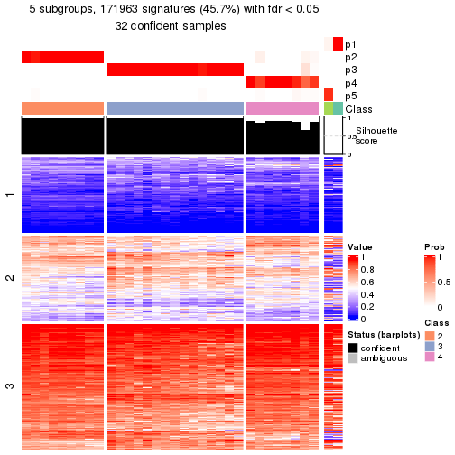</p>

</div>
<div id='tab-node-021-get-signatures-5'>
<pre><code class="r">get_signatures(res, k = 6)
</code></pre>

<p></p>

</div>
<div id='tab-node-021-get-signatures-6'>
<pre><code class="r">get_signatures(res, k = 7)
</code></pre>

<p></p>

</div>
<div id='tab-node-021-get-signatures-7'>
<pre><code class="r">get_signatures(res, k = 8)
</code></pre>

<p></p>

</div>
</div>


Compare the overlap of signatures from different k:

```r
compare_signatures(res)
```


`get_signature()` returns a data frame invisibly. To get the list of signatures, the function
call should be assigned to a variable explicitly. In following code, if `plot` argument is set
to `FALSE`, no heatmap is plotted while only the differential analysis is performed.

```r
# code only for demonstration
tb = get_signature(res, k = ..., plot = FALSE)
```

An example of the output of `tb` is:

```
#>   which_row         fdr    mean_1    mean_2 scaled_mean_1 scaled_mean_2 km
#> 1        38 0.042760348  8.373488  9.131774    -0.5533452     0.5164555  1
#> 2        40 0.018707592  7.106213  8.469186    -0.6173731     0.5762149  1
#> 3        55 0.019134737 10.221463 11.207825    -0.6159697     0.5749050  1
#> 4        59 0.006059896  5.921854  7.869574    -0.6899429     0.6439467  1
#> 5        60 0.018055526  8.928898 10.211722    -0.6204761     0.5791110  1
#> 6        98 0.009384629 15.714769 14.887706     0.6635654    -0.6193277  2
...
```

The columns in `tb` are:

1. `which_row`: row indices corresponding to the input matrix.
2. `fdr`: FDR for the differential test. 
3. `mean_x`: The mean value in group x.
4. `scaled_mean_x`: The mean value in group x after rows are scaled.
5. `km`: Row groups if k-means clustering is applied to rows (which is done by automatically selecting number of clusters).

If there are too many signatures, `top_signatures = ...` can be set to only show the 
signatures with the highest FDRs:

```r
# code only for demonstration
# e.g. to show the top 500 most significant rows
tb = get_signature(res, k = ..., top_signatures = 500)
```

If the signatures are defined as these which are uniquely high in current group, `diff_method` argument
can be set to `"uniquely_high_in_one_group"`:

```r
# code only for demonstration
tb = get_signature(res, k = ..., diff_method = "uniquely_high_in_one_group")
```


UMAP plot which shows how samples are separated.


<script>
$( function() {
	$( '#tabs-node-021-dimension-reduction' ).tabs();
} );
</script>
<div id='tabs-node-021-dimension-reduction'>
<ul>
<li><a href='#tab-node-021-dimension-reduction-1'>k = 2</a></li>
<li><a href='#tab-node-021-dimension-reduction-2'>k = 3</a></li>
<li><a href='#tab-node-021-dimension-reduction-3'>k = 4</a></li>
<li><a href='#tab-node-021-dimension-reduction-4'>k = 5</a></li>
<li><a href='#tab-node-021-dimension-reduction-5'>k = 6</a></li>
<li><a href='#tab-node-021-dimension-reduction-6'>k = 7</a></li>
<li><a href='#tab-node-021-dimension-reduction-7'>k = 8</a></li>
</ul>
<div id='tab-node-021-dimension-reduction-1'>
<pre><code class="r">dimension_reduction(res, k = 2, method = &quot;UMAP&quot;)
</code></pre>

<p></p>

</div>
<div id='tab-node-021-dimension-reduction-2'>
<pre><code class="r">dimension_reduction(res, k = 3, method = &quot;UMAP&quot;)
</code></pre>

<p>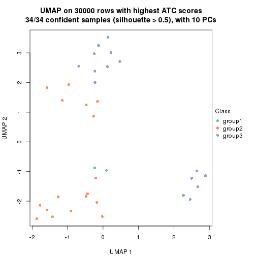</p>

</div>
<div id='tab-node-021-dimension-reduction-3'>
<pre><code class="r">dimension_reduction(res, k = 4, method = &quot;UMAP&quot;)
</code></pre>

<p></p>

</div>
<div id='tab-node-021-dimension-reduction-4'>
<pre><code class="r">dimension_reduction(res, k = 5, method = &quot;UMAP&quot;)
</code></pre>

<p></p>

</div>
<div id='tab-node-021-dimension-reduction-5'>
<pre><code class="r">dimension_reduction(res, k = 6, method = &quot;UMAP&quot;)
</code></pre>

<p></p>

</div>
<div id='tab-node-021-dimension-reduction-6'>
<pre><code class="r">dimension_reduction(res, k = 7, method = &quot;UMAP&quot;)
</code></pre>

<p></p>

</div>
<div id='tab-node-021-dimension-reduction-7'>
<pre><code class="r">dimension_reduction(res, k = 8, method = &quot;UMAP&quot;)
</code></pre>

<p></p>

</div>
</div>


Following heatmap shows how subgroups are split when increasing `k`:

```r
collect_classes(res)
```


If matrix rows can be associated to genes, consider to use `functional_enrichment(res,
...)` to perform function enrichment for the signature genes. See [this vignette](https://jokergoo.github.io/cola_vignettes/functional_enrichment.html) for more detailed explanations.


 

---------------------------------------------------


### Node0213


Parent node: [Node021](#Node021).
Child nodes: 
                Node01111-leaf
        ,
                Node01112-leaf
        ,
                Node01121-leaf
        ,
                Node01122-leaf
        ,
                Node01123-leaf
        ,
                Node01124-leaf
        ,
                Node01211-leaf
        ,
                Node01212-leaf
        ,
                Node01213-leaf
        ,
                Node01321-leaf
        ,
                Node01322-leaf
        ,
                Node01323-leaf
        ,
                Node01324-leaf
        ,
                Node02131-leaf
        ,
                Node02132-leaf
        ,
                Node02211-leaf
        ,
                Node02212-leaf
        ,
                Node02221-leaf
        ,
                [Node02222](#Node02222)
        ,
                Node02223-leaf
        ,
                Node02311-leaf
        ,
                Node02312-leaf
        ,
                Node03311-leaf
        ,
                Node03312-leaf
        ,
                Node03313-leaf
        ,
                Node03321-leaf
        ,
                Node03322-leaf
        ,
                Node03323-leaf
        .


The object with results only for a single top-value method and a single partitioning method 
can be extracted as:

```r
res = res_rh["0213"]
```

A summary of `res` and all the functions that can be applied to it:

```r
res
```

```
#> A 'ConsensusPartition' object with k = 2, 3, 4, 5, 6, 7, 8.
#>   On a matrix with 30000 rows and 15 columns.
#>   Top rows (1000) are extracted by 'SD' method.
#>   Subgroups are detected by 'kmeans' method.
#>   Performed in total 350 partitions by row resampling.
#>   Best k for subgroups seems to be 2.
#> 
#> Following methods can be applied to this 'ConsensusPartition' object:
#>  [1] "cola_report"             "collect_classes"         "collect_plots"          
#>  [4] "collect_stats"           "colnames"                "compare_partitions"     
#>  [7] "compare_signatures"      "consensus_heatmap"       "dimension_reduction"    
#> [10] "functional_enrichment"   "get_anno_col"            "get_anno"               
#> [13] "get_classes"             "get_consensus"           "get_matrix"             
#> [16] "get_membership"          "get_param"               "get_signatures"         
#> [19] "get_stats"               "is_best_k"               "is_stable_k"            
#> [22] "membership_heatmap"      "ncol"                    "nrow"                   
#> [25] "plot_ecdf"               "predict_classes"         "rownames"               
#> [28] "select_partition_number" "show"                    "suggest_best_k"         
#> [31] "test_to_known_factors"   "top_rows_heatmap"
```

`collect_plots()` function collects all the plots made from `res` for all `k` (number of subgroups)
into one single page to provide an easy and fast comparison between different `k`.

```r
collect_plots(res)
```


The plots are:

- The first row: a plot of the eCDF (empirical cumulative distribution
  function) curves of the consensus matrix for each `k` and the heatmap of
  predicted classes for each `k`.
- The second row: heatmaps of the consensus matrix for each `k`.
- The third row: heatmaps of the membership matrix for each `k`.
- The fouth row: heatmaps of the signatures for each `k`.

All the plots in panels can be made by individual functions and they are
plotted later in this section.

`select_partition_number()` produces several plots showing different
statistics for choosing "optimized" `k`. There are following statistics:

- eCDF curves of the consensus matrix for each `k`;
- 1-PAC. [The PAC score](https://en.wikipedia.org/wiki/Consensus_clustering#Over-interpretation_potential_of_consensus_clustering)
  measures the proportion of the ambiguous subgrouping.
- Mean silhouette score.
- Concordance. The mean probability of fiting the consensus subgroup labels in all
  partitions.
- Area increased. Denote $A_k$ as the area under the eCDF curve for current
  `k`, the area increased is defined as $A_k - A_{k-1}$.
- Rand index. The percent of pairs of samples that are both in a same cluster
  or both are not in a same cluster in the partition of k and k-1.
- Jaccard index. The ratio of pairs of samples are both in a same cluster in
  the partition of k and k-1 and the pairs of samples are both in a same
  cluster in the partition k or k-1.

The detailed explanations of these statistics can be found in [the _cola_
vignette](https://jokergoo.github.io/cola_vignettes/cola.html#toc_13).

Generally speaking, higher 1-PAC score, higher mean silhouette score or higher
concordance corresponds to better partition. Rand index and Jaccard index
measure how similar the current partition is compared to partition with `k-1`.
If they are too similar, we won't accept `k` is better than `k-1`.

```r
select_partition_number(res)
```


The numeric values for all these statistics can be obtained by `get_stats()`.

```r
get_stats(res)
```

```
#>   k 1-PAC mean_silhouette concordance area_increased  Rand Jaccard
#> 2 2 1.000           1.000       1.000         0.5148 0.486   0.486
#> 3 3 0.667           0.323       0.736         0.2444 0.867   0.725
#> 4 4 0.600           0.802       0.792         0.1083 0.810   0.556
#> 5 5 0.629           0.436       0.753         0.0918 0.905   0.697
#> 6 6 0.676           0.626       0.823         0.0713 0.876   0.500
#> 7 7 0.790           0.528       0.847         0.0516 0.971   0.812
#> 8 8 0.819           0.361       0.793         0.0284 0.943   0.571
```

`suggest_best_k()` suggests the best $k$ based on these statistics. The rules are as follows:

- All $k$ with Jaccard index larger than 0.95 are removed because increasing
  $k$ does not provide enough extra information. If all $k$ are removed, it is
  marked as no subgroup is detected.
- For all $k$ with 1-PAC score larger than 0.9, the maximal $k$ is taken as
  the best $k$, and other $k$ are marked as optional $k$.
- If it does not fit the second rule. The $k$ with the maximal vote of the
  highest 1-PAC score, highest mean silhouette, and highest concordance is
  taken as the best $k$.

```r
suggest_best_k(res)
```

```
#> [1] 2
```


Following is the table of the partitions (You need to click the **show/hide
code output** link to see it). The membership matrix (columns with name `p*`)
is inferred by
[`clue::cl_consensus()`](https://www.rdocumentation.org/link/cl_consensus?package=clue)
function with the `SE` method. Basically the value in the membership matrix
represents the probability to belong to a certain group. The finall subgroup
label for an item is determined with the group with highest probability it
belongs to.

In `get_classes()` function, the entropy is calculated from the membership
matrix and the silhouette score is calculated from the consensus matrix.


<script>
$( function() {
	$( '#tabs-node-0213-get-classes' ).tabs();
} );
</script>
<div id='tabs-node-0213-get-classes'>
<ul>
<li><a href='#tab-node-0213-get-classes-1'>k = 2</a></li>
<li><a href='#tab-node-0213-get-classes-2'>k = 3</a></li>
<li><a href='#tab-node-0213-get-classes-3'>k = 4</a></li>
<li><a href='#tab-node-0213-get-classes-4'>k = 5</a></li>
<li><a href='#tab-node-0213-get-classes-5'>k = 6</a></li>
<li><a href='#tab-node-0213-get-classes-6'>k = 7</a></li>
<li><a href='#tab-node-0213-get-classes-7'>k = 8</a></li>
</ul>

<div id='tab-node-0213-get-classes-1'>
<p><a id='tab-node-0213-get-classes-1-a' style='color:#0366d6' href='#'>show/hide code output</a></p>
<pre><code class="r">cbind(get_classes(res, k = 2), get_membership(res, k = 2))
</code></pre>

<pre><code>#&gt;                 class entropy silhouette p1 p2
#&gt; TCGA.UY.A78P.01     2       0          1  0  1
#&gt; TCGA.K4.A5RI.11     2       0          1  0  1
#&gt; TCGA.K4.A83P.01     1       0          1  1  0
#&gt; TCGA.XF.AAN8.01     2       0          1  0  1
#&gt; TCGA.FD.A5BS.01     1       0          1  1  0
#&gt; TCGA.FD.A3B8.01     1       0          1  1  0
#&gt; TCGA.XF.AAME.01     2       0          1  0  1
#&gt; TCGA.FD.A43S.01     2       0          1  0  1
#&gt; TCGA.4Z.AA7N.01     1       0          1  1  0
#&gt; TCGA.DK.A3WY.01     2       0          1  0  1
#&gt; TCGA.DK.A1AF.01     2       0          1  0  1
#&gt; TCGA.XF.AAN4.01     2       0          1  0  1
#&gt; TCGA.DK.A3WX.01     2       0          1  0  1
#&gt; TCGA.XF.A9SL.01     1       0          1  1  0
#&gt; TCGA.ZF.AA5P.01     1       0          1  1  0
</code></pre>

<script>
$('#tab-node-0213-get-classes-1-a').parent().next().next().hide();
$('#tab-node-0213-get-classes-1-a').click(function(){
  $('#tab-node-0213-get-classes-1-a').parent().next().next().toggle();
  return(false);
});
</script>
</div>

<div id='tab-node-0213-get-classes-2'>
<p><a id='tab-node-0213-get-classes-2-a' style='color:#0366d6' href='#'>show/hide code output</a></p>
<pre><code class="r">cbind(get_classes(res, k = 3), get_membership(res, k = 3))
</code></pre>

<pre><code>#&gt;                 class entropy silhouette   p1   p2   p3
#&gt; TCGA.UY.A78P.01     3   0.522     0.3408 0.00 0.26 0.74
#&gt; TCGA.K4.A5RI.11     2   0.000     0.3734 0.00 1.00 0.00
#&gt; TCGA.K4.A83P.01     1   0.000     0.9160 1.00 0.00 0.00
#&gt; TCGA.XF.AAN8.01     3   0.631    -0.0926 0.00 0.50 0.50
#&gt; TCGA.FD.A5BS.01     1   0.400     0.8857 0.84 0.00 0.16
#&gt; TCGA.FD.A3B8.01     1   0.296     0.9133 0.90 0.00 0.10
#&gt; TCGA.XF.AAME.01     2   0.631    -0.5277 0.00 0.50 0.50
#&gt; TCGA.FD.A43S.01     2   0.000     0.3734 0.00 1.00 0.00
#&gt; TCGA.4Z.AA7N.01     1   0.153     0.9173 0.96 0.00 0.04
#&gt; TCGA.DK.A3WY.01     2   0.000     0.3734 0.00 1.00 0.00
#&gt; TCGA.DK.A1AF.01     2   0.631    -0.5277 0.00 0.50 0.50
#&gt; TCGA.XF.AAN4.01     2   0.631    -0.5277 0.00 0.50 0.50
#&gt; TCGA.DK.A3WX.01     2   0.624    -0.3725 0.00 0.56 0.44
#&gt; TCGA.XF.A9SL.01     1   0.254     0.9171 0.92 0.00 0.08
#&gt; TCGA.ZF.AA5P.01     1   0.522     0.8829 0.74 0.00 0.26
</code></pre>

<script>
$('#tab-node-0213-get-classes-2-a').parent().next().next().hide();
$('#tab-node-0213-get-classes-2-a').click(function(){
  $('#tab-node-0213-get-classes-2-a').parent().next().next().toggle();
  return(false);
});
</script>
</div>

<div id='tab-node-0213-get-classes-3'>
<p><a id='tab-node-0213-get-classes-3-a' style='color:#0366d6' href='#'>show/hide code output</a></p>
<pre><code class="r">cbind(get_classes(res, k = 4), get_membership(res, k = 4))
</code></pre>

<pre><code>#&gt;                 class entropy silhouette   p1   p2   p3   p4
#&gt; TCGA.UY.A78P.01     4   0.754      0.317 0.00 0.20 0.34 0.46
#&gt; TCGA.K4.A5RI.11     2   0.000      1.000 0.00 1.00 0.00 0.00
#&gt; TCGA.K4.A83P.01     1   0.234      0.782 0.90 0.00 0.00 0.10
#&gt; TCGA.XF.AAN8.01     4   0.462      0.846 0.00 0.34 0.00 0.66
#&gt; TCGA.FD.A5BS.01     1   0.526      0.742 0.70 0.00 0.26 0.04
#&gt; TCGA.FD.A3B8.01     1   0.588      0.754 0.64 0.00 0.30 0.06
#&gt; TCGA.XF.AAME.01     4   0.462      0.846 0.00 0.34 0.00 0.66
#&gt; TCGA.FD.A43S.01     2   0.000      1.000 0.00 1.00 0.00 0.00
#&gt; TCGA.4Z.AA7N.01     1   0.283      0.790 0.90 0.00 0.04 0.06
#&gt; TCGA.DK.A3WY.01     2   0.000      1.000 0.00 1.00 0.00 0.00
#&gt; TCGA.DK.A1AF.01     4   0.462      0.846 0.00 0.34 0.00 0.66
#&gt; TCGA.XF.AAN4.01     4   0.462      0.846 0.00 0.34 0.00 0.66
#&gt; TCGA.DK.A3WX.01     4   0.657      0.747 0.00 0.32 0.10 0.58
#&gt; TCGA.XF.A9SL.01     1   0.385      0.785 0.82 0.00 0.16 0.02
#&gt; TCGA.ZF.AA5P.01     1   0.500      0.720 0.50 0.00 0.50 0.00
</code></pre>

<script>
$('#tab-node-0213-get-classes-3-a').parent().next().next().hide();
$('#tab-node-0213-get-classes-3-a').click(function(){
  $('#tab-node-0213-get-classes-3-a').parent().next().next().toggle();
  return(false);
});
</script>
</div>

<div id='tab-node-0213-get-classes-4'>
<p><a id='tab-node-0213-get-classes-4-a' style='color:#0366d6' href='#'>show/hide code output</a></p>
<pre><code class="r">cbind(get_classes(res, k = 5), get_membership(res, k = 5))
</code></pre>

<pre><code>#&gt;                 class entropy silhouette   p1   p2   p3   p4   p5
#&gt; TCGA.UY.A78P.01     5   0.311     0.0000 0.00 0.00 0.00 0.20 0.80
#&gt; TCGA.K4.A5RI.11     2   0.273     1.0000 0.00 0.84 0.00 0.16 0.00
#&gt; TCGA.K4.A83P.01     1   0.651     0.0397 0.60 0.06 0.24 0.00 0.10
#&gt; TCGA.XF.AAN8.01     4   0.000     0.8530 0.00 0.00 0.00 1.00 0.00
#&gt; TCGA.FD.A5BS.01     1   0.000     0.3047 1.00 0.00 0.00 0.00 0.00
#&gt; TCGA.FD.A3B8.01     3   0.513     0.0000 0.42 0.04 0.54 0.00 0.00
#&gt; TCGA.XF.AAME.01     4   0.000     0.8530 0.00 0.00 0.00 1.00 0.00
#&gt; TCGA.FD.A43S.01     2   0.273     1.0000 0.00 0.84 0.00 0.16 0.00
#&gt; TCGA.4Z.AA7N.01     1   0.501     0.2501 0.74 0.02 0.14 0.00 0.10
#&gt; TCGA.DK.A3WY.01     2   0.273     1.0000 0.00 0.84 0.00 0.16 0.00
#&gt; TCGA.DK.A1AF.01     4   0.000     0.8530 0.00 0.00 0.00 1.00 0.00
#&gt; TCGA.XF.AAN4.01     4   0.000     0.8530 0.00 0.00 0.00 1.00 0.00
#&gt; TCGA.DK.A3WX.01     4   0.593     0.1903 0.00 0.06 0.40 0.52 0.02
#&gt; TCGA.XF.A9SL.01     1   0.569    -0.5949 0.48 0.02 0.46 0.00 0.04
#&gt; TCGA.ZF.AA5P.01     1   0.342    -0.0594 0.76 0.00 0.24 0.00 0.00
</code></pre>

<script>
$('#tab-node-0213-get-classes-4-a').parent().next().next().hide();
$('#tab-node-0213-get-classes-4-a').click(function(){
  $('#tab-node-0213-get-classes-4-a').parent().next().next().toggle();
  return(false);
});
</script>
</div>

<div id='tab-node-0213-get-classes-5'>
<p><a id='tab-node-0213-get-classes-5-a' style='color:#0366d6' href='#'>show/hide code output</a></p>
<pre><code class="r">cbind(get_classes(res, k = 6), get_membership(res, k = 6))
</code></pre>

<pre><code>#&gt;                 class entropy silhouette   p1   p2   p3   p4   p5   p6
#&gt; TCGA.UY.A78P.01     5  0.2048      0.000 0.00 0.00 0.00 0.12 0.88 0.00
#&gt; TCGA.K4.A5RI.11     2  0.1814      1.000 0.00 0.90 0.00 0.10 0.00 0.00
#&gt; TCGA.K4.A83P.01     1  0.7006      0.390 0.50 0.04 0.24 0.00 0.04 0.18
#&gt; TCGA.XF.AAN8.01     4  0.1267      0.914 0.00 0.00 0.00 0.94 0.00 0.06
#&gt; TCGA.FD.A5BS.01     6  0.1556      0.590 0.08 0.00 0.00 0.00 0.00 0.92
#&gt; TCGA.FD.A3B8.01     1  0.3997      0.388 0.78 0.02 0.14 0.00 0.06 0.00
#&gt; TCGA.XF.AAME.01     4  0.0937      0.926 0.00 0.00 0.00 0.96 0.00 0.04
#&gt; TCGA.FD.A43S.01     2  0.1814      1.000 0.00 0.90 0.00 0.10 0.00 0.00
#&gt; TCGA.4Z.AA7N.01     1  0.6835      0.253 0.46 0.06 0.08 0.00 0.04 0.36
#&gt; TCGA.DK.A3WY.01     2  0.1814      1.000 0.00 0.90 0.00 0.10 0.00 0.00
#&gt; TCGA.DK.A1AF.01     4  0.0547      0.931 0.00 0.02 0.00 0.98 0.00 0.00
#&gt; TCGA.XF.AAN4.01     4  0.0547      0.931 0.00 0.02 0.00 0.98 0.00 0.00
#&gt; TCGA.DK.A3WX.01     3  0.4199      0.000 0.00 0.02 0.60 0.38 0.00 0.00
#&gt; TCGA.XF.A9SL.01     1  0.0547      0.499 0.98 0.00 0.00 0.00 0.00 0.02
#&gt; TCGA.ZF.AA5P.01     6  0.4962      0.570 0.28 0.00 0.06 0.00 0.02 0.64
</code></pre>

<script>
$('#tab-node-0213-get-classes-5-a').parent().next().next().hide();
$('#tab-node-0213-get-classes-5-a').click(function(){
  $('#tab-node-0213-get-classes-5-a').parent().next().next().toggle();
  return(false);
});
</script>
</div>

<div id='tab-node-0213-get-classes-6'>
<p><a id='tab-node-0213-get-classes-6-a' style='color:#0366d6' href='#'>show/hide code output</a></p>
<pre><code class="r">cbind(get_classes(res, k = 7), get_membership(res, k = 7))
</code></pre>

<pre><code>#&gt;                 class entropy silhouette   p1   p2   p3   p4   p5   p6   p7
#&gt; TCGA.UY.A78P.01     5  0.0504     0.0000 0.00 0.00 0.00 0.02 0.98 0.00 0.00
#&gt; TCGA.K4.A5RI.11     2  0.0504     1.0000 0.00 0.98 0.00 0.02 0.00 0.00 0.00
#&gt; TCGA.K4.A83P.01     7  0.4848     0.0000 0.40 0.00 0.00 0.00 0.00 0.10 0.50
#&gt; TCGA.XF.AAN8.01     4  0.3667     0.7832 0.00 0.00 0.00 0.74 0.00 0.06 0.20
#&gt; TCGA.FD.A5BS.01     6  0.1671     0.6306 0.10 0.00 0.00 0.00 0.00 0.90 0.00
#&gt; TCGA.FD.A3B8.01     1  0.5397     0.2389 0.66 0.02 0.06 0.00 0.02 0.04 0.20
#&gt; TCGA.XF.AAME.01     4  0.2945     0.7832 0.00 0.00 0.00 0.74 0.00 0.00 0.26
#&gt; TCGA.FD.A43S.01     2  0.0504     1.0000 0.00 0.98 0.00 0.02 0.00 0.00 0.00
#&gt; TCGA.4Z.AA7N.01     1  0.5680    -0.0407 0.52 0.00 0.04 0.00 0.00 0.30 0.14
#&gt; TCGA.DK.A3WY.01     2  0.0504     1.0000 0.00 0.98 0.00 0.02 0.00 0.00 0.00
#&gt; TCGA.DK.A1AF.01     4  0.0000     0.8277 0.00 0.00 0.00 1.00 0.00 0.00 0.00
#&gt; TCGA.XF.AAN4.01     4  0.0000     0.8277 0.00 0.00 0.00 1.00 0.00 0.00 0.00
#&gt; TCGA.DK.A3WX.01     3  0.1671     0.0000 0.00 0.00 0.90 0.10 0.00 0.00 0.00
#&gt; TCGA.XF.A9SL.01     1  0.0000     0.2675 1.00 0.00 0.00 0.00 0.00 0.00 0.00
#&gt; TCGA.ZF.AA5P.01     6  0.3991     0.6078 0.22 0.00 0.02 0.00 0.00 0.72 0.04
</code></pre>

<script>
$('#tab-node-0213-get-classes-6-a').parent().next().next().hide();
$('#tab-node-0213-get-classes-6-a').click(function(){
  $('#tab-node-0213-get-classes-6-a').parent().next().next().toggle();
  return(false);
});
</script>
</div>

<div id='tab-node-0213-get-classes-7'>
<p><a id='tab-node-0213-get-classes-7-a' style='color:#0366d6' href='#'>show/hide code output</a></p>
<pre><code class="r">cbind(get_classes(res, k = 8), get_membership(res, k = 8))
</code></pre>

<pre><code>#&gt;                 class entropy silhouette   p1   p2   p3   p4   p5   p6   p7   p8
#&gt; TCGA.UY.A78P.01     5  0.0471      0.000 0.00 0.00 0.00 0.02 0.98 0.00 0.00 0.00
#&gt; TCGA.K4.A5RI.11     2  0.1887      0.910 0.04 0.90 0.00 0.00 0.00 0.06 0.00 0.00
#&gt; TCGA.K4.A83P.01     7  0.1275      0.252 0.04 0.00 0.00 0.00 0.00 0.02 0.94 0.00
#&gt; TCGA.XF.AAN8.01     8  0.3737      0.000 0.00 0.02 0.00 0.48 0.00 0.00 0.00 0.50
#&gt; TCGA.FD.A5BS.01     6  0.2569      0.484 0.02 0.00 0.00 0.00 0.00 0.82 0.16 0.00
#&gt; TCGA.FD.A3B8.01     1  0.1563      0.465 0.90 0.00 0.00 0.00 0.00 0.00 0.10 0.00
#&gt; TCGA.XF.AAME.01     4  0.5843     -0.552 0.04 0.02 0.00 0.44 0.00 0.08 0.02 0.40
#&gt; TCGA.FD.A43S.01     2  0.0000      0.942 0.00 1.00 0.00 0.00 0.00 0.00 0.00 0.00
#&gt; TCGA.4Z.AA7N.01     7  0.5962      0.221 0.10 0.00 0.00 0.00 0.00 0.14 0.40 0.36
#&gt; TCGA.DK.A3WY.01     2  0.0941      0.938 0.00 0.96 0.00 0.00 0.00 0.02 0.00 0.02
#&gt; TCGA.DK.A1AF.01     4  0.0471      0.468 0.00 0.02 0.00 0.98 0.00 0.00 0.00 0.00
#&gt; TCGA.XF.AAN4.01     4  0.0471      0.468 0.00 0.02 0.00 0.98 0.00 0.00 0.00 0.00
#&gt; TCGA.DK.A3WX.01     3  0.1091      0.000 0.00 0.00 0.94 0.06 0.00 0.00 0.00 0.00
#&gt; TCGA.XF.A9SL.01     1  0.6479      0.341 0.50 0.00 0.04 0.02 0.02 0.04 0.28 0.10
#&gt; TCGA.ZF.AA5P.01     6  0.3942      0.473 0.34 0.00 0.02 0.00 0.00 0.62 0.00 0.02
</code></pre>

<script>
$('#tab-node-0213-get-classes-7-a').parent().next().next().hide();
$('#tab-node-0213-get-classes-7-a').click(function(){
  $('#tab-node-0213-get-classes-7-a').parent().next().next().toggle();
  return(false);
});
</script>
</div>
</div>

Heatmaps for the consensus matrix. It visualizes the probability of two
samples to be in a same group.


<script>
$( function() {
	$( '#tabs-node-0213-consensus-heatmap' ).tabs();
} );
</script>
<div id='tabs-node-0213-consensus-heatmap'>
<ul>
<li><a href='#tab-node-0213-consensus-heatmap-1'>k = 2</a></li>
<li><a href='#tab-node-0213-consensus-heatmap-2'>k = 3</a></li>
<li><a href='#tab-node-0213-consensus-heatmap-3'>k = 4</a></li>
<li><a href='#tab-node-0213-consensus-heatmap-4'>k = 5</a></li>
<li><a href='#tab-node-0213-consensus-heatmap-5'>k = 6</a></li>
<li><a href='#tab-node-0213-consensus-heatmap-6'>k = 7</a></li>
<li><a href='#tab-node-0213-consensus-heatmap-7'>k = 8</a></li>
</ul>
<div id='tab-node-0213-consensus-heatmap-1'>
<pre><code class="r">consensus_heatmap(res, k = 2)
</code></pre>

<p></p>

</div>
<div id='tab-node-0213-consensus-heatmap-2'>
<pre><code class="r">consensus_heatmap(res, k = 3)
</code></pre>

<p></p>

</div>
<div id='tab-node-0213-consensus-heatmap-3'>
<pre><code class="r">consensus_heatmap(res, k = 4)
</code></pre>

<p></p>

</div>
<div id='tab-node-0213-consensus-heatmap-4'>
<pre><code class="r">consensus_heatmap(res, k = 5)
</code></pre>

<p></p>

</div>
<div id='tab-node-0213-consensus-heatmap-5'>
<pre><code class="r">consensus_heatmap(res, k = 6)
</code></pre>

<p></p>

</div>
<div id='tab-node-0213-consensus-heatmap-6'>
<pre><code class="r">consensus_heatmap(res, k = 7)
</code></pre>

<p></p>

</div>
<div id='tab-node-0213-consensus-heatmap-7'>
<pre><code class="r">consensus_heatmap(res, k = 8)
</code></pre>

<p></p>

</div>
</div>

Heatmaps for the membership of samples in all partitions to see how consistent they are:


<script>
$( function() {
	$( '#tabs-node-0213-membership-heatmap' ).tabs();
} );
</script>
<div id='tabs-node-0213-membership-heatmap'>
<ul>
<li><a href='#tab-node-0213-membership-heatmap-1'>k = 2</a></li>
<li><a href='#tab-node-0213-membership-heatmap-2'>k = 3</a></li>
<li><a href='#tab-node-0213-membership-heatmap-3'>k = 4</a></li>
<li><a href='#tab-node-0213-membership-heatmap-4'>k = 5</a></li>
<li><a href='#tab-node-0213-membership-heatmap-5'>k = 6</a></li>
<li><a href='#tab-node-0213-membership-heatmap-6'>k = 7</a></li>
<li><a href='#tab-node-0213-membership-heatmap-7'>k = 8</a></li>
</ul>
<div id='tab-node-0213-membership-heatmap-1'>
<pre><code class="r">membership_heatmap(res, k = 2)
</code></pre>

<p></p>

</div>
<div id='tab-node-0213-membership-heatmap-2'>
<pre><code class="r">membership_heatmap(res, k = 3)
</code></pre>

<p></p>

</div>
<div id='tab-node-0213-membership-heatmap-3'>
<pre><code class="r">membership_heatmap(res, k = 4)
</code></pre>

<p></p>

</div>
<div id='tab-node-0213-membership-heatmap-4'>
<pre><code class="r">membership_heatmap(res, k = 5)
</code></pre>

<p></p>

</div>
<div id='tab-node-0213-membership-heatmap-5'>
<pre><code class="r">membership_heatmap(res, k = 6)
</code></pre>

<p></p>

</div>
<div id='tab-node-0213-membership-heatmap-6'>
<pre><code class="r">membership_heatmap(res, k = 7)
</code></pre>

<p></p>

</div>
<div id='tab-node-0213-membership-heatmap-7'>
<pre><code class="r">membership_heatmap(res, k = 8)
</code></pre>

<p></p>

</div>
</div>

As soon as the classes for columns are determined, the signatures
that are significantly different between subgroups can be looked for. 
Following are the heatmaps for signatures.


<script>
$( function() {
	$( '#tabs-node-0213-get-signatures' ).tabs();
} );
</script>
<div id='tabs-node-0213-get-signatures'>
<ul>
<li><a href='#tab-node-0213-get-signatures-1'>k = 2</a></li>
<li><a href='#tab-node-0213-get-signatures-2'>k = 3</a></li>
<li><a href='#tab-node-0213-get-signatures-3'>k = 4</a></li>
<li><a href='#tab-node-0213-get-signatures-4'>k = 5</a></li>
<li><a href='#tab-node-0213-get-signatures-5'>k = 6</a></li>
<li><a href='#tab-node-0213-get-signatures-6'>k = 7</a></li>
<li><a href='#tab-node-0213-get-signatures-7'>k = 8</a></li>
</ul>
<div id='tab-node-0213-get-signatures-1'>
<pre><code class="r">get_signatures(res, k = 2)
</code></pre>

<p></p>

</div>
<div id='tab-node-0213-get-signatures-2'>
<pre><code class="r">get_signatures(res, k = 3)
</code></pre>

<p></p>

</div>
<div id='tab-node-0213-get-signatures-3'>
<pre><code class="r">get_signatures(res, k = 4)
</code></pre>

<p></p>

</div>
<div id='tab-node-0213-get-signatures-4'>
<pre><code class="r">get_signatures(res, k = 5)
</code></pre>

<p>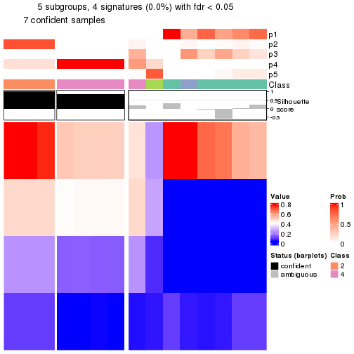</p>

</div>
<div id='tab-node-0213-get-signatures-5'>
<pre><code class="r">get_signatures(res, k = 6)
</code></pre>

<p></p>

</div>
<div id='tab-node-0213-get-signatures-6'>
<pre><code class="r">get_signatures(res, k = 7)
</code></pre>

<p></p>

</div>
<div id='tab-node-0213-get-signatures-7'>
<pre><code class="r">get_signatures(res, k = 8)
</code></pre>

<p></p>

</div>
</div>


Compare the overlap of signatures from different k:

```r
compare_signatures(res)
```


`get_signature()` returns a data frame invisibly. To get the list of signatures, the function
call should be assigned to a variable explicitly. In following code, if `plot` argument is set
to `FALSE`, no heatmap is plotted while only the differential analysis is performed.

```r
# code only for demonstration
tb = get_signature(res, k = ..., plot = FALSE)
```

An example of the output of `tb` is:

```
#>   which_row         fdr    mean_1    mean_2 scaled_mean_1 scaled_mean_2 km
#> 1        38 0.042760348  8.373488  9.131774    -0.5533452     0.5164555  1
#> 2        40 0.018707592  7.106213  8.469186    -0.6173731     0.5762149  1
#> 3        55 0.019134737 10.221463 11.207825    -0.6159697     0.5749050  1
#> 4        59 0.006059896  5.921854  7.869574    -0.6899429     0.6439467  1
#> 5        60 0.018055526  8.928898 10.211722    -0.6204761     0.5791110  1
#> 6        98 0.009384629 15.714769 14.887706     0.6635654    -0.6193277  2
...
```

The columns in `tb` are:

1. `which_row`: row indices corresponding to the input matrix.
2. `fdr`: FDR for the differential test. 
3. `mean_x`: The mean value in group x.
4. `scaled_mean_x`: The mean value in group x after rows are scaled.
5. `km`: Row groups if k-means clustering is applied to rows (which is done by automatically selecting number of clusters).

If there are too many signatures, `top_signatures = ...` can be set to only show the 
signatures with the highest FDRs:

```r
# code only for demonstration
# e.g. to show the top 500 most significant rows
tb = get_signature(res, k = ..., top_signatures = 500)
```

If the signatures are defined as these which are uniquely high in current group, `diff_method` argument
can be set to `"uniquely_high_in_one_group"`:

```r
# code only for demonstration
tb = get_signature(res, k = ..., diff_method = "uniquely_high_in_one_group")
```


UMAP plot which shows how samples are separated.


<script>
$( function() {
	$( '#tabs-node-0213-dimension-reduction' ).tabs();
} );
</script>
<div id='tabs-node-0213-dimension-reduction'>
<ul>
<li><a href='#tab-node-0213-dimension-reduction-1'>k = 2</a></li>
<li><a href='#tab-node-0213-dimension-reduction-2'>k = 3</a></li>
<li><a href='#tab-node-0213-dimension-reduction-3'>k = 4</a></li>
<li><a href='#tab-node-0213-dimension-reduction-4'>k = 5</a></li>
<li><a href='#tab-node-0213-dimension-reduction-5'>k = 6</a></li>
<li><a href='#tab-node-0213-dimension-reduction-6'>k = 7</a></li>
<li><a href='#tab-node-0213-dimension-reduction-7'>k = 8</a></li>
</ul>
<div id='tab-node-0213-dimension-reduction-1'>
<pre><code class="r">dimension_reduction(res, k = 2, method = &quot;UMAP&quot;)
</code></pre>

<p></p>

</div>
<div id='tab-node-0213-dimension-reduction-2'>
<pre><code class="r">dimension_reduction(res, k = 3, method = &quot;UMAP&quot;)
</code></pre>

<p></p>

</div>
<div id='tab-node-0213-dimension-reduction-3'>
<pre><code class="r">dimension_reduction(res, k = 4, method = &quot;UMAP&quot;)
</code></pre>

<p></p>

</div>
<div id='tab-node-0213-dimension-reduction-4'>
<pre><code class="r">dimension_reduction(res, k = 5, method = &quot;UMAP&quot;)
</code></pre>

<p></p>

</div>
<div id='tab-node-0213-dimension-reduction-5'>
<pre><code class="r">dimension_reduction(res, k = 6, method = &quot;UMAP&quot;)
</code></pre>

<p>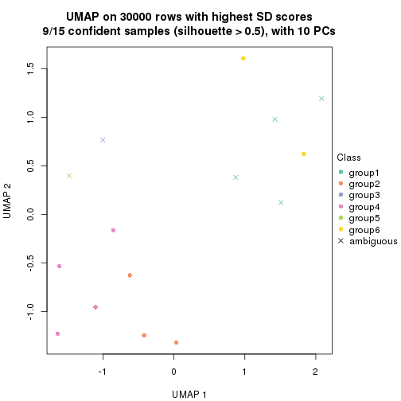</p>

</div>
<div id='tab-node-0213-dimension-reduction-6'>
<pre><code class="r">dimension_reduction(res, k = 7, method = &quot;UMAP&quot;)
</code></pre>

<p></p>

</div>
<div id='tab-node-0213-dimension-reduction-7'>
<pre><code class="r">dimension_reduction(res, k = 8, method = &quot;UMAP&quot;)
</code></pre>

<p></p>

</div>
</div>


Following heatmap shows how subgroups are split when increasing `k`:

```r
collect_classes(res)
```


If matrix rows can be associated to genes, consider to use `functional_enrichment(res,
...)` to perform function enrichment for the signature genes. See [this vignette](https://jokergoo.github.io/cola_vignettes/functional_enrichment.html) for more detailed explanations.


 

---------------------------------------------------


### Node022


Parent node: [Node02](#Node02).
Child nodes: 
                [Node0111](#Node0111)
        ,
                [Node0112](#Node0112)
        ,
                Node0113-leaf
        ,
                [Node0121](#Node0121)
        ,
                Node0122-leaf
        ,
                Node0123-leaf
        ,
                Node0131-leaf
        ,
                [Node0132](#Node0132)
        ,
                Node0133-leaf
        ,
                Node0134-leaf
        ,
                Node0211-leaf
        ,
                Node0212-leaf
        ,
                [Node0213](#Node0213)
        ,
                Node0214-leaf
        ,
                [Node0221](#Node0221)
        ,
                [Node0222](#Node0222)
        ,
                [Node0231](#Node0231)
        ,
                Node0232-leaf
        ,
                Node0233-leaf
        ,
                Node0321-leaf
        ,
                Node0322-leaf
        ,
                Node0323-leaf
        ,
                [Node0331](#Node0331)
        ,
                [Node0332](#Node0332)
        ,
                Node0333-leaf
        .


The object with results only for a single top-value method and a single partitioning method 
can be extracted as:

```r
res = res_rh["022"]
```

A summary of `res` and all the functions that can be applied to it:

```r
res
```

```
#> A 'ConsensusPartition' object with k = 2, 3, 4, 5, 6, 7, 8.
#>   On a matrix with 30000 rows and 59 columns.
#>   Top rows (1000) are extracted by 'SD' method.
#>   Subgroups are detected by 'kmeans' method.
#>   Performed in total 350 partitions by row resampling.
#>   Best k for subgroups seems to be 2.
#> 
#> Following methods can be applied to this 'ConsensusPartition' object:
#>  [1] "cola_report"             "collect_classes"         "collect_plots"          
#>  [4] "collect_stats"           "colnames"                "compare_partitions"     
#>  [7] "compare_signatures"      "consensus_heatmap"       "dimension_reduction"    
#> [10] "functional_enrichment"   "get_anno_col"            "get_anno"               
#> [13] "get_classes"             "get_consensus"           "get_matrix"             
#> [16] "get_membership"          "get_param"               "get_signatures"         
#> [19] "get_stats"               "is_best_k"               "is_stable_k"            
#> [22] "membership_heatmap"      "ncol"                    "nrow"                   
#> [25] "plot_ecdf"               "predict_classes"         "rownames"               
#> [28] "select_partition_number" "show"                    "suggest_best_k"         
#> [31] "test_to_known_factors"   "top_rows_heatmap"
```

`collect_plots()` function collects all the plots made from `res` for all `k` (number of subgroups)
into one single page to provide an easy and fast comparison between different `k`.

```r
collect_plots(res)
```


The plots are:

- The first row: a plot of the eCDF (empirical cumulative distribution
  function) curves of the consensus matrix for each `k` and the heatmap of
  predicted classes for each `k`.
- The second row: heatmaps of the consensus matrix for each `k`.
- The third row: heatmaps of the membership matrix for each `k`.
- The fouth row: heatmaps of the signatures for each `k`.

All the plots in panels can be made by individual functions and they are
plotted later in this section.

`select_partition_number()` produces several plots showing different
statistics for choosing "optimized" `k`. There are following statistics:

- eCDF curves of the consensus matrix for each `k`;
- 1-PAC. [The PAC score](https://en.wikipedia.org/wiki/Consensus_clustering#Over-interpretation_potential_of_consensus_clustering)
  measures the proportion of the ambiguous subgrouping.
- Mean silhouette score.
- Concordance. The mean probability of fiting the consensus subgroup labels in all
  partitions.
- Area increased. Denote $A_k$ as the area under the eCDF curve for current
  `k`, the area increased is defined as $A_k - A_{k-1}$.
- Rand index. The percent of pairs of samples that are both in a same cluster
  or both are not in a same cluster in the partition of k and k-1.
- Jaccard index. The ratio of pairs of samples are both in a same cluster in
  the partition of k and k-1 and the pairs of samples are both in a same
  cluster in the partition k or k-1.

The detailed explanations of these statistics can be found in [the _cola_
vignette](https://jokergoo.github.io/cola_vignettes/cola.html#toc_13).

Generally speaking, higher 1-PAC score, higher mean silhouette score or higher
concordance corresponds to better partition. Rand index and Jaccard index
measure how similar the current partition is compared to partition with `k-1`.
If they are too similar, we won't accept `k` is better than `k-1`.

```r
select_partition_number(res)
```


The numeric values for all these statistics can be obtained by `get_stats()`.

```r
get_stats(res)
```

```
#>   k 1-PAC mean_silhouette concordance area_increased  Rand Jaccard
#> 2 2 1.000           1.000       1.000         0.4027 0.598   0.598
#> 3 3 0.619           0.793       0.816         0.5518 0.731   0.550
#> 4 4 0.676           0.742       0.815         0.1733 0.863   0.613
#> 5 5 0.711           0.699       0.793         0.0641 0.972   0.890
#> 6 6 0.700           0.545       0.798         0.0487 0.906   0.638
#> 7 7 0.725           0.657       0.761         0.0288 0.959   0.783
#> 8 8 0.754           0.555       0.677         0.0156 0.943   0.674
```

`suggest_best_k()` suggests the best $k$ based on these statistics. The rules are as follows:

- All $k$ with Jaccard index larger than 0.95 are removed because increasing
  $k$ does not provide enough extra information. If all $k$ are removed, it is
  marked as no subgroup is detected.
- For all $k$ with 1-PAC score larger than 0.9, the maximal $k$ is taken as
  the best $k$, and other $k$ are marked as optional $k$.
- If it does not fit the second rule. The $k$ with the maximal vote of the
  highest 1-PAC score, highest mean silhouette, and highest concordance is
  taken as the best $k$.

```r
suggest_best_k(res)
```

```
#> [1] 2
```


Following is the table of the partitions (You need to click the **show/hide
code output** link to see it). The membership matrix (columns with name `p*`)
is inferred by
[`clue::cl_consensus()`](https://www.rdocumentation.org/link/cl_consensus?package=clue)
function with the `SE` method. Basically the value in the membership matrix
represents the probability to belong to a certain group. The finall subgroup
label for an item is determined with the group with highest probability it
belongs to.

In `get_classes()` function, the entropy is calculated from the membership
matrix and the silhouette score is calculated from the consensus matrix.


<script>
$( function() {
	$( '#tabs-node-022-get-classes' ).tabs();
} );
</script>
<div id='tabs-node-022-get-classes'>
<ul>
<li><a href='#tab-node-022-get-classes-1'>k = 2</a></li>
<li><a href='#tab-node-022-get-classes-2'>k = 3</a></li>
<li><a href='#tab-node-022-get-classes-3'>k = 4</a></li>
<li><a href='#tab-node-022-get-classes-4'>k = 5</a></li>
<li><a href='#tab-node-022-get-classes-5'>k = 6</a></li>
<li><a href='#tab-node-022-get-classes-6'>k = 7</a></li>
<li><a href='#tab-node-022-get-classes-7'>k = 8</a></li>
</ul>

<div id='tab-node-022-get-classes-1'>
<p><a id='tab-node-022-get-classes-1-a' style='color:#0366d6' href='#'>show/hide code output</a></p>
<pre><code class="r">cbind(get_classes(res, k = 2), get_membership(res, k = 2))
</code></pre>

<pre><code>#&gt;                 class entropy silhouette p1 p2
#&gt; TCGA.GD.A3OP.01     1       0          1  1  0
#&gt; TCGA.4Z.AA86.01     2       0          1  0  1
#&gt; TCGA.GU.A42Q.01     2       0          1  0  1
#&gt; TCGA.FD.A5BU.01     1       0          1  1  0
#&gt; TCGA.DK.AA6X.01     2       0          1  0  1
#&gt; TCGA.GC.A3OO.01     2       0          1  0  1
#&gt; TCGA.DK.A2I2.01     1       0          1  1  0
#&gt; TCGA.4Z.AA7W.01     2       0          1  0  1
#&gt; TCGA.XF.A9SI.01     1       0          1  1  0
#&gt; TCGA.XF.A9SM.01     2       0          1  0  1
#&gt; TCGA.DK.A3IU.01     2       0          1  0  1
#&gt; TCGA.E7.A7XN.01     2       0          1  0  1
#&gt; TCGA.FD.A3B3.01     1       0          1  1  0
#&gt; TCGA.FD.A6TF.01     1       0          1  1  0
#&gt; TCGA.FD.A43Y.01     2       0          1  0  1
#&gt; TCGA.YC.A8S6.01     2       0          1  0  1
#&gt; TCGA.CU.A0YO.01     2       0          1  0  1
#&gt; TCGA.FD.A62P.01     2       0          1  0  1
#&gt; TCGA.DK.AA74.01     2       0          1  0  1
#&gt; TCGA.BT.A20U.11     1       0          1  1  0
#&gt; TCGA.BT.A42F.01     2       0          1  0  1
#&gt; TCGA.DK.A3IQ.01     2       0          1  0  1
#&gt; TCGA.FD.A3B7.01     2       0          1  0  1
#&gt; TCGA.DK.A1AB.01     1       0          1  1  0
#&gt; TCGA.K4.A3WU.01     2       0          1  0  1
#&gt; TCGA.FD.A62N.01     2       0          1  0  1
#&gt; TCGA.UY.A9PB.01     2       0          1  0  1
#&gt; TCGA.GU.A766.01     2       0          1  0  1
#&gt; TCGA.FD.A6TB.01     2       0          1  0  1
#&gt; TCGA.XF.A9T8.01     2       0          1  0  1
#&gt; TCGA.G2.AA3D.01     2       0          1  0  1
#&gt; TCGA.ZF.A9RG.01     1       0          1  1  0
#&gt; TCGA.BT.A20O.01     2       0          1  0  1
#&gt; TCGA.XF.A8HE.01     2       0          1  0  1
#&gt; TCGA.GC.A3WC.01     1       0          1  1  0
#&gt; TCGA.XF.A9SY.01     1       0          1  1  0
#&gt; TCGA.GD.A2C5.11     1       0          1  1  0
#&gt; TCGA.ZF.AA53.01     2       0          1  0  1
#&gt; TCGA.DK.AA6T.01     2       0          1  0  1
#&gt; TCGA.ZF.AA58.01     1       0          1  1  0
#&gt; TCGA.GC.A6I3.11     1       0          1  1  0
#&gt; TCGA.XF.AAMJ.01     2       0          1  0  1
#&gt; TCGA.FD.A5BT.01     2       0          1  0  1
#&gt; TCGA.PQ.A6FN.01     1       0          1  1  0
#&gt; TCGA.SY.A9G0.01     2       0          1  0  1
#&gt; TCGA.K4.A4AC.01     2       0          1  0  1
#&gt; TCGA.FD.A43U.01     2       0          1  0  1
#&gt; TCGA.GU.A764.01     2       0          1  0  1
#&gt; TCGA.DK.A2I4.01     2       0          1  0  1
#&gt; TCGA.BL.A13I.01     1       0          1  1  0
#&gt; TCGA.FD.A6TK.01     2       0          1  0  1
#&gt; TCGA.BT.A3PK.01     2       0          1  0  1
#&gt; TCGA.XF.A9SW.01     2       0          1  0  1
#&gt; TCGA.ZF.AA4W.01     2       0          1  0  1
#&gt; TCGA.UY.A9PA.01     2       0          1  0  1
#&gt; TCGA.R3.A69X.01     2       0          1  0  1
#&gt; TCGA.E7.A519.01     2       0          1  0  1
#&gt; TCGA.XF.AAMR.01     2       0          1  0  1
#&gt; TCGA.FD.A3SP.01     2       0          1  0  1
</code></pre>

<script>
$('#tab-node-022-get-classes-1-a').parent().next().next().hide();
$('#tab-node-022-get-classes-1-a').click(function(){
  $('#tab-node-022-get-classes-1-a').parent().next().next().toggle();
  return(false);
});
</script>
</div>

<div id='tab-node-022-get-classes-2'>
<p><a id='tab-node-022-get-classes-2-a' style='color:#0366d6' href='#'>show/hide code output</a></p>
<pre><code class="r">cbind(get_classes(res, k = 3), get_membership(res, k = 3))
</code></pre>

<pre><code>#&gt;                 class entropy silhouette   p1   p2   p3
#&gt; TCGA.GD.A3OP.01     1   0.400     0.9290 0.84 0.16 0.00
#&gt; TCGA.4Z.AA86.01     3   0.000     0.7873 0.00 0.00 1.00
#&gt; TCGA.GU.A42Q.01     2   0.400     0.9515 0.00 0.84 0.16
#&gt; TCGA.FD.A5BU.01     1   0.000     0.9497 1.00 0.00 0.00
#&gt; TCGA.DK.AA6X.01     2   0.630     0.2228 0.00 0.52 0.48
#&gt; TCGA.GC.A3OO.01     3   0.000     0.7873 0.00 0.00 1.00
#&gt; TCGA.DK.A2I2.01     1   0.000     0.9497 1.00 0.00 0.00
#&gt; TCGA.4Z.AA7W.01     2   0.400     0.9515 0.00 0.84 0.16
#&gt; TCGA.XF.A9SI.01     1   0.000     0.9497 1.00 0.00 0.00
#&gt; TCGA.XF.A9SM.01     2   0.400     0.9515 0.00 0.84 0.16
#&gt; TCGA.DK.A3IU.01     3   0.000     0.7873 0.00 0.00 1.00
#&gt; TCGA.E7.A7XN.01     2   0.400     0.9515 0.00 0.84 0.16
#&gt; TCGA.FD.A3B3.01     1   0.000     0.9497 1.00 0.00 0.00
#&gt; TCGA.FD.A6TF.01     1   0.400     0.9290 0.84 0.16 0.00
#&gt; TCGA.FD.A43Y.01     2   0.400     0.9515 0.00 0.84 0.16
#&gt; TCGA.YC.A8S6.01     3   0.000     0.7873 0.00 0.00 1.00
#&gt; TCGA.CU.A0YO.01     3   0.624     0.0365 0.00 0.44 0.56
#&gt; TCGA.FD.A62P.01     2   0.455     0.9160 0.00 0.80 0.20
#&gt; TCGA.DK.AA74.01     2   0.480     0.8916 0.00 0.78 0.22
#&gt; TCGA.BT.A20U.11     1   0.369     0.9342 0.86 0.14 0.00
#&gt; TCGA.BT.A42F.01     2   0.400     0.9515 0.00 0.84 0.16
#&gt; TCGA.DK.A3IQ.01     2   0.522     0.8289 0.00 0.74 0.26
#&gt; TCGA.FD.A3B7.01     2   0.400     0.9515 0.00 0.84 0.16
#&gt; TCGA.DK.A1AB.01     1   0.000     0.9497 1.00 0.00 0.00
#&gt; TCGA.K4.A3WU.01     3   0.000     0.7873 0.00 0.00 1.00
#&gt; TCGA.FD.A62N.01     3   0.000     0.7873 0.00 0.00 1.00
#&gt; TCGA.UY.A9PB.01     3   0.613     0.1885 0.00 0.40 0.60
#&gt; TCGA.GU.A766.01     2   0.429     0.9351 0.00 0.82 0.18
#&gt; TCGA.FD.A6TB.01     2   0.400     0.9515 0.00 0.84 0.16
#&gt; TCGA.XF.A9T8.01     3   0.630    -0.0765 0.00 0.48 0.52
#&gt; TCGA.G2.AA3D.01     3   0.624     0.0365 0.00 0.44 0.56
#&gt; TCGA.ZF.A9RG.01     1   0.400     0.9290 0.84 0.16 0.00
#&gt; TCGA.BT.A20O.01     2   0.400     0.9515 0.00 0.84 0.16
#&gt; TCGA.XF.A8HE.01     2   0.400     0.9515 0.00 0.84 0.16
#&gt; TCGA.GC.A3WC.01     1   0.000     0.9497 1.00 0.00 0.00
#&gt; TCGA.XF.A9SY.01     1   0.000     0.9497 1.00 0.00 0.00
#&gt; TCGA.GD.A2C5.11     1   0.000     0.9497 1.00 0.00 0.00
#&gt; TCGA.ZF.AA53.01     2   0.400     0.9515 0.00 0.84 0.16
#&gt; TCGA.DK.AA6T.01     3   0.254     0.7284 0.00 0.08 0.92
#&gt; TCGA.ZF.AA58.01     1   0.400     0.9290 0.84 0.16 0.00
#&gt; TCGA.GC.A6I3.11     1   0.369     0.9342 0.86 0.14 0.00
#&gt; TCGA.XF.AAMJ.01     3   0.000     0.7873 0.00 0.00 1.00
#&gt; TCGA.FD.A5BT.01     2   0.480     0.8916 0.00 0.78 0.22
#&gt; TCGA.PQ.A6FN.01     1   0.369     0.9342 0.86 0.14 0.00
#&gt; TCGA.SY.A9G0.01     3   0.000     0.7873 0.00 0.00 1.00
#&gt; TCGA.K4.A4AC.01     2   0.502     0.8435 0.00 0.76 0.24
#&gt; TCGA.FD.A43U.01     3   0.000     0.7873 0.00 0.00 1.00
#&gt; TCGA.GU.A764.01     3   0.613     0.1885 0.00 0.40 0.60
#&gt; TCGA.DK.A2I4.01     3   0.000     0.7873 0.00 0.00 1.00
#&gt; TCGA.BL.A13I.01     1   0.000     0.9497 1.00 0.00 0.00
#&gt; TCGA.FD.A6TK.01     2   0.400     0.9515 0.00 0.84 0.16
#&gt; TCGA.BT.A3PK.01     2   0.400     0.9515 0.00 0.84 0.16
#&gt; TCGA.XF.A9SW.01     3   0.000     0.7873 0.00 0.00 1.00
#&gt; TCGA.ZF.AA4W.01     2   0.400     0.9515 0.00 0.84 0.16
#&gt; TCGA.UY.A9PA.01     3   0.000     0.7873 0.00 0.00 1.00
#&gt; TCGA.R3.A69X.01     2   0.400     0.9515 0.00 0.84 0.16
#&gt; TCGA.E7.A519.01     3   0.624     0.0365 0.00 0.44 0.56
#&gt; TCGA.XF.AAMR.01     3   0.571     0.3648 0.00 0.32 0.68
#&gt; TCGA.FD.A3SP.01     2   0.400     0.9515 0.00 0.84 0.16
</code></pre>

<script>
$('#tab-node-022-get-classes-2-a').parent().next().next().hide();
$('#tab-node-022-get-classes-2-a').click(function(){
  $('#tab-node-022-get-classes-2-a').parent().next().next().toggle();
  return(false);
});
</script>
</div>

<div id='tab-node-022-get-classes-3'>
<p><a id='tab-node-022-get-classes-3-a' style='color:#0366d6' href='#'>show/hide code output</a></p>
<pre><code class="r">cbind(get_classes(res, k = 4), get_membership(res, k = 4))
</code></pre>

<pre><code>#&gt;                 class entropy silhouette   p1   p2   p3   p4
#&gt; TCGA.GD.A3OP.01     1  0.1211     0.8449 0.96 0.04 0.00 0.00
#&gt; TCGA.4Z.AA86.01     3  0.1211     0.8058 0.00 0.00 0.96 0.04
#&gt; TCGA.GU.A42Q.01     2  0.4907     0.8626 0.00 0.58 0.00 0.42
#&gt; TCGA.FD.A5BU.01     1  0.4642     0.8947 0.74 0.24 0.00 0.02
#&gt; TCGA.DK.AA6X.01     4  0.3400     0.6926 0.00 0.00 0.18 0.82
#&gt; TCGA.GC.A3OO.01     3  0.1637     0.8053 0.00 0.00 0.94 0.06
#&gt; TCGA.DK.A2I2.01     1  0.4642     0.8947 0.74 0.24 0.00 0.02
#&gt; TCGA.4Z.AA7W.01     2  0.4855     0.8666 0.00 0.60 0.00 0.40
#&gt; TCGA.XF.A9SI.01     1  0.4642     0.8947 0.74 0.24 0.00 0.02
#&gt; TCGA.XF.A9SM.01     2  0.6299     0.7141 0.00 0.60 0.08 0.32
#&gt; TCGA.DK.A3IU.01     3  0.2011     0.7791 0.00 0.08 0.92 0.00
#&gt; TCGA.E7.A7XN.01     2  0.4855     0.8666 0.00 0.60 0.00 0.40
#&gt; TCGA.FD.A3B3.01     1  0.4642     0.8947 0.74 0.24 0.00 0.02
#&gt; TCGA.FD.A6TF.01     1  0.1211     0.8449 0.96 0.04 0.00 0.00
#&gt; TCGA.FD.A43Y.01     2  0.4907     0.8626 0.00 0.58 0.00 0.42
#&gt; TCGA.YC.A8S6.01     3  0.4624     0.4330 0.00 0.00 0.66 0.34
#&gt; TCGA.CU.A0YO.01     4  0.3801     0.6647 0.00 0.00 0.22 0.78
#&gt; TCGA.FD.A62P.01     4  0.4841     0.4247 0.00 0.14 0.08 0.78
#&gt; TCGA.DK.AA74.01     4  0.3606     0.4741 0.00 0.14 0.02 0.84
#&gt; TCGA.BT.A20U.11     1  0.0000     0.8603 1.00 0.00 0.00 0.00
#&gt; TCGA.BT.A42F.01     2  0.4855     0.8666 0.00 0.60 0.00 0.40
#&gt; TCGA.DK.A3IQ.01     4  0.1637     0.6553 0.00 0.00 0.06 0.94
#&gt; TCGA.FD.A3B7.01     2  0.4855     0.8666 0.00 0.60 0.00 0.40
#&gt; TCGA.DK.A1AB.01     1  0.4642     0.8947 0.74 0.24 0.00 0.02
#&gt; TCGA.K4.A3WU.01     3  0.2647     0.7536 0.00 0.12 0.88 0.00
#&gt; TCGA.FD.A62N.01     3  0.1211     0.7938 0.00 0.04 0.96 0.00
#&gt; TCGA.UY.A9PB.01     3  0.7344     0.0194 0.00 0.38 0.46 0.16
#&gt; TCGA.GU.A766.01     4  0.4088     0.4903 0.00 0.14 0.04 0.82
#&gt; TCGA.FD.A6TB.01     2  0.5957     0.7847 0.00 0.54 0.04 0.42
#&gt; TCGA.XF.A9T8.01     2  0.6286     0.6343 0.00 0.66 0.14 0.20
#&gt; TCGA.G2.AA3D.01     4  0.3801     0.6647 0.00 0.00 0.22 0.78
#&gt; TCGA.ZF.A9RG.01     1  0.0707     0.8537 0.98 0.02 0.00 0.00
#&gt; TCGA.BT.A20O.01     2  0.5355     0.8460 0.00 0.62 0.02 0.36
#&gt; TCGA.XF.A8HE.01     2  0.4855     0.8666 0.00 0.60 0.00 0.40
#&gt; TCGA.GC.A3WC.01     1  0.4642     0.8947 0.74 0.24 0.00 0.02
#&gt; TCGA.XF.A9SY.01     1  0.4642     0.8947 0.74 0.24 0.00 0.02
#&gt; TCGA.GD.A2C5.11     1  0.4642     0.8947 0.74 0.24 0.00 0.02
#&gt; TCGA.ZF.AA53.01     2  0.4907     0.8626 0.00 0.58 0.00 0.42
#&gt; TCGA.DK.AA6T.01     3  0.4079     0.6631 0.00 0.02 0.80 0.18
#&gt; TCGA.ZF.AA58.01     1  0.0707     0.8537 0.98 0.02 0.00 0.00
#&gt; TCGA.GC.A6I3.11     1  0.0000     0.8603 1.00 0.00 0.00 0.00
#&gt; TCGA.XF.AAMJ.01     3  0.1637     0.8053 0.00 0.00 0.94 0.06
#&gt; TCGA.FD.A5BT.01     4  0.3821     0.4893 0.00 0.12 0.04 0.84
#&gt; TCGA.PQ.A6FN.01     1  0.0000     0.8603 1.00 0.00 0.00 0.00
#&gt; TCGA.SY.A9G0.01     3  0.1637     0.8053 0.00 0.00 0.94 0.06
#&gt; TCGA.K4.A4AC.01     2  0.6881     0.6361 0.00 0.54 0.12 0.34
#&gt; TCGA.FD.A43U.01     3  0.1913     0.7994 0.00 0.04 0.94 0.02
#&gt; TCGA.GU.A764.01     3  0.7344     0.0194 0.00 0.38 0.46 0.16
#&gt; TCGA.DK.A2I4.01     3  0.1211     0.7938 0.00 0.04 0.96 0.00
#&gt; TCGA.BL.A13I.01     1  0.4642     0.8947 0.74 0.24 0.00 0.02
#&gt; TCGA.FD.A6TK.01     2  0.5957     0.7847 0.00 0.54 0.04 0.42
#&gt; TCGA.BT.A3PK.01     2  0.4994     0.8145 0.00 0.52 0.00 0.48
#&gt; TCGA.XF.A9SW.01     3  0.1637     0.8053 0.00 0.00 0.94 0.06
#&gt; TCGA.ZF.AA4W.01     2  0.4855     0.8666 0.00 0.60 0.00 0.40
#&gt; TCGA.UY.A9PA.01     3  0.1637     0.8053 0.00 0.00 0.94 0.06
#&gt; TCGA.R3.A69X.01     4  0.3172     0.4056 0.00 0.16 0.00 0.84
#&gt; TCGA.E7.A519.01     4  0.3801     0.6647 0.00 0.00 0.22 0.78
#&gt; TCGA.XF.AAMR.01     4  0.5173     0.4364 0.00 0.02 0.32 0.66
#&gt; TCGA.FD.A3SP.01     2  0.5957     0.7847 0.00 0.54 0.04 0.42
</code></pre>

<script>
$('#tab-node-022-get-classes-3-a').parent().next().next().hide();
$('#tab-node-022-get-classes-3-a').click(function(){
  $('#tab-node-022-get-classes-3-a').parent().next().next().toggle();
  return(false);
});
</script>
</div>

<div id='tab-node-022-get-classes-4'>
<p><a id='tab-node-022-get-classes-4-a' style='color:#0366d6' href='#'>show/hide code output</a></p>
<pre><code class="r">cbind(get_classes(res, k = 5), get_membership(res, k = 5))
</code></pre>

<pre><code>#&gt;                 class entropy silhouette   p1   p2   p3   p4   p5
#&gt; TCGA.GD.A3OP.01     1  0.4262      0.741 0.56 0.00 0.00 0.44 0.00
#&gt; TCGA.4Z.AA86.01     3  0.1410      0.852 0.00 0.00 0.94 0.06 0.00
#&gt; TCGA.GU.A42Q.01     2  0.0609      0.800 0.00 0.98 0.00 0.00 0.02
#&gt; TCGA.FD.A5BU.01     1  0.1043      0.854 0.96 0.00 0.00 0.00 0.04
#&gt; TCGA.DK.AA6X.01     5  0.6929      0.666 0.00 0.14 0.04 0.32 0.50
#&gt; TCGA.GC.A3OO.01     3  0.0000      0.863 0.00 0.00 1.00 0.00 0.00
#&gt; TCGA.DK.A2I2.01     1  0.1043      0.854 0.96 0.00 0.00 0.00 0.04
#&gt; TCGA.4Z.AA7W.01     2  0.1410      0.778 0.00 0.94 0.00 0.06 0.00
#&gt; TCGA.XF.A9SI.01     1  0.1043      0.852 0.96 0.00 0.00 0.00 0.04
#&gt; TCGA.XF.A9SM.01     2  0.5095      0.539 0.00 0.56 0.00 0.04 0.40
#&gt; TCGA.DK.A3IU.01     3  0.3110      0.817 0.00 0.00 0.86 0.06 0.08
#&gt; TCGA.E7.A7XN.01     2  0.1043      0.787 0.00 0.96 0.00 0.04 0.00
#&gt; TCGA.FD.A3B3.01     1  0.1043      0.854 0.96 0.00 0.00 0.00 0.04
#&gt; TCGA.FD.A6TF.01     1  0.4262      0.741 0.56 0.00 0.00 0.44 0.00
#&gt; TCGA.FD.A43Y.01     2  0.0609      0.800 0.00 0.98 0.00 0.00 0.02
#&gt; TCGA.YC.A8S6.01     3  0.6111      0.228 0.00 0.00 0.56 0.26 0.18
#&gt; TCGA.CU.A0YO.01     5  0.7316      0.648 0.00 0.10 0.10 0.32 0.48
#&gt; TCGA.FD.A62P.01     5  0.3109      0.289 0.00 0.20 0.00 0.00 0.80
#&gt; TCGA.DK.AA74.01     5  0.7222      0.573 0.00 0.30 0.02 0.28 0.40
#&gt; TCGA.BT.A20U.11     1  0.3424      0.822 0.76 0.00 0.00 0.24 0.00
#&gt; TCGA.BT.A42F.01     2  0.1043      0.800 0.00 0.96 0.00 0.00 0.04
#&gt; TCGA.DK.A3IQ.01     5  0.6727      0.661 0.00 0.16 0.02 0.32 0.50
#&gt; TCGA.FD.A3B7.01     2  0.3037      0.730 0.00 0.86 0.00 0.10 0.04
#&gt; TCGA.DK.A1AB.01     1  0.1043      0.852 0.96 0.00 0.00 0.00 0.04
#&gt; TCGA.K4.A3WU.01     3  0.4921      0.530 0.00 0.00 0.62 0.04 0.34
#&gt; TCGA.FD.A62N.01     3  0.2438      0.838 0.00 0.00 0.90 0.06 0.04
#&gt; TCGA.UY.A9PB.01     5  0.7526     -0.231 0.00 0.32 0.26 0.04 0.38
#&gt; TCGA.GU.A766.01     5  0.7179      0.582 0.00 0.28 0.02 0.28 0.42
#&gt; TCGA.FD.A6TB.01     2  0.4060      0.608 0.00 0.64 0.00 0.00 0.36
#&gt; TCGA.XF.A9T8.01     2  0.3034      0.744 0.00 0.88 0.06 0.04 0.02
#&gt; TCGA.G2.AA3D.01     5  0.7259      0.647 0.00 0.10 0.10 0.30 0.50
#&gt; TCGA.ZF.A9RG.01     1  0.4126      0.763 0.62 0.00 0.00 0.38 0.00
#&gt; TCGA.BT.A20O.01     2  0.1732      0.792 0.00 0.92 0.00 0.00 0.08
#&gt; TCGA.XF.A8HE.01     2  0.0609      0.793 0.00 0.98 0.00 0.02 0.00
#&gt; TCGA.GC.A3WC.01     1  0.1043      0.854 0.96 0.00 0.00 0.00 0.04
#&gt; TCGA.XF.A9SY.01     1  0.0000      0.855 1.00 0.00 0.00 0.00 0.00
#&gt; TCGA.GD.A2C5.11     1  0.1043      0.854 0.96 0.00 0.00 0.00 0.04
#&gt; TCGA.ZF.AA53.01     2  0.0609      0.797 0.00 0.98 0.00 0.00 0.02
#&gt; TCGA.DK.AA6T.01     3  0.4725      0.669 0.00 0.00 0.72 0.20 0.08
#&gt; TCGA.ZF.AA58.01     1  0.4126      0.763 0.62 0.00 0.00 0.38 0.00
#&gt; TCGA.GC.A6I3.11     1  0.3424      0.822 0.76 0.00 0.00 0.24 0.00
#&gt; TCGA.XF.AAMJ.01     3  0.0609      0.860 0.00 0.00 0.98 0.02 0.00
#&gt; TCGA.FD.A5BT.01     5  0.7179      0.582 0.00 0.28 0.02 0.28 0.42
#&gt; TCGA.PQ.A6FN.01     1  0.3424      0.822 0.76 0.00 0.00 0.24 0.00
#&gt; TCGA.SY.A9G0.01     3  0.0609      0.860 0.00 0.00 0.98 0.02 0.00
#&gt; TCGA.K4.A4AC.01     2  0.5663      0.493 0.00 0.52 0.02 0.04 0.42
#&gt; TCGA.FD.A43U.01     3  0.1216      0.859 0.00 0.00 0.96 0.02 0.02
#&gt; TCGA.GU.A764.01     5  0.7526     -0.231 0.00 0.32 0.26 0.04 0.38
#&gt; TCGA.DK.A2I4.01     3  0.2797      0.827 0.00 0.00 0.88 0.06 0.06
#&gt; TCGA.BL.A13I.01     1  0.1043      0.854 0.96 0.00 0.00 0.00 0.04
#&gt; TCGA.FD.A6TK.01     2  0.4126      0.594 0.00 0.62 0.00 0.00 0.38
#&gt; TCGA.BT.A3PK.01     2  0.1410      0.792 0.00 0.94 0.00 0.00 0.06
#&gt; TCGA.XF.A9SW.01     3  0.0609      0.861 0.00 0.00 0.98 0.02 0.00
#&gt; TCGA.ZF.AA4W.01     2  0.2020      0.747 0.00 0.90 0.00 0.10 0.00
#&gt; TCGA.UY.A9PA.01     3  0.0000      0.863 0.00 0.00 1.00 0.00 0.00
#&gt; TCGA.R3.A69X.01     5  0.6816      0.560 0.00 0.32 0.00 0.32 0.36
#&gt; TCGA.E7.A519.01     5  0.7234      0.631 0.00 0.08 0.12 0.30 0.50
#&gt; TCGA.XF.AAMR.01     5  0.7019      0.579 0.00 0.04 0.16 0.30 0.50
#&gt; TCGA.FD.A3SP.01     2  0.4126      0.594 0.00 0.62 0.00 0.00 0.38
</code></pre>

<script>
$('#tab-node-022-get-classes-4-a').parent().next().next().hide();
$('#tab-node-022-get-classes-4-a').click(function(){
  $('#tab-node-022-get-classes-4-a').parent().next().next().toggle();
  return(false);
});
</script>
</div>

<div id='tab-node-022-get-classes-5'>
<p><a id='tab-node-022-get-classes-5-a' style='color:#0366d6' href='#'>show/hide code output</a></p>
<pre><code class="r">cbind(get_classes(res, k = 6), get_membership(res, k = 6))
</code></pre>

<pre><code>#&gt;                 class entropy silhouette   p1   p2   p3   p4   p5   p6
#&gt; TCGA.GD.A3OP.01     1  0.5641     -0.743 0.50 0.00 0.00 0.40 0.04 0.06
#&gt; TCGA.4Z.AA86.01     3  0.2512      0.831 0.00 0.06 0.88 0.06 0.00 0.00
#&gt; TCGA.GU.A42Q.01     2  0.3567      0.804 0.00 0.80 0.00 0.10 0.00 0.10
#&gt; TCGA.FD.A5BU.01     1  0.0000      0.538 1.00 0.00 0.00 0.00 0.00 0.00
#&gt; TCGA.DK.AA6X.01     5  0.0937      0.729 0.00 0.00 0.04 0.00 0.96 0.00
#&gt; TCGA.GC.A3OO.01     3  0.0000      0.906 0.00 0.00 1.00 0.00 0.00 0.00
#&gt; TCGA.DK.A2I2.01     1  0.0000      0.538 1.00 0.00 0.00 0.00 0.00 0.00
#&gt; TCGA.4Z.AA7W.01     2  0.1092      0.828 0.00 0.96 0.00 0.02 0.00 0.02
#&gt; TCGA.XF.A9SI.01     1  0.3321      0.437 0.82 0.00 0.00 0.10 0.00 0.08
#&gt; TCGA.XF.A9SM.01     6  0.2793      0.697 0.00 0.20 0.00 0.00 0.00 0.80
#&gt; TCGA.DK.A3IU.01     3  0.2260      0.825 0.00 0.00 0.86 0.00 0.00 0.14
#&gt; TCGA.E7.A7XN.01     2  0.1807      0.817 0.00 0.92 0.00 0.06 0.00 0.02
#&gt; TCGA.FD.A3B3.01     1  0.0000      0.538 1.00 0.00 0.00 0.00 0.00 0.00
#&gt; TCGA.FD.A6TF.01     1  0.5641     -0.743 0.50 0.00 0.00 0.40 0.04 0.06
#&gt; TCGA.FD.A43Y.01     2  0.3567      0.804 0.00 0.80 0.00 0.10 0.00 0.10
#&gt; TCGA.YC.A8S6.01     5  0.5260      0.184 0.00 0.02 0.44 0.02 0.50 0.02
#&gt; TCGA.CU.A0YO.01     5  0.1556      0.728 0.00 0.00 0.08 0.00 0.92 0.00
#&gt; TCGA.FD.A62P.01     6  0.5103      0.655 0.00 0.04 0.00 0.06 0.24 0.66
#&gt; TCGA.DK.AA74.01     5  0.5691      0.553 0.00 0.26 0.00 0.14 0.58 0.02
#&gt; TCGA.BT.A20U.11     1  0.4144     -0.415 0.62 0.00 0.00 0.36 0.00 0.02
#&gt; TCGA.BT.A42F.01     2  0.2350      0.828 0.00 0.88 0.00 0.02 0.00 0.10
#&gt; TCGA.DK.A3IQ.01     5  0.1092      0.721 0.00 0.00 0.02 0.00 0.96 0.02
#&gt; TCGA.FD.A3B7.01     2  0.4547      0.737 0.00 0.76 0.00 0.08 0.08 0.08
#&gt; TCGA.DK.A1AB.01     1  0.3321      0.437 0.82 0.00 0.00 0.10 0.00 0.08
#&gt; TCGA.K4.A3WU.01     6  0.3756      0.222 0.00 0.00 0.40 0.00 0.00 0.60
#&gt; TCGA.FD.A62N.01     3  0.1267      0.885 0.00 0.00 0.94 0.00 0.00 0.06
#&gt; TCGA.UY.A9PB.01     6  0.3544      0.729 0.00 0.08 0.12 0.00 0.00 0.80
#&gt; TCGA.GU.A766.01     5  0.6456      0.473 0.00 0.18 0.00 0.10 0.56 0.16
#&gt; TCGA.FD.A6TB.01     6  0.5392      0.708 0.00 0.18 0.00 0.04 0.12 0.66
#&gt; TCGA.XF.A9T8.01     2  0.2190      0.812 0.00 0.90 0.00 0.06 0.00 0.04
#&gt; TCGA.G2.AA3D.01     5  0.3073      0.714 0.00 0.00 0.08 0.08 0.84 0.00
#&gt; TCGA.ZF.A9RG.01     4  0.3869      0.000 0.50 0.00 0.00 0.50 0.00 0.00
#&gt; TCGA.BT.A20O.01     2  0.2956      0.812 0.00 0.84 0.00 0.04 0.00 0.12
#&gt; TCGA.XF.A8HE.01     2  0.2474      0.829 0.00 0.88 0.00 0.08 0.00 0.04
#&gt; TCGA.GC.A3WC.01     1  0.0000      0.538 1.00 0.00 0.00 0.00 0.00 0.00
#&gt; TCGA.XF.A9SY.01     1  0.2350      0.469 0.88 0.00 0.00 0.10 0.00 0.02
#&gt; TCGA.GD.A2C5.11     1  0.0937      0.523 0.96 0.00 0.00 0.00 0.00 0.04
#&gt; TCGA.ZF.AA53.01     2  0.4430      0.778 0.00 0.76 0.00 0.12 0.04 0.08
#&gt; TCGA.DK.AA6T.01     3  0.6806      0.477 0.00 0.14 0.56 0.20 0.04 0.06
#&gt; TCGA.ZF.AA58.01     1  0.4337     -0.945 0.50 0.00 0.00 0.48 0.02 0.00
#&gt; TCGA.GC.A6I3.11     1  0.4144     -0.415 0.62 0.00 0.00 0.36 0.00 0.02
#&gt; TCGA.XF.AAMJ.01     3  0.0000      0.906 0.00 0.00 1.00 0.00 0.00 0.00
#&gt; TCGA.FD.A5BT.01     5  0.5691      0.553 0.00 0.26 0.00 0.14 0.58 0.02
#&gt; TCGA.PQ.A6FN.01     1  0.4144     -0.415 0.62 0.00 0.00 0.36 0.00 0.02
#&gt; TCGA.SY.A9G0.01     3  0.0000      0.906 0.00 0.00 1.00 0.00 0.00 0.00
#&gt; TCGA.K4.A4AC.01     6  0.3544      0.758 0.00 0.12 0.00 0.00 0.08 0.80
#&gt; TCGA.FD.A43U.01     3  0.2629      0.858 0.00 0.00 0.88 0.02 0.02 0.08
#&gt; TCGA.GU.A764.01     6  0.3544      0.729 0.00 0.08 0.12 0.00 0.00 0.80
#&gt; TCGA.DK.A2I4.01     3  0.1267      0.885 0.00 0.00 0.94 0.00 0.00 0.06
#&gt; TCGA.BL.A13I.01     1  0.0000      0.538 1.00 0.00 0.00 0.00 0.00 0.00
#&gt; TCGA.FD.A6TK.01     6  0.5239      0.726 0.00 0.16 0.00 0.04 0.12 0.68
#&gt; TCGA.BT.A3PK.01     2  0.5636      0.500 0.00 0.62 0.00 0.06 0.08 0.24
#&gt; TCGA.XF.A9SW.01     3  0.0000      0.906 0.00 0.00 1.00 0.00 0.00 0.00
#&gt; TCGA.ZF.AA4W.01     2  0.2094      0.815 0.00 0.90 0.00 0.08 0.00 0.02
#&gt; TCGA.UY.A9PA.01     3  0.0000      0.906 0.00 0.00 1.00 0.00 0.00 0.00
#&gt; TCGA.R3.A69X.01     5  0.5310      0.578 0.00 0.22 0.00 0.12 0.64 0.02
#&gt; TCGA.E7.A519.01     5  0.2794      0.720 0.00 0.00 0.08 0.06 0.86 0.00
#&gt; TCGA.XF.AAMR.01     5  0.3073      0.714 0.00 0.00 0.08 0.08 0.84 0.00
#&gt; TCGA.FD.A3SP.01     6  0.5529      0.704 0.00 0.20 0.00 0.04 0.12 0.64
</code></pre>

<script>
$('#tab-node-022-get-classes-5-a').parent().next().next().hide();
$('#tab-node-022-get-classes-5-a').click(function(){
  $('#tab-node-022-get-classes-5-a').parent().next().next().toggle();
  return(false);
});
</script>
</div>

<div id='tab-node-022-get-classes-6'>
<p><a id='tab-node-022-get-classes-6-a' style='color:#0366d6' href='#'>show/hide code output</a></p>
<pre><code class="r">cbind(get_classes(res, k = 7), get_membership(res, k = 7))
</code></pre>

<pre><code>#&gt;                 class entropy silhouette   p1   p2   p3   p4   p5   p6   p7
#&gt; TCGA.GD.A3OP.01     4  0.5874      0.772 0.30 0.00 0.02 0.54 0.00 0.08 0.06
#&gt; TCGA.4Z.AA86.01     3  0.3244      0.438 0.00 0.00 0.78 0.04 0.00 0.00 0.18
#&gt; TCGA.GU.A42Q.01     2  0.1166      0.715 0.00 0.94 0.00 0.00 0.00 0.06 0.00
#&gt; TCGA.FD.A5BU.01     1  0.0000      0.848 1.00 0.00 0.00 0.00 0.00 0.00 0.00
#&gt; TCGA.DK.AA6X.01     5  0.0863      0.655 0.00 0.00 0.04 0.00 0.96 0.00 0.00
#&gt; TCGA.GC.A3OO.01     3  0.0504      0.791 0.00 0.00 0.98 0.00 0.02 0.00 0.00
#&gt; TCGA.DK.A2I2.01     1  0.0863      0.836 0.96 0.00 0.00 0.00 0.00 0.00 0.04
#&gt; TCGA.4Z.AA7W.01     2  0.3887      0.714 0.00 0.70 0.00 0.02 0.02 0.00 0.26
#&gt; TCGA.XF.A9SI.01     1  0.5287      0.577 0.66 0.00 0.00 0.16 0.02 0.04 0.12
#&gt; TCGA.XF.A9SM.01     6  0.1886      0.718 0.00 0.12 0.00 0.00 0.00 0.88 0.00
#&gt; TCGA.DK.A3IU.01     3  0.3186      0.578 0.00 0.00 0.76 0.00 0.00 0.22 0.02
#&gt; TCGA.E7.A7XN.01     2  0.5460      0.639 0.00 0.58 0.00 0.14 0.00 0.04 0.24
#&gt; TCGA.FD.A3B3.01     1  0.0000      0.848 1.00 0.00 0.00 0.00 0.00 0.00 0.00
#&gt; TCGA.FD.A6TF.01     4  0.5874      0.772 0.30 0.00 0.02 0.54 0.00 0.08 0.06
#&gt; TCGA.FD.A43Y.01     2  0.1166      0.715 0.00 0.94 0.00 0.00 0.00 0.06 0.00
#&gt; TCGA.YC.A8S6.01     5  0.5293     -0.116 0.00 0.00 0.42 0.02 0.46 0.00 0.10
#&gt; TCGA.CU.A0YO.01     5  0.0863      0.655 0.00 0.00 0.04 0.00 0.96 0.00 0.00
#&gt; TCGA.FD.A62P.01     6  0.5962      0.620 0.00 0.20 0.00 0.06 0.14 0.58 0.02
#&gt; TCGA.DK.AA74.01     5  0.6237      0.422 0.00 0.16 0.00 0.02 0.48 0.04 0.30
#&gt; TCGA.BT.A20U.11     4  0.3413      0.842 0.38 0.00 0.00 0.62 0.00 0.00 0.00
#&gt; TCGA.BT.A42F.01     2  0.3687      0.676 0.00 0.76 0.00 0.00 0.00 0.12 0.12
#&gt; TCGA.DK.A3IQ.01     5  0.0863      0.652 0.00 0.04 0.00 0.00 0.96 0.00 0.00
#&gt; TCGA.FD.A3B7.01     2  0.5083      0.579 0.00 0.56 0.00 0.00 0.06 0.04 0.34
#&gt; TCGA.DK.A1AB.01     1  0.5302      0.586 0.66 0.00 0.00 0.14 0.02 0.04 0.14
#&gt; TCGA.K4.A3WU.01     6  0.3755      0.265 0.00 0.00 0.34 0.00 0.00 0.64 0.02
#&gt; TCGA.FD.A62N.01     3  0.3315      0.690 0.00 0.00 0.82 0.02 0.00 0.08 0.08
#&gt; TCGA.UY.A9PB.01     6  0.3289      0.661 0.00 0.06 0.10 0.00 0.00 0.82 0.02
#&gt; TCGA.GU.A766.01     5  0.6615      0.407 0.00 0.16 0.00 0.02 0.46 0.08 0.28
#&gt; TCGA.FD.A6TB.01     6  0.4524      0.605 0.00 0.34 0.00 0.02 0.04 0.60 0.00
#&gt; TCGA.XF.A9T8.01     2  0.5922      0.588 0.00 0.52 0.00 0.16 0.00 0.06 0.26
#&gt; TCGA.G2.AA3D.01     5  0.3114      0.626 0.00 0.00 0.04 0.08 0.84 0.00 0.04
#&gt; TCGA.ZF.A9RG.01     4  0.3685      0.856 0.32 0.00 0.00 0.66 0.02 0.00 0.00
#&gt; TCGA.BT.A20O.01     2  0.4177      0.642 0.00 0.70 0.00 0.00 0.00 0.12 0.18
#&gt; TCGA.XF.A8HE.01     2  0.2163      0.738 0.00 0.88 0.00 0.02 0.00 0.00 0.10
#&gt; TCGA.GC.A3WC.01     1  0.0000      0.848 1.00 0.00 0.00 0.00 0.00 0.00 0.00
#&gt; TCGA.XF.A9SY.01     1  0.2081      0.724 0.86 0.00 0.00 0.14 0.00 0.00 0.00
#&gt; TCGA.GD.A2C5.11     1  0.1664      0.821 0.92 0.00 0.00 0.00 0.02 0.00 0.06
#&gt; TCGA.ZF.AA53.01     2  0.1671      0.738 0.00 0.90 0.00 0.00 0.00 0.00 0.10
#&gt; TCGA.DK.AA6T.01     7  0.5390      0.000 0.00 0.00 0.40 0.04 0.04 0.02 0.50
#&gt; TCGA.ZF.AA58.01     4  0.3606      0.851 0.30 0.00 0.00 0.68 0.02 0.00 0.00
#&gt; TCGA.GC.A6I3.11     4  0.3413      0.842 0.38 0.00 0.00 0.62 0.00 0.00 0.00
#&gt; TCGA.XF.AAMJ.01     3  0.1006      0.774 0.00 0.00 0.96 0.02 0.02 0.00 0.00
#&gt; TCGA.FD.A5BT.01     5  0.6237      0.422 0.00 0.16 0.00 0.02 0.48 0.04 0.30
#&gt; TCGA.PQ.A6FN.01     4  0.3413      0.842 0.38 0.00 0.00 0.62 0.00 0.00 0.00
#&gt; TCGA.SY.A9G0.01     3  0.0504      0.791 0.00 0.00 0.98 0.00 0.02 0.00 0.00
#&gt; TCGA.K4.A4AC.01     6  0.2569      0.727 0.00 0.14 0.00 0.00 0.02 0.84 0.00
#&gt; TCGA.FD.A43U.01     3  0.3011      0.653 0.00 0.00 0.82 0.00 0.00 0.12 0.06
#&gt; TCGA.GU.A764.01     6  0.2572      0.690 0.00 0.06 0.08 0.00 0.00 0.86 0.00
#&gt; TCGA.DK.A2I4.01     3  0.3744      0.656 0.00 0.00 0.78 0.02 0.00 0.12 0.08
#&gt; TCGA.BL.A13I.01     1  0.0000      0.848 1.00 0.00 0.00 0.00 0.00 0.00 0.00
#&gt; TCGA.FD.A6TK.01     6  0.4479      0.668 0.00 0.26 0.00 0.02 0.06 0.66 0.00
#&gt; TCGA.BT.A3PK.01     2  0.4158      0.606 0.00 0.76 0.00 0.02 0.02 0.14 0.06
#&gt; TCGA.XF.A9SW.01     3  0.1006      0.786 0.00 0.00 0.96 0.00 0.02 0.00 0.02
#&gt; TCGA.ZF.AA4W.01     2  0.3530      0.700 0.00 0.76 0.00 0.02 0.02 0.00 0.20
#&gt; TCGA.UY.A9PA.01     3  0.0504      0.791 0.00 0.00 0.98 0.00 0.02 0.00 0.00
#&gt; TCGA.R3.A69X.01     5  0.5165      0.472 0.00 0.28 0.00 0.02 0.58 0.00 0.12
#&gt; TCGA.E7.A519.01     5  0.2563      0.635 0.00 0.00 0.04 0.04 0.88 0.00 0.04
#&gt; TCGA.XF.AAMR.01     5  0.3114      0.626 0.00 0.00 0.04 0.08 0.84 0.00 0.04
#&gt; TCGA.FD.A3SP.01     6  0.5103      0.635 0.00 0.30 0.00 0.02 0.06 0.60 0.02
</code></pre>

<script>
$('#tab-node-022-get-classes-6-a').parent().next().next().hide();
$('#tab-node-022-get-classes-6-a').click(function(){
  $('#tab-node-022-get-classes-6-a').parent().next().next().toggle();
  return(false);
});
</script>
</div>

<div id='tab-node-022-get-classes-7'>
<p><a id='tab-node-022-get-classes-7-a' style='color:#0366d6' href='#'>show/hide code output</a></p>
<pre><code class="r">cbind(get_classes(res, k = 8), get_membership(res, k = 8))
</code></pre>

<pre><code>#&gt;                 class entropy silhouette   p1   p2   p3   p4   p5   p6   p7   p8
#&gt; TCGA.GD.A3OP.01     4  0.3601      0.562 0.00 0.00 0.00 0.76 0.00 0.06 0.16 0.02
#&gt; TCGA.4Z.AA86.01     3  0.4903      0.714 0.12 0.02 0.70 0.00 0.02 0.10 0.04 0.00
#&gt; TCGA.GU.A42Q.01     2  0.5801      0.627 0.02 0.46 0.00 0.00 0.14 0.34 0.00 0.04
#&gt; TCGA.FD.A5BU.01     1  0.3514      0.896 0.64 0.02 0.00 0.34 0.00 0.00 0.00 0.00
#&gt; TCGA.DK.AA6X.01     5  0.3862     -0.285 0.00 0.00 0.04 0.00 0.60 0.00 0.36 0.00
#&gt; TCGA.GC.A3OO.01     3  0.0000      0.766 0.00 0.00 1.00 0.00 0.00 0.00 0.00 0.00
#&gt; TCGA.DK.A2I2.01     1  0.3514      0.892 0.64 0.00 0.00 0.34 0.00 0.00 0.00 0.02
#&gt; TCGA.4Z.AA7W.01     2  0.1947      0.628 0.00 0.86 0.00 0.00 0.14 0.00 0.00 0.00
#&gt; TCGA.XF.A9SI.01     4  0.4340     -0.398 0.38 0.00 0.00 0.54 0.00 0.08 0.00 0.00
#&gt; TCGA.XF.A9SM.01     8  0.1408      0.726 0.00 0.02 0.00 0.00 0.02 0.02 0.00 0.94
#&gt; TCGA.DK.A3IU.01     3  0.4233      0.516 0.04 0.00 0.60 0.00 0.00 0.02 0.00 0.34
#&gt; TCGA.E7.A7XN.01     2  0.4087      0.516 0.02 0.78 0.00 0.00 0.02 0.06 0.08 0.04
#&gt; TCGA.FD.A3B3.01     1  0.3083      0.898 0.66 0.00 0.00 0.34 0.00 0.00 0.00 0.00
#&gt; TCGA.FD.A6TF.01     4  0.3601      0.562 0.00 0.00 0.00 0.76 0.00 0.06 0.16 0.02
#&gt; TCGA.FD.A43Y.01     2  0.5801      0.627 0.02 0.46 0.00 0.00 0.14 0.34 0.00 0.04
#&gt; TCGA.YC.A8S6.01     3  0.5088      0.175 0.02 0.00 0.54 0.00 0.34 0.02 0.08 0.00
#&gt; TCGA.CU.A0YO.01     5  0.3943     -0.350 0.00 0.00 0.04 0.00 0.56 0.00 0.40 0.00
#&gt; TCGA.FD.A62P.01     8  0.5032      0.615 0.00 0.00 0.00 0.00 0.26 0.16 0.02 0.56
#&gt; TCGA.DK.AA74.01     5  0.1341      0.478 0.00 0.08 0.00 0.00 0.92 0.00 0.00 0.00
#&gt; TCGA.BT.A20U.11     4  0.0808      0.699 0.04 0.00 0.00 0.96 0.00 0.00 0.00 0.00
#&gt; TCGA.BT.A42F.01     2  0.6005      0.607 0.02 0.50 0.00 0.00 0.20 0.22 0.00 0.06
#&gt; TCGA.DK.A3IQ.01     5  0.3193     -0.227 0.00 0.00 0.00 0.00 0.62 0.00 0.38 0.00
#&gt; TCGA.FD.A3B7.01     2  0.4968      0.460 0.02 0.52 0.00 0.00 0.38 0.06 0.00 0.02
#&gt; TCGA.DK.A1AB.01     1  0.5133      0.430 0.40 0.00 0.00 0.38 0.00 0.22 0.00 0.00
#&gt; TCGA.K4.A3WU.01     8  0.2719      0.528 0.02 0.00 0.18 0.00 0.00 0.00 0.00 0.80
#&gt; TCGA.FD.A62N.01     3  0.4720      0.705 0.12 0.00 0.70 0.00 0.00 0.10 0.02 0.06
#&gt; TCGA.UY.A9PB.01     8  0.0941      0.718 0.00 0.02 0.02 0.00 0.00 0.00 0.00 0.96
#&gt; TCGA.GU.A766.01     5  0.2399      0.473 0.00 0.04 0.00 0.00 0.88 0.04 0.00 0.04
#&gt; TCGA.FD.A6TB.01     8  0.5458      0.564 0.00 0.04 0.00 0.00 0.22 0.22 0.00 0.52
#&gt; TCGA.XF.A9T8.01     2  0.4134      0.482 0.02 0.76 0.00 0.00 0.00 0.06 0.08 0.08
#&gt; TCGA.G2.AA3D.01     7  0.4106      0.933 0.00 0.00 0.04 0.00 0.30 0.02 0.64 0.00
#&gt; TCGA.ZF.A9RG.01     4  0.0000      0.700 0.00 0.00 0.00 1.00 0.00 0.00 0.00 0.00
#&gt; TCGA.BT.A20O.01     2  0.6005      0.607 0.02 0.50 0.00 0.00 0.20 0.22 0.00 0.06
#&gt; TCGA.XF.A8HE.01     2  0.3385      0.648 0.00 0.76 0.00 0.00 0.08 0.16 0.00 0.00
#&gt; TCGA.GC.A3WC.01     1  0.3083      0.898 0.66 0.00 0.00 0.34 0.00 0.00 0.00 0.00
#&gt; TCGA.XF.A9SY.01     4  0.3299     -0.496 0.44 0.00 0.00 0.56 0.00 0.00 0.00 0.00
#&gt; TCGA.GD.A2C5.11     1  0.3449      0.870 0.66 0.00 0.00 0.32 0.00 0.02 0.00 0.00
#&gt; TCGA.ZF.AA53.01     2  0.5423      0.596 0.00 0.52 0.00 0.00 0.26 0.18 0.00 0.04
#&gt; TCGA.DK.AA6T.01     3  0.7673      0.305 0.20 0.04 0.30 0.00 0.20 0.22 0.04 0.00
#&gt; TCGA.ZF.AA58.01     4  0.0000      0.700 0.00 0.00 0.00 1.00 0.00 0.00 0.00 0.00
#&gt; TCGA.GC.A6I3.11     4  0.0808      0.699 0.04 0.00 0.00 0.96 0.00 0.00 0.00 0.00
#&gt; TCGA.XF.AAMJ.01     3  0.0941      0.763 0.02 0.00 0.96 0.00 0.00 0.02 0.00 0.00
#&gt; TCGA.FD.A5BT.01     5  0.2482      0.476 0.02 0.06 0.00 0.00 0.88 0.02 0.00 0.02
#&gt; TCGA.PQ.A6FN.01     4  0.0808      0.699 0.04 0.00 0.00 0.96 0.00 0.00 0.00 0.00
#&gt; TCGA.SY.A9G0.01     3  0.0941      0.763 0.02 0.00 0.96 0.00 0.00 0.02 0.00 0.00
#&gt; TCGA.K4.A4AC.01     8  0.2484      0.730 0.00 0.02 0.00 0.00 0.02 0.10 0.00 0.86
#&gt; TCGA.FD.A43U.01     3  0.3587      0.726 0.02 0.00 0.80 0.00 0.02 0.02 0.02 0.12
#&gt; TCGA.GU.A764.01     8  0.0941      0.718 0.00 0.02 0.02 0.00 0.00 0.00 0.00 0.96
#&gt; TCGA.DK.A2I4.01     3  0.5133      0.683 0.12 0.00 0.66 0.00 0.00 0.10 0.02 0.10
#&gt; TCGA.BL.A13I.01     1  0.3514      0.896 0.64 0.02 0.00 0.34 0.00 0.00 0.00 0.00
#&gt; TCGA.FD.A6TK.01     8  0.5019      0.649 0.00 0.04 0.00 0.00 0.22 0.14 0.00 0.60
#&gt; TCGA.BT.A3PK.01     5  0.6129     -0.481 0.00 0.36 0.00 0.00 0.36 0.18 0.00 0.10
#&gt; TCGA.XF.A9SW.01     3  0.0941      0.765 0.00 0.00 0.96 0.00 0.00 0.02 0.02 0.00
#&gt; TCGA.ZF.AA4W.01     2  0.3227      0.635 0.00 0.78 0.00 0.00 0.14 0.08 0.00 0.00
#&gt; TCGA.UY.A9PA.01     3  0.0471      0.766 0.00 0.00 0.98 0.00 0.00 0.00 0.02 0.00
#&gt; TCGA.R3.A69X.01     5  0.3314      0.433 0.00 0.10 0.00 0.00 0.80 0.02 0.08 0.00
#&gt; TCGA.E7.A519.01     7  0.3594      0.898 0.00 0.00 0.04 0.00 0.28 0.00 0.68 0.00
#&gt; TCGA.XF.AAMR.01     7  0.4028      0.928 0.00 0.00 0.04 0.00 0.28 0.02 0.66 0.00
#&gt; TCGA.FD.A3SP.01     8  0.5109      0.632 0.00 0.04 0.00 0.00 0.24 0.14 0.00 0.58
</code></pre>

<script>
$('#tab-node-022-get-classes-7-a').parent().next().next().hide();
$('#tab-node-022-get-classes-7-a').click(function(){
  $('#tab-node-022-get-classes-7-a').parent().next().next().toggle();
  return(false);
});
</script>
</div>
</div>

Heatmaps for the consensus matrix. It visualizes the probability of two
samples to be in a same group.


<script>
$( function() {
	$( '#tabs-node-022-consensus-heatmap' ).tabs();
} );
</script>
<div id='tabs-node-022-consensus-heatmap'>
<ul>
<li><a href='#tab-node-022-consensus-heatmap-1'>k = 2</a></li>
<li><a href='#tab-node-022-consensus-heatmap-2'>k = 3</a></li>
<li><a href='#tab-node-022-consensus-heatmap-3'>k = 4</a></li>
<li><a href='#tab-node-022-consensus-heatmap-4'>k = 5</a></li>
<li><a href='#tab-node-022-consensus-heatmap-5'>k = 6</a></li>
<li><a href='#tab-node-022-consensus-heatmap-6'>k = 7</a></li>
<li><a href='#tab-node-022-consensus-heatmap-7'>k = 8</a></li>
</ul>
<div id='tab-node-022-consensus-heatmap-1'>
<pre><code class="r">consensus_heatmap(res, k = 2)
</code></pre>

<p></p>

</div>
<div id='tab-node-022-consensus-heatmap-2'>
<pre><code class="r">consensus_heatmap(res, k = 3)
</code></pre>

<p></p>

</div>
<div id='tab-node-022-consensus-heatmap-3'>
<pre><code class="r">consensus_heatmap(res, k = 4)
</code></pre>

<p></p>

</div>
<div id='tab-node-022-consensus-heatmap-4'>
<pre><code class="r">consensus_heatmap(res, k = 5)
</code></pre>

<p></p>

</div>
<div id='tab-node-022-consensus-heatmap-5'>
<pre><code class="r">consensus_heatmap(res, k = 6)
</code></pre>

<p></p>

</div>
<div id='tab-node-022-consensus-heatmap-6'>
<pre><code class="r">consensus_heatmap(res, k = 7)
</code></pre>

<p></p>

</div>
<div id='tab-node-022-consensus-heatmap-7'>
<pre><code class="r">consensus_heatmap(res, k = 8)
</code></pre>

<p></p>

</div>
</div>

Heatmaps for the membership of samples in all partitions to see how consistent they are:


<script>
$( function() {
	$( '#tabs-node-022-membership-heatmap' ).tabs();
} );
</script>
<div id='tabs-node-022-membership-heatmap'>
<ul>
<li><a href='#tab-node-022-membership-heatmap-1'>k = 2</a></li>
<li><a href='#tab-node-022-membership-heatmap-2'>k = 3</a></li>
<li><a href='#tab-node-022-membership-heatmap-3'>k = 4</a></li>
<li><a href='#tab-node-022-membership-heatmap-4'>k = 5</a></li>
<li><a href='#tab-node-022-membership-heatmap-5'>k = 6</a></li>
<li><a href='#tab-node-022-membership-heatmap-6'>k = 7</a></li>
<li><a href='#tab-node-022-membership-heatmap-7'>k = 8</a></li>
</ul>
<div id='tab-node-022-membership-heatmap-1'>
<pre><code class="r">membership_heatmap(res, k = 2)
</code></pre>

<p></p>

</div>
<div id='tab-node-022-membership-heatmap-2'>
<pre><code class="r">membership_heatmap(res, k = 3)
</code></pre>

<p></p>

</div>
<div id='tab-node-022-membership-heatmap-3'>
<pre><code class="r">membership_heatmap(res, k = 4)
</code></pre>

<p></p>

</div>
<div id='tab-node-022-membership-heatmap-4'>
<pre><code class="r">membership_heatmap(res, k = 5)
</code></pre>

<p></p>

</div>
<div id='tab-node-022-membership-heatmap-5'>
<pre><code class="r">membership_heatmap(res, k = 6)
</code></pre>

<p></p>

</div>
<div id='tab-node-022-membership-heatmap-6'>
<pre><code class="r">membership_heatmap(res, k = 7)
</code></pre>

<p></p>

</div>
<div id='tab-node-022-membership-heatmap-7'>
<pre><code class="r">membership_heatmap(res, k = 8)
</code></pre>

<p></p>

</div>
</div>

As soon as the classes for columns are determined, the signatures
that are significantly different between subgroups can be looked for. 
Following are the heatmaps for signatures.


<script>
$( function() {
	$( '#tabs-node-022-get-signatures' ).tabs();
} );
</script>
<div id='tabs-node-022-get-signatures'>
<ul>
<li><a href='#tab-node-022-get-signatures-1'>k = 2</a></li>
<li><a href='#tab-node-022-get-signatures-2'>k = 3</a></li>
<li><a href='#tab-node-022-get-signatures-3'>k = 4</a></li>
<li><a href='#tab-node-022-get-signatures-4'>k = 5</a></li>
<li><a href='#tab-node-022-get-signatures-5'>k = 6</a></li>
<li><a href='#tab-node-022-get-signatures-6'>k = 7</a></li>
<li><a href='#tab-node-022-get-signatures-7'>k = 8</a></li>
</ul>
<div id='tab-node-022-get-signatures-1'>
<pre><code class="r">get_signatures(res, k = 2)
</code></pre>

<p></p>

</div>
<div id='tab-node-022-get-signatures-2'>
<pre><code class="r">get_signatures(res, k = 3)
</code></pre>

<p></p>

</div>
<div id='tab-node-022-get-signatures-3'>
<pre><code class="r">get_signatures(res, k = 4)
</code></pre>

<p></p>

</div>
<div id='tab-node-022-get-signatures-4'>
<pre><code class="r">get_signatures(res, k = 5)
</code></pre>

<p></p>

</div>
<div id='tab-node-022-get-signatures-5'>
<pre><code class="r">get_signatures(res, k = 6)
</code></pre>

<p></p>

</div>
<div id='tab-node-022-get-signatures-6'>
<pre><code class="r">get_signatures(res, k = 7)
</code></pre>

<p></p>

</div>
<div id='tab-node-022-get-signatures-7'>
<pre><code class="r">get_signatures(res, k = 8)
</code></pre>

<p></p>

</div>
</div>


Compare the overlap of signatures from different k:

```r
compare_signatures(res)
```

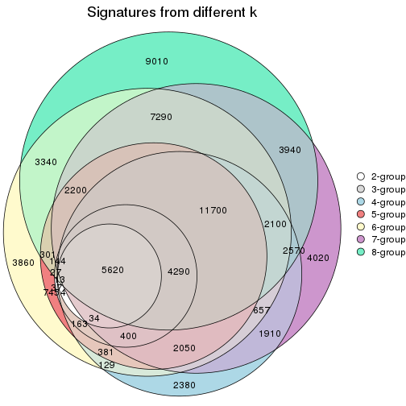

`get_signature()` returns a data frame invisibly. To get the list of signatures, the function
call should be assigned to a variable explicitly. In following code, if `plot` argument is set
to `FALSE`, no heatmap is plotted while only the differential analysis is performed.

```r
# code only for demonstration
tb = get_signature(res, k = ..., plot = FALSE)
```

An example of the output of `tb` is:

```
#>   which_row         fdr    mean_1    mean_2 scaled_mean_1 scaled_mean_2 km
#> 1        38 0.042760348  8.373488  9.131774    -0.5533452     0.5164555  1
#> 2        40 0.018707592  7.106213  8.469186    -0.6173731     0.5762149  1
#> 3        55 0.019134737 10.221463 11.207825    -0.6159697     0.5749050  1
#> 4        59 0.006059896  5.921854  7.869574    -0.6899429     0.6439467  1
#> 5        60 0.018055526  8.928898 10.211722    -0.6204761     0.5791110  1
#> 6        98 0.009384629 15.714769 14.887706     0.6635654    -0.6193277  2
...
```

The columns in `tb` are:

1. `which_row`: row indices corresponding to the input matrix.
2. `fdr`: FDR for the differential test. 
3. `mean_x`: The mean value in group x.
4. `scaled_mean_x`: The mean value in group x after rows are scaled.
5. `km`: Row groups if k-means clustering is applied to rows (which is done by automatically selecting number of clusters).

If there are too many signatures, `top_signatures = ...` can be set to only show the 
signatures with the highest FDRs:

```r
# code only for demonstration
# e.g. to show the top 500 most significant rows
tb = get_signature(res, k = ..., top_signatures = 500)
```

If the signatures are defined as these which are uniquely high in current group, `diff_method` argument
can be set to `"uniquely_high_in_one_group"`:

```r
# code only for demonstration
tb = get_signature(res, k = ..., diff_method = "uniquely_high_in_one_group")
```


UMAP plot which shows how samples are separated.


<script>
$( function() {
	$( '#tabs-node-022-dimension-reduction' ).tabs();
} );
</script>
<div id='tabs-node-022-dimension-reduction'>
<ul>
<li><a href='#tab-node-022-dimension-reduction-1'>k = 2</a></li>
<li><a href='#tab-node-022-dimension-reduction-2'>k = 3</a></li>
<li><a href='#tab-node-022-dimension-reduction-3'>k = 4</a></li>
<li><a href='#tab-node-022-dimension-reduction-4'>k = 5</a></li>
<li><a href='#tab-node-022-dimension-reduction-5'>k = 6</a></li>
<li><a href='#tab-node-022-dimension-reduction-6'>k = 7</a></li>
<li><a href='#tab-node-022-dimension-reduction-7'>k = 8</a></li>
</ul>
<div id='tab-node-022-dimension-reduction-1'>
<pre><code class="r">dimension_reduction(res, k = 2, method = &quot;UMAP&quot;)
</code></pre>

<p></p>

</div>
<div id='tab-node-022-dimension-reduction-2'>
<pre><code class="r">dimension_reduction(res, k = 3, method = &quot;UMAP&quot;)
</code></pre>

<p></p>

</div>
<div id='tab-node-022-dimension-reduction-3'>
<pre><code class="r">dimension_reduction(res, k = 4, method = &quot;UMAP&quot;)
</code></pre>

<p></p>

</div>
<div id='tab-node-022-dimension-reduction-4'>
<pre><code class="r">dimension_reduction(res, k = 5, method = &quot;UMAP&quot;)
</code></pre>

<p></p>

</div>
<div id='tab-node-022-dimension-reduction-5'>
<pre><code class="r">dimension_reduction(res, k = 6, method = &quot;UMAP&quot;)
</code></pre>

<p></p>

</div>
<div id='tab-node-022-dimension-reduction-6'>
<pre><code class="r">dimension_reduction(res, k = 7, method = &quot;UMAP&quot;)
</code></pre>

<p></p>

</div>
<div id='tab-node-022-dimension-reduction-7'>
<pre><code class="r">dimension_reduction(res, k = 8, method = &quot;UMAP&quot;)
</code></pre>

<p></p>

</div>
</div>


Following heatmap shows how subgroups are split when increasing `k`:

```r
collect_classes(res)
```


If matrix rows can be associated to genes, consider to use `functional_enrichment(res,
...)` to perform function enrichment for the signature genes. See [this vignette](https://jokergoo.github.io/cola_vignettes/functional_enrichment.html) for more detailed explanations.


 

---------------------------------------------------


### Node0221


Parent node: [Node022](#Node022).
Child nodes: 
                Node01111-leaf
        ,
                Node01112-leaf
        ,
                Node01121-leaf
        ,
                Node01122-leaf
        ,
                Node01123-leaf
        ,
                Node01124-leaf
        ,
                Node01211-leaf
        ,
                Node01212-leaf
        ,
                Node01213-leaf
        ,
                Node01321-leaf
        ,
                Node01322-leaf
        ,
                Node01323-leaf
        ,
                Node01324-leaf
        ,
                Node02131-leaf
        ,
                Node02132-leaf
        ,
                Node02211-leaf
        ,
                Node02212-leaf
        ,
                Node02221-leaf
        ,
                [Node02222](#Node02222)
        ,
                Node02223-leaf
        ,
                Node02311-leaf
        ,
                Node02312-leaf
        ,
                Node03311-leaf
        ,
                Node03312-leaf
        ,
                Node03313-leaf
        ,
                Node03321-leaf
        ,
                Node03322-leaf
        ,
                Node03323-leaf
        .


The object with results only for a single top-value method and a single partitioning method 
can be extracted as:

```r
res = res_rh["0221"]
```

A summary of `res` and all the functions that can be applied to it:

```r
res
```

```
#> A 'ConsensusPartition' object with k = 2, 3, 4, 5, 6, 7, 8.
#>   On a matrix with 30000 rows and 16 columns.
#>   Top rows (1000) are extracted by 'ATC' method.
#>   Subgroups are detected by 'kmeans' method.
#>   Performed in total 350 partitions by row resampling.
#>   Best k for subgroups seems to be 2.
#> 
#> Following methods can be applied to this 'ConsensusPartition' object:
#>  [1] "cola_report"             "collect_classes"         "collect_plots"          
#>  [4] "collect_stats"           "colnames"                "compare_partitions"     
#>  [7] "compare_signatures"      "consensus_heatmap"       "dimension_reduction"    
#> [10] "functional_enrichment"   "get_anno_col"            "get_anno"               
#> [13] "get_classes"             "get_consensus"           "get_matrix"             
#> [16] "get_membership"          "get_param"               "get_signatures"         
#> [19] "get_stats"               "is_best_k"               "is_stable_k"            
#> [22] "membership_heatmap"      "ncol"                    "nrow"                   
#> [25] "plot_ecdf"               "predict_classes"         "rownames"               
#> [28] "select_partition_number" "show"                    "suggest_best_k"         
#> [31] "test_to_known_factors"   "top_rows_heatmap"
```

`collect_plots()` function collects all the plots made from `res` for all `k` (number of subgroups)
into one single page to provide an easy and fast comparison between different `k`.

```r
collect_plots(res)
```


The plots are:

- The first row: a plot of the eCDF (empirical cumulative distribution
  function) curves of the consensus matrix for each `k` and the heatmap of
  predicted classes for each `k`.
- The second row: heatmaps of the consensus matrix for each `k`.
- The third row: heatmaps of the membership matrix for each `k`.
- The fouth row: heatmaps of the signatures for each `k`.

All the plots in panels can be made by individual functions and they are
plotted later in this section.

`select_partition_number()` produces several plots showing different
statistics for choosing "optimized" `k`. There are following statistics:

- eCDF curves of the consensus matrix for each `k`;
- 1-PAC. [The PAC score](https://en.wikipedia.org/wiki/Consensus_clustering#Over-interpretation_potential_of_consensus_clustering)
  measures the proportion of the ambiguous subgrouping.
- Mean silhouette score.
- Concordance. The mean probability of fiting the consensus subgroup labels in all
  partitions.
- Area increased. Denote $A_k$ as the area under the eCDF curve for current
  `k`, the area increased is defined as $A_k - A_{k-1}$.
- Rand index. The percent of pairs of samples that are both in a same cluster
  or both are not in a same cluster in the partition of k and k-1.
- Jaccard index. The ratio of pairs of samples are both in a same cluster in
  the partition of k and k-1 and the pairs of samples are both in a same
  cluster in the partition k or k-1.

The detailed explanations of these statistics can be found in [the _cola_
vignette](https://jokergoo.github.io/cola_vignettes/cola.html#toc_13).

Generally speaking, higher 1-PAC score, higher mean silhouette score or higher
concordance corresponds to better partition. Rand index and Jaccard index
measure how similar the current partition is compared to partition with `k-1`.
If they are too similar, we won't accept `k` is better than `k-1`.

```r
select_partition_number(res)
```


The numeric values for all these statistics can be obtained by `get_stats()`.

```r
get_stats(res)
```

```
#>   k 1-PAC mean_silhouette concordance area_increased  Rand Jaccard
#> 2 2 1.000           1.000       1.000         0.5005 0.500   0.500
#> 3 3 0.675           0.881       0.605         0.2900 0.792   0.583
#> 4 4 0.650           0.446       0.681         0.1172 0.750   0.348
#> 5 5 0.608           0.763       0.851         0.0753 0.933   0.733
#> 6 6 0.692           0.448       0.776         0.0688 0.992   0.960
#> 7 7 0.783           0.604       0.787         0.0450 0.892   0.480
#> 8 8 0.792           0.504       0.684         0.0237 0.942   0.562
```

`suggest_best_k()` suggests the best $k$ based on these statistics. The rules are as follows:

- All $k$ with Jaccard index larger than 0.95 are removed because increasing
  $k$ does not provide enough extra information. If all $k$ are removed, it is
  marked as no subgroup is detected.
- For all $k$ with 1-PAC score larger than 0.9, the maximal $k$ is taken as
  the best $k$, and other $k$ are marked as optional $k$.
- If it does not fit the second rule. The $k$ with the maximal vote of the
  highest 1-PAC score, highest mean silhouette, and highest concordance is
  taken as the best $k$.

```r
suggest_best_k(res)
```

```
#> [1] 2
```


Following is the table of the partitions (You need to click the **show/hide
code output** link to see it). The membership matrix (columns with name `p*`)
is inferred by
[`clue::cl_consensus()`](https://www.rdocumentation.org/link/cl_consensus?package=clue)
function with the `SE` method. Basically the value in the membership matrix
represents the probability to belong to a certain group. The finall subgroup
label for an item is determined with the group with highest probability it
belongs to.

In `get_classes()` function, the entropy is calculated from the membership
matrix and the silhouette score is calculated from the consensus matrix.


<script>
$( function() {
	$( '#tabs-node-0221-get-classes' ).tabs();
} );
</script>
<div id='tabs-node-0221-get-classes'>
<ul>
<li><a href='#tab-node-0221-get-classes-1'>k = 2</a></li>
<li><a href='#tab-node-0221-get-classes-2'>k = 3</a></li>
<li><a href='#tab-node-0221-get-classes-3'>k = 4</a></li>
<li><a href='#tab-node-0221-get-classes-4'>k = 5</a></li>
<li><a href='#tab-node-0221-get-classes-5'>k = 6</a></li>
<li><a href='#tab-node-0221-get-classes-6'>k = 7</a></li>
<li><a href='#tab-node-0221-get-classes-7'>k = 8</a></li>
</ul>

<div id='tab-node-0221-get-classes-1'>
<p><a id='tab-node-0221-get-classes-1-a' style='color:#0366d6' href='#'>show/hide code output</a></p>
<pre><code class="r">cbind(get_classes(res, k = 2), get_membership(res, k = 2))
</code></pre>

<pre><code>#&gt;                 class entropy silhouette p1 p2
#&gt; TCGA.GD.A3OP.01     1       0          1  1  0
#&gt; TCGA.FD.A5BU.01     2       0          1  0  1
#&gt; TCGA.DK.A2I2.01     2       0          1  0  1
#&gt; TCGA.XF.A9SI.01     1       0          1  1  0
#&gt; TCGA.FD.A3B3.01     2       0          1  0  1
#&gt; TCGA.FD.A6TF.01     1       0          1  1  0
#&gt; TCGA.BT.A20U.11     1       0          1  1  0
#&gt; TCGA.DK.A1AB.01     1       0          1  1  0
#&gt; TCGA.ZF.A9RG.01     1       0          1  1  0
#&gt; TCGA.GC.A3WC.01     2       0          1  0  1
#&gt; TCGA.XF.A9SY.01     1       0          1  1  0
#&gt; TCGA.GD.A2C5.11     2       0          1  0  1
#&gt; TCGA.ZF.AA58.01     1       0          1  1  0
#&gt; TCGA.GC.A6I3.11     1       0          1  1  0
#&gt; TCGA.PQ.A6FN.01     1       0          1  1  0
#&gt; TCGA.BL.A13I.01     2       0          1  0  1
</code></pre>

<script>
$('#tab-node-0221-get-classes-1-a').parent().next().next().hide();
$('#tab-node-0221-get-classes-1-a').click(function(){
  $('#tab-node-0221-get-classes-1-a').parent().next().next().toggle();
  return(false);
});
</script>
</div>

<div id='tab-node-0221-get-classes-2'>
<p><a id='tab-node-0221-get-classes-2-a' style='color:#0366d6' href='#'>show/hide code output</a></p>
<pre><code class="r">cbind(get_classes(res, k = 3), get_membership(res, k = 3))
</code></pre>

<pre><code>#&gt;                 class entropy silhouette   p1   p2   p3
#&gt; TCGA.GD.A3OP.01     1   0.624      1.000 0.56 0.00 0.44
#&gt; TCGA.FD.A5BU.01     2   0.595      0.868 0.36 0.64 0.00
#&gt; TCGA.DK.A2I2.01     2   0.000      0.749 0.00 1.00 0.00
#&gt; TCGA.XF.A9SI.01     3   0.000      0.866 0.00 0.00 1.00
#&gt; TCGA.FD.A3B3.01     2   0.613      0.873 0.40 0.60 0.00
#&gt; TCGA.FD.A6TF.01     1   0.624      1.000 0.56 0.00 0.44
#&gt; TCGA.BT.A20U.11     3   0.000      0.866 0.00 0.00 1.00
#&gt; TCGA.DK.A1AB.01     1   0.624      1.000 0.56 0.00 0.44
#&gt; TCGA.ZF.A9RG.01     1   0.624      1.000 0.56 0.00 0.44
#&gt; TCGA.GC.A3WC.01     2   0.000      0.749 0.00 1.00 0.00
#&gt; TCGA.XF.A9SY.01     3   0.254      0.779 0.08 0.00 0.92
#&gt; TCGA.GD.A2C5.11     2   0.613      0.873 0.40 0.60 0.00
#&gt; TCGA.ZF.AA58.01     1   0.624      1.000 0.56 0.00 0.44
#&gt; TCGA.GC.A6I3.11     3   0.296      0.803 0.10 0.00 0.90
#&gt; TCGA.PQ.A6FN.01     3   0.296      0.803 0.10 0.00 0.90
#&gt; TCGA.BL.A13I.01     2   0.613      0.873 0.40 0.60 0.00
</code></pre>

<script>
$('#tab-node-0221-get-classes-2-a').parent().next().next().hide();
$('#tab-node-0221-get-classes-2-a').click(function(){
  $('#tab-node-0221-get-classes-2-a').parent().next().next().toggle();
  return(false);
});
</script>
</div>

<div id='tab-node-0221-get-classes-3'>
<p><a id='tab-node-0221-get-classes-3-a' style='color:#0366d6' href='#'>show/hide code output</a></p>
<pre><code class="r">cbind(get_classes(res, k = 4), get_membership(res, k = 4))
</code></pre>

<pre><code>#&gt;                 class entropy silhouette   p1   p2   p3   p4
#&gt; TCGA.GD.A3OP.01     1   0.361      1.000 0.80 0.00 0.20 0.00
#&gt; TCGA.FD.A5BU.01     2   0.499     -0.398 0.00 0.52 0.00 0.48
#&gt; TCGA.DK.A2I2.01     2   0.201      0.546 0.08 0.92 0.00 0.00
#&gt; TCGA.XF.A9SI.01     3   0.000      0.697 0.00 0.00 1.00 0.00
#&gt; TCGA.FD.A3B3.01     4   0.495      0.143 0.00 0.44 0.00 0.56
#&gt; TCGA.FD.A6TF.01     1   0.361      1.000 0.80 0.00 0.20 0.00
#&gt; TCGA.BT.A20U.11     3   0.000      0.697 0.00 0.00 1.00 0.00
#&gt; TCGA.DK.A1AB.01     1   0.361      1.000 0.80 0.00 0.20 0.00
#&gt; TCGA.ZF.A9RG.01     3   0.491      0.227 0.42 0.00 0.58 0.00
#&gt; TCGA.GC.A3WC.01     2   0.000      0.555 0.00 1.00 0.00 0.00
#&gt; TCGA.XF.A9SY.01     4   0.704     -0.277 0.12 0.00 0.42 0.46
#&gt; TCGA.GD.A2C5.11     4   0.495      0.143 0.00 0.44 0.00 0.56
#&gt; TCGA.ZF.AA58.01     3   0.491      0.227 0.42 0.00 0.58 0.00
#&gt; TCGA.GC.A6I3.11     3   0.234      0.720 0.10 0.00 0.90 0.00
#&gt; TCGA.PQ.A6FN.01     3   0.234      0.720 0.10 0.00 0.90 0.00
#&gt; TCGA.BL.A13I.01     4   0.495      0.143 0.00 0.44 0.00 0.56
</code></pre>

<script>
$('#tab-node-0221-get-classes-3-a').parent().next().next().hide();
$('#tab-node-0221-get-classes-3-a').click(function(){
  $('#tab-node-0221-get-classes-3-a').parent().next().next().toggle();
  return(false);
});
</script>
</div>

<div id='tab-node-0221-get-classes-4'>
<p><a id='tab-node-0221-get-classes-4-a' style='color:#0366d6' href='#'>show/hide code output</a></p>
<pre><code class="r">cbind(get_classes(res, k = 5), get_membership(res, k = 5))
</code></pre>

<pre><code>#&gt;                 class entropy silhouette   p1   p2   p3   p4   p5
#&gt; TCGA.GD.A3OP.01     1  0.2020      0.915 0.90 0.00 0.10 0.00 0.00
#&gt; TCGA.FD.A5BU.01     4  0.3697      0.716 0.10 0.08 0.00 0.82 0.00
#&gt; TCGA.DK.A2I2.01     2  0.5487      0.810 0.00 0.62 0.00 0.28 0.10
#&gt; TCGA.XF.A9SI.01     3  0.0000      0.794 0.00 0.00 1.00 0.00 0.00
#&gt; TCGA.FD.A3B3.01     4  0.0000      0.918 0.00 0.00 0.00 1.00 0.00
#&gt; TCGA.FD.A6TF.01     1  0.2020      0.915 0.90 0.00 0.10 0.00 0.00
#&gt; TCGA.BT.A20U.11     3  0.2929      0.655 0.00 0.18 0.82 0.00 0.00
#&gt; TCGA.DK.A1AB.01     1  0.5295      0.819 0.74 0.10 0.10 0.00 0.06
#&gt; TCGA.ZF.A9RG.01     3  0.4588      0.711 0.22 0.06 0.72 0.00 0.00
#&gt; TCGA.GC.A3WC.01     2  0.5245      0.803 0.08 0.64 0.00 0.28 0.00
#&gt; TCGA.XF.A9SY.01     5  0.2732      0.000 0.00 0.00 0.16 0.00 0.84
#&gt; TCGA.GD.A2C5.11     4  0.0000      0.918 0.00 0.00 0.00 1.00 0.00
#&gt; TCGA.ZF.AA58.01     3  0.4588      0.711 0.22 0.06 0.72 0.00 0.00
#&gt; TCGA.GC.A6I3.11     3  0.2012      0.805 0.02 0.06 0.92 0.00 0.00
#&gt; TCGA.PQ.A6FN.01     3  0.0609      0.805 0.02 0.00 0.98 0.00 0.00
#&gt; TCGA.BL.A13I.01     4  0.0000      0.918 0.00 0.00 0.00 1.00 0.00
</code></pre>

<script>
$('#tab-node-0221-get-classes-4-a').parent().next().next().hide();
$('#tab-node-0221-get-classes-4-a').click(function(){
  $('#tab-node-0221-get-classes-4-a').parent().next().next().toggle();
  return(false);
});
</script>
</div>

<div id='tab-node-0221-get-classes-5'>
<p><a id='tab-node-0221-get-classes-5-a' style='color:#0366d6' href='#'>show/hide code output</a></p>
<pre><code class="r">cbind(get_classes(res, k = 6), get_membership(res, k = 6))
</code></pre>

<pre><code>#&gt;                 class entropy silhouette   p1   p2   p3   p4   p5   p6
#&gt; TCGA.GD.A3OP.01     1  0.0547     0.8890 0.98 0.00 0.02 0.00 0.00 0.00
#&gt; TCGA.FD.A5BU.01     4  0.4328    -0.0611 0.02 0.00 0.00 0.52 0.00 0.46
#&gt; TCGA.DK.A2I2.01     2  0.5555     0.0000 0.00 0.48 0.00 0.14 0.00 0.38
#&gt; TCGA.XF.A9SI.01     3  0.3409     0.5225 0.00 0.30 0.70 0.00 0.00 0.00
#&gt; TCGA.FD.A3B3.01     4  0.0000     0.7677 0.00 0.00 0.00 1.00 0.00 0.00
#&gt; TCGA.FD.A6TF.01     1  0.0547     0.8890 0.98 0.00 0.02 0.00 0.00 0.00
#&gt; TCGA.BT.A20U.11     3  0.4282     0.4001 0.00 0.42 0.56 0.00 0.02 0.00
#&gt; TCGA.DK.A1AB.01     1  0.4502     0.7602 0.74 0.10 0.02 0.00 0.00 0.14
#&gt; TCGA.ZF.A9RG.01     3  0.3706     0.2200 0.38 0.00 0.62 0.00 0.00 0.00
#&gt; TCGA.GC.A3WC.01     6  0.2260     0.0000 0.00 0.00 0.00 0.14 0.00 0.86
#&gt; TCGA.XF.A9SY.01     5  0.1814     0.0000 0.00 0.00 0.10 0.00 0.90 0.00
#&gt; TCGA.GD.A2C5.11     4  0.0000     0.7677 0.00 0.00 0.00 1.00 0.00 0.00
#&gt; TCGA.ZF.AA58.01     3  0.3706     0.2200 0.38 0.00 0.62 0.00 0.00 0.00
#&gt; TCGA.GC.A6I3.11     3  0.0937     0.5190 0.04 0.00 0.96 0.00 0.00 0.00
#&gt; TCGA.PQ.A6FN.01     3  0.4265     0.5466 0.04 0.30 0.66 0.00 0.00 0.00
#&gt; TCGA.BL.A13I.01     4  0.1814     0.7350 0.00 0.00 0.00 0.90 0.10 0.00
</code></pre>

<script>
$('#tab-node-0221-get-classes-5-a').parent().next().next().hide();
$('#tab-node-0221-get-classes-5-a').click(function(){
  $('#tab-node-0221-get-classes-5-a').parent().next().next().toggle();
  return(false);
});
</script>
</div>

<div id='tab-node-0221-get-classes-6'>
<p><a id='tab-node-0221-get-classes-6-a' style='color:#0366d6' href='#'>show/hide code output</a></p>
<pre><code class="r">cbind(get_classes(res, k = 7), get_membership(res, k = 7))
</code></pre>

<pre><code>#&gt;                 class entropy silhouette   p1   p2   p3   p4   p5   p6   p7
#&gt; TCGA.GD.A3OP.01     1   0.000      0.820 1.00 0.00 0.00 0.00 0.00 0.00 0.00
#&gt; TCGA.FD.A5BU.01     6   0.458      0.398 0.00 0.00 0.04 0.36 0.02 0.58 0.00
#&gt; TCGA.DK.A2I2.01     2   0.419      0.000 0.00 0.64 0.00 0.06 0.00 0.30 0.00
#&gt; TCGA.XF.A9SI.01     3   0.356      0.729 0.00 0.00 0.52 0.00 0.00 0.00 0.48
#&gt; TCGA.FD.A3B3.01     4   0.000      0.902 0.00 0.00 0.00 1.00 0.00 0.00 0.00
#&gt; TCGA.FD.A6TF.01     1   0.000      0.820 1.00 0.00 0.00 0.00 0.00 0.00 0.00
#&gt; TCGA.BT.A20U.11     3   0.496      0.533 0.00 0.06 0.64 0.00 0.00 0.06 0.24
#&gt; TCGA.DK.A1AB.01     1   0.465      0.599 0.62 0.30 0.06 0.00 0.02 0.00 0.00
#&gt; TCGA.ZF.A9RG.01     7   0.226      0.820 0.16 0.00 0.00 0.00 0.00 0.00 0.84
#&gt; TCGA.GC.A3WC.01     6   0.117      0.268 0.00 0.00 0.00 0.06 0.00 0.94 0.00
#&gt; TCGA.XF.A9SY.01     5   0.101      0.000 0.00 0.00 0.02 0.00 0.96 0.00 0.02
#&gt; TCGA.GD.A2C5.11     4   0.000      0.902 0.00 0.00 0.00 1.00 0.00 0.00 0.00
#&gt; TCGA.ZF.AA58.01     7   0.226      0.820 0.16 0.00 0.00 0.00 0.00 0.00 0.84
#&gt; TCGA.GC.A6I3.11     7   0.117      0.539 0.00 0.00 0.06 0.00 0.00 0.00 0.94
#&gt; TCGA.PQ.A6FN.01     3   0.356      0.729 0.00 0.00 0.52 0.00 0.00 0.00 0.48
#&gt; TCGA.BL.A13I.01     4   0.242      0.793 0.00 0.00 0.18 0.82 0.00 0.00 0.00
</code></pre>

<script>
$('#tab-node-0221-get-classes-6-a').parent().next().next().hide();
$('#tab-node-0221-get-classes-6-a').click(function(){
  $('#tab-node-0221-get-classes-6-a').parent().next().next().toggle();
  return(false);
});
</script>
</div>

<div id='tab-node-0221-get-classes-7'>
<p><a id='tab-node-0221-get-classes-7-a' style='color:#0366d6' href='#'>show/hide code output</a></p>
<pre><code class="r">cbind(get_classes(res, k = 8), get_membership(res, k = 8))
</code></pre>

<pre><code>#&gt;                 class entropy silhouette   p1   p2   p3   p4   p5   p6   p7   p8
#&gt; TCGA.GD.A3OP.01     1  0.0000     1.0000 1.00 0.00 0.00 0.00 0.00 0.00 0.00 0.00
#&gt; TCGA.FD.A5BU.01     6  0.3083     0.3360 0.00 0.00 0.00 0.34 0.00 0.66 0.00 0.00
#&gt; TCGA.DK.A2I2.01     2  0.1341     0.0000 0.00 0.92 0.00 0.08 0.00 0.00 0.00 0.00
#&gt; TCGA.XF.A9SI.01     3  0.0000     0.5836 0.00 0.00 1.00 0.00 0.00 0.00 0.00 0.00
#&gt; TCGA.FD.A3B3.01     4  0.0808     0.7901 0.00 0.00 0.00 0.96 0.00 0.00 0.00 0.04
#&gt; TCGA.FD.A6TF.01     1  0.0000     1.0000 1.00 0.00 0.00 0.00 0.00 0.00 0.00 0.00
#&gt; TCGA.BT.A20U.11     3  0.5723     0.2773 0.00 0.00 0.44 0.00 0.00 0.34 0.06 0.16
#&gt; TCGA.DK.A1AB.01     8  0.3237     0.0000 0.40 0.00 0.00 0.00 0.00 0.00 0.00 0.60
#&gt; TCGA.ZF.A9RG.01     7  0.4213     1.0000 0.16 0.00 0.18 0.00 0.00 0.00 0.66 0.00
#&gt; TCGA.GC.A3WC.01     6  0.6569     0.2274 0.00 0.26 0.00 0.08 0.02 0.48 0.04 0.12
#&gt; TCGA.XF.A9SY.01     5  0.0471     0.0000 0.00 0.00 0.02 0.00 0.98 0.00 0.00 0.00
#&gt; TCGA.GD.A2C5.11     4  0.0000     0.7901 0.00 0.00 0.00 1.00 0.00 0.00 0.00 0.00
#&gt; TCGA.ZF.AA58.01     7  0.4213     1.0000 0.16 0.00 0.18 0.00 0.00 0.00 0.66 0.00
#&gt; TCGA.GC.A6I3.11     3  0.3237    -0.0966 0.00 0.00 0.60 0.00 0.00 0.00 0.40 0.00
#&gt; TCGA.PQ.A6FN.01     3  0.1804     0.5810 0.00 0.08 0.90 0.00 0.00 0.00 0.00 0.02
#&gt; TCGA.BL.A13I.01     4  0.4073     0.5830 0.00 0.00 0.00 0.66 0.00 0.00 0.24 0.10
</code></pre>

<script>
$('#tab-node-0221-get-classes-7-a').parent().next().next().hide();
$('#tab-node-0221-get-classes-7-a').click(function(){
  $('#tab-node-0221-get-classes-7-a').parent().next().next().toggle();
  return(false);
});
</script>
</div>
</div>

Heatmaps for the consensus matrix. It visualizes the probability of two
samples to be in a same group.


<script>
$( function() {
	$( '#tabs-node-0221-consensus-heatmap' ).tabs();
} );
</script>
<div id='tabs-node-0221-consensus-heatmap'>
<ul>
<li><a href='#tab-node-0221-consensus-heatmap-1'>k = 2</a></li>
<li><a href='#tab-node-0221-consensus-heatmap-2'>k = 3</a></li>
<li><a href='#tab-node-0221-consensus-heatmap-3'>k = 4</a></li>
<li><a href='#tab-node-0221-consensus-heatmap-4'>k = 5</a></li>
<li><a href='#tab-node-0221-consensus-heatmap-5'>k = 6</a></li>
<li><a href='#tab-node-0221-consensus-heatmap-6'>k = 7</a></li>
<li><a href='#tab-node-0221-consensus-heatmap-7'>k = 8</a></li>
</ul>
<div id='tab-node-0221-consensus-heatmap-1'>
<pre><code class="r">consensus_heatmap(res, k = 2)
</code></pre>

<p></p>

</div>
<div id='tab-node-0221-consensus-heatmap-2'>
<pre><code class="r">consensus_heatmap(res, k = 3)
</code></pre>

<p></p>

</div>
<div id='tab-node-0221-consensus-heatmap-3'>
<pre><code class="r">consensus_heatmap(res, k = 4)
</code></pre>

<p></p>

</div>
<div id='tab-node-0221-consensus-heatmap-4'>
<pre><code class="r">consensus_heatmap(res, k = 5)
</code></pre>

<p></p>

</div>
<div id='tab-node-0221-consensus-heatmap-5'>
<pre><code class="r">consensus_heatmap(res, k = 6)
</code></pre>

<p></p>

</div>
<div id='tab-node-0221-consensus-heatmap-6'>
<pre><code class="r">consensus_heatmap(res, k = 7)
</code></pre>

<p></p>

</div>
<div id='tab-node-0221-consensus-heatmap-7'>
<pre><code class="r">consensus_heatmap(res, k = 8)
</code></pre>

<p></p>

</div>
</div>

Heatmaps for the membership of samples in all partitions to see how consistent they are:


<script>
$( function() {
	$( '#tabs-node-0221-membership-heatmap' ).tabs();
} );
</script>
<div id='tabs-node-0221-membership-heatmap'>
<ul>
<li><a href='#tab-node-0221-membership-heatmap-1'>k = 2</a></li>
<li><a href='#tab-node-0221-membership-heatmap-2'>k = 3</a></li>
<li><a href='#tab-node-0221-membership-heatmap-3'>k = 4</a></li>
<li><a href='#tab-node-0221-membership-heatmap-4'>k = 5</a></li>
<li><a href='#tab-node-0221-membership-heatmap-5'>k = 6</a></li>
<li><a href='#tab-node-0221-membership-heatmap-6'>k = 7</a></li>
<li><a href='#tab-node-0221-membership-heatmap-7'>k = 8</a></li>
</ul>
<div id='tab-node-0221-membership-heatmap-1'>
<pre><code class="r">membership_heatmap(res, k = 2)
</code></pre>

<p></p>

</div>
<div id='tab-node-0221-membership-heatmap-2'>
<pre><code class="r">membership_heatmap(res, k = 3)
</code></pre>

<p>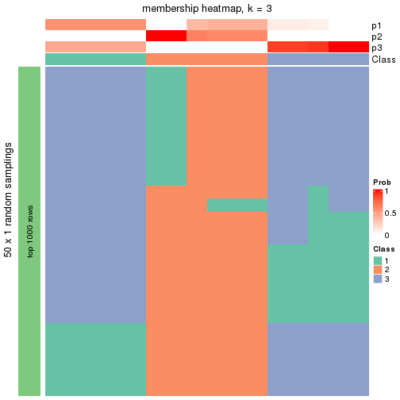</p>

</div>
<div id='tab-node-0221-membership-heatmap-3'>
<pre><code class="r">membership_heatmap(res, k = 4)
</code></pre>

<p></p>

</div>
<div id='tab-node-0221-membership-heatmap-4'>
<pre><code class="r">membership_heatmap(res, k = 5)
</code></pre>

<p></p>

</div>
<div id='tab-node-0221-membership-heatmap-5'>
<pre><code class="r">membership_heatmap(res, k = 6)
</code></pre>

<p></p>

</div>
<div id='tab-node-0221-membership-heatmap-6'>
<pre><code class="r">membership_heatmap(res, k = 7)
</code></pre>

<p></p>

</div>
<div id='tab-node-0221-membership-heatmap-7'>
<pre><code class="r">membership_heatmap(res, k = 8)
</code></pre>

<p></p>

</div>
</div>

As soon as the classes for columns are determined, the signatures
that are significantly different between subgroups can be looked for. 
Following are the heatmaps for signatures.


<script>
$( function() {
	$( '#tabs-node-0221-get-signatures' ).tabs();
} );
</script>
<div id='tabs-node-0221-get-signatures'>
<ul>
<li><a href='#tab-node-0221-get-signatures-1'>k = 2</a></li>
<li><a href='#tab-node-0221-get-signatures-2'>k = 3</a></li>
<li><a href='#tab-node-0221-get-signatures-3'>k = 4</a></li>
<li><a href='#tab-node-0221-get-signatures-4'>k = 5</a></li>
<li><a href='#tab-node-0221-get-signatures-5'>k = 6</a></li>
<li><a href='#tab-node-0221-get-signatures-6'>k = 7</a></li>
<li><a href='#tab-node-0221-get-signatures-7'>k = 8</a></li>
</ul>
<div id='tab-node-0221-get-signatures-1'>
<pre><code class="r">get_signatures(res, k = 2)
</code></pre>

<p></p>

</div>
<div id='tab-node-0221-get-signatures-2'>
<pre><code class="r">get_signatures(res, k = 3)
</code></pre>

<p></p>

</div>
<div id='tab-node-0221-get-signatures-3'>
<pre><code class="r">get_signatures(res, k = 4)
</code></pre>

<p></p>

</div>
<div id='tab-node-0221-get-signatures-4'>
<pre><code class="r">get_signatures(res, k = 5)
</code></pre>

<p></p>

</div>
<div id='tab-node-0221-get-signatures-5'>
<pre><code class="r">get_signatures(res, k = 6)
</code></pre>

<p></p>

</div>
<div id='tab-node-0221-get-signatures-6'>
<pre><code class="r">get_signatures(res, k = 7)
</code></pre>

<p></p>

</div>
<div id='tab-node-0221-get-signatures-7'>
<pre><code class="r">get_signatures(res, k = 8)
</code></pre>

<p></p>

</div>
</div>


Compare the overlap of signatures from different k:

```r
compare_signatures(res)
```


`get_signature()` returns a data frame invisibly. To get the list of signatures, the function
call should be assigned to a variable explicitly. In following code, if `plot` argument is set
to `FALSE`, no heatmap is plotted while only the differential analysis is performed.

```r
# code only for demonstration
tb = get_signature(res, k = ..., plot = FALSE)
```

An example of the output of `tb` is:

```
#>   which_row         fdr    mean_1    mean_2 scaled_mean_1 scaled_mean_2 km
#> 1        38 0.042760348  8.373488  9.131774    -0.5533452     0.5164555  1
#> 2        40 0.018707592  7.106213  8.469186    -0.6173731     0.5762149  1
#> 3        55 0.019134737 10.221463 11.207825    -0.6159697     0.5749050  1
#> 4        59 0.006059896  5.921854  7.869574    -0.6899429     0.6439467  1
#> 5        60 0.018055526  8.928898 10.211722    -0.6204761     0.5791110  1
#> 6        98 0.009384629 15.714769 14.887706     0.6635654    -0.6193277  2
...
```

The columns in `tb` are:

1. `which_row`: row indices corresponding to the input matrix.
2. `fdr`: FDR for the differential test. 
3. `mean_x`: The mean value in group x.
4. `scaled_mean_x`: The mean value in group x after rows are scaled.
5. `km`: Row groups if k-means clustering is applied to rows (which is done by automatically selecting number of clusters).

If there are too many signatures, `top_signatures = ...` can be set to only show the 
signatures with the highest FDRs:

```r
# code only for demonstration
# e.g. to show the top 500 most significant rows
tb = get_signature(res, k = ..., top_signatures = 500)
```

If the signatures are defined as these which are uniquely high in current group, `diff_method` argument
can be set to `"uniquely_high_in_one_group"`:

```r
# code only for demonstration
tb = get_signature(res, k = ..., diff_method = "uniquely_high_in_one_group")
```


UMAP plot which shows how samples are separated.


<script>
$( function() {
	$( '#tabs-node-0221-dimension-reduction' ).tabs();
} );
</script>
<div id='tabs-node-0221-dimension-reduction'>
<ul>
<li><a href='#tab-node-0221-dimension-reduction-1'>k = 2</a></li>
<li><a href='#tab-node-0221-dimension-reduction-2'>k = 3</a></li>
<li><a href='#tab-node-0221-dimension-reduction-3'>k = 4</a></li>
<li><a href='#tab-node-0221-dimension-reduction-4'>k = 5</a></li>
<li><a href='#tab-node-0221-dimension-reduction-5'>k = 6</a></li>
<li><a href='#tab-node-0221-dimension-reduction-6'>k = 7</a></li>
<li><a href='#tab-node-0221-dimension-reduction-7'>k = 8</a></li>
</ul>
<div id='tab-node-0221-dimension-reduction-1'>
<pre><code class="r">dimension_reduction(res, k = 2, method = &quot;UMAP&quot;)
</code></pre>

<p></p>

</div>
<div id='tab-node-0221-dimension-reduction-2'>
<pre><code class="r">dimension_reduction(res, k = 3, method = &quot;UMAP&quot;)
</code></pre>

<p></p>

</div>
<div id='tab-node-0221-dimension-reduction-3'>
<pre><code class="r">dimension_reduction(res, k = 4, method = &quot;UMAP&quot;)
</code></pre>

<p></p>

</div>
<div id='tab-node-0221-dimension-reduction-4'>
<pre><code class="r">dimension_reduction(res, k = 5, method = &quot;UMAP&quot;)
</code></pre>

<p></p>

</div>
<div id='tab-node-0221-dimension-reduction-5'>
<pre><code class="r">dimension_reduction(res, k = 6, method = &quot;UMAP&quot;)
</code></pre>

<p></p>

</div>
<div id='tab-node-0221-dimension-reduction-6'>
<pre><code class="r">dimension_reduction(res, k = 7, method = &quot;UMAP&quot;)
</code></pre>

<p></p>

</div>
<div id='tab-node-0221-dimension-reduction-7'>
<pre><code class="r">dimension_reduction(res, k = 8, method = &quot;UMAP&quot;)
</code></pre>

<p></p>

</div>
</div>


Following heatmap shows how subgroups are split when increasing `k`:

```r
collect_classes(res)
```


If matrix rows can be associated to genes, consider to use `functional_enrichment(res,
...)` to perform function enrichment for the signature genes. See [this vignette](https://jokergoo.github.io/cola_vignettes/functional_enrichment.html) for more detailed explanations.


 

---------------------------------------------------


### Node0222


Parent node: [Node022](#Node022).
Child nodes: 
                Node01111-leaf
        ,
                Node01112-leaf
        ,
                Node01121-leaf
        ,
                Node01122-leaf
        ,
                Node01123-leaf
        ,
                Node01124-leaf
        ,
                Node01211-leaf
        ,
                Node01212-leaf
        ,
                Node01213-leaf
        ,
                Node01321-leaf
        ,
                Node01322-leaf
        ,
                Node01323-leaf
        ,
                Node01324-leaf
        ,
                Node02131-leaf
        ,
                Node02132-leaf
        ,
                Node02211-leaf
        ,
                Node02212-leaf
        ,
                Node02221-leaf
        ,
                [Node02222](#Node02222)
        ,
                Node02223-leaf
        ,
                Node02311-leaf
        ,
                Node02312-leaf
        ,
                Node03311-leaf
        ,
                Node03312-leaf
        ,
                Node03313-leaf
        ,
                Node03321-leaf
        ,
                Node03322-leaf
        ,
                Node03323-leaf
        .


The object with results only for a single top-value method and a single partitioning method 
can be extracted as:

```r
res = res_rh["0222"]
```

A summary of `res` and all the functions that can be applied to it:

```r
res
```

```
#> A 'ConsensusPartition' object with k = 2, 3, 4, 5, 6, 7, 8.
#>   On a matrix with 30000 rows and 43 columns.
#>   Top rows (1000) are extracted by 'ATC' method.
#>   Subgroups are detected by 'skmeans' method.
#>   Performed in total 350 partitions by row resampling.
#>   Best k for subgroups seems to be 3.
#> 
#> Following methods can be applied to this 'ConsensusPartition' object:
#>  [1] "cola_report"             "collect_classes"         "collect_plots"          
#>  [4] "collect_stats"           "colnames"                "compare_partitions"     
#>  [7] "compare_signatures"      "consensus_heatmap"       "dimension_reduction"    
#> [10] "functional_enrichment"   "get_anno_col"            "get_anno"               
#> [13] "get_classes"             "get_consensus"           "get_matrix"             
#> [16] "get_membership"          "get_param"               "get_signatures"         
#> [19] "get_stats"               "is_best_k"               "is_stable_k"            
#> [22] "membership_heatmap"      "ncol"                    "nrow"                   
#> [25] "plot_ecdf"               "predict_classes"         "rownames"               
#> [28] "select_partition_number" "show"                    "suggest_best_k"         
#> [31] "test_to_known_factors"   "top_rows_heatmap"
```

`collect_plots()` function collects all the plots made from `res` for all `k` (number of subgroups)
into one single page to provide an easy and fast comparison between different `k`.

```r
collect_plots(res)
```


The plots are:

- The first row: a plot of the eCDF (empirical cumulative distribution
  function) curves of the consensus matrix for each `k` and the heatmap of
  predicted classes for each `k`.
- The second row: heatmaps of the consensus matrix for each `k`.
- The third row: heatmaps of the membership matrix for each `k`.
- The fouth row: heatmaps of the signatures for each `k`.

All the plots in panels can be made by individual functions and they are
plotted later in this section.

`select_partition_number()` produces several plots showing different
statistics for choosing "optimized" `k`. There are following statistics:

- eCDF curves of the consensus matrix for each `k`;
- 1-PAC. [The PAC score](https://en.wikipedia.org/wiki/Consensus_clustering#Over-interpretation_potential_of_consensus_clustering)
  measures the proportion of the ambiguous subgrouping.
- Mean silhouette score.
- Concordance. The mean probability of fiting the consensus subgroup labels in all
  partitions.
- Area increased. Denote $A_k$ as the area under the eCDF curve for current
  `k`, the area increased is defined as $A_k - A_{k-1}$.
- Rand index. The percent of pairs of samples that are both in a same cluster
  or both are not in a same cluster in the partition of k and k-1.
- Jaccard index. The ratio of pairs of samples are both in a same cluster in
  the partition of k and k-1 and the pairs of samples are both in a same
  cluster in the partition k or k-1.

The detailed explanations of these statistics can be found in [the _cola_
vignette](https://jokergoo.github.io/cola_vignettes/cola.html#toc_13).

Generally speaking, higher 1-PAC score, higher mean silhouette score or higher
concordance corresponds to better partition. Rand index and Jaccard index
measure how similar the current partition is compared to partition with `k-1`.
If they are too similar, we won't accept `k` is better than `k-1`.

```r
select_partition_number(res)
```


The numeric values for all these statistics can be obtained by `get_stats()`.

```r
get_stats(res)
```

```
#>   k 1-PAC mean_silhouette concordance area_increased  Rand Jaccard
#> 2 2 1.000           1.000       1.000         0.4789 0.522   0.522
#> 3 3 1.000           0.957       0.982         0.4224 0.739   0.525
#> 4 4 0.876           0.905       0.943         0.0981 0.910   0.727
#> 5 5 0.849           0.731       0.874         0.0363 0.956   0.827
#> 6 6 0.894           0.852       0.939         0.0230 0.972   0.879
#> 7 7 0.822           0.756       0.862         0.0298 0.958   0.809
#> 8 8 0.785           0.602       0.822         0.0259 0.963   0.819
```

`suggest_best_k()` suggests the best $k$ based on these statistics. The rules are as follows:

- All $k$ with Jaccard index larger than 0.95 are removed because increasing
  $k$ does not provide enough extra information. If all $k$ are removed, it is
  marked as no subgroup is detected.
- For all $k$ with 1-PAC score larger than 0.9, the maximal $k$ is taken as
  the best $k$, and other $k$ are marked as optional $k$.
- If it does not fit the second rule. The $k$ with the maximal vote of the
  highest 1-PAC score, highest mean silhouette, and highest concordance is
  taken as the best $k$.

```r
suggest_best_k(res)
```

```
#> [1] 3
#> attr(,"optional")
#> [1] 2
```

There is also optional best $k$ = 2 that is worth to check.

Following is the table of the partitions (You need to click the **show/hide
code output** link to see it). The membership matrix (columns with name `p*`)
is inferred by
[`clue::cl_consensus()`](https://www.rdocumentation.org/link/cl_consensus?package=clue)
function with the `SE` method. Basically the value in the membership matrix
represents the probability to belong to a certain group. The finall subgroup
label for an item is determined with the group with highest probability it
belongs to.

In `get_classes()` function, the entropy is calculated from the membership
matrix and the silhouette score is calculated from the consensus matrix.


<script>
$( function() {
	$( '#tabs-node-0222-get-classes' ).tabs();
} );
</script>
<div id='tabs-node-0222-get-classes'>
<ul>
<li><a href='#tab-node-0222-get-classes-1'>k = 2</a></li>
<li><a href='#tab-node-0222-get-classes-2'>k = 3</a></li>
<li><a href='#tab-node-0222-get-classes-3'>k = 4</a></li>
<li><a href='#tab-node-0222-get-classes-4'>k = 5</a></li>
<li><a href='#tab-node-0222-get-classes-5'>k = 6</a></li>
<li><a href='#tab-node-0222-get-classes-6'>k = 7</a></li>
<li><a href='#tab-node-0222-get-classes-7'>k = 8</a></li>
</ul>

<div id='tab-node-0222-get-classes-1'>
<p><a id='tab-node-0222-get-classes-1-a' style='color:#0366d6' href='#'>show/hide code output</a></p>
<pre><code class="r">cbind(get_classes(res, k = 2), get_membership(res, k = 2))
</code></pre>

<pre><code>#&gt;                 class entropy silhouette p1 p2
#&gt; TCGA.4Z.AA86.01     1       0          1  1  0
#&gt; TCGA.GU.A42Q.01     1       0          1  1  0
#&gt; TCGA.DK.AA6X.01     2       0          1  0  1
#&gt; TCGA.GC.A3OO.01     2       0          1  0  1
#&gt; TCGA.4Z.AA7W.01     1       0          1  1  0
#&gt; TCGA.XF.A9SM.01     1       0          1  1  0
#&gt; TCGA.DK.A3IU.01     1       0          1  1  0
#&gt; TCGA.E7.A7XN.01     1       0          1  1  0
#&gt; TCGA.FD.A43Y.01     1       0          1  1  0
#&gt; TCGA.YC.A8S6.01     2       0          1  0  1
#&gt; TCGA.CU.A0YO.01     2       0          1  0  1
#&gt; TCGA.FD.A62P.01     2       0          1  0  1
#&gt; TCGA.DK.AA74.01     1       0          1  1  0
#&gt; TCGA.BT.A42F.01     1       0          1  1  0
#&gt; TCGA.DK.A3IQ.01     2       0          1  0  1
#&gt; TCGA.FD.A3B7.01     1       0          1  1  0
#&gt; TCGA.K4.A3WU.01     2       0          1  0  1
#&gt; TCGA.FD.A62N.01     1       0          1  1  0
#&gt; TCGA.UY.A9PB.01     1       0          1  1  0
#&gt; TCGA.GU.A766.01     1       0          1  1  0
#&gt; TCGA.FD.A6TB.01     1       0          1  1  0
#&gt; TCGA.XF.A9T8.01     1       0          1  1  0
#&gt; TCGA.G2.AA3D.01     2       0          1  0  1
#&gt; TCGA.BT.A20O.01     1       0          1  1  0
#&gt; TCGA.XF.A8HE.01     1       0          1  1  0
#&gt; TCGA.ZF.AA53.01     1       0          1  1  0
#&gt; TCGA.DK.AA6T.01     1       0          1  1  0
#&gt; TCGA.XF.AAMJ.01     2       0          1  0  1
#&gt; TCGA.FD.A5BT.01     1       0          1  1  0
#&gt; TCGA.SY.A9G0.01     2       0          1  0  1
#&gt; TCGA.K4.A4AC.01     1       0          1  1  0
#&gt; TCGA.FD.A43U.01     2       0          1  0  1
#&gt; TCGA.GU.A764.01     1       0          1  1  0
#&gt; TCGA.DK.A2I4.01     1       0          1  1  0
#&gt; TCGA.FD.A6TK.01     1       0          1  1  0
#&gt; TCGA.BT.A3PK.01     1       0          1  1  0
#&gt; TCGA.XF.A9SW.01     2       0          1  0  1
#&gt; TCGA.ZF.AA4W.01     1       0          1  1  0
#&gt; TCGA.UY.A9PA.01     2       0          1  0  1
#&gt; TCGA.R3.A69X.01     2       0          1  0  1
#&gt; TCGA.E7.A519.01     2       0          1  0  1
#&gt; TCGA.XF.AAMR.01     2       0          1  0  1
#&gt; TCGA.FD.A3SP.01     1       0          1  1  0
</code></pre>

<script>
$('#tab-node-0222-get-classes-1-a').parent().next().next().hide();
$('#tab-node-0222-get-classes-1-a').click(function(){
  $('#tab-node-0222-get-classes-1-a').parent().next().next().toggle();
  return(false);
});
</script>
</div>

<div id='tab-node-0222-get-classes-2'>
<p><a id='tab-node-0222-get-classes-2-a' style='color:#0366d6' href='#'>show/hide code output</a></p>
<pre><code class="r">cbind(get_classes(res, k = 3), get_membership(res, k = 3))
</code></pre>

<pre><code>#&gt;                 class entropy silhouette   p1   p2   p3
#&gt; TCGA.4Z.AA86.01     3  0.1529      0.964 0.04 0.00 0.96
#&gt; TCGA.GU.A42Q.01     1  0.2537      0.918 0.92 0.00 0.08
#&gt; TCGA.DK.AA6X.01     2  0.0000      0.965 0.00 1.00 0.00
#&gt; TCGA.GC.A3OO.01     2  0.0000      0.965 0.00 1.00 0.00
#&gt; TCGA.4Z.AA7W.01     1  0.0000      0.994 1.00 0.00 0.00
#&gt; TCGA.XF.A9SM.01     1  0.0000      0.994 1.00 0.00 0.00
#&gt; TCGA.DK.A3IU.01     3  0.1529      0.964 0.04 0.00 0.96
#&gt; TCGA.E7.A7XN.01     1  0.0000      0.994 1.00 0.00 0.00
#&gt; TCGA.FD.A43Y.01     3  0.0000      0.980 0.00 0.00 1.00
#&gt; TCGA.YC.A8S6.01     2  0.0000      0.965 0.00 1.00 0.00
#&gt; TCGA.CU.A0YO.01     2  0.0000      0.965 0.00 1.00 0.00
#&gt; TCGA.FD.A62P.01     3  0.2066      0.929 0.00 0.06 0.94
#&gt; TCGA.DK.AA74.01     3  0.0000      0.980 0.00 0.00 1.00
#&gt; TCGA.BT.A42F.01     1  0.0000      0.994 1.00 0.00 0.00
#&gt; TCGA.DK.A3IQ.01     2  0.0000      0.965 0.00 1.00 0.00
#&gt; TCGA.FD.A3B7.01     1  0.0000      0.994 1.00 0.00 0.00
#&gt; TCGA.K4.A3WU.01     2  0.0000      0.965 0.00 1.00 0.00
#&gt; TCGA.FD.A62N.01     3  0.0892      0.974 0.02 0.00 0.98
#&gt; TCGA.UY.A9PB.01     1  0.0000      0.994 1.00 0.00 0.00
#&gt; TCGA.GU.A766.01     3  0.0000      0.980 0.00 0.00 1.00
#&gt; TCGA.FD.A6TB.01     3  0.0000      0.980 0.00 0.00 1.00
#&gt; TCGA.XF.A9T8.01     1  0.0000      0.994 1.00 0.00 0.00
#&gt; TCGA.G2.AA3D.01     2  0.0000      0.965 0.00 1.00 0.00
#&gt; TCGA.BT.A20O.01     1  0.0000      0.994 1.00 0.00 0.00
#&gt; TCGA.XF.A8HE.01     1  0.0000      0.994 1.00 0.00 0.00
#&gt; TCGA.ZF.AA53.01     1  0.0000      0.994 1.00 0.00 0.00
#&gt; TCGA.DK.AA6T.01     3  0.2066      0.947 0.06 0.00 0.94
#&gt; TCGA.XF.AAMJ.01     2  0.0000      0.965 0.00 1.00 0.00
#&gt; TCGA.FD.A5BT.01     3  0.0000      0.980 0.00 0.00 1.00
#&gt; TCGA.SY.A9G0.01     2  0.0000      0.965 0.00 1.00 0.00
#&gt; TCGA.K4.A4AC.01     1  0.0000      0.994 1.00 0.00 0.00
#&gt; TCGA.FD.A43U.01     3  0.0000      0.980 0.00 0.00 1.00
#&gt; TCGA.GU.A764.01     3  0.1529      0.964 0.04 0.00 0.96
#&gt; TCGA.DK.A2I4.01     3  0.0000      0.980 0.00 0.00 1.00
#&gt; TCGA.FD.A6TK.01     3  0.0000      0.980 0.00 0.00 1.00
#&gt; TCGA.BT.A3PK.01     1  0.0000      0.994 1.00 0.00 0.00
#&gt; TCGA.XF.A9SW.01     2  0.0000      0.965 0.00 1.00 0.00
#&gt; TCGA.ZF.AA4W.01     1  0.0000      0.994 1.00 0.00 0.00
#&gt; TCGA.UY.A9PA.01     2  0.0000      0.965 0.00 1.00 0.00
#&gt; TCGA.R3.A69X.01     2  0.6244      0.213 0.00 0.56 0.44
#&gt; TCGA.E7.A519.01     2  0.0000      0.965 0.00 1.00 0.00
#&gt; TCGA.XF.AAMR.01     2  0.0000      0.965 0.00 1.00 0.00
#&gt; TCGA.FD.A3SP.01     3  0.0000      0.980 0.00 0.00 1.00
</code></pre>

<script>
$('#tab-node-0222-get-classes-2-a').parent().next().next().hide();
$('#tab-node-0222-get-classes-2-a').click(function(){
  $('#tab-node-0222-get-classes-2-a').parent().next().next().toggle();
  return(false);
});
</script>
</div>

<div id='tab-node-0222-get-classes-3'>
<p><a id='tab-node-0222-get-classes-3-a' style='color:#0366d6' href='#'>show/hide code output</a></p>
<pre><code class="r">cbind(get_classes(res, k = 4), get_membership(res, k = 4))
</code></pre>

<pre><code>#&gt;                 class entropy silhouette   p1   p2   p3   p4
#&gt; TCGA.4Z.AA86.01     3  0.0000      0.947 0.00 0.00 1.00 0.00
#&gt; TCGA.GU.A42Q.01     1  0.5784      0.623 0.70 0.00 0.10 0.20
#&gt; TCGA.DK.AA6X.01     4  0.4277      0.757 0.00 0.28 0.00 0.72
#&gt; TCGA.GC.A3OO.01     2  0.2647      0.869 0.00 0.88 0.00 0.12
#&gt; TCGA.4Z.AA7W.01     1  0.0000      0.975 1.00 0.00 0.00 0.00
#&gt; TCGA.XF.A9SM.01     1  0.0000      0.975 1.00 0.00 0.00 0.00
#&gt; TCGA.DK.A3IU.01     3  0.0000      0.947 0.00 0.00 1.00 0.00
#&gt; TCGA.E7.A7XN.01     1  0.0000      0.975 1.00 0.00 0.00 0.00
#&gt; TCGA.FD.A43Y.01     3  0.3610      0.813 0.00 0.00 0.80 0.20
#&gt; TCGA.YC.A8S6.01     4  0.3975      0.797 0.00 0.24 0.00 0.76
#&gt; TCGA.CU.A0YO.01     4  0.4134      0.782 0.00 0.26 0.00 0.74
#&gt; TCGA.FD.A62P.01     4  0.1211      0.774 0.00 0.00 0.04 0.96
#&gt; TCGA.DK.AA74.01     3  0.0000      0.947 0.00 0.00 1.00 0.00
#&gt; TCGA.BT.A42F.01     1  0.0000      0.975 1.00 0.00 0.00 0.00
#&gt; TCGA.DK.A3IQ.01     2  0.0000      0.946 0.00 1.00 0.00 0.00
#&gt; TCGA.FD.A3B7.01     1  0.0000      0.975 1.00 0.00 0.00 0.00
#&gt; TCGA.K4.A3WU.01     4  0.3975      0.797 0.00 0.24 0.00 0.76
#&gt; TCGA.FD.A62N.01     3  0.0000      0.947 0.00 0.00 1.00 0.00
#&gt; TCGA.UY.A9PB.01     1  0.0707      0.956 0.98 0.00 0.02 0.00
#&gt; TCGA.GU.A766.01     3  0.0000      0.947 0.00 0.00 1.00 0.00
#&gt; TCGA.FD.A6TB.01     3  0.0000      0.947 0.00 0.00 1.00 0.00
#&gt; TCGA.XF.A9T8.01     1  0.0000      0.975 1.00 0.00 0.00 0.00
#&gt; TCGA.G2.AA3D.01     2  0.0000      0.946 0.00 1.00 0.00 0.00
#&gt; TCGA.BT.A20O.01     1  0.0000      0.975 1.00 0.00 0.00 0.00
#&gt; TCGA.XF.A8HE.01     1  0.0000      0.975 1.00 0.00 0.00 0.00
#&gt; TCGA.ZF.AA53.01     1  0.0000      0.975 1.00 0.00 0.00 0.00
#&gt; TCGA.DK.AA6T.01     3  0.1211      0.919 0.00 0.00 0.96 0.04
#&gt; TCGA.XF.AAMJ.01     2  0.0000      0.946 0.00 1.00 0.00 0.00
#&gt; TCGA.FD.A5BT.01     3  0.0000      0.947 0.00 0.00 1.00 0.00
#&gt; TCGA.SY.A9G0.01     2  0.2345      0.887 0.00 0.90 0.00 0.10
#&gt; TCGA.K4.A4AC.01     1  0.0000      0.975 1.00 0.00 0.00 0.00
#&gt; TCGA.FD.A43U.01     4  0.1211      0.774 0.00 0.00 0.04 0.96
#&gt; TCGA.GU.A764.01     3  0.0000      0.947 0.00 0.00 1.00 0.00
#&gt; TCGA.DK.A2I4.01     3  0.0000      0.947 0.00 0.00 1.00 0.00
#&gt; TCGA.FD.A6TK.01     3  0.3610      0.813 0.00 0.00 0.80 0.20
#&gt; TCGA.BT.A3PK.01     1  0.0000      0.975 1.00 0.00 0.00 0.00
#&gt; TCGA.XF.A9SW.01     2  0.2647      0.869 0.00 0.88 0.00 0.12
#&gt; TCGA.ZF.AA4W.01     1  0.0000      0.975 1.00 0.00 0.00 0.00
#&gt; TCGA.UY.A9PA.01     2  0.0000      0.946 0.00 1.00 0.00 0.00
#&gt; TCGA.R3.A69X.01     4  0.1411      0.783 0.00 0.02 0.02 0.96
#&gt; TCGA.E7.A519.01     2  0.0000      0.946 0.00 1.00 0.00 0.00
#&gt; TCGA.XF.AAMR.01     2  0.0000      0.946 0.00 1.00 0.00 0.00
#&gt; TCGA.FD.A3SP.01     3  0.3610      0.813 0.00 0.00 0.80 0.20
</code></pre>

<script>
$('#tab-node-0222-get-classes-3-a').parent().next().next().hide();
$('#tab-node-0222-get-classes-3-a').click(function(){
  $('#tab-node-0222-get-classes-3-a').parent().next().next().toggle();
  return(false);
});
</script>
</div>

<div id='tab-node-0222-get-classes-4'>
<p><a id='tab-node-0222-get-classes-4-a' style='color:#0366d6' href='#'>show/hide code output</a></p>
<pre><code class="r">cbind(get_classes(res, k = 5), get_membership(res, k = 5))
</code></pre>

<pre><code>#&gt;                 class entropy silhouette   p1   p2   p3   p4   p5
#&gt; TCGA.4Z.AA86.01     3  0.0000      0.859 0.00 0.00 1.00 0.00 0.00
#&gt; TCGA.GU.A42Q.01     5  0.5783     -0.162 0.10 0.00 0.36 0.00 0.54
#&gt; TCGA.DK.AA6X.01     4  0.6723      0.622 0.00 0.28 0.00 0.42 0.30
#&gt; TCGA.GC.A3OO.01     2  0.2754      0.877 0.00 0.88 0.00 0.08 0.04
#&gt; TCGA.4Z.AA7W.01     1  0.0609      0.976 0.98 0.00 0.00 0.02 0.00
#&gt; TCGA.XF.A9SM.01     1  0.0609      0.976 0.98 0.00 0.00 0.02 0.00
#&gt; TCGA.DK.A3IU.01     3  0.0000      0.859 0.00 0.00 1.00 0.00 0.00
#&gt; TCGA.E7.A7XN.01     1  0.0609      0.976 0.98 0.00 0.00 0.02 0.00
#&gt; TCGA.FD.A43Y.01     5  0.4287     -0.320 0.00 0.00 0.46 0.00 0.54
#&gt; TCGA.YC.A8S6.01     4  0.5173      0.735 0.00 0.04 0.00 0.50 0.46
#&gt; TCGA.CU.A0YO.01     4  0.6593      0.686 0.00 0.22 0.00 0.44 0.34
#&gt; TCGA.FD.A62P.01     5  0.4307     -0.781 0.00 0.00 0.00 0.50 0.50
#&gt; TCGA.DK.AA74.01     3  0.0000      0.859 0.00 0.00 1.00 0.00 0.00
#&gt; TCGA.BT.A42F.01     1  0.0609      0.976 0.98 0.00 0.00 0.02 0.00
#&gt; TCGA.DK.A3IQ.01     2  0.0000      0.945 0.00 1.00 0.00 0.00 0.00
#&gt; TCGA.FD.A3B7.01     1  0.0000      0.978 1.00 0.00 0.00 0.00 0.00
#&gt; TCGA.K4.A3WU.01     4  0.5173      0.735 0.00 0.04 0.00 0.50 0.46
#&gt; TCGA.FD.A62N.01     3  0.0000      0.859 0.00 0.00 1.00 0.00 0.00
#&gt; TCGA.UY.A9PB.01     1  0.1732      0.918 0.92 0.00 0.00 0.00 0.08
#&gt; TCGA.GU.A766.01     3  0.0609      0.852 0.00 0.00 0.98 0.00 0.02
#&gt; TCGA.FD.A6TB.01     3  0.2280      0.795 0.00 0.00 0.88 0.00 0.12
#&gt; TCGA.XF.A9T8.01     1  0.0000      0.978 1.00 0.00 0.00 0.00 0.00
#&gt; TCGA.G2.AA3D.01     2  0.0000      0.945 0.00 1.00 0.00 0.00 0.00
#&gt; TCGA.BT.A20O.01     1  0.0609      0.976 0.98 0.00 0.00 0.02 0.00
#&gt; TCGA.XF.A8HE.01     1  0.0000      0.978 1.00 0.00 0.00 0.00 0.00
#&gt; TCGA.ZF.AA53.01     1  0.0000      0.978 1.00 0.00 0.00 0.00 0.00
#&gt; TCGA.DK.AA6T.01     3  0.4307      0.254 0.00 0.00 0.50 0.50 0.00
#&gt; TCGA.XF.AAMJ.01     2  0.0000      0.945 0.00 1.00 0.00 0.00 0.00
#&gt; TCGA.FD.A5BT.01     3  0.0000      0.859 0.00 0.00 1.00 0.00 0.00
#&gt; TCGA.SY.A9G0.01     2  0.2754      0.877 0.00 0.88 0.00 0.08 0.04
#&gt; TCGA.K4.A4AC.01     1  0.1732      0.918 0.92 0.00 0.00 0.00 0.08
#&gt; TCGA.FD.A43U.01     4  0.4829      0.659 0.00 0.00 0.02 0.50 0.48
#&gt; TCGA.GU.A764.01     3  0.1732      0.822 0.00 0.00 0.92 0.00 0.08
#&gt; TCGA.DK.A2I4.01     3  0.0000      0.859 0.00 0.00 1.00 0.00 0.00
#&gt; TCGA.FD.A6TK.01     3  0.3684      0.631 0.00 0.00 0.72 0.00 0.28
#&gt; TCGA.BT.A3PK.01     1  0.0000      0.978 1.00 0.00 0.00 0.00 0.00
#&gt; TCGA.XF.A9SW.01     2  0.2754      0.877 0.00 0.88 0.00 0.08 0.04
#&gt; TCGA.ZF.AA4W.01     1  0.0000      0.978 1.00 0.00 0.00 0.00 0.00
#&gt; TCGA.UY.A9PA.01     2  0.0000      0.945 0.00 1.00 0.00 0.00 0.00
#&gt; TCGA.R3.A69X.01     5  0.4307     -0.781 0.00 0.00 0.00 0.50 0.50
#&gt; TCGA.E7.A519.01     2  0.0000      0.945 0.00 1.00 0.00 0.00 0.00
#&gt; TCGA.XF.AAMR.01     2  0.0000      0.945 0.00 1.00 0.00 0.00 0.00
#&gt; TCGA.FD.A3SP.01     3  0.3684      0.631 0.00 0.00 0.72 0.00 0.28
</code></pre>

<script>
$('#tab-node-0222-get-classes-4-a').parent().next().next().hide();
$('#tab-node-0222-get-classes-4-a').click(function(){
  $('#tab-node-0222-get-classes-4-a').parent().next().next().toggle();
  return(false);
});
</script>
</div>

<div id='tab-node-0222-get-classes-5'>
<p><a id='tab-node-0222-get-classes-5-a' style='color:#0366d6' href='#'>show/hide code output</a></p>
<pre><code class="r">cbind(get_classes(res, k = 6), get_membership(res, k = 6))
</code></pre>

<pre><code>#&gt;                 class entropy silhouette   p1   p2   p3   p4   p5   p6
#&gt; TCGA.4Z.AA86.01     3  0.1267      0.899 0.00 0.00 0.94 0.00 0.00 0.06
#&gt; TCGA.GU.A42Q.01     5  0.0000      1.000 0.00 0.00 0.00 0.00 1.00 0.00
#&gt; TCGA.DK.AA6X.01     4  0.4199      0.330 0.00 0.38 0.00 0.60 0.00 0.02
#&gt; TCGA.GC.A3OO.01     2  0.3156      0.785 0.00 0.80 0.00 0.18 0.00 0.02
#&gt; TCGA.4Z.AA7W.01     1  0.0547      0.964 0.98 0.00 0.00 0.00 0.00 0.02
#&gt; TCGA.XF.A9SM.01     1  0.0000      0.976 1.00 0.00 0.00 0.00 0.00 0.00
#&gt; TCGA.DK.A3IU.01     3  0.1267      0.899 0.00 0.00 0.94 0.00 0.00 0.06
#&gt; TCGA.E7.A7XN.01     1  0.0000      0.976 1.00 0.00 0.00 0.00 0.00 0.00
#&gt; TCGA.FD.A43Y.01     5  0.0000      1.000 0.00 0.00 0.00 0.00 1.00 0.00
#&gt; TCGA.YC.A8S6.01     4  0.1092      0.802 0.00 0.02 0.00 0.96 0.00 0.02
#&gt; TCGA.CU.A0YO.01     4  0.3592      0.630 0.00 0.24 0.00 0.74 0.00 0.02
#&gt; TCGA.FD.A62P.01     4  0.0937      0.786 0.00 0.00 0.00 0.96 0.04 0.00
#&gt; TCGA.DK.AA74.01     3  0.0000      0.906 0.00 0.00 1.00 0.00 0.00 0.00
#&gt; TCGA.BT.A42F.01     1  0.0000      0.976 1.00 0.00 0.00 0.00 0.00 0.00
#&gt; TCGA.DK.A3IQ.01     2  0.0000      0.897 0.00 1.00 0.00 0.00 0.00 0.00
#&gt; TCGA.FD.A3B7.01     1  0.0000      0.976 1.00 0.00 0.00 0.00 0.00 0.00
#&gt; TCGA.K4.A3WU.01     4  0.0000      0.808 0.00 0.00 0.00 1.00 0.00 0.00
#&gt; TCGA.FD.A62N.01     3  0.1267      0.899 0.00 0.00 0.94 0.00 0.00 0.06
#&gt; TCGA.UY.A9PB.01     1  0.3045      0.831 0.86 0.00 0.06 0.00 0.06 0.02
#&gt; TCGA.GU.A766.01     3  0.0000      0.906 0.00 0.00 1.00 0.00 0.00 0.00
#&gt; TCGA.FD.A6TB.01     3  0.1807      0.876 0.00 0.00 0.92 0.00 0.06 0.02
#&gt; TCGA.XF.A9T8.01     1  0.0000      0.976 1.00 0.00 0.00 0.00 0.00 0.00
#&gt; TCGA.G2.AA3D.01     2  0.0000      0.897 0.00 1.00 0.00 0.00 0.00 0.00
#&gt; TCGA.BT.A20O.01     1  0.0547      0.964 0.98 0.00 0.00 0.00 0.00 0.02
#&gt; TCGA.XF.A8HE.01     1  0.0000      0.976 1.00 0.00 0.00 0.00 0.00 0.00
#&gt; TCGA.ZF.AA53.01     1  0.0000      0.976 1.00 0.00 0.00 0.00 0.00 0.00
#&gt; TCGA.DK.AA6T.01     6  0.0937      0.000 0.00 0.00 0.04 0.00 0.00 0.96
#&gt; TCGA.XF.AAMJ.01     2  0.0547      0.893 0.00 0.98 0.00 0.02 0.00 0.00
#&gt; TCGA.FD.A5BT.01     3  0.0000      0.906 0.00 0.00 1.00 0.00 0.00 0.00
#&gt; TCGA.SY.A9G0.01     2  0.3315      0.765 0.00 0.78 0.00 0.20 0.00 0.02
#&gt; TCGA.K4.A4AC.01     1  0.1807      0.904 0.92 0.00 0.00 0.00 0.06 0.02
#&gt; TCGA.FD.A43U.01     4  0.1267      0.763 0.00 0.00 0.06 0.94 0.00 0.00
#&gt; TCGA.GU.A764.01     3  0.2512      0.882 0.00 0.00 0.88 0.00 0.06 0.06
#&gt; TCGA.DK.A2I4.01     3  0.0937      0.903 0.00 0.00 0.96 0.00 0.00 0.04
#&gt; TCGA.FD.A6TK.01     3  0.3156      0.781 0.00 0.00 0.80 0.00 0.18 0.02
#&gt; TCGA.BT.A3PK.01     1  0.0000      0.976 1.00 0.00 0.00 0.00 0.00 0.00
#&gt; TCGA.XF.A9SW.01     2  0.3315      0.765 0.00 0.78 0.00 0.20 0.00 0.02
#&gt; TCGA.ZF.AA4W.01     1  0.0000      0.976 1.00 0.00 0.00 0.00 0.00 0.00
#&gt; TCGA.UY.A9PA.01     2  0.0000      0.897 0.00 1.00 0.00 0.00 0.00 0.00
#&gt; TCGA.R3.A69X.01     4  0.0000      0.808 0.00 0.00 0.00 1.00 0.00 0.00
#&gt; TCGA.E7.A519.01     2  0.0000      0.897 0.00 1.00 0.00 0.00 0.00 0.00
#&gt; TCGA.XF.AAMR.01     2  0.0000      0.897 0.00 1.00 0.00 0.00 0.00 0.00
#&gt; TCGA.FD.A3SP.01     3  0.3592      0.711 0.00 0.00 0.74 0.00 0.24 0.02
</code></pre>

<script>
$('#tab-node-0222-get-classes-5-a').parent().next().next().hide();
$('#tab-node-0222-get-classes-5-a').click(function(){
  $('#tab-node-0222-get-classes-5-a').parent().next().next().toggle();
  return(false);
});
</script>
</div>

<div id='tab-node-0222-get-classes-6'>
<p><a id='tab-node-0222-get-classes-6-a' style='color:#0366d6' href='#'>show/hide code output</a></p>
<pre><code class="r">cbind(get_classes(res, k = 7), get_membership(res, k = 7))
</code></pre>

<pre><code>#&gt;                 class entropy silhouette   p1   p2   p3   p4   p5 p6   p7
#&gt; TCGA.4Z.AA86.01     3  0.0863     0.8447 0.00 0.00 0.96 0.00 0.00  0 0.04
#&gt; TCGA.GU.A42Q.01     5  0.0000     0.8861 0.00 0.00 0.00 0.00 1.00  0 0.00
#&gt; TCGA.DK.AA6X.01     7  0.5055     0.6744 0.00 0.18 0.00 0.26 0.00  0 0.56
#&gt; TCGA.GC.A3OO.01     7  0.4615     0.7767 0.00 0.30 0.00 0.10 0.00  0 0.60
#&gt; TCGA.4Z.AA7W.01     1  0.0504     0.9220 0.98 0.00 0.00 0.00 0.00  0 0.02
#&gt; TCGA.XF.A9SM.01     1  0.0000     0.9321 1.00 0.00 0.00 0.00 0.00  0 0.00
#&gt; TCGA.DK.A3IU.01     3  0.1166     0.8443 0.00 0.00 0.94 0.00 0.00  0 0.06
#&gt; TCGA.E7.A7XN.01     1  0.0000     0.9321 1.00 0.00 0.00 0.00 0.00  0 0.00
#&gt; TCGA.FD.A43Y.01     5  0.1860     0.8883 0.00 0.00 0.02 0.02 0.92  0 0.04
#&gt; TCGA.YC.A8S6.01     4  0.3546     0.0452 0.00 0.00 0.00 0.54 0.00  0 0.46
#&gt; TCGA.CU.A0YO.01     7  0.4939     0.5949 0.00 0.14 0.00 0.30 0.00  0 0.56
#&gt; TCGA.FD.A62P.01     4  0.0000     0.7906 0.00 0.00 0.00 1.00 0.00  0 0.00
#&gt; TCGA.DK.AA74.01     3  0.1860     0.8307 0.00 0.00 0.92 0.04 0.02  0 0.02
#&gt; TCGA.BT.A42F.01     1  0.0000     0.9321 1.00 0.00 0.00 0.00 0.00  0 0.00
#&gt; TCGA.DK.A3IQ.01     2  0.3139     0.3970 0.00 0.70 0.00 0.00 0.00  0 0.30
#&gt; TCGA.FD.A3B7.01     1  0.0504     0.9335 0.98 0.00 0.00 0.00 0.00  0 0.02
#&gt; TCGA.K4.A3WU.01     4  0.1671     0.7686 0.00 0.00 0.00 0.90 0.00  0 0.10
#&gt; TCGA.FD.A62N.01     3  0.0504     0.8362 0.00 0.00 0.98 0.00 0.00  0 0.02
#&gt; TCGA.UY.A9PB.01     1  0.5023     0.4955 0.62 0.00 0.08 0.00 0.04  0 0.26
#&gt; TCGA.GU.A766.01     3  0.1006     0.8417 0.00 0.00 0.96 0.00 0.02  0 0.02
#&gt; TCGA.FD.A6TB.01     3  0.3263     0.7996 0.00 0.00 0.80 0.00 0.08  0 0.12
#&gt; TCGA.XF.A9T8.01     1  0.0504     0.9335 0.98 0.00 0.00 0.00 0.00  0 0.02
#&gt; TCGA.G2.AA3D.01     2  0.0000     0.8155 0.00 1.00 0.00 0.00 0.00  0 0.00
#&gt; TCGA.BT.A20O.01     1  0.0000     0.9321 1.00 0.00 0.00 0.00 0.00  0 0.00
#&gt; TCGA.XF.A8HE.01     1  0.0504     0.9335 0.98 0.00 0.00 0.00 0.00  0 0.02
#&gt; TCGA.ZF.AA53.01     1  0.0504     0.9335 0.98 0.00 0.00 0.00 0.00  0 0.02
#&gt; TCGA.DK.AA6T.01     6  0.0000     0.0000 0.00 0.00 0.00 0.00 0.00  1 0.00
#&gt; TCGA.XF.AAMJ.01     7  0.3985     0.4459 0.00 0.46 0.00 0.02 0.00  0 0.52
#&gt; TCGA.FD.A5BT.01     3  0.1006     0.8349 0.00 0.00 0.96 0.02 0.00  0 0.02
#&gt; TCGA.SY.A9G0.01     7  0.4487     0.7560 0.00 0.32 0.00 0.08 0.00  0 0.60
#&gt; TCGA.K4.A4AC.01     1  0.3863     0.6831 0.74 0.00 0.02 0.00 0.04  0 0.20
#&gt; TCGA.FD.A43U.01     4  0.0504     0.7704 0.00 0.00 0.02 0.98 0.00  0 0.00
#&gt; TCGA.GU.A764.01     3  0.3667     0.7663 0.00 0.00 0.74 0.00 0.06  0 0.20
#&gt; TCGA.DK.A2I4.01     3  0.1664     0.8449 0.00 0.00 0.92 0.00 0.02  0 0.06
#&gt; TCGA.FD.A6TK.01     3  0.5218     0.6304 0.00 0.00 0.60 0.02 0.18  0 0.20
#&gt; TCGA.BT.A3PK.01     1  0.0504     0.9335 0.98 0.00 0.00 0.00 0.00  0 0.02
#&gt; TCGA.XF.A9SW.01     7  0.4615     0.7767 0.00 0.30 0.00 0.10 0.00  0 0.60
#&gt; TCGA.ZF.AA4W.01     1  0.0504     0.9335 0.98 0.00 0.00 0.00 0.00  0 0.02
#&gt; TCGA.UY.A9PA.01     2  0.2081     0.7356 0.00 0.86 0.00 0.00 0.00  0 0.14
#&gt; TCGA.R3.A69X.01     4  0.0504     0.7961 0.00 0.00 0.00 0.98 0.00  0 0.02
#&gt; TCGA.E7.A519.01     2  0.0863     0.7871 0.00 0.96 0.00 0.00 0.00  0 0.04
#&gt; TCGA.XF.AAMR.01     2  0.0504     0.8180 0.00 0.98 0.00 0.00 0.00  0 0.02
#&gt; TCGA.FD.A3SP.01     3  0.5604     0.4746 0.00 0.00 0.52 0.02 0.26  0 0.20
</code></pre>

<script>
$('#tab-node-0222-get-classes-6-a').parent().next().next().hide();
$('#tab-node-0222-get-classes-6-a').click(function(){
  $('#tab-node-0222-get-classes-6-a').parent().next().next().toggle();
  return(false);
});
</script>
</div>

<div id='tab-node-0222-get-classes-7'>
<p><a id='tab-node-0222-get-classes-7-a' style='color:#0366d6' href='#'>show/hide code output</a></p>
<pre><code class="r">cbind(get_classes(res, k = 8), get_membership(res, k = 8))
</code></pre>

<pre><code>#&gt;                 class entropy silhouette   p1   p2   p3   p4   p5   p6   p7   p8
#&gt; TCGA.4Z.AA86.01     3  0.1341      0.814 0.00 0.00 0.92 0.00 0.00 0.00 0.00 0.08
#&gt; TCGA.GU.A42Q.01     5  0.0000      0.819 0.00 0.00 0.00 0.00 1.00 0.00 0.00 0.00
#&gt; TCGA.DK.AA6X.01     7  0.2547      0.642 0.00 0.00 0.00 0.12 0.00 0.00 0.84 0.04
#&gt; TCGA.GC.A3OO.01     7  0.0000      0.686 0.00 0.00 0.00 0.00 0.00 0.00 1.00 0.00
#&gt; TCGA.4Z.AA7W.01     1  0.1275      0.644 0.94 0.02 0.00 0.00 0.00 0.00 0.00 0.04
#&gt; TCGA.XF.A9SM.01     1  0.0808      0.659 0.96 0.00 0.00 0.00 0.00 0.00 0.00 0.04
#&gt; TCGA.DK.A3IU.01     3  0.0471      0.819 0.00 0.00 0.98 0.00 0.00 0.00 0.00 0.02
#&gt; TCGA.E7.A7XN.01     1  0.0471      0.677 0.98 0.00 0.00 0.00 0.00 0.00 0.00 0.02
#&gt; TCGA.FD.A43Y.01     5  0.2569      0.822 0.00 0.00 0.00 0.02 0.82 0.00 0.00 0.16
#&gt; TCGA.YC.A8S6.01     7  0.3862      0.139 0.00 0.00 0.00 0.36 0.00 0.00 0.60 0.04
#&gt; TCGA.CU.A0YO.01     7  0.2888      0.593 0.00 0.00 0.00 0.16 0.00 0.00 0.80 0.04
#&gt; TCGA.FD.A62P.01     4  0.2224      0.876 0.00 0.00 0.00 0.86 0.00 0.00 0.12 0.02
#&gt; TCGA.DK.AA74.01     3  0.3218      0.789 0.00 0.06 0.82 0.06 0.00 0.00 0.00 0.06
#&gt; TCGA.BT.A42F.01     1  0.0471      0.671 0.98 0.00 0.00 0.00 0.00 0.00 0.00 0.02
#&gt; TCGA.DK.A3IQ.01     7  0.4004     -0.492 0.00 0.46 0.00 0.00 0.00 0.00 0.50 0.04
#&gt; TCGA.FD.A3B7.01     1  0.2569      0.677 0.82 0.00 0.00 0.02 0.00 0.00 0.00 0.16
#&gt; TCGA.K4.A3WU.01     4  0.3095      0.760 0.00 0.00 0.00 0.74 0.00 0.00 0.24 0.02
#&gt; TCGA.FD.A62N.01     3  0.1341      0.804 0.00 0.00 0.92 0.00 0.00 0.00 0.00 0.08
#&gt; TCGA.UY.A9PB.01     8  0.5026      0.000 0.38 0.00 0.08 0.00 0.04 0.00 0.00 0.50
#&gt; TCGA.GU.A766.01     3  0.3663      0.764 0.00 0.06 0.78 0.06 0.00 0.00 0.00 0.10
#&gt; TCGA.FD.A6TB.01     3  0.3454      0.783 0.00 0.02 0.80 0.02 0.04 0.00 0.00 0.12
#&gt; TCGA.XF.A9T8.01     1  0.3907      0.314 0.58 0.00 0.00 0.04 0.00 0.00 0.00 0.38
#&gt; TCGA.G2.AA3D.01     2  0.2534      0.813 0.00 0.78 0.00 0.00 0.00 0.00 0.22 0.00
#&gt; TCGA.BT.A20O.01     1  0.1275      0.644 0.94 0.02 0.00 0.00 0.00 0.00 0.00 0.04
#&gt; TCGA.XF.A8HE.01     1  0.2859      0.682 0.82 0.00 0.00 0.02 0.00 0.02 0.00 0.14
#&gt; TCGA.ZF.AA53.01     1  0.3169      0.664 0.78 0.00 0.00 0.02 0.00 0.02 0.00 0.18
#&gt; TCGA.DK.AA6T.01     6  0.0471      0.000 0.00 0.00 0.02 0.00 0.00 0.98 0.00 0.00
#&gt; TCGA.XF.AAMJ.01     7  0.2406      0.377 0.00 0.20 0.00 0.00 0.00 0.00 0.80 0.00
#&gt; TCGA.FD.A5BT.01     3  0.1887      0.814 0.00 0.06 0.90 0.04 0.00 0.00 0.00 0.00
#&gt; TCGA.SY.A9G0.01     7  0.0000      0.686 0.00 0.00 0.00 0.00 0.00 0.00 1.00 0.00
#&gt; TCGA.K4.A4AC.01     1  0.4077     -0.464 0.56 0.00 0.02 0.00 0.02 0.00 0.00 0.40
#&gt; TCGA.FD.A43U.01     4  0.1741      0.790 0.00 0.02 0.00 0.92 0.00 0.00 0.04 0.02
#&gt; TCGA.GU.A764.01     3  0.2888      0.762 0.00 0.00 0.80 0.00 0.04 0.00 0.00 0.16
#&gt; TCGA.DK.A2I4.01     3  0.1091      0.809 0.00 0.00 0.94 0.00 0.00 0.00 0.00 0.06
#&gt; TCGA.FD.A6TK.01     3  0.5003      0.638 0.00 0.02 0.62 0.02 0.12 0.00 0.00 0.22
#&gt; TCGA.BT.A3PK.01     1  0.3169      0.664 0.78 0.00 0.00 0.02 0.00 0.02 0.00 0.18
#&gt; TCGA.XF.A9SW.01     7  0.0000      0.686 0.00 0.00 0.00 0.00 0.00 0.00 1.00 0.00
#&gt; TCGA.ZF.AA4W.01     1  0.3303      0.656 0.76 0.00 0.00 0.02 0.00 0.02 0.00 0.20
#&gt; TCGA.UY.A9PA.01     2  0.3318      0.449 0.00 0.54 0.00 0.00 0.00 0.00 0.46 0.00
#&gt; TCGA.R3.A69X.01     4  0.1765      0.877 0.00 0.00 0.00 0.88 0.00 0.00 0.12 0.00
#&gt; TCGA.E7.A519.01     2  0.1341      0.688 0.00 0.92 0.00 0.00 0.00 0.00 0.08 0.00
#&gt; TCGA.XF.AAMR.01     2  0.2534      0.813 0.00 0.78 0.00 0.00 0.00 0.00 0.22 0.00
#&gt; TCGA.FD.A3SP.01     3  0.4904      0.576 0.00 0.00 0.58 0.02 0.14 0.00 0.00 0.26
</code></pre>

<script>
$('#tab-node-0222-get-classes-7-a').parent().next().next().hide();
$('#tab-node-0222-get-classes-7-a').click(function(){
  $('#tab-node-0222-get-classes-7-a').parent().next().next().toggle();
  return(false);
});
</script>
</div>
</div>

Heatmaps for the consensus matrix. It visualizes the probability of two
samples to be in a same group.


<script>
$( function() {
	$( '#tabs-node-0222-consensus-heatmap' ).tabs();
} );
</script>
<div id='tabs-node-0222-consensus-heatmap'>
<ul>
<li><a href='#tab-node-0222-consensus-heatmap-1'>k = 2</a></li>
<li><a href='#tab-node-0222-consensus-heatmap-2'>k = 3</a></li>
<li><a href='#tab-node-0222-consensus-heatmap-3'>k = 4</a></li>
<li><a href='#tab-node-0222-consensus-heatmap-4'>k = 5</a></li>
<li><a href='#tab-node-0222-consensus-heatmap-5'>k = 6</a></li>
<li><a href='#tab-node-0222-consensus-heatmap-6'>k = 7</a></li>
<li><a href='#tab-node-0222-consensus-heatmap-7'>k = 8</a></li>
</ul>
<div id='tab-node-0222-consensus-heatmap-1'>
<pre><code class="r">consensus_heatmap(res, k = 2)
</code></pre>

<p></p>

</div>
<div id='tab-node-0222-consensus-heatmap-2'>
<pre><code class="r">consensus_heatmap(res, k = 3)
</code></pre>

<p></p>

</div>
<div id='tab-node-0222-consensus-heatmap-3'>
<pre><code class="r">consensus_heatmap(res, k = 4)
</code></pre>

<p></p>

</div>
<div id='tab-node-0222-consensus-heatmap-4'>
<pre><code class="r">consensus_heatmap(res, k = 5)
</code></pre>

<p></p>

</div>
<div id='tab-node-0222-consensus-heatmap-5'>
<pre><code class="r">consensus_heatmap(res, k = 6)
</code></pre>

<p></p>

</div>
<div id='tab-node-0222-consensus-heatmap-6'>
<pre><code class="r">consensus_heatmap(res, k = 7)
</code></pre>

<p></p>

</div>
<div id='tab-node-0222-consensus-heatmap-7'>
<pre><code class="r">consensus_heatmap(res, k = 8)
</code></pre>

<p></p>

</div>
</div>

Heatmaps for the membership of samples in all partitions to see how consistent they are:


<script>
$( function() {
	$( '#tabs-node-0222-membership-heatmap' ).tabs();
} );
</script>
<div id='tabs-node-0222-membership-heatmap'>
<ul>
<li><a href='#tab-node-0222-membership-heatmap-1'>k = 2</a></li>
<li><a href='#tab-node-0222-membership-heatmap-2'>k = 3</a></li>
<li><a href='#tab-node-0222-membership-heatmap-3'>k = 4</a></li>
<li><a href='#tab-node-0222-membership-heatmap-4'>k = 5</a></li>
<li><a href='#tab-node-0222-membership-heatmap-5'>k = 6</a></li>
<li><a href='#tab-node-0222-membership-heatmap-6'>k = 7</a></li>
<li><a href='#tab-node-0222-membership-heatmap-7'>k = 8</a></li>
</ul>
<div id='tab-node-0222-membership-heatmap-1'>
<pre><code class="r">membership_heatmap(res, k = 2)
</code></pre>

<p></p>

</div>
<div id='tab-node-0222-membership-heatmap-2'>
<pre><code class="r">membership_heatmap(res, k = 3)
</code></pre>

<p></p>

</div>
<div id='tab-node-0222-membership-heatmap-3'>
<pre><code class="r">membership_heatmap(res, k = 4)
</code></pre>

<p></p>

</div>
<div id='tab-node-0222-membership-heatmap-4'>
<pre><code class="r">membership_heatmap(res, k = 5)
</code></pre>

<p></p>

</div>
<div id='tab-node-0222-membership-heatmap-5'>
<pre><code class="r">membership_heatmap(res, k = 6)
</code></pre>

<p></p>

</div>
<div id='tab-node-0222-membership-heatmap-6'>
<pre><code class="r">membership_heatmap(res, k = 7)
</code></pre>

<p></p>

</div>
<div id='tab-node-0222-membership-heatmap-7'>
<pre><code class="r">membership_heatmap(res, k = 8)
</code></pre>

<p></p>

</div>
</div>

As soon as the classes for columns are determined, the signatures
that are significantly different between subgroups can be looked for. 
Following are the heatmaps for signatures.


<script>
$( function() {
	$( '#tabs-node-0222-get-signatures' ).tabs();
} );
</script>
<div id='tabs-node-0222-get-signatures'>
<ul>
<li><a href='#tab-node-0222-get-signatures-1'>k = 2</a></li>
<li><a href='#tab-node-0222-get-signatures-2'>k = 3</a></li>
<li><a href='#tab-node-0222-get-signatures-3'>k = 4</a></li>
<li><a href='#tab-node-0222-get-signatures-4'>k = 5</a></li>
<li><a href='#tab-node-0222-get-signatures-5'>k = 6</a></li>
<li><a href='#tab-node-0222-get-signatures-6'>k = 7</a></li>
<li><a href='#tab-node-0222-get-signatures-7'>k = 8</a></li>
</ul>
<div id='tab-node-0222-get-signatures-1'>
<pre><code class="r">get_signatures(res, k = 2)
</code></pre>

<p></p>

</div>
<div id='tab-node-0222-get-signatures-2'>
<pre><code class="r">get_signatures(res, k = 3)
</code></pre>

<p></p>

</div>
<div id='tab-node-0222-get-signatures-3'>
<pre><code class="r">get_signatures(res, k = 4)
</code></pre>

<p></p>

</div>
<div id='tab-node-0222-get-signatures-4'>
<pre><code class="r">get_signatures(res, k = 5)
</code></pre>

<p></p>

</div>
<div id='tab-node-0222-get-signatures-5'>
<pre><code class="r">get_signatures(res, k = 6)
</code></pre>

<p></p>

</div>
<div id='tab-node-0222-get-signatures-6'>
<pre><code class="r">get_signatures(res, k = 7)
</code></pre>

<p></p>

</div>
<div id='tab-node-0222-get-signatures-7'>
<pre><code class="r">get_signatures(res, k = 8)
</code></pre>

<p></p>

</div>
</div>


Compare the overlap of signatures from different k:

```r
compare_signatures(res)
```


`get_signature()` returns a data frame invisibly. To get the list of signatures, the function
call should be assigned to a variable explicitly. In following code, if `plot` argument is set
to `FALSE`, no heatmap is plotted while only the differential analysis is performed.

```r
# code only for demonstration
tb = get_signature(res, k = ..., plot = FALSE)
```

An example of the output of `tb` is:

```
#>   which_row         fdr    mean_1    mean_2 scaled_mean_1 scaled_mean_2 km
#> 1        38 0.042760348  8.373488  9.131774    -0.5533452     0.5164555  1
#> 2        40 0.018707592  7.106213  8.469186    -0.6173731     0.5762149  1
#> 3        55 0.019134737 10.221463 11.207825    -0.6159697     0.5749050  1
#> 4        59 0.006059896  5.921854  7.869574    -0.6899429     0.6439467  1
#> 5        60 0.018055526  8.928898 10.211722    -0.6204761     0.5791110  1
#> 6        98 0.009384629 15.714769 14.887706     0.6635654    -0.6193277  2
...
```

The columns in `tb` are:

1. `which_row`: row indices corresponding to the input matrix.
2. `fdr`: FDR for the differential test. 
3. `mean_x`: The mean value in group x.
4. `scaled_mean_x`: The mean value in group x after rows are scaled.
5. `km`: Row groups if k-means clustering is applied to rows (which is done by automatically selecting number of clusters).

If there are too many signatures, `top_signatures = ...` can be set to only show the 
signatures with the highest FDRs:

```r
# code only for demonstration
# e.g. to show the top 500 most significant rows
tb = get_signature(res, k = ..., top_signatures = 500)
```

If the signatures are defined as these which are uniquely high in current group, `diff_method` argument
can be set to `"uniquely_high_in_one_group"`:

```r
# code only for demonstration
tb = get_signature(res, k = ..., diff_method = "uniquely_high_in_one_group")
```


UMAP plot which shows how samples are separated.


<script>
$( function() {
	$( '#tabs-node-0222-dimension-reduction' ).tabs();
} );
</script>
<div id='tabs-node-0222-dimension-reduction'>
<ul>
<li><a href='#tab-node-0222-dimension-reduction-1'>k = 2</a></li>
<li><a href='#tab-node-0222-dimension-reduction-2'>k = 3</a></li>
<li><a href='#tab-node-0222-dimension-reduction-3'>k = 4</a></li>
<li><a href='#tab-node-0222-dimension-reduction-4'>k = 5</a></li>
<li><a href='#tab-node-0222-dimension-reduction-5'>k = 6</a></li>
<li><a href='#tab-node-0222-dimension-reduction-6'>k = 7</a></li>
<li><a href='#tab-node-0222-dimension-reduction-7'>k = 8</a></li>
</ul>
<div id='tab-node-0222-dimension-reduction-1'>
<pre><code class="r">dimension_reduction(res, k = 2, method = &quot;UMAP&quot;)
</code></pre>

<p></p>

</div>
<div id='tab-node-0222-dimension-reduction-2'>
<pre><code class="r">dimension_reduction(res, k = 3, method = &quot;UMAP&quot;)
</code></pre>

<p></p>

</div>
<div id='tab-node-0222-dimension-reduction-3'>
<pre><code class="r">dimension_reduction(res, k = 4, method = &quot;UMAP&quot;)
</code></pre>

<p></p>

</div>
<div id='tab-node-0222-dimension-reduction-4'>
<pre><code class="r">dimension_reduction(res, k = 5, method = &quot;UMAP&quot;)
</code></pre>

<p></p>

</div>
<div id='tab-node-0222-dimension-reduction-5'>
<pre><code class="r">dimension_reduction(res, k = 6, method = &quot;UMAP&quot;)
</code></pre>

<p></p>

</div>
<div id='tab-node-0222-dimension-reduction-6'>
<pre><code class="r">dimension_reduction(res, k = 7, method = &quot;UMAP&quot;)
</code></pre>

<p></p>

</div>
<div id='tab-node-0222-dimension-reduction-7'>
<pre><code class="r">dimension_reduction(res, k = 8, method = &quot;UMAP&quot;)
</code></pre>

<p></p>

</div>
</div>


Following heatmap shows how subgroups are split when increasing `k`:

```r
collect_classes(res)
```


If matrix rows can be associated to genes, consider to use `functional_enrichment(res,
...)` to perform function enrichment for the signature genes. See [this vignette](https://jokergoo.github.io/cola_vignettes/functional_enrichment.html) for more detailed explanations.


 

---------------------------------------------------


### Node02222


Parent node: [Node0222](#Node0222).
Child nodes: 
                Node022221-leaf
        ,
                Node022222-leaf
        .


The object with results only for a single top-value method and a single partitioning method 
can be extracted as:

```r
res = res_rh["02222"]
```

A summary of `res` and all the functions that can be applied to it:

```r
res
```

```
#> A 'ConsensusPartition' object with k = 2, 3, 4, 5, 6, 7, 8.
#>   On a matrix with 30000 rows and 14 columns.
#>   Top rows (1000) are extracted by 'ATC' method.
#>   Subgroups are detected by 'kmeans' method.
#>   Performed in total 350 partitions by row resampling.
#>   Best k for subgroups seems to be 8.
#> 
#> Following methods can be applied to this 'ConsensusPartition' object:
#>  [1] "cola_report"             "collect_classes"         "collect_plots"          
#>  [4] "collect_stats"           "colnames"                "compare_partitions"     
#>  [7] "compare_signatures"      "consensus_heatmap"       "dimension_reduction"    
#> [10] "functional_enrichment"   "get_anno_col"            "get_anno"               
#> [13] "get_classes"             "get_consensus"           "get_matrix"             
#> [16] "get_membership"          "get_param"               "get_signatures"         
#> [19] "get_stats"               "is_best_k"               "is_stable_k"            
#> [22] "membership_heatmap"      "ncol"                    "nrow"                   
#> [25] "plot_ecdf"               "predict_classes"         "rownames"               
#> [28] "select_partition_number" "show"                    "suggest_best_k"         
#> [31] "test_to_known_factors"   "top_rows_heatmap"
```

`collect_plots()` function collects all the plots made from `res` for all `k` (number of subgroups)
into one single page to provide an easy and fast comparison between different `k`.

```r
collect_plots(res)
```


The plots are:

- The first row: a plot of the eCDF (empirical cumulative distribution
  function) curves of the consensus matrix for each `k` and the heatmap of
  predicted classes for each `k`.
- The second row: heatmaps of the consensus matrix for each `k`.
- The third row: heatmaps of the membership matrix for each `k`.
- The fouth row: heatmaps of the signatures for each `k`.

All the plots in panels can be made by individual functions and they are
plotted later in this section.

`select_partition_number()` produces several plots showing different
statistics for choosing "optimized" `k`. There are following statistics:

- eCDF curves of the consensus matrix for each `k`;
- 1-PAC. [The PAC score](https://en.wikipedia.org/wiki/Consensus_clustering#Over-interpretation_potential_of_consensus_clustering)
  measures the proportion of the ambiguous subgrouping.
- Mean silhouette score.
- Concordance. The mean probability of fiting the consensus subgroup labels in all
  partitions.
- Area increased. Denote $A_k$ as the area under the eCDF curve for current
  `k`, the area increased is defined as $A_k - A_{k-1}$.
- Rand index. The percent of pairs of samples that are both in a same cluster
  or both are not in a same cluster in the partition of k and k-1.
- Jaccard index. The ratio of pairs of samples are both in a same cluster in
  the partition of k and k-1 and the pairs of samples are both in a same
  cluster in the partition k or k-1.

The detailed explanations of these statistics can be found in [the _cola_
vignette](https://jokergoo.github.io/cola_vignettes/cola.html#toc_13).

Generally speaking, higher 1-PAC score, higher mean silhouette score or higher
concordance corresponds to better partition. Rand index and Jaccard index
measure how similar the current partition is compared to partition with `k-1`.
If they are too similar, we won't accept `k` is better than `k-1`.

```r
select_partition_number(res)
```


The numeric values for all these statistics can be obtained by `get_stats()`.

```r
get_stats(res)
```

```
#>   k 1-PAC mean_silhouette concordance area_increased  Rand Jaccard
#> 2 2 1.000           1.000       1.000         0.3633 0.637   0.637
#> 3 3 0.549           0.820       0.874         0.6369 0.736   0.586
#> 4 4 0.736           0.883       0.973         0.1055 0.978   0.941
#> 5 5 0.989           0.909       0.987         0.1892 0.758   0.405
#> 6 6 0.846           0.838       0.930         0.0902 0.912   0.600
#> 7 7 0.923           0.528       0.844         0.0376 0.956   0.714
#> 8 8 0.901           0.613       0.921         0.0204 0.967   0.750
```

`suggest_best_k()` suggests the best $k$ based on these statistics. The rules are as follows:

- All $k$ with Jaccard index larger than 0.95 are removed because increasing
  $k$ does not provide enough extra information. If all $k$ are removed, it is
  marked as no subgroup is detected.
- For all $k$ with 1-PAC score larger than 0.9, the maximal $k$ is taken as
  the best $k$, and other $k$ are marked as optional $k$.
- If it does not fit the second rule. The $k$ with the maximal vote of the
  highest 1-PAC score, highest mean silhouette, and highest concordance is
  taken as the best $k$.

```r
suggest_best_k(res)
```

```
#> [1] 8
#> attr(,"optional")
#> [1] 2 5 7
```

There is also optional best $k$ = 2 5 7 that is worth to check.

Following is the table of the partitions (You need to click the **show/hide
code output** link to see it). The membership matrix (columns with name `p*`)
is inferred by
[`clue::cl_consensus()`](https://www.rdocumentation.org/link/cl_consensus?package=clue)
function with the `SE` method. Basically the value in the membership matrix
represents the probability to belong to a certain group. The finall subgroup
label for an item is determined with the group with highest probability it
belongs to.

In `get_classes()` function, the entropy is calculated from the membership
matrix and the silhouette score is calculated from the consensus matrix.


<script>
$( function() {
	$( '#tabs-node-02222-get-classes' ).tabs();
} );
</script>
<div id='tabs-node-02222-get-classes'>
<ul>
<li><a href='#tab-node-02222-get-classes-1'>k = 2</a></li>
<li><a href='#tab-node-02222-get-classes-2'>k = 3</a></li>
<li><a href='#tab-node-02222-get-classes-3'>k = 4</a></li>
<li><a href='#tab-node-02222-get-classes-4'>k = 5</a></li>
<li><a href='#tab-node-02222-get-classes-5'>k = 6</a></li>
<li><a href='#tab-node-02222-get-classes-6'>k = 7</a></li>
<li><a href='#tab-node-02222-get-classes-7'>k = 8</a></li>
</ul>

<div id='tab-node-02222-get-classes-1'>
<p><a id='tab-node-02222-get-classes-1-a' style='color:#0366d6' href='#'>show/hide code output</a></p>
<pre><code class="r">cbind(get_classes(res, k = 2), get_membership(res, k = 2))
</code></pre>

<pre><code>#&gt;                 class entropy silhouette p1 p2
#&gt; TCGA.DK.AA6X.01     1       0          1  1  0
#&gt; TCGA.GC.A3OO.01     1       0          1  1  0
#&gt; TCGA.YC.A8S6.01     1       0          1  1  0
#&gt; TCGA.CU.A0YO.01     1       0          1  1  0
#&gt; TCGA.DK.A3IQ.01     1       0          1  1  0
#&gt; TCGA.K4.A3WU.01     1       0          1  1  0
#&gt; TCGA.G2.AA3D.01     2       0          1  0  1
#&gt; TCGA.XF.AAMJ.01     1       0          1  1  0
#&gt; TCGA.SY.A9G0.01     1       0          1  1  0
#&gt; TCGA.XF.A9SW.01     1       0          1  1  0
#&gt; TCGA.UY.A9PA.01     2       0          1  0  1
#&gt; TCGA.R3.A69X.01     1       0          1  1  0
#&gt; TCGA.E7.A519.01     2       0          1  0  1
#&gt; TCGA.XF.AAMR.01     1       0          1  1  0
</code></pre>

<script>
$('#tab-node-02222-get-classes-1-a').parent().next().next().hide();
$('#tab-node-02222-get-classes-1-a').click(function(){
  $('#tab-node-02222-get-classes-1-a').parent().next().next().toggle();
  return(false);
});
</script>
</div>

<div id='tab-node-02222-get-classes-2'>
<p><a id='tab-node-02222-get-classes-2-a' style='color:#0366d6' href='#'>show/hide code output</a></p>
<pre><code class="r">cbind(get_classes(res, k = 3), get_membership(res, k = 3))
</code></pre>

<pre><code>#&gt;                 class entropy silhouette   p1   p2   p3
#&gt; TCGA.DK.AA6X.01     1  0.0000      0.815 1.00 0.00 0.00
#&gt; TCGA.GC.A3OO.01     1  0.5397      0.590 0.72 0.00 0.28
#&gt; TCGA.YC.A8S6.01     1  0.0000      0.815 1.00 0.00 0.00
#&gt; TCGA.CU.A0YO.01     1  0.0892      0.796 0.98 0.02 0.00
#&gt; TCGA.DK.A3IQ.01     1  0.5560      0.550 0.70 0.00 0.30
#&gt; TCGA.K4.A3WU.01     1  0.5397      0.590 0.72 0.00 0.28
#&gt; TCGA.G2.AA3D.01     2  0.0000      0.926 0.00 1.00 0.00
#&gt; TCGA.XF.AAMJ.01     3  0.4796      1.000 0.22 0.00 0.78
#&gt; TCGA.SY.A9G0.01     3  0.4796      1.000 0.22 0.00 0.78
#&gt; TCGA.XF.A9SW.01     3  0.4796      1.000 0.22 0.00 0.78
#&gt; TCGA.UY.A9PA.01     2  0.0000      0.926 0.00 1.00 0.00
#&gt; TCGA.R3.A69X.01     1  0.0000      0.815 1.00 0.00 0.00
#&gt; TCGA.E7.A519.01     2  0.4796      0.847 0.00 0.78 0.22
#&gt; TCGA.XF.AAMR.01     1  0.0000      0.815 1.00 0.00 0.00
</code></pre>

<script>
$('#tab-node-02222-get-classes-2-a').parent().next().next().hide();
$('#tab-node-02222-get-classes-2-a').click(function(){
  $('#tab-node-02222-get-classes-2-a').parent().next().next().toggle();
  return(false);
});
</script>
</div>

<div id='tab-node-02222-get-classes-3'>
<p><a id='tab-node-02222-get-classes-3-a' style='color:#0366d6' href='#'>show/hide code output</a></p>
<pre><code class="r">cbind(get_classes(res, k = 4), get_membership(res, k = 4))
</code></pre>

<pre><code>#&gt;                 class entropy silhouette   p1 p2   p3 p4
#&gt; TCGA.DK.AA6X.01     1   0.000      0.939 1.00  0 0.00  0
#&gt; TCGA.GC.A3OO.01     1   0.265      0.895 0.88  0 0.12  0
#&gt; TCGA.YC.A8S6.01     1   0.000      0.939 1.00  0 0.00  0
#&gt; TCGA.CU.A0YO.01     1   0.000      0.939 1.00  0 0.00  0
#&gt; TCGA.DK.A3IQ.01     1   0.292      0.879 0.86  0 0.14  0
#&gt; TCGA.K4.A3WU.01     1   0.265      0.895 0.88  0 0.12  0
#&gt; TCGA.G2.AA3D.01     2   0.000      1.000 0.00  1 0.00  0
#&gt; TCGA.XF.AAMJ.01     3   0.000      1.000 0.00  0 1.00  0
#&gt; TCGA.SY.A9G0.01     3   0.000      1.000 0.00  0 1.00  0
#&gt; TCGA.XF.A9SW.01     3   0.000      1.000 0.00  0 1.00  0
#&gt; TCGA.UY.A9PA.01     2   0.000      1.000 0.00  1 0.00  0
#&gt; TCGA.R3.A69X.01     1   0.000      0.939 1.00  0 0.00  0
#&gt; TCGA.E7.A519.01     4   0.000      0.000 0.00  0 0.00  1
#&gt; TCGA.XF.AAMR.01     1   0.000      0.939 1.00  0 0.00  0
</code></pre>

<script>
$('#tab-node-02222-get-classes-3-a').parent().next().next().hide();
$('#tab-node-02222-get-classes-3-a').click(function(){
  $('#tab-node-02222-get-classes-3-a').parent().next().next().toggle();
  return(false);
});
</script>
</div>

<div id='tab-node-02222-get-classes-4'>
<p><a id='tab-node-02222-get-classes-4-a' style='color:#0366d6' href='#'>show/hide code output</a></p>
<pre><code class="r">cbind(get_classes(res, k = 5), get_membership(res, k = 5))
</code></pre>

<pre><code>#&gt;                 class entropy silhouette   p1   p2   p3 p4   p5
#&gt; TCGA.DK.AA6X.01     5  0.0000      1.000 0.00 0.00 0.00  0 1.00
#&gt; TCGA.GC.A3OO.01     1  0.0000      0.973 1.00 0.00 0.00  0 0.00
#&gt; TCGA.YC.A8S6.01     1  0.1043      0.952 0.96 0.00 0.00  0 0.04
#&gt; TCGA.CU.A0YO.01     5  0.0000      1.000 0.00 0.00 0.00  0 1.00
#&gt; TCGA.DK.A3IQ.01     1  0.0000      0.973 1.00 0.00 0.00  0 0.00
#&gt; TCGA.K4.A3WU.01     1  0.0000      0.973 1.00 0.00 0.00  0 0.00
#&gt; TCGA.G2.AA3D.01     2  0.0000      0.984 0.00 1.00 0.00  0 0.00
#&gt; TCGA.XF.AAMJ.01     1  0.1410      0.928 0.94 0.00 0.06  0 0.00
#&gt; TCGA.SY.A9G0.01     3  0.0609      1.000 0.02 0.00 0.98  0 0.00
#&gt; TCGA.XF.A9SW.01     3  0.0609      1.000 0.02 0.00 0.98  0 0.00
#&gt; TCGA.UY.A9PA.01     2  0.0609      0.984 0.00 0.98 0.02  0 0.00
#&gt; TCGA.R3.A69X.01     1  0.0609      0.965 0.98 0.00 0.00  0 0.02
#&gt; TCGA.E7.A519.01     4  0.0000      0.000 0.00 0.00 0.00  1 0.00
#&gt; TCGA.XF.AAMR.01     5  0.0000      1.000 0.00 0.00 0.00  0 1.00
</code></pre>

<script>
$('#tab-node-02222-get-classes-4-a').parent().next().next().hide();
$('#tab-node-02222-get-classes-4-a').click(function(){
  $('#tab-node-02222-get-classes-4-a').parent().next().next().toggle();
  return(false);
});
</script>
</div>

<div id='tab-node-02222-get-classes-5'>
<p><a id='tab-node-02222-get-classes-5-a' style='color:#0366d6' href='#'>show/hide code output</a></p>
<pre><code class="r">cbind(get_classes(res, k = 6), get_membership(res, k = 6))
</code></pre>

<pre><code>#&gt;                 class entropy silhouette   p1  p2   p3 p4   p5   p6
#&gt; TCGA.DK.AA6X.01     5  0.0000      0.946 0.00 0.0 0.00  0 1.00 0.00
#&gt; TCGA.GC.A3OO.01     1  0.0000      0.961 1.00 0.0 0.00  0 0.00 0.00
#&gt; TCGA.YC.A8S6.01     1  0.1267      0.905 0.94 0.0 0.00  0 0.06 0.00
#&gt; TCGA.CU.A0YO.01     5  0.2048      0.888 0.00 0.0 0.00  0 0.88 0.12
#&gt; TCGA.DK.A3IQ.01     6  0.3198      0.910 0.26 0.0 0.00  0 0.00 0.74
#&gt; TCGA.K4.A3WU.01     1  0.0547      0.947 0.98 0.0 0.00  0 0.00 0.02
#&gt; TCGA.G2.AA3D.01     2  0.1814      0.916 0.00 0.9 0.00  0 0.00 0.10
#&gt; TCGA.XF.AAMJ.01     6  0.3315      0.906 0.20 0.0 0.02  0 0.00 0.78
#&gt; TCGA.SY.A9G0.01     3  0.2793      0.768 0.00 0.0 0.80  0 0.00 0.20
#&gt; TCGA.XF.A9SW.01     3  0.0000      0.765 0.00 0.0 1.00  0 0.00 0.00
#&gt; TCGA.UY.A9PA.01     2  0.0000      0.916 0.00 1.0 0.00  0 0.00 0.00
#&gt; TCGA.R3.A69X.01     1  0.0000      0.961 1.00 0.0 0.00  0 0.00 0.00
#&gt; TCGA.E7.A519.01     4  0.0000      0.000 0.00 0.0 0.00  1 0.00 0.00
#&gt; TCGA.XF.AAMR.01     5  0.0000      0.946 0.00 0.0 0.00  0 1.00 0.00
</code></pre>

<script>
$('#tab-node-02222-get-classes-5-a').parent().next().next().hide();
$('#tab-node-02222-get-classes-5-a').click(function(){
  $('#tab-node-02222-get-classes-5-a').parent().next().next().toggle();
  return(false);
});
</script>
</div>

<div id='tab-node-02222-get-classes-6'>
<p><a id='tab-node-02222-get-classes-6-a' style='color:#0366d6' href='#'>show/hide code output</a></p>
<pre><code class="r">cbind(get_classes(res, k = 7), get_membership(res, k = 7))
</code></pre>

<pre><code>#&gt;                 class entropy silhouette   p1   p2   p3 p4   p5   p6   p7
#&gt; TCGA.DK.AA6X.01     5  0.3558      0.758 0.00 0.00 0.00  0 0.52 0.48 0.00
#&gt; TCGA.GC.A3OO.01     1  0.0000      0.966 1.00 0.00 0.00  0 0.00 0.00 0.00
#&gt; TCGA.YC.A8S6.01     1  0.0504      0.955 0.98 0.00 0.00  0 0.00 0.02 0.00
#&gt; TCGA.CU.A0YO.01     5  0.0000      0.472 0.00 0.00 0.00  0 1.00 0.00 0.00
#&gt; TCGA.DK.A3IQ.01     3  0.5293     -0.337 0.02 0.00 0.46  0 0.00 0.42 0.10
#&gt; TCGA.K4.A3WU.01     1  0.1664      0.919 0.92 0.00 0.02  0 0.00 0.06 0.00
#&gt; TCGA.G2.AA3D.01     2  0.1664      0.933 0.00 0.92 0.02  0 0.00 0.06 0.00
#&gt; TCGA.XF.AAMJ.01     7  0.3985      0.149 0.02 0.00 0.46  0 0.00 0.00 0.52
#&gt; TCGA.SY.A9G0.01     7  0.0000      0.153 0.00 0.00 0.00  0 0.00 0.00 1.00
#&gt; TCGA.XF.A9SW.01     3  0.3558     -0.227 0.00 0.00 0.52  0 0.00 0.00 0.48
#&gt; TCGA.UY.A9PA.01     2  0.0000      0.933 0.00 1.00 0.00  0 0.00 0.00 0.00
#&gt; TCGA.R3.A69X.01     1  0.0000      0.966 1.00 0.00 0.00  0 0.00 0.00 0.00
#&gt; TCGA.E7.A519.01     4  0.0000      0.000 0.00 0.00 0.00  1 0.00 0.00 0.00
#&gt; TCGA.XF.AAMR.01     5  0.3562      0.753 0.00 0.00 0.00  0 0.50 0.50 0.00
</code></pre>

<script>
$('#tab-node-02222-get-classes-6-a').parent().next().next().hide();
$('#tab-node-02222-get-classes-6-a').click(function(){
  $('#tab-node-02222-get-classes-6-a').parent().next().next().toggle();
  return(false);
});
</script>
</div>

<div id='tab-node-02222-get-classes-7'>
<p><a id='tab-node-02222-get-classes-7-a' style='color:#0366d6' href='#'>show/hide code output</a></p>
<pre><code class="r">cbind(get_classes(res, k = 8), get_membership(res, k = 8))
</code></pre>

<pre><code>#&gt;                 class entropy silhouette   p1   p2   p3 p4   p5   p6   p7   p8
#&gt; TCGA.DK.AA6X.01     5  0.0000      0.913 0.00 0.00 0.00  0 1.00 0.00 0.00 0.00
#&gt; TCGA.GC.A3OO.01     1  0.0000      0.921 1.00 0.00 0.00  0 0.00 0.00 0.00 0.00
#&gt; TCGA.YC.A8S6.01     1  0.0000      0.921 1.00 0.00 0.00  0 0.00 0.00 0.00 0.00
#&gt; TCGA.CU.A0YO.01     6  0.2534      0.000 0.00 0.00 0.00  0 0.22 0.78 0.00 0.00
#&gt; TCGA.DK.A3IQ.01     3  0.1607      0.000 0.04 0.00 0.92  0 0.00 0.00 0.04 0.00
#&gt; TCGA.K4.A3WU.01     1  0.3941      0.734 0.76 0.00 0.04  0 0.00 0.14 0.02 0.04
#&gt; TCGA.G2.AA3D.01     2  0.2674      0.880 0.00 0.86 0.04  0 0.00 0.04 0.00 0.06
#&gt; TCGA.XF.AAMJ.01     7  0.2725      0.745 0.00 0.00 0.14  0 0.00 0.04 0.82 0.00
#&gt; TCGA.SY.A9G0.01     7  0.0471      0.753 0.00 0.00 0.00  0 0.00 0.00 0.98 0.02
#&gt; TCGA.XF.A9SW.01     8  0.1947      0.000 0.00 0.00 0.00  0 0.00 0.00 0.14 0.86
#&gt; TCGA.UY.A9PA.01     2  0.0000      0.880 0.00 1.00 0.00  0 0.00 0.00 0.00 0.00
#&gt; TCGA.R3.A69X.01     1  0.0000      0.921 1.00 0.00 0.00  0 0.00 0.00 0.00 0.00
#&gt; TCGA.E7.A519.01     4  0.0000      0.000 0.00 0.00 0.00  1 0.00 0.00 0.00 0.00
#&gt; TCGA.XF.AAMR.01     5  0.1607      0.913 0.00 0.00 0.04  0 0.92 0.00 0.00 0.04
</code></pre>

<script>
$('#tab-node-02222-get-classes-7-a').parent().next().next().hide();
$('#tab-node-02222-get-classes-7-a').click(function(){
  $('#tab-node-02222-get-classes-7-a').parent().next().next().toggle();
  return(false);
});
</script>
</div>
</div>

Heatmaps for the consensus matrix. It visualizes the probability of two
samples to be in a same group.


<script>
$( function() {
	$( '#tabs-node-02222-consensus-heatmap' ).tabs();
} );
</script>
<div id='tabs-node-02222-consensus-heatmap'>
<ul>
<li><a href='#tab-node-02222-consensus-heatmap-1'>k = 2</a></li>
<li><a href='#tab-node-02222-consensus-heatmap-2'>k = 3</a></li>
<li><a href='#tab-node-02222-consensus-heatmap-3'>k = 4</a></li>
<li><a href='#tab-node-02222-consensus-heatmap-4'>k = 5</a></li>
<li><a href='#tab-node-02222-consensus-heatmap-5'>k = 6</a></li>
<li><a href='#tab-node-02222-consensus-heatmap-6'>k = 7</a></li>
<li><a href='#tab-node-02222-consensus-heatmap-7'>k = 8</a></li>
</ul>
<div id='tab-node-02222-consensus-heatmap-1'>
<pre><code class="r">consensus_heatmap(res, k = 2)
</code></pre>

<p></p>

</div>
<div id='tab-node-02222-consensus-heatmap-2'>
<pre><code class="r">consensus_heatmap(res, k = 3)
</code></pre>

<p></p>

</div>
<div id='tab-node-02222-consensus-heatmap-3'>
<pre><code class="r">consensus_heatmap(res, k = 4)
</code></pre>

<p></p>

</div>
<div id='tab-node-02222-consensus-heatmap-4'>
<pre><code class="r">consensus_heatmap(res, k = 5)
</code></pre>

<p></p>

</div>
<div id='tab-node-02222-consensus-heatmap-5'>
<pre><code class="r">consensus_heatmap(res, k = 6)
</code></pre>

<p></p>

</div>
<div id='tab-node-02222-consensus-heatmap-6'>
<pre><code class="r">consensus_heatmap(res, k = 7)
</code></pre>

<p></p>

</div>
<div id='tab-node-02222-consensus-heatmap-7'>
<pre><code class="r">consensus_heatmap(res, k = 8)
</code></pre>

<p></p>

</div>
</div>

Heatmaps for the membership of samples in all partitions to see how consistent they are:


<script>
$( function() {
	$( '#tabs-node-02222-membership-heatmap' ).tabs();
} );
</script>
<div id='tabs-node-02222-membership-heatmap'>
<ul>
<li><a href='#tab-node-02222-membership-heatmap-1'>k = 2</a></li>
<li><a href='#tab-node-02222-membership-heatmap-2'>k = 3</a></li>
<li><a href='#tab-node-02222-membership-heatmap-3'>k = 4</a></li>
<li><a href='#tab-node-02222-membership-heatmap-4'>k = 5</a></li>
<li><a href='#tab-node-02222-membership-heatmap-5'>k = 6</a></li>
<li><a href='#tab-node-02222-membership-heatmap-6'>k = 7</a></li>
<li><a href='#tab-node-02222-membership-heatmap-7'>k = 8</a></li>
</ul>
<div id='tab-node-02222-membership-heatmap-1'>
<pre><code class="r">membership_heatmap(res, k = 2)
</code></pre>

<p></p>

</div>
<div id='tab-node-02222-membership-heatmap-2'>
<pre><code class="r">membership_heatmap(res, k = 3)
</code></pre>

<p></p>

</div>
<div id='tab-node-02222-membership-heatmap-3'>
<pre><code class="r">membership_heatmap(res, k = 4)
</code></pre>

<p></p>

</div>
<div id='tab-node-02222-membership-heatmap-4'>
<pre><code class="r">membership_heatmap(res, k = 5)
</code></pre>

<p></p>

</div>
<div id='tab-node-02222-membership-heatmap-5'>
<pre><code class="r">membership_heatmap(res, k = 6)
</code></pre>

<p></p>

</div>
<div id='tab-node-02222-membership-heatmap-6'>
<pre><code class="r">membership_heatmap(res, k = 7)
</code></pre>

<p></p>

</div>
<div id='tab-node-02222-membership-heatmap-7'>
<pre><code class="r">membership_heatmap(res, k = 8)
</code></pre>

<p></p>

</div>
</div>

As soon as the classes for columns are determined, the signatures
that are significantly different between subgroups can be looked for. 
Following are the heatmaps for signatures.


<script>
$( function() {
	$( '#tabs-node-02222-get-signatures' ).tabs();
} );
</script>
<div id='tabs-node-02222-get-signatures'>
<ul>
<li><a href='#tab-node-02222-get-signatures-1'>k = 2</a></li>
<li><a href='#tab-node-02222-get-signatures-2'>k = 3</a></li>
<li><a href='#tab-node-02222-get-signatures-3'>k = 4</a></li>
<li><a href='#tab-node-02222-get-signatures-4'>k = 5</a></li>
<li><a href='#tab-node-02222-get-signatures-5'>k = 6</a></li>
<li><a href='#tab-node-02222-get-signatures-6'>k = 7</a></li>
<li><a href='#tab-node-02222-get-signatures-7'>k = 8</a></li>
</ul>
<div id='tab-node-02222-get-signatures-1'>
<pre><code class="r">get_signatures(res, k = 2)
</code></pre>

<p></p>

</div>
<div id='tab-node-02222-get-signatures-2'>
<pre><code class="r">get_signatures(res, k = 3)
</code></pre>

<p></p>

</div>
<div id='tab-node-02222-get-signatures-3'>
<pre><code class="r">get_signatures(res, k = 4)
</code></pre>

<p></p>

</div>
<div id='tab-node-02222-get-signatures-4'>
<pre><code class="r">get_signatures(res, k = 5)
</code></pre>

<p></p>

</div>
<div id='tab-node-02222-get-signatures-5'>
<pre><code class="r">get_signatures(res, k = 6)
</code></pre>

<p>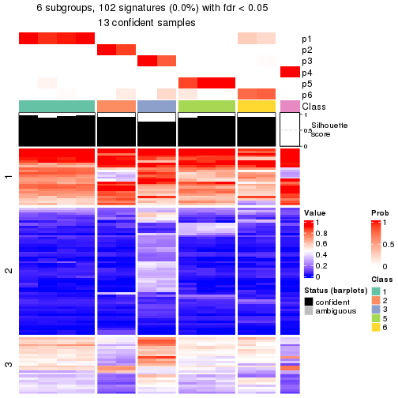</p>

</div>
<div id='tab-node-02222-get-signatures-6'>
<pre><code class="r">get_signatures(res, k = 7)
</code></pre>

<p></p>

</div>
<div id='tab-node-02222-get-signatures-7'>
<pre><code class="r">get_signatures(res, k = 8)
</code></pre>

<p></p>

</div>
</div>


Compare the overlap of signatures from different k:

```r
compare_signatures(res)
```


`get_signature()` returns a data frame invisibly. To get the list of signatures, the function
call should be assigned to a variable explicitly. In following code, if `plot` argument is set
to `FALSE`, no heatmap is plotted while only the differential analysis is performed.

```r
# code only for demonstration
tb = get_signature(res, k = ..., plot = FALSE)
```

An example of the output of `tb` is:

```
#>   which_row         fdr    mean_1    mean_2 scaled_mean_1 scaled_mean_2 km
#> 1        38 0.042760348  8.373488  9.131774    -0.5533452     0.5164555  1
#> 2        40 0.018707592  7.106213  8.469186    -0.6173731     0.5762149  1
#> 3        55 0.019134737 10.221463 11.207825    -0.6159697     0.5749050  1
#> 4        59 0.006059896  5.921854  7.869574    -0.6899429     0.6439467  1
#> 5        60 0.018055526  8.928898 10.211722    -0.6204761     0.5791110  1
#> 6        98 0.009384629 15.714769 14.887706     0.6635654    -0.6193277  2
...
```

The columns in `tb` are:

1. `which_row`: row indices corresponding to the input matrix.
2. `fdr`: FDR for the differential test. 
3. `mean_x`: The mean value in group x.
4. `scaled_mean_x`: The mean value in group x after rows are scaled.
5. `km`: Row groups if k-means clustering is applied to rows (which is done by automatically selecting number of clusters).

If there are too many signatures, `top_signatures = ...` can be set to only show the 
signatures with the highest FDRs:

```r
# code only for demonstration
# e.g. to show the top 500 most significant rows
tb = get_signature(res, k = ..., top_signatures = 500)
```

If the signatures are defined as these which are uniquely high in current group, `diff_method` argument
can be set to `"uniquely_high_in_one_group"`:

```r
# code only for demonstration
tb = get_signature(res, k = ..., diff_method = "uniquely_high_in_one_group")
```


UMAP plot which shows how samples are separated.


<script>
$( function() {
	$( '#tabs-node-02222-dimension-reduction' ).tabs();
} );
</script>
<div id='tabs-node-02222-dimension-reduction'>
<ul>
<li><a href='#tab-node-02222-dimension-reduction-1'>k = 2</a></li>
<li><a href='#tab-node-02222-dimension-reduction-2'>k = 3</a></li>
<li><a href='#tab-node-02222-dimension-reduction-3'>k = 4</a></li>
<li><a href='#tab-node-02222-dimension-reduction-4'>k = 5</a></li>
<li><a href='#tab-node-02222-dimension-reduction-5'>k = 6</a></li>
<li><a href='#tab-node-02222-dimension-reduction-6'>k = 7</a></li>
<li><a href='#tab-node-02222-dimension-reduction-7'>k = 8</a></li>
</ul>
<div id='tab-node-02222-dimension-reduction-1'>
<pre><code class="r">dimension_reduction(res, k = 2, method = &quot;UMAP&quot;)
</code></pre>

<p></p>

</div>
<div id='tab-node-02222-dimension-reduction-2'>
<pre><code class="r">dimension_reduction(res, k = 3, method = &quot;UMAP&quot;)
</code></pre>

<p></p>

</div>
<div id='tab-node-02222-dimension-reduction-3'>
<pre><code class="r">dimension_reduction(res, k = 4, method = &quot;UMAP&quot;)
</code></pre>

<p></p>

</div>
<div id='tab-node-02222-dimension-reduction-4'>
<pre><code class="r">dimension_reduction(res, k = 5, method = &quot;UMAP&quot;)
</code></pre>

<p></p>

</div>
<div id='tab-node-02222-dimension-reduction-5'>
<pre><code class="r">dimension_reduction(res, k = 6, method = &quot;UMAP&quot;)
</code></pre>

<p></p>

</div>
<div id='tab-node-02222-dimension-reduction-6'>
<pre><code class="r">dimension_reduction(res, k = 7, method = &quot;UMAP&quot;)
</code></pre>

<p>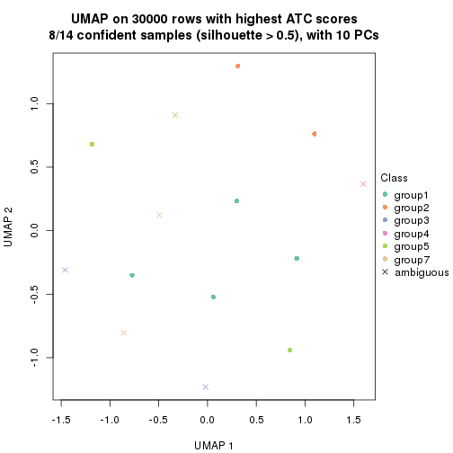</p>

</div>
<div id='tab-node-02222-dimension-reduction-7'>
<pre><code class="r">dimension_reduction(res, k = 8, method = &quot;UMAP&quot;)
</code></pre>

<p></p>

</div>
</div>


Following heatmap shows how subgroups are split when increasing `k`:

```r
collect_classes(res)
```


If matrix rows can be associated to genes, consider to use `functional_enrichment(res,
...)` to perform function enrichment for the signature genes. See [this vignette](https://jokergoo.github.io/cola_vignettes/functional_enrichment.html) for more detailed explanations.


 

---------------------------------------------------


### Node023


Parent node: [Node02](#Node02).
Child nodes: 
                [Node0111](#Node0111)
        ,
                [Node0112](#Node0112)
        ,
                Node0113-leaf
        ,
                [Node0121](#Node0121)
        ,
                Node0122-leaf
        ,
                Node0123-leaf
        ,
                Node0131-leaf
        ,
                [Node0132](#Node0132)
        ,
                Node0133-leaf
        ,
                Node0134-leaf
        ,
                Node0211-leaf
        ,
                Node0212-leaf
        ,
                [Node0213](#Node0213)
        ,
                Node0214-leaf
        ,
                [Node0221](#Node0221)
        ,
                [Node0222](#Node0222)
        ,
                [Node0231](#Node0231)
        ,
                Node0232-leaf
        ,
                Node0233-leaf
        ,
                Node0321-leaf
        ,
                Node0322-leaf
        ,
                Node0323-leaf
        ,
                [Node0331](#Node0331)
        ,
                [Node0332](#Node0332)
        ,
                Node0333-leaf
        .


The object with results only for a single top-value method and a single partitioning method 
can be extracted as:

```r
res = res_rh["023"]
```

A summary of `res` and all the functions that can be applied to it:

```r
res
```

```
#> A 'ConsensusPartition' object with k = 2, 3, 4, 5, 6, 7, 8.
#>   On a matrix with 30000 rows and 25 columns.
#>   Top rows (1000) are extracted by 'ATC' method.
#>   Subgroups are detected by 'skmeans' method.
#>   Performed in total 350 partitions by row resampling.
#>   Best k for subgroups seems to be 4.
#> 
#> Following methods can be applied to this 'ConsensusPartition' object:
#>  [1] "cola_report"             "collect_classes"         "collect_plots"          
#>  [4] "collect_stats"           "colnames"                "compare_partitions"     
#>  [7] "compare_signatures"      "consensus_heatmap"       "dimension_reduction"    
#> [10] "functional_enrichment"   "get_anno_col"            "get_anno"               
#> [13] "get_classes"             "get_consensus"           "get_matrix"             
#> [16] "get_membership"          "get_param"               "get_signatures"         
#> [19] "get_stats"               "is_best_k"               "is_stable_k"            
#> [22] "membership_heatmap"      "ncol"                    "nrow"                   
#> [25] "plot_ecdf"               "predict_classes"         "rownames"               
#> [28] "select_partition_number" "show"                    "suggest_best_k"         
#> [31] "test_to_known_factors"   "top_rows_heatmap"
```

`collect_plots()` function collects all the plots made from `res` for all `k` (number of subgroups)
into one single page to provide an easy and fast comparison between different `k`.

```r
collect_plots(res)
```


The plots are:

- The first row: a plot of the eCDF (empirical cumulative distribution
  function) curves of the consensus matrix for each `k` and the heatmap of
  predicted classes for each `k`.
- The second row: heatmaps of the consensus matrix for each `k`.
- The third row: heatmaps of the membership matrix for each `k`.
- The fouth row: heatmaps of the signatures for each `k`.

All the plots in panels can be made by individual functions and they are
plotted later in this section.

`select_partition_number()` produces several plots showing different
statistics for choosing "optimized" `k`. There are following statistics:

- eCDF curves of the consensus matrix for each `k`;
- 1-PAC. [The PAC score](https://en.wikipedia.org/wiki/Consensus_clustering#Over-interpretation_potential_of_consensus_clustering)
  measures the proportion of the ambiguous subgrouping.
- Mean silhouette score.
- Concordance. The mean probability of fiting the consensus subgroup labels in all
  partitions.
- Area increased. Denote $A_k$ as the area under the eCDF curve for current
  `k`, the area increased is defined as $A_k - A_{k-1}$.
- Rand index. The percent of pairs of samples that are both in a same cluster
  or both are not in a same cluster in the partition of k and k-1.
- Jaccard index. The ratio of pairs of samples are both in a same cluster in
  the partition of k and k-1 and the pairs of samples are both in a same
  cluster in the partition k or k-1.

The detailed explanations of these statistics can be found in [the _cola_
vignette](https://jokergoo.github.io/cola_vignettes/cola.html#toc_13).

Generally speaking, higher 1-PAC score, higher mean silhouette score or higher
concordance corresponds to better partition. Rand index and Jaccard index
measure how similar the current partition is compared to partition with `k-1`.
If they are too similar, we won't accept `k` is better than `k-1`.

```r
select_partition_number(res)
```


The numeric values for all these statistics can be obtained by `get_stats()`.

```r
get_stats(res)
```

```
#>   k 1-PAC mean_silhouette concordance area_increased  Rand Jaccard
#> 2 2 1.000           1.000       1.000         0.5005 0.500   0.500
#> 3 3 1.000           0.997       0.998         0.1405 0.930   0.860
#> 4 4 0.913           0.932       0.944         0.2784 0.833   0.612
#> 5 5 0.846           0.841       0.921         0.0628 0.953   0.827
#> 6 6 0.755           0.711       0.856         0.0322 0.973   0.887
#> 7 7 0.806           0.710       0.886         0.0515 0.847   0.425
#> 8 8 0.802           0.737       0.878         0.0295 0.960   0.755
```

`suggest_best_k()` suggests the best $k$ based on these statistics. The rules are as follows:

- All $k$ with Jaccard index larger than 0.95 are removed because increasing
  $k$ does not provide enough extra information. If all $k$ are removed, it is
  marked as no subgroup is detected.
- For all $k$ with 1-PAC score larger than 0.9, the maximal $k$ is taken as
  the best $k$, and other $k$ are marked as optional $k$.
- If it does not fit the second rule. The $k$ with the maximal vote of the
  highest 1-PAC score, highest mean silhouette, and highest concordance is
  taken as the best $k$.

```r
suggest_best_k(res)
```

```
#> [1] 4
#> attr(,"optional")
#> [1] 2 3
```

There is also optional best $k$ = 2 3 that is worth to check.

Following is the table of the partitions (You need to click the **show/hide
code output** link to see it). The membership matrix (columns with name `p*`)
is inferred by
[`clue::cl_consensus()`](https://www.rdocumentation.org/link/cl_consensus?package=clue)
function with the `SE` method. Basically the value in the membership matrix
represents the probability to belong to a certain group. The finall subgroup
label for an item is determined with the group with highest probability it
belongs to.

In `get_classes()` function, the entropy is calculated from the membership
matrix and the silhouette score is calculated from the consensus matrix.


<script>
$( function() {
	$( '#tabs-node-023-get-classes' ).tabs();
} );
</script>
<div id='tabs-node-023-get-classes'>
<ul>
<li><a href='#tab-node-023-get-classes-1'>k = 2</a></li>
<li><a href='#tab-node-023-get-classes-2'>k = 3</a></li>
<li><a href='#tab-node-023-get-classes-3'>k = 4</a></li>
<li><a href='#tab-node-023-get-classes-4'>k = 5</a></li>
<li><a href='#tab-node-023-get-classes-5'>k = 6</a></li>
<li><a href='#tab-node-023-get-classes-6'>k = 7</a></li>
<li><a href='#tab-node-023-get-classes-7'>k = 8</a></li>
</ul>

<div id='tab-node-023-get-classes-1'>
<p><a id='tab-node-023-get-classes-1-a' style='color:#0366d6' href='#'>show/hide code output</a></p>
<pre><code class="r">cbind(get_classes(res, k = 2), get_membership(res, k = 2))
</code></pre>

<pre><code>#&gt;                 class entropy silhouette p1 p2
#&gt; TCGA.FD.A43P.01     2       0          1  0  1
#&gt; TCGA.K4.A6FZ.01     1       0          1  1  0
#&gt; TCGA.XF.AAN5.01     1       0          1  1  0
#&gt; TCGA.CF.A1HS.01     1       0          1  1  0
#&gt; TCGA.K4.A5RH.01     1       0          1  1  0
#&gt; TCGA.GU.A767.01     2       0          1  0  1
#&gt; TCGA.XF.A9T5.01     1       0          1  1  0
#&gt; TCGA.FT.A61P.01     1       0          1  1  0
#&gt; TCGA.XF.A9SX.01     1       0          1  1  0
#&gt; TCGA.XF.A9ST.01     2       0          1  0  1
#&gt; TCGA.GU.A762.01     1       0          1  1  0
#&gt; TCGA.K4.A3WS.01     2       0          1  0  1
#&gt; TCGA.K4.A5RJ.01     1       0          1  1  0
#&gt; TCGA.FD.A5C0.01     2       0          1  0  1
#&gt; TCGA.ZF.A9RD.01     1       0          1  1  0
#&gt; TCGA.FD.A3SO.01     1       0          1  1  0
#&gt; TCGA.CU.A0YR.01     2       0          1  0  1
#&gt; TCGA.XF.AAMZ.01     2       0          1  0  1
#&gt; TCGA.BT.A20U.01     1       0          1  1  0
#&gt; TCGA.E7.A85H.01     2       0          1  0  1
#&gt; TCGA.GD.A3OS.01     1       0          1  1  0
#&gt; TCGA.FD.A3B4.01     1       0          1  1  0
#&gt; TCGA.XF.AAN0.01     2       0          1  0  1
#&gt; TCGA.FJ.A871.01     1       0          1  1  0
#&gt; TCGA.CF.A5UA.01     2       0          1  0  1
</code></pre>

<script>
$('#tab-node-023-get-classes-1-a').parent().next().next().hide();
$('#tab-node-023-get-classes-1-a').click(function(){
  $('#tab-node-023-get-classes-1-a').parent().next().next().toggle();
  return(false);
});
</script>
</div>

<div id='tab-node-023-get-classes-2'>
<p><a id='tab-node-023-get-classes-2-a' style='color:#0366d6' href='#'>show/hide code output</a></p>
<pre><code class="r">cbind(get_classes(res, k = 3), get_membership(res, k = 3))
</code></pre>

<pre><code>#&gt;                 class entropy silhouette p1   p2   p3
#&gt; TCGA.FD.A43P.01     2   0.000      0.993  0 1.00 0.00
#&gt; TCGA.K4.A6FZ.01     1   0.000      1.000  1 0.00 0.00
#&gt; TCGA.XF.AAN5.01     1   0.000      1.000  1 0.00 0.00
#&gt; TCGA.CF.A1HS.01     1   0.000      1.000  1 0.00 0.00
#&gt; TCGA.K4.A5RH.01     1   0.000      1.000  1 0.00 0.00
#&gt; TCGA.GU.A767.01     2   0.000      0.993  0 1.00 0.00
#&gt; TCGA.XF.A9T5.01     1   0.000      1.000  1 0.00 0.00
#&gt; TCGA.FT.A61P.01     1   0.000      1.000  1 0.00 0.00
#&gt; TCGA.XF.A9SX.01     1   0.000      1.000  1 0.00 0.00
#&gt; TCGA.XF.A9ST.01     3   0.000      1.000  0 0.00 1.00
#&gt; TCGA.GU.A762.01     1   0.000      1.000  1 0.00 0.00
#&gt; TCGA.K4.A3WS.01     2   0.000      0.993  0 1.00 0.00
#&gt; TCGA.K4.A5RJ.01     1   0.000      1.000  1 0.00 0.00
#&gt; TCGA.FD.A5C0.01     2   0.153      0.958  0 0.96 0.04
#&gt; TCGA.ZF.A9RD.01     1   0.000      1.000  1 0.00 0.00
#&gt; TCGA.FD.A3SO.01     1   0.000      1.000  1 0.00 0.00
#&gt; TCGA.CU.A0YR.01     2   0.000      0.993  0 1.00 0.00
#&gt; TCGA.XF.AAMZ.01     2   0.000      0.993  0 1.00 0.00
#&gt; TCGA.BT.A20U.01     1   0.000      1.000  1 0.00 0.00
#&gt; TCGA.E7.A85H.01     3   0.000      1.000  0 0.00 1.00
#&gt; TCGA.GD.A3OS.01     1   0.000      1.000  1 0.00 0.00
#&gt; TCGA.FD.A3B4.01     1   0.000      1.000  1 0.00 0.00
#&gt; TCGA.XF.AAN0.01     2   0.000      0.993  0 1.00 0.00
#&gt; TCGA.FJ.A871.01     1   0.000      1.000  1 0.00 0.00
#&gt; TCGA.CF.A5UA.01     3   0.000      1.000  0 0.00 1.00
</code></pre>

<script>
$('#tab-node-023-get-classes-2-a').parent().next().next().hide();
$('#tab-node-023-get-classes-2-a').click(function(){
  $('#tab-node-023-get-classes-2-a').parent().next().next().toggle();
  return(false);
});
</script>
</div>

<div id='tab-node-023-get-classes-3'>
<p><a id='tab-node-023-get-classes-3-a' style='color:#0366d6' href='#'>show/hide code output</a></p>
<pre><code class="r">cbind(get_classes(res, k = 4), get_membership(res, k = 4))
</code></pre>

<pre><code>#&gt;                 class entropy silhouette   p1   p2   p3   p4
#&gt; TCGA.FD.A43P.01     2  0.0000      0.977 0.00 1.00 0.00 0.00
#&gt; TCGA.K4.A6FZ.01     1  0.0000      0.903 1.00 0.00 0.00 0.00
#&gt; TCGA.XF.AAN5.01     1  0.0000      0.903 1.00 0.00 0.00 0.00
#&gt; TCGA.CF.A1HS.01     1  0.4134      0.716 0.74 0.00 0.00 0.26
#&gt; TCGA.K4.A5RH.01     4  0.2011      1.000 0.08 0.00 0.00 0.92
#&gt; TCGA.GU.A767.01     2  0.0000      0.977 0.00 1.00 0.00 0.00
#&gt; TCGA.XF.A9T5.01     4  0.2011      1.000 0.08 0.00 0.00 0.92
#&gt; TCGA.FT.A61P.01     1  0.0000      0.903 1.00 0.00 0.00 0.00
#&gt; TCGA.XF.A9SX.01     1  0.0000      0.903 1.00 0.00 0.00 0.00
#&gt; TCGA.XF.A9ST.01     3  0.2011      0.939 0.00 0.00 0.92 0.08
#&gt; TCGA.GU.A762.01     1  0.3172      0.839 0.84 0.00 0.00 0.16
#&gt; TCGA.K4.A3WS.01     2  0.0000      0.977 0.00 1.00 0.00 0.00
#&gt; TCGA.K4.A5RJ.01     4  0.2011      1.000 0.08 0.00 0.00 0.92
#&gt; TCGA.FD.A5C0.01     2  0.2011      0.942 0.00 0.92 0.00 0.08
#&gt; TCGA.ZF.A9RD.01     1  0.3400      0.822 0.82 0.00 0.00 0.18
#&gt; TCGA.FD.A3SO.01     1  0.0000      0.903 1.00 0.00 0.00 0.00
#&gt; TCGA.CU.A0YR.01     2  0.0000      0.977 0.00 1.00 0.00 0.00
#&gt; TCGA.XF.AAMZ.01     2  0.0707      0.973 0.00 0.98 0.00 0.02
#&gt; TCGA.BT.A20U.01     1  0.0000      0.903 1.00 0.00 0.00 0.00
#&gt; TCGA.E7.A85H.01     3  0.0000      0.970 0.00 0.00 1.00 0.00
#&gt; TCGA.GD.A3OS.01     4  0.2011      1.000 0.08 0.00 0.00 0.92
#&gt; TCGA.FD.A3B4.01     1  0.3172      0.839 0.84 0.00 0.00 0.16
#&gt; TCGA.XF.AAN0.01     2  0.1637      0.955 0.00 0.94 0.00 0.06
#&gt; TCGA.FJ.A871.01     4  0.2011      1.000 0.08 0.00 0.00 0.92
#&gt; TCGA.CF.A5UA.01     3  0.0000      0.970 0.00 0.00 1.00 0.00
</code></pre>

<script>
$('#tab-node-023-get-classes-3-a').parent().next().next().hide();
$('#tab-node-023-get-classes-3-a').click(function(){
  $('#tab-node-023-get-classes-3-a').parent().next().next().toggle();
  return(false);
});
</script>
</div>

<div id='tab-node-023-get-classes-4'>
<p><a id='tab-node-023-get-classes-4-a' style='color:#0366d6' href='#'>show/hide code output</a></p>
<pre><code class="r">cbind(get_classes(res, k = 5), get_membership(res, k = 5))
</code></pre>

<pre><code>#&gt;                 class entropy silhouette   p1   p2   p3   p4   p5
#&gt; TCGA.FD.A43P.01     2  0.0000      0.894 0.00 1.00 0.00 0.00 0.00
#&gt; TCGA.K4.A6FZ.01     1  0.0000      0.826 1.00 0.00 0.00 0.00 0.00
#&gt; TCGA.XF.AAN5.01     1  0.0000      0.826 1.00 0.00 0.00 0.00 0.00
#&gt; TCGA.CF.A1HS.01     1  0.3983      0.650 0.66 0.00 0.00 0.34 0.00
#&gt; TCGA.K4.A5RH.01     4  0.0000      0.989 0.00 0.00 0.00 1.00 0.00
#&gt; TCGA.GU.A767.01     2  0.0000      0.894 0.00 1.00 0.00 0.00 0.00
#&gt; TCGA.XF.A9T5.01     4  0.0000      0.989 0.00 0.00 0.00 1.00 0.00
#&gt; TCGA.FT.A61P.01     1  0.0609      0.822 0.98 0.00 0.00 0.00 0.02
#&gt; TCGA.XF.A9SX.01     1  0.0609      0.822 0.98 0.00 0.00 0.00 0.02
#&gt; TCGA.XF.A9ST.01     5  0.1410      0.836 0.00 0.00 0.06 0.00 0.94
#&gt; TCGA.GU.A762.01     1  0.3796      0.705 0.70 0.00 0.00 0.30 0.00
#&gt; TCGA.K4.A3WS.01     2  0.0000      0.894 0.00 1.00 0.00 0.00 0.00
#&gt; TCGA.K4.A5RJ.01     4  0.0000      0.989 0.00 0.00 0.00 1.00 0.00
#&gt; TCGA.FD.A5C0.01     5  0.1043      0.870 0.00 0.04 0.00 0.00 0.96
#&gt; TCGA.ZF.A9RD.01     1  0.3796      0.705 0.70 0.00 0.00 0.30 0.00
#&gt; TCGA.FD.A3SO.01     1  0.0609      0.822 0.98 0.00 0.00 0.00 0.02
#&gt; TCGA.CU.A0YR.01     2  0.0000      0.894 0.00 1.00 0.00 0.00 0.00
#&gt; TCGA.XF.AAMZ.01     2  0.4060      0.343 0.00 0.64 0.00 0.00 0.36
#&gt; TCGA.BT.A20U.01     1  0.0000      0.826 1.00 0.00 0.00 0.00 0.00
#&gt; TCGA.E7.A85H.01     3  0.0000      1.000 0.00 0.00 1.00 0.00 0.00
#&gt; TCGA.GD.A3OS.01     4  0.0609      0.983 0.00 0.00 0.00 0.98 0.02
#&gt; TCGA.FD.A3B4.01     1  0.3796      0.705 0.70 0.00 0.00 0.30 0.00
#&gt; TCGA.XF.AAN0.01     5  0.2929      0.772 0.00 0.18 0.00 0.00 0.82
#&gt; TCGA.FJ.A871.01     4  0.0609      0.983 0.00 0.00 0.00 0.98 0.02
#&gt; TCGA.CF.A5UA.01     3  0.0000      1.000 0.00 0.00 1.00 0.00 0.00
</code></pre>

<script>
$('#tab-node-023-get-classes-4-a').parent().next().next().hide();
$('#tab-node-023-get-classes-4-a').click(function(){
  $('#tab-node-023-get-classes-4-a').parent().next().next().toggle();
  return(false);
});
</script>
</div>

<div id='tab-node-023-get-classes-5'>
<p><a id='tab-node-023-get-classes-5-a' style='color:#0366d6' href='#'>show/hide code output</a></p>
<pre><code class="r">cbind(get_classes(res, k = 6), get_membership(res, k = 6))
</code></pre>

<pre><code>#&gt;                 class entropy silhouette   p1   p2 p3   p4   p5   p6
#&gt; TCGA.FD.A43P.01     2  0.0000      1.000 0.00 1.00  0 0.00 0.00 0.00
#&gt; TCGA.K4.A6FZ.01     1  0.0937      0.679 0.96 0.00  0 0.00 0.00 0.04
#&gt; TCGA.XF.AAN5.01     1  0.2190      0.681 0.90 0.00  0 0.06 0.00 0.04
#&gt; TCGA.CF.A1HS.01     1  0.4609      0.497 0.54 0.00  0 0.42 0.00 0.04
#&gt; TCGA.K4.A5RH.01     4  0.0547      0.861 0.02 0.00  0 0.98 0.00 0.00
#&gt; TCGA.GU.A767.01     2  0.0000      1.000 0.00 1.00  0 0.00 0.00 0.00
#&gt; TCGA.XF.A9T5.01     4  0.0547      0.861 0.02 0.00  0 0.98 0.00 0.00
#&gt; TCGA.FT.A61P.01     1  0.2094      0.661 0.90 0.00  0 0.00 0.02 0.08
#&gt; TCGA.XF.A9SX.01     1  0.2094      0.661 0.90 0.00  0 0.00 0.02 0.08
#&gt; TCGA.XF.A9ST.01     6  0.3499      0.000 0.00 0.00  0 0.00 0.32 0.68
#&gt; TCGA.GU.A762.01     1  0.4609      0.497 0.54 0.00  0 0.42 0.00 0.04
#&gt; TCGA.K4.A3WS.01     2  0.0000      1.000 0.00 1.00  0 0.00 0.00 0.00
#&gt; TCGA.K4.A5RJ.01     4  0.1092      0.864 0.02 0.00  0 0.96 0.00 0.02
#&gt; TCGA.FD.A5C0.01     5  0.0547      0.514 0.00 0.02  0 0.00 0.98 0.00
#&gt; TCGA.ZF.A9RD.01     1  0.4609      0.497 0.54 0.00  0 0.42 0.00 0.04
#&gt; TCGA.FD.A3SO.01     1  0.2094      0.661 0.90 0.00  0 0.00 0.02 0.08
#&gt; TCGA.CU.A0YR.01     2  0.0000      1.000 0.00 1.00  0 0.00 0.00 0.00
#&gt; TCGA.XF.AAMZ.01     5  0.3756      0.451 0.00 0.40  0 0.00 0.60 0.00
#&gt; TCGA.BT.A20U.01     1  0.0547      0.687 0.98 0.00  0 0.02 0.00 0.00
#&gt; TCGA.E7.A85H.01     3  0.0000      1.000 0.00 0.00  1 0.00 0.00 0.00
#&gt; TCGA.GD.A3OS.01     4  0.2793      0.790 0.00 0.00  0 0.80 0.00 0.20
#&gt; TCGA.FD.A3B4.01     1  0.4609      0.497 0.54 0.00  0 0.42 0.00 0.04
#&gt; TCGA.XF.AAN0.01     5  0.2048      0.631 0.00 0.12  0 0.00 0.88 0.00
#&gt; TCGA.FJ.A871.01     4  0.2793      0.790 0.00 0.00  0 0.80 0.00 0.20
#&gt; TCGA.CF.A5UA.01     3  0.0000      1.000 0.00 0.00  1 0.00 0.00 0.00
</code></pre>

<script>
$('#tab-node-023-get-classes-5-a').parent().next().next().hide();
$('#tab-node-023-get-classes-5-a').click(function(){
  $('#tab-node-023-get-classes-5-a').parent().next().next().toggle();
  return(false);
});
</script>
</div>

<div id='tab-node-023-get-classes-6'>
<p><a id='tab-node-023-get-classes-6-a' style='color:#0366d6' href='#'>show/hide code output</a></p>
<pre><code class="r">cbind(get_classes(res, k = 7), get_membership(res, k = 7))
</code></pre>

<pre><code>#&gt;                 class entropy silhouette   p1   p2   p3   p4   p5   p6   p7
#&gt; TCGA.FD.A43P.01     2  0.0000     1.0000 0.00 1.00 0.00 0.00 0.00 0.00 0.00
#&gt; TCGA.K4.A6FZ.01     1  0.1166     0.8572 0.94 0.00 0.00 0.06 0.00 0.00 0.00
#&gt; TCGA.XF.AAN5.01     4  0.3525    -0.0103 0.44 0.00 0.00 0.56 0.00 0.00 0.00
#&gt; TCGA.CF.A1HS.01     4  0.1433     0.6794 0.08 0.00 0.00 0.92 0.00 0.00 0.00
#&gt; TCGA.K4.A5RH.01     4  0.3459     0.3410 0.00 0.00 0.00 0.60 0.00 0.00 0.40
#&gt; TCGA.GU.A767.01     2  0.0000     1.0000 0.00 1.00 0.00 0.00 0.00 0.00 0.00
#&gt; TCGA.XF.A9T5.01     4  0.3459     0.3247 0.00 0.00 0.00 0.60 0.00 0.00 0.40
#&gt; TCGA.FT.A61P.01     1  0.0000     0.8812 1.00 0.00 0.00 0.00 0.00 0.00 0.00
#&gt; TCGA.XF.A9SX.01     1  0.0000     0.8812 1.00 0.00 0.00 0.00 0.00 0.00 0.00
#&gt; TCGA.XF.A9ST.01     6  0.0504     0.0000 0.00 0.00 0.00 0.00 0.02 0.98 0.00
#&gt; TCGA.GU.A762.01     4  0.1886     0.6710 0.12 0.00 0.00 0.88 0.00 0.00 0.00
#&gt; TCGA.K4.A3WS.01     2  0.0000     1.0000 0.00 1.00 0.00 0.00 0.00 0.00 0.00
#&gt; TCGA.K4.A5RJ.01     4  0.3525     0.2811 0.00 0.00 0.00 0.56 0.00 0.00 0.44
#&gt; TCGA.FD.A5C0.01     5  0.0863     0.7609 0.00 0.00 0.00 0.00 0.96 0.04 0.00
#&gt; TCGA.ZF.A9RD.01     4  0.1671     0.6793 0.10 0.00 0.00 0.90 0.00 0.00 0.00
#&gt; TCGA.FD.A3SO.01     1  0.0000     0.8812 1.00 0.00 0.00 0.00 0.00 0.00 0.00
#&gt; TCGA.CU.A0YR.01     2  0.0000     1.0000 0.00 1.00 0.00 0.00 0.00 0.00 0.00
#&gt; TCGA.XF.AAMZ.01     5  0.3517     0.5997 0.00 0.28 0.00 0.02 0.70 0.00 0.00
#&gt; TCGA.BT.A20U.01     1  0.3139     0.5399 0.70 0.00 0.00 0.30 0.00 0.00 0.00
#&gt; TCGA.E7.A85H.01     3  0.1006     0.9669 0.00 0.00 0.96 0.02 0.00 0.02 0.00
#&gt; TCGA.GD.A3OS.01     7  0.0000     1.0000 0.00 0.00 0.00 0.00 0.00 0.00 1.00
#&gt; TCGA.FD.A3B4.01     4  0.1886     0.6710 0.12 0.00 0.00 0.88 0.00 0.00 0.00
#&gt; TCGA.XF.AAN0.01     5  0.0504     0.7768 0.00 0.02 0.00 0.00 0.98 0.00 0.00
#&gt; TCGA.FJ.A871.01     7  0.0000     1.0000 0.00 0.00 0.00 0.00 0.00 0.00 1.00
#&gt; TCGA.CF.A5UA.01     3  0.0000     0.9669 0.00 0.00 1.00 0.00 0.00 0.00 0.00
</code></pre>

<script>
$('#tab-node-023-get-classes-6-a').parent().next().next().hide();
$('#tab-node-023-get-classes-6-a').click(function(){
  $('#tab-node-023-get-classes-6-a').parent().next().next().toggle();
  return(false);
});
</script>
</div>

<div id='tab-node-023-get-classes-7'>
<p><a id='tab-node-023-get-classes-7-a' style='color:#0366d6' href='#'>show/hide code output</a></p>
<pre><code class="r">cbind(get_classes(res, k = 8), get_membership(res, k = 8))
</code></pre>

<pre><code>#&gt;                 class entropy silhouette   p1   p2   p3   p4   p5 p6   p7   p8
#&gt; TCGA.FD.A43P.01     2  0.0000      0.993 0.00 1.00 0.00 0.00 0.00  0 0.00 0.00
#&gt; TCGA.K4.A6FZ.01     1  0.2650      0.694 0.76 0.00 0.00 0.24 0.00  0 0.00 0.00
#&gt; TCGA.XF.AAN5.01     4  0.1947      0.677 0.14 0.00 0.00 0.86 0.00  0 0.00 0.00
#&gt; TCGA.CF.A1HS.01     4  0.2719      0.646 0.02 0.00 0.00 0.80 0.00  0 0.00 0.18
#&gt; TCGA.K4.A5RH.01     4  0.3907     -0.108 0.00 0.00 0.00 0.58 0.00  0 0.04 0.38
#&gt; TCGA.GU.A767.01     2  0.0000      0.993 0.00 1.00 0.00 0.00 0.00  0 0.00 0.00
#&gt; TCGA.XF.A9T5.01     8  0.1765      0.744 0.00 0.00 0.00 0.12 0.00  0 0.00 0.88
#&gt; TCGA.FT.A61P.01     1  0.0471      0.743 0.98 0.00 0.00 0.00 0.00  0 0.00 0.02
#&gt; TCGA.XF.A9SX.01     1  0.0471      0.743 0.98 0.00 0.00 0.00 0.00  0 0.00 0.02
#&gt; TCGA.XF.A9ST.01     6  0.0000      0.000 0.00 0.00 0.00 0.00 0.00  1 0.00 0.00
#&gt; TCGA.GU.A762.01     4  0.0000      0.791 0.00 0.00 0.00 1.00 0.00  0 0.00 0.00
#&gt; TCGA.K4.A3WS.01     2  0.0471      0.980 0.00 0.98 0.00 0.00 0.00  0 0.02 0.00
#&gt; TCGA.K4.A5RJ.01     8  0.3404      0.754 0.00 0.00 0.00 0.24 0.00  0 0.04 0.72
#&gt; TCGA.FD.A5C0.01     5  0.2350      0.757 0.00 0.00 0.00 0.00 0.86  0 0.10 0.04
#&gt; TCGA.ZF.A9RD.01     4  0.0000      0.791 0.00 0.00 0.00 1.00 0.00  0 0.00 0.00
#&gt; TCGA.FD.A3SO.01     1  0.1091      0.759 0.94 0.00 0.00 0.06 0.00  0 0.00 0.00
#&gt; TCGA.CU.A0YR.01     2  0.0000      0.993 0.00 1.00 0.00 0.00 0.00  0 0.00 0.00
#&gt; TCGA.XF.AAMZ.01     5  0.3830      0.671 0.00 0.16 0.00 0.00 0.74  0 0.08 0.02
#&gt; TCGA.BT.A20U.01     1  0.3943      0.384 0.56 0.00 0.00 0.40 0.00  0 0.00 0.04
#&gt; TCGA.E7.A85H.01     3  0.1557      0.933 0.00 0.00 0.92 0.00 0.00  0 0.06 0.02
#&gt; TCGA.GD.A3OS.01     7  0.2852      1.000 0.00 0.00 0.00 0.00 0.00  0 0.72 0.28
#&gt; TCGA.FD.A3B4.01     4  0.0000      0.791 0.00 0.00 0.00 1.00 0.00  0 0.00 0.00
#&gt; TCGA.XF.AAN0.01     5  0.1275      0.757 0.00 0.00 0.00 0.00 0.94  0 0.04 0.02
#&gt; TCGA.FJ.A871.01     7  0.2852      1.000 0.00 0.00 0.00 0.00 0.00  0 0.72 0.28
#&gt; TCGA.CF.A5UA.01     3  0.0000      0.933 0.00 0.00 1.00 0.00 0.00  0 0.00 0.00
</code></pre>

<script>
$('#tab-node-023-get-classes-7-a').parent().next().next().hide();
$('#tab-node-023-get-classes-7-a').click(function(){
  $('#tab-node-023-get-classes-7-a').parent().next().next().toggle();
  return(false);
});
</script>
</div>
</div>

Heatmaps for the consensus matrix. It visualizes the probability of two
samples to be in a same group.


<script>
$( function() {
	$( '#tabs-node-023-consensus-heatmap' ).tabs();
} );
</script>
<div id='tabs-node-023-consensus-heatmap'>
<ul>
<li><a href='#tab-node-023-consensus-heatmap-1'>k = 2</a></li>
<li><a href='#tab-node-023-consensus-heatmap-2'>k = 3</a></li>
<li><a href='#tab-node-023-consensus-heatmap-3'>k = 4</a></li>
<li><a href='#tab-node-023-consensus-heatmap-4'>k = 5</a></li>
<li><a href='#tab-node-023-consensus-heatmap-5'>k = 6</a></li>
<li><a href='#tab-node-023-consensus-heatmap-6'>k = 7</a></li>
<li><a href='#tab-node-023-consensus-heatmap-7'>k = 8</a></li>
</ul>
<div id='tab-node-023-consensus-heatmap-1'>
<pre><code class="r">consensus_heatmap(res, k = 2)
</code></pre>

<p></p>

</div>
<div id='tab-node-023-consensus-heatmap-2'>
<pre><code class="r">consensus_heatmap(res, k = 3)
</code></pre>

<p></p>

</div>
<div id='tab-node-023-consensus-heatmap-3'>
<pre><code class="r">consensus_heatmap(res, k = 4)
</code></pre>

<p></p>

</div>
<div id='tab-node-023-consensus-heatmap-4'>
<pre><code class="r">consensus_heatmap(res, k = 5)
</code></pre>

<p></p>

</div>
<div id='tab-node-023-consensus-heatmap-5'>
<pre><code class="r">consensus_heatmap(res, k = 6)
</code></pre>

<p></p>

</div>
<div id='tab-node-023-consensus-heatmap-6'>
<pre><code class="r">consensus_heatmap(res, k = 7)
</code></pre>

<p></p>

</div>
<div id='tab-node-023-consensus-heatmap-7'>
<pre><code class="r">consensus_heatmap(res, k = 8)
</code></pre>

<p>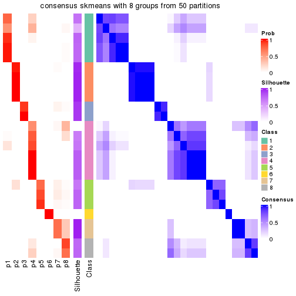</p>

</div>
</div>

Heatmaps for the membership of samples in all partitions to see how consistent they are:


<script>
$( function() {
	$( '#tabs-node-023-membership-heatmap' ).tabs();
} );
</script>
<div id='tabs-node-023-membership-heatmap'>
<ul>
<li><a href='#tab-node-023-membership-heatmap-1'>k = 2</a></li>
<li><a href='#tab-node-023-membership-heatmap-2'>k = 3</a></li>
<li><a href='#tab-node-023-membership-heatmap-3'>k = 4</a></li>
<li><a href='#tab-node-023-membership-heatmap-4'>k = 5</a></li>
<li><a href='#tab-node-023-membership-heatmap-5'>k = 6</a></li>
<li><a href='#tab-node-023-membership-heatmap-6'>k = 7</a></li>
<li><a href='#tab-node-023-membership-heatmap-7'>k = 8</a></li>
</ul>
<div id='tab-node-023-membership-heatmap-1'>
<pre><code class="r">membership_heatmap(res, k = 2)
</code></pre>

<p></p>

</div>
<div id='tab-node-023-membership-heatmap-2'>
<pre><code class="r">membership_heatmap(res, k = 3)
</code></pre>

<p></p>

</div>
<div id='tab-node-023-membership-heatmap-3'>
<pre><code class="r">membership_heatmap(res, k = 4)
</code></pre>

<p></p>

</div>
<div id='tab-node-023-membership-heatmap-4'>
<pre><code class="r">membership_heatmap(res, k = 5)
</code></pre>

<p></p>

</div>
<div id='tab-node-023-membership-heatmap-5'>
<pre><code class="r">membership_heatmap(res, k = 6)
</code></pre>

<p></p>

</div>
<div id='tab-node-023-membership-heatmap-6'>
<pre><code class="r">membership_heatmap(res, k = 7)
</code></pre>

<p></p>

</div>
<div id='tab-node-023-membership-heatmap-7'>
<pre><code class="r">membership_heatmap(res, k = 8)
</code></pre>

<p></p>

</div>
</div>

As soon as the classes for columns are determined, the signatures
that are significantly different between subgroups can be looked for. 
Following are the heatmaps for signatures.


<script>
$( function() {
	$( '#tabs-node-023-get-signatures' ).tabs();
} );
</script>
<div id='tabs-node-023-get-signatures'>
<ul>
<li><a href='#tab-node-023-get-signatures-1'>k = 2</a></li>
<li><a href='#tab-node-023-get-signatures-2'>k = 3</a></li>
<li><a href='#tab-node-023-get-signatures-3'>k = 4</a></li>
<li><a href='#tab-node-023-get-signatures-4'>k = 5</a></li>
<li><a href='#tab-node-023-get-signatures-5'>k = 6</a></li>
<li><a href='#tab-node-023-get-signatures-6'>k = 7</a></li>
<li><a href='#tab-node-023-get-signatures-7'>k = 8</a></li>
</ul>
<div id='tab-node-023-get-signatures-1'>
<pre><code class="r">get_signatures(res, k = 2)
</code></pre>

<p></p>

</div>
<div id='tab-node-023-get-signatures-2'>
<pre><code class="r">get_signatures(res, k = 3)
</code></pre>

<p></p>

</div>
<div id='tab-node-023-get-signatures-3'>
<pre><code class="r">get_signatures(res, k = 4)
</code></pre>

<p></p>

</div>
<div id='tab-node-023-get-signatures-4'>
<pre><code class="r">get_signatures(res, k = 5)
</code></pre>

<p></p>

</div>
<div id='tab-node-023-get-signatures-5'>
<pre><code class="r">get_signatures(res, k = 6)
</code></pre>

<p></p>

</div>
<div id='tab-node-023-get-signatures-6'>
<pre><code class="r">get_signatures(res, k = 7)
</code></pre>

<p></p>

</div>
<div id='tab-node-023-get-signatures-7'>
<pre><code class="r">get_signatures(res, k = 8)
</code></pre>

<p></p>

</div>
</div>


Compare the overlap of signatures from different k:

```r
compare_signatures(res)
```


`get_signature()` returns a data frame invisibly. To get the list of signatures, the function
call should be assigned to a variable explicitly. In following code, if `plot` argument is set
to `FALSE`, no heatmap is plotted while only the differential analysis is performed.

```r
# code only for demonstration
tb = get_signature(res, k = ..., plot = FALSE)
```

An example of the output of `tb` is:

```
#>   which_row         fdr    mean_1    mean_2 scaled_mean_1 scaled_mean_2 km
#> 1        38 0.042760348  8.373488  9.131774    -0.5533452     0.5164555  1
#> 2        40 0.018707592  7.106213  8.469186    -0.6173731     0.5762149  1
#> 3        55 0.019134737 10.221463 11.207825    -0.6159697     0.5749050  1
#> 4        59 0.006059896  5.921854  7.869574    -0.6899429     0.6439467  1
#> 5        60 0.018055526  8.928898 10.211722    -0.6204761     0.5791110  1
#> 6        98 0.009384629 15.714769 14.887706     0.6635654    -0.6193277  2
...
```

The columns in `tb` are:

1. `which_row`: row indices corresponding to the input matrix.
2. `fdr`: FDR for the differential test. 
3. `mean_x`: The mean value in group x.
4. `scaled_mean_x`: The mean value in group x after rows are scaled.
5. `km`: Row groups if k-means clustering is applied to rows (which is done by automatically selecting number of clusters).

If there are too many signatures, `top_signatures = ...` can be set to only show the 
signatures with the highest FDRs:

```r
# code only for demonstration
# e.g. to show the top 500 most significant rows
tb = get_signature(res, k = ..., top_signatures = 500)
```

If the signatures are defined as these which are uniquely high in current group, `diff_method` argument
can be set to `"uniquely_high_in_one_group"`:

```r
# code only for demonstration
tb = get_signature(res, k = ..., diff_method = "uniquely_high_in_one_group")
```


UMAP plot which shows how samples are separated.


<script>
$( function() {
	$( '#tabs-node-023-dimension-reduction' ).tabs();
} );
</script>
<div id='tabs-node-023-dimension-reduction'>
<ul>
<li><a href='#tab-node-023-dimension-reduction-1'>k = 2</a></li>
<li><a href='#tab-node-023-dimension-reduction-2'>k = 3</a></li>
<li><a href='#tab-node-023-dimension-reduction-3'>k = 4</a></li>
<li><a href='#tab-node-023-dimension-reduction-4'>k = 5</a></li>
<li><a href='#tab-node-023-dimension-reduction-5'>k = 6</a></li>
<li><a href='#tab-node-023-dimension-reduction-6'>k = 7</a></li>
<li><a href='#tab-node-023-dimension-reduction-7'>k = 8</a></li>
</ul>
<div id='tab-node-023-dimension-reduction-1'>
<pre><code class="r">dimension_reduction(res, k = 2, method = &quot;UMAP&quot;)
</code></pre>

<p></p>

</div>
<div id='tab-node-023-dimension-reduction-2'>
<pre><code class="r">dimension_reduction(res, k = 3, method = &quot;UMAP&quot;)
</code></pre>

<p></p>

</div>
<div id='tab-node-023-dimension-reduction-3'>
<pre><code class="r">dimension_reduction(res, k = 4, method = &quot;UMAP&quot;)
</code></pre>

<p></p>

</div>
<div id='tab-node-023-dimension-reduction-4'>
<pre><code class="r">dimension_reduction(res, k = 5, method = &quot;UMAP&quot;)
</code></pre>

<p>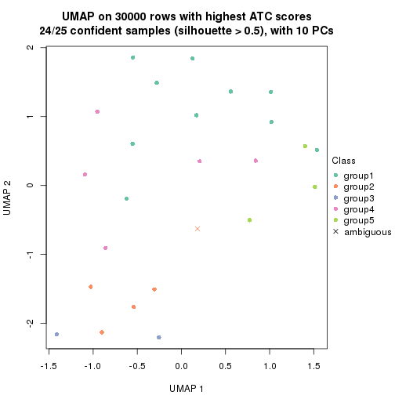</p>

</div>
<div id='tab-node-023-dimension-reduction-5'>
<pre><code class="r">dimension_reduction(res, k = 6, method = &quot;UMAP&quot;)
</code></pre>

<p></p>

</div>
<div id='tab-node-023-dimension-reduction-6'>
<pre><code class="r">dimension_reduction(res, k = 7, method = &quot;UMAP&quot;)
</code></pre>

<p>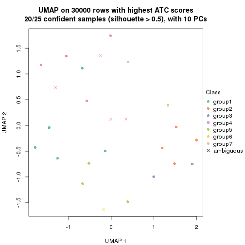</p>

</div>
<div id='tab-node-023-dimension-reduction-7'>
<pre><code class="r">dimension_reduction(res, k = 8, method = &quot;UMAP&quot;)
</code></pre>

<p></p>

</div>
</div>


Following heatmap shows how subgroups are split when increasing `k`:

```r
collect_classes(res)
```


If matrix rows can be associated to genes, consider to use `functional_enrichment(res,
...)` to perform function enrichment for the signature genes. See [this vignette](https://jokergoo.github.io/cola_vignettes/functional_enrichment.html) for more detailed explanations.


 

---------------------------------------------------


### Node0231


Parent node: [Node023](#Node023).
Child nodes: 
                Node01111-leaf
        ,
                Node01112-leaf
        ,
                Node01121-leaf
        ,
                Node01122-leaf
        ,
                Node01123-leaf
        ,
                Node01124-leaf
        ,
                Node01211-leaf
        ,
                Node01212-leaf
        ,
                Node01213-leaf
        ,
                Node01321-leaf
        ,
                Node01322-leaf
        ,
                Node01323-leaf
        ,
                Node01324-leaf
        ,
                Node02131-leaf
        ,
                Node02132-leaf
        ,
                Node02211-leaf
        ,
                Node02212-leaf
        ,
                Node02221-leaf
        ,
                [Node02222](#Node02222)
        ,
                Node02223-leaf
        ,
                Node02311-leaf
        ,
                Node02312-leaf
        ,
                Node03311-leaf
        ,
                Node03312-leaf
        ,
                Node03313-leaf
        ,
                Node03321-leaf
        ,
                Node03322-leaf
        ,
                Node03323-leaf
        .


The object with results only for a single top-value method and a single partitioning method 
can be extracted as:

```r
res = res_rh["0231"]
```

A summary of `res` and all the functions that can be applied to it:

```r
res
```

```
#> A 'ConsensusPartition' object with k = 2, 3, 4, 5, 6, 7, 8.
#>   On a matrix with 30000 rows and 15 columns.
#>   Top rows (1000) are extracted by 'ATC' method.
#>   Subgroups are detected by 'kmeans' method.
#>   Performed in total 350 partitions by row resampling.
#>   Best k for subgroups seems to be 3.
#> 
#> Following methods can be applied to this 'ConsensusPartition' object:
#>  [1] "cola_report"             "collect_classes"         "collect_plots"          
#>  [4] "collect_stats"           "colnames"                "compare_partitions"     
#>  [7] "compare_signatures"      "consensus_heatmap"       "dimension_reduction"    
#> [10] "functional_enrichment"   "get_anno_col"            "get_anno"               
#> [13] "get_classes"             "get_consensus"           "get_matrix"             
#> [16] "get_membership"          "get_param"               "get_signatures"         
#> [19] "get_stats"               "is_best_k"               "is_stable_k"            
#> [22] "membership_heatmap"      "ncol"                    "nrow"                   
#> [25] "plot_ecdf"               "predict_classes"         "rownames"               
#> [28] "select_partition_number" "show"                    "suggest_best_k"         
#> [31] "test_to_known_factors"   "top_rows_heatmap"
```

`collect_plots()` function collects all the plots made from `res` for all `k` (number of subgroups)
into one single page to provide an easy and fast comparison between different `k`.

```r
collect_plots(res)
```


The plots are:

- The first row: a plot of the eCDF (empirical cumulative distribution
  function) curves of the consensus matrix for each `k` and the heatmap of
  predicted classes for each `k`.
- The second row: heatmaps of the consensus matrix for each `k`.
- The third row: heatmaps of the membership matrix for each `k`.
- The fouth row: heatmaps of the signatures for each `k`.

All the plots in panels can be made by individual functions and they are
plotted later in this section.

`select_partition_number()` produces several plots showing different
statistics for choosing "optimized" `k`. There are following statistics:

- eCDF curves of the consensus matrix for each `k`;
- 1-PAC. [The PAC score](https://en.wikipedia.org/wiki/Consensus_clustering#Over-interpretation_potential_of_consensus_clustering)
  measures the proportion of the ambiguous subgrouping.
- Mean silhouette score.
- Concordance. The mean probability of fiting the consensus subgroup labels in all
  partitions.
- Area increased. Denote $A_k$ as the area under the eCDF curve for current
  `k`, the area increased is defined as $A_k - A_{k-1}$.
- Rand index. The percent of pairs of samples that are both in a same cluster
  or both are not in a same cluster in the partition of k and k-1.
- Jaccard index. The ratio of pairs of samples are both in a same cluster in
  the partition of k and k-1 and the pairs of samples are both in a same
  cluster in the partition k or k-1.

The detailed explanations of these statistics can be found in [the _cola_
vignette](https://jokergoo.github.io/cola_vignettes/cola.html#toc_13).

Generally speaking, higher 1-PAC score, higher mean silhouette score or higher
concordance corresponds to better partition. Rand index and Jaccard index
measure how similar the current partition is compared to partition with `k-1`.
If they are too similar, we won't accept `k` is better than `k-1`.

```r
select_partition_number(res)
```


The numeric values for all these statistics can be obtained by `get_stats()`.

```r
get_stats(res)
```

```
#>   k 1-PAC mean_silhouette concordance area_increased  Rand Jaccard
#> 2 2 1.000           1.000       1.000         0.2484 0.752   0.752
#> 3 3 1.000           0.994       0.973         1.2729 0.657   0.544
#> 4 4 0.771           0.782       0.853         0.2060 1.000   1.000
#> 5 5 0.762           0.900       0.877         0.0951 0.790   0.488
#> 6 6 0.810           0.832       0.941         0.0553 0.990   0.952
#> 7 7 0.810           0.676       0.908         0.0495 0.981   0.900
#> 8 8 0.829           0.585       0.873         0.0396 1.000   1.000
```

`suggest_best_k()` suggests the best $k$ based on these statistics. The rules are as follows:

- All $k$ with Jaccard index larger than 0.95 are removed because increasing
  $k$ does not provide enough extra information. If all $k$ are removed, it is
  marked as no subgroup is detected.
- For all $k$ with 1-PAC score larger than 0.9, the maximal $k$ is taken as
  the best $k$, and other $k$ are marked as optional $k$.
- If it does not fit the second rule. The $k$ with the maximal vote of the
  highest 1-PAC score, highest mean silhouette, and highest concordance is
  taken as the best $k$.

```r
suggest_best_k(res)
```

```
#> [1] 3
#> attr(,"optional")
#> [1] 2
```

There is also optional best $k$ = 2 that is worth to check.

Following is the table of the partitions (You need to click the **show/hide
code output** link to see it). The membership matrix (columns with name `p*`)
is inferred by
[`clue::cl_consensus()`](https://www.rdocumentation.org/link/cl_consensus?package=clue)
function with the `SE` method. Basically the value in the membership matrix
represents the probability to belong to a certain group. The finall subgroup
label for an item is determined with the group with highest probability it
belongs to.

In `get_classes()` function, the entropy is calculated from the membership
matrix and the silhouette score is calculated from the consensus matrix.


<script>
$( function() {
	$( '#tabs-node-0231-get-classes' ).tabs();
} );
</script>
<div id='tabs-node-0231-get-classes'>
<ul>
<li><a href='#tab-node-0231-get-classes-1'>k = 2</a></li>
<li><a href='#tab-node-0231-get-classes-2'>k = 3</a></li>
<li><a href='#tab-node-0231-get-classes-3'>k = 4</a></li>
<li><a href='#tab-node-0231-get-classes-4'>k = 5</a></li>
<li><a href='#tab-node-0231-get-classes-5'>k = 6</a></li>
<li><a href='#tab-node-0231-get-classes-6'>k = 7</a></li>
<li><a href='#tab-node-0231-get-classes-7'>k = 8</a></li>
</ul>

<div id='tab-node-0231-get-classes-1'>
<p><a id='tab-node-0231-get-classes-1-a' style='color:#0366d6' href='#'>show/hide code output</a></p>
<pre><code class="r">cbind(get_classes(res, k = 2), get_membership(res, k = 2))
</code></pre>

<pre><code>#&gt;                 class entropy silhouette p1 p2
#&gt; TCGA.K4.A6FZ.01     2       0          1  0  1
#&gt; TCGA.XF.AAN5.01     2       0          1  0  1
#&gt; TCGA.CF.A1HS.01     2       0          1  0  1
#&gt; TCGA.K4.A5RH.01     2       0          1  0  1
#&gt; TCGA.XF.A9T5.01     2       0          1  0  1
#&gt; TCGA.FT.A61P.01     2       0          1  0  1
#&gt; TCGA.XF.A9SX.01     2       0          1  0  1
#&gt; TCGA.GU.A762.01     2       0          1  0  1
#&gt; TCGA.K4.A5RJ.01     2       0          1  0  1
#&gt; TCGA.ZF.A9RD.01     2       0          1  0  1
#&gt; TCGA.FD.A3SO.01     2       0          1  0  1
#&gt; TCGA.BT.A20U.01     2       0          1  0  1
#&gt; TCGA.GD.A3OS.01     1       0          1  1  0
#&gt; TCGA.FD.A3B4.01     2       0          1  0  1
#&gt; TCGA.FJ.A871.01     1       0          1  1  0
</code></pre>

<script>
$('#tab-node-0231-get-classes-1-a').parent().next().next().hide();
$('#tab-node-0231-get-classes-1-a').click(function(){
  $('#tab-node-0231-get-classes-1-a').parent().next().next().toggle();
  return(false);
});
</script>
</div>

<div id='tab-node-0231-get-classes-2'>
<p><a id='tab-node-0231-get-classes-2-a' style='color:#0366d6' href='#'>show/hide code output</a></p>
<pre><code class="r">cbind(get_classes(res, k = 3), get_membership(res, k = 3))
</code></pre>

<pre><code>#&gt;                 class entropy silhouette   p1   p2   p3
#&gt; TCGA.K4.A6FZ.01     2   0.000      1.000 0.00 1.00 0.00
#&gt; TCGA.XF.AAN5.01     2   0.000      1.000 0.00 1.00 0.00
#&gt; TCGA.CF.A1HS.01     3   0.254      1.000 0.00 0.08 0.92
#&gt; TCGA.K4.A5RH.01     3   0.254      1.000 0.00 0.08 0.92
#&gt; TCGA.XF.A9T5.01     3   0.254      1.000 0.00 0.08 0.92
#&gt; TCGA.FT.A61P.01     2   0.000      1.000 0.00 1.00 0.00
#&gt; TCGA.XF.A9SX.01     2   0.000      1.000 0.00 1.00 0.00
#&gt; TCGA.GU.A762.01     2   0.000      1.000 0.00 1.00 0.00
#&gt; TCGA.K4.A5RJ.01     3   0.254      1.000 0.00 0.08 0.92
#&gt; TCGA.ZF.A9RD.01     2   0.000      1.000 0.00 1.00 0.00
#&gt; TCGA.FD.A3SO.01     2   0.000      1.000 0.00 1.00 0.00
#&gt; TCGA.BT.A20U.01     2   0.000      1.000 0.00 1.00 0.00
#&gt; TCGA.GD.A3OS.01     1   0.000      0.953 1.00 0.00 0.00
#&gt; TCGA.FD.A3B4.01     2   0.000      1.000 0.00 1.00 0.00
#&gt; TCGA.FJ.A871.01     1   0.254      0.953 0.92 0.00 0.08
</code></pre>

<script>
$('#tab-node-0231-get-classes-2-a').parent().next().next().hide();
$('#tab-node-0231-get-classes-2-a').click(function(){
  $('#tab-node-0231-get-classes-2-a').parent().next().next().toggle();
  return(false);
});
</script>
</div>

<div id='tab-node-0231-get-classes-3'>
<p><a id='tab-node-0231-get-classes-3-a' style='color:#0366d6' href='#'>show/hide code output</a></p>
<pre><code class="r">cbind(get_classes(res, k = 4), get_membership(res, k = 4))
</code></pre>

<pre><code>#&gt;                 class entropy silhouette  p1   p2   p3   p4
#&gt; TCGA.K4.A6FZ.01     2   0.491      0.841 0.0 0.58 0.42 0.00
#&gt; TCGA.XF.AAN5.01     2   0.491      0.841 0.0 0.58 0.42 0.00
#&gt; TCGA.CF.A1HS.01     4   0.471      0.733 0.0 0.00 0.36 0.64
#&gt; TCGA.K4.A5RH.01     4   0.000      0.751 0.0 0.00 0.00 1.00
#&gt; TCGA.XF.A9T5.01     4   0.499      0.677 0.0 0.00 0.48 0.52
#&gt; TCGA.FT.A61P.01     2   0.000      0.638 0.0 1.00 0.00 0.00
#&gt; TCGA.XF.A9SX.01     2   0.491      0.841 0.0 0.58 0.42 0.00
#&gt; TCGA.GU.A762.01     2   0.491      0.841 0.0 0.58 0.42 0.00
#&gt; TCGA.K4.A5RJ.01     4   0.000      0.751 0.0 0.00 0.00 1.00
#&gt; TCGA.ZF.A9RD.01     2   0.491      0.841 0.0 0.58 0.42 0.00
#&gt; TCGA.FD.A3SO.01     2   0.000      0.638 0.0 1.00 0.00 0.00
#&gt; TCGA.BT.A20U.01     2   0.000      0.638 0.0 1.00 0.00 0.00
#&gt; TCGA.GD.A3OS.01     1   0.000      0.932 1.0 0.00 0.00 0.00
#&gt; TCGA.FD.A3B4.01     2   0.491      0.841 0.0 0.58 0.42 0.00
#&gt; TCGA.FJ.A871.01     1   0.234      0.932 0.9 0.00 0.10 0.00
</code></pre>

<script>
$('#tab-node-0231-get-classes-3-a').parent().next().next().hide();
$('#tab-node-0231-get-classes-3-a').click(function(){
  $('#tab-node-0231-get-classes-3-a').parent().next().next().toggle();
  return(false);
});
</script>
</div>

<div id='tab-node-0231-get-classes-4'>
<p><a id='tab-node-0231-get-classes-4-a' style='color:#0366d6' href='#'>show/hide code output</a></p>
<pre><code class="r">cbind(get_classes(res, k = 5), get_membership(res, k = 5))
</code></pre>

<pre><code>#&gt;                 class entropy silhouette   p1   p2   p3   p4   p5
#&gt; TCGA.K4.A6FZ.01     2   0.104      0.964 0.00 0.96 0.04 0.00 0.00
#&gt; TCGA.XF.AAN5.01     2   0.000      0.964 0.00 1.00 0.00 0.00 0.00
#&gt; TCGA.CF.A1HS.01     4   0.548      0.469 0.00 0.00 0.12 0.64 0.24
#&gt; TCGA.K4.A5RH.01     5   0.000      1.000 0.00 0.00 0.00 0.00 1.00
#&gt; TCGA.XF.A9T5.01     4   0.473      0.539 0.00 0.00 0.20 0.72 0.08
#&gt; TCGA.FT.A61P.01     3   0.380      1.000 0.00 0.30 0.70 0.00 0.00
#&gt; TCGA.XF.A9SX.01     2   0.104      0.964 0.00 0.96 0.04 0.00 0.00
#&gt; TCGA.GU.A762.01     2   0.104      0.964 0.00 0.96 0.04 0.00 0.00
#&gt; TCGA.K4.A5RJ.01     5   0.000      1.000 0.00 0.00 0.00 0.00 1.00
#&gt; TCGA.ZF.A9RD.01     2   0.000      0.964 0.00 1.00 0.00 0.00 0.00
#&gt; TCGA.FD.A3SO.01     3   0.380      1.000 0.00 0.30 0.70 0.00 0.00
#&gt; TCGA.BT.A20U.01     3   0.380      1.000 0.00 0.30 0.70 0.00 0.00
#&gt; TCGA.GD.A3OS.01     1   0.000      0.854 1.00 0.00 0.00 0.00 0.00
#&gt; TCGA.FD.A3B4.01     2   0.000      0.964 0.00 1.00 0.00 0.00 0.00
#&gt; TCGA.FJ.A871.01     1   0.370      0.854 0.82 0.00 0.10 0.08 0.00
</code></pre>

<script>
$('#tab-node-0231-get-classes-4-a').parent().next().next().hide();
$('#tab-node-0231-get-classes-4-a').click(function(){
  $('#tab-node-0231-get-classes-4-a').parent().next().next().toggle();
  return(false);
});
</script>
</div>

<div id='tab-node-0231-get-classes-5'>
<p><a id='tab-node-0231-get-classes-5-a' style='color:#0366d6' href='#'>show/hide code output</a></p>
<pre><code class="r">cbind(get_classes(res, k = 6), get_membership(res, k = 6))
</code></pre>

<pre><code>#&gt;                 class entropy silhouette   p1   p2   p3   p4   p5   p6
#&gt; TCGA.K4.A6FZ.01     2   0.000      1.000 0.00 1.00 0.00 0.00 0.00 0.00
#&gt; TCGA.XF.AAN5.01     2   0.000      1.000 0.00 1.00 0.00 0.00 0.00 0.00
#&gt; TCGA.CF.A1HS.01     4   0.279      0.000 0.00 0.00 0.02 0.84 0.00 0.14
#&gt; TCGA.K4.A5RH.01     5   0.000      0.950 0.00 0.00 0.00 0.00 1.00 0.00
#&gt; TCGA.XF.A9T5.01     6   0.000      0.000 0.00 0.00 0.00 0.00 0.00 1.00
#&gt; TCGA.FT.A61P.01     3   0.226      1.000 0.00 0.14 0.86 0.00 0.00 0.00
#&gt; TCGA.XF.A9SX.01     2   0.000      1.000 0.00 1.00 0.00 0.00 0.00 0.00
#&gt; TCGA.GU.A762.01     2   0.000      1.000 0.00 1.00 0.00 0.00 0.00 0.00
#&gt; TCGA.K4.A5RJ.01     5   0.127      0.950 0.00 0.00 0.06 0.00 0.94 0.00
#&gt; TCGA.ZF.A9RD.01     2   0.000      1.000 0.00 1.00 0.00 0.00 0.00 0.00
#&gt; TCGA.FD.A3SO.01     3   0.226      1.000 0.00 0.14 0.86 0.00 0.00 0.00
#&gt; TCGA.BT.A20U.01     3   0.226      1.000 0.00 0.14 0.86 0.00 0.00 0.00
#&gt; TCGA.GD.A3OS.01     1   0.393      0.789 0.76 0.00 0.08 0.16 0.00 0.00
#&gt; TCGA.FD.A3B4.01     2   0.000      1.000 0.00 1.00 0.00 0.00 0.00 0.00
#&gt; TCGA.FJ.A871.01     1   0.000      0.789 1.00 0.00 0.00 0.00 0.00 0.00
</code></pre>

<script>
$('#tab-node-0231-get-classes-5-a').parent().next().next().hide();
$('#tab-node-0231-get-classes-5-a').click(function(){
  $('#tab-node-0231-get-classes-5-a').parent().next().next().toggle();
  return(false);
});
</script>
</div>

<div id='tab-node-0231-get-classes-6'>
<p><a id='tab-node-0231-get-classes-6-a' style='color:#0366d6' href='#'>show/hide code output</a></p>
<pre><code class="r">cbind(get_classes(res, k = 7), get_membership(res, k = 7))
</code></pre>

<pre><code>#&gt;                 class entropy silhouette   p1   p2   p3 p4   p5 p6   p7
#&gt; TCGA.K4.A6FZ.01     2  0.2512      0.901 0.00 0.86 0.04  0 0.00  0 0.10
#&gt; TCGA.XF.AAN5.01     2  0.0000      0.904 0.00 1.00 0.00  0 0.00  0 0.00
#&gt; TCGA.CF.A1HS.01     4  0.0000      0.000 0.00 0.00 0.00  1 0.00  0 0.00
#&gt; TCGA.K4.A5RH.01     5  0.0000      0.862 0.00 0.00 0.00  0 1.00  0 0.00
#&gt; TCGA.XF.A9T5.01     6  0.0000      0.000 0.00 0.00 0.00  0 0.00  1 0.00
#&gt; TCGA.FT.A61P.01     3  0.2163      0.718 0.00 0.02 0.88  0 0.00  0 0.10
#&gt; TCGA.XF.A9SX.01     2  0.2512      0.901 0.00 0.86 0.04  0 0.00  0 0.10
#&gt; TCGA.GU.A762.01     2  0.2512      0.901 0.00 0.86 0.04  0 0.00  0 0.10
#&gt; TCGA.K4.A5RJ.01     5  0.2569      0.862 0.00 0.00 0.02  0 0.84  0 0.14
#&gt; TCGA.ZF.A9RD.01     2  0.0000      0.904 0.00 1.00 0.00  0 0.00  0 0.00
#&gt; TCGA.FD.A3SO.01     3  0.0504      0.740 0.00 0.02 0.98  0 0.00  0 0.00
#&gt; TCGA.BT.A20U.01     7  0.3867      0.000 0.00 0.02 0.38  0 0.00  0 0.60
#&gt; TCGA.GD.A3OS.01     1  0.2945      0.770 0.74 0.00 0.00  0 0.00  0 0.26
#&gt; TCGA.FD.A3B4.01     2  0.0000      0.904 0.00 1.00 0.00  0 0.00  0 0.00
#&gt; TCGA.FJ.A871.01     1  0.0000      0.770 1.00 0.00 0.00  0 0.00  0 0.00
</code></pre>

<script>
$('#tab-node-0231-get-classes-6-a').parent().next().next().hide();
$('#tab-node-0231-get-classes-6-a').click(function(){
  $('#tab-node-0231-get-classes-6-a').parent().next().next().toggle();
  return(false);
});
</script>
</div>

<div id='tab-node-0231-get-classes-7'>
<p><a id='tab-node-0231-get-classes-7-a' style='color:#0366d6' href='#'>show/hide code output</a></p>
<pre><code class="r">cbind(get_classes(res, k = 8), get_membership(res, k = 8))
</code></pre>

<pre><code>#&gt;                 class entropy silhouette   p1   p2   p3 p4  p5 p6   p7   p8
#&gt; TCGA.K4.A6FZ.01     2  0.3744      0.778 0.00 0.74 0.02  0 0.0  0 0.18 0.06
#&gt; TCGA.XF.AAN5.01     2  0.0000      0.800 0.00 1.00 0.00  0 0.0  0 0.00 0.00
#&gt; TCGA.CF.A1HS.01     4  0.0000      0.000 0.00 0.00 0.00  1 0.0  0 0.00 0.00
#&gt; TCGA.K4.A5RH.01     5  0.0000      0.916 0.00 0.00 0.00  0 1.0  0 0.00 0.00
#&gt; TCGA.XF.A9T5.01     6  0.0000      0.000 0.00 0.00 0.00  0 0.0  1 0.00 0.00
#&gt; TCGA.FT.A61P.01     3  0.4050      0.526 0.00 0.00 0.60  0 0.0  0 0.34 0.06
#&gt; TCGA.XF.A9SX.01     2  0.3744      0.778 0.00 0.74 0.02  0 0.0  0 0.18 0.06
#&gt; TCGA.GU.A762.01     2  0.4191      0.740 0.00 0.66 0.02  0 0.0  0 0.26 0.06
#&gt; TCGA.K4.A5RJ.01     5  0.1804      0.916 0.00 0.00 0.00  0 0.9  0 0.08 0.02
#&gt; TCGA.ZF.A9RD.01     2  0.1091      0.788 0.00 0.94 0.00  0 0.0  0 0.06 0.00
#&gt; TCGA.FD.A3SO.01     3  0.0000      0.533 0.00 0.00 1.00  0 0.0  0 0.00 0.00
#&gt; TCGA.BT.A20U.01     8  0.0471      0.000 0.00 0.00 0.02  0 0.0  0 0.00 0.98
#&gt; TCGA.GD.A3OS.01     1  0.0000      0.611 1.00 0.00 0.00  0 0.0  0 0.00 0.00
#&gt; TCGA.FD.A3B4.01     2  0.0808      0.784 0.00 0.96 0.00  0 0.0  0 0.04 0.00
#&gt; TCGA.FJ.A871.01     1  0.3272      0.611 0.58 0.00 0.00  0 0.0  0 0.42 0.00
</code></pre>

<script>
$('#tab-node-0231-get-classes-7-a').parent().next().next().hide();
$('#tab-node-0231-get-classes-7-a').click(function(){
  $('#tab-node-0231-get-classes-7-a').parent().next().next().toggle();
  return(false);
});
</script>
</div>
</div>

Heatmaps for the consensus matrix. It visualizes the probability of two
samples to be in a same group.


<script>
$( function() {
	$( '#tabs-node-0231-consensus-heatmap' ).tabs();
} );
</script>
<div id='tabs-node-0231-consensus-heatmap'>
<ul>
<li><a href='#tab-node-0231-consensus-heatmap-1'>k = 2</a></li>
<li><a href='#tab-node-0231-consensus-heatmap-2'>k = 3</a></li>
<li><a href='#tab-node-0231-consensus-heatmap-3'>k = 4</a></li>
<li><a href='#tab-node-0231-consensus-heatmap-4'>k = 5</a></li>
<li><a href='#tab-node-0231-consensus-heatmap-5'>k = 6</a></li>
<li><a href='#tab-node-0231-consensus-heatmap-6'>k = 7</a></li>
<li><a href='#tab-node-0231-consensus-heatmap-7'>k = 8</a></li>
</ul>
<div id='tab-node-0231-consensus-heatmap-1'>
<pre><code class="r">consensus_heatmap(res, k = 2)
</code></pre>

<p></p>

</div>
<div id='tab-node-0231-consensus-heatmap-2'>
<pre><code class="r">consensus_heatmap(res, k = 3)
</code></pre>

<p></p>

</div>
<div id='tab-node-0231-consensus-heatmap-3'>
<pre><code class="r">consensus_heatmap(res, k = 4)
</code></pre>

<p></p>

</div>
<div id='tab-node-0231-consensus-heatmap-4'>
<pre><code class="r">consensus_heatmap(res, k = 5)
</code></pre>

<p></p>

</div>
<div id='tab-node-0231-consensus-heatmap-5'>
<pre><code class="r">consensus_heatmap(res, k = 6)
</code></pre>

<p></p>

</div>
<div id='tab-node-0231-consensus-heatmap-6'>
<pre><code class="r">consensus_heatmap(res, k = 7)
</code></pre>

<p></p>

</div>
<div id='tab-node-0231-consensus-heatmap-7'>
<pre><code class="r">consensus_heatmap(res, k = 8)
</code></pre>

<p></p>

</div>
</div>

Heatmaps for the membership of samples in all partitions to see how consistent they are:


<script>
$( function() {
	$( '#tabs-node-0231-membership-heatmap' ).tabs();
} );
</script>
<div id='tabs-node-0231-membership-heatmap'>
<ul>
<li><a href='#tab-node-0231-membership-heatmap-1'>k = 2</a></li>
<li><a href='#tab-node-0231-membership-heatmap-2'>k = 3</a></li>
<li><a href='#tab-node-0231-membership-heatmap-3'>k = 4</a></li>
<li><a href='#tab-node-0231-membership-heatmap-4'>k = 5</a></li>
<li><a href='#tab-node-0231-membership-heatmap-5'>k = 6</a></li>
<li><a href='#tab-node-0231-membership-heatmap-6'>k = 7</a></li>
<li><a href='#tab-node-0231-membership-heatmap-7'>k = 8</a></li>
</ul>
<div id='tab-node-0231-membership-heatmap-1'>
<pre><code class="r">membership_heatmap(res, k = 2)
</code></pre>

<p></p>

</div>
<div id='tab-node-0231-membership-heatmap-2'>
<pre><code class="r">membership_heatmap(res, k = 3)
</code></pre>

<p></p>

</div>
<div id='tab-node-0231-membership-heatmap-3'>
<pre><code class="r">membership_heatmap(res, k = 4)
</code></pre>

<p></p>

</div>
<div id='tab-node-0231-membership-heatmap-4'>
<pre><code class="r">membership_heatmap(res, k = 5)
</code></pre>

<p></p>

</div>
<div id='tab-node-0231-membership-heatmap-5'>
<pre><code class="r">membership_heatmap(res, k = 6)
</code></pre>

<p></p>

</div>
<div id='tab-node-0231-membership-heatmap-6'>
<pre><code class="r">membership_heatmap(res, k = 7)
</code></pre>

<p></p>

</div>
<div id='tab-node-0231-membership-heatmap-7'>
<pre><code class="r">membership_heatmap(res, k = 8)
</code></pre>

<p></p>

</div>
</div>

As soon as the classes for columns are determined, the signatures
that are significantly different between subgroups can be looked for. 
Following are the heatmaps for signatures.


<script>
$( function() {
	$( '#tabs-node-0231-get-signatures' ).tabs();
} );
</script>
<div id='tabs-node-0231-get-signatures'>
<ul>
<li><a href='#tab-node-0231-get-signatures-1'>k = 2</a></li>
<li><a href='#tab-node-0231-get-signatures-2'>k = 3</a></li>
<li><a href='#tab-node-0231-get-signatures-3'>k = 4</a></li>
<li><a href='#tab-node-0231-get-signatures-4'>k = 5</a></li>
<li><a href='#tab-node-0231-get-signatures-5'>k = 6</a></li>
<li><a href='#tab-node-0231-get-signatures-6'>k = 7</a></li>
<li><a href='#tab-node-0231-get-signatures-7'>k = 8</a></li>
</ul>
<div id='tab-node-0231-get-signatures-1'>
<pre><code class="r">get_signatures(res, k = 2)
</code></pre>

<p></p>

</div>
<div id='tab-node-0231-get-signatures-2'>
<pre><code class="r">get_signatures(res, k = 3)
</code></pre>

<p></p>

</div>
<div id='tab-node-0231-get-signatures-3'>
<pre><code class="r">get_signatures(res, k = 4)
</code></pre>

<p></p>

</div>
<div id='tab-node-0231-get-signatures-4'>
<pre><code class="r">get_signatures(res, k = 5)
</code></pre>

<p></p>

</div>
<div id='tab-node-0231-get-signatures-5'>
<pre><code class="r">get_signatures(res, k = 6)
</code></pre>

<p></p>

</div>
<div id='tab-node-0231-get-signatures-6'>
<pre><code class="r">get_signatures(res, k = 7)
</code></pre>

<p></p>

</div>
<div id='tab-node-0231-get-signatures-7'>
<pre><code class="r">get_signatures(res, k = 8)
</code></pre>

<p></p>

</div>
</div>


Compare the overlap of signatures from different k:

```r
compare_signatures(res)
```


`get_signature()` returns a data frame invisibly. To get the list of signatures, the function
call should be assigned to a variable explicitly. In following code, if `plot` argument is set
to `FALSE`, no heatmap is plotted while only the differential analysis is performed.

```r
# code only for demonstration
tb = get_signature(res, k = ..., plot = FALSE)
```

An example of the output of `tb` is:

```
#>   which_row         fdr    mean_1    mean_2 scaled_mean_1 scaled_mean_2 km
#> 1        38 0.042760348  8.373488  9.131774    -0.5533452     0.5164555  1
#> 2        40 0.018707592  7.106213  8.469186    -0.6173731     0.5762149  1
#> 3        55 0.019134737 10.221463 11.207825    -0.6159697     0.5749050  1
#> 4        59 0.006059896  5.921854  7.869574    -0.6899429     0.6439467  1
#> 5        60 0.018055526  8.928898 10.211722    -0.6204761     0.5791110  1
#> 6        98 0.009384629 15.714769 14.887706     0.6635654    -0.6193277  2
...
```

The columns in `tb` are:

1. `which_row`: row indices corresponding to the input matrix.
2. `fdr`: FDR for the differential test. 
3. `mean_x`: The mean value in group x.
4. `scaled_mean_x`: The mean value in group x after rows are scaled.
5. `km`: Row groups if k-means clustering is applied to rows (which is done by automatically selecting number of clusters).

If there are too many signatures, `top_signatures = ...` can be set to only show the 
signatures with the highest FDRs:

```r
# code only for demonstration
# e.g. to show the top 500 most significant rows
tb = get_signature(res, k = ..., top_signatures = 500)
```

If the signatures are defined as these which are uniquely high in current group, `diff_method` argument
can be set to `"uniquely_high_in_one_group"`:

```r
# code only for demonstration
tb = get_signature(res, k = ..., diff_method = "uniquely_high_in_one_group")
```


UMAP plot which shows how samples are separated.


<script>
$( function() {
	$( '#tabs-node-0231-dimension-reduction' ).tabs();
} );
</script>
<div id='tabs-node-0231-dimension-reduction'>
<ul>
<li><a href='#tab-node-0231-dimension-reduction-1'>k = 2</a></li>
<li><a href='#tab-node-0231-dimension-reduction-2'>k = 3</a></li>
<li><a href='#tab-node-0231-dimension-reduction-3'>k = 4</a></li>
<li><a href='#tab-node-0231-dimension-reduction-4'>k = 5</a></li>
<li><a href='#tab-node-0231-dimension-reduction-5'>k = 6</a></li>
<li><a href='#tab-node-0231-dimension-reduction-6'>k = 7</a></li>
<li><a href='#tab-node-0231-dimension-reduction-7'>k = 8</a></li>
</ul>
<div id='tab-node-0231-dimension-reduction-1'>
<pre><code class="r">dimension_reduction(res, k = 2, method = &quot;UMAP&quot;)
</code></pre>

<p></p>

</div>
<div id='tab-node-0231-dimension-reduction-2'>
<pre><code class="r">dimension_reduction(res, k = 3, method = &quot;UMAP&quot;)
</code></pre>

<p></p>

</div>
<div id='tab-node-0231-dimension-reduction-3'>
<pre><code class="r">dimension_reduction(res, k = 4, method = &quot;UMAP&quot;)
</code></pre>

<p></p>

</div>
<div id='tab-node-0231-dimension-reduction-4'>
<pre><code class="r">dimension_reduction(res, k = 5, method = &quot;UMAP&quot;)
</code></pre>

<p></p>

</div>
<div id='tab-node-0231-dimension-reduction-5'>
<pre><code class="r">dimension_reduction(res, k = 6, method = &quot;UMAP&quot;)
</code></pre>

<p></p>

</div>
<div id='tab-node-0231-dimension-reduction-6'>
<pre><code class="r">dimension_reduction(res, k = 7, method = &quot;UMAP&quot;)
</code></pre>

<p></p>

</div>
<div id='tab-node-0231-dimension-reduction-7'>
<pre><code class="r">dimension_reduction(res, k = 8, method = &quot;UMAP&quot;)
</code></pre>

<p></p>

</div>
</div>


Following heatmap shows how subgroups are split when increasing `k`:

```r
collect_classes(res)
```


If matrix rows can be associated to genes, consider to use `functional_enrichment(res,
...)` to perform function enrichment for the signature genes. See [this vignette](https://jokergoo.github.io/cola_vignettes/functional_enrichment.html) for more detailed explanations.


 

---------------------------------------------------


### Node03


Parent node: [Node0](#Node0).
Child nodes: 
                [Node011](#Node011)
        ,
                [Node012](#Node012)
        ,
                [Node013](#Node013)
        ,
                [Node021](#Node021)
        ,
                [Node022](#Node022)
        ,
                [Node023](#Node023)
        ,
                Node031-leaf
        ,
                [Node032](#Node032)
        ,
                [Node033](#Node033)
        .


The object with results only for a single top-value method and a single partitioning method 
can be extracted as:

```r
res = res_rh["03"]
```

A summary of `res` and all the functions that can be applied to it:

```r
res
```

```
#> A 'ConsensusPartition' object with k = 2, 3, 4, 5, 6, 7, 8.
#>   On a matrix with 30000 rows and 176 columns.
#>   Top rows (1000) are extracted by 'ATC' method.
#>   Subgroups are detected by 'kmeans' method.
#>   Performed in total 350 partitions by row resampling.
#>   Best k for subgroups seems to be 3.
#> 
#> Following methods can be applied to this 'ConsensusPartition' object:
#>  [1] "cola_report"             "collect_classes"         "collect_plots"          
#>  [4] "collect_stats"           "colnames"                "compare_partitions"     
#>  [7] "compare_signatures"      "consensus_heatmap"       "dimension_reduction"    
#> [10] "functional_enrichment"   "get_anno_col"            "get_anno"               
#> [13] "get_classes"             "get_consensus"           "get_matrix"             
#> [16] "get_membership"          "get_param"               "get_signatures"         
#> [19] "get_stats"               "is_best_k"               "is_stable_k"            
#> [22] "membership_heatmap"      "ncol"                    "nrow"                   
#> [25] "plot_ecdf"               "predict_classes"         "rownames"               
#> [28] "select_partition_number" "show"                    "suggest_best_k"         
#> [31] "test_to_known_factors"   "top_rows_heatmap"
```

`collect_plots()` function collects all the plots made from `res` for all `k` (number of subgroups)
into one single page to provide an easy and fast comparison between different `k`.

```r
collect_plots(res)
```


The plots are:

- The first row: a plot of the eCDF (empirical cumulative distribution
  function) curves of the consensus matrix for each `k` and the heatmap of
  predicted classes for each `k`.
- The second row: heatmaps of the consensus matrix for each `k`.
- The third row: heatmaps of the membership matrix for each `k`.
- The fouth row: heatmaps of the signatures for each `k`.

All the plots in panels can be made by individual functions and they are
plotted later in this section.

`select_partition_number()` produces several plots showing different
statistics for choosing "optimized" `k`. There are following statistics:

- eCDF curves of the consensus matrix for each `k`;
- 1-PAC. [The PAC score](https://en.wikipedia.org/wiki/Consensus_clustering#Over-interpretation_potential_of_consensus_clustering)
  measures the proportion of the ambiguous subgrouping.
- Mean silhouette score.
- Concordance. The mean probability of fiting the consensus subgroup labels in all
  partitions.
- Area increased. Denote $A_k$ as the area under the eCDF curve for current
  `k`, the area increased is defined as $A_k - A_{k-1}$.
- Rand index. The percent of pairs of samples that are both in a same cluster
  or both are not in a same cluster in the partition of k and k-1.
- Jaccard index. The ratio of pairs of samples are both in a same cluster in
  the partition of k and k-1 and the pairs of samples are both in a same
  cluster in the partition k or k-1.

The detailed explanations of these statistics can be found in [the _cola_
vignette](https://jokergoo.github.io/cola_vignettes/cola.html#toc_13).

Generally speaking, higher 1-PAC score, higher mean silhouette score or higher
concordance corresponds to better partition. Rand index and Jaccard index
measure how similar the current partition is compared to partition with `k-1`.
If they are too similar, we won't accept `k` is better than `k-1`.

```r
select_partition_number(res)
```


The numeric values for all these statistics can be obtained by `get_stats()`.

```r
get_stats(res)
```

```
#>   k 1-PAC mean_silhouette concordance area_increased  Rand Jaccard
#> 2 2 0.812           0.895       0.956         0.4939 0.497   0.497
#> 3 3 0.992           0.966       0.985         0.3462 0.696   0.465
#> 4 4 0.725           0.668       0.846         0.1161 0.761   0.423
#> 5 5 0.736           0.756       0.830         0.0634 0.855   0.522
#> 6 6 0.816           0.705       0.853         0.0421 0.921   0.656
#> 7 7 0.788           0.745       0.838         0.0184 0.954   0.759
#> 8 8 0.813           0.656       0.824         0.0173 0.965   0.807
```

`suggest_best_k()` suggests the best $k$ based on these statistics. The rules are as follows:

- All $k$ with Jaccard index larger than 0.95 are removed because increasing
  $k$ does not provide enough extra information. If all $k$ are removed, it is
  marked as no subgroup is detected.
- For all $k$ with 1-PAC score larger than 0.9, the maximal $k$ is taken as
  the best $k$, and other $k$ are marked as optional $k$.
- If it does not fit the second rule. The $k$ with the maximal vote of the
  highest 1-PAC score, highest mean silhouette, and highest concordance is
  taken as the best $k$.

```r
suggest_best_k(res)
```

```
#> [1] 3
```


Following is the table of the partitions (You need to click the **show/hide
code output** link to see it). The membership matrix (columns with name `p*`)
is inferred by
[`clue::cl_consensus()`](https://www.rdocumentation.org/link/cl_consensus?package=clue)
function with the `SE` method. Basically the value in the membership matrix
represents the probability to belong to a certain group. The finall subgroup
label for an item is determined with the group with highest probability it
belongs to.

In `get_classes()` function, the entropy is calculated from the membership
matrix and the silhouette score is calculated from the consensus matrix.


<script>
$( function() {
	$( '#tabs-node-03-get-classes' ).tabs();
} );
</script>
<div id='tabs-node-03-get-classes'>
<ul>
<li><a href='#tab-node-03-get-classes-1'>k = 2</a></li>
<li><a href='#tab-node-03-get-classes-2'>k = 3</a></li>
<li><a href='#tab-node-03-get-classes-3'>k = 4</a></li>
<li><a href='#tab-node-03-get-classes-4'>k = 5</a></li>
<li><a href='#tab-node-03-get-classes-5'>k = 6</a></li>
<li><a href='#tab-node-03-get-classes-6'>k = 7</a></li>
<li><a href='#tab-node-03-get-classes-7'>k = 8</a></li>
</ul>

<div id='tab-node-03-get-classes-1'>
<p><a id='tab-node-03-get-classes-1-a' style='color:#0366d6' href='#'>show/hide code output</a></p>
<pre><code class="r">cbind(get_classes(res, k = 2), get_membership(res, k = 2))
</code></pre>

<pre><code>#&gt;                 class entropy silhouette   p1   p2
#&gt; TCGA.2F.A9KO.01     1   0.000      0.994 1.00 0.00
#&gt; TCGA.HQ.A5NE.01     1   0.000      0.994 1.00 0.00
#&gt; TCGA.PQ.A6FI.01     1   0.000      0.994 1.00 0.00
#&gt; TCGA.FD.A3SL.01     2   0.000      0.911 0.00 1.00
#&gt; TCGA.UY.A9PE.01     2   0.995      0.290 0.46 0.54
#&gt; TCGA.CU.A3YL.01     2   0.000      0.911 0.00 1.00
#&gt; TCGA.ZF.AA52.01     2   0.000      0.911 0.00 1.00
#&gt; TCGA.E7.A541.01     2   0.000      0.911 0.00 1.00
#&gt; TCGA.FD.A6TI.01     2   0.000      0.911 0.00 1.00
#&gt; TCGA.XF.A9SZ.01     1   0.000      0.994 1.00 0.00
#&gt; TCGA.C4.A0EZ.01     2   0.000      0.911 0.00 1.00
#&gt; TCGA.FD.A3SJ.01     1   0.000      0.994 1.00 0.00
#&gt; TCGA.ZF.AA56.01     1   0.000      0.994 1.00 0.00
#&gt; TCGA.XF.AAMH.01     1   0.000      0.994 1.00 0.00
#&gt; TCGA.FD.A3NA.01     1   0.000      0.994 1.00 0.00
#&gt; TCGA.DK.A3IK.01     1   0.000      0.994 1.00 0.00
#&gt; TCGA.ZF.A9RF.01     1   0.000      0.994 1.00 0.00
#&gt; TCGA.BT.A3PJ.01     1   0.000      0.994 1.00 0.00
#&gt; TCGA.YC.A9TC.01     1   0.000      0.994 1.00 0.00
#&gt; TCGA.ZF.A9R7.01     2   0.000      0.911 0.00 1.00
#&gt; TCGA.DK.A1A7.01     1   0.000      0.994 1.00 0.00
#&gt; TCGA.BT.A2LB.01     1   0.000      0.994 1.00 0.00
#&gt; TCGA.GV.A3QF.01     2   0.000      0.911 0.00 1.00
#&gt; TCGA.ZF.A9R9.01     2   0.000      0.911 0.00 1.00
#&gt; TCGA.XF.A8HB.01     2   0.000      0.911 0.00 1.00
#&gt; TCGA.E7.A97P.01     2   0.995      0.290 0.46 0.54
#&gt; TCGA.ZF.AA4V.01     2   0.000      0.911 0.00 1.00
#&gt; TCGA.CU.A5W6.01     1   0.000      0.994 1.00 0.00
#&gt; TCGA.C4.A0F7.01     2   0.000      0.911 0.00 1.00
#&gt; TCGA.4Z.AA7Q.01     1   0.000      0.994 1.00 0.00
#&gt; TCGA.DK.AA6S.01     1   0.000      0.994 1.00 0.00
#&gt; TCGA.XF.A8HD.01     2   0.000      0.911 0.00 1.00
#&gt; TCGA.KQ.A41S.01     2   0.000      0.911 0.00 1.00
#&gt; TCGA.XF.AAMW.01     1   0.000      0.994 1.00 0.00
#&gt; TCGA.BT.A0YX.01     1   0.000      0.994 1.00 0.00
#&gt; TCGA.FD.A6TC.01     2   0.981      0.380 0.42 0.58
#&gt; TCGA.GC.A3I6.01     2   0.000      0.911 0.00 1.00
#&gt; TCGA.XF.A9SK.01     1   0.904      0.444 0.68 0.32
#&gt; TCGA.GU.AATP.01     1   0.000      0.994 1.00 0.00
#&gt; TCGA.BT.A20T.01     2   0.995      0.290 0.46 0.54
#&gt; TCGA.UY.A9PH.01     1   0.000      0.994 1.00 0.00
#&gt; TCGA.UY.A78K.01     1   0.000      0.994 1.00 0.00
#&gt; TCGA.BT.A20W.01     2   0.995      0.290 0.46 0.54
#&gt; TCGA.E7.A7DV.01     1   0.000      0.994 1.00 0.00
#&gt; TCGA.BT.A20R.01     1   0.000      0.994 1.00 0.00
#&gt; TCGA.E7.A6MD.01     2   0.990      0.337 0.44 0.56
#&gt; TCGA.ZF.A9RC.01     1   0.000      0.994 1.00 0.00
#&gt; TCGA.DK.A6B2.01     1   0.000      0.994 1.00 0.00
#&gt; TCGA.DK.A6B6.01     2   0.000      0.911 0.00 1.00
#&gt; TCGA.DK.AA6M.01     2   0.000      0.911 0.00 1.00
#&gt; TCGA.DK.A3IN.01     1   0.000      0.994 1.00 0.00
#&gt; TCGA.XF.A9T3.01     1   0.000      0.994 1.00 0.00
#&gt; TCGA.CF.A47Y.01     1   0.000      0.994 1.00 0.00
#&gt; TCGA.BL.A13J.01     2   0.000      0.911 0.00 1.00
#&gt; TCGA.GD.A2C5.01     2   0.000      0.911 0.00 1.00
#&gt; TCGA.XF.A9SP.01     1   0.000      0.994 1.00 0.00
#&gt; TCGA.FD.A3SR.01     2   0.000      0.911 0.00 1.00
#&gt; TCGA.G2.A2EO.01     2   0.000      0.911 0.00 1.00
#&gt; TCGA.ZF.AA5N.01     2   0.000      0.911 0.00 1.00
#&gt; TCGA.DK.A6B0.01     1   0.000      0.994 1.00 0.00
#&gt; TCGA.BT.A20N.01     2   0.000      0.911 0.00 1.00
#&gt; TCGA.ZF.AA5H.01     1   0.000      0.994 1.00 0.00
#&gt; TCGA.G2.A2EJ.01     1   0.000      0.994 1.00 0.00
#&gt; TCGA.FD.A3SN.01     2   0.000      0.911 0.00 1.00
#&gt; TCGA.G2.A2EF.01     2   0.000      0.911 0.00 1.00
#&gt; TCGA.GV.A3QK.01     2   0.000      0.911 0.00 1.00
#&gt; TCGA.LT.A5Z6.01     2   0.000      0.911 0.00 1.00
#&gt; TCGA.FD.A5C1.01     2   0.000      0.911 0.00 1.00
#&gt; TCGA.XF.A8HH.01     1   0.000      0.994 1.00 0.00
#&gt; TCGA.LC.A66R.01     2   0.995      0.290 0.46 0.54
#&gt; TCGA.BT.A2LA.01     1   0.000      0.994 1.00 0.00
#&gt; TCGA.ZF.AA54.01     1   0.000      0.994 1.00 0.00
#&gt; TCGA.DK.AA6R.01     1   0.000      0.994 1.00 0.00
#&gt; TCGA.FT.A3EE.01     2   0.995      0.290 0.46 0.54
#&gt; TCGA.ZF.AA4T.01     1   0.000      0.994 1.00 0.00
#&gt; TCGA.2F.A9KW.01     1   0.000      0.994 1.00 0.00
#&gt; TCGA.ZF.A9R1.01     1   0.000      0.994 1.00 0.00
#&gt; TCGA.CF.A47S.01     1   0.000      0.994 1.00 0.00
#&gt; TCGA.E7.A3X6.01     1   0.000      0.994 1.00 0.00
#&gt; TCGA.FD.A6TG.01     2   0.995      0.290 0.46 0.54
#&gt; TCGA.CF.A47V.01     2   0.000      0.911 0.00 1.00
#&gt; TCGA.ZF.AA4X.01     2   0.000      0.911 0.00 1.00
#&gt; TCGA.FD.A5BZ.01     1   0.000      0.994 1.00 0.00
#&gt; TCGA.UY.A9PF.01     1   0.000      0.994 1.00 0.00
#&gt; TCGA.DK.A1A5.01     2   0.000      0.911 0.00 1.00
#&gt; TCGA.UY.A78L.01     1   0.000      0.994 1.00 0.00
#&gt; TCGA.FD.A6TA.01     1   0.000      0.994 1.00 0.00
#&gt; TCGA.DK.A3X1.01     1   0.000      0.994 1.00 0.00
#&gt; TCGA.YC.A89H.01     1   0.000      0.994 1.00 0.00
#&gt; TCGA.XF.AAMY.01     1   0.000      0.994 1.00 0.00
#&gt; TCGA.4Z.AA81.01     2   0.000      0.911 0.00 1.00
#&gt; TCGA.UY.A8OC.01     2   0.000      0.911 0.00 1.00
#&gt; TCGA.BT.A20Q.01     2   0.000      0.911 0.00 1.00
#&gt; TCGA.FD.A3SS.01     2   0.000      0.911 0.00 1.00
#&gt; TCGA.E7.A6ME.01     1   0.000      0.994 1.00 0.00
#&gt; TCGA.G2.A2EK.01     1   0.000      0.994 1.00 0.00
#&gt; TCGA.SY.A9G5.01     2   0.000      0.911 0.00 1.00
#&gt; TCGA.ZF.A9RM.01     2   0.995      0.290 0.46 0.54
#&gt; TCGA.FD.A5BR.01     1   0.000      0.994 1.00 0.00
#&gt; TCGA.G2.A2EC.01     2   0.000      0.911 0.00 1.00
#&gt; TCGA.XF.A9T4.01     2   0.000      0.911 0.00 1.00
#&gt; TCGA.FD.A62S.01     1   0.000      0.994 1.00 0.00
#&gt; TCGA.DK.A6B5.01     1   0.000      0.994 1.00 0.00
#&gt; TCGA.ZF.AA51.01     2   0.000      0.911 0.00 1.00
#&gt; TCGA.BT.A42B.01     2   0.000      0.911 0.00 1.00
#&gt; TCGA.DK.A3WW.01     1   0.000      0.994 1.00 0.00
#&gt; TCGA.GV.A40E.01     1   0.000      0.994 1.00 0.00
#&gt; TCGA.DK.A1A6.06     2   0.000      0.911 0.00 1.00
#&gt; TCGA.DK.A2I1.01     1   0.000      0.994 1.00 0.00
#&gt; TCGA.DK.A2HX.01     2   0.000      0.911 0.00 1.00
#&gt; TCGA.BL.A3JM.01     2   0.000      0.911 0.00 1.00
#&gt; TCGA.XF.A9SU.01     1   0.000      0.994 1.00 0.00
#&gt; TCGA.GD.A76B.01     2   0.995      0.290 0.46 0.54
#&gt; TCGA.BT.A20J.01     1   0.000      0.994 1.00 0.00
#&gt; TCGA.DK.AA71.01     2   0.000      0.911 0.00 1.00
#&gt; TCGA.GC.A3RC.01     2   0.000      0.911 0.00 1.00
#&gt; TCGA.GC.A3YS.01     2   0.000      0.911 0.00 1.00
#&gt; TCGA.CF.A47W.01     1   0.000      0.994 1.00 0.00
#&gt; TCGA.XF.AAN3.01     2   0.000      0.911 0.00 1.00
#&gt; TCGA.XF.AAN2.01     2   0.000      0.911 0.00 1.00
#&gt; TCGA.DK.A3IV.01     2   0.000      0.911 0.00 1.00
#&gt; TCGA.XF.A9SJ.01     2   0.000      0.911 0.00 1.00
#&gt; TCGA.C4.A0F0.01     1   0.000      0.994 1.00 0.00
#&gt; TCGA.ZF.AA4R.01     2   0.000      0.911 0.00 1.00
#&gt; TCGA.FD.A3SQ.01     2   0.995      0.290 0.46 0.54
#&gt; TCGA.K4.AAQO.01     1   0.000      0.994 1.00 0.00
#&gt; TCGA.GC.A6I3.01     1   0.000      0.994 1.00 0.00
#&gt; TCGA.XF.AAMT.01     1   0.000      0.994 1.00 0.00
#&gt; TCGA.DK.A3IM.01     2   0.995      0.290 0.46 0.54
#&gt; TCGA.S5.A6DX.01     2   0.000      0.911 0.00 1.00
#&gt; TCGA.ZF.A9R0.01     2   0.000      0.911 0.00 1.00
#&gt; TCGA.BT.A0S7.01     1   0.000      0.994 1.00 0.00
#&gt; TCGA.BT.A42E.01     2   0.000      0.911 0.00 1.00
#&gt; TCGA.GU.A42R.01     1   0.000      0.994 1.00 0.00
#&gt; TCGA.FD.A3SM.01     1   0.000      0.994 1.00 0.00
#&gt; TCGA.ZF.AA4N.01     2   0.402      0.847 0.08 0.92
#&gt; TCGA.CF.A1HR.01     1   0.000      0.994 1.00 0.00
#&gt; TCGA.FD.A5BY.01     2   0.000      0.911 0.00 1.00
#&gt; TCGA.GV.A3QH.01     1   0.000      0.994 1.00 0.00
#&gt; TCGA.BL.A5ZZ.01     1   0.000      0.994 1.00 0.00
#&gt; TCGA.G2.A3IE.01     1   0.000      0.994 1.00 0.00
#&gt; TCGA.UY.A8OD.01     2   0.995      0.290 0.46 0.54
#&gt; TCGA.DK.A1A3.01     1   0.000      0.994 1.00 0.00
#&gt; TCGA.H4.A2HO.01     1   0.000      0.994 1.00 0.00
#&gt; TCGA.4Z.AA84.01     2   0.995      0.290 0.46 0.54
#&gt; TCGA.XF.A9SG.01     1   0.000      0.994 1.00 0.00
#&gt; TCGA.GC.A4ZW.01     2   0.000      0.911 0.00 1.00
#&gt; TCGA.BT.A2LD.01     1   0.000      0.994 1.00 0.00
#&gt; TCGA.GV.A3JV.01     2   0.000      0.911 0.00 1.00
#&gt; TCGA.DK.A1AC.01     1   0.000      0.994 1.00 0.00
#&gt; TCGA.G2.A2ES.01     2   0.000      0.911 0.00 1.00
#&gt; TCGA.HQ.A2OF.01     2   0.000      0.911 0.00 1.00
#&gt; TCGA.GU.AATO.01     2   0.000      0.911 0.00 1.00
#&gt; TCGA.C4.A0F1.01     1   0.000      0.994 1.00 0.00
#&gt; TCGA.E7.A8O7.01     2   0.000      0.911 0.00 1.00
#&gt; TCGA.DK.AA6Q.01     2   0.000      0.911 0.00 1.00
#&gt; TCGA.GV.A3QG.01     1   0.000      0.994 1.00 0.00
#&gt; TCGA.K4.A54R.01     2   0.000      0.911 0.00 1.00
#&gt; TCGA.FD.A6TD.01     2   0.000      0.911 0.00 1.00
#&gt; TCGA.2F.A9KT.01     1   0.000      0.994 1.00 0.00
#&gt; TCGA.DK.A6AV.01     1   0.000      0.994 1.00 0.00
#&gt; TCGA.K4.A3WV.01     1   0.000      0.994 1.00 0.00
#&gt; TCGA.BT.A20P.01     2   0.000      0.911 0.00 1.00
#&gt; TCGA.DK.A3IT.01     1   0.000      0.994 1.00 0.00
#&gt; TCGA.DK.AA6W.01     1   0.000      0.994 1.00 0.00
#&gt; TCGA.FD.A3N5.01     2   0.000      0.911 0.00 1.00
#&gt; TCGA.BT.A20X.01     1   0.000      0.994 1.00 0.00
#&gt; TCGA.G2.AA3C.01     1   0.000      0.994 1.00 0.00
#&gt; TCGA.CU.A0YN.01     2   0.000      0.911 0.00 1.00
#&gt; TCGA.FJ.A3Z7.01     1   0.000      0.994 1.00 0.00
#&gt; TCGA.GV.A3QI.01     2   0.000      0.911 0.00 1.00
#&gt; TCGA.4Z.AA82.01     1   0.529      0.841 0.88 0.12
#&gt; TCGA.GC.A6I1.01     2   0.000      0.911 0.00 1.00
#&gt; TCGA.FD.A5BX.01     1   0.000      0.994 1.00 0.00
#&gt; TCGA.FD.A3B6.01     1   0.000      0.994 1.00 0.00
#&gt; TCGA.BT.A20V.01     2   0.881      0.593 0.30 0.70
</code></pre>

<script>
$('#tab-node-03-get-classes-1-a').parent().next().next().hide();
$('#tab-node-03-get-classes-1-a').click(function(){
  $('#tab-node-03-get-classes-1-a').parent().next().next().toggle();
  return(false);
});
</script>
</div>

<div id='tab-node-03-get-classes-2'>
<p><a id='tab-node-03-get-classes-2-a' style='color:#0366d6' href='#'>show/hide code output</a></p>
<pre><code class="r">cbind(get_classes(res, k = 3), get_membership(res, k = 3))
</code></pre>

<pre><code>#&gt;                 class entropy silhouette   p1   p2   p3
#&gt; TCGA.2F.A9KO.01     1  0.0000      0.995 1.00 0.00 0.00
#&gt; TCGA.HQ.A5NE.01     1  0.0000      0.995 1.00 0.00 0.00
#&gt; TCGA.PQ.A6FI.01     1  0.0000      0.995 1.00 0.00 0.00
#&gt; TCGA.FD.A3SL.01     2  0.2959      0.884 0.00 0.90 0.10
#&gt; TCGA.UY.A9PE.01     3  0.0000      0.985 0.00 0.00 1.00
#&gt; TCGA.CU.A3YL.01     2  0.0000      0.970 0.00 1.00 0.00
#&gt; TCGA.ZF.AA52.01     3  0.0000      0.985 0.00 0.00 1.00
#&gt; TCGA.E7.A541.01     2  0.0000      0.970 0.00 1.00 0.00
#&gt; TCGA.FD.A6TI.01     2  0.0000      0.970 0.00 1.00 0.00
#&gt; TCGA.XF.A9SZ.01     1  0.5216      0.639 0.74 0.00 0.26
#&gt; TCGA.C4.A0EZ.01     2  0.2537      0.903 0.00 0.92 0.08
#&gt; TCGA.FD.A3SJ.01     1  0.0000      0.995 1.00 0.00 0.00
#&gt; TCGA.ZF.AA56.01     1  0.0000      0.995 1.00 0.00 0.00
#&gt; TCGA.XF.AAMH.01     1  0.0000      0.995 1.00 0.00 0.00
#&gt; TCGA.FD.A3NA.01     1  0.0000      0.995 1.00 0.00 0.00
#&gt; TCGA.DK.A3IK.01     1  0.0000      0.995 1.00 0.00 0.00
#&gt; TCGA.ZF.A9RF.01     3  0.0000      0.985 0.00 0.00 1.00
#&gt; TCGA.BT.A3PJ.01     3  0.0000      0.985 0.00 0.00 1.00
#&gt; TCGA.YC.A9TC.01     3  0.5948      0.444 0.36 0.00 0.64
#&gt; TCGA.ZF.A9R7.01     2  0.0000      0.970 0.00 1.00 0.00
#&gt; TCGA.DK.A1A7.01     3  0.0000      0.985 0.00 0.00 1.00
#&gt; TCGA.BT.A2LB.01     3  0.0000      0.985 0.00 0.00 1.00
#&gt; TCGA.GV.A3QF.01     3  0.0000      0.985 0.00 0.00 1.00
#&gt; TCGA.ZF.A9R9.01     2  0.0000      0.970 0.00 1.00 0.00
#&gt; TCGA.XF.A8HB.01     2  0.0000      0.970 0.00 1.00 0.00
#&gt; TCGA.E7.A97P.01     3  0.0000      0.985 0.00 0.00 1.00
#&gt; TCGA.ZF.AA4V.01     2  0.0000      0.970 0.00 1.00 0.00
#&gt; TCGA.CU.A5W6.01     1  0.0000      0.995 1.00 0.00 0.00
#&gt; TCGA.C4.A0F7.01     2  0.0000      0.970 0.00 1.00 0.00
#&gt; TCGA.4Z.AA7Q.01     1  0.0000      0.995 1.00 0.00 0.00
#&gt; TCGA.DK.AA6S.01     3  0.4002      0.805 0.16 0.00 0.84
#&gt; TCGA.XF.A8HD.01     2  0.5016      0.712 0.00 0.76 0.24
#&gt; TCGA.KQ.A41S.01     2  0.0000      0.970 0.00 1.00 0.00
#&gt; TCGA.XF.AAMW.01     3  0.0000      0.985 0.00 0.00 1.00
#&gt; TCGA.BT.A0YX.01     1  0.0000      0.995 1.00 0.00 0.00
#&gt; TCGA.FD.A6TC.01     3  0.0000      0.985 0.00 0.00 1.00
#&gt; TCGA.GC.A3I6.01     2  0.0000      0.970 0.00 1.00 0.00
#&gt; TCGA.XF.A9SK.01     3  0.0000      0.985 0.00 0.00 1.00
#&gt; TCGA.GU.AATP.01     1  0.0000      0.995 1.00 0.00 0.00
#&gt; TCGA.BT.A20T.01     3  0.0000      0.985 0.00 0.00 1.00
#&gt; TCGA.UY.A9PH.01     1  0.0000      0.995 1.00 0.00 0.00
#&gt; TCGA.UY.A78K.01     3  0.0000      0.985 0.00 0.00 1.00
#&gt; TCGA.BT.A20W.01     3  0.0000      0.985 0.00 0.00 1.00
#&gt; TCGA.E7.A7DV.01     1  0.0000      0.995 1.00 0.00 0.00
#&gt; TCGA.BT.A20R.01     1  0.0000      0.995 1.00 0.00 0.00
#&gt; TCGA.E7.A6MD.01     3  0.0000      0.985 0.00 0.00 1.00
#&gt; TCGA.ZF.A9RC.01     1  0.0000      0.995 1.00 0.00 0.00
#&gt; TCGA.DK.A6B2.01     1  0.0000      0.995 1.00 0.00 0.00
#&gt; TCGA.DK.A6B6.01     3  0.1529      0.944 0.00 0.04 0.96
#&gt; TCGA.DK.AA6M.01     2  0.0000      0.970 0.00 1.00 0.00
#&gt; TCGA.DK.A3IN.01     1  0.0000      0.995 1.00 0.00 0.00
#&gt; TCGA.XF.A9T3.01     1  0.0000      0.995 1.00 0.00 0.00
#&gt; TCGA.CF.A47Y.01     1  0.0000      0.995 1.00 0.00 0.00
#&gt; TCGA.BL.A13J.01     2  0.0000      0.970 0.00 1.00 0.00
#&gt; TCGA.GD.A2C5.01     3  0.0000      0.985 0.00 0.00 1.00
#&gt; TCGA.XF.A9SP.01     1  0.0000      0.995 1.00 0.00 0.00
#&gt; TCGA.FD.A3SR.01     3  0.0000      0.985 0.00 0.00 1.00
#&gt; TCGA.G2.A2EO.01     2  0.0000      0.970 0.00 1.00 0.00
#&gt; TCGA.ZF.AA5N.01     2  0.0000      0.970 0.00 1.00 0.00
#&gt; TCGA.DK.A6B0.01     1  0.0000      0.995 1.00 0.00 0.00
#&gt; TCGA.BT.A20N.01     2  0.6045      0.437 0.00 0.62 0.38
#&gt; TCGA.ZF.AA5H.01     3  0.0000      0.985 0.00 0.00 1.00
#&gt; TCGA.G2.A2EJ.01     3  0.0000      0.985 0.00 0.00 1.00
#&gt; TCGA.FD.A3SN.01     2  0.0000      0.970 0.00 1.00 0.00
#&gt; TCGA.G2.A2EF.01     3  0.0000      0.985 0.00 0.00 1.00
#&gt; TCGA.GV.A3QK.01     2  0.0000      0.970 0.00 1.00 0.00
#&gt; TCGA.LT.A5Z6.01     2  0.0000      0.970 0.00 1.00 0.00
#&gt; TCGA.FD.A5C1.01     3  0.0000      0.985 0.00 0.00 1.00
#&gt; TCGA.XF.A8HH.01     3  0.0000      0.985 0.00 0.00 1.00
#&gt; TCGA.LC.A66R.01     3  0.0000      0.985 0.00 0.00 1.00
#&gt; TCGA.BT.A2LA.01     1  0.0000      0.995 1.00 0.00 0.00
#&gt; TCGA.ZF.AA54.01     1  0.0000      0.995 1.00 0.00 0.00
#&gt; TCGA.DK.AA6R.01     1  0.0000      0.995 1.00 0.00 0.00
#&gt; TCGA.FT.A3EE.01     3  0.0000      0.985 0.00 0.00 1.00
#&gt; TCGA.ZF.AA4T.01     1  0.0000      0.995 1.00 0.00 0.00
#&gt; TCGA.2F.A9KW.01     1  0.0000      0.995 1.00 0.00 0.00
#&gt; TCGA.ZF.A9R1.01     3  0.0000      0.985 0.00 0.00 1.00
#&gt; TCGA.CF.A47S.01     3  0.0000      0.985 0.00 0.00 1.00
#&gt; TCGA.E7.A3X6.01     3  0.5706      0.534 0.32 0.00 0.68
#&gt; TCGA.FD.A6TG.01     3  0.0000      0.985 0.00 0.00 1.00
#&gt; TCGA.CF.A47V.01     2  0.0000      0.970 0.00 1.00 0.00
#&gt; TCGA.ZF.AA4X.01     2  0.0000      0.970 0.00 1.00 0.00
#&gt; TCGA.FD.A5BZ.01     1  0.0000      0.995 1.00 0.00 0.00
#&gt; TCGA.UY.A9PF.01     1  0.0000      0.995 1.00 0.00 0.00
#&gt; TCGA.DK.A1A5.01     2  0.5216      0.680 0.00 0.74 0.26
#&gt; TCGA.UY.A78L.01     3  0.0000      0.985 0.00 0.00 1.00
#&gt; TCGA.FD.A6TA.01     3  0.0000      0.985 0.00 0.00 1.00
#&gt; TCGA.DK.A3X1.01     1  0.0000      0.995 1.00 0.00 0.00
#&gt; TCGA.YC.A89H.01     3  0.0000      0.985 0.00 0.00 1.00
#&gt; TCGA.XF.AAMY.01     1  0.0000      0.995 1.00 0.00 0.00
#&gt; TCGA.4Z.AA81.01     2  0.0000      0.970 0.00 1.00 0.00
#&gt; TCGA.UY.A8OC.01     2  0.0000      0.970 0.00 1.00 0.00
#&gt; TCGA.BT.A20Q.01     3  0.0000      0.985 0.00 0.00 1.00
#&gt; TCGA.FD.A3SS.01     2  0.0000      0.970 0.00 1.00 0.00
#&gt; TCGA.E7.A6ME.01     3  0.0000      0.985 0.00 0.00 1.00
#&gt; TCGA.G2.A2EK.01     1  0.0000      0.995 1.00 0.00 0.00
#&gt; TCGA.SY.A9G5.01     3  0.0000      0.985 0.00 0.00 1.00
#&gt; TCGA.ZF.A9RM.01     3  0.0000      0.985 0.00 0.00 1.00
#&gt; TCGA.FD.A5BR.01     3  0.0000      0.985 0.00 0.00 1.00
#&gt; TCGA.G2.A2EC.01     2  0.0000      0.970 0.00 1.00 0.00
#&gt; TCGA.XF.A9T4.01     2  0.0000      0.970 0.00 1.00 0.00
#&gt; TCGA.FD.A62S.01     1  0.0000      0.995 1.00 0.00 0.00
#&gt; TCGA.DK.A6B5.01     1  0.0000      0.995 1.00 0.00 0.00
#&gt; TCGA.ZF.AA51.01     3  0.0000      0.985 0.00 0.00 1.00
#&gt; TCGA.BT.A42B.01     2  0.0000      0.970 0.00 1.00 0.00
#&gt; TCGA.DK.A3WW.01     3  0.0000      0.985 0.00 0.00 1.00
#&gt; TCGA.GV.A40E.01     1  0.0000      0.995 1.00 0.00 0.00
#&gt; TCGA.DK.A1A6.06     3  0.0000      0.985 0.00 0.00 1.00
#&gt; TCGA.DK.A2I1.01     1  0.0000      0.995 1.00 0.00 0.00
#&gt; TCGA.DK.A2HX.01     2  0.0000      0.970 0.00 1.00 0.00
#&gt; TCGA.BL.A3JM.01     2  0.0000      0.970 0.00 1.00 0.00
#&gt; TCGA.XF.A9SU.01     1  0.0000      0.995 1.00 0.00 0.00
#&gt; TCGA.GD.A76B.01     3  0.0000      0.985 0.00 0.00 1.00
#&gt; TCGA.BT.A20J.01     3  0.0000      0.985 0.00 0.00 1.00
#&gt; TCGA.DK.AA71.01     2  0.0000      0.970 0.00 1.00 0.00
#&gt; TCGA.GC.A3RC.01     2  0.0000      0.970 0.00 1.00 0.00
#&gt; TCGA.GC.A3YS.01     3  0.0000      0.985 0.00 0.00 1.00
#&gt; TCGA.CF.A47W.01     1  0.0000      0.995 1.00 0.00 0.00
#&gt; TCGA.XF.AAN3.01     2  0.0000      0.970 0.00 1.00 0.00
#&gt; TCGA.XF.AAN2.01     2  0.0000      0.970 0.00 1.00 0.00
#&gt; TCGA.DK.A3IV.01     3  0.0000      0.985 0.00 0.00 1.00
#&gt; TCGA.XF.A9SJ.01     2  0.4796      0.741 0.00 0.78 0.22
#&gt; TCGA.C4.A0F0.01     1  0.0000      0.995 1.00 0.00 0.00
#&gt; TCGA.ZF.AA4R.01     2  0.4291      0.795 0.00 0.82 0.18
#&gt; TCGA.FD.A3SQ.01     3  0.0000      0.985 0.00 0.00 1.00
#&gt; TCGA.K4.AAQO.01     1  0.0000      0.995 1.00 0.00 0.00
#&gt; TCGA.GC.A6I3.01     1  0.0000      0.995 1.00 0.00 0.00
#&gt; TCGA.XF.AAMT.01     1  0.0000      0.995 1.00 0.00 0.00
#&gt; TCGA.DK.A3IM.01     3  0.0000      0.985 0.00 0.00 1.00
#&gt; TCGA.S5.A6DX.01     3  0.0000      0.985 0.00 0.00 1.00
#&gt; TCGA.ZF.A9R0.01     3  0.0000      0.985 0.00 0.00 1.00
#&gt; TCGA.BT.A0S7.01     1  0.0000      0.995 1.00 0.00 0.00
#&gt; TCGA.BT.A42E.01     2  0.0000      0.970 0.00 1.00 0.00
#&gt; TCGA.GU.A42R.01     3  0.0000      0.985 0.00 0.00 1.00
#&gt; TCGA.FD.A3SM.01     1  0.0000      0.995 1.00 0.00 0.00
#&gt; TCGA.ZF.AA4N.01     3  0.0000      0.985 0.00 0.00 1.00
#&gt; TCGA.CF.A1HR.01     3  0.0000      0.985 0.00 0.00 1.00
#&gt; TCGA.FD.A5BY.01     2  0.0000      0.970 0.00 1.00 0.00
#&gt; TCGA.GV.A3QH.01     1  0.0000      0.995 1.00 0.00 0.00
#&gt; TCGA.BL.A5ZZ.01     1  0.0000      0.995 1.00 0.00 0.00
#&gt; TCGA.G2.A3IE.01     1  0.0000      0.995 1.00 0.00 0.00
#&gt; TCGA.UY.A8OD.01     3  0.0000      0.985 0.00 0.00 1.00
#&gt; TCGA.DK.A1A3.01     1  0.0000      0.995 1.00 0.00 0.00
#&gt; TCGA.H4.A2HO.01     1  0.0000      0.995 1.00 0.00 0.00
#&gt; TCGA.4Z.AA84.01     3  0.0000      0.985 0.00 0.00 1.00
#&gt; TCGA.XF.A9SG.01     1  0.0000      0.995 1.00 0.00 0.00
#&gt; TCGA.GC.A4ZW.01     2  0.0000      0.970 0.00 1.00 0.00
#&gt; TCGA.BT.A2LD.01     1  0.0000      0.995 1.00 0.00 0.00
#&gt; TCGA.GV.A3JV.01     2  0.0000      0.970 0.00 1.00 0.00
#&gt; TCGA.DK.A1AC.01     1  0.0000      0.995 1.00 0.00 0.00
#&gt; TCGA.G2.A2ES.01     2  0.0000      0.970 0.00 1.00 0.00
#&gt; TCGA.HQ.A2OF.01     2  0.0000      0.970 0.00 1.00 0.00
#&gt; TCGA.GU.AATO.01     2  0.0000      0.970 0.00 1.00 0.00
#&gt; TCGA.C4.A0F1.01     1  0.0000      0.995 1.00 0.00 0.00
#&gt; TCGA.E7.A8O7.01     3  0.0000      0.985 0.00 0.00 1.00
#&gt; TCGA.DK.AA6Q.01     2  0.0000      0.970 0.00 1.00 0.00
#&gt; TCGA.GV.A3QG.01     3  0.0000      0.985 0.00 0.00 1.00
#&gt; TCGA.K4.A54R.01     2  0.0000      0.970 0.00 1.00 0.00
#&gt; TCGA.FD.A6TD.01     3  0.0000      0.985 0.00 0.00 1.00
#&gt; TCGA.2F.A9KT.01     1  0.0000      0.995 1.00 0.00 0.00
#&gt; TCGA.DK.A6AV.01     3  0.0000      0.985 0.00 0.00 1.00
#&gt; TCGA.K4.A3WV.01     1  0.0000      0.995 1.00 0.00 0.00
#&gt; TCGA.BT.A20P.01     2  0.0000      0.970 0.00 1.00 0.00
#&gt; TCGA.DK.A3IT.01     3  0.0000      0.985 0.00 0.00 1.00
#&gt; TCGA.DK.AA6W.01     1  0.0000      0.995 1.00 0.00 0.00
#&gt; TCGA.FD.A3N5.01     2  0.0000      0.970 0.00 1.00 0.00
#&gt; TCGA.BT.A20X.01     1  0.0000      0.995 1.00 0.00 0.00
#&gt; TCGA.G2.AA3C.01     1  0.0000      0.995 1.00 0.00 0.00
#&gt; TCGA.CU.A0YN.01     3  0.0000      0.985 0.00 0.00 1.00
#&gt; TCGA.FJ.A3Z7.01     3  0.0892      0.965 0.02 0.00 0.98
#&gt; TCGA.GV.A3QI.01     2  0.0000      0.970 0.00 1.00 0.00
#&gt; TCGA.4Z.AA82.01     3  0.0000      0.985 0.00 0.00 1.00
#&gt; TCGA.GC.A6I1.01     3  0.0000      0.985 0.00 0.00 1.00
#&gt; TCGA.FD.A5BX.01     1  0.0000      0.995 1.00 0.00 0.00
#&gt; TCGA.FD.A3B6.01     3  0.0000      0.985 0.00 0.00 1.00
#&gt; TCGA.BT.A20V.01     3  0.0000      0.985 0.00 0.00 1.00
</code></pre>

<script>
$('#tab-node-03-get-classes-2-a').parent().next().next().hide();
$('#tab-node-03-get-classes-2-a').click(function(){
  $('#tab-node-03-get-classes-2-a').parent().next().next().toggle();
  return(false);
});
</script>
</div>

<div id='tab-node-03-get-classes-3'>
<p><a id='tab-node-03-get-classes-3-a' style='color:#0366d6' href='#'>show/hide code output</a></p>
<pre><code class="r">cbind(get_classes(res, k = 4), get_membership(res, k = 4))
</code></pre>

<pre><code>#&gt;                 class entropy silhouette   p1   p2   p3   p4
#&gt; TCGA.2F.A9KO.01     4  0.4790     0.4810 0.38 0.00 0.00 0.62
#&gt; TCGA.HQ.A5NE.01     1  0.0000     0.9986 1.00 0.00 0.00 0.00
#&gt; TCGA.PQ.A6FI.01     1  0.0000     0.9986 1.00 0.00 0.00 0.00
#&gt; TCGA.FD.A3SL.01     3  0.0000     0.6976 0.00 0.00 1.00 0.00
#&gt; TCGA.UY.A9PE.01     3  0.4790     0.5748 0.00 0.00 0.62 0.38
#&gt; TCGA.CU.A3YL.01     2  0.0000     0.8683 0.00 1.00 0.00 0.00
#&gt; TCGA.ZF.AA52.01     3  0.0000     0.6976 0.00 0.00 1.00 0.00
#&gt; TCGA.E7.A541.01     2  0.4790     0.6223 0.00 0.62 0.38 0.00
#&gt; TCGA.FD.A6TI.01     2  0.4790     0.6223 0.00 0.62 0.38 0.00
#&gt; TCGA.XF.A9SZ.01     4  0.0000     0.6738 0.00 0.00 0.00 1.00
#&gt; TCGA.C4.A0EZ.01     3  0.0707     0.6784 0.00 0.02 0.98 0.00
#&gt; TCGA.FD.A3SJ.01     1  0.0000     0.9986 1.00 0.00 0.00 0.00
#&gt; TCGA.ZF.AA56.01     4  0.4713     0.5039 0.36 0.00 0.00 0.64
#&gt; TCGA.XF.AAMH.01     1  0.0000     0.9986 1.00 0.00 0.00 0.00
#&gt; TCGA.FD.A3NA.01     1  0.0000     0.9986 1.00 0.00 0.00 0.00
#&gt; TCGA.DK.A3IK.01     4  0.4790     0.4810 0.38 0.00 0.00 0.62
#&gt; TCGA.ZF.A9RF.01     4  0.4277     0.3175 0.00 0.00 0.28 0.72
#&gt; TCGA.BT.A3PJ.01     4  0.4406     0.2759 0.00 0.00 0.30 0.70
#&gt; TCGA.YC.A9TC.01     4  0.0000     0.6738 0.00 0.00 0.00 1.00
#&gt; TCGA.ZF.A9R7.01     2  0.4790     0.6223 0.00 0.62 0.38 0.00
#&gt; TCGA.DK.A1A7.01     4  0.4522     0.2241 0.00 0.00 0.32 0.68
#&gt; TCGA.BT.A2LB.01     4  0.0000     0.6738 0.00 0.00 0.00 1.00
#&gt; TCGA.GV.A3QF.01     3  0.0000     0.6976 0.00 0.00 1.00 0.00
#&gt; TCGA.ZF.A9R9.01     2  0.0000     0.8683 0.00 1.00 0.00 0.00
#&gt; TCGA.XF.A8HB.01     2  0.0000     0.8683 0.00 1.00 0.00 0.00
#&gt; TCGA.E7.A97P.01     3  0.4790     0.5748 0.00 0.00 0.62 0.38
#&gt; TCGA.ZF.AA4V.01     2  0.4790     0.6223 0.00 0.62 0.38 0.00
#&gt; TCGA.CU.A5W6.01     4  0.4624     0.5247 0.34 0.00 0.00 0.66
#&gt; TCGA.C4.A0F7.01     2  0.4994     0.4314 0.00 0.52 0.48 0.00
#&gt; TCGA.4Z.AA7Q.01     4  0.4790     0.4810 0.38 0.00 0.00 0.62
#&gt; TCGA.DK.AA6S.01     4  0.0000     0.6738 0.00 0.00 0.00 1.00
#&gt; TCGA.XF.A8HD.01     3  0.0000     0.6976 0.00 0.00 1.00 0.00
#&gt; TCGA.KQ.A41S.01     2  0.4790     0.6223 0.00 0.62 0.38 0.00
#&gt; TCGA.XF.AAMW.01     4  0.0000     0.6738 0.00 0.00 0.00 1.00
#&gt; TCGA.BT.A0YX.01     4  0.4790     0.4810 0.38 0.00 0.00 0.62
#&gt; TCGA.FD.A6TC.01     3  0.4790     0.5748 0.00 0.00 0.62 0.38
#&gt; TCGA.GC.A3I6.01     2  0.0000     0.8683 0.00 1.00 0.00 0.00
#&gt; TCGA.XF.A9SK.01     3  0.4790     0.5748 0.00 0.00 0.62 0.38
#&gt; TCGA.GU.AATP.01     4  0.4790     0.4810 0.38 0.00 0.00 0.62
#&gt; TCGA.BT.A20T.01     3  0.4790     0.5748 0.00 0.00 0.62 0.38
#&gt; TCGA.UY.A9PH.01     1  0.0000     0.9986 1.00 0.00 0.00 0.00
#&gt; TCGA.UY.A78K.01     4  0.4855    -0.0151 0.00 0.00 0.40 0.60
#&gt; TCGA.BT.A20W.01     3  0.4790     0.5748 0.00 0.00 0.62 0.38
#&gt; TCGA.E7.A7DV.01     1  0.0000     0.9986 1.00 0.00 0.00 0.00
#&gt; TCGA.BT.A20R.01     1  0.0000     0.9986 1.00 0.00 0.00 0.00
#&gt; TCGA.E7.A6MD.01     3  0.4790     0.5748 0.00 0.00 0.62 0.38
#&gt; TCGA.ZF.A9RC.01     1  0.0000     0.9986 1.00 0.00 0.00 0.00
#&gt; TCGA.DK.A6B2.01     4  0.4790     0.4810 0.38 0.00 0.00 0.62
#&gt; TCGA.DK.A6B6.01     3  0.0000     0.6976 0.00 0.00 1.00 0.00
#&gt; TCGA.DK.AA6M.01     2  0.4790     0.6223 0.00 0.62 0.38 0.00
#&gt; TCGA.DK.A3IN.01     1  0.0000     0.9986 1.00 0.00 0.00 0.00
#&gt; TCGA.XF.A9T3.01     4  0.3801     0.6234 0.22 0.00 0.00 0.78
#&gt; TCGA.CF.A47Y.01     4  0.4855     0.4429 0.40 0.00 0.00 0.60
#&gt; TCGA.BL.A13J.01     2  0.0000     0.8683 0.00 1.00 0.00 0.00
#&gt; TCGA.GD.A2C5.01     3  0.0000     0.6976 0.00 0.00 1.00 0.00
#&gt; TCGA.XF.A9SP.01     1  0.0000     0.9986 1.00 0.00 0.00 0.00
#&gt; TCGA.FD.A3SR.01     3  0.0000     0.6976 0.00 0.00 1.00 0.00
#&gt; TCGA.G2.A2EO.01     3  0.4713    -0.0123 0.00 0.36 0.64 0.00
#&gt; TCGA.ZF.AA5N.01     3  0.4994    -0.3640 0.00 0.48 0.52 0.00
#&gt; TCGA.DK.A6B0.01     1  0.1211     0.9487 0.96 0.00 0.00 0.04
#&gt; TCGA.BT.A20N.01     3  0.0000     0.6976 0.00 0.00 1.00 0.00
#&gt; TCGA.ZF.AA5H.01     4  0.4624     0.1761 0.00 0.00 0.34 0.66
#&gt; TCGA.G2.A2EJ.01     4  0.3172     0.5177 0.00 0.00 0.16 0.84
#&gt; TCGA.FD.A3SN.01     2  0.0000     0.8683 0.00 1.00 0.00 0.00
#&gt; TCGA.G2.A2EF.01     3  0.0000     0.6976 0.00 0.00 1.00 0.00
#&gt; TCGA.GV.A3QK.01     2  0.0000     0.8683 0.00 1.00 0.00 0.00
#&gt; TCGA.LT.A5Z6.01     2  0.0000     0.8683 0.00 1.00 0.00 0.00
#&gt; TCGA.FD.A5C1.01     3  0.0000     0.6976 0.00 0.00 1.00 0.00
#&gt; TCGA.XF.A8HH.01     4  0.0000     0.6738 0.00 0.00 0.00 1.00
#&gt; TCGA.LC.A66R.01     3  0.4790     0.5748 0.00 0.00 0.62 0.38
#&gt; TCGA.BT.A2LA.01     4  0.2345     0.6779 0.10 0.00 0.00 0.90
#&gt; TCGA.ZF.AA54.01     4  0.3975     0.6093 0.24 0.00 0.00 0.76
#&gt; TCGA.DK.AA6R.01     4  0.2011     0.6782 0.08 0.00 0.00 0.92
#&gt; TCGA.FT.A3EE.01     3  0.4790     0.5748 0.00 0.00 0.62 0.38
#&gt; TCGA.ZF.AA4T.01     1  0.0000     0.9986 1.00 0.00 0.00 0.00
#&gt; TCGA.2F.A9KW.01     1  0.0000     0.9986 1.00 0.00 0.00 0.00
#&gt; TCGA.ZF.A9R1.01     4  0.4855    -0.0151 0.00 0.00 0.40 0.60
#&gt; TCGA.CF.A47S.01     4  0.0000     0.6738 0.00 0.00 0.00 1.00
#&gt; TCGA.E7.A3X6.01     4  0.0000     0.6738 0.00 0.00 0.00 1.00
#&gt; TCGA.FD.A6TG.01     3  0.4790     0.5748 0.00 0.00 0.62 0.38
#&gt; TCGA.CF.A47V.01     2  0.0000     0.8683 0.00 1.00 0.00 0.00
#&gt; TCGA.ZF.AA4X.01     2  0.0000     0.8683 0.00 1.00 0.00 0.00
#&gt; TCGA.FD.A5BZ.01     4  0.4790     0.4810 0.38 0.00 0.00 0.62
#&gt; TCGA.UY.A9PF.01     1  0.0000     0.9986 1.00 0.00 0.00 0.00
#&gt; TCGA.DK.A1A5.01     3  0.0000     0.6976 0.00 0.00 1.00 0.00
#&gt; TCGA.UY.A78L.01     4  0.4855    -0.0151 0.00 0.00 0.40 0.60
#&gt; TCGA.FD.A6TA.01     4  0.3172     0.5177 0.00 0.00 0.16 0.84
#&gt; TCGA.DK.A3X1.01     1  0.0000     0.9986 1.00 0.00 0.00 0.00
#&gt; TCGA.YC.A89H.01     4  0.0000     0.6738 0.00 0.00 0.00 1.00
#&gt; TCGA.XF.AAMY.01     1  0.0000     0.9986 1.00 0.00 0.00 0.00
#&gt; TCGA.4Z.AA81.01     2  0.4790     0.6223 0.00 0.62 0.38 0.00
#&gt; TCGA.UY.A8OC.01     3  0.4713    -0.0123 0.00 0.36 0.64 0.00
#&gt; TCGA.BT.A20Q.01     3  0.0000     0.6976 0.00 0.00 1.00 0.00
#&gt; TCGA.FD.A3SS.01     2  0.0000     0.8683 0.00 1.00 0.00 0.00
#&gt; TCGA.E7.A6ME.01     4  0.0000     0.6738 0.00 0.00 0.00 1.00
#&gt; TCGA.G2.A2EK.01     1  0.0000     0.9986 1.00 0.00 0.00 0.00
#&gt; TCGA.SY.A9G5.01     3  0.0000     0.6976 0.00 0.00 1.00 0.00
#&gt; TCGA.ZF.A9RM.01     3  0.4790     0.5748 0.00 0.00 0.62 0.38
#&gt; TCGA.FD.A5BR.01     4  0.4522     0.2291 0.00 0.00 0.32 0.68
#&gt; TCGA.G2.A2EC.01     3  0.4713    -0.0123 0.00 0.36 0.64 0.00
#&gt; TCGA.XF.A9T4.01     2  0.0000     0.8683 0.00 1.00 0.00 0.00
#&gt; TCGA.FD.A62S.01     4  0.4790     0.4810 0.38 0.00 0.00 0.62
#&gt; TCGA.DK.A6B5.01     1  0.0000     0.9986 1.00 0.00 0.00 0.00
#&gt; TCGA.ZF.AA51.01     3  0.0000     0.6976 0.00 0.00 1.00 0.00
#&gt; TCGA.BT.A42B.01     2  0.0000     0.8683 0.00 1.00 0.00 0.00
#&gt; TCGA.DK.A3WW.01     4  0.4277     0.3189 0.00 0.00 0.28 0.72
#&gt; TCGA.GV.A40E.01     4  0.4790     0.4810 0.38 0.00 0.00 0.62
#&gt; TCGA.DK.A1A6.06     3  0.0707     0.6983 0.00 0.00 0.98 0.02
#&gt; TCGA.DK.A2I1.01     1  0.0000     0.9986 1.00 0.00 0.00 0.00
#&gt; TCGA.DK.A2HX.01     3  0.5000    -0.4119 0.00 0.50 0.50 0.00
#&gt; TCGA.BL.A3JM.01     2  0.0000     0.8683 0.00 1.00 0.00 0.00
#&gt; TCGA.XF.A9SU.01     4  0.4790     0.4810 0.38 0.00 0.00 0.62
#&gt; TCGA.GD.A76B.01     3  0.4790     0.5748 0.00 0.00 0.62 0.38
#&gt; TCGA.BT.A20J.01     4  0.0000     0.6738 0.00 0.00 0.00 1.00
#&gt; TCGA.DK.AA71.01     2  0.0000     0.8683 0.00 1.00 0.00 0.00
#&gt; TCGA.GC.A3RC.01     2  0.0000     0.8683 0.00 1.00 0.00 0.00
#&gt; TCGA.GC.A3YS.01     3  0.0000     0.6976 0.00 0.00 1.00 0.00
#&gt; TCGA.CF.A47W.01     1  0.0000     0.9986 1.00 0.00 0.00 0.00
#&gt; TCGA.XF.AAN3.01     2  0.4790     0.6223 0.00 0.62 0.38 0.00
#&gt; TCGA.XF.AAN2.01     2  0.0000     0.8683 0.00 1.00 0.00 0.00
#&gt; TCGA.DK.A3IV.01     3  0.0707     0.6983 0.00 0.00 0.98 0.02
#&gt; TCGA.XF.A9SJ.01     3  0.0000     0.6976 0.00 0.00 1.00 0.00
#&gt; TCGA.C4.A0F0.01     4  0.4522     0.5436 0.32 0.00 0.00 0.68
#&gt; TCGA.ZF.AA4R.01     3  0.0000     0.6976 0.00 0.00 1.00 0.00
#&gt; TCGA.FD.A3SQ.01     3  0.4790     0.5748 0.00 0.00 0.62 0.38
#&gt; TCGA.K4.AAQO.01     1  0.0000     0.9986 1.00 0.00 0.00 0.00
#&gt; TCGA.GC.A6I3.01     4  0.0707     0.6760 0.02 0.00 0.00 0.98
#&gt; TCGA.XF.AAMT.01     1  0.0000     0.9986 1.00 0.00 0.00 0.00
#&gt; TCGA.DK.A3IM.01     3  0.4790     0.5748 0.00 0.00 0.62 0.38
#&gt; TCGA.S5.A6DX.01     3  0.4624     0.5918 0.00 0.00 0.66 0.34
#&gt; TCGA.ZF.A9R0.01     3  0.0000     0.6976 0.00 0.00 1.00 0.00
#&gt; TCGA.BT.A0S7.01     1  0.0000     0.9986 1.00 0.00 0.00 0.00
#&gt; TCGA.BT.A42E.01     3  0.4713    -0.0123 0.00 0.36 0.64 0.00
#&gt; TCGA.GU.A42R.01     4  0.0000     0.6738 0.00 0.00 0.00 1.00
#&gt; TCGA.FD.A3SM.01     1  0.0000     0.9986 1.00 0.00 0.00 0.00
#&gt; TCGA.ZF.AA4N.01     3  0.4790     0.5748 0.00 0.00 0.62 0.38
#&gt; TCGA.CF.A1HR.01     4  0.0000     0.6738 0.00 0.00 0.00 1.00
#&gt; TCGA.FD.A5BY.01     2  0.0000     0.8683 0.00 1.00 0.00 0.00
#&gt; TCGA.GV.A3QH.01     4  0.4790     0.4810 0.38 0.00 0.00 0.62
#&gt; TCGA.BL.A5ZZ.01     4  0.4790     0.4810 0.38 0.00 0.00 0.62
#&gt; TCGA.G2.A3IE.01     1  0.0000     0.9986 1.00 0.00 0.00 0.00
#&gt; TCGA.UY.A8OD.01     3  0.4790     0.5748 0.00 0.00 0.62 0.38
#&gt; TCGA.DK.A1A3.01     1  0.0000     0.9986 1.00 0.00 0.00 0.00
#&gt; TCGA.H4.A2HO.01     1  0.0000     0.9986 1.00 0.00 0.00 0.00
#&gt; TCGA.4Z.AA84.01     3  0.4790     0.5748 0.00 0.00 0.62 0.38
#&gt; TCGA.XF.A9SG.01     4  0.4790     0.4810 0.38 0.00 0.00 0.62
#&gt; TCGA.GC.A4ZW.01     2  0.0000     0.8683 0.00 1.00 0.00 0.00
#&gt; TCGA.BT.A2LD.01     1  0.0000     0.9986 1.00 0.00 0.00 0.00
#&gt; TCGA.GV.A3JV.01     2  0.0000     0.8683 0.00 1.00 0.00 0.00
#&gt; TCGA.DK.A1AC.01     1  0.0000     0.9986 1.00 0.00 0.00 0.00
#&gt; TCGA.G2.A2ES.01     2  0.4790     0.6223 0.00 0.62 0.38 0.00
#&gt; TCGA.HQ.A2OF.01     2  0.0000     0.8683 0.00 1.00 0.00 0.00
#&gt; TCGA.GU.AATO.01     2  0.4790     0.6223 0.00 0.62 0.38 0.00
#&gt; TCGA.C4.A0F1.01     1  0.0000     0.9986 1.00 0.00 0.00 0.00
#&gt; TCGA.E7.A8O7.01     3  0.4790     0.5748 0.00 0.00 0.62 0.38
#&gt; TCGA.DK.AA6Q.01     3  0.4855    -0.1434 0.00 0.40 0.60 0.00
#&gt; TCGA.GV.A3QG.01     4  0.4522     0.2283 0.00 0.00 0.32 0.68
#&gt; TCGA.K4.A54R.01     2  0.0000     0.8683 0.00 1.00 0.00 0.00
#&gt; TCGA.FD.A6TD.01     3  0.0000     0.6976 0.00 0.00 1.00 0.00
#&gt; TCGA.2F.A9KT.01     1  0.0000     0.9986 1.00 0.00 0.00 0.00
#&gt; TCGA.DK.A6AV.01     4  0.0000     0.6738 0.00 0.00 0.00 1.00
#&gt; TCGA.K4.A3WV.01     4  0.4790     0.4810 0.38 0.00 0.00 0.62
#&gt; TCGA.BT.A20P.01     2  0.0000     0.8683 0.00 1.00 0.00 0.00
#&gt; TCGA.DK.A3IT.01     4  0.2647     0.5673 0.00 0.00 0.12 0.88
#&gt; TCGA.DK.AA6W.01     1  0.0000     0.9986 1.00 0.00 0.00 0.00
#&gt; TCGA.FD.A3N5.01     2  0.0000     0.8683 0.00 1.00 0.00 0.00
#&gt; TCGA.BT.A20X.01     4  0.4790     0.4810 0.38 0.00 0.00 0.62
#&gt; TCGA.G2.AA3C.01     1  0.0000     0.9986 1.00 0.00 0.00 0.00
#&gt; TCGA.CU.A0YN.01     3  0.0000     0.6976 0.00 0.00 1.00 0.00
#&gt; TCGA.FJ.A3Z7.01     4  0.0000     0.6738 0.00 0.00 0.00 1.00
#&gt; TCGA.GV.A3QI.01     2  0.0000     0.8683 0.00 1.00 0.00 0.00
#&gt; TCGA.4Z.AA82.01     3  0.4855     0.5441 0.00 0.00 0.60 0.40
#&gt; TCGA.GC.A6I1.01     3  0.4790     0.5748 0.00 0.00 0.62 0.38
#&gt; TCGA.FD.A5BX.01     1  0.0000     0.9986 1.00 0.00 0.00 0.00
#&gt; TCGA.FD.A3B6.01     4  0.0000     0.6738 0.00 0.00 0.00 1.00
#&gt; TCGA.BT.A20V.01     3  0.4790     0.5748 0.00 0.00 0.62 0.38
</code></pre>

<script>
$('#tab-node-03-get-classes-3-a').parent().next().next().hide();
$('#tab-node-03-get-classes-3-a').click(function(){
  $('#tab-node-03-get-classes-3-a').parent().next().next().toggle();
  return(false);
});
</script>
</div>

<div id='tab-node-03-get-classes-4'>
<p><a id='tab-node-03-get-classes-4-a' style='color:#0366d6' href='#'>show/hide code output</a></p>
<pre><code class="r">cbind(get_classes(res, k = 5), get_membership(res, k = 5))
</code></pre>

<pre><code>#&gt;                 class entropy silhouette   p1   p2   p3   p4   p5
#&gt; TCGA.2F.A9KO.01     4  0.2280      0.834 0.12 0.00 0.00 0.88 0.00
#&gt; TCGA.HQ.A5NE.01     1  0.4540      0.503 0.64 0.02 0.00 0.34 0.00
#&gt; TCGA.PQ.A6FI.01     1  0.0000      0.953 1.00 0.00 0.00 0.00 0.00
#&gt; TCGA.FD.A3SL.01     5  0.5425      0.674 0.00 0.08 0.32 0.00 0.60
#&gt; TCGA.UY.A9PE.01     3  0.1410      0.708 0.00 0.06 0.94 0.00 0.00
#&gt; TCGA.CU.A3YL.01     2  0.4182      0.998 0.00 0.60 0.00 0.00 0.40
#&gt; TCGA.ZF.AA52.01     5  0.4227      0.607 0.00 0.00 0.42 0.00 0.58
#&gt; TCGA.E7.A541.01     5  0.0000      0.568 0.00 0.00 0.00 0.00 1.00
#&gt; TCGA.FD.A6TI.01     5  0.0000      0.568 0.00 0.00 0.00 0.00 1.00
#&gt; TCGA.XF.A9SZ.01     4  0.1648      0.862 0.00 0.02 0.04 0.94 0.00
#&gt; TCGA.C4.A0EZ.01     5  0.6336      0.658 0.00 0.14 0.26 0.02 0.58
#&gt; TCGA.FD.A3SJ.01     1  0.0000      0.953 1.00 0.00 0.00 0.00 0.00
#&gt; TCGA.ZF.AA56.01     4  0.1648      0.875 0.04 0.02 0.00 0.94 0.00
#&gt; TCGA.XF.AAMH.01     1  0.0000      0.953 1.00 0.00 0.00 0.00 0.00
#&gt; TCGA.FD.A3NA.01     1  0.0000      0.953 1.00 0.00 0.00 0.00 0.00
#&gt; TCGA.DK.A3IK.01     4  0.1043      0.877 0.04 0.00 0.00 0.96 0.00
#&gt; TCGA.ZF.A9RF.01     3  0.4728      0.580 0.00 0.06 0.70 0.24 0.00
#&gt; TCGA.BT.A3PJ.01     3  0.4728      0.580 0.00 0.06 0.70 0.24 0.00
#&gt; TCGA.YC.A9TC.01     4  0.2754      0.827 0.00 0.08 0.04 0.88 0.00
#&gt; TCGA.ZF.A9R7.01     5  0.0000      0.568 0.00 0.00 0.00 0.00 1.00
#&gt; TCGA.DK.A1A7.01     3  0.5659      0.580 0.00 0.32 0.58 0.10 0.00
#&gt; TCGA.BT.A2LB.01     3  0.5783      0.337 0.00 0.10 0.54 0.36 0.00
#&gt; TCGA.GV.A3QF.01     3  0.3684      0.304 0.00 0.00 0.72 0.00 0.28
#&gt; TCGA.ZF.A9R9.01     2  0.4182      0.998 0.00 0.60 0.00 0.00 0.40
#&gt; TCGA.XF.A8HB.01     2  0.4182      0.998 0.00 0.60 0.00 0.00 0.40
#&gt; TCGA.E7.A97P.01     3  0.0000      0.702 0.00 0.00 1.00 0.00 0.00
#&gt; TCGA.ZF.AA4V.01     5  0.0000      0.568 0.00 0.00 0.00 0.00 1.00
#&gt; TCGA.CU.A5W6.01     4  0.1648      0.875 0.04 0.02 0.00 0.94 0.00
#&gt; TCGA.C4.A0F7.01     5  0.4748      0.674 0.00 0.14 0.08 0.02 0.76
#&gt; TCGA.4Z.AA7Q.01     4  0.2077      0.871 0.04 0.04 0.00 0.92 0.00
#&gt; TCGA.DK.AA6S.01     4  0.3291      0.830 0.00 0.12 0.04 0.84 0.00
#&gt; TCGA.XF.A8HD.01     5  0.4182      0.633 0.00 0.00 0.40 0.00 0.60
#&gt; TCGA.KQ.A41S.01     5  0.0000      0.568 0.00 0.00 0.00 0.00 1.00
#&gt; TCGA.XF.AAMW.01     3  0.5727      0.385 0.00 0.10 0.56 0.34 0.00
#&gt; TCGA.BT.A0YX.01     4  0.2797      0.857 0.06 0.06 0.00 0.88 0.00
#&gt; TCGA.FD.A6TC.01     3  0.0000      0.702 0.00 0.00 1.00 0.00 0.00
#&gt; TCGA.GC.A3I6.01     2  0.4182      0.998 0.00 0.60 0.00 0.00 0.40
#&gt; TCGA.XF.A9SK.01     3  0.0000      0.702 0.00 0.00 1.00 0.00 0.00
#&gt; TCGA.GU.AATP.01     4  0.1648      0.875 0.04 0.02 0.00 0.94 0.00
#&gt; TCGA.BT.A20T.01     3  0.4252      0.639 0.00 0.28 0.70 0.02 0.00
#&gt; TCGA.UY.A9PH.01     1  0.2732      0.838 0.84 0.00 0.00 0.16 0.00
#&gt; TCGA.UY.A78K.01     3  0.4588      0.604 0.00 0.06 0.72 0.22 0.00
#&gt; TCGA.BT.A20W.01     3  0.4252      0.639 0.00 0.28 0.70 0.02 0.00
#&gt; TCGA.E7.A7DV.01     1  0.0000      0.953 1.00 0.00 0.00 0.00 0.00
#&gt; TCGA.BT.A20R.01     1  0.0000      0.953 1.00 0.00 0.00 0.00 0.00
#&gt; TCGA.E7.A6MD.01     3  0.1043      0.708 0.00 0.04 0.96 0.00 0.00
#&gt; TCGA.ZF.A9RC.01     1  0.0000      0.953 1.00 0.00 0.00 0.00 0.00
#&gt; TCGA.DK.A6B2.01     4  0.1043      0.877 0.04 0.00 0.00 0.96 0.00
#&gt; TCGA.DK.A6B6.01     5  0.5232      0.667 0.00 0.06 0.34 0.00 0.60
#&gt; TCGA.DK.AA6M.01     5  0.0000      0.568 0.00 0.00 0.00 0.00 1.00
#&gt; TCGA.DK.A3IN.01     1  0.0000      0.953 1.00 0.00 0.00 0.00 0.00
#&gt; TCGA.XF.A9T3.01     4  0.2610      0.864 0.02 0.06 0.02 0.90 0.00
#&gt; TCGA.CF.A47Y.01     4  0.1648      0.875 0.04 0.02 0.00 0.94 0.00
#&gt; TCGA.BL.A13J.01     2  0.4182      0.998 0.00 0.60 0.00 0.00 0.40
#&gt; TCGA.GD.A2C5.01     3  0.3684      0.304 0.00 0.00 0.72 0.00 0.28
#&gt; TCGA.XF.A9SP.01     1  0.0000      0.953 1.00 0.00 0.00 0.00 0.00
#&gt; TCGA.FD.A3SR.01     5  0.4287      0.535 0.00 0.00 0.46 0.00 0.54
#&gt; TCGA.G2.A2EO.01     5  0.3796      0.719 0.00 0.00 0.30 0.00 0.70
#&gt; TCGA.ZF.AA5N.01     5  0.2929      0.729 0.00 0.00 0.18 0.00 0.82
#&gt; TCGA.DK.A6B0.01     1  0.2929      0.816 0.82 0.00 0.00 0.18 0.00
#&gt; TCGA.BT.A20N.01     5  0.5232      0.667 0.00 0.06 0.34 0.00 0.60
#&gt; TCGA.ZF.AA5H.01     3  0.4588      0.604 0.00 0.06 0.72 0.22 0.00
#&gt; TCGA.G2.A2EJ.01     3  0.5599      0.517 0.00 0.12 0.62 0.26 0.00
#&gt; TCGA.FD.A3SN.01     2  0.4182      0.998 0.00 0.60 0.00 0.00 0.40
#&gt; TCGA.G2.A2EF.01     5  0.4182      0.633 0.00 0.00 0.40 0.00 0.60
#&gt; TCGA.GV.A3QK.01     2  0.4182      0.998 0.00 0.60 0.00 0.00 0.40
#&gt; TCGA.LT.A5Z6.01     2  0.4182      0.998 0.00 0.60 0.00 0.00 0.40
#&gt; TCGA.FD.A5C1.01     3  0.3684      0.304 0.00 0.00 0.72 0.00 0.28
#&gt; TCGA.XF.A8HH.01     4  0.5979      0.214 0.00 0.12 0.36 0.52 0.00
#&gt; TCGA.LC.A66R.01     3  0.0000      0.702 0.00 0.00 1.00 0.00 0.00
#&gt; TCGA.BT.A2LA.01     4  0.3903      0.825 0.02 0.16 0.02 0.80 0.00
#&gt; TCGA.ZF.AA54.01     4  0.1820      0.873 0.02 0.02 0.02 0.94 0.00
#&gt; TCGA.DK.AA6R.01     4  0.1820      0.873 0.02 0.02 0.02 0.94 0.00
#&gt; TCGA.FT.A3EE.01     3  0.1732      0.707 0.00 0.08 0.92 0.00 0.00
#&gt; TCGA.ZF.AA4T.01     1  0.0000      0.953 1.00 0.00 0.00 0.00 0.00
#&gt; TCGA.2F.A9KW.01     1  0.0609      0.943 0.98 0.00 0.00 0.02 0.00
#&gt; TCGA.ZF.A9R1.01     3  0.4588      0.604 0.00 0.06 0.72 0.22 0.00
#&gt; TCGA.CF.A47S.01     3  0.5783      0.384 0.00 0.10 0.54 0.36 0.00
#&gt; TCGA.E7.A3X6.01     4  0.1648      0.866 0.00 0.02 0.04 0.94 0.00
#&gt; TCGA.FD.A6TG.01     3  0.1410      0.708 0.00 0.06 0.94 0.00 0.00
#&gt; TCGA.CF.A47V.01     2  0.4182      0.998 0.00 0.60 0.00 0.00 0.40
#&gt; TCGA.ZF.AA4X.01     2  0.4182      0.998 0.00 0.60 0.00 0.00 0.40
#&gt; TCGA.FD.A5BZ.01     4  0.2797      0.857 0.06 0.06 0.00 0.88 0.00
#&gt; TCGA.UY.A9PF.01     1  0.0000      0.953 1.00 0.00 0.00 0.00 0.00
#&gt; TCGA.DK.A1A5.01     5  0.5232      0.667 0.00 0.06 0.34 0.00 0.60
#&gt; TCGA.UY.A78L.01     3  0.4728      0.580 0.00 0.06 0.70 0.24 0.00
#&gt; TCGA.FD.A6TA.01     3  0.5263      0.564 0.00 0.10 0.66 0.24 0.00
#&gt; TCGA.DK.A3X1.01     1  0.0000      0.953 1.00 0.00 0.00 0.00 0.00
#&gt; TCGA.YC.A89H.01     4  0.5382      0.487 0.00 0.10 0.26 0.64 0.00
#&gt; TCGA.XF.AAMY.01     1  0.0000      0.953 1.00 0.00 0.00 0.00 0.00
#&gt; TCGA.4Z.AA81.01     5  0.0000      0.568 0.00 0.00 0.00 0.00 1.00
#&gt; TCGA.UY.A8OC.01     5  0.3796      0.719 0.00 0.00 0.30 0.00 0.70
#&gt; TCGA.BT.A20Q.01     3  0.5692      0.261 0.00 0.08 0.64 0.02 0.26
#&gt; TCGA.FD.A3SS.01     2  0.4182      0.998 0.00 0.60 0.00 0.00 0.40
#&gt; TCGA.E7.A6ME.01     4  0.5892      0.546 0.00 0.18 0.22 0.60 0.00
#&gt; TCGA.G2.A2EK.01     1  0.2280      0.876 0.88 0.00 0.00 0.12 0.00
#&gt; TCGA.SY.A9G5.01     3  0.3684      0.304 0.00 0.00 0.72 0.00 0.28
#&gt; TCGA.ZF.A9RM.01     3  0.5659      0.580 0.00 0.32 0.58 0.10 0.00
#&gt; TCGA.FD.A5BR.01     3  0.5263      0.564 0.00 0.10 0.66 0.24 0.00
#&gt; TCGA.G2.A2EC.01     5  0.3796      0.719 0.00 0.00 0.30 0.00 0.70
#&gt; TCGA.XF.A9T4.01     2  0.4182      0.998 0.00 0.60 0.00 0.00 0.40
#&gt; TCGA.FD.A62S.01     4  0.2797      0.857 0.06 0.06 0.00 0.88 0.00
#&gt; TCGA.DK.A6B5.01     1  0.0000      0.953 1.00 0.00 0.00 0.00 0.00
#&gt; TCGA.ZF.AA51.01     5  0.4302      0.491 0.00 0.00 0.48 0.00 0.52
#&gt; TCGA.BT.A42B.01     2  0.4182      0.998 0.00 0.60 0.00 0.00 0.40
#&gt; TCGA.DK.A3WW.01     3  0.5263      0.564 0.00 0.10 0.66 0.24 0.00
#&gt; TCGA.GV.A40E.01     4  0.2438      0.865 0.04 0.06 0.00 0.90 0.00
#&gt; TCGA.DK.A1A6.06     3  0.1043      0.672 0.00 0.00 0.96 0.00 0.04
#&gt; TCGA.DK.A2I1.01     1  0.0000      0.953 1.00 0.00 0.00 0.00 0.00
#&gt; TCGA.DK.A2HX.01     5  0.2516      0.703 0.00 0.00 0.14 0.00 0.86
#&gt; TCGA.BL.A3JM.01     2  0.4182      0.998 0.00 0.60 0.00 0.00 0.40
#&gt; TCGA.XF.A9SU.01     4  0.1648      0.875 0.04 0.02 0.00 0.94 0.00
#&gt; TCGA.GD.A76B.01     3  0.0000      0.702 0.00 0.00 1.00 0.00 0.00
#&gt; TCGA.BT.A20J.01     4  0.5341      0.460 0.00 0.08 0.30 0.62 0.00
#&gt; TCGA.DK.AA71.01     2  0.4126      0.978 0.00 0.62 0.00 0.00 0.38
#&gt; TCGA.GC.A3RC.01     2  0.4182      0.998 0.00 0.60 0.00 0.00 0.40
#&gt; TCGA.GC.A3YS.01     3  0.3684      0.304 0.00 0.00 0.72 0.00 0.28
#&gt; TCGA.CF.A47W.01     1  0.2020      0.891 0.90 0.00 0.00 0.10 0.00
#&gt; TCGA.XF.AAN3.01     5  0.0000      0.568 0.00 0.00 0.00 0.00 1.00
#&gt; TCGA.XF.AAN2.01     2  0.4182      0.998 0.00 0.60 0.00 0.00 0.40
#&gt; TCGA.DK.A3IV.01     3  0.1410      0.656 0.00 0.00 0.94 0.00 0.06
#&gt; TCGA.XF.A9SJ.01     5  0.4182      0.633 0.00 0.00 0.40 0.00 0.60
#&gt; TCGA.C4.A0F0.01     4  0.1043      0.877 0.04 0.00 0.00 0.96 0.00
#&gt; TCGA.ZF.AA4R.01     5  0.5232      0.667 0.00 0.06 0.34 0.00 0.60
#&gt; TCGA.FD.A3SQ.01     3  0.1732      0.707 0.00 0.08 0.92 0.00 0.00
#&gt; TCGA.K4.AAQO.01     1  0.0000      0.953 1.00 0.00 0.00 0.00 0.00
#&gt; TCGA.GC.A6I3.01     4  0.2438      0.858 0.00 0.06 0.04 0.90 0.00
#&gt; TCGA.XF.AAMT.01     1  0.0000      0.953 1.00 0.00 0.00 0.00 0.00
#&gt; TCGA.DK.A3IM.01     3  0.5425      0.600 0.00 0.32 0.60 0.08 0.00
#&gt; TCGA.S5.A6DX.01     3  0.0000      0.702 0.00 0.00 1.00 0.00 0.00
#&gt; TCGA.ZF.A9R0.01     3  0.3684      0.304 0.00 0.00 0.72 0.00 0.28
#&gt; TCGA.BT.A0S7.01     1  0.0000      0.953 1.00 0.00 0.00 0.00 0.00
#&gt; TCGA.BT.A42E.01     5  0.3274      0.735 0.00 0.00 0.22 0.00 0.78
#&gt; TCGA.GU.A42R.01     4  0.6244      0.438 0.00 0.26 0.20 0.54 0.00
#&gt; TCGA.FD.A3SM.01     1  0.0000      0.953 1.00 0.00 0.00 0.00 0.00
#&gt; TCGA.ZF.AA4N.01     3  0.0609      0.706 0.00 0.02 0.98 0.00 0.00
#&gt; TCGA.CF.A1HR.01     4  0.3697      0.767 0.00 0.08 0.10 0.82 0.00
#&gt; TCGA.FD.A5BY.01     2  0.4182      0.998 0.00 0.60 0.00 0.00 0.40
#&gt; TCGA.GV.A3QH.01     4  0.1648      0.875 0.04 0.02 0.00 0.94 0.00
#&gt; TCGA.BL.A5ZZ.01     4  0.1648      0.875 0.04 0.02 0.00 0.94 0.00
#&gt; TCGA.G2.A3IE.01     1  0.2732      0.838 0.84 0.00 0.00 0.16 0.00
#&gt; TCGA.UY.A8OD.01     3  0.0000      0.702 0.00 0.00 1.00 0.00 0.00
#&gt; TCGA.DK.A1A3.01     1  0.2732      0.838 0.84 0.00 0.00 0.16 0.00
#&gt; TCGA.H4.A2HO.01     1  0.0000      0.953 1.00 0.00 0.00 0.00 0.00
#&gt; TCGA.4Z.AA84.01     3  0.1732      0.707 0.00 0.08 0.92 0.00 0.00
#&gt; TCGA.XF.A9SG.01     4  0.2797      0.857 0.06 0.06 0.00 0.88 0.00
#&gt; TCGA.GC.A4ZW.01     2  0.4182      0.998 0.00 0.60 0.00 0.00 0.40
#&gt; TCGA.BT.A2LD.01     1  0.0000      0.953 1.00 0.00 0.00 0.00 0.00
#&gt; TCGA.GV.A3JV.01     2  0.4182      0.998 0.00 0.60 0.00 0.00 0.40
#&gt; TCGA.DK.A1AC.01     1  0.2280      0.877 0.88 0.00 0.00 0.12 0.00
#&gt; TCGA.G2.A2ES.01     5  0.0609      0.592 0.00 0.00 0.02 0.00 0.98
#&gt; TCGA.HQ.A2OF.01     2  0.4126      0.978 0.00 0.62 0.00 0.00 0.38
#&gt; TCGA.GU.AATO.01     5  0.0000      0.568 0.00 0.00 0.00 0.00 1.00
#&gt; TCGA.C4.A0F1.01     1  0.0000      0.953 1.00 0.00 0.00 0.00 0.00
#&gt; TCGA.E7.A8O7.01     3  0.3690      0.664 0.00 0.20 0.78 0.02 0.00
#&gt; TCGA.DK.AA6Q.01     5  0.3109      0.736 0.00 0.00 0.20 0.00 0.80
#&gt; TCGA.GV.A3QG.01     3  0.4588      0.604 0.00 0.06 0.72 0.22 0.00
#&gt; TCGA.K4.A54R.01     2  0.4182      0.998 0.00 0.60 0.00 0.00 0.40
#&gt; TCGA.FD.A6TD.01     3  0.3684      0.304 0.00 0.00 0.72 0.00 0.28
#&gt; TCGA.2F.A9KT.01     1  0.0000      0.953 1.00 0.00 0.00 0.00 0.00
#&gt; TCGA.DK.A6AV.01     4  0.4818      0.650 0.00 0.10 0.18 0.72 0.00
#&gt; TCGA.K4.A3WV.01     4  0.3521      0.830 0.04 0.14 0.00 0.82 0.00
#&gt; TCGA.BT.A20P.01     2  0.4182      0.998 0.00 0.60 0.00 0.00 0.40
#&gt; TCGA.DK.A3IT.01     3  0.5579      0.467 0.00 0.10 0.60 0.30 0.00
#&gt; TCGA.DK.AA6W.01     1  0.0000      0.953 1.00 0.00 0.00 0.00 0.00
#&gt; TCGA.FD.A3N5.01     2  0.4182      0.998 0.00 0.60 0.00 0.00 0.40
#&gt; TCGA.BT.A20X.01     4  0.1648      0.875 0.04 0.02 0.00 0.94 0.00
#&gt; TCGA.G2.AA3C.01     1  0.0000      0.953 1.00 0.00 0.00 0.00 0.00
#&gt; TCGA.CU.A0YN.01     3  0.3109      0.473 0.00 0.00 0.80 0.00 0.20
#&gt; TCGA.FJ.A3Z7.01     4  0.3731      0.819 0.00 0.16 0.04 0.80 0.00
#&gt; TCGA.GV.A3QI.01     2  0.4182      0.998 0.00 0.60 0.00 0.00 0.40
#&gt; TCGA.4Z.AA82.01     3  0.5659      0.580 0.00 0.32 0.58 0.10 0.00
#&gt; TCGA.GC.A6I1.01     3  0.0000      0.702 0.00 0.00 1.00 0.00 0.00
#&gt; TCGA.FD.A5BX.01     1  0.2516      0.859 0.86 0.00 0.00 0.14 0.00
#&gt; TCGA.FD.A3B6.01     4  0.2797      0.847 0.00 0.06 0.06 0.88 0.00
#&gt; TCGA.BT.A20V.01     3  0.0000      0.702 0.00 0.00 1.00 0.00 0.00
</code></pre>

<script>
$('#tab-node-03-get-classes-4-a').parent().next().next().hide();
$('#tab-node-03-get-classes-4-a').click(function(){
  $('#tab-node-03-get-classes-4-a').parent().next().next().toggle();
  return(false);
});
</script>
</div>

<div id='tab-node-03-get-classes-5'>
<p><a id='tab-node-03-get-classes-5-a' style='color:#0366d6' href='#'>show/hide code output</a></p>
<pre><code class="r">cbind(get_classes(res, k = 6), get_membership(res, k = 6))
</code></pre>

<pre><code>#&gt;                 class entropy silhouette   p1   p2   p3   p4   p5   p6
#&gt; TCGA.2F.A9KO.01     4  0.0547     0.7979 0.02 0.00 0.00 0.98 0.00 0.00
#&gt; TCGA.HQ.A5NE.01     4  0.4195     0.6687 0.20 0.00 0.04 0.74 0.00 0.02
#&gt; TCGA.PQ.A6FI.01     1  0.0000     0.9498 1.00 0.00 0.00 0.00 0.00 0.00
#&gt; TCGA.FD.A3SL.01     5  0.0547     0.9281 0.00 0.00 0.02 0.00 0.98 0.00
#&gt; TCGA.UY.A9PE.01     3  0.4310    -0.1980 0.00 0.00 0.54 0.00 0.02 0.44
#&gt; TCGA.CU.A3YL.01     2  0.0000     0.9974 0.00 1.00 0.00 0.00 0.00 0.00
#&gt; TCGA.ZF.AA52.01     5  0.3578     0.4686 0.00 0.00 0.34 0.00 0.66 0.00
#&gt; TCGA.E7.A541.01     5  0.1267     0.9187 0.00 0.06 0.00 0.00 0.94 0.00
#&gt; TCGA.FD.A6TI.01     5  0.1267     0.9187 0.00 0.06 0.00 0.00 0.94 0.00
#&gt; TCGA.XF.A9SZ.01     4  0.1092     0.7866 0.00 0.00 0.02 0.96 0.00 0.02
#&gt; TCGA.C4.A0EZ.01     5  0.2629     0.8650 0.00 0.00 0.02 0.02 0.88 0.08
#&gt; TCGA.FD.A3SJ.01     1  0.0000     0.9498 1.00 0.00 0.00 0.00 0.00 0.00
#&gt; TCGA.ZF.AA56.01     4  0.0547     0.7932 0.00 0.00 0.02 0.98 0.00 0.00
#&gt; TCGA.XF.AAMH.01     1  0.0000     0.9498 1.00 0.00 0.00 0.00 0.00 0.00
#&gt; TCGA.FD.A3NA.01     1  0.0547     0.9325 0.98 0.00 0.00 0.02 0.00 0.00
#&gt; TCGA.DK.A3IK.01     4  0.0547     0.7979 0.02 0.00 0.00 0.98 0.00 0.00
#&gt; TCGA.ZF.A9RF.01     3  0.2190     0.5635 0.00 0.00 0.90 0.04 0.00 0.06
#&gt; TCGA.BT.A3PJ.01     3  0.2190     0.5635 0.00 0.00 0.90 0.04 0.00 0.06
#&gt; TCGA.YC.A9TC.01     4  0.4420     0.2485 0.00 0.00 0.04 0.62 0.00 0.34
#&gt; TCGA.ZF.A9R7.01     5  0.1267     0.9187 0.00 0.06 0.00 0.00 0.94 0.00
#&gt; TCGA.DK.A1A7.01     6  0.2981     0.7082 0.00 0.00 0.16 0.00 0.02 0.82
#&gt; TCGA.BT.A2LB.01     6  0.5555     0.5626 0.00 0.00 0.38 0.14 0.00 0.48
#&gt; TCGA.GV.A3QF.01     3  0.3309     0.5385 0.00 0.00 0.72 0.00 0.28 0.00
#&gt; TCGA.ZF.A9R9.01     2  0.0000     0.9974 0.00 1.00 0.00 0.00 0.00 0.00
#&gt; TCGA.XF.A8HB.01     2  0.0000     0.9974 0.00 1.00 0.00 0.00 0.00 0.00
#&gt; TCGA.E7.A97P.01     3  0.2581     0.5677 0.00 0.00 0.86 0.00 0.02 0.12
#&gt; TCGA.ZF.AA4V.01     5  0.1267     0.9187 0.00 0.06 0.00 0.00 0.94 0.00
#&gt; TCGA.CU.A5W6.01     4  0.0547     0.7945 0.00 0.00 0.00 0.98 0.00 0.02
#&gt; TCGA.C4.A0F7.01     5  0.2882     0.8450 0.00 0.02 0.00 0.02 0.86 0.10
#&gt; TCGA.4Z.AA7Q.01     4  0.0547     0.7979 0.02 0.00 0.00 0.98 0.00 0.00
#&gt; TCGA.DK.AA6S.01     4  0.4042     0.6958 0.00 0.00 0.04 0.76 0.02 0.18
#&gt; TCGA.XF.A8HD.01     5  0.0937     0.9299 0.00 0.00 0.04 0.00 0.96 0.00
#&gt; TCGA.KQ.A41S.01     5  0.1267     0.9187 0.00 0.06 0.00 0.00 0.94 0.00
#&gt; TCGA.XF.AAMW.01     6  0.4873     0.6799 0.00 0.00 0.32 0.08 0.00 0.60
#&gt; TCGA.BT.A0YX.01     4  0.2725     0.7824 0.02 0.00 0.06 0.88 0.00 0.04
#&gt; TCGA.FD.A6TC.01     3  0.2094     0.6045 0.00 0.00 0.90 0.00 0.02 0.08
#&gt; TCGA.GC.A3I6.01     2  0.0000     0.9974 0.00 1.00 0.00 0.00 0.00 0.00
#&gt; TCGA.XF.A9SK.01     3  0.2350     0.5990 0.00 0.00 0.88 0.00 0.02 0.10
#&gt; TCGA.GU.AATP.01     4  0.1092     0.7970 0.02 0.00 0.00 0.96 0.00 0.02
#&gt; TCGA.BT.A20T.01     6  0.3076     0.7367 0.00 0.00 0.24 0.00 0.00 0.76
#&gt; TCGA.UY.A9PH.01     4  0.3851     0.1719 0.46 0.00 0.00 0.54 0.00 0.00
#&gt; TCGA.UY.A78K.01     3  0.1865     0.5722 0.00 0.00 0.92 0.04 0.00 0.04
#&gt; TCGA.BT.A20W.01     6  0.3076     0.7367 0.00 0.00 0.24 0.00 0.00 0.76
#&gt; TCGA.E7.A7DV.01     1  0.0000     0.9498 1.00 0.00 0.00 0.00 0.00 0.00
#&gt; TCGA.BT.A20R.01     1  0.0000     0.9498 1.00 0.00 0.00 0.00 0.00 0.00
#&gt; TCGA.E7.A6MD.01     3  0.4246    -0.0630 0.00 0.00 0.58 0.00 0.02 0.40
#&gt; TCGA.ZF.A9RC.01     1  0.0000     0.9498 1.00 0.00 0.00 0.00 0.00 0.00
#&gt; TCGA.DK.A6B2.01     4  0.0547     0.7979 0.02 0.00 0.00 0.98 0.00 0.00
#&gt; TCGA.DK.A6B6.01     5  0.0937     0.9299 0.00 0.00 0.04 0.00 0.96 0.00
#&gt; TCGA.DK.AA6M.01     5  0.1267     0.9187 0.00 0.06 0.00 0.00 0.94 0.00
#&gt; TCGA.DK.A3IN.01     1  0.0000     0.9498 1.00 0.00 0.00 0.00 0.00 0.00
#&gt; TCGA.XF.A9T3.01     4  0.2956     0.7541 0.00 0.00 0.12 0.84 0.00 0.04
#&gt; TCGA.CF.A47Y.01     4  0.1092     0.7963 0.02 0.00 0.00 0.96 0.00 0.02
#&gt; TCGA.BL.A13J.01     2  0.0000     0.9974 0.00 1.00 0.00 0.00 0.00 0.00
#&gt; TCGA.GD.A2C5.01     3  0.3409     0.5232 0.00 0.00 0.70 0.00 0.30 0.00
#&gt; TCGA.XF.A9SP.01     1  0.0000     0.9498 1.00 0.00 0.00 0.00 0.00 0.00
#&gt; TCGA.FD.A3SR.01     5  0.3828     0.1744 0.00 0.00 0.44 0.00 0.56 0.00
#&gt; TCGA.G2.A2EO.01     5  0.0937     0.9299 0.00 0.00 0.04 0.00 0.96 0.00
#&gt; TCGA.ZF.AA5N.01     5  0.1092     0.9311 0.00 0.02 0.02 0.00 0.96 0.00
#&gt; TCGA.DK.A6B0.01     4  0.4282     0.2497 0.42 0.00 0.00 0.56 0.00 0.02
#&gt; TCGA.BT.A20N.01     5  0.0937     0.9299 0.00 0.00 0.04 0.00 0.96 0.00
#&gt; TCGA.ZF.AA5H.01     3  0.1865     0.5722 0.00 0.00 0.92 0.04 0.00 0.04
#&gt; TCGA.G2.A2EJ.01     6  0.4576     0.5521 0.00 0.00 0.40 0.04 0.00 0.56
#&gt; TCGA.FD.A3SN.01     2  0.0000     0.9974 0.00 1.00 0.00 0.00 0.00 0.00
#&gt; TCGA.G2.A2EF.01     5  0.0937     0.9299 0.00 0.00 0.04 0.00 0.96 0.00
#&gt; TCGA.GV.A3QK.01     2  0.0000     0.9974 0.00 1.00 0.00 0.00 0.00 0.00
#&gt; TCGA.LT.A5Z6.01     2  0.0000     0.9974 0.00 1.00 0.00 0.00 0.00 0.00
#&gt; TCGA.FD.A5C1.01     3  0.3409     0.5232 0.00 0.00 0.70 0.00 0.30 0.00
#&gt; TCGA.XF.A8HH.01     3  0.4247     0.2485 0.00 0.00 0.70 0.24 0.00 0.06
#&gt; TCGA.LC.A66R.01     3  0.2094     0.6045 0.00 0.00 0.90 0.00 0.02 0.08
#&gt; TCGA.BT.A2LA.01     4  0.4754     0.6772 0.00 0.00 0.08 0.70 0.02 0.20
#&gt; TCGA.ZF.AA54.01     4  0.0547     0.7932 0.00 0.00 0.02 0.98 0.00 0.00
#&gt; TCGA.DK.AA6R.01     4  0.0547     0.7932 0.00 0.00 0.02 0.98 0.00 0.00
#&gt; TCGA.FT.A3EE.01     3  0.4144     0.0716 0.00 0.00 0.62 0.00 0.02 0.36
#&gt; TCGA.ZF.AA4T.01     1  0.0000     0.9498 1.00 0.00 0.00 0.00 0.00 0.00
#&gt; TCGA.2F.A9KW.01     1  0.2793     0.6905 0.80 0.00 0.00 0.20 0.00 0.00
#&gt; TCGA.ZF.A9R1.01     3  0.1865     0.5722 0.00 0.00 0.92 0.04 0.00 0.04
#&gt; TCGA.CF.A47S.01     6  0.4121     0.7416 0.00 0.00 0.22 0.06 0.00 0.72
#&gt; TCGA.E7.A3X6.01     4  0.0937     0.7902 0.00 0.00 0.04 0.96 0.00 0.00
#&gt; TCGA.FD.A6TG.01     3  0.4246    -0.0630 0.00 0.00 0.58 0.00 0.02 0.40
#&gt; TCGA.CF.A47V.01     2  0.0000     0.9974 0.00 1.00 0.00 0.00 0.00 0.00
#&gt; TCGA.ZF.AA4X.01     2  0.0000     0.9974 0.00 1.00 0.00 0.00 0.00 0.00
#&gt; TCGA.FD.A5BZ.01     4  0.2725     0.7824 0.02 0.00 0.06 0.88 0.00 0.04
#&gt; TCGA.UY.A9PF.01     1  0.0000     0.9498 1.00 0.00 0.00 0.00 0.00 0.00
#&gt; TCGA.DK.A1A5.01     5  0.0937     0.9299 0.00 0.00 0.04 0.00 0.96 0.00
#&gt; TCGA.UY.A78L.01     3  0.2190     0.5635 0.00 0.00 0.90 0.04 0.00 0.06
#&gt; TCGA.FD.A6TA.01     3  0.4310    -0.2198 0.00 0.00 0.54 0.02 0.00 0.44
#&gt; TCGA.DK.A3X1.01     1  0.0000     0.9498 1.00 0.00 0.00 0.00 0.00 0.00
#&gt; TCGA.YC.A89H.01     6  0.5992     0.5123 0.00 0.00 0.34 0.24 0.00 0.42
#&gt; TCGA.XF.AAMY.01     1  0.0000     0.9498 1.00 0.00 0.00 0.00 0.00 0.00
#&gt; TCGA.4Z.AA81.01     5  0.1267     0.9187 0.00 0.06 0.00 0.00 0.94 0.00
#&gt; TCGA.UY.A8OC.01     5  0.0937     0.9299 0.00 0.00 0.04 0.00 0.96 0.00
#&gt; TCGA.BT.A20Q.01     3  0.5712     0.3555 0.00 0.00 0.52 0.00 0.26 0.22
#&gt; TCGA.FD.A3SS.01     2  0.0000     0.9974 0.00 1.00 0.00 0.00 0.00 0.00
#&gt; TCGA.E7.A6ME.01     6  0.4834     0.6052 0.00 0.00 0.10 0.26 0.00 0.64
#&gt; TCGA.G2.A2EK.01     1  0.3864    -0.0482 0.52 0.00 0.00 0.48 0.00 0.00
#&gt; TCGA.SY.A9G5.01     3  0.3409     0.5232 0.00 0.00 0.70 0.00 0.30 0.00
#&gt; TCGA.ZF.A9RM.01     6  0.2941     0.7378 0.00 0.00 0.22 0.00 0.00 0.78
#&gt; TCGA.FD.A5BR.01     3  0.4337    -0.3440 0.00 0.00 0.50 0.02 0.00 0.48
#&gt; TCGA.G2.A2EC.01     5  0.0937     0.9299 0.00 0.00 0.04 0.00 0.96 0.00
#&gt; TCGA.XF.A9T4.01     2  0.0000     0.9974 0.00 1.00 0.00 0.00 0.00 0.00
#&gt; TCGA.FD.A62S.01     4  0.3007     0.7743 0.02 0.00 0.08 0.86 0.00 0.04
#&gt; TCGA.DK.A6B5.01     1  0.0000     0.9498 1.00 0.00 0.00 0.00 0.00 0.00
#&gt; TCGA.ZF.AA51.01     3  0.3828     0.1482 0.00 0.00 0.56 0.00 0.44 0.00
#&gt; TCGA.BT.A42B.01     2  0.0000     0.9974 0.00 1.00 0.00 0.00 0.00 0.00
#&gt; TCGA.DK.A3WW.01     3  0.4310    -0.2198 0.00 0.00 0.54 0.02 0.00 0.44
#&gt; TCGA.GV.A40E.01     4  0.2725     0.7824 0.02 0.00 0.06 0.88 0.00 0.04
#&gt; TCGA.DK.A1A6.06     3  0.2474     0.6055 0.00 0.00 0.88 0.00 0.04 0.08
#&gt; TCGA.DK.A2I1.01     1  0.0000     0.9498 1.00 0.00 0.00 0.00 0.00 0.00
#&gt; TCGA.DK.A2HX.01     5  0.1092     0.9311 0.00 0.02 0.02 0.00 0.96 0.00
#&gt; TCGA.BL.A3JM.01     2  0.0000     0.9974 0.00 1.00 0.00 0.00 0.00 0.00
#&gt; TCGA.XF.A9SU.01     4  0.0547     0.7979 0.02 0.00 0.00 0.98 0.00 0.00
#&gt; TCGA.GD.A76B.01     3  0.2094     0.6045 0.00 0.00 0.90 0.00 0.02 0.08
#&gt; TCGA.BT.A20J.01     6  0.5922     0.5698 0.00 0.00 0.34 0.22 0.00 0.44
#&gt; TCGA.DK.AA71.01     2  0.0547     0.9807 0.00 0.98 0.00 0.00 0.02 0.00
#&gt; TCGA.GC.A3RC.01     2  0.0000     0.9974 0.00 1.00 0.00 0.00 0.00 0.00
#&gt; TCGA.GC.A3YS.01     3  0.3309     0.5385 0.00 0.00 0.72 0.00 0.28 0.00
#&gt; TCGA.CF.A47W.01     4  0.4337     0.0778 0.48 0.00 0.00 0.50 0.00 0.02
#&gt; TCGA.XF.AAN3.01     5  0.0937     0.9263 0.00 0.04 0.00 0.00 0.96 0.00
#&gt; TCGA.XF.AAN2.01     2  0.0547     0.9773 0.00 0.98 0.00 0.00 0.02 0.00
#&gt; TCGA.DK.A3IV.01     3  0.2512     0.6080 0.00 0.00 0.88 0.00 0.06 0.06
#&gt; TCGA.XF.A9SJ.01     5  0.0937     0.9299 0.00 0.00 0.04 0.00 0.96 0.00
#&gt; TCGA.C4.A0F0.01     4  0.0547     0.7932 0.00 0.00 0.02 0.98 0.00 0.00
#&gt; TCGA.ZF.AA4R.01     5  0.0937     0.9299 0.00 0.00 0.04 0.00 0.96 0.00
#&gt; TCGA.FD.A3SQ.01     3  0.4310    -0.1980 0.00 0.00 0.54 0.00 0.02 0.44
#&gt; TCGA.K4.AAQO.01     1  0.0000     0.9498 1.00 0.00 0.00 0.00 0.00 0.00
#&gt; TCGA.GC.A6I3.01     4  0.3045     0.7597 0.00 0.00 0.10 0.84 0.00 0.06
#&gt; TCGA.XF.AAMT.01     1  0.0000     0.9498 1.00 0.00 0.00 0.00 0.00 0.00
#&gt; TCGA.DK.A3IM.01     6  0.2941     0.7378 0.00 0.00 0.22 0.00 0.00 0.78
#&gt; TCGA.S5.A6DX.01     3  0.3592     0.3862 0.00 0.00 0.74 0.00 0.02 0.24
#&gt; TCGA.ZF.A9R0.01     3  0.3409     0.5232 0.00 0.00 0.70 0.00 0.30 0.00
#&gt; TCGA.BT.A0S7.01     1  0.0000     0.9498 1.00 0.00 0.00 0.00 0.00 0.00
#&gt; TCGA.BT.A42E.01     5  0.0937     0.9299 0.00 0.00 0.04 0.00 0.96 0.00
#&gt; TCGA.GU.A42R.01     6  0.3321     0.6607 0.00 0.00 0.08 0.10 0.00 0.82
#&gt; TCGA.FD.A3SM.01     1  0.0000     0.9498 1.00 0.00 0.00 0.00 0.00 0.00
#&gt; TCGA.ZF.AA4N.01     3  0.2350     0.5898 0.00 0.00 0.88 0.00 0.02 0.10
#&gt; TCGA.CF.A1HR.01     4  0.5432    -0.3415 0.00 0.00 0.12 0.48 0.00 0.40
#&gt; TCGA.FD.A5BY.01     2  0.0000     0.9974 0.00 1.00 0.00 0.00 0.00 0.00
#&gt; TCGA.GV.A3QH.01     4  0.1480     0.7931 0.02 0.00 0.00 0.94 0.00 0.04
#&gt; TCGA.BL.A5ZZ.01     4  0.1480     0.7931 0.02 0.00 0.00 0.94 0.00 0.04
#&gt; TCGA.G2.A3IE.01     4  0.3851     0.1719 0.46 0.00 0.00 0.54 0.00 0.00
#&gt; TCGA.UY.A8OD.01     3  0.2094     0.6045 0.00 0.00 0.90 0.00 0.02 0.08
#&gt; TCGA.DK.A1A3.01     4  0.3851     0.1719 0.46 0.00 0.00 0.54 0.00 0.00
#&gt; TCGA.H4.A2HO.01     1  0.0000     0.9498 1.00 0.00 0.00 0.00 0.00 0.00
#&gt; TCGA.4Z.AA84.01     3  0.4282    -0.1336 0.00 0.00 0.56 0.00 0.02 0.42
#&gt; TCGA.XF.A9SG.01     4  0.2725     0.7824 0.02 0.00 0.06 0.88 0.00 0.04
#&gt; TCGA.GC.A4ZW.01     2  0.0000     0.9974 0.00 1.00 0.00 0.00 0.00 0.00
#&gt; TCGA.BT.A2LD.01     1  0.0000     0.9498 1.00 0.00 0.00 0.00 0.00 0.00
#&gt; TCGA.GV.A3JV.01     2  0.0000     0.9974 0.00 1.00 0.00 0.00 0.00 0.00
#&gt; TCGA.DK.A1AC.01     1  0.3797     0.1694 0.58 0.00 0.00 0.42 0.00 0.00
#&gt; TCGA.G2.A2ES.01     5  0.0937     0.9263 0.00 0.04 0.00 0.00 0.96 0.00
#&gt; TCGA.HQ.A2OF.01     2  0.0547     0.9807 0.00 0.98 0.00 0.00 0.02 0.00
#&gt; TCGA.GU.AATO.01     5  0.1267     0.9187 0.00 0.06 0.00 0.00 0.94 0.00
#&gt; TCGA.C4.A0F1.01     1  0.0000     0.9498 1.00 0.00 0.00 0.00 0.00 0.00
#&gt; TCGA.E7.A8O7.01     6  0.3499     0.6802 0.00 0.00 0.32 0.00 0.00 0.68
#&gt; TCGA.DK.AA6Q.01     5  0.1092     0.9311 0.00 0.02 0.02 0.00 0.96 0.00
#&gt; TCGA.GV.A3QG.01     3  0.1865     0.5722 0.00 0.00 0.92 0.04 0.00 0.04
#&gt; TCGA.K4.A54R.01     2  0.0000     0.9974 0.00 1.00 0.00 0.00 0.00 0.00
#&gt; TCGA.FD.A6TD.01     3  0.3198     0.5541 0.00 0.00 0.74 0.00 0.26 0.00
#&gt; TCGA.2F.A9KT.01     1  0.0547     0.9325 0.98 0.00 0.00 0.02 0.00 0.00
#&gt; TCGA.DK.A6AV.01     6  0.5798     0.5448 0.00 0.00 0.20 0.32 0.00 0.48
#&gt; TCGA.K4.A3WV.01     4  0.3678     0.7123 0.00 0.00 0.02 0.78 0.02 0.18
#&gt; TCGA.BT.A20P.01     2  0.0000     0.9974 0.00 1.00 0.00 0.00 0.00 0.00
#&gt; TCGA.DK.A3IT.01     6  0.4700     0.6557 0.00 0.00 0.34 0.06 0.00 0.60
#&gt; TCGA.DK.AA6W.01     1  0.0000     0.9498 1.00 0.00 0.00 0.00 0.00 0.00
#&gt; TCGA.FD.A3N5.01     2  0.0000     0.9974 0.00 1.00 0.00 0.00 0.00 0.00
#&gt; TCGA.BT.A20X.01     4  0.0547     0.7979 0.02 0.00 0.00 0.98 0.00 0.00
#&gt; TCGA.G2.AA3C.01     1  0.0000     0.9498 1.00 0.00 0.00 0.00 0.00 0.00
#&gt; TCGA.CU.A0YN.01     3  0.3076     0.5595 0.00 0.00 0.76 0.00 0.24 0.00
#&gt; TCGA.FJ.A3Z7.01     4  0.4982     0.6510 0.00 0.00 0.10 0.68 0.02 0.20
#&gt; TCGA.GV.A3QI.01     2  0.0000     0.9974 0.00 1.00 0.00 0.00 0.00 0.00
#&gt; TCGA.4Z.AA82.01     6  0.2941     0.7378 0.00 0.00 0.22 0.00 0.00 0.78
#&gt; TCGA.GC.A6I1.01     3  0.2094     0.6045 0.00 0.00 0.90 0.00 0.02 0.08
#&gt; TCGA.FD.A5BX.01     4  0.3864     0.1163 0.48 0.00 0.00 0.52 0.00 0.00
#&gt; TCGA.FD.A3B6.01     4  0.4902     0.1824 0.00 0.00 0.46 0.48 0.00 0.06
#&gt; TCGA.BT.A20V.01     3  0.2350     0.5898 0.00 0.00 0.88 0.00 0.02 0.10
</code></pre>

<script>
$('#tab-node-03-get-classes-5-a').parent().next().next().hide();
$('#tab-node-03-get-classes-5-a').click(function(){
  $('#tab-node-03-get-classes-5-a').parent().next().next().toggle();
  return(false);
});
</script>
</div>

<div id='tab-node-03-get-classes-6'>
<p><a id='tab-node-03-get-classes-6-a' style='color:#0366d6' href='#'>show/hide code output</a></p>
<pre><code class="r">cbind(get_classes(res, k = 7), get_membership(res, k = 7))
</code></pre>

<pre><code>#&gt;                 class entropy silhouette   p1   p2   p3   p4   p5   p6   p7
#&gt; TCGA.2F.A9KO.01     4  0.1664     0.7957 0.02 0.00 0.00 0.92 0.00 0.06 0.00
#&gt; TCGA.HQ.A5NE.01     4  0.3526     0.7284 0.18 0.00 0.00 0.76 0.00 0.06 0.00
#&gt; TCGA.PQ.A6FI.01     1  0.0000     0.9819 1.00 0.00 0.00 0.00 0.00 0.00 0.00
#&gt; TCGA.FD.A3SL.01     5  0.2259     0.8550 0.00 0.00 0.16 0.00 0.84 0.00 0.00
#&gt; TCGA.UY.A9PE.01     7  0.3358     0.4380 0.00 0.00 0.36 0.00 0.00 0.00 0.64
#&gt; TCGA.CU.A3YL.01     2  0.0000     0.9728 0.00 1.00 0.00 0.00 0.00 0.00 0.00
#&gt; TCGA.ZF.AA52.01     3  0.3546     0.0205 0.00 0.00 0.54 0.00 0.46 0.00 0.00
#&gt; TCGA.E7.A541.01     5  0.2376     0.8538 0.00 0.12 0.00 0.00 0.86 0.02 0.00
#&gt; TCGA.FD.A6TI.01     5  0.2376     0.8538 0.00 0.12 0.00 0.00 0.86 0.02 0.00
#&gt; TCGA.XF.A9SZ.01     4  0.0863     0.7885 0.00 0.00 0.00 0.96 0.00 0.04 0.00
#&gt; TCGA.C4.A0EZ.01     5  0.5361     0.5949 0.00 0.00 0.08 0.00 0.58 0.28 0.06
#&gt; TCGA.FD.A3SJ.01     1  0.0000     0.9819 1.00 0.00 0.00 0.00 0.00 0.00 0.00
#&gt; TCGA.ZF.AA56.01     4  0.0504     0.7938 0.00 0.00 0.00 0.98 0.00 0.02 0.00
#&gt; TCGA.XF.AAMH.01     1  0.0000     0.9819 1.00 0.00 0.00 0.00 0.00 0.00 0.00
#&gt; TCGA.FD.A3NA.01     1  0.0000     0.9819 1.00 0.00 0.00 0.00 0.00 0.00 0.00
#&gt; TCGA.DK.A3IK.01     4  0.0863     0.7923 0.00 0.00 0.00 0.96 0.00 0.04 0.00
#&gt; TCGA.ZF.A9RF.01     3  0.3386     0.5869 0.00 0.00 0.78 0.00 0.02 0.18 0.02
#&gt; TCGA.BT.A3PJ.01     3  0.3386     0.5869 0.00 0.00 0.78 0.00 0.02 0.18 0.02
#&gt; TCGA.YC.A9TC.01     4  0.3841     0.3807 0.00 0.00 0.00 0.68 0.00 0.04 0.28
#&gt; TCGA.ZF.A9R7.01     5  0.2376     0.8538 0.00 0.12 0.00 0.00 0.86 0.02 0.00
#&gt; TCGA.DK.A1A7.01     7  0.2832     0.6548 0.00 0.00 0.00 0.00 0.00 0.24 0.76
#&gt; TCGA.BT.A2LB.01     7  0.4121     0.6989 0.00 0.00 0.10 0.20 0.00 0.00 0.70
#&gt; TCGA.GV.A3QF.01     3  0.1166     0.6771 0.00 0.00 0.94 0.00 0.06 0.00 0.00
#&gt; TCGA.ZF.A9R9.01     2  0.0504     0.9704 0.00 0.98 0.00 0.00 0.00 0.02 0.00
#&gt; TCGA.XF.A8HB.01     2  0.0504     0.9704 0.00 0.98 0.00 0.00 0.00 0.02 0.00
#&gt; TCGA.E7.A97P.01     3  0.2945     0.5817 0.00 0.00 0.74 0.00 0.00 0.00 0.26
#&gt; TCGA.ZF.AA4V.01     5  0.2376     0.8538 0.00 0.12 0.00 0.00 0.86 0.02 0.00
#&gt; TCGA.CU.A5W6.01     4  0.0863     0.7851 0.00 0.00 0.00 0.96 0.00 0.04 0.00
#&gt; TCGA.C4.A0F7.01     5  0.5107     0.5951 0.00 0.04 0.00 0.00 0.60 0.28 0.08
#&gt; TCGA.4Z.AA7Q.01     4  0.1166     0.7947 0.00 0.00 0.00 0.94 0.00 0.06 0.00
#&gt; TCGA.DK.AA6S.01     4  0.3685     0.6807 0.00 0.00 0.02 0.66 0.00 0.32 0.00
#&gt; TCGA.XF.A8HD.01     5  0.2259     0.8550 0.00 0.00 0.16 0.00 0.84 0.00 0.00
#&gt; TCGA.KQ.A41S.01     5  0.2376     0.8538 0.00 0.12 0.00 0.00 0.86 0.02 0.00
#&gt; TCGA.XF.AAMW.01     7  0.3263     0.7307 0.00 0.00 0.08 0.12 0.00 0.00 0.80
#&gt; TCGA.BT.A0YX.01     4  0.3055     0.7669 0.00 0.00 0.02 0.82 0.02 0.14 0.00
#&gt; TCGA.FD.A6TC.01     3  0.2708     0.6280 0.00 0.00 0.78 0.00 0.00 0.00 0.22
#&gt; TCGA.GC.A3I6.01     2  0.0000     0.9728 0.00 1.00 0.00 0.00 0.00 0.00 0.00
#&gt; TCGA.XF.A9SK.01     3  0.2708     0.6280 0.00 0.00 0.78 0.00 0.00 0.00 0.22
#&gt; TCGA.GU.AATP.01     4  0.1433     0.7884 0.00 0.00 0.00 0.92 0.00 0.08 0.00
#&gt; TCGA.BT.A20T.01     7  0.2512     0.7121 0.00 0.00 0.04 0.00 0.00 0.10 0.86
#&gt; TCGA.UY.A9PH.01     4  0.4070     0.5276 0.34 0.00 0.00 0.62 0.00 0.04 0.00
#&gt; TCGA.UY.A78K.01     3  0.3386     0.5869 0.00 0.00 0.78 0.00 0.02 0.18 0.02
#&gt; TCGA.BT.A20W.01     7  0.2512     0.7121 0.00 0.00 0.04 0.00 0.00 0.10 0.86
#&gt; TCGA.E7.A7DV.01     1  0.0000     0.9819 1.00 0.00 0.00 0.00 0.00 0.00 0.00
#&gt; TCGA.BT.A20R.01     1  0.0000     0.9819 1.00 0.00 0.00 0.00 0.00 0.00 0.00
#&gt; TCGA.E7.A6MD.01     7  0.3558     0.0815 0.00 0.00 0.48 0.00 0.00 0.00 0.52
#&gt; TCGA.ZF.A9RC.01     1  0.0000     0.9819 1.00 0.00 0.00 0.00 0.00 0.00 0.00
#&gt; TCGA.DK.A6B2.01     4  0.1166     0.7963 0.00 0.00 0.00 0.94 0.00 0.06 0.00
#&gt; TCGA.DK.A6B6.01     5  0.3055     0.8492 0.00 0.00 0.14 0.00 0.82 0.02 0.02
#&gt; TCGA.DK.AA6M.01     5  0.2376     0.8538 0.00 0.12 0.00 0.00 0.86 0.02 0.00
#&gt; TCGA.DK.A3IN.01     1  0.0000     0.9819 1.00 0.00 0.00 0.00 0.00 0.00 0.00
#&gt; TCGA.XF.A9T3.01     4  0.4993     0.6063 0.00 0.00 0.12 0.62 0.02 0.24 0.00
#&gt; TCGA.CF.A47Y.01     4  0.1928     0.7661 0.00 0.00 0.00 0.90 0.02 0.08 0.00
#&gt; TCGA.BL.A13J.01     2  0.1363     0.9523 0.00 0.94 0.00 0.00 0.04 0.02 0.00
#&gt; TCGA.GD.A2C5.01     3  0.2259     0.6555 0.00 0.00 0.84 0.00 0.16 0.00 0.00
#&gt; TCGA.XF.A9SP.01     1  0.0000     0.9819 1.00 0.00 0.00 0.00 0.00 0.00 0.00
#&gt; TCGA.FD.A3SR.01     3  0.3459     0.2394 0.00 0.00 0.60 0.00 0.40 0.00 0.00
#&gt; TCGA.G2.A2EO.01     5  0.1886     0.8695 0.00 0.00 0.12 0.00 0.88 0.00 0.00
#&gt; TCGA.ZF.AA5N.01     5  0.2163     0.8724 0.00 0.02 0.10 0.00 0.88 0.00 0.00
#&gt; TCGA.DK.A6B0.01     4  0.4872     0.5343 0.30 0.00 0.00 0.60 0.02 0.08 0.00
#&gt; TCGA.BT.A20N.01     5  0.2259     0.8550 0.00 0.00 0.16 0.00 0.84 0.00 0.00
#&gt; TCGA.ZF.AA5H.01     3  0.3386     0.5869 0.00 0.00 0.78 0.00 0.02 0.18 0.02
#&gt; TCGA.G2.A2EJ.01     7  0.4162     0.7164 0.00 0.00 0.12 0.12 0.00 0.02 0.74
#&gt; TCGA.FD.A3SN.01     2  0.0000     0.9728 0.00 1.00 0.00 0.00 0.00 0.00 0.00
#&gt; TCGA.G2.A2EF.01     5  0.2832     0.7608 0.00 0.00 0.24 0.00 0.76 0.00 0.00
#&gt; TCGA.GV.A3QK.01     2  0.0000     0.9728 0.00 1.00 0.00 0.00 0.00 0.00 0.00
#&gt; TCGA.LT.A5Z6.01     2  0.1363     0.9523 0.00 0.94 0.00 0.00 0.04 0.02 0.00
#&gt; TCGA.FD.A5C1.01     3  0.2422     0.6334 0.00 0.00 0.82 0.00 0.18 0.00 0.00
#&gt; TCGA.XF.A8HH.01     3  0.5986     0.3358 0.00 0.00 0.58 0.18 0.02 0.16 0.06
#&gt; TCGA.LC.A66R.01     3  0.2708     0.6280 0.00 0.00 0.78 0.00 0.00 0.00 0.22
#&gt; TCGA.BT.A2LA.01     4  0.4244     0.6038 0.00 0.00 0.00 0.54 0.04 0.42 0.00
#&gt; TCGA.ZF.AA54.01     4  0.0504     0.7884 0.00 0.00 0.00 0.98 0.00 0.02 0.00
#&gt; TCGA.DK.AA6R.01     4  0.0000     0.7903 0.00 0.00 0.00 1.00 0.00 0.00 0.00
#&gt; TCGA.FT.A3EE.01     3  0.3558     0.0203 0.00 0.00 0.52 0.00 0.00 0.00 0.48
#&gt; TCGA.ZF.AA4T.01     1  0.0000     0.9819 1.00 0.00 0.00 0.00 0.00 0.00 0.00
#&gt; TCGA.2F.A9KW.01     1  0.4328     0.2261 0.60 0.00 0.00 0.34 0.00 0.06 0.00
#&gt; TCGA.ZF.A9R1.01     3  0.3722     0.5676 0.00 0.00 0.76 0.00 0.02 0.18 0.04
#&gt; TCGA.CF.A47S.01     7  0.3404     0.7308 0.00 0.00 0.04 0.08 0.00 0.06 0.82
#&gt; TCGA.E7.A3X6.01     4  0.0863     0.7939 0.00 0.00 0.00 0.96 0.00 0.04 0.00
#&gt; TCGA.FD.A6TG.01     3  0.3562    -0.0628 0.00 0.00 0.50 0.00 0.00 0.00 0.50
#&gt; TCGA.CF.A47V.01     2  0.0504     0.9704 0.00 0.98 0.00 0.00 0.00 0.02 0.00
#&gt; TCGA.ZF.AA4X.01     2  0.0000     0.9728 0.00 1.00 0.00 0.00 0.00 0.00 0.00
#&gt; TCGA.FD.A5BZ.01     4  0.2376     0.7820 0.00 0.00 0.02 0.86 0.00 0.12 0.00
#&gt; TCGA.UY.A9PF.01     1  0.0000     0.9819 1.00 0.00 0.00 0.00 0.00 0.00 0.00
#&gt; TCGA.DK.A1A5.01     5  0.2259     0.8550 0.00 0.00 0.16 0.00 0.84 0.00 0.00
#&gt; TCGA.UY.A78L.01     3  0.3386     0.5869 0.00 0.00 0.78 0.00 0.02 0.18 0.02
#&gt; TCGA.FD.A6TA.01     7  0.4177     0.6788 0.00 0.00 0.18 0.12 0.00 0.00 0.70
#&gt; TCGA.DK.A3X1.01     1  0.0000     0.9819 1.00 0.00 0.00 0.00 0.00 0.00 0.00
#&gt; TCGA.YC.A89H.01     7  0.6652     0.5251 0.00 0.00 0.16 0.20 0.02 0.12 0.50
#&gt; TCGA.XF.AAMY.01     1  0.0000     0.9819 1.00 0.00 0.00 0.00 0.00 0.00 0.00
#&gt; TCGA.4Z.AA81.01     5  0.2376     0.8538 0.00 0.12 0.00 0.00 0.86 0.02 0.00
#&gt; TCGA.UY.A8OC.01     5  0.1886     0.8695 0.00 0.00 0.12 0.00 0.88 0.00 0.00
#&gt; TCGA.BT.A20Q.01     3  0.5652     0.4792 0.00 0.00 0.58 0.00 0.16 0.06 0.20
#&gt; TCGA.FD.A3SS.01     2  0.1363     0.9523 0.00 0.94 0.00 0.00 0.04 0.02 0.00
#&gt; TCGA.E7.A6ME.01     7  0.4594     0.6688 0.00 0.00 0.00 0.22 0.00 0.14 0.64
#&gt; TCGA.G2.A2EK.01     4  0.3413     0.4808 0.38 0.00 0.00 0.62 0.00 0.00 0.00
#&gt; TCGA.SY.A9G5.01     3  0.2422     0.6334 0.00 0.00 0.82 0.00 0.18 0.00 0.00
#&gt; TCGA.ZF.A9RM.01     7  0.1433     0.6994 0.00 0.00 0.00 0.00 0.00 0.08 0.92
#&gt; TCGA.FD.A5BR.01     7  0.4177     0.6788 0.00 0.00 0.18 0.12 0.00 0.00 0.70
#&gt; TCGA.G2.A2EC.01     5  0.1886     0.8695 0.00 0.00 0.12 0.00 0.88 0.00 0.00
#&gt; TCGA.XF.A9T4.01     2  0.1363     0.9523 0.00 0.94 0.00 0.00 0.04 0.02 0.00
#&gt; TCGA.FD.A62S.01     4  0.3396     0.7578 0.00 0.00 0.04 0.80 0.02 0.14 0.00
#&gt; TCGA.DK.A6B5.01     1  0.0000     0.9819 1.00 0.00 0.00 0.00 0.00 0.00 0.00
#&gt; TCGA.ZF.AA51.01     3  0.2708     0.5746 0.00 0.00 0.78 0.00 0.22 0.00 0.00
#&gt; TCGA.BT.A42B.01     2  0.0504     0.9704 0.00 0.98 0.00 0.00 0.00 0.02 0.00
#&gt; TCGA.DK.A3WW.01     7  0.4177     0.6788 0.00 0.00 0.18 0.12 0.00 0.00 0.70
#&gt; TCGA.GV.A40E.01     4  0.2745     0.7727 0.00 0.00 0.02 0.82 0.00 0.16 0.00
#&gt; TCGA.DK.A1A6.06     3  0.2422     0.6411 0.00 0.00 0.82 0.00 0.00 0.00 0.18
#&gt; TCGA.DK.A2I1.01     1  0.0000     0.9819 1.00 0.00 0.00 0.00 0.00 0.00 0.00
#&gt; TCGA.DK.A2HX.01     5  0.2804     0.8686 0.00 0.06 0.06 0.00 0.86 0.02 0.00
#&gt; TCGA.BL.A3JM.01     2  0.1363     0.9523 0.00 0.94 0.00 0.00 0.04 0.02 0.00
#&gt; TCGA.XF.A9SU.01     4  0.0504     0.7884 0.00 0.00 0.00 0.98 0.00 0.02 0.00
#&gt; TCGA.GD.A76B.01     3  0.2708     0.6280 0.00 0.00 0.78 0.00 0.00 0.00 0.22
#&gt; TCGA.BT.A20J.01     7  0.4702     0.6977 0.00 0.00 0.08 0.20 0.00 0.04 0.68
#&gt; TCGA.DK.AA71.01     2  0.0000     0.9728 0.00 1.00 0.00 0.00 0.00 0.00 0.00
#&gt; TCGA.GC.A3RC.01     2  0.0000     0.9728 0.00 1.00 0.00 0.00 0.00 0.00 0.00
#&gt; TCGA.GC.A3YS.01     3  0.1886     0.6633 0.00 0.00 0.88 0.00 0.12 0.00 0.00
#&gt; TCGA.CF.A47W.01     4  0.5077     0.3896 0.38 0.00 0.00 0.52 0.02 0.08 0.00
#&gt; TCGA.XF.AAN3.01     5  0.2654     0.8615 0.00 0.10 0.02 0.00 0.86 0.02 0.00
#&gt; TCGA.XF.AAN2.01     2  0.2163     0.8904 0.00 0.88 0.00 0.00 0.10 0.02 0.00
#&gt; TCGA.DK.A3IV.01     3  0.2745     0.6494 0.00 0.00 0.82 0.00 0.02 0.00 0.16
#&gt; TCGA.XF.A9SJ.01     5  0.2259     0.8550 0.00 0.00 0.16 0.00 0.84 0.00 0.00
#&gt; TCGA.C4.A0F0.01     4  0.0000     0.7903 0.00 0.00 0.00 1.00 0.00 0.00 0.00
#&gt; TCGA.ZF.AA4R.01     5  0.2259     0.8550 0.00 0.00 0.16 0.00 0.84 0.00 0.00
#&gt; TCGA.FD.A3SQ.01     7  0.3294     0.4734 0.00 0.00 0.34 0.00 0.00 0.00 0.66
#&gt; TCGA.K4.AAQO.01     1  0.0000     0.9819 1.00 0.00 0.00 0.00 0.00 0.00 0.00
#&gt; TCGA.GC.A6I3.01     4  0.2906     0.7642 0.00 0.00 0.02 0.80 0.00 0.18 0.00
#&gt; TCGA.XF.AAMT.01     1  0.0000     0.9819 1.00 0.00 0.00 0.00 0.00 0.00 0.00
#&gt; TCGA.DK.A3IM.01     7  0.1433     0.6994 0.00 0.00 0.00 0.00 0.00 0.08 0.92
#&gt; TCGA.S5.A6DX.01     3  0.3459     0.2512 0.00 0.00 0.60 0.00 0.00 0.00 0.40
#&gt; TCGA.ZF.A9R0.01     3  0.1886     0.6694 0.00 0.00 0.88 0.00 0.12 0.00 0.00
#&gt; TCGA.BT.A0S7.01     1  0.0000     0.9819 1.00 0.00 0.00 0.00 0.00 0.00 0.00
#&gt; TCGA.BT.A42E.01     5  0.1886     0.8695 0.00 0.00 0.12 0.00 0.88 0.00 0.00
#&gt; TCGA.GU.A42R.01     7  0.2376     0.7074 0.00 0.00 0.00 0.02 0.00 0.12 0.86
#&gt; TCGA.FD.A3SM.01     1  0.0000     0.9819 1.00 0.00 0.00 0.00 0.00 0.00 0.00
#&gt; TCGA.ZF.AA4N.01     3  0.2945     0.5835 0.00 0.00 0.74 0.00 0.00 0.00 0.26
#&gt; TCGA.CF.A1HR.01     7  0.4266     0.4178 0.00 0.00 0.04 0.44 0.00 0.00 0.52
#&gt; TCGA.FD.A5BY.01     2  0.0000     0.9728 0.00 1.00 0.00 0.00 0.00 0.00 0.00
#&gt; TCGA.GV.A3QH.01     4  0.1166     0.7894 0.00 0.00 0.00 0.94 0.00 0.06 0.00
#&gt; TCGA.BL.A5ZZ.01     4  0.1433     0.7840 0.00 0.00 0.00 0.92 0.00 0.08 0.00
#&gt; TCGA.G2.A3IE.01     4  0.4328     0.5121 0.34 0.00 0.00 0.60 0.00 0.06 0.00
#&gt; TCGA.UY.A8OD.01     3  0.2708     0.6280 0.00 0.00 0.78 0.00 0.00 0.00 0.22
#&gt; TCGA.DK.A1A3.01     4  0.4070     0.5276 0.34 0.00 0.00 0.62 0.00 0.04 0.00
#&gt; TCGA.H4.A2HO.01     1  0.0000     0.9819 1.00 0.00 0.00 0.00 0.00 0.00 0.00
#&gt; TCGA.4Z.AA84.01     7  0.3459     0.3478 0.00 0.00 0.40 0.00 0.00 0.00 0.60
#&gt; TCGA.XF.A9SG.01     4  0.1886     0.7868 0.00 0.00 0.00 0.88 0.00 0.12 0.00
#&gt; TCGA.GC.A4ZW.01     2  0.0504     0.9704 0.00 0.98 0.00 0.00 0.00 0.02 0.00
#&gt; TCGA.BT.A2LD.01     1  0.0000     0.9819 1.00 0.00 0.00 0.00 0.00 0.00 0.00
#&gt; TCGA.GV.A3JV.01     2  0.0504     0.9704 0.00 0.98 0.00 0.00 0.00 0.02 0.00
#&gt; TCGA.DK.A1AC.01     4  0.4669     0.4049 0.40 0.00 0.00 0.52 0.00 0.08 0.00
#&gt; TCGA.G2.A2ES.01     5  0.2654     0.8615 0.00 0.10 0.02 0.00 0.86 0.02 0.00
#&gt; TCGA.HQ.A2OF.01     2  0.0000     0.9728 0.00 1.00 0.00 0.00 0.00 0.00 0.00
#&gt; TCGA.GU.AATO.01     5  0.2376     0.8538 0.00 0.12 0.00 0.00 0.86 0.02 0.00
#&gt; TCGA.C4.A0F1.01     1  0.0000     0.9819 1.00 0.00 0.00 0.00 0.00 0.00 0.00
#&gt; TCGA.E7.A8O7.01     7  0.0863     0.7101 0.00 0.00 0.00 0.00 0.00 0.04 0.96
#&gt; TCGA.DK.AA6Q.01     5  0.1886     0.8695 0.00 0.00 0.12 0.00 0.88 0.00 0.00
#&gt; TCGA.GV.A3QG.01     3  0.3386     0.5869 0.00 0.00 0.78 0.00 0.02 0.18 0.02
#&gt; TCGA.K4.A54R.01     2  0.1363     0.9523 0.00 0.94 0.00 0.00 0.04 0.02 0.00
#&gt; TCGA.FD.A6TD.01     3  0.2422     0.6334 0.00 0.00 0.82 0.00 0.18 0.00 0.00
#&gt; TCGA.2F.A9KT.01     1  0.0000     0.9819 1.00 0.00 0.00 0.00 0.00 0.00 0.00
#&gt; TCGA.DK.A6AV.01     7  0.6196     0.5658 0.00 0.00 0.12 0.26 0.00 0.12 0.50
#&gt; TCGA.K4.A3WV.01     4  0.4175     0.6362 0.00 0.00 0.00 0.58 0.04 0.38 0.00
#&gt; TCGA.BT.A20P.01     2  0.0504     0.9704 0.00 0.98 0.00 0.00 0.00 0.02 0.00
#&gt; TCGA.DK.A3IT.01     7  0.3263     0.7307 0.00 0.00 0.08 0.12 0.00 0.00 0.80
#&gt; TCGA.DK.AA6W.01     1  0.0000     0.9819 1.00 0.00 0.00 0.00 0.00 0.00 0.00
#&gt; TCGA.FD.A3N5.01     2  0.1363     0.9523 0.00 0.94 0.00 0.00 0.04 0.02 0.00
#&gt; TCGA.BT.A20X.01     4  0.0504     0.7884 0.00 0.00 0.00 0.98 0.00 0.02 0.00
#&gt; TCGA.G2.AA3C.01     1  0.0000     0.9819 1.00 0.00 0.00 0.00 0.00 0.00 0.00
#&gt; TCGA.CU.A0YN.01     3  0.1166     0.6771 0.00 0.00 0.94 0.00 0.06 0.00 0.00
#&gt; TCGA.FJ.A3Z7.01     4  0.5438     0.4680 0.00 0.00 0.12 0.44 0.02 0.42 0.00
#&gt; TCGA.GV.A3QI.01     2  0.0504     0.9704 0.00 0.98 0.00 0.00 0.00 0.02 0.00
#&gt; TCGA.4Z.AA82.01     7  0.1433     0.6994 0.00 0.00 0.00 0.00 0.00 0.08 0.92
#&gt; TCGA.GC.A6I1.01     3  0.2708     0.6280 0.00 0.00 0.78 0.00 0.00 0.00 0.22
#&gt; TCGA.FD.A5BX.01     4  0.3815     0.5056 0.36 0.00 0.00 0.62 0.00 0.02 0.00
#&gt; TCGA.FD.A3B6.01     3  0.6057     0.2577 0.00 0.00 0.50 0.22 0.02 0.24 0.02
#&gt; TCGA.BT.A20V.01     3  0.2832     0.6083 0.00 0.00 0.76 0.00 0.00 0.00 0.24
</code></pre>

<script>
$('#tab-node-03-get-classes-6-a').parent().next().next().hide();
$('#tab-node-03-get-classes-6-a').click(function(){
  $('#tab-node-03-get-classes-6-a').parent().next().next().toggle();
  return(false);
});
</script>
</div>

<div id='tab-node-03-get-classes-7'>
<p><a id='tab-node-03-get-classes-7-a' style='color:#0366d6' href='#'>show/hide code output</a></p>
<pre><code class="r">cbind(get_classes(res, k = 8), get_membership(res, k = 8))
</code></pre>

<pre><code>#&gt;                 class entropy silhouette   p1   p2   p3   p4   p5   p6   p7   p8
#&gt; TCGA.2F.A9KO.01     4  0.1563     0.6521 0.00 0.00 0.00 0.90 0.00 0.10 0.00 0.00
#&gt; TCGA.HQ.A5NE.01     4  0.3675     0.4942 0.04 0.00 0.00 0.66 0.00 0.30 0.00 0.00
#&gt; TCGA.PQ.A6FI.01     1  0.0000     0.9593 1.00 0.00 0.00 0.00 0.00 0.00 0.00 0.00
#&gt; TCGA.FD.A3SL.01     5  0.1408     0.7936 0.00 0.00 0.02 0.00 0.94 0.02 0.00 0.02
#&gt; TCGA.UY.A9PE.01     3  0.3193     0.1573 0.00 0.00 0.62 0.00 0.00 0.00 0.38 0.00
#&gt; TCGA.CU.A3YL.01     2  0.0000     0.9755 0.00 1.00 0.00 0.00 0.00 0.00 0.00 0.00
#&gt; TCGA.ZF.AA52.01     5  0.3992     0.0367 0.00 0.00 0.44 0.00 0.52 0.04 0.00 0.00
#&gt; TCGA.E7.A541.01     5  0.0808     0.8275 0.00 0.04 0.00 0.00 0.96 0.00 0.00 0.00
#&gt; TCGA.FD.A6TI.01     5  0.0808     0.8275 0.00 0.04 0.00 0.00 0.96 0.00 0.00 0.00
#&gt; TCGA.XF.A9SZ.01     4  0.3630     0.5279 0.00 0.00 0.00 0.78 0.00 0.08 0.10 0.04
#&gt; TCGA.C4.A0EZ.01     8  0.4125     0.0000 0.00 0.00 0.00 0.00 0.44 0.02 0.02 0.52
#&gt; TCGA.FD.A3SJ.01     1  0.0000     0.9593 1.00 0.00 0.00 0.00 0.00 0.00 0.00 0.00
#&gt; TCGA.ZF.AA56.01     4  0.1563     0.6521 0.00 0.00 0.00 0.90 0.00 0.10 0.00 0.00
#&gt; TCGA.XF.AAMH.01     1  0.0000     0.9593 1.00 0.00 0.00 0.00 0.00 0.00 0.00 0.00
#&gt; TCGA.FD.A3NA.01     1  0.0471     0.9422 0.98 0.00 0.00 0.02 0.00 0.00 0.00 0.00
#&gt; TCGA.DK.A3IK.01     4  0.2888     0.5872 0.00 0.00 0.00 0.80 0.00 0.16 0.00 0.04
#&gt; TCGA.ZF.A9RF.01     3  0.3808     0.4419 0.00 0.00 0.62 0.00 0.00 0.34 0.04 0.00
#&gt; TCGA.BT.A3PJ.01     3  0.3746     0.4719 0.00 0.00 0.64 0.00 0.00 0.32 0.04 0.00
#&gt; TCGA.YC.A9TC.01     4  0.5564     0.0945 0.00 0.00 0.00 0.52 0.00 0.10 0.28 0.10
#&gt; TCGA.ZF.A9R7.01     5  0.0808     0.8275 0.00 0.04 0.00 0.00 0.96 0.00 0.00 0.00
#&gt; TCGA.DK.A1A7.01     7  0.5243     0.3556 0.00 0.00 0.02 0.00 0.02 0.24 0.58 0.14
#&gt; TCGA.BT.A2LB.01     7  0.5046     0.5938 0.00 0.00 0.26 0.12 0.00 0.00 0.58 0.04
#&gt; TCGA.GV.A3QF.01     3  0.2862     0.6386 0.00 0.00 0.82 0.00 0.08 0.10 0.00 0.00
#&gt; TCGA.ZF.A9R9.01     2  0.0000     0.9755 0.00 1.00 0.00 0.00 0.00 0.00 0.00 0.00
#&gt; TCGA.XF.A8HB.01     2  0.0000     0.9755 0.00 1.00 0.00 0.00 0.00 0.00 0.00 0.00
#&gt; TCGA.E7.A97P.01     3  0.1947     0.6050 0.00 0.00 0.86 0.00 0.00 0.00 0.14 0.00
#&gt; TCGA.ZF.AA4V.01     5  0.0808     0.8275 0.00 0.04 0.00 0.00 0.96 0.00 0.00 0.00
#&gt; TCGA.CU.A5W6.01     4  0.2071     0.6305 0.00 0.00 0.00 0.90 0.00 0.02 0.04 0.04
#&gt; TCGA.C4.A0F7.01     5  0.4407    -0.9339 0.00 0.00 0.00 0.00 0.48 0.04 0.02 0.46
#&gt; TCGA.4Z.AA7Q.01     4  0.1563     0.6521 0.00 0.00 0.00 0.90 0.00 0.10 0.00 0.00
#&gt; TCGA.DK.AA6S.01     6  0.4756     0.4692 0.00 0.00 0.00 0.34 0.00 0.56 0.06 0.04
#&gt; TCGA.XF.A8HD.01     5  0.1607     0.7828 0.00 0.00 0.04 0.00 0.92 0.04 0.00 0.00
#&gt; TCGA.KQ.A41S.01     5  0.0808     0.8275 0.00 0.04 0.00 0.00 0.96 0.00 0.00 0.00
#&gt; TCGA.XF.AAMW.01     7  0.4467     0.6264 0.00 0.00 0.20 0.12 0.00 0.00 0.66 0.02
#&gt; TCGA.BT.A0YX.01     4  0.3083     0.4383 0.00 0.00 0.00 0.66 0.00 0.34 0.00 0.00
#&gt; TCGA.FD.A6TC.01     3  0.1947     0.5956 0.00 0.00 0.86 0.00 0.00 0.00 0.14 0.00
#&gt; TCGA.GC.A3I6.01     2  0.0000     0.9755 0.00 1.00 0.00 0.00 0.00 0.00 0.00 0.00
#&gt; TCGA.XF.A9SK.01     3  0.1765     0.6186 0.00 0.00 0.88 0.00 0.00 0.00 0.12 0.00
#&gt; TCGA.GU.AATP.01     4  0.3630     0.5194 0.00 0.00 0.00 0.78 0.00 0.10 0.04 0.08
#&gt; TCGA.BT.A20T.01     7  0.3710     0.6199 0.00 0.00 0.12 0.00 0.02 0.00 0.76 0.10
#&gt; TCGA.UY.A9PH.01     4  0.3337     0.5641 0.16 0.00 0.00 0.78 0.00 0.04 0.00 0.02
#&gt; TCGA.UY.A78K.01     3  0.3594     0.5201 0.00 0.00 0.68 0.00 0.00 0.28 0.04 0.00
#&gt; TCGA.BT.A20W.01     7  0.3710     0.6199 0.00 0.00 0.12 0.00 0.02 0.00 0.76 0.10
#&gt; TCGA.E7.A7DV.01     1  0.0000     0.9593 1.00 0.00 0.00 0.00 0.00 0.00 0.00 0.00
#&gt; TCGA.BT.A20R.01     1  0.0000     0.9593 1.00 0.00 0.00 0.00 0.00 0.00 0.00 0.00
#&gt; TCGA.E7.A6MD.01     3  0.3083     0.2594 0.00 0.00 0.66 0.00 0.00 0.00 0.34 0.00
#&gt; TCGA.ZF.A9RC.01     1  0.0000     0.9593 1.00 0.00 0.00 0.00 0.00 0.00 0.00 0.00
#&gt; TCGA.DK.A6B2.01     4  0.0808     0.6596 0.00 0.00 0.00 0.96 0.00 0.04 0.00 0.00
#&gt; TCGA.DK.A6B6.01     5  0.2071     0.7497 0.00 0.00 0.04 0.00 0.90 0.04 0.00 0.02
#&gt; TCGA.DK.AA6M.01     5  0.0808     0.8275 0.00 0.04 0.00 0.00 0.96 0.00 0.00 0.00
#&gt; TCGA.DK.A3IN.01     1  0.0000     0.9593 1.00 0.00 0.00 0.00 0.00 0.00 0.00 0.00
#&gt; TCGA.XF.A9T3.01     4  0.3329     0.1117 0.00 0.00 0.00 0.52 0.00 0.48 0.00 0.00
#&gt; TCGA.CF.A47Y.01     4  0.2914     0.5968 0.00 0.00 0.00 0.84 0.00 0.04 0.04 0.08
#&gt; TCGA.BL.A13J.01     2  0.1275     0.9499 0.00 0.94 0.00 0.00 0.04 0.02 0.00 0.00
#&gt; TCGA.GD.A2C5.01     3  0.2818     0.6293 0.00 0.00 0.82 0.00 0.12 0.06 0.00 0.00
#&gt; TCGA.XF.A9SP.01     1  0.0000     0.9593 1.00 0.00 0.00 0.00 0.00 0.00 0.00 0.00
#&gt; TCGA.FD.A3SR.01     3  0.4174     0.3432 0.00 0.00 0.62 0.00 0.32 0.04 0.00 0.02
#&gt; TCGA.G2.A2EO.01     5  0.0941     0.8390 0.00 0.02 0.02 0.00 0.96 0.00 0.00 0.00
#&gt; TCGA.ZF.AA5N.01     5  0.0941     0.8390 0.00 0.02 0.02 0.00 0.96 0.00 0.00 0.00
#&gt; TCGA.DK.A6B0.01     4  0.4262     0.5391 0.12 0.00 0.00 0.74 0.00 0.04 0.02 0.08
#&gt; TCGA.BT.A20N.01     5  0.2071     0.7497 0.00 0.00 0.04 0.00 0.90 0.04 0.00 0.02
#&gt; TCGA.ZF.AA5H.01     3  0.3675     0.4991 0.00 0.00 0.66 0.00 0.00 0.30 0.04 0.00
#&gt; TCGA.G2.A2EJ.01     7  0.4199     0.5372 0.00 0.00 0.32 0.08 0.00 0.00 0.60 0.00
#&gt; TCGA.FD.A3SN.01     2  0.0000     0.9755 0.00 1.00 0.00 0.00 0.00 0.00 0.00 0.00
#&gt; TCGA.G2.A2EF.01     5  0.3293     0.4099 0.00 0.00 0.22 0.00 0.74 0.04 0.00 0.00
#&gt; TCGA.GV.A3QK.01     2  0.0000     0.9755 0.00 1.00 0.00 0.00 0.00 0.00 0.00 0.00
#&gt; TCGA.LT.A5Z6.01     2  0.0941     0.9630 0.00 0.96 0.00 0.00 0.02 0.02 0.00 0.00
#&gt; TCGA.FD.A5C1.01     3  0.3154     0.5947 0.00 0.00 0.78 0.00 0.16 0.06 0.00 0.00
#&gt; TCGA.XF.A8HH.01     3  0.5716     0.0941 0.00 0.00 0.42 0.08 0.00 0.38 0.12 0.00
#&gt; TCGA.LC.A66R.01     3  0.1091     0.6394 0.00 0.00 0.94 0.00 0.00 0.00 0.06 0.00
#&gt; TCGA.BT.A2LA.01     6  0.4862     0.6121 0.00 0.00 0.00 0.16 0.00 0.60 0.02 0.22
#&gt; TCGA.ZF.AA54.01     4  0.1887     0.6313 0.00 0.00 0.00 0.90 0.00 0.00 0.06 0.04
#&gt; TCGA.DK.AA6R.01     4  0.2020     0.6407 0.00 0.00 0.00 0.90 0.00 0.02 0.06 0.02
#&gt; TCGA.FT.A3EE.01     3  0.2938     0.3630 0.00 0.00 0.70 0.00 0.00 0.00 0.30 0.00
#&gt; TCGA.ZF.AA4T.01     1  0.0000     0.9593 1.00 0.00 0.00 0.00 0.00 0.00 0.00 0.00
#&gt; TCGA.2F.A9KW.01     1  0.4644     0.4545 0.64 0.00 0.00 0.24 0.00 0.06 0.00 0.06
#&gt; TCGA.ZF.A9R1.01     3  0.3808     0.4419 0.00 0.00 0.62 0.00 0.00 0.34 0.04 0.00
#&gt; TCGA.CF.A47S.01     7  0.3879     0.6185 0.00 0.00 0.10 0.02 0.00 0.00 0.74 0.14
#&gt; TCGA.E7.A3X6.01     4  0.3537     0.5092 0.00 0.00 0.00 0.72 0.00 0.24 0.02 0.02
#&gt; TCGA.FD.A6TG.01     3  0.2938     0.3592 0.00 0.00 0.70 0.00 0.00 0.00 0.30 0.00
#&gt; TCGA.CF.A47V.01     2  0.0000     0.9755 0.00 1.00 0.00 0.00 0.00 0.00 0.00 0.00
#&gt; TCGA.ZF.AA4X.01     2  0.0000     0.9755 0.00 1.00 0.00 0.00 0.00 0.00 0.00 0.00
#&gt; TCGA.FD.A5BZ.01     4  0.3083     0.4383 0.00 0.00 0.00 0.66 0.00 0.34 0.00 0.00
#&gt; TCGA.UY.A9PF.01     1  0.0000     0.9593 1.00 0.00 0.00 0.00 0.00 0.00 0.00 0.00
#&gt; TCGA.DK.A1A5.01     5  0.1741     0.7741 0.00 0.00 0.02 0.00 0.92 0.04 0.00 0.02
#&gt; TCGA.UY.A78L.01     3  0.3808     0.4419 0.00 0.00 0.62 0.00 0.00 0.34 0.04 0.00
#&gt; TCGA.FD.A6TA.01     7  0.4800     0.4908 0.00 0.00 0.36 0.06 0.00 0.00 0.54 0.04
#&gt; TCGA.DK.A3X1.01     1  0.0000     0.9593 1.00 0.00 0.00 0.00 0.00 0.00 0.00 0.00
#&gt; TCGA.YC.A89H.01     7  0.6099     0.2819 0.00 0.00 0.14 0.14 0.00 0.28 0.44 0.00
#&gt; TCGA.XF.AAMY.01     1  0.0000     0.9593 1.00 0.00 0.00 0.00 0.00 0.00 0.00 0.00
#&gt; TCGA.4Z.AA81.01     5  0.0808     0.8275 0.00 0.04 0.00 0.00 0.96 0.00 0.00 0.00
#&gt; TCGA.UY.A8OC.01     5  0.0941     0.8390 0.00 0.02 0.02 0.00 0.96 0.00 0.00 0.00
#&gt; TCGA.BT.A20Q.01     3  0.6184     0.3399 0.00 0.00 0.50 0.00 0.18 0.04 0.22 0.06
#&gt; TCGA.FD.A3SS.01     2  0.1275     0.9499 0.00 0.94 0.00 0.00 0.04 0.02 0.00 0.00
#&gt; TCGA.E7.A6ME.01     7  0.5879     0.3830 0.00 0.00 0.04 0.16 0.00 0.12 0.58 0.10
#&gt; TCGA.G2.A2EK.01     4  0.3293     0.5323 0.22 0.00 0.00 0.74 0.00 0.04 0.00 0.00
#&gt; TCGA.SY.A9G5.01     3  0.3154     0.5947 0.00 0.00 0.78 0.00 0.16 0.06 0.00 0.00
#&gt; TCGA.ZF.A9RM.01     7  0.3169     0.5474 0.00 0.00 0.02 0.00 0.02 0.00 0.78 0.18
#&gt; TCGA.FD.A5BR.01     7  0.4050     0.5131 0.00 0.00 0.34 0.06 0.00 0.00 0.60 0.00
#&gt; TCGA.G2.A2EC.01     5  0.0941     0.8390 0.00 0.02 0.02 0.00 0.96 0.00 0.00 0.00
#&gt; TCGA.XF.A9T4.01     2  0.0808     0.9556 0.00 0.96 0.00 0.00 0.04 0.00 0.00 0.00
#&gt; TCGA.FD.A62S.01     4  0.3142     0.3993 0.00 0.00 0.00 0.64 0.00 0.36 0.00 0.00
#&gt; TCGA.DK.A6B5.01     1  0.0000     0.9593 1.00 0.00 0.00 0.00 0.00 0.00 0.00 0.00
#&gt; TCGA.ZF.AA51.01     3  0.3975     0.4239 0.00 0.00 0.66 0.00 0.26 0.08 0.00 0.00
#&gt; TCGA.BT.A42B.01     2  0.0000     0.9755 0.00 1.00 0.00 0.00 0.00 0.00 0.00 0.00
#&gt; TCGA.DK.A3WW.01     7  0.3862     0.4815 0.00 0.00 0.36 0.04 0.00 0.00 0.60 0.00
#&gt; TCGA.GV.A40E.01     4  0.3299     0.2754 0.00 0.00 0.00 0.56 0.00 0.44 0.00 0.00
#&gt; TCGA.DK.A1A6.06     3  0.2132     0.6317 0.00 0.00 0.88 0.00 0.00 0.04 0.08 0.00
#&gt; TCGA.DK.A2I1.01     1  0.0000     0.9593 1.00 0.00 0.00 0.00 0.00 0.00 0.00 0.00
#&gt; TCGA.DK.A2HX.01     5  0.0941     0.8390 0.00 0.02 0.02 0.00 0.96 0.00 0.00 0.00
#&gt; TCGA.BL.A3JM.01     2  0.1275     0.9499 0.00 0.94 0.00 0.00 0.04 0.02 0.00 0.00
#&gt; TCGA.XF.A9SU.01     4  0.0471     0.6601 0.00 0.00 0.00 0.98 0.00 0.02 0.00 0.00
#&gt; TCGA.GD.A76B.01     3  0.1091     0.6387 0.00 0.00 0.94 0.00 0.00 0.00 0.06 0.00
#&gt; TCGA.BT.A20J.01     7  0.6155     0.5521 0.00 0.00 0.24 0.16 0.00 0.06 0.50 0.04
#&gt; TCGA.DK.AA71.01     2  0.0941     0.9597 0.00 0.96 0.00 0.00 0.00 0.02 0.00 0.02
#&gt; TCGA.GC.A3RC.01     2  0.0000     0.9755 0.00 1.00 0.00 0.00 0.00 0.00 0.00 0.00
#&gt; TCGA.GC.A3YS.01     3  0.3263     0.6169 0.00 0.00 0.78 0.00 0.12 0.10 0.00 0.00
#&gt; TCGA.CF.A47W.01     4  0.4276     0.4947 0.18 0.00 0.00 0.70 0.00 0.04 0.00 0.08
#&gt; TCGA.XF.AAN3.01     5  0.0808     0.8275 0.00 0.04 0.00 0.00 0.96 0.00 0.00 0.00
#&gt; TCGA.XF.AAN2.01     2  0.2114     0.7951 0.00 0.84 0.00 0.00 0.16 0.00 0.00 0.00
#&gt; TCGA.DK.A3IV.01     3  0.1275     0.6469 0.00 0.00 0.94 0.00 0.00 0.04 0.02 0.00
#&gt; TCGA.XF.A9SJ.01     5  0.1607     0.7828 0.00 0.00 0.04 0.00 0.92 0.04 0.00 0.00
#&gt; TCGA.C4.A0F0.01     4  0.1563     0.6521 0.00 0.00 0.00 0.90 0.00 0.10 0.00 0.00
#&gt; TCGA.ZF.AA4R.01     5  0.1741     0.7741 0.00 0.00 0.02 0.00 0.92 0.04 0.00 0.02
#&gt; TCGA.FD.A3SQ.01     3  0.3329    -0.1629 0.00 0.00 0.52 0.00 0.00 0.00 0.48 0.00
#&gt; TCGA.K4.AAQO.01     1  0.0000     0.9593 1.00 0.00 0.00 0.00 0.00 0.00 0.00 0.00
#&gt; TCGA.GC.A6I3.01     4  0.3329     0.1746 0.00 0.00 0.00 0.52 0.00 0.48 0.00 0.00
#&gt; TCGA.XF.AAMT.01     1  0.0000     0.9593 1.00 0.00 0.00 0.00 0.00 0.00 0.00 0.00
#&gt; TCGA.DK.A3IM.01     7  0.3483     0.5576 0.00 0.00 0.04 0.00 0.02 0.00 0.76 0.18
#&gt; TCGA.S5.A6DX.01     3  0.2650     0.4729 0.00 0.00 0.76 0.00 0.00 0.00 0.24 0.00
#&gt; TCGA.ZF.A9R0.01     3  0.2648     0.6416 0.00 0.00 0.84 0.00 0.08 0.08 0.00 0.00
#&gt; TCGA.BT.A0S7.01     1  0.0000     0.9593 1.00 0.00 0.00 0.00 0.00 0.00 0.00 0.00
#&gt; TCGA.BT.A42E.01     5  0.0941     0.8390 0.00 0.02 0.02 0.00 0.96 0.00 0.00 0.00
#&gt; TCGA.GU.A42R.01     7  0.3170     0.4758 0.00 0.00 0.00 0.00 0.00 0.04 0.76 0.20
#&gt; TCGA.FD.A3SM.01     1  0.0000     0.9593 1.00 0.00 0.00 0.00 0.00 0.00 0.00 0.00
#&gt; TCGA.ZF.AA4N.01     3  0.2267     0.5566 0.00 0.00 0.82 0.00 0.00 0.00 0.18 0.00
#&gt; TCGA.CF.A1HR.01     7  0.5126     0.3564 0.00 0.00 0.10 0.34 0.00 0.00 0.52 0.04
#&gt; TCGA.FD.A5BY.01     2  0.0000     0.9755 0.00 1.00 0.00 0.00 0.00 0.00 0.00 0.00
#&gt; TCGA.GV.A3QH.01     4  0.4022     0.5137 0.00 0.00 0.00 0.74 0.00 0.12 0.04 0.10
#&gt; TCGA.BL.A5ZZ.01     4  0.4280     0.4873 0.00 0.00 0.00 0.72 0.00 0.12 0.06 0.10
#&gt; TCGA.G2.A3IE.01     4  0.3337     0.5641 0.16 0.00 0.00 0.78 0.00 0.04 0.00 0.02
#&gt; TCGA.UY.A8OD.01     3  0.1563     0.6212 0.00 0.00 0.90 0.00 0.00 0.00 0.10 0.00
#&gt; TCGA.DK.A1A3.01     4  0.3337     0.5641 0.16 0.00 0.00 0.78 0.00 0.04 0.00 0.02
#&gt; TCGA.H4.A2HO.01     1  0.0000     0.9593 1.00 0.00 0.00 0.00 0.00 0.00 0.00 0.00
#&gt; TCGA.4Z.AA84.01     3  0.3237     0.0872 0.00 0.00 0.60 0.00 0.00 0.00 0.40 0.00
#&gt; TCGA.XF.A9SG.01     4  0.2756     0.5452 0.00 0.00 0.00 0.74 0.00 0.26 0.00 0.00
#&gt; TCGA.GC.A4ZW.01     2  0.0000     0.9755 0.00 1.00 0.00 0.00 0.00 0.00 0.00 0.00
#&gt; TCGA.BT.A2LD.01     1  0.0000     0.9593 1.00 0.00 0.00 0.00 0.00 0.00 0.00 0.00
#&gt; TCGA.GV.A3JV.01     2  0.0000     0.9755 0.00 1.00 0.00 0.00 0.00 0.00 0.00 0.00
#&gt; TCGA.DK.A1AC.01     1  0.4680    -0.1092 0.48 0.00 0.00 0.40 0.00 0.12 0.00 0.00
#&gt; TCGA.G2.A2ES.01     5  0.0941     0.8390 0.00 0.02 0.02 0.00 0.96 0.00 0.00 0.00
#&gt; TCGA.HQ.A2OF.01     2  0.0808     0.9604 0.00 0.96 0.00 0.00 0.00 0.04 0.00 0.00
#&gt; TCGA.GU.AATO.01     5  0.0808     0.8275 0.00 0.04 0.00 0.00 0.96 0.00 0.00 0.00
#&gt; TCGA.C4.A0F1.01     1  0.0000     0.9593 1.00 0.00 0.00 0.00 0.00 0.00 0.00 0.00
#&gt; TCGA.E7.A8O7.01     7  0.4371     0.6143 0.00 0.00 0.14 0.00 0.02 0.00 0.68 0.16
#&gt; TCGA.DK.AA6Q.01     5  0.0941     0.8390 0.00 0.02 0.02 0.00 0.96 0.00 0.00 0.00
#&gt; TCGA.GV.A3QG.01     3  0.3594     0.5216 0.00 0.00 0.68 0.00 0.00 0.28 0.04 0.00
#&gt; TCGA.K4.A54R.01     2  0.0808     0.9556 0.00 0.96 0.00 0.00 0.04 0.00 0.00 0.00
#&gt; TCGA.FD.A6TD.01     3  0.3154     0.5947 0.00 0.00 0.78 0.00 0.16 0.06 0.00 0.00
#&gt; TCGA.2F.A9KT.01     1  0.0471     0.9422 0.98 0.00 0.00 0.02 0.00 0.00 0.00 0.00
#&gt; TCGA.DK.A6AV.01     7  0.5955     0.4078 0.00 0.00 0.10 0.14 0.00 0.20 0.54 0.02
#&gt; TCGA.K4.A3WV.01     6  0.5171     0.5474 0.00 0.00 0.00 0.24 0.00 0.54 0.02 0.20
#&gt; TCGA.BT.A20P.01     2  0.0471     0.9686 0.00 0.98 0.00 0.00 0.00 0.02 0.00 0.00
#&gt; TCGA.DK.A3IT.01     7  0.4504     0.6101 0.00 0.00 0.24 0.10 0.00 0.00 0.64 0.02
#&gt; TCGA.DK.AA6W.01     1  0.0000     0.9593 1.00 0.00 0.00 0.00 0.00 0.00 0.00 0.00
#&gt; TCGA.FD.A3N5.01     2  0.0471     0.9678 0.00 0.98 0.00 0.00 0.02 0.00 0.00 0.00
#&gt; TCGA.BT.A20X.01     4  0.0941     0.6500 0.00 0.00 0.00 0.96 0.00 0.00 0.02 0.02
#&gt; TCGA.G2.AA3C.01     1  0.0000     0.9593 1.00 0.00 0.00 0.00 0.00 0.00 0.00 0.00
#&gt; TCGA.CU.A0YN.01     3  0.2862     0.6386 0.00 0.00 0.82 0.00 0.08 0.10 0.00 0.00
#&gt; TCGA.FJ.A3Z7.01     6  0.4053     0.6022 0.00 0.00 0.00 0.18 0.00 0.72 0.06 0.04
#&gt; TCGA.GV.A3QI.01     2  0.0000     0.9755 0.00 1.00 0.00 0.00 0.00 0.00 0.00 0.00
#&gt; TCGA.4Z.AA82.01     7  0.3169     0.5474 0.00 0.00 0.02 0.00 0.02 0.00 0.78 0.18
#&gt; TCGA.GC.A6I1.01     3  0.0808     0.6436 0.00 0.00 0.96 0.00 0.00 0.00 0.04 0.00
#&gt; TCGA.FD.A5BX.01     4  0.2856     0.5533 0.20 0.00 0.00 0.78 0.00 0.02 0.00 0.00
#&gt; TCGA.FD.A3B6.01     6  0.5401     0.1774 0.00 0.00 0.34 0.14 0.00 0.48 0.04 0.00
#&gt; TCGA.BT.A20V.01     3  0.1563     0.6222 0.00 0.00 0.90 0.00 0.00 0.00 0.10 0.00
</code></pre>

<script>
$('#tab-node-03-get-classes-7-a').parent().next().next().hide();
$('#tab-node-03-get-classes-7-a').click(function(){
  $('#tab-node-03-get-classes-7-a').parent().next().next().toggle();
  return(false);
});
</script>
</div>
</div>

Heatmaps for the consensus matrix. It visualizes the probability of two
samples to be in a same group.


<script>
$( function() {
	$( '#tabs-node-03-consensus-heatmap' ).tabs();
} );
</script>
<div id='tabs-node-03-consensus-heatmap'>
<ul>
<li><a href='#tab-node-03-consensus-heatmap-1'>k = 2</a></li>
<li><a href='#tab-node-03-consensus-heatmap-2'>k = 3</a></li>
<li><a href='#tab-node-03-consensus-heatmap-3'>k = 4</a></li>
<li><a href='#tab-node-03-consensus-heatmap-4'>k = 5</a></li>
<li><a href='#tab-node-03-consensus-heatmap-5'>k = 6</a></li>
<li><a href='#tab-node-03-consensus-heatmap-6'>k = 7</a></li>
<li><a href='#tab-node-03-consensus-heatmap-7'>k = 8</a></li>
</ul>
<div id='tab-node-03-consensus-heatmap-1'>
<pre><code class="r">consensus_heatmap(res, k = 2)
</code></pre>

<p></p>

</div>
<div id='tab-node-03-consensus-heatmap-2'>
<pre><code class="r">consensus_heatmap(res, k = 3)
</code></pre>

<p></p>

</div>
<div id='tab-node-03-consensus-heatmap-3'>
<pre><code class="r">consensus_heatmap(res, k = 4)
</code></pre>

<p></p>

</div>
<div id='tab-node-03-consensus-heatmap-4'>
<pre><code class="r">consensus_heatmap(res, k = 5)
</code></pre>

<p></p>

</div>
<div id='tab-node-03-consensus-heatmap-5'>
<pre><code class="r">consensus_heatmap(res, k = 6)
</code></pre>

<p></p>

</div>
<div id='tab-node-03-consensus-heatmap-6'>
<pre><code class="r">consensus_heatmap(res, k = 7)
</code></pre>

<p></p>

</div>
<div id='tab-node-03-consensus-heatmap-7'>
<pre><code class="r">consensus_heatmap(res, k = 8)
</code></pre>

<p></p>

</div>
</div>

Heatmaps for the membership of samples in all partitions to see how consistent they are:


<script>
$( function() {
	$( '#tabs-node-03-membership-heatmap' ).tabs();
} );
</script>
<div id='tabs-node-03-membership-heatmap'>
<ul>
<li><a href='#tab-node-03-membership-heatmap-1'>k = 2</a></li>
<li><a href='#tab-node-03-membership-heatmap-2'>k = 3</a></li>
<li><a href='#tab-node-03-membership-heatmap-3'>k = 4</a></li>
<li><a href='#tab-node-03-membership-heatmap-4'>k = 5</a></li>
<li><a href='#tab-node-03-membership-heatmap-5'>k = 6</a></li>
<li><a href='#tab-node-03-membership-heatmap-6'>k = 7</a></li>
<li><a href='#tab-node-03-membership-heatmap-7'>k = 8</a></li>
</ul>
<div id='tab-node-03-membership-heatmap-1'>
<pre><code class="r">membership_heatmap(res, k = 2)
</code></pre>

<p></p>

</div>
<div id='tab-node-03-membership-heatmap-2'>
<pre><code class="r">membership_heatmap(res, k = 3)
</code></pre>

<p></p>

</div>
<div id='tab-node-03-membership-heatmap-3'>
<pre><code class="r">membership_heatmap(res, k = 4)
</code></pre>

<p></p>

</div>
<div id='tab-node-03-membership-heatmap-4'>
<pre><code class="r">membership_heatmap(res, k = 5)
</code></pre>

<p></p>

</div>
<div id='tab-node-03-membership-heatmap-5'>
<pre><code class="r">membership_heatmap(res, k = 6)
</code></pre>

<p></p>

</div>
<div id='tab-node-03-membership-heatmap-6'>
<pre><code class="r">membership_heatmap(res, k = 7)
</code></pre>

<p></p>

</div>
<div id='tab-node-03-membership-heatmap-7'>
<pre><code class="r">membership_heatmap(res, k = 8)
</code></pre>

<p></p>

</div>
</div>

As soon as the classes for columns are determined, the signatures
that are significantly different between subgroups can be looked for. 
Following are the heatmaps for signatures.


<script>
$( function() {
	$( '#tabs-node-03-get-signatures' ).tabs();
} );
</script>
<div id='tabs-node-03-get-signatures'>
<ul>
<li><a href='#tab-node-03-get-signatures-1'>k = 2</a></li>
<li><a href='#tab-node-03-get-signatures-2'>k = 3</a></li>
<li><a href='#tab-node-03-get-signatures-3'>k = 4</a></li>
<li><a href='#tab-node-03-get-signatures-4'>k = 5</a></li>
<li><a href='#tab-node-03-get-signatures-5'>k = 6</a></li>
<li><a href='#tab-node-03-get-signatures-6'>k = 7</a></li>
<li><a href='#tab-node-03-get-signatures-7'>k = 8</a></li>
</ul>
<div id='tab-node-03-get-signatures-1'>
<pre><code class="r">get_signatures(res, k = 2)
</code></pre>

<p></p>

</div>
<div id='tab-node-03-get-signatures-2'>
<pre><code class="r">get_signatures(res, k = 3)
</code></pre>

<p></p>

</div>
<div id='tab-node-03-get-signatures-3'>
<pre><code class="r">get_signatures(res, k = 4)
</code></pre>

<p></p>

</div>
<div id='tab-node-03-get-signatures-4'>
<pre><code class="r">get_signatures(res, k = 5)
</code></pre>

<p></p>

</div>
<div id='tab-node-03-get-signatures-5'>
<pre><code class="r">get_signatures(res, k = 6)
</code></pre>

<p></p>

</div>
<div id='tab-node-03-get-signatures-6'>
<pre><code class="r">get_signatures(res, k = 7)
</code></pre>

<p></p>

</div>
<div id='tab-node-03-get-signatures-7'>
<pre><code class="r">get_signatures(res, k = 8)
</code></pre>

<p></p>

</div>
</div>


Compare the overlap of signatures from different k:

```r
compare_signatures(res)
```


`get_signature()` returns a data frame invisibly. To get the list of signatures, the function
call should be assigned to a variable explicitly. In following code, if `plot` argument is set
to `FALSE`, no heatmap is plotted while only the differential analysis is performed.

```r
# code only for demonstration
tb = get_signature(res, k = ..., plot = FALSE)
```

An example of the output of `tb` is:

```
#>   which_row         fdr    mean_1    mean_2 scaled_mean_1 scaled_mean_2 km
#> 1        38 0.042760348  8.373488  9.131774    -0.5533452     0.5164555  1
#> 2        40 0.018707592  7.106213  8.469186    -0.6173731     0.5762149  1
#> 3        55 0.019134737 10.221463 11.207825    -0.6159697     0.5749050  1
#> 4        59 0.006059896  5.921854  7.869574    -0.6899429     0.6439467  1
#> 5        60 0.018055526  8.928898 10.211722    -0.6204761     0.5791110  1
#> 6        98 0.009384629 15.714769 14.887706     0.6635654    -0.6193277  2
...
```

The columns in `tb` are:

1. `which_row`: row indices corresponding to the input matrix.
2. `fdr`: FDR for the differential test. 
3. `mean_x`: The mean value in group x.
4. `scaled_mean_x`: The mean value in group x after rows are scaled.
5. `km`: Row groups if k-means clustering is applied to rows (which is done by automatically selecting number of clusters).

If there are too many signatures, `top_signatures = ...` can be set to only show the 
signatures with the highest FDRs:

```r
# code only for demonstration
# e.g. to show the top 500 most significant rows
tb = get_signature(res, k = ..., top_signatures = 500)
```

If the signatures are defined as these which are uniquely high in current group, `diff_method` argument
can be set to `"uniquely_high_in_one_group"`:

```r
# code only for demonstration
tb = get_signature(res, k = ..., diff_method = "uniquely_high_in_one_group")
```


UMAP plot which shows how samples are separated.


<script>
$( function() {
	$( '#tabs-node-03-dimension-reduction' ).tabs();
} );
</script>
<div id='tabs-node-03-dimension-reduction'>
<ul>
<li><a href='#tab-node-03-dimension-reduction-1'>k = 2</a></li>
<li><a href='#tab-node-03-dimension-reduction-2'>k = 3</a></li>
<li><a href='#tab-node-03-dimension-reduction-3'>k = 4</a></li>
<li><a href='#tab-node-03-dimension-reduction-4'>k = 5</a></li>
<li><a href='#tab-node-03-dimension-reduction-5'>k = 6</a></li>
<li><a href='#tab-node-03-dimension-reduction-6'>k = 7</a></li>
<li><a href='#tab-node-03-dimension-reduction-7'>k = 8</a></li>
</ul>
<div id='tab-node-03-dimension-reduction-1'>
<pre><code class="r">dimension_reduction(res, k = 2, method = &quot;UMAP&quot;)
</code></pre>

<p></p>

</div>
<div id='tab-node-03-dimension-reduction-2'>
<pre><code class="r">dimension_reduction(res, k = 3, method = &quot;UMAP&quot;)
</code></pre>

<p></p>

</div>
<div id='tab-node-03-dimension-reduction-3'>
<pre><code class="r">dimension_reduction(res, k = 4, method = &quot;UMAP&quot;)
</code></pre>

<p></p>

</div>
<div id='tab-node-03-dimension-reduction-4'>
<pre><code class="r">dimension_reduction(res, k = 5, method = &quot;UMAP&quot;)
</code></pre>

<p></p>

</div>
<div id='tab-node-03-dimension-reduction-5'>
<pre><code class="r">dimension_reduction(res, k = 6, method = &quot;UMAP&quot;)
</code></pre>

<p></p>

</div>
<div id='tab-node-03-dimension-reduction-6'>
<pre><code class="r">dimension_reduction(res, k = 7, method = &quot;UMAP&quot;)
</code></pre>

<p></p>

</div>
<div id='tab-node-03-dimension-reduction-7'>
<pre><code class="r">dimension_reduction(res, k = 8, method = &quot;UMAP&quot;)
</code></pre>

<p></p>

</div>
</div>


Following heatmap shows how subgroups are split when increasing `k`:

```r
collect_classes(res)
```


If matrix rows can be associated to genes, consider to use `functional_enrichment(res,
...)` to perform function enrichment for the signature genes. See [this vignette](https://jokergoo.github.io/cola_vignettes/functional_enrichment.html) for more detailed explanations.


 

---------------------------------------------------


### Node032


Parent node: [Node03](#Node03).
Child nodes: 
                [Node0111](#Node0111)
        ,
                [Node0112](#Node0112)
        ,
                Node0113-leaf
        ,
                [Node0121](#Node0121)
        ,
                Node0122-leaf
        ,
                Node0123-leaf
        ,
                Node0131-leaf
        ,
                [Node0132](#Node0132)
        ,
                Node0133-leaf
        ,
                Node0134-leaf
        ,
                Node0211-leaf
        ,
                Node0212-leaf
        ,
                [Node0213](#Node0213)
        ,
                Node0214-leaf
        ,
                [Node0221](#Node0221)
        ,
                [Node0222](#Node0222)
        ,
                [Node0231](#Node0231)
        ,
                Node0232-leaf
        ,
                Node0233-leaf
        ,
                Node0321-leaf
        ,
                Node0322-leaf
        ,
                Node0323-leaf
        ,
                [Node0331](#Node0331)
        ,
                [Node0332](#Node0332)
        ,
                Node0333-leaf
        .


The object with results only for a single top-value method and a single partitioning method 
can be extracted as:

```r
res = res_rh["032"]
```

A summary of `res` and all the functions that can be applied to it:

```r
res
```

```
#> A 'ConsensusPartition' object with k = 2, 3, 4, 5, 6, 7, 8.
#>   On a matrix with 30000 rows and 50 columns.
#>   Top rows (1000) are extracted by 'ATC' method.
#>   Subgroups are detected by 'kmeans' method.
#>   Performed in total 350 partitions by row resampling.
#>   Best k for subgroups seems to be 3.
#> 
#> Following methods can be applied to this 'ConsensusPartition' object:
#>  [1] "cola_report"             "collect_classes"         "collect_plots"          
#>  [4] "collect_stats"           "colnames"                "compare_partitions"     
#>  [7] "compare_signatures"      "consensus_heatmap"       "dimension_reduction"    
#> [10] "functional_enrichment"   "get_anno_col"            "get_anno"               
#> [13] "get_classes"             "get_consensus"           "get_matrix"             
#> [16] "get_membership"          "get_param"               "get_signatures"         
#> [19] "get_stats"               "is_best_k"               "is_stable_k"            
#> [22] "membership_heatmap"      "ncol"                    "nrow"                   
#> [25] "plot_ecdf"               "predict_classes"         "rownames"               
#> [28] "select_partition_number" "show"                    "suggest_best_k"         
#> [31] "test_to_known_factors"   "top_rows_heatmap"
```

`collect_plots()` function collects all the plots made from `res` for all `k` (number of subgroups)
into one single page to provide an easy and fast comparison between different `k`.

```r
collect_plots(res)
```


The plots are:

- The first row: a plot of the eCDF (empirical cumulative distribution
  function) curves of the consensus matrix for each `k` and the heatmap of
  predicted classes for each `k`.
- The second row: heatmaps of the consensus matrix for each `k`.
- The third row: heatmaps of the membership matrix for each `k`.
- The fouth row: heatmaps of the signatures for each `k`.

All the plots in panels can be made by individual functions and they are
plotted later in this section.

`select_partition_number()` produces several plots showing different
statistics for choosing "optimized" `k`. There are following statistics:

- eCDF curves of the consensus matrix for each `k`;
- 1-PAC. [The PAC score](https://en.wikipedia.org/wiki/Consensus_clustering#Over-interpretation_potential_of_consensus_clustering)
  measures the proportion of the ambiguous subgrouping.
- Mean silhouette score.
- Concordance. The mean probability of fiting the consensus subgroup labels in all
  partitions.
- Area increased. Denote $A_k$ as the area under the eCDF curve for current
  `k`, the area increased is defined as $A_k - A_{k-1}$.
- Rand index. The percent of pairs of samples that are both in a same cluster
  or both are not in a same cluster in the partition of k and k-1.
- Jaccard index. The ratio of pairs of samples are both in a same cluster in
  the partition of k and k-1 and the pairs of samples are both in a same
  cluster in the partition k or k-1.

The detailed explanations of these statistics can be found in [the _cola_
vignette](https://jokergoo.github.io/cola_vignettes/cola.html#toc_13).

Generally speaking, higher 1-PAC score, higher mean silhouette score or higher
concordance corresponds to better partition. Rand index and Jaccard index
measure how similar the current partition is compared to partition with `k-1`.
If they are too similar, we won't accept `k` is better than `k-1`.

```r
select_partition_number(res)
```


The numeric values for all these statistics can be obtained by `get_stats()`.

```r
get_stats(res)
```

```
#>   k 1-PAC mean_silhouette concordance area_increased  Rand Jaccard
#> 2 2 1.000           0.968       0.988         0.5091 0.491   0.491
#> 3 3 1.000           0.982       0.992         0.2864 0.769   0.567
#> 4 4 0.759           0.717       0.862         0.1130 0.948   0.853
#> 5 5 0.725           0.662       0.792         0.0720 0.873   0.604
#> 6 6 0.722           0.598       0.730         0.0327 0.924   0.676
#> 7 7 0.729           0.535       0.736         0.0414 0.949   0.758
#> 8 8 0.754           0.486       0.693         0.0171 0.932   0.656
```

`suggest_best_k()` suggests the best $k$ based on these statistics. The rules are as follows:

- All $k$ with Jaccard index larger than 0.95 are removed because increasing
  $k$ does not provide enough extra information. If all $k$ are removed, it is
  marked as no subgroup is detected.
- For all $k$ with 1-PAC score larger than 0.9, the maximal $k$ is taken as
  the best $k$, and other $k$ are marked as optional $k$.
- If it does not fit the second rule. The $k$ with the maximal vote of the
  highest 1-PAC score, highest mean silhouette, and highest concordance is
  taken as the best $k$.

```r
suggest_best_k(res)
```

```
#> [1] 3
#> attr(,"optional")
#> [1] 2
```

There is also optional best $k$ = 2 that is worth to check.

Following is the table of the partitions (You need to click the **show/hide
code output** link to see it). The membership matrix (columns with name `p*`)
is inferred by
[`clue::cl_consensus()`](https://www.rdocumentation.org/link/cl_consensus?package=clue)
function with the `SE` method. Basically the value in the membership matrix
represents the probability to belong to a certain group. The finall subgroup
label for an item is determined with the group with highest probability it
belongs to.

In `get_classes()` function, the entropy is calculated from the membership
matrix and the silhouette score is calculated from the consensus matrix.


<script>
$( function() {
	$( '#tabs-node-032-get-classes' ).tabs();
} );
</script>
<div id='tabs-node-032-get-classes'>
<ul>
<li><a href='#tab-node-032-get-classes-1'>k = 2</a></li>
<li><a href='#tab-node-032-get-classes-2'>k = 3</a></li>
<li><a href='#tab-node-032-get-classes-3'>k = 4</a></li>
<li><a href='#tab-node-032-get-classes-4'>k = 5</a></li>
<li><a href='#tab-node-032-get-classes-5'>k = 6</a></li>
<li><a href='#tab-node-032-get-classes-6'>k = 7</a></li>
<li><a href='#tab-node-032-get-classes-7'>k = 8</a></li>
</ul>

<div id='tab-node-032-get-classes-1'>
<p><a id='tab-node-032-get-classes-1-a' style='color:#0366d6' href='#'>show/hide code output</a></p>
<pre><code class="r">cbind(get_classes(res, k = 2), get_membership(res, k = 2))
</code></pre>

<pre><code>#&gt;                 class entropy silhouette   p1   p2
#&gt; TCGA.FD.A3SL.01     2   0.000      0.983 0.00 1.00
#&gt; TCGA.CU.A3YL.01     2   0.000      0.983 0.00 1.00
#&gt; TCGA.E7.A541.01     1   0.000      0.990 1.00 0.00
#&gt; TCGA.FD.A6TI.01     1   0.000      0.990 1.00 0.00
#&gt; TCGA.C4.A0EZ.01     2   0.000      0.983 0.00 1.00
#&gt; TCGA.ZF.A9R7.01     1   0.000      0.990 1.00 0.00
#&gt; TCGA.ZF.A9R9.01     1   0.000      0.990 1.00 0.00
#&gt; TCGA.XF.A8HB.01     1   0.000      0.990 1.00 0.00
#&gt; TCGA.ZF.AA4V.01     1   0.000      0.990 1.00 0.00
#&gt; TCGA.C4.A0F7.01     2   0.000      0.983 0.00 1.00
#&gt; TCGA.XF.A8HD.01     2   0.000      0.983 0.00 1.00
#&gt; TCGA.KQ.A41S.01     2   0.000      0.983 0.00 1.00
#&gt; TCGA.GC.A3I6.01     1   0.000      0.990 1.00 0.00
#&gt; TCGA.DK.AA6M.01     1   0.000      0.990 1.00 0.00
#&gt; TCGA.BL.A13J.01     2   0.000      0.983 0.00 1.00
#&gt; TCGA.G2.A2EO.01     1   0.000      0.990 1.00 0.00
#&gt; TCGA.ZF.AA5N.01     1   0.000      0.990 1.00 0.00
#&gt; TCGA.BT.A20N.01     2   0.000      0.983 0.00 1.00
#&gt; TCGA.FD.A3SN.01     1   0.000      0.990 1.00 0.00
#&gt; TCGA.GV.A3QK.01     1   0.000      0.990 1.00 0.00
#&gt; TCGA.LT.A5Z6.01     2   0.000      0.983 0.00 1.00
#&gt; TCGA.CF.A47V.01     2   0.000      0.983 0.00 1.00
#&gt; TCGA.ZF.AA4X.01     2   0.000      0.983 0.00 1.00
#&gt; TCGA.DK.A1A5.01     1   0.000      0.990 1.00 0.00
#&gt; TCGA.4Z.AA81.01     1   0.000      0.990 1.00 0.00
#&gt; TCGA.UY.A8OC.01     1   0.000      0.990 1.00 0.00
#&gt; TCGA.FD.A3SS.01     2   0.000      0.983 0.00 1.00
#&gt; TCGA.G2.A2EC.01     2   0.958      0.372 0.38 0.62
#&gt; TCGA.XF.A9T4.01     1   0.000      0.990 1.00 0.00
#&gt; TCGA.BT.A42B.01     1   0.000      0.990 1.00 0.00
#&gt; TCGA.DK.A2HX.01     2   0.000      0.983 0.00 1.00
#&gt; TCGA.BL.A3JM.01     2   0.000      0.983 0.00 1.00
#&gt; TCGA.DK.AA71.01     2   0.000      0.983 0.00 1.00
#&gt; TCGA.GC.A3RC.01     1   0.000      0.990 1.00 0.00
#&gt; TCGA.XF.AAN3.01     1   0.000      0.990 1.00 0.00
#&gt; TCGA.XF.AAN2.01     2   0.000      0.983 0.00 1.00
#&gt; TCGA.XF.A9SJ.01     2   0.000      0.983 0.00 1.00
#&gt; TCGA.ZF.AA4R.01     2   0.000      0.983 0.00 1.00
#&gt; TCGA.BT.A42E.01     1   0.000      0.990 1.00 0.00
#&gt; TCGA.FD.A5BY.01     1   0.000      0.990 1.00 0.00
#&gt; TCGA.GC.A4ZW.01     2   0.000      0.983 0.00 1.00
#&gt; TCGA.GV.A3JV.01     1   0.000      0.990 1.00 0.00
#&gt; TCGA.G2.A2ES.01     1   0.000      0.990 1.00 0.00
#&gt; TCGA.HQ.A2OF.01     2   0.000      0.983 0.00 1.00
#&gt; TCGA.GU.AATO.01     2   0.000      0.983 0.00 1.00
#&gt; TCGA.DK.AA6Q.01     1   0.000      0.990 1.00 0.00
#&gt; TCGA.K4.A54R.01     1   0.795      0.674 0.76 0.24
#&gt; TCGA.BT.A20P.01     2   0.000      0.983 0.00 1.00
#&gt; TCGA.FD.A3N5.01     1   0.000      0.990 1.00 0.00
#&gt; TCGA.GV.A3QI.01     2   0.000      0.983 0.00 1.00
</code></pre>

<script>
$('#tab-node-032-get-classes-1-a').parent().next().next().hide();
$('#tab-node-032-get-classes-1-a').click(function(){
  $('#tab-node-032-get-classes-1-a').parent().next().next().toggle();
  return(false);
});
</script>
</div>

<div id='tab-node-032-get-classes-2'>
<p><a id='tab-node-032-get-classes-2-a' style='color:#0366d6' href='#'>show/hide code output</a></p>
<pre><code class="r">cbind(get_classes(res, k = 3), get_membership(res, k = 3))
</code></pre>

<pre><code>#&gt;                 class entropy silhouette   p1   p2   p3
#&gt; TCGA.FD.A3SL.01     2   0.000      0.986 0.00 1.00 0.00
#&gt; TCGA.CU.A3YL.01     2   0.000      0.986 0.00 1.00 0.00
#&gt; TCGA.E7.A541.01     1   0.000      1.000 1.00 0.00 0.00
#&gt; TCGA.FD.A6TI.01     1   0.000      1.000 1.00 0.00 0.00
#&gt; TCGA.C4.A0EZ.01     3   0.000      0.979 0.00 0.00 1.00
#&gt; TCGA.ZF.A9R7.01     1   0.000      1.000 1.00 0.00 0.00
#&gt; TCGA.ZF.A9R9.01     1   0.000      1.000 1.00 0.00 0.00
#&gt; TCGA.XF.A8HB.01     1   0.000      1.000 1.00 0.00 0.00
#&gt; TCGA.ZF.AA4V.01     1   0.000      1.000 1.00 0.00 0.00
#&gt; TCGA.C4.A0F7.01     3   0.000      0.979 0.00 0.00 1.00
#&gt; TCGA.XF.A8HD.01     2   0.000      0.986 0.00 1.00 0.00
#&gt; TCGA.KQ.A41S.01     2   0.000      0.986 0.00 1.00 0.00
#&gt; TCGA.GC.A3I6.01     1   0.000      1.000 1.00 0.00 0.00
#&gt; TCGA.DK.AA6M.01     2   0.000      0.986 0.00 1.00 0.00
#&gt; TCGA.BL.A13J.01     2   0.000      0.986 0.00 1.00 0.00
#&gt; TCGA.G2.A2EO.01     2   0.000      0.986 0.00 1.00 0.00
#&gt; TCGA.ZF.AA5N.01     1   0.000      1.000 1.00 0.00 0.00
#&gt; TCGA.BT.A20N.01     2   0.000      0.986 0.00 1.00 0.00
#&gt; TCGA.FD.A3SN.01     1   0.000      1.000 1.00 0.00 0.00
#&gt; TCGA.GV.A3QK.01     2   0.207      0.921 0.06 0.94 0.00
#&gt; TCGA.LT.A5Z6.01     3   0.000      0.979 0.00 0.00 1.00
#&gt; TCGA.CF.A47V.01     2   0.369      0.835 0.00 0.86 0.14
#&gt; TCGA.ZF.AA4X.01     2   0.000      0.986 0.00 1.00 0.00
#&gt; TCGA.DK.A1A5.01     1   0.000      1.000 1.00 0.00 0.00
#&gt; TCGA.4Z.AA81.01     1   0.000      1.000 1.00 0.00 0.00
#&gt; TCGA.UY.A8OC.01     1   0.000      1.000 1.00 0.00 0.00
#&gt; TCGA.FD.A3SS.01     2   0.000      0.986 0.00 1.00 0.00
#&gt; TCGA.G2.A2EC.01     2   0.000      0.986 0.00 1.00 0.00
#&gt; TCGA.XF.A9T4.01     1   0.000      1.000 1.00 0.00 0.00
#&gt; TCGA.BT.A42B.01     1   0.000      1.000 1.00 0.00 0.00
#&gt; TCGA.DK.A2HX.01     3   0.000      0.979 0.00 0.00 1.00
#&gt; TCGA.BL.A3JM.01     2   0.000      0.986 0.00 1.00 0.00
#&gt; TCGA.DK.AA71.01     3   0.000      0.979 0.00 0.00 1.00
#&gt; TCGA.GC.A3RC.01     1   0.000      1.000 1.00 0.00 0.00
#&gt; TCGA.XF.AAN3.01     1   0.000      1.000 1.00 0.00 0.00
#&gt; TCGA.XF.AAN2.01     2   0.000      0.986 0.00 1.00 0.00
#&gt; TCGA.XF.A9SJ.01     2   0.000      0.986 0.00 1.00 0.00
#&gt; TCGA.ZF.AA4R.01     3   0.000      0.979 0.00 0.00 1.00
#&gt; TCGA.BT.A42E.01     1   0.000      1.000 1.00 0.00 0.00
#&gt; TCGA.FD.A5BY.01     1   0.000      1.000 1.00 0.00 0.00
#&gt; TCGA.GC.A4ZW.01     3   0.000      0.979 0.00 0.00 1.00
#&gt; TCGA.GV.A3JV.01     1   0.000      1.000 1.00 0.00 0.00
#&gt; TCGA.G2.A2ES.01     1   0.000      1.000 1.00 0.00 0.00
#&gt; TCGA.HQ.A2OF.01     3   0.455      0.744 0.00 0.20 0.80
#&gt; TCGA.GU.AATO.01     3   0.000      0.979 0.00 0.00 1.00
#&gt; TCGA.DK.AA6Q.01     1   0.000      1.000 1.00 0.00 0.00
#&gt; TCGA.K4.A54R.01     2   0.000      0.986 0.00 1.00 0.00
#&gt; TCGA.BT.A20P.01     3   0.000      0.979 0.00 0.00 1.00
#&gt; TCGA.FD.A3N5.01     1   0.000      1.000 1.00 0.00 0.00
#&gt; TCGA.GV.A3QI.01     3   0.000      0.979 0.00 0.00 1.00
</code></pre>

<script>
$('#tab-node-032-get-classes-2-a').parent().next().next().hide();
$('#tab-node-032-get-classes-2-a').click(function(){
  $('#tab-node-032-get-classes-2-a').parent().next().next().toggle();
  return(false);
});
</script>
</div>

<div id='tab-node-032-get-classes-3'>
<p><a id='tab-node-032-get-classes-3-a' style='color:#0366d6' href='#'>show/hide code output</a></p>
<pre><code class="r">cbind(get_classes(res, k = 4), get_membership(res, k = 4))
</code></pre>

<pre><code>#&gt;                 class entropy silhouette   p1   p2   p3   p4
#&gt; TCGA.FD.A3SL.01     2  0.1913      0.847 0.00 0.94 0.04 0.02
#&gt; TCGA.CU.A3YL.01     2  0.4907      0.283 0.00 0.58 0.42 0.00
#&gt; TCGA.E7.A541.01     1  0.4332      0.729 0.80 0.04 0.00 0.16
#&gt; TCGA.FD.A6TI.01     1  0.4855      0.490 0.60 0.00 0.00 0.40
#&gt; TCGA.C4.A0EZ.01     3  0.4907      0.809 0.00 0.00 0.58 0.42
#&gt; TCGA.ZF.A9R7.01     1  0.2345      0.811 0.90 0.00 0.00 0.10
#&gt; TCGA.ZF.A9R9.01     1  0.4713      0.501 0.64 0.00 0.00 0.36
#&gt; TCGA.XF.A8HB.01     1  0.4713      0.501 0.64 0.00 0.00 0.36
#&gt; TCGA.ZF.AA4V.01     1  0.3853      0.750 0.82 0.02 0.00 0.16
#&gt; TCGA.C4.A0F7.01     3  0.4977      0.830 0.00 0.00 0.54 0.46
#&gt; TCGA.XF.A8HD.01     2  0.0707      0.851 0.00 0.98 0.00 0.02
#&gt; TCGA.KQ.A41S.01     2  0.1913      0.847 0.00 0.94 0.04 0.02
#&gt; TCGA.GC.A3I6.01     1  0.3853      0.750 0.82 0.02 0.00 0.16
#&gt; TCGA.DK.AA6M.01     2  0.5383      0.551 0.10 0.74 0.00 0.16
#&gt; TCGA.BL.A13J.01     2  0.1211      0.850 0.00 0.96 0.04 0.00
#&gt; TCGA.G2.A2EO.01     2  0.2921      0.733 0.00 0.86 0.00 0.14
#&gt; TCGA.ZF.AA5N.01     1  0.2345      0.811 0.90 0.00 0.00 0.10
#&gt; TCGA.BT.A20N.01     2  0.0000      0.854 0.00 1.00 0.00 0.00
#&gt; TCGA.FD.A3SN.01     1  0.2011      0.813 0.92 0.00 0.00 0.08
#&gt; TCGA.GV.A3QK.01     4  0.7499      0.668 0.00 0.18 0.40 0.42
#&gt; TCGA.LT.A5Z6.01     3  0.4977      0.828 0.00 0.00 0.54 0.46
#&gt; TCGA.CF.A47V.01     3  0.5570     -0.421 0.00 0.44 0.54 0.02
#&gt; TCGA.ZF.AA4X.01     2  0.1211      0.845 0.00 0.96 0.04 0.00
#&gt; TCGA.DK.A1A5.01     1  0.2921      0.772 0.86 0.00 0.00 0.14
#&gt; TCGA.4Z.AA81.01     1  0.2345      0.811 0.90 0.00 0.00 0.10
#&gt; TCGA.UY.A8OC.01     1  0.2345      0.811 0.90 0.00 0.00 0.10
#&gt; TCGA.FD.A3SS.01     2  0.1411      0.851 0.00 0.96 0.02 0.02
#&gt; TCGA.G2.A2EC.01     2  0.4855      0.280 0.00 0.60 0.40 0.00
#&gt; TCGA.XF.A9T4.01     1  0.2345      0.811 0.90 0.00 0.00 0.10
#&gt; TCGA.BT.A42B.01     1  0.2345      0.811 0.90 0.00 0.00 0.10
#&gt; TCGA.DK.A2HX.01     3  0.4977      0.828 0.00 0.00 0.54 0.46
#&gt; TCGA.BL.A3JM.01     2  0.2011      0.836 0.00 0.92 0.08 0.00
#&gt; TCGA.DK.AA71.01     3  0.4977      0.830 0.00 0.00 0.54 0.46
#&gt; TCGA.GC.A3RC.01     1  0.2647      0.782 0.88 0.00 0.00 0.12
#&gt; TCGA.XF.AAN3.01     1  0.0707      0.810 0.98 0.00 0.00 0.02
#&gt; TCGA.XF.AAN2.01     2  0.1411      0.853 0.00 0.96 0.02 0.02
#&gt; TCGA.XF.A9SJ.01     2  0.0707      0.851 0.00 0.98 0.00 0.02
#&gt; TCGA.ZF.AA4R.01     3  0.4977      0.828 0.00 0.00 0.54 0.46
#&gt; TCGA.BT.A42E.01     1  0.3853      0.750 0.82 0.02 0.00 0.16
#&gt; TCGA.FD.A5BY.01     1  0.2345      0.811 0.90 0.00 0.00 0.10
#&gt; TCGA.GC.A4ZW.01     3  0.4977      0.830 0.00 0.00 0.54 0.46
#&gt; TCGA.GV.A3JV.01     4  0.7593      0.696 0.12 0.02 0.38 0.48
#&gt; TCGA.G2.A2ES.01     1  0.3853      0.750 0.82 0.02 0.00 0.16
#&gt; TCGA.HQ.A2OF.01     3  0.3400     -0.205 0.00 0.18 0.82 0.00
#&gt; TCGA.GU.AATO.01     3  0.4977      0.828 0.00 0.00 0.54 0.46
#&gt; TCGA.DK.AA6Q.01     1  0.1637      0.804 0.94 0.00 0.00 0.06
#&gt; TCGA.K4.A54R.01     2  0.1211      0.840 0.00 0.96 0.00 0.04
#&gt; TCGA.BT.A20P.01     3  0.4977      0.830 0.00 0.00 0.54 0.46
#&gt; TCGA.FD.A3N5.01     1  0.0707      0.808 0.98 0.00 0.00 0.02
#&gt; TCGA.GV.A3QI.01     3  0.4977      0.830 0.00 0.00 0.54 0.46
</code></pre>

<script>
$('#tab-node-032-get-classes-3-a').parent().next().next().hide();
$('#tab-node-032-get-classes-3-a').click(function(){
  $('#tab-node-032-get-classes-3-a').parent().next().next().toggle();
  return(false);
});
</script>
</div>

<div id='tab-node-032-get-classes-4'>
<p><a id='tab-node-032-get-classes-4-a' style='color:#0366d6' href='#'>show/hide code output</a></p>
<pre><code class="r">cbind(get_classes(res, k = 5), get_membership(res, k = 5))
</code></pre>

<pre><code>#&gt;                 class entropy silhouette   p1   p2   p3   p4   p5
#&gt; TCGA.FD.A3SL.01     2  0.5355      0.564 0.00 0.66 0.22 0.12 0.00
#&gt; TCGA.CU.A3YL.01     4  0.3690      0.693 0.00 0.20 0.02 0.78 0.00
#&gt; TCGA.E7.A541.01     5  0.4767      0.930 0.42 0.02 0.00 0.00 0.56
#&gt; TCGA.FD.A6TI.01     1  0.5444      0.473 0.66 0.00 0.00 0.16 0.18
#&gt; TCGA.C4.A0EZ.01     3  0.2249      0.800 0.00 0.02 0.92 0.02 0.04
#&gt; TCGA.ZF.A9R7.01     1  0.0000      0.695 1.00 0.00 0.00 0.00 0.00
#&gt; TCGA.ZF.A9R9.01     1  0.5273      0.485 0.68 0.00 0.00 0.16 0.16
#&gt; TCGA.XF.A8HB.01     1  0.5273      0.487 0.68 0.00 0.00 0.16 0.16
#&gt; TCGA.ZF.AA4V.01     5  0.4262      0.960 0.44 0.00 0.00 0.00 0.56
#&gt; TCGA.C4.A0F7.01     3  0.3690      0.837 0.00 0.00 0.78 0.02 0.20
#&gt; TCGA.XF.A8HD.01     2  0.0000      0.788 0.00 1.00 0.00 0.00 0.00
#&gt; TCGA.KQ.A41S.01     2  0.5355      0.564 0.00 0.66 0.22 0.12 0.00
#&gt; TCGA.GC.A3I6.01     5  0.4818      0.927 0.46 0.00 0.00 0.02 0.52
#&gt; TCGA.DK.AA6M.01     2  0.4307      0.200 0.00 0.50 0.00 0.00 0.50
#&gt; TCGA.BL.A13J.01     2  0.0000      0.788 0.00 1.00 0.00 0.00 0.00
#&gt; TCGA.G2.A2EO.01     2  0.2929      0.665 0.00 0.82 0.00 0.00 0.18
#&gt; TCGA.ZF.AA5N.01     1  0.0609      0.682 0.98 0.00 0.00 0.00 0.02
#&gt; TCGA.BT.A20N.01     2  0.0000      0.788 0.00 1.00 0.00 0.00 0.00
#&gt; TCGA.FD.A3SN.01     1  0.0609      0.682 0.98 0.00 0.00 0.00 0.02
#&gt; TCGA.GV.A3QK.01     4  0.4096      0.689 0.00 0.04 0.00 0.76 0.20
#&gt; TCGA.LT.A5Z6.01     3  0.1043      0.823 0.00 0.04 0.96 0.00 0.00
#&gt; TCGA.CF.A47V.01     4  0.4290      0.726 0.00 0.12 0.04 0.80 0.04
#&gt; TCGA.ZF.AA4X.01     2  0.4360      0.460 0.00 0.68 0.00 0.30 0.02
#&gt; TCGA.DK.A1A5.01     5  0.4302      0.913 0.48 0.00 0.00 0.00 0.52
#&gt; TCGA.4Z.AA81.01     1  0.0000      0.695 1.00 0.00 0.00 0.00 0.00
#&gt; TCGA.UY.A8OC.01     1  0.0000      0.695 1.00 0.00 0.00 0.00 0.00
#&gt; TCGA.FD.A3SS.01     2  0.3274      0.659 0.00 0.78 0.22 0.00 0.00
#&gt; TCGA.G2.A2EC.01     4  0.4252      0.605 0.00 0.28 0.00 0.70 0.02
#&gt; TCGA.XF.A9T4.01     1  0.0000      0.695 1.00 0.00 0.00 0.00 0.00
#&gt; TCGA.BT.A42B.01     1  0.0000      0.695 1.00 0.00 0.00 0.00 0.00
#&gt; TCGA.DK.A2HX.01     3  0.2020      0.771 0.00 0.10 0.90 0.00 0.00
#&gt; TCGA.BL.A3JM.01     2  0.2249      0.757 0.00 0.92 0.02 0.02 0.04
#&gt; TCGA.DK.AA71.01     3  0.3690      0.837 0.00 0.00 0.78 0.02 0.20
#&gt; TCGA.GC.A3RC.01     5  0.4287      0.942 0.46 0.00 0.00 0.00 0.54
#&gt; TCGA.XF.AAN3.01     1  0.3796     -0.214 0.70 0.00 0.00 0.00 0.30
#&gt; TCGA.XF.AAN2.01     2  0.0000      0.788 0.00 1.00 0.00 0.00 0.00
#&gt; TCGA.XF.A9SJ.01     2  0.0000      0.788 0.00 1.00 0.00 0.00 0.00
#&gt; TCGA.ZF.AA4R.01     3  0.1043      0.823 0.00 0.04 0.96 0.00 0.00
#&gt; TCGA.BT.A42E.01     5  0.4262      0.960 0.44 0.00 0.00 0.00 0.56
#&gt; TCGA.FD.A5BY.01     1  0.0609      0.685 0.98 0.00 0.00 0.02 0.00
#&gt; TCGA.GC.A4ZW.01     3  0.3690      0.837 0.00 0.00 0.78 0.02 0.20
#&gt; TCGA.GV.A3JV.01     4  0.4433      0.659 0.06 0.00 0.00 0.74 0.20
#&gt; TCGA.G2.A2ES.01     5  0.4262      0.960 0.44 0.00 0.00 0.00 0.56
#&gt; TCGA.HQ.A2OF.01     4  0.4948      0.636 0.00 0.02 0.16 0.74 0.08
#&gt; TCGA.GU.AATO.01     3  0.1043      0.823 0.00 0.04 0.96 0.00 0.00
#&gt; TCGA.DK.AA6Q.01     1  0.3983     -0.379 0.66 0.00 0.00 0.00 0.34
#&gt; TCGA.K4.A54R.01     2  0.1410      0.759 0.00 0.94 0.00 0.00 0.06
#&gt; TCGA.BT.A20P.01     3  0.3690      0.837 0.00 0.00 0.78 0.02 0.20
#&gt; TCGA.FD.A3N5.01     1  0.4227     -0.682 0.58 0.00 0.00 0.00 0.42
#&gt; TCGA.GV.A3QI.01     3  0.3690      0.837 0.00 0.00 0.78 0.02 0.20
</code></pre>

<script>
$('#tab-node-032-get-classes-4-a').parent().next().next().hide();
$('#tab-node-032-get-classes-4-a').click(function(){
  $('#tab-node-032-get-classes-4-a').parent().next().next().toggle();
  return(false);
});
</script>
</div>

<div id='tab-node-032-get-classes-5'>
<p><a id='tab-node-032-get-classes-5-a' style='color:#0366d6' href='#'>show/hide code output</a></p>
<pre><code class="r">cbind(get_classes(res, k = 6), get_membership(res, k = 6))
</code></pre>

<pre><code>#&gt;                 class entropy silhouette   p1   p2   p3   p4   p5   p6
#&gt; TCGA.FD.A3SL.01     2  0.6480     0.3255 0.00 0.48 0.06 0.14 0.00 0.32
#&gt; TCGA.CU.A3YL.01     4  0.3795     0.6227 0.00 0.06 0.12 0.80 0.00 0.02
#&gt; TCGA.E7.A541.01     5  0.0937     0.7091 0.00 0.04 0.00 0.00 0.96 0.00
#&gt; TCGA.FD.A6TI.01     1  0.3746     0.4482 0.78 0.00 0.00 0.08 0.14 0.00
#&gt; TCGA.C4.A0EZ.01     6  0.3007     0.6706 0.04 0.02 0.08 0.00 0.00 0.86
#&gt; TCGA.ZF.A9R7.01     1  0.5555     0.7454 0.48 0.00 0.14 0.00 0.38 0.00
#&gt; TCGA.ZF.A9R9.01     1  0.3544     0.4373 0.80 0.00 0.00 0.08 0.12 0.00
#&gt; TCGA.XF.A8HB.01     1  0.4667     0.3991 0.74 0.00 0.10 0.04 0.12 0.00
#&gt; TCGA.ZF.AA4V.01     5  0.2048     0.7077 0.00 0.00 0.12 0.00 0.88 0.00
#&gt; TCGA.C4.A0F7.01     6  0.3499     0.7303 0.00 0.00 0.32 0.00 0.00 0.68
#&gt; TCGA.XF.A8HD.01     2  0.0000     0.7462 0.00 1.00 0.00 0.00 0.00 0.00
#&gt; TCGA.KQ.A41S.01     2  0.6480     0.3255 0.00 0.48 0.06 0.14 0.00 0.32
#&gt; TCGA.GC.A3I6.01     5  0.1814     0.7090 0.00 0.00 0.10 0.00 0.90 0.00
#&gt; TCGA.DK.AA6M.01     5  0.5366    -0.1934 0.00 0.46 0.02 0.06 0.46 0.00
#&gt; TCGA.BL.A13J.01     2  0.0000     0.7462 0.00 1.00 0.00 0.00 0.00 0.00
#&gt; TCGA.G2.A2EO.01     2  0.5840     0.2865 0.00 0.56 0.02 0.16 0.26 0.00
#&gt; TCGA.ZF.AA5N.01     1  0.5555     0.7454 0.48 0.00 0.14 0.00 0.38 0.00
#&gt; TCGA.BT.A20N.01     2  0.0547     0.7409 0.00 0.98 0.02 0.00 0.00 0.00
#&gt; TCGA.FD.A3SN.01     1  0.5575     0.7140 0.46 0.00 0.14 0.00 0.40 0.00
#&gt; TCGA.GV.A3QK.01     4  0.3647     0.5659 0.36 0.00 0.00 0.64 0.00 0.00
#&gt; TCGA.LT.A5Z6.01     6  0.1556     0.7027 0.00 0.08 0.00 0.00 0.00 0.92
#&gt; TCGA.CF.A47V.01     4  0.3688     0.6251 0.00 0.04 0.14 0.80 0.00 0.02
#&gt; TCGA.ZF.AA4X.01     4  0.4246     0.2151 0.00 0.40 0.02 0.58 0.00 0.00
#&gt; TCGA.DK.A1A5.01     5  0.0547     0.7239 0.02 0.00 0.00 0.00 0.98 0.00
#&gt; TCGA.4Z.AA81.01     1  0.5555     0.7454 0.48 0.00 0.14 0.00 0.38 0.00
#&gt; TCGA.UY.A8OC.01     1  0.5555     0.7454 0.48 0.00 0.14 0.00 0.38 0.00
#&gt; TCGA.FD.A3SS.01     2  0.3309     0.5543 0.00 0.72 0.00 0.00 0.00 0.28
#&gt; TCGA.G2.A2EC.01     4  0.3309     0.4679 0.00 0.28 0.00 0.72 0.00 0.00
#&gt; TCGA.XF.A9T4.01     1  0.5555     0.7454 0.48 0.00 0.14 0.00 0.38 0.00
#&gt; TCGA.BT.A42B.01     1  0.5555     0.7454 0.48 0.00 0.14 0.00 0.38 0.00
#&gt; TCGA.DK.A2HX.01     6  0.3076     0.4882 0.00 0.24 0.00 0.00 0.00 0.76
#&gt; TCGA.BL.A3JM.01     2  0.2474     0.6802 0.04 0.88 0.08 0.00 0.00 0.00
#&gt; TCGA.DK.AA71.01     6  0.3578     0.7258 0.00 0.00 0.34 0.00 0.00 0.66
#&gt; TCGA.GC.A3RC.01     5  0.1480     0.7116 0.02 0.00 0.04 0.00 0.94 0.00
#&gt; TCGA.XF.AAN3.01     5  0.4810     0.0704 0.22 0.00 0.12 0.00 0.66 0.00
#&gt; TCGA.XF.AAN2.01     2  0.0000     0.7462 0.00 1.00 0.00 0.00 0.00 0.00
#&gt; TCGA.XF.A9SJ.01     2  0.0000     0.7462 0.00 1.00 0.00 0.00 0.00 0.00
#&gt; TCGA.ZF.AA4R.01     6  0.1556     0.7027 0.00 0.08 0.00 0.00 0.00 0.92
#&gt; TCGA.BT.A42E.01     5  0.0547     0.7275 0.00 0.00 0.02 0.00 0.98 0.00
#&gt; TCGA.FD.A5BY.01     1  0.5432     0.7225 0.48 0.00 0.12 0.00 0.40 0.00
#&gt; TCGA.GC.A4ZW.01     6  0.3499     0.7303 0.00 0.00 0.32 0.00 0.00 0.68
#&gt; TCGA.GV.A3JV.01     4  0.3647     0.5659 0.36 0.00 0.00 0.64 0.00 0.00
#&gt; TCGA.G2.A2ES.01     5  0.0547     0.7281 0.00 0.00 0.02 0.00 0.98 0.00
#&gt; TCGA.HQ.A2OF.01     4  0.6029     0.5006 0.10 0.00 0.28 0.56 0.00 0.06
#&gt; TCGA.GU.AATO.01     6  0.1556     0.7027 0.00 0.08 0.00 0.00 0.00 0.92
#&gt; TCGA.DK.AA6Q.01     5  0.4536     0.2698 0.18 0.00 0.12 0.00 0.70 0.00
#&gt; TCGA.K4.A54R.01     2  0.2581     0.6288 0.00 0.86 0.00 0.12 0.02 0.00
#&gt; TCGA.BT.A20P.01     6  0.3578     0.7258 0.00 0.00 0.34 0.00 0.00 0.66
#&gt; TCGA.FD.A3N5.01     5  0.3351     0.5402 0.04 0.00 0.16 0.00 0.80 0.00
#&gt; TCGA.GV.A3QI.01     6  0.3578     0.7258 0.00 0.00 0.34 0.00 0.00 0.66
</code></pre>

<script>
$('#tab-node-032-get-classes-5-a').parent().next().next().hide();
$('#tab-node-032-get-classes-5-a').click(function(){
  $('#tab-node-032-get-classes-5-a').parent().next().next().toggle();
  return(false);
});
</script>
</div>

<div id='tab-node-032-get-classes-6'>
<p><a id='tab-node-032-get-classes-6-a' style='color:#0366d6' href='#'>show/hide code output</a></p>
<pre><code class="r">cbind(get_classes(res, k = 7), get_membership(res, k = 7))
</code></pre>

<pre><code>#&gt;                 class entropy silhouette   p1   p2   p3   p4   p5   p6   p7
#&gt; TCGA.FD.A3SL.01     6  0.7012    -0.1600 0.00 0.36 0.16 0.04 0.02 0.38 0.04
#&gt; TCGA.CU.A3YL.01     3  0.4211     0.1818 0.00 0.04 0.68 0.00 0.02 0.00 0.26
#&gt; TCGA.E7.A541.01     5  0.3546     0.7235 0.08 0.02 0.00 0.02 0.82 0.00 0.06
#&gt; TCGA.FD.A6TI.01     1  0.4870     0.5302 0.58 0.00 0.14 0.28 0.00 0.00 0.00
#&gt; TCGA.C4.A0EZ.01     6  0.4609     0.4136 0.00 0.02 0.00 0.06 0.02 0.70 0.20
#&gt; TCGA.ZF.A9R7.01     1  0.0504     0.7958 0.98 0.00 0.00 0.02 0.00 0.00 0.00
#&gt; TCGA.ZF.A9R9.01     1  0.5317     0.5060 0.56 0.00 0.14 0.28 0.02 0.00 0.00
#&gt; TCGA.XF.A8HB.01     1  0.6315     0.3887 0.48 0.00 0.12 0.32 0.04 0.00 0.04
#&gt; TCGA.ZF.AA4V.01     5  0.3833     0.7575 0.12 0.00 0.00 0.04 0.78 0.00 0.06
#&gt; TCGA.C4.A0F7.01     6  0.3459     0.5426 0.00 0.00 0.00 0.40 0.00 0.60 0.00
#&gt; TCGA.XF.A8HD.01     2  0.0000     0.7328 0.00 1.00 0.00 0.00 0.00 0.00 0.00
#&gt; TCGA.KQ.A41S.01     6  0.6511    -0.1311 0.00 0.38 0.14 0.04 0.00 0.40 0.04
#&gt; TCGA.GC.A3I6.01     5  0.3630     0.7070 0.10 0.00 0.00 0.06 0.80 0.00 0.04
#&gt; TCGA.DK.AA6M.01     2  0.6433     0.3390 0.00 0.46 0.06 0.04 0.34 0.00 0.10
#&gt; TCGA.BL.A13J.01     2  0.1363     0.7269 0.00 0.94 0.04 0.00 0.02 0.00 0.00
#&gt; TCGA.G2.A2EO.01     2  0.7040     0.3710 0.00 0.46 0.18 0.06 0.22 0.00 0.08
#&gt; TCGA.ZF.AA5N.01     1  0.1860     0.7519 0.92 0.00 0.00 0.02 0.04 0.00 0.02
#&gt; TCGA.BT.A20N.01     2  0.2278     0.7061 0.00 0.88 0.08 0.04 0.00 0.00 0.00
#&gt; TCGA.FD.A3SN.01     1  0.1860     0.7519 0.92 0.00 0.00 0.02 0.04 0.00 0.02
#&gt; TCGA.GV.A3QK.01     3  0.2832     0.3801 0.00 0.00 0.76 0.24 0.00 0.00 0.00
#&gt; TCGA.LT.A5Z6.01     6  0.1166     0.5470 0.00 0.06 0.00 0.00 0.00 0.94 0.00
#&gt; TCGA.CF.A47V.01     3  0.3927     0.0879 0.00 0.00 0.66 0.04 0.00 0.00 0.30
#&gt; TCGA.ZF.AA4X.01     3  0.5411     0.1866 0.00 0.30 0.58 0.06 0.04 0.00 0.02
#&gt; TCGA.DK.A1A5.01     5  0.3680     0.7679 0.14 0.00 0.00 0.02 0.78 0.00 0.06
#&gt; TCGA.4Z.AA81.01     1  0.0504     0.7886 0.98 0.00 0.00 0.02 0.00 0.00 0.00
#&gt; TCGA.UY.A8OC.01     1  0.0000     0.7959 1.00 0.00 0.00 0.00 0.00 0.00 0.00
#&gt; TCGA.FD.A3SS.01     2  0.3047     0.4514 0.00 0.72 0.00 0.00 0.00 0.28 0.00
#&gt; TCGA.G2.A2EC.01     3  0.3208     0.3770 0.00 0.12 0.82 0.00 0.04 0.00 0.02
#&gt; TCGA.XF.A9T4.01     1  0.0000     0.7959 1.00 0.00 0.00 0.00 0.00 0.00 0.00
#&gt; TCGA.BT.A42B.01     1  0.0504     0.7958 0.98 0.00 0.00 0.02 0.00 0.00 0.00
#&gt; TCGA.DK.A2HX.01     6  0.2572     0.4484 0.00 0.20 0.00 0.00 0.00 0.80 0.00
#&gt; TCGA.BL.A3JM.01     2  0.3863     0.5463 0.00 0.74 0.00 0.02 0.04 0.00 0.20
#&gt; TCGA.DK.AA71.01     6  0.3867     0.5403 0.00 0.00 0.00 0.38 0.00 0.60 0.02
#&gt; TCGA.GC.A3RC.01     5  0.4969     0.7275 0.20 0.00 0.00 0.06 0.66 0.00 0.08
#&gt; TCGA.XF.AAN3.01     5  0.3994     0.4299 0.48 0.00 0.00 0.02 0.50 0.00 0.00
#&gt; TCGA.XF.AAN2.01     2  0.0000     0.7328 0.00 1.00 0.00 0.00 0.00 0.00 0.00
#&gt; TCGA.XF.A9SJ.01     2  0.0000     0.7328 0.00 1.00 0.00 0.00 0.00 0.00 0.00
#&gt; TCGA.ZF.AA4R.01     6  0.2016     0.5532 0.00 0.06 0.00 0.04 0.00 0.90 0.00
#&gt; TCGA.BT.A42E.01     5  0.3055     0.7772 0.14 0.00 0.00 0.02 0.82 0.00 0.02
#&gt; TCGA.FD.A5BY.01     1  0.1664     0.7551 0.92 0.00 0.00 0.02 0.06 0.00 0.00
#&gt; TCGA.GC.A4ZW.01     6  0.3459     0.5426 0.00 0.00 0.00 0.40 0.00 0.60 0.00
#&gt; TCGA.GV.A3JV.01     3  0.2945     0.3674 0.00 0.00 0.74 0.26 0.00 0.00 0.00
#&gt; TCGA.G2.A2ES.01     5  0.2912     0.7738 0.14 0.00 0.00 0.04 0.82 0.00 0.00
#&gt; TCGA.HQ.A2OF.01     7  0.3186     0.0000 0.00 0.00 0.22 0.00 0.00 0.02 0.76
#&gt; TCGA.GU.AATO.01     6  0.1166     0.5470 0.00 0.06 0.00 0.00 0.00 0.94 0.00
#&gt; TCGA.DK.AA6Q.01     5  0.3968     0.5045 0.44 0.00 0.00 0.02 0.54 0.00 0.00
#&gt; TCGA.K4.A54R.01     2  0.5394     0.5801 0.00 0.68 0.12 0.04 0.08 0.00 0.08
#&gt; TCGA.BT.A20P.01     6  0.3867     0.5403 0.00 0.00 0.00 0.38 0.00 0.60 0.02
#&gt; TCGA.FD.A3N5.01     5  0.5429     0.5176 0.40 0.00 0.00 0.06 0.48 0.00 0.06
#&gt; TCGA.GV.A3QI.01     6  0.3867     0.5403 0.00 0.00 0.00 0.38 0.00 0.60 0.02
</code></pre>

<script>
$('#tab-node-032-get-classes-6-a').parent().next().next().hide();
$('#tab-node-032-get-classes-6-a').click(function(){
  $('#tab-node-032-get-classes-6-a').parent().next().next().toggle();
  return(false);
});
</script>
</div>

<div id='tab-node-032-get-classes-7'>
<p><a id='tab-node-032-get-classes-7-a' style='color:#0366d6' href='#'>show/hide code output</a></p>
<pre><code class="r">cbind(get_classes(res, k = 8), get_membership(res, k = 8))
</code></pre>

<pre><code>#&gt;                 class entropy silhouette   p1   p2   p3   p4   p5   p6   p7   p8
#&gt; TCGA.FD.A3SL.01     6  0.3594     0.3963 0.00 0.28 0.00 0.04 0.00 0.68 0.00 0.00
#&gt; TCGA.CU.A3YL.01     3  0.5448    -0.5267 0.00 0.00 0.44 0.04 0.00 0.14 0.38 0.00
#&gt; TCGA.E7.A541.01     5  0.3941     0.6197 0.04 0.02 0.00 0.14 0.76 0.04 0.00 0.00
#&gt; TCGA.FD.A6TI.01     1  0.4004    -0.4362 0.50 0.00 0.46 0.04 0.00 0.00 0.00 0.00
#&gt; TCGA.C4.A0EZ.01     6  0.5575     0.4592 0.00 0.00 0.00 0.20 0.00 0.48 0.04 0.28
#&gt; TCGA.ZF.A9R7.01     1  0.0808     0.7471 0.96 0.00 0.00 0.04 0.00 0.00 0.00 0.00
#&gt; TCGA.ZF.A9R9.01     3  0.4407    -0.6242 0.46 0.00 0.46 0.08 0.00 0.00 0.00 0.00
#&gt; TCGA.XF.A8HB.01     4  0.5116     0.0000 0.26 0.00 0.28 0.46 0.00 0.00 0.00 0.00
#&gt; TCGA.ZF.AA4V.01     5  0.4827     0.6094 0.06 0.00 0.00 0.12 0.70 0.08 0.04 0.00
#&gt; TCGA.C4.A0F7.01     8  0.0000     1.0000 0.00 0.00 0.00 0.00 0.00 0.00 0.00 1.00
#&gt; TCGA.XF.A8HD.01     2  0.0000     0.7180 0.00 1.00 0.00 0.00 0.00 0.00 0.00 0.00
#&gt; TCGA.KQ.A41S.01     6  0.2756     0.4589 0.00 0.26 0.00 0.00 0.00 0.74 0.00 0.00
#&gt; TCGA.GC.A3I6.01     5  0.3670     0.6274 0.06 0.00 0.00 0.06 0.80 0.06 0.02 0.00
#&gt; TCGA.DK.AA6M.01     2  0.5618     0.3784 0.00 0.50 0.00 0.10 0.30 0.10 0.00 0.00
#&gt; TCGA.BL.A13J.01     2  0.1741     0.7108 0.00 0.92 0.00 0.00 0.02 0.04 0.02 0.00
#&gt; TCGA.G2.A2EO.01     2  0.6340     0.4035 0.00 0.50 0.06 0.10 0.24 0.10 0.00 0.00
#&gt; TCGA.ZF.AA5N.01     1  0.0941     0.7615 0.96 0.00 0.00 0.00 0.02 0.02 0.00 0.00
#&gt; TCGA.BT.A20N.01     2  0.1557     0.7058 0.00 0.92 0.00 0.02 0.00 0.06 0.00 0.00
#&gt; TCGA.FD.A3SN.01     1  0.0941     0.7615 0.96 0.00 0.00 0.00 0.02 0.02 0.00 0.00
#&gt; TCGA.GV.A3QK.01     3  0.0000     0.2533 0.00 0.00 1.00 0.00 0.00 0.00 0.00 0.00
#&gt; TCGA.LT.A5Z6.01     6  0.3690     0.6083 0.00 0.02 0.00 0.00 0.00 0.56 0.00 0.42
#&gt; TCGA.CF.A47V.01     7  0.5839     0.1515 0.00 0.00 0.38 0.04 0.02 0.14 0.42 0.00
#&gt; TCGA.ZF.AA4X.01     3  0.6103     0.0717 0.00 0.26 0.40 0.08 0.00 0.26 0.00 0.00
#&gt; TCGA.DK.A1A5.01     5  0.4593     0.5771 0.26 0.00 0.00 0.10 0.62 0.02 0.00 0.00
#&gt; TCGA.4Z.AA81.01     1  0.0471     0.7669 0.98 0.00 0.00 0.00 0.00 0.02 0.00 0.00
#&gt; TCGA.UY.A8OC.01     1  0.0000     0.7662 1.00 0.00 0.00 0.00 0.00 0.00 0.00 0.00
#&gt; TCGA.FD.A3SS.01     2  0.3729    -0.2376 0.00 0.52 0.00 0.00 0.00 0.46 0.02 0.00
#&gt; TCGA.G2.A2EC.01     3  0.5584     0.0961 0.00 0.16 0.54 0.08 0.00 0.22 0.00 0.00
#&gt; TCGA.XF.A9T4.01     1  0.0471     0.7669 0.98 0.00 0.00 0.00 0.00 0.02 0.00 0.00
#&gt; TCGA.BT.A42B.01     1  0.0808     0.7471 0.96 0.00 0.00 0.04 0.00 0.00 0.00 0.00
#&gt; TCGA.DK.A2HX.01     6  0.4730     0.6399 0.00 0.18 0.00 0.00 0.00 0.56 0.00 0.26
#&gt; TCGA.BL.A3JM.01     2  0.5046     0.5333 0.00 0.66 0.00 0.18 0.04 0.06 0.06 0.00
#&gt; TCGA.DK.AA71.01     8  0.0000     1.0000 0.00 0.00 0.00 0.00 0.00 0.00 0.00 1.00
#&gt; TCGA.GC.A3RC.01     5  0.5882     0.5244 0.26 0.00 0.00 0.14 0.52 0.04 0.04 0.00
#&gt; TCGA.XF.AAN3.01     5  0.3737     0.1894 0.48 0.00 0.00 0.00 0.50 0.02 0.00 0.00
#&gt; TCGA.XF.AAN2.01     2  0.0941     0.7096 0.00 0.96 0.00 0.00 0.02 0.00 0.02 0.00
#&gt; TCGA.XF.A9SJ.01     2  0.0000     0.7180 0.00 1.00 0.00 0.00 0.00 0.00 0.00 0.00
#&gt; TCGA.ZF.AA4R.01     6  0.3690     0.6083 0.00 0.02 0.00 0.00 0.00 0.56 0.00 0.42
#&gt; TCGA.BT.A42E.01     5  0.3763     0.6708 0.08 0.00 0.00 0.10 0.78 0.02 0.02 0.00
#&gt; TCGA.FD.A5BY.01     1  0.2591     0.6451 0.86 0.00 0.00 0.04 0.08 0.02 0.00 0.00
#&gt; TCGA.GC.A4ZW.01     8  0.0000     1.0000 0.00 0.00 0.00 0.00 0.00 0.00 0.00 1.00
#&gt; TCGA.GV.A3JV.01     3  0.0000     0.2533 0.00 0.00 1.00 0.00 0.00 0.00 0.00 0.00
#&gt; TCGA.G2.A2ES.01     5  0.1341     0.6765 0.08 0.00 0.00 0.00 0.92 0.00 0.00 0.00
#&gt; TCGA.HQ.A2OF.01     7  0.1557     0.3780 0.00 0.00 0.02 0.00 0.00 0.06 0.92 0.00
#&gt; TCGA.GU.AATO.01     6  0.3690     0.6083 0.00 0.02 0.00 0.00 0.00 0.56 0.00 0.42
#&gt; TCGA.DK.AA6Q.01     5  0.4077     0.3641 0.40 0.00 0.00 0.00 0.56 0.02 0.02 0.00
#&gt; TCGA.K4.A54R.01     2  0.4604     0.5923 0.00 0.72 0.04 0.06 0.06 0.12 0.00 0.00
#&gt; TCGA.BT.A20P.01     8  0.0000     1.0000 0.00 0.00 0.00 0.00 0.00 0.00 0.00 1.00
#&gt; TCGA.FD.A3N5.01     1  0.5866    -0.1631 0.50 0.00 0.00 0.12 0.30 0.04 0.04 0.00
#&gt; TCGA.GV.A3QI.01     8  0.0000     1.0000 0.00 0.00 0.00 0.00 0.00 0.00 0.00 1.00
</code></pre>

<script>
$('#tab-node-032-get-classes-7-a').parent().next().next().hide();
$('#tab-node-032-get-classes-7-a').click(function(){
  $('#tab-node-032-get-classes-7-a').parent().next().next().toggle();
  return(false);
});
</script>
</div>
</div>

Heatmaps for the consensus matrix. It visualizes the probability of two
samples to be in a same group.


<script>
$( function() {
	$( '#tabs-node-032-consensus-heatmap' ).tabs();
} );
</script>
<div id='tabs-node-032-consensus-heatmap'>
<ul>
<li><a href='#tab-node-032-consensus-heatmap-1'>k = 2</a></li>
<li><a href='#tab-node-032-consensus-heatmap-2'>k = 3</a></li>
<li><a href='#tab-node-032-consensus-heatmap-3'>k = 4</a></li>
<li><a href='#tab-node-032-consensus-heatmap-4'>k = 5</a></li>
<li><a href='#tab-node-032-consensus-heatmap-5'>k = 6</a></li>
<li><a href='#tab-node-032-consensus-heatmap-6'>k = 7</a></li>
<li><a href='#tab-node-032-consensus-heatmap-7'>k = 8</a></li>
</ul>
<div id='tab-node-032-consensus-heatmap-1'>
<pre><code class="r">consensus_heatmap(res, k = 2)
</code></pre>

<p></p>

</div>
<div id='tab-node-032-consensus-heatmap-2'>
<pre><code class="r">consensus_heatmap(res, k = 3)
</code></pre>

<p></p>

</div>
<div id='tab-node-032-consensus-heatmap-3'>
<pre><code class="r">consensus_heatmap(res, k = 4)
</code></pre>

<p></p>

</div>
<div id='tab-node-032-consensus-heatmap-4'>
<pre><code class="r">consensus_heatmap(res, k = 5)
</code></pre>

<p></p>

</div>
<div id='tab-node-032-consensus-heatmap-5'>
<pre><code class="r">consensus_heatmap(res, k = 6)
</code></pre>

<p></p>

</div>
<div id='tab-node-032-consensus-heatmap-6'>
<pre><code class="r">consensus_heatmap(res, k = 7)
</code></pre>

<p></p>

</div>
<div id='tab-node-032-consensus-heatmap-7'>
<pre><code class="r">consensus_heatmap(res, k = 8)
</code></pre>

<p></p>

</div>
</div>

Heatmaps for the membership of samples in all partitions to see how consistent they are:


<script>
$( function() {
	$( '#tabs-node-032-membership-heatmap' ).tabs();
} );
</script>
<div id='tabs-node-032-membership-heatmap'>
<ul>
<li><a href='#tab-node-032-membership-heatmap-1'>k = 2</a></li>
<li><a href='#tab-node-032-membership-heatmap-2'>k = 3</a></li>
<li><a href='#tab-node-032-membership-heatmap-3'>k = 4</a></li>
<li><a href='#tab-node-032-membership-heatmap-4'>k = 5</a></li>
<li><a href='#tab-node-032-membership-heatmap-5'>k = 6</a></li>
<li><a href='#tab-node-032-membership-heatmap-6'>k = 7</a></li>
<li><a href='#tab-node-032-membership-heatmap-7'>k = 8</a></li>
</ul>
<div id='tab-node-032-membership-heatmap-1'>
<pre><code class="r">membership_heatmap(res, k = 2)
</code></pre>

<p></p>

</div>
<div id='tab-node-032-membership-heatmap-2'>
<pre><code class="r">membership_heatmap(res, k = 3)
</code></pre>

<p></p>

</div>
<div id='tab-node-032-membership-heatmap-3'>
<pre><code class="r">membership_heatmap(res, k = 4)
</code></pre>

<p></p>

</div>
<div id='tab-node-032-membership-heatmap-4'>
<pre><code class="r">membership_heatmap(res, k = 5)
</code></pre>

<p></p>

</div>
<div id='tab-node-032-membership-heatmap-5'>
<pre><code class="r">membership_heatmap(res, k = 6)
</code></pre>

<p></p>

</div>
<div id='tab-node-032-membership-heatmap-6'>
<pre><code class="r">membership_heatmap(res, k = 7)
</code></pre>

<p></p>

</div>
<div id='tab-node-032-membership-heatmap-7'>
<pre><code class="r">membership_heatmap(res, k = 8)
</code></pre>

<p></p>

</div>
</div>

As soon as the classes for columns are determined, the signatures
that are significantly different between subgroups can be looked for. 
Following are the heatmaps for signatures.


<script>
$( function() {
	$( '#tabs-node-032-get-signatures' ).tabs();
} );
</script>
<div id='tabs-node-032-get-signatures'>
<ul>
<li><a href='#tab-node-032-get-signatures-1'>k = 2</a></li>
<li><a href='#tab-node-032-get-signatures-2'>k = 3</a></li>
<li><a href='#tab-node-032-get-signatures-3'>k = 4</a></li>
<li><a href='#tab-node-032-get-signatures-4'>k = 5</a></li>
<li><a href='#tab-node-032-get-signatures-5'>k = 6</a></li>
<li><a href='#tab-node-032-get-signatures-6'>k = 7</a></li>
<li><a href='#tab-node-032-get-signatures-7'>k = 8</a></li>
</ul>
<div id='tab-node-032-get-signatures-1'>
<pre><code class="r">get_signatures(res, k = 2)
</code></pre>

<p>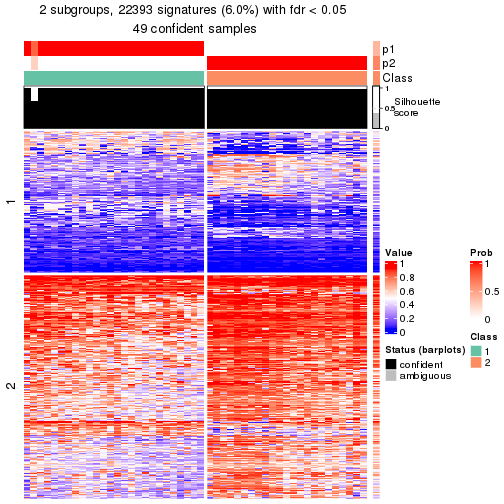</p>

</div>
<div id='tab-node-032-get-signatures-2'>
<pre><code class="r">get_signatures(res, k = 3)
</code></pre>

<p></p>

</div>
<div id='tab-node-032-get-signatures-3'>
<pre><code class="r">get_signatures(res, k = 4)
</code></pre>

<p></p>

</div>
<div id='tab-node-032-get-signatures-4'>
<pre><code class="r">get_signatures(res, k = 5)
</code></pre>

<p></p>

</div>
<div id='tab-node-032-get-signatures-5'>
<pre><code class="r">get_signatures(res, k = 6)
</code></pre>

<p></p>

</div>
<div id='tab-node-032-get-signatures-6'>
<pre><code class="r">get_signatures(res, k = 7)
</code></pre>

<p></p>

</div>
<div id='tab-node-032-get-signatures-7'>
<pre><code class="r">get_signatures(res, k = 8)
</code></pre>

<p></p>

</div>
</div>


Compare the overlap of signatures from different k:

```r
compare_signatures(res)
```


`get_signature()` returns a data frame invisibly. To get the list of signatures, the function
call should be assigned to a variable explicitly. In following code, if `plot` argument is set
to `FALSE`, no heatmap is plotted while only the differential analysis is performed.

```r
# code only for demonstration
tb = get_signature(res, k = ..., plot = FALSE)
```

An example of the output of `tb` is:

```
#>   which_row         fdr    mean_1    mean_2 scaled_mean_1 scaled_mean_2 km
#> 1        38 0.042760348  8.373488  9.131774    -0.5533452     0.5164555  1
#> 2        40 0.018707592  7.106213  8.469186    -0.6173731     0.5762149  1
#> 3        55 0.019134737 10.221463 11.207825    -0.6159697     0.5749050  1
#> 4        59 0.006059896  5.921854  7.869574    -0.6899429     0.6439467  1
#> 5        60 0.018055526  8.928898 10.211722    -0.6204761     0.5791110  1
#> 6        98 0.009384629 15.714769 14.887706     0.6635654    -0.6193277  2
...
```

The columns in `tb` are:

1. `which_row`: row indices corresponding to the input matrix.
2. `fdr`: FDR for the differential test. 
3. `mean_x`: The mean value in group x.
4. `scaled_mean_x`: The mean value in group x after rows are scaled.
5. `km`: Row groups if k-means clustering is applied to rows (which is done by automatically selecting number of clusters).

If there are too many signatures, `top_signatures = ...` can be set to only show the 
signatures with the highest FDRs:

```r
# code only for demonstration
# e.g. to show the top 500 most significant rows
tb = get_signature(res, k = ..., top_signatures = 500)
```

If the signatures are defined as these which are uniquely high in current group, `diff_method` argument
can be set to `"uniquely_high_in_one_group"`:

```r
# code only for demonstration
tb = get_signature(res, k = ..., diff_method = "uniquely_high_in_one_group")
```


UMAP plot which shows how samples are separated.


<script>
$( function() {
	$( '#tabs-node-032-dimension-reduction' ).tabs();
} );
</script>
<div id='tabs-node-032-dimension-reduction'>
<ul>
<li><a href='#tab-node-032-dimension-reduction-1'>k = 2</a></li>
<li><a href='#tab-node-032-dimension-reduction-2'>k = 3</a></li>
<li><a href='#tab-node-032-dimension-reduction-3'>k = 4</a></li>
<li><a href='#tab-node-032-dimension-reduction-4'>k = 5</a></li>
<li><a href='#tab-node-032-dimension-reduction-5'>k = 6</a></li>
<li><a href='#tab-node-032-dimension-reduction-6'>k = 7</a></li>
<li><a href='#tab-node-032-dimension-reduction-7'>k = 8</a></li>
</ul>
<div id='tab-node-032-dimension-reduction-1'>
<pre><code class="r">dimension_reduction(res, k = 2, method = &quot;UMAP&quot;)
</code></pre>

<p></p>

</div>
<div id='tab-node-032-dimension-reduction-2'>
<pre><code class="r">dimension_reduction(res, k = 3, method = &quot;UMAP&quot;)
</code></pre>

<p></p>

</div>
<div id='tab-node-032-dimension-reduction-3'>
<pre><code class="r">dimension_reduction(res, k = 4, method = &quot;UMAP&quot;)
</code></pre>

<p></p>

</div>
<div id='tab-node-032-dimension-reduction-4'>
<pre><code class="r">dimension_reduction(res, k = 5, method = &quot;UMAP&quot;)
</code></pre>

<p></p>

</div>
<div id='tab-node-032-dimension-reduction-5'>
<pre><code class="r">dimension_reduction(res, k = 6, method = &quot;UMAP&quot;)
</code></pre>

<p></p>

</div>
<div id='tab-node-032-dimension-reduction-6'>
<pre><code class="r">dimension_reduction(res, k = 7, method = &quot;UMAP&quot;)
</code></pre>

<p></p>

</div>
<div id='tab-node-032-dimension-reduction-7'>
<pre><code class="r">dimension_reduction(res, k = 8, method = &quot;UMAP&quot;)
</code></pre>

<p></p>

</div>
</div>


Following heatmap shows how subgroups are split when increasing `k`:

```r
collect_classes(res)
```


If matrix rows can be associated to genes, consider to use `functional_enrichment(res,
...)` to perform function enrichment for the signature genes. See [this vignette](https://jokergoo.github.io/cola_vignettes/functional_enrichment.html) for more detailed explanations.


 

---------------------------------------------------


### Node033


Parent node: [Node03](#Node03).
Child nodes: 
                [Node0111](#Node0111)
        ,
                [Node0112](#Node0112)
        ,
                Node0113-leaf
        ,
                [Node0121](#Node0121)
        ,
                Node0122-leaf
        ,
                Node0123-leaf
        ,
                Node0131-leaf
        ,
                [Node0132](#Node0132)
        ,
                Node0133-leaf
        ,
                Node0134-leaf
        ,
                Node0211-leaf
        ,
                Node0212-leaf
        ,
                [Node0213](#Node0213)
        ,
                Node0214-leaf
        ,
                [Node0221](#Node0221)
        ,
                [Node0222](#Node0222)
        ,
                [Node0231](#Node0231)
        ,
                Node0232-leaf
        ,
                Node0233-leaf
        ,
                Node0321-leaf
        ,
                Node0322-leaf
        ,
                Node0323-leaf
        ,
                [Node0331](#Node0331)
        ,
                [Node0332](#Node0332)
        ,
                Node0333-leaf
        .


The object with results only for a single top-value method and a single partitioning method 
can be extracted as:

```r
res = res_rh["033"]
```

A summary of `res` and all the functions that can be applied to it:

```r
res
```

```
#> A 'ConsensusPartition' object with k = 2, 3, 4, 5, 6, 7, 8.
#>   On a matrix with 30000 rows and 66 columns.
#>   Top rows (1000) are extracted by 'ATC' method.
#>   Subgroups are detected by 'skmeans' method.
#>   Performed in total 350 partitions by row resampling.
#>   Best k for subgroups seems to be 4.
#> 
#> Following methods can be applied to this 'ConsensusPartition' object:
#>  [1] "cola_report"             "collect_classes"         "collect_plots"          
#>  [4] "collect_stats"           "colnames"                "compare_partitions"     
#>  [7] "compare_signatures"      "consensus_heatmap"       "dimension_reduction"    
#> [10] "functional_enrichment"   "get_anno_col"            "get_anno"               
#> [13] "get_classes"             "get_consensus"           "get_matrix"             
#> [16] "get_membership"          "get_param"               "get_signatures"         
#> [19] "get_stats"               "is_best_k"               "is_stable_k"            
#> [22] "membership_heatmap"      "ncol"                    "nrow"                   
#> [25] "plot_ecdf"               "predict_classes"         "rownames"               
#> [28] "select_partition_number" "show"                    "suggest_best_k"         
#> [31] "test_to_known_factors"   "top_rows_heatmap"
```

`collect_plots()` function collects all the plots made from `res` for all `k` (number of subgroups)
into one single page to provide an easy and fast comparison between different `k`.

```r
collect_plots(res)
```


The plots are:

- The first row: a plot of the eCDF (empirical cumulative distribution
  function) curves of the consensus matrix for each `k` and the heatmap of
  predicted classes for each `k`.
- The second row: heatmaps of the consensus matrix for each `k`.
- The third row: heatmaps of the membership matrix for each `k`.
- The fouth row: heatmaps of the signatures for each `k`.

All the plots in panels can be made by individual functions and they are
plotted later in this section.

`select_partition_number()` produces several plots showing different
statistics for choosing "optimized" `k`. There are following statistics:

- eCDF curves of the consensus matrix for each `k`;
- 1-PAC. [The PAC score](https://en.wikipedia.org/wiki/Consensus_clustering#Over-interpretation_potential_of_consensus_clustering)
  measures the proportion of the ambiguous subgrouping.
- Mean silhouette score.
- Concordance. The mean probability of fiting the consensus subgroup labels in all
  partitions.
- Area increased. Denote $A_k$ as the area under the eCDF curve for current
  `k`, the area increased is defined as $A_k - A_{k-1}$.
- Rand index. The percent of pairs of samples that are both in a same cluster
  or both are not in a same cluster in the partition of k and k-1.
- Jaccard index. The ratio of pairs of samples are both in a same cluster in
  the partition of k and k-1 and the pairs of samples are both in a same
  cluster in the partition k or k-1.

The detailed explanations of these statistics can be found in [the _cola_
vignette](https://jokergoo.github.io/cola_vignettes/cola.html#toc_13).

Generally speaking, higher 1-PAC score, higher mean silhouette score or higher
concordance corresponds to better partition. Rand index and Jaccard index
measure how similar the current partition is compared to partition with `k-1`.
If they are too similar, we won't accept `k` is better than `k-1`.

```r
select_partition_number(res)
```


The numeric values for all these statistics can be obtained by `get_stats()`.

```r
get_stats(res)
```

```
#>   k 1-PAC mean_silhouette concordance area_increased  Rand Jaccard
#> 2 2 1.000           0.992       0.997         0.4799 0.522   0.522
#> 3 3 1.000           0.986       0.994         0.3161 0.821   0.666
#> 4 4 0.929           0.893       0.950         0.1242 0.896   0.727
#> 5 5 0.736           0.770       0.877         0.0998 0.878   0.607
#> 6 6 0.696           0.576       0.788         0.0342 0.924   0.681
#> 7 7 0.689           0.556       0.739         0.0110 0.897   0.586
#> 8 8 0.680           0.545       0.748         0.0200 0.918   0.639
```

`suggest_best_k()` suggests the best $k$ based on these statistics. The rules are as follows:

- All $k$ with Jaccard index larger than 0.95 are removed because increasing
  $k$ does not provide enough extra information. If all $k$ are removed, it is
  marked as no subgroup is detected.
- For all $k$ with 1-PAC score larger than 0.9, the maximal $k$ is taken as
  the best $k$, and other $k$ are marked as optional $k$.
- If it does not fit the second rule. The $k$ with the maximal vote of the
  highest 1-PAC score, highest mean silhouette, and highest concordance is
  taken as the best $k$.

```r
suggest_best_k(res)
```

```
#> [1] 4
#> attr(,"optional")
#> [1] 2 3
```

There is also optional best $k$ = 2 3 that is worth to check.

Following is the table of the partitions (You need to click the **show/hide
code output** link to see it). The membership matrix (columns with name `p*`)
is inferred by
[`clue::cl_consensus()`](https://www.rdocumentation.org/link/cl_consensus?package=clue)
function with the `SE` method. Basically the value in the membership matrix
represents the probability to belong to a certain group. The finall subgroup
label for an item is determined with the group with highest probability it
belongs to.

In `get_classes()` function, the entropy is calculated from the membership
matrix and the silhouette score is calculated from the consensus matrix.


<script>
$( function() {
	$( '#tabs-node-033-get-classes' ).tabs();
} );
</script>
<div id='tabs-node-033-get-classes'>
<ul>
<li><a href='#tab-node-033-get-classes-1'>k = 2</a></li>
<li><a href='#tab-node-033-get-classes-2'>k = 3</a></li>
<li><a href='#tab-node-033-get-classes-3'>k = 4</a></li>
<li><a href='#tab-node-033-get-classes-4'>k = 5</a></li>
<li><a href='#tab-node-033-get-classes-5'>k = 6</a></li>
<li><a href='#tab-node-033-get-classes-6'>k = 7</a></li>
<li><a href='#tab-node-033-get-classes-7'>k = 8</a></li>
</ul>

<div id='tab-node-033-get-classes-1'>
<p><a id='tab-node-033-get-classes-1-a' style='color:#0366d6' href='#'>show/hide code output</a></p>
<pre><code class="r">cbind(get_classes(res, k = 2), get_membership(res, k = 2))
</code></pre>

<pre><code>#&gt;                 class entropy silhouette   p1   p2
#&gt; TCGA.UY.A9PE.01     2    0.00      0.994 0.00 1.00
#&gt; TCGA.ZF.AA52.01     2    0.00      0.994 0.00 1.00
#&gt; TCGA.ZF.A9RF.01     1    0.00      1.000 1.00 0.00
#&gt; TCGA.BT.A3PJ.01     1    0.00      1.000 1.00 0.00
#&gt; TCGA.YC.A9TC.01     1    0.00      1.000 1.00 0.00
#&gt; TCGA.DK.A1A7.01     2    0.00      0.994 0.00 1.00
#&gt; TCGA.BT.A2LB.01     2    0.00      0.994 0.00 1.00
#&gt; TCGA.GV.A3QF.01     2    0.00      0.994 0.00 1.00
#&gt; TCGA.E7.A97P.01     1    0.00      1.000 1.00 0.00
#&gt; TCGA.DK.AA6S.01     2    0.76      0.718 0.22 0.78
#&gt; TCGA.XF.AAMW.01     1    0.00      1.000 1.00 0.00
#&gt; TCGA.FD.A6TC.01     2    0.00      0.994 0.00 1.00
#&gt; TCGA.XF.A9SK.01     2    0.00      0.994 0.00 1.00
#&gt; TCGA.BT.A20T.01     2    0.00      0.994 0.00 1.00
#&gt; TCGA.UY.A78K.01     2    0.00      0.994 0.00 1.00
#&gt; TCGA.BT.A20W.01     2    0.00      0.994 0.00 1.00
#&gt; TCGA.E7.A6MD.01     2    0.00      0.994 0.00 1.00
#&gt; TCGA.DK.A6B6.01     2    0.00      0.994 0.00 1.00
#&gt; TCGA.GD.A2C5.01     2    0.00      0.994 0.00 1.00
#&gt; TCGA.FD.A3SR.01     2    0.00      0.994 0.00 1.00
#&gt; TCGA.ZF.AA5H.01     1    0.00      1.000 1.00 0.00
#&gt; TCGA.G2.A2EJ.01     1    0.00      1.000 1.00 0.00
#&gt; TCGA.G2.A2EF.01     1    0.00      1.000 1.00 0.00
#&gt; TCGA.FD.A5C1.01     1    0.00      1.000 1.00 0.00
#&gt; TCGA.XF.A8HH.01     2    0.00      0.994 0.00 1.00
#&gt; TCGA.LC.A66R.01     1    0.00      1.000 1.00 0.00
#&gt; TCGA.FT.A3EE.01     2    0.00      0.994 0.00 1.00
#&gt; TCGA.ZF.A9R1.01     2    0.00      0.994 0.00 1.00
#&gt; TCGA.CF.A47S.01     2    0.00      0.994 0.00 1.00
#&gt; TCGA.E7.A3X6.01     2    0.00      0.994 0.00 1.00
#&gt; TCGA.FD.A6TG.01     2    0.00      0.994 0.00 1.00
#&gt; TCGA.UY.A78L.01     1    0.00      1.000 1.00 0.00
#&gt; TCGA.FD.A6TA.01     2    0.00      0.994 0.00 1.00
#&gt; TCGA.YC.A89H.01     2    0.00      0.994 0.00 1.00
#&gt; TCGA.BT.A20Q.01     2    0.00      0.994 0.00 1.00
#&gt; TCGA.E7.A6ME.01     2    0.00      0.994 0.00 1.00
#&gt; TCGA.SY.A9G5.01     1    0.00      1.000 1.00 0.00
#&gt; TCGA.ZF.A9RM.01     2    0.00      0.994 0.00 1.00
#&gt; TCGA.FD.A5BR.01     2    0.00      0.994 0.00 1.00
#&gt; TCGA.ZF.AA51.01     2    0.00      0.994 0.00 1.00
#&gt; TCGA.DK.A3WW.01     1    0.00      1.000 1.00 0.00
#&gt; TCGA.DK.A1A6.06     2    0.00      0.994 0.00 1.00
#&gt; TCGA.GD.A76B.01     2    0.00      0.994 0.00 1.00
#&gt; TCGA.BT.A20J.01     1    0.00      1.000 1.00 0.00
#&gt; TCGA.GC.A3YS.01     1    0.00      1.000 1.00 0.00
#&gt; TCGA.DK.A3IV.01     2    0.00      0.994 0.00 1.00
#&gt; TCGA.FD.A3SQ.01     2    0.00      0.994 0.00 1.00
#&gt; TCGA.DK.A3IM.01     1    0.00      1.000 1.00 0.00
#&gt; TCGA.S5.A6DX.01     2    0.00      0.994 0.00 1.00
#&gt; TCGA.ZF.A9R0.01     2    0.00      0.994 0.00 1.00
#&gt; TCGA.GU.A42R.01     2    0.00      0.994 0.00 1.00
#&gt; TCGA.ZF.AA4N.01     1    0.00      1.000 1.00 0.00
#&gt; TCGA.CF.A1HR.01     2    0.00      0.994 0.00 1.00
#&gt; TCGA.UY.A8OD.01     2    0.00      0.994 0.00 1.00
#&gt; TCGA.4Z.AA84.01     1    0.00      1.000 1.00 0.00
#&gt; TCGA.E7.A8O7.01     2    0.00      0.994 0.00 1.00
#&gt; TCGA.GV.A3QG.01     1    0.00      1.000 1.00 0.00
#&gt; TCGA.FD.A6TD.01     1    0.00      1.000 1.00 0.00
#&gt; TCGA.DK.A6AV.01     2    0.00      0.994 0.00 1.00
#&gt; TCGA.DK.A3IT.01     2    0.00      0.994 0.00 1.00
#&gt; TCGA.CU.A0YN.01     1    0.00      1.000 1.00 0.00
#&gt; TCGA.FJ.A3Z7.01     2    0.00      0.994 0.00 1.00
#&gt; TCGA.4Z.AA82.01     1    0.00      1.000 1.00 0.00
#&gt; TCGA.GC.A6I1.01     1    0.00      1.000 1.00 0.00
#&gt; TCGA.FD.A3B6.01     1    0.00      1.000 1.00 0.00
#&gt; TCGA.BT.A20V.01     1    0.00      1.000 1.00 0.00
</code></pre>

<script>
$('#tab-node-033-get-classes-1-a').parent().next().next().hide();
$('#tab-node-033-get-classes-1-a').click(function(){
  $('#tab-node-033-get-classes-1-a').parent().next().next().toggle();
  return(false);
});
</script>
</div>

<div id='tab-node-033-get-classes-2'>
<p><a id='tab-node-033-get-classes-2-a' style='color:#0366d6' href='#'>show/hide code output</a></p>
<pre><code class="r">cbind(get_classes(res, k = 3), get_membership(res, k = 3))
</code></pre>

<pre><code>#&gt;                 class entropy silhouette   p1   p2   p3
#&gt; TCGA.UY.A9PE.01     2  0.0000      0.986 0.00 1.00 0.00
#&gt; TCGA.ZF.AA52.01     2  0.0000      0.986 0.00 1.00 0.00
#&gt; TCGA.ZF.A9RF.01     1  0.0000      0.999 1.00 0.00 0.00
#&gt; TCGA.BT.A3PJ.01     1  0.0000      0.999 1.00 0.00 0.00
#&gt; TCGA.YC.A9TC.01     1  0.0000      0.999 1.00 0.00 0.00
#&gt; TCGA.DK.A1A7.01     3  0.0000      1.000 0.00 0.00 1.00
#&gt; TCGA.BT.A2LB.01     2  0.0000      0.986 0.00 1.00 0.00
#&gt; TCGA.GV.A3QF.01     2  0.0000      0.986 0.00 1.00 0.00
#&gt; TCGA.E7.A97P.01     1  0.0000      0.999 1.00 0.00 0.00
#&gt; TCGA.DK.AA6S.01     2  0.0000      0.986 0.00 1.00 0.00
#&gt; TCGA.XF.AAMW.01     1  0.0000      0.999 1.00 0.00 0.00
#&gt; TCGA.FD.A6TC.01     2  0.0000      0.986 0.00 1.00 0.00
#&gt; TCGA.XF.A9SK.01     2  0.0000      0.986 0.00 1.00 0.00
#&gt; TCGA.BT.A20T.01     3  0.0000      1.000 0.00 0.00 1.00
#&gt; TCGA.UY.A78K.01     2  0.0000      0.986 0.00 1.00 0.00
#&gt; TCGA.BT.A20W.01     3  0.0000      1.000 0.00 0.00 1.00
#&gt; TCGA.E7.A6MD.01     2  0.0000      0.986 0.00 1.00 0.00
#&gt; TCGA.DK.A6B6.01     3  0.0000      1.000 0.00 0.00 1.00
#&gt; TCGA.GD.A2C5.01     2  0.0000      0.986 0.00 1.00 0.00
#&gt; TCGA.FD.A3SR.01     2  0.0000      0.986 0.00 1.00 0.00
#&gt; TCGA.ZF.AA5H.01     1  0.0000      0.999 1.00 0.00 0.00
#&gt; TCGA.G2.A2EJ.01     1  0.0000      0.999 1.00 0.00 0.00
#&gt; TCGA.G2.A2EF.01     1  0.0000      0.999 1.00 0.00 0.00
#&gt; TCGA.FD.A5C1.01     1  0.0000      0.999 1.00 0.00 0.00
#&gt; TCGA.XF.A8HH.01     2  0.0000      0.986 0.00 1.00 0.00
#&gt; TCGA.LC.A66R.01     1  0.0000      0.999 1.00 0.00 0.00
#&gt; TCGA.FT.A3EE.01     2  0.0000      0.986 0.00 1.00 0.00
#&gt; TCGA.ZF.A9R1.01     3  0.0000      1.000 0.00 0.00 1.00
#&gt; TCGA.CF.A47S.01     3  0.0000      1.000 0.00 0.00 1.00
#&gt; TCGA.E7.A3X6.01     2  0.0000      0.986 0.00 1.00 0.00
#&gt; TCGA.FD.A6TG.01     2  0.0000      0.986 0.00 1.00 0.00
#&gt; TCGA.UY.A78L.01     1  0.0000      0.999 1.00 0.00 0.00
#&gt; TCGA.FD.A6TA.01     2  0.0000      0.986 0.00 1.00 0.00
#&gt; TCGA.YC.A89H.01     2  0.0000      0.986 0.00 1.00 0.00
#&gt; TCGA.BT.A20Q.01     3  0.0000      1.000 0.00 0.00 1.00
#&gt; TCGA.E7.A6ME.01     2  0.2066      0.930 0.00 0.94 0.06
#&gt; TCGA.SY.A9G5.01     1  0.0892      0.975 0.98 0.02 0.00
#&gt; TCGA.ZF.A9RM.01     3  0.0000      1.000 0.00 0.00 1.00
#&gt; TCGA.FD.A5BR.01     2  0.0000      0.986 0.00 1.00 0.00
#&gt; TCGA.ZF.AA51.01     2  0.0000      0.986 0.00 1.00 0.00
#&gt; TCGA.DK.A3WW.01     1  0.0000      0.999 1.00 0.00 0.00
#&gt; TCGA.DK.A1A6.06     2  0.4002      0.812 0.00 0.84 0.16
#&gt; TCGA.GD.A76B.01     2  0.0000      0.986 0.00 1.00 0.00
#&gt; TCGA.BT.A20J.01     2  0.4291      0.767 0.18 0.82 0.00
#&gt; TCGA.GC.A3YS.01     1  0.0000      0.999 1.00 0.00 0.00
#&gt; TCGA.DK.A3IV.01     2  0.0000      0.986 0.00 1.00 0.00
#&gt; TCGA.FD.A3SQ.01     2  0.0000      0.986 0.00 1.00 0.00
#&gt; TCGA.DK.A3IM.01     1  0.0000      0.999 1.00 0.00 0.00
#&gt; TCGA.S5.A6DX.01     2  0.0000      0.986 0.00 1.00 0.00
#&gt; TCGA.ZF.A9R0.01     2  0.0000      0.986 0.00 1.00 0.00
#&gt; TCGA.GU.A42R.01     3  0.0000      1.000 0.00 0.00 1.00
#&gt; TCGA.ZF.AA4N.01     1  0.0000      0.999 1.00 0.00 0.00
#&gt; TCGA.CF.A1HR.01     2  0.0000      0.986 0.00 1.00 0.00
#&gt; TCGA.UY.A8OD.01     2  0.0000      0.986 0.00 1.00 0.00
#&gt; TCGA.4Z.AA84.01     1  0.0000      0.999 1.00 0.00 0.00
#&gt; TCGA.E7.A8O7.01     3  0.0000      1.000 0.00 0.00 1.00
#&gt; TCGA.GV.A3QG.01     1  0.0000      0.999 1.00 0.00 0.00
#&gt; TCGA.FD.A6TD.01     1  0.0000      0.999 1.00 0.00 0.00
#&gt; TCGA.DK.A6AV.01     2  0.0000      0.986 0.00 1.00 0.00
#&gt; TCGA.DK.A3IT.01     2  0.0000      0.986 0.00 1.00 0.00
#&gt; TCGA.CU.A0YN.01     1  0.0000      0.999 1.00 0.00 0.00
#&gt; TCGA.FJ.A3Z7.01     3  0.0000      1.000 0.00 0.00 1.00
#&gt; TCGA.4Z.AA82.01     1  0.0000      0.999 1.00 0.00 0.00
#&gt; TCGA.GC.A6I1.01     1  0.0000      0.999 1.00 0.00 0.00
#&gt; TCGA.FD.A3B6.01     1  0.0000      0.999 1.00 0.00 0.00
#&gt; TCGA.BT.A20V.01     1  0.0000      0.999 1.00 0.00 0.00
</code></pre>

<script>
$('#tab-node-033-get-classes-2-a').parent().next().next().hide();
$('#tab-node-033-get-classes-2-a').click(function(){
  $('#tab-node-033-get-classes-2-a').parent().next().next().toggle();
  return(false);
});
</script>
</div>

<div id='tab-node-033-get-classes-3'>
<p><a id='tab-node-033-get-classes-3-a' style='color:#0366d6' href='#'>show/hide code output</a></p>
<pre><code class="r">cbind(get_classes(res, k = 4), get_membership(res, k = 4))
</code></pre>

<pre><code>#&gt;                 class entropy silhouette   p1   p2   p3   p4
#&gt; TCGA.UY.A9PE.01     2  0.0000      0.998 0.00 1.00 0.00 0.00
#&gt; TCGA.ZF.AA52.01     4  0.4948      0.259 0.00 0.44 0.00 0.56
#&gt; TCGA.ZF.A9RF.01     1  0.0000      0.877 1.00 0.00 0.00 0.00
#&gt; TCGA.BT.A3PJ.01     1  0.0000      0.877 1.00 0.00 0.00 0.00
#&gt; TCGA.YC.A9TC.01     4  0.0000      0.827 0.00 0.00 0.00 1.00
#&gt; TCGA.DK.A1A7.01     3  0.0000      0.963 0.00 0.00 1.00 0.00
#&gt; TCGA.BT.A2LB.01     2  0.0000      0.998 0.00 1.00 0.00 0.00
#&gt; TCGA.GV.A3QF.01     2  0.0000      0.998 0.00 1.00 0.00 0.00
#&gt; TCGA.E7.A97P.01     1  0.4624      0.667 0.66 0.00 0.00 0.34
#&gt; TCGA.DK.AA6S.01     4  0.0000      0.827 0.00 0.00 0.00 1.00
#&gt; TCGA.XF.AAMW.01     1  0.4624      0.667 0.66 0.00 0.00 0.34
#&gt; TCGA.FD.A6TC.01     2  0.0707      0.978 0.00 0.98 0.00 0.02
#&gt; TCGA.XF.A9SK.01     4  0.4713      0.447 0.00 0.36 0.00 0.64
#&gt; TCGA.BT.A20T.01     3  0.0000      0.963 0.00 0.00 1.00 0.00
#&gt; TCGA.UY.A78K.01     2  0.0000      0.998 0.00 1.00 0.00 0.00
#&gt; TCGA.BT.A20W.01     3  0.0000      0.963 0.00 0.00 1.00 0.00
#&gt; TCGA.E7.A6MD.01     2  0.0000      0.998 0.00 1.00 0.00 0.00
#&gt; TCGA.DK.A6B6.01     3  0.0000      0.963 0.00 0.00 1.00 0.00
#&gt; TCGA.GD.A2C5.01     2  0.0000      0.998 0.00 1.00 0.00 0.00
#&gt; TCGA.FD.A3SR.01     2  0.0000      0.998 0.00 1.00 0.00 0.00
#&gt; TCGA.ZF.AA5H.01     1  0.0000      0.877 1.00 0.00 0.00 0.00
#&gt; TCGA.G2.A2EJ.01     1  0.4624      0.667 0.66 0.00 0.00 0.34
#&gt; TCGA.G2.A2EF.01     1  0.0000      0.877 1.00 0.00 0.00 0.00
#&gt; TCGA.FD.A5C1.01     1  0.4277      0.729 0.72 0.00 0.00 0.28
#&gt; TCGA.XF.A8HH.01     2  0.0000      0.998 0.00 1.00 0.00 0.00
#&gt; TCGA.LC.A66R.01     1  0.0000      0.877 1.00 0.00 0.00 0.00
#&gt; TCGA.FT.A3EE.01     2  0.0707      0.978 0.00 0.98 0.00 0.02
#&gt; TCGA.ZF.A9R1.01     3  0.3801      0.664 0.00 0.22 0.78 0.00
#&gt; TCGA.CF.A47S.01     3  0.0000      0.963 0.00 0.00 1.00 0.00
#&gt; TCGA.E7.A3X6.01     2  0.0000      0.998 0.00 1.00 0.00 0.00
#&gt; TCGA.FD.A6TG.01     2  0.0000      0.998 0.00 1.00 0.00 0.00
#&gt; TCGA.UY.A78L.01     1  0.2647      0.832 0.88 0.00 0.00 0.12
#&gt; TCGA.FD.A6TA.01     2  0.0000      0.998 0.00 1.00 0.00 0.00
#&gt; TCGA.YC.A89H.01     2  0.0000      0.998 0.00 1.00 0.00 0.00
#&gt; TCGA.BT.A20Q.01     3  0.0000      0.963 0.00 0.00 1.00 0.00
#&gt; TCGA.E7.A6ME.01     2  0.0000      0.998 0.00 1.00 0.00 0.00
#&gt; TCGA.SY.A9G5.01     4  0.0000      0.827 0.00 0.00 0.00 1.00
#&gt; TCGA.ZF.A9RM.01     3  0.0000      0.963 0.00 0.00 1.00 0.00
#&gt; TCGA.FD.A5BR.01     2  0.0000      0.998 0.00 1.00 0.00 0.00
#&gt; TCGA.ZF.AA51.01     2  0.0000      0.998 0.00 1.00 0.00 0.00
#&gt; TCGA.DK.A3WW.01     1  0.0000      0.877 1.00 0.00 0.00 0.00
#&gt; TCGA.DK.A1A6.06     2  0.0000      0.998 0.00 1.00 0.00 0.00
#&gt; TCGA.GD.A76B.01     2  0.0000      0.998 0.00 1.00 0.00 0.00
#&gt; TCGA.BT.A20J.01     4  0.0000      0.827 0.00 0.00 0.00 1.00
#&gt; TCGA.GC.A3YS.01     1  0.4277      0.729 0.72 0.00 0.00 0.28
#&gt; TCGA.DK.A3IV.01     2  0.0000      0.998 0.00 1.00 0.00 0.00
#&gt; TCGA.FD.A3SQ.01     2  0.0000      0.998 0.00 1.00 0.00 0.00
#&gt; TCGA.DK.A3IM.01     4  0.0000      0.827 0.00 0.00 0.00 1.00
#&gt; TCGA.S5.A6DX.01     2  0.0000      0.998 0.00 1.00 0.00 0.00
#&gt; TCGA.ZF.A9R0.01     2  0.0000      0.998 0.00 1.00 0.00 0.00
#&gt; TCGA.GU.A42R.01     3  0.0000      0.963 0.00 0.00 1.00 0.00
#&gt; TCGA.ZF.AA4N.01     1  0.0000      0.877 1.00 0.00 0.00 0.00
#&gt; TCGA.CF.A1HR.01     2  0.0000      0.998 0.00 1.00 0.00 0.00
#&gt; TCGA.UY.A8OD.01     2  0.0000      0.998 0.00 1.00 0.00 0.00
#&gt; TCGA.4Z.AA84.01     1  0.4522      0.688 0.68 0.00 0.00 0.32
#&gt; TCGA.E7.A8O7.01     3  0.0000      0.963 0.00 0.00 1.00 0.00
#&gt; TCGA.GV.A3QG.01     1  0.0000      0.877 1.00 0.00 0.00 0.00
#&gt; TCGA.FD.A6TD.01     1  0.1637      0.858 0.94 0.00 0.00 0.06
#&gt; TCGA.DK.A6AV.01     2  0.0000      0.998 0.00 1.00 0.00 0.00
#&gt; TCGA.DK.A3IT.01     2  0.0000      0.998 0.00 1.00 0.00 0.00
#&gt; TCGA.CU.A0YN.01     1  0.0000      0.877 1.00 0.00 0.00 0.00
#&gt; TCGA.FJ.A3Z7.01     3  0.1211      0.922 0.00 0.04 0.96 0.00
#&gt; TCGA.4Z.AA82.01     4  0.0000      0.827 0.00 0.00 0.00 1.00
#&gt; TCGA.GC.A6I1.01     1  0.0000      0.877 1.00 0.00 0.00 0.00
#&gt; TCGA.FD.A3B6.01     1  0.0000      0.877 1.00 0.00 0.00 0.00
#&gt; TCGA.BT.A20V.01     4  0.2921      0.651 0.14 0.00 0.00 0.86
</code></pre>

<script>
$('#tab-node-033-get-classes-3-a').parent().next().next().hide();
$('#tab-node-033-get-classes-3-a').click(function(){
  $('#tab-node-033-get-classes-3-a').parent().next().next().toggle();
  return(false);
});
</script>
</div>

<div id='tab-node-033-get-classes-4'>
<p><a id='tab-node-033-get-classes-4-a' style='color:#0366d6' href='#'>show/hide code output</a></p>
<pre><code class="r">cbind(get_classes(res, k = 5), get_membership(res, k = 5))
</code></pre>

<pre><code>#&gt;                 class entropy silhouette   p1   p2   p3   p4   p5
#&gt; TCGA.UY.A9PE.01     5  0.3561      0.713 0.00 0.26 0.00 0.00 0.74
#&gt; TCGA.ZF.AA52.01     5  0.1648      0.677 0.00 0.02 0.00 0.04 0.94
#&gt; TCGA.ZF.A9RF.01     1  0.0000      0.846 1.00 0.00 0.00 0.00 0.00
#&gt; TCGA.BT.A3PJ.01     1  0.0000      0.846 1.00 0.00 0.00 0.00 0.00
#&gt; TCGA.YC.A9TC.01     4  0.0609      0.909 0.00 0.00 0.00 0.98 0.02
#&gt; TCGA.DK.A1A7.01     3  0.0000      0.926 0.00 0.00 1.00 0.00 0.00
#&gt; TCGA.BT.A2LB.01     5  0.4262      0.434 0.00 0.44 0.00 0.00 0.56
#&gt; TCGA.GV.A3QF.01     5  0.1732      0.745 0.00 0.08 0.00 0.00 0.92
#&gt; TCGA.E7.A97P.01     1  0.4302      0.342 0.52 0.00 0.00 0.48 0.00
#&gt; TCGA.DK.AA6S.01     4  0.1410      0.905 0.00 0.00 0.00 0.94 0.06
#&gt; TCGA.XF.AAMW.01     1  0.4302      0.342 0.52 0.00 0.00 0.48 0.00
#&gt; TCGA.FD.A6TC.01     5  0.0609      0.692 0.00 0.02 0.00 0.00 0.98
#&gt; TCGA.XF.A9SK.01     5  0.3852      0.441 0.00 0.02 0.00 0.22 0.76
#&gt; TCGA.BT.A20T.01     3  0.2020      0.942 0.00 0.10 0.90 0.00 0.00
#&gt; TCGA.UY.A78K.01     5  0.4060      0.635 0.00 0.36 0.00 0.00 0.64
#&gt; TCGA.BT.A20W.01     3  0.2020      0.942 0.00 0.10 0.90 0.00 0.00
#&gt; TCGA.E7.A6MD.01     2  0.1043      0.852 0.00 0.96 0.00 0.00 0.04
#&gt; TCGA.DK.A6B6.01     3  0.2020      0.942 0.00 0.10 0.90 0.00 0.00
#&gt; TCGA.GD.A2C5.01     5  0.3109      0.744 0.00 0.20 0.00 0.00 0.80
#&gt; TCGA.FD.A3SR.01     2  0.0000      0.868 0.00 1.00 0.00 0.00 0.00
#&gt; TCGA.ZF.AA5H.01     1  0.0000      0.846 1.00 0.00 0.00 0.00 0.00
#&gt; TCGA.G2.A2EJ.01     1  0.4302      0.342 0.52 0.00 0.00 0.48 0.00
#&gt; TCGA.G2.A2EF.01     1  0.0000      0.846 1.00 0.00 0.00 0.00 0.00
#&gt; TCGA.FD.A5C1.01     1  0.3424      0.708 0.76 0.00 0.00 0.24 0.00
#&gt; TCGA.XF.A8HH.01     2  0.2020      0.821 0.00 0.90 0.00 0.00 0.10
#&gt; TCGA.LC.A66R.01     1  0.0000      0.846 1.00 0.00 0.00 0.00 0.00
#&gt; TCGA.FT.A3EE.01     5  0.1732      0.754 0.00 0.08 0.00 0.00 0.92
#&gt; TCGA.ZF.A9R1.01     2  0.1410      0.820 0.00 0.94 0.06 0.00 0.00
#&gt; TCGA.CF.A47S.01     3  0.0000      0.926 0.00 0.00 1.00 0.00 0.00
#&gt; TCGA.E7.A3X6.01     5  0.2516      0.747 0.00 0.14 0.00 0.00 0.86
#&gt; TCGA.FD.A6TG.01     2  0.0000      0.868 0.00 1.00 0.00 0.00 0.00
#&gt; TCGA.UY.A78L.01     1  0.2732      0.771 0.84 0.00 0.00 0.16 0.00
#&gt; TCGA.FD.A6TA.01     2  0.3796      0.445 0.00 0.70 0.00 0.00 0.30
#&gt; TCGA.YC.A89H.01     2  0.0609      0.863 0.00 0.98 0.00 0.00 0.02
#&gt; TCGA.BT.A20Q.01     3  0.2020      0.942 0.00 0.10 0.90 0.00 0.00
#&gt; TCGA.E7.A6ME.01     2  0.0000      0.868 0.00 1.00 0.00 0.00 0.00
#&gt; TCGA.SY.A9G5.01     4  0.2732      0.866 0.00 0.00 0.00 0.84 0.16
#&gt; TCGA.ZF.A9RM.01     3  0.0000      0.926 0.00 0.00 1.00 0.00 0.00
#&gt; TCGA.FD.A5BR.01     5  0.4126      0.611 0.00 0.38 0.00 0.00 0.62
#&gt; TCGA.ZF.AA51.01     2  0.0609      0.863 0.00 0.98 0.00 0.00 0.02
#&gt; TCGA.DK.A3WW.01     1  0.0000      0.846 1.00 0.00 0.00 0.00 0.00
#&gt; TCGA.DK.A1A6.06     2  0.0609      0.863 0.00 0.98 0.00 0.00 0.02
#&gt; TCGA.GD.A76B.01     2  0.3983      0.314 0.00 0.66 0.00 0.00 0.34
#&gt; TCGA.BT.A20J.01     4  0.3109      0.826 0.00 0.00 0.00 0.80 0.20
#&gt; TCGA.GC.A3YS.01     1  0.3796      0.654 0.70 0.00 0.00 0.30 0.00
#&gt; TCGA.DK.A3IV.01     5  0.4182      0.574 0.00 0.40 0.00 0.00 0.60
#&gt; TCGA.FD.A3SQ.01     2  0.0000      0.868 0.00 1.00 0.00 0.00 0.00
#&gt; TCGA.DK.A3IM.01     4  0.0000      0.906 0.00 0.00 0.00 1.00 0.00
#&gt; TCGA.S5.A6DX.01     2  0.0000      0.868 0.00 1.00 0.00 0.00 0.00
#&gt; TCGA.ZF.A9R0.01     2  0.3109      0.703 0.00 0.80 0.00 0.00 0.20
#&gt; TCGA.GU.A42R.01     3  0.2020      0.942 0.00 0.10 0.90 0.00 0.00
#&gt; TCGA.ZF.AA4N.01     1  0.0000      0.846 1.00 0.00 0.00 0.00 0.00
#&gt; TCGA.CF.A1HR.01     2  0.0000      0.868 0.00 1.00 0.00 0.00 0.00
#&gt; TCGA.UY.A8OD.01     5  0.3424      0.723 0.00 0.24 0.00 0.00 0.76
#&gt; TCGA.4Z.AA84.01     1  0.3983      0.592 0.66 0.00 0.00 0.34 0.00
#&gt; TCGA.E7.A8O7.01     3  0.0000      0.926 0.00 0.00 1.00 0.00 0.00
#&gt; TCGA.GV.A3QG.01     1  0.0000      0.846 1.00 0.00 0.00 0.00 0.00
#&gt; TCGA.FD.A6TD.01     1  0.1732      0.815 0.92 0.00 0.00 0.08 0.00
#&gt; TCGA.DK.A6AV.01     2  0.3109      0.703 0.00 0.80 0.00 0.00 0.20
#&gt; TCGA.DK.A3IT.01     2  0.1732      0.822 0.00 0.92 0.00 0.00 0.08
#&gt; TCGA.CU.A0YN.01     1  0.0000      0.846 1.00 0.00 0.00 0.00 0.00
#&gt; TCGA.FJ.A3Z7.01     2  0.3109      0.641 0.00 0.80 0.20 0.00 0.00
#&gt; TCGA.4Z.AA82.01     4  0.0000      0.906 0.00 0.00 0.00 1.00 0.00
#&gt; TCGA.GC.A6I1.01     1  0.0000      0.846 1.00 0.00 0.00 0.00 0.00
#&gt; TCGA.FD.A3B6.01     1  0.0000      0.846 1.00 0.00 0.00 0.00 0.00
#&gt; TCGA.BT.A20V.01     4  0.2280      0.770 0.12 0.00 0.00 0.88 0.00
</code></pre>

<script>
$('#tab-node-033-get-classes-4-a').parent().next().next().hide();
$('#tab-node-033-get-classes-4-a').click(function(){
  $('#tab-node-033-get-classes-4-a').parent().next().next().toggle();
  return(false);
});
</script>
</div>

<div id='tab-node-033-get-classes-5'>
<p><a id='tab-node-033-get-classes-5-a' style='color:#0366d6' href='#'>show/hide code output</a></p>
<pre><code class="r">cbind(get_classes(res, k = 6), get_membership(res, k = 6))
</code></pre>

<pre><code>#&gt;                 class entropy silhouette   p1   p2   p3   p4   p5   p6
#&gt; TCGA.UY.A9PE.01     5  0.2631    0.64798 0.00 0.18 0.00 0.00 0.82 0.00
#&gt; TCGA.ZF.AA52.01     5  0.5405   -0.23103 0.00 0.04 0.00 0.04 0.50 0.42
#&gt; TCGA.ZF.A9RF.01     1  0.0000    0.89708 1.00 0.00 0.00 0.00 0.00 0.00
#&gt; TCGA.BT.A3PJ.01     1  0.0000    0.89708 1.00 0.00 0.00 0.00 0.00 0.00
#&gt; TCGA.YC.A9TC.01     4  0.4632    0.07921 0.00 0.00 0.00 0.52 0.04 0.44
#&gt; TCGA.DK.A1A7.01     3  0.0547    0.87746 0.00 0.00 0.98 0.00 0.00 0.02
#&gt; TCGA.BT.A2LB.01     5  0.3198    0.61025 0.00 0.26 0.00 0.00 0.74 0.00
#&gt; TCGA.GV.A3QF.01     5  0.3270    0.54124 0.00 0.06 0.00 0.00 0.82 0.12
#&gt; TCGA.E7.A97P.01     4  0.4002    0.49280 0.32 0.00 0.00 0.66 0.00 0.02
#&gt; TCGA.DK.AA6S.01     4  0.4078   -0.17818 0.00 0.00 0.00 0.64 0.02 0.34
#&gt; TCGA.XF.AAMW.01     4  0.4002    0.49280 0.32 0.00 0.00 0.66 0.00 0.02
#&gt; TCGA.FD.A6TC.01     5  0.4121    0.45481 0.00 0.06 0.00 0.00 0.72 0.22
#&gt; TCGA.XF.A9SK.01     6  0.5371    0.39231 0.00 0.00 0.00 0.12 0.36 0.52
#&gt; TCGA.BT.A20T.01     3  0.2260    0.90444 0.00 0.14 0.86 0.00 0.00 0.00
#&gt; TCGA.UY.A78K.01     5  0.5509    0.58827 0.00 0.30 0.00 0.00 0.54 0.16
#&gt; TCGA.BT.A20W.01     3  0.2260    0.90444 0.00 0.14 0.86 0.00 0.00 0.00
#&gt; TCGA.E7.A6MD.01     2  0.1556    0.75813 0.00 0.92 0.00 0.00 0.08 0.00
#&gt; TCGA.DK.A6B6.01     3  0.2260    0.90444 0.00 0.14 0.86 0.00 0.00 0.00
#&gt; TCGA.GD.A2C5.01     5  0.3351    0.63377 0.00 0.16 0.00 0.00 0.80 0.04
#&gt; TCGA.FD.A3SR.01     2  0.1635    0.76367 0.00 0.94 0.02 0.00 0.02 0.02
#&gt; TCGA.ZF.AA5H.01     1  0.0000    0.89708 1.00 0.00 0.00 0.00 0.00 0.00
#&gt; TCGA.G2.A2EJ.01     4  0.4002    0.49280 0.32 0.00 0.00 0.66 0.00 0.02
#&gt; TCGA.G2.A2EF.01     1  0.0000    0.89708 1.00 0.00 0.00 0.00 0.00 0.00
#&gt; TCGA.FD.A5C1.01     4  0.4801    0.18304 0.46 0.00 0.00 0.50 0.02 0.02
#&gt; TCGA.XF.A8HH.01     2  0.2454    0.71019 0.00 0.84 0.00 0.00 0.16 0.00
#&gt; TCGA.LC.A66R.01     1  0.0000    0.89708 1.00 0.00 0.00 0.00 0.00 0.00
#&gt; TCGA.FT.A3EE.01     5  0.3985    0.54709 0.00 0.10 0.00 0.00 0.76 0.14
#&gt; TCGA.ZF.A9R1.01     2  0.2260    0.66820 0.00 0.86 0.14 0.00 0.00 0.00
#&gt; TCGA.CF.A47S.01     3  0.0547    0.87746 0.00 0.00 0.98 0.00 0.00 0.02
#&gt; TCGA.E7.A3X6.01     5  0.4926    0.48563 0.00 0.12 0.00 0.00 0.64 0.24
#&gt; TCGA.FD.A6TG.01     2  0.0547    0.77183 0.00 0.98 0.02 0.00 0.00 0.00
#&gt; TCGA.UY.A78L.01     1  0.5020    0.12197 0.56 0.00 0.00 0.38 0.02 0.04
#&gt; TCGA.FD.A6TA.01     2  0.4632   -0.10219 0.00 0.52 0.00 0.00 0.44 0.04
#&gt; TCGA.YC.A89H.01     2  0.1814    0.75501 0.00 0.90 0.00 0.00 0.10 0.00
#&gt; TCGA.BT.A20Q.01     3  0.2260    0.90444 0.00 0.14 0.86 0.00 0.00 0.00
#&gt; TCGA.E7.A6ME.01     2  0.1092    0.76602 0.00 0.96 0.02 0.00 0.00 0.02
#&gt; TCGA.SY.A9G5.01     4  0.4328   -0.35384 0.00 0.00 0.00 0.52 0.02 0.46
#&gt; TCGA.ZF.A9RM.01     3  0.0547    0.87746 0.00 0.00 0.98 0.00 0.00 0.02
#&gt; TCGA.FD.A5BR.01     5  0.5012    0.61258 0.00 0.30 0.00 0.00 0.60 0.10
#&gt; TCGA.ZF.AA51.01     2  0.0547    0.77183 0.00 0.98 0.02 0.00 0.00 0.00
#&gt; TCGA.DK.A3WW.01     1  0.0937    0.87697 0.96 0.00 0.00 0.04 0.00 0.00
#&gt; TCGA.DK.A1A6.06     2  0.2048    0.74418 0.00 0.88 0.00 0.00 0.12 0.00
#&gt; TCGA.GD.A76B.01     2  0.4806   -0.00773 0.00 0.56 0.00 0.00 0.38 0.06
#&gt; TCGA.BT.A20J.01     6  0.5406    0.41036 0.00 0.00 0.00 0.38 0.12 0.50
#&gt; TCGA.GC.A3YS.01     4  0.4731    0.32569 0.40 0.00 0.00 0.56 0.02 0.02
#&gt; TCGA.DK.A3IV.01     5  0.5324    0.55111 0.00 0.34 0.00 0.00 0.54 0.12
#&gt; TCGA.FD.A3SQ.01     2  0.0547    0.77183 0.00 0.98 0.02 0.00 0.00 0.00
#&gt; TCGA.DK.A3IM.01     4  0.2454    0.27126 0.00 0.00 0.00 0.84 0.00 0.16
#&gt; TCGA.S5.A6DX.01     2  0.2190    0.73194 0.00 0.90 0.00 0.00 0.04 0.06
#&gt; TCGA.ZF.A9R0.01     2  0.3869   -0.07810 0.00 0.50 0.00 0.00 0.50 0.00
#&gt; TCGA.GU.A42R.01     3  0.2260    0.90444 0.00 0.14 0.86 0.00 0.00 0.00
#&gt; TCGA.ZF.AA4N.01     1  0.0000    0.89708 1.00 0.00 0.00 0.00 0.00 0.00
#&gt; TCGA.CF.A1HR.01     2  0.0000    0.77368 0.00 1.00 0.00 0.00 0.00 0.00
#&gt; TCGA.UY.A8OD.01     5  0.4810    0.57522 0.00 0.22 0.00 0.00 0.66 0.12
#&gt; TCGA.4Z.AA84.01     4  0.5106    0.21265 0.44 0.00 0.00 0.50 0.02 0.04
#&gt; TCGA.E7.A8O7.01     3  0.0547    0.87746 0.00 0.00 0.98 0.00 0.00 0.02
#&gt; TCGA.GV.A3QG.01     1  0.3483    0.74192 0.82 0.00 0.00 0.12 0.02 0.04
#&gt; TCGA.FD.A6TD.01     1  0.3976    0.59630 0.74 0.00 0.00 0.22 0.02 0.02
#&gt; TCGA.DK.A6AV.01     5  0.3869   -0.03047 0.00 0.50 0.00 0.00 0.50 0.00
#&gt; TCGA.DK.A3IT.01     2  0.2581    0.71233 0.00 0.86 0.00 0.00 0.12 0.02
#&gt; TCGA.CU.A0YN.01     1  0.0937    0.87697 0.96 0.00 0.00 0.04 0.00 0.00
#&gt; TCGA.FJ.A3Z7.01     2  0.3592    0.52243 0.00 0.74 0.24 0.00 0.00 0.02
#&gt; TCGA.4Z.AA82.01     4  0.1814    0.30377 0.00 0.00 0.00 0.90 0.00 0.10
#&gt; TCGA.GC.A6I1.01     1  0.0000    0.89708 1.00 0.00 0.00 0.00 0.00 0.00
#&gt; TCGA.FD.A3B6.01     1  0.0000    0.89708 1.00 0.00 0.00 0.00 0.00 0.00
#&gt; TCGA.BT.A20V.01     4  0.3795    0.42436 0.06 0.00 0.00 0.80 0.02 0.12
</code></pre>

<script>
$('#tab-node-033-get-classes-5-a').parent().next().next().hide();
$('#tab-node-033-get-classes-5-a').click(function(){
  $('#tab-node-033-get-classes-5-a').parent().next().next().toggle();
  return(false);
});
</script>
</div>

<div id='tab-node-033-get-classes-6'>
<p><a id='tab-node-033-get-classes-6-a' style='color:#0366d6' href='#'>show/hide code output</a></p>
<pre><code class="r">cbind(get_classes(res, k = 7), get_membership(res, k = 7))
</code></pre>

<pre><code>#&gt;                 class entropy silhouette   p1   p2   p3   p4   p5   p6   p7
#&gt; TCGA.UY.A9PE.01     5  0.2422     0.6725 0.00 0.18 0.00 0.00 0.82 0.00 0.00
#&gt; TCGA.ZF.AA52.01     5  0.4630     0.3356 0.26 0.00 0.00 0.12 0.62 0.00 0.00
#&gt; TCGA.ZF.A9RF.01     7  0.3139     0.6150 0.00 0.00 0.00 0.00 0.00 0.30 0.70
#&gt; TCGA.BT.A3PJ.01     7  0.3139     0.6150 0.00 0.00 0.00 0.00 0.00 0.30 0.70
#&gt; TCGA.YC.A9TC.01     6  0.5959     0.0000 0.32 0.00 0.00 0.26 0.00 0.40 0.02
#&gt; TCGA.DK.A1A7.01     3  0.1006     0.8065 0.02 0.00 0.96 0.00 0.00 0.02 0.00
#&gt; TCGA.BT.A2LB.01     5  0.3139     0.5986 0.00 0.30 0.00 0.00 0.70 0.00 0.00
#&gt; TCGA.GV.A3QF.01     5  0.2829     0.6419 0.08 0.08 0.00 0.00 0.84 0.00 0.00
#&gt; TCGA.E7.A97P.01     7  0.4848     0.1157 0.00 0.00 0.00 0.40 0.00 0.10 0.50
#&gt; TCGA.DK.AA6S.01     4  0.2803     0.5284 0.10 0.00 0.00 0.84 0.06 0.00 0.00
#&gt; TCGA.XF.AAMW.01     7  0.4820     0.1663 0.00 0.00 0.00 0.38 0.00 0.10 0.52
#&gt; TCGA.FD.A6TC.01     5  0.2708     0.5317 0.22 0.00 0.00 0.00 0.78 0.00 0.00
#&gt; TCGA.XF.A9SK.01     5  0.5247     0.0693 0.40 0.00 0.00 0.16 0.44 0.00 0.00
#&gt; TCGA.BT.A20T.01     3  0.2422     0.8466 0.00 0.18 0.82 0.00 0.00 0.00 0.00
#&gt; TCGA.UY.A78K.01     5  0.4328     0.5583 0.06 0.34 0.00 0.00 0.60 0.00 0.00
#&gt; TCGA.BT.A20W.01     3  0.2422     0.8466 0.00 0.18 0.82 0.00 0.00 0.00 0.00
#&gt; TCGA.E7.A6MD.01     2  0.1928     0.7272 0.02 0.90 0.00 0.00 0.08 0.00 0.00
#&gt; TCGA.DK.A6B6.01     3  0.2422     0.8466 0.00 0.18 0.82 0.00 0.00 0.00 0.00
#&gt; TCGA.GD.A2C5.01     5  0.3055     0.6693 0.02 0.14 0.00 0.00 0.82 0.02 0.00
#&gt; TCGA.FD.A3SR.01     2  0.0504     0.7969 0.00 0.98 0.02 0.00 0.00 0.00 0.00
#&gt; TCGA.ZF.AA5H.01     7  0.3139     0.6150 0.00 0.00 0.00 0.00 0.00 0.30 0.70
#&gt; TCGA.G2.A2EJ.01     7  0.5002     0.0856 0.00 0.00 0.00 0.40 0.00 0.12 0.48
#&gt; TCGA.G2.A2EF.01     7  0.3047     0.6208 0.00 0.00 0.00 0.00 0.00 0.28 0.72
#&gt; TCGA.FD.A5C1.01     7  0.4338     0.3710 0.00 0.00 0.00 0.28 0.00 0.08 0.64
#&gt; TCGA.XF.A8HH.01     2  0.3530     0.5891 0.02 0.76 0.00 0.00 0.20 0.02 0.00
#&gt; TCGA.LC.A66R.01     7  0.2832     0.6292 0.00 0.00 0.00 0.00 0.00 0.24 0.76
#&gt; TCGA.FT.A3EE.01     5  0.3911     0.5773 0.24 0.06 0.00 0.00 0.70 0.00 0.00
#&gt; TCGA.ZF.A9R1.01     2  0.2081     0.6901 0.00 0.86 0.14 0.00 0.00 0.00 0.00
#&gt; TCGA.CF.A47S.01     3  0.1006     0.8065 0.02 0.00 0.96 0.00 0.00 0.02 0.00
#&gt; TCGA.E7.A3X6.01     5  0.4594     0.5751 0.22 0.14 0.00 0.00 0.64 0.00 0.00
#&gt; TCGA.FD.A6TG.01     2  0.0000     0.7990 0.00 1.00 0.00 0.00 0.00 0.00 0.00
#&gt; TCGA.UY.A78L.01     7  0.3388     0.4769 0.00 0.00 0.00 0.20 0.00 0.04 0.76
#&gt; TCGA.FD.A6TA.01     5  0.3525     0.3586 0.00 0.44 0.00 0.00 0.56 0.00 0.00
#&gt; TCGA.YC.A89H.01     2  0.1363     0.7738 0.02 0.94 0.00 0.00 0.04 0.00 0.00
#&gt; TCGA.BT.A20Q.01     3  0.2422     0.8466 0.00 0.18 0.82 0.00 0.00 0.00 0.00
#&gt; TCGA.E7.A6ME.01     2  0.0863     0.7905 0.00 0.96 0.04 0.00 0.00 0.00 0.00
#&gt; TCGA.SY.A9G5.01     4  0.4610     0.4853 0.24 0.00 0.00 0.66 0.08 0.00 0.02
#&gt; TCGA.ZF.A9RM.01     3  0.1006     0.8065 0.02 0.00 0.96 0.00 0.00 0.02 0.00
#&gt; TCGA.FD.A5BR.01     5  0.3307     0.6511 0.02 0.24 0.00 0.00 0.74 0.00 0.00
#&gt; TCGA.ZF.AA51.01     2  0.0863     0.7905 0.00 0.96 0.04 0.00 0.00 0.00 0.00
#&gt; TCGA.DK.A3WW.01     7  0.1886     0.6268 0.00 0.00 0.00 0.00 0.00 0.12 0.88
#&gt; TCGA.DK.A1A6.06     2  0.0504     0.7979 0.00 0.98 0.00 0.00 0.00 0.02 0.00
#&gt; TCGA.GD.A76B.01     2  0.3985    -0.2479 0.02 0.52 0.00 0.00 0.46 0.00 0.00
#&gt; TCGA.BT.A20J.01     4  0.4795     0.4083 0.28 0.00 0.00 0.62 0.08 0.00 0.02
#&gt; TCGA.GC.A3YS.01     7  0.4538     0.3494 0.00 0.00 0.00 0.28 0.00 0.10 0.62
#&gt; TCGA.DK.A3IV.01     5  0.3685     0.5925 0.02 0.32 0.00 0.00 0.66 0.00 0.00
#&gt; TCGA.FD.A3SQ.01     2  0.0504     0.7978 0.00 0.98 0.02 0.00 0.00 0.00 0.00
#&gt; TCGA.DK.A3IM.01     4  0.0504     0.5351 0.00 0.00 0.00 0.98 0.00 0.00 0.02
#&gt; TCGA.S5.A6DX.01     2  0.0504     0.7932 0.02 0.98 0.00 0.00 0.00 0.00 0.00
#&gt; TCGA.ZF.A9R0.01     5  0.4425     0.1018 0.02 0.48 0.00 0.00 0.48 0.02 0.00
#&gt; TCGA.GU.A42R.01     3  0.2259     0.8479 0.00 0.16 0.84 0.00 0.00 0.00 0.00
#&gt; TCGA.ZF.AA4N.01     7  0.3047     0.6256 0.00 0.00 0.00 0.00 0.00 0.28 0.72
#&gt; TCGA.CF.A1HR.01     2  0.0000     0.7990 0.00 1.00 0.00 0.00 0.00 0.00 0.00
#&gt; TCGA.UY.A8OD.01     5  0.5091     0.5697 0.16 0.12 0.00 0.00 0.66 0.06 0.00
#&gt; TCGA.4Z.AA84.01     7  0.4960     0.2779 0.06 0.00 0.00 0.30 0.00 0.04 0.60
#&gt; TCGA.E7.A8O7.01     3  0.1006     0.8065 0.02 0.00 0.96 0.00 0.00 0.02 0.00
#&gt; TCGA.GV.A3QG.01     7  0.2163     0.6095 0.00 0.00 0.00 0.02 0.00 0.10 0.88
#&gt; TCGA.FD.A6TD.01     7  0.2278     0.5643 0.00 0.00 0.00 0.08 0.00 0.04 0.88
#&gt; TCGA.DK.A6AV.01     2  0.4356     0.0833 0.02 0.56 0.00 0.00 0.40 0.02 0.00
#&gt; TCGA.DK.A3IT.01     2  0.3244     0.5739 0.04 0.78 0.00 0.00 0.18 0.00 0.00
#&gt; TCGA.CU.A0YN.01     7  0.1433     0.6272 0.00 0.00 0.00 0.00 0.00 0.08 0.92
#&gt; TCGA.FJ.A3Z7.01     2  0.3139     0.3906 0.00 0.70 0.30 0.00 0.00 0.00 0.00
#&gt; TCGA.4Z.AA82.01     4  0.0504     0.5392 0.02 0.00 0.00 0.98 0.00 0.00 0.00
#&gt; TCGA.GC.A6I1.01     7  0.3139     0.6150 0.00 0.00 0.00 0.00 0.00 0.30 0.70
#&gt; TCGA.FD.A3B6.01     7  0.3139     0.6150 0.00 0.00 0.00 0.00 0.00 0.30 0.70
#&gt; TCGA.BT.A20V.01     4  0.5984     0.0739 0.04 0.00 0.00 0.48 0.00 0.22 0.26
</code></pre>

<script>
$('#tab-node-033-get-classes-6-a').parent().next().next().hide();
$('#tab-node-033-get-classes-6-a').click(function(){
  $('#tab-node-033-get-classes-6-a').parent().next().next().toggle();
  return(false);
});
</script>
</div>

<div id='tab-node-033-get-classes-7'>
<p><a id='tab-node-033-get-classes-7-a' style='color:#0366d6' href='#'>show/hide code output</a></p>
<pre><code class="r">cbind(get_classes(res, k = 8), get_membership(res, k = 8))
</code></pre>

<pre><code>#&gt;                 class entropy silhouette   p1   p2   p3   p4   p5   p6   p7   p8
#&gt; TCGA.UY.A9PE.01     5  0.3843     0.5519 0.24 0.04 0.00 0.00 0.70 0.02 0.00 0.00
#&gt; TCGA.ZF.AA52.01     5  0.6011    -0.1445 0.00 0.18 0.00 0.36 0.40 0.04 0.00 0.02
#&gt; TCGA.ZF.A9RF.01     7  0.0000     0.8902 0.00 0.00 0.00 0.00 0.00 0.00 1.00 0.00
#&gt; TCGA.BT.A3PJ.01     7  0.0000     0.8902 0.00 0.00 0.00 0.00 0.00 0.00 1.00 0.00
#&gt; TCGA.YC.A9TC.01     6  0.2132     0.0000 0.00 0.00 0.00 0.08 0.00 0.88 0.00 0.04
#&gt; TCGA.DK.A1A7.01     3  0.0000     0.6579 0.00 0.00 1.00 0.00 0.00 0.00 0.00 0.00
#&gt; TCGA.BT.A2LB.01     5  0.3977     0.5272 0.24 0.02 0.00 0.00 0.70 0.02 0.00 0.02
#&gt; TCGA.GV.A3QF.01     5  0.1563     0.5213 0.00 0.10 0.00 0.00 0.90 0.00 0.00 0.00
#&gt; TCGA.E7.A97P.01     8  0.3154     0.6605 0.00 0.00 0.00 0.06 0.00 0.00 0.16 0.78
#&gt; TCGA.DK.AA6S.01     4  0.3337     0.4161 0.00 0.02 0.00 0.78 0.00 0.04 0.00 0.16
#&gt; TCGA.XF.AAMW.01     8  0.3154     0.6605 0.00 0.00 0.00 0.06 0.00 0.00 0.16 0.78
#&gt; TCGA.FD.A6TC.01     5  0.4939     0.3234 0.04 0.16 0.00 0.18 0.62 0.00 0.00 0.00
#&gt; TCGA.XF.A9SK.01     4  0.5273     0.1375 0.00 0.16 0.00 0.46 0.36 0.02 0.00 0.00
#&gt; TCGA.BT.A20T.01     3  0.4437     0.7293 0.22 0.16 0.62 0.00 0.00 0.00 0.00 0.00
#&gt; TCGA.UY.A78K.01     5  0.4963     0.5674 0.18 0.08 0.00 0.06 0.66 0.02 0.00 0.00
#&gt; TCGA.BT.A20W.01     3  0.4614     0.7012 0.26 0.16 0.58 0.00 0.00 0.00 0.00 0.00
#&gt; TCGA.E7.A6MD.01     1  0.3426     0.5218 0.74 0.02 0.00 0.00 0.22 0.00 0.00 0.02
#&gt; TCGA.DK.A6B6.01     3  0.4614     0.7012 0.26 0.16 0.58 0.00 0.00 0.00 0.00 0.00
#&gt; TCGA.GD.A2C5.01     5  0.3830     0.5802 0.08 0.16 0.00 0.00 0.74 0.02 0.00 0.00
#&gt; TCGA.FD.A3SR.01     1  0.1887     0.6825 0.90 0.06 0.00 0.00 0.04 0.00 0.00 0.00
#&gt; TCGA.ZF.AA5H.01     7  0.0000     0.8902 0.00 0.00 0.00 0.00 0.00 0.00 1.00 0.00
#&gt; TCGA.G2.A2EJ.01     8  0.3154     0.6605 0.00 0.00 0.00 0.06 0.00 0.00 0.16 0.78
#&gt; TCGA.G2.A2EF.01     7  0.0471     0.8867 0.00 0.00 0.00 0.00 0.00 0.00 0.98 0.02
#&gt; TCGA.FD.A5C1.01     8  0.3845     0.6759 0.00 0.00 0.00 0.06 0.00 0.00 0.28 0.66
#&gt; TCGA.XF.A8HH.01     1  0.3808     0.4261 0.66 0.00 0.00 0.00 0.30 0.02 0.00 0.02
#&gt; TCGA.LC.A66R.01     7  0.0808     0.8794 0.00 0.00 0.00 0.00 0.00 0.00 0.96 0.04
#&gt; TCGA.FT.A3EE.01     5  0.5239     0.4932 0.10 0.16 0.00 0.08 0.64 0.02 0.00 0.00
#&gt; TCGA.ZF.A9R1.01     1  0.3879     0.5206 0.74 0.14 0.10 0.00 0.00 0.00 0.00 0.02
#&gt; TCGA.CF.A47S.01     3  0.0000     0.6579 0.00 0.00 1.00 0.00 0.00 0.00 0.00 0.00
#&gt; TCGA.E7.A3X6.01     5  0.5444     0.4421 0.08 0.18 0.00 0.04 0.64 0.02 0.00 0.04
#&gt; TCGA.FD.A6TG.01     1  0.0000     0.6875 1.00 0.00 0.00 0.00 0.00 0.00 0.00 0.00
#&gt; TCGA.UY.A78L.01     8  0.4370     0.5044 0.00 0.00 0.00 0.08 0.00 0.00 0.40 0.52
#&gt; TCGA.FD.A6TA.01     1  0.4619    -0.1694 0.48 0.06 0.00 0.00 0.44 0.02 0.00 0.00
#&gt; TCGA.YC.A89H.01     1  0.2025     0.6599 0.88 0.02 0.00 0.00 0.10 0.00 0.00 0.00
#&gt; TCGA.BT.A20Q.01     3  0.4437     0.7293 0.22 0.16 0.62 0.00 0.00 0.00 0.00 0.00
#&gt; TCGA.E7.A6ME.01     1  0.1947     0.6607 0.86 0.14 0.00 0.00 0.00 0.00 0.00 0.00
#&gt; TCGA.SY.A9G5.01     4  0.4185     0.4028 0.00 0.08 0.00 0.76 0.04 0.04 0.00 0.08
#&gt; TCGA.ZF.A9RM.01     3  0.0000     0.6579 0.00 0.00 1.00 0.00 0.00 0.00 0.00 0.00
#&gt; TCGA.FD.A5BR.01     5  0.2756     0.5609 0.26 0.00 0.00 0.00 0.74 0.00 0.00 0.00
#&gt; TCGA.ZF.AA51.01     1  0.2114     0.6504 0.84 0.16 0.00 0.00 0.00 0.00 0.00 0.00
#&gt; TCGA.DK.A3WW.01     7  0.2267     0.7326 0.00 0.00 0.00 0.00 0.00 0.00 0.82 0.18
#&gt; TCGA.DK.A1A6.06     1  0.2591     0.6772 0.86 0.04 0.00 0.00 0.08 0.00 0.00 0.02
#&gt; TCGA.GD.A76B.01     5  0.4358     0.2680 0.40 0.04 0.00 0.00 0.54 0.02 0.00 0.00
#&gt; TCGA.BT.A20J.01     4  0.5700     0.3596 0.00 0.12 0.00 0.62 0.08 0.08 0.00 0.10
#&gt; TCGA.GC.A3YS.01     8  0.3291     0.6861 0.00 0.00 0.00 0.02 0.00 0.00 0.28 0.70
#&gt; TCGA.DK.A3IV.01     5  0.4754     0.5085 0.28 0.04 0.00 0.04 0.62 0.02 0.00 0.00
#&gt; TCGA.FD.A3SQ.01     1  0.1765     0.6606 0.88 0.12 0.00 0.00 0.00 0.00 0.00 0.00
#&gt; TCGA.DK.A3IM.01     4  0.3746     0.3836 0.00 0.00 0.00 0.64 0.00 0.04 0.00 0.32
#&gt; TCGA.S5.A6DX.01     1  0.2569     0.5941 0.82 0.02 0.00 0.00 0.16 0.00 0.00 0.00
#&gt; TCGA.ZF.A9R0.01     5  0.5159     0.2242 0.38 0.08 0.00 0.00 0.50 0.02 0.00 0.02
#&gt; TCGA.GU.A42R.01     3  0.4213     0.7294 0.18 0.16 0.66 0.00 0.00 0.00 0.00 0.00
#&gt; TCGA.ZF.AA4N.01     7  0.1091     0.8668 0.00 0.00 0.00 0.00 0.00 0.00 0.94 0.06
#&gt; TCGA.CF.A1HR.01     1  0.0471     0.6851 0.98 0.02 0.00 0.00 0.00 0.00 0.00 0.00
#&gt; TCGA.UY.A8OD.01     5  0.5683     0.4063 0.16 0.38 0.00 0.02 0.42 0.02 0.00 0.00
#&gt; TCGA.4Z.AA84.01     8  0.5369     0.5376 0.00 0.04 0.00 0.20 0.00 0.00 0.22 0.54
#&gt; TCGA.E7.A8O7.01     3  0.0000     0.6579 0.00 0.00 1.00 0.00 0.00 0.00 0.00 0.00
#&gt; TCGA.GV.A3QG.01     7  0.4276     0.2689 0.00 0.00 0.00 0.06 0.00 0.02 0.64 0.28
#&gt; TCGA.FD.A6TD.01     8  0.3992     0.4396 0.00 0.00 0.00 0.04 0.00 0.00 0.44 0.52
#&gt; TCGA.DK.A6AV.01     1  0.4137    -0.0126 0.50 0.00 0.00 0.00 0.46 0.02 0.00 0.02
#&gt; TCGA.DK.A3IT.01     1  0.2852     0.4473 0.72 0.00 0.00 0.00 0.28 0.00 0.00 0.00
#&gt; TCGA.CU.A0YN.01     7  0.1947     0.7794 0.00 0.00 0.00 0.00 0.00 0.00 0.86 0.14
#&gt; TCGA.FJ.A3Z7.01     1  0.4213     0.3407 0.66 0.18 0.16 0.00 0.00 0.00 0.00 0.00
#&gt; TCGA.4Z.AA82.01     4  0.3570     0.3681 0.00 0.02 0.00 0.62 0.00 0.00 0.00 0.36
#&gt; TCGA.GC.A6I1.01     7  0.0000     0.8902 0.00 0.00 0.00 0.00 0.00 0.00 1.00 0.00
#&gt; TCGA.FD.A3B6.01     7  0.0000     0.8902 0.00 0.00 0.00 0.00 0.00 0.00 1.00 0.00
#&gt; TCGA.BT.A20V.01     8  0.5758     0.1066 0.00 0.16 0.00 0.20 0.00 0.04 0.04 0.56
</code></pre>

<script>
$('#tab-node-033-get-classes-7-a').parent().next().next().hide();
$('#tab-node-033-get-classes-7-a').click(function(){
  $('#tab-node-033-get-classes-7-a').parent().next().next().toggle();
  return(false);
});
</script>
</div>
</div>

Heatmaps for the consensus matrix. It visualizes the probability of two
samples to be in a same group.


<script>
$( function() {
	$( '#tabs-node-033-consensus-heatmap' ).tabs();
} );
</script>
<div id='tabs-node-033-consensus-heatmap'>
<ul>
<li><a href='#tab-node-033-consensus-heatmap-1'>k = 2</a></li>
<li><a href='#tab-node-033-consensus-heatmap-2'>k = 3</a></li>
<li><a href='#tab-node-033-consensus-heatmap-3'>k = 4</a></li>
<li><a href='#tab-node-033-consensus-heatmap-4'>k = 5</a></li>
<li><a href='#tab-node-033-consensus-heatmap-5'>k = 6</a></li>
<li><a href='#tab-node-033-consensus-heatmap-6'>k = 7</a></li>
<li><a href='#tab-node-033-consensus-heatmap-7'>k = 8</a></li>
</ul>
<div id='tab-node-033-consensus-heatmap-1'>
<pre><code class="r">consensus_heatmap(res, k = 2)
</code></pre>

<p></p>

</div>
<div id='tab-node-033-consensus-heatmap-2'>
<pre><code class="r">consensus_heatmap(res, k = 3)
</code></pre>

<p></p>

</div>
<div id='tab-node-033-consensus-heatmap-3'>
<pre><code class="r">consensus_heatmap(res, k = 4)
</code></pre>

<p></p>

</div>
<div id='tab-node-033-consensus-heatmap-4'>
<pre><code class="r">consensus_heatmap(res, k = 5)
</code></pre>

<p></p>

</div>
<div id='tab-node-033-consensus-heatmap-5'>
<pre><code class="r">consensus_heatmap(res, k = 6)
</code></pre>

<p></p>

</div>
<div id='tab-node-033-consensus-heatmap-6'>
<pre><code class="r">consensus_heatmap(res, k = 7)
</code></pre>

<p></p>

</div>
<div id='tab-node-033-consensus-heatmap-7'>
<pre><code class="r">consensus_heatmap(res, k = 8)
</code></pre>

<p></p>

</div>
</div>

Heatmaps for the membership of samples in all partitions to see how consistent they are:


<script>
$( function() {
	$( '#tabs-node-033-membership-heatmap' ).tabs();
} );
</script>
<div id='tabs-node-033-membership-heatmap'>
<ul>
<li><a href='#tab-node-033-membership-heatmap-1'>k = 2</a></li>
<li><a href='#tab-node-033-membership-heatmap-2'>k = 3</a></li>
<li><a href='#tab-node-033-membership-heatmap-3'>k = 4</a></li>
<li><a href='#tab-node-033-membership-heatmap-4'>k = 5</a></li>
<li><a href='#tab-node-033-membership-heatmap-5'>k = 6</a></li>
<li><a href='#tab-node-033-membership-heatmap-6'>k = 7</a></li>
<li><a href='#tab-node-033-membership-heatmap-7'>k = 8</a></li>
</ul>
<div id='tab-node-033-membership-heatmap-1'>
<pre><code class="r">membership_heatmap(res, k = 2)
</code></pre>

<p></p>

</div>
<div id='tab-node-033-membership-heatmap-2'>
<pre><code class="r">membership_heatmap(res, k = 3)
</code></pre>

<p></p>

</div>
<div id='tab-node-033-membership-heatmap-3'>
<pre><code class="r">membership_heatmap(res, k = 4)
</code></pre>

<p></p>

</div>
<div id='tab-node-033-membership-heatmap-4'>
<pre><code class="r">membership_heatmap(res, k = 5)
</code></pre>

<p></p>

</div>
<div id='tab-node-033-membership-heatmap-5'>
<pre><code class="r">membership_heatmap(res, k = 6)
</code></pre>

<p></p>

</div>
<div id='tab-node-033-membership-heatmap-6'>
<pre><code class="r">membership_heatmap(res, k = 7)
</code></pre>

<p></p>

</div>
<div id='tab-node-033-membership-heatmap-7'>
<pre><code class="r">membership_heatmap(res, k = 8)
</code></pre>

<p></p>

</div>
</div>

As soon as the classes for columns are determined, the signatures
that are significantly different between subgroups can be looked for. 
Following are the heatmaps for signatures.


<script>
$( function() {
	$( '#tabs-node-033-get-signatures' ).tabs();
} );
</script>
<div id='tabs-node-033-get-signatures'>
<ul>
<li><a href='#tab-node-033-get-signatures-1'>k = 2</a></li>
<li><a href='#tab-node-033-get-signatures-2'>k = 3</a></li>
<li><a href='#tab-node-033-get-signatures-3'>k = 4</a></li>
<li><a href='#tab-node-033-get-signatures-4'>k = 5</a></li>
<li><a href='#tab-node-033-get-signatures-5'>k = 6</a></li>
<li><a href='#tab-node-033-get-signatures-6'>k = 7</a></li>
<li><a href='#tab-node-033-get-signatures-7'>k = 8</a></li>
</ul>
<div id='tab-node-033-get-signatures-1'>
<pre><code class="r">get_signatures(res, k = 2)
</code></pre>

<p></p>

</div>
<div id='tab-node-033-get-signatures-2'>
<pre><code class="r">get_signatures(res, k = 3)
</code></pre>

<p></p>

</div>
<div id='tab-node-033-get-signatures-3'>
<pre><code class="r">get_signatures(res, k = 4)
</code></pre>

<p>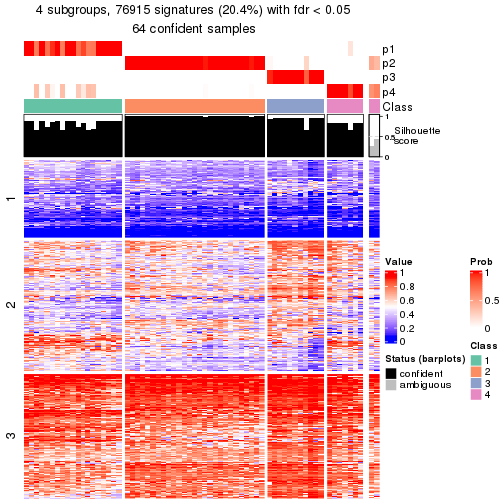</p>

</div>
<div id='tab-node-033-get-signatures-4'>
<pre><code class="r">get_signatures(res, k = 5)
</code></pre>

<p></p>

</div>
<div id='tab-node-033-get-signatures-5'>
<pre><code class="r">get_signatures(res, k = 6)
</code></pre>

<p></p>

</div>
<div id='tab-node-033-get-signatures-6'>
<pre><code class="r">get_signatures(res, k = 7)
</code></pre>

<p></p>

</div>
<div id='tab-node-033-get-signatures-7'>
<pre><code class="r">get_signatures(res, k = 8)
</code></pre>

<p></p>

</div>
</div>


Compare the overlap of signatures from different k:

```r
compare_signatures(res)
```


`get_signature()` returns a data frame invisibly. To get the list of signatures, the function
call should be assigned to a variable explicitly. In following code, if `plot` argument is set
to `FALSE`, no heatmap is plotted while only the differential analysis is performed.

```r
# code only for demonstration
tb = get_signature(res, k = ..., plot = FALSE)
```

An example of the output of `tb` is:

```
#>   which_row         fdr    mean_1    mean_2 scaled_mean_1 scaled_mean_2 km
#> 1        38 0.042760348  8.373488  9.131774    -0.5533452     0.5164555  1
#> 2        40 0.018707592  7.106213  8.469186    -0.6173731     0.5762149  1
#> 3        55 0.019134737 10.221463 11.207825    -0.6159697     0.5749050  1
#> 4        59 0.006059896  5.921854  7.869574    -0.6899429     0.6439467  1
#> 5        60 0.018055526  8.928898 10.211722    -0.6204761     0.5791110  1
#> 6        98 0.009384629 15.714769 14.887706     0.6635654    -0.6193277  2
...
```

The columns in `tb` are:

1. `which_row`: row indices corresponding to the input matrix.
2. `fdr`: FDR for the differential test. 
3. `mean_x`: The mean value in group x.
4. `scaled_mean_x`: The mean value in group x after rows are scaled.
5. `km`: Row groups if k-means clustering is applied to rows (which is done by automatically selecting number of clusters).

If there are too many signatures, `top_signatures = ...` can be set to only show the 
signatures with the highest FDRs:

```r
# code only for demonstration
# e.g. to show the top 500 most significant rows
tb = get_signature(res, k = ..., top_signatures = 500)
```

If the signatures are defined as these which are uniquely high in current group, `diff_method` argument
can be set to `"uniquely_high_in_one_group"`:

```r
# code only for demonstration
tb = get_signature(res, k = ..., diff_method = "uniquely_high_in_one_group")
```


UMAP plot which shows how samples are separated.


<script>
$( function() {
	$( '#tabs-node-033-dimension-reduction' ).tabs();
} );
</script>
<div id='tabs-node-033-dimension-reduction'>
<ul>
<li><a href='#tab-node-033-dimension-reduction-1'>k = 2</a></li>
<li><a href='#tab-node-033-dimension-reduction-2'>k = 3</a></li>
<li><a href='#tab-node-033-dimension-reduction-3'>k = 4</a></li>
<li><a href='#tab-node-033-dimension-reduction-4'>k = 5</a></li>
<li><a href='#tab-node-033-dimension-reduction-5'>k = 6</a></li>
<li><a href='#tab-node-033-dimension-reduction-6'>k = 7</a></li>
<li><a href='#tab-node-033-dimension-reduction-7'>k = 8</a></li>
</ul>
<div id='tab-node-033-dimension-reduction-1'>
<pre><code class="r">dimension_reduction(res, k = 2, method = &quot;UMAP&quot;)
</code></pre>

<p></p>

</div>
<div id='tab-node-033-dimension-reduction-2'>
<pre><code class="r">dimension_reduction(res, k = 3, method = &quot;UMAP&quot;)
</code></pre>

<p></p>

</div>
<div id='tab-node-033-dimension-reduction-3'>
<pre><code class="r">dimension_reduction(res, k = 4, method = &quot;UMAP&quot;)
</code></pre>

<p></p>

</div>
<div id='tab-node-033-dimension-reduction-4'>
<pre><code class="r">dimension_reduction(res, k = 5, method = &quot;UMAP&quot;)
</code></pre>

<p></p>

</div>
<div id='tab-node-033-dimension-reduction-5'>
<pre><code class="r">dimension_reduction(res, k = 6, method = &quot;UMAP&quot;)
</code></pre>

<p></p>

</div>
<div id='tab-node-033-dimension-reduction-6'>
<pre><code class="r">dimension_reduction(res, k = 7, method = &quot;UMAP&quot;)
</code></pre>

<p></p>

</div>
<div id='tab-node-033-dimension-reduction-7'>
<pre><code class="r">dimension_reduction(res, k = 8, method = &quot;UMAP&quot;)
</code></pre>

<p></p>

</div>
</div>


Following heatmap shows how subgroups are split when increasing `k`:

```r
collect_classes(res)
```


If matrix rows can be associated to genes, consider to use `functional_enrichment(res,
...)` to perform function enrichment for the signature genes. See [this vignette](https://jokergoo.github.io/cola_vignettes/functional_enrichment.html) for more detailed explanations.


 

---------------------------------------------------


### Node0331


Parent node: [Node033](#Node033).
Child nodes: 
                Node01111-leaf
        ,
                Node01112-leaf
        ,
                Node01121-leaf
        ,
                Node01122-leaf
        ,
                Node01123-leaf
        ,
                Node01124-leaf
        ,
                Node01211-leaf
        ,
                Node01212-leaf
        ,
                Node01213-leaf
        ,
                Node01321-leaf
        ,
                Node01322-leaf
        ,
                Node01323-leaf
        ,
                Node01324-leaf
        ,
                Node02131-leaf
        ,
                Node02132-leaf
        ,
                Node02211-leaf
        ,
                Node02212-leaf
        ,
                Node02221-leaf
        ,
                [Node02222](#Node02222)
        ,
                Node02223-leaf
        ,
                Node02311-leaf
        ,
                Node02312-leaf
        ,
                Node03311-leaf
        ,
                Node03312-leaf
        ,
                Node03313-leaf
        ,
                Node03321-leaf
        ,
                Node03322-leaf
        ,
                Node03323-leaf
        .


The object with results only for a single top-value method and a single partitioning method 
can be extracted as:

```r
res = res_rh["0331"]
```

A summary of `res` and all the functions that can be applied to it:

```r
res
```

```
#> A 'ConsensusPartition' object with k = 2, 3, 4, 5, 6, 7, 8.
#>   On a matrix with 30000 rows and 24 columns.
#>   Top rows (1000) are extracted by 'ATC' method.
#>   Subgroups are detected by 'kmeans' method.
#>   Performed in total 350 partitions by row resampling.
#>   Best k for subgroups seems to be 4.
#> 
#> Following methods can be applied to this 'ConsensusPartition' object:
#>  [1] "cola_report"             "collect_classes"         "collect_plots"          
#>  [4] "collect_stats"           "colnames"                "compare_partitions"     
#>  [7] "compare_signatures"      "consensus_heatmap"       "dimension_reduction"    
#> [10] "functional_enrichment"   "get_anno_col"            "get_anno"               
#> [13] "get_classes"             "get_consensus"           "get_matrix"             
#> [16] "get_membership"          "get_param"               "get_signatures"         
#> [19] "get_stats"               "is_best_k"               "is_stable_k"            
#> [22] "membership_heatmap"      "ncol"                    "nrow"                   
#> [25] "plot_ecdf"               "predict_classes"         "rownames"               
#> [28] "select_partition_number" "show"                    "suggest_best_k"         
#> [31] "test_to_known_factors"   "top_rows_heatmap"
```

`collect_plots()` function collects all the plots made from `res` for all `k` (number of subgroups)
into one single page to provide an easy and fast comparison between different `k`.

```r
collect_plots(res)
```


The plots are:

- The first row: a plot of the eCDF (empirical cumulative distribution
  function) curves of the consensus matrix for each `k` and the heatmap of
  predicted classes for each `k`.
- The second row: heatmaps of the consensus matrix for each `k`.
- The third row: heatmaps of the membership matrix for each `k`.
- The fouth row: heatmaps of the signatures for each `k`.

All the plots in panels can be made by individual functions and they are
plotted later in this section.

`select_partition_number()` produces several plots showing different
statistics for choosing "optimized" `k`. There are following statistics:

- eCDF curves of the consensus matrix for each `k`;
- 1-PAC. [The PAC score](https://en.wikipedia.org/wiki/Consensus_clustering#Over-interpretation_potential_of_consensus_clustering)
  measures the proportion of the ambiguous subgrouping.
- Mean silhouette score.
- Concordance. The mean probability of fiting the consensus subgroup labels in all
  partitions.
- Area increased. Denote $A_k$ as the area under the eCDF curve for current
  `k`, the area increased is defined as $A_k - A_{k-1}$.
- Rand index. The percent of pairs of samples that are both in a same cluster
  or both are not in a same cluster in the partition of k and k-1.
- Jaccard index. The ratio of pairs of samples are both in a same cluster in
  the partition of k and k-1 and the pairs of samples are both in a same
  cluster in the partition k or k-1.

The detailed explanations of these statistics can be found in [the _cola_
vignette](https://jokergoo.github.io/cola_vignettes/cola.html#toc_13).

Generally speaking, higher 1-PAC score, higher mean silhouette score or higher
concordance corresponds to better partition. Rand index and Jaccard index
measure how similar the current partition is compared to partition with `k-1`.
If they are too similar, we won't accept `k` is better than `k-1`.

```r
select_partition_number(res)
```


The numeric values for all these statistics can be obtained by `get_stats()`.

```r
get_stats(res)
```

```
#>   k 1-PAC mean_silhouette concordance area_increased  Rand Jaccard
#> 2 2 1.000           1.000       1.000         0.4896 0.511   0.511
#> 3 3 1.000           1.000       1.000         0.3992 0.804   0.617
#> 4 4 0.900           0.940       0.895         0.0822 0.928   0.770
#> 5 5 0.797           0.740       0.798         0.0527 0.935   0.731
#> 6 6 0.762           0.710       0.844         0.0405 0.949   0.770
#> 7 7 0.808           0.658       0.849         0.0394 0.960   0.814
#> 8 8 0.810           0.502       0.772         0.0255 0.978   0.878
```

`suggest_best_k()` suggests the best $k$ based on these statistics. The rules are as follows:

- All $k$ with Jaccard index larger than 0.95 are removed because increasing
  $k$ does not provide enough extra information. If all $k$ are removed, it is
  marked as no subgroup is detected.
- For all $k$ with 1-PAC score larger than 0.9, the maximal $k$ is taken as
  the best $k$, and other $k$ are marked as optional $k$.
- If it does not fit the second rule. The $k$ with the maximal vote of the
  highest 1-PAC score, highest mean silhouette, and highest concordance is
  taken as the best $k$.

```r
suggest_best_k(res)
```

```
#> [1] 4
#> attr(,"optional")
#> [1] 2 3
```

There is also optional best $k$ = 2 3 that is worth to check.

Following is the table of the partitions (You need to click the **show/hide
code output** link to see it). The membership matrix (columns with name `p*`)
is inferred by
[`clue::cl_consensus()`](https://www.rdocumentation.org/link/cl_consensus?package=clue)
function with the `SE` method. Basically the value in the membership matrix
represents the probability to belong to a certain group. The finall subgroup
label for an item is determined with the group with highest probability it
belongs to.

In `get_classes()` function, the entropy is calculated from the membership
matrix and the silhouette score is calculated from the consensus matrix.


<script>
$( function() {
	$( '#tabs-node-0331-get-classes' ).tabs();
} );
</script>
<div id='tabs-node-0331-get-classes'>
<ul>
<li><a href='#tab-node-0331-get-classes-1'>k = 2</a></li>
<li><a href='#tab-node-0331-get-classes-2'>k = 3</a></li>
<li><a href='#tab-node-0331-get-classes-3'>k = 4</a></li>
<li><a href='#tab-node-0331-get-classes-4'>k = 5</a></li>
<li><a href='#tab-node-0331-get-classes-5'>k = 6</a></li>
<li><a href='#tab-node-0331-get-classes-6'>k = 7</a></li>
<li><a href='#tab-node-0331-get-classes-7'>k = 8</a></li>
</ul>

<div id='tab-node-0331-get-classes-1'>
<p><a id='tab-node-0331-get-classes-1-a' style='color:#0366d6' href='#'>show/hide code output</a></p>
<pre><code class="r">cbind(get_classes(res, k = 2), get_membership(res, k = 2))
</code></pre>

<pre><code>#&gt;                 class entropy silhouette p1 p2
#&gt; TCGA.ZF.A9RF.01     2       0          1  0  1
#&gt; TCGA.BT.A3PJ.01     2       0          1  0  1
#&gt; TCGA.YC.A9TC.01     1       0          1  1  0
#&gt; TCGA.E7.A97P.01     1       0          1  1  0
#&gt; TCGA.XF.AAMW.01     1       0          1  1  0
#&gt; TCGA.ZF.AA5H.01     2       0          1  0  1
#&gt; TCGA.G2.A2EJ.01     1       0          1  1  0
#&gt; TCGA.G2.A2EF.01     2       0          1  0  1
#&gt; TCGA.FD.A5C1.01     2       0          1  0  1
#&gt; TCGA.LC.A66R.01     2       0          1  0  1
#&gt; TCGA.UY.A78L.01     2       0          1  0  1
#&gt; TCGA.SY.A9G5.01     2       0          1  0  1
#&gt; TCGA.DK.A3WW.01     1       0          1  1  0
#&gt; TCGA.GC.A3YS.01     2       0          1  0  1
#&gt; TCGA.DK.A3IM.01     1       0          1  1  0
#&gt; TCGA.ZF.AA4N.01     1       0          1  1  0
#&gt; TCGA.4Z.AA84.01     2       0          1  0  1
#&gt; TCGA.GV.A3QG.01     2       0          1  0  1
#&gt; TCGA.FD.A6TD.01     2       0          1  0  1
#&gt; TCGA.CU.A0YN.01     2       0          1  0  1
#&gt; TCGA.4Z.AA82.01     1       0          1  1  0
#&gt; TCGA.GC.A6I1.01     2       0          1  0  1
#&gt; TCGA.FD.A3B6.01     2       0          1  0  1
#&gt; TCGA.BT.A20V.01     1       0          1  1  0
</code></pre>

<script>
$('#tab-node-0331-get-classes-1-a').parent().next().next().hide();
$('#tab-node-0331-get-classes-1-a').click(function(){
  $('#tab-node-0331-get-classes-1-a').parent().next().next().toggle();
  return(false);
});
</script>
</div>

<div id='tab-node-0331-get-classes-2'>
<p><a id='tab-node-0331-get-classes-2-a' style='color:#0366d6' href='#'>show/hide code output</a></p>
<pre><code class="r">cbind(get_classes(res, k = 3), get_membership(res, k = 3))
</code></pre>

<pre><code>#&gt;                 class entropy silhouette p1 p2 p3
#&gt; TCGA.ZF.A9RF.01     3       0          1  0  0  1
#&gt; TCGA.BT.A3PJ.01     3       0          1  0  0  1
#&gt; TCGA.YC.A9TC.01     1       0          1  1  0  0
#&gt; TCGA.E7.A97P.01     1       0          1  1  0  0
#&gt; TCGA.XF.AAMW.01     1       0          1  1  0  0
#&gt; TCGA.ZF.AA5H.01     3       0          1  0  0  1
#&gt; TCGA.G2.A2EJ.01     1       0          1  1  0  0
#&gt; TCGA.G2.A2EF.01     2       0          1  0  1  0
#&gt; TCGA.FD.A5C1.01     2       0          1  0  1  0
#&gt; TCGA.LC.A66R.01     2       0          1  0  1  0
#&gt; TCGA.UY.A78L.01     3       0          1  0  0  1
#&gt; TCGA.SY.A9G5.01     2       0          1  0  1  0
#&gt; TCGA.DK.A3WW.01     1       0          1  1  0  0
#&gt; TCGA.GC.A3YS.01     2       0          1  0  1  0
#&gt; TCGA.DK.A3IM.01     1       0          1  1  0  0
#&gt; TCGA.ZF.AA4N.01     1       0          1  1  0  0
#&gt; TCGA.4Z.AA84.01     2       0          1  0  1  0
#&gt; TCGA.GV.A3QG.01     3       0          1  0  0  1
#&gt; TCGA.FD.A6TD.01     2       0          1  0  1  0
#&gt; TCGA.CU.A0YN.01     2       0          1  0  1  0
#&gt; TCGA.4Z.AA82.01     1       0          1  1  0  0
#&gt; TCGA.GC.A6I1.01     2       0          1  0  1  0
#&gt; TCGA.FD.A3B6.01     3       0          1  0  0  1
#&gt; TCGA.BT.A20V.01     1       0          1  1  0  0
</code></pre>

<script>
$('#tab-node-0331-get-classes-2-a').parent().next().next().hide();
$('#tab-node-0331-get-classes-2-a').click(function(){
  $('#tab-node-0331-get-classes-2-a').parent().next().next().toggle();
  return(false);
});
</script>
</div>

<div id='tab-node-0331-get-classes-3'>
<p><a id='tab-node-0331-get-classes-3-a' style='color:#0366d6' href='#'>show/hide code output</a></p>
<pre><code class="r">cbind(get_classes(res, k = 4), get_membership(res, k = 4))
</code></pre>

<pre><code>#&gt;                 class entropy silhouette   p1   p2   p3   p4
#&gt; TCGA.ZF.A9RF.01     3  0.0707      0.985 0.00 0.00 0.98 0.02
#&gt; TCGA.BT.A3PJ.01     3  0.1211      0.981 0.00 0.00 0.96 0.04
#&gt; TCGA.YC.A9TC.01     4  0.4994      1.000 0.48 0.00 0.00 0.52
#&gt; TCGA.E7.A97P.01     1  0.0000      0.923 1.00 0.00 0.00 0.00
#&gt; TCGA.XF.AAMW.01     1  0.0000      0.923 1.00 0.00 0.00 0.00
#&gt; TCGA.ZF.AA5H.01     3  0.1211      0.981 0.00 0.00 0.96 0.04
#&gt; TCGA.G2.A2EJ.01     4  0.4994      1.000 0.48 0.00 0.00 0.52
#&gt; TCGA.G2.A2EF.01     2  0.4277      0.775 0.00 0.72 0.00 0.28
#&gt; TCGA.FD.A5C1.01     2  0.0000      0.949 0.00 1.00 0.00 0.00
#&gt; TCGA.LC.A66R.01     2  0.0000      0.949 0.00 1.00 0.00 0.00
#&gt; TCGA.UY.A78L.01     3  0.0000      0.986 0.00 0.00 1.00 0.00
#&gt; TCGA.SY.A9G5.01     2  0.0000      0.949 0.00 1.00 0.00 0.00
#&gt; TCGA.DK.A3WW.01     1  0.0000      0.923 1.00 0.00 0.00 0.00
#&gt; TCGA.GC.A3YS.01     2  0.3801      0.820 0.00 0.78 0.00 0.22
#&gt; TCGA.DK.A3IM.01     4  0.4994      1.000 0.48 0.00 0.00 0.52
#&gt; TCGA.ZF.AA4N.01     1  0.0000      0.923 1.00 0.00 0.00 0.00
#&gt; TCGA.4Z.AA84.01     2  0.0000      0.949 0.00 1.00 0.00 0.00
#&gt; TCGA.GV.A3QG.01     3  0.0000      0.986 0.00 0.00 1.00 0.00
#&gt; TCGA.FD.A6TD.01     2  0.0000      0.949 0.00 1.00 0.00 0.00
#&gt; TCGA.CU.A0YN.01     2  0.0000      0.949 0.00 1.00 0.00 0.00
#&gt; TCGA.4Z.AA82.01     4  0.4994      1.000 0.48 0.00 0.00 0.52
#&gt; TCGA.GC.A6I1.01     2  0.0000      0.949 0.00 1.00 0.00 0.00
#&gt; TCGA.FD.A3B6.01     3  0.0000      0.986 0.00 0.00 1.00 0.00
#&gt; TCGA.BT.A20V.01     1  0.3172      0.715 0.84 0.00 0.00 0.16
</code></pre>

<script>
$('#tab-node-0331-get-classes-3-a').parent().next().next().hide();
$('#tab-node-0331-get-classes-3-a').click(function(){
  $('#tab-node-0331-get-classes-3-a').parent().next().next().toggle();
  return(false);
});
</script>
</div>

<div id='tab-node-0331-get-classes-4'>
<p><a id='tab-node-0331-get-classes-4-a' style='color:#0366d6' href='#'>show/hide code output</a></p>
<pre><code class="r">cbind(get_classes(res, k = 5), get_membership(res, k = 5))
</code></pre>

<pre><code>#&gt;                 class entropy silhouette   p1   p2   p3   p4   p5
#&gt; TCGA.ZF.A9RF.01     3   0.000      0.888 0.00 0.00 1.00 0.00 0.00
#&gt; TCGA.BT.A3PJ.01     3   0.122      0.880 0.00 0.02 0.96 0.02 0.00
#&gt; TCGA.YC.A9TC.01     4   0.446      0.977 0.32 0.02 0.00 0.66 0.00
#&gt; TCGA.E7.A97P.01     1   0.000      0.848 1.00 0.00 0.00 0.00 0.00
#&gt; TCGA.XF.AAMW.01     1   0.000      0.848 1.00 0.00 0.00 0.00 0.00
#&gt; TCGA.ZF.AA5H.01     3   0.122      0.880 0.00 0.02 0.96 0.02 0.00
#&gt; TCGA.G2.A2EJ.01     4   0.389      0.992 0.32 0.00 0.00 0.68 0.00
#&gt; TCGA.G2.A2EF.01     5   0.104      0.322 0.00 0.00 0.00 0.04 0.96
#&gt; TCGA.FD.A5C1.01     2   0.431      0.629 0.00 0.50 0.00 0.00 0.50
#&gt; TCGA.LC.A66R.01     2   0.413      0.847 0.00 0.62 0.00 0.00 0.38
#&gt; TCGA.UY.A78L.01     3   0.373      0.892 0.00 0.04 0.80 0.16 0.00
#&gt; TCGA.SY.A9G5.01     2   0.406      0.866 0.00 0.64 0.00 0.00 0.36
#&gt; TCGA.DK.A3WW.01     1   0.000      0.848 1.00 0.00 0.00 0.00 0.00
#&gt; TCGA.GC.A3YS.01     5   0.459      0.239 0.00 0.22 0.00 0.06 0.72
#&gt; TCGA.DK.A3IM.01     4   0.389      0.992 0.32 0.00 0.00 0.68 0.00
#&gt; TCGA.ZF.AA4N.01     1   0.293      0.626 0.82 0.00 0.00 0.18 0.00
#&gt; TCGA.4Z.AA84.01     2   0.406      0.866 0.00 0.64 0.00 0.00 0.36
#&gt; TCGA.GV.A3QG.01     3   0.373      0.892 0.00 0.04 0.80 0.16 0.00
#&gt; TCGA.FD.A6TD.01     2   0.413      0.847 0.00 0.62 0.00 0.00 0.38
#&gt; TCGA.CU.A0YN.01     5   0.431     -0.794 0.00 0.50 0.00 0.00 0.50
#&gt; TCGA.4Z.AA82.01     4   0.389      0.992 0.32 0.00 0.00 0.68 0.00
#&gt; TCGA.GC.A6I1.01     2   0.413      0.849 0.00 0.62 0.00 0.00 0.38
#&gt; TCGA.FD.A3B6.01     3   0.373      0.892 0.00 0.04 0.80 0.16 0.00
#&gt; TCGA.BT.A20V.01     1   0.453      0.643 0.70 0.26 0.00 0.04 0.00
</code></pre>

<script>
$('#tab-node-0331-get-classes-4-a').parent().next().next().hide();
$('#tab-node-0331-get-classes-4-a').click(function(){
  $('#tab-node-0331-get-classes-4-a').parent().next().next().toggle();
  return(false);
});
</script>
</div>

<div id='tab-node-0331-get-classes-5'>
<p><a id='tab-node-0331-get-classes-5-a' style='color:#0366d6' href='#'>show/hide code output</a></p>
<pre><code class="r">cbind(get_classes(res, k = 6), get_membership(res, k = 6))
</code></pre>

<pre><code>#&gt;                 class entropy silhouette   p1   p2   p3   p4   p5   p6
#&gt; TCGA.ZF.A9RF.01     3  0.0000      0.868 0.00 0.00 1.00 0.00 0.00 0.00
#&gt; TCGA.BT.A3PJ.01     3  0.1480      0.852 0.00 0.02 0.94 0.04 0.00 0.00
#&gt; TCGA.YC.A9TC.01     4  0.4863      0.791 0.14 0.20 0.00 0.66 0.00 0.00
#&gt; TCGA.E7.A97P.01     1  0.0000      0.805 1.00 0.00 0.00 0.00 0.00 0.00
#&gt; TCGA.XF.AAMW.01     1  0.0000      0.805 1.00 0.00 0.00 0.00 0.00 0.00
#&gt; TCGA.ZF.AA5H.01     3  0.1480      0.852 0.00 0.02 0.94 0.04 0.00 0.00
#&gt; TCGA.G2.A2EJ.01     4  0.2260      0.936 0.14 0.00 0.00 0.86 0.00 0.00
#&gt; TCGA.G2.A2EF.01     5  0.2631      0.000 0.00 0.00 0.00 0.00 0.82 0.18
#&gt; TCGA.FD.A5C1.01     6  0.2956      0.675 0.00 0.04 0.00 0.00 0.12 0.84
#&gt; TCGA.LC.A66R.01     6  0.0000      0.756 0.00 0.00 0.00 0.00 0.00 1.00
#&gt; TCGA.UY.A78L.01     3  0.3315      0.850 0.00 0.20 0.78 0.02 0.00 0.00
#&gt; TCGA.SY.A9G5.01     6  0.2260      0.735 0.00 0.14 0.00 0.00 0.00 0.86
#&gt; TCGA.DK.A3WW.01     1  0.0937      0.799 0.96 0.04 0.00 0.00 0.00 0.00
#&gt; TCGA.GC.A3YS.01     6  0.6720     -0.259 0.00 0.16 0.00 0.08 0.28 0.48
#&gt; TCGA.DK.A3IM.01     4  0.2260      0.936 0.14 0.00 0.00 0.86 0.00 0.00
#&gt; TCGA.ZF.AA4N.01     1  0.3950      0.544 0.72 0.04 0.00 0.24 0.00 0.00
#&gt; TCGA.4Z.AA84.01     6  0.2260      0.735 0.00 0.14 0.00 0.00 0.00 0.86
#&gt; TCGA.GV.A3QG.01     3  0.2631      0.870 0.00 0.18 0.82 0.00 0.00 0.00
#&gt; TCGA.FD.A6TD.01     6  0.0000      0.756 0.00 0.00 0.00 0.00 0.00 1.00
#&gt; TCGA.CU.A0YN.01     6  0.2956      0.675 0.00 0.04 0.00 0.00 0.12 0.84
#&gt; TCGA.4Z.AA82.01     4  0.2260      0.936 0.14 0.00 0.00 0.86 0.00 0.00
#&gt; TCGA.GC.A6I1.01     6  0.2790      0.732 0.00 0.14 0.00 0.00 0.02 0.84
#&gt; TCGA.FD.A3B6.01     3  0.2631      0.870 0.00 0.18 0.82 0.00 0.00 0.00
#&gt; TCGA.BT.A20V.01     1  0.5569      0.530 0.54 0.28 0.00 0.00 0.18 0.00
</code></pre>

<script>
$('#tab-node-0331-get-classes-5-a').parent().next().next().hide();
$('#tab-node-0331-get-classes-5-a').click(function(){
  $('#tab-node-0331-get-classes-5-a').parent().next().next().toggle();
  return(false);
});
</script>
</div>

<div id='tab-node-0331-get-classes-6'>
<p><a id='tab-node-0331-get-classes-6-a' style='color:#0366d6' href='#'>show/hide code output</a></p>
<pre><code class="r">cbind(get_classes(res, k = 7), get_membership(res, k = 7))
</code></pre>

<pre><code>#&gt;                 class entropy silhouette   p1   p2   p3   p4   p5   p6   p7
#&gt; TCGA.ZF.A9RF.01     3  0.1886      0.776 0.00 0.12 0.88 0.00 0.00 0.00 0.00
#&gt; TCGA.BT.A3PJ.01     3  0.2906      0.753 0.00 0.18 0.80 0.00 0.00 0.00 0.02
#&gt; TCGA.YC.A9TC.01     4  0.3449      0.775 0.08 0.14 0.00 0.78 0.00 0.00 0.00
#&gt; TCGA.E7.A97P.01     1  0.1671      0.693 0.90 0.10 0.00 0.00 0.00 0.00 0.00
#&gt; TCGA.XF.AAMW.01     1  0.1928      0.693 0.90 0.08 0.00 0.00 0.00 0.00 0.02
#&gt; TCGA.ZF.AA5H.01     3  0.2906      0.753 0.00 0.18 0.80 0.00 0.00 0.00 0.02
#&gt; TCGA.G2.A2EJ.01     4  0.0000      0.931 0.00 0.00 0.00 1.00 0.00 0.00 0.00
#&gt; TCGA.G2.A2EF.01     5  0.0000      0.000 0.00 0.00 0.00 0.00 1.00 0.00 0.00
#&gt; TCGA.FD.A5C1.01     6  0.3370      0.668 0.00 0.06 0.00 0.00 0.16 0.78 0.00
#&gt; TCGA.LC.A66R.01     6  0.0504      0.797 0.00 0.02 0.00 0.00 0.00 0.98 0.00
#&gt; TCGA.UY.A78L.01     3  0.2945      0.710 0.00 0.00 0.74 0.00 0.00 0.00 0.26
#&gt; TCGA.SY.A9G5.01     6  0.2572      0.789 0.00 0.08 0.00 0.00 0.00 0.86 0.06
#&gt; TCGA.DK.A3WW.01     1  0.0504      0.672 0.98 0.00 0.00 0.02 0.00 0.00 0.00
#&gt; TCGA.GC.A3YS.01     2  0.5325      0.000 0.00 0.50 0.00 0.00 0.28 0.22 0.00
#&gt; TCGA.DK.A3IM.01     4  0.0000      0.931 0.00 0.00 0.00 1.00 0.00 0.00 0.00
#&gt; TCGA.ZF.AA4N.01     1  0.2945      0.332 0.74 0.00 0.00 0.26 0.00 0.00 0.00
#&gt; TCGA.4Z.AA84.01     6  0.2829      0.779 0.00 0.08 0.00 0.00 0.00 0.84 0.08
#&gt; TCGA.GV.A3QG.01     3  0.2259      0.775 0.00 0.00 0.84 0.00 0.00 0.00 0.16
#&gt; TCGA.FD.A6TD.01     6  0.0504      0.797 0.00 0.02 0.00 0.00 0.00 0.98 0.00
#&gt; TCGA.CU.A0YN.01     6  0.3086      0.676 0.00 0.04 0.00 0.00 0.16 0.80 0.00
#&gt; TCGA.4Z.AA82.01     4  0.0000      0.931 0.00 0.00 0.00 1.00 0.00 0.00 0.00
#&gt; TCGA.GC.A6I1.01     6  0.3289      0.783 0.00 0.10 0.00 0.00 0.02 0.82 0.06
#&gt; TCGA.FD.A3B6.01     3  0.2259      0.775 0.00 0.00 0.84 0.00 0.00 0.00 0.16
#&gt; TCGA.BT.A20V.01     7  0.3413      0.000 0.38 0.00 0.00 0.00 0.00 0.00 0.62
</code></pre>

<script>
$('#tab-node-0331-get-classes-6-a').parent().next().next().hide();
$('#tab-node-0331-get-classes-6-a').click(function(){
  $('#tab-node-0331-get-classes-6-a').parent().next().next().toggle();
  return(false);
});
</script>
</div>

<div id='tab-node-0331-get-classes-7'>
<p><a id='tab-node-0331-get-classes-7-a' style='color:#0366d6' href='#'>show/hide code output</a></p>
<pre><code class="r">cbind(get_classes(res, k = 8), get_membership(res, k = 8))
</code></pre>

<pre><code>#&gt;                 class entropy silhouette   p1   p2   p3   p4   p5   p6   p7   p8
#&gt; TCGA.ZF.A9RF.01     3  0.1563      0.696 0.00 0.00 0.90 0.00 0.00 0.00 0.10 0.00
#&gt; TCGA.BT.A3PJ.01     3  0.0000      0.690 0.00 0.00 1.00 0.00 0.00 0.00 0.00 0.00
#&gt; TCGA.YC.A9TC.01     4  0.5404      0.493 0.12 0.08 0.00 0.56 0.00 0.00 0.00 0.24
#&gt; TCGA.E7.A97P.01     1  0.2406      0.768 0.80 0.20 0.00 0.00 0.00 0.00 0.00 0.00
#&gt; TCGA.XF.AAMW.01     1  0.2406      0.768 0.80 0.20 0.00 0.00 0.00 0.00 0.00 0.00
#&gt; TCGA.ZF.AA5H.01     3  0.0000      0.690 0.00 0.00 1.00 0.00 0.00 0.00 0.00 0.00
#&gt; TCGA.G2.A2EJ.01     4  0.0000      0.858 0.00 0.00 0.00 1.00 0.00 0.00 0.00 0.00
#&gt; TCGA.G2.A2EF.01     5  0.0000      0.000 0.00 0.00 0.00 0.00 1.00 0.00 0.00 0.00
#&gt; TCGA.FD.A5C1.01     6  0.3154      0.469 0.00 0.00 0.00 0.00 0.16 0.78 0.06 0.00
#&gt; TCGA.LC.A66R.01     6  0.0471      0.555 0.00 0.00 0.00 0.00 0.00 0.98 0.00 0.02
#&gt; TCGA.UY.A78L.01     7  0.4325     -0.519 0.00 0.04 0.38 0.00 0.00 0.00 0.56 0.02
#&gt; TCGA.SY.A9G5.01     6  0.3237      0.581 0.00 0.40 0.00 0.00 0.00 0.60 0.00 0.00
#&gt; TCGA.DK.A3WW.01     1  0.0471      0.739 0.98 0.00 0.00 0.00 0.00 0.00 0.00 0.02
#&gt; TCGA.GC.A3YS.01     8  0.4799      0.000 0.00 0.00 0.00 0.00 0.16 0.32 0.00 0.52
#&gt; TCGA.DK.A3IM.01     4  0.0000      0.858 0.00 0.00 0.00 1.00 0.00 0.00 0.00 0.00
#&gt; TCGA.ZF.AA4N.01     1  0.2856      0.582 0.78 0.00 0.00 0.20 0.00 0.00 0.00 0.02
#&gt; TCGA.4Z.AA84.01     6  0.3318      0.561 0.00 0.46 0.00 0.00 0.00 0.54 0.00 0.00
#&gt; TCGA.GV.A3QG.01     3  0.3272      0.526 0.00 0.00 0.58 0.00 0.00 0.00 0.42 0.00
#&gt; TCGA.FD.A6TD.01     6  0.0471      0.555 0.00 0.00 0.00 0.00 0.00 0.98 0.00 0.02
#&gt; TCGA.CU.A0YN.01     6  0.3154      0.469 0.00 0.00 0.00 0.00 0.16 0.78 0.06 0.00
#&gt; TCGA.4Z.AA82.01     4  0.0000      0.858 0.00 0.00 0.00 1.00 0.00 0.00 0.00 0.00
#&gt; TCGA.GC.A6I1.01     6  0.3272      0.580 0.00 0.42 0.00 0.00 0.00 0.58 0.00 0.00
#&gt; TCGA.FD.A3B6.01     3  0.3272      0.526 0.00 0.00 0.58 0.00 0.00 0.00 0.42 0.00
#&gt; TCGA.BT.A20V.01     7  0.6604     -0.261 0.24 0.22 0.00 0.00 0.00 0.00 0.32 0.22
</code></pre>

<script>
$('#tab-node-0331-get-classes-7-a').parent().next().next().hide();
$('#tab-node-0331-get-classes-7-a').click(function(){
  $('#tab-node-0331-get-classes-7-a').parent().next().next().toggle();
  return(false);
});
</script>
</div>
</div>

Heatmaps for the consensus matrix. It visualizes the probability of two
samples to be in a same group.


<script>
$( function() {
	$( '#tabs-node-0331-consensus-heatmap' ).tabs();
} );
</script>
<div id='tabs-node-0331-consensus-heatmap'>
<ul>
<li><a href='#tab-node-0331-consensus-heatmap-1'>k = 2</a></li>
<li><a href='#tab-node-0331-consensus-heatmap-2'>k = 3</a></li>
<li><a href='#tab-node-0331-consensus-heatmap-3'>k = 4</a></li>
<li><a href='#tab-node-0331-consensus-heatmap-4'>k = 5</a></li>
<li><a href='#tab-node-0331-consensus-heatmap-5'>k = 6</a></li>
<li><a href='#tab-node-0331-consensus-heatmap-6'>k = 7</a></li>
<li><a href='#tab-node-0331-consensus-heatmap-7'>k = 8</a></li>
</ul>
<div id='tab-node-0331-consensus-heatmap-1'>
<pre><code class="r">consensus_heatmap(res, k = 2)
</code></pre>

<p></p>

</div>
<div id='tab-node-0331-consensus-heatmap-2'>
<pre><code class="r">consensus_heatmap(res, k = 3)
</code></pre>

<p></p>

</div>
<div id='tab-node-0331-consensus-heatmap-3'>
<pre><code class="r">consensus_heatmap(res, k = 4)
</code></pre>

<p></p>

</div>
<div id='tab-node-0331-consensus-heatmap-4'>
<pre><code class="r">consensus_heatmap(res, k = 5)
</code></pre>

<p></p>

</div>
<div id='tab-node-0331-consensus-heatmap-5'>
<pre><code class="r">consensus_heatmap(res, k = 6)
</code></pre>

<p></p>

</div>
<div id='tab-node-0331-consensus-heatmap-6'>
<pre><code class="r">consensus_heatmap(res, k = 7)
</code></pre>

<p></p>

</div>
<div id='tab-node-0331-consensus-heatmap-7'>
<pre><code class="r">consensus_heatmap(res, k = 8)
</code></pre>

<p></p>

</div>
</div>

Heatmaps for the membership of samples in all partitions to see how consistent they are:


<script>
$( function() {
	$( '#tabs-node-0331-membership-heatmap' ).tabs();
} );
</script>
<div id='tabs-node-0331-membership-heatmap'>
<ul>
<li><a href='#tab-node-0331-membership-heatmap-1'>k = 2</a></li>
<li><a href='#tab-node-0331-membership-heatmap-2'>k = 3</a></li>
<li><a href='#tab-node-0331-membership-heatmap-3'>k = 4</a></li>
<li><a href='#tab-node-0331-membership-heatmap-4'>k = 5</a></li>
<li><a href='#tab-node-0331-membership-heatmap-5'>k = 6</a></li>
<li><a href='#tab-node-0331-membership-heatmap-6'>k = 7</a></li>
<li><a href='#tab-node-0331-membership-heatmap-7'>k = 8</a></li>
</ul>
<div id='tab-node-0331-membership-heatmap-1'>
<pre><code class="r">membership_heatmap(res, k = 2)
</code></pre>

<p></p>

</div>
<div id='tab-node-0331-membership-heatmap-2'>
<pre><code class="r">membership_heatmap(res, k = 3)
</code></pre>

<p></p>

</div>
<div id='tab-node-0331-membership-heatmap-3'>
<pre><code class="r">membership_heatmap(res, k = 4)
</code></pre>

<p></p>

</div>
<div id='tab-node-0331-membership-heatmap-4'>
<pre><code class="r">membership_heatmap(res, k = 5)
</code></pre>

<p></p>

</div>
<div id='tab-node-0331-membership-heatmap-5'>
<pre><code class="r">membership_heatmap(res, k = 6)
</code></pre>

<p></p>

</div>
<div id='tab-node-0331-membership-heatmap-6'>
<pre><code class="r">membership_heatmap(res, k = 7)
</code></pre>

<p></p>

</div>
<div id='tab-node-0331-membership-heatmap-7'>
<pre><code class="r">membership_heatmap(res, k = 8)
</code></pre>

<p></p>

</div>
</div>

As soon as the classes for columns are determined, the signatures
that are significantly different between subgroups can be looked for. 
Following are the heatmaps for signatures.


<script>
$( function() {
	$( '#tabs-node-0331-get-signatures' ).tabs();
} );
</script>
<div id='tabs-node-0331-get-signatures'>
<ul>
<li><a href='#tab-node-0331-get-signatures-1'>k = 2</a></li>
<li><a href='#tab-node-0331-get-signatures-2'>k = 3</a></li>
<li><a href='#tab-node-0331-get-signatures-3'>k = 4</a></li>
<li><a href='#tab-node-0331-get-signatures-4'>k = 5</a></li>
<li><a href='#tab-node-0331-get-signatures-5'>k = 6</a></li>
<li><a href='#tab-node-0331-get-signatures-6'>k = 7</a></li>
<li><a href='#tab-node-0331-get-signatures-7'>k = 8</a></li>
</ul>
<div id='tab-node-0331-get-signatures-1'>
<pre><code class="r">get_signatures(res, k = 2)
</code></pre>

<p>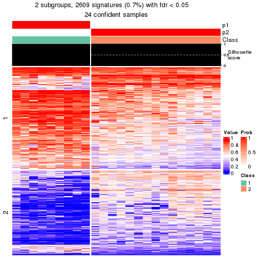</p>

</div>
<div id='tab-node-0331-get-signatures-2'>
<pre><code class="r">get_signatures(res, k = 3)
</code></pre>

<p></p>

</div>
<div id='tab-node-0331-get-signatures-3'>
<pre><code class="r">get_signatures(res, k = 4)
</code></pre>

<p></p>

</div>
<div id='tab-node-0331-get-signatures-4'>
<pre><code class="r">get_signatures(res, k = 5)
</code></pre>

<p></p>

</div>
<div id='tab-node-0331-get-signatures-5'>
<pre><code class="r">get_signatures(res, k = 6)
</code></pre>

<p></p>

</div>
<div id='tab-node-0331-get-signatures-6'>
<pre><code class="r">get_signatures(res, k = 7)
</code></pre>

<p></p>

</div>
<div id='tab-node-0331-get-signatures-7'>
<pre><code class="r">get_signatures(res, k = 8)
</code></pre>

<p></p>

</div>
</div>


Compare the overlap of signatures from different k:

```r
compare_signatures(res)
```


`get_signature()` returns a data frame invisibly. To get the list of signatures, the function
call should be assigned to a variable explicitly. In following code, if `plot` argument is set
to `FALSE`, no heatmap is plotted while only the differential analysis is performed.

```r
# code only for demonstration
tb = get_signature(res, k = ..., plot = FALSE)
```

An example of the output of `tb` is:

```
#>   which_row         fdr    mean_1    mean_2 scaled_mean_1 scaled_mean_2 km
#> 1        38 0.042760348  8.373488  9.131774    -0.5533452     0.5164555  1
#> 2        40 0.018707592  7.106213  8.469186    -0.6173731     0.5762149  1
#> 3        55 0.019134737 10.221463 11.207825    -0.6159697     0.5749050  1
#> 4        59 0.006059896  5.921854  7.869574    -0.6899429     0.6439467  1
#> 5        60 0.018055526  8.928898 10.211722    -0.6204761     0.5791110  1
#> 6        98 0.009384629 15.714769 14.887706     0.6635654    -0.6193277  2
...
```

The columns in `tb` are:

1. `which_row`: row indices corresponding to the input matrix.
2. `fdr`: FDR for the differential test. 
3. `mean_x`: The mean value in group x.
4. `scaled_mean_x`: The mean value in group x after rows are scaled.
5. `km`: Row groups if k-means clustering is applied to rows (which is done by automatically selecting number of clusters).

If there are too many signatures, `top_signatures = ...` can be set to only show the 
signatures with the highest FDRs:

```r
# code only for demonstration
# e.g. to show the top 500 most significant rows
tb = get_signature(res, k = ..., top_signatures = 500)
```

If the signatures are defined as these which are uniquely high in current group, `diff_method` argument
can be set to `"uniquely_high_in_one_group"`:

```r
# code only for demonstration
tb = get_signature(res, k = ..., diff_method = "uniquely_high_in_one_group")
```


UMAP plot which shows how samples are separated.


<script>
$( function() {
	$( '#tabs-node-0331-dimension-reduction' ).tabs();
} );
</script>
<div id='tabs-node-0331-dimension-reduction'>
<ul>
<li><a href='#tab-node-0331-dimension-reduction-1'>k = 2</a></li>
<li><a href='#tab-node-0331-dimension-reduction-2'>k = 3</a></li>
<li><a href='#tab-node-0331-dimension-reduction-3'>k = 4</a></li>
<li><a href='#tab-node-0331-dimension-reduction-4'>k = 5</a></li>
<li><a href='#tab-node-0331-dimension-reduction-5'>k = 6</a></li>
<li><a href='#tab-node-0331-dimension-reduction-6'>k = 7</a></li>
<li><a href='#tab-node-0331-dimension-reduction-7'>k = 8</a></li>
</ul>
<div id='tab-node-0331-dimension-reduction-1'>
<pre><code class="r">dimension_reduction(res, k = 2, method = &quot;UMAP&quot;)
</code></pre>

<p></p>

</div>
<div id='tab-node-0331-dimension-reduction-2'>
<pre><code class="r">dimension_reduction(res, k = 3, method = &quot;UMAP&quot;)
</code></pre>

<p>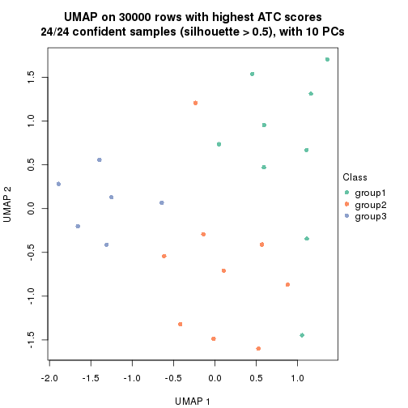</p>

</div>
<div id='tab-node-0331-dimension-reduction-3'>
<pre><code class="r">dimension_reduction(res, k = 4, method = &quot;UMAP&quot;)
</code></pre>

<p></p>

</div>
<div id='tab-node-0331-dimension-reduction-4'>
<pre><code class="r">dimension_reduction(res, k = 5, method = &quot;UMAP&quot;)
</code></pre>

<p></p>

</div>
<div id='tab-node-0331-dimension-reduction-5'>
<pre><code class="r">dimension_reduction(res, k = 6, method = &quot;UMAP&quot;)
</code></pre>

<p></p>

</div>
<div id='tab-node-0331-dimension-reduction-6'>
<pre><code class="r">dimension_reduction(res, k = 7, method = &quot;UMAP&quot;)
</code></pre>

<p></p>

</div>
<div id='tab-node-0331-dimension-reduction-7'>
<pre><code class="r">dimension_reduction(res, k = 8, method = &quot;UMAP&quot;)
</code></pre>

<p></p>

</div>
</div>


Following heatmap shows how subgroups are split when increasing `k`:

```r
collect_classes(res)
```


If matrix rows can be associated to genes, consider to use `functional_enrichment(res,
...)` to perform function enrichment for the signature genes. See [this vignette](https://jokergoo.github.io/cola_vignettes/functional_enrichment.html) for more detailed explanations.


 

---------------------------------------------------


### Node0332


Parent node: [Node033](#Node033).
Child nodes: 
                Node01111-leaf
        ,
                Node01112-leaf
        ,
                Node01121-leaf
        ,
                Node01122-leaf
        ,
                Node01123-leaf
        ,
                Node01124-leaf
        ,
                Node01211-leaf
        ,
                Node01212-leaf
        ,
                Node01213-leaf
        ,
                Node01321-leaf
        ,
                Node01322-leaf
        ,
                Node01323-leaf
        ,
                Node01324-leaf
        ,
                Node02131-leaf
        ,
                Node02132-leaf
        ,
                Node02211-leaf
        ,
                Node02212-leaf
        ,
                Node02221-leaf
        ,
                [Node02222](#Node02222)
        ,
                Node02223-leaf
        ,
                Node02311-leaf
        ,
                Node02312-leaf
        ,
                Node03311-leaf
        ,
                Node03312-leaf
        ,
                Node03313-leaf
        ,
                Node03321-leaf
        ,
                Node03322-leaf
        ,
                Node03323-leaf
        .


The object with results only for a single top-value method and a single partitioning method 
can be extracted as:

```r
res = res_rh["0332"]
```

A summary of `res` and all the functions that can be applied to it:

```r
res
```

```
#> A 'ConsensusPartition' object with k = 2, 3, 4, 5, 6, 7, 8.
#>   On a matrix with 30000 rows and 31 columns.
#>   Top rows (1000) are extracted by 'ATC' method.
#>   Subgroups are detected by 'skmeans' method.
#>   Performed in total 350 partitions by row resampling.
#>   Best k for subgroups seems to be 3.
#> 
#> Following methods can be applied to this 'ConsensusPartition' object:
#>  [1] "cola_report"             "collect_classes"         "collect_plots"          
#>  [4] "collect_stats"           "colnames"                "compare_partitions"     
#>  [7] "compare_signatures"      "consensus_heatmap"       "dimension_reduction"    
#> [10] "functional_enrichment"   "get_anno_col"            "get_anno"               
#> [13] "get_classes"             "get_consensus"           "get_matrix"             
#> [16] "get_membership"          "get_param"               "get_signatures"         
#> [19] "get_stats"               "is_best_k"               "is_stable_k"            
#> [22] "membership_heatmap"      "ncol"                    "nrow"                   
#> [25] "plot_ecdf"               "predict_classes"         "rownames"               
#> [28] "select_partition_number" "show"                    "suggest_best_k"         
#> [31] "test_to_known_factors"   "top_rows_heatmap"
```

`collect_plots()` function collects all the plots made from `res` for all `k` (number of subgroups)
into one single page to provide an easy and fast comparison between different `k`.

```r
collect_plots(res)
```


The plots are:

- The first row: a plot of the eCDF (empirical cumulative distribution
  function) curves of the consensus matrix for each `k` and the heatmap of
  predicted classes for each `k`.
- The second row: heatmaps of the consensus matrix for each `k`.
- The third row: heatmaps of the membership matrix for each `k`.
- The fouth row: heatmaps of the signatures for each `k`.

All the plots in panels can be made by individual functions and they are
plotted later in this section.

`select_partition_number()` produces several plots showing different
statistics for choosing "optimized" `k`. There are following statistics:

- eCDF curves of the consensus matrix for each `k`;
- 1-PAC. [The PAC score](https://en.wikipedia.org/wiki/Consensus_clustering#Over-interpretation_potential_of_consensus_clustering)
  measures the proportion of the ambiguous subgrouping.
- Mean silhouette score.
- Concordance. The mean probability of fiting the consensus subgroup labels in all
  partitions.
- Area increased. Denote $A_k$ as the area under the eCDF curve for current
  `k`, the area increased is defined as $A_k - A_{k-1}$.
- Rand index. The percent of pairs of samples that are both in a same cluster
  or both are not in a same cluster in the partition of k and k-1.
- Jaccard index. The ratio of pairs of samples are both in a same cluster in
  the partition of k and k-1 and the pairs of samples are both in a same
  cluster in the partition k or k-1.

The detailed explanations of these statistics can be found in [the _cola_
vignette](https://jokergoo.github.io/cola_vignettes/cola.html#toc_13).

Generally speaking, higher 1-PAC score, higher mean silhouette score or higher
concordance corresponds to better partition. Rand index and Jaccard index
measure how similar the current partition is compared to partition with `k-1`.
If they are too similar, we won't accept `k` is better than `k-1`.

```r
select_partition_number(res)
```


The numeric values for all these statistics can be obtained by `get_stats()`.

```r
get_stats(res)
```

```
#>   k 1-PAC mean_silhouette concordance area_increased  Rand Jaccard
#> 2 2 1.000           0.978       0.990         0.4929 0.510   0.510
#> 3 3 0.978           0.975       0.983         0.3179 0.708   0.491
#> 4 4 0.768           0.907       0.935         0.1145 0.940   0.826
#> 5 5 0.795           0.839       0.908         0.0815 0.845   0.514
#> 6 6 0.820           0.737       0.892         0.0421 0.972   0.862
#> 7 7 0.779           0.670       0.836         0.0173 0.994   0.964
#> 8 8 0.741           0.637       0.826         0.0213 0.961   0.798
```

`suggest_best_k()` suggests the best $k$ based on these statistics. The rules are as follows:

- All $k$ with Jaccard index larger than 0.95 are removed because increasing
  $k$ does not provide enough extra information. If all $k$ are removed, it is
  marked as no subgroup is detected.
- For all $k$ with 1-PAC score larger than 0.9, the maximal $k$ is taken as
  the best $k$, and other $k$ are marked as optional $k$.
- If it does not fit the second rule. The $k$ with the maximal vote of the
  highest 1-PAC score, highest mean silhouette, and highest concordance is
  taken as the best $k$.

```r
suggest_best_k(res)
```

```
#> [1] 3
#> attr(,"optional")
#> [1] 2
```

There is also optional best $k$ = 2 that is worth to check.

Following is the table of the partitions (You need to click the **show/hide
code output** link to see it). The membership matrix (columns with name `p*`)
is inferred by
[`clue::cl_consensus()`](https://www.rdocumentation.org/link/cl_consensus?package=clue)
function with the `SE` method. Basically the value in the membership matrix
represents the probability to belong to a certain group. The finall subgroup
label for an item is determined with the group with highest probability it
belongs to.

In `get_classes()` function, the entropy is calculated from the membership
matrix and the silhouette score is calculated from the consensus matrix.


<script>
$( function() {
	$( '#tabs-node-0332-get-classes' ).tabs();
} );
</script>
<div id='tabs-node-0332-get-classes'>
<ul>
<li><a href='#tab-node-0332-get-classes-1'>k = 2</a></li>
<li><a href='#tab-node-0332-get-classes-2'>k = 3</a></li>
<li><a href='#tab-node-0332-get-classes-3'>k = 4</a></li>
<li><a href='#tab-node-0332-get-classes-4'>k = 5</a></li>
<li><a href='#tab-node-0332-get-classes-5'>k = 6</a></li>
<li><a href='#tab-node-0332-get-classes-6'>k = 7</a></li>
<li><a href='#tab-node-0332-get-classes-7'>k = 8</a></li>
</ul>

<div id='tab-node-0332-get-classes-1'>
<p><a id='tab-node-0332-get-classes-1-a' style='color:#0366d6' href='#'>show/hide code output</a></p>
<pre><code class="r">cbind(get_classes(res, k = 2), get_membership(res, k = 2))
</code></pre>

<pre><code>#&gt;                 class entropy silhouette   p1   p2
#&gt; TCGA.UY.A9PE.01     1   0.000      0.986 1.00 0.00
#&gt; TCGA.ZF.AA52.01     1   0.000      0.986 1.00 0.00
#&gt; TCGA.BT.A2LB.01     2   0.000      0.994 0.00 1.00
#&gt; TCGA.GV.A3QF.01     1   0.000      0.986 1.00 0.00
#&gt; TCGA.DK.AA6S.01     1   0.795      0.681 0.76 0.24
#&gt; TCGA.FD.A6TC.01     2   0.000      0.994 0.00 1.00
#&gt; TCGA.XF.A9SK.01     1   0.000      0.986 1.00 0.00
#&gt; TCGA.UY.A78K.01     1   0.000      0.986 1.00 0.00
#&gt; TCGA.E7.A6MD.01     1   0.000      0.986 1.00 0.00
#&gt; TCGA.GD.A2C5.01     2   0.000      0.994 0.00 1.00
#&gt; TCGA.FD.A3SR.01     1   0.000      0.986 1.00 0.00
#&gt; TCGA.XF.A8HH.01     2   0.000      0.994 0.00 1.00
#&gt; TCGA.FT.A3EE.01     2   0.000      0.994 0.00 1.00
#&gt; TCGA.E7.A3X6.01     1   0.000      0.986 1.00 0.00
#&gt; TCGA.FD.A6TG.01     1   0.000      0.986 1.00 0.00
#&gt; TCGA.FD.A6TA.01     1   0.000      0.986 1.00 0.00
#&gt; TCGA.YC.A89H.01     2   0.000      0.994 0.00 1.00
#&gt; TCGA.E7.A6ME.01     1   0.000      0.986 1.00 0.00
#&gt; TCGA.FD.A5BR.01     1   0.000      0.986 1.00 0.00
#&gt; TCGA.ZF.AA51.01     2   0.000      0.994 0.00 1.00
#&gt; TCGA.DK.A1A6.06     2   0.000      0.994 0.00 1.00
#&gt; TCGA.GD.A76B.01     2   0.000      0.994 0.00 1.00
#&gt; TCGA.BT.A20J.01     1   0.000      0.986 1.00 0.00
#&gt; TCGA.DK.A3IV.01     1   0.000      0.986 1.00 0.00
#&gt; TCGA.FD.A3SQ.01     1   0.000      0.986 1.00 0.00
#&gt; TCGA.S5.A6DX.01     1   0.000      0.986 1.00 0.00
#&gt; TCGA.ZF.A9R0.01     2   0.327      0.935 0.06 0.94
#&gt; TCGA.CF.A1HR.01     1   0.000      0.986 1.00 0.00
#&gt; TCGA.UY.A8OD.01     2   0.000      0.994 0.00 1.00
#&gt; TCGA.DK.A6AV.01     2   0.000      0.994 0.00 1.00
#&gt; TCGA.DK.A3IT.01     1   0.000      0.986 1.00 0.00
</code></pre>

<script>
$('#tab-node-0332-get-classes-1-a').parent().next().next().hide();
$('#tab-node-0332-get-classes-1-a').click(function(){
  $('#tab-node-0332-get-classes-1-a').parent().next().next().toggle();
  return(false);
});
</script>
</div>

<div id='tab-node-0332-get-classes-2'>
<p><a id='tab-node-0332-get-classes-2-a' style='color:#0366d6' href='#'>show/hide code output</a></p>
<pre><code class="r">cbind(get_classes(res, k = 3), get_membership(res, k = 3))
</code></pre>

<pre><code>#&gt;                 class entropy silhouette   p1   p2   p3
#&gt; TCGA.UY.A9PE.01     3  0.3340      0.883 0.12 0.00 0.88
#&gt; TCGA.ZF.AA52.01     1  0.0000      1.000 1.00 0.00 0.00
#&gt; TCGA.BT.A2LB.01     3  0.1529      0.934 0.00 0.04 0.96
#&gt; TCGA.GV.A3QF.01     3  0.2537      0.916 0.08 0.00 0.92
#&gt; TCGA.DK.AA6S.01     3  0.2066      0.937 0.06 0.00 0.94
#&gt; TCGA.FD.A6TC.01     3  0.0000      0.940 0.00 0.00 1.00
#&gt; TCGA.XF.A9SK.01     1  0.0000      1.000 1.00 0.00 0.00
#&gt; TCGA.UY.A78K.01     3  0.2066      0.937 0.06 0.00 0.94
#&gt; TCGA.E7.A6MD.01     1  0.0000      1.000 1.00 0.00 0.00
#&gt; TCGA.GD.A2C5.01     3  0.1529      0.934 0.00 0.04 0.96
#&gt; TCGA.FD.A3SR.01     1  0.0000      1.000 1.00 0.00 0.00
#&gt; TCGA.XF.A8HH.01     2  0.0000      1.000 0.00 1.00 0.00
#&gt; TCGA.FT.A3EE.01     2  0.0000      1.000 0.00 1.00 0.00
#&gt; TCGA.E7.A3X6.01     1  0.0000      1.000 1.00 0.00 0.00
#&gt; TCGA.FD.A6TG.01     3  0.2066      0.937 0.06 0.00 0.94
#&gt; TCGA.FD.A6TA.01     1  0.0000      1.000 1.00 0.00 0.00
#&gt; TCGA.YC.A89H.01     2  0.0000      1.000 0.00 1.00 0.00
#&gt; TCGA.E7.A6ME.01     1  0.0000      1.000 1.00 0.00 0.00
#&gt; TCGA.FD.A5BR.01     1  0.0000      1.000 1.00 0.00 0.00
#&gt; TCGA.ZF.AA51.01     2  0.0000      1.000 0.00 1.00 0.00
#&gt; TCGA.DK.A1A6.06     3  0.0892      0.939 0.00 0.02 0.98
#&gt; TCGA.GD.A76B.01     3  0.1529      0.934 0.00 0.04 0.96
#&gt; TCGA.BT.A20J.01     1  0.0000      1.000 1.00 0.00 0.00
#&gt; TCGA.DK.A3IV.01     1  0.0000      1.000 1.00 0.00 0.00
#&gt; TCGA.FD.A3SQ.01     1  0.0000      1.000 1.00 0.00 0.00
#&gt; TCGA.S5.A6DX.01     1  0.0000      1.000 1.00 0.00 0.00
#&gt; TCGA.ZF.A9R0.01     3  0.0000      0.940 0.00 0.00 1.00
#&gt; TCGA.CF.A1HR.01     1  0.0000      1.000 1.00 0.00 0.00
#&gt; TCGA.UY.A8OD.01     2  0.0000      1.000 0.00 1.00 0.00
#&gt; TCGA.DK.A6AV.01     2  0.0000      1.000 0.00 1.00 0.00
#&gt; TCGA.DK.A3IT.01     1  0.0000      1.000 1.00 0.00 0.00
</code></pre>

<script>
$('#tab-node-0332-get-classes-2-a').parent().next().next().hide();
$('#tab-node-0332-get-classes-2-a').click(function(){
  $('#tab-node-0332-get-classes-2-a').parent().next().next().toggle();
  return(false);
});
</script>
</div>

<div id='tab-node-0332-get-classes-3'>
<p><a id='tab-node-0332-get-classes-3-a' style='color:#0366d6' href='#'>show/hide code output</a></p>
<pre><code class="r">cbind(get_classes(res, k = 4), get_membership(res, k = 4))
</code></pre>

<pre><code>#&gt;                 class entropy silhouette   p1   p2   p3   p4
#&gt; TCGA.UY.A9PE.01     3  0.1211      0.913 0.00 0.00 0.96 0.04
#&gt; TCGA.ZF.AA52.01     1  0.4277      0.771 0.72 0.00 0.28 0.00
#&gt; TCGA.BT.A2LB.01     4  0.0000      1.000 0.00 0.00 0.00 1.00
#&gt; TCGA.GV.A3QF.01     3  0.3037      0.889 0.02 0.00 0.88 0.10
#&gt; TCGA.DK.AA6S.01     3  0.0707      0.903 0.00 0.00 0.98 0.02
#&gt; TCGA.FD.A6TC.01     4  0.0000      1.000 0.00 0.00 0.00 1.00
#&gt; TCGA.XF.A9SK.01     1  0.0000      0.884 1.00 0.00 0.00 0.00
#&gt; TCGA.UY.A78K.01     3  0.0707      0.903 0.00 0.00 0.98 0.02
#&gt; TCGA.E7.A6MD.01     1  0.0000      0.884 1.00 0.00 0.00 0.00
#&gt; TCGA.GD.A2C5.01     4  0.0000      1.000 0.00 0.00 0.00 1.00
#&gt; TCGA.FD.A3SR.01     1  0.4134      0.793 0.74 0.00 0.26 0.00
#&gt; TCGA.XF.A8HH.01     2  0.0000      1.000 0.00 1.00 0.00 0.00
#&gt; TCGA.FT.A3EE.01     2  0.0000      1.000 0.00 1.00 0.00 0.00
#&gt; TCGA.E7.A3X6.01     1  0.0000      0.884 1.00 0.00 0.00 0.00
#&gt; TCGA.FD.A6TG.01     3  0.1211      0.912 0.00 0.00 0.96 0.04
#&gt; TCGA.FD.A6TA.01     1  0.0000      0.884 1.00 0.00 0.00 0.00
#&gt; TCGA.YC.A89H.01     2  0.0000      1.000 0.00 1.00 0.00 0.00
#&gt; TCGA.E7.A6ME.01     1  0.0000      0.884 1.00 0.00 0.00 0.00
#&gt; TCGA.FD.A5BR.01     1  0.2647      0.853 0.88 0.00 0.12 0.00
#&gt; TCGA.ZF.AA51.01     2  0.0000      1.000 0.00 1.00 0.00 0.00
#&gt; TCGA.DK.A1A6.06     3  0.3853      0.851 0.00 0.02 0.82 0.16
#&gt; TCGA.GD.A76B.01     4  0.0000      1.000 0.00 0.00 0.00 1.00
#&gt; TCGA.BT.A20J.01     1  0.0000      0.884 1.00 0.00 0.00 0.00
#&gt; TCGA.DK.A3IV.01     1  0.4134      0.793 0.74 0.00 0.26 0.00
#&gt; TCGA.FD.A3SQ.01     1  0.4134      0.793 0.74 0.00 0.26 0.00
#&gt; TCGA.S5.A6DX.01     1  0.0000      0.884 1.00 0.00 0.00 0.00
#&gt; TCGA.ZF.A9R0.01     3  0.2921      0.871 0.00 0.00 0.86 0.14
#&gt; TCGA.CF.A1HR.01     1  0.0000      0.884 1.00 0.00 0.00 0.00
#&gt; TCGA.UY.A8OD.01     2  0.0000      1.000 0.00 1.00 0.00 0.00
#&gt; TCGA.DK.A6AV.01     2  0.0000      1.000 0.00 1.00 0.00 0.00
#&gt; TCGA.DK.A3IT.01     1  0.4134      0.793 0.74 0.00 0.26 0.00
</code></pre>

<script>
$('#tab-node-0332-get-classes-3-a').parent().next().next().hide();
$('#tab-node-0332-get-classes-3-a').click(function(){
  $('#tab-node-0332-get-classes-3-a').parent().next().next().toggle();
  return(false);
});
</script>
</div>

<div id='tab-node-0332-get-classes-4'>
<p><a id='tab-node-0332-get-classes-4-a' style='color:#0366d6' href='#'>show/hide code output</a></p>
<pre><code class="r">cbind(get_classes(res, k = 5), get_membership(res, k = 5))
</code></pre>

<pre><code>#&gt;                 class entropy silhouette   p1   p2   p3 p4   p5
#&gt; TCGA.UY.A9PE.01     3  0.4644    0.69094 0.04 0.00 0.68  0 0.28
#&gt; TCGA.ZF.AA52.01     5  0.3274    0.73927 0.22 0.00 0.00  0 0.78
#&gt; TCGA.BT.A2LB.01     4  0.0000    1.00000 0.00 0.00 0.00  1 0.00
#&gt; TCGA.GV.A3QF.01     3  0.2754    0.69347 0.04 0.00 0.88  0 0.08
#&gt; TCGA.DK.AA6S.01     5  0.0609    0.55435 0.00 0.00 0.02  0 0.98
#&gt; TCGA.FD.A6TC.01     4  0.0000    1.00000 0.00 0.00 0.00  1 0.00
#&gt; TCGA.XF.A9SK.01     1  0.0000    0.97389 1.00 0.00 0.00  0 0.00
#&gt; TCGA.UY.A78K.01     5  0.0609    0.55435 0.00 0.00 0.02  0 0.98
#&gt; TCGA.E7.A6MD.01     1  0.0000    0.97389 1.00 0.00 0.00  0 0.00
#&gt; TCGA.GD.A2C5.01     4  0.0000    1.00000 0.00 0.00 0.00  1 0.00
#&gt; TCGA.FD.A3SR.01     5  0.3561    0.73448 0.26 0.00 0.00  0 0.74
#&gt; TCGA.XF.A8HH.01     2  0.0000    1.00000 0.00 1.00 0.00  0 0.00
#&gt; TCGA.FT.A3EE.01     2  0.0000    1.00000 0.00 1.00 0.00  0 0.00
#&gt; TCGA.E7.A3X6.01     1  0.0000    0.97389 1.00 0.00 0.00  0 0.00
#&gt; TCGA.FD.A6TG.01     5  0.3684   -0.00537 0.00 0.00 0.28  0 0.72
#&gt; TCGA.FD.A6TA.01     1  0.0000    0.97389 1.00 0.00 0.00  0 0.00
#&gt; TCGA.YC.A89H.01     2  0.0000    1.00000 0.00 1.00 0.00  0 0.00
#&gt; TCGA.E7.A6ME.01     1  0.0000    0.97389 1.00 0.00 0.00  0 0.00
#&gt; TCGA.FD.A5BR.01     1  0.2732    0.74606 0.84 0.00 0.00  0 0.16
#&gt; TCGA.ZF.AA51.01     2  0.0000    1.00000 0.00 1.00 0.00  0 0.00
#&gt; TCGA.DK.A1A6.06     3  0.5425    0.67245 0.00 0.08 0.60  0 0.32
#&gt; TCGA.GD.A76B.01     4  0.0000    1.00000 0.00 0.00 0.00  1 0.00
#&gt; TCGA.BT.A20J.01     1  0.0000    0.97389 1.00 0.00 0.00  0 0.00
#&gt; TCGA.DK.A3IV.01     5  0.3424    0.74138 0.24 0.00 0.00  0 0.76
#&gt; TCGA.FD.A3SQ.01     5  0.3684    0.72256 0.28 0.00 0.00  0 0.72
#&gt; TCGA.S5.A6DX.01     1  0.0000    0.97389 1.00 0.00 0.00  0 0.00
#&gt; TCGA.ZF.A9R0.01     3  0.2732    0.77294 0.00 0.00 0.84  0 0.16
#&gt; TCGA.CF.A1HR.01     1  0.0000    0.97389 1.00 0.00 0.00  0 0.00
#&gt; TCGA.UY.A8OD.01     2  0.0000    1.00000 0.00 1.00 0.00  0 0.00
#&gt; TCGA.DK.A6AV.01     2  0.0000    1.00000 0.00 1.00 0.00  0 0.00
#&gt; TCGA.DK.A3IT.01     5  0.4126    0.59235 0.38 0.00 0.00  0 0.62
</code></pre>

<script>
$('#tab-node-0332-get-classes-4-a').parent().next().next().hide();
$('#tab-node-0332-get-classes-4-a').click(function(){
  $('#tab-node-0332-get-classes-4-a').parent().next().next().toggle();
  return(false);
});
</script>
</div>

<div id='tab-node-0332-get-classes-5'>
<p><a id='tab-node-0332-get-classes-5-a' style='color:#0366d6' href='#'>show/hide code output</a></p>
<pre><code class="r">cbind(get_classes(res, k = 6), get_membership(res, k = 6))
</code></pre>

<pre><code>#&gt;                 class entropy silhouette   p1   p2   p3   p4   p5   p6
#&gt; TCGA.UY.A9PE.01     3  0.6103     0.1497 0.00 0.00 0.38 0.00 0.30 0.32
#&gt; TCGA.ZF.AA52.01     5  0.0547     0.7801 0.02 0.00 0.00 0.00 0.98 0.00
#&gt; TCGA.BT.A2LB.01     4  0.0000     0.9807 0.00 0.00 0.00 1.00 0.00 0.00
#&gt; TCGA.GV.A3QF.01     6  0.3111     0.0000 0.02 0.00 0.12 0.00 0.02 0.84
#&gt; TCGA.DK.AA6S.01     5  0.4078     0.2956 0.00 0.00 0.34 0.00 0.64 0.02
#&gt; TCGA.FD.A6TC.01     4  0.1092     0.9598 0.00 0.00 0.02 0.96 0.00 0.02
#&gt; TCGA.XF.A9SK.01     1  0.1092     0.8989 0.96 0.00 0.00 0.00 0.02 0.02
#&gt; TCGA.UY.A78K.01     5  0.3156     0.5915 0.00 0.00 0.18 0.00 0.80 0.02
#&gt; TCGA.E7.A6MD.01     1  0.1092     0.8979 0.96 0.00 0.00 0.00 0.02 0.02
#&gt; TCGA.GD.A2C5.01     4  0.0547     0.9721 0.00 0.00 0.00 0.98 0.00 0.02
#&gt; TCGA.FD.A3SR.01     5  0.1807     0.7934 0.06 0.00 0.00 0.00 0.92 0.02
#&gt; TCGA.XF.A8HH.01     2  0.0000     1.0000 0.00 1.00 0.00 0.00 0.00 0.00
#&gt; TCGA.FT.A3EE.01     2  0.0000     1.0000 0.00 1.00 0.00 0.00 0.00 0.00
#&gt; TCGA.E7.A3X6.01     1  0.1267     0.8725 0.94 0.00 0.00 0.00 0.00 0.06
#&gt; TCGA.FD.A6TG.01     3  0.4310    -0.0173 0.00 0.00 0.54 0.00 0.44 0.02
#&gt; TCGA.FD.A6TA.01     1  0.0547     0.8897 0.98 0.00 0.00 0.00 0.00 0.02
#&gt; TCGA.YC.A89H.01     2  0.0000     1.0000 0.00 1.00 0.00 0.00 0.00 0.00
#&gt; TCGA.E7.A6ME.01     1  0.1556     0.8948 0.92 0.00 0.00 0.00 0.08 0.00
#&gt; TCGA.FD.A5BR.01     1  0.4631     0.4550 0.62 0.00 0.00 0.00 0.32 0.06
#&gt; TCGA.ZF.AA51.01     2  0.0000     1.0000 0.00 1.00 0.00 0.00 0.00 0.00
#&gt; TCGA.DK.A1A6.06     3  0.1092     0.2954 0.00 0.02 0.96 0.00 0.02 0.00
#&gt; TCGA.GD.A76B.01     4  0.0000     0.9807 0.00 0.00 0.00 1.00 0.00 0.00
#&gt; TCGA.BT.A20J.01     1  0.1556     0.8948 0.92 0.00 0.00 0.00 0.08 0.00
#&gt; TCGA.DK.A3IV.01     5  0.1267     0.7918 0.06 0.00 0.00 0.00 0.94 0.00
#&gt; TCGA.FD.A3SQ.01     5  0.1267     0.7887 0.06 0.00 0.00 0.00 0.94 0.00
#&gt; TCGA.S5.A6DX.01     1  0.0937     0.9036 0.96 0.00 0.00 0.00 0.04 0.00
#&gt; TCGA.ZF.A9R0.01     3  0.4067     0.1991 0.00 0.00 0.70 0.00 0.04 0.26
#&gt; TCGA.CF.A1HR.01     1  0.1267     0.9013 0.94 0.00 0.00 0.00 0.06 0.00
#&gt; TCGA.UY.A8OD.01     2  0.0000     1.0000 0.00 1.00 0.00 0.00 0.00 0.00
#&gt; TCGA.DK.A6AV.01     2  0.0000     1.0000 0.00 1.00 0.00 0.00 0.00 0.00
#&gt; TCGA.DK.A3IT.01     5  0.3163     0.6776 0.14 0.00 0.00 0.00 0.82 0.04
</code></pre>

<script>
$('#tab-node-0332-get-classes-5-a').parent().next().next().hide();
$('#tab-node-0332-get-classes-5-a').click(function(){
  $('#tab-node-0332-get-classes-5-a').parent().next().next().toggle();
  return(false);
});
</script>
</div>

<div id='tab-node-0332-get-classes-6'>
<p><a id='tab-node-0332-get-classes-6-a' style='color:#0366d6' href='#'>show/hide code output</a></p>
<pre><code class="r">cbind(get_classes(res, k = 7), get_membership(res, k = 7))
</code></pre>

<pre><code>#&gt;                 class entropy silhouette   p1   p2   p3   p4   p5   p6   p7
#&gt; TCGA.UY.A9PE.01     7  0.5875     0.0000 0.00 0.00 0.22 0.00 0.18 0.06 0.54
#&gt; TCGA.ZF.AA52.01     5  0.0863     0.6764 0.04 0.00 0.00 0.00 0.96 0.00 0.00
#&gt; TCGA.BT.A2LB.01     4  0.0000     0.9209 0.00 0.00 0.00 1.00 0.00 0.00 0.00
#&gt; TCGA.GV.A3QF.01     6  0.0000     0.0000 0.00 0.00 0.00 0.00 0.00 1.00 0.00
#&gt; TCGA.DK.AA6S.01     5  0.3413     0.2399 0.00 0.00 0.38 0.00 0.62 0.00 0.00
#&gt; TCGA.FD.A6TC.01     4  0.2163     0.9091 0.00 0.00 0.02 0.88 0.00 0.00 0.10
#&gt; TCGA.XF.A9SK.01     1  0.1166     0.8715 0.94 0.00 0.00 0.00 0.00 0.00 0.06
#&gt; TCGA.UY.A78K.01     5  0.2572     0.5121 0.00 0.00 0.20 0.00 0.80 0.00 0.00
#&gt; TCGA.E7.A6MD.01     1  0.0863     0.8658 0.96 0.00 0.00 0.00 0.00 0.00 0.04
#&gt; TCGA.GD.A2C5.01     4  0.2569     0.8892 0.00 0.00 0.02 0.84 0.00 0.00 0.14
#&gt; TCGA.FD.A3SR.01     5  0.2016     0.6452 0.04 0.00 0.00 0.00 0.90 0.00 0.06
#&gt; TCGA.XF.A8HH.01     2  0.0000     1.0000 0.00 1.00 0.00 0.00 0.00 0.00 0.00
#&gt; TCGA.FT.A3EE.01     2  0.0000     1.0000 0.00 1.00 0.00 0.00 0.00 0.00 0.00
#&gt; TCGA.E7.A3X6.01     1  0.1928     0.8376 0.90 0.00 0.00 0.00 0.00 0.02 0.08
#&gt; TCGA.FD.A6TG.01     3  0.4212     0.0956 0.00 0.00 0.62 0.00 0.34 0.02 0.02
#&gt; TCGA.FD.A6TA.01     1  0.0863     0.8658 0.96 0.00 0.00 0.00 0.00 0.00 0.04
#&gt; TCGA.YC.A89H.01     2  0.0000     1.0000 0.00 1.00 0.00 0.00 0.00 0.00 0.00
#&gt; TCGA.E7.A6ME.01     1  0.2803     0.8353 0.84 0.00 0.00 0.00 0.06 0.00 0.10
#&gt; TCGA.FD.A5BR.01     1  0.4795     0.3705 0.62 0.00 0.00 0.00 0.28 0.02 0.08
#&gt; TCGA.ZF.AA51.01     2  0.0000     1.0000 0.00 1.00 0.00 0.00 0.00 0.00 0.00
#&gt; TCGA.DK.A1A6.06     3  0.2159     0.2616 0.00 0.02 0.90 0.00 0.02 0.00 0.06
#&gt; TCGA.GD.A76B.01     4  0.0000     0.9209 0.00 0.00 0.00 1.00 0.00 0.00 0.00
#&gt; TCGA.BT.A20J.01     1  0.2163     0.8550 0.88 0.00 0.00 0.00 0.02 0.00 0.10
#&gt; TCGA.DK.A3IV.01     5  0.2313     0.6645 0.06 0.00 0.00 0.00 0.88 0.00 0.06
#&gt; TCGA.FD.A3SQ.01     5  0.3370     0.6062 0.16 0.00 0.00 0.00 0.78 0.00 0.06
#&gt; TCGA.S5.A6DX.01     1  0.0504     0.8755 0.98 0.00 0.00 0.00 0.02 0.00 0.00
#&gt; TCGA.ZF.A9R0.01     3  0.4278    -0.2323 0.00 0.00 0.50 0.00 0.00 0.04 0.46
#&gt; TCGA.CF.A1HR.01     1  0.1363     0.8724 0.94 0.00 0.00 0.00 0.04 0.00 0.02
#&gt; TCGA.UY.A8OD.01     2  0.0000     1.0000 0.00 1.00 0.00 0.00 0.00 0.00 0.00
#&gt; TCGA.DK.A6AV.01     2  0.0000     1.0000 0.00 1.00 0.00 0.00 0.00 0.00 0.00
#&gt; TCGA.DK.A3IT.01     5  0.4698     0.4091 0.24 0.00 0.00 0.00 0.62 0.00 0.14
</code></pre>

<script>
$('#tab-node-0332-get-classes-6-a').parent().next().next().hide();
$('#tab-node-0332-get-classes-6-a').click(function(){
  $('#tab-node-0332-get-classes-6-a').parent().next().next().toggle();
  return(false);
});
</script>
</div>

<div id='tab-node-0332-get-classes-7'>
<p><a id='tab-node-0332-get-classes-7-a' style='color:#0366d6' href='#'>show/hide code output</a></p>
<pre><code class="r">cbind(get_classes(res, k = 8), get_membership(res, k = 8))
</code></pre>

<pre><code>#&gt;                 class entropy silhouette   p1 p2   p3   p4   p5   p6   p7   p8
#&gt; TCGA.UY.A9PE.01     7  0.5422     0.3497 0.00  0 0.04 0.10 0.22 0.04 0.60 0.00
#&gt; TCGA.ZF.AA52.01     5  0.1887     0.5739 0.06  0 0.00 0.04 0.90 0.00 0.00 0.00
#&gt; TCGA.BT.A2LB.01     8  0.2265     0.8652 0.00  0 0.02 0.08 0.00 0.00 0.02 0.88
#&gt; TCGA.GV.A3QF.01     6  0.0000     0.0000 0.00  0 0.00 0.00 0.00 1.00 0.00 0.00
#&gt; TCGA.DK.AA6S.01     5  0.4537    -0.1435 0.00  0 0.40 0.10 0.50 0.00 0.00 0.00
#&gt; TCGA.FD.A6TC.01     8  0.2265     0.8396 0.00  0 0.02 0.08 0.00 0.00 0.02 0.88
#&gt; TCGA.XF.A9SK.01     1  0.2025     0.8130 0.88  0 0.00 0.10 0.02 0.00 0.00 0.00
#&gt; TCGA.UY.A78K.01     5  0.3551     0.3392 0.00  0 0.22 0.06 0.72 0.00 0.00 0.00
#&gt; TCGA.E7.A6MD.01     1  0.2224     0.8096 0.86  0 0.00 0.12 0.02 0.00 0.00 0.00
#&gt; TCGA.GD.A2C5.01     8  0.1741     0.8337 0.00  0 0.00 0.02 0.02 0.00 0.04 0.92
#&gt; TCGA.FD.A3SR.01     5  0.4779     0.4564 0.12  0 0.02 0.18 0.66 0.00 0.02 0.00
#&gt; TCGA.XF.A8HH.01     2  0.0000     1.0000 0.00  1 0.00 0.00 0.00 0.00 0.00 0.00
#&gt; TCGA.FT.A3EE.01     2  0.0000     1.0000 0.00  1 0.00 0.00 0.00 0.00 0.00 0.00
#&gt; TCGA.E7.A3X6.01     1  0.3193     0.5768 0.62  0 0.00 0.38 0.00 0.00 0.00 0.00
#&gt; TCGA.FD.A6TG.01     3  0.3922     0.4180 0.00  0 0.64 0.00 0.30 0.00 0.06 0.00
#&gt; TCGA.FD.A6TA.01     1  0.1947     0.7904 0.86  0 0.00 0.14 0.00 0.00 0.00 0.00
#&gt; TCGA.YC.A89H.01     2  0.0000     1.0000 0.00  1 0.00 0.00 0.00 0.00 0.00 0.00
#&gt; TCGA.E7.A6ME.01     1  0.3385     0.7193 0.76  0 0.00 0.16 0.08 0.00 0.00 0.00
#&gt; TCGA.FD.A5BR.01     5  0.6501     0.0238 0.34  0 0.00 0.10 0.36 0.02 0.18 0.00
#&gt; TCGA.ZF.AA51.01     2  0.0000     1.0000 0.00  1 0.00 0.00 0.00 0.00 0.00 0.00
#&gt; TCGA.DK.A1A6.06     3  0.2224     0.3059 0.00  0 0.86 0.00 0.02 0.00 0.12 0.00
#&gt; TCGA.GD.A76B.01     8  0.2404     0.8686 0.00  0 0.00 0.14 0.00 0.00 0.02 0.84
#&gt; TCGA.BT.A20J.01     1  0.2547     0.7848 0.84  0 0.00 0.12 0.04 0.00 0.00 0.00
#&gt; TCGA.DK.A3IV.01     5  0.1557     0.5906 0.06  0 0.00 0.00 0.92 0.00 0.02 0.00
#&gt; TCGA.FD.A3SQ.01     5  0.3002     0.5827 0.12  0 0.00 0.04 0.82 0.00 0.02 0.00
#&gt; TCGA.S5.A6DX.01     1  0.0808     0.8238 0.96  0 0.00 0.00 0.04 0.00 0.00 0.00
#&gt; TCGA.ZF.A9R0.01     7  0.2756     0.2481 0.00  0 0.26 0.00 0.00 0.00 0.74 0.00
#&gt; TCGA.CF.A1HR.01     1  0.2165     0.8077 0.88  0 0.00 0.06 0.06 0.00 0.00 0.00
#&gt; TCGA.UY.A8OD.01     2  0.0000     1.0000 0.00  1 0.00 0.00 0.00 0.00 0.00 0.00
#&gt; TCGA.DK.A6AV.01     2  0.0000     1.0000 0.00  1 0.00 0.00 0.00 0.00 0.00 0.00
#&gt; TCGA.DK.A3IT.01     5  0.4224     0.4815 0.14  0 0.00 0.02 0.70 0.00 0.14 0.00
</code></pre>

<script>
$('#tab-node-0332-get-classes-7-a').parent().next().next().hide();
$('#tab-node-0332-get-classes-7-a').click(function(){
  $('#tab-node-0332-get-classes-7-a').parent().next().next().toggle();
  return(false);
});
</script>
</div>
</div>

Heatmaps for the consensus matrix. It visualizes the probability of two
samples to be in a same group.


<script>
$( function() {
	$( '#tabs-node-0332-consensus-heatmap' ).tabs();
} );
</script>
<div id='tabs-node-0332-consensus-heatmap'>
<ul>
<li><a href='#tab-node-0332-consensus-heatmap-1'>k = 2</a></li>
<li><a href='#tab-node-0332-consensus-heatmap-2'>k = 3</a></li>
<li><a href='#tab-node-0332-consensus-heatmap-3'>k = 4</a></li>
<li><a href='#tab-node-0332-consensus-heatmap-4'>k = 5</a></li>
<li><a href='#tab-node-0332-consensus-heatmap-5'>k = 6</a></li>
<li><a href='#tab-node-0332-consensus-heatmap-6'>k = 7</a></li>
<li><a href='#tab-node-0332-consensus-heatmap-7'>k = 8</a></li>
</ul>
<div id='tab-node-0332-consensus-heatmap-1'>
<pre><code class="r">consensus_heatmap(res, k = 2)
</code></pre>

<p></p>

</div>
<div id='tab-node-0332-consensus-heatmap-2'>
<pre><code class="r">consensus_heatmap(res, k = 3)
</code></pre>

<p></p>

</div>
<div id='tab-node-0332-consensus-heatmap-3'>
<pre><code class="r">consensus_heatmap(res, k = 4)
</code></pre>

<p></p>

</div>
<div id='tab-node-0332-consensus-heatmap-4'>
<pre><code class="r">consensus_heatmap(res, k = 5)
</code></pre>

<p></p>

</div>
<div id='tab-node-0332-consensus-heatmap-5'>
<pre><code class="r">consensus_heatmap(res, k = 6)
</code></pre>

<p>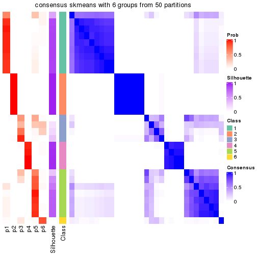</p>

</div>
<div id='tab-node-0332-consensus-heatmap-6'>
<pre><code class="r">consensus_heatmap(res, k = 7)
</code></pre>

<p></p>

</div>
<div id='tab-node-0332-consensus-heatmap-7'>
<pre><code class="r">consensus_heatmap(res, k = 8)
</code></pre>

<p></p>

</div>
</div>

Heatmaps for the membership of samples in all partitions to see how consistent they are:


<script>
$( function() {
	$( '#tabs-node-0332-membership-heatmap' ).tabs();
} );
</script>
<div id='tabs-node-0332-membership-heatmap'>
<ul>
<li><a href='#tab-node-0332-membership-heatmap-1'>k = 2</a></li>
<li><a href='#tab-node-0332-membership-heatmap-2'>k = 3</a></li>
<li><a href='#tab-node-0332-membership-heatmap-3'>k = 4</a></li>
<li><a href='#tab-node-0332-membership-heatmap-4'>k = 5</a></li>
<li><a href='#tab-node-0332-membership-heatmap-5'>k = 6</a></li>
<li><a href='#tab-node-0332-membership-heatmap-6'>k = 7</a></li>
<li><a href='#tab-node-0332-membership-heatmap-7'>k = 8</a></li>
</ul>
<div id='tab-node-0332-membership-heatmap-1'>
<pre><code class="r">membership_heatmap(res, k = 2)
</code></pre>

<p></p>

</div>
<div id='tab-node-0332-membership-heatmap-2'>
<pre><code class="r">membership_heatmap(res, k = 3)
</code></pre>

<p></p>

</div>
<div id='tab-node-0332-membership-heatmap-3'>
<pre><code class="r">membership_heatmap(res, k = 4)
</code></pre>

<p></p>

</div>
<div id='tab-node-0332-membership-heatmap-4'>
<pre><code class="r">membership_heatmap(res, k = 5)
</code></pre>

<p></p>

</div>
<div id='tab-node-0332-membership-heatmap-5'>
<pre><code class="r">membership_heatmap(res, k = 6)
</code></pre>

<p></p>

</div>
<div id='tab-node-0332-membership-heatmap-6'>
<pre><code class="r">membership_heatmap(res, k = 7)
</code></pre>

<p></p>

</div>
<div id='tab-node-0332-membership-heatmap-7'>
<pre><code class="r">membership_heatmap(res, k = 8)
</code></pre>

<p></p>

</div>
</div>

As soon as the classes for columns are determined, the signatures
that are significantly different between subgroups can be looked for. 
Following are the heatmaps for signatures.


<script>
$( function() {
	$( '#tabs-node-0332-get-signatures' ).tabs();
} );
</script>
<div id='tabs-node-0332-get-signatures'>
<ul>
<li><a href='#tab-node-0332-get-signatures-1'>k = 2</a></li>
<li><a href='#tab-node-0332-get-signatures-2'>k = 3</a></li>
<li><a href='#tab-node-0332-get-signatures-3'>k = 4</a></li>
<li><a href='#tab-node-0332-get-signatures-4'>k = 5</a></li>
<li><a href='#tab-node-0332-get-signatures-5'>k = 6</a></li>
<li><a href='#tab-node-0332-get-signatures-6'>k = 7</a></li>
<li><a href='#tab-node-0332-get-signatures-7'>k = 8</a></li>
</ul>
<div id='tab-node-0332-get-signatures-1'>
<pre><code class="r">get_signatures(res, k = 2)
</code></pre>

<p></p>

</div>
<div id='tab-node-0332-get-signatures-2'>
<pre><code class="r">get_signatures(res, k = 3)
</code></pre>

<p></p>

</div>
<div id='tab-node-0332-get-signatures-3'>
<pre><code class="r">get_signatures(res, k = 4)
</code></pre>

<p></p>

</div>
<div id='tab-node-0332-get-signatures-4'>
<pre><code class="r">get_signatures(res, k = 5)
</code></pre>

<p></p>

</div>
<div id='tab-node-0332-get-signatures-5'>
<pre><code class="r">get_signatures(res, k = 6)
</code></pre>

<p></p>

</div>
<div id='tab-node-0332-get-signatures-6'>
<pre><code class="r">get_signatures(res, k = 7)
</code></pre>

<p></p>

</div>
<div id='tab-node-0332-get-signatures-7'>
<pre><code class="r">get_signatures(res, k = 8)
</code></pre>

<p>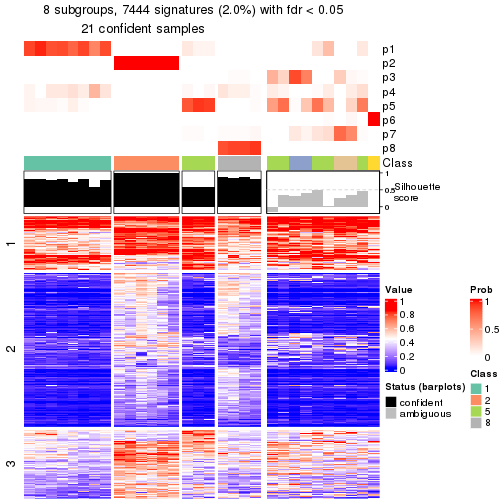</p>

</div>
</div>


Compare the overlap of signatures from different k:

```r
compare_signatures(res)
```


`get_signature()` returns a data frame invisibly. To get the list of signatures, the function
call should be assigned to a variable explicitly. In following code, if `plot` argument is set
to `FALSE`, no heatmap is plotted while only the differential analysis is performed.

```r
# code only for demonstration
tb = get_signature(res, k = ..., plot = FALSE)
```

An example of the output of `tb` is:

```
#>   which_row         fdr    mean_1    mean_2 scaled_mean_1 scaled_mean_2 km
#> 1        38 0.042760348  8.373488  9.131774    -0.5533452     0.5164555  1
#> 2        40 0.018707592  7.106213  8.469186    -0.6173731     0.5762149  1
#> 3        55 0.019134737 10.221463 11.207825    -0.6159697     0.5749050  1
#> 4        59 0.006059896  5.921854  7.869574    -0.6899429     0.6439467  1
#> 5        60 0.018055526  8.928898 10.211722    -0.6204761     0.5791110  1
#> 6        98 0.009384629 15.714769 14.887706     0.6635654    -0.6193277  2
...
```

The columns in `tb` are:

1. `which_row`: row indices corresponding to the input matrix.
2. `fdr`: FDR for the differential test. 
3. `mean_x`: The mean value in group x.
4. `scaled_mean_x`: The mean value in group x after rows are scaled.
5. `km`: Row groups if k-means clustering is applied to rows (which is done by automatically selecting number of clusters).

If there are too many signatures, `top_signatures = ...` can be set to only show the 
signatures with the highest FDRs:

```r
# code only for demonstration
# e.g. to show the top 500 most significant rows
tb = get_signature(res, k = ..., top_signatures = 500)
```

If the signatures are defined as these which are uniquely high in current group, `diff_method` argument
can be set to `"uniquely_high_in_one_group"`:

```r
# code only for demonstration
tb = get_signature(res, k = ..., diff_method = "uniquely_high_in_one_group")
```


UMAP plot which shows how samples are separated.


<script>
$( function() {
	$( '#tabs-node-0332-dimension-reduction' ).tabs();
} );
</script>
<div id='tabs-node-0332-dimension-reduction'>
<ul>
<li><a href='#tab-node-0332-dimension-reduction-1'>k = 2</a></li>
<li><a href='#tab-node-0332-dimension-reduction-2'>k = 3</a></li>
<li><a href='#tab-node-0332-dimension-reduction-3'>k = 4</a></li>
<li><a href='#tab-node-0332-dimension-reduction-4'>k = 5</a></li>
<li><a href='#tab-node-0332-dimension-reduction-5'>k = 6</a></li>
<li><a href='#tab-node-0332-dimension-reduction-6'>k = 7</a></li>
<li><a href='#tab-node-0332-dimension-reduction-7'>k = 8</a></li>
</ul>
<div id='tab-node-0332-dimension-reduction-1'>
<pre><code class="r">dimension_reduction(res, k = 2, method = &quot;UMAP&quot;)
</code></pre>

<p></p>

</div>
<div id='tab-node-0332-dimension-reduction-2'>
<pre><code class="r">dimension_reduction(res, k = 3, method = &quot;UMAP&quot;)
</code></pre>

<p></p>

</div>
<div id='tab-node-0332-dimension-reduction-3'>
<pre><code class="r">dimension_reduction(res, k = 4, method = &quot;UMAP&quot;)
</code></pre>

<p></p>

</div>
<div id='tab-node-0332-dimension-reduction-4'>
<pre><code class="r">dimension_reduction(res, k = 5, method = &quot;UMAP&quot;)
</code></pre>

<p></p>

</div>
<div id='tab-node-0332-dimension-reduction-5'>
<pre><code class="r">dimension_reduction(res, k = 6, method = &quot;UMAP&quot;)
</code></pre>

<p></p>

</div>
<div id='tab-node-0332-dimension-reduction-6'>
<pre><code class="r">dimension_reduction(res, k = 7, method = &quot;UMAP&quot;)
</code></pre>

<p></p>

</div>
<div id='tab-node-0332-dimension-reduction-7'>
<pre><code class="r">dimension_reduction(res, k = 8, method = &quot;UMAP&quot;)
</code></pre>

<p></p>

</div>
</div>


Following heatmap shows how subgroups are split when increasing `k`:

```r
collect_classes(res)
```


If matrix rows can be associated to genes, consider to use `functional_enrichment(res,
...)` to perform function enrichment for the signature genes. See [this vignette](https://jokergoo.github.io/cola_vignettes/functional_enrichment.html) for more detailed explanations.


 

## Session info


```r
sessionInfo()
```

```
#> R version 4.1.0 (2021-05-18)
#> Platform: x86_64-pc-linux-gnu (64-bit)
#> Running under: CentOS Linux 7 (Core)
#> 
#> Matrix products: default
#> BLAS/LAPACK: /usr/lib64/libopenblas-r0.3.3.so
#> 
#> locale:
#>  [1] LC_CTYPE=en_US.UTF-8       LC_NUMERIC=C               LC_TIME=en_US.UTF-8       
#>  [4] LC_COLLATE=en_US.UTF-8     LC_MONETARY=en_US.UTF-8    LC_MESSAGES=en_US.UTF-8   
#>  [7] LC_PAPER=en_US.UTF-8       LC_NAME=C                  LC_ADDRESS=C              
#> [10] LC_TELEPHONE=C             LC_MEASUREMENT=en_US.UTF-8 LC_IDENTIFICATION=C       
#> 
#> attached base packages:
#> [1] grid      stats     graphics  grDevices utils     datasets  methods   base     
#> 
#> other attached packages:
#> [1] genefilter_1.74.0    ComplexHeatmap_2.8.0 markdown_1.1         knitr_1.33          
#> [5] matrixStats_0.59.0   cola_1.9.4          
#> 
#> loaded via a namespace (and not attached):
#>   [1] bitops_1.0-7           bit64_4.0.5            doParallel_1.0.16      RColorBrewer_1.1-2    
#>   [5] httr_1.4.2             GenomeInfoDb_1.28.1    data.tree_1.0.0        tools_4.1.0           
#>   [9] utf8_1.2.1             R6_2.5.0               irlba_2.3.3            DBI_1.1.1             
#>  [13] BiocGenerics_0.38.0    colorspace_2.0-2       GetoptLong_1.0.5       gridExtra_2.3         
#>  [17] tidyselect_1.1.1       bit_4.0.4              compiler_4.1.0         Biobase_2.52.0        
#>  [21] Cairo_1.5-12.2         xml2_1.3.2             microbenchmark_1.4-7   slam_0.1-48           
#>  [25] scales_1.1.1           askpass_1.1            stringr_1.4.0          digest_0.6.27         
#>  [29] XVector_0.32.0         pkgconfig_2.0.3        umap_0.2.7.0           fastmap_1.1.0         
#>  [33] highr_0.9              rlang_0.4.11           GlobalOptions_0.1.2    rstudioapi_0.13       
#>  [37] RSQLite_2.2.7          impute_1.66.0          generics_0.1.0         shape_1.4.6           
#>  [41] jsonlite_1.7.2         mclust_5.4.7           dplyr_1.0.7            dendextend_1.15.1     
#>  [45] RCurl_1.98-1.3         magrittr_2.0.1         GenomeInfoDbData_1.2.6 Matrix_1.3-4          
#>  [49] fansi_0.5.0            Rcpp_1.0.7             munsell_0.5.0          S4Vectors_0.30.0      
#>  [53] viridis_0.6.1          reticulate_1.20        lifecycle_1.0.0        scatterplot3d_0.3-41  
#>  [57] stringi_1.7.3          zlibbioc_1.38.0        blob_1.2.1             parallel_4.1.0        
#>  [61] crayon_1.4.1           lattice_0.20-44        Biostrings_2.60.1      splines_4.1.0         
#>  [65] annotate_1.70.0        circlize_0.4.13        KEGGREST_1.32.0        polylabelr_0.2.0      
#>  [69] pillar_1.6.1           rjson_0.2.20           codetools_0.2-18       stats4_4.1.0          
#>  [73] XML_3.99-0.6           glue_1.4.2             evaluate_0.14          png_0.1-7             
#>  [77] vctrs_0.3.8            foreach_1.5.1          polyclip_1.10-0        purrr_0.3.4           
#>  [81] gtable_0.3.0           openssl_1.4.4          assertthat_0.2.1       clue_0.3-59           
#>  [85] cachem_1.0.5           ggplot2_3.3.5          xfun_0.24              eulerr_6.1.0          
#>  [89] xtable_1.8-4           skmeans_0.2-13         RSpectra_0.16-0        viridisLite_0.4.0     
#>  [93] survival_3.2-11        tibble_3.1.2           Polychrome_1.3.1       iterators_1.0.13      
#>  [97] AnnotationDbi_1.54.1   memoise_2.0.0          IRanges_2.26.0         cluster_2.1.2         
#> [101] ellipsis_0.3.2         brew_1.0-6
```


